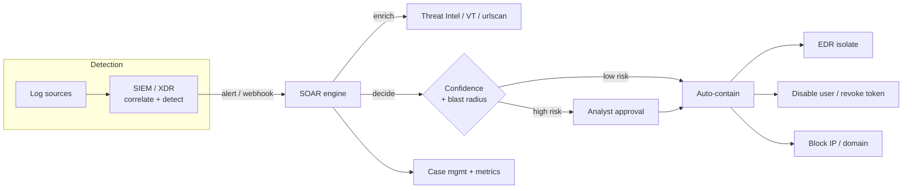
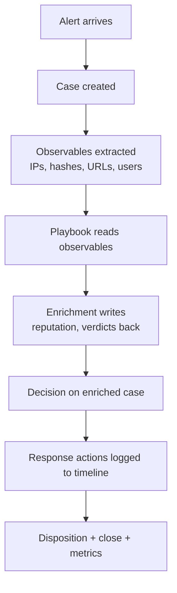
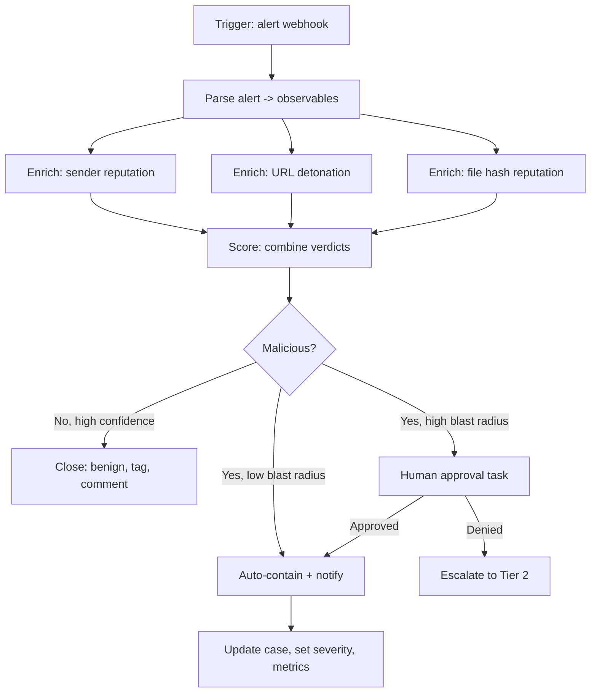
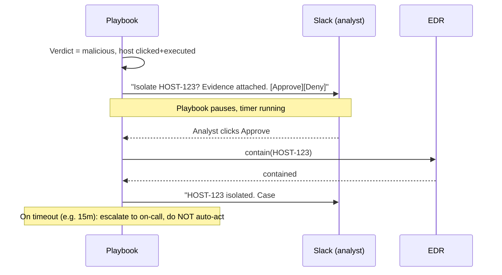
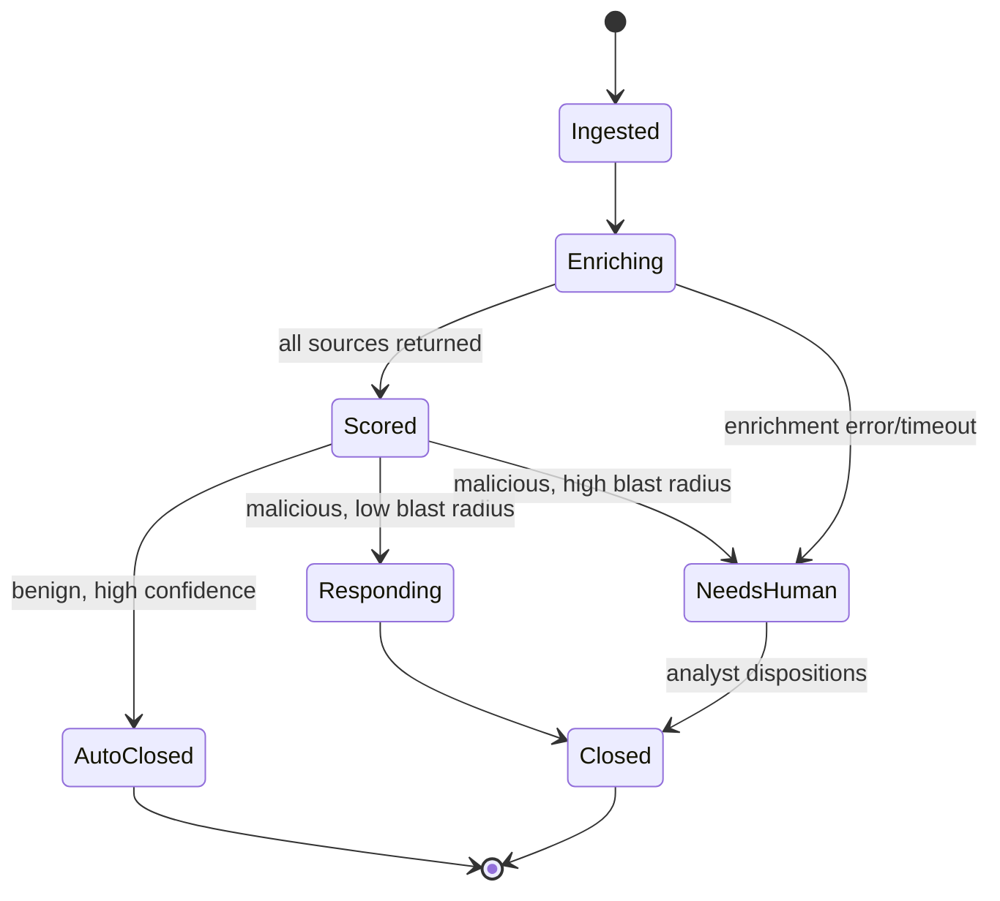
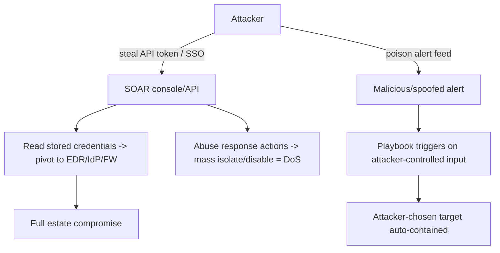

**Level:** Expert · **Track:** SOC & Blue Team · **Read time:** 215 min

This is Chapter 6 of the Detection Engineering notebook. The previous five chapters took you from writing portable Sigma rules, through the endpoint telemetry that feeds them, YARA for files and memory, tuned SPL and KQL queries, and finally mapping every one of those detections to MITRE ATT&CK so you can measure coverage honestly. Every one of those chapters ends the same way: a rule fires, an alert lands in a queue, and a human has to *do something about it*. This chapter is about that last mile — taking the alert the moment it appears and driving it through triage, enrichment, decision, containment, and closure with as little human toil as the risk allows. That discipline is called SOAR, and done well it is the difference between a SOC that drowns and a SOC that scales.

## Why This Matters

Walk into almost any security operations centre and you will find the same three numbers quietly eating the team alive: the volume of alerts, the fraction of them that are false positives, and the time it takes to close the real ones. A mid-size enterprise SIEM routinely emits **thousands of alerts per day**. Industry surveys have put the false-positive rate on raw SIEM alerts north of 40%, and analyst-reported figures of "we investigate maybe a quarter of what fires" are common. The human cost is brutal and well documented: alert fatigue, missed true positives buried under noise, twelve-month analyst burnout, and a mean-time-to-respond measured in hours or days for incidents where the attacker needed minutes.

SOAR — **Security Orchestration, Automation and Response** — exists to attack exactly this problem. The premise is simple: most of what a Tier‑1 analyst does on a given alert is *mechanical and repeatable*. Pull the sender's reputation. Detonate the URL. Check whether that hash is known-bad. Look up whether this user has logged in from that country before. Ask the user "did you really send this?" via a chat prompt. Every one of those steps is deterministic, API-driven, and identical across a hundred alerts of the same type. A machine can do them in three seconds; a human does them in fifteen minutes and gets bored by the tenth repetition. SOAR captures that workflow as a **playbook** — a coded, versioned, testable automation — and runs it the instant an alert arrives, so that by the time a human looks at the case it is already enriched, scored, and often already contained.

But — and this is the part that separates an engineer from someone who bought a platform — **automation amplifies whatever you point it at, including your mistakes**. A playbook that automatically disables user accounts will, the day it is fed a spoofed alert or a bad indicator, disable your CEO during a board meeting, or lock out an entire OU because someone put a wildcard where they meant a literal. Automated containment is a loaded weapon. The whole craft of this chapter is building playbooks that are fast *and* safe: enrichment fully automated, containment gated behind confidence thresholds and human approval where the blast radius is large, everything logged, everything reversible, and the platform itself hardened because a SOAR box holds god-mode credentials into every tool you own.

The same ethical framing as the rest of the notebook applies throughout: the offensive material here — how an adversary abuses or targets a SOAR platform — exists so you can defend it, and every "attacker" action is described against a lab you own.

By the end of this chapter you will be able to explain SOAR precisely and place it against SIEM and XDR; read a playbook the way you read code; design a phishing-triage playbook from trigger to closure; write real enrichment and containment integrations; build the whole thing hands-on on a free open-source stack (Shuffle + TheHive + Cortex); measure whether it actually helped with honest MTTA/MTTR math; and avoid the specific anti-patterns that have caused SOAR automations to become the incident.

---

## Part 1: What SOAR Actually Is — And What It Is Not

Let's define the term precisely, because "SOAR" is one of the most abused words in security marketing. The category was named by Gartner around 2017, consolidating three capabilities that had grown up separately:

- **Orchestration** — connecting disparate security tools so they can act in concert. Your SIEM, your EDR, your firewall, your identity provider, your ticketing system, your threat-intel platform and your email gateway were all built by different vendors, speak different APIs, and normally require a human to shuttle context between them. Orchestration is the plumbing that lets one system trigger another.
- **Automation** — executing a task with no human in the loop. "When an alert of type X arrives, look up the hash in VirusTotal" is automation. It replaces a manual, repetitive action with a machine action.
- **Response** — taking action that changes the state of the environment to contain or remediate a threat: isolating a host, disabling an account, blocking a domain, quarantining an email, revoking a session token.

Put together: **SOAR is the layer that takes an alert and drives a codified, multi-tool workflow — enriching it, deciding on it, and acting on it — with humans involved only where judgment or risk requires them.**

### SOAR vs SIEM vs XDR — the distinction that gets asked in every interview

These three get conflated constantly. The clean way to hold them apart is by their *primary job*:

| Capability | Primary job | Core question it answers | Analogy |
|---|---|---|---|
| **SIEM** (Splunk, Sentinel, Elastic, QRadar) | Collect, normalise, correlate logs; **detect** | "Did something suspicious happen?" | The smoke detector |
| **SOAR** (Cortex XSOAR, Splunk SOAR, Tines, Shuffle, TheHive+Cortex) | Orchestrate tools; **automate the response workflow** | "Now that it happened, what do we do — and can a machine do it?" | The sprinkler system + the fire-response checklist |
| **XDR** (CrowdStrike, SentinelOne, Defender XDR) | Unified detection **and** response within one vendor's telemetry (endpoint, identity, email, cloud) | "Detect and respond inside my estate, out of the box" | A smoke detector and sprinkler sold pre-wired as one unit |

The relationship in practice: the **SIEM detects and fires an alert**; the **SOAR ingests that alert and runs the playbook**; the playbook calls out to the EDR, the firewall, the IdP and the ticketing system to enrich and respond. XDR overlaps SOAR but is *bounded to one vendor's data and tools* — it is turnkey but closed. SOAR is the vendor-neutral orchestration layer that stitches a heterogeneous stack together, which is why large SOCs run both an XDR *and* a SOAR: the XDR handles the in-ecosystem case, the SOAR handles everything that has to cross tool boundaries.

**Security relevance:** if someone in an interview says "we replaced our SIEM with SOAR," they've misunderstood the stack. SOAR does not detect — it has no correlation engine of its own worth the name. It *consumes* detections. No SIEM/XDR feeding it, no alerts, no playbooks to run.



### The two philosophies: "SOAR-first" vs "detection-first"

There is a genuine strategic split in the field. One camp automates *response* — build big playbooks that take action. The other, increasingly influential, argues the higher-leverage automation is *triage enrichment*: don't try to auto-remediate, just make every alert arrive fully investigated so the human decision takes thirty seconds instead of fifteen minutes. Both are valid; the enrichment-first approach is lower-risk and where most teams should start, because enrichment is read-only and cannot break production. We build in exactly that order in this chapter: enrichment first, containment later and carefully.

---

## Part 2: The Anatomy of a SOAR Platform

Every SOAR platform — commercial (Cortex XSOAR, Splunk SOAR née Phantom, Tines, Torq, Swimlane) or open-source (Shuffle, TheHive+Cortex, StackStorm, n8n pressed into service) — is built from the same handful of primitives. Learn the primitives and every platform becomes a dialect you can pick up in a day.

### 2.1 Integrations / connectors

An **integration** (Cortex calls them "integrations," Shuffle calls them "apps," Splunk SOAR calls them "connectors") is a packaged wrapper around a third-party API. It exposes that tool's capabilities as **actions** the playbook can call. A VirusTotal integration exposes actions like `file-reputation`, `url-scan`, `domain-report`. An EDR integration exposes `isolate-host`, `unisolate-host`, `list-processes`, `get-file`. Under the hood each action is an authenticated HTTP call, but the platform abstracts auth, pagination, rate-limiting and error handling so the playbook author works in verbs, not in `curl`.

Integrations are configured with **credentials** — API keys, OAuth tokens, service-account passwords. This is the first security fact to internalise: **the SOAR platform is a credential vault holding privileged access into every security tool you own.** More on hardening that in Part 11.

### 2.2 Playbooks

A **playbook** is the automation itself — a directed graph of steps executed when a trigger fires. It is code, even when drawn as boxes-and-arrows in a visual editor. The visual editors compile to JSON/YAML you can and should store in git. Steps come in a few flavours, covered in Part 3.

### 2.3 Case / incident management

When an alert becomes something worth tracking, the SOAR opens a **case** (TheHive calls them "cases," XSOAR "incidents," Splunk SOAR "events/containers"). A case bundles the original alert, all the enrichment data, a timeline of every automated and manual action, the analyst's notes, the **observables** (IOCs) extracted, and the disposition. Good case management is what turns a pile of alerts into an auditable record and the raw material for metrics.

### 2.4 The data model — observables, artifacts and the "war room"

The connective tissue is a normalised data model. Every case carries **observables** (also called artifacts or IOCs): IPs, domains, URLs, file hashes, email addresses, usernames. Playbooks read observables from the case, enrich them, and write results back. Cortex XSOAR popularised the **"War Room"** — a per-incident chat-like log where every command, every output, and every analyst message is recorded in order, giving you a complete, replayable forensic trail of how the case was handled.



### 2.5 Where the platform sits

Architecturally, the SOAR is downstream of detection and upstream of action:

- **Inbound:** webhooks/APIs from the SIEM, XDR, email gateway, or a poller that pulls from a queue.
- **Internal:** the playbook engine, credential store, case DB, and (in scalable platforms) a worker pool that executes integration actions.
- **Outbound:** authenticated API calls to every tool it orchestrates.

Keep this topology in your head; it explains every performance and security property that follows.

---

## Part 3: Playbook Building Blocks — Reading Automation Like Code

A playbook is a program. It has the same primitives every program has, and reading one fluently is a core skill. Here are the building blocks, named the way most platforms name them.

### 3.1 Triggers

What starts the playbook. Common triggers:

- **Webhook / alert ingestion** — the SIEM POSTs an alert to a SOAR endpoint. The most common trigger in production.
- **Scheduled** — cron-like; e.g. "every 15 minutes, poll the phishing mailbox."
- **Manual** — an analyst clicks "Run playbook X on this case."
- **Sub-playbook call** — one playbook invokes another as a function (composition — the key to not repeating yourself).

### 3.2 Actions

A single call to an integration: "VirusTotal → file-reputation(hash)". The workhorse node. Actions have **inputs** (arguments, usually drawn from case observables or prior action outputs) and **outputs** (structured data written back into the playbook context).

### 3.3 Conditions / decisions

Branching. "If VirusTotal `positives` ≥ 5, go left (malicious); else go right (benign)." This is `if/else`, drawn as a diamond. Decisions are where **confidence thresholds** live, and getting the thresholds right is most of the safety of a playbook.

### 3.4 Loops / iteration

"For each URL in the email body, run url-scan." Playbooks iterate over lists of observables. Watch for the two classic bugs: forgetting to bound the loop (an email with 500 URLs melts your API quota) and race conditions when parallel branches write the same context key.

### 3.5 Data transforms

Between actions you reshape data: extract a field with a JMESPath/JSONPath expression, regex out URLs from a body, normalise a hash to lowercase, base64-decode an attachment. Cortex XSOAR calls these **transformers/filters**; every platform has an equivalent. This is where subtle bugs breed, so keep transforms small and testable.

### 3.6 Human-in-the-loop tasks

A deliberate pause: post a message to Slack/Teams/email with "Approve isolation of HOST-123? [Yes] [No]" and *wait* for a human to click before continuing. This is the single most important safety primitive in the whole toolkit. Any action whose blast radius is large or hard to reverse should sit behind one of these.

### 3.7 Notes, tags and context

Playbooks annotate the case as they go — set a severity, add a tag, write a summary comment. This is what makes the finished case readable to the human who picks it up.

Here is the canonical shape of a triage playbook expressed as a flow — memorise this skeleton; ninety percent of playbooks are variations on it:



---

## Part 4: Designing a Real Playbook — Phishing Triage, End to End

Phishing is the canonical first playbook for a reason: it is high-volume, highly repetitive, the enrichment steps are read-only and safe, and the ROI is enormous. Let's design one properly before we build it, because *design before you drag boxes* is the discipline that separates a maintainable automation from spaghetti.

### 4.1 The manual workflow we are encoding

Watch what a Tier‑1 analyst actually does with a user-reported phishing email:

1. Open the reported email from the phishing mailbox / abuse queue.
2. Extract: sender address, sender IP (from `Received` headers), reply-to, subject, all URLs in the body, all attachment hashes.
3. Check the sender domain age and reputation (a domain registered three days ago is a red flag).
4. Check each URL: is it known-bad? Detonate it in a sandbox / urlscan; is it a credential-harvest page?
5. Check each attachment hash against VirusTotal and internal intel.
6. Check whether other users received the same email (campaign scoping) — search the mail gateway for subject/sender.
7. Decide: benign / spam / malicious.
8. If malicious: purge the email from all mailboxes, block the sender and URLs at the gateway, and if anyone *clicked*, check the endpoint and consider isolation.
9. Reply to the reporting user, close the case, record the disposition.

Every one of steps 2–6 is mechanical. Steps 7–8 need judgment and carry blast radius. That maps cleanly onto "automate enrichment, gate response."

### 4.2 The design decisions

- **Trigger:** poll the abuse mailbox every 5 minutes, or (better) have the "report phishing" button POST directly to a SOAR webhook.
- **Enrichment set:** sender reputation, domain age (whois), URL verdict (urlscan.io + VirusTotal), attachment hash reputation (VirusTotal), campaign scope (mail-gateway search).
- **Scoring:** combine the verdicts into a single confidence. Don't trust any one source; weight them.
- **Decision thresholds:** define *benign*, *suspicious*, *malicious* bands, and what each does.
- **Response, tiered by blast radius:**
  - Purge email from mailboxes — moderate blast radius, but reversible (soft-delete) → automate above a high confidence threshold, notify.
  - Block sender/URL at gateway — low blast radius, reversible → automate.
  - Isolate an endpoint (someone clicked and executed) — high blast radius → human approval.
  - Disable the clicking user's account — very high blast radius → human approval, never auto.
- **Closure:** reply to the reporter with a templated message, set disposition, tag with the campaign ID.

### 4.3 Scoring logic — don't trust a single feed

A robust verdict combines sources with weights rather than trusting the first hit. A minimal scoring function in pseudo-Python that we'll implement for real in the lab:

```python
def score_email(enrichment: dict) -> tuple[str, int]:
    """Return (verdict, confidence 0-100) from combined enrichment."""
    score = 0

    # VirusTotal URL/file positives are strong signals
    vt_pos = enrichment.get("vt_max_positives", 0)
    if vt_pos >= 5:
        score += 50
    elif vt_pos >= 1:
        score += 20

    # urlscan verdict
    if enrichment.get("urlscan_malicious"):
        score += 30

    # freshly-registered sender domain
    age_days = enrichment.get("domain_age_days", 9999)
    if age_days < 7:
        score += 25
    elif age_days < 30:
        score += 10

    # sender authentication failures (SPF/DKIM/DMARC)
    if enrichment.get("dmarc_fail"):
        score += 15

    # campaign scope amplifies confidence
    if enrichment.get("recipients_count", 1) > 10:
        score += 10

    score = min(score, 100)
    if score >= 70:
        return ("malicious", score)
    if score >= 35:
        return ("suspicious", score)
    return ("benign", score)
```

Note the design: no single source can single-handedly cross the malicious threshold except a strong VirusTotal hit combined with anything else. That is deliberate — it makes the playbook resilient to one noisy feed. **Blue team usage:** tune these weights against your own historical labelled data; the numbers above are a starting point, not gospel.

---

## Part 5: Enrichment — The Safe, High-Value Half of Automation

Enrichment is read-only: it gathers context without changing anything in production. It is where you should invest first because it delivers most of the analyst-time savings at near-zero risk. Let's build the real integrations, teaching each external tool/API from scratch the first time it appears.

### 5.1 VirusTotal — reputation for hashes, URLs, domains, IPs

**What it is:** VirusTotal (owned by Google/Chronicle) aggregates 70+ antivirus engines and URL/domain blocklists. You submit a hash, URL, domain or IP and get back how many engines flag it and rich metadata. It is the single most-used enrichment source in SOC automation. The public API is free but rate-limited (historically 4 requests/min, 500/day); enterprise keys lift that.

**The core call** — file (hash) reputation via the v3 API:

```bash
# Look up a file hash reputation. VT_API_KEY is your API key.
curl -s --request GET \
  --url "https://www.virustotal.com/api/v3/files/44d88612fea8a8f36de82e1278abb02f" \
  --header "x-apikey: ${VT_API_KEY}" | jq '{
     name: .data.attributes.meaningful_name,
     malicious: .data.attributes.last_analysis_stats.malicious,
     suspicious: .data.attributes.last_analysis_stats.suspicious,
     undetected: .data.attributes.last_analysis_stats.undetected,
     first_seen: .data.attributes.first_submission_date
   }'
```

Realistic output for the EICAR test file hash above:

```json
{
  "name": "eicar.com",
  "malicious": 63,
  "suspicious": 0,
  "undetected": 3,
  "first_seen": 1400000000
}
```

Flag-by-flag on the `curl`: `-s` silences the progress meter so `jq` gets clean JSON; `--request GET` is explicit (VT v3 uses GET for lookups, POST for submissions); `--url` is the resource path where the last segment is the SHA-256/MD5/SHA-1; `--header "x-apikey: ..."` is VT's auth scheme (not a bearer token — a custom header). The `jq` filter reshapes the deeply-nested response into just the fields the playbook cares about — `last_analysis_stats.malicious` is the number that feeds `vt_max_positives` in our scorer.

**Pitfall:** the *free* VT key is rate-limited hard. A phishing playbook that fires VT on every URL in every email will exhaust 500 lookups before lunch. Cache verdicts (a hash's reputation rarely changes minute-to-minute) and batch. **Bug-bounty aside:** VT's own API history has been a source of *information leaks* — over-sharing internal file names and URLs submitted by a company can reveal infrastructure; treat what you submit to public VT as public.

### 5.2 urlscan.io — detonate a URL and see what it really is

**What it is:** urlscan.io loads a URL in a sandboxed browser and records everything — the DOM, the screenshot, every network request, the final landing domain after redirects, and a verdict. It is how you tell a benign shortener from a credential-harvest page without risking your own browser.

Submit a scan, then fetch the result (scans are asynchronous — submit returns a UUID, you poll for the result):

```bash
# 1. Submit the URL for scanning (visibility: unlisted so it isn't public)
UUID=$(curl -s -X POST "https://urlscan.io/api/v1/scan/" \
  -H "API-Key: ${URLSCAN_API_KEY}" \
  -H "Content-Type: application/json" \
  -d '{"url": "http://malicious-login-example.test/office365", "visibility": "unlisted"}' \
  | jq -r '.uuid')

echo "Scan queued: ${UUID}"
sleep 20   # give the sandbox time to render

# 2. Retrieve the result
curl -s "https://urlscan.io/api/v1/result/${UUID}/" | jq '{
   verdict_malicious: .verdicts.overall.malicious,
   score: .verdicts.overall.score,
   final_url: .page.url,
   final_domain: .page.domain,
   screenshot: .task.screenshotURL
 }'
```

Realistic output:

```json
{
  "verdict_malicious": true,
  "score": 85,
  "final_url": "http://malicious-login-example.test/office365/login.php",
  "final_domain": "malicious-login-example.test",
  "screenshot": "https://urlscan.io/screenshots/<uuid>.png"
}
```

**Security relevance:** the screenshot is gold — an analyst glancing at a rendered fake Office 365 login page reaches a verdict in one second. **A critical gotcha:** urlscan's *public* visibility mode makes your submission searchable by anyone, and researchers have repeatedly found sensitive URLs — password-reset links, internal SharePoint links, Docusign links with tokens — sitting in public urlscan history because a SOAR playbook submitted them with default visibility. **Always submit as `unlisted` or `private`.** This is a real, recurring data-leak class and exactly the kind of thing a bug-bounty hunter or a red teamer will grep urlscan for.

### 5.3 whois / domain age — the freshly-registered-domain signal

Newly registered domains are disproportionately malicious. Compute domain age from the WHOIS creation date:

```bash
# Extract creation date and compute age in days
DOMAIN="malicious-login-example.test"
CREATED=$(whois "$DOMAIN" | grep -iE "Creation Date|created:" | head -1 | grep -oE '[0-9]{4}-[0-9]{2}-[0-9]{2}')
if [ -n "$CREATED" ]; then
  AGE=$(( ( $(date +%s) - $(date -d "$CREATED" +%s) ) / 86400 ))
  echo "Domain ${DOMAIN} created ${CREATED} -> ${AGE} days old"
fi
```

In a SOAR you'd use a whois integration or an RDAP API rather than shelling out, but the logic is identical: parse the creation date, subtract from now, feed `domain_age_days` into the scorer. A domain under 7 days old is a strong phishing signal.

### 5.4 GeoIP and impossible-travel enrichment

For login-based alerts, resolve the source IP to a geolocation and compare against the user's history. "This user authenticated from Lagos 20 minutes after authenticating from Chicago" is impossible travel — a classic account-takeover signal (ATT&CK **T1078**, Valid Accounts). MaxMind's GeoLite2 database or an IP-intel API gives you country/ASN; your identity logs give you the previous location.

### 5.5 Threat-intel platform lookup (MISP)

**MISP** (Malware Information Sharing Platform) is the open-source threat-intel backbone many SOCs run. A playbook checks each observable against MISP: "is this IP/hash/domain in any of our intel feeds, and if so, tagged how?" A hit against a feed tracking a known intrusion set instantly raises severity and, importantly, attaches *attribution context* the analyst needs. The MISP REST API call is a `POST /attributes/restSearch` with the observable value; the response tells you which events (campaigns) reference it.

All five of these are read-only. None can break production. This is why you automate enrichment aggressively and containment cautiously.

---

## Part 6: Response & Containment — The Loaded Weapon

Now the dangerous half. Response actions *change the state of the environment*. Done right they stop an attacker in seconds; done wrong they are a self-inflicted denial-of-service. The engineering here is entirely about **guardrails**.

### 6.1 The containment action catalogue

| Action | Tool | Blast radius | Reversible? | Automate unattended? |
|---|---|---|---|---|
| Block IP/domain at firewall/proxy | Palo Alto, Zscaler, Cloudflare | Low (one indicator) | Yes | Yes, above confidence threshold |
| Quarantine / purge email | M365, Google Workspace | Moderate (soft-delete) | Yes | Yes, high confidence |
| Isolate endpoint (network contain) | CrowdStrike, SentinelOne, Defender | High (host offline) | Yes | Gate behind approval |
| Kill process / delete file | EDR | Moderate–high | Partly | Gate behind approval |
| Disable user account | Entra ID, AD, Okta | Very high | Yes | **Human approval, never auto** |
| Revoke sessions / reset creds | IdP | High | Yes | Gate behind approval |
| Block at WAF / rate-limit | Cloudflare, AWS WAF | Varies | Yes | Case-by-case |

The pattern is unmissable: **the higher the blast radius, the more human judgment gates it.** The two cheapest, safest, highest-value auto-response actions are *block a single malicious indicator* and *purge a confirmed-malicious email* — both narrow, both reversible.

### 6.2 Endpoint isolation — the canonical response action, taught from scratch

**What "isolation" means:** modern EDR agents can put a host into *network containment* — the agent drops all network traffic except the connection back to the EDR console. The box is frozen in place: the attacker loses their C2 channel and lateral-movement paths, but you retain full remote forensic access through the agent. It is the single most valuable response action in the arsenal because it is fast, effective, and fully reversible (un-isolate restores connectivity).

A CrowdStrike Falcon isolate via API (the real endpoint shape):

```bash
# Contain a host by its Falcon device ID.
curl -s -X POST "https://api.crowdstrike.com/devices/entities/devices-actions/v2?action_name=contain" \
  -H "Authorization: Bearer ${FALCON_TOKEN}" \
  -H "Content-Type: application/json" \
  -d '{"ids": ["'"${DEVICE_ID}"'"]}' | jq '.resources[0].id, .errors'
```

`action_name=contain` isolates; `action_name=lift_containment` reverses it. The `ids` array is the device to contain. **Red team usage:** an attacker who has compromised the SOC's SOAR or EDR console can *weaponise* this — mass-isolating every endpoint is a devastating destructive action, which is exactly why the SOAR's EDR credentials must be tightly scoped and monitored (Part 11).

### 6.3 The human-in-the-loop gate — the most important pattern in the chapter

For any high-blast-radius action, the playbook posts an approval request and *waits*. In Slack this is an interactive message with Approve/Deny buttons; the playbook blocks on the response (with a timeout that escalates if nobody answers). Conceptually:



The three rules of the approval gate:

1. **Give the human everything they need to decide in the prompt** — the evidence, the verdict, the confidence, the exact action and its target. An approval prompt that just says "Approve action?" trains people to click yes reflexively.
2. **Default to *inaction* on timeout.** If nobody answers, escalate to a human — never silently proceed with the destructive action, and never silently drop it either.
3. **Log the approver.** Who approved what, when, is an audit requirement and a post-incident necessity.

### 6.4 Guardrails you bake into every response playbook

- **Allowlists / exclusions:** never let a playbook disable break-glass admin accounts, isolate domain controllers, or block your own corporate IP ranges. Maintain an exclusion list checked *before* every action. This one guardrail prevents most self-inflicted outages.
- **Confidence thresholds:** action only above a score you've validated against historical data.
- **Rate limits / circuit breakers:** "if this playbook is about to isolate more than N hosts in M minutes, stop and page a human." A playbook mass-acting is either a real worm *or* a bug feeding it bad indicators — either way a human must look.
- **Dry-run mode:** every response playbook should have a mode that logs "would have isolated HOST-123" without doing it, for testing in production safely.
- **Reversibility first:** prefer reversible actions (isolate, soft-delete, disable) over irreversible ones (delete file, hard-purge).

**IR use case:** during a live incident, the value of automated containment is *speed at scale* — isolating 40 beaconing hosts in ten seconds instead of an analyst RDP-ing to each. The circuit breaker is what lets you trust that speed.

---

## Part 7: Hands-On Lab — Build a Phishing Triage Playbook on Shuffle + TheHive + Cortex

Time to build it for real on a completely free, open-source stack. We'll use:

- **TheHive** — open-source case management (the "SOAR case DB + war room").
- **Cortex** — TheHive's analyzer/responder engine (the "integration runtime").
- **Shuffle** — open-source orchestration/playbook engine (the "playbook graph").

These three together are the classic free SOAR stack. We teach each from scratch.

### 7.1 Lab environment

A single Ubuntu 22.04 VM (or Kali) with Docker. **Lab-scoped, isolated, on hardware you own** — standard notebook ethics.

```bash
# Verify prerequisites
docker --version          # Docker 24+
docker compose version    # Compose v2

# Create an isolated project dir
mkdir -p ~/soar-lab && cd ~/soar-lab
```

### 7.2 Stand up TheHive + Cortex

TheHive needs Elasticsearch; Cortex shares it. A minimal `docker-compose.yml`:

```yaml
version: "3"
services:
  elasticsearch:
    image: elasticsearch:7.17.9
    environment:
      - discovery.type=single-node
      - ES_JAVA_OPTS=-Xms512m -Xmx512m
      - xpack.security.enabled=false
    ulimits:
      memlock: { soft: -1, hard: -1 }
    ports: ["9200:9200"]

  cortex:
    image: thehiveproject/cortex:3.1.7
    depends_on: [elasticsearch]
    ports: ["9001:9001"]

  thehive:
    image: strangebee/thehive:5.2
    depends_on: [elasticsearch]
    ports: ["9000:9000"]
    command:
      - --no-config
      - --no-config-secret
```

```bash
docker compose up -d
docker compose ps        # confirm all three are 'running'/'healthy'
```

Expected:

```
NAME                    STATUS         PORTS
soar-lab-cortex-1       Up (healthy)   0.0.0.0:9001->9001/tcp
soar-lab-elasticsearch  Up (healthy)   0.0.0.0:9200->9200/tcp
soar-lab-thehive-1      Up (healthy)   0.0.0.0:9000->9000/tcp
```

Browse to `http://localhost:9001` (Cortex) and `http://localhost:9000` (TheHive), complete the first-run admin setup on each, and create an organisation + a user with an **API key** in both. Save those keys — the playbook uses them.

### 7.3 Configure a Cortex analyzer (VirusTotal)

In Cortex, an **analyzer** is exactly the enrichment integration from Part 5, packaged. Enable the **VirusTotal_GetReport** analyzer, paste your VT API key into its config, and set the rate limit to match your key. Test it from the Cortex UI: run VirusTotal_GetReport on the EICAR hash `44d88612fea8a8f36de82e1278abb02f` and confirm you get a report back with a high malicious count. You've now got working enrichment.

Cortex analyzers are just Python programs following a contract; here's the shape of a minimal custom analyzer so the "tool from scratch" box is fully ticked:

```python
#!/usr/bin/env python3
# my_domain_age.py — a minimal Cortex analyzer computing domain age
from cortexutils.analyzer import Analyzer
import whois, datetime

class DomainAgeAnalyzer(Analyzer):
    def run(self):
        domain = self.get_data()          # the observable value
        w = whois.whois(domain)
        created = w.creation_date
        if isinstance(created, list):
            created = created[0]
        age_days = (datetime.datetime.now() - created).days
        self.report({"domain": domain, "age_days": age_days,
                     "suspicious": age_days < 7})

    def summary(self, raw):
        level = "malicious" if raw["suspicious"] else "info"
        return {"taxonomies": [{
            "namespace": "DomainAge", "predicate": "days",
            "value": str(raw["age_days"]), "level": level}]}

if __name__ == "__main__":
    DomainAgeAnalyzer().run()
```

The contract: read the observable with `get_data()`, do work, emit results with `report()`, and provide a one-line `summary()` taxonomy that colours the observable in TheHive (green `info` / red `malicious`). Ship it with a JSON descriptor and Cortex picks it up. This is *exactly* how every enrichment integration on every platform works under the abstraction.

### 7.4 Stand up Shuffle

```bash
cd ~/soar-lab
git clone https://github.com/Shuffle/Shuffle
cd Shuffle
# Shuffle ships its own compose file and an opensearch dependency
mkdir -p shuffle-database && sudo chown -R 1000:1000 shuffle-database
docker compose up -d
docker compose ps
```

Browse to `https://localhost:3443`, register the first admin user. Shuffle's UI is a visual playbook editor whose workflows serialise to JSON.

### 7.5 Build the playbook in Shuffle

Create a workflow **"Phishing Triage."** Wire it as follows (each node is a Shuffle app action):

1. **Trigger — Webhook.** Shuffle gives you a webhook URL; your mail-report button / SIEM POSTs the reported email JSON here. For the lab, we'll fire it manually with `curl`.

2. **Parse — extract observables.** A small Python-code node that pulls sender, URLs and attachment hashes out of the payload:

```python
# Shuffle code node: input is the webhook body as `email`
import re, json
email = json.loads(get_input("email"))
body = email.get("body", "")
urls = re.findall(r'https?://[^\s"<>]+', body)
result = {
    "sender": email.get("from"),
    "sender_ip": email.get("sender_ip"),
    "subject": email.get("subject"),
    "urls": list(set(urls)),
    "hashes": email.get("attachment_sha256", []),
    "recipients_count": email.get("recipients_count", 1),
}
return result
```

3. **Enrich — VirusTotal (via Cortex).** For each hash and URL, call the Cortex analyzer using Shuffle's **TheHive/Cortex app** (or a generic HTTP node hitting Cortex's `/api/analyzer/.../run`). Collect the max `malicious` count into `vt_max_positives`.

4. **Enrich — urlscan.** For each URL, call the urlscan app (submit → wait → result) and collect `urlscan_malicious`.

5. **Enrich — domain age.** Call the custom analyzer from 7.3 on the sender domain → `domain_age_days`.

6. **Score — decision node.** A Python node running the `score_email()` function from Part 4.3 over the collected enrichment, returning `(verdict, confidence)`.

7. **Branch on verdict:**
   - **benign** → create a low-severity TheHive case tagged `phishing/benign`, reply to reporter, close.
   - **suspicious** → create a medium case, assign to Tier‑1, no auto-action.
   - **malicious** → create a high case, **auto-block** the URLs/sender at the (lab-simulated) gateway, and post a **Slack approval** for anything higher-blast-radius (endpoint isolation if a click is detected).

8. **Create the case in TheHive** with all observables and enrichment attached, so the analyst has a fully-populated war room.

### 7.6 Fire it and read the output

Trigger the webhook with a realistic malicious sample:

```bash
curl -s -X POST "https://localhost:3443/api/v1/hooks/webhook_<id>" \
  -H "Content-Type: application/json" \
  -d '{
    "from": "billing@micros0ft-support.test",
    "sender_ip": "185.234.219.10",
    "subject": "Your invoice is overdue - action required",
    "body": "Please verify at http://micros0ft-support.test/office365/login.php",
    "attachment_sha256": ["44d88612fea8a8f36de82e1278abb02f"],
    "recipients_count": 23
  }'
```

Realistic run summary (as it appears in Shuffle's execution view and TheHive's timeline):

```
[trigger]  webhook received: subject="Your invoice is overdue..."
[parse]    sender=billing@micros0ft-support.test urls=1 hashes=1 recipients=23
[vt]       hash 44d8...02f -> malicious=63/66        (vt_max_positives=63)
[urlscan]  http://micros0ft-support.test/... -> malicious=true score=88
[whois]    micros0ft-support.test created 2 days ago -> age_days=2 (suspicious)
[score]    +50(vt) +30(urlscan) +25(age<7) +10(recipients>10) = 100 -> MALICIOUS
[branch]   verdict=malicious confidence=100
[respond]  blocked sender + 1 URL at gateway (reversible)  [auto, logged]
[case]     TheHive case #12 opened, severity=High, 3 observables attached
[approval] Slack: "Isolate any host that clicked? (no clicks detected)" -> N/A
[reply]    templated response sent to reporter; case tagged phishing/campaign-typosquat
```

The typosquat `micros0ft-support.test` (zero for the "o"), the 2-day-old domain, the 63/66 VT hits, and the 23-recipient blast all combine to a confidence of 100 with zero human toil up to the point of decision. The analyst opens case #12 and finds it already investigated. **That** is the payoff.

### 7.7 Verify the safety behaviour

Now prove the guardrails work — this is the step most people skip and it is the most important:

- Fire the webhook with a *benign* newsletter → confirm verdict `benign`, no response action, case auto-closed.
- Put a domain controller's hostname in a simulated "isolate" path → confirm the exclusion list **blocks** the action and pages instead.
- Fire 10 malicious emails in a burst → confirm the circuit breaker trips at your threshold and stops auto-blocking, escalating to a human.

If all three behave, you have a playbook that is fast *and* safe. If any misbehaves, you have a future outage. Fix before you trust it.

---

## Part 8: Case Management, Metrics, and Proving It Worked

Automation you can't measure is faith, not engineering. The SOAR's case data is the raw material for the metrics that justify the programme and — honestly measured — tell you where it's failing.

### 8.1 The core SOC metrics

| Metric | Definition | What good automation does to it |
|---|---|---|
| **MTTA** (Mean Time To Acknowledge) | Alert fired → analyst/automation started work | Drops to near-zero: the playbook starts instantly |
| **MTTR** (Mean Time To Respond/Resolve) | Alert fired → contained/closed | Drops sharply for automatable alert types |
| **Alerts auto-closed** | % of alerts resolved with no human touch | Rises — the headline efficiency number |
| **False-positive rate** | Benign alerts / total | Automation surfaces it; enrichment can lower it |
| **Analyst touch time** | Human minutes per case | The number that translates directly to headcount/cost |
| **Dwell time** | Compromise → detection | Faster response shrinks the tail |

### 8.2 Measuring honestly — the traps

- **Don't count "playbook ran" as "incident resolved."** A playbook that enriches and then dumps to a human hasn't resolved anything; it's improved MTTA and touch time, which is real, but it's not auto-resolution. Report the two separately.
- **Watch the false-negative cost of auto-close.** If you auto-close "benign," some real attacks will be auto-closed. Sample your auto-closed cases (e.g. re-review 2% at random) to measure that leakage. An automation that quietly closes true positives is worse than no automation.
- **Attribute time savings conservatively.** "We saved 15 minutes × 4,000 phishing alerts/month = 1,000 analyst-hours" is the kind of claim that gets a programme funded — but only count alert types the playbook *actually fully handles*, and only the steps it actually replaced.

### 8.3 The metric that matters most: touch time on true positives

The strategic goal isn't "close alerts faster" — it's **free human analysts to spend their limited attention on the hard, novel, high-consequence cases** by having machines eat the repetitive volume. Track analyst touch-time on true-positive incidents; if automation is working, humans spend more of their time on genuinely interesting cases and less on triage drudgery. That's the honest north star, and it's what you put in the promotion packet.

---

## Part 9: Advanced Orchestration Patterns

Once the basics work, these patterns separate a toy from a production programme.

### 9.1 Sub-playbooks and DRY

Enrichment for an IP (GeoIP + reputation + intel lookup) is needed by the phishing playbook, the impossible-travel playbook, and the malware playbook. Write it **once** as a sub-playbook and call it from all three. When the intel source changes, you fix one place. Composition is the difference between a maintainable library of playbooks and a hundred copy-pasted variants that drift.

### 9.2 Data-driven playbooks (config over code)

Hard-coding thresholds and exclusions into playbook graphs makes them brittle. Better: read thresholds, allowlists and templated responses from a config store (a data table in the platform, or a git-tracked YAML). Changing a threshold becomes a config edit, not a playbook redeploy — and it's reviewable in a pull request.

### 9.3 Version control and CI for playbooks

Playbooks are code; treat them as code. Export the JSON/YAML, commit it to git, review changes in pull requests, and — the advanced move — run playbooks against a **test harness** of recorded sample alerts in CI so a change that breaks the phishing flow fails the build before it ships. Cortex XSOAR, Tines and Shuffle all support exporting definitions for exactly this.

### 9.4 Idempotency and deduplication

An alert can arrive twice (SIEM retries, duplicate detections). A playbook that isolates a host must be **idempotent** — running it twice must not do harm. Dedup on a stable key (alert ID, observable+timeframe), and make actions check current state before acting ("is this host already contained? then skip").

### 9.5 Timeouts, retries and failure handling

External APIs fail. Every action needs a timeout and a bounded retry with backoff, and the playbook needs a *defined behaviour on failure* — critically, **fail safe**: if enrichment errors out, the playbook must not fall through to "benign, auto-close." Unknown must route to a human, never to silent dismissal.



---

## Part 10: Anti-Patterns — How SOAR Becomes the Incident

Learn these by name; each has caused a real outage somewhere.

- **Over-automation of high-blast-radius actions.** Auto-disabling accounts or auto-isolating on a single low-confidence signal. The failure mode is a spoofed or mis-attributed alert triggering a self-inflicted DoS. Fix: blast-radius-tiered gating (Part 6).
- **The runaway loop.** A playbook that processes a queue and, on error, re-queues the item — spinning forever, hammering an API, running up cloud/API bills or triggering the very rate-limits that then break other playbooks. Fix: bounded retries, circuit breakers, dead-letter queues.
- **The trust-one-feed verdict.** A single noisy intel feed flips to a false verdict and the playbook acts on it wholesale. Fix: multi-source scoring (Part 4.3).
- **Fail-open on error.** Enrichment throws, the `else` branch is "benign," true positives get auto-closed silently. Fix: unknown → human, always.
- **Credential sprawl.** The SOAR holds admin creds into everything with no scoping, no rotation, no monitoring. Fix: least-privilege service accounts, per-integration scoping, secret rotation, and alerting on the SOAR's own API usage (Part 11).
- **Un-versioned spaghetti.** Playbooks edited live in a GUI by many hands, no git, no review, no test — until one change silently breaks triage and nobody notices for a week. Fix: export to git, PR review, CI tests.
- **Automation theatre.** Impressive-looking playbooks that enrich beautifully and then… dump to a human who still does everything. Measure touch time; if it didn't drop, the automation is decorative.
- **No dry-run / no rollback.** Shipping a response playbook you've never run in a safe mode, with no way to reverse what it did. Fix: dry-run mode and reversible-first action design.

---

## Part 11: Detection & Defense Angle — Securing the SOAR Itself

This is the consolidated defensive section. The uncomfortable truth: **the SOAR platform is one of the highest-value targets in your entire estate.** It holds privileged credentials into your EDR, firewall, identity provider, and cloud — and it can *take destructive action at scale by design*. An attacker who owns your SOAR owns your ability to respond, and gains a ready-made tool for mass-destruction (mass-isolate, mass-disable, mass-delete). Defending it is not optional.

### 11.1 The SOAR threat model



### 11.2 Hardening checklist

- **Least-privilege integration credentials.** The SOAR's EDR account should have *only* the actions your playbooks use (contain/uncontain, read), not full console admin. Scope every integration credential to the minimum. This one control turns "SOAR compromise = estate compromise" into "SOAR compromise = limited blast radius."
- **Secret storage and rotation.** Store integration credentials in a vault (HashiCorp Vault, cloud KMS), not in plaintext playbook config. Rotate regularly. Never commit secrets to the git repo where you version playbooks — scan the repo for them.
- **Strong auth on the platform.** SSO + phishing-resistant MFA on every human account; scoped, rotated API tokens for machine access; no shared logins.
- **Monitor the monitor.** Feed the SOAR's *own* audit log back into the SIEM and write detections on it: a playbook edited outside change windows, a spike in isolate/disable actions, an integration credential used from a new IP, a new admin user, a playbook exported/downloaded. **The SOAR watching everything must itself be watched.** (Map these to ATT&CK per Chapter 5 — credential access and impact techniques against the security tooling.)
- **Validate playbook inputs.** Alerts are attacker-influenceable data. If an attacker can craft an alert (spoof a log line, poison a detection input), they can steer a playbook. Treat alert fields as untrusted: validate observables, never pass raw alert content into a shell/eval, and never let alert-controlled data choose the *target* of a destructive action without a human check. **This is a genuine injection surface** — a code node that does `eval(alert_field)` or builds a shell command from an unsanitised alert body is a remote-code-execution primitive inside your most privileged box. (The bug-bounty parallel is exact: it's SSRF/command-injection, just aimed at internal tooling.)
- **Change control and review.** Playbook changes go through PR review; production playbooks are protected; a break-glass process exists for emergencies but is logged and reviewed after.
- **Circuit breakers as a security control, not just a safety one.** The rate limit that stops a buggy playbook mass-isolating is the *same* control that stops a compromised playbook doing it maliciously. Build it once; it serves both.

### 11.3 Detection content for the SOAR

Concretely, write these detections (in the Sigma/SPL/KQL you learned in earlier chapters):

- Response action volume anomaly: `count(isolate OR disable OR block) by playbook, 10m > threshold`.
- Playbook definition changed outside a change window.
- SOAR service-account credential authenticating from an unexpected ASN/geo.
- New integration added or credential added to the platform.
- Human approval task approved by an account that is itself flagged/compromised.

**Red team usage (for defenders to anticipate):** a mature red team targeting a SOC will look specifically for the SOAR — its webhooks (often unauthenticated and internet-adjacent), its git repo of playbooks (secrets!), and its service accounts. Assume they will, and instrument accordingly.

---

## Part 12: A Practical Playbook Catalogue

Beyond phishing, here are the playbooks that deliver the most value in a typical SOC, in rough priority order. Each follows the same enrich → score → tiered-response skeleton.

| Playbook | Trigger | Auto (read-only) | Gated response |
|---|---|---|---|
| **Phishing triage** | Reported email / gateway alert | sender/URL/hash/domain-age enrichment, campaign scope | purge email, block sender (auto); isolate on click (approval) |
| **Malware on endpoint** | EDR detection | hash reputation, process tree, intel lookup | isolate host (approval), kill process |
| **Impossible travel / ATO** | IdP sign-in anomaly (T1078) | GeoIP, device, prior-login history | revoke sessions + force MFA re-auth (approval) |
| **Brute force / password spray** | Auth-failure spike (T1110) | source IP intel, targeted accounts | block source IP (auto), lock targeted account (approval) |
| **Suspicious cloud IAM change** | CloudTrail/Activity alert | who/what/when enrichment, is-this-normal | revert change (approval), disable key |
| **C2 beacon / suspicious egress** | Network/proxy detection | domain age, intel, JA3 | block domain (auto), isolate host (approval) |
| **DLP / data exfil** | DLP alert | user context, data sensitivity | block transfer, disable share (approval) |
| **New-host / rogue-asset** | Asset-discovery alert | scan, ownership lookup | quarantine VLAN (approval) |

Start with phishing (highest volume, safest enrichment), then malware and ATO. Resist the urge to build twenty playbooks at once — three that are well-tuned and trusted beat twenty half-built ones nobody trusts enough to leave un-babysat.

---

## Part 13: Final Revision / Summary

The one-screen mental model to walk away with:

- **SOAR = orchestration + automation + response.** It does *not* detect; it consumes detections from SIEM/XDR and drives a coded, multi-tool workflow to enrich, decide, and act.
- **The primitives are universal:** integrations (API wrappers → actions), playbooks (graphs of triggers/actions/decisions/loops/human-tasks), case management (the war room), and a normalised observable data model. Learn them once, apply on any platform.
- **Automate enrichment aggressively — it's read-only and safe.** VirusTotal, urlscan (unlisted!), whois/domain-age, GeoIP, MISP. Combine sources with weighted scoring; never trust one feed.
- **Automate response cautiously, tiered by blast radius.** Block-indicator and purge-email are cheap, reversible, auto-able. Isolate/disable/revoke are gated behind human approval with full evidence in the prompt, default-to-inaction on timeout, and a logged approver.
- **Guardrails are the craft:** exclusion allowlists (never touch DCs/break-glass accounts), confidence thresholds, circuit breakers, dry-run mode, reversible-first, fail-safe on error (unknown → human, never → auto-close).
- **Measure honestly:** MTTA and touch-time drop are real wins; don't conflate "playbook ran" with "resolved"; sample auto-closed cases for false negatives.
- **The SOAR is a top-tier target** — it's a credential vault with a mass-destruction button. Least-privilege every integration, vault + rotate secrets, MFA the console, validate alert inputs (they're an injection surface), and feed the SOAR's own audit log into detections. The monitor must be monitored.
- **Playbooks are code:** version them in git, review changes, test in CI, keep them DRY with sub-playbooks, make them idempotent.

If you remember one sentence: **automate the boring, gate the dangerous, measure the truth, and guard the automator.**

---

## Part 14: Cheat Sheet / Quick Reference

**Concept map**

| Term | One-liner |
|---|---|
| SOAR | Orchestrate tools + automate + respond; consumes alerts |
| Integration/app/connector | Packaged API wrapper exposing actions |
| Playbook | Graph of trigger → actions → decisions → response |
| Observable/artifact/IOC | IP, domain, URL, hash, user attached to a case |
| War room | Per-incident ordered log of every action/output |
| Analyzer (Cortex) | Read-only enrichment integration |
| Responder (Cortex) | State-changing response integration |
| Human-in-the-loop | Approval task that pauses the playbook |
| Circuit breaker | Stop auto-action above N actions / M minutes |

**Enrichment API quick calls**

```bash
# VirusTotal file reputation
curl -s "https://www.virustotal.com/api/v3/files/<hash>" -H "x-apikey: $VT" \
  | jq '.data.attributes.last_analysis_stats'

# urlscan submit (ALWAYS unlisted/private)
curl -s -X POST https://urlscan.io/api/v1/scan/ -H "API-Key: $US" \
  -H 'Content-Type: application/json' \
  -d '{"url":"<u>","visibility":"unlisted"}' | jq -r .uuid

# urlscan result
curl -s https://urlscan.io/api/v1/result/<uuid>/ | jq '.verdicts.overall'

# domain age (creation date)
whois <domain> | grep -iE 'creation date|created:'
```

**Response action (guardrail-gated)**

```bash
# EDR isolate (CrowdStrike) — behind approval for high blast radius
curl -s -X POST \
 "https://api.crowdstrike.com/devices/entities/devices-actions/v2?action_name=contain" \
 -H "Authorization: Bearer $TOK" -H "Content-Type: application/json" \
 -d '{"ids":["<device_id>"]}'
# reverse:  action_name=lift_containment
```

**Scoring skeleton**

```
score = 50*(vt>=5) + 20*(1<=vt<5) + 30*urlscan_bad
      + 25*(age<7) + 10*(7<=age<30) + 15*dmarc_fail + 10*(recipients>10)
verdict = malicious if score>=70 else suspicious if score>=35 else benign
```

**Blast-radius → gating rule of thumb**

```
low  (block 1 indicator, purge 1 email)     -> auto above threshold
med  (kill process, quarantine share)        -> auto high-conf OR approval
high (isolate host, revoke sessions)         -> human approval
xhigh(disable account, isolate DC)           -> human approval + exclusions; never auto
```

**Pre-commit self-check for any response playbook**

```
[ ] exclusion list checked before every action (DCs, break-glass, own ranges)
[ ] confidence threshold validated on historical data
[ ] circuit breaker on action volume
[ ] dry-run mode exists and tested
[ ] fail-safe: enrichment error -> human, never auto-close
[ ] idempotent: running twice does no harm
[ ] approver + evidence logged to case timeline
[ ] playbook JSON committed to git + PR-reviewed
```

---

## Part 15: Common Pitfalls

- **Submitting URLs to urlscan public by default** — leaks internal links/tokens to a searchable public index. Always `unlisted`/`private`.
- **Exhausting free API quotas** (VT 500/day) by enriching every observable un-cached — cache and batch.
- **Fail-open branches** that auto-close on enrichment error — the silent true-positive killer.
- **No exclusion list** — the day a DC hostname or the CEO's account hits a response action, you learn this the hard way.
- **Trusting a single intel feed** — one bad verdict, wholesale wrong action.
- **Editing playbooks live with no git/CI** — undetected breakage of triage.
- **Storing integration secrets in plaintext playbook config** — the SOAR compromise becomes total-estate compromise.
- **Passing raw alert fields into eval/shell** — remote code execution inside your most privileged box.
- **Counting "playbook ran" as "resolved"** — vanity metrics that collapse under scrutiny.
- **Building twenty playbooks before trusting three** — un-babysat automation nobody believes.

---

## Part 16: Practice Labs & Resources

Hands-on, topic-specific practice that actually trains SOAR skills:

- **TryHackMe — SOC Level 1 & Level 2 paths.** The "Tempest," "Boogeyman" and phishing-analysis rooms give you real reported-email samples to build triage logic against. THM's TheHive/Cortex and MISP rooms walk the exact stack in this chapter.
- **Build the Part 7 lab for real.** Stand up TheHive + Cortex + Shuffle on a VM, enable the VirusTotal and urlscan analyzers, and build the phishing playbook end to end. Then *break it on purpose* to test the guardrails (Part 7.7) — that's the learning.
- **Shuffle's own sample workflows** (github.com/Shuffle) — import, read, and modify their phishing and enrichment templates to see production-grade patterns.
- **LetsDefend.io** — browser-based SOC-analyst platform with alert-triage exercises and a SOAR module; good for practising the *decision* half without standing up infra.
- **Atomic Red Team + CALDERA** (from Chapter 5's lab) — detonate a technique in your lab, let it fire a detection, and pipe that detection into your Shuffle webhook to trigger the response playbook end to end. This closes the loop from detection (Chapters 1–5) to response (this chapter).
- **MITRE D3FEND** — map each of your response actions to a defensive technique, mirroring the ATT&CK mapping discipline from Chapter 5.
- **Disclosed post-incident write-ups** — read vendor and CERT reports on incidents where automated response helped (or hurt); reverse-engineer what playbook would have caught it and what guardrail would have prevented the over-reaction.

Build the phishing playbook, prove its guardrails, wire one detection from the previous chapters straight into it, and you will have a working, safe, measurable slice of a real SOC automation programme — which is exactly the artefact that gets a detection engineer hired and promoted. The next chapter continues the Detection Engineering notebook by building on this response layer.

---

*Also on [Praneeth's portfolio](https://ping-praneeth.vercel.app/notebook/blueteam-detection/06-soc-automation-and-soar-playbooks-and-response), with comments and the latest edits.*
