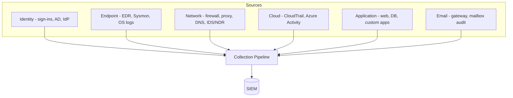
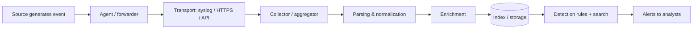
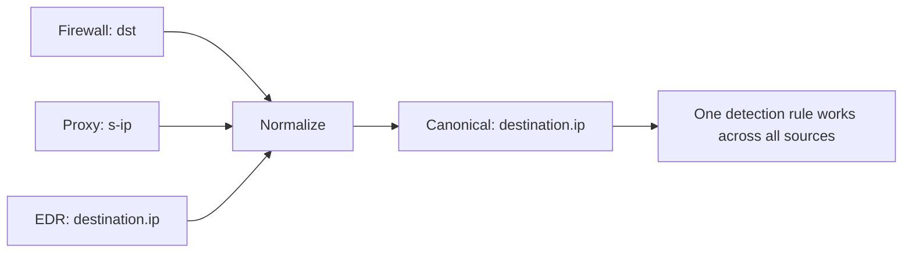
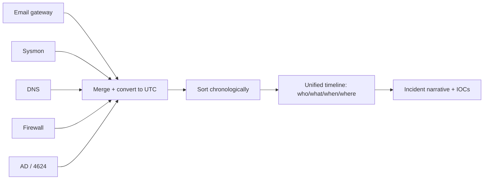
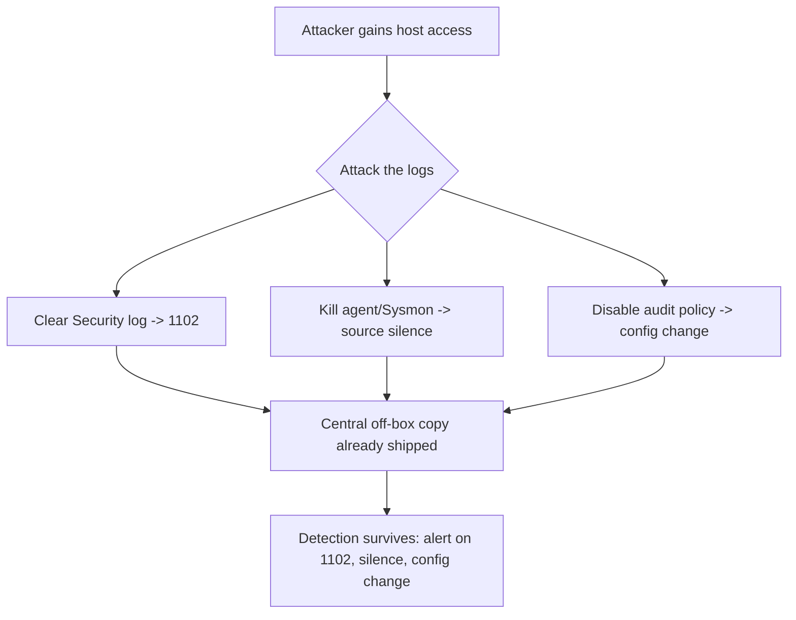
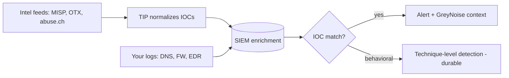

This is Chapter 2 of the SOC & Blue Team notebook. Chapter 1 built the human system — the SOC, its tiers, the alert lifecycle, and the defense-in-depth model that determines where detections come from. This chapter goes one layer down, to the substance those detections are made of: **logs and telemetry**. Every alert you will ever triage, every Splunk search you will write in Chapter 4, every KQL analytic in Chapter 5, is ultimately a question asked of log data. If you do not understand the data — what each source can see, how it is structured, where the gaps are — you cannot write good detections, and you certainly cannot triage well.

There is a phrase that captures the whole chapter: **you cannot detect what you do not collect, and you cannot triage what you do not understand.** A SOC's entire capability is bounded by its telemetry. A detection for lateral movement is worthless if the relevant Windows and network logs are not being collected; an "impossible travel" rule is impossible without sign-in logs. Before anyone writes a single detection rule, the real question is always: *which source would even see this, and are we collecting it?*

We build from the absolute basics — what a log and an event are — through the major data sources organized by defense-in-depth layer, the anatomy of a log event, common formats and how they are parsed, log levels and severity, the collection pipeline from source to SIEM, the concept of normalization and schemas, visibility gaps and how attackers exploit them, retention and cost, a hands-on lab correlating log lines into a story, a consolidated detection-and-defense section, common mistakes, a final revision, a cheat sheet, and topic-specific practice.

## Why This Matters

Imagine trying to solve a crime with no witnesses, no cameras, and no records. That is a SOC with poor telemetry. Logs are the witnesses. When an intrusion happens, the logs are what let you answer the questions that matter: who did it, when it started, how they got in, what they touched, and whether it is still happening. Every one of those answers lives in a log somewhere — or is invisible forever because no one collected it.

For a triage analyst, understanding data sources is what turns a cryptic alert into a story. In Chapter 1's lab, the alert said "impossible travel," but the *resolution* came from pivoting into mailbox audit logs (the inbox rule), SharePoint access logs (the files), and OAuth grant logs (the malicious app). None of that pivoting is possible unless you know those sources exist, what they record, and how to read them. This chapter builds that map.

**Who this is for:** aspiring SOC analysts and detection engineers who need to know their raw materials, and offensive practitioners who want to understand exactly what defenders can and cannot see — because knowing the blind spots is as valuable to a red teamer as knowing the sensors is to a blue teamer.

## Part 1: What Is a Log? What Is Telemetry?

Start with the atoms.

A **log** is a timestamped record of an event that happened on a system. When a user logs in, a process starts, a firewall allows a connection, or a web server serves a page, the system can write a line describing it. A **log file** is a collection of those lines, usually in chronological order.

An **event** is a single occurrence recorded as one log entry. "User `alice` logged on to HOST-12 at 09:03:22 from 10.0.4.5" is one event.

**Telemetry** is the broader term for all the data systems emit about their own operation and security — logs, metrics, traces, and richer structured event streams (like EDR process trees). In security, "telemetry" usually means the security-relevant event data flowing from your endpoints, network, identity, and cloud into your SIEM. Logs are a subset of telemetry; modern EDR and cloud telemetry are far richer than a traditional flat log line.

Three properties make a log useful for security:

- **Timestamp** — when it happened (ideally in a consistent timezone, ideally UTC). Without accurate time, you cannot build a timeline, and timelines are how incidents are reconstructed.
- **Actor and object** — who did what to what (a user, a process, a source IP acting on a file, a host, a destination).
- **Outcome** — success or failure, allowed or denied. A failed login and a successful login are wildly different security signals.

A quick anatomy of a single Linux auth event to make this concrete:

```
Feb 12 09:03:22 web01 sshd[2841]: Accepted password for alice from 10.0.4.5 port 51420 ssh2
```

Read it piece by piece: `Feb 12 09:03:22` (timestamp), `web01` (host), `sshd[2841]` (the program and its process ID), `Accepted password` (outcome + method), `alice` (actor), `from 10.0.4.5 port 51420` (source), `ssh2` (protocol). One line, and it already answers who, what, when, where, and how. Multiply that by billions per day across an enterprise and you have both the power and the problem of security logging.

## Part 2: The Data Sources — Organized by Layer

Recall the defense-in-depth layers from Chapter 1. Each layer is not just a barrier but a **sensor** that emits telemetry. Here is the full landscape, layer by layer, with what each source can and cannot see. This is the map you will return to constantly.



### Identity sources

Identity is the new perimeter, so identity logs are front-line detection data.

- **Active Directory security events** (Windows domain controllers) — logons, Kerberos ticket requests, group membership changes, account lockouts. Covered in depth in Chapter 7. Key event IDs: 4624 (logon), 4625 (failed logon), 4768/4769 (Kerberos), 4728/4732 (group add), 4740 (lockout).
- **Azure AD / Entra ID sign-in logs** — cloud sign-ins with device, location, IP, MFA result, conditional-access outcome. The source behind impossible-travel detection.
- **Identity-provider logs** (Okta, Ping, Auth0) — SSO events, factor enrollment, policy changes, admin actions.

**What identity logs see:** authentication and authorization events. **What they miss:** what the user *did* after authenticating on the endpoint — for that you need endpoint telemetry.

### Endpoint sources

The endpoint sees what the attacker actually *does* — this is the richest, most valuable layer for modern detection.

- **EDR telemetry** — process creation with full command line, parent-child relationships, file writes, network connections, module/DLL loads, registry modifications. The gold standard for behavioral detection.
- **Windows Event Logs** — Security, System, Application, plus specialized channels (PowerShell Operational, Windows Defender, Task Scheduler). Native, always present.
- **Sysmon** (System Monitor, from Sysinternals) — a free, configurable driver that produces high-fidelity endpoint logs: process creation with hashes (Event ID 1), network connections (ID 3), image loads (ID 7), file creation (ID 11), registry events (ID 12–14). The blue-team favorite for turning ordinary Windows into a rich sensor. Covered in Chapter 7.
- **Linux auditd / syslog** — process execution, authentication, file access, sudo usage on Unix hosts.

**What endpoint logs see:** on-host behavior in detail. **What they miss:** activity on hosts without an agent, and (unless configured) full command-line and script content.

### Network sources

Network telemetry sees traffic between hosts — invaluable when the endpoint is not instrumented or has been tampered with.

- **Firewall logs** — allowed/denied connections: source, destination, ports, protocol, bytes, action.
- **Proxy / web gateway logs** — outbound HTTP(S) requests with full URL, category, user, bytes. Excellent for detecting command-and-control and data exfiltration to web destinations.
- **DNS logs** — every domain resolved. One of the highest-value, lowest-cost sources: malware must usually resolve a domain, and DNS tunneling and DGA (domain-generation-algorithm) malware light up here.
- **IDS/IPS** (Suricata, Snort) — signature and protocol-anomaly alerts on traffic.
- **NDR / NetFlow / Zeek** — flow records and rich protocol logs summarizing who talked to whom, how much, and how; the backbone of network threat hunting.

**What network logs see:** communication patterns and volumes. **What they miss:** encrypted payload contents (TLS hides the "what"), and increasingly, activity that never crosses the monitored network (host-local, or cloud-to-cloud).

### Cloud sources

As infrastructure moves to the cloud, the control plane becomes a primary attack surface — and its audit logs a primary detection source.

- **AWS CloudTrail** — every API call in the AWS account: who did what, from where, to which resource. The single most important AWS security log.
- **Azure Activity Log + Entra audit** — control-plane operations and directory changes.
- **GCP Audit Logs** — admin activity and data access.
- **Cloud service logs** — VPC flow logs, S3 access logs, load-balancer logs, WAF logs.

**What cloud logs see:** control-plane and API activity — who created, modified, or accessed cloud resources. **What they miss:** in-guest activity on cloud VMs (that still needs endpoint agents).

### Application & database sources

- **Web server logs** (access + error) — every HTTP request: method, URL, status code, user agent, source IP, bytes. The raw material for detecting web attacks (SQLi, path traversal, credential stuffing).
- **Database audit logs** — queries, especially against sensitive tables; failed authentications; privilege changes.
- **Application logs** — custom app events (login, transaction, error), only as good as the developers made them.
- **WAF logs** — blocked and allowed requests with rule matches.

### Email sources

Email is the number-one initial-access vector, so email telemetry is prime detection data.

- **Mail gateway logs** — inbound/outbound messages, sender, spam/phishing verdicts, attachment-detonation results, URL rewriting/click data.
- **Mailbox audit logs** — inbox-rule creation, forwarding rules, delegate access, mass reads — the exact BEC tells from Chapter 1's lab.

Here is the consolidated reference you will keep coming back to:

| Layer | Source | Sees | Blind to |
|-------|--------|------|----------|
| Identity | AD events, Entra/Okta sign-ins | Auth, authz, account changes | Post-auth host activity |
| Endpoint | EDR, Sysmon, OS logs | Processes, files, registry, local net | Un-agented hosts |
| Network | Firewall, proxy, DNS, NDR | Connections, domains, volumes | Encrypted payloads |
| Cloud | CloudTrail, Azure Activity | Control-plane API calls | In-guest VM activity |
| Application | Web/DB/app logs | Requests, queries, transactions | Only what app logs |
| Email | Gateway, mailbox audit | Messages, rules, verdicts | Encrypted attachment internals |

**The core lesson:** no single source is complete. Detection is a *portfolio* across layers, and the most reliable detections often correlate multiple sources — a firewall connection *plus* the endpoint process that made it *plus* the identity that owns the host.

## Part 3: Anatomy of a Log Event

Every log event, regardless of source, tends to carry the same conceptual fields. Learn this skeleton and you can read any log, even an unfamiliar one.

- **Timestamp** — when the event occurred. Watch for timezone (UTC vs local) and clock skew between systems.
- **Source / host** — which system emitted it.
- **Source component** — which program or service (sshd, powershell.exe, nginx).
- **Severity / level** — how important the system considered it (see Part 5).
- **Actor / subject** — who or what caused the event (user, process, IP).
- **Action / event type** — what happened (logon, process create, connection, query).
- **Object / target** — what it happened to (a file, a host, an account, a URL).
- **Outcome** — success/failure, allowed/denied.
- **Metadata** — process IDs, session IDs, ports, hashes, request IDs, and more.

Here is a Windows logon event (Event ID 4624) in its typical verbose form, annotated:

```
EventID: 4624            # An account was successfully logged on
TimeCreated: 2027-02-12T09:03:22Z
Computer: WKS-2291
SubjectUserName: -       # the account requesting (often SYSTEM for network logons)
TargetUserName: alice    # the account that logged on  (ACTOR)
LogonType: 3             # 3 = network, 2 = interactive, 10 = RDP  (KEY FIELD)
IpAddress: 10.0.4.5      # where from
LogonProcessName: NtLmSsp
AuthenticationPackageName: NTLM
WorkstationName: LAPTOP-ALICE
```

The field that makes this event meaningful to an analyst is **LogonType**. Type 2 (interactive, someone at the keyboard), Type 3 (network, e.g. accessing a share), and Type 10 (RemoteInteractive, RDP) tell completely different stories. A Type 10 logon to a server at 3 a.m. from an unusual host is far more interesting than a Type 3. Reading logs well means knowing which fields carry the signal — a skill we develop across this notebook.

## Part 4: Log Formats and How They Are Parsed

Logs come in many formats, and the SIEM must **parse** each into fields before you can search on them. Knowing the common formats saves you when a source shows up as an unreadable blob.

**Unstructured / plaintext (syslog-style).** Human-readable free text, like the sshd line earlier. Flexible but hard to parse reliably — the SIEM needs a regex or grok pattern to extract fields.

**Key-value pairs.** `src=10.0.4.5 dst=93.184.216.34 action=allow port=443`. Easy to parse; common in firewall logs.

**CSV / TSV.** Comma- or tab-separated columns. Simple and compact.

**JSON.** Structured, nested, self-describing. The modern default for cloud, EDR, and application logs. Example (a CloudTrail-style event):

```json
{
  "eventTime": "2027-02-12T09:14:03Z",
  "eventName": "ConsoleLogin",
  "sourceIPAddress": "198.51.100.9",
  "userIdentity": { "type": "IAMUser", "userName": "svc-deploy" },
  "responseElements": { "ConsoleLogin": "Success" },
  "additionalEventData": { "MFAUsed": "No" }
}
```

JSON is a joy to work with because fields are explicit — no fragile regex needed. `userIdentity.userName` and `additionalEventData.MFAUsed` are directly addressable, which is why cloud detections are often cleaner than parsing legacy syslog.

**CEF (Common Event Format)** and **LEEF** — vendor-neutral formats designed for SIEM ingestion, with a defined header and extension fields. Example CEF:

```
CEF:0|Palo Alto|PAN-OS|10.2|traffic|allow|3|src=10.0.4.5 dst=93.184.216.34 dpt=443 act=allow
```

**Windows Event Log (EVTX / XML)** — Windows' native structured format, rich but verbose.

| Format | Structured? | Typical source | Parsing ease |
|--------|-------------|----------------|--------------|
| Plaintext/syslog | No | Linux services, network gear | Hard (regex/grok) |
| Key-value | Semi | Firewalls | Easy |
| CSV/TSV | Semi | Exports, some apps | Easy |
| JSON | Yes | Cloud, EDR, modern apps | Easiest |
| CEF/LEEF | Yes | SIEM-oriented vendors | Easy |
| EVTX/XML | Yes | Windows | Moderate |

The practical takeaway: when you onboard a new source, the first question is "what format, and is there a parser?" A source that lands as unparsed text is nearly useless for detection until fields are extracted — a common, under-appreciated cause of blind spots.

## Part 5: Log Levels and Severity

Most logging systems tag events with a **level** indicating importance. Syslog defines eight severities; applications often use a simpler set. Knowing them helps you filter noise and spot what matters.

Syslog severities (0 = most severe):

| Code | Level | Meaning |
|------|-------|---------|
| 0 | Emergency | System unusable |
| 1 | Alert | Immediate action required |
| 2 | Critical | Critical conditions |
| 3 | Error | Error conditions |
| 4 | Warning | Warning conditions |
| 5 | Notice | Normal but significant |
| 6 | Informational | Routine messages |
| 7 | Debug | Debug-level detail |

Application log levels (log4j/most frameworks): `TRACE < DEBUG < INFO < WARN < ERROR < FATAL`.

A crucial security caveat: **severity in the log is the *system's* opinion of operational importance, not security importance.** A successful login is usually logged at INFO — routine to the system, but potentially the start of a breach to you. Conversely, a flood of ERROR-level disk warnings may be operationally noisy but security-irrelevant. Do not filter your security data by log level alone; the attacker's most important events are often mundane INFO records. This is a classic beginner trap: "let's only ingest WARN and above to save money" silently discards the successful-logon and process-creation events that detection depends on.

## Part 6: The Collection Pipeline — From Source to SIEM

Logs do not teleport into the SIEM; they travel a pipeline, and each stage is a place things can break. Understanding the pipeline is what lets you answer "why is this source missing?"



- **Generation** — the source writes the event (assuming logging is enabled and at the right verbosity; often it is not by default).
- **Collection / forwarding** — an agent (Splunk Universal Forwarder, Elastic Agent, Wazuh agent, Fluentd, NXLog) or an agentless mechanism (syslog, API pull) ships the event off-box. Shipping off-box quickly matters for security: an attacker who compromises a host can tamper with local logs, so getting them to a central store fast preserves evidence.
- **Transport** — over syslog (UDP/TCP 514), HTTPS, or a vendor API. Reliability and encryption matter here (UDP syslog can silently drop events under load).
- **Aggregation** — a collector or message bus (e.g., Kafka) buffers and routes.
- **Parsing & normalization** — raw formats become structured fields mapped to a common schema (Part 7).
- **Enrichment** — add context: GeoIP, asset criticality, user identity, threat-intel matches.
- **Indexing/storage** — written to searchable storage (hot for recent, cold/archive for old).
- **Detection & search** — rules run continuously; analysts query interactively.

**Agent vs agentless.** Agents (installed on the host) give richer, more reliable data and can collect what agentless cannot (process telemetry), at the cost of deployment and maintenance. Agentless (syslog, API) is easier to deploy but usually thinner and dependent on the source's own logging. Most enterprises use both.

**A pipeline you must monitor.** The pipeline's *health* is itself a detection concern. If a source stops sending — an agent crashes, a forwarder's disk fills, a firewall's syslog target is misconfigured — you go blind on that source and *no alert fires to tell you*. Mature SOCs run "log source health" monitoring: alert when an expected source goes quiet. **Blue team usage:** a sudden silence from a domain controller's logs at 2 a.m. is itself suspicious — attackers sometimes stop or clear logging (ATT&CK T1562 Impair Defenses). Detecting the *absence* of expected logs is an advanced but vital skill.

## Part 7: Normalization and Schemas

Different sources describe the same concept with different field names. A source IP might be `src`, `source.ip`, `SourceAddress`, `IpAddress`, or `c-ip` depending on the vendor. **Normalization** maps all of these to a single canonical field so you can write one detection that works across sources.

A **schema** (or data model) is the agreed set of canonical fields. Common ones:

- **CIM** (Splunk Common Information Model) — Splunk's normalization standard.
- **ECS** (Elastic Common Schema) — Elastic's; fields like `source.ip`, `user.name`, `event.action`, `process.command_line`.
- **ASIM** (Microsoft Sentinel's Advanced SIEM Information Model) — Sentinel's normalization layer.
- **OCSF** (Open Cybersecurity Schema Framework) — a newer vendor-neutral effort.

Why it matters concretely: suppose you want to detect a connection to a known-bad IP. Without normalization you would write a different query for the firewall (`dst`), the proxy (`s-ip`), and the EDR (`destination.ip`). With a schema you write one query against the canonical `destination.ip` and it works everywhere the schema is applied. Normalization is what makes cross-source correlation — the heart of good detection — practical at scale.



The trade-off: normalization takes engineering effort and can lose source-specific nuance. Best practice is to keep the **raw event** alongside the normalized fields, so you normalize for correlation but can always drop back to the original when triage needs the full detail.

## Part 8: Visibility Gaps and Blind Spots

Every SOC has blind spots. Knowing yours is more important than pretending you have none — attackers actively seek the gaps.

Common blind spots:

- **Un-agented hosts** — a server without EDR is invisible at the endpoint layer. Attackers love the one unmonitored box.
- **Encrypted traffic** — TLS hides payloads from network sensors; you see the connection but not the content. (TLS inspection helps but has privacy and performance costs.)
- **Cloud in-guest activity** — cloud audit logs show control-plane actions, not what happens *inside* a VM.
- **Personal / unmanaged devices** — BYOD and contractor laptops outside your telemetry.
- **Default logging turned off** — many high-value logs are *off by default*: PowerShell script-block logging, command-line auditing (Windows 4688), mailbox auditing, DNS query logging. If you did not enable them, they do not exist.
- **Log gaps under load** — UDP syslog drops, rate limits, and buffer overflows silently lose events.
- **Short retention** — an event that aged out of storage before you looked is a blind spot in time.

The mindset: **map your coverage against attacker techniques (ATT&CK, Chapter 3) and be honest about the gaps.** A useful exercise is to take a technique — say, credential dumping from LSASS — and ask "which of my sources would see it, and are they collecting the right events?" Often the answer reveals a gap you can close cheaply (enable a log) rather than expensively (buy a tool).

**Red team usage (as context):** offensive operators explicitly reason about these gaps — preferring techniques that avoid instrumented paths, targeting un-agented hosts, using encrypted C2 to hide payloads, and clearing or disabling logs. A blue teamer who thinks like this closes the gaps *before* they are exploited; the two mindsets are mirror images.

## Part 9: Retention, Volume, and Cost

Logging is not free, and the economics shape what a SOC can actually do. Most SIEMs charge by data volume (GB/day ingested) or by compute, and storage costs scale with retention. A large enterprise can generate terabytes of logs per day, so **you cannot keep everything forever**, and choosing what to collect and how long to keep it is a real engineering and budget decision.

The tensions:

- **Detection needs the data** — you cannot detect on what you did not collect, so under-collecting creates blind spots.
- **Cost punishes over-collection** — ingesting verbose debug logs you never query wastes money and slows search.
- **Investigations need history** — incidents are often discovered weeks or months after they began (long dwell time), so short retention means the evidence is gone when you finally look.
- **Compliance mandates minimums** — PCI-DSS (1 year), some regulations more; you may be *required* to retain certain logs.

Common strategies:

- **Tiered storage** — hot (fast, expensive, recent ~30–90 days), warm, then cold/archive (cheap, slow, months–years). Recent data is searched constantly; old data is rarely touched but must be retrievable.
- **Filtering at the edge** — drop obvious noise (health-check pings, verbose debug) *before* ingestion to cut volume without losing signal.
- **Routing by value** — send high-value security logs to the SIEM and bulk/low-value logs to cheaper storage (a "data lake") queried only when needed.
- **Summarization** — keep aggregates (e.g., NetFlow) rather than full packet capture for long periods.

| Retention tier | Typical window | Cost | Use |
|----------------|----------------|------|-----|
| Hot | 30–90 days | High | Active detection & triage |
| Warm | 90–365 days | Medium | Investigations, hunting |
| Cold/archive | 1–7 years | Low | Compliance, deep IR |

The recurring beginner mistake is optimizing cost by cutting the wrong data — dropping successful-logon or process-creation events because they are high-volume, only to discover during an incident that the crucial evidence was never kept. The rule of thumb: **cut verbosity and duplication, never security-relevant event types.**

## Part 10: Hands-On Lab — Reading Logs and Reconstructing an Attack

This lab builds the core analyst skill: taking scattered log lines from multiple sources and assembling them into a single narrative. You do not need a live SIEM — the skill is the *reading and correlation*. (Chapters 4–6 do this inside real query languages.) Below are raw events from several sources during a simulated intrusion, deliberately out of order and mixed, as they might arrive.

```
# --- email gateway ---
2027-02-12T08:41:10Z gw-mail msg_id=A1 from=hr-updates@acme-portal[.]co to=m.singh@acme.example
  subject="Updated Payroll Policy" attachment="Policy.docm" verdict=delivered spam_score=3.1

# --- endpoint (Sysmon, WKS-2291) ---
2027-02-12T08:47:55Z WKS-2291 EventID=1 ProcessCreate image="winword.exe" user="m.singh"
2027-02-12T08:48:02Z WKS-2291 EventID=1 ProcessCreate parent="winword.exe"
  image="powershell.exe" cmdline="powershell -nop -w hidden -enc SQBFAFgA...=="
2027-02-12T08:48:04Z WKS-2291 EventID=3 NetworkConnect image="powershell.exe"
  dst=45.146.13.7 dport=443

# --- DNS ---
2027-02-12T08:48:03Z dns01 query from 10.0.7.41 name="cdn-updates[.]xyz" type=A answer=45.146.13.7

# --- firewall ---
2027-02-12T08:48:04Z fw01 src=10.0.7.41 dst=45.146.13.7 dport=443 proto=tcp action=allow bytes=812

# --- identity (AD, later) ---
2027-02-12T09:12:33Z DC01 EventID=4624 TargetUserName="m.singh" LogonType=3
  IpAddress=10.0.7.41 -> target=FILE01
2027-02-12T09:12:40Z FILE01 EventID=4663 ObjectName="\\FILE01\Finance\payroll.xlsx"
  AccessMask=Read SubjectUserName="m.singh"
```

### Step 1 — Establish the timeline

Sort by timestamp and note the host (10.0.7.41 = WKS-2291, resolved from the logon IP):

```
08:41:10  email delivered: Policy.docm to m.singh
08:47:55  winword.exe opens (m.singh opened the attachment)
08:48:02  winword.exe SPAWNS powershell.exe (encoded, hidden)  <-- red flag
08:48:03  DNS resolves cdn-updates[.]xyz -> 45.146.13.7
08:48:04  powershell connects to 45.146.13.7:443 (firewall allows)
09:12:33  m.singh network-logon to FILE01 from WKS-2291
09:12:40  m.singh reads \\FILE01\Finance\payroll.xlsx
```

### Step 2 — Correlate across sources into a story

Each source alone is a fragment; together they tell one story: a phishing email delivered a macro-enabled document (**T1566**), the user opened it, Word spawned encoded PowerShell (**T1059.001**), which resolved and connected to attacker infrastructure (**C2, T1071**), and ~24 minutes later the same host reached into a file server and read sensitive payroll data (**lateral access + collection, T1039/T1005**). No single log would have told you this; the correlation did.

### Step 3 — Identify what each source contributed

```
email gw   -> initial vector (the lure + attachment)
Sysmon     -> the decisive on-host behavior (winword -> powershell, encoded)
DNS        -> the C2 domain (a durable IOC to hunt across the fleet)
firewall   -> confirmed the outbound connection + volume
AD/4624    -> lateral access from the compromised host
4663       -> the sensitive object touched (payroll.xlsx)
```

This is the Part 2 lesson made concrete: **detection is a portfolio across layers, and correlation is where fragments become an incident.** Notice too what the gaps would have cost: without Sysmon, the winword→powershell spawn is invisible; without DNS logging, you lose the C2 domain; without object-access auditing (4663, off by default), you never learn payroll.xlsx was read.

### Step 4 — Extract pivots and IOCs

```
Domain: cdn-updates[.]xyz     -> hunt across DNS for any other host that resolved it
IP:     45.146.13.7           -> hunt across firewall/proxy for other connections
Hash:   Policy.docm           -> hunt across email/EDR for other recipients
Behavior: winword -> powershell -enc  -> a DETECTION to build (technique-level)
```

The behavior at the bottom is the most valuable output: an IP or domain is a low-Pyramid-of-Pain indicator the attacker can rotate, but a detection for "Office application spawning encoded PowerShell" catches the whole *class* of attack regardless of infrastructure. Turning an incident into a durable detection is the feedback loop from Chapter 1, and it starts with reading logs like this.

## Part 10b: Log Analysis on the Command Line (Tools From Scratch)

Before a log ever reaches a SIEM, and constantly during investigations, analysts read logs with plain command-line tools. These are free, always available, and often faster than a GUI for a quick look. This section teaches the core toolkit from zero, because you will use it in every later chapter and every real investigation.

### grep — find lines that match

`grep` (Global Regular Expression Print) searches text for lines matching a pattern. It is the single most-used log tool.

```bash
# Find every failed SSH login in the auth log
grep "Failed password" /var/log/auth.log

# Case-insensitive, show line numbers, count only
grep -i "failed password" /var/log/auth.log        # -i ignore case
grep -c "Failed password" /var/log/auth.log         # -c count matches
grep -n "Accepted password" /var/log/auth.log       # -n line numbers

# Show context around matches (2 lines before/after)
grep -B2 -A2 "Failed password" /var/log/auth.log

# Invert: everything EXCEPT health-check noise
grep -v "healthcheck" access.log

# Extended regex: failed OR accepted
grep -E "Failed password|Accepted password" /var/log/auth.log

# Recurse a directory of logs
grep -r "45.146.13.7" /var/log/
```

Sample output:

```
Feb 12 03:11:04 web01 sshd[4410]: Failed password for invalid user admin from 203.0.113.9 port 40122 ssh2
Feb 12 03:11:06 web01 sshd[4410]: Failed password for invalid user admin from 203.0.113.9 port 40140 ssh2
Feb 12 03:11:09 web01 sshd[4412]: Failed password for root from 203.0.113.9 port 40201 ssh2
```

Already you can see a brute force: many failures, same source, rapid, targeting `admin` and `root`.

### awk — extract and compute on fields

`awk` splits each line into fields (by whitespace by default) and lets you pull columns and aggregate. It turns raw text into answers.

```bash
# Print the source IP (field 11) from failed-password lines
grep "Failed password" auth.log | awk '{print $11}'

# Count failed logins per source IP, sorted, top 10
grep "Failed password" auth.log \
  | awk '{print $11}' \
  | sort | uniq -c | sort -nr | head -10
```

Sample output — instantly reveals the top attacking IPs:

```
   2841 203.0.113.9
    412 198.51.100.23
     37 192.0.2.77
```

The `sort | uniq -c | sort -nr` idiom (sort, count unique, sort by count descending) is the workhorse of quick log analysis — "which value appears most?" answers a huge fraction of triage questions (top talkers, top URLs, top user agents, rarest values).

### cut, sort, uniq — the pipeline classics

```bash
# Extract status codes from an nginx access log (field 9) and tally them
cut -d' ' -f9 access.log | sort | uniq -c | sort -nr

# Unique source IPs that hit the login page
grep "POST /login" access.log | awk '{print $1}' | sort -u | wc -l
```

### jq — query JSON logs

Modern logs (cloud, EDR) are JSON. `jq` is to JSON what awk is to text.

```bash
# Pull the event name and source IP from CloudTrail JSON events
cat cloudtrail.json | jq -r '.Records[] | "\(.eventName) \(.sourceIPAddress)"'

# Only failed console logins without MFA
jq -r '.Records[]
  | select(.eventName=="ConsoleLogin"
      and .responseElements.ConsoleLogin=="Failure")
  | .sourceIPAddress' cloudtrail.json | sort | uniq -c | sort -nr
```

### Reading Windows logs from the command line

On Windows, PowerShell reads event logs:

```powershell
# Last 20 failed logons (Event ID 4625) with the source IP
Get-WinEvent -FilterHashtable @{LogName='Security'; Id=4625} -MaxEvents 20 |
  Select-Object TimeCreated,
    @{n='User'; e={$_.Properties[5].Value}},
    @{n='SrcIP'; e={$_.Properties[19].Value}}

# Every process-creation event (4688) whose command line contains 'enc'
Get-WinEvent -FilterHashtable @{LogName='Security'; Id=4688} |
  Where-Object { $_.Message -match '-enc' }
```

The point of learning these is not nostalgia — during an incident, the SIEM may not have the source, or you may be on a host directly, and these tools let you answer questions immediately. They are also how you build intuition for what a SIEM does at scale: every SPL or KQL query in the coming chapters is, conceptually, a fancier `grep | awk | sort | uniq`.

## Part 10c: A Tour of the Highest-Value Log Events

Some log events matter far more than others for security. Here is a curated tour of the events an analyst reaches for most, with a real sample of each, so you recognize them on sight.

### Web access log — spotting an attack

A single nginx/Apache access line:

```
203.0.113.9 - - [12/Feb/2027:03:22:41 +0000] "GET /admin.php?id=1' OR '1'='1 HTTP/1.1" 200 5312 "-" "sqlmap/1.7"
```

Read it: source `203.0.113.9`, a `GET` to `/admin.php` with `id=1' OR '1'='1` (a **SQL injection** payload), a `200` (the app *responded* — worth investigating whether it was vulnerable), and a **user agent of `sqlmap/1.7`** — an automated SQLi tool announcing itself. Three independent tells of an attack in one line. Access logs are the raw material of web-attack detection (which pairs with the AppSec notebooks, now seen from the defender's chair).

### Brute-force pattern in auth logs

```
Feb 12 03:11:04 web01 sshd[4410]: Failed password for invalid user admin from 203.0.113.9 ...
Feb 12 03:11:06 web01 sshd[4410]: Failed password for invalid user admin from 203.0.113.9 ...
... (2800 more in 4 minutes) ...
Feb 12 03:15:52 web01 sshd[5001]: Accepted password for oracle from 203.0.113.9 ...
```

The story: thousands of failures, then a **success**. The success after a flood is the event that turns "noisy brute force" into "possible compromise" — always pivot from the failures to whether any succeeded.

### High-value Windows Security event IDs

| Event ID | Meaning | Why it matters |
|----------|---------|----------------|
| 4624 | Successful logon | Who logged on, how (LogonType), from where |
| 4625 | Failed logon | Brute force, password spraying, misconfig |
| 4634 / 4647 | Logoff | Session duration, timelines |
| 4672 | Special privileges assigned | Admin-equivalent logon — watch closely |
| 4688 | Process creation | Command-line visibility (enable it!) |
| 4697 | Service installed | Persistence (T1543) |
| 4698 | Scheduled task created | Persistence (T1053) |
| 4720 / 4726 | Account created / deleted | Rogue accounts |
| 4728 / 4732 | Member added to group | Privilege escalation (Domain Admins!) |
| 4740 | Account locked out | Brute force aftermath |
| 4768 / 4769 | Kerberos TGT / service ticket | Kerberoasting, ticket abuse |
| 1102 | Security log cleared | Anti-forensics (T1070) — almost always suspicious |
| 7045 | Service installed (System log) | Persistence / lateral tooling |

Event **1102 (log cleared)** deserves special mention: legitimate reasons to wipe a security log are rare, so it is one of the highest-signal events there is — attackers clear logs to cover tracks, and the very act of clearing generates 1102, which you should alert on aggressively.

### Sysmon — the events that catch modern attacks

| Sysmon ID | Event | Catches |
|-----------|-------|---------|
| 1 | Process creation (with hash + cmdline) | Malicious execution, LOLBins |
| 3 | Network connection | C2, exfil, lateral movement |
| 7 | Image/DLL loaded | DLL side-loading, injection |
| 8 | CreateRemoteThread | Process injection (T1055) |
| 10 | ProcessAccess | LSASS credential dumping |
| 11 | File created | Dropped payloads, ransomware |
| 12–14 | Registry events | Persistence, config changes |
| 22 | DNS query | C2 domains, tunneling |

Sysmon ID 10 with a target of `lsass.exe` from an unusual process is one of the single most valuable credential-theft detections you can build — the Part 8/Part 11 credential-dumping example lives here.

## Part 10d: Two Quick Reading Drills

**Drill 1 — password spraying vs brute force.** These look similar but differ in an important way:

```
# Brute force: MANY passwords against ONE account
4625 user=admin src=203.0.113.9   (x2000, different passwords)

# Password spray: ONE password against MANY accounts
4625 user=alice  src=198.51.100.5
4625 user=bob    src=198.51.100.5
4625 user=carol  src=198.51.100.5
4625 user=dan    src=198.51.100.5   (one attempt each, same source, same time window)
```

Brute force hammers one account (and often triggers lockout, 4740); spraying tries one common password (`Winter2027!`) across many accounts to *avoid* lockout. The detection logic is different: brute force = "many failures for one user"; spray = "one/few failures each across many users from one source." Knowing the distinction is a common interview question and a real triage decision.

**Drill 2 — the successful anomaly.** In any pile of failures, the events that matter most are the **successes** and the **firsts**: the first time a user logged in from a country, the first time a service account ran an interactive process, the one success after a thousand failures. Trained eyes scan past the noise to the anomalous success.

## Part 10e: Building a Timeline — The Analyst's Core Deliverable

The output of most investigations is a **timeline**: a single chronological reconstruction of what happened, drawn from many sources, in one clock (UTC). The Part 10 lab produced a small one by hand; at scale, timelines are how incidents are understood and communicated. This section makes the skill explicit.

A good timeline has three properties: **one timezone** (convert everything to UTC to avoid the classic error of comparing 09:00 EST with 09:00 UTC), **one ordered stream** (merge sources into a single sorted list), and **source attribution** (each entry says which log it came from so it can be verified).



By hand, the pattern is: extract the timestamped fields you care about from each source, tag each with its source, dump them together, and sort:

```bash
# Normalize a few sources into "UTC<TAB>source<TAB>summary" then sort
{
  awk '{print $1"\tSYSMON\t"$0}' sysmon.tsv
  awk '{print $1"\tDNS\t"$0}'    dns.tsv
  awk '{print $1"\tFW\t"$0}'     fw.tsv
} | sort > timeline.tsv
head timeline.tsv
```

For deep host forensics, dedicated tools build **super-timelines** from disk artifacts: **Plaso / log2timeline** ingests dozens of artifact types (event logs, registry, browser history, filesystem `$MFT`) into one timeline; **Timesketch** (open source) then lets a team collaboratively review and annotate it. You do not need them for log-based triage, but know they exist — a full-disk super-timeline is how serious intrusions are reconstructed after the fact.

The discipline that makes timelines trustworthy is the same one that makes them hard: **time is only as good as clock synchronization.** Hosts whose clocks drift, or logs stored in local time without a timezone marker, silently corrupt timelines. Enforce NTP across the estate, prefer UTC in storage, and when a source's time looks wrong, treat it as suspect rather than authoritative.

## Part 10f: Log Integrity and Anti-Forensics

Logs are evidence, and attackers know it. A recurring late-stage technique is **defense evasion via log tampering** (MITRE ATT&CK **T1070 Indicator Removal**, **T1562 Impair Defenses**). Understanding the ways logs get attacked tells you both what to protect and what to detect.

How attackers attack logs:

- **Clearing** — wiping the Windows Security log (generates **Event ID 1102**) or truncating `/var/log/*`. The clear itself is a high-signal detection.
- **Stopping the source** — killing the EDR agent, the Sysmon service, or the log forwarder so new events never get recorded or shipped. Detect via **source-silence** monitoring (Part 6) and agent-health telemetry.
- **Disabling logging** — turning off auditing policy, PowerShell logging, or a firewall's syslog target. Detect via configuration-change auditing.
- **Selective deletion** — removing specific lines (harder on Windows EVTX, easier on flat text). This is why flat local text logs are weak evidence.
- **Timestomping** — altering file timestamps to hide activity (Sysmon Event ID 2 catches file-creation-time changes).

How defenders protect log integrity:

- **Forward off-box immediately.** The moment an event leaves the host for a central, access-controlled store, an attacker who later owns the host cannot retroactively delete it. Central collection is the single most important log-integrity control.
- **Restrict and monitor log access.** Analysts read; almost no one should be able to delete. Alert on log-clear and audit-policy-change events.
- **Write-once / immutable storage.** Compliance-grade SIEMs and archive tiers support WORM (write-once-read-many) storage so retained logs cannot be altered.
- **Detect the absence.** As stressed throughout: alert when an expected source goes quiet. A gap in the timeline is itself a clue.



**Blue team usage:** treat every log-integrity event as high priority. A cleared Security log, a suddenly-dead Sysmon service, or an audit-policy change on a server is rarely benign and often marks the point where an attacker began covering their tracks — which means the interesting activity is *just before* the gap.

## Part 10g: What to Onboard First — A Prioritized Roadmap

A new or maturing SOC cannot onboard every source at once, and doing it in the wrong order wastes months. Here is a defensible priority order, based on detection value per unit of effort. Each tier assumes the previous is in place.

**Tier 1 — the non-negotiables (highest value, lowest cost)**

1. **Authentication logs** — Windows 4624/4625, Entra/Okta sign-ins. Identity is the new perimeter; most intrusions touch auth first.
2. **Endpoint process telemetry** — EDR, or at minimum Sysmon + Windows 4688 with command-line auditing. This sees what the attacker *does*.
3. **DNS query logs** — cheap, tiny, and catch C2/tunneling/DGA that nothing else sees.
4. **Firewall allow/deny + proxy logs** — connections and outbound web activity for C2 and exfil.

**Tier 2 — high value, a bit more effort**

5. **Cloud audit logs** — CloudTrail / Azure Activity if you run cloud; the control plane is a prime target.
6. **Email gateway + mailbox audit** — email is the #1 initial-access vector; mailbox audit catches BEC.
7. **PowerShell script-block logging + Windows persistence events** (4697/4698/7045) — modern attacks live here.
8. **Security-log-clear (1102) and audit-policy-change** — anti-forensics tripwires.

**Tier 3 — depth and coverage**

9. Web server / WAF logs, database audit logs.
10. NDR / NetFlow / Zeek for east-west visibility.
11. VPN, DHCP, and asset-inventory context for enrichment.
12. SaaS app audit logs (Salesforce, GitHub, etc.).

| Onboarding tier | Sources | Primary techniques covered |
|-----------------|---------|----------------------------|
| 1 | Auth, endpoint, DNS, firewall/proxy | Initial access, execution, C2, brute force |
| 2 | Cloud, email, PowerShell, log-integrity | Phishing, cloud abuse, persistence, evasion |
| 3 | Web/DB, NDR, VPN/DHCP, SaaS | Web attacks, lateral movement, exfil, insider |

The guiding principle mirrors the whole chapter: **onboard by detection value mapped to techniques, not by whatever is easiest to plug in.** A SOC with Tier-1 sources tuned well outperforms one drowning in Tier-3 volume with no endpoint visibility.

## Part 10h: Taming Noisy Sources

Some sources are firehoses of low-value events that bury signal and inflate cost. Taming them is routine detection-engineering work:

- **Filter at the edge.** Drop health-check pings, load-balancer probes, and known-benign automation *before* ingestion. A single verbose vulnerability scanner can generate more "attack" lines than every real attacker combined — exclude its known IPs by asset tag, not by muting the detection.
- **Sample, do not drop, where possible.** For pure-volume telemetry (some NetFlow, verbose debug), keep a representative sample or aggregate rather than every record.
- **Summarize.** Replace millions of identical events with a count per interval (e.g., "host X made 4,102 connections to Y in 5 min") — smaller and often *more* useful for detection than the raw stream.
- **Route by value.** Send security-relevant events to the SIEM; send bulk operational logs to cheaper storage queried on demand.

The trap to avoid: taming noise by muting whole sources or subnets, which creates false negatives. Always prefer *precise* exclusions tied to verified-benign context (a specific scanner asset, a specific health-check path) over broad suppression.

## Part 10i: Threat Intelligence and IOCs — Context for Your Logs

Logs tell you what happened; **threat intelligence** tells you whether what happened is known-bad and who does it. Enrichment (Chapter 1) leans heavily on intel, so a working vocabulary matters.

An **Indicator of Compromise (IOC)** is an observable that suggests malicious activity: a file hash, an IP, a domain, a URL, a registry key, a mutex name, an email sender. IOCs are matched against your log data to flag known-bad activity. They map onto the **Pyramid of Pain** from Chapter 1 — hashes and IPs are cheap for attackers to change (low value, short-lived), while behaviors/TTPs are expensive (high value, durable).

Three levels of threat intelligence:

- **Strategic** — high-level trends and actor motivations, for leadership and risk decisions.
- **Operational** — campaigns and adversary TTPs, for detection engineering and hunting.
- **Tactical** — concrete IOCs (IPs, hashes, domains), for automated matching in the SIEM.

Common IOC-sharing standards and feeds:

- **STIX/TAXII** — the standard format (STIX) and transport (TAXII) for sharing structured intel.
- **MISP** — open-source Threat Intelligence Platform for storing, correlating, and sharing IOCs.
- **OpenCTI** — open-source platform for structured intel and TTP tracking.
- **Free feeds** — abuse.ch (URLhaus, Feodo Tracker, ThreatFox), AlienVault OTX, Spamhaus, Tor exit lists.
- **Reputation services** — VirusTotal (file/URL/domain reputation), GreyNoise (is this IP just internet background scanning?), AbuseIPDB.

How intel plugs into your logs, concretely:

```bash
# Match DNS query logs against a domain blocklist (tactical IOC matching)
grep -Ff bad_domains.txt dns.log

# Which internal hosts contacted any known-bad IP from a feed?
awk '{print $4}' fw.log | grep -Ff bad_ips.txt | sort | uniq -c
```

A crucial nuance that keeps you from drowning: **IOC matching is necessary but low on the pyramid.** A hit on a known-bad IP is a useful lead, but attackers rotate IPs hourly, so IOC feeds go stale fast and generate false positives (shared hosting, sinkholes, recycled addresses). Tools like **GreyNoise** help by telling you whether an IP is targeted activity or just internet-wide background noise — context that turns a noisy IOC hit into an actionable one. The mature posture: use tactical IOCs for cheap wins and enrichment, but invest your detection engineering in **behavioral, technique-level** logic that does not decay when the attacker changes infrastructure. Intel is most powerful when it informs *what behavior to hunt for*, not just *which IP to block*.



## Part 11: Detection & Defense Angle (Consolidated)

Everything in this chapter serves one goal: making your telemetry good enough that detection is possible and triage is fast. The defensive priorities:

**Collect with intent, mapped to techniques.** Do not collect randomly. Take your priority attacker techniques (ATT&CK, Chapter 3) and ensure you have a source that sees each one. Credential dumping needs endpoint/Sysmon; lateral movement needs Windows logon + network; exfiltration needs proxy/DNS + DLP; cloud abuse needs CloudTrail. Coverage is measured against techniques, not gigabytes.

**Enable the logs that are off by default.** The cheapest visibility wins are free: turn on Windows command-line auditing (4688) and PowerShell script-block logging, deploy Sysmon with a good config (SwiftOnSecurity's is a common starting point), enable mailbox auditing, and log DNS queries. Many "we can't see it" gaps are really "we never turned it on."

**Ship logs off-box fast and protect them.** An attacker who owns a host can tamper with local logs, so forward to a central, access-controlled store quickly. Treat log integrity as evidence integrity — it matters for both detection and any later legal process.

**Monitor the pipeline's health.** Alert on *silence*: an expected source going quiet is both an operational failure and a possible attacker action (log tampering / impair defenses, T1562). Detecting the absence of logs is as important as detecting their content.

**Normalize for correlation, keep the raw for truth.** Map sources to a schema (CIM/ECS/ASIM) so cross-source detections are practical, but retain the original event so triage always has full fidelity.

**Right-size retention to dwell time.** Because intrusions are often found months after they start, retention that is too short erases the evidence. Balance cost against the reality that you will investigate old data — tier storage rather than deleting security-relevant events.

**Know your blind spots and treat them as risk.** Every gap (un-agented host, encrypted channel, unmanaged device) is where an attacker prefers to operate. Inventory your gaps and close the cheap ones; accept and document the rest so they are conscious decisions, not surprises during an incident.

## Part 12: Common Mistakes & How to Avoid Them

- **Filtering by log level to save money.** Dropping INFO events discards successful logons and process creations — the exact records detection needs. Cut verbosity and duplication, not security event *types*.
- **Assuming a log exists because it "should."** Many high-value logs are off by default (4688, script-block logging, mailbox audit, DNS). Verify collection; do not assume it.
- **Collecting without parsing.** An unparsed source is a blob you cannot search. Onboarding a source is not done until fields are extracted and mapped to a schema.
- **Ignoring timezones and clock skew.** Timelines built from mismatched clocks are wrong and can send an investigation off course. Standardize on UTC and monitor time sync.
- **Not monitoring source health.** A silently dead log source is an invisible blind spot. Alert on expected sources going quiet.
- **Over-trusting a single source.** Endpoint logs can be tampered with; network logs miss encrypted content. Correlate across layers rather than trusting one.
- **Keeping data too briefly.** Long dwell times mean short retention erases evidence. Tier storage instead of deleting.
- **Confusing volume with visibility.** Ingesting terabytes of low-value logs while missing the one source that sees a key technique is common. Coverage is about the *right* data, not the most data.

## Part 13: Final Revision / Summary

A **log** is a timestamped record of an event; **telemetry** is the broader stream of security-relevant data (logs plus richer EDR/cloud events). A useful log carries a timestamp, an actor, an action, an object, and an outcome. Data sources map to the **defense-in-depth layers**: identity (sign-ins, AD, IdP), endpoint (EDR, Sysmon, OS logs — the richest layer), network (firewall, proxy, DNS, NDR), cloud (CloudTrail, Azure Activity), application/database, and email (gateway, mailbox audit). Each source sees some things and is blind to others; **no single source is complete**, so detection is a portfolio and correlation across layers is where fragments become incidents.

Every event shares a skeleton — timestamp, host, component, level, actor, action, object, outcome, metadata — and reading logs well means knowing which fields carry the signal (like Windows **LogonType**). Logs arrive in many **formats** (plaintext/syslog, key-value, CSV, JSON, CEF, EVTX); the SIEM must **parse** each into fields, and JSON/structured formats are easiest. **Log levels** reflect the system's operational opinion, not security importance — the attacker's key events are often mundane INFO records, so never filter security data by level alone.

Logs travel a **pipeline** — generate → collect/forward → transport → aggregate → parse/normalize → enrich → index → detect — and every stage can break, so pipeline **health monitoring** (alerting on silence) is itself a detection. **Normalization** to a **schema** (CIM/ECS/ASIM/OCSF) lets one detection work across sources; keep the raw event too. Every SOC has **blind spots** (un-agented hosts, encrypted traffic, cloud in-guest, off-by-default logs, dropped events, short retention); map coverage against techniques and close the cheap gaps. **Retention** is an economic trade-off against long dwell times — tier storage, cut verbosity not security event types. The lab tied it together: scattered email, Sysmon, DNS, firewall, and AD events, correlated by timeline, reconstruct one intrusion and yield both IOCs and a durable technique-level detection.

Before the cheat sheet, a self-check — you should now be able to answer each of these without hesitation:

- Name a source for every defense-in-depth layer, and one thing each is blind to.
- Read an unfamiliar log line and identify actor, action, object, and outcome.
- Explain why filtering security data by log level is dangerous.
- Describe the log pipeline end to end and name a failure mode at each stage.
- Say what normalization/schemas buy you and what they cost.
- List your likely blind spots and which are cheap to close.
- Reconstruct an intrusion from multi-source logs into one UTC timeline.
- Distinguish tactical IOCs from behavioral detection and say which is more durable.

If any of those is shaky, reread the relevant Part before moving to Chapter 3 — the framework there assumes this foundation is solid.

## Part 14: Cheat Sheet / Quick Reference

**Log essentials**
- Every useful log: timestamp · actor · action · object · outcome. Prefer UTC.

**Sources by layer**
- Identity: AD (4624/4625/4768/4769/4740), Entra/Okta sign-ins.
- Endpoint: EDR, Sysmon (1 proc, 3 net, 7 image, 11 file, 12–14 registry), OS logs.
- Network: firewall, proxy, DNS, IDS/NDR, NetFlow/Zeek.
- Cloud: AWS CloudTrail, Azure Activity, GCP Audit, VPC flow.
- App/DB: web access logs, DB audit, WAF.
- Email: mail gateway, mailbox audit (inbox rules, forwarding).

**Formats**
- Plaintext/syslog (hard) · key-value (easy) · CSV (easy) · JSON (easiest) · CEF/LEEF (easy) · EVTX/XML (Windows).

**Key Windows LogonType values**
- 2 interactive · 3 network · 4 batch · 5 service · 7 unlock · 8 network cleartext · 9 new creds · 10 RDP · 11 cached.

**Syslog severities (0→7)**
- Emergency · Alert · Critical · Error · Warning · Notice · Info · Debug.

**Pipeline**
- generate → forward (agent/syslog/API) → transport → aggregate → parse/normalize → enrich → index → detect. Monitor for source *silence*.

**Schemas**
- Splunk CIM · Elastic ECS · Sentinel ASIM · OCSF (vendor-neutral).

**Off-by-default logs worth enabling**
- Windows 4688 (command line) · PowerShell script-block logging · Sysmon · mailbox auditing · DNS query logging · object-access auditing (4663).

**Retention tiers**
- Hot 30–90d (detect) · Warm 90–365d (investigate) · Cold 1–7y (compliance/IR).

**Blind spots checklist**
- Un-agented hosts · encrypted traffic · cloud in-guest · unmanaged devices · disabled logging · dropped events · short retention.

**Command-line log analysis**
```bash
grep -i "failed password" auth.log            # find matches (case-insensitive)
grep -c PATTERN file                            # count matches
grep -B2 -A2 PATTERN file                       # context around matches
grep -v healthcheck access.log                  # exclude noise
grep -rF -f iocs.txt /var/log/                   # match many IOCs, fixed strings
awk '{print $11}' f | sort | uniq -c | sort -nr  # top values (the workhorse)
cut -d' ' -f9 access.log | sort | uniq -c        # tally a column
jq -r '.Records[] | .sourceIPAddress' ct.json    # extract from JSON
```
```powershell
Get-WinEvent -FilterHashtable @{LogName='Security'; Id=4625} -MaxEvents 20
Get-WinEvent -FilterHashtable @{LogName='Security'; Id=4688} |
  Where-Object { $_.Message -match '-enc' }
```

**Attack patterns at the log level**
- Brute force = many passwords, one account (watch for 4740 lockout + a later success).
- Password spray = one password, many accounts, one source, one attempt each.
- Web attack tells = SQLi/traversal payloads in URL, scanner user-agents (sqlmap, nikto), bursts of 404/500.
- The success after a flood of failures is the event that matters most.

**Threat intel**
- IOC types: hash, IP, domain, URL, registry key, mutex, sender.
- Levels: strategic (trends) · operational (TTPs) · tactical (IOCs).
- Standards/feeds: STIX/TAXII, MISP, OpenCTI, abuse.ch, OTX, VirusTotal, GreyNoise.
- IOCs are cheap/low-pyramid; invest in behavioral detections that don't decay.

**Log integrity red flags**
- Event 1102 (log cleared) · sudden source silence · audit-policy change · dead EDR/Sysmon service. The interesting activity is usually just before the gap.

## Part 15: Practice Labs & Resources

Train reading and correlating real logs:

- **Splunk Boss of the SOC (BOTS) v1–v3** free datasets — the best practice for pivoting across email, endpoint, network, and web logs exactly like the Part 10 lab. Pairs directly with Chapter 4.
- **TryHackMe — *Intro to Logs*, *Log Analysis*, *Windows Event Logs*, *Sysmon*, *Splunk* rooms** — hands-on with real event data.
- **Malware-Traffic-Analysis.net** — free PCAPs and log exercises; reconstruct an intrusion from network + log evidence.
- **CyberDefenders.org & Blue Team Labs Online** — log-analysis and DFIR challenges with multi-source correlation.
- **DetectionLab / Security Onion** — stand up a lab (Chapter 1, Part 13f), enable Sysmon + the off-by-default logs, run **Atomic Red Team**, and read your own telemetry.
- **Elastic Common Schema (ECS) docs** and **Splunk CIM docs** — read the canonical field names you will normalize to.
- **The Windows Security event ID reference** (Microsoft docs / ultimatewindowssecurity.com) — bookmark it; you will use it in Chapter 7.
- **abuse.ch (URLhaus, ThreatFox, Feodo Tracker)** and **AlienVault OTX** — free tactical IOC feeds to practice enrichment and IOC-matching against your lab logs.
- **GreyNoise Visualizer** — look up any scanning IP to learn the difference between targeted activity and internet background noise.
- **Timesketch + Plaso (log2timeline)** — practice building a super-timeline from host artifacts once you are comfortable with flat-log timelines.

Before moving on, do one concrete exercise: pick a single attacker technique you learned in the offensive notebooks (say, Kerberoasting, or SMB lateral movement, or PowerShell download cradles) and, for that one technique, write down three things — which data source would see it, which specific log/event carries the signal, and whether that logging is on by default in a typical environment. Repeat for five techniques and you will have built your first miniature coverage map, which is exactly the muscle Chapter 3 formalizes with MITRE ATT&CK.

In the next chapter we take these data sources and give them a framework: the **Cyber Kill Chain and MITRE ATT&CK**, which turn "here are some logs" into "here is where in the attack lifecycle each log sits, and which techniques we can and cannot see." That framework is what elevates you from reading individual logs to reasoning about *coverage* — the difference between a Tier 1 analyst and a detection engineer.

### Practice questions

1. You need to detect credential dumping from LSASS. Which data source(s) would see it, and which specific logging would you have to ensure is enabled? Name one source that would *not* see it and why.
2. A firewall log shows an allowed outbound connection to a suspicious IP, but you cannot tell what data was sent. Explain why, and name two other sources that could help you understand what happened.
3. Given the Part 10 events, write the one-sentence incident summary you would put at the top of a ticket, and list the three most durable pivots/IOCs to hunt across the fleet.
4. Your manager wants to cut SIEM costs by 40% and suggests dropping all INFO-level events. Explain the risk in security terms and propose a safer way to cut cost.
5. A domain controller's security log has been completely silent for the last three hours, though it is normally busy. Give two very different explanations and how you would investigate each.
6. Distinguish brute force from password spraying at the log level, and explain why an attacker might deliberately choose spraying over brute force.
7. You are onboarding sources for a brand-new SOC with limited budget. List the first four sources you would collect and justify the order.

### Answer notes

1. **Endpoint/EDR and Sysmon (Event ID 10, ProcessAccess targeting lsass.exe)** would see credential dumping; you must ensure Sysmon is deployed with a config that logs ProcessAccess, or that your EDR captures LSASS handle access. A **firewall** would *not* see it — credential dumping is a host-local memory operation that generates no network traffic until the stolen creds are later used.
2. TLS **encrypts the payload**, so the firewall sees the connection metadata (src, dst, port, bytes) but not contents. A **proxy with TLS inspection** could reveal the URL/content; **endpoint/EDR** could show which process sent it and what files it read first; **DLP** could classify the data.
3. Summary: "Phishing email delivered a macro document to m.singh; Word spawned encoded PowerShell that beaconed to 45.146.13.7 (cdn-updates[.]xyz), and the host was used to read \\FILE01\Finance\payroll.xlsx." Durable pivots: the **domain** cdn-updates[.]xyz, the **IP** 45.146.13.7, and the **behavior** winword→powershell -enc (the last is the most durable — a technique-level detection).
4. Dropping all INFO discards successful logons and process-creation events that detection depends on — you would blind yourself to exactly the events attackers generate. Safer: filter high-volume *noise* (health checks, debug) at the edge, route bulk logs to cheaper storage, and tier retention — cut duplication and verbosity, not security event types.
5. (a) A benign cause — the forwarder/agent crashed, a disk filled, or NTP/config broke the pipeline; investigate agent health, forwarder status, and the transport target. (b) A malicious cause — an attacker cleared or disabled logging (T1562/T1070) to cover tracks; investigate the central copy shipped before the gap, look for a 1102 or audit-policy-change just before silence, and treat the pre-gap window as the interesting period.
6. Brute force = many passwords against **one** account from a source (often triggers lockout/4740); spraying = **one** common password against **many** accounts (one attempt each) to *avoid* lockout thresholds. Attackers choose spraying precisely to stay under per-account lockout limits and blend into normal failure rates.
7. Auth logs (identity is the first thing attackers touch), endpoint process telemetry (sees what they do), DNS (cheap, catches C2), firewall/proxy (connections + exfil). This order maximizes technique coverage per dollar before adding depth.
