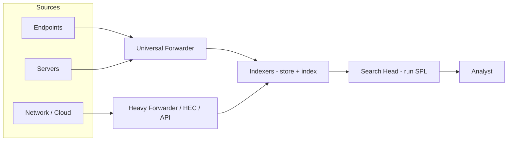
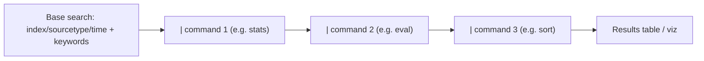
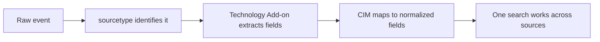
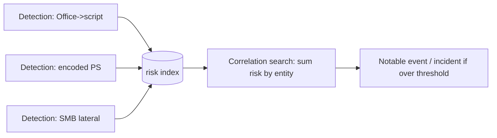
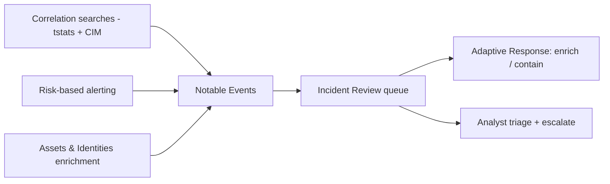

**Level:** Intermediate · **Track:** SOC & Blue Team · **Read time:** 175 min

This is Chapter 4 of the SOC & Blue Team notebook, and it is the first chapter where you put a real tool under your hands. The last three chapters built the frame: the SOC and its workflow (Chapter 1), the data sources (Chapter 2), and the technique-level thinking of ATT&CK (Chapter 3). Now we make it concrete. Splunk is one of the most widely deployed SIEMs in the world, and its search language, **SPL (Search Processing Language)**, is a skill that appears in job descriptions across the industry. By the end of this chapter you will be able to install Splunk, get data in, and write SPL that turns the raw logs of Chapter 2 into the technique-level detections of Chapter 3.

This is a **tool primer**, so we teach Splunk from zero — what it is, why it exists, how it is architected, and how to think in SPL — before writing a single detection. The goal is not to memorize commands but to build a mental model: SPL is a pipeline language, a series of commands connected by pipes, each transforming the data flowing through it, exactly like the `grep | awk | sort | uniq` pipelines from Chapter 2, but vastly more powerful. Once that model clicks, the dozens of commands become variations on a theme.

A framing note consistent with the notebook: everything here operates on data your organization is authorized to collect and analyze. Splunk is a monitoring tool for systems you own; the SPL you learn is for detecting attackers against your own environment. Use the free lab data and your own home lab (Chapter 1, Part 13f) to practice — never point analysis tooling at data you have no authority over.

We build from what a SIEM is and Splunk's place in the market, through architecture, getting data in, the anatomy of a search, the core SPL commands in depth, fields and extraction, statistical and transforming commands, lookups and enrichment, correlation across events, saved searches and alerting, dashboards, a full hands-on detection lab, performance and pitfalls, a consolidated detection-and-defense section, a final revision, a cheat sheet, and topic-specific practice.

## Why This Matters

SPL is where the abstract becomes employable. A hiring manager for a SOC role will not ask you to define "defense in depth" for long; they will put a dataset in front of you and ask you to find the attacker. That means writing searches: "show me failed logins grouped by source, then the ones that eventually succeeded," "find PowerShell with encoded commands," "surface hosts beaconing at regular intervals to rare domains." Every one of those is SPL, and every one maps back to an ATT&CK technique from Chapter 3. The language is the bridge between knowing what an attack looks like and actually catching it in your data.

Beyond hiring, SPL is the daily instrument of triage and hunting. When an alert fires, you pivot in SPL to answer "what happened next?" — the exact skill Chapter 1's lab demanded. When you threat-hunt, you form a hypothesis (Chapter 3) and express it as a search. When you build a detection, you write it in SPL and schedule it as an alert. The SIEM is the SOC's central nervous system (Chapter 1), and SPL is how you talk to it.

**Who this is for:** aspiring SOC analysts and detection engineers who will live in a SIEM, and anyone who wants a transferable, marketable skill. SPL concepts (pipeline search, stats, field extraction) also transfer conceptually to KQL (Chapter 5) and Elastic (Chapter 6), so this chapter does double duty as a foundation for all SIEM query languages.

## Part 1: What a SIEM Is (Recap and Deepening)

Chapter 1 introduced the SIEM as the SOC's central nervous system: it aggregates logs from across the environment, normalizes them, correlates them, and runs detection rules that generate alerts. Let us deepen that now that you have the data-source and technique context.

A SIEM does five things:

- **Collect** — ingest logs and telemetry from every source (Chapter 2's layers).
- **Normalize/parse** — turn heterogeneous formats into searchable fields (Chapter 2's schemas).
- **Store/index** — keep the data searchable, usually with time as the primary axis.
- **Detect/correlate** — run rules and correlations that fire alerts, mapped to techniques (Chapter 3).
- **Investigate** — let analysts search and pivot interactively during triage and hunting.

Splunk is a SIEM (and more — it started as a general log-analytics platform and is used well beyond security). Its defining trait is that it indexes data in a schema-flexible way and gives you a powerful search language to ask arbitrary questions of it. Where a traditional database needs you to define a schema before loading data, Splunk applies **schema-on-read**: it stores raw events and extracts fields *at search time*, which is what makes it so flexible for the messy, varied logs a SOC deals with.

The Splunk market context, briefly: Splunk pioneered searchable machine data and remains a market leader, especially in large enterprises; **Splunk Enterprise Security (ES)** is its dedicated SIEM app layering correlation searches, risk-based alerting, and dashboards on top of core Splunk. Competitors include Microsoft Sentinel (Chapter 5) and Elastic (Chapter 6). Learning Splunk gives you both a specific in-demand skill and the conceptual grounding for the others.

## Part 2: Splunk Architecture From Scratch

Before searching, understand what you are searching. Splunk's architecture has three core roles. In a small deployment they can live on one machine; at enterprise scale they are separate, clustered tiers.



- **Forwarders** — lightweight agents installed on sources that collect and ship data to indexers. The **Universal Forwarder (UF)** is a small, efficient agent that just forwards (the workhorse). A **Heavy Forwarder (HF)** can parse and route before forwarding. This is Chapter 2's "collection/forwarding" stage in Splunk terms.
- **Indexers** — receive data, parse it into events, and write it to disk in time-bucketed **indexes**. They do the storage and the heavy lifting at search time. Data lands in an **index** (think of it as a named container, e.g., `main`, `wineventlog`, `firewall`).
- **Search Heads** — where analysts run SPL. The search head distributes a search to the indexers, which each search their slice of data and return results to be merged. In a cluster, multiple search heads share saved searches and dashboards.

Two supporting concepts you must know:

- **HTTP Event Collector (HEC)** — an endpoint for sending data to Splunk over HTTP(S), common for cloud and application logs (agentless ingestion).
- **Deployment server** — centrally manages forwarder configurations at scale.

When data arrives, Splunk assigns every event three default **metadata fields** that you will use constantly:

- **`index`** — which index it landed in.
- **`sourcetype`** — the *kind* of data (e.g., `WinEventLog:Security`, `access_combined`, `cisco:asa`). This drives field extraction — the single most important field for a searcher, because it tells Splunk (and you) how to interpret the event.
- **`source`** — the origin (file path, input).
- **`host`** — the machine that produced it.

Understanding this pipeline answers real questions: "why is my data missing?" (forwarder down, wrong index, parsing error) maps directly onto Chapter 2's pipeline-health lesson.

## Part 3: Getting Data In (and Trying It Yourself)

You learn SPL fastest with data to search. The free options:

- **Splunk Free / Splunk Enterprise trial** — install locally; the trial is full-featured for 60 days, then Splunk Free continues with a daily ingest limit, fine for a lab.
- **Splunk Cloud trial** — hosted.
- **Boss of the SOC (BOTS)** datasets — free, realistic security datasets built for exactly this kind of practice; the gold standard for learning SPL against real attack scenarios.

A minimal local install and data load (Linux):

```bash
# Download and install Splunk Enterprise (trial)
wget -O splunk.tgz 'https://download.splunk.com/.../splunk-<ver>-Linux-x86_64.tgz'
tar xzf splunk.tgz -C /opt
/opt/splunk/bin/splunk start --accept-license   # set admin password on first run
/opt/splunk/bin/splunk enable boot-start

# Web UI now at http://localhost:8000
# Add data: Settings > Add Data > Upload  -> pick a log file, set sourcetype, index
```

To ingest from a host, install a Universal Forwarder and point it at your indexer:

```bash
# On the source host, after installing the UF:
/opt/splunkforwarder/bin/splunk add forward-server INDEXER_IP:9997
/opt/splunkforwarder/bin/splunk add monitor /var/log/         # monitor a path
/opt/splunkforwarder/bin/splunk restart
```

Once data is in, everything else is SPL. The rest of this chapter assumes you have *some* data — ideally BOTS, or your own home-lab telemetry from Chapter 1 (Sysmon, Windows events, firewall).

## Part 4: The Anatomy of a Search

Open the Search & Reporting app and you get a search bar and a time picker. **The time picker is not optional** — Splunk is time-series-first, and choosing "Last 24 hours" vs "All time" is the difference between a fast search and one that scans everything. Always scope time.

A Splunk search is a **pipeline**: a base search that retrieves events, followed by a series of commands separated by pipes (`|`), each transforming the result set.

```
index=wineventlog sourcetype=WinEventLog:Security EventCode=4625
| stats count by src_ip, user
| sort - count
```

Read it as a sentence: *from the Windows security index, get failed-logon events (4625), count them by source IP and user, and sort by count descending.* Each stage feeds the next, left to right. That is the whole mental model — **retrieve, then transform, then transform again.**

The base search (before the first pipe) is where you should be as specific as possible, because it determines how much data Splunk has to read. `index=`, `sourcetype=`, and time are your best friends; the more you constrain here, the faster everything downstream. Everything after a pipe is a **search command**.



Splunk commands fall into rough families you will come to recognize:

- **Streaming** — act on each event as it flows (`eval`, `rex`, `where`, `fields`).
- **Transforming** — turn events into a results table (`stats`, `chart`, `timechart`, `top`, `rare`).
- **Generating** — produce their own data (`tstats`, `inputlookup`, `makeresults`).
- **Orchestrating** — control flow (`append`, `join`, `map`).

## Part 5: Core SPL Commands, In Depth

Here is the working toolkit, each taught with a real security example. Master these ten and you can write the vast majority of detections.

### search — filter events

The implicit first command. You can also use `search` after a pipe to filter further. Keywords, field comparisons, booleans, and wildcards all work:

```
index=firewall action=blocked dest_port=3389            # blocked RDP attempts
index=web sourcetype=access_combined status>=400        # HTTP errors
index=main ("powershell" AND "-enc") NOT user=svc_backup  # boolean + exclusion
index=main user=a* dest_ip=10.0.*                        # wildcards
```

**Tip:** field comparisons in the base search (`status>=400`) are efficient; save `where`/`eval` for computed conditions.

### stats — aggregate

The single most important transforming command. It computes aggregate statistics grouped by fields.

```
index=wineventlog EventCode=4625
| stats count AS failures,
        dc(user) AS distinct_users,
        values(user) AS users_tried,
        earliest(_time) AS first, latest(_time) AS last
  by src_ip
| sort - failures
```

Common `stats` functions: `count`, `dc()` (distinct count), `sum()`, `avg()`, `min()`, `max()`, `values()` (unique list), `list()` (all values), `earliest()`/`latest()`. **`dc(user)` from one source IP is how you spot password spraying** (one source, many users) versus brute force (one source, one user, high count) — the Chapter 2 distinction, now expressed in SPL.

### eval — compute new fields

`eval` creates or modifies fields with expressions — arithmetic, string functions, conditionals.

```
index=firewall
| eval MB_out = round(bytes_out/1024/1024, 2)
| eval risk = if(MB_out > 500 AND dest_category="cloud_storage", "high", "normal")
| where risk="high"
```

`eval` supports `if()`, `case()`, `coalesce()`, `strftime()`/`strptime()` (time formatting), `upper()/lower()`, `len()`, `mvcount()`, and much more. It is your Swiss-army knife for shaping data.

### where — filter on computed conditions

Like `search` but evaluates expressions and compares fields to fields:

```
index=proxy
| stats sum(bytes_out) AS total by src_ip, dest
| where total > 1073741824          # > 1 GB exfil candidate
```

### rex — extract fields with regex

When a field is not already parsed, `rex` pulls it out at search time using named capture groups:

```
index=main sourcetype=linux_secure "Failed password"
| rex "from (?<src_ip>\d+\.\d+\.\d+\.\d+) port (?<src_port>\d+)"
| stats count by src_ip
```

This is Chapter 2's "parsing" done ad hoc in the search — invaluable when a source is not fully fielded.

### top / rare — quick frequency analysis

```
index=dns | top limit=20 query                 # most-queried domains
index=dns | rare limit=20 query                 # rarest domains (often malicious!)
```

`rare` is a hunting favorite: **the rarest DNS queries or user agents are often the malicious ones** — an idea straight from Chapter 3's "rare destination" C2 detection.

### timechart — trends over time

```
index=firewall action=blocked
| timechart span=1h count by dest_port
```

`timechart` buckets by time and is how you visualize beaconing, spikes, and diurnal patterns. Regular, evenly-spaced peaks from one host = possible C2 beacon.

### fields, rename, sort, head/tail — shaping output

```
index=wineventlog EventCode=4624
| fields _time, user, src_ip, LogonType         # keep only these (faster)
| rename LogonType AS logon_type
| sort - _time
| head 100                                       # first 100
```

`| fields x,y` early in a pipeline speeds things up by discarding data you do not need. `head`/`tail` limit rows; `dedup` removes duplicates.

### lookup — enrich with external context

Lookups join your events to reference tables (CSV or KV store) — asset criticality, user roles, IOC lists — Chapter 1's enrichment made real:

```
index=firewall
| lookup threat_intel_ips ip AS dest_ip OUTPUT threat_actor, confidence
| where isnotnull(threat_actor)
```

Here a lookup table `threat_intel_ips` maps IPs to known actors; the search flags any destination that matches. This is how IOC matching (Chapter 2) is wired into Splunk.

### transaction — group related events

`transaction` stitches events sharing a field into a single grouped event, useful for sessions:

```
index=web sourcetype=access_combined
| transaction clientip maxpause=5m
| where eventcount > 100                          # sessions with 100+ requests
```

Powerful but expensive — prefer `stats` where you can (see Part 11 on performance).

## Part 6: Fields, Sourcetypes, and Extraction

Splunk's power comes from **fields**. Some are extracted automatically (Splunk recognizes key-value pairs and JSON); others need help. Understanding extraction saves you constant frustration.

- **Automatic extraction** — for well-structured data (key=value, JSON), Splunk auto-fields at search time. `index=cloudtrail | table eventName, sourceIPAddress` just works because CloudTrail is JSON.
- **Sourcetype-based extraction** — Splunk apps (Technology Add-ons / TAs) ship field extractions and CIM mappings for common sources. The **Splunk Add-on for Microsoft Windows** and **Sysmon TA** field-extract Windows/Sysmon events so `EventCode`, `user`, `src_ip`, `parent_process`, etc. are ready to use. **Install the right TA for each source** — it is the difference between clean fields and raw text.
- **Manual extraction** — `rex` at search time (Part 5), or persistent field extractions defined in `props.conf`/`transforms.conf`.

The **Common Information Model (CIM)** from Chapter 2 matters here: TAs map source-specific fields to CIM's normalized names (e.g., both firewall and proxy `dest`→`dest`, user fields→`user`), so a single CIM-compliant search works across sources. Splunk ES and many detections are written against CIM data models via `tstats` for speed.



## Part 7: Building Real Detections in SPL

Now the payoff: turning Chapter 3's technique recipes into working SPL. Each of these is a detection you could schedule as an alert.

### Brute force and password spraying (T1110)

```
# Brute force: many failures for one account from one source
index=wineventlog EventCode=4625
| stats count AS failures, values(user) AS users, dc(user) AS nusers by src_ip
| where failures > 30 AND nusers <= 2

# Password spraying: one source, one/few attempts each across MANY users
index=wineventlog EventCode=4625
| bucket _time span=10m
| stats dc(user) AS users_targeted, count AS attempts by src_ip, _time
| where users_targeted > 10 AND attempts < users_targeted*3
```

The two searches encode the exact distinction from Chapter 2: brute force = high count / few users; spraying = many distinct users / few attempts each.

### Successful login after brute force

```
index=wineventlog (EventCode=4625 OR EventCode=4624)
| stats count(eval(EventCode=4625)) AS fails,
        count(eval(EventCode=4624)) AS successes,
        latest(eval(if(EventCode=4624,_time,null()))) AS success_time
  by src_ip, user
| where fails > 20 AND successes > 0
```

This surfaces the dangerous pattern — a flood of failures *followed by a success* — the highest-signal outcome from Chapter 2's brute-force lesson.

### Office spawning a script interpreter (T1204/T1566)

```
index=sysmon EventCode=1
  (ParentImage="*\\winword.exe" OR ParentImage="*\\excel.exe"
   OR ParentImage="*\\powerpnt.exe" OR ParentImage="*\\outlook.exe")
  (Image="*\\powershell.exe" OR Image="*\\cmd.exe"
   OR Image="*\\wscript.exe" OR Image="*\\mshta.exe")
| table _time, host, User, ParentImage, Image, CommandLine
```

Directly implements Chapter 3's most valuable early detection.

### Encoded/suspicious PowerShell (T1059.001)

```
index=sysmon EventCode=1 Image="*\\powershell.exe"
| eval susp = case(
    match(CommandLine,"(?i)-enc"), "encoded",
    match(CommandLine,"(?i)-w\s+hidden"), "hidden",
    match(CommandLine,"(?i)downloadstring|iex|invoke-expression"), "download_cradle",
    1==1, "other")
| where susp != "other"
| table _time, host, User, susp, CommandLine
```

### Kerberoasting (T1558.003)

```
index=wineventlog EventCode=4769
  Ticket_Options=0x40810000 Ticket_Encryption_Type=0x17   # RC4, weak
| stats dc(Service_Name) AS services, count AS requests by Account_Name, src_ip
| where services > 5
```

Uses data (4769) you likely already collect — Chapter 3's "cheap gap to close."

### C2 beaconing (T1071.001)

```
index=proxy OR index=firewall
| bucket _time span=1m
| stats count by src_ip, dest, _time
| stats avg(count) AS avg, stdev(count) AS sd,
        dc(_time) AS active_minutes by src_ip, dest
| where active_minutes > 30 AND sd < 1        # very regular = beacon-like
```

Regular-interval, low-variance connections to one destination — the network signature of a beacon.

### Cleared event logs (T1070.001)

```
index=wineventlog EventCode=1102
| table _time, host, user
```

Near-pure signal; alert on every occurrence.

### Data exfiltration to cloud storage (T1567.002)

```
index=proxy dest_category="cloud_storage"
| stats sum(bytes_out) AS total_bytes by src_ip, user, dest
| eval GB = round(total_bytes/1024/1024/1024, 2)
| where GB > 1
| sort - GB
```

Each of these carries an ATT&CK tag in its name/metadata, keeping the heatmap from Chapter 3 honest and current.

## Part 8: Correlation and Risk-Based Alerting in Splunk

Chapter 3 introduced risk-based alerting (RBA): accumulate per-entity risk from many technique detections and fire one high-confidence incident. Splunk ES implements this directly, but you can express the idea in core SPL. The pattern: each detection writes a "risk event" (via `collect` into a risk index) with a score and the entity; a correlation search sums risk per entity.

```
# Correlation search: entities crossing a risk threshold in 24h
index=risk earliest=-24h
| stats sum(risk_score) AS total_risk,
        values(source) AS contributing_detections,
        dc(source) AS distinct_detections by risk_object
| where total_risk >= 80 OR distinct_detections >= 3
| sort - total_risk
```

This turns a dozen scattered medium alerts on one host into a single, prioritized incident — the alert-fatigue fix from Chapters 1 and 3. Splunk ES's **Risk Framework** and **Notable Events** productize this, but understanding the SPL underneath demystifies it.



## Part 9: Alerts, Saved Searches, and Dashboards

A detection is only useful if it runs continuously and notifies someone. In Splunk:

- **Saved search** — a stored SPL query you can run on demand or on a schedule.
- **Scheduled alert** — a saved search that runs on a cron schedule and triggers an action when results meet a condition (e.g., "number of results > 0"). Actions include emailing, creating a ticket, running a script/webhook, or (in ES) creating a Notable Event.
- **Real-time alert** — fires as matching events arrive (powerful but resource-heavy; use sparingly).

Creating an alert from a search (conceptually): run the SPL, **Save As → Alert**, set the schedule (e.g., every 5 minutes over the last 5 minutes), the trigger condition (results > 0), throttling (suppress duplicate alerts for N minutes to avoid a storm), severity, and the action. Throttling and good trigger conditions are what keep a detection from becoming the alert-fatigue problem it was meant to solve.

**Dashboards** turn searches into visual panels — a SOC overview (top source IPs, alert volume by severity, geographic sign-in map, failed-vs-successful logon trend). Built from saved searches, dashboards give analysts situational awareness at a glance. Keep them focused: a dashboard that tries to show everything shows nothing.

```
# A dashboard panel: failed logons over time by source
index=wineventlog EventCode=4625
| timechart span=1h count by src_ip limit=10
```

## Part 10: Hands-On Lab — Hunt an Intrusion in Splunk

This lab reproduces the multi-source intrusion from Chapters 2–3, now as SPL you run against BOTS-style data. Follow the reasoning; adapt field names to your dataset.

**Scenario.** Suspicious activity reported on host `WKS-2291` / user `m.singh`. Hunt it.

### Step 1 — Scope and orient

```
index=* host=WKS-2291 earliest=-24h
| stats count by sourcetype
```

This shows which data sources you have for the host (Sysmon, WinEventLog, firewall, proxy). Orientation first — know your telemetry before diving in.

### Step 2 — Find the initial execution

```
index=sysmon host=WKS-2291 EventCode=1 ParentImage="*\\winword.exe"
| table _time, Image, CommandLine, User
```

Expected: `winword.exe` spawning `powershell.exe` with an encoded command — Initial Access + Execution confirmed.

### Step 3 — Decode and pivot to C2

```
index=sysmon host=WKS-2291 EventCode=3 Image="*\\powershell.exe"
| table _time, DestinationIp, DestinationHostname, DestinationPort
```

Reveals the outbound connection to the attacker IP/domain. Cross-check DNS:

```
index=dns host=WKS-2291
| stats count by query, answer
| sort - count
```

The rare domain resolving to the C2 IP is your durable IOC.

### Step 4 — Hunt the IOC across the fleet

```
index=dns query="cdn-updates.xyz"
| stats values(host) AS affected_hosts, count by query
```

Did other hosts resolve the same domain? This scopes the incident beyond patient zero — the Chapter 2 pivot.

### Step 5 — Detect lateral movement and collection

```
index=wineventlog EventCode=4624 LogonType=3 user=m.singh
| stats count by src_ip, dest, ComputerName
```

```
index=wineventlog EventCode=4663 Object_Name="*\\Finance\\*"
| search Account_Name=m.singh
| table _time, Object_Name, Accesses
```

Confirms the SMB logon to the file server and the access to `payroll.xlsx` — Lateral Movement + Collection.

### Step 6 — Assemble the timeline

```
index=* host=WKS-2291 OR (user=m.singh)
    earliest="02/12/2027:08:00:00" latest="02/12/2027:10:00:00"
| eval summary=coalesce(CommandLine, Object_Name, query, signature)
| table _time, sourcetype, host, user, summary
| sort _time
```

This unified, time-sorted view *is* the incident narrative — the Chapter 2 timeline skill, now one search. From here you map to ATT&CK (Chapter 3), disposition, and escalate (Chapter 1). The whole notebook so far, executed in Splunk.

### Step 7 — Turn the hunt into a detection

The most important step: convert what you found into a scheduled alert so it catches the *next* one automatically.

```
# Saved as an alert, every 5 min, trigger if results > 0
index=sysmon EventCode=1 ParentImage="*\\winword.exe"
  (Image="*\\powershell.exe" OR Image="*\\cmd.exe" OR Image="*\\mshta.exe")
| table _time, host, User, ParentImage, Image, CommandLine
```

That is the feedback loop from Chapter 1, closed in Splunk: an incident became a durable, technique-level detection.

## Part 11: Performance, Pitfalls, and Good SPL Hygiene

Bad SPL is slow SPL, and in a busy SOC slow searches cost real time. The habits that matter:

- **Constrain the base search.** Always specify `index=`, `sourcetype=`, and a tight time range. `index=* | search ...` scans everything — the classic beginner mistake.
- **Filter early, transform late.** Do keyword and field filtering before `stats`/`eval`, so less data flows downstream. Use `| fields` to drop unneeded fields early.
- **Prefer `stats` over `transaction` and `join`.** `transaction` and `join` are expensive and have limits; most correlation can be done with `stats ... by` and `eval`. Reach for `join` only when you truly must combine differently-shaped datasets.
- **Use `tstats` for scale.** `tstats` runs against indexed/accelerated data (tsidx, data models) and is dramatically faster for large-scale aggregation — the basis of Splunk ES detections.
- **Beware wildcards at the start of a term.** `*evil` forces a full scan; `evil*` can use the index. Leading wildcards are slow.
- **Understand search modes.** "Fast" mode skips field discovery for speed; "Verbose" extracts everything (slower). Use Fast for known-field searches.
- **Mind case and field names.** SPL keywords are case-insensitive for search terms but field *names* are case-sensitive, and `EventCode` vs `event_code` depends on your TA. Confirm field names with `| fieldsummary` or the fields sidebar.

| Pitfall | Symptom | Fix |
|---------|---------|-----|
| `index=*` everywhere | Slow, expensive searches | Always name index + sourcetype |
| Leading wildcard `*term` | Full scan | Anchor terms; use `term*` |
| Overusing `join`/`transaction` | Timeouts, truncation | Rebuild with `stats by` |
| No time bound | Scans all time | Set the time picker |
| Wrong field names | Empty results | Check TA/CIM field names |
| Real-time alerts everywhere | Indexer load | Use scheduled alerts |

## Part 11b: More SPL You Will Actually Use

The ten core commands cover most work, but a handful more come up constantly in real detection engineering. Each is worth knowing on sight.

### streamstats and eventstats — stats without collapsing rows

`stats` collapses events into a summary table; sometimes you want the aggregate *added to each event*. `eventstats` computes an aggregate across all results and adds it as a field to every row; `streamstats` does it cumulatively in order (great for time-series like beacon-interval analysis).

```
# Add each user's average logon count next to every event (eventstats)
index=wineventlog EventCode=4624
| eventstats avg(count) AS user_avg by user

# Time between consecutive connections per host (streamstats) - beacon hunting
index=proxy
| sort 0 src_ip _time
| streamstats current=f last(_time) AS prev_time by src_ip, dest
| eval delta = _time - prev_time
| stats avg(delta) AS avg_interval, stdev(delta) AS jitter by src_ip, dest
| where avg_interval > 30 AND jitter < 5     # regular interval = beacon
```

That beacon search is more precise than the Part 7 version because it measures the *interval between* connections and its variance directly — low jitter is the hallmark of automated C2.

### bin/bucket — group time (and numbers) into buckets

```
index=wineventlog EventCode=4625
| bin _time span=5m
| stats count by _time, src_ip           # failures per 5-minute window
```

### subsearches — feed one search into another

A subsearch (in square brackets) runs first and returns values used by the outer search. Great for "find X, then look up everything those X did."

```
# Find all activity from IPs that failed login more than 100 times
index=wineventlog EventCode=4624 [
    search index=wineventlog EventCode=4625
    | stats count by src_ip
    | where count > 100
    | fields src_ip
]
```

Subsearches are powerful but bounded (default 10k results / 60s) — keep them small; for big joins, prefer `stats`.

### spath and JSON — parse structured logs

For JSON (cloud, EDR), `spath` extracts nested fields:

```
index=cloudtrail
| spath path=userIdentity.userName output=user
| spath path=responseElements.ConsoleLogin output=result
| search eventName=ConsoleLogin result=Failure
| stats count by user, sourceIPAddress
```

### fillnull, mvexpand, makemv — tidy messy data

```
index=firewall | fillnull value="unknown" user           # replace nulls
index=proxy | makemv delim="," categories | mvexpand categories  # split multivalue
```

### macros — reuse SPL

A **macro** is a saved SPL snippet you call with backticks, keeping detections DRY. Define `windows_failed_logon` once as `index=wineventlog EventCode=4625` and reuse it:

```
`windows_failed_logon`
| stats count by src_ip
```

Macros are how mature Splunk content stays maintainable — change the definition once and every detection using it updates.

### eval function mini-reference

```
if(cond, a, b)                       case(c1,v1, c2,v2, 1==1,default)
coalesce(a,b,c)                      match(field,"regex")
round(x,2)  len(s)  lower(s)         strftime(_time,"%Y-%m-%d %H:%M")
mvcount(mv)  mvindex(mv,0)           cidrmatch("10.0.0.0/8", ip)
```

`cidrmatch()` deserves a callout — it is how you test whether an IP is in a subnet, essential for "external vs internal" logic in detections.

## Part 11c: A Detection Gallery (Ten More, ATT&CK-Mapped)

Reps build fluency. Here are ten more production-flavored detections, each mapped to a technique; read them as patterns to adapt.

```
# 1. New service installed (T1543.003 Persistence)
index=wineventlog (EventCode=7045 OR EventCode=4697)
| table _time, host, Service_Name, Service_File_Name, user

# 2. Scheduled task created (T1053.005 Persistence)
index=wineventlog EventCode=4698
| table _time, host, Task_Name, user

# 3. New local/domain admin added (T1098 / privilege abuse)
index=wineventlog (EventCode=4728 OR EventCode=4732)
    Group_Name="*Admins*"
| table _time, host, Group_Name, Member_Name, Subject_User_Name

# 4. LSASS access by unusual process (T1003.001 Credential Access)
index=sysmon EventCode=10 TargetImage="*\\lsass.exe"
| search NOT (SourceImage IN ("*\\MsMpEng.exe","*\\csrss.exe","*\\wininit.exe"))
| table _time, host, SourceImage, GrantedAccess

# 5. DCSync-like directory replication (T1003.006)
index=wineventlog EventCode=4662
    Properties="*1131f6aa-9c07-11d1-f79f-00c04fc2dcd2*"
| search NOT src_host IN (known_domain_controllers)
| table _time, Account_Name, src_host

# 6. Suspicious LOLBins with network args (T1218 Defense Evasion)
index=sysmon EventCode=1
    (Image="*\\certutil.exe" OR Image="*\\bitsadmin.exe" OR Image="*\\mshta.exe")
    (CommandLine="*http*" OR CommandLine="*ftp*")
| table _time, host, Image, CommandLine

# 7. RDP to servers at odd hours (T1021.001 Lateral Movement)
index=wineventlog EventCode=4624 LogonType=10
| eval hour=strftime(_time,"%H")
| where hour < 6 OR hour > 22
| stats count by user, src_ip, ComputerName

# 8. Mass file access / possible collection (T1039)
index=wineventlog EventCode=4663 Object_Name="*\\Finance\\*"
| stats dc(Object_Name) AS files by Account_Name
| where files > 50

# 9. DNS tunneling suspicion (T1048 Exfiltration over DNS)
index=dns
| eval qlen=len(query)
| stats avg(qlen) AS avg_len, count by src_ip
| where avg_len > 50 AND count > 1000

# 10. Audit policy changed (T1562 Defense Evasion)
index=wineventlog EventCode=4719
| table _time, host, user, Subcategory
```

Notice the common shape: constrain to the relevant source, key on the *behavior*, then either `table` for hunting or `stats ... | where` for a thresholded alert. Adapt the field names to your TA and you have ten more heatmap cells covered.

## Part 11d: Data Models, Acceleration, and tstats

At enterprise scale, searching raw events is too slow for detections that must run every few minutes over billions of events. Splunk's answer is **data models** and **acceleration**.

- A **data model** is a structured, hierarchical mapping of your data onto CIM (Chapter 2) — e.g., the "Authentication" data model normalizes every auth source into common fields (`Authentication.user`, `Authentication.action`, `Authentication.src`).
- **Acceleration** pre-computes summary indexes (tsidx) for a data model, so aggregate queries are near-instant.
- **`tstats`** queries those accelerated summaries directly and is often 10–100× faster than the equivalent raw search.

```
# Fast: count failed auths by source across ALL auth sources via the data model
| tstats count from datamodel=Authentication
    where Authentication.action=failure
    by Authentication.src, Authentication.user
| rename Authentication.* AS *
| where count > 30
```

Splunk Enterprise Security's out-of-the-box correlation searches are written this way — against accelerated CIM data models with `tstats` — which is why they can run continuously at scale. You do not need ES to benefit: accelerating a data model for your busiest sources (auth, network, endpoint) makes your own scheduled detections fast enough to run frequently. **Blue team usage:** if a scheduled detection is skipping runs because it takes too long, converting it to `tstats` against an accelerated data model is usually the fix.

## Part 11e: Splunk Enterprise Security — The SIEM App

Core Splunk gives you search, alerts, and dashboards. **Splunk Enterprise Security (ES)** is the premium app that turns Splunk into a full SIEM with SOC-oriented workflow on top. You may not have ES in a home lab, but you will meet it on the job, so know the vocabulary.

- **Notable Events** — ES's version of alerts: when a **correlation search** fires, it creates a Notable Event with severity, the entities involved, and the contributing evidence. These are the "alerts" a Tier 1 analyst triages (Chapter 1's queue).
- **Incident Review** — the queue interface where analysts see, own, triage, and update Notable Events (assign, change status, add notes, escalate) — the alert lifecycle from Chapter 1 in a product.
- **Correlation Searches** — scheduled `tstats`-backed detections (against CIM data models) that generate Notables; ES ships hundreds mapped to ATT&CK, and you write your own.
- **Risk-Based Alerting (RBA) / Risk Framework** — the productized version of Part 8: detections assign risk to a risk object (user/host), and a risk-incident rule raises a Notable when accumulated risk crosses a threshold. This is the modern way ES fights alert fatigue.
- **Adaptive Response** — automated actions attached to Notables (enrich, disable an account, isolate a host via an EDR integration) — SOAR-style automation (Chapter 1) inside ES.
- **Assets & Identities** — lookup frameworks that enrich every event with asset criticality and user identity automatically — Chapter 1's enrichment, built in.
- **Security Posture / Glass Tables** — executive dashboards summarizing the SOC's state.



The takeaway: ES is not a different skill — it is the Chapter 1 workflow (queue, triage, enrich, respond, RBA) wrapped around the SPL you already know. Everything you learned writing raw searches and the risk-index pattern is exactly what ES automates. If a job posting says "Splunk ES," it means these concepts plus the SPL fundamentals of this chapter.

## Part 11f: An Investigation Workflow Template

To make triage repeatable in Splunk, keep a mental (or literal) template. For any host/user alert:

```
1. SCOPE     index=* host=<h> OR user=<u> earliest=-24h | stats count by sourcetype
2. EXECUTION index=sysmon host=<h> EventCode=1 | table _time Image ParentImage CommandLine
3. NETWORK   index=sysmon host=<h> EventCode=3 | table _time Image DestinationIp DestinationPort
4. DNS       index=dns host=<h> | stats count by query answer | sort - count
5. AUTH      index=wineventlog (EventCode=4624 OR 4625) user=<u> | table _time EventCode src_ip LogonType
6. PERSIST   index=wineventlog (EventCode=7045 OR 4697 OR 4698) host=<h>
7. FLEET     <pivot the IOC/domain/hash across all hosts>
8. TIMELINE  index=* host=<h> OR user=<u> earliest=<t0> latest=<t1> | sort _time
9. MAP+ACT   map to ATT&CK, disposition, escalate, operationalize as a detection
```

Working from a template keeps you from tunnel-visioning on the first interesting event and forgetting to check persistence or scope the fleet — the disciplined triage from Chapter 1, expressed as a Splunk runbook.

## Part 12: Detection & Defense Angle (Consolidated)

SPL is the instrument; here is how to wield it well as a defender.

**Write detections mapped to techniques, not to one-off indicators.** Every SPL detection should target an ATT&CK technique and carry its ID (Chapter 3). "Office spawns a script interpreter" (behavioral) ages far better than "block this hash" (indicator). SPL makes behavioral logic expressible — use that power.

**Tune with precise exclusions, measured against both FP and FN.** When a detection is noisy, narrow it with specific, verified-benign context (`NOT (user=svc_scanner AND host=known_scanner)`), never broad suppression. Track the false-positive rate (Chapter 1) as you tune, and ask each time whether the exclusion could hide a real attack.

**Correlate for confidence via risk-based alerting.** Individually weak signals combine into strong ones. Use the risk-index pattern (Part 8) so a chain of medium detections on one entity escalates as a single high-severity incident — this is both the alert-fatigue fix and the confidence boost.

**Enrich in-search with lookups.** Asset criticality, user role, and threat-intel lookups turn a bare event into a triage-ready alert (Chapter 1's enrichment). Wire IOC lists in as lookups, but remember they are low on the Pyramid of Pain — enrichment, not your primary detection.

**Schedule, throttle, and name alerts for the human.** A detection that is not scheduled is a hunt, not a control. Schedule it, throttle to prevent storms, give it a clear name and a one-line "why this fired," and link the playbook (Chapter 1). Design for the 3 a.m. analyst.

**Hunt in SPL, then operationalize.** Use interactive SPL to hunt hypotheses from threat intel (Chapter 3), and whenever a hunt finds something, convert it into a scheduled detection (Part 10, Step 7). That is how the SOC's coverage grows with every investigation.

**Monitor Splunk itself.** A dead forwarder or a broken TA silently blinds you (Chapter 2's source-health lesson). Use Splunk's monitoring console and searches like `| metadata type=hosts index=*` to spot sources that stopped reporting.

## Part 13: Final Revision / Summary

A **SIEM** collects, normalizes, stores, detects, and lets analysts investigate; **Splunk** is a market-leading SIEM built on **schema-on-read** — it stores raw events and extracts fields at search time, which is why it handles messy logs so well. Its **architecture** is forwarders (Universal/Heavy) shipping data to **indexers** (store + index into named **indexes**, tagged by **sourcetype/source/host**), searched from **search heads** running **SPL**. Getting data in (local install, forwarders, HEC, or BOTS datasets) is the prerequisite to practicing.

**SPL is a pipeline language**: a constrained base search (`index`/`sourcetype`/time) followed by commands joined by pipes, each transforming the results — the `grep|awk|sort|uniq` idea at scale. The core toolkit: **`search`** (filter), **`stats`** (aggregate — `count`, `dc()`, `values()`, `earliest/latest`), **`eval`** (compute fields, `if/case`), **`where`** (filter computed), **`rex`** (regex extraction), **`top`/`rare`** (frequency — rare is a hunting favorite), **`timechart`** (trends/beaconing), shaping commands (`fields`, `rename`, `sort`, `dedup`, `head`), **`lookup`** (enrichment/IOC matching), and **`transaction`** (grouping, used sparingly). **Fields** come from automatic extraction, **Technology Add-ons**, and manual `rex`; the **CIM** normalizes them so one search works across sources.

We built real, ATT&CK-mapped detections: brute force vs spraying (via `dc(user)`), success-after-brute-force, Office-spawns-interpreter, encoded PowerShell, Kerberoasting (RC4 4769), C2 beaconing (low-variance intervals), cleared logs (1102), and cloud exfil. **Correlation/risk-based alerting** (a risk index summed per entity) turns many weak signals into one high-confidence incident — the alert-fatigue fix. Detections become value only as **scheduled, throttled, well-named alerts** and focused **dashboards**. The **lab** hunted an intrusion end to end — scope, find execution, pivot to C2, hunt the IOC across the fleet, detect lateral movement and collection, assemble the timeline, and *operationalize the hunt into a detection*. Finally, **good SPL hygiene** — constrain the base search, filter early, prefer `stats` over `join`/`transaction`, use `tstats` at scale, avoid leading wildcards — is what makes detection fast enough to matter.

## Part 14: Cheat Sheet / Quick Reference

**Search structure**
```
index=X sourcetype=Y earliest=-24h keyword field=value
| command1 | command2 | ...
```

**Metadata fields**
- `index` · `sourcetype` (drives extraction) · `source` · `host` · `_time`.
- `_raw` holds the original event text; `_time` is the event timestamp (the axis of everything).

**Core commands**
- `stats count/dc()/sum()/avg()/values()/earliest()/latest() by field`
- `eval newfield = if()/case()/round()/strftime()`
- `where <computed condition>`
- `rex "(?<name>regex)"`  — extract at search time
- `top` / `rare` field  — frequency (rare = hunt)
- `timechart span=1h count by field`  — trends/beaconing
- `fields`, `rename x AS y`, `sort - field`, `dedup`, `head N`
- `lookup table key OUTPUT cols`  — enrichment/IOC
- `transaction field maxpause=5m`  — group (sparingly)
- `tstats` — fast aggregation on accelerated data

**Command families**
- Streaming (`eval`,`rex`,`where`,`fields`) · Transforming (`stats`,`chart`,`timechart`,`top`,`rare`) · Generating (`tstats`,`inputlookup`,`makeresults`) · Orchestrating (`append`,`join`,`map`).

**Detection snippets (ATT&CK)**
- Brute force: `EventCode=4625 | stats count values(user) dc(user) by src_ip`
- Spraying: `bucket _time span=10m | stats dc(user) by src_ip,_time`
- Office→script: `EventCode=1 ParentImage=*winword.exe Image=*powershell.exe`
- Encoded PS: `match(CommandLine,"(?i)-enc|iex|downloadstring")`
- Kerberoast: `EventCode=4769 Ticket_Encryption_Type=0x17 | stats dc(Service_Name) by Account_Name`
- Cleared logs: `EventCode=1102`
- Cloud exfil: `dest_category=cloud_storage | stats sum(bytes_out) by user,dest`

**Alerting**
- Save As → Alert → schedule (cron) → trigger (results>0) → throttle → action (email/ticket/webhook/notable).
- Throttle on the entity field (host/user) to prevent one incident from storming the queue.

**Performance rules**
- Name index+sourcetype+time · filter early, `| fields` early · `stats` over `join`/`transaction` · `tstats` at scale · no leading `*wildcard`.
- Field names are case-sensitive; search terms are not. Confirm names with the fields sidebar or `| fieldsummary`.

**Risk-based alerting**
- Detections write to a `risk` index with score+entity → correlation search sums per entity → notable if over threshold.

**More commands**
- `eventstats` (global aggregate onto each row) · `streamstats` (cumulative/ordered — beacon intervals) · `bin/bucket` (group time) · `spath` (JSON) · `fillnull` · `mvexpand` · `[subsearch]` · `` `macro` `` · `tstats` (accelerated).

**Handy eval functions**
- `if() case() coalesce() match() round() strftime() cidrmatch("10.0.0.0/8",ip) mvcount() len() lower()`.

**Splunk ES vocabulary**
- Notable Event (=alert) · Incident Review (=queue) · Correlation Search (=detection) · Risk Framework (=RBA) · Adaptive Response (=SOAR action) · Assets & Identities (=enrichment).

**Investigation template**
- Scope → Execution (Sysmon 1) → Network (Sysmon 3) → DNS → Auth (4624/4625) → Persistence (7045/4697/4698) → Fleet pivot → Timeline → Map+Act.

**Where to find ready detections**
- research.splunk.com (Splunk Security Content) — production SPL mapped to ATT&CK.

**Time-range syntax**
- Relative: `earliest=-24h latest=now` · `earliest=-7d@d` (snap to day).
- Absolute: `earliest="02/12/2027:08:00:00"`.
- Always set a bound — unbounded searches scan all time.

**Search modes**
- Fast (skip field discovery, quickest) · Smart (default) · Verbose (all fields, slowest). Use Fast for known-field detections.

## Part 15: Practice Labs & Resources

- **Splunk Boss of the SOC (BOTS) v1/v2/v3** (free datasets + guided questions) — the single best way to practice everything in this chapter against realistic attack data. Do the guided version, then the open scenario.
- **Splunk Search Tutorial & free "Search Under the Hood" docs** — the official SPL fundamentals.
- **Splunk `search-reference` docs** — the authoritative per-command reference; bookmark `stats`, `eval`, `rex`, `tstats`, `streamstats`.
- **Splunk Fundamentals 1 (free eLearning)** — structured intro to search, fields, and reporting.
- **TryHackMe — *Splunk: Basics*, *Splunk 2*, *Splunk 3*, *Investigating with Splunk*, *Benign* rooms** — hands-on SPL and investigation.
- **TryHackMe — *Splunk: Exploring SPL* and *Splunk: Data Manipulation*** — deeper drills on the transforming commands and field extraction from Parts 5–6.
- **Boss of the SOC (BOTS) v3 "APT scenario"** — a full multi-stage intrusion to hunt with the Part 11f template, ideal after finishing this chapter.
- **BOTS-style datasets on your home lab** — ingest your own Sysmon/Windows/firewall (Chapter 1 lab), run **Atomic Red Team**, and write the Part 7 detections against your own telemetry.
- **Splunk Security Content (research.splunk.com)** — a free library of detections (SPL) mapped to ATT&CK; read real, production-grade searches and adapt them. Pick five detections for techniques you know and study exactly how the SPL implements the behavior.
- **The "Hunting with Splunk" blog series (Splunk)** — practical threat-hunting walkthroughs that model the hypothesis→SPL→operationalize loop from Chapter 3.
- **Splunk Common Information Model (CIM) docs** and the **Windows/Sysmon TAs** — install and study how fields get normalized.
- **Splunk Attack Range (github.com/splunk/attack_range)** — a project that stands up a lab, runs attacks (Atomic Red Team/Caldera), and ships the telemetry into Splunk so you can practice detections against real attack data end to end.
- **Splunk Lantern / Splunk Docs "Search Manual"** — worked examples and the reference for every command in this chapter.
- **BlueTeamLabs / CyberDefenders Splunk challenges** — timed investigations that mirror real SOC work.
- **Splunk4Ninjas / Splunk BOTS workshops** — guided walkthroughs that explain the SPL behind each answer, ideal for reinforcing Part 5–7.
- **`| makeresults` + `eval`** — practice building SPL logic with synthetic data when you have no dataset handy (great for testing `case()`, `cidrmatch()`, regex).

### Self-check

You should now be able to, without notes: describe Splunk's forwarder/indexer/search-head architecture; explain schema-on-read and why sourcetype matters; write a base search that is fast (index+sourcetype+time); use `stats`/`eval`/`where`/`rex`/`lookup` fluently; tell brute force from spraying in SPL via `dc()`; build a beacon detection with `streamstats`; explain risk-based alerting with a risk index; and turn a hunt into a scheduled, throttled alert. If any is shaky, run the BOTS dataset and rewrite that Part's examples against it — SPL is learned by typing it, not reading it.

### Capstone exercise

Load a BOTS dataset (or your own home-lab telemetry), and in one sitting: (1) pick one BOTS scenario, (2) reconstruct the attack with the Part 11f investigation template, (3) map each finding to ATT&CK, (4) write three technique-level detections from Part 7/11c against the data and confirm they fire, (5) wire one up as a scheduled alert with throttling, and (6) build a small dashboard panel showing failed-vs-successful logons over time. Completing this is a realistic portfolio piece you can describe in an interview.

One transferable-skill note before moving on. It is tempting to think you are learning "Splunk," but what you are really learning is **pipeline-based, aggregate-then-filter security analytics**. That mental model — constrain the source, transform in stages, aggregate with `stats`, filter the result, correlate per entity — is universal. In the next chapter the pipe becomes `|` in KQL and `stats` becomes `summarize`, but the *thinking* is identical. Analysts who internalize the model, not just the syntax, pick up each new SIEM in days. So as you drill SPL, pay attention to the shape of the reasoning, not only the keywords.

In the next chapter we move to a second SIEM, **Microsoft Sentinel and its query language KQL** — cloud-native, tightly bound to Microsoft's identity and endpoint telemetry, and increasingly common in enterprises. Everything you learned about pipeline thinking, aggregation, and technique-mapped detection transfers directly; only the syntax changes.

### Practice questions

1. Write an SPL search that finds source IPs with more than 50 failed logons (4625) that were followed by at least one success (4624) for the same account. Explain which ATT&CK technique it targets.
2. You need to distinguish password spraying from brute force in one dataset. Which `stats` function is the key to telling them apart, and what threshold logic would you use for each?
3. A junior analyst writes `index=* powershell | stats count by host` and it takes ten minutes. Give three specific changes to make it fast, and explain why each helps.
4. Explain how you would implement risk-based alerting in Splunk using a risk index, and why it reduces alert fatigue compared to firing every individual detection.
5. After hunting and finding a winword→powershell chain, describe exactly how you would turn that finding into a scheduled alert, including trigger condition and throttling, and why operationalizing the hunt matters.
6. Your scheduled detection keeps skipping runs because it takes too long over billions of events. What Splunk feature would you use to fix it, and how does it work?
7. Explain the difference between `stats`, `eventstats`, and `streamstats`, and give a security use case where you specifically need `streamstats`.

### Answer notes

1. `index=wineventlog (EventCode=4625 OR EventCode=4624) | stats count(eval(EventCode=4625)) AS fails count(eval(EventCode=4624)) AS successes by src_ip,user | where fails>50 AND successes>0`. Targets **T1110 Brute Force** — specifically the dangerous success-after-many-failures outcome.
2. `dc(user)` (distinct count of users) is the key. Brute force = high `count` with `dc(user)` ≈ 1 (many attempts, one account); spraying = high `dc(user)` with low attempts-per-user (many accounts, few tries each) from one source in a short window.
3. (a) Name the index and sourcetype instead of `index=*` (stops scanning all data); (b) add a time bound (only search the needed window); (c) anchor the term (`powershell*` not `*powershell`) and `| fields` early — each reduces the volume Splunk must read and field-extract.
4. Each detection writes a risk event (score + risk_object) to a `risk` index via `collect`; a correlation search sums risk per entity and raises a single Notable when it crosses a threshold or spans multiple tactics. It reduces fatigue because one correlated incident replaces a dozen scattered medium alerts, and it raises confidence because the *combination* is stronger evidence than any single signal.
5. Save the SPL (`EventCode=1 ParentImage=*winword.exe Image=*powershell.exe`) as an alert, schedule it (e.g., every 5 minutes over the last 5 minutes), set the trigger to "number of results > 0," add throttling (suppress repeats per host for, say, 60 minutes) so one incident doesn't storm the queue, name it clearly with the ATT&CK ID, and attach the playbook. Operationalizing matters because a hunt catches one instance; a scheduled detection catches every future one automatically — the Chapter 1 feedback loop.
6. **Data model acceleration + `tstats`.** A CIM data model is accelerated into pre-computed tsidx summaries; `tstats` queries those summaries directly instead of raw events, often 10–100× faster, letting the detection finish within its schedule.
7. `stats` collapses events into a summary table; `eventstats` adds a global aggregate as a field to every original row; `streamstats` adds a *cumulative/ordered* aggregate row by row. You need `streamstats` to compute the time delta between consecutive connections per host (beacon-interval analysis), because that requires the previous event's value on each current row in time order.

---

*Also on [Praneeth's portfolio](https://ping-praneeth.vercel.app/notebook/blueteam-soc/04-siem-fundamentals-with-splunk-searching-and-spl), with comments and the latest edits.*
