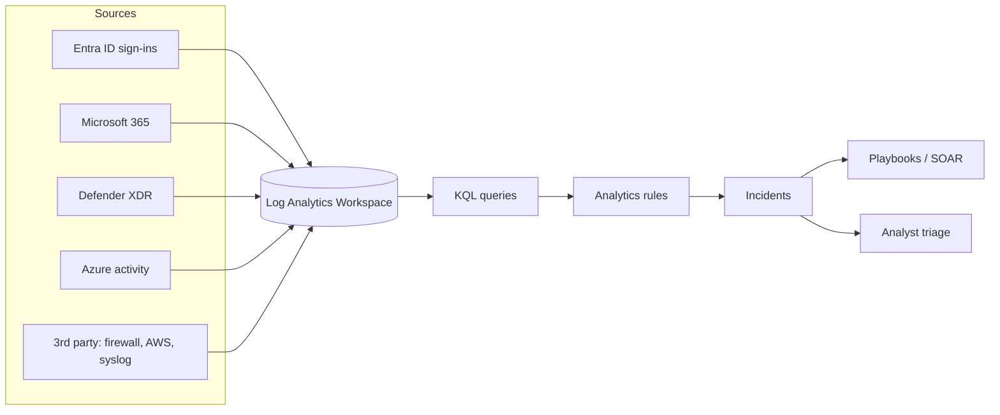
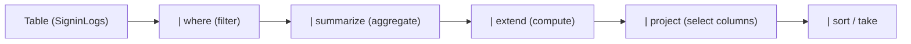
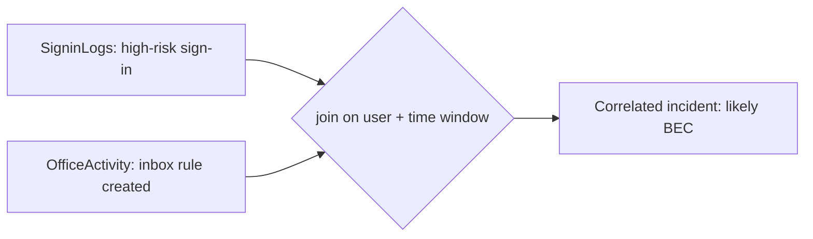
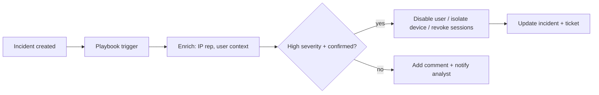
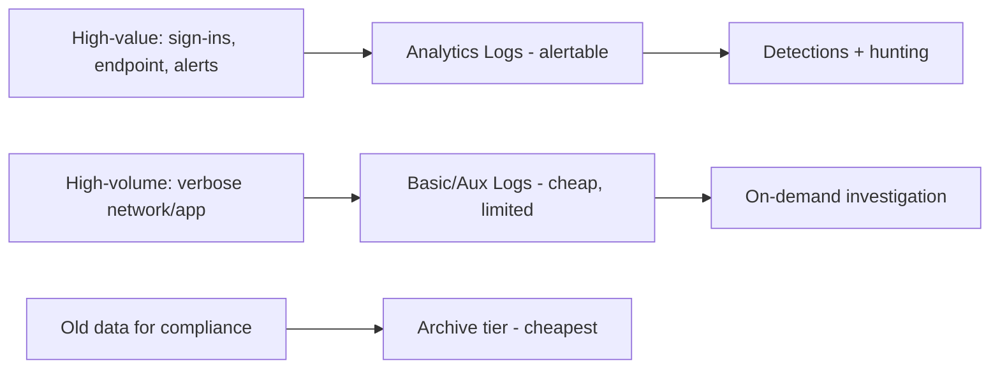

This is Chapter 5 of the SOC & Blue Team notebook and the second tool primer. Chapter 4 put Splunk and SPL under your hands; this chapter does the same for **Microsoft Sentinel**, the cloud-native SIEM, and its query language **KQL (Kusto Query Language)**. Sentinel has become one of the most common SIEMs in the enterprise, largely because so many organizations already run Microsoft 365 and Azure, and Sentinel plugs directly into that identity, endpoint, and cloud telemetry. If Splunk is the incumbent, Sentinel is the fast-rising challenger, and KQL is now nearly as common a job requirement as SPL.

The good news, promised at the end of Chapter 4: the *thinking* transfers completely. KQL is a pipeline language just like SPL — a data source, then a series of operators joined by pipes, each transforming the data. Where SPL says `| stats count by user`, KQL says `| summarize count() by user`. The keywords differ; the mental model — constrain the source, transform in stages, aggregate, filter, correlate per entity — is identical. This chapter teaches KQL from scratch, but you will find yourself recognizing the shape of everything from Chapter 4.

The framing note stands: Sentinel monitors data your organization owns and is authorized to analyze — your Azure AD/Entra sign-ins, your Microsoft 365 audit logs, your endpoints via Defender. The KQL you learn is for detecting attackers in your own tenant. Practice on the free Microsoft demo environments and your own lab, never on data you have no authority over.

We build from what Sentinel is and how it sits on Log Analytics, connectors and the table model, KQL from first query through the core operators in depth, string and time operations, joins and unions, analytics rules and incidents, entity behavior and UEBA, hunting queries and notebooks, workbooks and automation (playbooks/SOAR), a full hands-on lab, KQL-vs-SPL translation, a consolidated detection-and-defense section, a final revision, a cheat sheet, and topic-specific practice.

## Why This Matters

Two forces make Sentinel and KQL worth your time. First, adoption: because Sentinel is native to Azure and integrates seamlessly with Entra ID (Azure AD), Microsoft 365, and Microsoft Defender, any organization already invested in Microsoft — which is most of them — can turn Sentinel on without deploying a heavy on-prem stack. That has driven explosive uptake, and with it, demand for analysts who can write KQL. Second, KQL is not confined to Sentinel: the *same* language queries Microsoft Defender (advanced hunting), Azure Monitor, Log Analytics, and Azure Data Explorer. Learn KQL once and you can query the entire Microsoft security and observability estate.

For a SOC analyst, Sentinel is where the identity-centric attacks of the cloud era are caught. Chapter 1's opening lab — the impossible-travel BEC — is a *Sentinel* scenario: the sign-in logs, the mailbox audit, the OAuth grant all flow into Sentinel, and KQL is how you pivot across them. As identity becomes the new perimeter (Chapter 2), the SIEM that sees identity best becomes central, and for the Microsoft-heavy enterprise that is Sentinel.

**Who this is for:** SOC analysts and detection engineers in (or heading to) Microsoft-centric environments, and anyone who wants a second, complementary SIEM skill. Having both SPL and KQL on your resume covers the large majority of SIEM job postings.

## Part 1: What Microsoft Sentinel Is

**Microsoft Sentinel** (formerly Azure Sentinel) is a cloud-native SIEM and SOAR platform built on top of Azure. "Cloud-native" is the key phrase: unlike a traditional SIEM you install and scale yourself, Sentinel is a service — Microsoft runs the infrastructure, and you pay for data ingested and retained. It provides the full SIEM function from Chapter 1 (collect, normalize, detect, investigate) plus built-in SOAR (automation), UEBA (user/entity behavior analytics), and threat intelligence integration.

Sentinel is built on **Azure Log Analytics**, which is the underlying data platform — a big, fast, columnar store queried with KQL. This matters because it means everything you learn about KQL in Log Analytics applies to Sentinel and vice versa; Sentinel is essentially a security-focused experience layered on a Log Analytics **workspace**.

What Sentinel adds on top of Log Analytics:

- **Data connectors** — one-click integrations to pull in Microsoft sources (Entra ID, M365, Defender, Azure activity) and many third parties (firewalls, AWS, syslog).
- **Analytics rules** — scheduled KQL detections that create **incidents** (Sentinel's alerts).
- **Incidents** — the case-management queue where analysts triage (Chapter 1's workflow).
- **Workbooks** — interactive dashboards (like Splunk dashboards).
- **Hunting queries** — a library of KQL hunts, plus your own.
- **Notebooks** — Jupyter notebooks for advanced investigation and ML.
- **Automation (Playbooks)** — Logic Apps that automate response (SOAR).
- **UEBA** — behavioral baselining of users and entities.
- **Threat intelligence** — IOC ingestion and matching.



## Part 2: Architecture — Workspaces, Tables, and Connectors

Sentinel's data model is simpler than Splunk's distributed architecture because Microsoft runs the infrastructure. What you need to understand is the **logical** model.

- **Log Analytics workspace** — the container for all your data. A Sentinel deployment lives on one (or more) workspace. Think of it as the "index" universe from Splunk.
- **Tables** — data is organized into **tables**, each a schema with typed columns. This is a big difference from Splunk's schema-on-read: KQL tables have defined schemas. Key security tables you will use constantly:

| Table | Contains | Splunk analog |
|-------|----------|---------------|
| `SigninLogs` | Entra ID interactive sign-ins | identity sign-ins |
| `AADNonInteractiveUserSignInLogs` | Non-interactive/service sign-ins | — |
| `AuditLogs` | Entra directory changes | AD change events |
| `SecurityEvent` | Windows Security events (via agent) | WinEventLog:Security |
| `DeviceProcessEvents` | Defender endpoint process creation | Sysmon EID 1 |
| `DeviceNetworkEvents` | Defender endpoint network connections | Sysmon EID 3 |
| `DeviceLogonEvents` | Defender logon events | 4624/4625 |
| `OfficeActivity` | M365 audit (mailbox, SharePoint) | mailbox audit |
| `CommonSecurityLog` | CEF/firewall/network appliances | firewall |
| `Syslog` | Linux/syslog sources | linux logs |
| `SecurityAlert` | Alerts from Defender/other products | — |
| `ThreatIntelligenceIndicator` | Ingested IOCs | threat_intel lookup |

Knowing which table holds what is half the battle in KQL — the first question of any query is "which table sees this?" (the Chapter 2 data-source question, now literal).

- **Data connectors** — the mechanism to get data into tables. Microsoft sources connect with a click (Entra, M365, Defender). Others use the **Azure Monitor Agent (AMA)** for Windows/Linux, **CEF/Syslog** via a collector, or the **Logs Ingestion API** for custom data. Connectors are Chapter 2's collection pipeline, managed for you.

- **Normalization (ASIM)** — the **Advanced SIEM Information Model** is Sentinel's version of Splunk's CIM: a set of normalized schemas (and parser functions like `imAuthentication`, `imProcessCreate`) so one query works across many sources. As in Splunk, normalization is what makes cross-source detection practical.

## Part 3: KQL From Scratch — The Pipeline Again

KQL (Kusto Query Language) reads top to bottom, left to right, as a pipeline. A query starts with a **table** (the data source) and pipes it through **operators**, each transforming the result.

```kql
SigninLogs
| where TimeGenerated > ago(24h)
| where ResultType != 0            // failed sign-ins (0 = success)
| summarize FailedCount = count() by IPAddress, UserPrincipalName
| sort by FailedCount desc
```

Read it as a sentence: *from SigninLogs, in the last 24 hours, keep failed sign-ins, count them by IP and user, sort descending.* Compare to the identical-in-spirit SPL from Chapter 4 — the structure is the same; `where` is `where`/`search`, `summarize` is `stats`, `sort by` is `sort`. If you learned Chapter 4, you are 70% of the way to KQL already.

Key syntax facts to internalize up front:

- The **first line is always the table** (or a function returning a table). No `index=` — you name the table directly.
- **`|` pipes** between operators, exactly like SPL.
- KQL is **case-sensitive** for column and function names, and string comparisons are case-sensitive by default (use `=~` for case-insensitive equality, `contains` is case-insensitive, `contains_cs` is case-sensitive).
- **Time** is first-class: `ago(24h)`, `ago(7d)`, `between(datetime(...) .. datetime(...))`; the standard timestamp column is `TimeGenerated`.
- Comments use `//`.



## Part 4: The Core KQL Operators, In Depth

Master these and you can write nearly any detection. Each is taught with a security example.

### where — filter rows

The workhorse filter (like SPL `search`/`where`):

```kql
SecurityEvent
| where EventID == 4625                      // failed logon
| where TimeGenerated > ago(1h)
| where AccountType == "User"
```

Operators: `==`, `!=`, `<`, `>`, `in (...)`, `!in`, `contains` (case-insensitive substring), `has` (whole-token, indexed and fast — prefer over `contains`), `startswith`, `endswith`, `matches regex`.

**Performance note:** `has` is far faster than `contains` because it uses the term index — `| where CommandLine has "Invoke-Expression"` beats `contains` for whole words.

### summarize — aggregate

The most important transforming operator (SPL `stats`):

```kql
SigninLogs
| where ResultType != 0
| summarize FailedCount = count(),
            DistinctUsers = dcount(UserPrincipalName),
            Users = make_set(UserPrincipalName),
            FirstSeen = min(TimeGenerated),
            LastSeen = max(TimeGenerated)
  by IPAddress
| where FailedCount > 30
```

Aggregation functions: `count()`, `dcount()` (distinct count — the spraying-vs-brute-force key again), `sum()`, `avg()`, `min()`, `max()`, `make_set()` (unique list), `make_list()`, `arg_max()`/`arg_min()` (the row with the max/min of a column — very handy). `by` sets the grouping keys.

### extend — compute new columns

Adds calculated columns (SPL `eval`):

```kql
DeviceNetworkEvents
| extend MB = round(todouble(BytesSent)/1024/1024, 2)
| extend Risk = iff(MB > 500 and RemoteUrl has "mega", "high", "normal")
| where Risk == "high"
```

Functions: `iff()` (if), `case()`, `coalesce()`, `strcat()` (concatenate), `substring()`, `toupper()/tolower()`, `datetime_diff()`, `bin()` (round time/numbers), `parse_json()`.

### project / project-away — select columns

Choose which columns to keep (SPL `fields`/`table`):

```kql
SecurityEvent
| where EventID == 4624
| project TimeGenerated, Account, IpAddress, LogonType, Computer
```

`project` keeps and orders the named columns; `project-away` drops columns; `project-rename` renames. Projecting early reduces data and speeds queries.

### summarize with bin() — time series

Grouping by time buckets (SPL `timechart`/`bin`):

```kql
SecurityEvent
| where EventID == 4625
| summarize Failures = count() by bin(TimeGenerated, 1h), IpAddress
| render timechart
```

`bin(TimeGenerated, 1h)` buckets into hours; `render` draws a chart (timechart, barchart, columnchart, piechart).

### top / take / sort — ordering and limiting

```kql
DnsEvents
| summarize Requests = count() by Name
| top 20 by Requests desc            // most-queried domains
```

`top N by col` = sort + limit in one; `take N` (or `limit N`) grabs an arbitrary N rows; `sort by col desc` orders.

### parse and extract — pull fields from text

When data is in a string, `parse` or `extract` (regex) pulls fields out (SPL `rex`):

```kql
Syslog
| where SyslogMessage has "Failed password"
| parse SyslogMessage with * "from " SrcIP:string " port " *
| summarize count() by SrcIP
```

`extract(regex, captureGroup, source)` does regex extraction; `parse` uses a friendlier pattern syntax.

### distinct and count — quick uniqueness

```kql
DeviceProcessEvents
| where FileName == "powershell.exe"
| distinct DeviceName, AccountName, ProcessCommandLine
```

## Part 5: Strings, Time, and Dynamic Data

Real detections need string manipulation, time math, and JSON handling. KQL is strong here.

**Strings:**

```kql
| extend cmd = tolower(ProcessCommandLine)
| where cmd has_any ("-enc", "-encodedcommand", "downloadstring", "iex")
| extend domain = extract(@"https?://([^/]+)", 1, RemoteUrl)
```

`has_any (...)` and `has_all (...)` test membership against a list — cleaner than chained `or`s. `extract` with a regex and capture-group index pulls a substring.

**Time:**

```kql
| extend Hour = datetime_part("hour", TimeGenerated)
| where Hour < 6 or Hour > 22               // off-hours activity
| extend Delta = datetime_diff("second", TimeGenerated, prev(TimeGenerated))
```

`ago()`, `now()`, `datetime()`, `datetime_diff(unit, a, b)`, `datetime_part()`, `bin()`, `startofday()` cover most needs. Time filters early in the query are the single biggest performance win (as in Splunk).

**Dynamic (JSON) data:** many Sentinel columns are dynamic (JSON). Access with dot/bracket notation or `parse_json`:

```kql
SigninLogs
| extend City = tostring(LocationDetails.city),
         Country = tostring(LocationDetails.countryOrRegion)
| extend MFA = tostring(parse_json(AuthenticationDetails)[0].authenticationStepResultDetail)
```

`mv-expand` explodes an array into rows; `mv-apply` applies a subquery per array element — the KQL analog of Splunk's `mvexpand`.

## Part 6: Joins and Unions — Correlating Across Tables

Because Sentinel splits data into typed tables, cross-source correlation often means **joining tables**. This is a place KQL is very explicit.

**union** stacks tables/rows together:

```kql
union SecurityEvent, DeviceLogonEvents
| where TimeGenerated > ago(1h)
| where AccountName == "m.singh" or Account has "m.singh"
```

**join** matches rows across tables on a key (like SQL/SPL join):

```kql
// Correlate a risky sign-in with subsequent risky Office activity
SigninLogs
| where RiskLevelDuringSignIn == "high"
| project UserPrincipalName, IPAddress, SigninTime = TimeGenerated
| join kind=inner (
    OfficeActivity
    | where Operation in ("New-InboxRule", "Set-Mailbox", "Add-MailboxPermission")
    | project UserId, Operation, OfficeTime = TimeGenerated
  ) on $left.UserPrincipalName == $right.UserId
| where OfficeTime between (SigninTime .. (SigninTime + 1h))
```

This is the Chapter 1 BEC lab as one KQL query: a high-risk sign-in *joined* to a suspicious inbox-rule creation by the same user within an hour. `join kind=` supports `inner`, `leftouter`, `rightouter`, `fullouter`, `leftanti`/`rightanti` (rows with *no* match — great for "X without a corresponding Y"). Join keys use `$left`/`$right`.

**Performance:** put the smaller table on the left of a `join`, filter both sides first, and prefer `has`/time filters before joining. Like Splunk's advice to prefer `stats` over `join`, in KQL you often replace a join with a `summarize` over a `union` when correlating events of the same shape.



## Part 7: Analytics Rules and Incidents

A KQL query becomes a detection when you save it as an **Analytics Rule**. Sentinel rule types:

- **Scheduled** — a KQL query that runs on a schedule (e.g., every 5 minutes over the last 5 minutes) and creates an alert/incident when results meet a threshold. The workhorse (like Splunk's scheduled alerts).
- **Near-real-time (NRT)** — runs about once a minute for low-latency detection on a single table.
- **Microsoft Security** — auto-create incidents from Defender/other Microsoft product alerts.
- **Anomaly / ML** — built-in machine-learning detections (UEBA, anomalous sign-ins).
- **Fusion** — Microsoft's built-in, ML-driven multi-stage correlation that combines low-fidelity signals into high-confidence incidents — the productized risk-based/correlation alerting from Chapters 3–4.

A scheduled rule's key settings:

- **Query** — the KQL detection.
- **Entity mapping** — tell Sentinel which columns are the Account, Host, IP, etc. This is *critical*: it lets Sentinel group alerts into incidents by entity, build investigation graphs, and drive automation. Entity mapping is what turns raw query output into a triageable, correlatable incident.
- **Query scheduling & lookback** — how often it runs and over what window.
- **Alert threshold** — fire when results > N.
- **Event/alert grouping** — group multiple alerts into one incident (per entity, per time window) — the alert-fatigue control from Chapter 1.
- **MITRE ATT&CK mapping** — tag the rule with tactics/techniques (Chapter 3), keeping the heatmap honest.
- **Automated response** — attach a playbook.

**Incidents** are Sentinel's cases: grouped alerts with entities, a severity, a status, an owner, and an investigation graph. The **Incidents** page is the Tier 1 queue (Chapter 1) — analysts open, triage, and update incidents there, with an interactive **investigation graph** that visually links entities (user → IP → host → alerts) for fast scoping.

## Part 8: Building Real Detections in KQL

The Chapter 3 recipes, now in KQL. Each is a candidate analytics rule.

### Impossible travel / atypical sign-in (T1078)

```kql
SigninLogs
| where ResultType == 0                         // successful
| summarize Locations = make_set(Location), Count = count(),
            Cities = make_set(tostring(LocationDetails.city))
  by UserPrincipalName, bin(TimeGenerated, 1h)
| where array_length(Locations) > 1             // 2+ countries in one hour
```

Sentinel also ships a built-in ML "Impossible travel" anomaly, but writing your own teaches the logic.

### Brute force and password spraying (T1110)

```kql
// Brute force: many failures, one/few accounts, one IP
SigninLogs
| where ResultType != 0
| summarize Failures = count(), Users = dcount(UserPrincipalName) by IPAddress
| where Failures > 30 and Users <= 2

// Password spray: one IP, many distinct users, few attempts each
SigninLogs
| where ResultType != 0
| summarize Users = dcount(UserPrincipalName), Attempts = count()
  by IPAddress, bin(TimeGenerated, 10m)
| where Users > 10 and Attempts < Users * 3
```

### Encoded PowerShell (T1059.001)

```kql
DeviceProcessEvents
| where FileName =~ "powershell.exe"
| extend cmd = tolower(ProcessCommandLine)
| where cmd has_any ("-enc", "-encodedcommand", "-w hidden",
                     "downloadstring", "iex", "invoke-expression")
| project TimeGenerated, DeviceName, AccountName, ProcessCommandLine
```

### Office spawns a script interpreter (T1204/T1566)

```kql
DeviceProcessEvents
| where InitiatingProcessFileName in~ ("winword.exe","excel.exe","powerpnt.exe","outlook.exe")
| where FileName in~ ("powershell.exe","cmd.exe","wscript.exe","mshta.exe","rundll32.exe")
| project TimeGenerated, DeviceName, AccountName,
          InitiatingProcessFileName, FileName, ProcessCommandLine
```

### Kerberoasting (T1558.003)

```kql
SecurityEvent
| where EventID == 4769
| where TicketEncryptionType == "0x17"          // RC4, weak
| where ServiceName != "krbtgt"
| summarize Services = dcount(ServiceName) by Account, IpAddress
| where Services > 5
```

### Cleared event logs (T1070.001)

```kql
SecurityEvent
| where EventID == 1102
| project TimeGenerated, Computer, Account
```

### Suspicious inbox rule (BEC tell, T1114/T1564)

```kql
OfficeActivity
| where Operation == "New-InboxRule"
| where Parameters has_any ("Deleted Items","RSS","Archive","move")
| project TimeGenerated, UserId, ClientIP, Parameters
```

Each rule gets an ATT&CK mapping and entity mapping when saved — that is what makes Sentinel's incident graph and Fusion correlation work.

## Part 9: UEBA, Entity Pages, and Hunting

Sentinel adds analytics beyond hand-written rules.

**UEBA (User and Entity Behavior Analytics)** baselines normal behavior per user and entity and surfaces anomalies (a user signing in from a new country, at an unusual time, or performing rare actions). It enriches events with a `BehaviorAnalytics` table you can query, and feeds anomaly detections. UEBA is how Sentinel catches "this is abnormal *for this user*" — behavior at the top of the Pyramid of Pain, computed for you.

**Entity pages** — click any user, host, or IP and Sentinel shows a timeline of everything known about it, its risk, and related incidents. This is Chapter 1's enrichment and pivoting, built in: from an alert's entity you jump straight to its full context.

**Hunting** — Sentinel ships a library of **hunting queries** (KQL) organized by ATT&CK tactic, plus you write your own and save them. Hunting is the proactive, hypothesis-driven search from Chapter 3: pick a technique, run/adapt the hunt, and if you find something, promote it to an analytics rule. **Bookmarks** let you save interesting rows during a hunt and attach them to an incident. **Livestream** runs a hunt continuously for a short window.

```kql
// Hunt: rare parent-child process relationships this week
DeviceProcessEvents
| where TimeGenerated > ago(7d)
| summarize Count = count() by InitiatingProcessFileName, FileName
| where Count < 5                               // rare = worth a look
| sort by Count asc
```

`rare` combinations (Chapter 4's `rare` idea) are a classic hunt: the unusual parent→child pairs are where novel attacks hide.

## Part 10: Automation — Playbooks and SOAR

Sentinel's built-in SOAR (Chapter 1) uses **Playbooks**, which are Azure **Logic Apps** — visual workflows triggered by an incident or alert. A playbook can enrich (look up an IP's reputation, get the user's manager), notify (post to Teams, email), or respond (disable a user in Entra, isolate a device in Defender, revoke sessions).



**Automation rules** decide *when* playbooks run and can also automate incident handling directly (assign owner, change severity, close known-benign patterns). The design lesson from Chapter 1 applies: automate the toil (enrichment, notification) freely, but gate destructive actions (disabling accounts, isolating hosts) behind confirmation or high-confidence conditions.

## Part 11: Hands-On Lab — Hunt the BEC in Sentinel

This lab reproduces Chapter 1's opening incident — the impossible-travel business email compromise — as a KQL investigation in Sentinel.

**Scenario.** An incident fires: "Atypical sign-in" for `j.doe@acme.example`. Investigate.

### Step 1 — Examine the sign-ins

```kql
SigninLogs
| where UserPrincipalName == "j.doe@acme.example"
| where TimeGenerated > ago(24h)
| project TimeGenerated, IPAddress, tostring(LocationDetails.city),
          tostring(LocationDetails.countryOrRegion), ResultType,
          AppDisplayName, tostring(DeviceDetail.operatingSystem)
| sort by TimeGenerated asc
```

Expected: a Mumbai sign-in from a known iPhone, then a Toronto sign-in from an unrecognized Windows device on a VPS IP — the two-location pattern.

### Step 2 — Assess the suspicious IP

```kql
SigninLogs
| where IPAddress == "198.51.100.9"
| summarize Users = make_set(UserPrincipalName), Count = count(),
            Apps = make_set(AppDisplayName)
| extend Note = "check ASN: hosting/VPS vs residential"
```

Correlate with `ThreatIntelligenceIndicator` if the IP is a known-bad:

```kql
ThreatIntelligenceIndicator
| where NetworkIP == "198.51.100.9"
| project Description, ThreatType, ConfidenceScore
```

### Step 3 — Pivot to what happened after the sign-in

```kql
OfficeActivity
| where UserId == "j.doe@acme.example"
| where TimeGenerated > ago(24h)
| where Operation in ("New-InboxRule","Set-Mailbox","Add-MailboxPermission",
                      "FileAccessed","Add-OAuth2PermissionGrant","Consent to application")
| project TimeGenerated, Operation, ClientIP, Parameters
| sort by TimeGenerated asc
```

Expected: an inbox rule hiding CFO mail, mass Payroll file access, and a malicious OAuth consent — the BEC tells from Chapter 1.

### Step 4 — Correlate sign-in to actions in one query

```kql
SigninLogs
| where UserPrincipalName == "j.doe@acme.example" and IPAddress == "198.51.100.9"
| project SigninTime = TimeGenerated, IPAddress
| join kind=inner (
    OfficeActivity
    | where UserId == "j.doe@acme.example"
    | project ActTime = TimeGenerated, Operation, Parameters
  ) on $left.IPAddress == $left.IPAddress
| where ActTime between (SigninTime .. (SigninTime + 2h))
| project SigninTime, ActTime, Operation, Parameters
```

This ties the malicious session to its actions — the confirmation that this is a true-positive account compromise, not a VPN artifact.

### Step 5 — Scope, respond, operationalize

Scope: did the same IP or OAuth app touch other users?

```kql
OfficeActivity
| where Operation == "Consent to application"
| where Parameters has "Mail Reader Pro"
| summarize Users = make_set(UserId) by Parameters
```

Respond (via playbook or manually): revoke sessions, reset credentials, remove the inbox rule and OAuth grant, scope the Payroll access. Then **operationalize**: save Step 3's suspicious-inbox-rule query and Step 1's two-country logic as analytics rules so the next BEC is caught automatically — the Chapter 1 feedback loop in Sentinel.

## Part 12: KQL vs SPL — A Translation Table

Because you learned SPL in Chapter 4, a side-by-side cements KQL fast:

| Task | SPL (Splunk) | KQL (Sentinel) |
|------|--------------|----------------|
| Pick data | `index=x sourcetype=y` | `TableName` |
| Filter | `search` / `where` | `where` |
| Time | `earliest=-24h` | `where TimeGenerated > ago(24h)` |
| Aggregate | `stats count by f` | `summarize count() by f` |
| Distinct count | `dc(f)` | `dcount(f)` |
| Unique list | `values(f)` | `make_set(f)` |
| New field | `eval x=...` | `extend x=...` |
| Select cols | `fields`/`table` | `project` |
| Regex extract | `rex "(?<a>...)"` | `extract(...)` / `parse` |
| Time chart | `timechart span=1h` | `summarize by bin(TimeGenerated,1h)` |
| Top N | `top N f` | `top N by f` |
| Join | `join` | `join kind=... on ...` |
| Stack | `append` | `union` |
| Rename | `rename a AS b` | `project-rename b=a` |
| Substring match | `field=*x*` | `field has "x"` (fast) / `contains` |

The mapping is nearly one-to-one because both are pipeline languages. The main *conceptual* difference: Splunk is schema-on-read (fields extracted at search time across flexible sourcetypes), while KQL uses typed tables with defined schemas — so in KQL you must know which table holds your data, and columns are strongly typed (watch `tostring()`/`todouble()` conversions).

## Part 12b: More KQL You Will Use

Beyond the core operators, a few more constructs come up constantly in real detection and hunting.

### let — variables and reusable snippets

`let` binds a name to a value, a list, or even a whole subquery — the KQL way to keep detections readable and DRY (like Splunk macros).

```kql
let lookback = 24h;
let vip_users = dynamic(["ceo@acme.example","cfo@acme.example"]);
let scriptHosts = dynamic(["powershell.exe","cmd.exe","wscript.exe","mshta.exe"]);
SigninLogs
| where TimeGenerated > ago(lookback)
| where UserPrincipalName in (vip_users)
| where ResultType != 0
```

`let` can also hold a table expression you reference multiple times:

```kql
let failedSignins =
    SigninLogs | where ResultType != 0 | project TimeGenerated, IPAddress, UserPrincipalName;
failedSignins
| summarize Failures = count() by IPAddress
| where Failures > 50
```

### Functions — save KQL as reusable, callable logic

You can save a parameterized query as a **function** and call it like a table. ASIM parsers (`imAuthentication`, `imProcessCreate`) are exactly this — normalized functions you query instead of raw tables:

```kql
imProcessCreate
| where TargetProcessName has "powershell.exe"
| where CommandLine has "-enc"
```

Using ASIM parsers means one detection works across every process-creation source (Defender, Sysmon, WEF), the ASIM equivalent of Splunk's CIM data models.

### materialize — cache a subquery

`materialize()` computes a subquery once and reuses the result, speeding up queries that reference the same expensive computation multiple times:

```kql
let recentProcs = materialize(
    DeviceProcessEvents | where TimeGenerated > ago(1h)
);
recentProcs | where FileName == "powershell.exe" | count;
recentProcs | where FileName == "cmd.exe" | count
```

### mv-expand / mv-apply — work with arrays

Many columns are dynamic arrays (e.g., `AuthenticationDetails`). Explode or process them:

```kql
SigninLogs
| mv-expand auth = todynamic(AuthenticationDetails)
| extend method = tostring(auth.authenticationMethod),
         result = tostring(auth.succeeded)
| summarize count() by method, result
```

### Series functions — statistical anomaly detection

KQL has powerful time-series operators for anomaly hunting without external ML. `make-series` builds a per-entity time series; `series_decompose_anomalies` flags outliers:

```kql
DeviceNetworkEvents
| where TimeGenerated > ago(14d)
| make-series Conns = count() default=0
    on TimeGenerated step 1h by DeviceName
| extend (anomalies, score, baseline) =
    series_decompose_anomalies(Conns, 2.5)
| mv-expand TimeGenerated, Conns, anomalies, score
| where toint(anomalies) != 0            // statistically anomalous spikes
```

This finds hosts whose connection volume deviated sharply from their own baseline — behavioral, top-of-pyramid detection you built by hand. `series_stats`, `series_fir`, and `series_fit_line` extend the toolkit for beacon and trend analysis.

## Part 12c: A KQL Detection Gallery (Ten More)

More ATT&CK-mapped detections to adapt. Note how many live in `SigninLogs`/`OfficeActivity` — identity is Sentinel's strength.

```kql
// 1. MFA fatigue / push bombing (T1621)
SigninLogs
| where ResultType in ("50074","500121")   // MFA required / not completed
| summarize Attempts = count() by UserPrincipalName, bin(TimeGenerated, 10m)
| where Attempts > 5

// 2. Legacy auth (no MFA possible) success (T1078)
SigninLogs
| where ClientAppUsed in ("Other clients","IMAP4","POP3","SMTP","Exchange ActiveSync")
| where ResultType == 0
| project TimeGenerated, UserPrincipalName, ClientAppUsed, IPAddress

// 3. New OAuth app consent (T1528 steal app access token)
AuditLogs
| where OperationName has "Consent to application"
| project TimeGenerated, InitiatedBy, TargetResources

// 4. New global admin added (privilege abuse)
AuditLogs
| where OperationName == "Add member to role"
| where TargetResources has "Global Administrator"

// 5. Sign-in from anonymizer/Tor (T1090)
SigninLogs
| where RiskEventTypes has "anonymizedIPAddress"
| project TimeGenerated, UserPrincipalName, IPAddress, RiskLevelDuringSignIn

// 6. Mailbox forwarding rule to external (T1114.003)
OfficeActivity
| where Operation in ("Set-Mailbox","New-InboxRule")
| where Parameters has "ForwardingSmtpAddress" or Parameters has "RedirectTo"

// 7. Mass file download/sync from SharePoint (T1213/T1039)
OfficeActivity
| where Operation in ("FileDownloaded","FileSyncDownloadedFull")
| summarize Files = count() by UserId, bin(TimeGenerated, 1h)
| where Files > 100

// 8. Suspicious process from a service account (T1078.004)
DeviceProcessEvents
| where AccountName startswith "svc-"
| where FileName in~ ("powershell.exe","cmd.exe","net.exe","whoami.exe")

// 9. Scheduled task created via command line (T1053.005)
DeviceProcessEvents
| where FileName =~ "schtasks.exe" and ProcessCommandLine has "/create"

// 10. Clearing of Defender / AV tampering (T1562)
DeviceProcessEvents
| where ProcessCommandLine has_any ("Set-MpPreference -Disable","MpCmdRun -RemoveDefinitions",
                                    "sc stop WinDefend")
```

The shape repeats: pick the table that sees the technique, filter on behavior, aggregate/threshold, map to ATT&CK. Ten more heatmap cells.

## Part 12d: KQL Beyond Sentinel — Defender XDR Advanced Hunting

A major payoff of learning KQL: the *same language* powers **Microsoft Defender XDR advanced hunting**, querying endpoint, identity, email, and cloud-app tables in one place. The Defender tables (`DeviceProcessEvents`, `DeviceNetworkEvents`, `DeviceFileEvents`, `DeviceRegistryEvents`, `DeviceLogonEvents`, `EmailEvents`, `IdentityLogonEvents`, `AlertEvidence`) mirror the Sysmon/EDR telemetry from Chapter 2.

```kql
// Cross-domain hunt: phishing email -> click -> process on the device
EmailEvents
| where TimeGenerated > ago(7d)
| where ThreatTypes has "Phish"
| project NetworkMessageId, RecipientEmailAddress, SenderFromAddress, Subject
| join kind=inner (
    EmailUrlInfo | project NetworkMessageId, Url
  ) on NetworkMessageId
| join kind=inner (
    DeviceProcessEvents
    | where InitiatingProcessFileName in~ ("outlook.exe","winword.exe")
    | project DeviceName, AccountName, FileName, ProcessCommandLine, InitiatingProcessFileName
  ) on $left.RecipientEmailAddress == $right.AccountName
```

That single query traces a phishing email to a URL to a suspicious process on the recipient's device — the entire Chapter 2 intrusion chain, correlated across email and endpoint in one KQL statement. This is why KQL fluency compounds: it unlocks Sentinel *and* the whole Defender XDR estate, and the two share tables so hunts flow across them. When Sentinel and Defender are connected, `DeviceProcessEvents` in Sentinel and in Defender advanced hunting are the same data, and your KQL transfers verbatim.

## Part 12e: Workbooks, Watchlists, and the Cost Model

Three operational pieces round out Sentinel for the working analyst.

**Workbooks** are Sentinel's interactive dashboards (Splunk's dashboards, Chapter 4). Built on KQL queries and Azure Monitor visualizations, they give SOC situational awareness: sign-in maps, incident trends by severity, failed-vs-successful auth, top risky users. Sentinel ships many prebuilt workbooks (per connector), and you build your own from saved KQL. Keep them focused — one workbook per purpose (identity overview, network overview) beats one giant panel wall.

**Watchlists** are imported reference tables (CSV) you join against in KQL — VIP users, known service accounts, asset criticality, an IOC list. They are Sentinel's answer to Splunk lookups, and they power enrichment (Chapter 1):

```kql
let vips = _GetWatchlist("VIPUsers");
SigninLogs
| where UserPrincipalName in ((vips | project UserPrincipalName))
| where ResultType != 0
| summarize FailedAttempts = count() by UserPrincipalName
```

**The cost model** shapes real deployments and is worth understanding before you architect detections. Sentinel bills by **data ingested** (per GB) and **retention**, with two important levers:

- **Analytics Logs vs Basic Logs vs Auxiliary/Archive** — high-value security tables go to Analytics (fully queryable, alertable); high-volume/low-value tables (verbose network, some app logs) can go to Basic/Auxiliary Logs at a fraction of the cost, queryable but with limits and not for scheduled analytics.
- **Commitment tiers** — reserving capacity discounts per-GB cost at scale.



The Chapter 2 lesson — collect with intent — is literally a budget decision in Sentinel: route each source to the tier that matches its detection value. Ingesting a firehose of low-value logs into Analytics tier is the fastest way to blow a Sentinel budget without improving coverage. **Blue team usage:** before onboarding a noisy source, decide its tier; put successful-logon, process-creation, and alert data in Analytics (you detect on it), and bulk flow/verbose logs in Basic (you only occasionally investigate it).

## Part 13: Detection & Defense Angle (Consolidated)

Sentinel is the SIEM; here is how to defend well with it.

**Start from the table, mapped to techniques.** Every KQL detection begins with "which table sees this technique?" — `SigninLogs` for identity attacks, `DeviceProcessEvents` for execution, `SecurityEvent` for Windows, `OfficeActivity` for BEC. Tag every analytics rule with its ATT&CK technique (Chapter 3) and map entities so incidents correlate.

**Lean into identity.** Sentinel's superpower is identity telemetry. The highest-value detections in a Microsoft estate are identity-centric: impossible travel, MFA fatigue, risky sign-ins, OAuth consent abuse, and post-sign-in mailbox manipulation. This is where cloud-era intrusions begin (Chapter 2), and Sentinel sees it best.

**Use Fusion and UEBA, but understand them.** Fusion (multi-stage correlation) and UEBA (behavioral baselining) productize the risk-based, behavior-focused detection from Chapters 3–4. Turn them on — but know what they do so you can explain a Fusion incident and are not blind to their gaps. They complement, not replace, your hand-written analytics rules.

**Map entities and group alerts to fight fatigue.** Entity mapping and alert grouping are Sentinel's alert-fatigue controls (Chapter 1). A rule without entity mapping produces isolated alerts that cannot correlate; with it, related alerts fuse into one investigable incident. Always map entities.

**Automate enrichment, gate destructive response.** Playbooks should freely automate enrichment and notification, but disabling users or isolating devices should be gated behind high confidence or human approval — the Chapter 1 SOAR discipline. A mis-triggered auto-disable playbook can take out a legitimate exec.

**Mind the cost model.** Sentinel bills by ingestion and retention. Chapter 2's collect-with-intent lesson is a literal budget line here: route high-value security tables to Sentinel, send bulk/low-value logs to cheaper tiers (Basic Logs / archive), and do not ingest verbose noise you will never query. Cost discipline is detection discipline.

**Hunt, then promote.** Use hunting queries and UEBA to find what your rules missed, bookmark findings to incidents, and promote successful hunts to analytics rules — growing coverage with every investigation (the feedback loop).

## Part 14: Final Revision / Summary

**Microsoft Sentinel** is a cloud-native SIEM+SOAR built on **Azure Log Analytics** and queried with **KQL**. Data lives in a **workspace** organized into typed **tables** (`SigninLogs`, `SecurityEvent`, `DeviceProcessEvents`, `OfficeActivity`, `CommonSecurityLog`, etc.), filled by **connectors** and normalized by **ASIM**. The first question of any query is "which table sees this?" — Chapter 2's data-source question made literal.

**KQL is a pipeline language**, structurally identical to SPL: start with a table, pipe through operators. The core toolkit: **`where`** (filter — prefer `has` over `contains` for speed), **`summarize`** (aggregate — `count()`, `dcount()`, `make_set()`, `arg_max()`), **`extend`** (compute — `iff`, `case`, `parse_json`), **`project`** (select columns), **`bin()`** + `render` (time series), **`top`/`take`/`sort`** (order/limit), **`parse`/`extract`** (regex), and **`join`/`union`** (correlate across typed tables, with `$left`/`$right` keys and `kind=inner/leftanti/...`). Strings (`has_any`, `extract`), time (`ago`, `datetime_diff`, `bin`), and dynamic JSON (`parse_json`, `mv-expand`) round it out.

A KQL query becomes a detection as an **Analytics Rule** (scheduled/NRT/Fusion/anomaly) that creates **Incidents** — the triage queue — with **entity mapping** (critical for correlation and automation) and **ATT&CK mapping**. **UEBA** baselines per-entity behavior, **entity pages** give built-in enrichment/pivoting, **hunting queries** enable proactive hypothesis-driven search, and **Playbooks** (Logic Apps) provide SOAR automation gated appropriately for destructive actions. We wrote real, ATT&CK-mapped detections (impossible travel, brute force vs spraying via `dcount`, encoded PowerShell, Office→interpreter, Kerberoasting, cleared logs, suspicious inbox rule) and hunted the Chapter 1 BEC end to end, correlating a risky sign-in to malicious mailbox actions with a `join`. Finally, **KQL maps almost one-to-one to SPL** (`summarize`≈`stats`, `extend`≈`eval`, `project`≈`fields`) — the pipeline thinking transfers; only the syntax and the typed-table model change.

## Part 15: Cheat Sheet / Quick Reference

**Query shape**
```kql
TableName
| where TimeGenerated > ago(24h) and Col == value
| summarize agg() by keys
| project cols
| sort by col desc
```

**Golden rules**
- First line = the table. Time-filter first. Prefer `has` over `contains`. Map entities on every rule. Tag every rule with ATT&CK. Know which table sees your technique.

**Rule types**
- Scheduled (workhorse) · NRT (~1 min latency) · Fusion (ML multi-stage correlation) · Anomaly/UEBA (behavioral) · Microsoft Security (import product alerts).

**Investigation flow**
- Incident → entities → entity page timeline → pivot KQL across tables → bookmark findings → respond via playbook → promote hunt to analytics rule.

**Key tables**
- `SigninLogs` (Entra sign-ins) · `AuditLogs` (directory changes) · `SecurityEvent` (Windows) · `DeviceProcessEvents`/`DeviceNetworkEvents`/`DeviceLogonEvents` (Defender) · `OfficeActivity` (M365) · `CommonSecurityLog` (firewall/CEF) · `Syslog` · `SecurityAlert` · `ThreatIntelligenceIndicator`.

**Core operators**
- `where` (filter; `has` > `contains` for speed) · `summarize count()/dcount()/make_set()/arg_max() by` · `extend` (iff/case/parse_json) · `project`/`project-away`/`project-rename` · `bin(TimeGenerated, 1h)` + `render` · `top N by` / `take` / `sort by` · `parse`/`extract` · `distinct`.

**Correlate**
- `union T1, T2` · `join kind=inner/leftouter/leftanti ( ... ) on $left.k == $right.k`.

**Strings & time**
- `has_any(...)`, `has_all(...)`, `contains`, `startswith`, `extract(re,1,src)` · `ago(24h)`, `datetime_diff("second",a,b)`, `datetime_part("hour",t)`, `bin()`.

**Dynamic/JSON**
- `parse_json(col)`, `col.field`, `tostring()/todouble()`, `mv-expand`, `mv-apply`.

**Detections (ATT&CK)**
- Brute force: `SigninLogs | where ResultType!=0 | summarize count(), dcount(UserPrincipalName) by IPAddress`
- Impossible travel: `summarize make_set(Location) by user, bin(1h) | where array_length>1`
- Spray: `summarize dcount(UserPrincipalName) by IPAddress, bin(10m)`
- Encoded PS: `DeviceProcessEvents | where cmd has_any("-enc","iex")`
- Kerberoast: `SecurityEvent EventID==4769 TicketEncryptionType=="0x17" | summarize dcount(ServiceName) by Account`
- Cleared logs: `SecurityEvent | where EventID==1102`
- Inbox rule: `OfficeActivity | where Operation=="New-InboxRule"`

**Analytics rule**
- Types: Scheduled · NRT · Fusion (ML correlation) · Anomaly/UEBA · Microsoft Security.
- Always set: entity mapping · ATT&CK mapping · alert grouping · schedule/threshold.

**SPL→KQL**
- `stats`→`summarize` · `eval`→`extend` · `fields`→`project` · `dc()`→`dcount()` · `values()`→`make_set()` · `rex`→`extract/parse` · `timechart`→`bin()+render`.

**join kinds**
- `inner` (matches only) · `leftouter` (all left + matches) · `leftanti` (left rows with NO match — "X without Y") · `fullouter`. Keys: `on $left.k == $right.k`. Smaller table on the left.

**Reuse & performance**
- `let` (variables/lists/subqueries) · saved functions / ASIM parsers (`imProcessCreate`, `imAuthentication`) · `materialize()` (cache) · filter + time-bound early · `has` > `contains`.

**Anomaly / time series**
- `make-series X on TimeGenerated step 1h by entity` → `series_decompose_anomalies(X, 2.5)` → `mv-expand` → `where anomalies != 0`.

**Enrichment & cost**
- Watchlists (`_GetWatchlist("name")`) = lookups · Analytics Logs (alertable) vs Basic/Aux (cheap, limited) vs Archive · route by detection value.
- Workbooks = dashboards. UEBA = per-entity behavioral baselining (`BehaviorAnalytics`).

**Beyond Sentinel**
- Same KQL runs in Defender XDR Advanced Hunting (`DeviceProcessEvents`, `EmailEvents`, `IdentityLogonEvents`), Azure Monitor, and Azure Data Explorer. Learn KQL once, query the whole Microsoft estate.

**Gotchas**
- Case-sensitive columns/functions · `=~` for case-insensitive equality · default count column is `count_` · convert types with `tostring()/todouble()/toint()`.

## Part 16: Practice Labs & Resources

- **Microsoft "KQL from scratch" / "Must Learn KQL" (Rod Trent) free series** — the best structured KQL introduction; work through it against a demo workspace.
- **Pluralsight "KQL from Scratch" (free with trial)** — a guided, video-based path through the operators in Parts 4–6.
- **The official KQL documentation (learn.microsoft.com/azure/data-explorer/kusto/query)** — authoritative per-operator reference with runnable examples.
- **Microsoft Sentinel Training Lab (GitHub: Azure/Azure-Sentinel Training Lab)** — deploys a workspace pre-loaded with sample data and guided exercises; the Sentinel equivalent of BOTS.
- **KQL detection & hunting content (github.com/Azure/Azure-Sentinel)** — the official repo of analytics rules and hunting queries mapped to ATT&CK; read and adapt real KQL.
- **Microsoft Learn — Sentinel and KQL learning paths** — free, hands-on modules on analytics rules, incidents, UEBA, and playbooks. Aim for the SC-200 (Security Operations Analyst) path, which centers on exactly this chapter's material.
- **KQL Cheat Sheet (Microsoft / community)** — a one-page operator reference to keep beside you while drilling.
- **Microsoft Defender Advanced Hunting** — the same KQL against endpoint/identity/email tables; the free demo tenant lets you practice the `Device*` tables.
- **Microsoft Defender XDR evaluation lab** — a free, safe environment to run simulated attacks and hunt them with KQL across `Device*`/`Email*`/`Identity*` tables (the Part 12d cross-domain hunt).
- **KQL playground (aka.ms/lademo / the public Log Analytics demo)** — a live workspace with data where every query in this chapter can be tried.
- **TryHackMe — *Microsoft Sentinel* / KQL rooms** and **KC7 (kc7cyber.com)** — gamified KQL investigation scenarios that mirror real SOC hunts.
- **BlueTeamLabs Online / CyberDefenders KQL & Sentinel challenges** — timed incident investigations using Sentinel tables.
- **Azure-Sentinel GitHub "Hunting Queries" folder** — hundreds of production hunts by ATT&CK tactic; pick one per tactic and run it against demo data.
- **The `Kusto detective` (Kusto Detective Agency)** — a free, puzzle-based way to build KQL fluency fast.
- **Microsoft Sentinel All-in-One / Content Hub** — deploy solutions with prebuilt analytics rules, workbooks, and playbooks per data source; study their KQL.
- **Rod Trent's "Must Learn KQL" GitHub + book (free)** — end-to-end KQL with security examples; the companion to the Part 4–6 operators.

### Self-check

You should now be able to, without notes: name the key Sentinel tables and which telemetry each holds; write a query with `where`/`summarize`/`extend`/`project`; use `dcount`/`make_set`/`arg_max`; correlate two tables with `join kind=inner ... on $left.k == $right.k`; explain why `has` beats `contains`; build a per-entity anomaly with `make-series` + `series_decompose_anomalies`; describe what entity mapping and Fusion do; and translate any SPL from Chapter 4 into KQL. If any is shaky, run it in the public Log Analytics demo workspace.

### Capstone exercise

In the Sentinel Training Lab (or the demo workspace): (1) reproduce the Part 11 BEC hunt end to end, (2) write three analytics rules from Part 8/12c with entity + ATT&CK mapping, (3) build a small workbook showing sign-in failures by country over time, (4) create one enrichment playbook (e.g., add IP-reputation comment to an incident), and (5) run one `make-series` anomaly hunt. Document it as a portfolio piece — "built and tuned Sentinel analytics rules and a BEC hunt in KQL" is a strong interview line.

A closing thought on why two SIEMs was worth your time. You now know SPL and KQL, which between them cover most SIEM job postings — but more importantly, you have seen the *same detection logic* expressed two ways, which proves the point from Chapter 4: the durable skill is the pipeline-and-technique thinking, not the syntax. A brute-force detection is `stats count dc(user) by src_ip` in Splunk and `summarize count(), dcount(user) by IPAddress` in Sentinel; the *idea* — one source, many/few distinct users — is what you actually know. Carry that idea into the next chapter and the third stack will feel familiar even though the interface changes yet again.

In the next chapter we cover the third major SIEM stack, **the Elastic Stack (ELK) and Wazuh** — open-source, self-hosted, and enormously popular for teams that want full control of their pipeline. The pipeline thinking continues; the query interface changes again (Elasticsearch DSL, KQL-in-Kibana, and EQL), and Wazuh adds host-based detection and rules.

### Practice questions

1. Write a KQL query against `SigninLogs` that finds source IPs where more than 10 distinct users failed to sign in within a 10-minute window. Which attack does this detect and how does it differ from brute force?
2. You want to correlate a high-risk sign-in with a suspicious inbox-rule creation by the same user within an hour. Sketch the KQL, naming the two tables and the join condition.
3. Explain the difference between `has` and `contains` in KQL and why it matters for a detection running every five minutes over a large table.
4. Why is entity mapping on an analytics rule so important? Give two concrete things it enables that a rule without it cannot do.
5. Translate this SPL to KQL: `index=wineventlog EventCode=4625 | stats count dc(user) by src_ip | where count>30`. Name the table and each operator you use.

### Answer notes

1. `SigninLogs | where ResultType != 0 | summarize Users=dcount(UserPrincipalName), Attempts=count() by IPAddress, bin(TimeGenerated,10m) | where Users > 10 and Attempts < Users*3`. Detects **password spraying** — one source hitting many distinct accounts with few attempts each (to dodge lockout), versus brute force which hammers one account many times (`dcount(user)`≈1).
2. Query `SigninLogs` (filter `RiskLevelDuringSignIn == "high"`, project user + time), `join kind=inner` to `OfficeActivity` (filter `Operation == "New-InboxRule"`) `on $left.UserPrincipalName == $right.UserId`, then keep rows where the Office time is within one hour of the sign-in time.
3. `has` matches whole tokens using the term index and is fast; `contains` is an unindexed substring scan and is slow. Over a large table on a five-minute schedule, `contains` can make the rule miss its schedule; `has` keeps it performant. Use `contains` only when you truly need a partial-token match.
4. Entity mapping tells Sentinel which columns are Account/Host/IP, which enables (a) grouping related alerts into a single correlatable incident (and Fusion correlation), and (b) driving automation/playbooks and the investigation graph off those entities. Without it, alerts are isolated and cannot correlate or trigger entity-based response.
5. `SecurityEvent | where EventID == 4625 | summarize count(), dcount(Account) by IpAddress | where count_ > 30`. Table = `SecurityEvent`; `where` filters, `summarize` aggregates (`count()`, `dcount()`), final `where` thresholds. (Note KQL's default `count()` column name is `count_`.)
6. You want a detection to fire only when a host's outbound connection volume is abnormal *for that host*, not against a fixed threshold. Which KQL construct do you use, and why is it better than a static threshold?
7. Your Sentinel bill is climbing. A verbose firewall source dominates ingestion but you only query it during investigations. What do you change, and what do you keep in the Analytics tier?

### Answer notes (continued)

6. Use `make-series` to build a per-host time series and `series_decompose_anomalies()` to flag statistical outliers relative to that host's own baseline. It beats a static threshold because "normal" volume varies enormously by host — a fixed number either misses anomalies on busy hosts or floods you with false positives on quiet ones; a per-entity baseline adapts to each host.
7. Move the verbose firewall logs to **Basic/Auxiliary Logs** (cheap, still queryable on demand for investigations) rather than Analytics. Keep sign-in logs, endpoint process/network events, and alerts in **Analytics** because you write scheduled detections on them. This is Chapter 2's "collect with intent" as a Sentinel budget decision.
