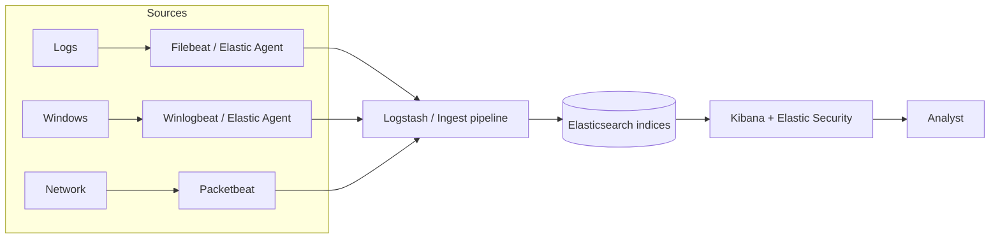
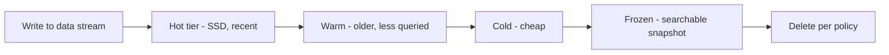
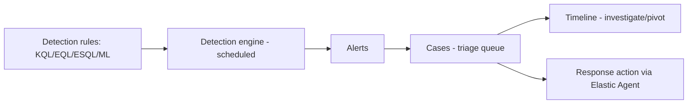
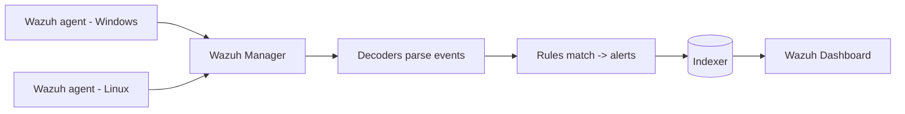
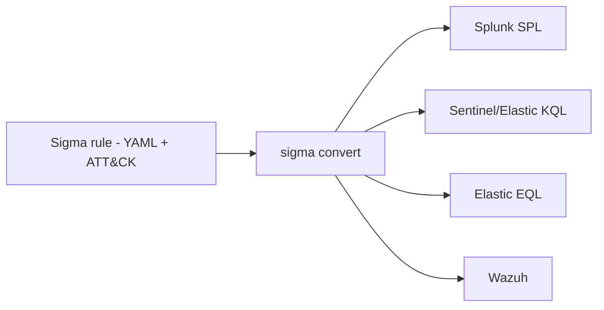
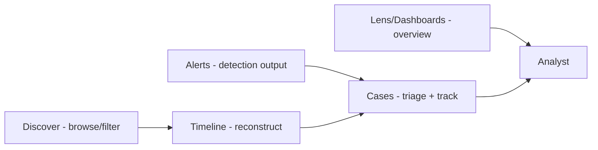

**Level:** Intermediate · **Track:** SOC & Blue Team · **Read time:** 175 min

This is Chapter 6 of the SOC & Blue Team notebook and the third and final tool primer in the SIEM sequence. Chapter 4 gave you Splunk/SPL (the commercial incumbent); Chapter 5 gave you Sentinel/KQL (the cloud-native challenger). This chapter gives you the **open-source** option: the **Elastic Stack** (often called ELK) and **Wazuh**. For a huge number of teams — startups, labs, budget-constrained SOCs, and anyone who wants total control of their pipeline — this is the SIEM, because it is free to run, self-hosted, and endlessly customizable. It is also, not coincidentally, the stack you most likely deployed in your own home lab back in Chapter 1.

The pipeline thinking continues to transfer. Elasticsearch is a document store you query several ways; the most beginner-friendly is **KQL in Kibana** — confusingly named the same as Sentinel's language but a *different, simpler* filter syntax — alongside **Lucene**, the powerful **EQL** (Event Query Language, purpose-built for sequences of security events), and the newer **ES|QL** (a true piped query language that will feel like coming home after SPL and KQL). Wazuh then layers host-based detection — agents, decoders, rules, file-integrity monitoring — on top, giving you an open-source EDR-ish capability with ATT&CK mapping built in.

The framing note holds: everything here runs on infrastructure and data you own and are authorized to monitor. The Elastic/Wazuh stack is especially common in home labs precisely because it is free — so this is the chapter where "build it yourself and watch your own telemetry" becomes most concrete. Use your own lab; never point collection at systems you have no authority over.

We build from what the Elastic Stack is and its components, the ingest pipeline and ECS, indices and data streams, the four query interfaces (Kibana KQL, Lucene, EQL, ES|QL) in depth, the Elastic detection engine and rules, Wazuh from scratch (architecture, agents, decoders, rules, FIM, SCA), Sigma as portable detection content, a full hands-on ingest-to-detection lab, a comparison of all three SIEMs, a consolidated detection-and-defense section, a final revision, a cheat sheet, and topic-specific practice.

## Why This Matters

Three reasons the open-source stack earns a chapter. First, **cost and control**: Elastic and Wazuh are free and self-hosted, so they power an enormous share of real-world monitoring — every home lab, many SMB SOCs, MSSPs, and even large enterprises that want to own their data. Knowing them means you can build a working SOC capability with zero licensing budget, which is exactly what a learner or a small team needs. Second, **transferable depth**: because you run the whole pipeline yourself — ingest, parse, normalize, index, detect — you learn how a SIEM actually works under the hood in a way a managed service hides. That understanding makes you better at *every* SIEM. Third, **Wazuh's host-based angle**: it fills the gap between pure log-SIEM and endpoint detection, giving you agent-based FIM, rootcheck, and security-configuration assessment that complements the log analytics of Chapters 4–5.

For the hands-on learner, this is the most important chapter to actually *do*. You can stand up ELK + Wazuh for free (Chapter 1, Part 13f), ship your own Sysmon and Windows logs into it, run Atomic Red Team, and watch detections fire — the full detection-engineering loop on your own hardware. Everything the last two chapters taught against someone else's demo data, you can now build and own.

**Who this is for:** analysts and detection engineers who will run or contribute to an open-source stack, home-lab builders, and anyone who wants to understand SIEM internals deeply. It also completes the trifecta: with SPL, KQL, and Elastic/EQL/ES|QL, you can work in almost any SOC.

## Part 1: What the Elastic Stack Is

The **Elastic Stack** is a set of open-source (and commercial) tools built around **Elasticsearch**, a distributed search-and-analytics engine. Historically it was called "ELK" after its three original components — **E**lasticsearch, **L**ogstash, **K**ibana — but the addition of **Beats** and the **Elastic Agent** broadened it, so "Elastic Stack" is the modern name. Elastic Security is the SIEM/EDR solution layered on top.

The components, each taught from scratch:

- **Elasticsearch** — the heart: a distributed, JSON-document store and search engine. It indexes documents (log events) so they can be searched and aggregated in near real time. Data lives in **indices** (collections of documents) sharded across nodes for scale. Everything else feeds or queries Elasticsearch.
- **Kibana** — the web UI: search, dashboards, visualizations, and the Elastic Security app (alerts, detections, cases, timelines). This is where an analyst lives, the equivalent of Splunk's Search app or the Sentinel portal.
- **Logstash** — the heavy data-processing pipeline: ingest from many sources, parse and transform (with `grok`, filters), and output to Elasticsearch. Powerful but resource-heavy; increasingly replaced for simple cases by ingest pipelines and Beats.
- **Beats** — lightweight, single-purpose shippers installed on sources: **Filebeat** (log files), **Winlogbeat** (Windows events), **Packetbeat** (network), **Metricbeat** (metrics), **Auditbeat** (Linux audit). Each ships a specific data type to Elasticsearch or Logstash.
- **Elastic Agent** — the modern, unified agent that replaces the individual Beats with one installable agent managed centrally via **Fleet**, and adds endpoint protection (Elastic Defend/EDR). The current recommended way to collect.



The mental model: **Beats/Agent collect → Logstash/ingest pipeline parses & normalizes → Elasticsearch stores & indexes → Kibana searches & detects.** It is Chapter 2's log pipeline made explicit, because with open source you assemble it yourself.

## Part 2: The Ingest Pipeline and ECS

The stage that makes or breaks an Elastic deployment is **parsing and normalization** — turning raw log lines into structured, consistently-named fields. Elastic does this two ways:

- **Logstash filters** — the classic approach. A Logstash config has input, filter, and output stages; the filter stage uses `grok` (named regex patterns) to extract fields, plus `date`, `mutate`, `geoip`, and more.

```ruby
# Logstash filter: parse an SSH auth line and enrich with GeoIP
filter {
  grok {
    match => { "message" => "Failed password for %{DATA:user} from %{IP:src_ip} port %{NUMBER:src_port}" }
  }
  date { match => [ "timestamp", "MMM dd HH:mm:ss" ] }
  geoip { source => "src_ip" }
}
```

- **Elasticsearch ingest pipelines** — processors that run inside Elasticsearch on ingest (grok, dissect, set, rename, GeoIP, user-agent). Lighter-weight than Logstash for many cases, and how Elastic integrations ship their parsing.

Both feed the crucial standard: **ECS, the Elastic Common Schema** — Elastic's normalization model (the counterpart to Splunk CIM and Sentinel ASIM from Chapters 2, 4, 5). ECS defines canonical field names so every source describes the same thing the same way:

| Concept | ECS field |
|---------|-----------|
| Source IP | `source.ip` |
| Destination IP | `destination.ip` |
| Username | `user.name` |
| Process name | `process.name` |
| Command line | `process.command_line` |
| Parent process | `process.parent.name` |
| Event action | `event.action` |
| Host name | `host.name` |
| File hash (SHA256) | `file.hash.sha256` |

Because Elastic's prebuilt integrations and detection rules are all written against ECS, **getting your data ECS-compliant is the single highest-value step** — it means the hundreds of prebuilt Elastic detection rules just work on your data. This is the Chapter 2 lesson again: normalize to a schema and one detection works across sources; skip it and you are writing bespoke queries forever.

## Part 3: Indices, Data Streams, and Lifecycle

Elasticsearch stores documents in **indices**. For time-series data like logs, Elastic uses **data streams** — an abstraction over a series of backing indices that roll over automatically as they grow, so you write to one named stream (e.g., `logs-system.auth-default`) and Elastic manages the underlying indices.

Two operational concepts matter for a SOC:

- **Index patterns / data views** — in Kibana you define a **data view** (e.g., `logs-*`, `winlogbeat-*`) that tells Kibana which indices to search. Every search runs against a data view — the rough equivalent of choosing an index in Splunk or a table in Sentinel.
- **ILM (Index Lifecycle Management)** — automates Chapter 2's retention tiers: **hot** (recent, fast SSD), **warm**, **cold**, **frozen** (cheap, searchable snapshots), then **delete**. You define a policy — e.g., "roll over at 50 GB or 7 days, move to warm after 30 days, delete after 365" — and Elastic enforces it. ILM is how you control storage cost while keeping data searchable for the long dwell times of Chapter 2.



## Part 4: Querying Elastic — Four Interfaces

Elastic gives you several ways to query, and knowing which to reach for is a real skill. This is the biggest conceptual difference from Splunk (one language, SPL) and Sentinel (one language, KQL).

### 1. KQL in Kibana (Kibana Query Language)

Confusingly named the same as Sentinel's KQL, but this is a *simpler filter syntax* for the Kibana search bar — field:value filters, boolean logic, wildcards. It filters documents; it does not aggregate (Kibana visualizations do the aggregation).

```
# Kibana KQL - filter documents
event.code : "4625" and source.ip : "203.0.113.*"
process.name : "powershell.exe" and process.command_line : *enc*
event.action : "logon-failed" and not user.name : "svc_scanner"
```

This is what a Tier 1 analyst uses most for quick filtering in the Discover view.

### 2. Lucene

The lower-level query syntax Elasticsearch is built on. More powerful for some patterns (regex, proximity, ranges) but less friendly:

```
event.code:4625 AND source.ip:203.0.113.* AND user.name:/a.*/
process.command_line:*DownloadString* AND NOT user.name:svc_backup
```

Use Lucene when Kibana KQL cannot express something (e.g., inline regex).

### 3. EQL — Event Query Language

Elastic's purpose-built language for **sequences** of security events — the killer feature for detection. EQL expresses "event A followed by event B by the same host within N time," which is exactly the correlation logic from Chapter 3 that is awkward in other languages.

```
# EQL: Office app spawning a script interpreter (single event)
process where process.parent.name in ("winword.exe","excel.exe","outlook.exe")
  and process.name in ("powershell.exe","cmd.exe","wscript.exe","mshta.exe")

# EQL: a SEQUENCE - phishing exec then network beacon by same host
sequence by host.name with maxspan=10m
  [ process where process.parent.name == "winword.exe"
      and process.name == "powershell.exe" ]
  [ network where process.name == "powershell.exe" and destination.port == 443 ]
```

That sequence query is Chapter 3's chained-detection idea (Execution → C2) expressed natively — EQL's `sequence by ... with maxspan` is built for exactly the multi-stage correlation that risk-based alerting approximates. It is one of the best reasons to learn Elastic.

### 4. ES|QL — the Elasticsearch piped query language

The newest interface, and the one that will feel instantly familiar: a true **piped** query language like SPL and KQL.

```esql
FROM logs-*
| WHERE event.code == "4625"
| STATS failures = COUNT(*), users = COUNT_DISTINCT(user.name) BY source.ip
| WHERE failures > 30
| SORT failures DESC
```

Read it — it is the brute-force detection you have now written three ways. `FROM`≈table/index, `WHERE`≈filter, `STATS ... BY`≈aggregate, `SORT`≈order. If you learned SPL and KQL, ES|QL takes minutes. It is Elastic's answer to the piped-query ergonomics analysts love, and it is rapidly becoming the recommended way to query.

| Interface | Best for | Aggregates? | Sequences? |
|-----------|----------|-------------|-----------|
| Kibana KQL | Fast filtering in Discover | No | No |
| Lucene | Advanced filters (regex) | No | No |
| EQL | Event sequences / correlation | Limited | Yes (killer feature) |
| ES\|QL | Piped analytics (SPL/KQL-like) | Yes | No |

The practical guidance: **filter with Kibana KQL, correlate sequences with EQL, aggregate/analyze with ES|QL.** Detection rules can be built on KQL/Lucene, EQL, ES|QL, or raw Elasticsearch DSL (JSON) depending on the need.

## Part 5: The Elastic Detection Engine

Elastic Security (in Kibana) includes a **detection engine** that runs rules on a schedule and generates alerts — the SIEM detection function (Chapter 1) in Elastic. Rule types:

- **Custom query** — a Kibana KQL/Lucene query; alert when it matches.
- **Threshold** — alert when a value crosses a count (e.g., > 30 failures per source.ip) — brute force, spraying.
- **EQL** — sequence/behavioral rules (the Part 4 killer feature).
- **ES|QL** — piped-query rules.
- **Indicator match** — match events against a threat-intel index (IOC matching, Chapter 2).
- **Machine learning** — anomaly jobs (rare processes, unusual network activity).
- **New terms** — alert when a field shows a value never seen before (first-time behavior).

Elastic ships **hundreds of prebuilt detection rules** (the Elastic detection-rules repo), all mapped to MITRE ATT&CK and written against ECS — turn them on and, if your data is ECS-compliant, you have instant coverage. Each rule carries severity, risk score, ATT&CK mapping, and investigation guidance. Alerts flow to the **Alerts** view and can be grouped into **Cases** (Elastic's incident/case management, Chapter 1's queue), with **Timelines** for investigation and pivoting.

A rule's anatomy mirrors Chapters 4–5: the query, a schedule and lookback, a threshold/condition, severity and risk score, ATT&CK tags, and actions (notify, webhook, create a case, run a response action via the Elastic Agent like isolating a host).



## Part 6: Wazuh From Scratch

**Wazuh** is a free, open-source security platform that started as a fork of OSSEC and grew into a full XDR/SIEM. It is often deployed *with* the Elastic Stack (Wazuh ships its own dashboard, historically built on Kibana/OpenSearch), and it adds what pure ELK lacks: **host-based detection** via agents. Where Elastic's log analytics answer "what do the logs say?", Wazuh's agents answer "what is happening *on* the host?" — file changes, rootkits, misconfigurations, and log-based rules, all mapped to ATT&CK.

### Architecture

- **Wazuh agent** — installed on endpoints (Windows, Linux, macOS). Collects logs, monitors file integrity, checks configuration, detects rootkits, and inventories the system, forwarding everything to the manager.
- **Wazuh manager (server)** — receives agent data, runs **decoders** and **rules** against it to generate alerts, and manages agents.
- **Indexer** — stores alerts and data (Elasticsearch/OpenSearch).
- **Dashboard** — the web UI for alerts, compliance, and configuration.



### Decoders and rules — how Wazuh detects

Wazuh's detection logic is **decoders** (which parse raw events into fields, like Chapter 2's parsing) and **rules** (which match those fields and assign a level 0–15 and often an ATT&CK technique). Rules are XML.

```xml
<!-- A Wazuh rule: SSH brute force (many auth failures) -->
<rule id="100100" level="10" frequency="8" timeframe="120">
  <if_matched_sid>5716</if_matched_sid>   <!-- SSH auth failure -->
  <same_source_ip />
  <description>SSH brute force: 8+ failures from same source in 120s</description>
  <mitre><id>T1110</id></mitre>
</rule>
```

Read it: if the SSH-auth-failure rule (5716) matches 8 times from the *same source IP* within 120 seconds, fire a level-10 alert tagged **T1110 Brute Force**. Wazuh ships thousands of prebuilt rules and decoders; you add your own for custom sources. The `frequency`/`timeframe`/`same_source_ip` fields make Wazuh naturally good at the "N events in T seconds" correlation that underlies brute-force and spraying detection.

### Wazuh's capabilities beyond log rules

- **File Integrity Monitoring (FIM)** — the `syscheck` module watches critical files/directories and alerts on create/modify/delete (Chapter 2's integrity concern; catches ransomware, web-shell drops, tampering). Directly supports the CIA "integrity" leg from Chapter 1.
- **Security Configuration Assessment (SCA)** — checks hosts against hardening benchmarks (CIS) and flags misconfigurations.
- **Rootcheck / rootkit detection** — scans for rootkits and anomalies.
- **Vulnerability detection** — correlates installed software against CVE feeds.
- **Active response** — run scripts on the agent in response to an alert (block an IP, disable an account) — SOAR-style response at the host (Chapter 1).
- **MITRE ATT&CK mapping** — rules carry technique IDs, and the dashboard shows an ATT&CK view (Chapter 3's heatmap, built in).

Wazuh is, in effect, an open-source blend of HIDS, FIM, SCA, and log-SIEM — a lot of Chapter 1's stack in one free tool, which is why it anchors so many home labs and SMB SOCs.

## Part 7: Sigma — Write Once, Run Anywhere

A problem you may already feel: you have now written the "encoded PowerShell" detection in SPL, KQL, and Elastic. **Sigma** solves that duplication. Sigma is a vendor-neutral, YAML-based **detection-rule format** — the "Snort/YARA for logs." You write a rule once in Sigma, tagged with ATT&CK, and convert it to SPL, KQL, Elastic (KQL/EQL), Wazuh, and more with a converter (`sigma convert`, formerly `sigmac`).

```yaml
title: Encoded PowerShell Command
id: 12345678-aaaa-bbbb-cccc-1234567890ab
status: stable
logsource:
  product: windows
  category: process_creation
detection:
  selection:
    Image|endswith: '\powershell.exe'
    CommandLine|contains:
      - '-enc'
      - '-EncodedCommand'
      - 'FromBase64String'
  condition: selection
tags:
  - attack.execution
  - attack.t1059.001
level: high
```

Convert it to your platform:

```bash
# Convert a Sigma rule to Splunk SPL
sigma convert -t splunk encoded_powershell.yml
# ... or to Elastic KQL, Sentinel KQL (via pySigma backends), etc.
sigma convert -t esql encoded_powershell.yml
```

Sigma is the connective tissue for the whole SIEM sequence: the **SigmaHQ repository** has thousands of community rules mapped to ATT&CK, and Sigma is how detection content is shared across the industry regardless of SIEM. For a detection engineer, writing in Sigma means your work is portable and your library of community rules is enormous. This is the practical payoff of Chapter 3's "Sigma = portable rules" note.



## Part 8: Hands-On Lab — Build an Ingest-to-Detection Pipeline

This lab is the one to actually run — it stands up the full open-source loop on your own lab (Chapter 1, Part 13f) and detects a real technique. Reason through it here; do it for real afterward.

### Step 1 — Ship Windows/Sysmon logs into Elastic

Install the Elastic Agent (or Winlogbeat) on a lab Windows VM and enable the Windows and Sysmon integrations, which ship ECS-compliant events:

```bash
# On the lab Windows host (PowerShell), after downloading Elastic Agent:
.\elastic-agent.exe install --url=https://FLEET:8220 --enrollment-token=<TOKEN>
# In Kibana: add the "Windows" and "Sysmon" integrations to the agent policy.
```

Confirm data is arriving:

```
# Kibana Discover, data view winlogbeat-* or logs-*
event.provider : "Microsoft-Windows-Sysmon"
```

### Step 2 — Generate an attack safely

In the isolated VM, run an Atomic Red Team test for encoded PowerShell (Chapter 3):

```powershell
Invoke-AtomicTest T1059.001 -TestNumbers 1     # isolated lab only
Invoke-AtomicTest T1059.001 -Cleanup
```

### Step 3 — Hunt it with each interface

```
# Kibana KQL (Discover)
process.name : "powershell.exe" and process.command_line : (*enc* or *DownloadString*)
```

```esql
-- ES|QL (aggregate suspicious PowerShell by host)
FROM logs-*
| WHERE process.name == "powershell.exe"
    AND process.command_line RLIKE ".*(-enc|DownloadString|IEX).*"
| STATS hits = COUNT(*) BY host.name, user.name
| SORT hits DESC
```

```
# EQL (the behavioral pattern)
process where process.parent.name == "winword.exe"
  and process.name == "powershell.exe"
  and process.command_line : "*-enc*"
```

### Step 4 — Turn it into a detection rule

In Elastic Security → Rules → Create, use the EQL query from Step 3, set the schedule (every 5 min, lookback 5 min), severity high, risk score, and add the ATT&CK mapping **T1059.001**. Save and enable. Re-run the Atomic test and confirm an **alert** appears in the Alerts view — you have closed the loop: telemetry → detection → alert.

### Step 5 — Add a Sigma rule and convert it

Take a SigmaHQ rule for the same technique and convert it for Elastic, demonstrating portable content:

```bash
git clone https://github.com/SigmaHQ/sigma
sigma convert -t lucene -p ecs_windows \
  sigma/rules/windows/process_creation/proc_creation_win_powershell_encoded.yml
# paste the output as a new Elastic detection rule
```

### Step 6 — Wire in Wazuh FIM (host-based)

On the same VM, deploy a Wazuh agent and enable FIM on a sensitive directory, then simulate a web-shell/ransomware drop by creating a file there and watch Wazuh alert:

```xml
<!-- ossec.conf on the agent: watch a web root in realtime -->
<syscheck>
  <directories realtime="yes" check_all="yes">C:\inetpub\wwwroot</directories>
</syscheck>
```

Creating `evil.aspx` in that folder fires a Wazuh FIM alert mapped to file-integrity/defense-evasion — catching what log analytics alone would miss. The lab's payoff: **you built the entire open-source detection stack yourself and caught a technique three ways (KQL/ES|QL/EQL) plus a host-based FIM alert** — the deepest hands-on understanding of a SIEM you can get, and all free.

## Part 9: Comparing the Three SIEMs

Having met Splunk, Sentinel, and Elastic/Wazuh, a clear-eyed comparison helps you choose and helps in interviews.

| Dimension | Splunk | Microsoft Sentinel | Elastic Stack + Wazuh |
|-----------|--------|--------------------|-----------------------|
| Model | Commercial, self/cloud | Cloud-native (Azure) | Open-source (self-host) or Elastic Cloud |
| Cost | High (by volume) | By ingest/retention | Free (self-host) + infra |
| Query language | SPL | KQL | Kibana KQL / Lucene / EQL / ES\|QL |
| Schema | Schema-on-read | Typed tables | Documents + ECS |
| Normalization | CIM | ASIM | ECS |
| Strength | Maturity, ES, ecosystem | Identity/M365/Defender native | Control, cost, EQL sequences, Wazuh HIDS |
| Sequences/correlation | RBA, transaction | Fusion | EQL (native), Wazuh frequency rules |
| Best fit | Large enterprise | Microsoft shops | Labs, SMBs, cost-sensitive, custom |

The honest summary: there is no "best" SIEM, only the best fit. Splunk for maturity and scale, Sentinel for Microsoft-heavy identity-centric shops, Elastic/Wazuh for control and zero licensing. The *skills* — pipeline queries, ECS/CIM/ASIM normalization, ATT&CK-mapped detection, alert-to-case triage — transfer across all three, which is the whole point of learning them together. An analyst fluent in all three is deployable almost anywhere.

## Part 9b: EQL & ES|QL Detection Gallery

More detections, in Elastic's two most useful languages, each ATT&CK-mapped. EQL for behavior/sequences, ES|QL for aggregation.

```
# EQL 1. LSASS access by unusual process (T1003.001)
process where event.action == "access" and
  winlog.event_data.TargetImage : "*lsass.exe" and
  not process.name in ("MsMpEng.exe","csrss.exe","wininit.exe")

# EQL 2. Sequence: new service then service start (lateral tooling, T1543.003)
sequence by host.name with maxspan=5m
  [ registry where registry.path : "*\\Services\\*\\ImagePath" ]
  [ process where event.action == "start" ]

# EQL 3. Suspicious LOLBin with network (T1218)
process where process.name in ("certutil.exe","bitsadmin.exe","mshta.exe")
  and process.command_line : ("*http*","*ftp*")

# EQL 4. Sequence: encoded PowerShell then child process (staged payload)
sequence by host.name with maxspan=2m
  [ process where process.name == "powershell.exe"
      and process.command_line : "*-enc*" ]
  [ process where process.parent.name == "powershell.exe" ]

# EQL 5. Scheduled task creation via schtasks (T1053.005)
process where process.name == "schtasks.exe"
  and process.command_line : "*/create*"
```

```esql
-- ES|QL 1. Password spraying (T1110): one source, many users
FROM logs-*
| WHERE event.code == "4625"
| STATS users = COUNT_DISTINCT(user.name), attempts = COUNT(*)
    BY source.ip, bucket = BUCKET(@timestamp, 10 minutes)
| WHERE users > 10 AND attempts < users * 3

-- ES|QL 2. Top rare destinations (C2 hunting, T1071)
FROM logs-*
| WHERE event.category == "network"
| STATS conns = COUNT(*) BY destination.domain
| WHERE conns < 5
| SORT conns ASC

-- ES|QL 3. Cleared event logs (T1070.001)
FROM logs-*
| WHERE event.code == "1102"
| KEEP @timestamp, host.name, user.name

-- ES|QL 4. Kerberoasting (T1558.003): RC4 service tickets
FROM logs-*
| WHERE event.code == "4769" AND winlog.event_data.TicketEncryptionType == "0x17"
| STATS services = COUNT_DISTINCT(winlog.event_data.ServiceName) BY user.name
| WHERE services > 5

-- ES|QL 5. Large outbound to cloud storage (T1567.002)
FROM logs-*
| WHERE destination.domain RLIKE ".*(mega|dropbox|wetransfer).*"
| STATS bytes = SUM(network.bytes) BY source.ip, user.name, destination.domain
| WHERE bytes > 1000000000
```

Notice the division of labor: **EQL for "this happened, then that happened" behavior; ES|QL for "count/aggregate and threshold."** Reach for EQL when order and correlation matter, ES|QL when you are summarizing — the same instinct you built with `stats` in SPL and `summarize` in KQL.

## Part 9c: Wazuh Rules & Decoders — A Closer Look

Wazuh detection is worth a deeper pass because writing rules is a distinct, valuable skill. The flow: a raw log line → a **decoder** extracts fields → **rules** evaluate those fields → an alert with a level and ATT&CK tag.

### A custom decoder

Suppose an app logs: `AUTH user=alice result=fail src=10.0.4.9`. Teach Wazuh to field it:

```xml
<decoder name="myapp-auth">
  <prematch>^AUTH </prematch>
  <regex>user=(\S+) result=(\S+) src=(\S+)</regex>
  <order>user,result,srcip</order>
</decoder>
```

### Rules built on the decoder

```xml
<!-- Base rule: any auth failure from the app -->
<rule id="100200" level="5">
  <decoded_as>myapp-auth</decoded_as>
  <field name="result">fail</field>
  <description>MyApp authentication failure for $(user)</description>
</rule>

<!-- Correlation rule: brute force = 6 failures in 90s from one source -->
<rule id="100201" level="10" frequency="6" timeframe="90">
  <if_matched_sid>100200</if_matched_sid>
  <same_source_ip />
  <description>MyApp brute force from $(srcip)</description>
  <mitre><id>T1110</id></mitre>
</rule>
```

The `frequency`/`timeframe`/`same_source_ip` combination is Wazuh's native correlation — the "N events in T seconds from one entity" pattern that underlies brute-force, spraying, and scanning detection. Rule **levels** (0–15) drive severity and alerting: 0–3 informational, 4–7 notable, 8–11 serious, 12–15 critical. Tune levels so your alert threshold surfaces the right things (Chapter 1's tuning discipline).

### Wazuh detection gallery

```xml
<!-- Windows: encoded PowerShell (via Windows event channel, T1059.001) -->
<rule id="100300" level="12">
  <if_group>windows</if_group>
  <field name="win.eventdata.commandLine">-enc|-EncodedCommand|FromBase64String</field>
  <description>Encoded PowerShell command executed</description>
  <mitre><id>T1059.001</id></mitre>
</rule>

<!-- FIM: file changed in a web root (web-shell drop, T1505.003) -->
<rule id="100301" level="12">
  <if_group>syscheck</if_group>
  <field name="file">wwwroot</field>
  <description>File change in web root - possible web shell</description>
  <mitre><id>T1505.003</id></mitre>
</rule>

<!-- Log cleared on Windows (T1070.001) -->
<rule id="100302" level="12">
  <if_group>windows</if_group>
  <field name="win.system.eventID">^1102$</field>
  <description>Windows Security event log cleared</description>
  <mitre><id>T1070.001</id></mitre>
</rule>
```

Wazuh ships thousands of rules like these; you extend with your own for custom apps and tuned thresholds. The dashboard rolls them into an **ATT&CK view** — Chapter 3's heatmap, generated from your live alerts.

## Part 9d: Parsing With Logstash and Ingest Pipelines

For custom sources without an official integration, you parse yourself. Two tools: Logstash (external pipeline) and Elasticsearch ingest pipelines (in-cluster). Both center on **grok**, named regex patterns.

A fuller Logstash pipeline showing input → filter → output:

```ruby
input {
  beats { port => 5044 }                     # receive from Filebeat
}
filter {
  grok {
    match => { "message" =>
      "%{TIMESTAMP_ISO8601:ts} %{WORD:action} src=%{IP:[source][ip]} dst=%{IP:[destination][ip]} dpt=%{NUMBER:[destination][port]:int}" }
  }
  date   { match => [ "ts", "ISO8601" ] }     # set @timestamp
  geoip  { source => "[source][ip]" target => "[source][geo]" }
  mutate { remove_field => [ "message" ] }    # drop raw after parsing
}
output {
  elasticsearch { hosts => ["https://es:9200"] index => "custom-fw-%{+YYYY.MM.dd}" }
}
```

Note the ECS-style nested field names (`[source][ip]`, `[destination][port]`) — parsing directly into ECS is what makes the data usable by prebuilt rules. An **ingest pipeline** does the same inside Elasticsearch with processors:

```json
{
  "processors": [
    { "grok": { "field": "message",
        "patterns": ["%{IP:source.ip} .* %{WORD:event.action}"] } },
    { "geoip": { "field": "source.ip", "target_field": "source.geo" } },
    { "remove": { "field": "message" } }
  ]
}
```

The guidance from Part 2 repeats: prefer official **integrations** (they ship ECS parsing and detection rules); write grok only for the sources nothing else covers. And test grok patterns in Kibana's **Grok Debugger** before deploying — a wrong pattern silently drops fields and blinds detections (Chapter 2's "collecting without parsing" pitfall).

## Part 9e: A Note on OpenSearch

You will encounter **OpenSearch**, the open-source fork of Elasticsearch/Kibana (OpenSearch + OpenSearch Dashboards) created after Elastic's license change. It is functionally similar for SIEM use — the same document-store model, similar query DSL, its own security-analytics plugin, and it is what some Wazuh deployments and AWS's managed offering are built on. The concepts transfer directly; if you know Elastic, you can work in OpenSearch. Just be aware the two have diverged in some features (EQL and ES|QL are Elastic's), so detection content may need adapting between them — another argument for keeping detections in vendor-neutral **Sigma**.

## Part 9f: Kibana for Analysts — Discover, Lens, Timelines, Cases

Kibana is where the analyst actually works, and it has several surfaces worth knowing.

- **Discover** — the raw search-and-browse view. Pick a data view (`logs-*`, `winlogbeat-*`), filter with Kibana KQL, add columns, expand documents to see all ECS fields. This is Tier 1's first stop, the equivalent of Splunk's search results or Sentinel's Logs blade.
- **Lens & Visualizations** — drag-and-drop chart builder. Build the SOC panels from Chapters 4–5: failed-vs-successful logons over time, top source IPs, sign-in map, alert volume by severity. Combine into **Dashboards** for situational awareness.
- **Elastic Security → Timelines** — the investigation workspace: drag events in, pivot on fields (right-click a `source.ip` → "add to timeline"), and reconstruct an incident chronologically — Chapter 2's timeline skill with a GUI. Timelines can be saved and attached to cases.
- **Cases** — Elastic's incident/case management: group alerts, assign owners, track status, add notes and evidence, and connect to external ticketing (Jira, ServiceNow). This is Chapter 1's triage queue and lifecycle.
- **Alerts** — the detection-engine output queue, filterable by rule, severity, and ATT&CK tactic, with an ATT&CK coverage view.



A Tier 1 flow in Kibana: an alert appears → open it → review the mapped ATT&CK technique and the rule's investigation guide → pivot the entities into a Timeline → scope with Discover queries → attach findings to a Case → escalate or close. It is the exact Chapter 1 workflow, in the open-source UI.

## Part 9g: Standing Up the Stack (Deployment Realities)

Because you self-host, deployment is part of the skill. A minimal, security-focused lab deployment:

```bash
# --- Elastic Stack via Docker (single-node lab) ---
# Elastic ships a start-local script for quick labs:
curl -fsSL https://elastic.co/start-local | sh
# -> brings up Elasticsearch + Kibana locally with generated creds
# Kibana: http://localhost:5601   (add integrations for Windows/Sysmon/System)

# --- Wazuh single-node via docker-compose ---
git clone https://github.com/wazuh/wazuh-docker.git -b v4.x
cd wazuh-docker/single-node
docker compose -f generate-indexer-certs.yml run --rm generator
docker compose up -d
# Dashboard: https://localhost:443  (change default creds immediately)

# --- Deploy an agent to a lab host ---
# Elastic Agent (enroll into Fleet) OR Wazuh agent (point at manager IP)
```

Sizing realities that trip up beginners: **Elasticsearch is RAM-hungry** — give the JVM heap ~50% of host RAM (but under ~31 GB), use fast SSD, and expect a single-node lab to want 8–16 GB. **Set an ILM policy from day one** so indices roll over and delete rather than filling the disk and turning the cluster **red** (unhealthy). **Secure it** — enable TLS and authentication (recent Elastic defaults do), change every default password, and never expose Elasticsearch/Kibana to the internet unauthenticated (exposed Elastic clusters are a well-known breach source — an ironic way for a security tool to become the incident). **Monitor cluster health** (`GET _cluster/health`) and agent/Beat status via Fleet; a red cluster or a disconnected agent is your blind spot to catch.

## Part 9h: Alerting and Response in the Open-Source Stack

Detections must notify and, where safe, act. In Elastic:

- **Rule actions** — a detection rule can, on match, send email/Slack/Teams, hit a webhook, create a Case, or index the alert. Configure connectors once and reuse.
- **Elastic Agent response actions** — with Elastic Defend, a rule or an analyst can **isolate a host**, kill a process, or run a script on the endpoint — SOAR-style response (Chapter 1), gated appropriately for destructive actions.
- **Throttling and grouping** — as in Splunk/Sentinel, throttle per entity and group alerts to fight fatigue (Chapter 1).

In Wazuh, **active response** runs a configured command on the agent or manager when a rule of a given level fires:

```xml
<!-- Block an IP for 10 minutes when a brute-force rule (level>=10) fires -->
<active-response>
  <command>firewall-drop</command>
  <location>local</location>
  <rules_id>100201</rules_id>
  <timeout>600</timeout>
</active-response>
```

The Chapter 1 discipline applies exactly: automate enrichment and notification freely, but gate host-isolation and IP-blocking behind high-confidence conditions and, ideally, human review — an over-eager auto-block can wall off a legitimate service or a NAT gateway full of innocent users.

## Part 10: Detection & Defense Angle (Consolidated)

Running the open-source stack teaches defense from the inside; the priorities:

**Get to ECS first.** The highest-leverage move in Elastic is making data ECS-compliant, because it unlocks the hundreds of prebuilt, ATT&CK-mapped detection rules and makes cross-source correlation work. Use the official integrations (they ship ECS parsing) wherever possible; write ingest-pipeline/Logstash grok only for custom sources. Normalization is not optional busywork — it is what makes detection scale (Chapter 2).

**Use EQL for behavior and sequences.** Elastic's standout capability is EQL's `sequence by host with maxspan` — it expresses the multi-stage, technique-chained detection (Execution → C2 → Lateral Movement) that is clumsy elsewhere. Build your highest-value behavioral detections in EQL; it is closer to how attacks actually unfold than single-event rules.

**Layer Wazuh for host visibility.** Pure log-SIEM misses on-host truth. Wazuh's FIM catches web-shell drops, ransomware file changes, and tampering (integrity, Chapter 1); SCA finds the misconfigurations attackers exploit; rootcheck finds what hides. Deploy Wazuh agents to close the endpoint gap the log pipeline leaves.

**Adopt Sigma for portable, shareable detections.** Write detections in Sigma so they survive a SIEM change and so you can pull from the huge SigmaHQ library. Convert to your platform, tag with ATT&CK, and keep your detection library vendor-neutral. This is how a small team punches above its weight.

**Own your pipeline health.** Self-hosting means the source-silence problem (Chapter 2) is yours to monitor: watch Beat/Agent status via Fleet, alert on Wazuh agents going disconnected, and monitor Elasticsearch cluster health. A dead agent or a red cluster is a blind spot only you will catch.

**Right-size with ILM.** Use Index Lifecycle Management to hold data long enough for the long dwell times of real intrusions (Chapter 2) while controlling cost via hot/warm/cold/frozen tiers — the open-source equivalent of Sentinel's log tiers and Splunk's storage tiers.

## Part 10b: EQL Deep Dive — Sequences, Joins, and Windows

EQL deserves extra attention because it is the capability that most distinguishes Elastic and directly implements Chapter 3's chained-detection idea. The building blocks:

- **Single-event queries** — `category where condition`, e.g. `process where process.name == "mimikatz.exe"`.
- **Sequences** — ordered events on a shared key within a time window:

```
sequence by host.name with maxspan=30m
  [ process where process.name == "powershell.exe" and process.command_line : "*-enc*" ]
  [ network where destination.port == 443 ]
  [ process where process.parent.name == "powershell.exe" ]
```

This reads: on one host, within 30 minutes, encoded PowerShell, then an HTTPS connection, then a child process — a staged-payload chain. Each `[ ]` is a stage; `by host.name` is the join key.

- **`with runs=N`** — require a stage to repeat N times (e.g., repeated failed logons).
- **`until`** — end a sequence early if a "reset" event occurs (e.g., stop counting failures after a success — great for brute-force logic).
- **`sample`** — unordered co-occurrence (events that all happened, order-independent).

```
# Brute force then success, ending the sequence at the success (until)
sequence by source.ip, user.name with maxspan=5m
  [ authentication where event.outcome == "failure" ] with runs=5
  [ authentication where event.outcome == "success" ]
```

Why this matters: the multi-stage detections that require **risk-based alerting** to approximate in Splunk (Chapter 4) and **Fusion** in Sentinel (Chapter 5) are expressible *directly* in EQL. For behavioral, correlated detection, EQL is often the clearest tool in any SIEM — a strong reason to keep Elastic in your toolkit even if your primary SIEM is elsewhere. **Blue team usage:** when a detection idea is naturally "A leads to B leads to C on the same entity," reach for EQL first; single-event rules force you to correlate after the fact, while EQL correlates at query time.

## Part 10b2: Threat Hunting in Elastic

Elastic is a strong hunting platform, and hunting (Chapter 3) is where its ML and new-terms features shine. A few high-value hunt patterns:

```
# New-terms style hunt: hosts running a process for the FIRST time this month (ES|QL)
FROM logs-*
| WHERE @timestamp > NOW() - 30 days AND event.category == "process"
| STATS first_seen = MIN(@timestamp) BY host.name, process.name
| WHERE first_seen > NOW() - 1 day        // brand-new process on the host

# Rare parent-child pairs (EQL/ES|QL hunt)
FROM logs-*
| WHERE event.category == "process"
| STATS c = COUNT(*) BY process.parent.name, process.name
| WHERE c < 5 | SORT c ASC
```

Elastic's **New Terms** rule type automates the first pattern (alert when a field value is seen for the first time), and **ML anomaly jobs** baseline things like per-host process volume or rare user-agent strings — the behavioral, top-of-pyramid detection from Chapter 3, computed for you. The hunting workflow mirrors Chapters 3–5: form a hypothesis from intel, express it in ES|QL/EQL, run it in Discover/Timeline, bookmark findings into a Case, and promote a successful hunt into a scheduled detection rule. Same loop, open-source surface. **Blue team usage:** schedule your best hunts as New Terms or ES|QL rules so a one-time discovery becomes ongoing coverage — the feedback loop that grows a heatmap.

## Part 10c: A Short History and the License Story

The Elastic Stack grew from Elasticsearch (2010, built on Apache Lucene) plus Logstash and Kibana; "ELK" became the default open-source logging stack across the industry through the 2010s. Two shifts shaped the current landscape. First, **Beats and the Elastic Agent** replaced heavyweight collection with light, purpose-built shippers and then one unified, Fleet-managed agent with endpoint protection — turning ELK from a logging stack into a genuine SIEM/EDR (Elastic Security). Second, the **2021 license change** (Elastic moved from Apache 2.0 to SSPL/Elastic License) prompted AWS to fork the last Apache-licensed version into **OpenSearch**, splitting the ecosystem.

For a practitioner the takeaways are practical: Elastic's security features (EQL, ES|QL, prebuilt detection rules, Elastic Defend) live in the Elastic distribution under its license (free to use, with paid tiers for advanced features); OpenSearch is a truly-open alternative with its own security-analytics tooling but without EQL/ES|QL. Because the ecosystem can diverge, **writing detections in Sigma** (Part 7) is the hedge that keeps your content portable across Elastic, OpenSearch, and everything else. None of this changes the core skills — document store, ECS normalization, query-and-detect — which is why the concepts transfer regardless of which distribution a given employer runs.

## Part 11: Common Mistakes & How to Avoid Them

- **Skipping ECS normalization.** Ingesting raw, un-normalized data means the prebuilt rules do not fire and every detection is bespoke. Use integrations; get to ECS.
- **Grokking everything in Logstash by hand.** Reinventing parsers the official integrations already provide wastes effort and is error-prone. Prefer integrations/ingest pipelines; hand-grok only custom sources.
- **Ignoring EQL.** Writing everything as single-event query rules misses Elastic's best feature. Use EQL sequences for behavioral, multi-stage detection.
- **Running Wazuh but not tuning rule levels.** Out-of-the-box Wazuh can be noisy; tune rule levels and use `frequency`/`timeframe` correlation, and suppress verified-benign with precise exclusions (Chapter 1's tuning discipline).
- **No ILM policy.** Unbounded indices fill disks and eventually take the cluster down; set ILM from day one.
- **Under-provisioning Elasticsearch.** Elasticsearch needs RAM (heap) and fast disk; an under-resourced cluster is slow and unstable. Size for your ingest volume.
- **Not monitoring agent/cluster health.** Self-hosting shifts pipeline-health monitoring to you; a silent agent is an invisible blind spot.
- **Treating open source as "set and forget."** Free to license does not mean free to run — it needs care, tuning, and upgrades. Budget the operational time.

## Part 12: Final Revision / Summary

The **Elastic Stack** (Elasticsearch + Kibana + Logstash + Beats/Elastic Agent) is the open-source SIEM backbone: agents/Beats collect, Logstash/ingest pipelines parse and normalize to **ECS**, Elasticsearch stores documents in **indices/data streams** (managed by **ILM** tiers), and Kibana + Elastic Security search and detect. Getting data **ECS-compliant** is the highest-value step because it unlocks hundreds of prebuilt, ATT&CK-mapped detection rules — the Chapter 2 "normalize to a schema" lesson made concrete.

Elastic offers **four query interfaces**: **Kibana KQL** (simple filtering), **Lucene** (advanced filters/regex), **EQL** (the killer feature — native event *sequences* with `sequence by host with maxspan`, expressing the multi-stage correlation of Chapter 3), and **ES|QL** (a piped analytics language that feels like SPL/KQL — `FROM | WHERE | STATS ... BY | SORT`). The **detection engine** runs rules (custom query, threshold, EQL, ES|QL, indicator-match, ML, new-terms), generating **Alerts** grouped into **Cases** with **Timelines** — Chapter 1's queue in Elastic.

**Wazuh** adds host-based detection: **agents** send data to a **manager** that runs **decoders** (parse) and **rules** (match, with `frequency`/`timeframe`/`same_source_ip` correlation and ATT&CK tags), plus **FIM** (file integrity — catches web-shells/ransomware/tampering), **SCA** (config/CIS benchmarks), **rootcheck**, **vulnerability detection**, and **active response**. It is an open-source blend of HIDS/FIM/SCA/log-SIEM. **Sigma** ties the whole SIEM sequence together: write a detection once in vendor-neutral YAML (tagged with ATT&CK), convert it to Splunk/Sentinel/Elastic/Wazuh, and draw on the huge SigmaHQ library. The **lab** built the full loop on your own hardware — ship Sysmon/Windows to Elastic, run Atomic Red Team, hunt the technique in KQL/ES|QL/EQL, save an EQL detection, convert a Sigma rule, and add a Wazuh FIM alert. Finally, the **three-SIEM comparison**: Splunk (maturity/scale), Sentinel (Microsoft/identity), Elastic+Wazuh (control/cost/EQL/HIDS) — no best, only best fit, with transferable skills across all three.

Before the cheat sheet, one integrative reflection. Across Chapters 4–6 you have now built the same handful of detections — brute force, spraying, encoded PowerShell, Office-spawns-interpreter, Kerberoasting, cleared logs, C2 beaconing — in SPL, KQL, and Elastic's languages. That repetition was deliberate. It proves that the durable skill is the *detection idea* mapped to an ATT&CK technique and expressed as "constrain the source, key on behavior, aggregate/correlate, threshold, tune." The SIEM is just the surface you type it into. When you interview or start a new job, you will not be asked "do you know product X?" so much as "can you turn this attack into a detection?" — and that, you can now do in three tools. Keep your detections in Sigma, keep them mapped to ATT&CK, and the specific SIEM becomes an implementation detail.

## Part 13: Cheat Sheet / Quick Reference

**Elastic components**
- Elasticsearch (store/search) · Kibana (UI + Security app) · Logstash (heavy pipeline) · Beats (Filebeat/Winlogbeat/Packetbeat/Auditbeat) · Elastic Agent + Fleet (unified, modern) · Elastic Defend (EDR).

**Normalization across the three SIEMs**
- Splunk = CIM · Sentinel = ASIM · Elastic = ECS. All do the same job: one detection across many sources. Get to the schema first.

**Pipeline**
- Beats/Agent collect → Logstash/ingest pipeline (grok/dissect) parse & normalize to ECS → Elasticsearch indices/data streams → Kibana + detection engine. ILM = hot/warm/cold/frozen/delete.
- Data view (Kibana) = which indices to search ≈ Splunk index / Sentinel table.

**ECS fields**
- `source.ip` · `destination.ip` · `user.name` · `process.name` · `process.command_line` · `process.parent.name` · `event.action` · `event.code` · `host.name` · `file.hash.sha256` · `event.category` · `network.bytes` · `@timestamp`.

**Query interfaces**
- Kibana KQL (filter: `field : value`) · Lucene (regex/advanced) · **EQL** (sequences!) · **ES|QL** (piped: `FROM | WHERE | STATS BY | SORT`) · raw Elasticsearch DSL (JSON).

**EQL**
```
process where process.parent.name=="winword.exe" and process.name=="powershell.exe"
sequence by host.name with maxspan=10m
  [process where ...] [network where ...]
```

**ES|QL**
```
FROM logs-* | WHERE event.code=="4625"
| STATS c=COUNT(*), u=COUNT_DISTINCT(user.name) BY source.ip | WHERE c>30 | SORT c DESC
```

**Detection rule types**
- Custom query · Threshold · EQL · ES\|QL · Indicator match (IOC) · ML anomaly · New terms (first-time value).
- Prebuilt: hundreds of ATT&CK-mapped rules in the elastic/detection-rules repo — enable them once data is ECS-compliant.

**Hunting patterns**
- New-terms (first-seen process/host) · rare parent-child pairs · ML anomaly jobs (per-host volume, rare UA) · promote successful hunts to scheduled rules.

**Wazuh**
- Agent → Manager (decoders → rules, level 0–15, ATT&CK) → Indexer → Dashboard.
- Modules: FIM (syscheck) · SCA (CIS) · rootcheck · vuln detection · active response.
- Rule correlation: `frequency`, `timeframe`, `same_source_ip`.
- Levels: 0–3 info · 4–7 notable · 8–11 serious · 12–15 critical.

**Sigma**
- Vendor-neutral YAML detection tagged with ATT&CK → `sigma convert -t <backend>` → SPL/KQL/EQL/Wazuh. Huge SigmaHQ library. Uncoder.io for quick browser conversions.

**EQL sequence keywords**
- `sequence by <key> with maxspan=Nm [stage1] [stage2]` · `with runs=N` (repeat) · `until [reset]` (end early) · `sample` (unordered co-occurrence).
- Single-event: `category where condition` (e.g. `process where process.name=="mimikatz.exe"`).

**ES|QL keywords**
- `FROM idx | WHERE | STATS agg BY | KEEP cols | SORT | LIMIT | EVAL | RLIKE regex | BUCKET(@timestamp, 10 minutes)`.
- Aggregations: `COUNT(*)`, `COUNT_DISTINCT()`, `SUM()`, `AVG()`, `MIN()`, `MAX()`, `VALUES()`.

**Kibana KQL vs Sentinel KQL**
- Kibana KQL = simple filter (`field : value`), no aggregation. Sentinel KQL = full analytics language. Same name, different things.
- Don't confuse them in interviews — a common trap.

**Parsing**
- Prefer official integrations (ship ECS + rules) · grok/dissect only for custom sources · test in Grok Debugger · parse into ECS-nested fields (`[source][ip]`).
- Logstash stages: input → filter (grok/date/geoip/mutate) → output. Or ingest pipelines (in-cluster processors).

**Deploy quick start**
```bash
curl -fsSL https://elastic.co/start-local | sh    # Elastic single-node lab
# Wazuh: git clone wazuh-docker -b v4.x; cd single-node; docker compose up -d
# health check: GET _cluster/health  (green/yellow/red)
```

**Three-SIEM pick**
- Splunk = scale/maturity · Sentinel = Microsoft/identity · Elastic+Wazuh = control/cost/EQL/HIDS.
- No "best" — best fit. Skills (pipeline queries, schema normalization, ATT&CK-mapped detection, alert→case triage) transfer across all three.

**When to use which Elastic language**
- Filter fast → Kibana KQL · advanced regex → Lucene · "A then B" sequence → EQL · aggregate/threshold → ES|QL · IOC match → indicator-match rule · first-time value → new-terms rule.
- Rule of thumb: EQL for behavior/order, ES|QL for counting/thresholds, Kibana KQL for browsing.

**Wazuh rule anatomy**
- `<rule id level>` + `<decoded_as>`/`<if_matched_sid>` + `<field>` match + `<frequency><timeframe><same_source_ip>` correlation + `<mitre><id>`. Levels 0–15.

**Deployment gotchas**
- Heap ≈ 50% RAM (<31 GB) · fast SSD · ILM from day one · TLS + change default creds · never expose ES/Kibana unauthenticated · monitor cluster health + agent status.

**Kibana surfaces**
- Discover (browse) · Lens/Dashboards (viz) · Timelines (investigate) · Alerts (detections) · Cases (triage queue) · Dev Tools (Grok Debugger, console).

**Response**
- Elastic: rule actions (email/webhook/case) + Agent isolate-host. Wazuh: active-response (firewall-drop, scripts). Gate destructive actions.

**OpenSearch**
- Apache-licensed fork of Elasticsearch/Kibana; similar concepts, no EQL/ES|QL. Keep detections in Sigma for portability.

## Part 14: Practice Labs & Resources

- **Build it yourself** — stand up Elastic + Wazuh (Chapter 1, Part 13f), ship your own Sysmon/Windows logs, run **Atomic Red Team**, and complete the Part 8 lab end to end. This is the single most valuable exercise in the notebook. Then keep the environment for Chapter 7, where you will read the very Windows events it now collects in forensic depth.
- **Elastic Security Labs & the detection-rules repo (github.com/elastic/detection-rules)** — read real EQL/KQL/ES|QL rules mapped to ATT&CK; adapt them to your lab.
- **Wazuh documentation + "Proof of Concept" guides** — official, hands-on walkthroughs for FIM, SCA, brute-force detection, and Atomic Red Team integration.
- **SigmaHQ repo (github.com/SigmaHQ/sigma)** and **pySigma/`sigma convert`** — convert community rules to Elastic/Splunk/Wazuh; build a portable detection library. Convert the same rule to three backends and compare the output to the SPL/KQL you wrote by hand in Chapters 4–5.
- **Uncoder.io** — a free web tool that converts detection rules (Sigma, and between SIEM languages) in the browser — handy for quick SPL↔KQL↔Elastic translation without installing pySigma.
- **TryHackMe — *ItsyBitsy*, *Wazuh*, *Investigating with ELK / Kibana*, *EQL* rooms** — guided Elastic/Wazuh investigations.
- **TryHackMe — *Slingshot* and *Elastic Stack* rooms** — full DFIR investigations against Elastic data that mirror real SOC casework.
- **Elastic detection-rules "detections-as-code" tutorial** — learn to version-control and test rules like software, the mature detection-engineering workflow.
- **HackTheBox / CyberDefenders ELK & Wazuh challenges** — timed investigations against Elastic data.
- **Wazuh "Learning" portal and free certification path** — structured coverage of decoders, rules, FIM, and SCA with hands-on labs.
- **Elastic "Detection Rules" repo tests** — read how Elastic validates rules against sample events; a model for testing your own detections before deploying.
- **DetectionLab / SOF-ELK** — prebuilt lab environments shipping ELK with security data for practice.
- **RockNSM / HELK (Hunting ELK)** — security-focused Elastic distributions preloaded with hunting content and Sysmon parsing; great for a home threat-hunting lab.
- **Wazuh Cloud free trial + the Ruleset repo** — study Wazuh's thousands of prebuilt rules/decoders to learn how host detection is expressed.
- **Elastic free "Fundamentals" and "Security" training** — official courses on the stack and detection engine.
- **"Peek at PEAK" and the Elastic threat-hunting framework** — a structured hunting methodology to pair with the Part 10b2 hunt patterns.
- **Wazuh + Atomic Red Team integration guide** — official walkthrough to run ATT&CK techniques and watch Wazuh rules fire, the host-based half of the Part 8 lab.
- **Elastic EQL and ES|QL documentation** — the authoritative references for the two languages that most distinguish Elastic; work the examples in Kibana's Dev Tools.
- **Wazuh "Ransomware detection", "Detecting Mimikatz", and "Emulating attacks with Atomic Red Team" POCs** — official, copy-along labs that map directly to Chapter 3 techniques.
- **Kibana Grok Debugger and Painless Lab (in Dev Tools)** — test parsing and scripted fields before deploying, avoiding the silent-field-drop pitfall.
- **BOTS-equivalent for Elastic: the Elastic "SIEM at Home" / detections-as-code guides** — build a maintainable, version-controlled detection library.

### KQL(Kibana)/EQL/ES|QL drill

Take one technique you know (say T1003.001, LSASS access) and express its detection three ways against your lab data: a Kibana KQL filter in Discover, an EQL rule (single-event or sequence), and an ES|QL aggregation. Doing the same detection in all three cements when each is the right tool — filter, correlate, aggregate — and mirrors the SPL/KQL translation exercise from Chapters 4–5, now within one platform.

### Interview rapid-fire

- What is ECS and why does it matter? → Elastic's normalized schema; unlocks prebuilt ATT&CK rules and cross-source correlation.
- When do you use EQL over a query rule? → For ordered, multi-stage behavior (sequences) on the same entity.
- What does Wazuh add over pure ELK? → Host-based detection: FIM, SCA, rootcheck, vuln detection, active response.
- How do you keep detections portable across SIEMs? → Write in Sigma; convert per platform.
- What is ILM for? → Automate retention tiers (hot/warm/cold/frozen/delete) to control cost and prevent full disks.
- Elastic KQL vs Sentinel KQL? → Same name, different languages — Kibana KQL is a simple filter syntax, not a full analytics language.
- Name the four Elastic query interfaces. → Kibana KQL, Lucene, EQL, ES|QL.
- What are Beats vs the Elastic Agent? → Beats are single-purpose shippers (Filebeat/Winlogbeat); Elastic Agent is the unified, Fleet-managed agent that replaces them and adds EDR.
- What is a Wazuh decoder vs a rule? → A decoder parses a raw event into fields; a rule matches those fields and assigns a level + ATT&CK tag.
- Why write into ECS-nested fields when grokking? → So prebuilt, ECS-based detection rules work on your custom source without rewriting.
- What is OpenSearch? → The Apache-licensed fork of Elasticsearch/Kibana; similar concepts, but without Elastic's EQL/ES|QL.
- What's the biggest single win when onboarding a source to Elastic? → Using the official integration so data arrives ECS-normalized with detection rules attached.

### Self-check

You should now be able to, without notes: name the Elastic components and what each does; explain the ingest→ECS→index→detect pipeline; say when to use Kibana KQL vs EQL vs ES|QL; write an EQL sequence and an ES|QL aggregation; describe Wazuh's architecture and what FIM/SCA add over log-SIEM; write a simple Wazuh brute-force rule with `frequency`/`timeframe`; explain what Sigma is and the convert workflow; and compare the three SIEMs by fit. If any is shaky, do the Part 8 lab — this stack rewards building over reading more than any other.

### Capstone exercise

On your own hardware, complete the full loop and keep it as a portfolio project: (1) deploy Elastic + Wazuh, (2) enroll a Windows lab VM with the Elastic Agent (Windows + Sysmon integrations) and a Wazuh agent, (3) confirm ECS-compliant data in Discover, (4) run three Atomic Red Team techniques, (5) detect each in KQL, EQL, and ES|QL, (6) save an EQL sequence rule with ATT&CK mapping and confirm the alert, (7) convert a SigmaHQ rule and add it, (8) enable Wazuh FIM on a web root and trigger a file-drop alert, and (9) build a Kibana dashboard of failed-vs-successful logons. "Built an end-to-end open-source SOC (ELK + Wazuh) with ATT&CK-mapped detections in EQL/ES|QL/Sigma" is a standout resume line.

A final orientation before we change altitude. Chapters 4–6 have been about the *platforms* that aggregate and query telemetry — the SIEMs. But a platform is only as good as its understanding of the data flowing through it, and no data source matters more in a Windows-dominated enterprise than the Windows Event Log. Every SPL `EventCode=4624`, every KQL `SecurityEvent | where EventID == 4769`, every EQL `event.code : "1102"` you have written points at Windows events whose *meaning* we have so far taken on faith. The next chapter pays that debt.

In the next chapter we zoom back down from the SIEM to the single most important data source for a Windows-centric SOC: **Windows Event Log analysis** — the event IDs, logon types, Sysmon, and PowerShell logging that every detection in the last three chapters ultimately reads, examined in forensic depth. You will finally know exactly what a LogonType 3 versus 10 means, why 4769 with RC4 encryption screams Kerberoasting, and how to read an attack directly from the Security log — the deep source-knowledge that makes every SIEM query you write more precise.

### Practice questions

1. You want a detection that fires only when `winword.exe` spawns `powershell.exe` and *then* that PowerShell makes an external network connection within ten minutes on the same host. Which Elastic query interface is purpose-built for this, and sketch the query.
2. Explain what ECS is and why making your data ECS-compliant is the highest-value step in an Elastic deployment.
3. A colleague has written the same detection separately in Splunk, Sentinel, and Elastic and dreads maintaining three copies. What tool solves this, and how does the workflow go?
4. Compare Wazuh's FIM capability to Elastic's log detection engine — what does each see that the other does not, and why do you want both?
5. Translate this SPL to ES|QL: `index=win EventCode=4625 | stats count dc(user) by src_ip | where count>30`. Name each ES|QL keyword you use.

### Answer notes

1. **EQL** — its `sequence by host.name with maxspan=10m [process where parent==winword.exe and name==powershell.exe] [network where process.name==powershell.exe]`. EQL is purpose-built for ordered event sequences on the same entity, which single-event query rules cannot express.
2. ECS (Elastic Common Schema) is Elastic's normalized field model (`source.ip`, `user.name`, `process.command_line`, etc.). Making data ECS-compliant matters because Elastic's hundreds of prebuilt, ATT&CK-mapped detection rules and cross-source correlation are written against ECS — normalize once and they all work; skip it and every detection is bespoke.
3. **Sigma.** Write the detection once in vendor-neutral YAML tagged with ATT&CK, then `sigma convert -t splunk` / `-t esql` / etc. to generate each platform's syntax, and pull additional rules from the SigmaHQ library. One source of truth, portable across SIEMs.
4. Wazuh FIM sees on-host file changes (a web-shell dropped in a web root, ransomware modifying files, config tampering) that log analytics may never record; Elastic's log engine sees network/auth/process events across the whole environment that a single host agent does not. You want both because host-based integrity monitoring and centralized log correlation cover different, complementary blind spots (Chapter 2).
5. `FROM win | WHERE event.code == "4625" | STATS count = COUNT(*), users = COUNT_DISTINCT(user.name) BY source.ip | WHERE count > 30`. Keywords: `FROM` (index/data view), `WHERE` (filter), `STATS ... BY` (aggregate), and a second `WHERE` (threshold).
6. Your Elasticsearch cluster went "red" and ingestion stalled after a few weeks in a lab. Name the most likely cause and the policy that prevents it.
7. You need a brute-force detection that stops counting failures once a successful login occurs for the same account. Which EQL construct expresses this cleanly?

### Answer notes (continued)

6. The most likely cause is **disks filling because indices never rolled over or deleted** — unbounded data streams grow until the cluster runs out of space and goes red. The fix is an **ILM (Index Lifecycle Management) policy** with rollover and delete phases (hot→warm→cold→frozen→delete), set from day one. (Under-provisioned heap/disk is a related contributor.)
7. EQL's **`until`** (and `by source.ip, user.name`) — a sequence of failures `with runs=N` terminated by an `until [ authentication where event.outcome == "success" ]`, so the sequence only completes as brute-force-then-success and resets cleanly at a success. This expresses the "many failures then a success, per account" logic natively.

---

*Also on [Praneeth's portfolio](https://ping-praneeth.vercel.app/notebook/blueteam-soc/06-the-elastic-stack-elk-wazuh-and-log-aggregation), with comments and the latest edits.*
