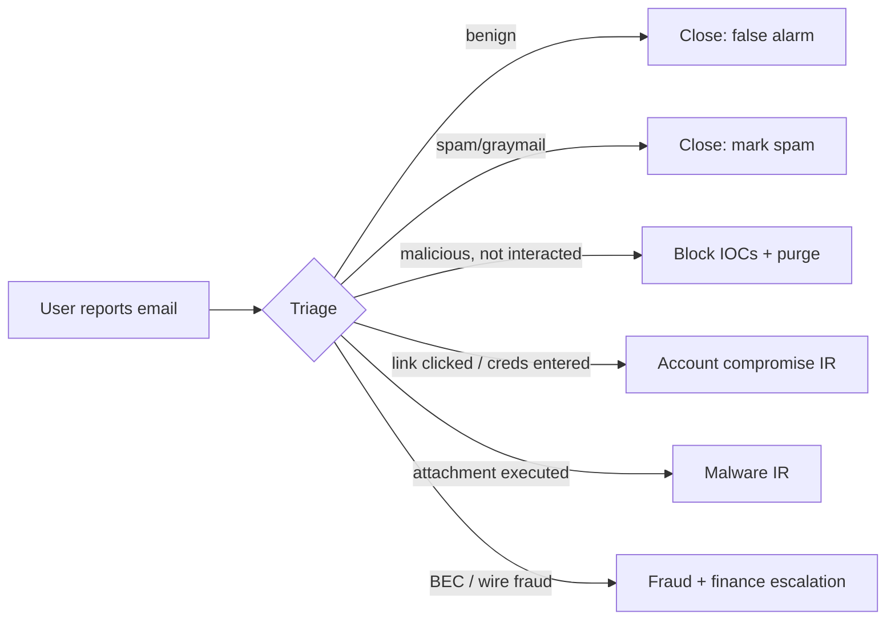
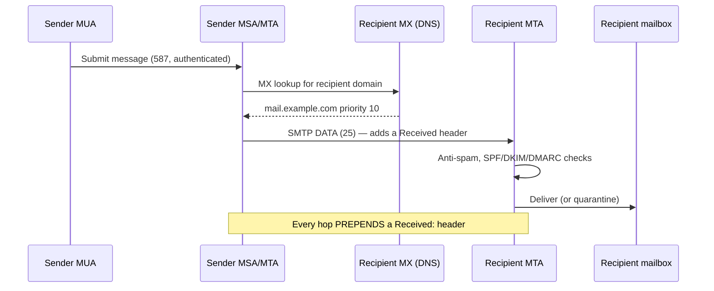
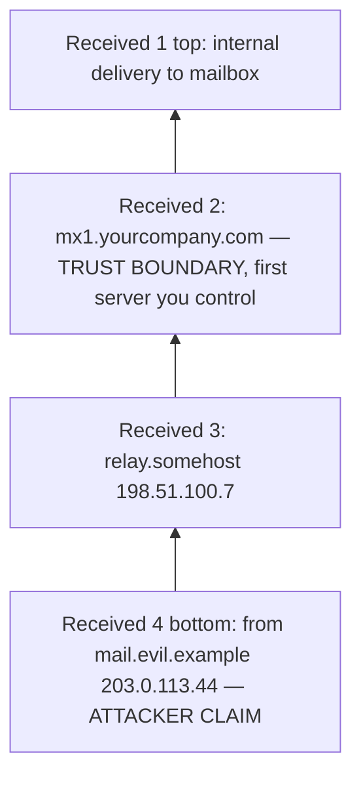
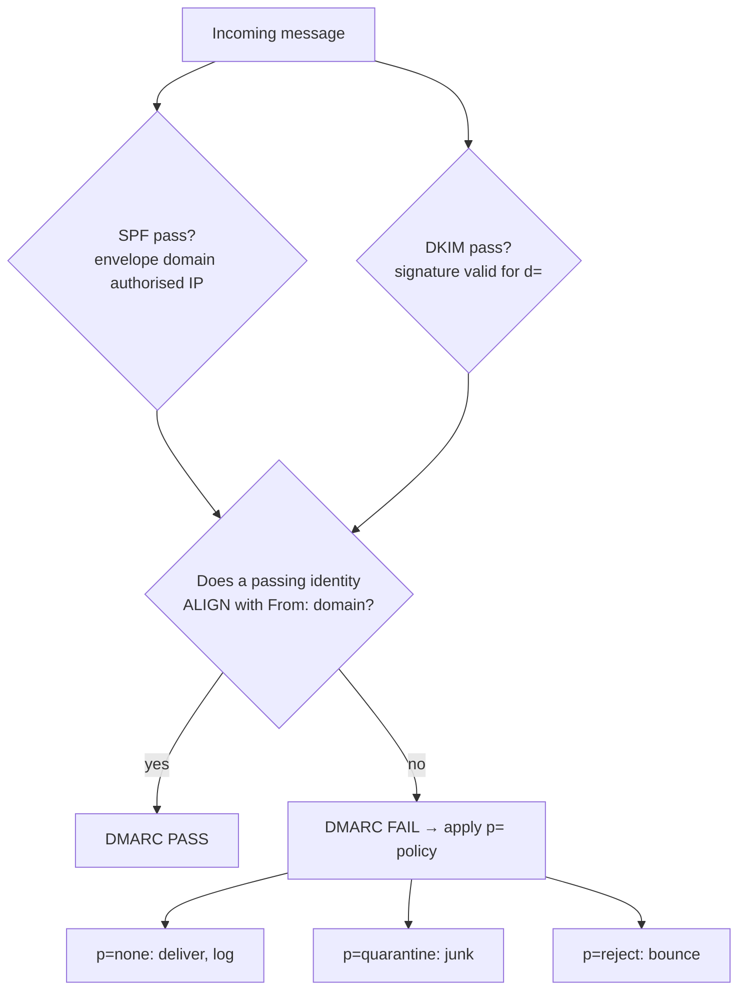
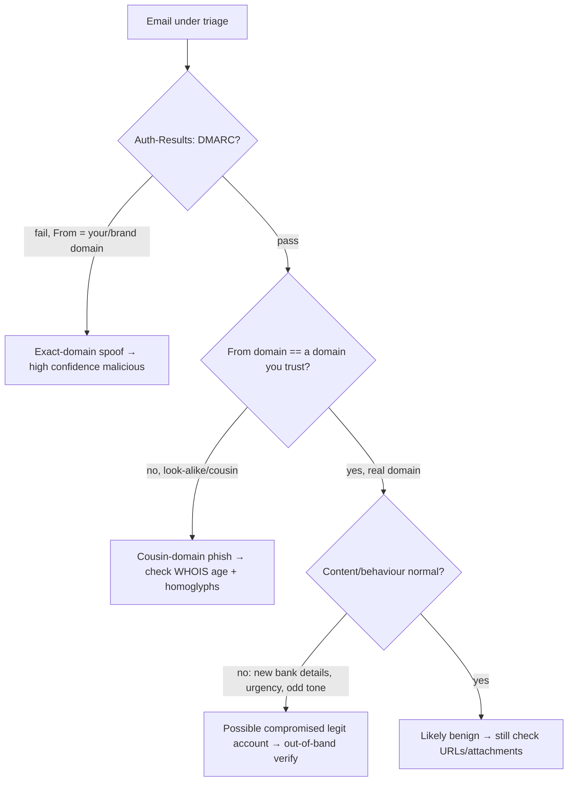
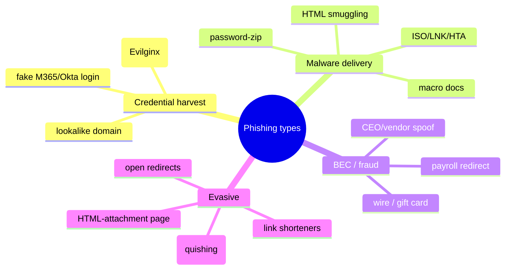
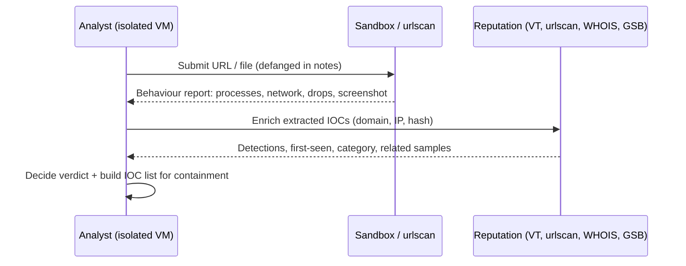
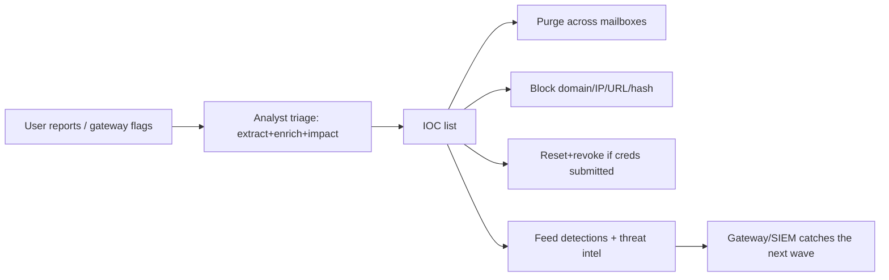

This is Chapter 9 of the SOC & Blue Team notebook. Chapters 7 and 8 taught you to read the host and network evidence *after* an attacker is inside. This chapter steps back to the single most common way they get inside in the first place: **email**. Phishing is the initial-access vector in the large majority of intrusions, and "I got a weird email" is the number-one ticket a Tier 1 analyst handles. Doing it well — quickly, safely, and completely — is the most repeated skill in a SOC, and it is a microcosm of the whole discipline: you take a raw artifact, extract indicators, enrich them, decide impact, and contain.

This chapter teaches phishing analysis from zero. We start with how email actually travels (SMTP and the MTA chain) so the headers make sense, then read those headers to trace an email's true origin, then master the authentication triad — **SPF, DKIM, DMARC** — that tells you whether the sender is who they claim. We cover the taxonomy of phishing (credential harvesting, malware delivery, business email compromise, QR-code "quishing"), how to **safely** extract and analyse the dangerous artifacts (headers, URLs, attachments) without infecting yourself, how to detonate the unknown in a sandbox, and how to enrich indicators with reputation services. Finally we cover the **containment playbook** — what you actually *do* once an email is confirmed malicious: search-and-purge across mailboxes, block the sender/URL/hash, and reset any credentials that were exposed.

The framing note: everything here is defensive. You analyse phishing so you can protect users and shut down campaigns. When we extract URLs and attachments we do it in a contained, non-executing way; when we detonate malware it is in an isolated sandbox you control. Never open a live phishing link or attachment on your production workstation, and never re-send a malicious sample outside a controlled channel.

We build from email and SMTP fundamentals, through header forensics, the SPF/DKIM/DMARC triad and `Authentication-Results`, the phishing taxonomy, safe artifact extraction and tooling, sandbox detonation and reputation enrichment, a full worked triage lab, the consolidated detection-and-defense angle, a final revision, a cheat sheet, and topic-specific practice.

---

## Part 1: Why Phishing Is the SOC's Highest-Volume Work

Two facts shape a SOC's relationship with email. First, **email is the dominant initial-access vector.** Year after year, breach reports (Verizon DBIR and others) put phishing and pretexting at or near the top of "how they got in." Second, **users report email.** Unlike most attacks, which the SOC discovers through telemetry, phishing generates a steady stream of human-reported tickets: a "Report Phish" button, a forwarded message, a helpdesk call. That combination means phishing triage is simultaneously the *most frequent* task and the *earliest* point at which a SOC can stop an intrusion — before any endpoint is touched.

The stakes escalate along a clear ladder. A blocked spam email is nothing. A credential-harvesting page that a user *submitted to* means an account is compromised and you're now racing the attacker to reset it before they log in and pivot (Chapters 7–8 territory). A malware attachment that *executed* means you're in incident response. A **business email compromise (BEC)** that succeeded means money left the company. The analyst's job on every phish is to figure out **which rung of that ladder** the organisation is on, and to do it fast, because the window between "user clicked" and "attacker logs in" is often minutes.



Phishing analysis is also the best training ground for the core SOC loop, which is why it belongs here after the log-analysis chapters and before detection engineering: **extract indicators → enrich → decide impact → contain → document.** Every step you practise on a phishing ticket transfers to every other alert type.

---

## Part 2: How Email Travels — SMTP and the MTA Chain

You cannot read email headers without knowing how email moves. Email delivery is a relay chain of **Mail Transfer Agents (MTAs)** speaking **SMTP** (Simple Mail Transfer Protocol, port 25 between servers; 587/465 for client submission).

The players:

- **MUA (Mail User Agent)** — the client (Outlook, Gmail web, Thunderbird, a script).
- **MSA (Mail Submission Agent)** — receives the user's outbound mail (587).
- **MTA (Mail Transfer Agent)** — relays server-to-server (25). There can be several hops.
- **MDA (Mail Delivery Agent)** — deposits mail into the recipient's mailbox.



Two SMTP details matter enormously for analysis:

1. **The envelope vs. the header are different things.** SMTP has an *envelope* — the `MAIL FROM` (a.k.a. Return-Path / bounce address) and `RCPT TO` given during the SMTP conversation — and the *message headers* the user sees (`From:`, `To:`). **These need not match.** A phisher sets the visible `From:` to `ceo@yourcompany.com` while the envelope `MAIL FROM` is `attacker@evil.com`. SPF checks the *envelope* sender; the user sees the *header* From. This gap is the root of most spoofing, and understanding it is the single most important concept in the chapter.
2. **Every hop prepends a `Received:` header.** As the message passes through each MTA, that MTA adds a `Received:` line **at the top**. So the headers accumulate a stack: the *bottom* `Received:` is the earliest (closest to the sender), the *top* is the most recent (closest to you). Reading that stack bottom-up is how you trace true origin.

**Why the trust boundary matters.** Headers added by *your own* mail infrastructure are trustworthy; headers added by servers *before* the message reached your perimeter can be forged by the attacker. The job is to find the boundary — the first `Received:` line written by a server you control — and treat everything below it as attacker-influenced claims to be verified, not facts.

### A raw SMTP transcript, so headers stop being mysterious

Everything in the headers comes from a plain-text conversation. Here is what an MTA-to-MTA delivery actually looks like on the wire (the receiving server's responses are the `250`/`354` lines):

```text
S: 220 mx1.yourcompany.com ESMTP Postfix
C: EHLO mail.evil.example
S: 250-mx1.yourcompany.com
S: 250 STARTTLS
C: MAIL FROM:<bounce@evil.com>            <-- ENVELOPE sender → becomes Return-Path, checked by SPF
S: 250 2.1.0 Ok
C: RCPT TO:<victim@yourcompany.com>       <-- ENVELOPE recipient
S: 250 2.1.5 Ok
C: DATA
S: 354 End data with <CR><LF>.<CR><LF>
C: From: "Microsoft 365" <security@micros0ft-support.com>   <-- HEADER From the user sees
C: To: victim@yourcompany.com
C: Subject: Action required
C: 
C: <body>
C: .
S: 250 2.0.0 Ok: queued as 4abc...
```

Notice the two independent "from" values: the **envelope** `MAIL FROM:<bounce@evil.com>` (which SPF validates and which becomes `Return-Path:`) and the **header** `From: ...micros0ft-support.com` (which the user reads and DMARC aligns against). The attacker controls *both* freely — nothing in SMTP forces them to match. That single fact, visible right here in the transcript, is why the SPF/DKIM/DMARC layer (Part 4) had to be invented on top of SMTP. Once you have seen the conversation, every header you read afterwards has an obvious origin.

---

## Part 3: Reading Email Headers Like a Forensic Analyst

Getting the **full, raw headers** is step zero. In Outlook: open the message → File → Properties → "Internet headers", or use "View Source" in webmail (Gmail: "Show original"). Copy the entire header block. Never analyse from the rendered view alone — the display name and the real address diverge constantly.

### The headers that matter, and how to read each

| Header | What it is | How you use it |
|---|---|---|
| `From:` | Display name + address the user sees | The *claim*. Check the real address, not the friendly name. |
| `Reply-To:` | Where replies actually go | Mismatch with `From:` is a BEC/redirect tell. |
| `Return-Path:` | Envelope sender (bounce address) | What **SPF** actually validates. Compare to `From:`. |
| `Received:` (stack) | One per hop, prepended | Trace origin bottom-up; find the real originating IP. |
| `Message-ID:` | Unique ID, usually `<...@sending-domain>` | The domain here often reveals the true sender platform. |
| `Authentication-Results:` | Your gateway's SPF/DKIM/DMARC verdicts | The fastest authenticity read — see Part 4. |
| `X-Originating-IP` / `X-Sender-IP` | Some platforms record the client IP | Origin hint (not always present/trustworthy). |
| `X-Mailer` / `User-Agent` | Sending client software | Odd values (`PHPMailer`, `Python-smtplib`) suggest scripted bulk phishing. |
| `Subject:` / `Date:` | As shown | Note timezone in `Date:` vs. `Received:` for anomalies. |

### Tracing origin through the `Received:` stack

Read from the **bottom** upward. Each line looks like:

```text
Received: from mail.evil.example (mail.evil.example [203.0.113.44])
    by mx1.yourcompany.com (Postfix) with ESMTPS id 4abc...
    for <victim@yourcompany.com>; Wed, 19 Feb 2027 08:15:02 +0000
```

Read it as: "**mx1.yourcompany.com** received this **from mail.evil.example [203.0.113.44]**." The **`from` host and the bracketed IP** are what you record. Work up the stack:

- The **lowest** `Received:` is the origin claim — often the attacker's sending host and IP.
- Watch for the **trust boundary**: the first hop that is *your* infrastructure (your gateway, e.g. Proofpoint/Mimecast/Microsoft EOP). Everything below it can be forged; the IP recorded *by your gateway* about the host that connected to it is the reliable "who actually delivered this to us."
- **Forged `Received:` headers**: attackers sometimes inject fake `Received:` lines at the bottom to muddy the trail. They can't forge the ones *your* servers add, so anchor on the boundary line.



**Practical origin extraction.** Once you have the header block in a file, pull the routing IPs and the key headers programmatically:

```bash
# Extract every IP that appears in Received headers (origin candidates)
grep -i "^Received:" headers.txt | grep -oE '[0-9]{1,3}(\.[0-9]{1,3}){3}' | sort -u

# The three identities to compare for spoofing
grep -iE "^(From|Return-Path|Reply-To):" headers.txt

# The gateway's own verdict
grep -i "^Authentication-Results:" headers.txt
```

**The core spoofing test:** compare the **`From:` domain**, the **`Return-Path:` (envelope) domain**, and the **DKIM `d=` domain** (Part 4). When a message claims `From: ceo@yourcompany.com` but `Return-Path:` is `bounce@sketchy-mailer.ru` and there's no aligned DKIM, you're looking at a spoof — regardless of how convincing the body is.

### Two full header blocks, annotated

Reading real header blocks is a skill you only build by reading real header blocks. Here is a **legitimate** message, top-to-bottom, with what each line proves:

```text
Delivered-To: victim@yourcompany.com
Received: by mx1.yourcompany.com (Postfix) id 4dEf...; Wed, 19 Feb 2027 08:20:01 +0000   # (1) YOUR server: trust boundary
Received: from mail-sor-f41.google.com (mail-sor-f41.google.com [209.85.220.41])
        by mx1.yourcompany.com with ESMTPS; Wed, 19 Feb 2027 08:20:00 +0000               # (2) received FROM Google's real MTA
Authentication-Results: mx1.yourcompany.com;
        spf=pass smtp.mailfrom=partner.com;                                                # (3) envelope authorised
        dkim=pass header.d=partner.com;                                                    # (4) signed by partner.com
        dmarc=pass (p=reject) header.from=partner.com                                       # (5) aligned + enforced
DKIM-Signature: v=1; a=rsa-sha256; d=partner.com; s=sel1; h=from:to:subject:date; bh=...; b=...
From: "Sam Rivera" <sam.rivera@partner.com>
Return-Path: <sam.rivera@partner.com>                                                       # (6) envelope == From: aligned
To: victim@yourcompany.com
Subject: Re: Q1 statement
Date: Wed, 19 Feb 2027 08:19:58 +0000
```

Everything agrees: origin is Google's genuine MTA, SPF/DKIM/DMARC all pass and **align** to `partner.com`, and `From` == `Return-Path`. Verdict: authentic (still verify content, but the identity is sound).

Now a **malicious** block — same structure, telling a very different story:

```text
Delivered-To: victim@yourcompany.com
Received: by mx1.yourcompany.com (Postfix) id 9aXy...; Wed, 19 Feb 2027 09:05:03 +0000       # (1) trust boundary
Received: from unknown (vps-93x.bulletproof-host.ru [203.0.113.44])
        by mx1.yourcompany.com with ESMTP; Wed, 19 Feb 2027 09:05:02 +0000                   # (2) origin: random VPS, not a mail brand
Received: from micros0ft-support.com (localhost [127.0.0.1])                                  # (3) FORGED lower hop (attacker-written)
Authentication-Results: mx1.yourcompany.com;
        spf=softfail smtp.mailfrom=bounce@vps-93x.ru;                                          # (4) SPF softfail
        dkim=none;                                                                             # (5) unsigned
        dmarc=fail (p=none) header.from=micros0ft-support.com                                  # (6) fail + no enforcement
From: "Microsoft 365 Security" <security@micros0ft-support.com>                                # (7) look-alike domain (zero for o)
Reply-To: <account-team@micros0ft-support.com>
Return-Path: <bounce@vps-93x.ru>                                                               # (8) envelope != From
To: victim@yourcompany.com
Subject: Action required: your password expires today
X-Mailer: PHPMailer 6.9.1 (https://github.com/PHPMailer/PHPMailer)                             # (9) scripted bulk sender
```

The tells stack up: origin is a "bulletproof" VPS (not any Microsoft MTA); a **forged `127.0.0.1` `Received:`** line the attacker injected below your boundary; SPF softfail, DKIM none, DMARC fail; a **look-alike `micros0ft`** domain; `Return-Path` ≠ `From`; and `X-Mailer: PHPMailer` betraying a script. Any *one* of these warrants suspicion; together they are conclusive.

### A small triage helper you can keep

Wrap the repetitive extraction into one script so every ticket starts the same way:

```bash
#!/usr/bin/env bash
# phish-triage.sh <email.eml>  — read-only, no rendering, no network
f="$1"
echo "=== IDENTITIES ==="
grep -iE "^(From|Return-Path|Reply-To|Sender):" "$f"
echo "=== AUTH RESULTS ==="
grep -i "^Authentication-Results:" "$f"
echo "=== ORIGIN IPs (Received stack) ==="
grep -i "^Received:" "$f" | grep -oE '([0-9]{1,3}\.){3}[0-9]{1,3}' | sort -u
echo "=== MAILER / MESSAGE-ID ==="
grep -iE "^(X-Mailer|User-Agent|Message-ID):" "$f"
echo "=== LINK TARGETS (defanged) ==="
grep -oiE 'href="[^"]+"' "$f" | sed 's/href="//I;s/"$//' \
  | sed 's/http/hxxp/;s/\./[.]/g' | sort -u
echo "=== ATTACHMENTS ==="
grep -iE 'Content-Disposition: attachment|filename=' "$f"
```

Run it, then walk the SOP (Part 4) from the output. Automating the mechanical steps frees your attention for the judgement calls — look-alike domains, WHOIS age, and content — that no script can make for you.

---

## Part 4: The Authentication Triad — SPF, DKIM, DMARC

These three DNS-based standards exist to answer one question: *is this sender authorised to send as this domain?* An analyst must read all three fluently, because the gateway's `Authentication-Results` header summarises them and they are your fastest authenticity signal.

### SPF (Sender Policy Framework)

**What it is:** the domain owner publishes a DNS `TXT` record listing which IP addresses/hosts are allowed to send mail for the domain. The receiving MTA checks whether the connecting server's IP (for the **envelope `MAIL FROM`/Return-Path** domain) is in that list.

```text
example.com.  IN TXT  "v=spf1 include:_spf.google.com ip4:198.51.100.0/24 -all"
```

- `v=spf1` — SPF version.
- `include:` — delegate to another domain's SPF (e.g. your email provider).
- `ip4:`/`ip6:` — explicit allowed ranges.
- `-all` (**hard fail** — reject anything else), `~all` (**soft fail** — accept but mark), `?all` (neutral). A domain publishing `-all` is serious about anti-spoofing; `~all` is common but weaker.

**Key limitation:** SPF validates the **envelope** sender (Return-Path), *not* the visible `From:`. So an attacker can pass SPF for *their own* domain while spoofing your `From:` in the header — SPF alone does not stop display-From spoofing. That's why DMARC exists.

### DKIM (DomainKeys Identified Mail)

**What it is:** the sending server cryptographically **signs** selected headers and the body with a private key; the public key is published in DNS. The receiver verifies the signature, proving (a) the message really came from a server holding that domain's key and (b) the signed content wasn't altered in transit.

```text
DKIM-Signature: v=1; a=rsa-sha256; d=example.com; s=selector1;
    h=from:subject:date:to; bh=<body hash>; b=<signature>...
```

- `d=` — the **signing domain** (crucial: compare to the `From:` domain for *alignment*).
- `s=` — the **selector**, which points to the DNS record `selector1._domainkey.example.com` holding the public key.
- `h=` — which headers were signed.
- `bh=` / `b=` — body hash and signature.

A **valid DKIM** means the content is authentic and untampered *for the domain in `d=`*. But note: an attacker can validly DKIM-sign mail for *their* domain. Authenticity of the signature ≠ trustworthiness of the sender. Alignment (next) is what ties it to the claimed identity.

### DMARC — the policy that ties it together

**What it is:** DMARC builds on SPF and DKIM by adding two things: **alignment** and a **published policy**. A message passes DMARC if SPF **or** DKIM passes **and** the passing identity **aligns** with the visible `From:` domain.

- **Alignment** means the SPF domain (Return-Path) or the DKIM `d=` matches the `From:` domain (relaxed = same organisational domain; strict = exact). This is the piece that finally addresses display-From spoofing: even if a phisher passes SPF for `evil.com`, it doesn't *align* with a `From: yourcompany.com`, so DMARC fails.
- **Policy** is published by the `From` domain owner in DNS:

```text
_dmarc.example.com.  IN TXT  "v=DMARC1; p=reject; rua=mailto:dmarc@example.com; pct=100; adkim=s; aspf=r"
```

- `p=none` (monitor only — no enforcement), `p=quarantine` (send to junk), `p=reject` (bounce). 
- `rua=` — where aggregate reports go.
- `adkim`/`aspf` — alignment mode (`s`trict/`r`elaxed).



### Reading `Authentication-Results` — the fast path

Your gateway condenses all three into one header. Learn to read it at a glance:

```text
Authentication-Results: mx1.yourcompany.com;
    spf=fail (sender IP is 203.0.113.44) smtp.mailfrom=bounce@evil.com;
    dkim=none;
    dmarc=fail (p=reject) header.from=yourcompany.com
```

This single header tells the story: SPF **fail**, DKIM **none**, DMARC **fail** with the `From:` claiming `yourcompany.com` under a `p=reject` policy. That is a spoof of your own domain, and the gateway *should* have rejected it — the fact it landed means either a gap or an internal relay. **Analyst rule of thumb:** `dmarc=pass` with alignment to a domain that matches the `From:` is strong evidence the sender identity is real (though a *compromised legitimate account* still passes everything — authenticity is not intent). `dmarc=fail` on a `From:` that impersonates a trusted brand or your own domain is a strong spoofing signal.

**A crucial nuance for triage:** authentication passing does **not** mean the email is safe. A phisher who registers `y0urcompany.com` (lookalike) or `microsoft-secure-login.com` can pass SPF/DKIM/DMARC *for that domain* perfectly, because they own it. Auth tells you "the sender is who the envelope says," not "the sender is trustworthy." Combine auth results with domain reputation, look-alike analysis, and content.

### Verifying the records yourself with `dig`

The gateway already computed the verdict, but you'll often want to check the published policy directly — to see whether a domain *even has* DMARC enforcement, or to sanity-check a look-alike's SPF. `dig` queries DNS from the command line:

```bash
# SPF: the domain's sending policy (TXT record starting v=spf1)
dig +short TXT yourcompany.com | grep spf1
#   "v=spf1 include:_spf.google.com ip4:198.51.100.0/24 -all"   -> -all = hard fail, good

# DMARC: policy record lives at _dmarc.<domain>
dig +short TXT _dmarc.yourcompany.com
#   "v=DMARC1; p=reject; rua=mailto:dmarc@yourcompany.com; adkim=s; aspf=r"

# DKIM public key: needs the SELECTOR from the message's DKIM-Signature s= tag
dig +short TXT selector1._domainkey.partner.com
#   "v=DKIM1; k=rsa; p=MIGfMA0GCSq..."   -> key exists = domain can DKIM-sign

# Quick reverse look at the sending IP + its PTR (does it match the claimed sender?)
dig +short -x 203.0.113.44
#   (no PTR, or an unrelated hosting name) -> not a mail brand, another red flag
```

**Reading the results:** a look-alike domain that phishes you will often have a **freshly created SPF/DMARC** (or none, or `p=none`), while the brand it imitates publishes `p=reject`. A legitimate brand's DKIM selector resolves to a real public key; a spoof of that brand can't produce a valid signature under the brand's `d=` because it doesn't hold the private key. These direct DNS checks let you confirm what `Authentication-Results` summarised, and they're essential when you're triaging on a raw `.eml` without a gateway verdict at all.

### The spoofing-techniques catalogue

Because "spoofing" is used loosely, name the specific technique you're looking at — the defence and the auth verdict differ for each:

| Technique | What the attacker does | DMARC result | How you spot it |
|---|---|---|---|
| **Exact-domain spoof** | Forges `From: you@yourdomain.com` with no auth | `dmarc=fail` (if you publish `p=reject`, it's blocked) | Auth-Results fail; origin IP not yours |
| **Display-name spoof** | Real address is `random@gmail.com` but display name is "Jane Okoro (CFO)" | Often `pass` (for gmail.com) | The friendly name lies; check the *actual* address |
| **Cousin / look-alike domain** | Registers `yourcompany-hr.com`, `micros0ft.com`, `paypa1.com` | `pass` (attacker owns it) | Homoglyph/typo domain; WHOIS shows new registration |
| **Subdomain / lookalike TLD** | `login.yourcompany.secure-portal.com` or `.co`/`.info` variant | `pass` (attacker owns parent) | The *registered* domain is not yours; read right-to-left |
| **Compromised legitimate account** | Sends from a real, hijacked vendor/partner mailbox | `pass` (it IS the real domain) | Auth is clean; the tell is *content/behaviour* (new bank details, odd tone), not headers |
| **Open relay / third-party mailer abuse** | Sends via a mis-configured or shared bulk mailer | Varies | `X-Mailer`/`Message-ID` reveal the platform; envelope ≠ From |

The two hardest cases — **cousin domains** and **compromised legitimate accounts** — both *pass* authentication, which is the whole reason "auth passed" can never be your stopping point. For cousin domains, homoglyph and WHOIS-age analysis carry the verdict; for compromised real accounts, only content, context, and out-of-band verification do. Read the *registered* domain right-to-left: in `login.yourco.secure-portal.com` the domain that actually matters is `secure-portal.com`, not the reassuring `yourco` label in the middle.



### A repeatable triage SOP

Run every phishing ticket through the same ordered checklist so nothing is missed under time pressure:

1. **Preserve** the raw `.eml`/headers; work only on the isolated VM.
2. **Identities:** compare `From` / `Return-Path` / `Reply-To`; note display-name vs real address.
3. **Auth:** read `Authentication-Results` (SPF/DKIM/DMARC + alignment).
4. **Origin:** trace `Received:` bottom-up to the trust boundary; record the sending IP.
5. **Reputation:** WHOIS domain age; IP and domain against VT/urlscan/AbuseIPDB.
6. **Artifacts:** extract URLs (real `href`) and attachments; classify type; static-analyse; detonate unknowns in the sandbox.
7. **Classify:** credential / malware / BEC / evasive.
8. **Scope:** platform search (Message Trace / Investigation Tool) — who else received it?
9. **Impact:** did anyone click/submit/execute? (proxy, DNS, sign-in, EDR logs.)
10. **Contain:** purge, block IOCs, reset+revoke if needed, notify.
11. **Document:** defanged IOC list, verdict, actions, and feed detections/threat-intel.

This SOP is the backbone; the rest of the chapter is depth on each step.

---

## Part 5: The Phishing Taxonomy — Knowing What You're Looking At

Classifying the phish early guides everything after. The major categories:

### Credential harvesting

The most common. The email lures the user to a fake login page (Microsoft 365, Google, Okta, a bank, the company VPN) that captures the username/password (and increasingly the **MFA token** via reverse-proxy kits like Evilginx). Tells: urgency ("your account will be locked"), a link to a look-alike domain, a login form that posts to an attacker host. **Impact ladder:** if the user *submitted* credentials, treat the account as compromised — reset immediately and hunt for a login from the attacker (Chapter 7/8 auth trail).

### Malware delivery

The email carries or links to a malicious payload — a macro-enabled Office doc, a OneNote/HTML smuggling file, an ISO/IMG/ZIP containing an LNK or script, or a link to a "document" that downloads a loader. Tells: attachment types that shouldn't be emailed (`.iso`, `.img`, `.lnk`, `.js`, `.hta`, `.vbs`, double extensions like `invoice.pdf.exe`), password-protected archives (to evade scanning, with the password in the body). **Impact ladder:** if it *executed*, you're in malware IR — pivot to EDR (Chapter 11) and endpoint logs.

### Business Email Compromise (BEC) / wire fraud

No malware, no link — pure social engineering, often from a **compromised or look-alike executive/vendor account**, asking for a wire transfer, gift cards, payroll direction change, or invoice payment to a new account. Tells: urgency + secrecy ("I'm in a meeting, don't call"), `Reply-To` differing from `From`, new banking details, a look-alike or freemail domain. **Impact ladder:** if finance acted, money may have moved — escalate to fraud/finance instantly; recovery windows for wires are short.

### QR-code phishing ("quishing") and evasive variants

The malicious URL is embedded in a **QR code image** (evading URL scanners that read text) or hidden behind link-shorteners, open redirects, CAPTCHAs, or benign-looking cloud-hosting (SharePoint, Google Docs, Adobe) that then redirects. HTML-attachment phishing puts the whole fake login page *inside* an `.html` file so nothing hits a URL scanner until the user opens it. Tells: an image where a link should be, "scan to view", shorteners, unexpected `.html` attachments.



**Why classification drives action:** a credential phish means *race to reset*; a malware phish means *endpoint IR*; a BEC means *finance escalation*; an evasive quishing campaign means *user comms + gateway rule*. The same triage skills apply, but the containment path forks sharply based on type — so name the type early.

---

## Part 6: Safely Extracting and Analysing Artifacts

The dangerous part of phishing analysis is that the artifacts are *live weapons*. The discipline is to extract and inspect them **without executing** anything, on an isolated analysis system (a dedicated VM, ideally with no corporate credentials and network-restricted).

### Golden safety rules

- **Never click links or open attachments on your production workstation.** Use an isolated analysis VM or a purpose-built service.
- **Defang indicators** when recording/sharing them so nobody accidentally clicks: write `hxxp://evil[.]com`, `bad@evil[.]com`, `203.0.113[.]44`. CyberChef's "Defang URL" or a quick `sed` does this.
- **Work from the raw source**, not the rendered email — the rendered view hides the real link targets and can trigger remote-content beacons (tracking pixels that confirm your address is live).
- **Detonate only in a sandbox** you control (Part 7).

### Extracting URLs safely

The visible link text and the real `href` differ constantly (`<a href="http://evil.com">https://microsoft.com/login</a>`). Pull the real targets from the raw HTML source:

```bash
# Extract href targets from the raw email body (no rendering, no clicking)
grep -oiE 'href="[^"]+"' email.eml | sed 's/href="//I; s/"$//' | sort -u

# Defang them before pasting anywhere
grep -oiE 'https?://[^ "]+' email.eml | sed 's/http/hxxp/; s/\./[.]/g' | sort -u
```

For each URL, note: the **registered domain** (is it a look-alike? `micros0ft`, `-secure`, an unrelated TLD?), whether it's a **shortener/redirect** (expand it *without* visiting — many reputation services and `unshorten` APIs resolve the chain server-side), and the **path/params** (a `?email=victim@company.com` prefill confirms targeting).

### Extracting and analysing attachments safely

Save the attachment to the analysis VM. Then, **statically** (no execution):

- **Hash it** for reputation lookups: `sha256sum file`.
- **Identify the true type** (extensions lie): `file suspicious.pdf` — if `file` says it's a PE executable, that's a mismatch and a strong signal.
- **For Office docs**, inspect macros/structure *without opening in Office* using `oletools`:

**`oletools` from scratch.** `oletools` is a Python toolkit for analysing Microsoft OLE/Office files statically. `olevba` extracts and deobfuscates VBA macros; `oleid` flags suspicious features; `oledump` walks the OLE streams.

```bash
pip install oletools --break-system-packages

# Extract and analyse macros WITHOUT executing the document
olevba suspicious_invoice.doc
#   Shows the VBA source, and an "IOC/Suspicious" table: AutoOpen, Shell,
#   URLDownloadToFile, base64 blobs, WScript.Shell — the macro's real intent.

oleid suspicious_invoice.doc      # quick risk flags (VBA present, encryption, ...)
```

- **For PDFs**, look for JavaScript, `/OpenAction`, embedded files, and URLs with `pdfid`/`pdf-parser` (part of Didier Stevens' tools).
- **For archives/ISO/LNK**, list contents without extracting-and-running; inspect `.lnk` targets, which often reveal a `powershell -enc <base64>` command.

### The modern attachment tradecraft you must recognise

Attackers moved on from bare `.exe` files years ago. The current delivery techniques each leave a recognisable static signature:

- **HTML smuggling.** The email carries a benign-looking `.html` attachment. The HTML contains a JavaScript blob that, when the user opens it in a browser, *reconstructs* a malicious file (via a `data:` URI / Blob and a forced download) entirely on the client — so no payload ever crossed the network for the gateway to scan. **Static tell:** an `.html` attachment containing large base64 blobs and `new Blob(...)`/`msSaveOrOpenBlob`/`download=` in the script. Extract the base64 with CyberChef ("From Base64" → check the magic bytes: `MZ` = a Windows PE, `PK` = a ZIP/Office).

```bash
# Pull the smuggled payload's magic bytes without executing anything
grep -oE '[A-Za-z0-9+/]{200,}={0,2}' smuggle.html | head -1 | base64 -d | xxd | head -1
# 00000000: 4d5a 9000 ...  -> "MZ" = Windows executable hidden inside the HTML
```

- **ISO / IMG / VHD containers.** A disk-image attachment that, when double-clicked on Windows, mounts as a drive containing an `.lnk` shortcut plus a hidden DLL/script. Containers historically bypassed the *Mark-of-the-Web* (MOTW) that would otherwise warn the user. **Static tell:** an `.iso`/`.img`/`.vhd` attached to a business email at all; mount read-only in the lab and inspect the `.lnk` target.
- **LNK (shortcut) abuse.** The `.lnk`'s target is not a document — it's a `powershell -w hidden -enc <base64>` or a `cmd /c` cradle. **Static tell:** parse the LNK (e.g. with `lnkinfo` / `pylnk3`) and read the command-line arguments; decode any base64 with CyberChef.
- **OneNote (`.one`) payloads.** OneNote wasn't covered by macro protections, so attackers embed a script/`.hta`/`.bat` behind a "Double-click to view" graphic. **Static tell:** a `.one` attachment; extract embedded objects and inspect them.
- **Password-protected archives.** A `.zip`/`.7z` whose password is in the email body, specifically to prevent gateway scanning. **Static tell:** the "password is 1234" pattern; detonate in the sandbox using the provided password, never on your workstation.

| Technique | Attached file | Why it evades | First static check |
|---|---|---|---|
| HTML smuggling | `.html` | Payload built client-side, nothing scannable in transit | Decode base64 blobs → magic bytes |
| ISO/IMG/VHD | `.iso/.img/.vhd` | Container bypasses MOTW; hides LNK+DLL | Mount read-only, inspect LNK target |
| LNK cradle | `.lnk` | Looks like a shortcut, runs PowerShell | Parse LNK args, decode `-enc` |
| OneNote | `.one` | Outside macro protections | Extract embedded objects |
| Password zip | `.zip/.7z` (+pw in body) | Encryption blocks scanning | Sandbox with the body's password |

**Blue team usage:** most of these are cheaply *blocked outright* at the gateway (strip `.iso/.img/.lnk/.one/.hta/.js` from inbound mail; disallow password-protected archives from external senders) — a control that removes whole categories of delivery rather than chasing each sample.

### CyberChef — the analyst's Swiss-army knife (from scratch)

**What it is:** CyberChef is a browser-based tool (run it locally/offline) for chained data operations — decode base64, URL-decode, defang, extract IOCs, un-gzip, parse. Phishing payloads are layered with encoding; CyberChef peels them.

**Use it offline** (download the release, open `CyberChef.html`) so nothing you paste leaves your machine. Typical recipes: "From Base64" → "Decode text" to read an encoded PowerShell payload; "Extract URLs" + "Defang URL" to safely list link targets; "Extract IP addresses". This is where a base64 macro payload becomes a readable `Invoke-WebRequest http://evil[.]com/loader.exe`.

### One-shot IOC extraction and a lure-pattern reference

When you need a complete indicator sweep of a raw message for the ticket, chain the extractions:

```bash
#!/usr/bin/env bash
# ioc-sweep.sh <email.eml> — emits a defanged IOC block for the ticket
f="$1"
echo "## URLs"
grep -oiE 'https?://[^ "<>]+' "$f" | sort -u | sed 's/http/hxxp/;s/\./[.]/g'
echo "## Domains"
grep -oiE 'https?://[^/"]+' "$f" | sed -E 's#https?://##' | sort -u | sed 's/\./[.]/g'
echo "## IPv4"
grep -oE '([0-9]{1,3}\.){3}[0-9]{1,3}' "$f" | sort -u | sed 's/\./[.]/g'
echo "## Email addresses"
grep -oiE '[a-z0-9._%+-]+@[a-z0-9.-]+\.[a-z]{2,}' "$f" | sort -u | sed 's/@/[at]/;s/\./[.]/g'
echo "## Attachment names + hashes (run against saved files)"
grep -oiE 'filename="?[^"]+"?' "$f" | sort -u
```

Save the attachments separately and hash them (`sha256sum`), then paste the whole block, defanged, into the ticket and the threat-intel platform.

Finally, keep a mental (or written) library of the **lure patterns** that recur, because recognising the pretext speeds classification:

| Lure theme | Typical subject cues | Usual goal |
|---|---|---|
| Account security | "password expires", "unusual sign-in", "verify your account" | Credential harvest |
| Delivery / shipping | "failed delivery", "track your package", "customs fee" | Credential / malware |
| Finance / invoice | "overdue invoice", "remittance", "purchase order" | Malware / BEC |
| HR / payroll | "update direct deposit", "review your bonus", "new policy" | BEC / credential |
| Voicemail / fax / scan | "you have a new voicemail", "scanned document" | Credential (fake login on "listen") |
| Shared document | "shared a file with you", "review in SharePoint/Docs" | Credential / evasive redirect |
| Authority / urgency | "CEO request", "urgent, confidential", "action needed today" | BEC |

None of these is malicious by itself — legitimate versions exist — which is exactly why the pretext only *narrows* your hypothesis and the header/artifact analysis *confirms* it.

---

## Part 7: Detonation and Reputation Enrichment

Static analysis tells you a lot; sometimes you must see behaviour. And every extracted indicator wants enrichment against what the world already knows.

### Sandbox detonation

**What a sandbox is:** an isolated, instrumented environment that *executes* the sample and records everything it does — files written, processes spawned, registry changes, network callbacks, dropped payloads. It converts an opaque attachment/URL into a behavioural report and a set of IOCs.

- **Cloud sandboxes:** Any.Run (interactive), Joe Sandbox, Hybrid Analysis, VirusTotal's behaviour engine, urlscan.io (for URLs — renders the page, screenshots it, records the redirect chain and resources). **Caution:** public sandboxes are *public* — anything you upload may be visible to others, so never submit samples containing sensitive company data or that are themselves confidential. Use the org's private/enterprise sandbox for anything sensitive.
- **Local sandbox:** CAPEv2/Cuckoo in an isolated lab for full control.

**urlscan.io** deserves special mention for phishing: paste a suspicious URL and it renders the page in a contained browser, screenshots it, and shows the final domain, the resources loaded, and the redirect chain — you *see* the fake login page without ever touching it yourself, and you can search whether others have reported the same kit.



### Reputation and enrichment services

For every extracted indicator (sender domain, URLs, IPs, file hashes), enrich:

| Indicator | Enrichment sources | What it tells you |
|---|---|---|
| File hash (SHA256) | VirusTotal, MalwareBazaar, your EDR | Known-malicious? How many engines? Related campaign? |
| URL / domain | VirusTotal, urlscan.io, Google Safe Browsing, PhishTank, OpenPhish | Reported phishing? Screenshot? Redirect chain? |
| Domain age/owner | WHOIS, `whois`, domain-age lookups | **Newly registered** domains (days old) are a strong phishing signal |
| IP | AbuseIPDB, GreyNoise, Shodan | Known abuse/scan source? Hosting a login kit? |
| Sender infrastructure | Passive DNS, MX/SPF records | Bulk/disposable mailer? |

**The newly-registered-domain heuristic** is one of the highest-value quick checks: legitimate brands own their domains for years; phishing domains are frequently registered hours-to-days before the campaign. A `whois` showing a creation date this week on a domain claiming to be a bank is nearly conclusive.

```bash
# Domain age and registrar in one look (defang in your notes afterwards)
whois evil-login-secure.com | grep -iE "Creation Date|Registrar|Registrant"
# Creation Date: 2027-02-17T00:00:00Z   <-- two days old = huge red flag
```

**Enrichment discipline:** record every indicator and its verdict in the ticket, defanged, with the source and timestamp of the lookup. This IOC list *is* the deliverable that feeds containment (Part 9) and detection engineering (Chapter 12).

### Platform-native investigation (Microsoft 365 and Google Workspace)

Most enterprises run on one of two mail platforms, and each gives the analyst first-party tooling that answers the two questions triage cares about most: *who else got this?* and *did anyone interact?* You must know these because they are how you scope a campaign and how you drive the purge in Part 9.

**Microsoft 365 (Exchange Online / Defender for Office 365):**

- **Message Trace / Explorer (Threat Explorer):** search all delivered mail by sender, subject, URL, or attachment hash to enumerate every recipient of the campaign, and see the delivery action (delivered/junked/blocked) per message.
- **`Get-MessageTrace` / `Get-MessageTraceDetail`** (Exchange Online PowerShell) for scripted scoping.
- **UnifiedAuditLog / sign-in logs** to answer "did the user log in from the attacker's IP after clicking," and to spot the tell-tale **post-compromise inbox rule** creation.
- The same data is queryable in **Sentinel via KQL** (Chapter 5), e.g.:

```kusto
// Recipients of a phishing campaign by subject + sender (illustrative KQL)
EmailEvents
| where SenderFromDomain == "micros0ft-support.com"
| where Subject has "password expires"
| project Timestamp, RecipientEmailAddress, DeliveryAction, Subject, Url
| sort by Timestamp asc
```

```kusto
// Post-compromise: new inbox rule right after a suspicious sign-in
OfficeActivity
| where Operation in ("New-InboxRule","Set-InboxRule")
| project TimeGenerated, UserId, Parameters
```

**Google Workspace:**

- The **Security Investigation Tool** searches Gmail log events across the org by sender/subject/attachment, and can **delete matching messages** and reset the affected users directly from the console.
- **BigQuery Gmail logs** for large-scale queries.

**Why this matters for triage:** the reported email is one copy. Message Trace / the Investigation Tool convert "a user reported a phish" into "37 users received it, 4 clicked, 1 authenticated" — the difference between closing a ticket and running a scoped account-compromise IR. This platform search is the bridge from single-email analysis to campaign-wide containment.

---

## Part 8: Hands-On Lab — Triage a Reported Phishing Email End to End

A user forwards a "Microsoft 365 password expiry" email via the Report Phish button. Work it exactly as a Tier 1 analyst would, on your isolated analysis VM. (Reproduce this with a sample from your own test tenant or a public phishing corpus like the PhishTank/APWG samples — never a live third-party target.)

### Step 1 — Get the raw headers and read the three identities

```bash
grep -iE "^(From|Return-Path|Reply-To|Subject):" phish.eml
# From:        Microsoft 365 <security@micros0ft-support.com>
# Return-Path: <bounce@mailer-93x.ru>
# Reply-To:    <account-team@micros0ft-support.com>
# Subject:     Action required: your password expires today
```

**Read:** the `From:` uses **`micros0ft`** (zero, not "o") — a look-alike. The `Return-Path` is an unrelated `.ru` bulk mailer. Three different domains across From/Return-Path/Reply-To. Already highly suspicious.

### Step 2 — Check authentication

```bash
grep -i "^Authentication-Results:" phish.eml
# spf=pass smtp.mailfrom=bounce@mailer-93x.ru; dkim=pass header.d=mailer-93x.ru;
# dmarc=fail (p=none) header.from=micros0ft-support.com
```

**Read:** SPF and DKIM *pass* — but **for the attacker's own domains** (`mailer-93x.ru`), not for Microsoft. DMARC on the `From` domain is `p=none` (no protection). This is the classic trap: **auth "passes" but for the wrong identity.** The sender is authentically the attacker.

### Step 3 — Trace origin

```bash
grep -i "^Received:" phish.eml | grep -oE '[0-9]{1,3}(\.[0-9]{1,3}){3}' | sort -u
# 203.0.113.44   <- bottom Received, sending host
```

```bash
whois micros0ft-support.com | grep -i "Creation Date"
# Creation Date: 2027-02-18   <- registered yesterday
```

**Read:** origin IP `203.0.113.44`; the look-alike domain is **one day old**. Newly registered look-alike = phishing infrastructure.

### Step 4 — Extract and inspect the URL (no clicking)

```bash
grep -oiE 'href="[^"]+"' phish.eml | sed 's/href="//I;s/"$//' | sort -u
# https://micros0ft-support.com/365/login?email=victim@yourcompany.com
```

Defanged: `hxxps://micros0ft-support[.]com/365/login?email=victim@yourcompany[.]com`. The `?email=` prefill confirms **targeting** of your user. Submit the URL to urlscan.io from the isolated VM:

```text
urlscan result: renders a pixel-perfect Microsoft 365 login page; form POSTs
credentials to https://micros0ft-support[.]com/api/collect ; flagged by
2 engines as phishing; same kit seen on 6 sibling domains.
```

**Read:** confirmed credential-harvesting page (an Evilginx-style/AiTM kit given the `/api/collect` post and the sibling domains).

### Step 5 — Determine impact: did the user interact?

This is the pivotal question. Check the web proxy / firewall / DNS logs (Chapter 8 skills) for any host resolving or connecting to `micros0ft-support.com`, and check the M365 sign-in logs for a successful login from the attacker's IP/geo:

```text
Proxy log: 10.0.0.23 GET https://micros0ft-support.com/365/login  200  (user LT-FINANCE-07)
M365 sign-in: user victim@yourcompany.com  SUCCESS from 203.0.113.44 (RU)  09:12
```

**Read:** the user **visited the page**, and there is a **successful M365 sign-in from the attacker's IP** minutes later — the credentials (and likely the session token) were harvested and **the account is compromised.** The ticket just jumped from "phish report" to "account compromise IR."

### Step 6 — Contain (Part 9 playbook, applied)

1. **Reset the user's password and revoke all sessions/tokens** immediately (AiTM steals the session cookie, so a password reset alone isn't enough — revoke sessions and re-register MFA).
2. **Block** the domain `micros0ft-support.com` and IP `203.0.113.44` at the proxy/firewall/DNS; add the URL and sender to the email gateway blocklist.
3. **Search-and-purge** the campaign from all mailboxes (Part 9) — others likely received it.
4. **Hunt** for what the attacker did with the account: mailbox rules (auto-forward/hide), OAuth app grants, sent mail (internal spread), data access. (Account-compromise IR ties directly into Chapter 8's auth analysis and Chapter 11's endpoint checks.)
5. **Document** the IOC list (defanged) and notify the user and their manager.

### Step 7 — Timeline and verdict

| Time | Evidence | Event |
|---|---|---|
| 09:05 | Email headers | Look-alike `micros0ft-support.com`, DMARC fail, 1-day-old domain |
| 09:10 | Proxy log | User visits the fake login page |
| 09:11 | urlscan | Page confirmed as M365 credential-harvest kit |
| 09:12 | M365 sign-in | Successful login from attacker IP (RU) — **account compromised** |
| 09:20 | Containment | Password reset + session revoke + IOC blocks + mailbox purge |

**Verdict:** confirmed credential-harvesting phish → successful AiTM account compromise; contained; hunting for post-compromise actions ongoing. This is the full loop — extract, enrich, decide impact, contain, document — that every phishing ticket rehearses.

### Second mini-case — a BEC with no link and no attachment

Not every phish has a payload. A finance clerk forwards an email "from the CFO" asking to urgently update a vendor's bank account before a payment run. There is nothing to detonate — which is exactly why BEC is dangerous and why the analysis leans entirely on headers and context.

```bash
grep -iE "^(From|Return-Path|Reply-To|Subject):" bec.eml
# From:      "Jane Okoro (CFO)" <jane.okoro@yourcompany.com>
# Reply-To:  <jane.okoro.finance@gmail.com>          <-- replies go to a freemail account
# Return-Path: <jane.okoro.finance@gmail.com>
# Subject:   Urgent: update Acme Ltd bank details before 3pm run
grep -i "^Authentication-Results:" bec.eml
# spf=fail smtp.mailfrom=gmail.com; dkim=none; dmarc=fail (p=reject) header.from=yourcompany.com
```

**Read the tells, in order:** (1) DMARC **fail** on a `From:` that spoofs your own domain under `p=reject` — the display name is forged, the mail did not originate from your tenant; (2) **`Reply-To` and `Return-Path` point at a freemail account**, so any reply silently goes to the attacker, not the CFO; (3) the content pattern is textbook BEC — **urgency + a deadline + a change of banking details**; (4) there is no URL or attachment, so URL/hash reputation is irrelevant — the signal is entirely the identity mismatch plus the request type.

**Containment for BEC is different and time-critical:**

1. **Do not reply to the email.** Verify the request through an **out-of-band, known-good channel** — call the CFO on a number from the corporate directory, not any number in the email.
2. **Escalate to finance/AP and legal immediately** and freeze the pending payment. Wire/ACH recall windows are measured in hours; speed beats thoroughness here.
3. **Purge and block** the campaign (search-and-purge, block the freemail `Reply-To`, tune the external-sender banner and a display-name-of-an-executive rule).
4. If any payment already moved, invoke the fraud playbook (bank fraud desk, and where appropriate law enforcement / the relevant financial-crime reporting channel).

**Why this case matters:** it shows that "no payload" is not "no incident." The most expensive phishing outcomes often have the least technical content — the entire attack lives in the header mismatch and the social pressure, and the analyst's value is recognising it and escalating to finance *fast*.

---

## Part 9: Detection & Defense Angle (Consolidated)

Analysis catches one email; defense stops the campaign and the next one. This section is the standing program.

### The containment playbook (what you actually *do*)

- **Search-and-purge:** use the mail platform's tooling (Microsoft 365 *Content Search* + *Purge* / eDiscovery, Google Workspace *Investigation Tool*) to find every copy of the campaign (by sender, subject, URL, or attachment hash) across all mailboxes and soft/hard-delete them. This is the single highest-impact containment action for a broad campaign.
- **Block the IOCs:** sender address/domain and originating IP at the gateway; URL/domain at the proxy/DNS (sinkhole) and firewall; file hash at EDR and the mail gateway.
- **Reset & revoke:** for any user who submitted credentials — password reset **and session/token revocation** (critical for AiTM) and MFA re-registration.
- **Notify:** the affected users, their managers, and (for BEC/wire fraud) finance and, where appropriate, legal/fraud/law enforcement — wire-recall windows are short.
- **Feed detection:** every confirmed IOC becomes a blocklist entry and a detection rule (Chapter 12) and enriches your threat intel (Chapter 19).

### Preventive controls that shrink the phishing problem

| Control | Effect |
|---|---|
| **DMARC at `p=reject`** on your own domains | Stops attackers spoofing *your* domain to *your* users and others |
| **Inbound SPF/DKIM/DMARC enforcement** at the gateway | Junks/rejects failing spoofs of external brands |
| **External-sender banners** | Flags mail from outside the org (undercuts internal-spoof BEC) |
| **Attachment sandboxing & type blocking** (`.iso/.lnk/.hta/.js`) | Detonates unknowns; blocks weaponised types outright |
| **URL rewriting / time-of-click protection** (Safe Links / equivalent) | Re-checks the URL when the user clicks, not just at delivery |
| **Phishing-resistant MFA (FIDO2/passkeys)** | Defeats AiTM credential+token theft that TOTP/SMS MFA does not |
| **Report-Phish button + user training** | Turns users into sensors; faster reporting shrinks the click-to-contain window |
| **Newly-registered-domain & look-alike blocking** | Pre-empts the freshest phishing infrastructure |

### Standing detections (feeding the SIEM / gateway)

- **Auth-fail on trusted brands / own domain:** `dmarc=fail` where `From` impersonates your domain or a high-value brand.
- **Look-alike domains:** Levenshtein-close or homoglyph variants of your domain and top brands in `From`/URLs.
- **Post-click detection:** proxy/DNS connections to a domain that was in a reported phish; M365/Okta sign-ins from anomalous geo/IP shortly after a phishing click (ties to Chapter 8).
- **Mailbox-rule creation** (auto-forward/delete) right after a suspicious sign-in — a hallmark of a compromised account.
- **Mass identical messages** to many recipients from a new external sender (campaign signature).



---

## Part 10: Common Pitfalls

- **Trusting "auth passed."** SPF/DKIM/DMARC passing for the *attacker's own* domain does not make the email safe. Auth proves the envelope identity, not the sender's intent, and never trumps a look-alike domain or a malicious payload.
- **Analysing the rendered email.** The display name and link text hide the truth. Always work from the raw source, and beware remote-content beacons that confirm your address.
- **Clicking to "just check."** Never open links/attachments on a production machine. Use an isolated VM or a rendering service (urlscan) that touches it *for* you.
- **Uploading sensitive samples to public sandboxes.** Public VT/Any.Run submissions are visible to others. Use the private sandbox for anything containing company data.
- **Password reset without session revocation.** AiTM kits steal the *session token*; a reset alone leaves the attacker's live session working. Revoke sessions and re-register MFA.
- **Forgetting to purge.** Analysing the one reported copy while dozens sit unread in other inboxes. Search-and-purge the whole campaign.
- **Reading `Received` top-down.** The stack grows downward-in-time from the bottom; origin is at the *bottom*. Anchor on your trust boundary.
- **Treating BEC as low priority because there's no malware.** BEC moves real money with no payload to detonate. Speed to finance escalation is everything.
- **Not defanging IOCs in tickets.** A live URL pasted into a ticket gets clicked by the next person. Always `hxxp://evil[.]com`.

---

## Part 11: Final Revision / Summary

- Phishing is the top initial-access vector and the SOC's highest-volume ticket; triage is the core SOC loop in miniature — **extract → enrich → decide impact → contain → document.**
- Email travels through a chain of MTAs over SMTP; the **envelope (`MAIL FROM`/Return-Path) differs from the visible `From:`**, and that gap is the root of spoofing.
- Read **headers** from the raw source: compare `From` / `Return-Path` / `Reply-To`, trace origin through the **`Received:` stack bottom-up** to your trust boundary, and check `Authentication-Results`.
- The **SPF/DKIM/DMARC** triad answers "is the sender authorised for this domain": SPF validates the envelope IP, DKIM cryptographically signs (see `d=`), and **DMARC adds alignment + policy** to finally address display-From spoofing. `dmarc=fail` on your own/brand domain is a strong spoof signal — but **passing auth for the attacker's own domain is not safety.**
- Classify early: **credential harvest** (race to reset), **malware** (endpoint IR), **BEC** (finance escalation), **evasive/quishing** (comms + gateway rule).
- Extract artifacts **safely** (isolated VM, defanged IOCs, raw source): URLs via `href` parsing, attachments via `file`/`olevba`/`pdfid`, encoded payloads via **CyberChef**. **Detonate** unknowns in a sandbox; render URLs with **urlscan**; enrich every IOC (VT, urlscan, WHOIS domain-age, AbuseIPDB).
- **Contain** with the playbook: search-and-purge the campaign, block domain/IP/URL/hash, reset **and revoke sessions** for exposed accounts, notify, and feed detections/threat-intel.
- Preventive posture: DMARC `p=reject` on your domains, gateway enforcement + sandboxing + type-blocking, URL time-of-click protection, **phishing-resistant MFA**, and a report button that turns users into sensors.

Master this and you own the enterprise's most common and most consequential ticket — and you feed the detections and intel that the rest of the blue-team program (Chapters 10–13, 19) is built on.

---

## Part 12: Cheat Sheet / Quick Reference

**Three identities to compare (spoofing test):** `From:` vs `Return-Path:` (envelope, SPF) vs DKIM `d=`. Mismatch + `dmarc=fail` = spoof.

**Read `Received:` bottom-up.** Bottom = origin claim; find the first *your-infra* hop = trust boundary; the IP it recorded = real deliverer.

**Auth verdicts:**

```text
spf=pass/fail   smtp.mailfrom=<envelope domain>   (validates envelope, not From)
dkim=pass/fail  header.d=<signing domain>          (compare to From for alignment)
dmarc=pass/fail (p=none|quarantine|reject) header.from=<From domain>
```

**DMARC policies:** `p=none` monitor · `p=quarantine` junk · `p=reject` bounce.

**Safe extraction:**

```bash
grep -iE "^(From|Return-Path|Reply-To):" x.eml     # identities
grep -i  "^Authentication-Results:" x.eml           # verdicts
grep -i  "^Received:" x.eml | grep -oE '([0-9]{1,3}\.){3}[0-9]{1,3}'  # origin IPs
grep -oiE 'href="[^"]+"' x.eml                       # real link targets
file attach.*          ; sha256sum attach.*          # true type + hash
olevba doc.doc         ; oleid doc.doc               # macros (no execution)
whois <domain> | grep -i "Creation Date"             # domain age
```

**Defang before sharing:** `hxxp://evil[.]com`, `203.0.113[.]44`, `bad@evil[.]com`.

**Enrich:** hash→VirusTotal/MalwareBazaar · URL→urlscan.io/PhishTank/GSB · IP→AbuseIPDB/GreyNoise · domain→WHOIS age.

**Impact ladder:** benign < spam < malicious-not-clicked < link-clicked < creds-submitted (compromise) < attachment-executed (malware IR) < BEC-acted (fraud).

**Containment:** purge campaign · block domain/IP/URL/hash · reset + **revoke sessions** + re-MFA · notify · feed detections.

**Attachment red flags:** `.iso .img .lnk .js .hta .vbs`, double extensions, password-protected zip (password in body), macro docs, unexpected `.html`.

**Verify DNS directly:**

```bash
dig +short TXT yourcompany.com | grep spf1      # SPF (-all = strict)
dig +short TXT _dmarc.yourcompany.com           # DMARC policy (p=reject best)
dig +short TXT selector1._domainkey.<domain>    # DKIM public key (needs s= selector)
dig +short -x <sending-IP>                       # PTR of the origin IP
```

**Magic bytes when decoding smuggled payloads:** `MZ` (`4d5a`) = Windows PE · `PK` (`504b`) = ZIP/Office · `%PDF` = PDF · `#!` = script.

**MITRE mapping:** Phishing = **T1566** (`.001` attachment, `.002` link, `.003` via service); AiTM/session theft relates to **T1557**; BEC maps to social-engineering/fraud rather than a payload technique.

**Golden rule:** *authentication proves identity, not intent* — a passing SPF/DKIM/DMARC on the attacker's own or a compromised domain is not safety.

---

## Part 13: Practice Labs & Resources

- **TryHackMe — "Phishing Analysis Fundamentals", "Phishing Emails 1–5", "Greenholt Phish", "The Greenholt Phish", "Snapped Phish-ing Line"**: header analysis, artifact extraction, and full triage on realistic samples.
- **Blue Team Labs Online (BTLO) — "Phishing Analysis", "Suspicious USB Stick", "The Report"** investigations: scored end-to-end phishing tickets.
- **LetsDefend.io — "Email Analysis" / SOC Analyst path phishing alerts**: work simulated phishing tickets with a real console (purge/block actions modelled).
- **CyberDefenders — "PhishStrike" / email-analysis challenges**: download the `.eml`, extract IOCs, answer investigator questions.
- **urlscan.io** and **VirusTotal** — practise enriching benign and known-bad URLs/hashes; read others' public scans of phishing kits.
- **oletools + Didier Stevens' PDF tools** — analyse sample malicious docs from **MalwareBazaar** (defensive, sandboxed) to read macros/JS without executing.
- **PhishTank / OpenPhish / APWG** — corpora of confirmed phishing URLs for look-alike and reputation practice.
- **MITRE ATT&CK** — study Phishing (T1566) and its sub-techniques (spearphishing attachment/link/service) to map what you find to technique IDs.

**Practice questions to test yourself:**

1. A message shows `spf=pass`, `dkim=pass`, `dmarc=pass`, `From: security@paypa1-support.com`. Is it safe? Explain precisely why auth passing does not settle the question.
2. Given a header block, describe how you'd find the true originating IP and how you'd know which `Received:` lines you can and cannot trust.
3. You have a macro-enabled `.doc`. List the exact steps to determine its intent **without opening it in Office**, and name the tool for each.
4. A user clicked a credential-harvesting link and MFA is TOTP-based. Why is a password reset alone insufficient, and what two additional actions are mandatory?
5. Write the containment checklist for a confirmed BEC email requesting a wire change, in priority order, and justify why the order matters.
6. You receive an `.html` attachment. Describe, tool by tool, how you would determine whether it is HTML smuggling **without** opening it in a browser, and what magic bytes would confirm an embedded executable.
7. A campaign was reported by one user. Which platform-native features (name them for M365 *and* Google) would you use to find every recipient and delete all copies, and what two data points do you need to search on?
8. Given the malicious header block in Part 3, list every independent indicator that points to "malicious," and rank which one you'd cite first in the ticket and why.

For extra rigor, take a real `.eml` from a training corpus, run `phish-triage.sh` and `ioc-sweep.sh` against it, and write the verdict as a three-line ticket: **claim**, **evidence** (the exact header/verdict/log line), **action** (the specific containment step). Repeat until the SOP is muscle memory — under real time pressure, a memorised, ordered process is what keeps you from missing the one header that changes the verdict.

Answer each as an IR ticket entry — claim, the exact header/command/log that supports it, and the next pivot. That discipline is what turns a "weird email" into a closed, documented, campaign-wide response — and it feeds directly into Chapter 10's network monitoring and Chapter 12's alert-triage workflow.
