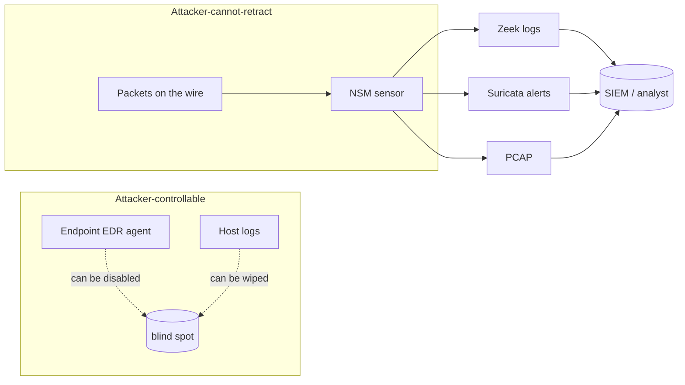
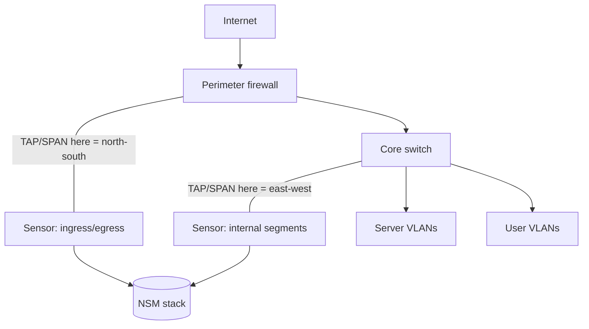
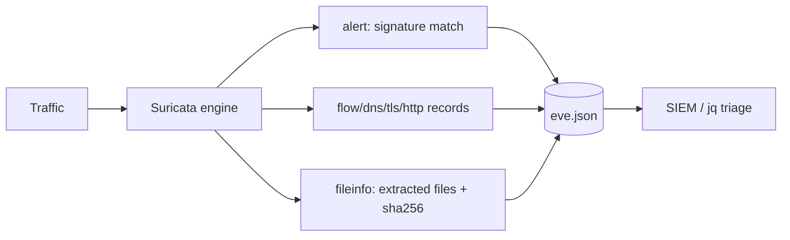
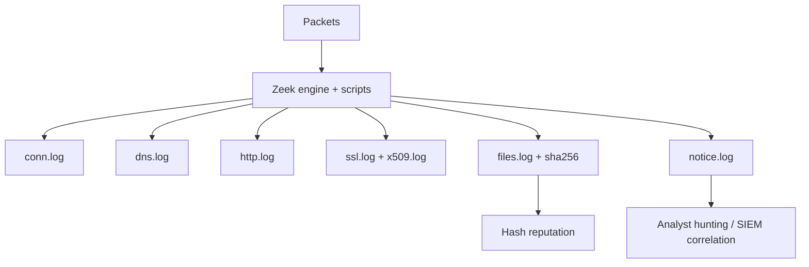
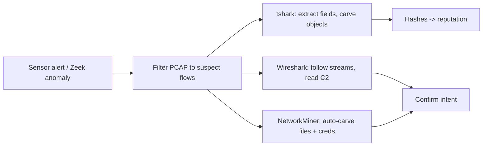
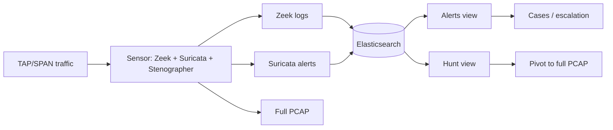

This is Chapter 10 of the SOC & Blue Team notebook. Chapter 8 introduced the network as a source of evidence — firewall, DNS, flow, and PCAP. This chapter makes the network a **monitoring discipline** in its own right. Endpoint telemetry (Chapters 7, 11) can be blinded: an attacker who owns a host can tamper with its agent, disable logging, or land on a device that can't run an agent at all (a printer, an IoT sensor, an appliance, an unmanaged contractor laptop). The network sees them anyway. Every lateral move, every C2 beacon, every byte of exfil must cross a wire you can watch. **Network Security Monitoring (NSM)** is the practice of watching that wire systematically — and it is one of the most durable detection capabilities a SOC can build.

We teach NSM from the ground up: the two philosophies of network detection (**signature** vs. **behavioural**), where and how sensors are placed (TAP vs. SPAN, inline vs. passive), then the three tools that define the field — **Snort** and **Suricata** (signature IDS/IPS with a rule language) and **Zeek** (a protocol analyzer that turns traffic into rich, structured logs). We cover the hard modern problem — **encrypted traffic** — and how JA3/JA3S/JA4 fingerprints and TLS metadata keep you effective when you can't read payloads. We tie it together with **Security Onion**, the free platform that packages Zeek + Suricata + a SIEM, and a full hands-on lab that detects C2 beaconing and data exfil from sensor logs alone.

The framing note: NSM watches networks you own and are authorised to monitor. Sensor placement, packet capture, and rule-writing here are defensive. The attack techniques we detect — beaconing, tunnelling, exfil — are described so you can *catch* them; practise on your own lab network and on public sample PCAPs (Malware-Traffic-Analysis.net, the Security Onion tutorials, CyberDefenders), never on traffic you have no authority over.

We build from NSM philosophy and sensor placement, through Snort and Suricata from scratch (rules, EVE JSON, IDS vs IPS), Zeek from scratch (protocol logs, `zeek-cut`, scripting, notices), encrypted-traffic analysis, PCAP triage, and Security Onion, then a full beaconing-and-exfil lab, a consolidated detection-and-defense section, a final revision, a cheat sheet, and topic-specific practice.

---

## Part 1: What NSM Is and Why It Survives When Endpoints Don't

**Network Security Monitoring** is the collection, analysis, and escalation of network data to detect and respond to intrusions. Richard Bejtlich's classic framing splits NSM data into a few complementary types, and a mature SOC collects all of them:

| NSM data type | What it is | Example source | Cost / retention |
|---|---|---|---|
| **Full content** | Every byte on the wire | PCAP (`tcpdump`, `dumpcap`) | Very high / hours |
| **Transaction / protocol** | Structured record per connection & protocol event | **Zeek** logs | Moderate / weeks–months |
| **Session / flow** | 5-tuple + byte/packet counts | NetFlow/IPFIX | Low / months |
| **Alert** | Signature/anomaly matches | **Snort/Suricata** | Low / long |
| **Statistical** | Aggregate baselines & anomalies | Zeek + analytics | Low / long |

The strategic reason NSM matters: **the network is the one vantage point an attacker cannot fully control.** They can disable an EDR agent, clear Windows logs, and wipe `auth.log` (Chapters 7–8), but they cannot un-send the packets that already crossed your sensor. NSM is therefore both an independent detection layer *and* the ground truth you fall back on when endpoint evidence is untrusted.



**The two philosophies of network detection**, which the rest of the chapter builds on:

- **Signature-based (Snort, Suricata):** match traffic against known-bad patterns (a byte sequence, a URI, a JA3 hash, a known-malware user-agent). Precise and explainable, but blind to anything without a signature (novel malware, custom C2). Think "antivirus for the network."
- **Behavioural / anomaly-based (Zeek + analytics):** model normal and flag deviations (a host that suddenly beacons every 60s, a DNS name with 40 unique subdomains, a TLS certificate that's self-signed on a "banking" domain). Catches the unknown, but needs a baseline and produces fuzzier alerts.

Neither is sufficient alone; NSM uses both, which is exactly why Security Onion ships Suricata (signatures) **and** Zeek (behaviour) together.

---

## Part 2: Sensor Placement — TAP, SPAN, Inline vs. Passive

A NIDS is only as good as the traffic it sees. Placement decisions determine your visibility, and getting them wrong is the most common reason "we have an IDS but it never catches anything."

### Getting the packets: TAP vs. SPAN

- **Network TAP (Test Access Point):** a hardware device physically inserted into a link that copies every frame to a monitor port. **Pros:** sees everything, doesn't drop under load, fails safely (many are passive). **Cons:** hardware cost, one per link. TAPs are the gold standard for a serious sensor.
- **SPAN / mirror port:** a switch feature that copies traffic from chosen ports/VLANs to a monitor port. **Pros:** free, software-configured. **Cons:** the switch **drops mirrored traffic first** under load (so you silently lose packets exactly when it's busy — e.g., during an attack), can't always mirror both directions cleanly, and may miss intra-switch traffic. Fine for many deployments, but know its limits.

### Where to place the sensor



- **Perimeter (north-south):** between the firewall and the internet edge — sees inbound attacks, outbound C2, and exfil. The highest-value single placement; **egress** visibility here is where you catch beaconing and data theft.
- **Internal / core (east-west):** between VLANs/segments — sees **lateral movement** (SMB/RDP/WinRM between hosts) that never touches the perimeter. Increasingly essential as attackers "live off the land" internally.
- **Critical segments:** DMZ, server farm, OT/ICS, and the crown-jewel databases warrant their own sensors.

### Inline (IPS) vs. passive (IDS)

- **Passive / IDS:** the sensor sees a *copy* of traffic and **alerts** — it cannot block. Zero risk to the network (no added latency or failure point), but detection-only.
- **Inline / IPS:** the sensor sits *in the traffic path* and can **drop** malicious packets. Powerful (it prevents, not just detects) but risky: it adds latency, can become a bottleneck, and a bad rule or a crash can break connectivity ("fail-open" vs "fail-closed" matters a lot). Snort and Suricata both run in either mode.

**Design rule of thumb:** start passive (IDS) to build confidence in your rules with no production risk, then selectively promote high-confidence, low-false-positive signatures to inline blocking (IPS) on the perimeter. A SOC's early wins come from *egress* monitoring in passive mode.

**Placement gotchas that silently blind you:** asymmetric routing (you see one direction of a flow, not both — breaks stream reassembly); encryption you can't decrypt (Part 6); tunnels/VPNs that hide inner traffic; and SPAN oversubscription (mirroring 20 Gbps of ports into a 10 Gbps monitor port drops half your packets). Verify your sensor actually sees bidirectional traffic before you trust its silence.

---

## Part 3: Snort From Scratch — The Original NIDS and Its Rule Language

**What Snort is:** the original open-source network intrusion detection/prevention system (created by Martin Roesch, 1998; now maintained by Cisco). It inspects packets against a set of **rules** and raises alerts (IDS) or drops traffic (IPS). Snort defined the rule syntax that the whole industry, including Suricata, still uses. Snort 3 is the current major version; Snort 2 syntax is still ubiquitous in shared rulesets.

**Install (Kali/Ubuntu):**

```bash
sudo apt install snort           # Snort 2.x, quickest to try
# Snort 3 is built from source or via distro packages; config lives in /etc/snort/
snort -V                          # confirm version
```

### Anatomy of a Snort rule

Every rule has a **header** (action, protocol, addresses/ports, direction) and a **body** (options in parentheses). Learn to read this cold:

```text
alert tcp $EXTERNAL_NET any -> $HOME_NET 445 ( \
    msg:"SMB inbound to internal host"; \
    flow:to_server,established; \
    content:"|FF|SMB"; offset:4; depth:4; \
    sid:1000001; rev:1; classtype:attempted-recon; )
```

| Part | Token | Meaning |
|---|---|---|
| Action | `alert` | `alert` (log+notify), `log`, `pass`, `drop`/`reject`/`sdrop` (IPS) |
| Protocol | `tcp` | `tcp`, `udp`, `icmp`, `ip` |
| Source | `$EXTERNAL_NET any` | IP/CIDR/var + port (`any`, `80`, `[80,443]`, `!53`) |
| Direction | `->` | `->` one-way, `<>` bidirectional |
| Dest | `$HOME_NET 445` | IP + port |
| `msg:` | — | Human-readable alert text |
| `flow:` | `to_server,established` | Only match established, client→server |
| `content:` | `"|FF|SMB"` | Byte/string match (`|..|` = hex) |
| `offset/depth/distance/within` | — | Where in the payload to look (bounds the search) |
| `pcre:` | — | Regex match for complex patterns |
| `sid:` / `rev:` | `1000001 / 1` | Rule ID (≥1,000,000 for local rules) + revision |
| `classtype:` | `attempted-recon` | Category → maps to a default priority |

**Reading the example:** "raise an alert when an external host sends an established TCP connection to port 445 on our network, where the payload's bytes 4–7 are `\xFF SMB`" — i.e., inbound SMB from outside, a recon/attack signal. The `offset`/`depth` keep the content match cheap and precise.

### A few more real-shaped rules

```text
# Detect a known-bad user-agent used by a malware downloader
alert http $HOME_NET any -> $EXTERNAL_NET any ( msg:"Suspicious UA - malware cradle";
    flow:to_server,established; http_header;
    content:"User-Agent|3a| Mozilla/4.0 (compatible|3b| MSIE"; nocase;
    sid:1000010; rev:1; classtype:trojan-activity; )

# Detect a DNS query for an excessively long label (tunnelling heuristic)
alert udp $HOME_NET any -> any 53 ( msg:"Possible DNS tunneling - long qname";
    content:"|01 00 00 01|"; depth:8;
    pcre:"/[a-z0-9]{40,}\./i";
    sid:1000020; rev:1; classtype:policy-violation; )
```

**Running Snort against a PCAP** (safe, offline analysis):

```bash
snort -c /etc/snort/snort.conf -r suspicious.pcap -A console -q
#   -c config, -r read pcap, -A console = print alerts to screen, -q quiet
# [**] [1:1000010:1] Suspicious UA - malware cradle [**]
# [Classification: A Network Trojan was Detected] [Priority: 1]
# 02/20-09:06:12  10.0.0.10:44122 -> 203.0.113.44:80
```

### Variables, config, and running Snort live

Snort's config (`snort.conf`) defines **variables** that rules reference so one ruleset fits any network. Getting `$HOME_NET` right is essential — a wrong value makes every directional rule misfire:

```text
# /etc/snort/snort.conf (excerpt)
ipvar HOME_NET [10.0.0.0/8,192.168.0.0/16,172.16.0.0/12]   # YOUR address space
ipvar EXTERNAL_NET !$HOME_NET                                # everything else
portvar HTTP_PORTS [80,81,443,8080,8443]
portvar SHELLCODE_PORTS !80
var RULE_PATH /etc/snort/rules
include $RULE_PATH/local.rules                               # your custom rules
include $RULE_PATH/emerging-all.rules                        # ET Open feed
```

```bash
# Validate the config and ruleset before deploying (catches syntax errors)
sudo snort -T -c /etc/snort/snort.conf

# Live IDS on an interface, alerting to console (passive monitoring)
sudo snort -A console -q -i eth0 -c /etc/snort/snort.conf

# Live, full alert + packet logging to a directory (for later review)
sudo snort -A full -l /var/log/snort -i eth0 -c /etc/snort/snort.conf
```

### Stateful detection with `flowbits`

Single-packet rules miss multi-step attacks. **`flowbits`** lets one rule set a flag that another rule checks, so you can express "alert only if X was seen earlier in this flow":

```text
# Rule 1: note that a login page was requested (set a flag, don't alert yet)
alert http $EXTERNAL_NET any -> $HOME_NET any ( msg:"login seen";
    flow:established,to_server; content:"/login"; http_uri;
    flowbits:set,saw_login; flowbits:noalert; sid:1000030; rev:1; )

# Rule 2: alert only on many failed logins AFTER a login page in the same flow
alert http $HOME_NET any -> $EXTERNAL_NET any ( msg:"Possible brute force response";
    flow:established,to_client; content:"401"; http_stat_code;
    flowbits:isset,saw_login; sid:1000031; rev:1; classtype:attempted-user; )
```

`flowbits:set` records state, `isset` tests it, `noalert` suppresses the intermediate rule. This stateful style is how signatures express *sequences* rather than isolated packets — a bridge toward the correlation logic of Chapter 12.

**Rulesets you don't write yourself:** most detections come from community/commercial rule feeds — the **Snort community/registered/Talos** rules and the **Emerging Threats (ET) Open** ruleset (which also works with Suricata). You tune these to your environment rather than authoring everything.

---

## Part 4: Suricata From Scratch — The Modern Multi-Threaded Engine

**What Suricata is:** a modern open-source IDS/IPS/NSM engine (by the OISF) that is **Snort-rule-compatible** but adds multi-threading (scales across CPU cores), native **protocol parsing and logging** (it can output Zeek-like records), file extraction, and the invaluable **EVE JSON** output. In most new deployments Suricata is preferred over Snort for performance and its rich JSON telemetry. Security Onion runs Suricata by default.

**Install (Kali/Ubuntu):**

```bash
sudo apt install suricata
suricata --build-info | head            # confirm features (Rust parsers, etc.)
sudo suricata-update                    # pull the ET Open ruleset
```

### Running Suricata on a PCAP and reading EVE JSON

```bash
# Analyse a capture with the ET ruleset; write logs to ./out
suricata -r suspicious.pcap -S /var/lib/suricata/rules/suricata.rules -l ./out
ls ./out
#   eve.json   fast.log   stats.log   suricata.log
```

**`eve.json` is the crown jewel** — one JSON object per event, with an `event_type` telling you what kind. Parse it with `jq`:

```bash
# What event types are present?
jq -r '.event_type' out/eve.json | sort | uniq -c
#   1423 flow
#    880 dns
#    412 tls
#    206 http
#     37 alert
#      9 fileinfo

# All signature alerts, most severe first
jq -r 'select(.event_type=="alert")
       | "\(.timestamp) \(.src_ip):\(.src_port) -> \(.dest_ip):\(.dest_port) [\(.alert.severity)] \(.alert.signature)"' out/eve.json

# Every DNS query (tunnelling / C2 domain hunt)
jq -r 'select(.event_type=="dns" and .dns.type=="query") | .dns.rrname' out/eve.json | sort | uniq -c | sort -rn | head

# TLS SNI + JA3 fingerprints (encrypted-traffic triage, Part 6)
jq -r 'select(.event_type=="tls") | "\(.dest_ip) \(.tls.sni) \(.tls.ja3.hash)"' out/eve.json | sort -u
```

Suricata `event_type`s you'll use constantly: `alert` (signature hits), `flow` (connection summaries), `dns`, `tls`, `http`, `fileinfo` (extracted files + hashes), `smtp`, `ssh`, `dhcp`, and `anomaly`. This means Suricata is simultaneously a **signature engine** *and* a **protocol logger** — one sensor gives you both philosophies from Part 1.

### Suricata-specific rule power

Suricata understands Snort rules and adds keywords Snort lacks — notably protocol-aware buffers and fingerprint matching:

```text
# Match a specific TLS JA3 client fingerprint (known Cobalt Strike default, illustrative)
alert tls $HOME_NET any -> $EXTERNAL_NET any ( msg:"Suspicious JA3 - known C2 client";
    ja3.hash; content:"a0e9f5d64349fb13191bc781f81f42e1";
    sid:2000001; rev:1; classtype:trojan-activity; )

# Extract and hash any PE file transferred over HTTP (feeds reputation)
alert http any any -> $HOME_NET any ( msg:"PE download - extract for analysis";
    file.magic; content:"PE32"; filestore;
    sid:2000002; rev:1; )
```

**IDS vs IPS with Suricata:** run it on a SPAN/TAP for alerting (`-i eth0` in IDS mode), or inline via NFQUEUE/AF_PACKET bridge to `drop`. As with Snort, promote to inline only high-confidence rules.

### Tuning: turning a noisy ruleset into signal

A fresh ET Open ruleset alerts on all sorts of benign traffic; untuned, it buries real detections. The core tuning levers:

```text
# threshold.config / rule "threshold" keyword — limit how often a SID fires
threshold gen_id 1, sig_id 2000001, type limit, track by_src, count 1, seconds 300
#   only alert once per source per 5 min on this signature

# suppress a known-benign source entirely for one SID
suppress gen_id 1, sig_id 2013028, track by_src, ip 10.0.0.50
#   e.g., your vuln scanner tripping an "attack" rule — silence it for that host
```

- **`suricata-update`** with enable/disable lists (`enable.conf`, `disable.conf`, `modify.conf`) lets you curate which rule categories load and rewrite noisy rules in place.
- **`classification.config`** maps `classtype` → priority so your triage queue sorts by real severity.
- **Metric-driven tuning:** pull the top-firing SIDs from `eve.json`, and for each ask "is this actionable?" — suppress/threshold the rest.

```bash
# The 15 noisiest signatures — your tuning worklist
jq -r 'select(.event_type=="alert") | .alert.signature' out/eve.json | sort | uniq -c | sort -rn | head -15
```

**Why tuning is the job, not an afterthought:** an IDS that cries wolf 500 times a day trains analysts to ignore it — the same false-positive-fatigue problem Chapter 12 tackles for alerts generally. A tuned sensor with 20 high-fidelity alerts a day is worth more than a raw one with 5,000.



---

## Part 5: Zeek From Scratch — Turning Packets Into Meaning

**What Zeek is** (formerly Bro): not primarily a signature engine but a **network analysis framework** that watches traffic and produces a set of high-fidelity, structured **logs**, one per protocol/behaviour. Where Suricata answers "did anything match a known-bad pattern?", Zeek answers "what *happened* on the network?" — every connection, every DNS query, every HTTP request, every TLS handshake, every file transferred, recorded as searchable events. It is the backbone of behavioural NSM and the single most valuable tool in this chapter for hunting the unknown.

**Install (Kali/Ubuntu):**

```bash
sudo apt install zeek            # or from the official OpenSUSE OBS repo
export PATH=$PATH:/opt/zeek/bin
zeek --version
```

### The Zeek log model

Point Zeek at a PCAP (or a live interface) and it emits a directory of tab-separated logs:

```bash
zeek -r suspicious.pcap          # generates *.log in the current dir
ls
#   conn.log  dns.log  http.log  ssl.log  files.log  x509.log  weird.log  notice.log ...
```

The core logs and what each answers:

| Log | One line per… | Key fields | Hunts it powers |
|---|---|---|---|
| `conn.log` | connection (5-tuple) | `id.orig_h/p`, `id.resp_h/p`, `proto`, `duration`, `orig_bytes`, `resp_bytes`, `conn_state` | beaconing, exfil, scanning, lateral movement |
| `dns.log` | DNS query/answer | `query`, `qtype_name`, `answers`, `rcode_name` | tunnelling, DGA, C2 resolution |
| `http.log` | HTTP request | `host`, `uri`, `method`, `user_agent`, `status_code`, `resp_mime_types` | web C2, downloads, bad UAs |
| `ssl.log` | TLS handshake | `server_name` (SNI), `version`, `cipher`, `ja3`, `ja3s`, `validation_status` | encrypted C2, self-signed certs |
| `x509.log` | certificate | `certificate.subject`, `issuer`, validity | rogue/self-signed certs |
| `files.log` | file seen on wire | `mime_type`, `sha256`, `filename`, `tx_hosts` | malware delivery, exfil |
| `notice.log` | Zeek's own findings | `note`, `msg`, `sub` | built-in detections (scans, weak certs) |
| `weird.log` | protocol anomalies | `name` | evasion, malformed traffic |

### `zeek-cut` — slicing the logs

Zeek logs are tab-separated with a header naming every column; **`zeek-cut`** extracts columns by name, which makes one-liner hunting trivial:

```bash
# Top talkers by bytes sent out (exfil candidates)
zeek-cut id.orig_h id.resp_h orig_bytes resp_bytes < conn.log | sort -k3 -rn | head

# Long-lived connections (C2 sessions often persist)
zeek-cut id.orig_h id.resp_h duration < conn.log | sort -k3 -rn | head

# DNS: parent domains with many unique subdomains (tunnelling)
zeek-cut query < dns.log | awk -F. '{print $(NF-1)"."$NF}' | sort | uniq -c | sort -rn | head

# HTTP user-agents seen, ranked (odd UAs = tooling/malware)
zeek-cut user_agent < http.log | sort | uniq -c | sort -rn | head

# TLS server names + JA3 (encrypted C2 triage)
zeek-cut server_name ja3 validation_status < ssl.log | sort -u | head
```

### Reading `conn.log` `conn_state` — the field that tells you *how* a connection ended

`conn.log`'s `conn_state` encodes the TCP lifecycle in a two/three-character code. It is one of the most useful and most-ignored fields, because it separates real conversations from scans and failures at a glance:

| `conn_state` | Meaning | What it usually indicates |
|---|---|---|
| `S0` | Connection attempt seen, **no reply** | Port scan / host down / filtered |
| `S1` | Established, not terminated | In-progress session |
| `SF` | Normal establishment **and** termination | Complete, healthy conversation |
| `REJ` | Connection **rejected** (RST to SYN) | Port closed / firewall reject |
| `RSTO` | Established, originator aborted (RST) | Client tore it down |
| `RSTR` | Established, responder aborted (RST) | Server tore it down |
| `SH` | Originator SYN then FIN, no reply | Stealth/half-open scan |
| `OTH` | No SYN seen, midstream traffic | Asymmetric routing / capture gap |

```bash
# Mass S0 from one host = scanning; count by originator
zeek-cut id.orig_h conn_state < conn.log | awk '$2=="S0"{print $1}' | sort | uniq -c | sort -rn | head
#   4021 10.0.0.55   <-- one host, thousands of no-reply attempts = internal scanner

# Ratio of S0/REJ to SF per host — a scanner has almost no completed (SF) conns
zeek-cut id.orig_h conn_state < conn.log | sort | uniq -c | sort -rn | head -20

# Rare destination ports contacted internally (lateral movement recon)
zeek-cut id.resp_p conn_state < conn.log | awk '$2=="SF"{print $1}' | sort | uniq -c | sort -n | head
```

### More Zeek hunting one-liners

```bash
# Hosts talking to the most unique external destinations (spray / worm / scan)
zeek-cut id.orig_h id.resp_h < conn.log | sort -u | cut -f1 | sort | uniq -c | sort -rn | head

# HTTP requests with no/blank host header or direct-to-IP (C2 tell)
zeek-cut host uri method < http.log | awk '$1=="-" || $1==""' | head

# Files by MIME type seen on the wire (executables crossing the network)
zeek-cut mime_type sha256 filename < files.log | grep -Ei 'x-dosexec|x-executable|x-msdownload' | head

# Self-signed or failed-validation certs to external hosts
zeek-cut server_name validation_status < ssl.log | grep -vi "ok" | sort | uniq -c | sort -rn | head

# SSH connections between internal hosts (east-west admin / lateral movement)
zeek-cut id.orig_h id.resp_h id.resp_p < conn.log | awk '$3==22 && $1 ~ /^10\./ && $2 ~ /^10\./' | sort | uniq -c
```

### Zeek scripting and notices — programmable detection

Zeek's real power is its **event-driven scripting language**. You can write logic that fires on any network event and raises a `NOTICE`. A tiny example that flags large outbound transfers:

```zeek
# large-egress.zeek — raise a notice when a host sends > 50 MB outbound in one conn
@load base/protocols/conn
event connection_state_remove(c: connection) {
    if ( c$orig$size > 50000000 && Site::is_local_addr(c$id$orig_h)
         && ! Site::is_local_addr(c$id$resp_h) ) {
        NOTICE([$note=Notice::Tally,
                $msg=fmt("Large egress: %s -> %s (%d bytes)",
                         c$id$orig_h, c$id$resp_h, c$orig$size),
                $conn=c]);
    }
}
```

```bash
zeek -r suspicious.pcap large-egress.zeek     # your rule + all default logs
cat notice.log | zeek-cut note msg
```

Zeek also ships a large library of packages (via `zkg`, the Zeek package manager) — e.g., the **Corelight/Zeek intel framework** (match connections against IOC feeds), **JA3 scripts**, and detection packages for known C2. **Blue team usage:** feeding your threat-intel IOCs (Chapter 19) into Zeek's intel framework turns every connection into an automatic IOC check across all protocols at once.



---

## Part 6: Encrypted-Traffic Analysis — Detecting What You Can't Read

The hard truth of modern NSM: the majority of traffic is TLS-encrypted, so signature engines can't read payloads and you can't grep for a malicious URL inside HTTPS. NSM adapts by analysing the **metadata** of encrypted sessions, which is still rich.

### What you can still see in TLS

Even without decryption, the TLS handshake exposes:

- **SNI (Server Name Indication):** the hostname the client requests — visible in the `ClientHello` (unless Encrypted ClientHello/ECH is in use). This is your primary "what domain did they contact" signal for HTTPS, logged in Zeek `ssl.log` `server_name` and Suricata `tls.sni`.
- **Certificate details (`x509.log`):** subject, issuer, validity, self-signed status. A **self-signed cert**, a cert with a random CN, or a validity of a few days on a "bank" is a red flag.
- **JA3 / JA3S / JA4 fingerprints** (below).
- **Timing and volume** — beaconing cadence and byte counts survive encryption entirely (Part 8).

### JA3, JA3S, and JA4 — fingerprinting the TLS client

**What JA3 is:** a hash of specific fields in the TLS `ClientHello` (version, cipher suites, extensions, elliptic curves, and their order). Because a given TLS *library/tool* builds its `ClientHello` in a characteristic way, the JA3 hash acts as a **fingerprint of the client software** — even though the traffic is encrypted. Malware and C2 frameworks (e.g., default Cobalt Strike, Metasploit, some Python/Go clients) have recognisable JA3 hashes.

- **JA3** = client fingerprint (from `ClientHello`).
- **JA3S** = server fingerprint (from `ServerHello`). JA3 + JA3S together fingerprint the *pair*, tightening the match.
- **JA4** = the newer, more robust successor (JA4+/JA4S/JA4H/JA4X) that fixed JA3's fragility and covers more protocols; increasingly the standard.

```bash
# Zeek: rank JA3 hashes, spot rare fingerprints talking to external IPs
zeek-cut ja3 server_name id.resp_h < ssl.log | sort | uniq -c | sort -rn | tail
# A JA3 that appears once, to a suspicious IP, on a self-signed cert = investigate.

# Suricata EVE: JA3 + SNI + validation
jq -r 'select(.event_type=="tls") | "\(.tls.ja3.hash) \(.tls.sni) \(.tls.subject)"' out/eve.json | sort -u
```

**Important caveats (so you use JA3 correctly):** JA3 identifies the *client library*, not the malware itself — many benign apps share a JA3, and TLS libraries change fingerprints across versions, so JA3 is a *lead*, not proof. Match it *together with* rare destinations, self-signed certs, and beaconing rhythm. JA4 was designed specifically to reduce JA3's false-match and evasion problems, which is why the field is migrating to it.

| Signal in encrypted traffic | Where | What it suggests |
|---|---|---|
| Self-signed / short-validity cert | `x509.log`, `tls.subject` | Ad-hoc C2 infrastructure |
| Rare JA3/JA4 to a rare IP | `ssl.log`, EVE `tls` | Non-standard client (malware/tooling) |
| SNI = newly-registered / DGA domain | `ssl.log` `server_name` | C2 / phishing infra |
| Regular cadence + uniform bytes | `conn.log` | Beaconing (Part 8) |
| No SNI + direct-to-IP TLS | `ssl.log` | Evasion / C2 dialing an IP |

**On TLS decryption:** some enterprises deploy TLS inspection (a proxy that man-in-the-middles outbound TLS with an internal CA) to regain payload visibility. It's powerful but heavy — privacy, performance, cert-pinning breakage, and it can't touch pinned or ECH traffic. Most SOCs rely on metadata analysis (SNI/JA3/JA4/flow) as the practical, always-available approach, reserving decryption for high-value segments.

---

## Part 6b: PCAP Triage With Wireshark, tshark, and NetworkMiner

Sensors give you logs and alerts; sometimes you must drop to the packets themselves — to read the actual C2 commands, carve a transferred file, or prove exactly what happened. This is PCAP triage, and it complements (does not replace) Zeek/Suricata. Chapter 8 introduced `tcpdump`/`tshark`; here we make it a workflow.

### Wireshark — the interactive analyzer (from scratch)

**What it is:** Wireshark is the graphical packet analyzer — it dissects thousands of protocols, reassembles streams, and lets you filter interactively. For deep, exploratory analysis of a single capture it is unmatched; for scripted/bulk work you use its CLI twin `tshark`.

The two filter languages you must not confuse:

- **Capture filters** (BPF syntax, applied *while capturing*): `host 10.0.0.10 and port 443`. Limited, fast, decides what gets recorded.
- **Display filters** (Wireshark syntax, applied *after* capture): `http.request and ip.addr==10.0.0.10`. Rich, expressive, non-destructive.

High-value **display filters** for an investigation:

```text
ip.addr == 203.0.113.44                     # everything to/from a suspect IP
http.request.method == "POST"               # data submission / webshell / exfil
dns.qry.name contains "example-c2"          # C2 domain resolution
tls.handshake.extensions_server_name        # show SNI values
tls.handshake.type == 1                      # ClientHello (JA3 material)
tcp.flags.syn==1 && tcp.flags.ack==0        # bare SYNs = scanning
ftp || smtp || telnet                        # cleartext creds/protocols
frame contains "password"                    # naive cleartext-secret hunt
tcp.analysis.retransmission                  # loss/oddities
http.response.code == 200 && http.request.uri contains "cmd="   # webshell responses
```

**Key GUI moves:** right-click a packet → *Follow → TCP/HTTP/TLS Stream* to read a whole conversation in order; *Statistics → Conversations* to rank talkers by bytes; *Statistics → Protocol Hierarchy* to see the protocol mix at a glance; *File → Export Objects → HTTP/SMB* to carve transferred files.

### tshark — the same power, scriptable

```bash
# Protocol hierarchy of a capture (what's even in here?)
tshark -r suspicious.pcap -q -z io,phs

# Conversations ranked (top talkers, like GUI Statistics→Conversations)
tshark -r suspicious.pcap -q -z conv,tcp | sort -k9 -rn | head

# All HTTP requests: who asked for what
tshark -r suspicious.pcap -Y http.request -T fields -e ip.src -e http.host -e http.request.uri

# Extract every DNS query name and count them (tunnelling/C2)
tshark -r suspicious.pcap -Y "dns.flags.response==0" -T fields -e dns.qry.name | sort | uniq -c | sort -rn | head

# Pull SNI + destination for encrypted sessions
tshark -r suspicious.pcap -Y "tls.handshake.type==1" -T fields -e ip.dst -e tls.handshake.extensions_server_name | sort -u

# Read a reverse-shell conversation in cleartext (stream index 42)
tshark -r suspicious.pcap -q -z follow,tcp,ascii,42

# Carve HTTP objects (downloaded payloads) to a folder for hashing
tshark -r suspicious.pcap --export-objects http,/tmp/carved
sha256sum /tmp/carved/*        # then check reputation
```

### NetworkMiner — automatic artifact extraction (from scratch)

**What it is:** NetworkMiner is a passive network-forensic tool that parses a PCAP and automatically organises what it finds by **host** — extracting files, images, credentials, sessions, DNS, and parameters without you writing a single filter. It's the fastest way to answer "what files and creds are in this capture?" and pairs well with Wireshark's depth.

Typical use: open the PCAP → *Files* tab shows every carved file (with hashes) → *Credentials* tab shows any cleartext logins → *Hosts* tab groups everything by IP with OS fingerprints. Excellent for triage before you dive into raw packets.

| Tool | Best for | Mode |
|---|---|---|
| Wireshark | Deep interactive dissection, stream following | GUI |
| tshark | Scripted extraction, pipelines, headless servers | CLI |
| NetworkMiner | Automatic file/credential/host artifact carving | GUI (CLI in pro) |
| Zeek | Structured logs at scale, hunting | CLI/sensor |
| Suricata | Signature alerts + protocol JSON | CLI/sensor |

**Workflow discipline:** in a real case, start broad (Zeek/Suricata logs → what's anomalous), narrow to the suspect flows, then open *only those* in Wireshark/NetworkMiner for ground truth. Opening a multi-gigabyte PCAP blind in Wireshark is how analysts lose an afternoon.



## Part 7: Security Onion — The Integrated NSM Platform

**What Security Onion is:** a free, open-source Linux distribution that packages a complete NSM/SIEM stack — **Zeek** (protocol logs) + **Suricata** (signatures) + **Stenographer** (full PCAP) + the **Elastic Stack** (storage/search) + **Kibana/dashboards** + alerting and case management (**Alerts, Hunt, TheHive/Cases**) — pre-integrated. It is how most people actually *run* everything in this chapter, and it's the standard teaching and small-to-mid-deployment platform.

Core workflow in Security Onion:



- **Alerts** view: triage Suricata/NIDS alerts (severity, count, dedup).
- **Hunt** view: pivot across Zeek logs (conn/dns/http/ssl/files) with saved queries.
- **PCAP** pivot: from any alert/log, jump to the *full packet capture* for that flow — signature → metadata → ground truth in three clicks.
- **`so-import-pcap`:** the single most useful learning command — feed a sample PCAP and Security Onion runs Zeek + Suricata over it and loads the results, so you can practise the whole workflow offline:

```bash
sudo so-import-pcap /samples/malware-c2.pcap
# Then open the case in the UI: alerts + Zeek logs + PCAP for that capture.
```

**Why this matters:** Security Onion turns the individual tools of this chapter into a coherent analyst experience — the same alert-to-metadata-to-PCAP pivot you'd want during a real incident, and the platform most of the practice labs (Part 12) are built on.

---

## Part 8: Hands-On Lab — Detecting C2 Beaconing and Exfil From Sensor Logs

This lab detects a command-and-control channel and data exfiltration using only NSM data — the exact workflow for a real "suspicious outbound traffic" investigation. Reproduce it by running Zeek + Suricata over a public malware PCAP (Malware-Traffic-Analysis.net, or `so-import-pcap` in Security Onion), or generate benign lab beacon traffic yourself. Never point this at traffic you don't own.

**Scenario.** An internal host `10.0.0.10` was flagged by a low-severity Suricata alert. Your job: confirm or dismiss C2, and determine whether data left the network.

### Step 1 — Start from the signature alert

```bash
jq -r 'select(.event_type=="alert")
       | "\(.timestamp) \(.src_ip)->\(.dest_ip):\(.dest_port) \(.alert.signature)"' out/eve.json \
  | grep 10.0.0.10
# 09:06:12 10.0.0.10->203.0.113.44:443 ET MALWARE Possible Cobalt Strike Beacon (JA3)
```

A JA3-based hint, low confidence alone. Corroborate with behaviour.

### Step 2 — Test for beaconing in `conn.log`

Beaconing = many connections to one destination at a **regular interval** with **uniform, small** byte counts. Extract the timestamps of connections to the suspect IP and look at the deltas:

```bash
# All connections 10.0.0.10 -> 203.0.113.44, with time and bytes
zeek-cut ts id.orig_h id.resp_h id.resp_p orig_bytes resp_bytes < conn.log \
  | awk '$2=="10.0.0.10" && $3=="203.0.113.44"' | sort -n > /tmp/beacon.txt
head /tmp/beacon.txt
# 1739868372.1  10.0.0.10 203.0.113.44 443 512 480
# 1739868432.2  10.0.0.10 203.0.113.44 443 512 496
# 1739868492.1  10.0.0.10 203.0.113.44 443 512 480

# Compute inter-arrival deltas — a fixed cadence is the beacon signature
awk 'NR>1{print $1-prev} {prev=$1}' /tmp/beacon.txt | sort | uniq -c
#   118  60          <-- 118 connections almost exactly 60s apart
#     3  61
```

**Interpretation:** ~120 connections at a rock-steady **60-second interval** with near-identical byte counts. Humans don't browse like clockwork; this is an automated **C2 beacon** (with a small jitter). The JA3 alert is now corroborated by behaviour.

**Handling jitter (why a simple `uniq -c` isn't enough on real C2).** Modern frameworks randomise the sleep — e.g. "60s ± 20%" — so the raw deltas won't all be exactly 60. Score the *regularity* instead of demanding identical intervals: compute the mean and coefficient of variation (stddev/mean) of the deltas — a low CoV means "suspiciously regular," which survives jitter.

```bash
# Mean, stddev, and coefficient of variation of inter-arrival deltas
awk 'NR>1{d=$1-prev; s+=d; ss+=d*d; n++} {prev=$1}
     END{m=s/n; sd=sqrt(ss/n - m*m); printf "n=%d mean=%.1fs stddev=%.1fs CoV=%.2f\n", n, m, sd, sd/m}' /tmp/beacon.txt
# n=120 mean=60.4s stddev=7.1s CoV=0.12
```

**Interpretation:** a **CoV of 0.12** (low) over 120 samples is the mathematical signature of a jittered beacon — regular enough to be automated, varied enough to try to evade a naive fixed-interval rule. This is exactly the kind of statistical detection (Part 1's "statistical" NSM data type) that catches C2 no signature knows about.

### Step 3 — Characterise the channel (encrypted?)

```bash
zeek-cut server_name ja3 validation_status subject < ssl.log \
  | awk '/203.0.113.44|CN=/' | sort -u
# (no SNI)  a0e9f5d64349fb13191bc781f81f42e1  self-signed  CN=localhost
```

**Interpretation:** TLS with **no SNI**, a **self-signed** certificate (`CN=localhost`), and a JA3 matching a known C2 client. Every encrypted-traffic red flag from Part 6 lines up. This is C2 over TLS to `203.0.113.44`.

### Step 4 — Did data leave? (exfil check)

Beaconing is control; exfil is bulk egress. Look for a large outbound transfer, possibly to the same or a different destination:

```bash
# Biggest outbound byte totals from the host
zeek-cut id.orig_h id.resp_h orig_bytes resp_bytes duration < conn.log \
  | awk '$1=="10.0.0.10"' | sort -k3 -rn | head
# 10.0.0.10 203.0.113.44   512  ...   (beacons - small)
# 10.0.0.10 198.51.100.77  48000000  9000  742   <-- 48 MB out over 12 min
```

```bash
# What was it? Check files.log / http.log for that destination
zeek-cut ts id.orig_h id.resp_h mime_type total_bytes filename < files.log \
  | awk '$3=="198.51.100.77"'
# ... application/zip  48000000  archive.zip
```

**Interpretation:** a **48 MB ZIP** was sent to a *second* external host — the exfil channel, separate from the beacon. Classic tradecraft: low-and-slow C2 for control, a separate bulk channel for data theft.

### Step 5 — Scope with DNS and other hosts

```bash
# Did the host resolve attacker infra? Any other internal hosts talking to it?
zeek-cut query < dns.log | grep -iE "203-0-113|example-c2" | sort | uniq -c
zeek-cut id.orig_h id.resp_h < conn.log | awk '$2=="203.0.113.44"' | cut -f1 | sort -u
# 10.0.0.10
# 10.0.0.23     <-- a SECOND internal host also beacons to the C2 → wider compromise
```

**Interpretation:** a second internal host beacons to the same C2 — the incident is **not** contained to one machine. NSM just expanded the scope in a way endpoint-only visibility might have missed (host 10.0.0.23's agent could be disabled).

### Step 6 — Timeline, verdict, and hand-off

| Time | NSM evidence | Finding |
|---|---|---|
| 09:06 | Suricata `alert` (JA3) | First hint of Cobalt-Strike-like client |
| 09:06→ | `conn.log` deltas | 60s beacon, uniform bytes → **confirmed C2** |
| 09:06 | `ssl.log`/`x509.log` | No SNI, self-signed cert → ad-hoc C2 over TLS |
| 09:20 | `conn.log`/`files.log` | 48 MB ZIP to a 2nd IP → **exfil** |
| 09:25 | `conn.log` scope | 2nd internal host also beaconing → **wider compromise** |

**Verdict & action:** confirmed TLS C2 beaconing from ≥2 internal hosts to `203.0.113.44`, with data exfil (48 MB) to `198.51.100.77`. Contain: block both external IPs at the egress firewall (and sinkhole the domains), isolate `10.0.0.10` and `10.0.0.23` (pivot to EDR — Chapter 11), preserve the full PCAP for the flows, and open an incident (Chapter 13). The whole detection came from **signature + behaviour + encrypted-metadata + flow**, cross-checked — the NSM method in one lab.

---

## Part 9: Detection & Defense Angle (Consolidated)

NSM is itself a detection capability; this section is how you operationalise it.

### High-value network detections

| Detection | Data / logic | Tool |
|---|---|---|
| C2 beaconing | Regular interval + uniform small bytes to one dst | Zeek `conn.log` + analytics |
| Known C2 client | JA3/JA4 match to known frameworks | Suricata/Zeek TLS |
| DNS tunnelling / DGA | Many unique subdomains under one parent; high-entropy names; `TXT`/`NULL` | Zeek `dns.log` |
| Exfil | Large outbound bytes to rare dst; off-hours | Zeek `conn.log`/`files.log`, flow |
| Lateral movement | Internal host→host on 445/3389/5985/22 off-baseline | Zeek `conn.log` (east-west sensor) |
| Malware download | PE/script in `files.log` with bad hash | Suricata `fileinfo` + reputation |
| Self-signed C2 cert | `x509.log` self-signed on external connections | Zeek `ssl.log`/`x509.log` |
| Scanning | One src → many dst/ports, tiny flows, high SYN | Zeek `conn.log`, Suricata |
| Protocol on wrong port | HTTP on 8443, SSH on 443, etc. | Zeek protocol detection / `weird.log` |

### Turning the hunts into standing SIEM detections

Once Zeek/Suricata logs land in the SIEM (Chapters 4–6), the manual one-liners above become scheduled detections. Illustrative Splunk SPL against Zeek data:

```text
# Beacon candidate: regular cadence to one external dst (low variance)
index=zeek sourcetype=zeek:conn dest_ip!=10.0.0.0/8
| streamstats current=f last(_time) as prev by src_ip,dest_ip
| eval delta=_time-prev
| stats count avg(delta) as mean stdev(delta) as sd by src_ip,dest_ip
| eval cov=sd/mean
| where count>20 AND cov<0.3

# Exfil candidate: large outbound bytes to a rare destination
index=zeek sourcetype=zeek:conn src_ip=10.0.0.0/8 dest_ip!=10.0.0.0/8
| stats sum(orig_bytes) as out by src_ip,dest_ip
| where out > 100000000
| sort - out

# DNS tunnelling: many unique subdomains under one parent
index=zeek sourcetype=zeek:dns
| eval parent=mvindex(split(query,"."), -2) . "." . mvindex(split(query,"."), -1)
| stats dc(query) as uniq_sub by parent
| where uniq_sub > 100
| sort - uniq_sub

# Rare JA3 to external hosts (encrypted C2 lead)
index=zeek sourcetype=zeek:ssl dest_ip!=10.0.0.0/8
| stats count by ja3,dest_ip
| where count < 5
```

Each maps back to a Part-8 lab step; the SIEM just runs them continuously and raises an alert (feeding Chapter 12's triage) instead of you typing `zeek-cut` by hand.

### Building an NSM capability (defensive program)

1. **Get egress visibility first.** A perimeter sensor watching *outbound* traffic is the highest-ROI placement — it catches beaconing and exfil, the stages nearest to real damage.
2. **Run signatures *and* behaviour.** Suricata (ET Open + Talos rules) for the known; Zeek for the unknown. Security Onion gives you both, integrated.
3. **Add east-west sensors** for lateral-movement visibility as you mature — attackers increasingly stay internal.
4. **Feed threat intel into the sensor** (Zeek intel framework / Suricata rules) so every connection is IOC-checked automatically.
5. **Retain layered data:** long-retention Zeek/flow (cheap) + short-retention full PCAP (for deep dives). You'll almost always have the Zeek record; you'll sometimes still have the packets.
6. **Tune relentlessly.** Untuned ET rulesets are noisy; suppress/threshold known-benign, and promote only high-confidence rules to inline IPS.
7. **Correlate with endpoint (Chapter 11) and identity (Chapters 7–8).** Network says "10.0.0.10 beacons"; endpoint says "which process"; identity says "which user/device." Together they close the case.

### Evasion to keep in mind (so silence isn't mistaken for safety)

Attackers evade NSM via: **domain fronting / legitimate cloud C2** (traffic looks like it goes to a trusted CDN/SaaS), **DoH/ECH** (hiding DNS and SNI), **jittered/low-and-slow beacons** (breaking fixed-interval detection), **protocol tunnelling** (C2 inside DNS/ICMP/HTTPS), and simply blending into normal ports. The countermeasures are behavioural baselining, JA3/JA4 + cert analysis, monitoring for DoH endpoints, and correlating volume/timing rather than relying on any single signature. NSM is an arms race; layered data and behaviour analysis are what keep you in it.

---

## Part 10: Common Pitfalls

- **SPAN oversubscription.** Mirroring more traffic than the monitor port can carry silently drops packets — exactly during a busy attack. Use TAPs for critical links and verify you see both directions.
- **Perimeter-only monitoring.** No east-west sensor means lateral movement is invisible. Attackers live internally now.
- **Trusting signatures alone.** Novel/custom C2 has no signature. Behavioural (Zeek) detection is what catches the unknown.
- **Ignoring encrypted traffic.** "It's TLS so we can't see it" is wrong — SNI, certs, JA3/JA4, timing, and volume all survive encryption.
- **JA3 as proof.** JA3 fingerprints the *library*, not the malware; benign apps share hashes and libraries change. Use it as a lead alongside other signals; prefer JA4 where available.
- **Untuned rulesets.** A raw ET Open feed drowns you in false positives; tuning and thresholding is mandatory, not optional.
- **Rushing to inline IPS.** A bad inline rule breaks production. Start passive; promote only proven rules.
- **No PCAP retention.** When you finally need ground truth, the packets are gone. Keep at least short-window full capture on key segments.
- **Reading `conn_state` wrong.** Zeek's `conn_state` (`S0`, `SF`, `REJ`, `RSTO`...) tells you how a connection ended — `S0` (no reply) en masse is scanning, not normal traffic. Learn the codes.
- **Assuming the sensor sees everything.** Asymmetric routing, tunnels, and VPNs create blind spots. Validate coverage.
- **Wrong `$HOME_NET`.** If Snort/Suricata's `HOME_NET` doesn't match your real address space, every directional rule (`$EXTERNAL_NET -> $HOME_NET`) misfires and you get silent gaps or floods. Verify it first.
- **Opening a huge PCAP blind in Wireshark.** Start from Zeek/Suricata to find the suspect flows, *then* open only those packets. Loading gigabytes interactively wastes hours.

---

## Part 11: Final Revision / Summary

- **NSM** watches the one vantage point an attacker can't retract — the wire. It collects layered data: full-content (PCAP), transaction (Zeek), session (flow), and alert (Snort/Suricata).
- Network detection has **two philosophies**: **signature** (Snort/Suricata — precise, blind to the novel) and **behavioural** (Zeek + analytics — catches the unknown, needs a baseline). Use both.
- **Sensor placement** decides visibility: **TAP > SPAN** (SPAN drops under load); **perimeter/egress** first (beaconing + exfil), then **east-west** (lateral movement). **Passive/IDS** to start, **inline/IPS** for proven rules only.
- **Snort** defined the rule language (header + body: `action proto src -> dst (msg; content; flow; sid; ...)`). **Suricata** is the modern, multi-threaded, Snort-compatible engine whose **EVE JSON** (`alert`, `flow`, `dns`, `tls`, `http`, `fileinfo`) makes it a signature engine *and* a protocol logger.
- **Zeek** turns packets into structured **protocol logs** (`conn`, `dns`, `http`, `ssl`, `x509`, `files`, `notice`, `weird`); **`zeek-cut`** slices them and its **scripting** language raises custom notices and runs IOC intel matching.
- **Encrypted traffic** is still analysable via **SNI, certificate details, JA3/JA3S/JA4 fingerprints, and timing/volume** — you detect C2 you can't decrypt.
- **Security Onion** integrates Zeek + Suricata + PCAP + Elastic, with the alert→metadata→PCAP pivot; `so-import-pcap` is the way to practise.
- Real detection **correlates** signature + behaviour + encrypted-metadata + flow (Part 8's beacon-and-exfil lab), and ties network findings to endpoint (Chapter 11) and identity (Chapters 7–8).

If you can place a sensor correctly, read Zeek logs and Suricata EVE fluently, spot a beacon in `conn.log`, and reason about encrypted C2 from JA3 and certs, you have the core NSM skill set — the detection layer that keeps working when everything on the host has been turned off.

---

## Part 12: Cheat Sheet / Quick Reference

**Snort/Suricata rule shape:**

```text
action proto src_ip src_port -> dst_ip dst_port ( msg:"..."; flow:...; content:"..."; sid:N; rev:1; )
# actions: alert log pass drop reject   |  dir: -> (one-way) <> (both)
# content:"|hex|" ; offset/depth/distance/within bound the search ; pcre for regex
```

**Run against a PCAP:**

```bash
snort   -c snort.conf -r x.pcap -A console -q
suricata -r x.pcap -S rules/suricata.rules -l ./out    # writes eve.json
zeek    -r x.pcap                                       # writes *.log
```

**Suricata EVE with jq:**

```bash
jq -r 'select(.event_type=="alert")|"\(.src_ip)->\(.dest_ip) \(.alert.signature)"' eve.json
jq -r 'select(.event_type=="dns" and .dns.type=="query")|.dns.rrname' eve.json | sort|uniq -c|sort -rn
jq -r 'select(.event_type=="tls")|"\(.tls.sni) \(.tls.ja3.hash)"' eve.json | sort -u
```

**Zeek hunting:**

```bash
zeek-cut id.orig_h id.resp_h orig_bytes < conn.log | sort -k3 -rn | head   # exfil
zeek-cut id.orig_h id.resp_h duration  < conn.log | sort -k3 -rn | head    # long C2
zeek-cut query < dns.log | awk -F. '{print $(NF-1)"."$NF}' | sort|uniq -c|sort -rn  # tunneling
zeek-cut user_agent < http.log | sort | uniq -c | sort -rn                 # bad UAs
zeek-cut server_name ja3 validation_status < ssl.log | sort -u             # TLS C2
```

**Zeek `conn_state` quick key:** `S0` = SYN no reply (scan) · `SF` = normal complete · `REJ` = rejected · `RSTO/RSTR` = reset · `S1/SF` established.

**Encrypted-traffic red flags:** no SNI + direct-to-IP TLS · self-signed / short-validity cert · rare JA3/JA4 to rare IP · SNI = new/DGA domain · uniform bytes at fixed cadence.

**Beacon test:** connections to one dst, compute inter-arrival deltas — a dominant fixed interval (± jitter) with uniform bytes = beacon.

**Placement:** TAP > SPAN · egress/perimeter first, east-west next · passive/IDS before inline/IPS.

**Security Onion:** `so-import-pcap file.pcap` → Alerts (Suricata) → Hunt (Zeek) → pivot to full PCAP.

**MITRE mapping:** C2 = TA0011 (beaconing T1071 app-layer, T1071.004 DNS, T1573 encrypted channel); Exfil = TA0010 (T1041 over C2, T1048 alt protocol); Lateral = TA0008.

---

## Part 13: Practice Labs & Resources

- **TryHackMe — "Zeek", "Zeek Exercises", "Snort", "Snort Challenge - The Basics", "Snort Challenge - Live Attacks", "NetworkMiner", "Wireshark: The Basics/Traffic Analysis"**: hands-on with every tool in this chapter.
- **Security Onion** — install in a VM, run `so-import-pcap` on the official tutorial PCAPs, and work the Alerts→Hunt→PCAP pivot end to end.
- **Malware-Traffic-Analysis.net** — free real malicious PCAPs with exercises; run Zeek + Suricata over them and hunt C2/exfil (defensive, lab-scoped).
- **CyberDefenders.org** — "PCAP" / NSM challenges (e.g. "PacketMaze", "Tomcat Takeover", "Malware Traffic Analysis"): scored investigator questions.
- **Blue Team Labs Online (BTLO)** — "Network Analysis" investigations with Zeek/Suricata/PCAP.
- **The Emerging Threats (ET) Open ruleset** — read real Suricata/Snort rules to learn idiomatic signature-writing.
- **JA3 / JA4 reference repos and the Zeek `zkg` intel/JA3 packages** — practise encrypted-traffic fingerprinting.
- **MITRE ATT&CK — Command and Control (TA0011), Exfiltration (TA0010)** — map every detection to a technique ID.

**Practice questions to test yourself:**

1. You have a SPAN port mirroring three 10 Gbps links into one 10 Gbps monitor port. What's the failure mode, and when will it hurt you most?
2. Write a Zeek `zeek-cut` one-liner (conceptually) that would surface a 60-second beacon, and explain the two properties you're keying on.
3. A host makes 200 HTTPS connections to one IP with no SNI and a self-signed cert. It's encrypted — list four things you can still determine and how.
4. Explain why JA3 alone should not close a case as "malware," and what JA4 improves.
5. Given a Suricata `eve.json`, describe the `jq` pipeline to (a) list all alerts and (b) confirm whether a flagged host also exfiltrated a file, naming the `event_type`s you'd use.
6. A modern beacon jitters its sleep by ±30%, defeating a "same interval N times" rule. Describe the statistical measure that still catches it and why a low value is suspicious.
7. Interpret these `conn.log` states from one source IP: 4000× `S0`, 3× `SF`. What is the host doing, and which single ratio makes it obvious?

Answer each as an analyst would — the exact data source, the query/logic, and the corroborating signal you'd add before escalating. That signature-plus-behaviour-plus-metadata discipline is the heart of NSM, and it feeds straight into Chapter 11's endpoint investigation (which process owns that beacon?) and Chapter 12's alert triage.
