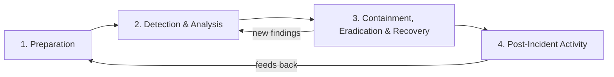
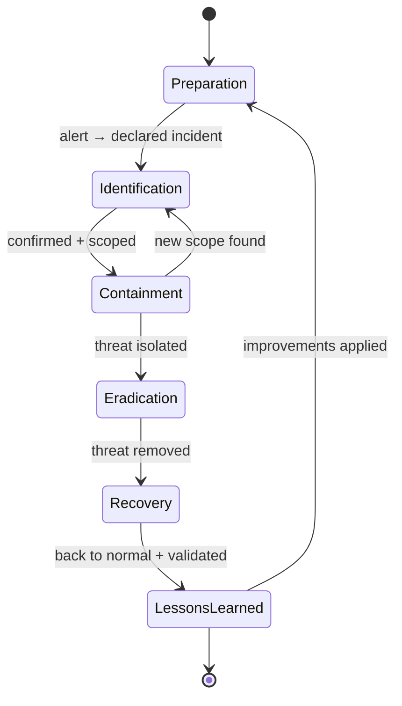
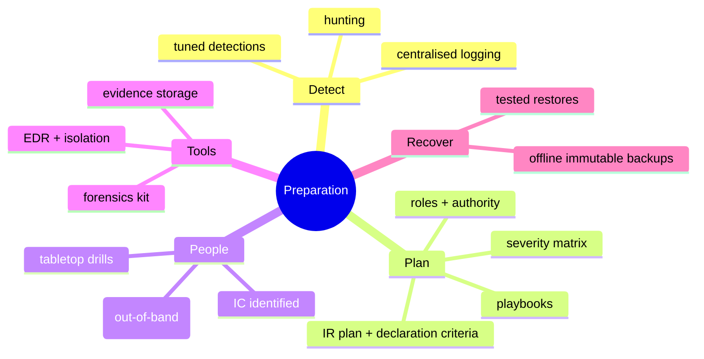
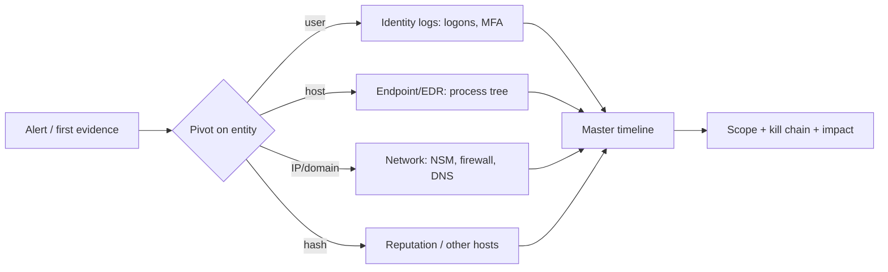
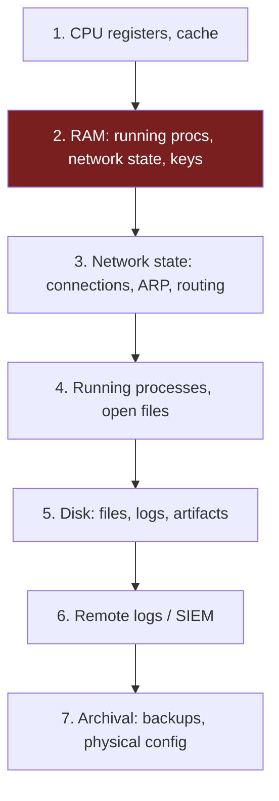
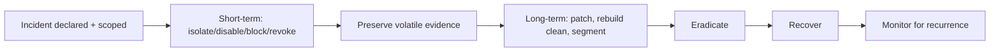
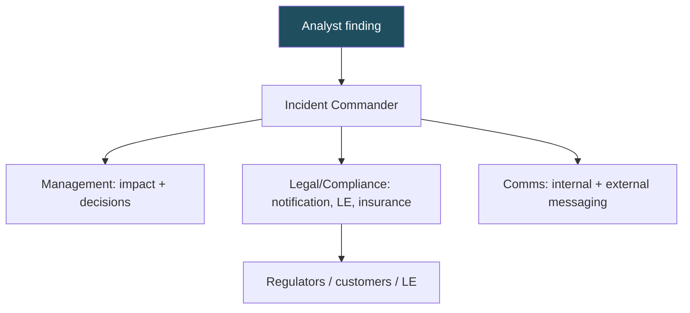
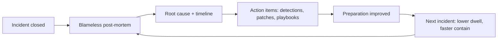
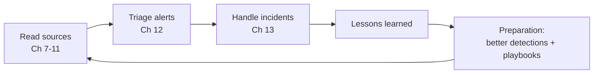

**Level:** Advanced · **Track:** SOC & Blue Team · **Read time:** 185 min

This is Chapter 13 of the SOC & Blue Team notebook, and it closes the SOC-analyst arc. Chapters 7–11 taught you to read the evidence; Chapter 12 taught you to triage the alerts that evidence generates. This chapter is about what happens when triage produces a **true positive that matters**: the alert becomes an **incident**, and the calm, methodical, well-documented handling of that incident is what limits the damage. Incident handling is where a SOC's value is realised or squandered — the same breach, handled well or badly, is the difference between "contained in an hour, no data lost" and "a headline." For a Tier 1/2 analyst, knowing the incident-handling process — your role in it, what to do first, what *not* to do, and how to hand off — is the capstone skill.

We teach incident handling from the ground up: the **IR lifecycle** (the NIST SP 800-61 and SANS PICERL models every team uses), the crucial distinction between an **event** and an **incident**, the **roles** on an incident (including the incident-commander model) and where Tier 1/2 fits, **declaration and severity**, then the heart of the craft — **evidence handling and chain of custody**, the **order of volatility** and safe **live-response collection**, and the **containment → eradication → recovery** arc done without destroying evidence or tipping off the attacker. We cover **communication and escalation** (often the part that goes wrong), **playbooks** for the incidents you'll actually see (ransomware, business email compromise, account compromise, commodity malware), and the **lessons-learned/post-incident** discipline plus the **metrics** that prove the program works. A full worked ransomware incident ties it together.

The framing note: incident handling operates on systems you own and are authorised to defend, under your organisation's IR plan and legal guidance. Evidence handling here is defensive and forensic; some decisions (law-enforcement contact, breach notification, ransom questions) are legal/executive calls, not analyst calls — a recurring theme is *knowing when to escalate rather than act*. Practise on tabletop exercises and lab ranges (the "Boss of the SOC", CyberDefenders IR cases, TryHackMe IR rooms), never on production without authority.

We build from the event-vs-incident distinction and the IR lifecycle, through roles and declaration, evidence handling and volatility, containment/eradication/recovery, communication and escalation, incident-type playbooks, post-incident lessons and metrics, then a full worked ransomware incident, a consolidated readiness section, a final revision, a cheat sheet, and topic-specific practice.

---

## Part 1: Event vs. Incident, and the IR Lifecycle

### The distinction that starts everything

- An **event** is any observable occurrence in a system or network — a login, a connection, a file write, an alert. Most events are benign; the SOC sees millions.
- A **security incident** is an event (or set of correlated events) that **violates security policy or threatens the confidentiality, integrity, or availability** of systems or data — a confirmed compromise, active malware, data theft, unauthorised access. This is the true positive from Chapter 12 that crosses the threshold into "we must respond."

The threshold matters because *declaring* an incident changes the mode of operation: it triggers the IR plan, assigns roles, starts documentation and communication clocks, and often has legal/regulatory implications. Not every true positive is a declared incident (a blocked, failed brute force isn't), but every incident began as a triaged true positive that met the declaration criteria (Part 3).

### The two lifecycle models you must know

Every IR program follows a lifecycle, and two models dominate. They map onto each other; know both because different orgs use different vocabulary.

**NIST SP 800-61** (four phases, a continuous loop):



**SANS PICERL** (six steps — a more granular breakdown of the same arc):

| PICERL step | NIST equivalent | What happens |
|---|---|---|
| **P**reparation | Preparation | Plans, tools, training, logging, playbooks *before* anything happens |
| **I**dentification | Detection & Analysis | Detect, triage, confirm, declare the incident, set severity |
| **C**ontainment | Containment | Stop the bleeding — short-term then long-term isolation |
| **E**radication | (Eradication) | Remove the threat — malware, persistence, attacker access |
| **R**ecovery | (Recovery) | Restore to normal, validate, monitor for recurrence |
| **L**essons Learned | Post-Incident | Post-mortem, improve detections/process, close out |

**The critical property of both models: they loop.** Post-incident feeds preparation (better detections, closed gaps), and analysis continues throughout (new findings during containment re-open analysis). IR is not a straight line; it's a cycle you get better at each turn. **The most under-invested phase is Preparation** — and it's the one that most determines outcome, because you can't improvise logging, playbooks, backups, or contacts mid-crisis.



---

## Part 1b: Preparation — The Phase That Decides the Outcome

Both models list Preparation first, and it is the phase that most determines how an incident goes — because you cannot invent logging, backups, playbooks, tools, or contacts in the middle of a crisis. Everything in Chapters 7–12 is, in IR terms, *preparation*. Concretely, a prepared SOC has:

| Readiness area | What "ready" looks like | If missing… |
|---|---|---|
| **Logging & telemetry** | Endpoints, network, identity, cloud logs centralised with useful retention (Ch 7–11) | You can't reconstruct the incident — blind |
| **Detection** | Tuned, ATT&CK-mapped detections + hunting (Ch 12) | Long dwell time; you learn of the breach late |
| **IR plan** | Written, approved, with declaration criteria, severity, roles, authority | Chaos and delay when it matters |
| **Playbooks** | Per-incident-type runbooks (Part 7) | Inconsistent, slow response |
| **Contact list** | IC, Tier 2/3, legal, comms, insurance, IT owners, LE — with out-of-band contacts | Can't reach the right people fast |
| **Tooling** | EDR, forensics kit (KAPE/Velociraptor/Volatility), evidence storage, isolation ability | Can't collect or contain |
| **Backups** | Offline/immutable, tested restores | Ransomware wins |
| **Access & authority** | Analysts know what they can do without asking | Paralysis or over-reach |
| **Training** | Tabletop exercises, run drills | First real incident is a disaster |

**The readiness self-test:** for any incident type, ask "could we detect it, collect the evidence, contain it, reach the right people out-of-band, and recover — *right now*?" Every "no" is a preparation gap to fix in peacetime. The reason Preparation is under-invested is that it has no urgency until the incident — and then it's too late. A mature SOC treats every closed incident's lessons (Part 9) as preparation for the next.



## Part 2: Roles — Who Does What, and Where Tier 1/2 Fits

An incident is a team sport, and confusion about roles is a leading cause of botched response. Even in a small SOC, these functions must be covered (one person may wear several hats):

| Role | Responsibility |
|---|---|
| **Incident Commander (IC)** | Owns the response: decisions, coordination, tempo. *Not necessarily the most technical person* — the one who runs the process. Single point of accountability. |
| **Tier 1 analyst** | Detects, triages, declares, does initial containment per playbook, documents, escalates. **Often the first responder.** |
| **Tier 2 analyst / IR** | Deeper investigation, scoping, forensic collection, eradication actions, hands-on containment. |
| **Tier 3 / forensics / threat hunt** | Deep forensics, malware analysis, root-cause, hunting for missed footholds. |
| **Communications / management** | Internal/external comms, executive updates, customer/regulator notification. |
| **Legal / compliance** | Breach-notification obligations, law-enforcement liaison, privilege, ransom-legality. |
| **IT / system owners** | Execute rebuilds, restores, network changes; know the affected systems. |
| **Scribe / recorder** | Maintains the incident timeline and log (sometimes the IC or a dedicated person). |

**The incident-commander model** (borrowed from emergency services) is the backbone: one person is the IC, coordinating and deciding, so the responders can focus on their tasks without everyone deciding at once. In a large incident the IC does *not* do the technical work — they run the response. **Where Tier 1/2 fits:** you are usually the **first responder** — you detect and declare, take the immediate, playbook-authorised containment steps, document meticulously, and **escalate** to the IC and Tier 2/3. Your discipline in those first minutes (contain safely, preserve evidence, communicate clearly) sets up the whole response.

**A key Tier 1/2 principle: know your authority.** Some actions are yours to take immediately per playbook (isolate a single infected workstation, block a confirmed-malicious IP, disable a compromised account). Others are *not* analyst decisions — pulling a production server offline, contacting law enforcement, notifying customers, paying or negotiating a ransom, or anything with legal/business impact — and must go to the IC/management/legal. Acting outside your authority, however well-intentioned, can destroy evidence, tip the attacker, or create legal exposure. **When in doubt, contain what you're clearly authorised to contain, preserve everything, and escalate.**

---

## Part 3: Declaration, Severity, and the Incident Record

### Declaring the incident

Declaration is the moment a triaged true positive becomes a managed incident. It should follow **pre-defined criteria** (in the IR plan) so it's consistent and not left to individual judgement in the moment:

- Confirmed unauthorised access to a system or account.
- Active malware / C2 / ransomware.
- Confirmed data exfiltration or exposure.
- Compromise of a critical asset (DC, crown-jewel database, privileged account).
- Anything meeting a regulatory "incident" definition.

On declaration you: assign an **IC**, set a **severity**, open the **incident record**, and start the **communication cadence**. The clock — for both response and any legal notification windows — often starts here.

### Severity classification

Severity drives the response's intensity, who's involved, and how fast. A typical scheme:

| Severity | Meaning | Examples | Response |
|---|---|---|---|
| **SEV-1 / Critical** | Major business impact, active/ongoing | Ransomware spreading, DC compromised, active mass exfil | All-hands, IC + management + legal, 24/7 |
| **SEV-2 / High** | Significant, contained-but-serious | Single-host compromise with cred theft, confirmed BEC | IR team engaged, management informed |
| **SEV-3 / Medium** | Limited scope, no critical asset | Commodity malware on one workstation, isolated | SOC handles, standard hours |
| **SEV-4 / Low** | Minor, no real impact | Blocked attempt, contained policy violation | Tier 1 closes, log it |

Severity is **re-assessable** — an incident that looks SEV-3 (one infected laptop) becomes SEV-1 the moment scoping reveals it spread to the DC. Re-rate as facts change, and *communicate* the re-rating.

### The incident record

From declaration, everything goes into a single **incident record / ticket** (in the case-management tool — TheHive, XSOAR, ServiceNow SIR, Jira). It holds: the timeline (every action, timestamped, with who did it), evidence and IOCs, scope, decisions and who made them, communications sent, and the eventual root cause and lessons. This record is the incident's single source of truth — for coordination during, and for the post-mortem, legal defensibility, and audit after. **Start it immediately and keep it current in real time** — reconstructing a timeline after the fact is error-prone and legally weaker.

---

## Part 3b: Detection & Analysis — Building the Incident Picture

Between declaration and containment sits **analysis**: turning scattered alerts and evidence into a coherent understanding of *what happened, how far it spread, and what the attacker did*. This is where the source-reading skills of Chapters 7–11 come together, organised around three questions.

### The three analysis questions

1. **What is the scope?** Which hosts, accounts, data, and network segments are involved? (Under-scoping is the root of failed eradication — Part 5.)
2. **What is the attack path / kill chain?** How did they get in (initial access), what did they do (execution, persistence, credential access, lateral movement), and what were they after (collection, exfil, impact)? Map it to ATT&CK.
3. **What is the impact?** What was accessed, changed, stolen, or destroyed — the facts that drive legal notification and business decisions.

### The master timeline

The core analysis artifact is a **single, source-agnostic timeline** — every relevant event from every source, normalised to one timezone (UTC), in order. It's what makes a tangle of alerts legible and what the incident record, post-mortem, and any legal process rely on.

```text
# Pull the incident window across ALL sources into one ordered view (illustrative SPL)
index=* (host IN ("WKS-FIN-03","FS-FIN-01") OR user="jsmith" OR src_ip="203.0.113.44")
    earliest="02/21/2027:09:00:00" latest="02/23/2027:11:00:00"
| eval src=sourcetype
| table _time host user src signature _raw
| sort _time
```

Building it, you pivot on the linking entities — **host, user, IP, hash, domain** — moving from one source to the next (the correlation discipline of Chapter 12, now for a whole incident):



**Example fused timeline** (what the analysis produces):

| Time (UTC) | Host | Source | Event | ATT&CK |
|---|---|---|---|---|
| 02-21 09:05 | WKS-FIN-03 | email/EDR | phishing macro → powershell → loader | T1566/T1059 |
| 02-21 09:07 | WKS-FIN-03 | EDR | LSASS access (cred theft) | T1003 |
| 02-21 14:20 | WKS-FIN-03→FS-FIN-01 | net/EDR | SMB with stolen creds | T1021.002 |
| 02-23 08:10 | FS-FIN-01 | EDR | vssadmin delete shadows | T1490 |
| 02-23 08:14 | FS-FIN-01 | EDR | mass encryption begins | T1486 |

That table — **two days of dwell**, phishing→creds→lateral→ransomware — *is* the analysis: scope (2 hosts, 1 account), path (the ATT&CK column), and impact (finance files encrypted). Everything downstream (containment scope, eradication completeness, notification) flows from getting it right. **This is why analysis precedes eradication:** you cannot remove what you haven't mapped.

## Part 4: Evidence Handling and Chain of Custody

This is where incident handling becomes forensically serious, and where an untrained analyst most often makes an unrecoverable mistake. Even if a case never goes to court, **treat evidence as if it might** — disciplined handling protects the investigation's integrity, the organisation's legal position, and your own credibility.

### The order of volatility — collect most-perishable first

When you collect evidence, some of it evaporates faster than the rest. **RFC 3227's order of volatility** dictates the sequence: grab the most ephemeral data before it's gone.



| Volatility | Data | Why it's perishable |
|---|---|---|
| Highest | RAM (processes, network connections, injected code, encryption keys, unencrypted malware) | **Lost on power-off** — pull it *before* shutting down |
| High | Network connections, ARP cache, routing table | Change second-by-second |
| Medium | Running processes, open files, logged-in users | Change as the system runs |
| Lower | Disk contents, file system, local logs | Persist across reboot (unless wiped) |
| Lowest | Remote/SIEM logs, backups, archives | Most durable — collect last |

**The single most consequential live-response decision: do NOT power off a live compromised machine before capturing volatile data.** Powering off destroys RAM — which holds the running malware, its network connections, injected code, and often the only copy of encryption keys or an unencrypted payload. Isolate it from the *network* (pull the cable / EDR-isolate) to stop spread, but keep it *powered* and capture memory first. (Exception: some ransomware/destructive cases where immediate power-off prevents further encryption — a decision for the IC, weighing evidence loss against active damage.)

### Live-response collection (the volatile grab)

Collect volatile data with trusted tools, ideally from external media, documenting every command. Illustrative:

```bash
# --- Linux live triage (run as root, output to external/mounted evidence media) ---
date -u; hostname                                  # timestamp + host, first line of your notes
cp /proc/*/cmdline ...                             # (better: use a triage script)
ps auxww > procs.txt                               # running processes + full cmdlines
ss -tupan > connections.txt                        # network connections + owning process
lsof -n > openfiles.txt                            # open files/sockets
last -F -a > logins.txt ; sudo lastb -a > failed.txt
# Memory image (the crown jewel of volatile evidence):
sudo ./avml memory.lir                             # Microsoft AVML captures Linux RAM
sha256sum memory.lir procs.txt ... > hashes.txt    # hash EVERYTHING you collect
```

```powershell
# --- Windows live triage ---
Get-Date -Format o ; hostname
Get-Process | Select Id,Name,Path,StartTime | Export-Csv procs.csv
Get-NetTCPConnection | Export-Csv connections.csv
Get-CimInstance Win32_Process | Select ProcessId,CommandLine | Export-Csv cmdlines.csv
# Memory image with a trusted tool (WinPMEM / Magnet RAM Capture / Belkasoft):
.\winpmem.exe memory.raw
Get-FileHash memory.raw,procs.csv -Algorithm SHA256 | Export-Csv hashes.csv
```

**A documented collection wrapper** ties the volatile grab together with hashing and a log, so your evidence is defensible from the first command:

```bash
#!/usr/bin/env bash
# ir-collect.sh — Linux volatile triage to external evidence media, with a custody log.
# Run as root. Output goes to a mounted evidence disk, NOT the suspect's disk.
EV=/mnt/evidence/$(hostname)-$(date -u +%Y%m%dT%H%M%SZ)
mkdir -p "$EV"; cd "$EV"
log(){ echo "$(date -u +%FT%TZ) | $*" | tee -a collection.log; }

log "START collection on $(hostname) by ${SUDO_USER:-$USER}"
uname -a            > system.txt      ; log "captured uname"
date -u             > time.txt        ; log "captured time"
ps auxww            > processes.txt   ; log "captured processes"
ss -tupan           > connections.txt ; log "captured network connections"
lsof -n             > openfiles.txt   ; log "captured open files"
last -F -a          > logins.txt      ; log "captured logins (wtmp)"
lastb -a 2>/dev/null> failed.txt      ; log "captured failed logins (btmp)"
cat /etc/passwd     > passwd.txt      ; crontab -l 2>/dev/null > cron.txt
for f in *.txt; do sha256sum "$f" >> hashes.txt; done
log "hashed all artifacts"
# memory LAST among captures but it's the most valuable — do it if the box stays up
avml memory.lir && sha256sum memory.lir >> hashes.txt && log "captured + hashed memory"
log "END collection"
```

Every line is timestamped in `collection.log`, every artifact hashed — that *is* the start of your chain of custody. For broader triage, **KAPE** (Windows) and **UAC** (Unix-like) collect a curated set of forensic artifacts (event logs, registry, prefetch, MFT, browser history, etc.) into a package — the standard "collect everything relevant, fast" tools, and what **Velociraptor** (Chapter 11) automates at fleet scale.

### Analysing the memory image — Volatility from scratch

Capturing RAM is half the job; **Volatility 3** is the standard open-source framework for *analysing* it. Because RAM holds what disk forensics can't — running processes (including fileless malware with nothing on disk), network connections, injected code, decrypted strings, and sometimes encryption keys — memory analysis is often what confirms and characterises a compromise.

**Install:** `pip3 install volatility3 --break-system-packages` (or clone the repo). Point it at the image you captured.

```bash
# What processes were running? (the memory-resident process tree)
vol -f memory.raw windows.pstree
#   parent→child tree — spot the WINWORD→powershell→rundll32 chain even post-reboot-would-be-lost

# Processes hidden from the live process list (rootkit/unlinked)
vol -f memory.raw windows.psscan          # scans memory structures, finds hidden procs

# Network connections at capture time (C2, even after it closed on disk logs)
vol -f memory.raw windows.netscan
#   rundll32.exe  10.0.0.10:49xxx -> 203.0.113.44:443  ESTABLISHED

# Command lines of every process (intent, like Ch 11)
vol -f memory.raw windows.cmdline

# Injected / malicious code in process memory (RWX regions, no file backing)
vol -f memory.raw windows.malfind
#   flags PAGE_EXECUTE_READWRITE regions in explorer.exe → injection (T1055)

# DLLs loaded, handles, registry hives in memory, and dump a suspicious process
vol -f memory.raw windows.dlllist --pid 6340
vol -f memory.raw windows.dumpfiles --pid 6340    # carve the process for malware analysis
```

Linux memory (from the AVML capture) uses the Linux plugins (`linux.pstree`, `linux.bash` to recover shell history from RAM, `linux.netstat`, `linux.malfind`). **Why this matters to the incident:** `malfind` finding injected code in `explorer.exe`, or `netscan` showing a C2 connection that the (attacker-cleared) disk logs no longer have, is often the evidence that *proves* the compromise and its scope — which is exactly why you captured memory before anyone powered the box off.

### Chain of custody

**Chain of custody** is the documented, unbroken record of who handled each piece of evidence, when, why, and how it was stored — so its integrity can be demonstrated. For every item:

```text
CHAIN OF CUSTODY — Item #003
  Description:   Memory image, host FIN-WKS-07
  Collected by:  A. Analyst, 2027-02-23 09:42 UTC
  Method:        WinPMEM v4.0 to external SSD (evidence disk EV-12)
  SHA256:        3f9a...c21   (recorded at collection)
  Stored:        Evidence locker / encrypted evidence share, access-controlled
  Transfers:     09:55 handed to B. Forensics (signed) ; ...
```

Two non-negotiables:

1. **Hash everything at collection** (SHA256) and re-verify before analysis — proves the evidence wasn't altered. Work on **copies**, never the original.
2. **Document every handoff** — an unbroken chain. A gap ("who had this disk for those two hours?") can invalidate evidence.

**Analyst discipline that preserves evidence:** don't log into the suspect box with a privileged domain account (you'll spray credentials the attacker can steal, and you'll alter timestamps); don't run tools that write extensively to the suspect disk; don't reboot/reimage before collection; work from external media; and record your actions as you go. Many an investigation has been crippled because a well-meaning admin "cleaned up" or rebooted the box before anyone imaged it.

---

## Part 5: Containment, Eradication, and Recovery

This is the operational heart of response — stopping, removing, and restoring — and each phase has a discipline of its own.

### Containment — stop the bleeding (without destroying evidence)

Containment limits the damage while you investigate. It comes in two stages:

- **Short-term containment** — immediate, often reversible actions to halt active harm: **network-isolate** the host (EDR isolation or pull the cable — keeps it powered for memory capture), **disable** a compromised account, **block** a confirmed-malicious IP/domain/hash at the edge and EDR, **kill** an active malicious process, **revoke** sessions/tokens (critical for AiTM — Chapter 9). These are the actions a Tier 1/2 analyst typically takes first, per playbook.
- **Long-term containment** — more durable measures while you prepare eradication: apply patches/temporary firewall rules, rebuild a clean system to bring services back on isolated infrastructure, tighten segmentation.

**The containment tension you must respect:** move fast enough to stop spread, but don't obliterate the evidence you'll need (isolate, don't power-off; block, don't blind yourself) and don't tip the attacker prematurely if scoping is incomplete — in a large intrusion, contain *everywhere at once* rather than one host at a time, or the attacker sees you coming and burns their remaining access / detonates. Coordinated, simultaneous containment across the full known scope is an IC-level decision; a single obviously-isolated commodity infection you contain immediately.



**Containment options and their trade-offs** (choose per situation, not by habit):

| Option | Stops | Preserves | Watch out |
|---|---|---|---|
| EDR network isolation | spread, C2 | host powered → memory intact | attacker may notice; some C2 over allowed channels |
| Pull network cable | spread, C2 | memory intact | physical access needed; obvious to attacker |
| Power off | further encryption/damage | **destroys RAM evidence** | last resort; IC call (ransomware exception) |
| Disable account | account misuse | logs, host | attacker may have other accounts |
| Block IP/domain/hash | that indicator | everything | attacker rotates infra; blocks are per-indicator |
| Revoke sessions/tokens | active hijacked sessions (AiTM) | account | must pair with password reset |
| Segment/firewall rule | lateral movement | systems | can disrupt business; coordinate |

The right choice balances **speed of stopping harm** against **evidence preservation** and **business disruption** — which is why big-incident containment is an IC decision, and why "isolate (keep powered)" is the default first move for most host compromises.

### Eradication — remove the threat completely

Eradication removes the attacker's presence: delete malware and all **persistence** (Run keys, tasks, services, WMI subs, malicious accounts, planted SSH keys, backdoored PAM/config), close the **initial-access vector** (patch the exploited vuln, fix the misconfig, reset the phished credentials), and **remove any tooling** the attacker dropped. 

**The eradication trap: incomplete removal.** Attackers plant *multiple* persistence mechanisms precisely so that cleaning one leaves them access. If you remove the obvious webshell but miss the scheduled task and the second backdoor account, they're back within hours — and now warned. This is why **scoping must be complete before eradication**, and why serious incidents favour **rebuild from known-good** over "clean in place": you can never be fully certain a compromised host is clean, but a wipe-and-rebuild from trusted media is. For critical or deeply-compromised systems, **reimage, don't clean.**

### Recovery — restore and validate

Recovery returns systems to production **safely**: restore from **known-clean backups** (verify the backup predates the compromise and is itself uninfected), rebuild from trusted images, reset all potentially-exposed credentials, and **monitor closely** for signs the attacker returns. Recovery is *validated*, not assumed — confirm the restored system is clean and functioning, and watch the specific IOCs/behaviours from this incident for recurrence. Don't declare victory until a defined period of clean monitoring passes; premature "all clear" while the attacker still has a foothold is a classic re-compromise pattern.

**A recovery-validation checklist** (don't declare "all clear" until these pass):

```text
[ ] System rebuilt from trusted image OR restored from verified pre-compromise backup
[ ] Backup confirmed to PREDATE initial access (check the master timeline date!)
[ ] All credentials exposed on/around the system reset (users, service accounts, keys, tokens)
[ ] Initial-access vector closed (patch applied / misconfig fixed / phishing purged)
[ ] All known persistence removed (verified against the scoping list)
[ ] EDR/logging healthy on the restored host (sensor reporting)
[ ] Incident IOCs added to blocklists + detections (so recurrence alerts)
[ ] Defined clean-monitoring period elapsed with no recurrence
```

Only when every box is checked is recovery complete. Skipping the "backup predates compromise" or the "monitoring period" checks is how organisations restore straight back into a still-active intrusion.

**Backups are a recovery lifeline and a ransomware battleground.** Attackers deliberately find and destroy backups (and shadow copies — `vssadmin delete shadows`) before detonating, precisely to force payment. **Offline/immutable, tested backups** are the single most important ransomware-recovery control — which is why "are our backups intact and offline?" is one of the first questions in a ransomware incident (Part 8).

---

## Part 6: Communication and Escalation

More incidents go sideways from communication failures than technical ones. Getting this right is a core, under-taught skill.

### Internal communication

- **Cadence:** on a live incident, establish a **regular update rhythm** (e.g. every 30–60 min for SEV-1) to the IC and stakeholders, plus an out-of-band channel (a dedicated bridge/chat) — **assume the attacker may be reading email/Teams** if the environment is compromised, so use an out-of-band, possibly external channel for sensitive coordination.
- **Facts, not speculation:** report what's *confirmed* vs. *suspected*, clearly labelled. Early incident facts are fluid; over-confident claims that later reverse erode trust and can drive bad decisions.
- **Know your audience:** executives need impact/decisions (what's affected, what's the risk, what do you need from me), not packet captures. Translate technical findings into business terms for management.

### Escalation

Escalate when: scope exceeds your authority or skill, a critical asset is involved, the incident is growing, legal/regulatory obligations may trigger, or you're unsure. **Escalation is not failure — it's correct process.** The Tier 1/2 pattern: contain what you're authorised to, preserve evidence, and hand a clear, documented picture to the IC/Tier 3. A good escalation message states: what happened, current scope, actions taken, evidence preserved, and what you need.

### Communication templates you can reuse

Under pressure, having a template prevents rambling or omitting critical facts. Two examples every analyst should keep.

**Initial escalation to the IC** (the hand-off that starts the managed response):

```text
[INCIDENT ESCALATION] SEV-? — <one-line what happened>
  What:      <e.g. Ransomware actively encrypting FS-FIN-01; vssadmin delete observed>
  When:      first observed <time UTC>; detected <time>
  Scope:     <hosts/accounts CONFIRMED> ; <SUSPECTED, being scoped>
  Actions:   <contained X, isolated Y, blocked Z>  (evidence preserved: <memory? logs?>)
  Impact:    <business function affected>
  Need:      <IC decision on power-off / production takedown / more hands / legal>
```

**Stakeholder / management update** (issued on the cadence — impact and decisions, not packets):

```text
[SEV-1 UPDATE #3 — 09:15 UTC]  Status: CONTAINED (scoping continues)
  Situation:  Ransomware on the finance file server. 2 hosts affected, isolated. Encryption stopped.
  Confirmed:  patient zero = a phishing email (2 days ago). No confirmed data exfiltration.
  Suspected:  (clearly labelled) attacker had file-server access ~30 min.
  Actions:    hosts isolated; account disabled; C2 blocked; clean offline backup identified.
  Next:       restore finance files from backup (~2h); legal/insurance engaged.
  Decisions needed:  none pending / <or: exec decision on customer comms>.
```

Note the discipline baked in: **CONFIRMED vs SUSPECTED** labelled, business impact first, an explicit "decisions needed" line so leadership knows what's theirs, and no speculation dressed as fact. Templates like these are part of **Preparation** — write them before the incident.

### External communication (not the analyst's call, but know it exists)

Several communications are **legal/executive decisions**, not analyst actions — but you should know they exist so you route to them and don't act unilaterally:

- **Regulatory breach notification** (GDPR 72-hour clock, HIPAA, SEC, PCI, sector rules) — legal/compliance owns this; the incident timeline you keep feeds it.
- **Customer / partner notification** — comms/legal/executive.
- **Law enforcement** — an executive/legal decision (and it affects evidence handling).
- **Cyber-insurance** — often must be notified early to preserve coverage; frequently mandates using their IR firm.
- **Ransom communication/negotiation** — never an analyst decision; legal, executive, and often specialist negotiators, with sanctions-law implications.

**The analyst's role in all of the above is to preserve the evidence and timeline that these decisions depend on, and to escalate — not to speak externally.** For awareness, notification obligations run on **clocks** that the incident timeline feeds:

| Regime | Trigger | Typical clock |
|---|---|---|
| GDPR | personal-data breach (risk to individuals) | 72 hours to the supervisory authority |
| HIPAA | breach of protected health information | up to 60 days to individuals |
| PCI DSS | cardholder-data compromise | notify card brands/acquirer promptly |
| SEC (US public cos.) | material cybersecurity incident | ~4 business days after materiality determination |
| Sector/regional rules | varies (CIRCIA, NIS2, state laws) | varies |

You don't own these decisions, but your accurate, timestamped record is what lets legal meet the clock — another reason the incident record must be live and precise.

### Decision-authority matrix (who owns each call)

Confusion over "can I do this?" costs minutes you don't have. A pre-agreed matrix removes it:

| Decision | Tier 1/2 analyst | Incident Commander | Legal/Exec |
|---|---|---|---|
| Isolate a single infected workstation | ✅ (per playbook) | informed | — |
| Block a confirmed-malicious IP/domain/hash | ✅ | informed | — |
| Disable a compromised user account | ✅ | informed | — |
| Power off a live compromised host | advise | ✅ decides | — |
| Take a production server offline | advise | ✅ decides | informed |
| Contact law enforcement | — | recommends | ✅ decides |
| Notify customers / regulators | — | recommends | ✅ decides |
| Engage cyber-insurance | — | recommends | ✅ decides |
| Anything ransom-related | — | — | ✅ (never analyst) |

The pattern: **analysts own reversible, host-scoped containment; the IC owns anything with production/evidence impact; legal/exec own anything with legal or business consequence.** When your action isn't clearly in the first column, preserve, and escalate.



---

## Part 7: Playbooks for the Incidents You'll Actually See

Playbooks (Chapter 12) make response consistent under pressure. Here are compact playbooks for the incident types a Tier 1/2 analyst meets most.

### Ransomware

```text
IDENTIFY:  mass file rename/encryption, ransom notes, vssadmin/wbadmin delete, EDR mass-write alert
CONTAIN:   ISOLATE affected hosts NOW (network); if actively encrypting, IC may authorize power-off;
           disable spread paths (SMB, compromised admin accounts); block C2.
           *** CHECK BACKUPS immediately — are they offline/intact? ***
EVIDENCE:  capture memory (keys may be in RAM), ransom note, a sample encrypted file + the malware
ERADICATE: identify strain (ID Ransomware / note), find & close entry vector, remove persistence, rebuild
RECOVER:   restore from CLEAN offline backup; DO NOT pay without legal/exec (sanctions risk) 
ESCALATE:  SEV-1 always → IC, management, legal, insurance, possibly LE. Analyst does NOT decide ransom.
```

### Business Email Compromise (BEC)

```text
IDENTIFY:  fraudulent wire/payroll/gift-card request; look-alike/compromised sender; new bank details (Ch 9)
CONTAIN:   if account compromised → reset + REVOKE sessions + kill mailbox rules; freeze the payment
EVIDENCE:  full email headers, sign-in logs, any auto-forward/hide rules, the transaction record
ERADICATE: remove mailbox rules/OAuth grants; reset creds; block sender; purge campaign (Ch 9)
RECOVER:   verify no other fraudulent transactions; monitor the account
ESCALATE:  FINANCE + legal IMMEDIATELY if money moved — wire-recall window is hours. Not analyst-negotiated.
```

### Account compromise (credential/AiTM)

```text
IDENTIFY:  impossible travel, MFA anomaly, sign-in from bad IP, post-login mailbox-rule creation (Ch 9,12)
CONTAIN:   reset password + REVOKE all sessions/tokens + re-register MFA (AiTM steals the session!)
EVIDENCE:  sign-in logs, IP/geo, device, actions taken while compromised (mail, data access, OAuth grants)
ERADICATE: remove attacker persistence (rules, app grants, added MFA methods); reset any creds exposed
RECOVER:   monitor account; check for lateral use of the identity (Ch 7/8)
ESCALATE:  if privileged account or lateral movement → SEV-2+ → IC
```

### Commodity malware on an endpoint

```text
IDENTIFY:  EDR detection, process tree, C2 (Ch 11)
CONTAIN:   EDR-isolate the host, kill process, quarantine payload, block IOCs
EVIDENCE:  triage package (KAPE), memory if warranted, IOCs (hash/IP/domain)
ERADICATE: remove malware + persistence; if uncertain of full removal → reimage
RECOVER:   reimage or verify clean; reset any creds on the host; monitor
ESCALATE:  if it spread, touched a critical asset, or credential theft → raise severity → IC
```

### Web-application / server compromise

```text
IDENTIFY:  webshell in access logs, w3wp/httpd spawning shells, exploit in request (Ch 8,11)
CONTAIN:   isolate the server (keep powered); block the attacker IP; if public-facing, consider
           pulling from the load balancer (IC decision if production).
EVIDENCE:  web/access logs, the webshell file, memory, auditd/EDR process events, the exploited request
ERADICATE: remove webshell + ALL persistence; PATCH the exploited vuln (or fix the misconfig);
           rotate any creds/secrets on the box; rebuild if deeply compromised
RECOVER:   redeploy clean from source/image; verify patch; monitor for re-exploitation
ESCALATE:  data access / internet-facing / pivot inward → raise severity → IC
```

### Insider / data-theft (handle carefully — HR + legal early)

```text
IDENTIFY:  large/unusual data access or egress, off-hours, by an authorized user (Ch 8,10,12)
CONTAIN:   do NOT tip the subject; preserve access logs QUIETLY; IC + HR + legal decide next steps
EVIDENCE:  access logs, DLP alerts, egress/flow, endpoint file activity — chain of custody is CRITICAL
           (insider cases often become HR/legal proceedings)
ERADICATE: (per HR/legal) revoke access, disable accounts on their authority
RECOVER:   assess what left; notify per legal
ESCALATE:  IMMEDIATELY to HR + legal + management. This is NOT a purely technical incident.
```

Notice the common shape: **identify → contain (fast, evidence-safe) → preserve → eradicate (complete) → recover (validated) → escalate at the right trigger.** The type changes *what* you look for and *who* you escalate to; the arc is the same — which is exactly why the lifecycle (Part 1) is worth internalising.

---

## Part 7b: The Tabletop Exercise — Practising Without a Real Fire

The cheapest, highest-value preparation activity is the **tabletop exercise (TTX)**: a discussion-based walkthrough of a hypothetical incident where the team talks through *decisions and communication* rather than touching keyboards. It exposes the gaps — an unclear authority, a missing contact, an unexamined assumption ("wait, are our backups actually offline?") — safely, before a real incident finds them. Tier 1/2 analysts both participate in and, eventually, help facilitate these.

**How a TTX runs:** a facilitator presents a scenario and then "injects" new developments; participants state what they'd do, and the facilitator probes decisions and surfaces gaps. A skeleton:

```text
TTX SCENARIO: "Monday morning ransomware"
  Inject 1 (09:00): Helpdesk reports 3 users can't open files; ".locked" extensions appear.
    -> Q: Who declares? What severity? Who's the IC? First action?
  Inject 2 (09:10): EDR shows the file server encrypting; vssadmin delete ran overnight.
    -> Q: Power off or capture memory? WHO decides? Are backups offline — do we KNOW?
  Inject 3 (09:25): Patient zero = a phishing email opened Friday. 30+ recipients.
    -> Q: How do we scope + purge? Who talks to the 30 users? Is this now a data-breach?
  Inject 4 (10:00): A journalist emails asking about "an outage." A ransom note demands payment.
    -> Q: Who responds to press? Who touches the ransom? What are the legal/insurance steps?
  DEBRIEF: What did we not know? What contact was missing? What decision stalled?
```

**What a TTX reveals (and why it's worth an hour):** almost every first TTX surfaces the same gaps — no one is sure who declares, the backup-isolation claim is untested, the out-of-band comms channel doesn't exist, and analysts are unsure which actions they're allowed to take. Each of those is a **Preparation** fix (Part 1b) that would otherwise be discovered mid-crisis at 10× the cost. Run TTXs a few times a year, vary the scenario (ransomware, BEC, insider, cloud breach), and include the non-technical players (legal, comms, execs) — the communication seams are where real incidents fail.

## Part 8: Hands-On Lab — Working a Ransomware Incident End to End

A SEV-1: **ransomware on the finance file server**. Work it as the Tier 1/2 first responder, then hand off. Reproduce via a tabletop or an IR range (CyberDefenders "ransomware" cases, a lab VM with a benign encryptor simulation). Never run real ransomware outside strict isolation.

**08:14 — the alert.** EDR fires "mass file modification + `vssadmin delete shadows`" on `FS-FIN-01`; helpdesk gets calls that finance files are unreadable with a `README_RESTORE.txt` in every folder.

### Step 1 — Validate and declare

```text
# Confirm it's real ransomware, not a false alarm
DeviceFileEvents | where DeviceName=="FS-FIN-01" and ActionType=="FileRenamed"
| where FileName endswith ".locked" | summarize count() by bin(Timestamp, 1m)
# -> thousands of files/min renamed to *.locked  → CONFIRMED encryption in progress
DeviceProcessEvents | where DeviceName=="FS-FIN-01" and ProcessCommandLine has "vssadmin delete"
# -> vssadmin delete shadows /all  → backups/shadow copies being destroyed
```

**Action:** this meets declaration criteria (active, destructive, critical asset). **Declare SEV-1**, assign IC (escalate immediately — this is above Tier 1 authority to run alone), open the incident record, start the timeline.

### Step 2 — Contain fast, evidence-safe

```text
# Immediate, authorized short-term containment:
1. EDR-ISOLATE FS-FIN-01 (network) — stops spread over SMB. Keep POWERED (memory holds keys).
   -> BUT it's actively encrypting: IC decision — the value of stopping further encryption may
      justify power-off. IC authorizes: capture memory FIRST if seconds allow, else pull power.
2. Isolate other hosts showing the same behaviour (scope, Step 3).
3. Disable the compromised account propagating it; block the C2 IP at the edge.
4. *** Check backups: are the offline/immutable backups intact and pre-infection? ***  <-- FIRST recovery question
```

**Read:** the memory-vs-power-off tension is real and it's the **IC's** call, not the analyst's — you *advise* (memory may hold the decryption key), the IC *decides* weighing evidence against ongoing damage. You execute the authorised isolation immediately.

### Step 3 — Scope (before eradicating)

```text
# Which other hosts are affected or beaconing to the same infrastructure?
DeviceFileEvents | where FileName endswith ".locked" | distinct DeviceName
# -> FS-FIN-01, WKS-FIN-03  (patient zero?)
DeviceNetworkEvents | where RemoteIP == "<C2 IP>" | distinct DeviceName
# -> WKS-FIN-03  → likely initial access; FS-FIN-01 reached via SMB/creds
# How did they get in?  (walk WKS-FIN-03 back — Ch 11 process tree)
DeviceProcessEvents | where DeviceName=="WKS-FIN-03" | sort by Timestamp asc
# -> OUTLOOK→WINWORD→powershell -enc→loader ... = phishing macro (Ch 9), 2 days ago
```

**Read:** patient zero is `WKS-FIN-03` (phishing macro, 2 days' dwell), which reached the file server with stolen creds and deployed the ransomware. Scope = 2 hosts + 1 account + the phishing vector. **Now** you contain *all* of it at once (both hosts, the account) so eradication is complete.

### Step 4 — Preserve evidence

```text
- Memory image of both hosts (if not lost to power-off) — hash it.
- The ransomware binary + a sample .locked file + the README note → for strain ID (ID Ransomware).
- Phishing email (headers) from WKS-FIN-03's mailbox → delivery vector (Ch 9).
- Chain of custody + SHA256 on every item.
```

### Step 5 — Eradicate and recover (Tier 2/3 + IT, analyst supports)

```text
ERADICATE: reimage FS-FIN-01 and WKS-FIN-03 from trusted media (do NOT clean-in-place);
           reset the compromised account + all creds exposed on those hosts; close the phishing
           vector (purge campaign org-wide, block sender); remove any other persistence found in scope.
RECOVER:   restore finance files from the OFFLINE backup verified as pre-infection (2 days ago = before
           patient-zero compromise? verify!); validate integrity; monitor for recurrence of IOCs.
```

**Read:** the backup date is decisive — if the only backup is *after* patient-zero was compromised, it may be tainted; verify it predates the intrusion. This is why "check backups" was step 2.

### Step 6 — Communicate, then lessons-learned

```text
- Regular SEV-1 updates to IC/management (impact: finance file server down, ~2 hosts, no confirmed
  exfil yet — CONFIRMED vs SUSPECTED clearly labelled).
- Legal/insurance engaged (ransomware → notification + coverage clocks). Ransom = exec/legal, NOT analyst.
- Post-incident (Part 9): root cause = phishing macro + weak backup isolation + 2-day detection gap.
```

### Timeline (the incident record)

| Time | Action | Who |
|---|---|---|
| 08:14 | EDR alert: mass-encrypt + vssadmin delete | detection |
| 08:16 | Validated, **declared SEV-1**, IC assigned | Tier 1 |
| 08:18 | Isolate FS-FIN-01; check backups; block C2 | Tier 1 (+ IC) |
| 08:25 | Scoped: WKS-FIN-03 patient zero (phishing, 2d dwell) | Tier 2 |
| 08:30 | Contain all scope at once; preserve evidence | Tier 2 |
| 09:10 | Eradicate (reimage) + close phishing vector | Tier 2/3 + IT |
| 10:00 | Recover from clean offline backup, validate | IT + SOC |
| +days | Lessons-learned; fix backup isolation + phishing controls | all |

**Verdict/outcome:** contained to 2 hosts, restored from clean backup, no ransom, root cause identified and controls fixed. The difference between this and a company-wide encryption event was **speed of isolation, complete scoping before eradication, intact offline backups, and disciplined escalation** — every theme of the chapter, applied.

---

## Part 9: Post-Incident, Lessons Learned, and Metrics

The phase everyone is tempted to skip because the fire's out — and the one that makes the *next* incident less damaging.

### The lessons-learned review

Within a week or two of closing a significant incident, hold a **blameless post-mortem** with everyone involved. Blameless is essential: if people fear punishment they hide facts, and you lose the learning. Answer:

- **What happened?** A clear, agreed timeline (from the incident record).
- **Root cause?** Not just "phishing" — *why did it work and spread* (no MFA? macros enabled? backups reachable? detection gap?).
- **What worked / what didn't** in the response itself (detection speed, containment, comms, tooling).
- **Action items** with owners and dates: new detections (the false negatives — Chapter 12), closed vulnerabilities, playbook/process fixes, training.

The output feeds **Preparation** (Part 1's loop): every incident should leave the org measurably better defended — a new detection, a patched gap, a tuned playbook. An IR program that doesn't close this loop keeps re-fighting the same incident.

### IR metrics

| Metric | Meaning | Improves via |
|---|---|---|
| **MTTD** (detect) | Compromise → detection | Better detection coverage (Ch 7–12) |
| **MTTC** (contain) | Detection → contained | Playbooks, automation, authority clarity |
| **MTTR** (respond/recover) | Detection → resolved | Process, tooling, backups |
| **Dwell time** | Attacker in → evicted | Detection + response together |
| **Reopen/recurrence rate** | Incidents that came back | Completeness of eradication |
| **% incidents with complete evidence** | Forensic readiness | Evidence discipline (Part 4) |

**Dwell time is the headline metric** — the shorter an attacker is present, the less damage they do. The whole SOC arc (read sources → triage → handle incidents) exists to drive dwell time down. A rising **recurrence rate** is a red flag for **incomplete eradication** (Part 5's trap). Metrics turn "how are we doing?" into a measurable, improvable program.



---

## Part 10: Common Pitfalls

- **Powering off before capturing memory.** Destroys the running malware, network state, and often the encryption keys. Isolate from the network; keep it powered; capture RAM first (IC weighs the ransomware exception).
- **Eradicating before scoping is complete.** Cleaning one foothold while missing the others tips the attacker and gets you re-compromised in hours. Scope fully, then contain everywhere at once.
- **Cleaning in place instead of rebuilding.** You can never be sure a compromised host is fully clean. For serious/deep compromise, **reimage from trusted media.**
- **Acting outside your authority.** Pulling a production server, contacting LE, notifying customers, or touching ransom is not an analyst call. Contain what you're authorised to, preserve, escalate.
- **No chain of custody / unhashed evidence.** Breaks the evidence's integrity and legal value. Hash at collection, work on copies, document every handoff.
- **Communicating over compromised channels.** If the environment is owned, the attacker may read your email/chat. Use out-of-band coordination.
- **Speculation stated as fact.** Early "we've contained it / no data left" that later reverses destroys trust and drives bad decisions. Label confirmed vs. suspected.
- **Skipping the post-mortem.** No lessons-learned means the same gap causes the next incident. Close the loop; assign owners and dates.
- **Restoring from an infected backup.** Verify the backup predates the compromise and is itself clean before recovery, or you re-infect on restore.
- **Declaring "all clear" too early.** The attacker may still have a foothold. Validate recovery and monitor for a defined clean period.
- **One-host-at-a-time containment in a large intrusion.** Contain the *whole known scope simultaneously*, or the attacker sees you coming and burns/destroys their remaining access.
- **Logging into the suspect box with a privileged account.** You spray credentials the attacker can harvest and you alter timestamps. Use least-privilege, work from external media.
- **Reconstructing the timeline after the fact.** Memory fades and evidence shifts; keep the incident record live and timestamped *as you go*.
- **Treating an insider case as purely technical.** Insider/data-theft incidents are HR/legal proceedings — engage them early, preserve quietly, don't tip the subject.

---

## Part 11: Final Revision / Summary

- An **event** is any observable occurrence; an **incident** is an event that violates policy or threatens CIA — the triaged true positive that crosses the **declaration** threshold and triggers the IR plan.
- The **IR lifecycle** is a loop: **NIST** (Prepare → Detect/Analyze → Contain/Eradicate/Recover → Post-Incident) ≈ **SANS PICERL** (Prepare, Identify, Contain, Eradicate, Recover, Lessons Learned). **Preparation** most determines outcome; the loop feeds itself.
- **Preparation is the phase that decides the outcome** — logging, detections, IR plan, playbooks, contacts (out-of-band), tools, tested offline backups, authority, and drills. You can't improvise these mid-crisis; every closed incident's lessons become preparation for the next.
- **Roles**: an **Incident Commander** runs the response (not necessarily the most technical); **Tier 1/2 is usually first responder** — detect, declare, contain-per-playbook, document, escalate. **Know your authority** (analysts own reversible host-scoped containment; IC owns production/evidence-impacting calls; legal/exec own legal/business calls); escalate what's beyond it.
- **Analysis before eradication**: build one UTC master timeline across all sources, pivot on host/user/IP/hash, map to ATT&CK — establishing scope, kill chain, and impact. You can't remove what you haven't mapped, and memory forensics (Volatility) often supplies the proof disk analysis can't.
- **Declaration** sets an **IC, severity (SEV-1..4, re-assessable), and the incident record** (single source of truth — keep it live).
- **Evidence handling**: collect by **order of volatility** (RAM first — **don't power off a live box before capturing memory**); maintain **chain of custody** (hash at collection, work on copies, document every handoff); don't taint the scene (no privileged logins, no reboots, external media).
- **Containment → Eradication → Recovery**: contain fast but evidence-safe (isolate, don't power-off; block, don't blind); **scope fully before eradicating** and remove *all* persistence (reimage for serious compromise); recover from **verified-clean, offline backups** and **validate**; monitor for recurrence.
- **Communication**: regular cadence, out-of-band if compromised, facts-vs-speculation labelled, business language for execs; **escalation is correct process**. External comms (regulators, customers, LE, insurance, ransom) are **legal/executive** — the analyst preserves evidence and routes, never speaks/negotiates externally.
- **Playbooks** (ransomware, BEC, account compromise, malware) share one arc: identify → contain → preserve → eradicate → recover → escalate at the right trigger.
- **Post-incident**: blameless post-mortem → root cause → action items (detections for the false negatives, patched gaps, tuned playbooks) → **feeds Preparation**. **Dwell time** is the headline metric; **recurrence** flags incomplete eradication.

The complete SOC-analyst loop this notebook built:



Master this and the whole SOC arc closes: you read the sources (Ch 7–11), triage the alerts (Ch 12), and now handle the incidents those alerts become — calmly, methodically, and in a way that limits damage and makes the organisation stronger for the next one. That is the essence of blue-team work.

---

## Part 12: Cheat Sheet / Quick Reference

**Event vs incident:** event = any occurrence; incident = event violating policy / threatening CIA → declare (assign IC, severity, open record, start timeline).

**Lifecycle:** NIST (Prepare→Detect/Analyze→Contain/Eradicate/Recover→Post-Incident) = PICERL (Prepare, Identify, Contain, Eradicate, Recover, Lessons). It **loops**.

**Roles:** IC runs it · Tier 1/2 = first responder (detect/declare/contain/document/escalate) · legal/comms/IT/system-owners. **Know your authority.**

**Severity:** SEV-1 critical/active · SEV-2 high · SEV-3 medium · SEV-4 low. **Re-rate as scope changes** and communicate the re-rating.

**Order of volatility (collect first→last):** RAM → network state → processes/open files → disk/logs → remote logs → backups. **Never power off a live box before capturing memory** (ransomware exception = IC call).

**Evidence golden rules:** hash at collection · work on copies · document every handoff · no privileged logins on the suspect box · external media · don't reboot before imaging.

**Live-response (grab, then hash everything):**

```text
Linux:   ps auxww ; ss -tupan ; lsof -n ; last/lastb ; AVML (memory)
Windows: Get-Process ; Get-NetTCPConnection ; Win32_Process cmdlines ; WinPMEM (memory)
Triage:  KAPE (Win) / UAC (Unix) / Velociraptor (fleet) ; sha256 all items
```

**Chain of custody:** who/when/how/where + SHA256 at collection; work on copies; document every handoff.

**Treat every incident as if it may go to court** — disciplined evidence handling protects the investigation, the org, and you, even when it never does.

**Containment:** isolate (keep powered) · disable account · block IP/domain/hash · kill process · revoke sessions/tokens. Scope-wide, simultaneous, for big incidents.

**Eradication:** remove malware + ALL persistence + close entry vector. **Reimage, don't clean**, for serious compromise. Scope fully first.

**Recovery:** restore from verified-clean **offline** backup · reset exposed creds · validate · monitor for recurrence.

**Not an analyst call:** power-off decision (IC) · production takedown · law enforcement · customer/regulator notification · ransom. **Escalate.**

**Playbook arc (all types):** identify → contain (fast, evidence-safe) → preserve → scope → eradicate (complete) → recover (validated) → escalate at the right trigger.

**Notification clocks (legal owns, your record feeds):** GDPR 72h · SEC ~4 business days · HIPAA up to 60 days · PCI prompt.

**Ransomware first questions:** is it still encrypting? are backups offline + intact + pre-compromise? what's patient zero? (Never negotiate/pay — legal/exec.)

**Recovery isn't done until:** rebuilt/restored from verified pre-compromise source · all exposed creds reset · entry vector closed · all persistence removed · logging healthy · IOCs added to detections · clean-monitoring period passed.

**Tabletop exercises (TTX):** discussion-based drills that surface preparation gaps (unclear authority, missing contacts, untested backups) safely, before a real incident finds them. Run them a few times a year, include legal/comms/exec.

**First 10 minutes as first responder:**

```text
1. VALIDATE   — confirm it's real (read the raw evidence, not just the alert).
2. DECLARE    — meets criteria? set severity, assign/notify IC, open the record, start the timeline.
3. CONTAIN    — take authorized, reversible, host-scoped actions (isolate/disable/block). Keep powered.
4. PRESERVE   — capture volatile evidence (memory!) before anyone reboots; hash everything.
5. SCOPE      — pivot on entities (host/user/IP/hash): who/what else is involved?
6. ESCALATE   — hand the IC a clear picture: what/when/scope/actions/evidence/what-you-need.
7. DOCUMENT   — every action timestamped, confirmed-vs-suspected labelled, as you go.
```

**Post-incident:** blameless post-mortem → root cause → action items (detections/patches/playbooks) → Preparation. **Dwell time** = headline metric; **recurrence** = incomplete eradication.

**Analysis before eradication:** build one UTC master timeline across all sources; pivot on host/user/IP/hash; map to ATT&CK; you can't remove what you haven't mapped.

**Memory analysis (Volatility 3):** `windows.pstree` · `windows.netscan` · `windows.malfind` (injection) · `windows.cmdline` · `linux.bash` (shell history from RAM).

---

## Part 13: Practice Labs & Resources

- **TryHackMe — "Incident Response" path, "Preparation", "Incident Response Process", "Boogeyman" (1–3), "Tempest", "Investigating with Splunk"**: run incidents end to end.
- **CyberDefenders.org** — full IR cases (ransomware, BEC, intrusion) with evidence to collect and questions scored like a real incident record.
- **Blue Team Labs Online** — incident investigations and the IR-focused challenges.
- **NIST SP 800-61 (Computer Security Incident Handling Guide)** and the **SANS Incident Handler's Handbook (PICERL)** — read the source frameworks; they're short and foundational.
- **Tabletop exercises** — CISA's tabletop packages and MITRE's scenarios: practise the *decisions and communication*, which no tool teaches.
- **KAPE / UAC / Velociraptor / AVML / WinPMEM** — build a lab and practise volatile + triage collection with chain-of-custody discipline.
- **ID Ransomware / No More Ransom** — for the ransomware playbook (strain ID, legitimate decryptors).
- **MITRE ATT&CK + the incident's techniques** — map every incident to techniques; the map drives the "what else might they have done?" scoping question.
- **Volatility 3** — practise memory analysis on public sample images (the Volatility labs / MemLabs / CyberDefenders memory challenges).
- **DFIR report / community write-ups (thedfirreport.com)** — read real intrusion timelines end to end; they model the analysis and scoping this chapter teaches.
- **CISA IR playbooks and the No More Ransom project** — reference material for the response and ransomware-specific decisions.

**Practice questions to test yourself:**

1. Distinguish an event from an incident, and list three criteria that would make you *declare*. Why does declaration change the mode of operation?
2. A live workstation is actively running malware with C2. Walk through your first five minutes as first responder — and justify why you do (or don't) power it off.
3. Map PICERL to NIST SP 800-61, and explain why both models are drawn as loops rather than lines.
4. You've removed a webshell from a compromised server. Why is the incident *not* over, and what must you do before eradication to avoid re-compromise?
5. Ransomware is detected on a file server. State, in order, your first four actions — and identify which decisions are yours versus the Incident Commander's.
6. Chain of custody: what do you record for a memory image, and name two mistakes that would compromise the evidence's integrity.
7. Which external communications are *not* an analyst's decision, and what is the analyst's actual role regarding them?
8. Your incident's recurrence rate is rising. What does that most likely indicate about your response, and which phase needs work?
9. Why must analysis (scope + kill chain) precede eradication? Give a concrete failure that results from eradicating first.
10. Name three memory-forensics findings that disk analysis alone could miss, and the Volatility plugin for each.
11. For an insider data-theft suspicion, what makes the containment approach different from a malware incident, and who must be engaged before you act?
12. Run the "first 10 minutes" checklist against a confirmed webshell on a public web server — state your authorized actions and the one decision you must escalate.

Answer each as an incident-record entry — the action, the reasoning, the authority level, and the evidence you'd preserve. That combination of technical action and disciplined process — fast but evidence-safe, complete before you clean, escalated at the right line, and reviewed to make the next one better — is what incident handling is, and it is the capstone of the SOC-analyst skill set built across this notebook.

Step back and see the whole arc this notebook built: you learned to **read** the enterprise (Windows and Linux logs, network monitoring, EDR — Chapters 7–11), to **triage** the alerts that reading generates (Chapter 12), and now to **handle** the incidents that triage escalates (this chapter). That is the complete loop of a SOC analyst — detect, decide, respond, improve — and it is a loop, because every incident's lessons flow back into the detections and preparation that catch the next one sooner. The next notebook shifts stance: from *responding* to detections others wrote, to *engineering* your own — **Detection Engineering with Sigma Rules** — turning the hard-won knowledge of what attacks look like (from every chapter here) into portable, testable, shareable detection logic.

---

*Also on [Praneeth's portfolio](https://ping-praneeth.vercel.app/notebook/blueteam-soc/13-incident-handling-for-tier-1-and-tier-2-analysts), with comments and the latest edits.*
