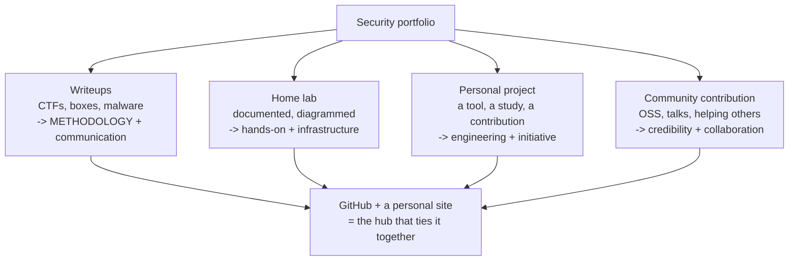
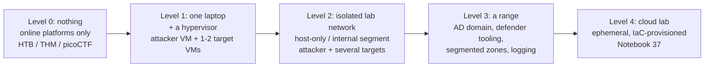
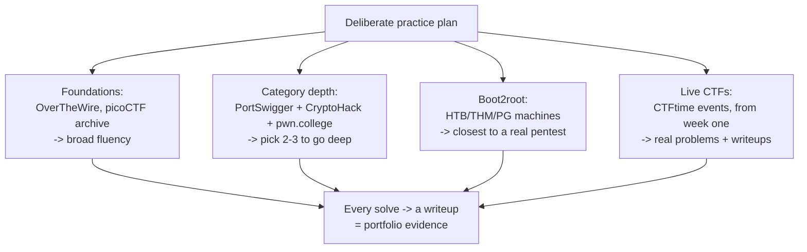
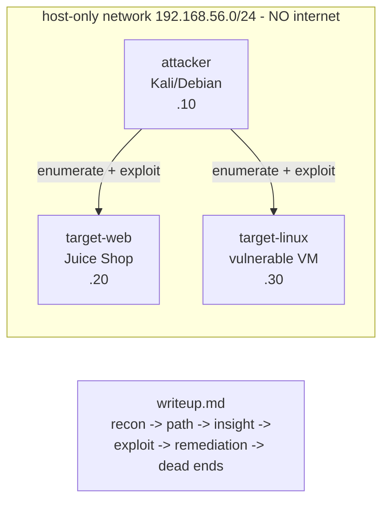

**Level:** Advanced · **Track:** Career · **Read time:** 255 min

Chapters 1 and 2 answered *which direction* to go and *which certifications* prove foundational knowledge. This chapter answers the question that actually gets people hired: **can you show me you can do the work?** A certificate says you passed an exam on a particular day. A portfolio says *here is a body of work I produced, that you can inspect, that demonstrates I can find bugs, build tools, analyse malware, defend a network, and — crucially — communicate what I did.* For anyone breaking into security without professional experience, and for many people levelling up within it, the portfolio is the single most persuasive thing you can put in front of a hiring manager, because it is the only artifact that lets them verify ability directly rather than inferring it.

The portfolio does not appear on its own. It is the output of two engines running continuously: a **home lab** where you practise safely and produce evidence, and a **deliberate practice plan** (CTFs, boot2root machines, projects) that keeps you working at the edge of your ability. This chapter builds both, then shows how to convert their output into the four proof artifacts that make a portfolio persuasive — writeups, a home lab you can describe, a personal project, and community contribution.

Two threads run through everything. The first is that **demonstrated work beats claimed knowledge every time**, so the whole chapter optimises for producing inspectable evidence rather than accumulating private understanding. The second is the ethical and legal boundary that governs every lab and every practice target: you practise on machines you own or are explicitly authorised to test, and nowhere else. That boundary is not a footnote — it is the line between a security career and a criminal record, and it is built into how you construct the lab from the first VM.

## Why This Matters

Consider two candidates for an entry-level security role. Both have the same certification. One's application is a resume and a cover letter. The other's is a resume that links to a GitHub with twenty CTF writeups showing real methodology, a documented home lab with a network diagram, a small tool they wrote to automate a recon task, and a blog post analysing a piece of malware. A hiring manager can *verify* the second candidate's ability in fifteen minutes of reading; the first they can only take on faith. In a field where hiring managers are burned constantly by candidates who can recite theory but freeze in front of a real target, verifiable evidence is worth more than any credential.

The mechanism behind this is that security hiring has a trust problem. The gap between "knows about SQL injection" and "can find and exploit a SQL injection in an unfamiliar app under time pressure, then write it up clearly for a client" is enormous, and it is exactly the gap a certificate cannot measure. A portfolio measures it directly. This is why the technical interview at good companies is essentially a live portfolio review — and why candidates who already *have* a portfolio walk in with the interview half-won.

There is also a compounding argument, the same one Notebook 43's workflow chapter made. A home lab and a practice plan are systems that produce evidence continuously. Every CTF you write up, every machine you document, every tool you build adds to a body of work that grows on its own timeline and keeps paying off — in interviews, in confidence, and in the actual skill the work builds. The candidate who started their portfolio a year ago is not just a year of study ahead; they are a year of *demonstrable, inspectable* work ahead, and that lead is very hard to close.

## Part 1: Why a Portfolio Beats a Certificate

A certificate and a portfolio prove different things, and understanding the difference is what makes you invest in the right one.

| | Certificate | Portfolio |
|---|---|---|
| Proves | You passed an assessment | You can do the work |
| Verifiable by | Checking a database | Reading your actual work |
| Shows methodology | No | Yes — the reasoning is visible |
| Shows communication | No | Yes — writeups are the evidence |
| Shows initiative | Weakly | Strongly — you built it unprompted |
| Ages | Slowly (still valid) | Improves (grows over time) |
| Differentiates you | Barely (everyone has them) | Strongly (yours is unique) |

The decisive advantages of a portfolio:

**It shows *how* you think, not just *that* you know.** A writeup exposes your methodology — how you enumerated, what hypotheses you formed, which dead ends you hit and why. That process is exactly what a hiring manager is trying to assess and exactly what a certificate hides.

**It demonstrates communication, the most-cited missing skill.** Security work is worthless if you cannot explain it, and the industry's most common complaint about technical hires is that they cannot write a report. A portfolio of clear writeups is direct, pre-verified evidence of the one soft skill everyone claims and few can prove.

**It shows initiative.** Nobody made you build a home lab, analyse that malware, or write that tool. Doing it unprompted signals the self-direction that distinguishes people who grow in the role from people who need constant direction.

**It is uniquely yours.** Ten thousand people hold the same certification. Nobody else has your specific body of writeups, your particular tool, your documented lab. In a stack of identical resumes, the portfolio is what makes yours legible.

None of this means certificates are worthless — Chapter 2 made the case that they open doors and pass HR filters. The point is that certificates and portfolios are *complementary*: the certificate gets you past the filter, and the portfolio wins the interview. Build both, and weight your effort toward the one that is scarcer and harder to fake — the portfolio.

## Part 2: The Four Proof Artifacts

A persuasive security portfolio contains four kinds of evidence, each proving a different competency.



**Writeups** (Part 6) are the highest-value artifact because they prove methodology *and* communication simultaneously, and you can produce them continuously from CTFs (Notebook 43), boot2root machines, and lab work. A dozen good writeups is a stronger portfolio than any single flashy project.

**A home lab** (Parts 3–5) proves you can build and operate real infrastructure, not just solve pre-built puzzles. Documented — with a network diagram and a description of what you built and why — it demonstrates the hands-on and infrastructure skills that boot2root platforms alone do not.

**A personal project** (Part 7) proves engineering ability and initiative: a tool you wrote to automate a task, an original piece of research, a meaningful contribution to an existing project. It shows you can *build*, not only *break*.

**Community contribution** (Part 8) proves credibility and collaboration: open-source contributions, answering questions, a conference talk, a well-received blog post. It signals that other practitioners take your work seriously, which is a form of validation nothing else provides.

The four are tied together by a **hub** — a GitHub profile and, ideally, a personal site (Parts 9–10) — so a hiring manager finds everything from one link. A portfolio scattered across platforms nobody can find is not a portfolio; the hub is what makes it usable.

## Part 3: The Home Lab — Why and How to Start

A home lab is a controlled environment where you can attack and defend real systems safely, legally, and repeatedly. It is where CTF skills become operational skills, where you practise the full kill chain rather than isolated challenges, and where you produce a large share of your portfolio evidence.

The scaling path, from nothing to a full range:



**Start where you are.** You do not need Level 3 to begin. A single laptop with 16 GB of RAM runs an attacker VM and a target VM comfortably, which is enough for months of learning. The most common mistake is deferring the lab until you can build the impressive version; the second most common is over-building infrastructure you never use instead of doing the work on it.

**The hypervisor choice.** A type-2 hypervisor (VirtualBox, free and cross-platform; VMware Workstation/Fusion, more polished) runs VMs on top of your normal OS and is the right start for a laptop. A type-1 hypervisor (Proxmox, ESXi) runs directly on dedicated hardware and is the right choice once you build a persistent range on a spare machine or a small server. For most people, VirtualBox on their existing laptop is where to begin, moving to Proxmox on a cheap second-hand box when the lab outgrows the laptop.

**The single most important design decision** is covered in Part 4: how the lab is networked, because that determines whether your lab is safe or a liability.

## Part 4: Lab Networking, Segmentation, and Isolation

The way you network the lab is a security decision, and getting it wrong ranges from "your vulnerable VMs are exposed to your home network" to "you ran malware that reached the internet." This is the part of lab-building where the ethics and legality (Part 12) become concrete engineering.

The network modes a hypervisor offers, and what each is for:

| Mode | What it does | Use for |
|---|---|---|
| **NAT** | VM reaches the internet through the host; not reachable from outside | Downloading updates/tools into a VM |
| **Host-only** | VM talks to the host and other host-only VMs; **no internet** | The safe default for vulnerable targets |
| **Internal** | VMs talk to each other only; not even the host | Isolated multi-VM lab segments |
| **Bridged** | VM appears as a real device on your physical LAN | **Rarely — exposes the VM to your home network** |

The rules that keep a lab safe:

**Vulnerable targets never touch the internet or your home LAN.** A deliberately vulnerable machine on a bridged network is reachable by everything else on your home network — and, if your router is misconfigured, potentially from outside. Put targets on **host-only or internal** networks. They get their updates once (via NAT, then switched to isolated), and thereafter live on an isolated segment with the attacker VM.

**Malware analysis requires stronger isolation still.** If you analyse real malware (Notebook 35), the analysis VM must be on a **fully isolated internal network with no route to anything**, ideally with host-level protections (a separate physical machine, or at minimum snapshots and no shared folders/clipboard), because malware actively tries to escape and phone home. Never analyse live malware on a VM that has any path to your real network or the internet. This is not optional caution; it is the difference between a lab exercise and infecting your own network.

**Segment the range like a real network.** As the lab grows (Level 3), model real architecture: a "DMZ" segment, an "internal" segment, a "domain" segment, separated by a firewall/router VM (pfSense/OPNsense). This lets you practise lateral movement, segmentation testing, and the zero-trust concepts from Notebook 42 — and documenting that segmented design is itself strong portfolio evidence.

**Snapshot everything.** Before you attack a target, snapshot it, so you can revert to a clean state and repeat. Snapshots turn a one-shot exercise into a repeatable practice loop and let you recover instantly when you break something.

## Part 5: Essential Lab Machines and Targets

What to actually put in the lab, by role.

**The attacker box.** A **Kali** or **Parrot** VM is the standard, pre-loaded with the offensive toolkit; a plain Debian/Ubuntu VM with tools added works equally well and teaches you more about your tools. Snapshot it clean after setup, and keep a copy of your dotfiles/scripts (Notebook 43, Part 1) so it is reproducible.

**Vulnerable-by-design targets** for offensive practice:

- **VulnHub** VMs — downloadable boot2root machines, hundreds of them, free.
- **Metasploitable 2/3** — deliberately vulnerable Linux, the classic learning target.
- **OWASP Juice Shop / DVWA / WebGoat** — vulnerable web apps for the AppSec chapters (Notebooks 21–27).
- **HackTheBox / TryHackMe / Proving Grounds** — hosted boxes; these complement the local lab rather than replacing it (they run on someone else's infrastructure, so no isolation worry, but you learn less about building).

**Defensive tooling** for the blue-team side (Notebooks 31–33), which is often neglected and therefore a differentiator:

- A **SIEM** — Security Onion, Wazuh, or an ELK stack — collecting logs from the lab.
- **Sysmon + a log forwarder** on Windows targets, so you can *see* your own attacks in the telemetry (the single best way to learn detection).
- A **firewall/router VM** (pfSense/OPNsense) for segmentation and network visibility.

**An Active Directory lab** is the highest-value single thing to build for offensive practice, because AD is the crux of most enterprise attacks (Notebooks 4, 18) and building one teaches you how it actually works. A Windows Server domain controller plus a couple of joined workstations, provisioned with a deliberately weak configuration, gives you a realistic environment for the entire AD attack chain — and automation projects like **GOAD (Game of Active Directory)** or **DetectionLab** provision one for you with a script, which is itself an infrastructure-as-code lesson.

## Part 6: The Writeup as the Central Artifact

Writeups are the highest-return portfolio artifact, for the reasons Notebook 43 established: they prove methodology and communication at once, they are produced continuously from work you are already doing, and they are exactly what a technical interview assesses. This section is about making them *portfolio-grade*.

A portfolio writeup is not a solution dump. Anyone can post the working command. A portfolio-grade writeup demonstrates *how you got there*:

```
1. Target      — what you were given (box name, scope, hashes)
2. Recon       — what you observed, with the commands that produced it
3. The path    — each step, the hypothesis behind it, and the result
4. The insight — the specific realisation that unlocked the box/bug
5. Exploitation — the working technique, reproducible
6. Post-ex     — what you did with access (privesc, loot, impact)
7. Remediation — how the target should have been defended  <- shows you think like a defender
8. Dead ends   — what you ruled out and why  <- proves methodology over luck
9. Lessons     — what you learned, what you would do differently
```

The two sections that separate a portfolio writeup from a walkthrough are **remediation** and **dead ends**. Remediation shows you understand *why* the vulnerability exists and how to fix it — which is what makes you useful to a defensive team and what a client actually pays for (Notebook 9). Dead ends show your reasoning was a *method*, not a lucky guess, and they are the section a hiring manager reads to gauge how you think when you are stuck.

Practical discipline: **write the writeup while the work is fresh** (Notebook 43, Part 2), **redact anything sensitive** (never publish a real client's data, and for platform boxes respect their writeup rules — many require you to gate writeups for retired machines only), and **make it reproducible** — enough detail that a reader could follow along, which is the same standard a real report is held to.

A dozen writeups at this quality, published on your hub, is a stronger portfolio than almost anything else you can build in the same time.

## Part 7: The Personal Project

A personal project proves you can *build*, which balances a portfolio otherwise full of *breaking*. It does not need to be large or original; it needs to be real, finished, and documented.

Project archetypes that signal well:

- **A tool that automates a task you actually do** — a recon aggregator, a custom wordlist generator, a log-parsing helper, a small scanner. The signal is that you noticed a repetitive task and engineered it away, which is exactly the instinct good security engineers have. (Notebook 5 and 43's script library feed directly into this.)
- **A piece of original research or analysis** — a deep writeup analysing a malware sample (Notebook 35), a breakdown of a recent CVE with a proof-of-concept against a lab target, a comparison of detection approaches. This shows depth and the ability to investigate.
- **A meaningful contribution to an existing project** (Part 8) — often higher-signal than a solo tool, because it shows you can work in someone else's codebase and collaborate.
- **A defensive build** — a detection rule set, a hardening guide, a home-lab-monitoring dashboard. Defensive projects are rarer in portfolios and therefore differentiate.

What makes a project portfolio-grade: a **clear README** (what it does, why, how to run it), **clean and commented code** (it will be read as a code sample), a **documented reason it exists** (the problem it solves), and **honest scope** (a small tool that works beats an ambitious one that does not). A finished, documented, modest project is worth far more than an impressive-sounding unfinished one — and unfinished projects on a public profile are a mild negative, so archive or finish them.

The most common failure is chasing originality. You do not need to invent something new. A clean re-implementation of a known technique, well-documented, demonstrates exactly the engineering ability a hiring manager wants to see.

## Part 8: Community Contribution as Portfolio

Contributing to the security community builds a form of credibility that self-made artifacts cannot, because it is *externally validated* — other practitioners engaged with your work.

Forms of contribution, roughly by accessibility:

- **Open-source contributions.** Fixing a bug, adding a feature, or improving documentation for a security tool you use puts your name on real, collaborative work. Documentation and test contributions are an underrated entry point — maintainers value them and they are approachable for a newcomer.
- **Answering questions.** Helping people in security communities (subreddits, Discords, forums) builds visible reputation and, not incidentally, deepens your own understanding — explaining something is the strongest test of whether you know it.
- **Writing publicly.** A blog (Part 10) that explains a technique clearly, or a writeup that gets shared, reaches people and establishes you as someone who can teach — a highly valued trait.
- **Speaking.** A talk at a local security meetup, a BSides, or a student group is intimidating and disproportionately valuable: it signals confidence, communication, and depth, and the barrier is lower than people assume (local meetups actively want new speakers).

The through-line is that contribution is a two-way investment: it builds your portfolio and credibility *while* deepening your skills and your network — and the network is, honestly, how a large fraction of security jobs are actually found (Chapter 4). A person known in a community for helpful, competent contributions is a person other people refer when a role opens.

Keep the ethics from Part 12 in view here too: contributing means *helping*, and the security community has strong norms about responsible behaviour. Publishing a working exploit for an unpatched vulnerability, or sharing techniques framed to harm, damages your reputation rather than building it. Contribute in ways that make the community safer and stronger.

## Part 9: GitHub as the Hub

Your GitHub profile is the natural centre of a technical portfolio, because it is where a hiring manager already looks and because it hosts writeups, tools, and contributions in one inspectable place.

Structuring it to work as a portfolio:

- **A profile README** that orients a visitor: who you are, what you focus on, and links to your best work. This is the first thing a hiring manager reads; make it a clear index, not a wall of badges.
- **A writeups repository** (or a repo per category), organised so someone can find your best writeup in one click. Consistency of structure across writeups signals professionalism.
- **Tool/project repositories** each with a real README, clean commit history, and honest documentation. Remember these are read as code samples.
- **Visible contribution activity** — the contribution graph and your pull requests to other projects show sustained, real engagement rather than a burst of activity before a job hunt.

Two cautions. **Curate.** A profile with three excellent repositories beats one with thirty abandoned ones; pin your best work and archive the rest. And **never commit secrets or anything sensitive** — a portfolio repo with an API key in the history, or a writeup containing real client data, is a self-inflicted wound that Notebook 46's secret-scanning exists to prevent. Run a secret scanner over your own repos before you publicise them.

## Part 10: A Personal Site and Blog

A personal website elevates the portfolio from "a GitHub profile" to "a professional presence," and a blog is where the writeups that get *read* live.

What a personal site does that GitHub alone does not: it gives you a single memorable link, presents your work in a form non-technical people (recruiters, HR) can navigate, and lets you write longer-form content — analysis, tutorials, opinion — that establishes expertise. It need not be elaborate; a clean static site (the kind this very notebook platform is built on) with an about page, a projects page, and a blog is plenty.

The content that actually gets read and shared:

- **Clear explanations of tricky concepts.** A post that finally makes something click for a reader gets bookmarked and shared, and it demonstrates teaching ability.
- **Original writeups and analysis** — the portfolio writeups from Part 6, in a form that surfaces in search and social.
- **"How I built X"** posts about your lab or projects — practical, reproducible, and appreciated.

Two honest cautions. A blog is a *commitment*: three excellent posts beat a graveyard of one abandoned "hello world" post and nothing since, so start only when you have real content and keep it modest rather than promising a cadence you cannot sustain. And write for a reader, not for the algorithm — the security community rewards genuine, careful content and quickly ignores content-farm filler.

## Part 11: A Deliberate CTF and Practice Plan

The portfolio is fed by practice, and practice is most effective when it is *deliberate* — structured to keep you at the edge of your ability rather than replaying what you already know. This integrates directly with Notebook 43.



The principles, drawn from Notebook 43 and applied to portfolio-building:

**Balance breadth and depth.** Broad fluency across categories (so you are useful anywhere) plus real depth in two or three (so you have a specialism to point at). Notebook 43, Chapter 1's twelve-week plan is the template.

**Boot2root machines are the highest-fidelity practice** for a job, because they most resemble a real penetration test — enumerate, exploit, escalate, document — and each one is a ready-made writeup.

**Every solve becomes a writeup.** This is the discipline that converts practice into portfolio. A CTF you solved and did not write up produced learning but no evidence; the writeup is what makes the practice *count* twice.

**Write up your failures too** (Notebook 43, Part 4) — the highest-improvement habit, and one that quietly demonstrates humility and rigour when a hiring manager sees you honestly documenting what you could not solve and how you learned it.

The practice plan and the portfolio are the same engine viewed from two sides: deliberate practice builds the skill, and its documented output *is* the portfolio.

## Part 12: Ethics and Legality of a Home Lab

This section governs everything above, and it is not negotiable.

**You test only what you own or are explicitly authorised to test.** Your home lab consists of VMs you created, deliberately-vulnerable machines released for practice, and hosted platforms (HTB, THM) that authorise you to attack their infrastructure. That is the complete list of legitimate targets. Pointing your lab's tools at a website, a company, or any system you do not own — "just to try it," "it's probably vulnerable," "I wasn't going to do anything" — is a computer-misuse crime (Notebook 8), regardless of intent, and it ends security careers before they start.

**The isolation that keeps the lab safe also keeps it legal.** The host-only/internal networking from Part 4 is not only about protecting your home network from your vulnerable VMs; it is about ensuring your practice attacks *cannot* reach anything you are not authorised to touch. An isolated lab makes it impossible to accidentally cross the line.

**Vulnerable-by-design targets are released for exactly this.** VulnHub, Metasploitable, Juice Shop, and the boot2root platforms exist so you can practise offence legally. Use them, and stay within the authorised platforms' rules (respect scope, respect writeup embargoes, do not attack the platform's own infrastructure — Notebook 43's CTF rules apply).

**Malware isolation is a safety issue too** (Part 4). Analysing real malware carelessly can infect your own machines and network, which is both a personal disaster and, if it spreads, potentially a legal one. The isolation discipline is what makes malware analysis a lab exercise rather than a self-inflicted incident.

**When in doubt, do not.** The uncertainty itself is the answer: if you are unsure whether you are authorised to test something, you are not. Authorisation is explicit, specific, and documented — a bug bounty program's scope, a platform's terms, a machine you built. Anything short of that is off-limits. This single discipline, held consistently, is what separates a security professional from a criminal, and it is worth far more to your career than any technique in the entire curriculum.

## Part 13: Hands-On Lab — Provision a Mini-Range and Document an Attack Chain

### 13.1 What we are building

A small, reproducible, **isolated** lab — an attacker box and two targets on a host-only network — and a full documented attack chain captured as a portfolio-grade writeup. This exercises Part 4 (isolation), Part 5 (machines), and Part 6 (the writeup).



You need a hypervisor (VirtualBox is free) and enough RAM for three light VMs (or run the targets as Docker containers on one VM, shown below, if RAM is tight).

### 13.2 Define the isolated network as code

Rather than click through the GUI, script the network definition so the lab is reproducible (Part 3's infrastructure-as-code lesson):

```bash
# provision-net.sh -- create an isolated host-only network in VirtualBox.
# This network has NO route to the internet or your home LAN (Part 4, Part 12).
set -e
NET="vboxnet-lab"

# Create a host-only network with a fixed subnet, DHCP off (static IPs).
VBoxManage hostonlyif create 2>/dev/null || true
VBoxManage hostonlyif ipconfig "$NET" --ip 192.168.56.1 --netmask 255.255.255.0 2>/dev/null || \
  echo "(configure the host-only adapter to 192.168.56.1/24 in the GUI if this errors)"

echo "[+] isolated lab network 192.168.56.0/24 ready"
echo "    attacker  -> 192.168.56.10"
echo "    target-web-> 192.168.56.20"
echo "    target-lin-> 192.168.56.30"
echo "    NOTE: set each VM's adapter to Host-Only ($NET). NO NAT on targets."

# Sample output:
# [+] isolated lab network 192.168.56.0/24 ready
#     attacker  -> 192.168.56.10
#     target-web-> 192.168.56.20
#     target-lin-> 192.168.56.30
#     NOTE: set each VM's adapter to Host-Only (vboxnet-lab). NO NAT on targets.
```

If RAM is tight, run the two targets as containers on the attacker VM instead — still isolated, since the containers are only reachable on the internal Docker network:

```bash
# targets-compose.yml -- two vulnerable targets, reachable only locally.
cat > targets-compose.yml <<'EOF'
services:
  juice-shop:
    image: bkimminich/juice-shop
    ports: ["127.0.0.1:3000:3000"]     # bound to localhost ONLY -- not exposed
  dvwa:
    image: vulnerables/web-dvwa
    ports: ["127.0.0.1:8080:80"]       # localhost ONLY
EOF
docker compose -f targets-compose.yml up -d
echo "[+] targets up on 127.0.0.1:3000 (juice-shop) and :8080 (dvwa) -- localhost only"

# Sample output:
# [+] targets up on 127.0.0.1:3000 (juice-shop) and :8080 (dvwa) -- localhost only
```

Note the `127.0.0.1:` binding — the targets are reachable only from the machine itself, never from the network. That is Part 4's isolation, expressed in one line.

### 13.3 Run a documented attack chain

Now practise the enumerate → exploit → document loop against `juice-shop`, capturing each step for the writeup as you go (Part 6, Notebook 43's note-during-solve habit):

```bash
# recon: what is running?
curl -s -o /dev/null -w "%{http_code}\n" http://127.0.0.1:3000/
curl -s http://127.0.0.1:3000/ | grep -oiE '<title>[^<]+' | head -1

# Sample output:
# 200
# <title>OWASP Juice Shop

# enumerate: the app leaks its own product-search endpoint.
curl -s "http://127.0.0.1:3000/rest/products/search?q=apple" | head -c 120; echo

# Sample output:
# {"status":"success","data":[{"id":1,"name":"Apple Juice (1000ml)",...
```

```bash
# hypothesis: the search 'q' is concatenated into a SQL query (Notebook 23).
# cheapest disproving test -- a quote should change the response.
curl -s -o /dev/null -w "quote payload -> %{http_code}\n" \
  "http://127.0.0.1:3000/rest/products/search?q=%27"

# Sample output:
# quote payload -> 500      <- error = the input reaches the query. hypothesis holds.
```

```bash
# exploit: UNION-based injection to prove data extraction (lab target you own).
curl -s "http://127.0.0.1:3000/rest/products/search?q=qwert')) UNION SELECT email,2,3,4,5,6,7,8,9 FROM Users--" \
  | grep -oiE '"name":"[^"]*@[^"]*"' | head -3

# Sample output:
# "name":"admin@juice-sh.op"
# "name":"jim@juice-sh.op"
# ... (user emails extracted -> impact demonstrated)
```

Capture the whole thing as a portfolio-grade writeup:

```bash
cat > writeup.md <<'EOF'
# OWASP Juice Shop — SQL Injection in Product Search

**Target:** OWASP Juice Shop (local lab, host-only). Authorised: my own VM.

## Recon
- App responds 200; title confirms Juice Shop.
- Product search endpoint: GET /rest/products/search?q=<term> returns JSON.

## The Path
1. Hypothesis: `q` is concatenated into a SQL query (unparameterised).
2. Test: `q='` -> HTTP 500. The input reaches the query engine. Hypothesis holds.
3. Determined the column count and injected a UNION SELECT against the Users table.

## The Insight
The search reflects query results directly and builds the SQL by string
concatenation, so a UNION SELECT smuggles arbitrary columns into the product list.

## Exploitation
`q=qwert')) UNION SELECT email,2,3,... FROM Users--` returned all user emails
in the product-name field. (Data extraction demonstrated; no data retained.)

## Remediation
- Use parameterised queries / an ORM binding for the search term.
- Least-privilege DB account; the web app should not read the full Users table.
- Generic error responses (the 500 leaked that input reached the query).

## Dead Ends
- First tried a boolean-blind approach before noticing results reflect directly,
  which made UNION the faster path. Recorded so I don't repeat it.

## Lessons
Reflected results + a 500 on a quote is the fastest SQLi confirmation loop.
EOF
echo "[+] writeup.md written -- $(wc -l < writeup.md) lines"

# Sample output:
# [+] writeup.md written -- 27 lines
```

That writeup — with its **remediation** and **dead ends** sections — is portfolio-grade (Part 6), produced as a byproduct of one lab exercise. Tear down cleanly:

```bash
docker compose -f targets-compose.yml down
echo "targets down"

# Sample output:
# targets down
```

### 13.4 Extending the lab

Build the full three-VM version with a real attacker VM and two VulnHub targets on a host-only network, and diagram it for your portfolio; add a **GOAD** or **DetectionLab** Active Directory range (Part 5) and work an AD attack chain end to end; stand up **Wazuh** or **Security Onion** and re-run your Juice Shop attack while watching it appear in the SIEM (the best possible detection-engineering lesson, Notebook 32); snapshot every target so the practice loop is repeatable; and turn three of your lab writeups into a structured GitHub writeups repository with a profile README that indexes them (Part 9).

## Part 14: Common Pitfalls

**Waiting for the perfect lab before starting.** A single laptop with two VMs is enough for months. Deferring until you can build the impressive version means never starting.

**Over-building infrastructure you never use.** The opposite failure: spending weeks on a beautiful segmented range and doing no actual security work on it. The lab is a means; the work and the writeups are the end.

**Vulnerable targets on a bridged network.** Exposes deliberately-insecure machines to your home LAN and possibly the internet. Targets live on host-only/internal networks, always.

**Analysing malware without isolation.** A real risk of infecting your own network. Full isolation, separate machine, no shared folders — or do not analyse live malware at all.

**Solving without writing up.** Practice that produces no evidence. Every solve becomes a writeup, or the portfolio never grows.

**Solution-dump writeups.** A posted command is not a portfolio writeup. Include recon, hypotheses, remediation, and dead ends — the sections that prove methodology.

**Chasing project originality.** You do not need to invent something new. A clean, finished, documented re-implementation of a known technique demonstrates the engineering ability that matters.

**A graveyard of unfinished projects/blog posts.** Public abandoned work is a mild negative. Curate, finish, or archive; three excellent artifacts beat thirty half-done ones.

**Committing secrets to portfolio repos.** An API key in a public repo's history is a self-inflicted wound. Scan your own repos before publicising them (Notebook 46).

**Testing anything you do not own.** The career-ending mistake. Your lab, released vulnerable targets, and authorised platforms are the complete list of legitimate targets. When in doubt, do not.

## Final Revision / Summary

- **Demonstrated work beats claimed knowledge.** A certificate proves you passed an exam; a **portfolio proves you can do the work** — it shows methodology, communication, and initiative that a credential cannot, and it is uniquely yours. Build both; weight effort toward the portfolio.
- A persuasive portfolio has **four proof artifacts**: **writeups** (methodology + communication, the highest-value), a **documented home lab** (hands-on + infrastructure), a **personal project** (engineering + initiative), and **community contribution** (externally-validated credibility) — tied together by a **GitHub + personal-site hub**.
- A **home lab** scales from online platforms → one laptop with two VMs → an isolated multi-VM network → a segmented range → cloud. **Start where you are**; the common failures are waiting for the perfect lab and over-building one you never use.
- **Networking is the critical safety-and-legality decision**: vulnerable targets go on **host-only/internal** networks with **no internet or home-LAN access**; malware analysis demands **full isolation**; segment the range like a real network; and **snapshot everything** for a repeatable loop.
- Stock the lab with an **attacker box** (Kali/Parrot or plain Debian), **vulnerable-by-design targets** (VulnHub, Metasploitable, Juice Shop/DVWA), **defensive tooling** (a SIEM, Sysmon, a firewall VM — a differentiator), and — highest value — an **Active Directory range** (GOAD/DetectionLab provision one as code).
- A **portfolio-grade writeup** is not a solution dump: recon → path (with hypotheses) → insight → exploitation → **remediation** (you think like a defender) → **dead ends** (method, not luck) → lessons. Write while fresh, redact sensitive data, respect platform embargoes, make it reproducible. A dozen at this quality is a strong portfolio.
- A **personal project** proves you can build: a tool that automates a real task, original research/analysis, a contribution, or a defensive build. Portfolio-grade means a clear README, clean code, a documented reason, and honest scope — a finished modest project beats an unfinished ambitious one, and originality is not required.
- **Community contribution** (OSS, answering questions, writing, speaking) builds externally-validated credibility *and* your network — which is how many security jobs are actually found. Contribute in ways that make the community safer.
- **GitHub is the hub** (profile README as an index, curated best repos, visible real contribution) and a **personal site + blog** elevates it — but curate ruthlessly, never commit secrets, and treat a blog as a commitment (three excellent posts beat a graveyard).
- A **deliberate practice plan** (Notebook 43) feeds the portfolio: breadth plus 2–3 deep categories, boot2root machines as the highest-fidelity practice, live CTFs from week one, and **every solve — including failures — becomes a writeup**. Practice and portfolio are the same engine.
- **Ethics and legality govern everything**: you test only what you **own or are explicitly authorised to test**; the lab's isolation keeps it both safe and legal; vulnerable-by-design targets and authorised platforms exist for exactly this; and **when in doubt, do not** — that single discipline is worth more to your career than any technique.

## Cheat Sheet / Quick Reference

**Four portfolio artifacts**

```
writeups          -> methodology + communication  (highest value)
documented lab    -> hands-on + infrastructure
personal project  -> engineering + initiative
community contrib -> externally-validated credibility
+ hub: GitHub profile README + a personal site
```

**Home lab networking (safety = legality)**

```
NAT        -> updates only, then switch off
HOST-ONLY  -> vulnerable targets live here (no internet, no home LAN)
INTERNAL   -> isolated multi-VM segments
BRIDGED    -> AVOID for targets (exposes them)
malware    -> FULL isolation, separate machine, no shared folders
snapshot before every attack
```

**Lab machines**

```
attacker : Kali/Parrot or plain Debian (snapshot clean)
targets  : VulnHub, Metasploitable, Juice Shop/DVWA/WebGoat
defense  : Wazuh/Security Onion SIEM, Sysmon, pfSense
highest value: an Active Directory range (GOAD / DetectionLab)
```

**Portfolio-grade writeup**

```
target -> recon -> path(with hypotheses) -> INSIGHT -> exploit
-> REMEDIATION (defender view) -> DEAD ENDS (method) -> lessons
write while fresh | redact | respect embargoes | reproducible
```

**Project checklist**

```
[ ] solves a real problem   [ ] clear README (what/why/how)
[ ] clean, commented code   [ ] finished + honest scope
[ ] no secrets in history   originality NOT required
```

**Practice plan (feeds the portfolio)**

```
foundations (OverTheWire, picoCTF) -> depth in 2-3 categories
-> boot2root boxes (highest fidelity) -> live CTFs from week one
EVERY solve -> a writeup (including failures)
```

**The one non-negotiable rule**

```
test ONLY what you own or are explicitly authorised to test
lab VMs + released vulnerable targets + authorised platforms = the whole list
when in doubt -> DO NOT
```

## Practice Labs & Resources

**Build the lab**
- **VirtualBox** (free) or **VMware Workstation/Fusion** for a laptop lab; **Proxmox** on a spare machine for a persistent range.
- **VulnHub** (free downloadable boxes), **Metasploitable 2/3**, **OWASP Juice Shop / DVWA / WebGoat** for targets.
- **GOAD (Game of Active Directory)** and **DetectionLab** — scripted AD ranges that teach infrastructure-as-code while building the single highest-value lab.
- **Wazuh** or **Security Onion** for the defensive side; add **Sysmon** to Windows targets and watch your own attacks in the logs.

**Practice (feeds the portfolio)**
- **HackTheBox**, **TryHackMe**, **Proving Grounds** for boot2root machines; **CTFtime** for live events (Notebook 43).
- Turn every solve into a writeup; build the twelve-week plan from Notebook 43, Chapter 1.

**Build the hub**
- Create a **GitHub profile README** that indexes your best work, a structured **writeups repository**, and clean project repos.
- Stand up a **personal static site** (this notebook's platform is one example) with an about page, projects, and a blog — start it only when you have real content.
- Scan your repos for secrets before publicising them (Notebook 46's tools).

**Deliberate practice**
- Extend the Part 13 lab into a full three-VM isolated range, diagram it, and write up an end-to-end attack chain.
- Write up two *failed* boxes per month from their retired-machine writeups, documenting where your reasoning diverged.
- Ship one small, finished, documented tool that automates a task you actually repeat.

**Further reading**
- Notebook 43 (CTF & Wargames) — the practice engine that feeds this portfolio, especially the workflow and writeup chapters.
- Notebook 9 (reporting) — the professional standard your writeups' remediation sections should aspire to.
- Notebook 8 (ethics & legality) and Notebook 35 (malware analysis) — the boundaries that govern lab safety.
- Chapter 4 (Résumé & Interviews) next — how to put this portfolio in front of a hiring manager and land the role.

---

*Also on [Praneeth's portfolio](https://ping-praneeth.vercel.app/notebook/career-mastery/03-building-a-portfolio-home-lab-and-ctf-practice-plan), with comments and the latest edits.*
