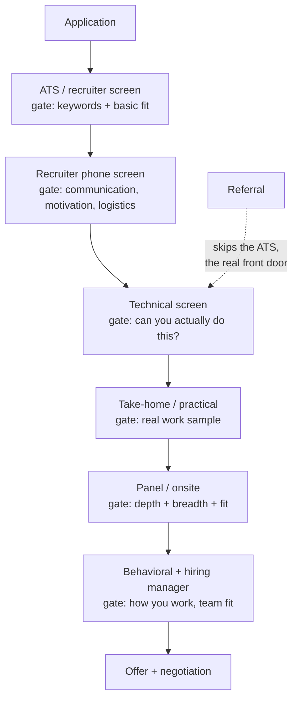
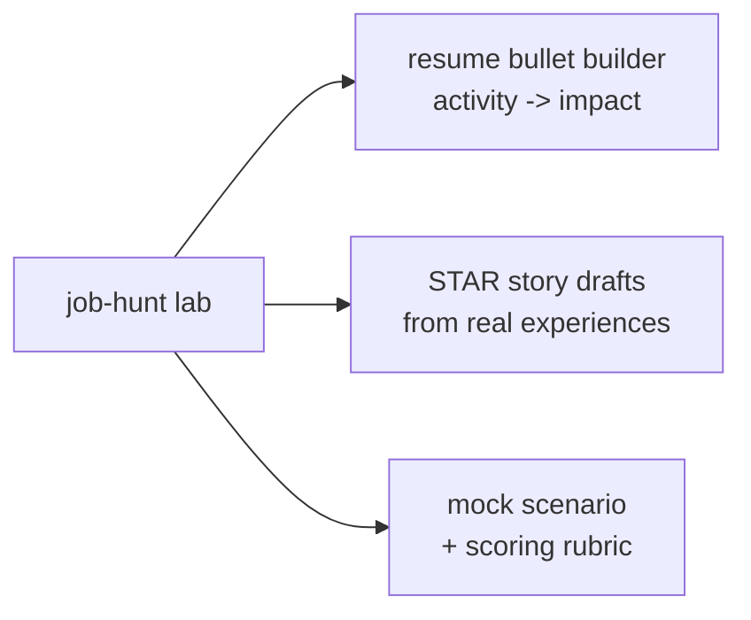

**Level:** Advanced · **Track:** Career · **Read time:** 255 min

You have chosen a direction (Chapter 1), earned the certifications that prove foundational knowledge (Chapter 2), and built a portfolio of demonstrated work (Chapter 3). This chapter is about the last mile — the one that trips up an enormous number of technically capable people — which is *converting all of that into an actual job offer*. It is a genuinely different skill from doing security work, and treating it as an afterthought is why strong practitioners sometimes lose roles to weaker candidates who simply interviewed better and presented themselves more clearly.

The uncomfortable truth this chapter opens with is that **hiring is a marketing and communication process, not a pure meritocracy**. The best candidate does not automatically get the job; the candidate who most clearly *demonstrates* they are the best, to the specific people making the decision, through the specific artifacts and conversations that decision runs on, gets the job. That is not cynicism — it is a solvable problem, and the good news is that the skills it requires (clear writing, structured communication, reading what the other side actually needs) are learnable, and are the same skills that make you good at the *work* once you are hired.

The chapter walks the full pipeline: the resume that gets you past the filters, the online presence recruiters actually search, the networking that is the real front door, the interview stages and how to prepare for each, the behavioural round, the reverse interview where you evaluate them, and salary negotiation. Throughout, the "FAANG-level" framing in the title is a proxy for *rigorous, structured hiring* — the same pipeline, at slightly different intensities, runs at most serious security employers, and preparing for the demanding version prepares you for all of them.

## Why This Matters

The direct reason is obvious: a job is the point of the preceding three chapters, and the difference between a good and a poor job hunt is measured in months of your life and, over a career, in a large amount of money and opportunity. But the deeper reason is that the job-hunting skills *are* professional skills. The resume bullet that clearly states impact is the same skill as the finding in a pentest report that clearly states business risk (Notebook 9). The interview answer that walks a panel through your reasoning is the same skill as briefing a stakeholder on an incident (Notebook 33). The negotiation that secures fair compensation is the same skill as scoping an engagement or pushing back on an unreasonable deadline. Getting good at the job hunt makes you better at the job.

There is also a fairness argument that is worth stating plainly, because it changes how you should feel about "playing the game." The candidates who lose out to the interview process are disproportionately the ones who assumed their skills would speak for themselves and refused to learn the presentation side — and those are often people from backgrounds that did not teach them the unwritten rules. Learning how hiring actually works is not selling out; it is refusing to be filtered out by a process you could have navigated. The person who understands the pipeline is not gaming it — they are giving their real ability a fair chance to be seen.

Finally, the stakes compound. The first security role is the hardest to get and the one that unlocks everything after it — once you have professional experience, the whole calculus changes. Investing seriously in landing that first role, or the next level-up, has an outsized return precisely because it is the gate. This chapter is about getting through the gate deliberately rather than hoping.

## Part 1: How Security Hiring Actually Works

Before optimising any single step, understand the pipeline, because each stage has a different gatekeeper with a different goal, and a resume tuned for one fails at another.



The gatekeepers and what each actually wants:

- **The ATS and recruiter screen** filter on keywords and basic fit. The gatekeeper is often a non-technical recruiter or software; the goal is to *not be filtered out*, which is a formatting-and-keyword problem (Part 2).
- **The recruiter phone screen** assesses communication, motivation, and logistics (location, salary range, timeline). The goal is to be easy to talk to, clearly interested, and unsurprising on the practical details.
- **The technical screen** is the first real skill gate — can you do the work? This is where the portfolio and preparation pay off (Part 8).
- **The take-home or practical assessment** is a work sample: a lab, a code review, a mini-pentest, a written analysis. The goal is to produce *professional-quality* work, which means the reporting and communication as much as the technical result.
- **The panel/onsite** probes depth and breadth across several interviewers, each covering different ground.
- **The behavioural and hiring-manager rounds** assess how you actually work — collaboration, judgement, handling conflict and failure (Part 9).

The single most important structural fact: **a referral skips the ATS entirely** (Part 4). The application-to-a-job-board path is the hardest, lowest-yield route, and the pipeline diagram's dotted line — a referral dropping you past the initial filters — is why networking is the real front door, not a nice-to-have.

## Part 2: The Resume as a Marketing Document

Your resume is not a record of everything you have done; it is a *marketing document* whose single job is to get you to the next stage. Every choice serves that job.

**The impact-first bullet formula.** The most common resume weakness is bullets that describe *activities* instead of *impact*. Compare:

```
Weak:   Performed vulnerability assessments on web applications.
Strong: Identified 12 vulnerabilities across 3 web apps including a
        critical SQL injection, reducing the client's exploitable
        attack surface and preventing potential data exposure.
```

The formula: **[action verb] + [what you did] + [quantified result / impact]**. Numbers make it concrete (how many, how much, what severity), and the impact clause answers the "so what?" that a hiring manager silently asks of every line. Even portfolio and lab work fits this: "Built and documented a 15-machine home lab including an Active Directory range, and published 20 CTF writeups demonstrating web, crypto, and binary-exploitation methodology."

**Tailor to each role.** A generic resume sent to fifty jobs underperforms a tailored resume sent to ten. Read the job description, identify the skills and keywords it emphasises, and reorder and reword your resume so the most relevant experience is most prominent and the description's language is reflected (honestly). This is not deception; it is making it easy for a busy reader to see the match.

**Respect the ATS reality.** Many applications pass through an Applicant Tracking System that parses your resume into fields and matches keywords. The practical consequences: use a **clean, single-column, standard format** (fancy multi-column designs and graphics confuse parsers), include the **keywords from the job description** (an ATS looking for "SIEM" will not match "Splunk" unless you name both), submit as **PDF unless told otherwise**, and do not hide keywords in white text (ATSs and humans both catch it). The goal is to be parsed correctly and matched, not to be pretty.

**The security-specific sections that matter**, roughly in order for someone breaking in: a short **summary** stating your target role and strongest evidence; **skills** (tools, languages, domains — scannable); **projects/portfolio** (link to the GitHub hub from Chapter 3 — for a career-changer this often matters more than work history); **certifications** (Chapter 2); **experience** (impact-first bullets); and **education**. Put the strongest evidence highest — for a career-changer with a strong portfolio, the projects section may belong above a thin work history.

**Length and honesty.** One page for early career, two at most for experienced; ruthless editing beats padding. And never lie — claimed skills get tested in the technical rounds, and being caught overstating ends candidacies instantly and burns your reputation in a small industry.

## Part 3: Cover Letters and Online Presence

**The cover letter** is optional at many companies and decisive at a few. Write one when the role clearly invites it, when you are a career-changer needing to explain the transition, or when you have a specific, genuine reason to want *this* role that a resume cannot convey. A good cover letter is short, specific to the company (not a template), and answers "why you, why this role, why now" — a generic cover letter is worse than none. When you write one, lead with the strongest, most specific point; recruiters skim.

**LinkedIn and online presence.** Recruiters *search* LinkedIn constantly, so a complete, keyword-rich profile is a passive lead generator working while you sleep. Practical points: a clear headline stating your target role, a summary that reads like your resume's summary, listed skills that match what recruiters search, and — critically — a link to your **portfolio hub** (Chapter 3). The GitHub profile, personal site, and CTFtime profile are all part of the online presence a technical recruiter will look at, so make sure they are findable from your LinkedIn and consistent with your resume.

A note on the whole online presence: it will be searched, so make the *public* parts reinforce your candidacy (professional, competent, security-focused) and be aware that a controversial or unprofessional public footprint can cost you. This is not about being fake; it is about recognising that in security — a trust-based profession — your public conduct is part of your professional signal.

## Part 4: Networking and Referrals — The Real Front Door

The highest-leverage job-hunting activity is not applying; it is **being referred**, because a referral skips the ATS, arrives with built-in credibility, and dramatically raises your odds at every subsequent stage. A large fraction of security roles are filled through networks, and the candidates who rely solely on job-board applications are competing in the hardest, most crowded channel.

Building a network *without being transactional*:

- **Contribute first, ask later.** The people who build real networks give before they take — answering questions, sharing useful work, helping at events, contributing to projects (Chapter 3, Part 8). A network built on genuine contribution is durable; one built on cold "can you refer me?" messages is not.
- **Be present in the community.** Local security meetups, BSides conferences, Discord/Slack communities, and online security spaces are where practitioners actually meet. Showing up consistently, being helpful, and letting people see your work (your writeups, your talks) is how you become someone others think of when a role opens.
- **The informational interview.** Asking a practitioner for 20 minutes to learn about their role and path — genuinely, to learn, not as a disguised job ask — builds relationships and gives you real intelligence about the field. Most people are generous with this if approached respectfully and specifically.
- **Make it easy to refer you.** When you do ask for a referral, make it effortless: a specific role, your tailored resume, and a short note on why you fit, so the referrer can forward it in one click. Referring someone spends the referrer's credibility, so make it low-effort and low-risk for them.

The mindset shift: networking is not a distasteful thing you do *instead* of merit; it is how your merit becomes *visible* to the people who hire. A talented person nobody knows is at a disadvantage to an equally talented person the hiring manager has seen help others in a community. Build the network by being the kind of person others want on their team, and the referrals follow.

## Part 5: Application Strategy

A deliberate strategy beats both spray-and-pray and excessive perfectionism.

**Target, then volume.** Identify the roles that genuinely fit (Chapter 1) and the companies you would actually want to work for, and invest in *tailored* applications to those. Below the top tier, a reasonable volume of solid applications keeps the pipeline full — but a tailored application to a well-chosen role outperforms ten generic ones, so weight toward quality where it matters most.

**Apply even at ~70% match.** Job descriptions are wish lists, not requirements. Candidates — and research suggests this affects some groups more than others — routinely disqualify themselves by not applying unless they meet every listed criterion, while the actual hiring bar is lower and the description is aspirational. If you meet the core requirements and a majority of the rest, apply. The worst outcome is a no; the cost of not applying is a role you might have gotten.

**Timing and freshness.** Apply reasonably soon after a posting appears (very old postings may be filled or stale), and follow up politely if you have a referral or a recruiter contact. Keep a tracker of where you applied, the status, and the follow-up dates — a job hunt is a pipeline you manage, not a series of hopeful one-offs.

**Use multiple channels.** Referrals first (Part 4), then company career pages, then reputable job boards, then recruiters (external recruiters can be useful but their incentives are their own — treat their advice accordingly). Diversifying channels beats depending on any single one.

## Part 6: The Interview Pipeline, Stage by Stage

Each stage has a purpose and a preparation. Knowing what each is *for* lets you prepare the right thing.

**The recruiter screen** (usually 30 minutes, phone). Purpose: communication, motivation, logistics. Prepare a crisp, honest answer to "tell me about yourself" (a 60–90 second summary of your path and target), know your salary range and location constraints, have a genuine reason you are interested in *this* company, and be easy and pleasant to talk to. This stage rarely tests skill; it tests whether you are a reasonable, communicative, motivated person worth the technical team's time.

**The technical screen** (often 45–60 minutes, video or phone). Purpose: the first real skill gate. Format varies by role — a knowledge conversation, a live problem, a code review, a walkthrough of a challenge. Prepare by being able to *talk through your reasoning out loud* (Part 8), because interviewers are assessing your process as much as your answers.

**The take-home / practical assessment.** Purpose: a work sample. A mini-pentest with a report, a code-review exercise, a malware sample to analyse, a detection to write. The key insight: **the report/writeup matters as much as the technical finding** — this is where you demonstrate the communication a real role requires (Notebook 9), and a brilliant technical result presented poorly loses to a solid one presented professionally. Treat it like real client work.

**The panel / onsite** (several interviews, often a full day). Purpose: depth and breadth across multiple interviewers, each covering different ground — a deep technical dive, a systems/scenario discussion, a coding or hands-on round, a behavioural round. Pace yourself, treat each interviewer freshly, and remember they will compare notes, so consistency matters.

**The behavioural and hiring-manager rounds** (Part 9). Purpose: how you work, judgement, team fit, and — from the hiring manager specifically — whether they want you on their team and whether you will grow. This stage decides as many outcomes as the technical rounds, and technically strong candidates lose here by neglecting it.

## Part 7: Preparing the Technical Interview

Security technical interviews cluster into three round types, and each rewards a different preparation.

**The knowledge round** — conceptual questions across security domains: "explain how TLS works," "what is CSRF and how do you prevent it," "walk me through a Kerberos authentication." These test breadth and the ability to explain clearly. Prepare by being able to *teach* the core concepts of your target domain (the notebooks in this curriculum are the syllabus), out loud, at the right level of detail. The failure mode is knowing something well enough to use it but not well enough to *explain* it — practise explaining.

**The hands-on round** — a live or recorded practical: exploit this box, find the bug in this code, analyse this artifact. This is where portfolio practice (Chapter 3) pays off directly, because the motion is the one you have been drilling. The critical skill is **thinking out loud** — narrate your enumeration, your hypotheses, your dead ends (Notebook 43's methodology), because the interviewer is scoring your *process*, and a candidate who reasons clearly but does not finish often beats one who finishes silently by luck.

**The scenario round** — an open-ended situation: "you're the first responder to a suspected breach, walk me through your approach," "design the security architecture for this system," "how would you threat-model this feature." These test judgement and structured thinking. Prepare by having a *framework* for the common scenarios (an incident-response process, a threat-modelling method, an architecture-review approach — the later notebooks provide these) and by structuring your answer visibly: clarify the scope, state your approach, work through it, and note trade-offs.

The universal preparation across all three: **communicate your reasoning**. Security interviews assess how you *think*, and the only way to show your thinking is to externalise it. A candidate who says "I'd start by checking X because it would tell me Y, and if that's the case I'd then look at Z" is demonstrating exactly the structured, hypothesis-driven approach the role needs — even before reaching an answer.

## Part 8: The Behavioural Interview and STAR

The behavioural round is where technically excellent candidates most often stumble, because they under-prepare it, assuming skill will carry them. It will not; the behavioural round decides real outcomes, and it is eminently preparable.

The tool is the **STAR method** for structuring answers to "tell me about a time when..." questions:

```
Situation  — the context, briefly
Task       — what you needed to accomplish / the challenge
Action     — what YOU specifically did (the bulk of the answer)
Result     — the outcome, quantified where possible, + what you learned
```

Security-flavoured stories to prepare in advance (draft them before the interview — improvising STAR answers on the spot reliably produces rambling):

- **A hard technical problem you solved** — a CTF chain, a tricky box, a bug you found. Shows depth and persistence.
- **A time you failed and what you learned** — interviewers ask this to see self-awareness and growth; a candidate with no failures reads as either dishonest or unreflective. Pick a real failure, own it, and focus the Result on the learning.
- **A time you disagreed with someone / handled conflict** — security work involves pushing back (on insecure designs, on unreasonable deadlines), so this tests whether you can do it constructively.
- **A time you had to explain something technical to a non-technical person** — the communication skill again, which every security role needs.
- **A time you took initiative** — building your lab, starting a project, organising something. Shows the self-direction that distinguishes strong hires.

Two disciplines: keep the **Action** focused on what *you* did (not "we" — the interviewer is assessing *your* contribution), and prepare a *stock* of 6–8 stories that you can flex to answer many different questions, rather than trying to have a unique story for every possible prompt. A well-chosen story about a hard debugging session can answer "tell me about a hard problem," "tell me about persistence," and "tell me about a time you were stuck" with minor reframing.

## Part 9: The Reverse Interview — Evaluate Them

An interview is mutual, and the questions *you* ask serve two purposes: they signal your seriousness and judgement to the interviewer, and they give you the information to decide whether you actually want the role. Neglecting this — "no, I don't have any questions" — is a real negative signal and a missed chance to evaluate a place you might spend years.

Questions worth asking, tuned to who you are talking to:

- **To the team/technical interviewers**: what does the security team actually work on day to day? What does the first 90 days look like? How does the team handle a disagreement about risk? What is the on-call/incident situation? How is success measured for this role?
- **To the hiring manager**: how do you support growth and development? What happened to the last person in this role? What are the biggest challenges the team faces? How does security fit into the broader organisation (is it respected, resourced, listened to)?
- **Signals to read**: does the team seem to *like* their work and each other? Is security treated as a partner or a blocker? Is there a path to grow? Are people burned out? A polished interview process can hide a dysfunctional team, and your questions are how you probe for it.

The framing to hold: you are interviewing them too. A job is a large fraction of your waking life, and a role at a place that undervalues security, burns people out, or offers no growth is worse than continuing to search. The reverse interview is where you gather the evidence to make that call — and asking thoughtful questions simultaneously makes you a more attractive candidate, because it signals exactly the judgement they want to hire.

## Part 10: Salary Negotiation

Negotiation is the highest hourly-rate work you will ever do — a 30-minute conversation can be worth a large amount over the life of a role — and yet many candidates skip it out of discomfort or fear. That discomfort is expensive, and the fear is mostly unfounded: a professional, reasonable negotiation almost never costs you an offer already extended.

The realities that make negotiation work:

- **The first number anchors.** Whoever states a number first sets the frame. When asked your expectations early (often by the recruiter), it is usually better to deflect to the company's range or give a researched, slightly-high range rather than a single low number — because you cannot negotiate up from an anchor you set too low.
- **Research the market.** Know the realistic range for the role, level, and location (levels.fyi, Glassdoor, community salary surveys, and talking to people in similar roles). An informed ask is credible; a random high number is not.
- **Total compensation, not just base.** Especially at larger companies, compensation is base + bonus + equity + benefits, and the components trade off. Evaluate and negotiate the *whole* package — a higher base with no equity may be worth less than a balanced offer, and signing bonuses, equity, and start dates are all negotiable levers when base is fixed.
- **A competing offer is the strongest lever**, which is a reason to run your interview processes in parallel so offers arrive close together. Even without a competing offer, a polite, specific ask backed by market research and your demonstrated value usually moves the number.
- **Negotiate on value, not need.** Frame the ask around what you bring (your skills, the portfolio, the competing interest), not your personal financial situation. And negotiate the whole thing *respectfully and once*, in good faith — nickel-and-diming or renegotiating repeatedly sours the relationship before you start.

The mindset: an extended offer means they *want you*, and a reasonable negotiation is expected and respected, not resented. The company has budgeted a range and opened at the low end of it; declining to negotiate simply leaves the difference on the table. Ask, professionally, and accept the answer gracefully — you will almost always come out ahead, and never worse than the original offer.

## Part 11: Rejection, the Numbers Game, and Different Paths

**Rejection is the norm, not a verdict.** The job hunt is a numbers game with a low per-application hit rate, especially for a first role, and even strong candidates collect many rejections before an offer. A rejection usually means "not this role, this time" — driven by fit, timing, internal candidates, or budget as often as by any shortcoming of yours — and reading each one as a referendum on your worth is both inaccurate and corrosive. Track your pipeline, expect a low conversion rate, and keep the funnel full so no single rejection carries too much weight.

**Learn from the process, but do not over-fit to a single rejection.** Where you get feedback (rare, but ask politely), use it. Where you get a pattern — always failing at the technical screen, say — address the pattern (more hands-on practice) rather than agonising over one loss. And recognise that much of the outcome is outside your control; you optimise your side of it and let the rest be noise.

**Different starting paths need different emphases:**

- **New grad / entry**: lean on the portfolio, projects, internships, and CTF record (Chapter 3), because you have little work history to point to. Referrals and internships are especially valuable here, and the first role is the hardest gate — invest accordingly.
- **Career-changer**: explain the transition clearly (the cover letter earns its place here), translate prior experience into security-relevant strengths (a former developer's code sense, a former sysadmin's infrastructure knowledge, a former helpdesk worker's user empathy), and lean hard on the portfolio to prove current ability rather than relying on a non-security work history.
- **Internal transfer**: often the *easiest* path into security, and the most underused. If you are already at a company with a security team, building a relationship with it, taking on security-adjacent work, and transferring internally sidesteps the entire external pipeline — the team already knows you can work, and the trust barrier is largely gone.

The through-line: match your strategy to your starting point, keep the funnel full, treat rejection as statistics rather than judgement, and remember that the first role is disproportionately hard and disproportionately valuable — once through the gate, everything after is easier.

## Part 12: Hands-On Lab — A Resume Bullet, STAR Stories, and a Mock Interview

### 12.1 What we are building

Three job-hunt artifacts, produced and scored: an **impact-first resume bullet** from a portfolio project (Part 2), a set of **STAR stories** (Part 8), and a **mock scenario interview** with a scoring rubric (Part 7). This is practice you run on yourself, repeatedly, before the real thing.



Python 3 only — these are structured-writing and self-assessment tools.

### 12.2 Turn an activity into an impact bullet

```python
# bullet.py -- convert a weak activity bullet into an impact-first one (Part 2).
def build_bullet(verb, what, quantity, impact):
    """[action verb] + [what you did] + [quantified result / impact]."""
    return f"{verb} {what}, {quantity}, {impact}."

# From a Chapter 3 portfolio project:
weak = "Did some CTF challenges and set up a home lab."
strong = build_bullet(
    verb="Built and documented",
    what="a 15-machine home lab including an Active Directory range and a SIEM",
    quantity="and published 20 CTF writeups across web, crypto, and pwn",
    impact="demonstrating end-to-end offensive methodology and defensive detection")

print("WEAK:  ", weak)
print("STRONG:", strong)
print()
# A checklist the bullet must pass.
checks = {
    "starts with an action verb": strong.split()[0][0].isupper(),
    "contains a number/quantity": any(c.isdigit() for c in strong),
    "states impact (has a 'demonstrating/reducing/preventing' clause)":
        any(w in strong for w in ("demonstrating","reducing","preventing","improving")),
    "under 2 lines":  len(strong) < 200,
}
for k, v in checks.items():
    print(f"  [{'x' if v else ' '}] {k}")
```

```bash
python3 bullet.py

# Sample output:
# WEAK:   Did some CTF challenges and set up a home lab.
# STRONG: Built and documented a 15-machine home lab including an Active Directory range and a SIEM, and published 20 CTF writeups across web, crypto, and pwn, demonstrating end-to-end offensive methodology and defensive detection.
#
#   [x] starts with an action verb
#   [x] contains a number/quantity
#   [x] states impact (has a 'demonstrating/reducing/preventing' clause)
#   [x] under 2 lines
```

The checklist enforces the Part 2 formula mechanically — run every resume bullet through it, and rewrite any that fail.

### 12.3 Draft and validate STAR stories

```python
# star.py -- structure a behavioral story and check it covers all four parts.
def star_story(title, situation, task, action, result):
    story = {"S": situation, "T": task, "A": action, "R": result}
    print(f"=== {title} ===")
    for k, label in [("S","Situation"),("T","Task"),("A","Action"),("R","Result")]:
        print(f"  {label}: {story[k]}")
    # Quality checks (Part 8).
    print("  checks:")
    print(f"    [{'x' if story['A'].count('I ') >= 1 else ' '}] Action is about ME (uses 'I')")
    print(f"    [{'x' if any(c.isdigit() for c in story['R']) or 'learned' in story['R'] else ' '}] Result is quantified or has a lesson")
    print()

star_story(
    "A hard technical problem",
    "During a CTF, a web challenge chained three bugs and I was stuck at the second.",
    "I needed to find how a leaked SECRET_KEY connected to the admin route.",
    "I kept a ruled-out list, re-read the source I'd dumped from .git, and realised "
    "I could forge a session cookie with the leaked key, which unlocked the IDOR.",
    "I solved it and wrote it up; I learned to re-read what I already have before "
    "assuming I need a new bug.")

star_story(
    "A time I failed",
    "I over-patched a service in an attack-defense CTF.",
    "I needed to fix a bug without breaking functionality.",
    "I removed too much and the service failed its availability check; I reverted, "
    "read the checker, and made a minimal targeted patch instead.",
    "We stopped losing availability points; I learned to test every patch against "
    "the checker before deploying.")
```

```bash
python3 star.py

# Sample output:
# === A hard technical problem ===
#   Situation: During a CTF, a web challenge chained three bugs and I was stuck at the second.
#   Task: I needed to find how a leaked SECRET_KEY connected to the admin route.
#   Action: I kept a ruled-out list, re-read the source I'd dumped from .git, and realised I could forge a session cookie with the leaked key, which unlocked the IDOR.
#   Result: I solved it and wrote it up; I learned to re-read what I already have before assuming I need a new bug.
#   checks:
#     [x] Action is about ME (uses 'I')
#     [x] Result is quantified or has a lesson
#
# === A time I failed ===
#   ... (checks pass)
```

Note both stories draw directly from Notebook 43 CTF experience — the portfolio *is* your STAR material, which is another reason the practice in Chapter 3 pays off in the interview.

### 12.4 A mock scenario interview with a rubric

```python
# mock.py -- score a scenario answer against what interviewers actually assess (Part 7).
SCENARIO = ("You're the first responder to a suspected breach on a web server. "
            "Walk me through your approach.")

# What a strong answer covers (the interviewer's mental rubric).
RUBRIC = {
    "clarifies scope/asks questions": ["what", "scope", "confirm", "ask", "which"],
    "has a structured process":        ["first", "then", "next", "step"],
    "prioritises correctly (contain)": ["contain", "isolate", "preserve", "evidence"],
    "considers evidence/forensics":    ["log", "memory", "image", "forensic", "timeline"],
    "communicates/escalates":          ["notify", "stakeholder", "escalate", "team", "report"],
}

def score_answer(answer):
    a = answer.lower()
    print("SCENARIO:", SCENARIO, "\n")
    hits = 0
    for criterion, keywords in RUBRIC.items():
        ok = any(k in a for k in keywords)
        hits += ok
        print(f"  [{'x' if ok else ' '}] {criterion}")
    print(f"\nscore: {hits}/{len(RUBRIC)}  ->",
          "strong" if hits >= 4 else "needs structure" if hits >= 2 else "rework")

# A sample strong answer to score.
answer = ("First I'd clarify scope and confirm what triggered the alert and which "
          "systems are affected. Then I'd move to contain and isolate the host to "
          "stop spread while preserving evidence. Next I'd capture volatile data and "
          "a memory image and pull the logs to build a timeline. Throughout I'd notify "
          "stakeholders and escalate per the incident-response plan, and document for "
          "the report.")
score_answer(answer)
```

```bash
python3 mock.py

# Sample output:
# SCENARIO: You're the first responder to a suspected breach on a web server. Walk me through your approach.
#
#   [x] clarifies scope/asks questions
#   [x] has a structured process
#   [x] prioritises correctly (contain)
#   [x] considers evidence/forensics
#   [x] communicates/escalates
#
# score: 5/5  -> strong
```

The rubric makes visible what the scenario round actually rewards (Part 7): not the perfect answer, but **clarifying scope, structuring the approach, prioritising correctly, and communicating** — the judgement a real role needs. Record yourself answering, score against the rubric, and iterate.

### 12.5 Extending the lab

Run every bullet on your real resume through `bullet.py` and rewrite the failures; draft your full stock of 6–8 STAR stories (Part 8) and validate each; build rubrics for the *knowledge* and *hands-on* rounds too and self-score recorded practice answers; write a tailored version of your resume for one specific real job description and diff the keyword coverage against it; and — the highest-value step — do a *live* mock interview with a peer or mentor and have them score you against these rubrics, because self-assessment misses the communication problems a real listener catches.

## Part 13: Common Pitfalls

**Treating the job hunt as beneath you.** Assuming skills speak for themselves and refusing to learn presentation is how strong candidates lose to well-prepared weaker ones. The presentation skills are professional skills; invest in them.

**Activity bullets instead of impact bullets.** "Performed assessments" says nothing. "[verb] + [what] + [quantified impact]" says everything. Run every bullet through the formula.

**A generic resume sprayed everywhere.** A tailored resume to ten well-chosen roles beats a generic one to fifty. Reflect each job description's language and priorities.

**Ignoring the ATS.** Fancy multi-column designs and missing keywords get you filtered before a human ever reads it. Clean, single-column, keyword-matched, PDF.

**Relying only on job-board applications.** The hardest, lowest-yield channel. Referrals skip the ATS and are the real front door — build a network by contributing first.

**Not applying at 70% match.** Job descriptions are wish lists. Disqualifying yourself is a self-inflicted rejection; let them say no.

**Under-preparing the behavioural round.** Technically strong candidates lose here constantly. Draft your STAR stories in advance; do not improvise them.

**Not thinking out loud in technical rounds.** Interviewers score your process, and a silent solver reads as luck. Narrate your reasoning, hypotheses, and dead ends.

**"No, I don't have any questions."** A negative signal and a missed evaluation. Always have thoughtful reverse-interview questions ready.

**Skipping salary negotiation.** The highest hourly-rate conversation of your career, skipped out of discomfort. An extended offer means they want you; a professional ask almost never costs you the offer and usually gains you money.

**Reading rejection as a verdict.** It is a numbers game with a low hit rate driven largely by fit and timing. Track the pipeline, expect rejections, keep the funnel full.

**Lying or overstating.** Claimed skills get tested; being caught ends candidacies and burns your reputation in a small industry. Be impressive *and* honest.

## Final Revision / Summary

- **Hiring is a marketing and communication process, not a pure meritocracy** — the candidate who most clearly *demonstrates* they are the best gets the job. This is solvable, and the skills it needs are the same ones that make you good at the work.
- Understand the **pipeline**: ATS/recruiter screen (keywords + fit) → recruiter phone screen (communication, logistics) → technical screen (skill gate) → take-home (work sample) → panel (depth + breadth) → behavioural/hiring-manager (how you work). Each has a different gatekeeper and goal, and a **referral skips the ATS** — the single most important structural fact.
- The **resume is a marketing document**: **impact-first bullets** ([action verb] + [what] + [quantified impact]), **tailored** to each role, **ATS-friendly** (clean single-column, keyword-matched, PDF), with security-specific sections ordered strongest-evidence-first. One page early-career; never lie.
- **Cover letters** help for career-changers and specific genuine interest; **LinkedIn** is a passive lead generator recruiters search — complete it, keyword it, and link the **portfolio hub** (Chapter 3).
- **Networking and referrals are the real front door**: contribute first, be present in the community, use informational interviews, and make it easy to refer you. Networking is how your merit becomes *visible*, not a substitute for it.
- **Application strategy**: target then volume, **apply at ~70% match** (descriptions are wish lists), apply while fresh, track the pipeline, and use multiple channels (referrals first).
- **Interview stages** each have a purpose: recruiter screen (be communicative and clear), technical screen (think out loud), take-home (**the report matters as much as the finding**), panel (depth + breadth), behavioural (how you work). Prepare the right thing for each.
- **Technical rounds** cluster into **knowledge** (be able to *teach* your domain), **hands-on** (portfolio practice + narrate your process), and **scenario** (have a framework, structure the answer visibly). The universal skill is **communicating your reasoning** — security interviews score how you think.
- **Behavioural rounds** decide real outcomes and are eminently preparable with **STAR** (Situation, Task, Action-about-*you*, Result-with-lesson). Draft a stock of 6–8 flexible stories in advance — including a real failure — rather than improvising.
- The **reverse interview** is mutual: thoughtful questions signal judgement *and* let you evaluate the team (is security respected? is there growth? are people burned out?). "No questions" is a negative signal.
- **Negotiate**: it is the highest hourly-rate conversation of your career. The first number anchors, research the market, evaluate **total compensation**, a competing offer is the strongest lever, and negotiate on value — respectfully, once. An extended offer means they want you; a professional ask rarely costs anything and usually gains.
- **Rejection is a numbers game**, not a verdict — driven largely by fit and timing. Keep the funnel full, learn from patterns not single losses, and match strategy to your starting point (**new grad**: portfolio + referrals; **career-changer**: explain the transition + lean on the portfolio; **internal transfer**: the easiest, most underused path). The **first role is the hardest gate and the most valuable** — invest accordingly.

## Cheat Sheet / Quick Reference

**The pipeline (and where the referral cuts in)**

```
ATS/recruiter -> phone screen -> technical screen -> take-home
-> panel/onsite -> behavioral/HM -> offer + negotiation
REFERRAL skips the ATS -> the real front door
```

**Impact-first bullet**

```
[action verb] + [what you did] + [quantified result/impact]
weak:   "Performed vulnerability assessments."
strong: "Identified 12 vulns incl. a critical SQLi across 3 apps,
         reducing exploitable attack surface."
```

**ATS survival**

```
clean single-column | keywords from the JD | PDF | no white-text tricks
tailor to each role | strongest evidence highest
```

**Networking (the front door)**

```
contribute FIRST, ask later | be present in the community
informational interviews (to learn) | make referrals effortless
apply at ~70% match -- JDs are wish lists
```

**Technical rounds**

```
knowledge -> be able to TEACH your domain
hands-on  -> narrate: enumerate, hypothesise, dead ends
scenario  -> have a framework; clarify scope, structure, trade-offs
universal -> communicate your reasoning out loud
```

**STAR (behavioral)**

```
Situation | Task | Action (about ME) | Result (quantified + lesson)
prepare 6-8 flexible stories, incl. a real FAILURE
```

**Reverse interview (evaluate them)**

```
what's the day-to-day? first 90 days? how are disagreements handled?
is security respected/resourced? path to grow? why did the last person leave?
```

**Negotiation**

```
first number anchors -> deflect or give a researched range
total comp (base+bonus+equity+benefits) | competing offer = leverage
negotiate on VALUE, respectfully, ONCE | an offer means they want you
```

**Rejection**

```
numbers game, low hit rate, mostly fit + timing -> not a verdict
keep the funnel full | learn from patterns, not single losses
first role = hardest gate = most valuable -> invest
```

## Practice Labs & Resources

**Resume and presence**
- Run every resume bullet through the Part 12 impact-first checklist and rewrite the failures.
- Build a complete, keyword-rich **LinkedIn** profile linking your **portfolio hub** (Chapter 3); make GitHub, personal site, and CTFtime consistent and findable.
- Tailor your resume to three real job descriptions and check keyword coverage against each.

**Interview preparation**
- Draft your full stock of **6–8 STAR stories** (Part 8), including a real failure, and validate each covers all four parts with the Action about *you*.
- Build scoring rubrics for the knowledge, hands-on, and scenario rounds; record practice answers and self-score, then iterate.
- Do **live mock interviews** with peers or mentors — the single highest-value preparation, because a real listener catches the communication problems self-assessment misses. Communities like the security Discords and platforms like Pramp/interviewing.io offer mock partners.

**Networking**
- Attend a local security meetup or a **BSides**; contribute in a community (Chapter 3, Part 8) before you need anything.
- Do three informational interviews with practitioners in your target role — to learn, not to ask for a job.

**Negotiation and market data**
- Research your target role/level/location on **levels.fyi**, **Glassdoor**, and community salary surveys before any conversation about numbers.
- Practise stating a researched range and deflecting the "what are your expectations?" question.

**Deliberate practice**
- Extend the Part 12 lab: rubrics for every round type, a tailored resume with keyword diffing, and recorded self-scored answers.
- Track your application pipeline (applied / stage / follow-up) as a managed funnel, not a series of hopeful one-offs.

**Further reading**
- Chapter 3 (Portfolio & Home Lab) — the demonstrated work that powers your resume, STAR stories, and technical rounds.
- Notebook 9 (reporting) — the communication standard your take-home assessments are judged against.
- Chapter 5 (Staying Current) next — keeping the skills and network that landed the role sharp for the length of a career.
- *Cracking the Coding Interview* (for the coding-round mechanics some security roles include) and the many security-specific interview-question compilations on GitHub — practise, don't just read.

---

*Also on [Praneeth's portfolio](https://ping-praneeth.vercel.app/notebook/career-mastery/04-resume-interviews-and-landing-a-faang-level-security-role), with comments and the latest edits.*
