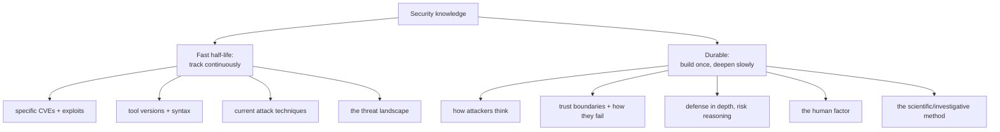
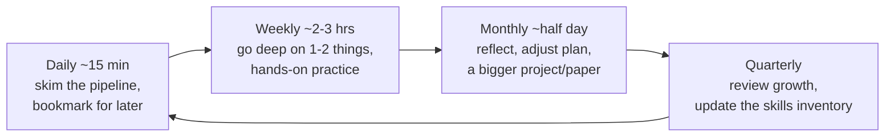
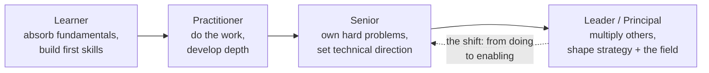
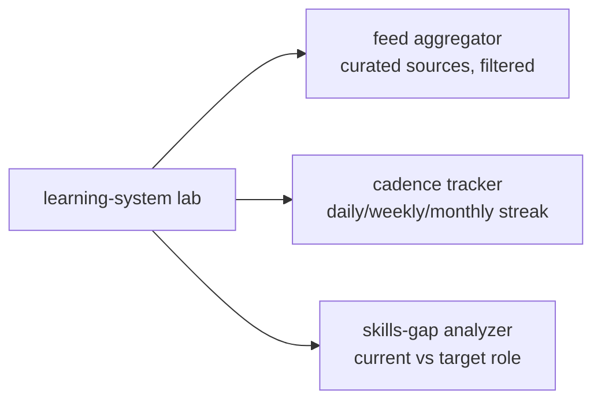

**Level:** Expert · **Track:** Career · **Read time:** 275 min

This is the final chapter of the Career Mastery notebook and the last chapter of the core curriculum, and it is the one that determines whether everything before it has a lasting return. The previous four chapters took you from choosing a path to landing a role. This one is about the forty years after that — because security is not a body of knowledge you learn once and then apply, but a moving target you have to track for the length of a career, and the practitioners who thrive are not the ones who knew the most on the day they were hired, but the ones who kept learning long after everyone around them stopped.

That is not a motivational flourish; it is a structural fact about the field. The specific techniques, tools, and vulnerabilities you learned in the preceding forty-four notebooks have a *half-life*. Some of what is cutting-edge today will be obsolete in five years, defended-against in ten, and a historical footnote in twenty. A practitioner who learned to exploit a particular class of bug in 2015 and never updated is, by 2027, working with a museum piece. The field does not wait, and the gap between someone who keeps current and someone who coasts widens every single year — quietly at first, then decisively.

But the counterweight is equally structural and far more hopeful: **the fundamentals are durable.** The way an attacker thinks, the way trust boundaries fail, the way humans are the weak link, the way defence-in-depth works, the way you reason about risk — these change slowly if at all, and they are exactly what this curriculum spent forty-four notebooks building. So this chapter is about the discipline that sits on top of that durable foundation: how to track the fast-moving surface *efficiently* (without drowning), how to keep learning *sustainably* (without burning out), how to *contribute back* (which is the fastest way to learn), and how to do all of it *ethically* across a career where your capabilities only grow. It is, in a sense, the meta-skill the whole curriculum was building toward: not knowing security, but knowing how to keep knowing it.

## Why This Matters

The economic argument is stark. Security skills depreciate, and a career is long. A practitioner who stops learning does not stay in place — they slide backwards relative to a field that keeps moving, and within a decade the slide is the difference between being sought-after and being obsolete. Conversely, the practitioner who compounds their learning over a career reaches a level that no amount of front-loaded study can match, because expertise in a moving field is *accumulated*, not acquired. The habits this chapter builds are the difference between a career that plateaus early and one that keeps climbing.

But the deeper argument is about what security *is*. This is an adversarial field: on the other side are human beings who are actively, creatively, and continuously inventing new attacks, and a defender who stops learning is a defender the adversary has already outrun. Notebook 34's threat intelligence, Notebook 32's detection engineering, and Notebook 30's red teaming all rest on the assumption that the practitioner is tracking a live, evolving threat — and that tracking is a *skill*, not an accident. Staying current is not professional development in the HR sense; it is the core competency of a field defined by an adversary who never stops.

And there is a stewardship argument that the final chapter of a security curriculum should make plainly. The people who read forty-four notebooks and reach this one are becoming the practitioners who will define the field's ethics, mentor its next generation, and decide — case by case — how to wield capabilities that can protect or harm. The habits of lifelong learning, genuine community participation, and ethical responsibility are not just how you sustain *your* career; they are how the field itself stays healthy. The last thing this curriculum has to teach is that you are now part of the community that keeps the whole thing honest and moving forward — and that is a responsibility as much as an opportunity.

## Part 1: The Half-Life of Knowledge, and What Endures

The foundation of a sustainable learning strategy is knowing what depreciates fast and what lasts, because you should track the two completely differently.



The distinction, made concrete:

**Fast half-life — track continuously, hold loosely.** Specific vulnerabilities (a CVE is urgent this month and historical next year), tool syntax and versions (the flags change, tools get replaced), the current fashionable attack technique, and the live threat landscape. This is the *surface*, and you track it through the intelligence pipeline of Part 2 — not by memorising it, but by knowing where to look and recognising the *pattern* a new technique instantiates.

**Durable — build once, deepen forever.** The adversarial mindset (how an attacker approaches an unknown target — the whole of Notebook 43's methodology), how trust boundaries are established and how they fail (the core of Notebooks 42 and 45), defence-in-depth and risk reasoning (Notebooks 3, 4, 42), the human factor (Notebook 28), and the investigative method (Notebook 33, and every debugging chapter). These change slowly, transfer across every specific technology, and are what let you *learn the next thing fast* — because a new attack is almost always an old pattern in new clothes.

The strategic consequence is the single most important idea in this chapter: **invest your deep learning in the durable fundamentals, and track the fast surface efficiently rather than trying to memorise it.** A practitioner grounded in the fundamentals can pick up a new tool in an afternoon and recognise a new attack class as a variation of one they understand; a practitioner who only ever learned specifics has to relearn from scratch every time the surface shifts. The fundamentals are the leverage; the surface is the application. This is also why the curriculum spent forty-four notebooks on fundamentals — they are the part with the longest return.

## Part 2: Building a Personal Intelligence Pipeline

You cannot track the fast-moving surface by consuming everything — the volume is infinite and most of it is noise. You need a *curated pipeline*: a deliberate set of sources, tiered by type, filtered for signal, and consumed on a sustainable cadence.

The source tiers, each covering a different part of the surface:

| Tier | What it gives you | Examples of type |
|---|---|---|
| **Research / primary** | The deepest, earliest signal | Academic papers, vendor security research blogs, conference proceedings (Black Hat, DEF CON, USENIX, Real World Crypto) |
| **Advisories / threat intel** | What is being exploited *now* | CISA KEV, vendor advisories, CERT bulletins, the threat-intel feeds of Notebook 34 |
| **Practitioner voices** | Applied, real-world perspective | Respected researchers' blogs, curated newsletters, technical write-ups |
| **Community / discussion** | Emerging trends, the zeitgeist | Curated subreddits, Mastodon/security social, Discord/Slack communities, tool changelogs |
| **Aggregators** | Efficient breadth | Newsletters that pre-filter (tl;dr sec, This Week in Security), a personal RSS reader |

The principles that keep the pipeline useful rather than overwhelming:

**Curate ruthlessly; quality over quantity.** A small set of high-signal sources you actually read beats a hundred you skim guiltily. The goal is not to see everything — that is impossible and the attempt causes the burnout of Part 8 — but to see the *important* things, and a few excellent aggregators plus a handful of trusted primary sources achieve that.

**Use aggregators as force multipliers.** A good curated newsletter is a human expert filtering the firehose *for* you, which is enormously efficient. Lean on them for breadth, and reserve your direct attention for the primary sources in your specialism.

**Match the source to the half-life.** Track the fast surface (Part 1) through advisories and community; deepen the durable fundamentals through research and books. Do not try to keep up with every CVE in detail — track the *pattern* of what is being exploited, and go deep only on what touches your work.

**Tune the pipeline continuously.** A source that stops delivering signal gets cut; a new voice worth following gets added. The pipeline is a living system, and pruning it is as important as feeding it — an unpruned feed becomes noise, and noise trains you to ignore the feed entirely.

The output of a good pipeline is not "I read everything" but "I reliably hear about the things that matter to my work, efficiently, without drowning" — which is exactly what a sustainable career requires.

## Part 3: A Sustainable Learning Cadence

Knowing *what* to track is half the problem; the other half is a *rhythm* that fits alongside a full-time job and a life, sustained over years rather than sprinted for a month and abandoned.



A cadence that actually holds:

**Daily (~15 minutes).** A quick skim of the curated pipeline (Part 2) — headlines and summaries, bookmarking anything worth a deeper look. The point is *awareness*, not depth: you are keeping the surface in view, not studying it. Fifteen minutes is sustainable indefinitely; an hour a day is not, and the person who tries the hour burns out and does zero.

**Weekly (~2–3 hours).** Go *deep* on one or two things from the week's bookmarks — read the actual paper, reproduce the technique in your lab (Chapter 3), read the code. This is where learning actually happens; skimming builds awareness, but doing builds skill. One thing understood deeply per week compounds enormously over a year.

**Monthly (~half a day).** Step back: reflect on what you have learned, adjust your learning plan and pipeline, and take on a bigger piece — a substantial paper, a research reproduction, a project, a course module. This is also when you prune the pipeline and course-correct.

**Quarterly.** Review your growth against your development plan (Part 10), update your skills inventory, and reset goals. This is the loop that turns scattered consumption into deliberate progress.

The meta-principle, echoing Notebook 43's sustainability chapter: **consistency beats intensity.** Fifteen minutes daily and a focused weekly deep-dive, held for years, vastly outperforms occasional heroic binges followed by long gaps. The learners who last are the ones who found a rhythm they could sustain, protected it, and let it compound — not the ones who sprinted, burned out, and quit. Design the cadence for the version of you on a tired Wednesday, not the motivated version on a fresh Sunday.

## Part 4: Going Deep — Primary Sources, Reproduction, and Reading Code

Skimming keeps you aware; *depth* is what makes you good, and depth comes from three practices that most practitioners avoid because they are harder than reading a summary.

**Read primary sources, not just summaries.** A blog post *about* a technique is a compressed, lossy, sometimes-wrong secondhand account. The original paper, the actual advisory, the researcher's own write-up contains the detail, the caveats, and the *reasoning* that the summary strips out. Reading primary sources is slower and harder, and it is where real understanding lives — the practitioner who reads the paper understands the technique's boundaries and assumptions that the summary-reader never sees. Build the muscle of reading academic papers (start with the abstract, conclusion, and figures; read the whole thing for the ones that matter); it is a skill that improves with practice and pays off for a career.

**Reproduce the research.** The single highest-return deep-learning activity is taking a technique you read about and *making it work yourself* in your lab (Chapter 3). Reading that a bug class exists gives you awareness; reproducing an exploit gives you understanding you cannot get any other way, because reproduction forces you to confront every detail the write-up glossed over. This is also how you verify claims (much published work is subtly wrong or environment-specific) and how you build the portfolio evidence (Chapter 3) and the writeups (Notebook 43) that advance your career. Reproduction is where reading becomes skill.

**Read code.** Reading the source of the tools you use, the vulnerabilities you study, and the systems you defend teaches more than almost any other activity, because code is ground truth — it does exactly what it says, with no summary in between. Reading a tool's source demystifies it; reading a vulnerable codebase trains the pattern-recognition that Notebooks 45 and 46 are built on; reading a well-written security tool teaches you how experts structure real code. Make reading code a regular habit, not a last resort.

The through-line: **depth requires doing the hard version.** Summaries, tutorials, and videos are efficient for awareness and a fine starting point, but they plateau you at "I have heard of this." The practitioners who go beyond that plateau are the ones who read the paper, reproduced the exploit, and read the source — and that willingness to do the harder version is, over a career, the largest single differentiator between competent and exceptional.

## Part 5: Contributing Back — The Fastest Way to Learn

The counterintuitive truth of this chapter is that **teaching, writing, and building for others is the fastest way to learn for yourself.** Contribution is not something you do *after* you have learned enough; it is one of the most effective learning methods there is, available from day one.

The mechanisms and forms:

**Writing forces understanding.** You cannot write a clear explanation of something you only half-understand — the act of writing exposes every gap, every hand-wave, every place you were relying on vibes instead of comprehension. This is why the writeups of Notebook 43 and Chapter 3 are both portfolio *and* learning: writing the writeup is where you discover what you actually understood. Blog, write writeups, document your projects — the reader benefits, and *you* benefit more.

**Teaching is the strongest test of knowledge.** Explaining a concept to someone else — answering a question in a community, mentoring a junior, giving a talk — reveals instantly whether you truly know it, because a learner's follow-up questions probe exactly the parts you glossed over. The old saw that you do not really understand something until you can teach it is true, and teaching is therefore not just generous but selfishly valuable.

**Open source contribution teaches real-world engineering.** Contributing to a security tool — fixing a bug, adding a feature, improving documentation — puts you inside a real codebase with real collaboration, teaching you how production security software is actually built and reviewed (Chapter 3, Part 8). It is learning-by-doing on real work, with expert feedback attached.

**Speaking builds depth and confidence.** Preparing a talk forces you to understand a topic thoroughly enough to present it and to anticipate questions — a level of preparation that produces deep understanding as a byproduct. And it builds the communication skill and the visibility (Chapter 4) that advance a career. Local meetups and BSides actively want new speakers; the barrier is lower than it feels.

**Mentoring completes the loop.** As you gain experience, mentoring the next generation is both a responsibility (Part 9) and a learning method — a mentee's questions keep you sharp, force you to articulate what you know, and often teach you things you had never questioned. The best senior practitioners mentor not only out of generosity but because it keeps *them* learning.

The mindset shift: contribution is not a tax you pay once you are expert; it is a *learning accelerator* you can use immediately, that also happens to build your portfolio, your network, and the field itself. The practitioners who learn fastest are, almost universally, the ones who teach, write, and build in public — because every act of contribution is an act of learning under pressure.

## Part 6: The Community as Career Infrastructure

The security community is not a nicety; it is *infrastructure* for a career — the source of your intelligence pipeline, your network, your opportunities, your feedback, and your sanity. Participating genuinely in it is one of the highest-return investments you can make, and it compounds over decades.

What the community provides, concretely:

- **Intelligence** — the community *is* a large part of the Part 2 pipeline; trends surface in community discussion before they reach formal channels.
- **Network** — the referrals (Chapter 4), the collaborators, the future colleagues, the people who vouch for you. A career's worth of opportunities flows through relationships built in the community.
- **Feedback and calibration** — the community is how you tell whether your work is good, whether your understanding is right, and where the field's standards actually sit. In isolation you cannot calibrate; in community you can.
- **Support and belonging** — security can be isolating and stressful (Part 8), and a community of peers who understand the work is a genuine support structure that sustains people through hard stretches.

How to participate genuinely (the emphasis is on *genuinely*, because transactional participation is transparent and self-defeating):

- **Contribute more than you extract.** The people who get the most from a community are the ones who give the most to it — answering questions, sharing work, helping newcomers, doing the unglamorous organising. A community relationship built on giving is durable; one built on taking collapses the moment you need something.
- **Be a good citizen.** The security community has strong norms — around responsible disclosure, around not being a jerk, around crediting others' work, around welcoming newcomers. Uphold them. Your reputation in a small, long-memoried field is built over years and can be damaged in a moment.
- **Find your corners.** The "security community" is really many overlapping communities — by specialism, by region, by platform, by identity. Find the corners that fit you, invest in them, and let breadth come naturally from there. You do not have to be everywhere; you have to be *present and genuine* somewhere.
- **Welcome the next people in.** You were a beginner once (perhaps you are one now, reading this). The community stays healthy when experienced people make room for newcomers, and being that welcoming presence is both good citizenship and, not coincidentally, how you build the relationships and reputation that a long career runs on.

The framing to carry from the whole of Chapters 3–5: your career is not a solo climb but a decades-long participation in a community, and the practitioners who thrive are the ones who understand that and invest in the community as seriously as they invest in their skills.

## Part 7: Tracking the Landscape — Where the Field Is Going

Staying current means tracking not just individual techniques but the *tectonic shifts* — the large movements that reshape what security work is. Several are live right now, and this curriculum's later notebooks were built to prepare you for them.

**AI's double impact.** Artificial intelligence is simultaneously a new attack surface, a new tool for attackers, and a new tool for defenders — and it is the largest current shift in the field. On offence: AI accelerates reconnaissance, phishing, vulnerability discovery, and exploit development, and AI systems themselves are attackable (prompt injection, model extraction, data poisoning — Notebook 39). On defence: AI augments detection, triage, and analysis. The practitioner who ignores this shift will be outpaced by both attackers and colleagues who embrace it; the one who understands both sides — AI as target, AI as weapon, AI as tool — is positioned for the next decade. This is the single most important landscape trend to track, and it is early enough that understanding it now is a durable advantage.

**Shift-left and DevSecOps.** Security is moving *earlier* — into design, into code, into the pipeline — rather than being bolted on before release. This is the entire premise of Notebooks 45 and 46 (product security, secure code review, DevSecOps), and it represents a structural change in where security work happens and who does it. The future has security embedded in engineering, not siloed beside it.

**Cloud-native and the dissolving perimeter.** The shift to cloud, containers, serverless, and infrastructure-as-code (Notebook 37) has dissolved the old perimeter and created entirely new attack surfaces and defensive models — which is exactly why zero trust (Notebook 42) became necessary. The practitioner grounded in on-premise models alone is working with a shrinking part of the field.

**The post-quantum transition.** The slow-motion migration to quantum-resistant cryptography (Notebook 40) is a multi-decade shift already underway ("harvest now, decrypt later" makes it urgent for long-lived secrets today), and it will reshape a large part of the cryptographic landscape over a career.

**The regulatory and privacy tide.** The expanding web of privacy and security regulation (Notebook 42) is making compliance and privacy engineering a permanent, growing part of security work rather than a specialist niche.

The meta-skill is not predicting the future precisely — nobody can — but **staying attuned to the tectonic shifts and positioning yourself ahead of them rather than behind.** The fundamentals (Part 1) let you adapt to whatever comes; tracking the landscape tells you *where to point* that adaptability. A practitioner who understands both is durable against a future that will certainly surprise everyone.

## Part 8: Sustainability — Burnout, the Firehose, and Impostor Syndrome

A career is a marathon, and the practitioners who last are the ones who manage the three chronic hazards of this field: burnout, the overwhelming volume of information, and the persistent feeling of not being good enough. Ignoring these is not toughness; it is how promising careers end early.

**Burnout is a real, structural risk in security.** The work is adversarial and never "done," the stakes feel high, the on-call and incident load can be brutal (Notebook 33), and the culture sometimes glorifies overwork. The practitioners who have long careers treat sustainability as a professional skill: they set boundaries, they rest, they recognise that a rested practitioner outperforms an exhausted one, and they refuse the myth that burning out is a badge of dedication. Notebook 43's sustainability lessons apply to the whole career, not just to CTFs — pace for decades, not for this quarter.

**The firehose is infinite; make peace with missing things.** There is more security content produced every day than anyone could consume in a lifetime, and the feeling that you are falling behind is *structurally guaranteed* — it is not a personal failing, it is arithmetic. The response is not to consume more (that way lies burnout) but to accept that you *will* miss things, trust your curated pipeline (Part 2) to surface what matters, and let the rest go. The practitioners who are at peace are the ones who stopped trying to see everything and started trusting their filter.

**Impostor syndrome is nearly universal in security, and worth naming.** The field is vast, adversarial, and full of visibly brilliant people, so almost everyone — including the people you admire — feels, at least sometimes, that they do not really know enough and will be found out. This feeling is not evidence that you are unqualified; it is evidence that you understand how much there is to know, which is itself a form of competence (the incompetent, notoriously, feel confident). The response is not to wait until the feeling goes away (it does not, even for experts) but to act despite it: contribute, apply, speak, ship — the feeling persists, and you build a career anyway. Naming it, normalising it, and recognising that the people around you feel it too is a large part of managing it.

The unifying idea: **your career is a system that has to be sustainable to compound.** All the learning, contribution, and growth in this chapter only pays off if you are still in the field in twenty years, still curious, still well. Protecting your sustainability — your rest, your boundaries, your relationship with the firehose, your self-compassion about impostor feelings — is not separate from your professional development; it is the precondition for it.

## Part 9: Career-Stage Evolution and Ethics as a Lifelong Practice

A security career is not static; the skills that make you effective evolve as you move through stages, and the ethical responsibilities *grow* as your capabilities do.

**The career-stage arc** (which Chapter 1's role map feeds into):



- **Learner → Practitioner**: the transition this curriculum has prepared you for — from absorbing fundamentals to doing real work and developing depth in a specialism.
- **Practitioner → Senior**: from executing to *owning* — taking the hard, ambiguous problems, setting technical direction, being the person others come to. Depth in a specialism plus enough breadth to see the whole picture.
- **Senior → Leader/Principal**: the hardest shift, because it changes what "good work" means — from *doing* the work yourself to *multiplying* others (mentoring, setting strategy, shaping teams and the field). Many excellent practitioners struggle here because it requires giving up the hands-on identity that made them successful.

**The T-shaped model** answers the specialist-versus-generalist question that recurs across a career: go **deep** in one or two areas (the vertical bar — your specialism, your credibility) while maintaining **broad** competence across the field (the horizontal bar — enough to collaborate, see connections, and adapt). Pure specialists are fragile when the field shifts; pure generalists lack the depth that creates value; the T-shape is durable. This curriculum built your horizontal bar across forty-four notebooks; your career is where you grow the vertical bar in the areas that fit you.

**Ethics as a lifelong practice — and a growing responsibility.** Notebook 8 taught the ethical foundations; this chapter closes the curriculum by insisting that ethics is not a one-time lesson but a *practice* that deepens as your power does:

- **Responsible disclosure** is a lifelong discipline — as you find real vulnerabilities in real systems over a career, how you handle that (coordinated disclosure, giving vendors time, prioritising users' safety over your own glory) defines your reputation and the field's health.
- **The dual-use burden grows with your skill.** Everything in this curriculum can protect or harm, and the more capable you become, the more that capability matters. The senior practitioner holds power that the learner did not, and wields it under greater responsibility — to use it only where authorised (Chapter 3's non-negotiable rule, for life), to consider the human impact, and to refuse work that crosses ethical lines.
- **Stewardship of the field.** As you become experienced, you become one of the people who *sets* the norms — through how you mentor, what you tolerate, what you build, and how you disclose. The field's ethics are not handed down from on high; they are enacted, continuously, by its practitioners. You are now one of them.

The closing responsibility this curriculum leaves you with: the capabilities you have built are real, they are powerful, and they carry a duty that grows for as long as your career does. Wield them to protect, to build, and to leave the field better than you found it.

## Part 10: Measuring Your Own Growth

Lifelong learning without measurement drifts; a light structure turns decades of consumption into deliberate, visible progress. The tools are a development plan, a skills inventory, and the deliberate-practice loop.

**A personal development plan** — a simple, living document stating where you are, where you want to be (the next stage, Part 9; the specialism you are deepening, the role you are targeting from Chapter 1), and the concrete steps between. Revisited quarterly (Part 3), it is what keeps your learning pointed at *your* goals rather than drifting with whatever crossed your feed this week. It need not be elaborate; it needs to exist and be revisited.

**A skills inventory** — an honest map of what you know, at what depth, across the field. Rating your competence across domains (the curriculum's notebooks are a ready taxonomy) surfaces your gaps and your strengths, and comparing it against the requirements of your target role (Chapter 1, Chapter 4) turns "I should learn more" into "I have a specific gap in X that I will close by Y." The honesty is the hard part and the valuable part — an inventory that flatters you is useless.

**The deliberate-practice loop**, applied to a career (Notebook 43, Chapter 8): identify the edge of your ability, work just past it, get feedback, adjust, repeat. Growth happens at the edge, not in the comfortable middle — the practitioner who only ever does what they are already good at stops improving. Deliberately choosing work, learning, and contribution that stretches you (a harder problem, an unfamiliar domain, a talk that scares you) is how the edge keeps moving outward over a career.

The closing loop of the whole system: the pipeline (Part 2) feeds awareness, the cadence (Part 3) turns awareness into learning, depth and contribution (Parts 4–5) turn learning into skill, the community (Part 6) provides feedback and opportunity, and measurement (this part) keeps the whole thing pointed at your goals and honest about your progress. Run for years, this system compounds into an expertise that no burst of study could ever produce — which is the entire promise of lifelong learning, and the note this curriculum closes on.

## Part 11: Hands-On Lab — Feed Aggregator, Cadence Tracker, and Skills-Gap Analyzer

### 11.1 What we are building

Three tools that operationalise the chapter: a **curated feed aggregator** (Part 2), a **learning-cadence tracker** (Part 3), and a **skills-gap analyzer** (Part 10). This is the personal learning system, built as code you can actually run.



Python 3 only (the aggregator uses the standard library; no network is required for the demo).

### 11.2 A curated feed aggregator

```python
# feed.py -- a curated, tiered, filtered intelligence pipeline (Part 2).
# In real use this fetches RSS; here we use a fixed sample so it runs offline.
SOURCES = {
    "research":     ["Project Zero blog", "USENIX Security", "Real World Crypto"],
    "advisories":   ["CISA KEV", "vendor advisories"],
    "practitioner": ["tl;dr sec", "This Week in Security"],
    "community":    ["r/netsec (curated)", "security Mastodon"],
}
# Sample items (title, tier, keywords) -- stand-in for fetched feed entries.
ITEMS = [
    ("New Kubernetes RBAC escalation technique", "research", ["cloud","k8s","rbac"]),
    ("Actively exploited RCE in popular library", "advisories", ["rce","supply-chain"]),
    ("Prompt injection in production LLM agents", "research", ["ai","llm","injection"]),
    ("Yet another crypto bro loses funds", "community", ["crypto","noise"]),
    ("Deep dive: modern heap exploitation", "practitioner", ["pwn","heap"]),
]
# YOUR interests -- the filter that turns a firehose into signal (Part 2).
INTERESTS = {"cloud", "ai", "llm", "rce", "supply-chain", "pwn"}
NOISE = {"noise"}

def digest():
    print("=== curated pipeline ===")
    for tier, srcs in SOURCES.items():
        print(f"  [{tier}] {', '.join(srcs)}")
    print("\n=== today's filtered digest ===")
    shown = 0
    for title, tier, kws in ITEMS:
        tags = set(kws)
        if tags & NOISE:                       # prune noise
            continue
        relevant = bool(tags & INTERESTS)
        mark = "**" if relevant else "  "
        if relevant:                            # signal -> surface it
            print(f"  {mark} [{tier:11}] {title}   ({', '.join(tags & INTERESTS)})")
            shown += 1
    print(f"\n{shown} relevant items surfaced (noise filtered, off-interest hidden)")

digest()
```

```bash
python3 feed.py

# Sample output:
# === curated pipeline ===
#   [research] Project Zero blog, USENIX Security, Real World Crypto
#   [advisories] CISA KEV, vendor advisories
#   [practitioner] tl;dr sec, This Week in Security
#   [community] r/netsec (curated), security Mastodon
#
# === today's filtered digest ===
#   ** [research    ] New Kubernetes RBAC escalation technique   (cloud)
#   ** [advisories  ] Actively exploited RCE in popular library   (rce, supply-chain)
#   ** [research    ] Prompt injection in production LLM agents   (ai, llm)
#   ** [practitioner] Deep dive: modern heap exploitation   (pwn)
#
# 4 relevant items surfaced (noise filtered, off-interest hidden)
```

The filter is the point: five items in, four signal items out, the noise dropped and the off-interest items hidden. That is Part 2's "see the important things, not everything" made mechanical — swap `ITEMS` for a real RSS fetch and it becomes your actual pipeline.

### 11.3 A learning-cadence tracker

```python
# cadence.py -- track the daily/weekly/monthly rhythm and the streak (Part 3).
import json, os, sys
from datetime import date, datetime, timedelta

DB = "cadence.json"
def load(): return json.load(open(DB)) if os.path.exists(DB) else {"log": []}
def save(d): json.dump(d, open(DB, "w"), indent=1)

def log_session(kind, note):
    d = load()
    d["log"].append({"date": date.today().isoformat(), "kind": kind, "note": note})
    save(d); print(f"logged {kind}: {note}")

def report():
    d = load()
    if not d["log"]:
        print("no sessions logged yet"); return
    days = {e["date"] for e in d["log"]}
    # Streak: consecutive days up to today with any logged session.
    streak, cur = 0, date.today()
    while cur.isoformat() in days:
        streak += 1; cur -= timedelta(days=1)
    kinds = {}
    for e in d["log"]:
        kinds[e["kind"]] = kinds.get(e["kind"], 0) + 1
    print(f"current daily streak: {streak} day(s)")
    print("sessions by type:")
    for k in ("daily", "weekly", "monthly"):
        print(f"  {k:8}: {kinds.get(k,0)}")
    # Consistency check (Part 3: consistency beats intensity).
    weeklies = kinds.get("weekly", 0)
    print(f"\n{'[x]' if weeklies >= 1 else '[ ]'} at least one deep weekly session logged")
    print("reminder: 15 min daily + one deep weekly beats occasional binges")

if __name__ == "__main__":
    cmd, *args = sys.argv[1:] or ["report"]
    if cmd == "log": log_session(args[0], " ".join(args[1:]))
    else: report()
```

```bash
python3 cadence.py log daily "skimmed pipeline, bookmarked the LLM-injection paper"
python3 cadence.py log weekly "reproduced the prompt-injection PoC in my lab"
python3 cadence.py log daily "read CISA KEV, one advisory relevant to work"
python3 cadence.py report

# Sample output:
# logged daily: skimmed pipeline, bookmarked the LLM-injection paper
# logged weekly: reproduced the prompt-injection PoC in my lab
# logged daily: read CISA KEV, one advisory relevant to work
# current daily streak: 1 day(s)
# sessions by type:
#   daily   : 2
#   weekly  : 1
#   monthly : 0
#
# [x] at least one deep weekly session logged
# reminder: 15 min daily + one deep weekly beats occasional binges
```

The tracker makes the Part 3 cadence visible and rewards the behaviour that compounds — a daily streak plus real weekly depth — rather than sporadic bingeing.

### 11.4 A skills-gap analyzer

```python
# skills.py -- honest current-vs-target skills inventory (Part 10).
# Rate 0-5 across domains (the curriculum's notebooks are the taxonomy).
CURRENT = {
    "web-appsec": 4, "network-pentest": 3, "crypto": 3, "reversing": 2,
    "binary-exploitation": 2, "cloud-security": 2, "detection-blue-team": 1,
    "ai-ml-security": 1, "reporting-communication": 3,
}
# Target: a "Product Security Engineer" role (Chapter 1, Notebook 45).
TARGET = {
    "web-appsec": 4, "network-pentest": 2, "crypto": 3, "reversing": 3,
    "binary-exploitation": 3, "cloud-security": 4, "detection-blue-team": 2,
    "ai-ml-security": 3, "reporting-communication": 4,
}

def analyze():
    print(f"{'DOMAIN':<24} {'NOW':>3} {'TGT':>3} {'GAP':>3}  PRIORITY")
    print("-" * 56)
    gaps = []
    for k in TARGET:
        now, tgt = CURRENT.get(k, 0), TARGET[k]
        gap = max(0, tgt - now)
        gaps.append((gap, k))
        bar = "!" * gap if gap else "ok"
        print(f"{k:<24} {now:>3} {tgt:>3} {gap:>3}  {bar}")
    print("-" * 56)
    biggest = sorted(gaps, reverse=True)[:3]
    print("top 3 gaps to close (the development-plan targets):")
    for gap, k in biggest:
        if gap: print(f"  - {k}  (needs +{gap})")

analyze()
```

```bash
python3 skills.py

# Sample output:
# DOMAIN                   NOW TGT GAP  PRIORITY
# --------------------------------------------------------
# web-appsec                 4   4   0  ok
# network-pentest            3   2   0  ok
# crypto                     3   3   0  ok
# reversing                  2   3   1  !
# binary-exploitation        2   3   1  !
# cloud-security             2   4   2  !!
# detection-blue-team        1   2   1  !
# ai-ml-security             1   3   2  !!
# reporting-communication    3   4   1  !
# --------------------------------------------------------
# top 3 gaps to close (the development-plan targets):
#   - cloud-security  (needs +2)
#   - ai-ml-security  (needs +2)
#   - reporting-communication  (needs +1)
```

The analyzer turns "I should learn more" into a ranked, specific development plan (Part 10): for this target role, cloud security and AI/ML security are the priority gaps, so the next quarter's deep-learning (Part 4) and practice (Chapter 3) point there. The honesty of the `CURRENT` ratings is what makes it useful.

### 11.5 Extending the lab

Wire `feed.py` to a real RSS reader over your actual curated sources and run it as a daily digest; extend `cadence.py` to track monthly and quarterly reviews and to nudge you when a streak breaks; turn `skills.py` into a living document you re-rate quarterly and chart over time to *see* your growth; add a "reproduction log" that records each technique you reproduced in your lab (Part 4, Chapter 3) as portfolio evidence; and build a simple "development plan" file that ties the top skills-gaps to concrete quarterly goals and revisits them on the Part 3 cadence.

## Part 12: Common Pitfalls

**Learning only specifics, never fundamentals.** Specifics have a short half-life; the practitioner who only ever learned techniques relearns from scratch every time the surface shifts. Invest deep learning in the durable fundamentals.

**Trying to consume everything.** The firehose is infinite and the attempt causes burnout. Curate a small high-signal pipeline, trust it, and let the rest go.

**Intensity over consistency.** Heroic binges followed by long gaps lose to fifteen minutes daily and a focused weekly deep-dive sustained for years. Design the cadence for a tired Wednesday.

**Only skimming, never going deep.** Summaries plateau you at "I have heard of this." Read primary sources, reproduce research, and read code — the harder version is where skill lives.

**Waiting to be "expert enough" to contribute.** Contribution is a learning *accelerator* available from day one, not a tax you pay later. Writing, teaching, and building are among the fastest ways to learn.

**Treating the community as a job-board, not infrastructure.** Transactional participation is transparent and self-defeating. Contribute more than you extract; the relationships are a career's worth of value.

**Ignoring the tectonic shifts.** The practitioner who missed AI, cloud-native, or shift-left is working with a shrinking part of the field. Track the landscape, not just the techniques.

**Neglecting sustainability.** Burnout ends careers; the firehose is infinite; impostor syndrome is universal. Managing these is a professional skill, not a weakness — a career only compounds if you are still in it.

**Learning without measurement.** Decades of consumption without a development plan or skills inventory drifts. Measure honestly, point your learning at your goals, and work at the edge of your ability.

**Assuming ethics was a one-time lesson.** The dual-use burden *grows* with your skill. Responsible disclosure, authorised-only practice, and stewardship of the field are lifelong practices, not a chapter you passed.

## Final Revision / Summary

- Security is a **lifelong-learning field**: specific knowledge has a **short half-life** (CVEs, tools, techniques, the threat landscape) while the **fundamentals endure** (the adversarial mindset, trust boundaries, defence-in-depth, the human factor, the investigative method). **Invest deep learning in the durable fundamentals and track the fast surface efficiently** — the fundamentals are the leverage that lets you learn the next thing fast.
- Build a **curated intelligence pipeline** tiered across research/primary, advisories, practitioner voices, community, and aggregators. **Curate ruthlessly** (quality over quantity), lean on aggregators as force multipliers, match the source to the half-life, and prune continuously. The goal is to reliably hear what matters, not to see everything.
- Sustain a **cadence**: ~15 min daily (awareness), 2–3 hrs weekly (depth — read the paper, reproduce it, read code), a monthly half-day (reflect, adjust, a bigger piece), quarterly review. **Consistency beats intensity** — design it for a tired Wednesday.
- **Depth requires the hard version**: read **primary sources** not summaries, **reproduce research** in your lab (the highest-return deep-learning activity), and **read code** (ground truth). This is the largest single differentiator between competent and exceptional.
- **Contributing back is the fastest way to learn**: writing forces understanding, teaching is the strongest test of knowledge, open-source teaches real engineering, speaking builds depth, mentoring keeps you sharp. Contribution is a learning *accelerator* available from day one, not a tax paid later.
- The **community is career infrastructure** — intelligence, network, feedback, and support. Participate **genuinely**: contribute more than you extract, be a good citizen (disclosure norms, credit, welcoming newcomers), find your corners, and make room for the next people in.
- **Track the tectonic shifts**, not just techniques: **AI's double impact** (attack surface, attacker tool, defender tool — the biggest current shift), **shift-left/DevSecOps** (Notebooks 45–46), **cloud-native and the dissolving perimeter** (Notebook 37, driving zero trust), the **post-quantum transition** (Notebook 40), and the **privacy/regulatory tide** (Notebook 42). Position ahead of the shifts, not behind.
- **Sustainability is a professional skill**: burnout is a structural risk (pace for decades), the **firehose is infinite** (make peace with missing things and trust your filter), and **impostor syndrome is near-universal** (act despite it — it does not go away even for experts). A career only compounds if you are still in it and well.
- Careers **evolve** through learner → practitioner → senior → leader (the hardest shift: from doing to multiplying others), and the **T-shape** (deep in 1–2 areas, broad across the field) is the durable answer to specialist-vs-generalist.
- **Ethics is a lifelong practice that deepens as your power grows**: responsible disclosure, authorised-only action (Chapter 3's rule, for life), the dual-use burden, and **stewardship of the field** — you are now one of the practitioners who *enacts* its norms.
- **Measure your growth** with a development plan, an honest skills inventory (gaps vs your target role), and the deliberate-practice loop (work at the edge of your ability). The full system — pipeline → cadence → depth/contribution → community → measurement — compounds over years into an expertise no burst of study can match.
- **This closes the curriculum.** The capabilities you have built across forty-five notebooks are real and powerful; wield them to protect, to build, and to leave the field better than you found it.

## Cheat Sheet / Quick Reference

**Half-life triage**

```
FAST (track, hold loosely): CVEs, tool syntax, current techniques, threat landscape
DURABLE (build once, deepen): attacker mindset, trust boundaries, defense-in-depth,
                              risk reasoning, the human factor, the investigative method
-> deep-learn the durable; track the fast efficiently
```

**Intelligence pipeline (curate ruthlessly)**

```
research/primary | advisories/threat-intel | practitioner | community | aggregators
principle: see the IMPORTANT things, not everything | prune continuously
```

**Learning cadence (consistency > intensity)**

```
daily ~15m   : skim + bookmark (awareness)
weekly ~2-3h : go DEEP on 1-2 (read paper, REPRODUCE, read code)
monthly ~half day: reflect, adjust, a bigger piece
quarterly    : review growth, update skills inventory
```

**Depth = the hard version**

```
read PRIMARY sources (not summaries) | REPRODUCE research in your lab | READ CODE
```

**Contribute to learn (from day one)**

```
writing forces understanding | teaching tests knowledge | OSS = real engineering
speaking builds depth | mentoring keeps you sharp
```

**Landscape shifts to track**

```
AI (attack surface + attacker tool + defender tool -- the biggest) | shift-left/DevSecOps
cloud-native + dissolving perimeter -> zero trust | post-quantum | privacy/regulation
```

**Sustainability**

```
burnout is structural -> pace for DECADES | firehose is infinite -> trust your filter
impostor syndrome is universal -> act despite it (it doesn't leave, even for experts)
```

**Career arc + T-shape**

```
learner -> practitioner -> senior -> leader (doing -> MULTIPLYING others)
T-shape: DEEP in 1-2, BROAD across the field
ethics deepens as power grows: disclosure, authorised-only, stewardship
```

**Measure growth**

```
development plan (where you're going) | honest skills inventory (gaps vs target role)
deliberate practice (work at the EDGE of your ability)
```

## Practice Labs & Resources

**Build your learning system**
- Assemble a **curated pipeline** (Part 2): a few primary sources in your specialism, one or two aggregator newsletters (tl;dr sec, This Week in Security), CISA KEV for advisories, and a couple of community corners. Prune anything that stops delivering signal.
- Set up an **RSS reader** and wire the Part 11 aggregator to your real sources for a daily filtered digest.
- Start a **cadence tracker** and a **skills inventory** (Part 11), and revisit both quarterly.

**Go deep**
- Pick one recent piece of security research and **reproduce it** in your home lab (Chapter 3) — the single highest-return learning activity.
- Read one **primary source** (a paper or a full advisory) per week rather than only its summary; build the paper-reading muscle.
- Read the **source code** of a security tool you use regularly.

**Contribute**
- Write and publish one writeup or explainer per month (Notebook 43, Chapter 3) — it is portfolio *and* learning.
- Make one **open-source contribution** (even documentation) to a security tool.
- Give one talk this year — a local meetup or a **BSides**; they want new speakers.
- Answer questions and welcome newcomers in a community you value.

**Sustain**
- Set explicit **boundaries** and protect rest; treat sustainability as a professional skill (Notebook 43's lessons, career-scale).
- Practise **letting things go** from the firehose without guilt, and name **impostor syndrome** when it appears — you are not alone in it.

**Further reading**
- The whole curriculum's later notebooks track the landscape of Part 7: **37** (cloud), **39** (AI/ML security), **40** (post-quantum), **42** (privacy/regulation), **45–46** (shift-left, product security, DevSecOps).
- Notebook 8 (ethics) — the foundation this chapter extends into a lifelong practice.
- Books that shaped practitioners' thinking (choose by specialism), the top conference talk archives (DEF CON, Black Hat, USENIX Security), and the researchers whose blogs consistently deliver signal — build your own canon and keep adding to it.

**A closing word**
- You have reached the end of the core curriculum. The forty-five notebooks built your horizontal bar across the field; your career is where you grow the vertical bar, keep the whole thing current, contribute back, and wield real capability responsibly. Keep learning, keep contributing, and leave the field better than you found it.

---

*Also on [Praneeth's portfolio](https://ping-praneeth.vercel.app/notebook/career-mastery/05-staying-current-research-community-and-lifelong-learning), with comments and the latest edits.*
