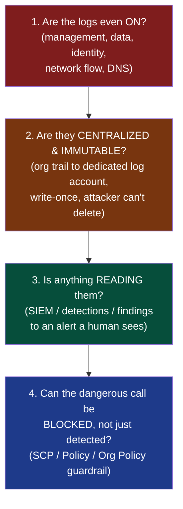
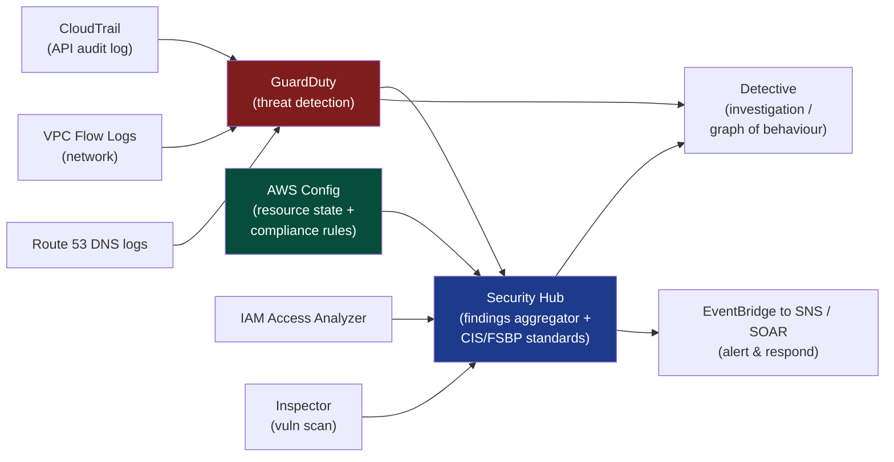
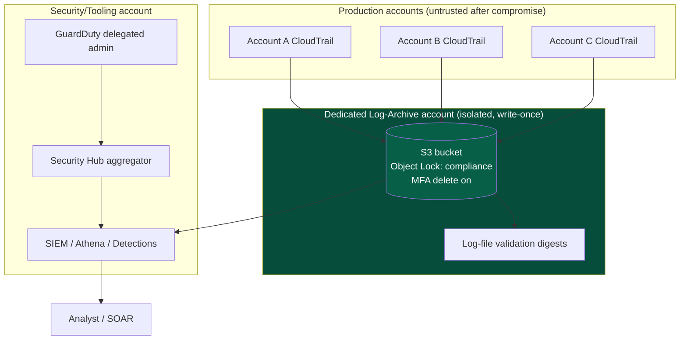
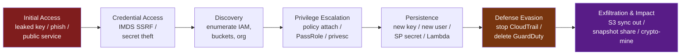
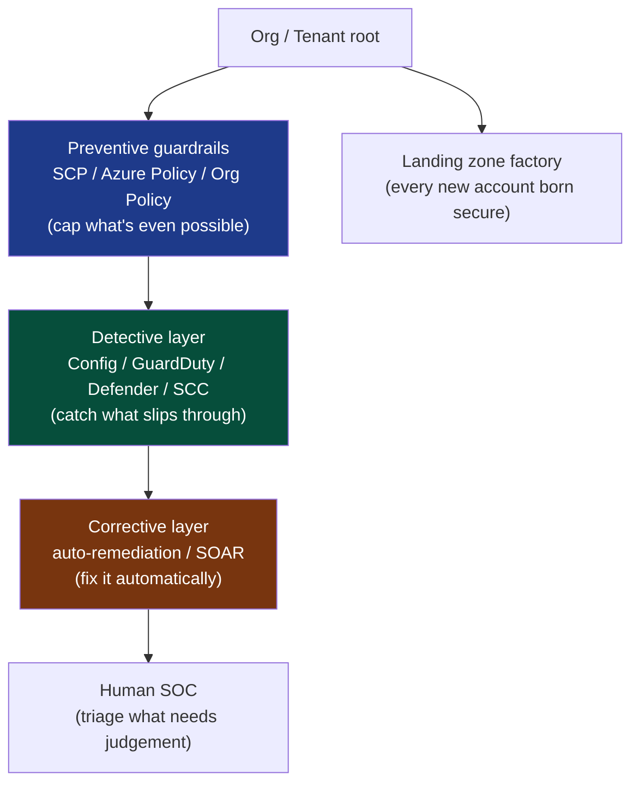

This is Chapter 9 of the Cloud Security notebook, and it is where the notebook turns around and looks back at itself. The previous eight chapters were mostly the attacker's story: shared-responsibility gaps, IMDS credential theft, over-permissioned IAM roles, S3 exposure, Pacu and ScoutSuite, Azure and Entra ID abuse, GCP enumeration, container breakouts, Kubernetes RBAC escalation, and poisoned CI/CD pipelines. Every one of those techniques left a trace, and every one of them could have been blocked by a control that was never turned on. This chapter is about the trace and the control — **detection** (seeing what happened) and **guardrails** (stopping it before it happens).

The single idea to carry through the whole chapter: **in the cloud, everything is an API call, and an API call is a log line.** On-prem, an attacker who lands on a host can do a great deal without generating a single centralized log — local file reads, in-memory tradecraft, lateral movement over SMB. In the cloud, spinning up a server, reading a secret, attaching a policy, disabling a log, deleting a backup — every single one of those is an authenticated request to a provider API, and the provider will write it down if you asked it to. That is the defender's structural advantage in the cloud, and it is enormous. The catch is in the "if you asked it to": cloud logging is opt-in, sampled, and easy to misconfigure, and the default posture on a fresh account sees far less than most people assume. Getting the logging right, then writing detections against it, then adding preventive guardrails so the dangerous call never succeeds — that is the entire job, and it is what this chapter teaches from zero.

**Who this is for:** cloud security engineers and detection engineers who own the logging pipeline and the SIEM content; SOC analysts who now have to triage `AssumeRole` and `GetSecretValue` events instead of Windows Event IDs; DFIR responders who arrive after a cloud breach and need to reconstruct it from CloudTrail; and red-teamers and pentesters who want to understand exactly what their `aws`, `az`, and `gcloud` commands looked like from the blue side — because the best offensive operators are the ones who know precisely what they light up. Everything here is for accounts, subscriptions, and projects you own or are explicitly authorised to assess. Reading someone else's audit logs, tampering with a log pipeline you do not control, or disabling detection in an environment you were not hired to test is unauthorised access. Build the lab in Part 8 in your own cloud account, or practise on the deliberately-vulnerable ranges named in the final part.

---

## Part 1: The Cloud Logging Model From Scratch

Before any tool, you need the mental model, because cloud logging looks nothing like `/var/log` on a Linux box or the Windows Security event log — and confusing the two is the single most common reason cloud detections miss.

Recall the **control plane vs data plane** split from Chapter 1. The *control plane* is the management API: the set of calls that create, configure, and destroy resources (`RunInstances`, `CreateUser`, `AttachRolePolicy`, `PutBucketPolicy`). The *data plane* is the calls that use the resources those APIs created (`GetObject` to read an S3 file, a query to a running database, an SSH session to an EC2 host). This distinction is the backbone of cloud logging because **the two planes are logged by completely different mechanisms, at completely different volumes, and with completely different default settings.**

Control-plane activity is comparatively low-volume — an organisation might make thousands of management calls a day — and it is where almost all *interesting* security events live, because privilege changes, resource creation, and configuration edits are all control-plane. That is why control-plane logging (AWS CloudTrail management events, Azure Activity Log, GCP Admin Activity logs) is usually **on by default and free-ish**, and why it is the first thing you read in any investigation.

Data-plane activity is enormous — a busy S3 bucket might serve millions of `GetObject` calls an hour — so data-plane logging (CloudTrail *data events*, GCP *Data Access* logs, storage access logs) is **off by default, charged per event, and must be explicitly enabled** on the specific resources you care about. This is the trap: a defender who assumes "CloudTrail logs everything" will not see the attacker read every object out of a bucket, because object-level reads are data events and nobody turned them on.

There is a third category worth separating out from the start: **identity and authentication logs**. Who signed in, from where, with what MFA state, and whether it succeeded. In AWS this is folded into CloudTrail (`ConsoleLogin`, `AssumeRole`, `GetSessionToken`); in Azure it is a first-class, separate stream (**Entra ID sign-in logs** and **audit logs**); in GCP it is partly in Cloud Audit Logs and partly in Google Workspace login audit. Identity logs are where you catch credential stuffing, impossible-travel, MFA fatigue, and stolen-token replay — the *initial access* stage of nearly every cloud breach.

The three questions every cloud detection program has to answer, in order:



Most real-world cloud environments fail at step 1 or step 2 and never even reach the interesting part. An access-key gets leaked in a public GitHub repo, the attacker uses it for three weeks, and the victim discovers it only when AWS emails them about a $40,000 crypto-mining bill — because CloudTrail was on but nobody was *reading* it, and there was no guardrail to stop a leaked key from launching 200 GPU instances in a region the company never uses. This chapter walks all four steps.

**A note on the mental shift for SOC analysts:** if you come from a Windows/endpoint background, stop thinking in Event IDs and start thinking in **(identity, action, resource, source, outcome)** tuples. Every cloud audit event, on every provider, is fundamentally: *this principal* did *this action* to *this resource* from *this network location* with *this result*. Once you internalise that shape, CloudTrail JSON, Entra audit logs, and GCP audit logs all read the same way, and you can move between clouds without relearning detection from scratch.

---

## Part 2: AWS CloudTrail From Scratch

**CloudTrail** is AWS's control-plane audit log. It is the single most important data source in AWS security, and if you learn one thing in this chapter, make it CloudTrail. What it does: it records nearly every API call made in your account — via the console, CLI, SDK, or another AWS service acting on your behalf — as a structured JSON *event*, and delivers those events to you.

### What CloudTrail records, and what it does not

CloudTrail splits events into three types, and the distinction is a contract you must know cold:

| Event type | What it captures | Default state | Cost | Example events |
|---|---|---|---|---|
| **Management events** | Control-plane operations: create/modify/delete resources, IAM changes, config changes | **On** (90-day console "Event history", free) | Free for first copy; charged in a trail beyond that | `RunInstances`, `CreateUser`, `AttachUserPolicy`, `PutBucketPolicy`, `ConsoleLogin`, `AssumeRole` |
| **Data events** | Data-plane operations: object-level and item-level access | **Off** | Charged per event (~$0.10 / 100k) | `GetObject`, `PutObject`, `DeleteObject` (S3); `Invoke` (Lambda); `GetItem` (DynamoDB) |
| **Insights events** | ML-detected anomalies in call rate/error patterns | Off | Charged | Unusual spike in `AuthorizeSecurityGroupIngress`, error-rate anomalies |

The 90-day **Event history** you see in the console for free is *management events only*, is *not* durable, and *cannot* be searched programmatically at scale or fed to a SIEM well. For real security you must create a **trail**: a configuration that continuously delivers events to an **S3 bucket** (and optionally CloudWatch Logs and EventBridge) where they are durable, queryable, and centralizable.

### Reading a CloudTrail event

Every event is a JSON object with a fixed top-level schema. Learn these fields — they are the (identity, action, resource, source, outcome) tuple made concrete, and every AWS detection you write keys off them:

```json
{
  "eventVersion": "1.09",
  "userIdentity": {
    "type": "IAMUser",
    "principalId": "AIDAEXAMPLE123",
    "arn": "arn:aws:iam::111122223333:user/dev-alice",
    "accountId": "111122223333",
    "accessKeyId": "AKIAEXAMPLEKEY",
    "userName": "dev-alice"
  },
  "eventTime": "2027-04-15T09:14:22Z",
  "eventSource": "iam.amazonaws.com",
  "eventName": "CreateAccessKey",
  "awsRegion": "us-east-1",
  "sourceIPAddress": "203.0.113.47",
  "userAgent": "aws-cli/2.15.0 Python/3.11 Linux/6.5",
  "requestParameters": { "userName": "dev-alice" },
  "responseElements": {
    "accessKey": {
      "accessKeyId": "AKIANEWKEY456",
      "status": "Active",
      "createDate": "Apr 15, 2027 9:14:22 AM"
    }
  },
  "readOnly": false,
  "eventType": "AwsApiCall",
  "managementEvent": true,
  "recipientAccountId": "111122223333",
  "eventID": "b1f2e3d4-5678-90ab-cdef-EXAMPLE"
}
```

The fields you will use constantly:

- **`userIdentity`** — *who*. The `type` (`Root`, `IAMUser`, `AssumedRole`, `AWSService`, `FederatedUser`) tells you the principal class; `arn` tells you exactly who. For `AssumedRole`, look inside `sessionContext.sessionIssuer` to see the underlying role, and `sessionContext.attributes.mfaAuthenticated` to see whether MFA was used to assume it. **Detection gold:** `type: "Root"` on almost any event is worth an alert — the root user should be used essentially never.
- **`eventName`** + **`eventSource`** — *what*. The API and the service. `CreateAccessKey` on `iam.amazonaws.com`.
- **`sourceIPAddress`** — *from where*. For console/API this is the real client IP; for AWS-service-initiated calls it is the service's DNS name (e.g. `cloudtrail.amazonaws.com`).
- **`userAgent`** — often overlooked, extremely useful. `aws-cli/2.x`, `Boto3`, `Pacu`, `stratus` — the tooling frequently reveals itself here.
- **`errorCode` / `errorMessage`** — present only when the call *failed* (`AccessDenied`, `UnauthorizedOperation`, `Client.RequestLimitExceeded`). A burst of `AccessDenied` from one principal is enumeration or privilege-probing — a classic detection.
- **`readOnly`** — `true` for gets/describes/lists, `false` for state-changing calls. Filtering `readOnly: false` cuts the noise dramatically when hunting for changes.

**Blue-team usage:** the very first query in any AWS incident is "show me every non-readOnly event by this principal / from this IP, ordered by time." That single filter reconstructs most of an attacker's control-plane activity.

### Setting up a proper trail (tool-from-scratch: the AWS CLI)

Everything here uses the **AWS CLI** — the official command-line client for AWS APIs. If you have not met it yet: it is a Python program (`pip install awscli` or the bundled v2 installer) that turns `aws <service> <operation> --flags` into signed API calls, reading credentials from `~/.aws/credentials` or environment variables, configured with `aws configure`. Every CLI call you make is itself a CloudTrail event — a fact we will exploit in the lab.

Create an organization-wide, multi-region trail with log-file integrity validation:

```bash
# 1. Create the destination bucket (in your dedicated log-archive account, ideally)
aws s3api create-bucket \
  --bucket org-cloudtrail-logs-111122223333 \
  --region us-east-1

# 2. Attach a bucket policy so CloudTrail can write (policy JSON omitted for brevity;
#    AWS docs provide the exact "cloudtrail.amazonaws.com" s3:PutObject statement)

# 3. Create the trail: all regions, management + org-wide, integrity validation on
aws cloudtrail create-trail \
  --name org-trail \
  --s3-bucket-name org-cloudtrail-logs-111122223333 \
  --is-multi-region-trail \
  --enable-log-file-validation \
  --is-organization-trail

# 4. Start logging (a trail is created stopped!)
aws cloudtrail start-logging --name org-trail

# 5. Verify it is actually on
aws cloudtrail get-trail-status --name org-trail
```

Realistic output of step 5 — the fields that matter for assurance:

```json
{
    "IsLogging": true,
    "LatestDeliveryTime": "2027-04-15T09:20:11+00:00",
    "StartLoggingTime": "2027-04-15T09:18:03+00:00",
    "LatestDeliveryAttemptTime": "2027-04-15T09:20:11Z",
    "LatestDeliverySucceeded": "2027-04-15T09:20:11Z"
}
```

Flag-by-flag on the important choices:

- `--is-multi-region-trail` — **critical.** A single-region trail is blind to activity in every other region, and attackers deliberately operate in regions you do not use (ap-south-1, us-west-1) precisely to dodge single-region trails. Always multi-region.
- `--enable-log-file-validation` — CloudTrail writes a signed digest file each hour; `aws cloudtrail validate-logs` later proves no log file was deleted or altered. This is your tamper-evidence, essential for DFIR admissibility.
- `--is-organization-trail` — created from the AWS Organizations management account, this trail captures **every member account** and delivers to one bucket. Member-account admins cannot turn it off. This is how you defeat the "attacker disables logging in their account" problem — the org trail is out of their reach.

**Red-team usage / why this matters offensively:** an attacker who compromises a single member account and finds only a local trail will `StopLogging` or `DeleteTrail` to go dark (MITRE **T1562.008 – Disable Cloud Logs**). If the real trail is an org trail owned by a separate account they don't control, that move fails silently — and the *attempt* (`StopLogging` on a trail that isn't theirs → `AccessDenied`) is itself one of your highest-fidelity alerts.

---

## Part 3: The AWS Detection Stack — Config, GuardDuty, Security Hub, Detective

CloudTrail is the raw log. AWS layers four managed services on top of it (and other sources) that do progressively more of the detection work for you. You should understand what each is *for*, because buying all four and understanding none is a common and expensive failure.



**AWS Config** — records the *configuration state* of every resource over time and evaluates it against **rules**. Where CloudTrail says "someone changed this security group at 09:14," Config says "this security group *currently* allows 0.0.0.0/0 on port 22, which violates the rule `restricted-ssh`, and here is its full config-history timeline." Config is the backbone of *compliance* detection and of the guardrails in Part 10. Managed rules like `s3-bucket-public-read-prohibited`, `iam-user-mfa-enabled`, `cloudtrail-enabled`, and `restricted-ssh` cover most CIS benchmark checks out of the box. Config rules can **auto-remediate** via SSM Automation documents (e.g. automatically strip a public S3 ACL), turning a detection into a guardrail.

**GuardDuty** — AWS's managed **threat-detection** service. You enable it with one click and it continuously analyses CloudTrail management + S3 data events, VPC Flow Logs, and Route 53 DNS query logs using AWS's own threat intel and ML models, producing **findings** with a type taxonomy you should recognise:

- `UnauthorizedAccess:IAMUser/InstanceCredentialExfiltration.OutsideAWS` — an EC2 instance's role credentials were used from an IP *outside* AWS. This is the canonical **IMDS credential theft** signal from Chapter 2's SSRF-to-metadata attack, caught essentially for free.
- `CredentialAccess:IAMUser/AnomalousBehavior` — a principal did something wildly out of its historical pattern.
- `Discovery:IAMUser/AnomalousBehavior` — enumeration bursts (the `describe-*`/`list-*` flood a tool like ScoutSuite or Pacu generates).
- `Persistence:IAMUser/AnomalousBehavior`, `PrivilegeEscalation:IAMUser/AdministrativePermissions` — the privesc chains from Chapter 2.
- `Backdoor:EC2/C&CActivity.B`, `CryptoCurrency:EC2/BitcoinTool.B!DNS` — the miner on your stolen-key instances.

GuardDuty is the highest signal-to-noise, lowest-effort win in AWS security. Turn it on in every account and every region via the org-level delegated administrator, full stop.

**Security Hub** — the **aggregator**. It ingests findings from GuardDuty, Inspector, IAM Access Analyzer, Config, Macie, and third parties, normalises them into the **AWS Security Finding Format (ASFF)**, deduplicates, and scores them against **security standards**: the **AWS Foundational Security Best Practices (FSBP)**, **CIS AWS Foundations Benchmark**, and **PCI/NIST** packs. This is your single pane of glass and your continuous compliance score. Security Hub is where you route everything to EventBridge for alerting.

**Detective** — the **investigation** tool. When GuardDuty fires, Detective gives you a pre-built behaviour graph: this role's normal API call volume, geolocations, and related entities, so you can answer "is this actually anomalous and what else did this principal touch?" without hand-writing Athena queries. It is a triage accelerator, not a detector.

**IAM Access Analyzer** deserves a special mention for guardrails: it continuously evaluates resource policies (S3, IAM roles, KMS, SQS, Lambda) and flags any that grant access to an *external* principal — the fastest way to catch an accidentally-public bucket or a role trust policy that trusts the whole world.

### Reading a GuardDuty finding

When GuardDuty fires, it hands you a structured finding, not a raw log line — it has already done the correlation. Learning to read one is a core SOC skill. Here is the IMDS-credential-theft finding (the blue-team view of Chapter 2's SSRF-to-metadata attack), trimmed to the fields that matter:

```json
{
  "schemaVersion": "2.0",
  "type": "UnauthorizedAccess:IAMUser/InstanceCredentialExfiltration.OutsideAWS",
  "severity": 8.0,
  "region": "us-east-1",
  "resource": {
    "resourceType": "AccessKey",
    "accessKeyDetails": {
      "accessKeyId": "ASIAEXAMPLESTOLEN",
      "principalId": "AROAEXAMPLE:i-0abc123def456",
      "userType": "AssumedRole",
      "userName": "webapp-instance-role"
    }
  },
  "service": {
    "action": {
      "actionType": "AWS_API_CALL",
      "awsApiCallAction": {
        "api": "ListBuckets",
        "serviceName": "s3.amazonaws.com",
        "remoteIpDetails": {
          "ipAddressV4": "198.51.100.77",
          "organization": { "asnOrg": "DIGITALOCEAN-ASN" },
          "country": { "countryName": "Netherlands" }
        }
      }
    },
    "count": 14,
    "additionalInfo": { "recentApiCalls": [ { "api": "ListBuckets" }, { "api": "GetCallerIdentity" } ] }
  }
}
```

Read it the same (identity, action, resource, source, outcome) way: an **AssumedRole** credential belonging to `webapp-instance-role` — a role that should *only ever* be used from inside EC2 — was used to call `ListBuckets` **from a DigitalOcean IP in the Netherlands**. That geographic-and-network impossibility (an instance role used from outside AWS) is the entire detection, and `severity: 8.0` reflects it. The correct response is immediate: revoke the role's active sessions (`aws iam ... put-role-policy` a deny-all or use the AWS "revoke sessions" action, which stamps an `aws:TokenIssueTime` condition), then investigate what those 14 calls touched. This one finding, on by default with GuardDuty, is worth more than a dozen hand-written rules.

**The pragmatic minimum baseline for any AWS account**, in priority order: (1) a multi-region org CloudTrail to an immutable bucket; (2) GuardDuty on everywhere; (3) Config with the CIS managed rules; (4) Security Hub with FSBP + CIS standards; (5) EventBridge routing high-severity findings to a human. That baseline catches the overwhelming majority of what the earlier attack chapters described.

---

## Part 4: Azure & Entra ID Logging From Scratch

Azure splits its logs along a similar plane boundary but names everything differently, and — importantly — separates *identity* logging into its own first-class stream, which is a gift for detection.

**Azure Activity Log** is the control-plane audit log, the CloudTrail equivalent. It records every operation submitted to **Azure Resource Manager (ARM)** — create/update/delete on any resource — as an entry with `operationName` (e.g. `Microsoft.Compute/virtualMachines/write`), `caller` (the identity), `status`, and `correlationId`. It is on by default and retained 90 days; to keep it longer or analyse it you export it via a **diagnostic setting** to a **Log Analytics workspace**, a storage account, or Event Hub.

**Entra ID logs** (formerly Azure AD) are the identity stream and are where most Azure attacks are actually caught:

- **Sign-in logs** — every authentication: interactive and non-interactive sign-ins, the app, the IP and geolocation, the **Conditional Access** result, the MFA result, and the **risk** classification. This is where you catch **password spraying** (many accounts, one password, from one IP — Chapter 4's Entra attacks), **MFA fatigue / push bombing**, **impossible travel**, and **token replay** (a sign-in with `authenticationProtocol` anomalies or a session from an unexpected location reusing a stolen refresh token).
- **Audit logs** — directory changes: user/group/role adds, app registrations, consent grants, credential additions to service principals. The classic Entra persistence move — **adding a client secret or certificate to an existing service principal** so you have a permanent backdoor identity — shows up here as `Add service principal credentials`, and it is one of the most important Azure detections there is.

**Resource logs** (formerly diagnostic logs) are the data-plane/per-service logs — Key Vault access, Storage access, NSG flow logs — each enabled per-resource via diagnostic settings, mirroring AWS data events being opt-in.

Layered on top:

- **Microsoft Defender for Cloud** — the CSPM + workload-protection layer: a **Secure Score**, regulatory-compliance dashboards, and threat alerts across VMs, storage, SQL, containers, and Key Vault. It is the rough analogue of Config + GuardDuty + Security Hub combined.
- **Microsoft Sentinel** — Azure's cloud-native **SIEM/SOAR**, built on Log Analytics and queried with **KQL (Kusto Query Language)**. Sentinel ingests Activity Log, Entra logs, Defender alerts, Microsoft 365, and any third-party source, ships hundreds of built-in analytics rules mapped to MITRE ATT&CK, and runs automated **playbooks** (Logic Apps) for response.

A KQL detection for Entra password spraying, to make the language concrete:

```kql
SigninLogs
| where TimeGenerated > ago(1h)
| where ResultType == "50126"            // "invalid username or password"
| summarize FailedAttempts = count(),
            TargetedAccounts = dcount(UserPrincipalName)
        by IPAddress, bin(TimeGenerated, 15m)
| where TargetedAccounts >= 10 and FailedAttempts >= 20
| project TimeGenerated, IPAddress, TargetedAccounts, FailedAttempts
| order by FailedAttempts desc
```

Read it top-down: take sign-in logs from the last hour, keep only failed-password results, group by source IP in 15-minute buckets, and alert when one IP failed against **10+ distinct accounts** with **20+ attempts** — the exact fingerprint of a spray. Note `ResultType == "50126"` is the Entra error code for a bad password; learning the common `ResultType` codes (50126 bad password, 50053 account locked, 50055 expired password, 500121 MFA denied/timed-out — the MFA-fatigue signal) is the Azure analyst's equivalent of learning CloudTrail `errorCode`s.

**Blue-team usage:** `500121` (MFA request denied) repeated for one user in minutes is push-bombing/MFA-fatigue in progress — one of the highest-fidelity "attack happening right now" signals in any cloud, and worth an automated account-disable playbook.

---

## Part 5: GCP Cloud Audit Logs From Scratch

Google Cloud's model is arguably the cleanest of the three because the categories map so directly onto the plane split.

**Cloud Audit Logs** come in four streams:

| Log stream | Captures | Default | Analogue |
|---|---|---|---|
| **Admin Activity** | Control-plane writes: config/metadata changes, resource create/delete, IAM policy sets | **On, always, free, cannot be disabled** | CloudTrail management events |
| **Data Access** | Data-plane reads and data writes (read a GCS object, query BigQuery) | **Off** (except BigQuery), charged, opt-in per service | CloudTrail data events |
| **System Event** | Google-initiated actions (live-migrate a VM) | On, free | AWS service events |
| **Policy Denied** | Requests denied by security policy (VPC-SC, org policy, IAM) | On | `AccessDenied` events |

The fact that **Admin Activity logs cannot be turned off** is a genuine defensive advantage — an attacker in GCP cannot make control-plane actions invisible the way a single-region-trail AWS attacker can. What they *can* do is stop the logs being *exported* somewhere durable, which is why the pattern below matters.

Every GCP audit entry is a structured `protoPayload` with `authenticationInfo.principalEmail` (who), `methodName` (what, e.g. `SetIamPolicy`, `storage.objects.get`), `requestMetadata.callerIp` (from where), and `resourceName` (on what) — the same tuple again.

**Log routing (sinks):** GCP's logging pipeline centres on the **Log Router**, which sends logs to **sinks**. The standard secure pattern is an **aggregated sink at the organization level** that exports everything to a **BigQuery dataset** or **Cloud Storage bucket** in a dedicated, locked-down logging project — so logs land somewhere the workload's own compromised service account cannot reach or delete. Example:

```bash
# Create an org-level aggregated sink exporting all Admin Activity + Data Access
# audit logs to a BigQuery dataset in a dedicated logging project
gcloud logging sinks create org-audit-sink \
  bigquery.googleapis.com/projects/central-logging-proj/datasets/audit_logs \
  --organization=123456789012 \
  --include-children \
  --log-filter='logName:"cloudaudit.googleapis.com"'
```

`--include-children` makes it aggregate across every folder and project under the org (the equivalent of an AWS org trail); the `--log-filter` restricts it to audit logs so you are not paying to export application `stdout`.

**Security Command Center (SCC)** is GCP's Security Hub/Defender analogue: the central risk dashboard that aggregates **findings** from built-in detectors — **Security Health Analytics** (misconfig/CSPM: public buckets, over-broad firewall rules, disabled audit logs), **Event Threat Detection** (log-based threat detection: anomalous IAM grants, added SSH keys, data exfiltration, brute force), and **Container Threat Detection**. Event Threat Detection is the GuardDuty analogue and produces findings like `Persistence: IAM Anomalous Grant`, `Discovery: Service Account Self-Investigation`, and `Exfiltration: BigQuery Data Exfiltration`.

Detections in GCP are written either as **SCC custom modules** or in **YARA-L** inside **Google SecOps (Chronicle)**, Google's cloud-scale SIEM. A conceptual YARA-L-style rule to flag a service account granting itself a role (a common privesc/persistence step) keys off `methodName = "SetIamPolicy"` where the `principalEmail` in `authenticationInfo` also appears as the member being granted in `serviceData.policyDelta.bindingDeltas`.

---

## Part 6: Centralising Logs — Architecture, Immutability, and the Log Account

Turning logging on in each account is necessary but not sufficient. Three architectural properties separate a real detection program from a checkbox one, and all three are things attackers actively target.

**1. Centralisation.** Logs must flow to *one* place a SOC can query across the whole estate, not sit in 200 separate member-account buckets. Every provider has the primitive: AWS **organization trail** to one S3 bucket; Azure **diagnostic settings** on the management group to one Log Analytics workspace / Sentinel; GCP **aggregated org sink** to one BigQuery dataset. The pattern is identical: aggregate at the org/tenant/management-group root, export downward-inclusive, land in a dedicated account/project.

**2. Immutability and isolation.** The log destination must live in a **separate account/subscription/project** that the workloads being logged have *no* write or delete access to. This defeats **T1562 – Impair Defenses** and **T1070 – Indicator Removal**: an attacker who owns the production account still cannot delete the evidence because it was streamed out to an account they never touched. Harden the destination further:

- AWS: **S3 Object Lock** in compliance mode (write-once-read-many — even the root user cannot delete before the retention period), plus **MFA delete** and a restrictive bucket policy. Enable **CloudTrail log-file validation** so tampering is provable.
- Azure: an **immutable storage** policy (time-based retention) on the export storage account, resource-locks, and RBAC that grants the SOC read-only.
- GCP: a **bucket-lock** retention policy on the sink's GCS bucket, and IAM that gives the workload projects no role on the logging project.



**3. Something must read them.** Centralised immutable logs nobody queries are a compliance decoration, not a control. The reading layer is either a managed detector (GuardDuty/Defender/ETD), a SIEM with detection content (Sentinel/Splunk/Chronicle/Elastic), or — at minimum — **EventBridge/Log-based-metric-alarm rules** that pattern-match specific events straight to an alert. Part 7 covers the content; Part 8 builds the simplest end-to-end version by hand.

**A word on cost, because it is why logging is under-configured.** Data events, VPC Flow Logs, and DNS logs are voluminous and metered; naïvely enabling S3 data events on a petabyte-scale bucket can cost more than the security team's salary. The professional move is **targeted, risk-based enablement**: data events on the *sensitive* buckets (secrets, customer PII, backups) not all buckets; flow logs on the *sensitive* VPCs; and lifecycle rules that tier old logs to cheap storage (S3 Glacier / GCS Coldline) after the hot-investigation window. Detection engineering is as much a budgeting exercise as a technical one.

---

## Part 7: Writing Cloud Detections — Detection as Code

With logs centralised, you write **detections**: codified rules that turn raw events into alerts a human sees. The professional discipline is **detection-as-code** — rules live in Git, are peer-reviewed, tested against sample events, and deployed via CI, exactly like the pipelines in Chapter 8. Three levels of sophistication:

**Level 1 — Native event-pattern rules (no SIEM required).** AWS **EventBridge** matches CloudTrail events against a JSON pattern in near-real-time and routes matches to SNS/Lambda. This is the cheapest possible detection and the backbone of the Part 8 lab. Example pattern for "root account was used":

```json
{
  "detail-type": ["AWS API Call via CloudTrail"],
  "detail": {
    "userIdentity": { "type": ["Root"] }
  }
}
```

Example pattern for "someone tried to disable logging":

```json
{
  "detail": {
    "eventSource": ["cloudtrail.amazonaws.com"],
    "eventName": ["StopLogging", "DeleteTrail", "UpdateTrail", "PutEventSelectors"]
  }
}
```

**Level 2 — SIEM query detections.** In Sentinel (KQL), Splunk (SPL), Chronicle (YARA-L), or Elastic (EQL/KQL) you write scheduled analytics that aggregate, correlate, and threshold — like the password-spray KQL in Part 4. These handle the stateful logic native rules cannot: "many failures then one success" (spray then compromise), "credential used from two countries in five minutes" (impossible travel), "an access key created then used from a never-before-seen IP within the hour."

**Level 3 — Portable detections with Sigma (tool-from-scratch).** **Sigma** is a generic, YAML-based signature format for log events — "the YARA of logs." You write a detection *once* in Sigma's vendor-neutral syntax and use the `sigma` CLI (or the online converter) to compile it to Splunk SPL, Sentinel KQL, Elastic, Chronicle, etc. This is how mature teams avoid rewriting every detection per SIEM. Install and use:

```bash
pipx install sigma-cli                 # the modern pySigma-based CLI
sigma plugin install splunk            # add a backend
# Compile a rule to Splunk search syntax:
sigma convert -t splunk -p cloudtrail ./rules/aws_cloudtrail_disable.yml
```

A Sigma rule for CloudTrail tampering — note the vendor-neutral `logsource`/`detection` structure that the backend translates:

```yaml
title: AWS CloudTrail Logging Disabled or Modified
id: 4a1b6f60-1e2c-4f2a-9b9e-EXAMPLE
status: stable
description: Detects attempts to stop, delete, or weaken a CloudTrail trail.
logsource:
  product: aws
  service: cloudtrail
detection:
  selection:
    eventSource: cloudtrail.amazonaws.com
    eventName:
      - StopLogging
      - DeleteTrail
      - UpdateTrail
      - PutEventSelectors
  condition: selection
falsepositives:
  - Legitimate trail administration by cloud engineers (verify the principal and change ticket)
level: high
tags:
  - attack.defense-evasion
  - attack.t1562.008
```

**The MITRE-mapping discipline:** every serious detection carries `tags` pointing at the **MITRE ATT&CK for Cloud** technique it covers (here `T1562.008 – Disable Cloud Logs`). Doing this consistently lets you build a **coverage heat-map** — which cloud techniques you can detect and which are blind spots — which is how a detection team prioritises what to build next. Part 9 walks the kill chain that heat-map is measured against.

**Tuning and false positives are the real job.** Every rule above will fire on legitimate activity: engineers *do* legitimately update trails, admins *do* occasionally use root for the handful of tasks that require it (billing, closing the account), automation *does* create access keys. A raw rule with no context is a pager that everyone learns to ignore — the worst possible outcome. Maturity is in the enrichment: suppress when the principal is the known break-glass role *and* a change-ticket ID is present; raise severity when the same action comes from an IP outside corporate ranges with a `Boto3`/`stratus` user-agent. Detection engineering is 20% writing the rule and 80% tuning it against real traffic.

---

## Part 8: Hands-On Lab — Build a CloudTrail → EventBridge → SNS Alerting Pipeline

This lab builds a real, working AWS detection pipeline from nothing, then triggers it with simulated attacker actions and reads the alerts. It costs almost nothing (CloudTrail management events + a few EventBridge/SNS calls) and runs entirely in an account you own. **Do this only in your own account.**

**Goal:** get an email the moment any of these high-signal events occurs — root console login, IAM access-key creation, a security group opened to the world, or a CloudTrail trail being disabled.

### Step 0 — Prerequisites

```bash
aws --version          # aws-cli/2.15+ 
aws sts get-caller-identity   # confirm which identity/account you're operating as
```

Expected:

```json
{
  "UserId": "AIDAEXAMPLE123",
  "Account": "111122223333",
  "Arn": "arn:aws:iam::111122223333:user/lab-admin"
}
```

Assume you already created a multi-region trail (`org-trail`) as in Part 2 and confirmed `IsLogging: true`. EventBridge receives CloudTrail management events automatically in the account's default event bus, so no extra CloudTrail→EventBridge wiring is needed for management events.

### Step 1 — Create the SNS topic and subscribe your email

**SNS (Simple Notification Service)** is AWS's pub/sub notification service; we use it as the "send me an email" sink.

```bash
# Create the topic
TOPIC_ARN=$(aws sns create-topic --name cloud-detections --query TopicArn --output text)
echo "$TOPIC_ARN"          # arn:aws:sns:us-east-1:111122223333:cloud-detections

# Subscribe your email (you must click the confirmation link AWS emails you)
aws sns subscribe \
  --topic-arn "$TOPIC_ARN" \
  --protocol email \
  --notification-endpoint you@example.com
```

Output:

```json
{
    "SubscriptionArn": "pending confirmation"
}
```

Go confirm the subscription from your inbox before continuing, or no alerts arrive.

### Step 2 — Allow EventBridge to publish to the topic

SNS topics reject publishes from services unless the topic policy allows it. Add a statement permitting `events.amazonaws.com`:

```bash
cat > topic-policy.json <<'EOF'
{
  "Version": "2012-10-17",
  "Statement": [{
    "Sid": "AllowEventBridgePublish",
    "Effect": "Allow",
    "Principal": { "Service": "events.amazonaws.com" },
    "Action": "sns:Publish",
    "Resource": "TOPIC_ARN_PLACEHOLDER"
  }]
}
EOF
sed -i "s|TOPIC_ARN_PLACEHOLDER|$TOPIC_ARN|" topic-policy.json
aws sns set-topic-attributes \
  --topic-arn "$TOPIC_ARN" \
  --attribute-name Policy \
  --attribute-value file://topic-policy.json
```

### Step 3 — Create the EventBridge rules

Rule A — **root account usage**:

```bash
aws events put-rule \
  --name detect-root-usage \
  --description "Any use of the root account" \
  --event-pattern '{
    "detail-type": ["AWS API Call via CloudTrail", "AWS Console Sign In via CloudTrail"],
    "detail": { "userIdentity": { "type": ["Root"] } }
  }'

aws events put-targets \
  --rule detect-root-usage \
  --targets "Id"="1","Arn"="$TOPIC_ARN"
```

Rule B — **access-key creation, SG-opened-to-world, and trail tampering** in one rule:

```bash
aws events put-rule \
  --name detect-high-risk-iam-net \
  --event-pattern '{
    "detail": {
      "eventName": [
        "CreateAccessKey",
        "AuthorizeSecurityGroupIngress",
        "StopLogging",
        "DeleteTrail",
        "PutEventSelectors"
      ]
    }
  }'

aws events put-targets \
  --rule detect-high-risk-iam-net \
  --targets "Id"="1","Arn"="$TOPIC_ARN"
```

Verify both rules exist and are enabled:

```bash
aws events list-rules --query "Rules[].{Name:Name,State:State}" --output table
```

```
-------------------------------------------------
|                   ListRules                   |
+----------------------------+------------------+
|            Name            |      State       |
+----------------------------+------------------+
|  detect-high-risk-iam-net  |  ENABLED         |
|  detect-root-usage         |  ENABLED         |
+----------------------------+------------------+
```

### Step 4 — Trigger the detections (simulate the attacker)

Now generate the exact actions the earlier chapters' attackers would take. Each one is a CloudTrail event that EventBridge matches and forwards to SNS.

**Trigger 1 — create an access key** (persistence, T1098 / the Pacu `iam__backdoor_users_keys` move):

```bash
aws iam create-access-key --user-name lab-admin
```

```json
{
  "AccessKey": {
    "UserName": "lab-admin",
    "AccessKeyId": "AKIANEWLABKEY789",
    "Status": "Active",
    "SecretAccessKey": "wJalr...EXAMPLE",
    "CreateDate": "2027-04-15T09:41:07+00:00"
  }
}
```

**Trigger 2 — open SSH to the world** (the misconfiguration Config's `restricted-ssh` rule and this detection both catch):

```bash
aws ec2 authorize-security-group-ingress \
  --group-id sg-0abc123 \
  --protocol tcp --port 22 --cidr 0.0.0.0/0
```

**Trigger 3 — try to blind the defender** (T1562.008, disable logging):

```bash
aws cloudtrail stop-logging --name org-trail
```

Within 1–3 minutes (EventBridge/CloudTrail delivery latency), you receive SNS emails. The raw event body of the trail-disable alert looks like:

```json
{
  "version": "0",
  "detail-type": "AWS API Call via CloudTrail",
  "source": "aws.cloudtrail",
  "account": "111122223333",
  "time": "2027-04-15T09:43:55Z",
  "region": "us-east-1",
  "detail": {
    "eventName": "StopLogging",
    "eventSource": "cloudtrail.amazonaws.com",
    "userIdentity": {
      "type": "IAMUser",
      "arn": "arn:aws:iam::111122223333:user/lab-admin",
      "userName": "lab-admin"
    },
    "sourceIPAddress": "203.0.113.47",
    "userAgent": "aws-cli/2.15.0 Python/3.11 Linux/6.5",
    "requestParameters": { "name": "org-trail" }
  }
}
```

### Step 5 — Clean up (and re-enable logging you just disabled!)

```bash
aws cloudtrail start-logging --name org-trail          # undo Trigger 3 immediately
aws ec2 revoke-security-group-ingress --group-id sg-0abc123 \
  --protocol tcp --port 22 --cidr 0.0.0.0/0
aws iam delete-access-key --user-name lab-admin --access-key-id AKIANEWLABKEY789
aws events remove-targets --rule detect-root-usage --ids 1
aws events remove-targets --rule detect-high-risk-iam-net --ids 1
aws events delete-rule --name detect-root-usage
aws events delete-rule --name detect-high-risk-iam-net
aws sns delete-topic --topic-arn "$TOPIC_ARN"
```

**What you just proved end-to-end:** a raw CloudTrail event, matched by a native EventBridge pattern with no SIEM at all, becomes a human-readable alert in minutes — and the attacker's own attempt to disable logging is one of the alerts. This is the irreducible core of cloud detection; everything else (GuardDuty, Sentinel, Chronicle) is a more sophisticated, higher-coverage version of exactly this loop.

**Extending the lab:** add a Lambda target instead of SNS to *auto-respond* — e.g. on `StopLogging`, immediately call `start-logging` again and quarantine the principal by attaching a deny-all policy. That turns detection into automated response (SOAR), the subject of the guardrails in Part 10.

---

## Part 9: Detecting the Cloud Kill Chain (MITRE ATT&CK for Cloud)

A detection program is only as good as its **coverage** of the attacker's actual path. Map every detection to the stages an intruder walks, using **MITRE ATT&CK for Cloud** (the IaaS and Identity-Provider matrices) as the shared vocabulary. Below is the cloud kill chain from the earlier chapters, each stage paired with the telemetry that catches it — this is the coverage checklist a cloud detection team builds against.



| Kill-chain stage | Attacker action (from earlier chapters) | ATT&CK ID | Primary detection signal |
|---|---|---|---|
| Initial Access | Leaked access key used from new IP | T1078.004 Valid Accounts: Cloud | GuardDuty `UnauthorizedAccess:IAMUser/*`; first-seen `sourceIPAddress` for key; impossible-travel |
| Initial Access | Entra password spray / MFA fatigue | T1110 / T1621 | SigninLogs `ResultType 50126` burst; `500121` repeats |
| Credential Access | IMDS SSRF steals instance role creds | T1552.005 Cloud Instance Metadata | GuardDuty `InstanceCredentialExfiltration.OutsideAWS`; role creds used from non-AWS IP |
| Credential Access | `GetSecretValue` / KV read spike | T1555.006 Cloud Secrets Mgmt Stores | CloudTrail `GetSecretValue`/`BatchGetSecretValue` volume anomaly; Key Vault access log |
| Discovery | ScoutSuite/Pacu enumeration flood | T1580 Cloud Infrastructure Discovery | Burst of `List*`/`Describe*`; GuardDuty `Discovery:*AnomalousBehavior` |
| Privilege Escalation | Attach `AdministratorAccess`; `iam:PassRole` | T1098 / T1548 | CloudTrail `AttachUserPolicy`/`PutUserPolicy` with admin ARN; `SetIamPolicy` self-grant (GCP) |
| Persistence | New access key / IAM user / SP credential | T1098.001 Additional Cloud Credentials | `CreateAccessKey`, `CreateUser`, Entra `Add service principal credentials` |
| Defense Evasion | Stop CloudTrail / delete GuardDuty detector | T1562.008 Disable Cloud Logs | `StopLogging`/`DeleteTrail`; GuardDuty `DeleteDetector`; ETD audit-log-disabled |
| Exfiltration | `s3 sync` bucket out; share EBS snapshot public | T1537 Transfer to Cloud Account | S3 data events `GetObject` volume; `ModifySnapshotAttribute` to `all`; `SharedSnapshotVolumeClone` GuardDuty |
| Impact | Launch GPU fleet for crypto-mining | T1496 Resource Hijacking | GuardDuty `CryptoCurrency:EC2/*`; `RunInstances` spike of large instance types in unused region |

Two detection-engineering principles fall out of this table:

**Defense-in-depth on the log itself.** The Defense-Evasion row is special: it is the attacker attacking *your detection*. That is exactly why the org-trail-in-a-separate-account architecture (Part 6) matters — it converts "attacker successfully went dark" into "attacker generated a high-severity `AccessDenied` on a `StopLogging` they had no permission for." Always ensure your most important detection (logging-tampering) survives the compromise of the account it protects.

**Behavioural over signature where you can.** Signature rules (specific `eventName`s) are cheap and precise but brittle — an attacker who uses a slightly different API dodges them. Behavioural detections (first-seen IP for a principal, volume anomalies, impossible travel) catch the *novel* variant and are what GuardDuty/Defender/ETD's ML layers provide. A mature program runs both: signatures for the known-bad specifics, behavioural analytics for the unknown, and correlates them so a low-confidence behavioural hit plus a signature hit on the same principal escalates automatically.

**Purple-teaming your coverage (tool-from-scratch: Stratus Red Team).** You verify the map is real by *safely emulating* these techniques and checking your alerts fire. **Stratus Red Team** (by DataDog) is the "atomic red team for the cloud": a single Go binary that detonates granular, self-contained cloud attack techniques — each mapped to an ATT&CK ID — against your own account, then cleanly reverts them.

```bash
# Install (Go binary)
brew install stratus-red-team      # or download the release binary
# List available AWS techniques
stratus list --platform aws
# Detonate "exfiltrate an EBS snapshot by sharing it" and watch your detections
stratus detonate aws.exfiltration.ec2-share-ebs-snapshot
# ... verify GuardDuty / your rule fired, then revert
stratus revert   aws.exfiltration.ec2-share-ebs-snapshot
stratus cleanup  aws.exfiltration.ec2-share-ebs-snapshot
```

Every technique Stratus detonates should light up something you built. The ones that stay dark are your coverage gaps — and finding them in a drill is infinitely cheaper than finding them in an incident.

---

## Part 10: Preventive Guardrails — Stopping the Call, Not Just Watching It

Detection tells you the house was robbed. **Guardrails** lock the door. The most mature cloud security posture prevents dangerous actions from succeeding at all, so there is nothing to detect. Guardrails are *preventive* controls enforced by the provider's own policy engine — they cannot be bypassed by the workload's IAM permissions because they sit *above* IAM in the evaluation order.

**AWS Service Control Policies (SCPs).** In AWS Organizations, an SCP is an org-level guardrail that sets the *maximum* permissions any principal in an account (or OU) can have — even the account's root user and its most powerful admin role are bounded by it. SCPs never *grant*; they only *cap*. The canonical guardrails every organisation should deploy:

```json
{
  "Version": "2012-10-17",
  "Statement": [
    {
      "Sid": "DenyDisablingCloudTrail",
      "Effect": "Deny",
      "Action": ["cloudtrail:StopLogging", "cloudtrail:DeleteTrail"],
      "Resource": "*"
    },
    {
      "Sid": "DenyDisablingGuardDuty",
      "Effect": "Deny",
      "Action": ["guardduty:DeleteDetector", "guardduty:UpdateDetector"],
      "Resource": "*"
    },
    {
      "Sid": "DenyLeavingApprovedRegions",
      "Effect": "Deny",
      "NotAction": ["iam:*", "sts:*", "cloudfront:*", "route53:*", "support:*"],
      "Resource": "*",
      "Condition": {
        "StringNotEquals": { "aws:RequestedRegion": ["us-east-1", "eu-west-1"] }
      }
    }
  ]
}
```

Read what these buy you: the first two convert the entire Defense-Evasion column of Part 9 from "detect and race the attacker" into "the attacker gets `AccessDenied` and cannot go dark at all" — the single highest-value guardrail pair in AWS. The third is a **region lockdown** that neutralises the classic "mine crypto / stage exfil in a region you never watch" move (T1496/T1537) by making *every* resource call outside your two approved regions fail. Layered on: **permission boundaries** (an IAM-level cap on what a role/user can be granted, used to let teams self-serve roles without being able to escalate to admin), and a deny on `iam:CreateUser`/`CreateAccessKey` outside your identity-provider-federated path to kill long-lived-key persistence.

**AWS Config rules + Conformance Packs** provide the *detective-to-corrective* guardrail: a Config rule detects a non-compliant resource (public bucket, unencrypted volume, `0.0.0.0/0:22` SG) and an attached **SSM Automation remediation** fixes it automatically — e.g. `s3-bucket-public-read-prohibited` with auto-remediation strips the public grant within minutes of it appearing. Ship these as a **Conformance Pack** (a versioned bundle of rules + remediations) so the whole CIS baseline deploys as one artifact across the org.

**Azure Policy.** The ARM-level equivalent, with a crucial extra *effect*: beyond `audit` and `deny`, Azure Policy can `deployIfNotExists` — it will *automatically create* a missing control (e.g. deploy a diagnostic setting to ship logs to your workspace on any VM that lacks one). Assigned at the **management group** root, a policy like "deny public network access on storage accounts" or "require diagnostic settings on all Key Vaults" is enforced tenant-wide. **Azure Blueprints / Landing Zones** package these into a governed baseline.

**GCP Organization Policy.** GCP's guardrail engine sets **constraints** at the org/folder/project level that no project owner can override: `constraints/storage.publicAccessPrevention` (no public buckets, anywhere), `constraints/compute.vmExternalIpAccess` (no public IPs on VMs), `constraints/iam.disableServiceAccountKeyCreation` (kill the long-lived-SA-key persistence vector wholesale), and `constraints/gcp.resourceLocations` (region lockdown). Combined with **VPC Service Controls** (a data-exfiltration perimeter around GCS/BigQuery that blocks reads to outside the perimeter even with valid creds), these are the strongest preventive controls in GCP.

**Landing zones** tie it together. AWS **Control Tower**, Azure **Landing Zones**, and GCP's **security foundations blueprint** are opinionated, automated factories that stamp out new accounts/subscriptions/projects *already wired* with the org trail, GuardDuty/Defender/SCC, the immutable log archive, the baseline SCPs/Policies/Org-Policies, and the guardrail Config rules. The goal is that **secure-by-default is the path of least resistance** — a developer who requests a new account gets all of Parts 2–10 for free, and cannot accidentally opt out of logging or open a public bucket because the guardrail forbids it above their permission level.



**Bug-bounty and pentest relevance, honestly scoped:** this chapter is defensive, so the offensive angle is inverted — a pentester's findings here are *absences*: "root has no usage alarm," "no org trail, member accounts log locally," "GuardDuty off in 3 of 12 regions," "no SCP prevents `StopLogging`," "public-bucket org policy not enforced." A cloud-configuration-review engagement (the ScoutSuite/Prowler output from Chapter 3) is largely a checklist of the guardrails in this part that *aren't* there. On bug-bounty specifically, the crossover is finding **exposed logs themselves** — a world-readable S3 bucket or GCS bucket full of CloudTrail/audit logs is both a data leak and a roadmap of the target's internals, and has paid out on multiple public programs.

---

## Part 11: A Consolidated Detection & Defense Playbook

Pulling Parts 2–10 into the operating model a cloud security team actually runs. Think of it as a maturity ladder — most organisations are somewhere on it and the value is in knowing the next rung.

**Rung 0 — Blind.** CloudTrail on (default 90-day history), nobody reading it, no data events, single-region or no trail, GuardDuty off. This is where most breached-by-leaked-key companies live. *Next step:* org trail to an immutable bucket; GuardDuty on everywhere.

**Rung 1 — Logged & watched.** Org trail to isolated log account; GuardDuty + Security Hub (FSBP+CIS) + Config baseline on across the org; Defender for Cloud / SCC on their clouds; high-severity findings routed to a human via EventBridge/SNS. *Next step:* write custom detections for your crown-jewel data and your specific kill-chain gaps.

**Rung 2 — Detection-as-code.** Custom detections in Git (Sigma to your SIEM), peer-reviewed and tested, each mapped to ATT&CK, with a coverage heat-map that drives the backlog. Targeted data events / flow logs on sensitive resources. Alert tuning discipline so pages are actionable. *Next step:* prevention and automation.

**Rung 3 — Guardrailed & automated.** Preventive SCPs/Azure Policy/Org Policy cap the dangerous actions org-wide; landing zones make new accounts secure-by-birth; Config/Policy auto-remediation and SOAR playbooks fix common misconfigs and contain obvious compromises without a human. *Next step:* continuous validation.

**Rung 4 — Continuously validated.** Stratus Red Team / Leonidas / purple-team drills run on a schedule and *prove* the detections and guardrails still fire; coverage is measured, not assumed; the log pipeline's own integrity is monitored (log-file validation alarms, "no events in N minutes" dead-man's-switch alarms that catch a silently broken pipeline).

**The dead-man's-switch is worth its own mention** because it is the detection everyone forgets: an alarm that fires when a log source goes *quiet*. Attackers who can't delete logs sometimes break the *pipeline* (revoke the delivery role, fill the bucket, drop the sink). A CloudWatch alarm on "CloudTrail delivered zero events in the last 30 minutes," a Sentinel rule on "no SigninLogs ingested," or a Chronicle ingestion-health alert catches the silent failure that every other detection depends on. Detection infrastructure needs detection too.

**Incident response ties back to the DFIR notebook:** when an alert does fire, the responder's first moves are cloud-specific — snapshot the evidence via API (`create-image`, `create-snapshot`) *before* touching the instance, pull the CloudTrail/audit history for the implicated principal, rotate the compromised credential (`update-access-key --status Inactive`, then delete), and, critically, remember that in the cloud **containment is an API call**: you can revoke a role's sessions, detach its policies, or apply a quarantine SCP in seconds, faster than any on-prem network isolation.

---

## Part 12: Final Revision / Summary

The whole chapter compresses to a few load-bearing ideas:

- **Everything is an API call, and an API call is a log line.** This is the defender's structural advantage in the cloud — used only if logging is actually on, centralised, and read.
- **Control plane vs data plane** governs cloud logging. Management/Admin-Activity logs (control plane) are on by default and hold most security value; data events / Data Access logs (data plane) are off by default, metered, and must be targeted at sensitive resources.
- **The four questions in order:** Are the logs on? Are they centralised and immutable? Is anything reading them? Can the dangerous call be *blocked*? Most environments fail at the first or second.
- **Learn the audit-event shape once** — (identity, action, resource, source, outcome) — and CloudTrail JSON, Entra logs, and GCP audit logs all read the same. Key AWS fields: `userIdentity.type` (watch for `Root`/`AssumedRole`), `eventName`+`eventSource`, `sourceIPAddress`, `userAgent`, `errorCode`, `readOnly`.
- **The provider stacks map onto each other:** CloudTrail≈Activity+Entra logs≈Cloud Audit Logs; GuardDuty≈Defender for Cloud≈Event Threat Detection; Security Hub≈Defender CSPM≈Security Command Center; Config≈Azure Policy(audit)≈Security Health Analytics.
- **Immutability defeats the attacker's evasion:** stream logs one-way to a separate account/project the workload can't touch, with Object-Lock/immutable-storage/bucket-lock, so `StopLogging`/`DeleteTrail`/log deletion either fails or is provably caught.
- **Detection-as-code + ATT&CK mapping** turns rules into a measurable coverage program; **Sigma** makes detections portable across SIEMs; **behavioural** analytics catch what signatures miss.
- **Guardrails beat detection:** SCPs / Azure Policy / GCP Org Policy cap dangerous actions above IAM so they never succeed; landing zones make secure-by-default the default; auto-remediation and SOAR close the loop; **purple-teaming with Stratus Red Team** proves it all still works.

If you internalise one workflow, make it the Part 8 loop — CloudTrail event → EventBridge pattern → alert — plus one guardrail — the SCP that denies `StopLogging`. Detection plus prevention on the logging pipeline itself is the seed the entire program grows from.

---

## Part 13: Cheat Sheet / Quick Reference

**Cross-cloud logging map**

| Purpose | AWS | Azure | GCP |
|---|---|---|---|
| Control-plane audit | CloudTrail management events | Activity Log | Cloud Audit Logs: Admin Activity |
| Data-plane audit (opt-in) | CloudTrail data events | Resource/diagnostic logs | Cloud Audit Logs: Data Access |
| Identity / sign-in | CloudTrail (`ConsoleLogin`,`AssumeRole`) | Entra sign-in + audit logs | Cloud Audit + Workspace login audit |
| Network flow | VPC Flow Logs | NSG Flow Logs | VPC Flow Logs |
| Managed threat detection | GuardDuty | Defender for Cloud | SCC Event Threat Detection |
| Posture / misconfig (CSPM) | Config + Security Hub | Defender for Cloud (Secure Score) | SCC Security Health Analytics |
| SIEM | (Security Lake +) OpenSearch/3P | Microsoft Sentinel | Google SecOps (Chronicle) |
| Detection language | EventBridge patterns / Athena SQL | KQL | YARA-L |
| Preventive guardrail | Service Control Policy (SCP) | Azure Policy | Organization Policy |
| Log immutability | S3 Object Lock (compliance) | Immutable blob storage | Bucket Lock retention |

**Essential AWS CLI**

```bash
# Trails
aws cloudtrail create-trail --name t --s3-bucket-name b --is-multi-region-trail \
    --enable-log-file-validation --is-organization-trail
aws cloudtrail start-logging --name t
aws cloudtrail get-trail-status --name t
aws cloudtrail validate-logs --trail-arn ARN --start-time ...   # tamper check
aws cloudtrail lookup-events \
    --lookup-attributes AttributeKey=EventName,AttributeValue=ConsoleLogin

# GuardDuty
aws guardduty list-detectors
aws guardduty get-findings --detector-id ID --finding-ids ...

# Query CloudTrail in S3 with Athena (SQL) — the workhorse for investigations
#   SELECT eventtime, useridentity.arn, eventname, sourceipaddress
#   FROM cloudtrail_logs
#   WHERE eventname='CreateAccessKey' AND useridentity.type='Root';

# EventBridge detection rule + SNS target
aws events put-rule --name r --event-pattern '{"detail":{"eventName":["StopLogging"]}}'
aws events put-targets --rule r --targets Id=1,Arn=$TOPIC_ARN
```

**High-value CloudTrail `eventName`s to alert on**

```
ConsoleLogin (Root / no-MFA)   CreateAccessKey / CreateUser / CreateLoginProfile
AttachUserPolicy / PutUserPolicy / AttachRolePolicy (admin ARNs)   PassRole
AuthorizeSecurityGroupIngress (0.0.0.0/0)   PutBucketPolicy / PutBucketAcl (public)
StopLogging / DeleteTrail / UpdateTrail / PutEventSelectors        DeleteDetector
GetSecretValue / BatchGetSecretValue (volume)   ModifySnapshotAttribute (public)
RunInstances (large types / unused region)      DeleteFlowLogs / DisableKey
```

**Entra sign-in `ResultType` codes to know**

```
0      success            50126  invalid username or password (spray)
50053  account locked     50055  password expired
50074  MFA required       500121 MFA denied / timed out (MFA fatigue)
53003  blocked by Conditional Access
```

**GuardDuty findings that map to earlier-chapter attacks**

```
UnauthorizedAccess:IAMUser/InstanceCredentialExfiltration.OutsideAWS   -> IMDS SSRF theft
CryptoCurrency:EC2/BitcoinTool.B!DNS                                    -> stolen-key mining
Discovery:IAMUser/AnomalousBehavior                                     -> Pacu/ScoutSuite enum
PrivilegeEscalation:IAMUser/AdministrativePermissions                  -> policy-attach privesc
Persistence:IAMUser/AnomalousBehavior                                  -> backdoor key/user
Exfiltration:S3/AnomalousBehavior                                       -> bucket sync-out
```

**Baseline guardrail SCP actions to Deny org-wide**

```
cloudtrail:StopLogging, cloudtrail:DeleteTrail
guardduty:DeleteDetector, guardduty:UpdateDetector
config:DeleteConfigurationRecorder, config:StopConfigurationRecorder
+ region lockdown (aws:RequestedRegion)  + block long-lived key creation
```

---

## Part 14: Common Pitfalls

- **"CloudTrail is on, so we log everything."** Default CloudTrail is *management events only*. Object reads, Lambda invokes, and DynamoDB item access are **data events** and are **off** — the attacker reads your whole bucket invisibly. Enable data events on sensitive resources deliberately.
- **Single-region trail.** Blind to every other region; attackers operate in regions you don't use precisely for this. Always `--is-multi-region-trail`.
- **Logs stored in the same account they protect.** An attacker who owns the account deletes the evidence. Stream one-way to a separate, isolated, write-once log account/project. This is the single most important architectural decision.
- **A trail is created *stopped*.** `create-trail` does not begin logging — you must `start-logging`. Many "we had CloudTrail" post-incident reviews discover the trail never actually ran.
- **Logs centralised but nobody reads them.** Immutable logs with no detections are a compliance ornament. Something — a managed detector or SIEM content or at minimum EventBridge rules — must turn events into a page.
- **Untuned rules → alert fatigue.** A `CreateAccessKey`-fires-on-everything rule with no enrichment trains the SOC to ignore the pager. Suppress known-good automation, enrich with source-IP/user-agent reputation, threshold behaviourally.
- **Data-event / flow-log bill shock.** Enabling S3 data events or VPC flow logs on everything can cost more than the security team. Target sensitive resources; tier old logs to Glacier/Coldline.
- **Detecting evasion without preventing it.** If your only control on `StopLogging` is a detection, you're racing the attacker. Add the SCP that *denies* it so the move fails outright.
- **No dead-man's-switch.** Everyone alerts on bad events; almost nobody alerts on the *absence* of events. A broken/sabotaged pipeline silently disables every other detection. Alarm on log-source silence.
- **GuardDuty/Defender/SCC on in one region/subscription only.** Enable via the org/tenant delegated administrator so coverage follows every new account automatically — gaps are where attackers land.
- **Forgetting identity logs.** Teams instrument resource APIs and ignore Entra sign-in / `ConsoleLogin` / Workspace login — but *initial access* (spray, MFA fatigue, token replay) lives almost entirely in identity telemetry.

---

## Part 15: Practice Labs & Resources

Train the exact skills in this chapter — both writing detections and reading the attacker's traces — on these:

- **flAWS & flAWS2 (flaws.cloud / flaws2.cloud)** — the classic free AWS misconfig ranges. Run the offensive path, then go back and identify precisely which CloudTrail events *would* have caught each step, and write an EventBridge/Sigma rule for each. The best possible first exercise for this chapter.
- **CloudGoat (Rhino Security Labs)** — deployable vulnerable AWS scenarios (`iam_privesc_by_rotation`, `ec2_ssrf`, `cloudtrail_dev`). The `cloudtrail`-themed scenarios are purpose-built for this material; detonate them and confirm your Part 8 pipeline and GuardDuty fire.
- **PwnedLabs (pwnedlabs.io)** — free and pro cloud attack/defence labs across AWS, Azure and GCP, including blue-team detection exercises and log-analysis challenges.
- **Stratus Red Team (stratus-red-team.cloud)** — not a target range but the tool from Part 9: schedule detonations of each ATT&CK-for-Cloud technique against your own lab account and treat every technique that stays dark as a coverage gap to close.
- **AWS CloudTrail + Athena workshops (AWS Well-Architected / catalog.workshops.aws)** — hands-on labs for querying CloudTrail at scale with Athena and building Security Hub / detection pipelines.
- **Microsoft Sentinel Training Lab & the KQL "Detective" challenges (Microsoft Learn)** — a full Sentinel environment with sample incident data; the paired KC7 / "Must Learn KQL" material drills the query language until Entra detections are second nature.
- **GCP Security Command Center + Chronicle labs (Google Cloud Skills Boost)** — enable SCC on a sandbox project, trigger Event Threat Detection findings, and write a YARA-L rule.
- **CTF/blue-team angle:** the **DeRF (Detection Replay Framework)** and **Leonidas** projects let you replay cloud attack telemetry against your detections. For pure log-analysis practice, the **SANS cloud ranges** and the annual **KC7 cyber game** cloud scenarios put you in front of raw audit logs with a story to reconstruct.

**Self-set challenge to prove mastery:** stand up a fresh AWS account, deploy the full Rung-1 baseline (org trail to an immutable bucket, GuardDuty, Config CIS pack, Security Hub, the Part 8 pipeline, the Part 10 baseline SCP). Then run CloudGoat's `ec2_ssrf` and Stratus's `aws.defense-evasion.cloudtrail-stop` against it. Success is: the SSRF credential theft surfaces as a GuardDuty `InstanceCredentialExfiltration` finding, and the CloudTrail-stop attempt **fails** because your SCP denied it *and* generates an `AccessDenied` alert. When both happen without you touching the console, you have detection and prevention working together — the entire point of this chapter.

In the next chapter the Cloud Security notebook moves from operating the defenses to governing them at scale — cloud compliance, benchmarks, and building a cloud security program end to end.
