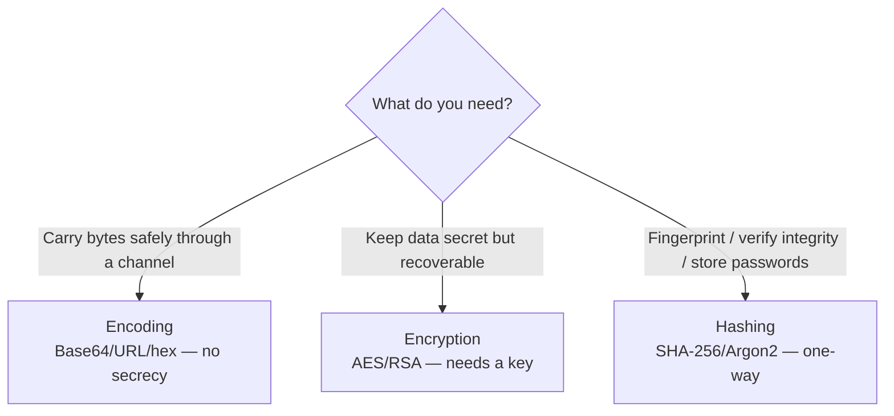
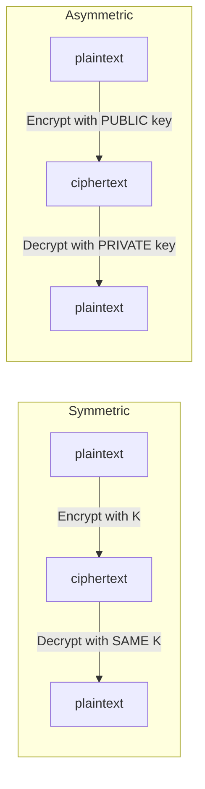
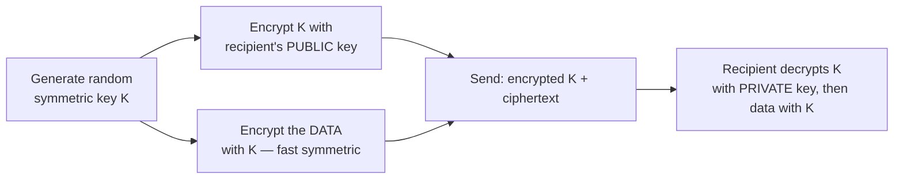
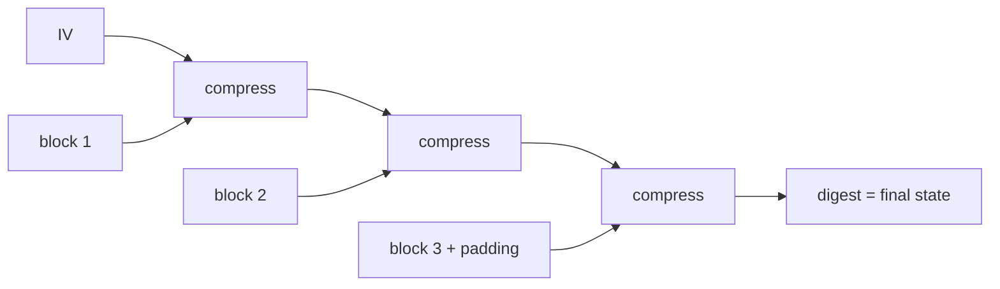
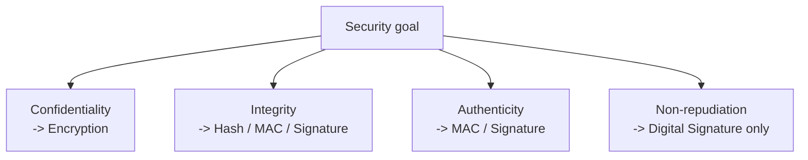
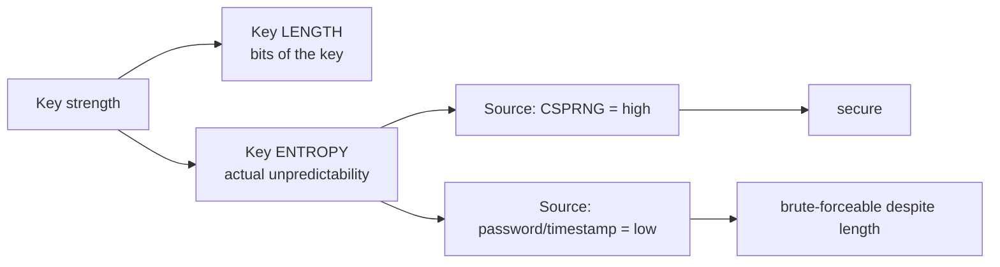
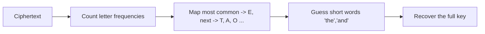
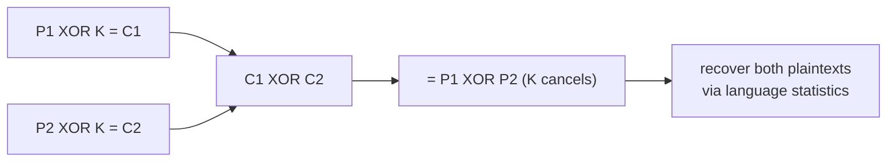
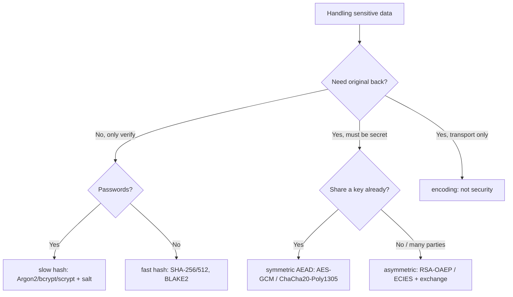

**Level:** Intermediate · **Track:** Cryptography · **Read time:** 180 min

This is Chapter 1 of the Cryptography series — Notebook 7. The previous notebook (Web
Fundamentals) ended on a warning it repeated in every chapter: *encoding is not encryption.* A
Base64 cookie hides nothing; a `base64(user:id)` "session" is forgeable; a JWT payload is readable
by anyone. Those were symptoms of one confusion — treating a reversible, keyless *encoding* as if
it provided secrecy. This notebook fixes that confusion at the root by building real
cryptography from first principles, and this first chapter draws the three lines everyone blurs:
**encoding**, **encryption**, and **hashing**.

They look superficially similar — each turns readable data into scrambled-looking data — but they
have completely different purposes, guarantees, and failure modes. Mix them up and you ship
catastrophic bugs: storing passwords with encryption (reversible!) instead of hashing, "encrypting"
with Base64, hashing data you needed to recover, or trusting a hash for confidentiality. Half of
all real-world crypto vulnerabilities are not broken math — they're the *wrong primitive for the
job*. So before AES, RSA, or Argon2, we get the taxonomy exactly right, learn the vocabulary the
rest of the notebook depends on, and meet the one primitive that underlies almost everything: XOR.

This chapter is deliberately conceptual and precise. Get these distinctions cemented and every
later chapter — symmetric ciphers, RSA, hashing, password storage, PKI — snaps into place. Get
them fuzzy and you'll misuse strong tools and build weak systems out of good parts.

---

## Part 1: The Three Transformations at a Glance

Start with the one table that, understood deeply, prevents most crypto mistakes:

| Property | Encoding | Encryption | Hashing |
|---|---|---|---|
| Purpose | Safe transport / representation | Confidentiality (secrecy) | Integrity / fingerprinting |
| Uses a key? | **No** | **Yes** | No (HMAC adds a key) |
| Reversible? | Yes (anyone) | Yes (**with the key**) | **No** (one-way) |
| Output size | Proportional to input | ~Proportional to input | **Fixed** (e.g. 256 bits) |
| Provides secrecy? | **No** | Yes | No |
| Example | Base64, URL, hex | AES, RSA, ChaCha20 | SHA-256, bcrypt |
| "Undo" needs | Nothing | The key | Impossible (brute force only) |

Read the columns as answers to *"what problem does this solve?"*:

- **Encoding** solves *representation*: how do I carry these bytes through a channel that only
  accepts certain characters? It is a public, reversible re-spelling. No secret is involved, so it
  provides **zero confidentiality**. (Notebook 6, Chapter 6 covered this in full.)
- **Encryption** solves *confidentiality*: how do I make data unreadable to everyone except holders
  of a secret key, while keeping it *recoverable* by those who do hold the key? It is reversible —
  **but only with the key**.
- **Hashing** solves *integrity/identity*: how do I produce a small, fixed-size fingerprint of data
  such that the same input always gives the same fingerprint, a different input almost never does,
  and you **cannot reconstruct the input** from the fingerprint? It is deliberately **one-way**.



**The decision rule, memorized:** *Do you need to get the original back?* If yes and it must be
secret → **encryption**. If yes and it's just for transport → **encoding**. If you never need the
original back, only to *verify* or *compare* → **hashing**. Password storage is the canonical case
where people pick wrong: you never need to recover a password, only to check one, so you **hash**
(and specifically, you use a slow password hash — Chapter 5), never encrypt.

---

## Part 2: Encoding — Reversible, Keyless, No Secret (Recap + Framing)

Encoding is the transformation you already met. It maps bytes to a representation safe for a
particular channel, using a *public, fixed* algorithm and **no key**. Because the algorithm is
public and keyless, *anyone* can reverse it — that is the entire point, and the entire limitation.

```bash
echo -n "secret data" | base64          # c2VjcmV0IGRhdGE=   (looks scrambled...)
echo -n "c2VjcmV0IGRhdGE=" | base64 -d   # secret data       (...but trivially reversed)
```

The output *looks* obscured to a human, which is exactly why it's dangerous: it invites the belief
that it's "protected." It is not. Base64, hex, URL-encoding, and HTML entities are all encodings;
none provides secrecy or integrity.

**Why this matters as a security control (it doesn't):**

- **"We Base64 the token so users can't read it."** They can — one `base64 -d`. Any data whose
  confidentiality you rely on must be *encrypted*.
- **"We encode the config so it can't be tampered with."** Encoding provides no integrity; an
  attacker decodes, edits, re-encodes. Integrity needs a *hash/MAC/signature*.
- **Base64 is not compression, encryption, or hashing.** It actually *grows* data ~33%.

Encoding *does* legitimately appear *alongside* crypto — you Base64 a binary ciphertext to put it
in JSON, or hex-encode a hash to print it. That's fine: the secrecy comes from the encryption, the
integrity from the hash; the encoding is just packaging. The bug is ever treating the packaging
*as* the security. Keep the mental boundary sharp: **encoding is a costume, not a lock.**

---

## Part 3: Encryption — Confidentiality With a Key

Encryption transforms **plaintext** into **ciphertext** using an algorithm (a **cipher**) and a
**key**, such that the ciphertext reveals nothing useful about the plaintext to anyone without the
key, and holders of the (correct) key can **decrypt** back to the exact plaintext.

```
plaintext  --[ Encrypt(key) ]-->  ciphertext  --[ Decrypt(key) ]-->  plaintext
```

The security lives entirely in the **key**, not the algorithm — a principle we formalize in Part 6
(Kerckhoffs's principle). A modern cipher's algorithm is public, studied by the whole world, and
still secure *because* breaking it without the key is computationally infeasible.

There are two families, each with its own chapter later:

- **Symmetric encryption** (Chapter 2): the *same* key encrypts and decrypts. Fast, used for bulk
  data. Examples: **AES**, **ChaCha20**. The challenge is *sharing the key secretly*.
- **Asymmetric / public-key encryption** (Chapter 3): a *key pair* — a **public key** encrypts,
  a **private key** decrypts (or vice-versa for signatures). Solves key distribution but is slow;
  used to bootstrap symmetric keys. Examples: **RSA**, **ECC**.



A first, hands-on taste with OpenSSL (symmetric AES — details in Chapter 2):

```bash
# Encrypt a file with AES-256 (key derived from a passphrase)
echo "meet at noon" > msg.txt
openssl enc -aes-256-cbc -pbkdf2 -salt -in msg.txt -out msg.enc -k "correcthorse"
xxd msg.enc | head -1        # random-looking bytes; no structure visible
# Decrypt — impossible without the passphrase/key
openssl enc -d -aes-256-cbc -pbkdf2 -in msg.enc -out out.txt -k "correcthorse"
cat out.txt                  # meet at noon
```

The defining property: **reversible, but only with the key.** Lose the key and the data is gone
(that's ransomware's whole business model — encrypt your files, sell you the key). Leak the key and
the confidentiality is gone. This is why **key management** — generating, storing, rotating,
destroying keys — is the hardest part of applied cryptography, and why "we encrypted it" is only as
strong as "…and here's where the key lives and who can reach it."

**Why real systems use *both* families — hybrid encryption.** Symmetric crypto is fast but needs a
shared secret key; asymmetric crypto solves key distribution but is far too slow for bulk data. So
nearly every real protocol composes them: use *asymmetric* crypto once to agree on (or deliver) a
random *symmetric* key, then use the fast symmetric cipher for all the actual data. That's exactly
how **TLS** (Notebook 6, Ch 10), PGP email, and encrypted messengers work.



Keep this composition in mind: when you meet RSA/ECC in Chapter 3, their job is almost never to
encrypt your gigabytes — it's to protect the *little* symmetric key that does.

---

## Part 4: Hashing — One-Way Fingerprints

A **cryptographic hash function** takes an input of any size and produces a **fixed-size** output
(the **hash**, **digest**, or **fingerprint**) — e.g. SHA-256 always outputs 256 bits (64 hex
chars), whether the input is one byte or one gigabyte. It is **one-way**: given a hash, you cannot
feasibly compute an input that produces it.

```bash
echo -n "hello" | sha256sum
# 2cf24dba5fb0a30e26e83b2ac5b9e29e1b161e5c1fa7425e73043362938b9824  -

echo -n "hellp" | sha256sum   # change ONE letter ->
# 8b9c... completely different (avalanche effect)
```

A good cryptographic hash has four properties, each of which maps to a security requirement:

| Property | Definition | Why it matters |
|---|---|---|
| Deterministic | same input → same hash, always | you can *verify* by recomputing |
| One-way (preimage resistance) | can't find input from hash | protects hashed passwords/data |
| Second-preimage resistance | given input x, can't find y≠x with same hash | can't substitute a forgery for a known file |
| Collision resistance | can't find *any* two inputs with same hash | signatures/certs can't be forged |
| Avalanche effect | tiny input change → ~50% of output bits flip | no partial information leaks |

Note what hashing does **not** provide: **confidentiality** (a hash of a short/guessable input can
be brute-forced by hashing candidates — the entire premise of password cracking, Chapter 5) and it
is **not reversible** (you cannot "decrypt" a hash; sites that "reverse" MD5 are just looking up
precomputed dictionaries). Hashing answers *"is this the same data / a valid input?"*, never *"what
was the data?"*.

**Where hashing is used:**

- **Integrity:** publish a file's SHA-256; anyone can recompute and confirm it wasn't tampered with
  in transit (Chapter 4).
- **Password storage:** store `hash(password)` (with a salt and a *slow* function — Chapter 5), so a
  database breach doesn't reveal the passwords directly.
- **Deduplication / content addressing:** git commits, IPFS, and content-addressed stores key data
  by its hash.
- **Digital signatures:** you sign the *hash* of a document, not the document (Chapter 6).
- **Proof of work / commitments:** blockchains and commitment schemes.

**Broken vs current hashes matter enormously:** **MD5** and **SHA-1** are broken for
collision-resistance (practical collisions exist — the basis of real cert-forgery and the SHAttered
attack), so they must not be used where collision resistance matters (signatures, certs). **SHA-256/
SHA-3/BLAKE2** are current for general hashing. And crucially, **fast general-purpose hashes are the
wrong tool for passwords** — passwords need deliberately *slow* hashes (bcrypt/scrypt/Argon2,
Chapter 5). Same word "hashing," very different requirements.

### A peek at hash internals — Merkle–Damgård and length extension

Most classic hashes (MD5, SHA-1, SHA-256) share a construction called **Merkle–Damgård**: split
the message into fixed-size blocks, then repeatedly feed each block plus the running "state" into a
compression function, starting from a fixed initialization value; the final state is the digest.



This design has a subtle, security-relevant flaw: **length-extension**. Because the digest *is* the
internal state after the last block, an attacker who knows `hash(secret ‖ message)` and the length
of `secret` can **continue hashing** from that state and compute `hash(secret ‖ message ‖ padding ‖
extra)` — a *valid* hash of a message they never fully knew, **without knowing the secret**. This
breaks the naive "authentication" scheme `token = SHA256(secret ‖ data)`: an attacker can append
`&admin=true` and forge a valid token.

```
Given:   H = SHA256(secret || "user=guest")   and len(secret)
Attacker computes:  SHA256(secret || "user=guest" || padding || "&admin=true")
         ...by resuming from H — no secret needed.  (real bug: Flickr API, 2009)
```

The fixes are exactly the primitives later chapters build: use **HMAC** (a keyed construction
designed to resist length-extension — Chapter 4), or a hash that isn't Merkle–Damgård
(**SHA-3/Keccak** uses a "sponge" and **BLAKE2** is immune). The lesson for now: *the shape of a
hash's construction leaks into how it can be misused* — recognizing "custom MAC via `hash(secret ‖
msg)`" as a length-extension bug is a real bug-bounty and CTF finding, and it's why you never build
a MAC by hand.

---

## Part 5: The CIA Vocabulary — Confidentiality, Integrity, Authenticity

Cryptography exists to provide a small set of **security guarantees**. Naming them precisely lets
you say exactly what a system does and does not protect.

- **Confidentiality** — only authorized parties can *read* the data. Provided by **encryption**.
- **Integrity** — the data hasn't been *altered* (accidentally or maliciously). Provided by
  **hashes / MACs / signatures**.
- **Authenticity** — the data really came from who it claims to (*origin* is genuine). Provided by
  **MACs (shared key)** and **digital signatures (public key)**.
- **Non-repudiation** — the sender *cannot later deny* having sent it. Provided by **digital
  signatures** (not by MACs, since both parties share the MAC key).



The critical insight the rest of the notebook builds on: **these are independent guarantees, and
one primitive rarely provides all of them.** Encryption gives confidentiality but, on its own,
**not integrity** — an attacker can flip ciphertext bits to corrupt or manipulate the plaintext
without knowing the key (the reason we use **authenticated encryption**, AES-GCM, in Chapter 2, and
why unauthenticated CBC is dangerous). A hash gives integrity against *accidental* change but not
against a malicious attacker who can recompute it — for adversarial integrity you need a **keyed**
construction (HMAC) or a signature (Chapter 4/6).

| Guarantee | Symmetric primitive | Asymmetric primitive |
|---|---|---|
| Confidentiality | AES, ChaCha20 | RSA-OAEP, ECIES |
| Integrity + Authenticity | HMAC, AES-GCM/Poly1305 | Digital signature (RSA/ECDSA/EdDSA) |
| Non-repudiation | ✗ (shared key) | ✓ signatures |
| Key exchange | (pre-shared) | Diffie-Hellman, ECDH |

Real protocols compose these. **TLS** (Notebook 6, Chapter 10) uses asymmetric crypto to
authenticate the server and agree a key, then symmetric authenticated encryption for the bulk data
— confidentiality *and* integrity *and* authenticity, each from the right primitive. Learning to
decompose any system into "which guarantee, from which primitive?" is the core skill this notebook
builds.

**Concretely, why "encryption ≠ integrity" bites.** Imagine a cookie encrypted with an
unauthenticated stream cipher (XOR-style keystream), containing `role=user`. The attacker can't
*read* it (no key), but they *can* flip specific ciphertext bits — and because keystream ciphers
XOR plaintext with a keystream, flipping ciphertext bit *i* flips plaintext bit *i*. If the
attacker knows the plaintext layout (a fair assumption — field names are predictable), they compute
exactly which bits turn `user` into `adm n`-style targeted edits, tampering the message **without
ever decrypting it**. Confidentiality held; integrity failed. This is the **bit-flipping attack**,
and it's why unauthenticated modes are dangerous and why we use **authenticated encryption (AEAD)**
— AES-GCM, ChaCha20-Poly1305 — which bundle a MAC so any tampering is *detected and rejected* on
decryption (Chapter 2). "Encrypt, then also authenticate" is not optional; it's the default.

---

## Part 6: Kerckhoffs's Principle, Keys, and Entropy

Two foundational ideas govern *why* modern crypto is trustworthy and *where* it breaks.

### Kerckhoffs's principle — the algorithm is public; only the key is secret

Stated in the 19th century and truer than ever: **a cryptosystem should be secure even if
everything about it, except the key, is public knowledge.** The corollary is Shannon's maxim: "the
enemy knows the system." This is why AES, RSA, and SHA-256 are open standards, published, and
attacked by the entire cryptographic community — and trusted *because* of that scrutiny, not
despite it.

The opposite — **"security through obscurity,"** relying on a *secret algorithm* — is a red flag.
Secret ciphers are almost always weak (they never got the scrutiny), and the secret leaks anyway
(reverse-engineering, an insider, a leaked binary). Every catastrophic proprietary-crypto failure
(from DVD CSS to countless IoT devices rolling their own) is a Kerckhoffs violation. **Rule: never
roll your own crypto, and never trust a system whose security depends on a hidden algorithm.**

### Keys and entropy — where security actually lives

If the algorithm is public, all security concentrates in the **key**, and a key is only as strong
as its **entropy** — its unpredictability, measured in bits (Notebook 6, Chapter 3 introduced
entropy for session IDs; it's the same idea). A 256-bit AES key drawn from a true CSPRNG has 256
bits of entropy → 2²⁵⁶ possible keys → brute force is physically impossible. But a 256-bit key
*derived from the password "hunter2"* has the entropy of "hunter2" (~a few bits) — the key *space*
is huge but the *used* space is tiny, and an attacker searches only the small space.



This is why key *generation* must use a **CSPRNG** (cryptographically secure PRNG):
`os.urandom`, `secrets`, `crypto.randomBytes`, `/dev/urandom`, `SecureRandom` — **not** `random`,
`Math.random`, `rand()`, or anything time-seeded (the Mersenne-Twister/predictable-seed problem
from Notebook 6, Chapter 3, is exactly as fatal for keys as for session IDs).

```python
import secrets
key = secrets.token_bytes(32)     # 256-bit key, 256 bits of entropy — correct
iv  = secrets.token_bytes(16)     # random IV/nonce — also from the CSPRNG
```

**Randomness is the foundation under everything:** keys, IVs/nonces, salts, session IDs, tokens,
challenge values. A weak RNG silently destroys the security of an otherwise-perfect cipher — the
Debian OpenSSL 2008 disaster (a broken RNG made keys guessable) and the Sony PS3 ECDSA break (a
reused nonce) are two of the most famous crypto failures, and neither broke the *math* — they broke
the *randomness*. When you audit crypto, follow the randomness first.

### "How many bits is enough?" — security levels and the birthday bound

Cryptographers measure strength in a **security level**: the log₂ of the work an attacker must do.
A "128-bit security level" means ~2¹²⁸ operations to break — comfortably infeasible for any
foreseeable adversary; **112 bits** is today's practical minimum, **128 bits** the standard target,
**256 bits** the paranoid/long-term choice. Crucially, *different primitives need different key
sizes for the same security level*, because they're attacked differently:

| Security level | Symmetric key (AES) | RSA modulus | ECC key | Hash output (collision) |
|---|---|---|---|---|
| 112-bit | 3DES (legacy) | 2048-bit | 224-bit | SHA-224 |
| 128-bit | AES-128 | 3072-bit | 256-bit | SHA-256 |
| 192-bit | AES-192 | 7680-bit | 384-bit | SHA-384 |
| 256-bit | AES-256 | 15360-bit | 512-bit | SHA-512 |

Two things jump out. First, **RSA needs enormous keys** for the same strength ECC gets from a tiny
one (Chapter 3 explains why — different hard problems). Second, **a hash's collision resistance is
only *half* its output size.** A 256-bit hash gives 256-bit *preimage* resistance but only *128-bit*
**collision** resistance — because of the **birthday paradox**: you expect a collision after roughly
√(2ⁿ) = 2^(n/2) hashes, not 2ⁿ. (Just as only 23 people give a >50% chance two share a birthday, far
fewer than 365.) This is why signatures using a 128-bit-collision hash target 128-bit security, and
why SHA-1's 80-bit collision resistance fell to real-world attacks. When someone says "we use a
256-bit hash so we have 256-bit security," they're off by a factor of two for anything that depends
on collisions.

The practical upshot: match the key size to the *security level you need and the lifetime of the
data* (data that must stay secret for 30 years wants 256-bit today), and remember that "bigger
number" isn't automatically comparable across primitive families — a 256-bit ECC key and a
3072-bit RSA key are roughly equal, and both beat a 256-bit key made from a weak password.

---

## Part 7: Classical Ciphers and Why They All Fell

Before modern cryptography, secrecy relied on **classical ciphers** — and every one of them is
broken today. Studying them isn't nostalgia: they teach the two operations all encryption is built
from (**substitution** and **transposition**), and they show *how* ciphers fail, which is exactly
the intuition you need to spot weak crypto in the wild. Modern ciphers are, in a real sense,
classical ideas done at industrial strength with keys and rounds.

### Caesar / shift cipher — substitution with a tiny key

The Caesar cipher shifts each letter by a fixed amount (the key). Shift by 3: `A→D`, `B→E`, …,
`HELLO → KHOOR`.

```python
def caesar(text, k):
    out = []
    for c in text:
        if c.isalpha():
            base = ord('A') if c.isupper() else ord('a')
            out.append(chr((ord(c) - base + k) % 26 + base))
        else: out.append(c)
    return ''.join(out)

print(caesar("HELLO", 3))     # KHOOR
print(caesar("KHOOR", -3))    # HELLO
```

Its fatal flaw is a **keyspace of 25** — an attacker just tries all 25 shifts (a "brute force"
that takes microseconds). This is the concrete lesson behind Part 6's entropy point: the algorithm
is fine, but the *key space is far too small*, so security collapses. **ROT13** is Caesar with
k=13 (and is used only for hiding spoilers, never for security).

### Monoalphabetic substitution — bigger key, still broken by statistics

Replace each letter with an arbitrary other letter (a fixed permutation of the alphabet). Now the
key is one of 26! ≈ 4×10²⁶ permutations — a *huge* keyspace, seemingly unbreakable by brute force.
Yet it falls instantly to **frequency analysis**: in English, `E` is ~12.7% of letters, then `T`,
`A`, `O`, `I`, `N`… A substitution cipher preserves those frequencies (E just wears a mask), so you
match the most common ciphertext letter to `E`, the next to `T`, and so on, then finish with word
patterns.



The lesson — **a large keyspace does not imply security if the cipher leaks structure** — is one
of the most important in cryptography. Frequency analysis (9th-century, al-Kindi) was the first
true cryptanalysis, and its descendants break far more modern schemes. Any cipher where identical
plaintext blocks produce identical ciphertext blocks leaks this way — which, foreshadowing Chapter
2, is *exactly* the flaw in **AES-ECB mode**, the "modern substitution cipher" that famously leaks
the outline of an encrypted image.

### Vigenère — polyalphabetic, broken by finding the key length

The Vigenère cipher fixes the single-frequency leak by using a *keyword* to apply *different*
shifts to successive letters (letter 1 shifted by the keyword's 1st letter, etc., repeating). This
smears the frequency distribution and resisted analysis for centuries ("le chiffre indéchiffrable").
But it too fell: **Kasiski examination** and the **index of coincidence** recover the key *length*,
after which the ciphertext splits into that many independent Caesar ciphers, each broken by
frequency analysis.

Notice the shape: Vigenère is a **repeating-key XOR** over an alphabet, and its break — find the
period, then solve each stream — is *identical* to the repeating-key-XOR break in the Cryptopals
challenges and to the two-time-pad reasoning in Part 8. Repeating a short key over long data is a
recurring, timeless mistake.

### Transposition — rearranging, not replacing

The other primitive: **transposition** ciphers scramble the *order* of characters (e.g. write the
message in a grid by rows, read it out by columns) without changing the letters themselves.
Frequency analysis alone won't crack it (the letter counts are unchanged), but anagram/pattern
analysis and known structure will. Modern block ciphers combine **both** operations — substitution
(confusion) *and* transposition (diffusion), Shannon's two pillars — repeated over many rounds,
which is precisely why AES resists the statistical attacks that shred any single classical scheme.

| Classical cipher | Primitive | Key size | Broken by |
|---|---|---|---|
| Caesar / ROT13 | substitution | ~5 bits (25 shifts) | brute force |
| Monoalphabetic sub. | substitution | 26! ≈ 88 bits | frequency analysis |
| Vigenère | poly-substitution | keyword length | Kasiski + freq. analysis |
| Transposition | permutation | grid/route | anagram/pattern analysis |
| One-time pad (Part 8) | substitution (XOR) | = message length | **unbreakable** (if used right) |

**Why this matters for a modern engineer:** these breaks are the ancestors of real attacks. ECB
leaks like a substitution cipher; nonce reuse breaks like a two-time pad; repeating a short key
breaks like Vigenère. When you see a "custom cipher" in a device or app (a Kerckhoffs red flag from
Part 6), your first instinct — frequency analysis, look for repeated blocks, find the key period —
comes straight from this section, and it works far more often than it should.

---

## Part 8: XOR and the One-Time Pad — The Atom of Encryption

Almost all symmetric encryption reduces, at some level, to one absurdly simple operation:
**XOR** (exclusive or). XOR compares two bits and outputs 1 if they *differ*, 0 if they're the
same.

```
0 XOR 0 = 0     1 XOR 0 = 1
0 XOR 1 = 1     1 XOR 1 = 0
```

XOR has a magic property for cryptography: **it is its own inverse.** `A XOR B XOR B = A`. So if you
XOR plaintext with a key stream, then XOR the result with the *same* key stream, you get the
plaintext back:

```
ciphertext = plaintext XOR key
plaintext  = ciphertext XOR key      (same key "undoes" it)
```

```python
def xor(data: bytes, key: bytes) -> bytes:
    return bytes(d ^ key[i % len(key)] for i, d in enumerate(data))

pt = b"HELLO"
key = b"\x0f\x0f\x0f\x0f\x0f"
ct = xor(pt, key)                 # scrambled bytes
print(xor(ct, key))               # b'HELLO'  — XOR again to recover
```

### The one-time pad — provably unbreakable, and why we don't use it

If the key is **truly random**, **at least as long as the message**, **used only once**, and **kept
secret**, then XOR encryption is the **one-time pad (OTP)** — the *only* cipher with mathematically
*perfect secrecy*: the ciphertext gives an attacker **zero** information about the plaintext,
regardless of computing power. Every plaintext of that length is equally consistent with the
ciphertext.

So why isn't everything an OTP? Because the requirements are impractical: a key **as long as all
data you'll ever send**, delivered secretly in advance, and **never reused**. Real ciphers (AES,
ChaCha20) are, in effect, a way to *stretch a short key into a long, pseudo-random key stream* so
you get OTP-like XOR encryption from a small shared secret (Chapter 2's stream ciphers make this
literal).

### Why "used only once" is not optional — the two-time pad break

Reuse the pad and it shatters. If two messages are XORed with the *same* key stream:

```
C1 = P1 XOR K
C2 = P2 XOR K
C1 XOR C2 = P1 XOR P2      (the key cancels out!)
```

The key vanishes, leaving the XOR of two plaintexts — which is very often enough to recover both
(via crib-dragging / language statistics). This "**two-time pad**" mistake is a staple of CTF
crypto challenges and a real-world failure (it's essentially the flaw behind the WWII Venona
decrypts and modern **nonce-reuse** breaks in stream ciphers, Chapter 2).



**The takeaway:** XOR is the atom; the one-time pad shows the *ideal* (perfect secrecy from a
random, one-time, message-length key); real ciphers approximate it from a short key; and **nonce/
key reuse** is the recurring way that approximation is broken. Hold this and stream ciphers,
counter mode, and nonce-misuse in Chapter 2 will feel inevitable rather than arbitrary.

---

## Part 9: Hands-On Lab — Tell the Three Apart, and Break a Two-Time Pad

A single lab that makes the taxonomy tangible: distinguish encoding/encryption/hashing on real
data, then exploit the classic XOR key-reuse.

### Tool from scratch: OpenSSL

**OpenSSL** is the ubiquitous command-line crypto toolkit (and the library under most of the
internet's TLS). You'll use it throughout this notebook. Core sub-commands: `enc` (symmetric
encrypt/decrypt), `dgst` (hashing), `genrsa`/`rsa`/`pkeyutl` (asymmetric, Chapter 3), `x509`/`req`
(certs, Chapter 6). Install: it's preinstalled on Kali/macOS/most Linux (`openssl version` to
check).

### 9.1 The identification drill

```bash
# ENCODING — reversible by anyone, no key, output grows ~33%
echo -n "attack at dawn" | base64                       # YXR0YWNrIGF0IGRhd24=
echo -n "YXR0YWNrIGF0IGRhd24=" | base64 -d              # attack at dawn   (trivially back)

# HASHING — fixed 64-hex output, one-way, deterministic
echo -n "attack at dawn" | openssl dgst -sha256         # (64 hex chars)
echo -n "attack at dusk" | openssl dgst -sha256         # totally different (avalanche)
# ...no command exists to turn the hash back into the text.

# ENCRYPTION — needs a key; same input+key -> recoverable, wrong key -> nothing
echo -n "attack at dawn" | openssl enc -aes-256-cbc -pbkdf2 -a -k "sharedkey"   # ciphertext (base64)
echo "<ciphertext>" | openssl enc -d -aes-256-cbc -pbkdf2 -a -k "sharedkey"     # back to plaintext
echo "<ciphertext>" | openssl enc -d -aes-256-cbc -pbkdf2 -a -k "wrongkey"      # error / garbage
```

Three transformations, three signatures: encoding round-trips with no secret; hashing is a fixed
one-way digest; encryption round-trips **only with the key**. If you can label an unknown blob as
one of these on sight, you've internalized the chapter.

### 9.2 Recognize the primitive from the artifact

```bash
# Which is which?
python3 - <<'PY'
samples = {
 "YWRtaW46MTIz": "?",                                              # ends '=' pattern, decodes to text
 "5e884898da28047151d0e56f8dc6292773603d0d6aabbdd62a11ef721d1542d8": "?",  # 64 hex -> SHA-256
 "$2b$12$Kix...": "?",                                             # bcrypt prefix -> password hash
}
# Answers: Base64 encoding; SHA-256 hash; bcrypt password hash.
PY
```

The `$2b$` prefix (bcrypt), `$argon2id$` (Argon2), a 32/64/128-hex string (MD5/SHA-1/SHA-256/512),
and the `=`-padded Base64 look are the field marks you learn to read instantly (Chapter 5 goes
deep on the password-hash prefixes).

### 9.3 Break a two-time pad (XOR key reuse)

```python
# Two messages encrypted with the SAME XOR keystream — recover them.
def xor(a, b): return bytes(x ^ y for x, y in zip(a, b))

# (in a real challenge you'd only have c1, c2)
key = b"SUPER_SECRET_KEYSTREAM_REUSED!"
p1  = b"the missiles launch at 0600!!"
p2  = b"abort abort do not launch now"
c1, c2 = xor(p1, key), xor(p2, key)

# Attack: XOR the ciphertexts -> the key cancels, leaving P1 XOR P2
combined = xor(c1, c2)
print("P1 xor P2 =", combined)             # key is GONE

# If you can guess/crib part of one plaintext, you recover the other:
crib = b"abort abort"
print("recovered P1 start:", xor(combined[:len(crib)], crib))   # -> b'the missil'
```

Output shows the crib `"abort abort"` (a guessed fragment of P2) XORed against `P1⊕P2` reveals the
start of P1 (`"the missil…"`). Extend the crib and you peel out both messages — **no key ever
needed**, purely because the pad was reused. That is the two-time-pad break, and it's exactly the
shape of real nonce-reuse attacks on stream ciphers you'll meet next chapter.

**The fix** is the OTP rule you can't break: never reuse a keystream — which, for real ciphers,
means never reuse a **nonce/IV** with the same key. Chapter 2 makes that rule concrete for AES-CTR,
GCM, and ChaCha20.

### 9.4 Verify integrity with a hash — and see the avalanche

```bash
# Publisher computes and publishes a digest alongside a download
echo "the real installer bytes" > installer.bin
openssl dgst -sha256 installer.bin
# SHA256(installer.bin)= 9b8f...c3a1   <- publish this

# You download; recompute; compare. Match => not tampered in transit.
sha256sum installer.bin

# Attacker tampers by ONE byte:
echo "the real installer bytez" > installer.bin      # 's' -> 'z'
openssl dgst -sha256 installer.bin
# SHA256(installer.bin)= 4d2e...770f   <- completely different digest
```

A single flipped byte changes ~half the output bits (the avalanche effect from Part 4), so any
tampering is glaring — *provided the digest itself reached you untampered*. That caveat is the whole
point of Part 5: a plain hash gives integrity only against *accidental* corruption or an attacker
who *can't* also replace the published hash. Against an active attacker who controls the channel,
you need a **keyed** digest (**HMAC**) or a **signature**, because they can't recompute a keyed
value without the key. This is precisely why software vendors don't just post a SHA-256 next to a
download — they *sign* it (Chapter 6), so the integrity claim is also *authentic*.

### 9.5 Watch length-extension in one line of reasoning

```python
# Why token = sha256(secret + data) is forgeable (Part 4 internals).
# You don't need the secret to EXTEND a Merkle-Damgard hash you already have.
# Tools like hashpump/hash_extender automate it:
#   hash_extender -d 'user=guest' -s <known_hash> -a '&admin=true' -k <len(secret)> -f sha256
# Output: a NEW valid hash + the extended message — a forged, authenticated token.
```

The takeaway you can act on: if you *ever* see a homemade MAC of the form `hash(secret ‖ message)`,
that is a length-extension bug — report it, and replace it with `HMAC-SHA256(key, message)`.

---

## Part 10: Detection & Defense Angle — Choosing and Auditing Primitives

This foundational chapter's "defense" is really *design and audit judgment* — picking the right
primitive and spotting the wrong one, which is where most real crypto bugs are born.

**The selection checklist:**



**Red flags to catch in code review / pentests (each maps to a real bug class):**

- **Passwords encrypted (reversible) instead of hashed.** A DB breach then reveals every password.
  Passwords → slow salted hash, always.
- **Base64/hex/XOR-with-static-key called "encryption."** No key or a hardcoded/short key = no
  confidentiality. Look for `base64`, homebrew XOR, and constants named `KEY`.
- **MD5/SHA-1 where collision resistance matters** (signatures, certs, integrity of adversarial
  input). Migrate to SHA-256+.
- **Fast hash (SHA-256) for passwords with no/weak salt.** GPU-crackable at billions/sec (Chapter
  5). Wrong tool.
- **Encryption without integrity** (raw AES-CBC/ECB, no MAC). Use **AEAD** (GCM/Poly1305) so
  tampering is detected (Chapter 2).
- **Home-rolled crypto / secret algorithms.** Kerckhoffs violation; never trust it.
- **Weak randomness** for keys/IVs/salts/nonces (`random`, `Math.random`, time-seeded). Must be a
  CSPRNG.
- **Static or reused IV/nonce** with a stream cipher or CTR/GCM mode → two-time-pad / catastrophic
  break.

**As a blue-teamer / auditor**, grep the codebase for `md5`, `sha1`, `DES`, `ECB`, `Random(` (vs
`SecureRandom`), `Cipher.getInstance("AES")` with no mode, hardcoded keys/`IV = new byte[16]`
(all-zero IV), and any `base64`/custom XOR used where secrecy is claimed. These string-level tells
find the majority of real crypto findings, because — as promised at the top — most crypto bugs are
*wrong-primitive* choices, not broken math.

**The famous failures were all category errors, not math breaks.** Notice the pattern across the
most-cited real incidents — the algorithms were fine; the *usage* was wrong:

| Incident | Root cause (in this chapter's terms) |
|---|---|
| Adobe 2013 (150M passwords) | passwords **encrypted** (ECB, reversible) + no salt — should have been *hashed* |
| LinkedIn 2012 | passwords stored as **unsalted SHA-1** — fast hash, no salt, mass-cracked |
| Debian OpenSSL 2008 | broken **RNG** → guessable keys (randomness, not math) |
| Sony PS3 (2010) | **reused ECDSA nonce** → private key extracted (two-time-pad-style reuse) |
| Flickr API (2009) | `hash(secret ‖ data)` MAC → **length-extension** forgery |
| WEP (Wi-Fi) | **IV reuse** in RC4 keystream → recover the key |
| DVD CSS, many IoT | **secret proprietary cipher** → Kerckhoffs violation, trivially broken |

Every row is a concept from this chapter: wrong primitive (encrypt vs hash), fast-vs-slow hash,
weak randomness, nonce/keystream reuse, length-extension, security-through-obscurity. That is the
whole thesis restated as history: **learn the taxonomy and the failure modes, and you catch the
bugs before they ship.** The rest of this notebook gives you the depth to judge the *right*-primitive
choices with confidence.

---

## Part 11: Final Revision / Summary

- **Three transformations, three jobs.** **Encoding** = reversible, keyless, for *transport*, **no
  secrecy** (Base64/URL/hex). **Encryption** = keyed, reversible *with the key*, for
  *confidentiality* (AES/RSA). **Hashing** = one-way, fixed-size, for *integrity/fingerprinting*
  (SHA-256/Argon2). Decision rule: need the original back? secret→encrypt, transport→encode; only
  verify→hash.
- **Passwords are hashed, never encrypted** (you only ever *check* them), and with a *slow salted*
  hash (Chapter 5), not a fast one.
- **CIA guarantees are independent:** confidentiality (encryption), integrity (hash/MAC/signature),
  authenticity (MAC/signature), non-repudiation (signature only). **Encryption alone does not give
  integrity** → use authenticated encryption (AEAD).
- **Kerckhoffs's principle:** the algorithm is public; only the **key** is secret. Security through
  obscurity and home-rolled crypto are red flags.
- **Security lives in key entropy, from a CSPRNG.** Key *length* ≠ key *entropy*; a long key derived
  from a weak password is weak. Most famous crypto breaks were broken *randomness*, not broken math.
- **XOR is the atom.** It's its own inverse. The **one-time pad** (random, message-length, one-time,
  secret key) has *perfect secrecy* but is impractical; real ciphers stretch a short key into a long
  keystream. **Reusing a keystream/nonce (two-time pad) breaks everything** — the key cancels and
  both plaintexts fall out.

If you can look at any "we secured it with…" claim and immediately ask *which guarantee, from which
primitive, with a key of what entropy from what source* — you're ready for the real ciphers.

---

## Part 12: Cheat Sheet / Quick Reference

**Pick the primitive**

| Need | Use |
|---|---|
| Carry bytes through a text channel | Encoding (Base64/hex) — *not* security |
| Keep secret, recover with key | Encryption (AES-GCM / RSA-OAEP) |
| Verify integrity / fingerprint | Fast hash (SHA-256/BLAKE2) |
| Store passwords | Slow salted hash (Argon2/bcrypt/scrypt) |
| Integrity vs an attacker | HMAC or signature |
| Prove who sent it | Signature (also non-repudiation) |

**Identify a blob**

```
=/== padded, A–Za–z0–9+/   -> Base64 (encoding)
32/40/64 hex chars          -> MD5/SHA-1/SHA-256 (hash)
$2b$ / $argon2id$ / $6$     -> password hash
random bytes, needs key     -> ciphertext
```

**OpenSSL basics**

```bash
openssl dgst -sha256 file                       # hash
openssl enc -aes-256-cbc -pbkdf2 -salt -in f -out f.enc -k PASS   # encrypt
openssl enc -d -aes-256-cbc -pbkdf2 -in f.enc -out f -k PASS      # decrypt
openssl rand -hex 32                             # 256-bit CSPRNG key
```

**XOR facts:** `A^B^B = A` · OTP = random + message-length + one-time + secret = perfect secrecy ·
reuse keystream ⇒ `C1^C2 = P1^P2` ⇒ broken.

**Red flags:** password *encryption*, Base64-as-encryption, MD5/SHA-1 for signatures, fast hash for
passwords, AES with no MAC (no AEAD), home-rolled crypto, `random()` for keys, static/zero IV.

**Golden rule:** *never roll your own crypto; the algorithm is public, only the key is secret, and
the key is only as strong as its entropy.*

---

## Part 13: Common Pitfalls

- **Confusing encoding with encryption.** Base64 protects nothing. If confidentiality matters,
  encrypt with a key.
- **Encrypting passwords instead of hashing them.** Reversible storage = one breach reveals all
  passwords. Hash (slow + salt).
- **Using a fast hash (SHA-256) for passwords.** GPU-crackable; use Argon2/bcrypt/scrypt.
- **Assuming encryption gives integrity.** It doesn't — attackers flip ciphertext bits. Use AEAD
  (GCM/Poly1305) or add a MAC.
- **Using MD5/SHA-1 where collisions matter.** Broken; forge-able signatures/certs. Use SHA-256+.
- **Home-rolling crypto or trusting secret algorithms.** Kerckhoffs violation; it will break.
- **Weak randomness for keys/IVs/salts/nonces.** `random`/`Math.random`/time-seeded = predictable =
  broken. Use a CSPRNG.
- **Reusing an IV/nonce/keystream.** Two-time-pad break; catastrophic for stream ciphers/CTR/GCM.
- **Thinking key length alone = strength.** Entropy from the *source* is what counts; a 256-bit key
  from "password" has ~no entropy.
- **"We reverse the hash to check the password."** You don't reverse hashes; you recompute and
  compare. If something "decrypts" a hash, it's a lookup table.
- **Building a MAC as `hash(secret ‖ message)`.** Length-extension forgery on Merkle–Damgård
  hashes. Use `HMAC` (Chapter 4).
- **Confusing "256-bit hash" with "256-bit collision resistance."** The birthday bound halves it to
  128-bit. Size your hashes for the *collision* level you need.
- **Assuming a big key on one primitive equals a big key on another.** 256-bit ECC ≈ 3072-bit RSA;
  raw bit counts aren't comparable across families.

---

## Part 14: Practice Labs & Resources

- **CryptoHack** (cryptohack.org) — the best interactive intro; its **Introduction / Encoding /
  XOR / General** sections drill this chapter exactly (encoding vs encryption, XOR properties,
  two-time-pad recovery). Free.
- **picoCTF — Cryptography** category — beginner challenges on encoding recognition, XOR reuse, and
  hashing; ideal first CTF crypto.
- **CryptoPals Crypto Challenges** (Set 1) — "convert hex/base64," "fixed XOR," "single-byte XOR,"
  "break repeating-key XOR" — the canonical hands-on path from encoding into real cryptanalysis.
- **OverTheWire Krypton** — wargame progressing from encoding through classical ciphers to XOR.
- **The Cryptopals + CryptoHack combo** is the standard self-study route; pair them with this
  notebook chapter by chapter.
- **Tooling to master:** **OpenSSL** (`dgst`, `enc`, `rand`), **CyberChef** (Notebook 6, Ch 6 — the
  "Magic"/XOR/entropy ops), Python's `hashlib`/`secrets`/`cryptography` library, and `hashcat`
  (Chapter 5) for feeling how weak hashes fall.

**Practice questions / mini-labs to self-test:**

1. You find `YWRtaW46c3VwZXJzZWNyZXQ=` stored as a "password." Identify the transformation, recover
   the value, and explain in one sentence why this storage is catastrophic and what should replace
   it.
2. Explain, with the XOR algebra, exactly why encrypting two messages with the same one-time pad
   lets an attacker recover both — then state the single rule that prevents it.
3. A service stores user passwords with `SHA256(password)`. Give two independent reasons this is
   insufficient and name the correct primitive.
4. Your colleague says "we made the token secure by Base64-encoding it and using a secret encoding
   scheme we invented." Name the two principles this violates and what to do instead.
5. Classify each for confidentiality/integrity/authenticity/non-repudiation: AES-GCM, SHA-256,
   HMAC-SHA256, RSA signature. Which single one provides non-repudiation and why?

6. Given a 128-bit-output hash, an attacker wants a *collision* (any two inputs with the same
   digest). Roughly how many hashes must they compute, and what is that phenomenon called? Now
   answer the same for a *preimage*.
7. A vendor posts a SHA-256 next to a download link over plain HTTP. Explain the exact scenario in
   which this provides *no* integrity protection, and what they should do instead.

---

*Also on [Praneeth's portfolio](https://ping-praneeth.vercel.app/notebook/cryptography/01-cryptography-foundations-encoding-vs-encryption-vs-hashing), with comments and the latest edits.*
