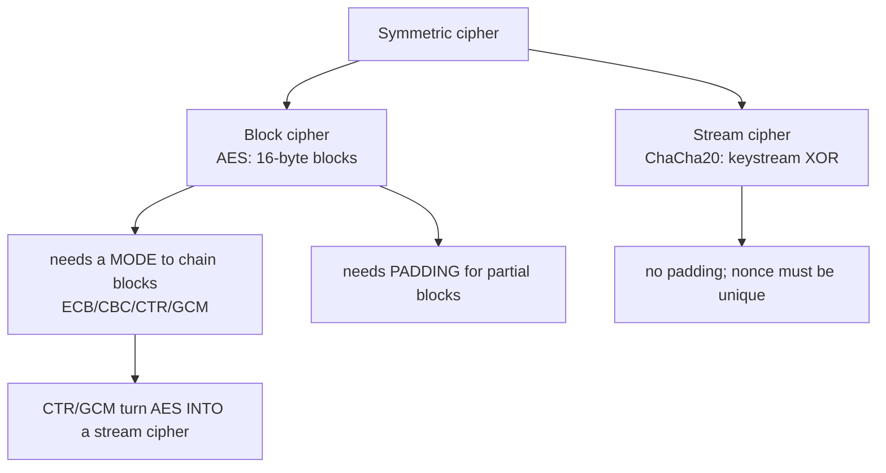
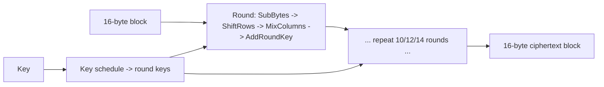
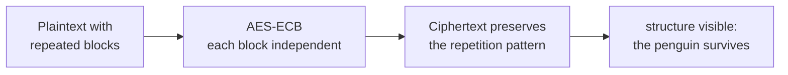
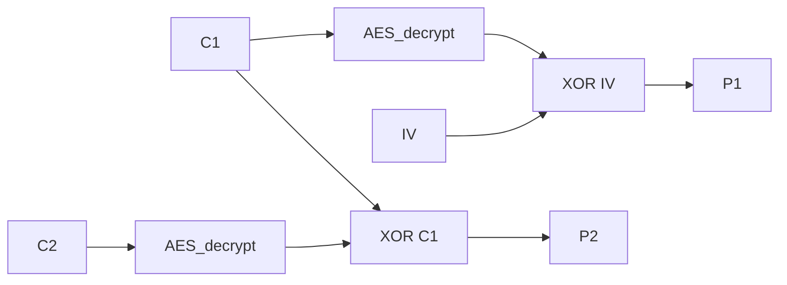
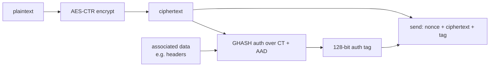
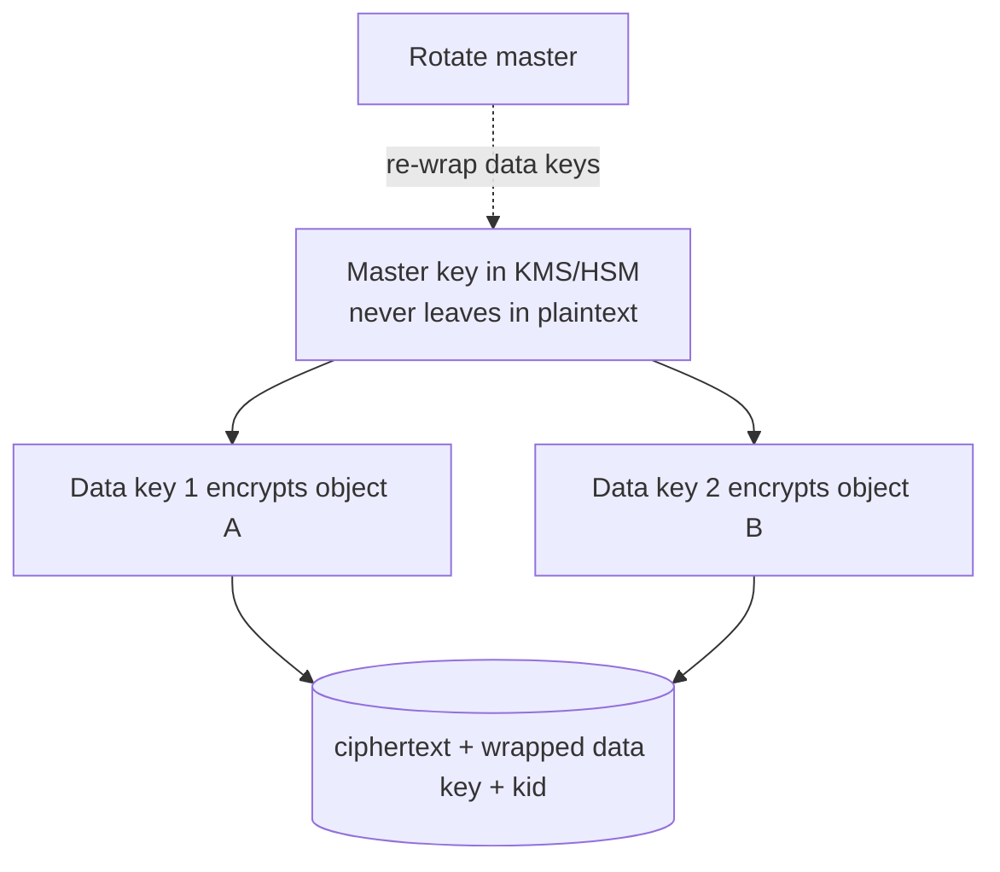
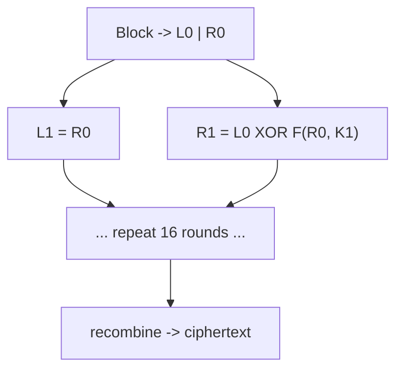

This is Chapter 2 of the Cryptography series — Notebook 7. Chapter 1 drew the line between
encoding, encryption, and hashing, introduced keys and entropy, and showed the XOR/one-time-pad
atom that underlies all symmetric encryption. It also planted two warnings we now cash in:
*encryption alone does not give integrity* (the bit-flipping attack), and *reusing a keystream/nonce
breaks everything* (the two-time pad). This chapter builds the real thing on top of those ideas —
**symmetric encryption**: one shared key, used to encrypt and decrypt, fast enough for gigabytes.

Symmetric crypto is what actually protects your data at rest and in transit. Every HTTPS connection,
every encrypted disk, every secure messenger uses a symmetric cipher — almost always **AES** or
**ChaCha20** — for the bulk work. And here is the crucial, bug-relevant truth: **the cipher is
almost never the problem.** AES has stood since 2001 with no practical break. The vulnerabilities
live entirely in *how you use it* — which **mode** you pick, whether you reuse an **IV/nonce**,
whether you add **integrity**, and where you keep the **key**. The famous "ECB penguin," the
padding-oracle attacks that broke real frameworks, the bit-flipping that forged cookies, the WEP
Wi-Fi disaster — none broke AES or RC4's core; all were mode/IV/integrity misuse.

So this chapter spends little time on AES's internal math (you rarely need it) and a lot on modes,
IVs, authentication, and key management (where you constantly do). By the end you'll pick the right
cipher and mode by reflex — **AES-GCM or ChaCha20-Poly1305, never ECB, never unauthenticated CBC**
— and you'll have exploited a padding oracle and a bit-flip with your own hands so the "why" is
muscle memory, not dogma.

---

## Part 1: Block Ciphers vs Stream Ciphers

Symmetric ciphers come in two shapes, and the distinction drives everything about modes and IVs.

- A **block cipher** encrypts fixed-size **blocks** of data at a time (AES: 128-bit / 16-byte
  blocks). It's a keyed permutation on 16-byte values: same key + same 16-byte input → same 16-byte
  output, always. To encrypt data longer than one block, you need a **mode of operation** (Part 3)
  that says how to chain blocks. To encrypt data that isn't a whole number of blocks, you need
  **padding** (Part 4).
- A **stream cipher** generates a pseudo-random **keystream** and XORs it with the plaintext, one
  byte (or bit) at a time — exactly the one-time-pad construction from Chapter 1, but with a
  keystream *stretched from a short key* instead of a truly random pad. No blocks, no padding.
  Examples: **ChaCha20**, RC4 (broken, don't use).



The beautiful unifying fact — which removes half the mystery — is that some block-cipher *modes*
(CTR, GCM) **turn a block cipher into a stream cipher**: they use AES to *generate a keystream* and
then XOR, rather than encrypting the data directly. So "block vs stream" is less a hard wall than a
choice of construction, and the same Chapter-1 rules (never reuse the keystream → never reuse the
nonce) apply to both. Keep that in view; it's why nonce reuse is catastrophic in CTR and GCM
specifically.

| | Block cipher | Stream cipher |
|---|---|---|
| Unit | Fixed block (AES = 16 B) | Byte/bit keystream |
| Padding | Needed (partial blocks) | Not needed |
| Random access | Depends on mode | Easy (keystream position) |
| Examples | AES, 3DES(legacy), DES(dead) | ChaCha20, RC4(broken) |
| Classic misuse | wrong mode (ECB), IV reuse | nonce/keystream reuse |

---

## Part 2: AES from the Outside — What You Actually Need

**AES** (Advanced Encryption Standard, originally *Rijndael*) is the block cipher the world
standardized on in 2001 after a public NIST competition (a Kerckhoffs triumph — chosen *because* it
was public and scrutinized). It encrypts **128-bit blocks** with a key of **128, 192, or 256 bits**
(AES-128 / AES-192 / AES-256).

Internally, AES runs the block through several **rounds** (10/12/14 for 128/192/256-bit keys) of
four operations that together provide Shannon's **confusion** (make the key–ciphertext relationship
complex) and **diffusion** (spread each input bit's influence across the output — the avalanche
effect):

| Step | What it does | Provides |
|---|---|---|
| **SubBytes** | substitute each byte via the **S-box** (a fixed non-linear lookup) | confusion |
| **ShiftRows** | cyclically shift the rows of the 4×4 state | diffusion |
| **MixColumns** | mix each column with a linear transform | diffusion |
| **AddRoundKey** | XOR the round key (derived from the key by the key schedule) | keying |



**What you actually need to remember** (you'll almost never implement AES — you'll call a library):

- AES is a **secure, fast, hardware-accelerated** (AES-NI CPU instructions) block cipher. AES-128 is
  plenty for almost everything; AES-256 for long-term/paranoid needs (Chapter 1's security levels).
- AES-256 vs AES-128 is *not* "twice as strong" — both are unbroken; the difference is margin
  against future/quantum attacks (Grover's algorithm roughly halves symmetric security, making
  AES-256 a ~128-bit post-quantum choice).
- **AES the block cipher only encrypts one 16-byte block.** Everything interesting — and every bug —
  is in the **mode** that turns "encrypt one block" into "encrypt a message." That's Part 3 onward.

**Red team / CTF note:** you basically never attack AES's rounds or S-box (that's academic
cryptanalysis, not practical). You attack the mode, the IV/nonce handling, the padding, the missing
authentication, or the key storage. Internalize that and you're looking in the right place.

---

## Part 3: Modes of Operation — Where the Bugs Live

A block cipher encrypts *one block*. A **mode of operation** defines how to use it repeatedly to
encrypt a whole message. The mode choice is the single most important — and most misused —
decision in symmetric encryption. We'll cover the four that matter: **ECB** (never use), **CBC**
(legacy, needs care), **CTR** (stream-like), and **GCM** (authenticated — the default). All use the
*same* AES underneath; they differ only in how blocks are combined.

### ECB — Electronic Codebook (the one that leaks)

The naive mode: chop the message into blocks and encrypt each **independently** with the key.

```
C1 = AES(P1)   C2 = AES(P2)   C3 = AES(P3)  ...
```

The fatal property: **identical plaintext blocks produce identical ciphertext blocks.** ECB is a
modern *substitution cipher* (Chapter 1, Part 7) at the block level — so it leaks structure exactly
like a monoalphabetic substitution leaks letter frequencies. The canonical demonstration is the
**"ECB penguin"**: encrypt a bitmap of Tux the penguin with AES-ECB and you can still *see the
penguin* in the ciphertext, because large same-colored regions become identical repeated blocks.



Beyond image leakage, ECB enables **cut-and-paste** attacks (rearrange ciphertext blocks to
rearrange plaintext, since blocks are independent) and **known-plaintext dictionary** attacks. **Rule:
never use ECB for anything.** If you see `AES/ECB`, `MODE_ECB`, or `openssl enc -aes-256-ecb` in
code, it's a finding.

### CBC — Cipher Block Chaining (legacy, IV-dependent)

CBC fixes ECB's leakage by **chaining**: before encrypting each block, XOR it with the *previous*
ciphertext block. The first block has no predecessor, so it's XORed with a random
**Initialization Vector (IV)**.

```
C1 = AES(P1 XOR IV)
C2 = AES(P2 XOR C1)
C3 = AES(P3 XOR C2)  ...
```

Now identical plaintext blocks produce *different* ciphertext (each depends on all prior blocks), so
the ECB leak is gone. But CBC introduces its own requirements and bugs:

- **The IV must be random and unpredictable** (per message) — a fixed/zero IV re-introduces leakage
  on the first block and enables chosen-plaintext attacks (the **BEAST** attack on TLS 1.0 exploited
  predictable CBC IVs). The IV is not secret, but it must be unpredictable, and it's sent alongside
  the ciphertext.
- **CBC needs padding** for partial final blocks (Part 4), which opens the **padding-oracle** attack
  (Part 5) — one of the most important practical crypto attacks.
- **CBC provides no integrity** — a bit-flip in `Ci` flips the corresponding plaintext bits in
  `P(i+1)` (a targeted, if messy, tampering primitive). CBC must be paired with a MAC (encrypt-then-MAC).

CBC decryption reverses the chaining — decrypt the block, then XOR with the previous ciphertext:



That `P_i = AES_decrypt(C_i) XOR C_(i-1)` equation is worth memorizing — it's the exact leverage the
padding oracle (Part 5) and the CBC bit-flip use: the attacker controls `C_(i-1)`, so they control
how the decrypted block maps to plaintext. Two more real CBC-in-TLS attacks come from these facts:
**BEAST** (TLS 1.0's predictable IVs let an attacker who can inject chosen plaintext decrypt secrets
block-by-block) and **Lucky 13** (a *timing* padding oracle — the MAC check took measurably different
time depending on padding, leaking the same boolean the explicit-error oracle does). Both are why
TLS 1.3 dropped CBC entirely, and both reinforce the rule: **CBC is legacy; reach for AEAD.**

### CTR — Counter mode (block cipher as stream cipher)

CTR turns AES into a stream cipher: encrypt a **counter** (nonce ‖ incrementing counter) to produce
a keystream, then XOR with the plaintext.

```
keystream_i = AES(nonce || counter_i)
C_i = P_i XOR keystream_i
```

CTR is fast, parallelizable, needs no padding, and allows random access. But it inherits the
one-time-pad rule with full force: **the (nonce ‖ counter) must never repeat under the same key.**
Reuse a nonce and you have a two-time pad — `C1 XOR C2 = P1 XOR P2` — and both plaintexts leak
(Chapter 1). CTR also provides **no integrity** on its own.

### GCM — Galois/Counter Mode (the modern default)

**GCM** is CTR mode **plus** a built-in authentication tag (a Galois-field MAC over the ciphertext
and optional "additional authenticated data"). It provides **confidentiality *and* integrity *and*
authenticity** in one primitive — this is **AEAD** (Authenticated Encryption with Associated Data),
and it is what you should use by default. Any tampering flips the tag check and decryption *fails
closed*.



GCM's one sharp edge: it's still CTR underneath, so **nonce reuse is catastrophic** — worse than in
plain CTR, because reusing a GCM nonce doesn't just leak plaintext, it can leak the *authentication
key* and let an attacker forge tags. Nonces must be unique per key (a 96-bit random nonce or a
counter). This is the single most important GCM rule.

| Mode | Integrity? | Padding? | Parallel? | Nonce/IV rule | Verdict |
|---|---|---|---|---|---|
| ECB | ✗ | yes | yes | none | **never use** |
| CBC | ✗ (add MAC) | yes → padding oracle | enc: no | random, unpredictable | legacy only, with MAC |
| CTR | ✗ (add MAC) | no | yes | unique (never reuse) | ok with MAC |
| GCM | ✓ built-in | no | yes | unique (never reuse) | **default (AEAD)** |
| ChaCha20-Poly1305 | ✓ built-in | no | yes | unique | **default (AEAD)**, great in SW |

---

## Part 4: Padding and PKCS#7

Block modes that encrypt the plaintext directly (ECB, CBC) require the input to be a whole number of
blocks. Real messages rarely are, so the last block is **padded**. The standard is **PKCS#7**: pad
with *N* bytes, each of value *N*, where *N* is the number of bytes needed to fill the block (1–16
for AES).

```
Block size 16. Message "YELLOW SUBMARINE" is 16 bytes -> add a FULL block of 0x10 x16.
Message "HELLO" (5 bytes) -> pad with 11 bytes of 0x0B:
48 45 4C 4C 4F 0B 0B 0B 0B 0B 0B 0B 0B 0B 0B 0B
```

On decryption, the receiver reads the last byte *N*, verifies the last *N* bytes all equal *N*, and
strips them. That verification step — "is the padding valid?" — is exactly what the padding-oracle
attack abuses (next part). Note a subtlety: if the message is already a multiple of the block size,
you add a **whole extra block** of padding (so the receiver can always unambiguously strip); there's
no "no padding" case in PKCS#7.

**Why padding matters for security:** padding only exists in ECB/CBC-style modes. **Stream-style
modes (CTR, GCM, ChaCha20) need no padding** and therefore have **no padding-oracle attack** — one
more reason the modern default (AEAD) sidesteps a whole bug class. If you must use CBC, the padding
check must be done *after* a MAC verification (encrypt-then-MAC), so an attacker never gets a
padding-validity oracle.

---

## Part 5: The Padding-Oracle Attack — Decrypt Without the Key

This is one of the most elegant and impactful practical crypto attacks, and it broke real systems
(ASP.NET's **MS10-070**, Ruby on Rails, JSF, countless custom apps). It lets an attacker **fully
decrypt CBC ciphertext — and even forge ciphertext — without ever knowing the key**, using nothing
but a server that behaves differently for *valid* vs *invalid padding*.

### The oracle

Suppose a server decrypts a CBC ciphertext you supply and its response reveals whether the padding
was valid — via an explicit error ("bad padding"), a different status code, a different response
time, or any observable difference. That yes/no signal is a **padding oracle**.

### The mechanism

Recall CBC decryption: `P_i = AES_decrypt(C_i) XOR C_(i-1)`. The attacker controls `C_(i-1)` (it's
just ciphertext bytes they can change). By manipulating the previous block byte-by-byte and watching
the oracle, the attacker recovers `AES_decrypt(C_i)` — the *intermediate* value — one byte at a
time, working from the last byte inward, using the padding rules as the check.

```mermaid
sequenceDiagram
    participant A as Attacker
    participant S as Server (padding oracle)
    A->>S: send modified C(i-1) || C(i)
    S-->>A: "valid padding" or "invalid padding"
    Note over A: tweak last byte of C(i-1) until padding=0x01 valid
    A->>A: now knows intermediate byte; solve next byte for 0x02 0x02 ...
    Note over A: recover full intermediate block -> XOR real C(i-1) -> plaintext
    A->>A: repeat per block -> full plaintext, no key
```

Once the intermediate `AES_decrypt(C_i)` is known, XOR it with the *real* previous ciphertext block
to get the plaintext `P_i` — and, going the other way, XOR it with a *chosen* plaintext to **forge**
a ciphertext that decrypts to whatever the attacker wants. Full decryption *and* forgery, from a
1-bit oracle.

**The fixes:**

- **Use AEAD (GCM/ChaCha20-Poly1305).** No padding, and the auth tag is checked first — there's no
  padding oracle to consult.
- If stuck with CBC, **encrypt-then-MAC**: verify the MAC *before* touching padding, and make
  padding/MAC errors **indistinguishable** (same message, same timing). Never leak *why*
  decryption failed.

**CTF/bug-bounty angle:** any CBC-decrypting endpoint that returns distinguishable errors is a
padding-oracle target. `padbuster` automates the full attack given the oracle. Distinguishable
timing counts too — a "constant-time-ish" but subtly different code path still leaks.

---

## Part 6: Nonce/IV Reuse and Bit-Flipping — Chapter 1's Warnings, Realized

Two attacks flow directly from Chapter 1, now made concrete in real modes.

### Nonce/IV reuse (the two-time pad, in production)

In any stream-style mode (CTR, GCM, ChaCha20, and RC4/WEP), the keystream is a function of
`(key, nonce)`. Reuse the nonce with the same key and you produce the *same keystream*, so
`C1 XOR C2 = P1 XOR P2` — the two-time-pad break. Real disasters:

- **WEP (Wi-Fi):** a 24-bit IV in RC4 repeats after ~16M packets (minutes on a busy network) →
  keystream reuse → key recovery. The reason WEP is dead.
- **GCM nonce reuse:** worse than plain CTR — reusing a `(key, nonce)` in GCM lets an attacker
  recover the **GHASH authentication subkey** and *forge* arbitrary authenticated messages. A single
  nonce reuse can be game over for integrity.

The rule, absolute: **never reuse a (key, nonce) pair.** Use a 96-bit random nonce (birthday-safe
for a bounded number of messages) or a strict counter; rotate keys before nonces could collide. If
you can't guarantee nonce uniqueness, use a **nonce-misuse-resistant** AEAD like **AES-GCM-SIV**.

### Bit-flipping (tampering without the key)

In XOR-keystream modes (CTR/stream) and in CBC (on the following block), flipping a ciphertext bit
flips a *predictable* plaintext bit — so an attacker who knows the plaintext structure can make
*targeted* edits without the key.

```python
# CTR/stream bit-flip: ciphertext byte i XORs to plaintext byte i.
# Turn "role=user;admin=0" into "role=user;admin=1" by flipping the known offset:
ct = bytearray(ciphertext)
offset = plaintext.index(b"admin=0") + len(b"admin=")
ct[offset] ^= ord('0') ^ ord('1')     # flips '0' -> '1' at that position
# Server decrypts to "...admin=1" — privilege escalation, no key needed.
```

This is why **encryption without authentication is unsafe** (Chapter 1's thesis) and why AEAD is the
default: with GCM/Poly1305 the tampered ciphertext fails the tag check and is rejected before the
application ever sees it. **CTF/bug-bounty:** any app that encrypts a structured cookie/token with an
unauthenticated mode is a bit-flipping target — flip the byte that controls your role/user/price.

---

## Part 7: Stream Ciphers — ChaCha20 and Why RC4 Died

Modern stream ciphers deserve their own note because **ChaCha20** is co-equal with AES as a default.

**ChaCha20** (Daniel Bernstein) generates a keystream from a 256-bit key, a 96-bit nonce, and a
counter, via 20 rounds of add-rotate-XOR ("ARX") operations. It's **fast in software without
hardware acceleration** (where AES without AES-NI is slow and vulnerable to cache-timing attacks),
constant-time by design, and paired with the **Poly1305** MAC to form the AEAD
**ChaCha20-Poly1305** — a TLS 1.3 default and the workhorse on mobile and any no-AES-NI environment.

**RC4** is the cautionary tale: once ubiquitous (WEP, WPA-TKIP, early TLS), it's now **thoroughly
broken** — its keystream has statistical biases (certain bytes are non-uniform) that allow plaintext
recovery, and it was central to WEP's collapse. RC4 is banned in TLS. If you see RC4 anywhere, it's
a finding. The lesson mirrors Chapter 1: even a "real" cipher fails when its keystream leaks
structure, and stream ciphers are unforgiving of key/nonce reuse.

| Stream cipher | Status | Notes |
|---|---|---|
| ChaCha20(-Poly1305) | **current default** | fast in SW, constant-time, TLS 1.3 |
| AES-CTR/GCM | current | stream-like modes of AES |
| Salsa20 | fine (ChaCha's predecessor) | superseded by ChaCha20 |
| RC4 | **broken/banned** | keystream bias, WEP disaster |

---

## Part 8: Key Management — The Hardest Part

Chapter 1 said "we encrypted it" is only as strong as "where the key lives." Symmetric crypto's
Achilles heel is that the *same* key encrypts and decrypts, so **anyone with the key can read
everything** — and you must get that key to the right parties without leaking it. This is the
**key-distribution problem** (which asymmetric crypto, Chapter 3, exists to solve).

Practical key-management principles:

- **Never hardcode keys** in source, configs committed to git, or client-side code. Hardcoded AES
  keys in mobile apps and firmware are a rampant, trivially-extracted finding.
- **Derive keys properly.** A key from a password must go through a **KDF** — PBKDF2/scrypt/Argon2
  (Chapter 5) — never `key = SHA256(password)` directly (too fast to brute-force). For deriving
  multiple keys from one master, use **HKDF**.
- **Store keys in a KMS / HSM / secrets manager** (AWS KMS, HashiCorp Vault, a hardware security
  module), not in a file next to the data. Ideally the key never leaves the HSM in plaintext.
- **Rotate keys** and support **key versioning** (a `kid`/key-id so ciphertext records which key
  encrypted it), so you can retire a leaked key without losing old data. This is **envelope
  encryption**: a KMS master key encrypts per-object **data keys**; you rotate the master cheaply.
- **Separate keys by purpose** (encryption vs MAC vs different data classes) and by environment
  (dev/prod). One key for everything means one leak compromises everything.



**The audit reflex:** when someone shows you an encrypted system, the *cipher* is rarely the risk —
ask *where the key is, who can read it, how it's rotated, and whether it's ever in plaintext on disk
or in a repo.* That's where symmetric crypto actually fails in the real world.

### Additional Authenticated Data (AAD) — authenticate context you don't encrypt

AEAD modes (GCM, ChaCha20-Poly1305) accept an extra input, **AAD** (Additional Authenticated Data):
data that is **authenticated but not encrypted**. Its purpose is to *bind ciphertext to its context*
so it can't be replayed or relocated. Classic uses:

- Bind an encrypted record to its **row ID / user ID / version** so an attacker can't take a valid
  ciphertext from user A's row and paste it into user B's (a cryptographic cousin of the IDOR/BOLA
  problem from Notebook 6). Put the row ID in the AAD; decryption of a moved ciphertext fails.
- Authenticate **protocol headers** (packet sequence numbers, TLS record headers) that must be
  visible in cleartext but must not be tamperable.

```python
from cryptography.hazmat.primitives.ciphers.aead import AESGCM
import os
key, aes = AESGCM.generate_key(256), None
aes = AESGCM(key); nonce = os.urandom(12)
ct = aes.encrypt(nonce, b"balance=5000", aad=b"account_id=42")   # bind to account 42
aes.decrypt(nonce, ct, aad=b"account_id=42")   # OK
aes.decrypt(nonce, ct, aad=b"account_id=99")   # raises! ciphertext can't be moved to acct 99
```

Forgetting AAD (or putting the wrong context in it) is a subtle but real design bug — the encryption
is "correct" yet a valid ciphertext can be replayed into the wrong context.

### AES-NI, cache-timing, and why ChaCha20 exists

A last practical wrinkle: a *naive software* AES implementation uses lookup tables (the S-box) whose
memory-access pattern depends on secret data, leaking the key via **cache-timing side channels** — a
real, demonstrated attack. Modern CPUs solve this with **AES-NI** hardware instructions that are both
fast and constant-time. But on hardware *without* AES-NI (older/embedded/mobile), constant-time AES is
slow, which is precisely why **ChaCha20** — constant-time by design in plain software — became a
co-default and dominates mobile TLS. When you choose a cipher for a constrained device, this is the
deciding factor, not the (equivalent) security level.

---

## Part 9: Hands-On Lab — ECB Leakage, Padding Oracle, and a Bit-Flip

A three-part lab that makes the mode bugs visceral: see ECB leak, exploit a padding oracle, and
forge a token by bit-flipping. Local and safe.

### Tool from scratch: Python `cryptography` and PyCryptodome

Python's **`cryptography`** library is the modern, safe, high-level choice (it defaults you toward
AEAD). **PyCryptodome** (`from Crypto.Cipher import AES`) is lower-level and handy for *demonstrating*
the broken modes in a lab. Install: `pip install cryptography pycryptodome`.

### 9.1 See ECB leak (the penguin, in bytes)

```python
from Crypto.Cipher import AES
key = b"0123456789abcdef"
data = b"SAMEBLOCK_16BYTE" * 4        # four identical 16-byte blocks

ecb = AES.new(key, AES.MODE_ECB).encrypt(data)
cbc = AES.new(key, AES.MODE_CBC, iv=b"\x00"*16).encrypt(data)

def blocks(b): return [b[i:i+16].hex() for i in range(0, len(b), 16)]
print("ECB:", blocks(ecb))   # 4 IDENTICAL blocks -> pattern leaks
print("CBC:", blocks(cbc))   # 4 DIFFERENT blocks -> chaining hides it
```

Realistic output:

```
ECB: ['a1b2...ff', 'a1b2...ff', 'a1b2...ff', 'a1b2...ff']   <- all identical!
CBC: ['3c8e...', '9a12...', 'd4f0...', '77bc...']            <- all different
```

The four identical ciphertext blocks in ECB *are* the penguin: repeated plaintext → repeated
ciphertext. That single property is why ECB is unusable.

### 9.2 Exploit a padding oracle

```python
# oracle.py — a server that leaks padding validity (the vulnerability)
from Crypto.Cipher import AES
from Crypto.Util.Padding import pad, unpad
import os
KEY, IV = os.urandom(16), os.urandom(16)

def encrypt(msg):                      # gives attacker a ciphertext
    return IV + AES.new(KEY, AES.MODE_CBC, IV).encrypt(pad(msg, 16))

def oracle(ct):                        # THE LEAK: returns True/False on padding
    iv, body = ct[:16], ct[16:]
    try:
        unpad(AES.new(KEY, AES.MODE_CBC, iv).decrypt(body), 16)
        return True
    except ValueError:
        return False
```

The attacker, holding a ciphertext and the `oracle`, recovers plaintext byte-by-byte:

```python
def attack_block(prev, block, oracle):
    inter = bytearray(16)              # AES_decrypt(block)
    recovered = bytearray(16)
    for pad_val in range(1, 17):
        forged = bytearray(16)
        for k in range(1, pad_val):
            forged[16-k] = inter[16-k] ^ pad_val
        for guess in range(256):
            forged[16-pad_val] = guess
            if oracle(bytes(forged) + block):     # padding valid?
                inter[16-pad_val] = guess ^ pad_val
                recovered[16-pad_val] = inter[16-pad_val] ^ prev[16-pad_val]
                break
    return bytes(recovered)

# Given ct = encrypt(b"secret admin data here!!"), the attacker recovers it
# block by block WITHOUT the key — purely from oracle() True/False answers.
```

Run it against `oracle` and it prints the secret plaintext with no key. That is the padding oracle:
a boolean side-channel decrypts everything. **The fix** — switch `MODE_CBC`+`unpad` for
`AES.new(KEY, AES.MODE_GCM)` (AEAD): there's no padding, the tag is checked first, and the oracle
vanishes.

### 9.3 Bit-flip a stream-mode token

```python
from Crypto.Cipher import AES
import os
key, nonce = os.urandom(16), os.urandom(8)

def enc(pt): return AES.new(key, AES.MODE_CTR, nonce=nonce).encrypt(pt)

token_pt = b"user=guest;admin=0"
ct = bytearray(enc(token_pt))

# Attacker knows the layout; flip the '0' at admin= to '1' (no key needed)
off = token_pt.index(b"admin=") + len(b"admin=")
ct[off] ^= ord('0') ^ ord('1')

forged = AES.new(key, AES.MODE_CTR, nonce=nonce).decrypt(bytes(ct))
print(forged)     # b'user=guest;admin=1'   <- tampered without the key
```

Output `b'user=guest;admin=1'` — privilege escalation by flipping one ciphertext byte, because CTR
is unauthenticated. **The fix:** AES-GCM — the same flip makes the tag check fail and decryption
raises, so the tampered token is rejected. You've now *seen* why "always use AEAD" is the rule, not
a preference.

### 9.4 Byte-at-a-time ECB decryption (the classic "harmless" ECB break)

ECB is dangerous even when you *can't* see repeated blocks in your own data — if an app encrypts
`your_input ‖ SECRET` under ECB, you can recover the SECRET one byte at a time, because ECB is
deterministic and block-independent. This is the famous Cryptopals attack.

```python
from Crypto.Cipher import AES
from Crypto.Util.Padding import pad
import os
KEY = os.urandom(16)
SECRET = b"the-flag-is-here"

def oracle(prefix: bytes) -> bytes:
    # app encrypts attacker_prefix + SECRET under ECB (the vulnerable pattern)
    return AES.new(KEY, AES.MODE_ECB).encrypt(pad(prefix + SECRET, 16))

# Recover SECRET byte-by-byte by aligning it against a controlled boundary:
known = b""
for i in range(len(SECRET)):
    pad_len = 15 - (len(known) % 16)
    prefix = b"A" * pad_len
    target_block = (pad_len + len(known)) // 16
    want = oracle(prefix)[target_block*16:(target_block+1)*16]
    for guess in range(256):
        trial = oracle(prefix + known + bytes([guess]))[target_block*16:(target_block+1)*16]
        if trial == want:
            known += bytes([guess]); break
print(known)      # b'the-flag-is-here'  -- recovered with zero key knowledge
```

The trick: shift the unknown SECRET so exactly one unknown byte falls at the end of a block, then
brute-force that one byte (256 tries) by comparing ciphertext blocks. Repeat, and the whole secret
falls out. This works purely because **ECB maps identical input blocks to identical output blocks** —
the same property as the penguin, weaponized into full plaintext recovery. AEAD (or any randomized
mode) defeats it because identical inputs no longer produce identical ciphertext.

---

## Part 10: Detection & Defense Angle — Using Symmetric Crypto Correctly

Consolidated guidance; nearly all of it is "pick AEAD and manage nonces/keys."

**The defaults (do this):**

- **Use an AEAD:** **AES-256-GCM** or **ChaCha20-Poly1305**. They give confidentiality + integrity +
  authenticity in one call and remove padding oracles and bit-flipping. Prefer ChaCha20-Poly1305 on
  platforms without AES-NI.
- **Unique nonce per (key) — always.** 96-bit random nonce or a strict counter; if uniqueness can't
  be guaranteed, use **AES-GCM-SIV** (nonce-misuse-resistant). Never a static/zero nonce/IV.
- **Never ECB. Never raw CBC/CTR without a MAC.** If forced onto CBC, **encrypt-then-MAC** with a
  *separate* key, verify the MAC before padding, and make all failures indistinguishable.
- **Use a real library** (`cryptography`, libsodium, WebCrypto, Tink) that steers you to AEAD;
  **never hand-roll modes**.
- **Keys:** from a CSPRNG or a proper KDF (Chapter 5 for password-derived); stored in a KMS/HSM;
  rotated and versioned; never hardcoded; separated by purpose.

**Detection (blue team / code review):**

```mermaid
flowchart LR
    A[Code / traffic review] --> B{Red flag?}
    B -->|ECB / MODE_ECB / -aes-ecb| C[leaky mode]
    B -->|static or zero IV/nonce| D[keystream/first-block reuse]
    B -->|CBC decrypt w/ distinct errors| E[padding oracle]
    B -->|encrypt with no MAC / no AEAD| F[bit-flip / tamper]
    B -->|RC4 / DES / 3DES| G[weak/broken cipher]
    B -->|hardcoded key / SHA256(pw) as key| H[key mgmt failure]
    C --> Z[fix: AEAD + unique nonce + KMS]
    D --> Z
    E --> Z
    F --> Z
    G --> Z
    H --> Z
```

- **Grep for:** `ECB`, `MODE_ECB`, `-aes-*-ecb`, `RC4`, `DES`, `3DES`/`DESede`, `IV = 0`/all-zero
  IVs, `new byte[16]` IVs, `Cipher.getInstance("AES")` (no mode → defaults to ECB in some stacks!),
  hardcoded key material, and `SHA256(password)`-as-key.
- **Behaviorally:** endpoints that return distinguishable errors/timings on decrypt (padding oracle),
  tokens whose ciphertext you can tamper to change roles/prices (missing AEAD), repeated nonces/IVs
  in captured traffic, and cookie/token ciphertext with block-aligned repeated 16-byte chunks (ECB).
- **In TLS audits:** `testssl.sh`/`sslscan` flagging CBC, RC4, or 3DES suites still enabled maps
  directly to the padding-oracle/BEAST/keystream-bias/Sweet32 attacks above.
- **In DFIR/pentests:** `padbuster` (padding oracle), and inspecting cookie/token ciphertext for
  block-aligned structure (ECB) or predictable IVs.

---

## Part 11: Symmetric Crypto in the Real World — DES History, Disk & DB, TLS

A tour of where these primitives actually live, which cements the concepts and gives you the
vocabulary you'll meet in engagements.

### DES, Feistel networks, and the road to AES

Before AES there was **DES** (Data Encryption Standard, 1977), built on a **Feistel network** — a
construction that splits each block in half and, each round, updates one half using a keyed function
of the other, then swaps. The elegance of Feistel is that *the same structure encrypts and decrypts*
(you run the round keys in reverse), which is why it dominated early cipher design.



DES died of **too small a key**: its 56-bit key (Kerckhoffs was fine; the *key length* wasn't) fell
to brute force — the EFF "Deep Crack" machine broke it in 1998 in days, and today in hours.
**3DES (Triple DES)** patched it by running DES three times with two or three keys (~112-bit
effective strength), but it's slow, has a 64-bit block (vulnerable to **Sweet32** birthday attacks on
long sessions), and is now deprecated. AES replaced the whole family via the open NIST competition.
The lesson threads back to Chapter 1: **DES's algorithm was sound; its 56-bit key was the failure** —
key length is a security parameter you must size to the era.

### Disk and database encryption — XTS, tokenization, and "encryption at rest"

Encrypting *storage* has its own modes because the threat model differs (an attacker with the raw
disk, random-access sectors, no room for per-sector nonces):

- **Full-disk / block-device encryption** (BitLocker, LUKS/dm-crypt, FileVault, self-encrypting
  drives) uses **AES-XTS**, a mode designed for disk sectors: it encrypts each sector with a
  tweak derived from the sector number, so identical plaintext in different sectors encrypts
  differently *without* storing a per-sector nonce. XTS gives confidentiality but (deliberately) not
  authentication — a disk sector has no room for a tag — so it defends against a *stolen disk*, not
  against an attacker who can *modify* sectors online.
- **Database / field-level encryption** protects specific columns (SSNs, card numbers). Beware
  **deterministic** encryption (needed to support equality search/joins) — it's essentially ECB at
  the field level and leaks which rows share a value; use it only where the leak is acceptable, and
  prefer randomized AEAD otherwise.
- **Tokenization** replaces sensitive values with meaningless tokens mapped back only in a secure
  vault — common for PCI card data, often preferable to encryption because the sensitive value never
  lives in the app database at all.
- **"Encryption at rest" is not "encryption from the app."** Cloud "encryption at rest" (S3, RDS)
  protects against someone stealing the physical media; it does **nothing** against an attacker with
  application or DB credentials, because the platform transparently decrypts for authorized callers.
  Know exactly which threat each layer addresses.

### TLS cipher suites — reading the alphabet soup

Every HTTPS connection negotiates a **cipher suite** naming the symmetric primitive you now
understand. Modern TLS 1.3 suites are short and all-AEAD:

```
TLS_AES_256_GCM_SHA384            <- AES-256-GCM (AEAD) + SHA-384 for the KDF/transcript
TLS_CHACHA20_POLY1305_SHA256      <- ChaCha20-Poly1305 (AEAD), the no-AES-NI default
TLS_AES_128_GCM_SHA256            <- AES-128-GCM (AEAD)
```

TLS 1.3 **removed** everything broken from this chapter — no ECB, no CBC, no RC4, no static-IV modes —
leaving only AEAD. When you audit a server's TLS config (`sslscan`, `testssl.sh`), a CBC or RC4 suite
still enabled (via TLS 1.0/1.1) is a finding for exactly the reasons in Parts 3–7: padding oracles,
BEAST, and keystream bias. The "which mode?" judgment you built in this chapter *is* TLS-suite
triage.

---

## Part 12: Final Revision / Summary

- **Two shapes:** **block ciphers** (AES, 16-byte blocks — need a *mode* + *padding*) and **stream
  ciphers** (ChaCha20 — keystream XOR, no padding). Modes CTR/GCM turn AES *into* a stream cipher.
- **AES** is a secure, fast, hardware-accelerated 128-bit-block cipher (128/192/256-bit keys, 10/12/
  14 rounds of SubBytes/ShiftRows/MixColumns/AddRoundKey). You attack the *mode*, never the rounds.
- **Modes are where the bugs live.** **ECB**: identical blocks → identical ciphertext (the penguin),
  cut-and-paste — **never use**. **CBC**: chaining + random unpredictable IV fixes leakage, but needs
  **padding** (→ padding oracle), no integrity (→ bit-flip), predictable-IV attacks (BEAST). **CTR**:
  stream-like, no padding, parallel — but nonce must be unique and it has no integrity. **GCM /
  ChaCha20-Poly1305**: **AEAD** — confidentiality + integrity + authenticity in one — the **default**.
- **Padding (PKCS#7)** exists only in ECB/CBC; the **padding-oracle attack** (explicit error *or*
  timing, e.g. Lucky13) decrypts *and forges* CBC ciphertext from a valid/invalid-padding
  side-channel, with no key. AEAD has no padding and no padding oracle.
- **CBC decrypt equation** `P_i = AES_decrypt(C_i) XOR C_(i-1)` is the leverage behind the padding
  oracle, the CBC bit-flip, and BEAST — the attacker always controls `C_(i-1)`.
- **Nonce/IV reuse = two-time pad** (WEP's death; catastrophic in GCM, leaking the auth key →
  forgery). **Bit-flipping** tampers unauthenticated ciphertext without the key. Both are why **AEAD
  is mandatory**.
- **ChaCha20-Poly1305** is co-default with AES-GCM (great without AES-NI, where table-based AES leaks
  via cache timing). **RC4/DES/3DES** are broken/legacy (keystream bias / 56-bit key / Sweet32).
- **AAD** authenticates-but-doesn't-encrypt context (row/user/version), binding a ciphertext so it
  can't be replayed into another context.
- **Key management is the hard part:** never hardcode; derive with a KDF; store in KMS/HSM; rotate,
  version, and separate keys. "We encrypted it" is only as strong as key custody.

- **Real-world context:** DES died of a **56-bit key** (not a broken algorithm); 3DES is deprecated
  (slow, 64-bit block → Sweet32). Disk uses **AES-XTS** (confidentiality, no auth); databases risk
  **deterministic** field encryption (ECB-like leak); **AAD** binds ciphertext to its context;
  TLS 1.3 suites are **all AEAD** (AES-GCM / ChaCha20-Poly1305), having dropped ECB/CBC/RC4.
- **Side channels matter:** table-based AES leaks via **cache timing** without AES-NI — the practical
  reason ChaCha20 exists.

The one-sentence takeaway: **AES-GCM or ChaCha20-Poly1305, a unique nonce every time, a well-managed
key — everything else (ECB, raw CBC, reused nonces, no MAC) is a bug waiting to be found.**

---

## Part 13: Cheat Sheet / Quick Reference

**Mode picker**

```
Default:            AES-256-GCM  or  ChaCha20-Poly1305   (AEAD)
No AES-NI (mobile): ChaCha20-Poly1305
Can't ensure nonce uniqueness: AES-GCM-SIV
Legacy/forced CBC:  encrypt-then-MAC, verify MAC first, indistinguishable errors
NEVER:              ECB, raw CBC/CTR without a MAC, RC4, DES/3DES
```

**Iron rules**

```
1. Always authenticate (AEAD or encrypt-then-MAC).
2. Never reuse a (key, nonce/IV) pair.
3. Never use ECB. Ever. (Watch `getInstance("AES")` — it silently defaults to ECB.)
4. IV/nonce from CSPRNG (or strict counter); never static/zero.
5. Keys from CSPRNG/KDF; store in KMS/HSM; rotate; never hardcode.
6. Bind ciphertext to its context with AAD (row/user/version).
```

**OpenSSL / Python**

```bash
openssl enc -aes-256-cbc -pbkdf2 -salt -in f -out f.enc -k PASS   # (CBC demo; prefer AEAD in code)
openssl rand -hex 12                                              # 96-bit nonce
```
```python
from cryptography.hazmat.primitives.ciphers.aead import AESGCM
key = AESGCM.generate_key(bit_length=256)
aes = AESGCM(key); nonce = os.urandom(12)
ct = aes.encrypt(nonce, b"secret", b"aad")     # AEAD: integrity built in
pt = aes.decrypt(nonce, ct, b"aad")            # raises on any tampering
```

**Key equation:** CBC decrypt `P_i = AES_decrypt(C_i) XOR C_(i-1)` — attacker controls `C_(i-1)`
(padding oracle & bit-flip leverage).

**Attack → cause → fix**

| Attack | Cause | Fix |
|---|---|---|
| ECB penguin / cut-paste | ECB, block independence | AEAD |
| ECB byte-at-a-time | ECB determinism (`input‖secret`) | AEAD / randomized mode |
| Padding oracle / Lucky13 | CBC padding validity leaks (error or timing) | AEAD; MAC-first, indistinguishable |
| BEAST | predictable CBC IV (TLS 1.0) | random IV / TLS 1.2+ / AEAD |
| Bit-flip / role tamper | no integrity | AEAD |
| Two-time pad / WEP / Sweet32 | nonce/IV reuse; small block | unique nonce; GCM-SIV; AES not 3DES |
| Ciphertext replay to other row | no AAD binding | put row/user in AAD |
| Key extraction | hardcoded/weak key | KMS/HSM, KDF, rotation |

---

## Part 14: Common Pitfalls

- **Using ECB (or `Cipher.getInstance("AES")` which defaults to ECB).** Leaks structure; cut-and-paste.
  Use AEAD.
- **Encrypting without authenticating.** Bit-flipping tampers your ciphertext. Always AEAD or
  encrypt-then-MAC.
- **Reusing an IV/nonce with the same key.** Two-time pad; in GCM it forges. Unique nonce, always.
- **Static or zero IV.** Re-introduces leakage/BEAST-style attacks. CSPRNG or counter.
- **Distinguishable padding/decrypt errors on CBC.** Padding oracle → full decrypt + forgery. AEAD,
  or indistinguishable failures after MAC check.
- **`key = SHA256(password)`.** Too fast; brute-forceable. Use PBKDF2/scrypt/Argon2 (Chapter 5).
- **Hardcoded keys in apps/firmware/repos.** Trivially extracted. KMS/HSM; never in code.
- **MAC-then-encrypt or encrypt-and-MAC ordering.** Prefer **encrypt-then-MAC** (or just use AEAD).
- **RC4 / DES / 3DES.** Broken or legacy. AES-GCM / ChaCha20-Poly1305.
- **One key for everything, never rotated.** One leak compromises all data forever. Separate,
  version, rotate.
- **Forgetting AAD to bind context.** A valid ciphertext replayed into another user's row/context.
  Put the row/user/version in the AAD.
- **Assuming "encryption at rest" protects against app-level attackers.** It only stops physical
  media theft; authorized callers get transparent decryption.
- **Software AES on no-AES-NI hardware.** Table-based AES leaks via cache timing. Use ChaCha20-Poly1305
  there.
- **Deterministic field encryption for searchable columns.** Leaks equality (ECB at field level).
  Accept the leak knowingly or use randomized AEAD.

---

## Part 15: Practice Labs & Resources

Symmetric-crypto skill is built by *breaking* misused modes, so favor the hands-on challenge sites
over passive reading — every attack below was exploited in a real product.

- **Cryptopals Challenges — Sets 1 & 2** are the definitive hands-on path for this chapter:
  "AES in ECB mode," "Detect AES in ECB," "Byte-at-a-time ECB decryption," "CBC bitflipping attack,"
  and (Set 3) "The CBC padding oracle." Do them in order; they teach exactly these attacks.
- **CryptoHack — Symmetric Ciphers** section: AES structure, ECB oracles, CBC, CTR nonce reuse, and
  GCM — interactive and graded.
- **PortSwigger Web Security Academy** — while crypto-light, its material on insecure token handling
  connects mode misuse to web account-takeover.
- **`padbuster`** on a deliberately vulnerable CBC endpoint (build the Part 9 `oracle.py` into a tiny
  Flask app) to run a real automated padding-oracle attack.
- **VulnHub / HackTheBox** — boxes/challenges featuring ECB cookies, CBC bit-flip auth bypass, and
  padding oracles (search "crypto" tags).
- **CryptoPals Set 3** — the CBC padding-oracle and CTR nonce-reuse challenges; **Set 4** covers
  CTR bit-flipping and a real Lucky13-style timing leak. The canonical path from "understand a mode"
  to "break its misuse."
- **testssl.sh / sslscan** against a server you own — read the negotiated cipher suites and flag any
  CBC/RC4/3DES (Sweet32) still enabled; it turns Part 11's TLS-suite triage into a live exercise.
- **Tooling to master:** Python **`cryptography`** (AEAD-first) and **PyCryptodome** (to demo broken
  modes), **OpenSSL** `enc`, **CyberChef** (AES ops, "ECB penguin" visualization via image encrypt),
  **padbuster**, and **testssl.sh** for TLS-suite auditing.

**Practice questions / mini-labs to self-test:**

1. Encrypt a 3-identical-block message in ECB and CBC; show why ECB's ciphertext reveals the
   repetition and CBC's doesn't, in terms of the mode equations.
2. Given a CBC-decrypting endpoint that returns HTTP 500 on bad padding and 200 otherwise, outline
   the padding-oracle attack to recover one block, and name the tool that automates it.
3. An app stores `AES-CTR(key, nonce, "uid=1001;role=user")` as a cookie with a *fixed* nonce.
   Describe two independent attacks this enables and the single fix for both.
4. Explain precisely why reusing a GCM nonce is worse than reusing a CTR nonce.
5. Your team must encrypt millions of records and be able to rotate the key without re-encrypting
   everything. Describe the envelope-encryption design and where each key lives.
6. An app encrypts `attacker_input ‖ secret` under AES-ECB and returns the ciphertext. Explain the
   byte-at-a-time recovery of `secret` and why AEAD prevents it.
7. Two valid AES-GCM ciphertexts for two users' balances were created with the *same* nonce and key.
   Name everything an attacker can now do, and the two independent fixes.
8. A vendor uses `AES/CBC` and returns HTTP 200 for good padding but a *slightly faster* 200 for bad
   padding (no explicit error). Explain why this is still a padding oracle (name the attack) and the
   fix. Then explain why moving to AES-GCM removes the oracle entirely.

This chapter turned a one-block cipher into practical, high-speed confidentiality — and showed that
every real symmetric-crypto bug is a *mode/nonce/integrity/key* mistake, not broken math. The next
chapter crosses to the other family: **asymmetric encryption — RSA, ECC, and Diffie–Hellman** — the
public-key mathematics that finally solves the key-distribution problem this chapter left open.
