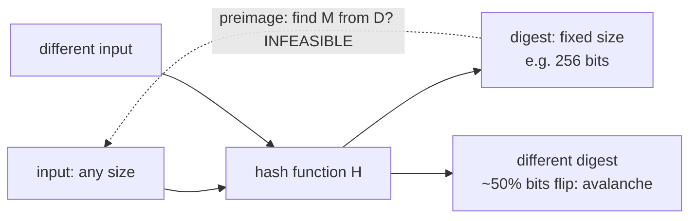
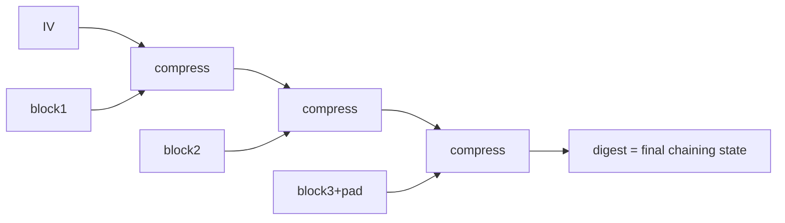
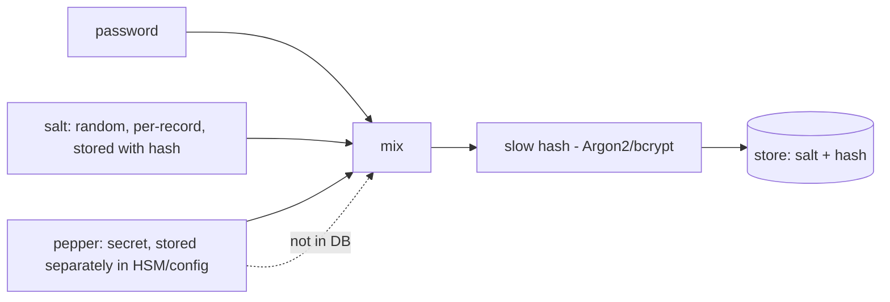

**Level:** Advanced · **Track:** Cryptography · **Read time:** 185 min

This is Chapter 4 of the Cryptography series — Notebook 7. Chapters 2 and 3 built confidentiality
(symmetric and asymmetric encryption). This chapter builds the *other* half of the CIA triad from
Chapter 1 — **integrity and authenticity** — on top of the one-way functions we've referenced
throughout: **cryptographic hashes** and the keyed constructions built from them (**HMAC**). Every
digital signature (Chapter 6), every password store (Chapter 5), every "verify this download,"
every blockchain and git commit and content-addressed cache rests on a hash function. It is the
most-used primitive in all of cryptography, and the one most often misused in subtle ways.

We already met hashing's headline in Chapter 1: a hash is a **one-way, fixed-size fingerprint** —
deterministic, infeasible to reverse, and collision-resistant. This chapter goes deep: the precise
security properties and how they map to attacks; the internal constructions (**Merkle–Damgård** vs
**sponge**) and why the construction leaks into misuse (**length-extension**); why **MD5 and SHA-1
are dead** and what their collisions actually forged (rogue CA certificates, the Flame malware);
how **salts** defeat precomputation and **HMAC** turns a hash into a proper keyed authenticator; and
the birthday bound that halves your collision security. We finish with the integrity structures hashes
enable — **MACs, Merkle trees, content addressing** — and the perennial implementation bug of
**non-constant-time comparison**.

The recurring theme, consistent with the whole notebook: the hash algorithms are strong (SHA-256/3
have no practical break); the bugs are in *choosing a broken hash, using a bare hash where a keyed
one is required, comparing digests non-constant-time, or forgetting a salt.* By the end you'll pick
and use hashes correctly by reflex, and recognize each misuse on sight.

---

## Part 1: What a Cryptographic Hash Guarantees

A **cryptographic hash function** `H` maps an input of any length to a fixed-size **digest**, with
security properties that a mere checksum (CRC32) does not have. Recall the four from Chapter 1, now
stated precisely as the attacker games they forbid:

| Property | Formal statement | Attack it prevents |
|---|---|---|
| **Preimage resistance** | given `h`, infeasible to find any `m` with `H(m)=h` | reversing a hash (e.g. recovering a hashed value) |
| **Second-preimage resistance** | given `m1`, infeasible to find `m2≠m1` with `H(m2)=H(m1)` | substituting a forgery for a *specific* known message |
| **Collision resistance** | infeasible to find *any* `m1≠m2` with `H(m1)=H(m2)` | forging where attacker controls *both* messages (certs, signatures) |
| **Avalanche** | flipping one input bit flips ~50% of output bits | partial-information leakage; relatedness detection |

Two more practical properties: **deterministic** (same input → same digest, so you can verify by
recomputing) and **fast** (for general hashing — though for *passwords* you deliberately want it
**slow**, Chapter 5).

The three resistance properties form a hierarchy of difficulty for the *attacker*: preimage and
second-preimage require matching a *given* target (≈2ⁿ work for an n-bit hash), while **collisions**
are far easier to find (≈2^(n/2) via the birthday paradox, Part 5). That is why collision resistance
is the *first* property to fall — and why MD5 and SHA-1 broke on collisions years before anyone
found a preimage.

**A cryptographic hash is NOT:** encryption (no key, not reversible — Chapter 1), a MAC (no key, so
no authenticity against an attacker who can recompute it — Part 6), or a good *password* hash (too
fast — Chapter 5). Confusing these is the source of most hash bugs.



---

## Part 2: The Hash Family — MD5, SHA-1, SHA-2, SHA-3, BLAKE

Know the landscape and, crucially, which are dead:

| Hash | Output | Construction | Status |
|---|---|---|---|
| **MD5** | 128-bit | Merkle–Damgård | **BROKEN** — practical collisions (seconds); never use |
| **SHA-1** | 160-bit | Merkle–Damgård | **BROKEN** — collisions (SHAttered 2017); retired |
| **SHA-256 / SHA-512** | 256/512-bit | Merkle–Damgård | **current** — general-purpose standard |
| **SHA-224/384** | 224/384-bit | truncated SHA-2 | current; SHA-384 resists length-extension |
| **SHA-3 (Keccak)** | 224–512-bit | **sponge** | current — different design, no length-extension |
| **BLAKE2 / BLAKE3** | variable | HAIFA / tree | current — very fast, keyed mode built in |

**What to use today:** **SHA-256** for general integrity/fingerprinting; **SHA-3** or **BLAKE2/3**
when you want a non-Merkle–Damgård design or top speed; **HMAC-SHA256** for keyed authentication
(Part 6); a **slow KDF** (Argon2/bcrypt) for passwords (Chapter 5). **Never MD5 or SHA-1** where any
security depends on collision or second-preimage resistance.

```bash
echo -n "hello" | md5sum        # 5d41402abc4b2a76b9719d911017c592  (128-bit — BROKEN)
echo -n "hello" | sha1sum       # aaf4c61...                        (160-bit — BROKEN)
echo -n "hello" | sha256sum     # 2cf24dba5fb0a30e...               (256-bit — current)
echo -n "hello" | openssl dgst -sha3-256
```

A note that matters for triage: **MD5 and SHA-1 are still fine for *non-security* uses** — as fast
checksums for accidental corruption, hash-table keys, or deduplication where no adversary is
choosing inputs. The bug is using them where an *attacker* can exploit a collision (signatures,
certificates, integrity of adversarial input, commit identifiers). Context decides.

---

## Part 3: Inside a Hash — Merkle–Damgård vs Sponge

The *construction* of a hash determines its misuse modes, so understand the two dominant designs.

### Merkle–Damgård (MD5, SHA-1, SHA-2)

Split the padded message into fixed blocks; start from a fixed **IV**; iteratively feed each block +
the running **chaining state** through a **compression function**; the final state *is* the digest.



Its structural flaw — because *the digest equals the internal state* — is **length-extension**
(Part 4): knowing `H(secret ‖ msg)` lets you compute `H(secret ‖ msg ‖ pad ‖ extra)` without the
secret. SHA-256 and SHA-512 share this property; **SHA-384 and SHA-512/256** don't (they truncate,
hiding part of the state), and neither does SHA-3.

### Sponge (SHA-3 / Keccak)

The sponge **absorbs** input into a large internal state, then **squeezes** out the digest — and
critically, the output is only *part* of the state, so an attacker can't resume it. This makes SHA-3
**immune to length-extension** by design, and lets it produce arbitrary-length output (XOFs like
SHAKE). BLAKE2/3 use other length-extension-immune constructions.

The practical takeaway: **if you need a raw hash where length-extension could matter and you can't
use HMAC, prefer SHA-3/BLAKE2** — but in almost all cases the right answer is "use HMAC," which fixes
length-extension regardless of the underlying hash.

---

## Part 4: Length-Extension — The Homemade-MAC Killer

We previewed this in Chapter 1; here is the full mechanism and exploit, because it's a real,
findable bug.

A naive developer wants to authenticate a message with a shared secret and writes:

```
tag = SHA256(secret ‖ message)         # looks reasonable... it isn't
```

Intending: only someone who knows `secret` can produce a valid `tag`. But with a Merkle–Damgård
hash, an attacker who has *one* valid `(message, tag)` pair and knows (or brute-forces) the *length*
of `secret` can **forge a valid tag for an extended message** they didn't fully know — because `tag`
is the hash's internal state after `secret ‖ message`, and the attacker simply resumes hashing from
it.

```mermaid
sequenceDiagram
    participant A as Attacker
    participant S as Server
    S->>A: message="amount=100", tag=SHA256(secret||message)
    Note over A: tag IS the hash state after secret||message
    A->>A: resume from tag; append pad + "&admin=true"
    A->>S: message'="amount=100"+pad+"&admin=true", tag'=extended hash
    Note over S: SHA256(secret||message') == tag'  -> VALID! forged w/o secret
```

Real tools automate it (`hashpump`, `hash_extender`):

```bash
hash_extender -d 'amount=100' -s <known_tag> -a '&admin=true' \
  -k <guessed_secret_len> -f sha256
# outputs: a forged message (with glue padding) + a valid tag — no secret needed
```

This broke real APIs (Flickr's signing scheme, among others). **The fix is HMAC** (Part 6), whose
nested construction defeats length-extension. Also acceptable: a length-extension-immune hash
(SHA-3, SHA-512/256) — but the universal, correct answer is **never build a MAC as `hash(secret ‖
data)`; use HMAC.** When you see that pattern in code or a token, it's a finding.

**Why the "glue padding" appears.** Merkle–Damgård hashes pad the final block with a `1` bit, zeros,
and the **message length**. When the attacker resumes hashing from the captured digest, they must
first include the *original* message's padding (the "glue") before their appended data — which is why
the forged message looks like `original ‖ \x80\x00…\x00[64-bit length] ‖ appended`. The attacker
needs the secret's *length* to compute that glue correctly, so they simply try lengths 1..N and see
which forged tag the server accepts. That the forged message contains ugly glue bytes rarely matters:
many parsers ignore trailing garbage, or the appended `&admin=true` is what's checked. Understanding
the glue is what lets you *recognize* a length-extension-forged payload in logs (an odd `\x80`-padded
blob mid-message is a tell).

---

## Part 5: The Birthday Paradox and Real Collision Attacks

**Why collisions are easier than preimages** — and why MD5/SHA-1 fell — is the **birthday paradox**.
In a room of just 23 people there's a >50% chance two share a birthday, far fewer than the 365 you'd
naively guess, because you're comparing *all pairs*, not matching one target. Same for hashes: to
find *any* collision in an n-bit hash you need only ~2^(n/2) hashes, not 2ⁿ.

| Hash | Output bits | Preimage work | Collision work (birthday) |
|---|---|---|---|
| MD5 | 128 | 2¹²⁸ (still "safe") | **2⁶⁴ → in practice seconds** (broken by better attacks) |
| SHA-1 | 160 | 2¹⁶⁰ | 2⁸⁰ → **~2⁶³ real attack (SHAttered)** |
| SHA-256 | 256 | 2²⁵⁶ | 2¹²⁸ (infeasible) |

So a "256-bit hash" gives **128-bit** collision resistance — size accordingly (Chapter 1). For MD5
and SHA-1, cryptanalysis pushed collision-finding *far below* even the birthday bound, making them
practically forgeable.

**What collisions actually forged — real damage:**

- **SHAttered (2017):** Google produced two different PDFs with the *same SHA-1 hash*. Any system
  trusting SHA-1 for integrity (signatures, certificates, git object IDs at the time) could be
  fooled into treating a malicious file as a benign one.
- **MD5 rogue CA (2008):** researchers exploited MD5 collisions to forge a **Certificate Authority
  certificate** — letting them issue trusted certs for *any* website (Chapter 6). A hash collision
  broke the web's trust model.
- **Flame malware (2012):** a nation-state used an MD5 **chosen-prefix collision** to forge a
  Microsoft code-signing certificate, so Flame's payload appeared to be a legitimate Windows update.

These are why MD5/SHA-1 are banned for signatures and certificates. **Chosen-prefix collisions** (the
strongest form, where the attacker collides two *meaningfully different* prefixes) are what make the
CA/code-signing forgeries possible, and they now exist for SHA-1 too (2019) — the final nail.

---

## Part 6: HMAC — Turning a Hash into a Keyed Authenticator

A bare hash gives integrity only against *accidental* change or an attacker who can't recompute it —
it has **no key**, so anyone can compute `H(message)`. To get **authenticity** (proof the message
came from someone holding a secret), you need a **MAC (Message Authentication Code)**: a keyed
function where only key-holders can produce/verify the tag. The standard is **HMAC**.

HMAC wraps a hash in a specific nested construction with the key:

```
HMAC(K, m) = H( (K ⊕ opad) ‖ H( (K ⊕ ipad) ‖ m ) )
```

The two nested hashes with two key-derived pads are what make HMAC **secure even on a
length-extension-vulnerable hash** — the outer hash hides the inner state, so the Part-4 attack
fails. HMAC-SHA256 is the workhorse; it authenticates API requests, webhooks, JWTs (HS256 is
HMAC-SHA256), session cookies (Chapter 3), and encrypt-then-MAC constructions (Chapter 2).

```bash
# HMAC-SHA256 of a message under a key
echo -n "amount=100" | openssl dgst -sha256 -hmac "supersecretkey"
# HMAC-SHA256(...)= 7f3a...  (only key-holders can produce/verify this)
```

```python
import hmac, hashlib
tag = hmac.new(b"supersecretkey", b"amount=100", hashlib.sha256).hexdigest()

# VERIFY with constant-time compare (Part 8) — never ==
ok = hmac.compare_digest(tag, received_tag)
```

**MAC vs signature (the authenticity choices):**

| | HMAC (symmetric MAC) | Digital signature (asymmetric) |
|---|---|---|
| Key | one **shared** secret | private (sign) / public (verify) |
| Who can verify | only shared-key holders | **anyone** (public key) |
| Non-repudiation | ✗ (both sides have the key) | ✓ (only signer has private key) |
| Speed | fast | slower |
| Use | API auth, tokens, internal integrity | certs, code signing, public verifiability |

HMAC gives integrity + authenticity between parties who share a secret; signatures (Chapter 6) add
**non-repudiation** and public verifiability. Pick HMAC for internal/shared-secret contexts, a
signature when third parties must verify or the signer must not be able to deny it.

**Where you'll actually meet HMAC** (recognizing it is half of using it safely):

- **Webhook signatures.** Stripe, GitHub, Slack, and most webhook providers sign each delivery with
  `HMAC-SHA256(secret, raw_body)` in a header (`X-Hub-Signature-256`, `Stripe-Signature`). Your
  receiver **must** recompute the HMAC over the *raw* body and constant-time-compare — a classic bug
  is verifying against the *parsed/re-serialized* body (bytes differ → verification breaks or is
  skipped) or using `==`. Skipping verification lets anyone forge events.
- **JWT HS256** (Notebook 6, Ch 3) is exactly HMAC-SHA256 over `header.payload`; its whole security
  is the secret's strength and the verifier pinning the algorithm.
- **AWS SigV4 / API request signing** derive a signing key via chained HMACs and sign the canonical
  request — tamper-evident, replay-resistant request authentication.
- **Encrypt-then-MAC** (Chapter 2) and **CSRF double-submit tokens** (Notebook 6, Ch 3) use HMAC to
  bind/authenticate values.

**Why the nested `ipad`/`opad` design?** The inner hash `H((K⊕ipad)‖m)` produces a digest an
attacker *could* length-extend — but HMAC then feeds that through an **outer** hash keyed with
`K⊕opad`, so the attacker never sees an extendable state. That two-layer structure is precisely what
makes HMAC safe on Merkle–Damgård hashes where the raw `hash(secret‖m)` is not. You don't implement
it; you call `hmac.new(...)` — but knowing *why* it's nested tells you why the homemade version fails.

---

## Part 7: Salts, Peppers, and Precomputation

Hashing alone has a fatal weakness for *low-entropy* inputs like passwords: it's **deterministic**,
so identical inputs give identical digests, and attackers **precompute**. This part is the bridge to
Chapter 5, and the concepts (salt/pepper) apply anywhere you hash guessable values.

### The precomputation problem — rainbow tables

Because `SHA256("password123")` is always the same, an attacker can compute the hash of every likely
input *once*, store it, and then **look up** any stolen hash instantly. **Rainbow tables** are a
space-optimized version of this precomputed dictionary. Result: an unsalted hash of a common value
is as good as plaintext.

### Salt — make every hash unique

A **salt** is a random, unique, **non-secret** value stored alongside each hash and mixed into it:

```
stored = salt ‖ H(salt ‖ password)
```

Now identical passwords produce *different* stored hashes (different salts), which:

- **defeats precomputation/rainbow tables** — the attacker can't precompute without knowing each
  salt, and salts are per-record;
- **forces per-hash cracking** — an attacker must attack each stolen hash individually, not all at
  once;
- **hides duplicate passwords** — two users with the same password have different stored values.

The salt is **not secret** (it's stored in the clear next to the hash); it just needs to be
**unique per record and random** (CSPRNG, ≥16 bytes). Its only job is to break precomputation and
cross-user amortization.

### Pepper — a secret, separate ingredient

A **pepper** is an *additional* secret value mixed in, but stored **separately** from the database
(in app config, an HSM, or a KMS) — so a database-only breach (SQL injection dump) doesn't reveal
it, and the stolen hashes can't be cracked without also compromising the pepper. Pepper is
defense-in-depth *on top of* salt, not a replacement.



See the salt effect directly:

```python
import hashlib, os
pw = b"password123"
# Unsalted: two users with the same password -> identical stored hash (and precomputable)
print(hashlib.sha256(pw).hexdigest() == hashlib.sha256(pw).hexdigest())   # True (bad)
# Salted: same password -> different stored value each time (no precomputation)
s1, s2 = os.urandom(16), os.urandom(16)
h1 = hashlib.sha256(s1 + pw).hexdigest()
h2 = hashlib.sha256(s2 + pw).hexdigest()
print(h1 == h2)     # False — salts diverge the hashes; rainbow tables useless
```

**Critical caveat:** salt/pepper stop *precomputation*, but they do **not** make a *fast* hash safe
for passwords — an attacker with the salt can still brute-force a per-record hash at billions/sec on
a GPU. That's why passwords need a **slow** hash (Argon2/bcrypt/scrypt), the entire subject of
Chapter 5. Salt + slow hash together are the requirement.

---

## Part 8: Constant-Time Comparison and Other Integrity Bugs

A subtle but real bug class: **comparing MACs/hashes with a normal `==`** leaks timing information.
Most string comparisons **short-circuit** — they return as soon as the first differing byte is found —
so a comparison that fails at byte 1 is faster than one that fails at byte 10. An attacker measuring
response time can recover a valid tag **one byte at a time** (a **timing side-channel** / "timing
attack"), forging a MAC without knowing the key.

```python
# VULNERABLE — early-exit reveals how many leading bytes matched
if received_tag == expected_tag: ...        # timing leak

# CORRECT — constant-time: always compares all bytes
import hmac
if hmac.compare_digest(received_tag, expected_tag): ...
```

Always use a **constant-time comparison** (`hmac.compare_digest`, `crypto.timingSafeEqual`,
`MessageDigest.isEqual` in Java, `subtle.ConstantTimeCompare` in Go) for any secret/MAC/token
comparison. This bug has appeared in real frameworks (early Rails, various API HMAC checks) and is a
classic finding.

Other integrity pitfalls to internalize:

- **Verifying a hash you received over the same untrusted channel.** If the attacker can replace both
  file and hash, the hash proves nothing (Chapter 1). Integrity vs an *active* attacker needs a
  **keyed** MAC or a **signature** with an out-of-band-trusted key.
- **Truncating hashes/MACs too far.** A 32-bit truncated MAC is forgeable by brute force; keep enough
  bits (≥128 for MACs).
- **Hashing low-entropy data for "privacy."** `SHA256(email)` is brute-forceable over the small input
  space — not anonymization. Use keyed HMAC (with a rotatable secret) or tokenization, aware of the
  residual risk.
- **Using a hash where you need a MAC** (no key) or **a MAC where you need a signature** (no
  non-repudiation / public verify). Match the primitive to the guarantee (Chapter 1).
- **Hash-then-sign gotchas / algorithm agility** — signing with a broken hash (SHA-1) undermines the
  signature no matter how strong the asymmetric key (Chapter 6).

---

## Part 9: What Hashes Build — Merkle Trees, Content Addressing, Commitments

Hashes are the atom of a huge amount of integrity infrastructure. Recognizing these patterns helps
you reason about real systems.

- **Digital signatures (Chapter 6)** sign the *hash* of a document, not the document — so the hash's
  collision resistance is load-bearing (a SHA-1 collision = a forgeable signature).
- **Merkle trees.** Hash data blocks, then hash pairs of hashes up to a single **root hash**. The
  root commits to the entire dataset, and you can prove any block's inclusion with a small
  **Merkle proof** (log n hashes) instead of the whole set. Used in git, blockchains, Certificate
  Transparency logs, BitTorrent, and file-sync.

```mermaid
flowchart TD
    R[Root hash = H(H12 ‖ H34)] --> H12[H12 = H(H1‖H2)]
    R --> H34[H34 = H(H3‖H4)]
    H12 --> H1[H1=H(block1)]
    H12 --> H2[H2=H(block2)]
    H34 --> H3[H3=H(block3)]
    H34 --> H4[H4=H(block4)]
```

- **Content addressing.** Name data by its hash (git commits/objects, IPFS CIDs, Docker image
  digests, `nix` store paths). The name *is* the integrity check: fetch by hash, recompute, and you
  know you got exactly the intended bytes — tamper-evident by construction.
- **Commitment schemes.** Publish `H(secret ‖ nonce)` to *commit* to a value without revealing it,
  then reveal later; anyone checks the hash. Used in fair coin-flips, auctions, and zero-knowledge
  protocols.
- **Proof of work.** Bitcoin mining is "find a nonce so `H(block ‖ nonce)` has N leading zeros" —
  the hash's unpredictability makes the work unforgeable and only verifiable by recomputation.
- **HMAC-based KDFs (HKDF).** Derive multiple strong keys from one secret (the TLS 1.3 key schedule,
  Chapter 3) using HMAC as the core — hashing as key-derivation.

The common thread: **a hash is a compact, tamper-evident commitment to data.** Almost every "verify
that this is exactly what it should be" mechanism on the internet is a hash underneath.

---

## Part 10: Hands-On Lab — Verify, Length-Extend, HMAC, and a Timing Leak

Four exercises exercising the chapter end to end. Local and safe.

### Tool from scratch: sha256sum, openssl dgst, hashpump, hashcat

`sha256sum`/`shasum` compute file digests; `openssl dgst` does hashes and HMACs; **hashpump/
hash_extender** perform length-extension; **hashcat** cracks hashes at GPU speed (Chapter 5). Install
on Kali: `sha*sum`/`openssl` preinstalled; `pip install hashpumpy`; `hashcat` in the repos.

### 10.1 Integrity verification and the avalanche

```bash
echo "release v1.0 binary" > app.bin
sha256sum app.bin | tee app.sha256          # publish this digest
# ... user downloads app.bin, recomputes, compares:
sha256sum -c app.sha256                      # app.bin: OK

# Attacker flips one byte:
echo "release v1.0 binaryX" > app.bin
sha256sum -c app.sha256                      # app.bin: FAILED  (avalanche: totally different digest)
```

### 10.2 Forge a tag with length-extension

```python
import hashpumpy
# You captured: message=b"user=guest", tag=SHA256(secret||message), and guess secret is 14 bytes.
orig_tag = "…captured hex tag…"
new_tag, new_msg = hashpumpy.hashpump(orig_tag, "user=guest", "&admin=true", 14)
print(new_msg)   # b'user=guest\x80\x00...(glue padding)...&admin=true'
print(new_tag)   # a VALID SHA256(secret||new_msg) — computed WITHOUT the secret
```

The server, checking `SHA256(secret ‖ new_msg) == new_tag`, accepts the forged
`&admin=true`. **Fix:** replace `SHA256(secret‖msg)` with `HMAC-SHA256(key, msg)` and the forgery
fails — hashpump can't extend HMAC.

### 10.3 HMAC done right

```python
import hmac, hashlib
KEY = b"server-signing-key"
def sign(msg):   return hmac.new(KEY, msg, hashlib.sha256).hexdigest()
def verify(msg, tag): return hmac.compare_digest(sign(msg), tag)   # constant-time

t = sign(b"user=guest")
print(verify(b"user=guest", t))        # True
print(verify(b"user=admin", t))        # False — tamper detected, and no length-extension possible
```

### 10.4 Demonstrate a timing side-channel in `==`

```python
import time
SECRET = "a3f9c1d2e4b5"          # the valid tag we're trying to guess a prefix of
def insecure_equal(a, b):
    if len(a) != len(b): return False
    for x, y in zip(a, b):
        if x != y: return False   # EARLY EXIT -> timing leak
        time.sleep(0.0005)        # exaggerate per-byte work to make the leak visible
    return True

# More matching leading chars -> longer runtime -> attacker learns the prefix byte-by-byte
import timeit
for guess in ["b0000000", "a0000000", "a3000000"]:
    dt = timeit.timeit(lambda: insecure_equal(guess, SECRET), number=200)
    print(guess, round(dt, 4))    # 'a3...' runs measurably LONGER -> leaks that 'a3' is correct
```

You'll see the guess sharing more leading characters take longer — the exact signal an attacker
amplifies (over many samples, without the artificial `sleep`) to recover a valid tag.
**Fix:** `hmac.compare_digest`, which compares all bytes regardless of where they differ.

### 10.5 Quantify the avalanche effect

```python
import hashlib
def bits(b): return ''.join(f'{x:08b}' for x in b)
h1 = hashlib.sha256(b"hello").digest()
h2 = hashlib.sha256(b"hellp").digest()      # one letter changed (o->p)
diff = sum(a != b for a, b in zip(bits(h1), bits(h2)))
print(f"{diff}/256 bits differ  (~{diff/256:.0%})")   # ~50% — the avalanche
```

Output is around `128/256 bits differ (~50%)`: a *one-letter* input change flips about half the
output bits, with no correlation to how "small" the input change was. That's the avalanche property
that makes hashes usable as fingerprints — near inputs give unrelated digests, so you can't infer
"close" inputs from "close" hashes.

### 10.6 Identify unknown hashes (DFIR triage)

```bash
# You dumped a users table; the hash column has these. Which algorithm?
printf '5f4dcc3b5aa765d61d8327deb882cf99\n' | hashid          # -> MD5  (this is md5("password"))
printf '$2b$12$abcd...\n' | hashid                            # -> bcrypt
printf '$argon2id$v=19$m=65536,t=3,p=4$...\n' | hashid        # -> Argon2
# Then pick the matching hashcat -m mode to assess crackability.
```

Reading the algorithm off a dump is the first move in any breach investigation — it tells you whether
the stolen credentials should be treated as effectively plaintext (MD5/SHA-256) or as buying real
time (bcrypt/Argon2), which drives the incident response (force-reset scope, urgency).

---

## Part 11: The Attacker's View — Identifying and Cracking Hashes

When you find a hash (in a database dump, a config, a token, a CTF), the first two questions are
*which algorithm* and *can I recover the input*. This is core offensive/DFIR skill.

### Identifying a hash

You identify a hash by its **length**, **character set**, and **format/prefix**:

| Sample | Length | Likely hash |
|---|---|---|
| `5d41402abc4b2a76b9719d911017c592` | 32 hex | MD5 |
| `aaf4c61ddcc5e8a2dabede0f3b482cd9aea9434d` | 40 hex | SHA-1 |
| `2cf24dba5fb0a30e26e83b2ac5b9e29e1b161e5c1fa7425e73043362938b9824` | 64 hex | SHA-256 |
| `$2b$12$R9h/cIPz0gi.URNNX3kh2O...` | `$2b$` | bcrypt (Ch 5) |
| `$argon2id$v=19$m=65536,t=3,p=4$...` | `$argon2id$` | Argon2 (Ch 5) |
| `$1$...` / `$5$...` / `$6$...` | `$N$` | md5crypt / sha256crypt / sha512crypt |
| `abc123:def456` | hash:salt | salted, format depends |

```bash
hashid '2cf24dba5fb0a30e...'         # guesses algorithm(s)
hash-identifier                       # interactive identifier
# The $prefix "MCF" (Modular Crypt Format) tells you algo + params for password hashes.
```

### Cracking a hash (why fast hashes are doomed)

Because hashes are one-way, "cracking" means **guess-and-check**: hash candidate inputs and compare.
**hashcat** and **John the Ripper** do this on GPUs at staggering rates — and the rate is exactly why
*fast* hashes are unsafe for passwords:

| Hash | GPU guesses/sec (order of magnitude, single high-end GPU) |
|---|---|
| MD5 | ~10¹¹ (hundreds of billions) |
| SHA-256 | ~10¹⁰ (tens of billions) |
| bcrypt (cost 12) | ~10⁴ (tens of thousands) |
| Argon2id (tuned) | ~10³ |

```bash
# hashcat modes: -m 0 MD5, -m 100 SHA1, -m 1400 SHA-256, -m 3200 bcrypt, -m 34000 Argon2
hashcat -m 1400 -a 0 hashes.txt rockyou.txt          # dictionary attack on SHA-256
hashcat -m 1400 -a 3 hashes.txt '?a?a?a?a?a?a'        # brute-force mask (6 chars)
hashcat -m 1400 -a 0 hashes.txt rockyou.txt -r best64.rule   # dictionary + mangling rules
```

The seven-orders-of-magnitude gap between MD5 and bcrypt **is** the reason Chapter 5 exists: a fast
hash lets an attacker try the entire rockyou.txt wordlist against millions of stolen hashes in
seconds; a slow hash makes each guess cost real time. **Attack modes** to know: **dictionary**
(`-a 0`, wordlists like rockyou), **rule-based** (mangle dictionary words — capitalize, append
digits), **mask/brute-force** (`-a 3`, exhaust a character pattern), and **combinator**. Salting
doesn't slow any single guess — it only stops *precomputation* and *amortization across hashes* — so
against a *fast* salted hash the attacker still wins per-record.

**Blue-team relevance:** knowing these rates is how you reason about breach impact. "The passwords
were SHA-256 hashed" is *not* reassurance — assume they're cracked. "Argon2id with tuned parameters"
buys real time. Identify the algorithm in any dump you're investigating and reason about crackability
accordingly.

---

## Part 11b: Non-Cryptographic Hashes and Where They Bite

Not every "hash" is cryptographic, and confusing the two causes real bugs. **Non-cryptographic
hashes** (CRC32, MurmurHash, SipHash-without-key-as-plain-hash, `hashCode()`, FNV, CityHash) are
built for *speed and good distribution* in hash tables and checksums — **not** collision resistance
against an adversary. Two failure modes:

- **Using a checksum for security.** CRC32 is trivially collision-able and even *invertible* — an
  attacker can craft data with any CRC they want. CRCs detect *accidental* line noise, never
  tampering. If you see CRC32 or Adler-32 protecting integrity against an attacker, it's a finding;
  use SHA-256 or an HMAC.
- **Hash-flooding / HashDoS.** Hash tables (dict/map/set) degrade from O(1) to O(n) when many keys
  **collide** in the same bucket. If the table's hash is predictable, an attacker sends thousands of
  colliding keys (e.g. crafted HTTP parameters or JSON keys) and turns each insert into a linear
  scan — a single request pins the CPU (**algorithmic-complexity DoS**). This hit PHP, Python, Ruby,
  Java, and Node around 2011–2012. The fix languages adopted: **SipHash**, a *keyed*, fast
  pseudo-random function seeded with a per-process random key, so an attacker can't predict which
  keys collide. It's the rare place a "hash" needs to be keyed for a *non-authentication* reason.

The taxonomy to keep straight: **CRC/Murmur/FNV** → speed, no security; **SipHash** → keyed
DoS-resistant table hashing; **SHA-256/3, BLAKE2** → cryptographic integrity; **HMAC** →
authentication; **Argon2/bcrypt** → passwords. Reach for the one whose *job* matches, and never a
checksum where an attacker is in the loop.

---

## Part 12: Certificate Transparency and Real Integrity Systems

To see hashes-as-integrity at internet scale, look at **Certificate Transparency (CT)** — the system
that makes the web's PKI (Chapter 6) auditable. Every trusted TLS certificate must be logged in
public, **append-only Merkle-tree logs**. Because the log is a Merkle tree, anyone can:

- get a **signed tree head** (the root hash + signature) committing to *all* logged certs;
- verify an **inclusion proof** (log n hashes) that a specific cert is in the log;
- verify a **consistency proof** that a newer tree head is an append-only extension of an older one —
  the log **cannot** retroactively remove or alter an entry without breaking the hashes.

```mermaid
flowchart TD
    STH[Signed Tree Head = root hash + signature] --> N1[internal hash]
    STH --> N2[internal hash]
    N1 --> C1[H(cert A)]
    N1 --> C2[H(cert B)]
    N2 --> C3[H(cert C)]
    N2 --> C4[H(cert D)]
    Note[Inclusion proof for cert C = a few sibling hashes up to the root]
```

This is why a **maliciously-issued certificate can be detected**: it must be logged to be trusted, and
domain owners monitor CT logs (`crt.sh`) for certs on their domains they didn't request. The same
Merkle machinery secures **git** (every commit hashes its tree + parent, so history is tamper-evident;
changing an old commit changes every subsequent hash), **blockchains** (blocks chain by hash),
**Docker/OCI** image digests, and **binary transparency**. When you audit any "tamper-evident log,"
you're checking that it's a properly-verified hash chain/tree — the integrity guarantee is only as
good as the hash (which is why CT and git are migrating off SHA-1).

---

## Part 13: Detection & Defense Angle — Using Hashes Correctly

Consolidated guidance.

**Choosing and using hashes:**

- **General integrity/fingerprinting:** **SHA-256** (or SHA-3/BLAKE2/3). Never MD5/SHA-1 for
  anything an attacker could exploit (signatures, certs, adversarial-input integrity, IDs). And never
  a *non-cryptographic* checksum (CRC32) for security — it's invertible.
- **Keyed authentication:** **HMAC-SHA256** — never a homemade `hash(secret‖msg)` (length-extension).
  Verify webhook HMACs over the **raw** body, constant-time.
- **Passwords:** a **slow salted KDF** (Argon2id/bcrypt/scrypt) — never a fast hash, even salted
  (Chapter 5).
- **"Anonymizing" low-entropy data by hashing** (emails, phone numbers, SSNs) is reversible by
  brute-force over the small input space — it is *not* anonymization; use tokenization or keyed HMAC
  with a secret you can rotate, and know its limits.
- **Compare secrets/MACs in constant time** (`compare_digest`/`timingSafeEqual`) — never `==`.
- **Salt** every hashed low-entropy value (random, unique, ≥16 B, stored with the hash); add a
  **pepper** (secret, stored separately in HSM/config) for defense-in-depth against a DB-only breach.
- **Size for collisions:** you get n/2-bit collision resistance from an n-bit hash; use ≥256-bit
  where collisions matter.
- **Integrity vs an active attacker needs a key** (HMAC) or a **signature** with independently
  trusted key material — a bare hash over an untrusted channel proves nothing.
- **Don't use non-cryptographic hashes (CRC/Murmur) for security**, and seed attacker-facing hash
  tables with **SipHash** to prevent HashDoS.

**Detection / red flags (grep + behavior):**

```mermaid
flowchart LR
    A[Code / token review] --> B{Red flag?}
    B -->|md5/sha1 for signatures/certs/IDs| C[broken collision resistance]
    B -->|hash(secret + msg) as a MAC| D[length-extension forgery]
    B -->|== on tags/tokens/hashes| E[timing side-channel]
    B -->|SHA256(password) / no salt| F[password-cracking / rainbow]
    B -->|truncated MAC < 128 bits| G[brute-forceable tag]
    C --> Z[fix: SHA-256/3, HMAC, constant-time, slow KDF]
    D --> Z
    E --> Z
    F --> Z
    G --> Z
```

- **Grep for:** `md5(`, `sha1(`, `MessageDigest.getInstance("MD5"/"SHA-1")`, `hashlib.md5`,
  `hash(secret + ...)` / `secret . $data` MAC patterns, `==`/`.equals()` on tokens/HMACs (should be
  constant-time), `SHA256(password)` without a slow KDF, and any salt-less password hashing.
- **Behaviorally:** measurable timing differences on token/MAC verification (timing oracle),
  acceptance of length-extended messages, duplicate stored hashes for the same password (missing
  salt), and CRC/checksum used where tamper-evidence is claimed.
- **In DFIR/CTF:** identify unknown hashes by length/format (`hashid`, `hash-identifier`), try
  length-extension (`hashpump`) against any `hash(secret‖data)` token, and (breach IR) determine the
  password-hash algorithm to scope force-resets.
- **Webhook receivers:** confirm they HMAC the *raw* body and constant-time-compare — a missing or
  wrong verification lets attackers forge provider events.

---

## Part 14: Final Revision / Summary

- A **cryptographic hash** is a one-way, fixed-size, deterministic fingerprint with **preimage,
  second-preimage, collision resistance, and avalanche**. Collisions are the *easiest* property to
  break (birthday bound: ~2^(n/2)), so they fall first — a 256-bit hash gives only **128-bit**
  collision resistance.
- **MD5 and SHA-1 are broken** (practical, even chosen-prefix, collisions) and forged **rogue CA
  certs (MD5)**, **Flame's code-signing cert (MD5)**, and **two same-hash PDFs (SHA-1 SHAttered)**.
  Use **SHA-256/SHA-3/BLAKE2** — MD5/SHA-1 only for non-adversarial checksums.
- **Construction matters:** **Merkle–Damgård** (MD5/SHA-1/SHA-2) exposes **length-extension** (the
  digest *is* the internal state), so `hash(secret‖msg)` as a MAC is forgeable with `hashpump`.
  **Sponge (SHA-3)** and BLAKE2 are immune. The universal fix is **HMAC**.
- **HMAC** = keyed, nested hash construction giving **integrity + authenticity**; defeats
  length-extension. It's HS256 JWTs, webhook/API signing, encrypt-then-MAC. A **signature** adds
  **non-repudiation + public verifiability**; a **MAC** shares one secret.
- **Salt** (random, unique, non-secret, per-record) defeats **precomputation/rainbow tables** and
  forces per-hash cracking; **pepper** (secret, stored separately) adds defense-in-depth. Neither
  makes a *fast* hash safe for passwords — that needs a **slow** KDF (Chapter 5).
- **Constant-time comparison** (`compare_digest`) for all secret/MAC comparisons — `==` leaks a
  timing side-channel that recovers tags byte-by-byte.
- Hashes build the internet's integrity layer: **signatures, Merkle trees, content addressing,
  commitments, proof-of-work, HKDF** — a hash is a compact, tamper-evident commitment to data.
- **Attacker's view:** identify a hash by length/format (`hashid`), then reason about crackability —
  fast hashes (MD5 ~10¹¹/s, SHA-256 ~10¹⁰/s) fall to `hashcat` dictionary/mask/rule attacks; slow
  KDFs (bcrypt/Argon2) buy real time. "It was SHA-256 hashed" is *not* breach reassurance.
- **Not every "hash" is cryptographic:** CRC/Murmur/FNV are speed-only (invertible, no security);
  **SipHash** keys table hashing to stop **HashDoS**; match the hash to the job.
- **Certificate Transparency, git, blockchains** are Merkle hash trees/chains — tamper-evident by
  construction, and only as strong as their hash (hence the SHA-1 migration).

---

## Part 15: Cheat Sheet / Quick Reference

**Pick the primitive**

```
Fingerprint / integrity:   SHA-256 (or SHA-3 / BLAKE2/3)     NEVER md5/sha1 for security
Keyed authentication:      HMAC-SHA256                        NEVER hash(secret||msg)
Passwords:                 Argon2id / bcrypt / scrypt + salt  NEVER fast hash (Ch 5)
Public verify + non-repud: digital signature (Ch 6)
Compare tags/tokens:       constant-time (compare_digest)     NEVER ==
```

**Collision math:** n-bit hash → ~2^(n/2) collision work (birthday). SHA-256 → 128-bit collisions.

**Identify a hash by shape**

```
32 hex -> MD5        40 hex -> SHA-1        64 hex -> SHA-256
$2b$   -> bcrypt     $argon2id$ -> Argon2   $6$ -> sha512crypt
eyJ    -> JWT (HS256 = HMAC)                 $1$/$5$ -> md5crypt/sha256crypt
```

**hashcat modes:** `-m 0` MD5 · `-m 100` SHA-1 · `-m 1400` SHA-256 · `-m 3200` bcrypt ·
`-m 34000` Argon2 · `-m 16500` JWT.  Attacks: `-a 0` dict · `-a 3` mask · `-r rules`.

**Which "hash" for which job**

```
CRC/Murmur/FNV -> speed only (checksums, tables)   NOT security
SipHash        -> keyed table hashing (HashDoS-safe)
SHA-256/3, BLAKE2 -> cryptographic integrity
HMAC-SHA256    -> authentication (shared secret)
Argon2/bcrypt  -> passwords (slow)
```

**Commands**

```bash
sha256sum file ; sha256sum -c file.sha256                 # hash + verify
openssl dgst -sha256 -hmac KEY file                        # HMAC
echo -n "hello" | openssl dgst -sha3-256                   # SHA-3
hash_extender -d DATA -s TAG -a APPEND -k SECRETLEN -f sha256   # length-extension
```

**Attack → cause → fix**

| Attack | Cause | Fix |
|---|---|---|
| Collision forgery (certs, PDFs) | MD5/SHA-1 | SHA-256/3 |
| Length-extension | `hash(secret‖msg)` MAC | HMAC (or SHA-3/BLAKE2) |
| Rainbow-table lookup | unsalted hash of guessable input | per-record random salt |
| Timing tag recovery | `==` on MAC/token | constant-time compare |
| Brute-forced tag | over-truncated MAC | ≥128-bit MAC |
| Fast password cracking | fast hash for passwords | slow KDF (Ch 5) |

**HMAC:** `H((K⊕opad)‖H((K⊕ipad)‖m))`. **MAC vs signature:** shared secret vs private/public,
no vs yes non-repudiation.

**Golden rule:** *hash for a fingerprint, HMAC for authentication, signature for non-repudiation,
slow-KDF for passwords — never one where another is required, and always compare in constant time.*

---

## Part 16: Common Pitfalls

- **MD5/SHA-1 for signatures, certs, IDs, or adversarial-input integrity.** Collision-forgeable. Use
  SHA-256/3.
- **`hash(secret ‖ message)` as a MAC.** Length-extension forgery. Use HMAC.
- **`==` / `.equals()` to compare MACs/tokens/hashes.** Timing side-channel recovers the tag
  byte-by-byte. Use constant-time compare.
- **Unsalted hashing of passwords or other guessable values.** Rainbow tables. Salt per-record.
- **Thinking salt makes a fast hash password-safe.** It doesn't — still GPU-crackable per record. Slow
  KDF (Ch 5).
- **Verifying a file's hash received over the same channel as the file.** Active attacker replaces
  both. Use a MAC/signature with independently trusted key.
- **Over-truncating MACs/hashes.** Short tags are brute-forceable. Keep ≥128 bits for MACs.
- **Signing/verifying with algorithm agility that permits weak hashes.** An accepted SHA-1 signature
  is forgeable; pin strong hashes in verification.
- **Assuming a hash "hides" a low-entropy value.** `SHA256(email)`/`SHA256(phone)` is reversible by
  brute force over the small input space — it's not anonymization.
- **Using a hash where a MAC is needed (no key) or a MAC where a signature is needed (no
  non-repudiation).** Match primitive to guarantee.
- **Signing with a strong key but a weak hash (SHA-1).** The hash is the weak link; the signature is
  forgeable.
- **Confusing checksum (CRC32) with cryptographic hash.** CRCs aren't collision-resistant against an
  attacker (and CRC is invertible). Use SHA-256/HMAC.
- **Verifying a webhook HMAC against the parsed/re-serialized body.** Must HMAC the *raw* bytes;
  re-serialization changes them and breaks (or is skipped, letting forgeries through).
- **Predictable hash-table hashing exposed to attacker input.** HashDoS (algorithmic complexity).
  Use SipHash-seeded maps.

---

## Part 17: Practice Labs & Resources

- **CryptoHack — Hashes** section: length-extension, collision concepts, and HMAC challenges,
  interactive and graded.
- **crt.sh** — search Certificate Transparency logs for a domain to *see* the Merkle-logged certs;
  watch how monitoring reveals mis-issued certificates (connects to Chapter 6).
- **Cryptopals — Set 4** contains the canonical **length-extension** and **timing-attack on HMAC**
  challenges (implement the byte-at-a-time timing recovery yourself). Set 7/8 cover more hash attacks.
- **SHAttered / Flame write-ups** — read Google's SHAttered paper and the Flame MD5-collision
  analysis to see collisions turned into real-world cert/code-signing forgeries.
- **`hashpump`/`hash_extender` lab** — build a tiny Flask app that verifies `SHA256(secret‖data)`
  tokens, then forge one; swap to HMAC and watch the forgery fail.
- **hashcat / hashid / John the Ripper** — identify and (Chapter 5) crack hashes; feel the difference
  between a fast hash (billions/sec) and a slow KDF, and practice dictionary/mask/rule attack modes.
- **hashcat/John labs** — take a small set of MD5 vs bcrypt hashes of the same wordlist and time how
  long each takes to crack; the difference *is* Chapter 5's thesis, felt firsthand.
- **Tooling to master:** `sha256sum`/`shasum`, `openssl dgst`, Python `hashlib`/`hmac`
  (`compare_digest`), `hashpumpy`, `hashid`/`hash-identifier`, `hashcat`/John, and `crt.sh` for CT.

**Practice questions / mini-labs to self-test:**

1. Explain, using the birthday paradox, why a 256-bit hash provides only 128-bit collision resistance,
   and why that still makes SHA-256 safe today.
2. Given a token `SHA256(secret‖"role=user")` and its value, describe the exact steps and tool to
   forge `role=admin` without the secret, and the one-line fix.
3. Why is comparing an HMAC with `==` a vulnerability? Describe the attack and the correct function in
   Python, Node, Java, and Go.
4. Distinguish salt and pepper: where each is stored, what each defends against, and why neither
   makes SHA-256 an acceptable password hash.
5. A vendor distributes software with an MD5 checksum on the same HTTPS page. Give two independent
   reasons this is weak and what they should publish instead.
6. A breach dumps a `users` table with password column values like `$2b$12$...`. Explain how you'd
   identify the algorithm, estimate crackability vs a `SHA256` column, and what that means for
   incident response.
7. Explain how Certificate Transparency uses Merkle trees to make certificate issuance auditable, and
   why a SHA-1-based log would be a problem.
8. A web framework's parameter parser uses a predictable hash for its internal map. Describe the
   HashDoS attack and the fix (name the algorithm).

If you can name the four hash properties, explain why collisions fall first, spot a
`hash(secret‖msg)` MAC or a `==` tag compare, identify a hash from a dump, and pick HMAC vs signature
vs slow-KDF by the guarantee you need, you own this chapter.

---

*Also on [Praneeth's portfolio](https://ping-praneeth.vercel.app/notebook/cryptography/04-hashing-salting-hmac-and-integrity), with comments and the latest edits.*
