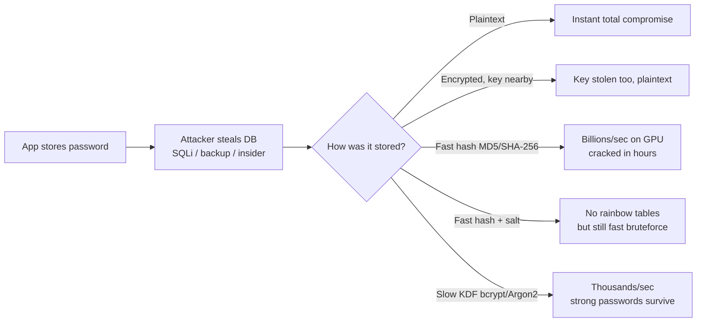
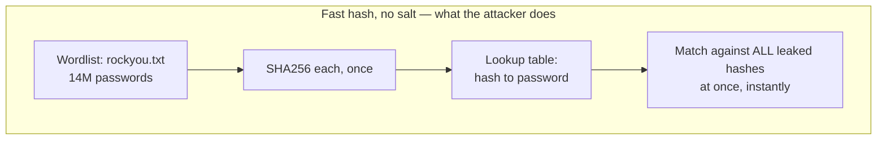
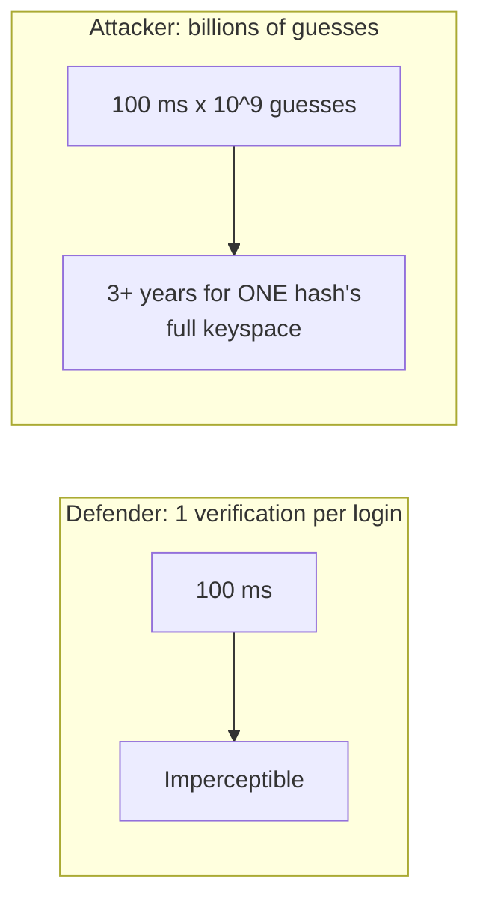
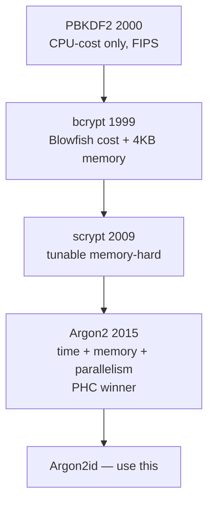
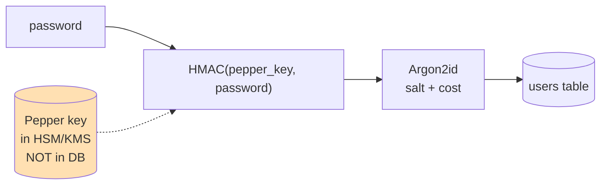
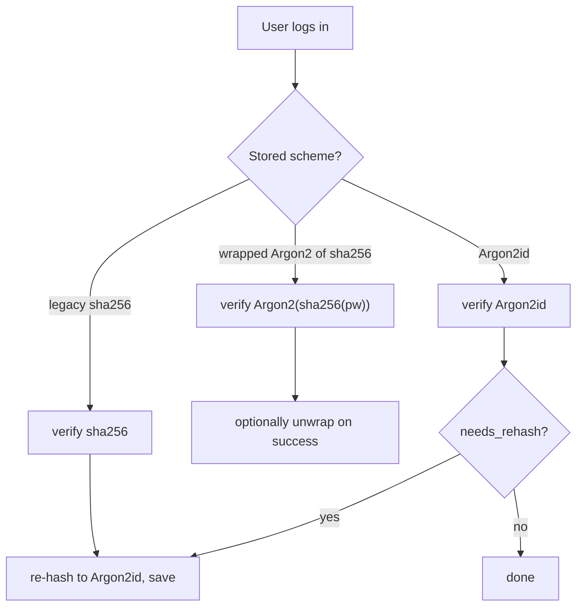
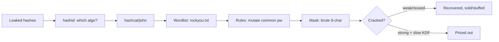

This is Chapter 5 of the Cryptography series — Notebook 7. Chapter 4 built the integrity-and-authenticity
half of cryptography on cryptographic hashes and showed, in passing, why those hashes are the *wrong*
tool for one specific job: storing passwords. This chapter is that job in full. Password storage is the
place where cryptographic theory meets the messiest part of the real world — millions of humans reusing
"Summer2024!" across dozens of sites, breach dumps traded openly, and an attacker whose entire goal after
stealing your `users` table is to turn those stored values back into the plaintext people typed. Get this
one primitive right and a full database leak is an inconvenience; get it wrong and the leak *is* the
compromise, for your users and every other site they reused that password on.

We'll go from the absolute basics — why you never store plaintext, why encryption is the wrong shape, why
a plain hash fails — through the birthday-and-rainbow economics that make salt mandatory, into the modern
slow-KDF family (PBKDF2, bcrypt, scrypt, Argon2) parameter by parameter, and out the other side into the
attacker's cracking rig so you understand exactly what you're defending against and how to price them out
of the attack.

## Part 1: The Threat Model — What Happens After a Database Leak

Every design decision in this chapter follows from one assumption: **the attacker already has your
database.** Not "might get it" — assume it as a certainty and design so that the leak alone doesn't hand
over accounts. This is the correct mental model because database leaks are routine: SQL injection (Notebook
web-fundamentals), a leaked backup on an open S3 bucket, an insider, a compromised admin box, a misconfigured
replica. Once the `users` table is out, network defenses, WAFs, and rate limits are irrelevant — the
attacker cracks *offline*, on their own hardware, at their own pace, with no login attempts hitting your
servers at all.

So the question is never "can they steal the hashes" but "**once they have the hashes, how much does it
cost them to recover the plaintext passwords?**" Everything below is about making that cost — measured in
GPU-hours and dollars — so high that it's not worth it for most accounts, and buying your users enough
time to rotate credentials after you disclose.



**Two failure grades matter.** A *catastrophic* store (plaintext, reversible encryption, unsalted fast
hash) means every account falls essentially immediately. A *graded* store (salted slow KDF) means weak and
reused passwords still fall — no algorithm saves "password123" — but strong, unique passwords survive long
enough to matter, and the cost of cracking scales with password strength instead of collapsing to zero.
The entire job of this chapter is to move you from catastrophic to graded, and then to tune the grade.

**Bug bounty / disclosure angle:** "passwords stored in plaintext" and "passwords stored with unsalted
MD5/SHA1" are still accepted, paid findings on many programs when you can prove them (e.g. a password-reset
email that echoes your existing password, or a support tool that displays it). You rarely see the hash
directly, but tells — a reset flow that emails the *old* password, a length cap suspiciously like a legacy
column, error timing that varies with password length — are real signals.

## Part 2: The Wrong Answers, and Exactly Why They're Wrong

Before the right answer, internalize the wrong ones, because every one of them still ships in production
somewhere.

**Plaintext.** The `password` column contains `hunter2`. There is nothing to say here except that it
happens constantly, and that any framework or admin tool that can *show* a user their current password is
doing this (or the reversible-encryption variant below). One leak = every account, plus every account
those users reused the password on elsewhere.

**Reversible encryption (AES the password).** Tempting because "it's encrypted." But authentication doesn't
need to *recover* the password — it only needs to check it. Encryption is the wrong shape: it implies a key,
the key lives near the data (same app, same server, same backup), and whoever steals the database usually
steals the key too. Now you've built plaintext with extra steps. Encryption is for data you must read back
(Chapter 2); a password is data you must only *compare*. Different problem, different tool.

**A plain cryptographic hash (MD5, SHA-1, SHA-256).** This is the subtle one, because it *feels* right —
hashing is one-way, you store the hash of the password, you can't reverse it. Two fatal problems:

1. **Hashes are designed to be fast.** SHA-256 exists to hash gigabytes per second for integrity. That
   speed is a *feature* for integrity and a *catastrophe* for passwords: fast to compute honestly means fast
   to compute a billion times per second while guessing. A modern GPU does *billions* of SHA-256/sec.
2. **Identical passwords produce identical hashes.** The SHA-256 of "password123" is the same value for
   every user who chose it and — critically — the *same value the attacker can precompute*. Which leads
   directly to precomputation attacks.



**Rainbow tables** are the industrialized version: precomputed hash-to-plaintext tables (a time/space
tradeoff using hash chains) that let an attacker who has *never seen your database before* crack any
unsalted hash in your dump by lookup. For unsalted MD5/SHA-1 of short passwords, complete rainbow tables
exist and are free to download. This is why the very first non-negotiable fix is **salt**.

| Storage method | One leak means… | Attacker effort | Verdict |
|---|---|---|---|
| Plaintext | Total, instant | Zero | Never |
| Reversible encryption | Total once key found (usually immediate) | ~Zero | Never |
| Unsalted MD5/SHA-1 | Total via rainbow tables | Lookup | Never |
| Unsalted SHA-256 | Total via GPU wordlist | Minutes–hours | Never |
| Salted SHA-256 | Graded, but weak/common fall fast | Fast bruteforce per hash | No |
| Slow salted KDF (bcrypt/Argon2) | Graded, cost scales with strength | Thousands/sec | **Yes** |

## Part 3: Salt — Killing Precomputation

A **salt** is a unique, random value generated per password and stored alongside the hash (it is *not*
secret — it's stored in the clear right next to the hash). You hash the salt concatenated with the password
instead of just the password. That one change breaks precomputation completely:

- **No two identical passwords hash the same**, because each gets a different salt. Two users with
  "password123" now have completely different stored values. The attacker can no longer see "these 4,000
  users share a hash, so crack once and own all of them."
- **Rainbow tables die**, because a table would have to be precomputed *per salt*. With a 128-bit random
  salt there are 2^128 possible salts; nobody precomputes a rainbow table for each. The attacker is forced
  back to attacking each hash individually, at hashing speed.

**Salt requirements, precisely:**

- **Random and unique per password.** Use a CSPRNG (`/dev/urandom`, `os.urandom`, `crypto.randomBytes`).
  Not the username, not the user id, not a global constant — those are predictable and/or shared, which
  reintroduces precomputation for that fixed value.
- **Long enough to be globally unique.** 16 bytes (128 bits) is standard and what bcrypt/Argon2 use
  internally.
- **Stored in the clear, with the hash.** Salt is not a secret; its job is *uniqueness*, not
  confidentiality. Every modern KDF stores the salt *inside* its output string automatically (Part 6), so
  you rarely manage it by hand.
- **New salt on every password change**, so reusing an old password later still produces a fresh value.

Salt makes precomputation useless, but salt alone does **not** make a fast hash safe. A salted SHA-256 is
still SHA-256: the attacker just does a fresh fast bruteforce *per hash* — billions/sec against each. Salt
removes the "crack once, own all" and rainbow shortcut; it does nothing about raw speed. For speed we need
the hash itself to be slow. That's the KDF family.

## Part 4: Why "Slow on Purpose" Is the Whole Idea — Work Factors

The core insight of password hashing is **deliberate, tunable slowness.** A password KDF isn't just a hash;
it's a hash wrapped in a *work factor* — a parameter that multiplies the computation required, tuned so
that a single honest verification (one user logging in) costs a comfortable fraction of a second on your
server, while a billion guesses costs the attacker centuries.

The asymmetry is the point. You verify **once** per login; the attacker computes **billions** of times.
If you make each computation 100 ms instead of 100 ns, your login is imperceptibly slower but the
attacker's rig drops from ~10^10 guesses/sec to ~10 guesses/sec — a *billion-fold* tax that falls entirely
on them.



**Two knobs, two eras.** First-generation KDFs (PBKDF2, bcrypt) are **CPU-hard**: the knob is *iterations*
/ rounds — do the underlying operation N times. That worked until GPUs and then ASICs made parallel raw
compute absurdly cheap, at which point pure CPU-cost KDFs became crackable fast on specialized hardware.
The second insight was **memory-hardness**: force each guess to also consume a large, tunable amount of
**RAM**. Memory is expensive to replicate across thousands of parallel cores and doesn't shrink with an
ASIC — a chip can pack a million tiny SHA cores but can't cheaply give each one a gigabyte of fast RAM. So
scrypt and Argon2 add a *memory* knob on top of the *time* knob, specifically to erase the attacker's
hardware advantage. This is the single most important conceptual progression in the whole chapter:

**iterations (PBKDF2) → Blowfish-based cost + small fixed memory (bcrypt) → tunable memory-hard (scrypt) →
tunable time + memory + parallelism, hardened (Argon2).**

## Part 5: The Four KDFs, One by One

### PBKDF2 — the standards-body baseline

**PBKDF2** (Password-Based Key Derivation Function 2, RFC 8018 / PKCS#5) is the oldest of the four and the
one you'll meet in compliance-driven environments because it's **FIPS-140 approved** — it's built entirely
from an approved HMAC (usually HMAC-SHA-256) and nothing exotic. Mechanically it's dead simple: apply HMAC
of the password over the salt-plus-counter, then feed the output back into HMAC, over and over, `c` times,
XOR-ing the intermediate results to produce the derived key.

- **Knob:** iteration count `c`. OWASP's current guidance is on the order of **600,000 iterations for
  HMAC-SHA-256** (and higher for SHA-1). More iterations = linearly slower for everyone.
- **Strengths:** ubiquitous (every crypto library and language has it), FIPS-approved, simple, no exotic
  dependencies. It's what WPA2, disk encryption, and many enterprise stores use.
- **Weakness — and it's the big one:** PBKDF2 is *only* CPU-cost, uses essentially **no memory**, and is
  trivially parallelizable. That's exactly the shape GPUs and ASICs love. A GPU cracks PBKDF2-HMAC-SHA256
  far faster than it cracks bcrypt at equivalent "feel," because it can run thousands of cheap parallel
  instances. PBKDF2 is acceptable when you're forced into FIPS, but it is the *weakest* of the four against
  modern cracking hardware.

### bcrypt — the pragmatic workhorse

**bcrypt** (Provos & Mazières, 1999) is built on the **Blowfish** cipher's expensive key schedule. Its
brilliance was recognizing that Blowfish's key setup is deliberately slow and memory-touching, and turning
that into a password hash with a **cost factor** that controls how many times the key schedule is
re-run — each +1 *doubles* the work (it's a power-of-two exponent).

- **Knob:** cost / work factor, typically **10–14** (each increment doubles time; cost 12 is a common
  modern default, cost 10 the historical one).
- **Small built-in memory hardness:** bcrypt touches a ~4 KB S-box table, which gives it *some* resistance
  to naive GPU cracking that pure PBKDF2 lacks — GPUs have limited fast per-core memory, and 4 KB per
  instance already hurts them somewhat. Not memory-*hard* in the scrypt sense, but not memory-*free*
  either, which is why bcrypt has aged surprisingly well.
- **The 72-byte gotcha (know this cold):** bcrypt only considers the **first 72 bytes** of the input and
  silently ignores the rest. So a 200-character passphrase is truncated, and — worse — many older
  implementations had a **null-byte truncation** bug where a null byte in the password cut it short. The
  modern mitigation used by good libraries is to **pre-hash the password with SHA-256/SHA-512 and base64
  it** before feeding bcrypt, so the input is a fixed manageable length with full entropy. (Do this
  consistently or you'll lock users out.)
- **Verdict:** still an excellent, safe default in 2020s production. If you can't run Argon2, bcrypt at
  cost ≥ 12 is a completely respectable choice.

### scrypt — memory-hardness arrives

**scrypt** (Colin Percival, 2009) was the first widely deployed **memory-hard** KDF. It forces the
computation to fill and randomly access a large block of memory, so an attacker can't trade compute for a
tiny footprint — they must *actually provision* the RAM per parallel guess. That directly attacks the
GPU/ASIC economics.

- **Knobs:** `N` (CPU/memory cost, a power of two — dominates memory use), `r` (block size, tunes memory
  per element), `p` (parallelization). Memory is roughly `128 * N * r` bytes. A common interactive setting
  is `N=2^15, r=8, p=1` which is about 32 MB per hash.
- **Strength:** genuine memory-hardness; much better than bcrypt/PBKDF2 against parallel hardware.
- **Weakness:** the parameters are less intuitive to tune, and scrypt's memory access pattern makes it a
  bit vulnerable to certain time-memory tradeoff and cache-timing attacks — issues Argon2 was designed to
  fix. It's also used heavily in cryptocurrency proof-of-work, which spurred a lot of scrypt-ASIC
  development.

### Argon2 — the modern winner

**Argon2** won the **Password Hashing Competition (PHC) in 2015** and is the recommended default for new
systems. It cleanly separates three tunable knobs and comes in three variants:

- **Argon2d** — data-*dependent* memory access; maximally GPU/ASIC-resistant but vulnerable to
  side-channel/timing attacks if an attacker can observe memory access (e.g. shared hardware). Good for
  crypto-currency / offline settings without side-channel exposure.
- **Argon2i** — data-*independent* memory access; side-channel resistant but slightly weaker against
  time-memory tradeoffs. Designed for password hashing on shared systems.
- **Argon2id** — **the hybrid, and the one you should use.** First pass data-independent (side-channel
  safe), remaining passes data-dependent (GPU/ASIC resistant). OWASP, RFC 9106, and essentially everyone
  recommend **Argon2id** as the default.

**Three knobs:**

| Knob | Symbol | Meaning | Typical |
|---|---|---|---|
| Memory | `m` | KiB of RAM per hash | 19 MiB–64 MiB+ |
| Iterations / time | `t` | passes over memory | 2–3 |
| Parallelism | `p` | lanes / threads | 1–4 |

RFC 9106 gives two sane baselines: a high-memory profile **m=2 GiB, t=1, p=4** and a low-memory profile
**m=64 MiB, t=3, p=4**. OWASP's minimum is **m=19 MiB (19456 KiB), t=2, p=1**. Tune upward to your latency
budget (Part 8).



## Part 6: Reading a Modular Hash String Field by Field

Modern KDFs don't make you store salt and parameters in separate columns — they pack everything into one
self-describing **modular crypt format (MCF)** or **PHC** string. The verifier reads the algorithm, cost,
and salt back out of the string itself. Learn to read these; it's the fastest way to audit a store and to
answer "what am I looking at" when you land in a breach dump.

**bcrypt (`$2b$` MCF):**

```text
$2b$12$R9h/cIPz0gi.URNNX3kh2OPST9/PgBkqquzi.Ss7KIUgO2t0jWMUW
 |  |  \__________________ salt(22) + hash(31), concatenated ___/
 |  \_ cost = 12  (2^12 = 4096 key-schedule rounds)
 \_ algorithm/version: 2b (bcrypt; 2a/2y are older variants)
```

The `$`-delimited fields are: **version** (`2b`), **cost** (`12`), then a 53-char blob that is the
22-char salt immediately followed by the 31-char hash. Everything the verifier needs is in the string.

**Argon2 (`$argon2id$` PHC format):**

```text
$argon2id$v=19$m=65536,t=3,p=4$c29tZXNhbHQ$RdescudvJCsgt3ub+b+dWRWJTmaaJObG
 |         |    |                |            |
 |         |    |                |            \_ base64 hash (tag)
 |         |    |                \_ base64 salt
 |         |    \_ params: m=65536 KiB (64 MiB), t=3 passes, p=4 lanes
 |         \_ version 0x13 = 19 (Argon2 v1.3)
 \_ variant: argon2id
```

**PBKDF2** has no single universal MCF, but Django's format is representative and readable:

```text
pbkdf2_sha256$600000$saltvalue$base64hash
  algorithm     iters   salt     derived key
```

**Why this matters operationally:** because the parameters live in the string, you can **raise the cost
over time without touching old rows** — new hashes are written at the new cost, old ones verify at their
stored cost, and you upgrade individuals on their next login (Part 9). It also means an attacker who steals
the DB *reads your parameters for free* — the security never depended on hiding them, only on their cost.

## Part 7: Hands-On Lab — Generate, Read, and Verify Real Hashes

Everything here runs on stock Kali/Ubuntu. Install what's missing first.

### 7.1 Tools from scratch

- **`openssl`** — the Swiss-army crypto CLI; ships everywhere. We'll use `openssl passwd` and
  `openssl kdf`.
- **`argon2`** — the reference Argon2 CLI. Install: `sudo apt install argon2`. Usage:
  `echo -n "password" | argon2 <salt> -id -t <t> -m <log2(mem)> -p <p>`. Note `-m` takes the **log2 of the
  memory in KiB** (e.g. `-m 16` = 2^16 KiB = 64 MiB), which trips people up.
- **`htpasswd`** — Apache's password-file tool (`sudo apt install apache2-utils`); handy for bcrypt.
- **Python `hashlib`/`bcrypt`/`argon2-cffi`** — the libraries you'd actually use in an app.

### 7.2 PBKDF2 with openssl and Python

```bash
# Derive a 32-byte PBKDF2-HMAC-SHA256 key, 600000 iterations, explicit salt.
$ openssl kdf -keylen 32 -kdfopt digest:SHA2-256 \
    -kdfopt pass:hunter2 \
    -kdfopt hexsalt:2f1a9c8e4b7d6f0a1c3e5d7b9f2a4c6e \
    -kdfopt iter:600000 PBKDF2
3B:9C:1D:...:E4        # 32-byte derived key, hex
```

```python
# The version you'd actually ship (Python stdlib, no deps)
import hashlib, os, hmac

def hash_pw(password: str, iters: int = 600_000) -> str:
    salt = os.urandom(16)
    dk = hashlib.pbkdf2_hmac("sha256", password.encode(), salt, iters)
    return f"pbkdf2_sha256${iters}${salt.hex()}${dk.hex()}"

def verify_pw(password: str, stored: str) -> bool:
    algo, iters, salt_hex, dk_hex = stored.split("$")
    dk = hashlib.pbkdf2_hmac("sha256", password.encode(),
                             bytes.fromhex(salt_hex), int(iters))
    # constant-time compare — NEVER use == here (Part 10)
    return hmac.compare_digest(dk.hex(), dk_hex)

h = hash_pw("correct horse battery staple")
print(h)   # pbkdf2_sha256$600000$9f2a...$b41c...
print(verify_pw("correct horse battery staple", h))  # True
print(verify_pw("wrong", h))                          # False
```

### 7.3 bcrypt with htpasswd and Python

```bash
# Generate a bcrypt hash at cost 12 with htpasswd (-B = bcrypt, -C = cost)
$ htpasswd -nbBC 12 admin 'S3cur3P@ss'
admin:$2y$12$Q7v3n8k2m0trimmed0Wz9uC1s2aXo
#          |  |
#          2y cost 12
```

```python
import bcrypt

pw = b"correct horse battery staple"
# gensalt embeds the cost; rounds=12 => $2b$12$
salt = bcrypt.gensalt(rounds=12)
hashed = bcrypt.hashpw(pw, salt)
print(hashed.decode())   # $2b$12$R9h/cIPz0gi.URNNX3kh2O...

print(bcrypt.checkpw(pw, hashed))            # True  (constant-time internally)
print(bcrypt.checkpw(b"nope", hashed))       # False

# Handle the 72-byte limit safely: pre-hash long inputs
import base64, hashlib
def bcrypt_prehash(password: bytes) -> bytes:
    return base64.b64encode(hashlib.sha256(password).digest())
long_pw = b"x" * 200
hashed2 = bcrypt.hashpw(bcrypt_prehash(long_pw), salt)
print(bcrypt.checkpw(bcrypt_prehash(long_pw), hashed2))  # True, full entropy used
```

### 7.4 Argon2id with the CLI and Python

```bash
# argon2id, t=3, m=2^16 KiB (=64 MiB), p=4, 32-byte output, encoded string
$ echo -n "correct horse battery staple" | argon2 somesalt16bytes -id -t 3 -m 16 -p 4 -l 32 -e
$argon2id$v=19$m=65536,t=3,p=4$c29tZXNhbHQxNmJ5dGVz$Q2F0Y2hNZUlmWW91Q2FuVGhpcw

# Time it — this is your latency budget (Part 8). -id/-i/-d select the variant.
$ echo -n "pw" | argon2 somesalt16bytes -id -t 3 -m 16 -p 4 -l 32
...
Encoded:  $argon2id$v=19$m=65536,t=3,p=4$...
0.412 seconds     # ~400 ms per hash on this box at these params
```

```python
from argon2 import PasswordHasher
from argon2.exceptions import VerifyMismatchError, InvalidHashError

# OWASP-ish: 64 MiB, 3 passes, 4 lanes, 16-byte salt, 32-byte hash
ph = PasswordHasher(memory_cost=65536, time_cost=3, parallelism=4,
                    hash_len=32, salt_len=16)

h = ph.hash("correct horse battery staple")
print(h)  # $argon2id$v=19$m=65536,t=3,p=4$<salt>$<hash>

try:
    ph.verify(h, "correct horse battery staple")   # returns True or raises
    print("ok")
except VerifyMismatchError:
    print("bad password")

# Built-in upgrade check: True if the stored hash used weaker params than current policy
print(ph.check_needs_rehash(h))   # False now; True later after you raise cost
```

### 7.5 scrypt with openssl

```bash
# scrypt via openssl (N=2^15, r=8, p=1 -> ~32 MiB). -N/-r/-p set the knobs.
$ echo -n "correct horse battery staple" | \
    openssl kdf -keylen 32 -kdfopt pass:hunter2 \
    -kdfopt hexsalt:2f1a9c8e4b7d6f0a1c3e5d7b9f2a4c6e \
    -kdfopt N:32768 -kdfopt r:8 -kdfopt p:1 SCRYPT
9C:44:...:2B     # 32-byte derived key

# Bump N to 2^17 (=131072) and watch both time AND resident memory climb.
# That memory growth is exactly what a GPU/ASIC attacker cannot cheaply replicate
# across thousands of parallel guesses — the whole point of memory-hardness.
```

In Python, `hashlib.scrypt(password, salt=salt, n=2**15, r=8, p=1, dklen=32)` gives the same result; the
`n`/`r`/`p` map directly to the knobs from Part 5. Store them the way you'd store Argon2's params, so you
can raise `N` later.

### 7.6 Watching salt do its job

```python
from argon2 import PasswordHasher
ph = PasswordHasher()
a = ph.hash("password123")
b = ph.hash("password123")   # SAME password
print(a == b)                # False! different random salt each time
print(a)  # $argon2id$v=19$...$SALT_A$HASH_A
print(b)  # $argon2id$v=19$...$SALT_B$HASH_B  <- different salt, different hash
```

Run this and you *see* why two users with the identical weak password get two completely different stored
values — the "crack once, own thousands" shortcut is gone, and so is any rainbow table.

**What you just proved:** the same password produces a *different* string every run (random salt); the
parameters are legible inside the string; verification is a recompute-and-compare, not a decrypt; and
Argon2/bcrypt libraries do the constant-time compare for you.

## Part 8: Tuning — Pick Parameters for Your Server, Not from a Blog

Copy-pasted parameters are a smell. The right cost is a function of *your* hardware and *your* latency
budget. The method:

1. **Decide a latency budget per verification.** Interactive login: aim for **~250–500 ms** total. Too low
   and you under-protect; too high and login feels broken and you invite a login-flood DoS (each attempt
   burns real CPU/RAM — see the DoS note below).
2. **Benchmark on production-equivalent hardware.** Time the KDF at candidate parameters (the `argon2` CLI
   prints timing; libraries have benchmarks). Raise the cost until you hit your budget.
3. **Meet the floor.** Never go below the current OWASP minimums:
   - **Argon2id:** m=19 MiB, t=2, p=1 (raise memory first — it's the ASIC-resistant knob).
   - **bcrypt:** cost ≥ 10, prefer 12+.
   - **scrypt:** N=2^17, r=8, p=1 (~128 MiB) as a modern target; N=2^15 minimum.
   - **PBKDF2-HMAC-SHA256:** ≥ 600,000 iterations.
4. **Re-tune periodically.** Hardware gets faster; your cost should ratchet up over the years. Because
   parameters live in the hash string, raising them is a config change plus upgrade-on-login (Part 9), not
   a migration.

**Which knob to raise (Argon2):** increase **memory first**. Memory-hardness is what defeats GPUs/ASICs;
doubling `m` roughly doubles the attacker's per-guess hardware cost, while doubling `t` only doubles their
time (and yours). Use `p` to *use* your available cores so you can afford more `m`/`t` within budget.

**The DoS tradeoff — do not skip this.** A slow, memory-hungry KDF is a weapon that can be turned on you:
an attacker hammering your login endpoint forces your server to spend hundreds of ms and tens of MB *per
attempt*. Mitigate with: rate limiting and account lockout/backoff, a CAPTCHA or proof-of-work after
failed attempts, capping Argon2 `p` and `m` to what your box can serve concurrently, and putting login
behind your normal abuse controls. This is why "just crank memory to 2 GiB" is wrong for a busy web login —
you'd let 20 concurrent attempts exhaust RAM. Balance the anti-cracking knob against the anti-DoS reality.

| Setting | Login latency | Anti-crack strength | Concurrency risk |
|---|---|---|---|
| Argon2id m=19MiB t=2 p=1 | ~50–100 ms | OWASP floor | Low |
| Argon2id m=64MiB t=3 p=4 | ~250–400 ms | Strong | Moderate RAM |
| Argon2id m=1GiB t=1 p=4 | variable | Very strong | High RAM — DoS risk |
| bcrypt cost 12 | ~250 ms | Strong | Low (fixed ~4KB) |
| PBKDF2 600k | ~250 ms | Weakest of four vs GPU | Low |

## Part 9: Peppers, HSMs, and Defense in Depth

Salt defeats precomputation but is *not secret*. A **pepper** adds a **secret** the attacker doesn't get
from the database leak. There are two designs, and the distinction matters:

- **Pepper as a secret key (the good design):** compute `HMAC-SHA256(pepper_key, password)` *before*
  feeding the KDF, or encrypt the finished KDF hash with a secret key. The pepper/key lives **outside the
  database** — in an HSM, a KMS, an env var, or a separate secrets store. Now a DB-only leak (the common
  case: SQLi, leaked backup) yields hashes the attacker *cannot even begin to crack* without also
  compromising the secret store. It's a genuinely strong layer *specifically against database-only
  compromise*.
- **Pepper as a global constant appended to the password (the weak design):** just hashing the password
  concatenated with a fixed `"s3cr3t"`. If the constant leaks (it's usually in the same codebase/config
  that leaks with the app), it's worthless, and it doesn't rotate. Better than nothing, far worse than a
  keyed HMAC in an HSM.



**HSM / KMS angle:** the strongest deployments keep the pepper key in a **Hardware Security Module** or
cloud KMS so it can never be exported — the server calls "HMAC this with key #7" and only ever sees the
result. A stolen database plus a stolen app server still can't crack without live HSM access, and you can
detect/stop the abuse. This is defense in depth: each layer (salt, slow KDF, pepper-in-HSM) fails
independently, so an attacker must beat all three.

**Concretely, the keyed-pepper design in code:**

```python
import hmac, hashlib
from argon2 import PasswordHasher

# PEPPER_KEY comes from env/KMS/HSM, NEVER from the database.
PEPPER_KEY = load_secret("PEPPER_KEY_V1")   # 32 random bytes, outside the DB
ph = PasswordHasher(memory_cost=65536, time_cost=3, parallelism=4)

def _pepper(password: str) -> str:
    # keyed HMAC first: a DB-only leak yields Argon2 hashes of an HMAC the
    # attacker can't compute without PEPPER_KEY. Hex so Argon2 sees text.
    return hmac.new(PEPPER_KEY, password.encode(), hashlib.sha256).hexdigest()

def hash_password(password: str) -> str:
    return ph.hash(_pepper(password))        # store this string in users table

def verify_password(stored: str, password: str) -> bool:
    try:
        return ph.verify(stored, _pepper(password))
    except Exception:
        return False
```

If the DB leaks but `PEPPER_KEY` stays in the HSM/KMS, every stored value is the Argon2 hash of an HMAC
the attacker literally cannot produce — cracking is a non-starter until they also breach the key store.
That is the strongest single upgrade you can bolt onto an already-good Argon2 store.

**Rotation:** peppers should be rotatable. Version them (`pepper_v2`) and re-wrap or upgrade-on-login when
you rotate, the same machinery as cost upgrades. Track the version (e.g. a `pepper_ver` column or a prefix)
so verification uses the right key, and re-pepper on next login after a rotation.

## Part 10: Constant-Time Verification and Other Implementation Traps

The algorithm can be perfect and the *implementation* can still leak. The classic bug: comparing the
computed hash to the stored hash with a normal string equality (`==`), which in most languages **returns
as soon as it finds a differing byte**. That makes comparison time depend on how many leading bytes
matched — a **timing side channel** an attacker can measure over many requests to recover the value byte by
byte. This is the same non-constant-time-compare bug from Chapter 4's HMAC discussion, and it applies to
any tag/hash comparison.

**Always compare in constant time:**

```python
import hmac
hmac.compare_digest(a, b)          # Python
```
```javascript
crypto.timingSafeEqual(a, b)       // Node.js (Buffers, equal length)
```
```go
subtle.ConstantTimeCompare(a, b)   // Go
```
```java
MessageDigest.isEqual(a, b)        // Java
```

Good bcrypt/Argon2 libraries do this compare *for you* inside `checkpw`/`verify` — another reason to use
the library's verify function and never roll your own `computed == stored`.

**Other traps, each a real incident somewhere:**

- **Username enumeration via timing/response.** If "no such user" returns instantly and "wrong password"
  takes 300 ms (because only the second path runs the KDF), an attacker learns which usernames exist.
  Mitigation: run a dummy KDF on the "no such user" path so both branches take similar time, and return an
  identical generic error ("invalid username or password").
- **bcrypt 72-byte / null truncation** (Part 5) — pre-hash long inputs.
- **Logging the password** — filter it out of request logs, crash dumps, and APM traces. Passwords leak
  into logs constantly.
- **Verifying against the wrong column / double-hashing on migration** — when migrating (Part 11), be
  precise about what's wrapped in what, or you lock everyone out.
- **Using a fast hash "just for the API token"** — tokens are high-entropy random and *can* use a fast
  hash safely (they're not guessable like human passwords); don't confuse the two, but don't accidentally
  route a human password through the fast-hash token path either.

## Part 11: Migrating a Legacy Store Without a Flag Day

You've inherited `SHA256(password)` (or unsalted MD5, or bcrypt at cost 8) and can't ask users to reset en
masse. Two standard patterns:

**Upgrade-on-login (the clean one).** On each successful login you have the plaintext in hand for that one
request, so re-hash it with the new algorithm and overwrite the row. Over time your active users migrate
themselves; dormant accounts stay on the old scheme until they log in (or you force-reset them after a
window).

```python
def login(user, password):
    stored = user.password_hash
    if stored.startswith("$argon2id$"):
        ph.verify(stored, password)                 # already modern
        if ph.check_needs_rehash(stored):           # cost bumped since?
            user.password_hash = ph.hash(password)  # re-hash at new cost
    elif looks_like_legacy_sha256(stored):
        if not verify_legacy_sha256(stored, password):
            raise BadPassword
        user.password_hash = ph.hash(password)       # migrate NOW
    save(user)
```

**Wrap-the-old-hash (migrate immediately, no waiting).** You can upgrade *without* users logging in by
hashing the existing hash: store `Argon2id(sha256_hash)` for everyone in a batch job, and at login compute
`Argon2id(sha256(password))` to compare. This instantly makes the whole store slow-KDF-protected even for
dormant accounts. On next login you can optionally unwrap to a clean `Argon2id(password)`. Track the scheme
per row (a `hash_scheme` column or a prefix) so verification knows which path to run.



**Also on migration:** force a password reset for accounts that never log in within your window; invalidate
old sessions after a breach; and pair the store upgrade with turning on MFA, because even a perfect hash
doesn't stop credential *stuffing* with passwords the user reused elsewhere.

## Part 12: The Other Side — How Cracking Actually Works

To price your defense correctly you must understand the attack. After a leak, the attacker loads your
hashes into **hashcat** (GPU) or **John the Ripper** (CPU/GPU) and runs guesses.

**Tools from scratch:**

- **hashcat** — the fastest open-source password recovery tool, GPU-accelerated (`sudo apt install
  hashcat`). It identifies a hash by **mode number** (`-m`): `0`=MD5, `1400`=SHA-256, `3200`=bcrypt, and
  higher numbers for Argon2 depending on build. Attack modes (`-a`): `0`=straight/wordlist, `3`=mask/
  bruteforce, `6/7`=combinator, and **rule** files that mutate a wordlist (`d3ad` becomes `D3ad!`,
  `D3ad123`).
- **John the Ripper (`john`)** — the classic; great at auto-detecting formats and at "jumbo" formats.
  `john --format=bcrypt --wordlist=rockyou.txt hashes.txt`.
- **hashid / hash-identifier** — guess the algorithm from the hash shape (`$2b$` is bcrypt, `$argon2id$`
  is Argon2, 32 hex chars is MD5, 64 hex is SHA-256).
- **rockyou.txt** — the 14-million-entry wordlist of real leaked passwords; the first thing every attacker
  tries. If a password is in rockyou, *no KDF saves it* — it falls in the first pass.

**A real cracking session (defensive lab — only ever on hashes you own):**

```bash
# 1. Identify
$ hashid '$2b$12$R9h/cIPz0gi.URNNX3kh2OPST9/PgBkqquzi.Ss7KIUgO2t0jWMUW'
[+] Blowfish(bcrypt)

# 2. Straight wordlist attack against bcrypt (mode 3200)
$ hashcat -m 3200 -a 0 hashes.txt rockyou.txt
...
$2b$12$R9h...MUW:hunter2          # cracked — weak password fell instantly
Speed.#1.........:      184 H/s   # only ~184 guesses/sec at cost 12!

# 3. Same wordlist against raw SHA-256 (mode 1400) — watch the speed
$ hashcat -m 1400 -a 0 sha_hashes.txt rockyou.txt
Speed.#1.........: 9863.4 MH/s    # ~9.8 BILLION/sec — 50+ million times faster
```

Sit with those two speed numbers. **bcrypt cost 12: ~184 H/s. SHA-256: ~9.8 GH/s.** That factor of ~50
million *is the entire value of a slow KDF.* Against SHA-256 the attacker exhausts rockyou in a fraction
of a second and moves on to brute-forcing 8-char masks; against bcrypt they get ~184 tries per second, so
a genuinely random password is priced out of reach while the leak stays fresh.



**The attacker's escalation ladder** — they don't brute-force blindly; they go cheapest-first:

| Stage | hashcat | Cost | Catches |
|---|---|---|---|
| 1. Straight wordlist | `-a 0 rockyou.txt` | seconds | reused/leaked passwords |
| 2. Wordlist + rules | `-a 0 rockyou.txt -r best64.rule` | minutes | `Password1!`, `Summer2024` mutations |
| 3. Combinator | `-a 1 words words` | minutes–hours | `correcthorse`, two-word combos |
| 4. Mask / hybrid | `-a 3 ?u?l?l?l?l?d?d?d?s` | hours–days | patterned 8-char passwords |
| 5. Full brute-force | `-a 3 -i ?a?a?a?a?a?a?a?a` | infeasible past ~8 chars | truly random long passwords |

A **mask** describes a pattern: `?l`=lowercase, `?u`=uppercase, `?d`=digit, `?s`=symbol, `?a`=all. Because
humans pick patterns (`Word` + digits + `!`), stage 4 cracks most "complex" passwords that satisfy naive
policies. This is *why length beats complexity*: a `?a?a?a?a?a?a?a?a` (8 all-chars) keyspace is ~6.6
quadrillion — crackable against a fast hash — while a 5-word passphrase has a keyspace no mask attack can
touch. The lesson for policy: **encourage length/passphrases and screen against breach corpora; don't
mandate `Uppercase+digit+symbol` rules that just push users toward `Password1!`** (which stage 2 cracks
instantly).

**Password entropy, quantified.** Entropy (bits) = `log2(keyspace)`. Random 8-char from 95 printable chars
≈ 52 bits; a 4-word Diceware passphrase ≈ 52 bits too but far more memorable; `Password1!` is ~effectively
a handful of bits because it's a top-1000 pattern. Against a slow KDF at ~150 H/s, even 52 bits is
~centuries; against SHA-256 at ~10 GH/s, 52 bits falls in weeks and 40 bits in minutes. So the *defender's*
KDF choice and the *user's* entropy multiply — you need both, which is why breached-password screening and
a slow KDF are complementary, not redundant.

**CTF / practice angle:** CryptoHack, picoCTF's "Crypto" category, and HackTheBox boxes constantly hand
you a `hashes.txt` and expect you to `hashid` then pick the hashcat mode then wordlist+rules to recover.
The exact same muscle (identify the `$`-string, choose the mode, run rockyou first) is what you use both to
attack a CTF hash and to *audit your own store* by trying to crack a sample of it.

**Real breaches, distilled:** LinkedIn (2012) stored **unsalted SHA-1** — 6.5M+ hashes, most cracked
within days because identical passwords shared hashes and rainbow tables applied directly. Adobe (2013)
used **reversible 3DES ECB with no per-user IV and stored password hints in the clear** — the ECB
patterns plus hints let researchers recover passwords en masse (a textbook "encryption is the wrong shape
+ ECB leaks structure" failure you'll revisit in Chapter 7). Ashley Madison (2015) actually used **bcrypt**
— and it *held*, except for a legacy code path that also stored a fast `MD5(lowercase(...))` token, which
fell instantly. The lesson from that last one is brutal and worth memorizing: **a single fast-hash side
path defeats an otherwise strong bcrypt store.** Audit for the shortcut, not just the main path.

## Part 12b: The Economics of an Attack — Why Memory-Hardness Wins

It is worth pricing the attacker's side out explicitly, because the numbers are what justify every
parameter choice in this chapter. An offline cracker's cost has three inputs: **guesses needed**
(driven by password strength and the wordlist), **guesses per second per device** (driven by *your*
KDF and cost), and **device economics** (how cheaply the attacker can buy or rent parallel hardware).
You control only the middle one — but it multiplies against the other two.

Consider a rig of eight high-end GPUs against a single leaked row, targeting an 8-character random
password (keyspace ≈ 6.6 × 10^15 for mixed case + digits):

| Stored with | Guesses/sec (8-GPU rig) | Expected time to crack one strong 8-char password |
|-------------|-------------------------|---------------------------------------------------|
| `MD5(pw)` | ~800 billion/s | ~2.3 hours |
| `SHA-256(salt+pw)` | ~80 billion/s | ~23 hours |
| PBKDF2-HMAC-SHA256, c=600k | ~1.3 million/s | ~160 years |
| bcrypt cost 12 | ~32,000/s | ~6,500 years |
| Argon2id, m=64 MiB, t=3 | ~4,000/s | ~52,000 years |

Two things jump out. First, **salt changes none of these throughput numbers** — it only stops the
attacker from cracking *all* rows at once with a precomputed table; per-row brute force runs at the
same speed (Part 3). Second, the memory-hard rows aren't just "slower" — they are *hardware-limited*.
The GPU rig can't actually reach even 4,000/s for Argon2 at 64 MiB, because 8 GPUs with, say, 16 GB
each can only hold ~256 concurrent 64 MiB working sets total; the memory bus, not the ALUs, becomes
the bottleneck. That is the entire point of Part 3 made concrete: against MD5 the attacker buys more
compute cheaply; against Argon2 they must buy fast RAM, which does not scale cheaply.

**ASIC and FPGA reality.** For a fast hash, a custom ASIC can beat a GPU by another 10–100×, because
the whole function fits in silicon with no memory traffic — this is why Bitcoin mining left GPUs
behind. Memory-hardness deliberately denies this: an Argon2 ASIC still needs gigabytes of fast RAM
per parallel core, so the silicon advantage collapses. **Red-team framing:** when you scope an
engagement's "time to domain compromise" from a dumped credential store, the KDF in that column is
the dominant variable — an MD5 column is hours, a tuned Argon2 column is "only the weak passwords,
ever." **Blue-team framing:** this table is also your breach-severity rubric — read the `$` prefix,
find the row, and you know whether you're doing precautionary resets or full plaintext-assumption
containment.

## Part 13: Detection & Defense Angle

Password storage is mostly a *build-time* control, but there's real detection and monitoring work around
it — the consolidated blue-team view:

- **Audit the store itself.** Periodically sample your own hashes and run them through hashcat with
  rockyou + rules for a fixed budget. Every hash that falls is a user on a known-bad password — force a
  reset. This is proactive and legal (they're your hashes) and it directly measures your real exposure.
- **Detect offline-cracking-relevant leaks fast.** The whole model assumes the DB *will* leak; your job is
  to know *when* so you can force resets before crackers finish. Monitor for large table exfil (egress
  volume anomalies, unusual `SELECT * FROM users`), honeytoken/canary rows in the users table that alert
  if they ever appear in a breach-monitoring feed or a login attempt, and secret-store access anomalies
  (someone touching the pepper key).
- **Credential stuffing detection** (the post-leak attack against *other* sites, and yours): watch for
  many distinct usernames failing from few IPs, high-velocity login attempts, impossible-travel logins,
  and spikes in "valid username, wrong password." Defend with MFA, rate limiting, device fingerprinting,
  and breached-password screening (reject passwords found in known-breach corpora at set/change time —
  this is the "have I been pwned passwords" k-anonymity API pattern).
- **Login-endpoint DoS monitoring.** Because each verification is deliberately expensive, watch CPU/RAM on
  auth nodes and alert on login-attempt floods; enforce backoff/lockout so an attacker can't weaponize your
  own KDF cost against you (Part 8).
- **Config drift on cost parameters.** Alert if a deploy lowers Argon2 memory/iterations or bcrypt cost —
  a "performance fix" that quietly halves your cost factor is a real regression an attacker benefits from.

**IR use case:** when a leak is confirmed, you can *estimate crackability* from the store's parameters —
"it's Argon2id m=64MiB t=3, so at ~150 H/s the attacker recovers maybe the weak X% within our disclosure
window" — which drives whether you force a global reset, and how urgently. A store that's plaintext or
unsalted SHA-256 means assume *total* compromise immediately; a strong slow-KDF store buys you a graded,
manageable response. That difference is the entire business case for this chapter.

## Part 14: Final Revision / Summary

- **Assume the database will leak.** Design so the leak alone doesn't hand over accounts. Every choice is
  about the *offline* cracking cost after the leak.
- **Wrong answers:** plaintext (never), reversible encryption (key leaks with data), plain/fast hash
  (billions/sec + identical hashes enable rainbow tables). Encryption is the wrong *shape* — you only need
  to compare, not recover.
- **Salt** (random, unique-per-password, ≥16 bytes, stored in clear) kills precomputation and rainbow
  tables but does **not** make a fast hash safe.
- **Slow, tunable work factor is the core idea:** cost you pay once per login, the attacker pays per
  guess. First CPU-hardness (PBKDF2, bcrypt), then **memory-hardness** (scrypt, Argon2) to erase the
  GPU/ASIC advantage.
- **The four KDFs:** PBKDF2 (FIPS, CPU-only, weakest vs GPUs, ≥600k iters) → bcrypt (Blowfish cost, small
  4KB memory, 72-byte limit, cost ≥12) → scrypt (first memory-hard, N/r/p) → **Argon2id** (time+memory+
  parallelism, PHC winner, the default; m=19MiB/t=2/p=1 floor, tune up).
- **Modular hash strings** carry algo + cost + salt inline (`$2b$12$…`, `$argon2id$v=19$m=…,t=…,p=…$salt$hash`),
  so you can raise cost over time and migrate per-user without a flag day.
- **Tune to your hardware:** ~250–500 ms login budget, raise memory first for Argon2, and balance against
  **login-flood DoS** with rate limiting and lockout.
- **Defense in depth:** add a **pepper as a keyed HMAC in an HSM/KMS** (not a global constant) so a
  DB-only leak yields uncrackable hashes.
- **Verify in constant time** (`compare_digest`/`timingSafeEqual`), avoid username-enumeration timing, and
  let the library's `verify` do the compare.
- **Migrate** with upgrade-on-login and/or wrap-the-old-hash; pair with forced resets for dormant accounts
  and MFA against reuse/stuffing.
- **Know the attacker's rig:** hashid then hashcat mode then rockyou then rules then mask. bcrypt cost 12
  ≈ 184 H/s vs SHA-256 ≈ 9.8 GH/s — a ~50-million-fold tax, which *is* the whole point.

## Part 15: Cheat Sheet / Quick Reference

**Decision:** New system → **Argon2id**. FIPS-required → **PBKDF2-HMAC-SHA256 ≥600k**. Can't run Argon2 →
**bcrypt cost ≥12**. Never → plaintext / encryption / fast hash / unsalted anything.

**OWASP minimums (raise over time):**

| KDF | Minimum | Notes |
|---|---|---|
| Argon2id | m=19 MiB, t=2, p=1 | raise memory first |
| bcrypt | cost ≥ 10 (prefer 12) | 72-byte limit; pre-hash long inputs |
| scrypt | N=2^15+, r=8, p=1 | prefer N=2^17 (~128 MiB) |
| PBKDF2-HMAC-SHA256 | 600,000 iters | weakest vs GPU; FIPS only |

**Read a hash:**

```text
$2b$12$<22-char salt><31-char hash>              bcrypt, cost 12
$argon2id$v=19$m=65536,t=3,p=4$<salt>$<hash>     Argon2id, 64 MiB
pbkdf2_sha256$600000$<salt>$<hash>               PBKDF2, 600k iters
32 hex chars                                     MD5 (never for pw)
64 hex chars                                     SHA-256 (never bare for pw)
```

**Commands:**

```bash
argon2 <salt> -id -t 3 -m 16 -p 4 -l 32 -e   # -m is log2(KiB): 16 => 64 MiB
htpasswd -nbBC 12 user 'pass'                # bcrypt cost 12
openssl kdf -keylen 32 -kdfopt digest:SHA2-256 -kdfopt iter:600000 ... PBKDF2
hashid '$2b$12$...'                          # identify
hashcat -m 3200 -a 0 hashes.txt rockyou.txt  # crack bcrypt (audit YOUR hashes)
hashcat -m 1400 -a 0 sha.txt rockyou.txt     # crack SHA-256 (see the speed gap)
```

**Verify (constant time):** `hmac.compare_digest` (Py) · `crypto.timingSafeEqual` (Node) ·
`subtle.ConstantTimeCompare` (Go) · `MessageDigest.isEqual` (Java) — or just use the KDF library's
`verify`/`checkpw`.

**Do:** unique random salt · slow tuned KDF · pepper in HSM · constant-time compare · generic login error ·
rate-limit + lockout · upgrade-on-login · MFA · breached-password screening.
**Don't:** encrypt passwords · unsalted/fast hash · global-constant pepper · `==` compare · leak which
usernames exist · log passwords · crank memory so high one login-flood OOMs the box.

## Part 16: Common Pitfalls

1. **"We hash with SHA-256, we're fine."** Fast hash = crackable at billions/sec. Salting it doesn't fix
   the speed. Use a slow KDF.
2. **Same salt for everyone / salt = username.** Reintroduces precomputation for that value. Random unique
   salt per password.
3. **Cranking Argon2 memory to 2 GiB on a busy login.** Twenty concurrent attempts OOM the server —
   self-inflicted DoS. Balance cost against concurrency and rate-limit.
4. **`if computed == stored`.** Timing side channel. Use constant-time compare / the library verify.
5. **bcrypt silently truncating at 72 bytes.** Long passphrases lose entropy; pre-hash to a fixed length.
6. **Username enumeration:** "no such user" returns instantly, "wrong password" runs the slow KDF. Run a
   dummy hash on the no-user path; return one generic error.
7. **Pepper as a constant in the same repo/config that leaks with the app.** Use a keyed HMAC with the key
   in an HSM/KMS, outside the DB.
8. **Never raising cost.** Parameters that were fine years ago are weak now. Ratchet up and upgrade-on-login.
9. **Rolling your own KDF or your own compare.** Use vetted libraries (argon2-cffi, bcrypt, libsodium).
10. **Forgetting MFA.** A perfect hash doesn't stop credential stuffing with a password the user reused.

## Part 17: Practice Labs & Resources

- **CryptoHack — "Hashes" and "Passwords" sections:** hands-on with salting, PBKDF2/bcrypt/Argon2
  behavior, and why fast hashes fall. The best structured practice for this exact chapter.
- **PortSwigger Web Security Academy — Authentication labs:** username enumeration via response/timing
  differences, brute-force protections, and password-reset flaws — the *application* side of everything in
  Part 10.
- **Hashcat wiki + `example_hashes` page:** learn the mode numbers by cracking sample `$2b$`, `$argon2id$`,
  MD5, and SHA-256 hashes you generate yourself; feel the H/s gap firsthand.
- **OWASP Password Storage Cheat Sheet:** the authoritative, regularly updated parameter minimums — bookmark
  it and re-check your cost factors against it periodically.
- **`argon2` / `bcrypt` / `libsodium` library docs:** implement `hash`, `verify`, and `needs_rehash` in
  your language of choice; wire up upgrade-on-login against a throwaway SQLite `users` table.
- **HackTheBox / TryHackMe "cracking" rooms** (e.g. crackthehash-style): practice the identify → mode →
  wordlist → rules pipeline on hashes you're authorized to attack.
- **"Have I Been Pwned" Passwords (k-anonymity API):** build breached-password screening into a signup
  form so users can't pick a known-leaked password in the first place.

**Practice questions / mini-labs:**

1. Explain to a skeptical engineer why "we already salt our SHA-256, so we're safe" is false. Give the two
   distinct properties salt provides and the one property it does *not*, and name the H/s figure that makes
   the point.
2. Decode this string field by field: `$argon2id$v=19$m=65536,t=3,p=4$c29tZXNhbHQ$…`. State the variant,
   version, memory in MiB, passes, lanes, and where the salt lives. Then write the one-line library call
   that would verify a password against it.
3. You must move a live `SHA256(password)` store to Argon2id without asking users to reset. Describe both
   the upgrade-on-login and wrap-the-old-hash approaches, when you'd pick each, and the exact compare you'd
   run at login for the wrapped case.
4. Your login is Argon2id at m=1 GiB and the site keeps falling over under a credential-stuffing flood.
   Diagnose why the KDF choice is contributing, and give three mitigations that keep strong anti-cracking
   cost without OOMing the box.
5. Design a pepper scheme that survives a full database + application-server compromise but not an HSM
   compromise. Draw the data flow (password to stored value) and state exactly what the attacker gets from
   a DB-only leak.

If you can articulate the offline-cracking threat model, explain why salt is necessary but insufficient,
pick and tune Argon2id (or bcrypt) for a real latency budget without opening a DoS, read any modular hash
string on sight, migrate a legacy store without a flag day, and predict how your parameters price the
attacker's hashcat rig — you own this chapter.
