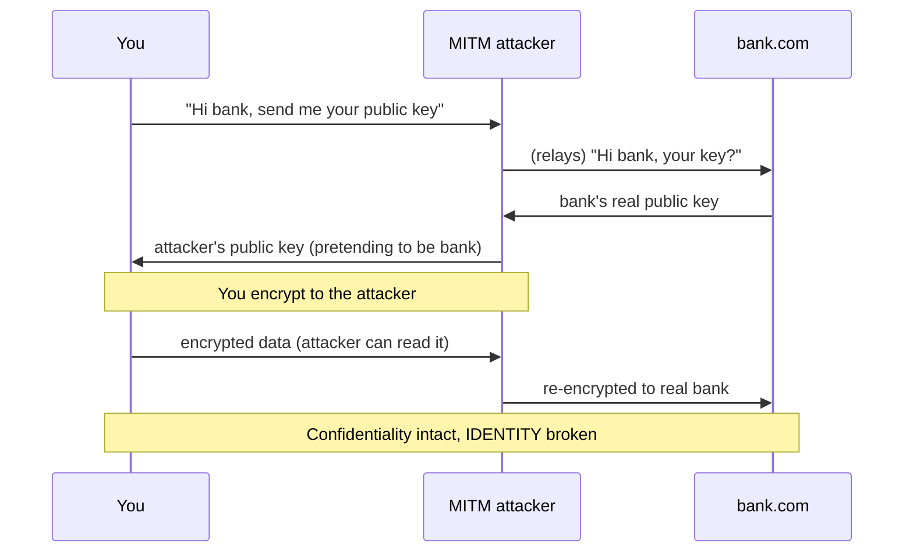
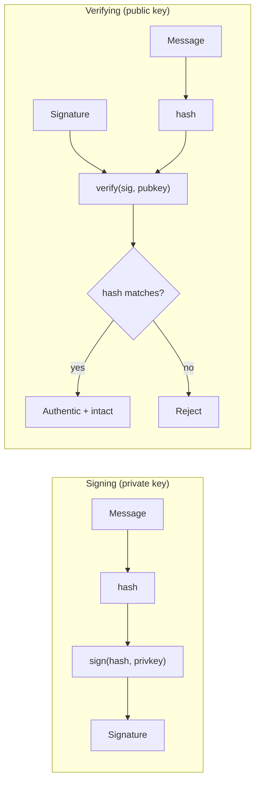
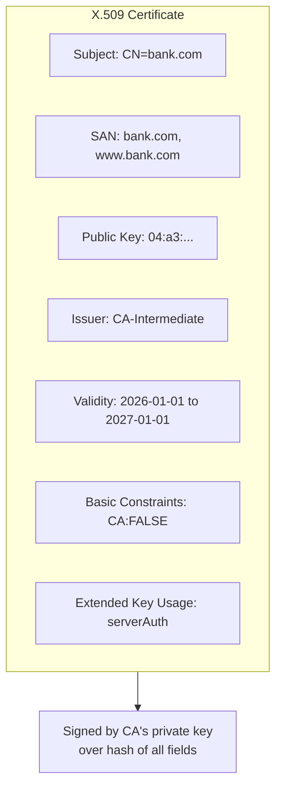
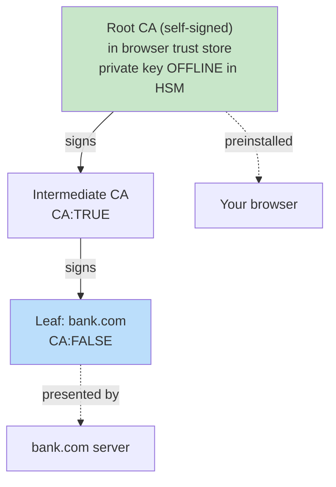
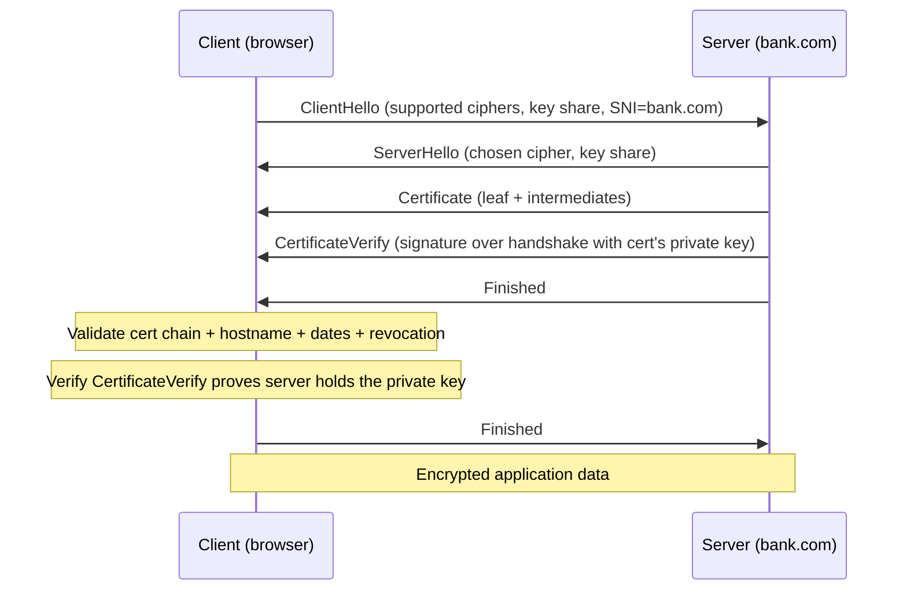
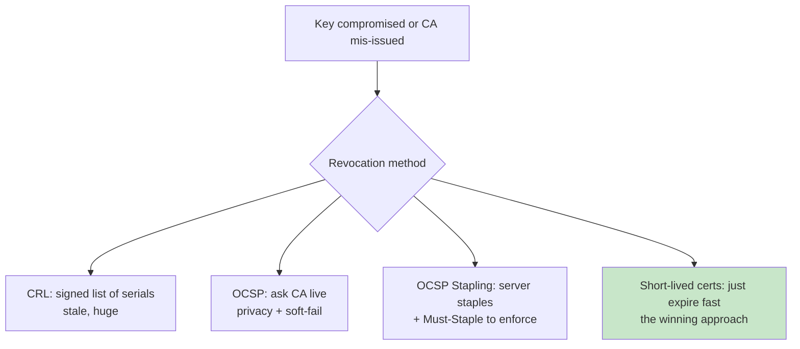
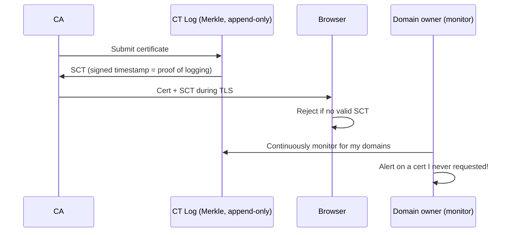
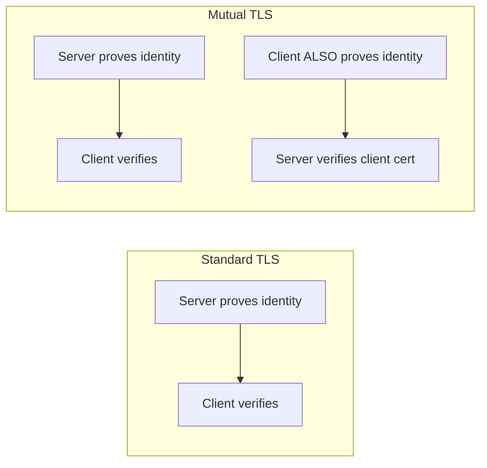
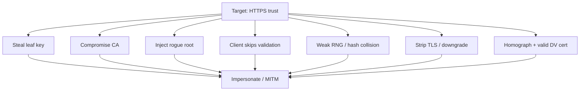

**Level:** Advanced · **Track:** Cryptography · **Read time:** 195 min

This is Chapter 6 of the Cryptography series — Notebook 7. Chapter 3 gave us asymmetric keys: a public key
anyone can hold and a private key only you hold, with the magic property that a signature made with the
private key can be verified by the public one. Chapter 4 gave us hashes. This chapter combines them to
solve the single hardest problem in applied cryptography — not "how do I encrypt" but **"how do I know this
public key really belongs to who it claims to?"** Encryption between two parties who already trust each
other's keys is easy. The internet has no such luxury: your browser talks to a bank it has never met,
across a network full of adversaries, and must decide — in milliseconds, automatically, billions of times a
day — that a public key presented by a stranger genuinely belongs to that bank. **Public Key
Infrastructure (PKI)** is the answer, and this chapter is how it actually works, how it's validated, and
every way it has been broken.

We build up from the primitive (digital signatures) through the data structure (X.509 certificates), the
trust model (CAs and chains), the runtime check (how TLS validates), the freshness problem (revocation),
the accountability layer (Certificate Transparency), and finally the attacks. You'll run a real CA, dump
real certificates, and see exactly which field a browser checks and what happens when each one is wrong.

## Part 1: The Problem — Trusting a Stranger's Public Key

Recall the core asymmetric guarantee from Chapter 3: sign with the private key, verify with the public key.
That gives **authenticity** (only the private-key holder could have produced this signature) and
**integrity** (the signed content wasn't altered) — *provided you already know the right public key.* That
proviso is the whole game.

Imagine visiting `bank.com`. The server sends you a public key. How do you know it's the bank's key and not
an attacker's? A **man-in-the-middle (MITM)** sitting on the network (rogue Wi-Fi, compromised router,
hostile ISP, malicious CDN edge) can intercept the connection, present *their own* public key, and
transparently relay traffic — you'd encrypt to the attacker, who decrypts, reads, re-encrypts, and forwards
to the real bank. Encryption without identity verification is worthless: you'd have a perfectly secure
channel to the wrong party.



The naive fixes don't scale. **Trust On First Use (TOFU)** — remember the key you saw the first time, alarm
if it changes (this is how SSH works: the "The authenticity of host … can't be established … fingerprint
SHA256:… Are you sure you want to continue?" prompt, after which the key is pinned in `known_hosts`) —
fails on first contact and for the billions of sites you've never visited. **Manually distributing every
public key** is absurd at internet scale. What we need is a way to *delegate* the identity check to a small
set of trusted third parties whose keys we *do* preinstall, and have them vouch for everyone else. That
delegation is PKI, and the vouching mechanism is the **digital signature on a certificate.**

**Three trust models, for contrast:**

| Model | How you trust a key | Used by | Weakness |
|---|---|---|---|
| **TOFU** | trust first key seen, alarm on change | SSH, Signal safety numbers | first contact is unverified |
| **Web of Trust** | people sign each other's keys; trust transitively | PGP/GPG | usability nightmare; never scaled |
| **Hierarchical PKI** | a few preinstalled root CAs vouch for everyone | TLS/HTTPS, the web | any CA can sign anything (Part 8 fixes) |

**Web of Trust** (PGP) deserves a mention because it's the road *not* taken for the web: instead of central
authorities, individuals sign the keys of people they've personally verified, and you trust a stranger's
key if there's a chain of signatures from people you trust to them. Elegant in theory, it collapsed in
practice — key-signing parties, unusable tooling, and no clear trust metric. The web chose hierarchical
CAs precisely because they scale to billions of automated, first-contact connections. Understanding why WoT
failed is understanding why we tolerate the CA model's "any CA can sign anything" flaw and bolt on
Certificate Transparency to make it survivable.

## Part 2: Digital Signatures — the Primitive Underneath Everything

A **digital signature** binds a message to a keypair. The signer hashes the message and transforms that
hash with their **private** key; anyone with the **public** key can verify the signature matches the
message. It provides three properties simultaneously:

- **Authenticity** — only the private-key holder could produce it.
- **Integrity** — any change to the message breaks the signature (because the hash changes).
- **Non-repudiation** — the signer can't credibly deny signing (only they had the private key).

Note the asymmetry vs the MAC/HMAC from Chapter 4: an HMAC uses a *shared secret*, so either party could
have produced it — no non-repudiation, and both sides must already share a key. A signature uses a
*keypair*, so verification needs only the public key and the signer alone could have made it. That's
exactly why certificates are signed, not MAC'd: the whole world must be able to verify, but only the CA
could have issued.



**Why we sign the hash, not the message.** Asymmetric operations are slow and size-limited (RSA can only
"sign" a block smaller than the modulus). So we hash the message to a fixed small digest (Chapter 4) and
sign *that*. This is also why signature security depends on the hash: if the hash has a collision (two
messages, same digest), a signature on one is valid for the other — which is exactly how the MD5-collision
attacks forged a rogue CA certificate (Part 12). **A signature is only as strong as its hash.**

**The signature algorithm families:**

| Algorithm | Basis | Signature size | Notes |
|---|---|---|---|
| RSA PKCS#1 v1.5 | RSA | large (~256–512 B) | legacy padding; deterministic; still common in certs |
| RSA-PSS | RSA | large | modern randomized RSA padding; preferred over v1.5 |
| DSA | discrete log | small | legacy; catastrophic if the random `k` repeats |
| ECDSA | elliptic curve | small (~64–72 B) | fast, small keys; also breaks if `k` repeats/leaks |
| **Ed25519 (EdDSA)** | Edwards curve | 64 B | **modern default**: deterministic `k`, fast, misuse-resistant |

**The `k`-reuse footgun (know this — it's a recurring CTF and real-world break).** DSA and ECDSA need a
fresh random nonce `k` per signature. If `k` ever repeats across two signatures (or is predictable), the
**private key can be recovered algebraically** from the two signatures. This exact bug let attackers
extract the signing key from the **Sony PlayStation 3** (Sony reused a constant `k`) and appears in CTFs
constantly. **Ed25519 fixes this** by deriving `k` deterministically from the message and key, so it can't
repeat — one reason it's the modern recommendation.

**Worked example — sign and verify with openssl.** Signatures aren't abstract; here's the whole cycle on
the command line so you can see each piece:

```bash
# Generate an Ed25519 keypair (tiny, fast, misuse-resistant)
openssl genpkey -algorithm ed25519 -out sign.key
openssl pkey -in sign.key -pubout -out sign.pub

# Sign a file: hash-then-sign is done internally
openssl pkeyutl -sign -inkey sign.key -rawin -in message.txt -out message.sig

# Verify with the PUBLIC key — anyone holding sign.pub can do this
openssl pkeyutl -verify -pubin -inkey sign.pub -rawin -in message.txt -sigfile message.sig
#   Signature Verified Successfully

# Tamper with one byte of message.txt and re-verify:
echo "x" >> message.txt
openssl pkeyutl -verify -pubin -inkey sign.pub -rawin -in message.txt -sigfile message.sig
#   Signature Verification Failure   <- integrity + authenticity in action
```

This is *literally* the operation a CA performs to sign a certificate (over the tbsCertificate bytes) and
the operation your browser performs to verify it — just with the CA's key instead of yours. Everything in
this chapter is this loop, repeated up a chain.

**RSA vs ECC signatures — the practical tradeoff.** RSA signatures are large (a 2048-bit key gives a
256-byte signature) and RSA keys are large, but verification is fast and RSA is universally supported.
Elliptic-curve signatures (ECDSA P-256, Ed25519) are tiny (~64 bytes) with much smaller keys for
equivalent security (a 256-bit EC key ≈ a 3072-bit RSA key), which matters for handshake size and mobile/
IoT. The modern preference order for new deployments: **Ed25519 > ECDSA-P256 > RSA-PSS > RSA PKCS#1v1.5**,
with RSA kept for compatibility.

## Part 3: The Certificate — Binding Identity to a Key

A **certificate** is the delegation made concrete: a data structure that says *"this public key belongs to
this identity,"* **signed by a Certificate Authority** whose own key you already trust. The dominant format
is **X.509**, encoded in **DER** (binary) or **PEM** (base64 of the DER, the `-----BEGIN CERTIFICATE-----`
text you see everywhere), using the **ASN.1** schema language.

The essential fields, and why each one is security-critical:

| Field | Meaning | Why it matters |
|---|---|---|
| **Subject** | who the cert identifies (CN + org) | the claimed identity |
| **Subject Alternative Name (SAN)** | the actual hostnames/IPs the cert is valid for | **browsers check SAN, not CN** — this is where the hostname match happens |
| **Issuer** | which CA signed it | points up the chain to the parent |
| **Public Key** | the subject's public key | the key being vouched for |
| **Validity (Not Before / Not After)** | lifetime window | expired certs are rejected |
| **Serial Number** | unique per issuer | used by revocation (CRL/OCSP) |
| **Basic Constraints** | `CA:TRUE/FALSE`, path length | **can this cert sign other certs?** critical for chain safety |
| **Key Usage / Extended Key Usage** | allowed uses (signing, key encipherment, `serverAuth`) | limits what the key may do |
| **Signature Algorithm + Signature** | the CA's signature over all the above | the actual vouching |



**Certificate validation levels** (issued by CAs after different vetting):

- **DV (Domain Validated)** — CA only proves you control the domain (respond to an email, place a DNS
  record, serve a file). Fast, free, automated (Let's Encrypt). Proves *domain control*, nothing about the
  legal entity. The vast majority of the web.
- **OV (Organization Validated)** — CA also vetted the organization exists.
- **EV (Extended Validation)** — heaviest vetting; historically showed the org name in the address bar
  (browsers have largely stopped giving EV special UI, which undercut its value).

**Security nuance to internalize:** a DV cert for `bank-secure-login.com` is trivially obtainable by anyone
who owns that domain, and it will show a perfectly valid padlock. **The padlock means "encrypted to whoever
owns this domain," not "this is your bank."** Phishing sites use valid DV certs all the time. Identity of
the *domain name* is what's proven; whether that domain is *the one you meant* is on the human.

## Part 4: Certificate Authorities and the Chain of Trust

You can't have every website's key preinstalled, but you *can* preinstall a few dozen **root CA** keys.
Your OS and browser ship with a **trust store** (root store) — Mozilla's, Microsoft's, Apple's, Google's —
containing ~100–150 root certificates from CAs the vendor has audited. Everything else chains up to one of
those roots.

The chain has three tiers:

- **Root CA** — a self-signed certificate whose private key is kept **offline** in an HSM, guarded
  obsessively (its compromise would be catastrophic and hard to recover from). Roots almost never sign
  end-entity certs directly.
- **Intermediate CA** — signed by the root; does the day-to-day issuing. If an intermediate is compromised,
  you revoke *it* without burning the root. Chains can have several intermediates.
- **Leaf / end-entity certificate** — the actual `bank.com` cert, signed by an intermediate.



**How the chain is verified (this is the core algorithm — memorize it):** the server sends the leaf *and*
the intermediate(s) (but **not** the root — you already have that). Your browser then, starting at the
leaf:

1. Takes the leaf's Issuer, finds the intermediate whose Subject matches.
2. **Verifies the intermediate's signature over the leaf** using the intermediate's public key.
3. Repeats up: verifies the root's signature over the intermediate.
4. Checks that the top of the chain is a **root in the local trust store**. If the chain reaches a trusted
   root and every signature checks out, the chain is valid.

Each link is "parent's private key signed child, verified with parent's public key." Trust flows *down*
from a root you decided to trust; verification flows *up* from the leaf the server presented. The root is
the **trust anchor** — the axiom the whole system rests on. This is why root CA compromise (DigiNotar,
Part 12) is an extinction-level PKI event, and why the number of trusted roots is deliberately small and
audited.

**Basic Constraints matters intensely here.** A leaf cert has `CA:FALSE`. If a validator *ignored* Basic
Constraints, anyone with a normal leaf cert could sign a cert for `bank.com` and have it accepted — a
total break. This is not hypothetical: **Moxie Marlinspike's 2009 "null-prefix" and the earlier
Basic-Constraints-not-checked bugs** were exactly this, letting a leaf act as a CA. Modern validators
enforce `CA:TRUE` and path-length constraints strictly.

**Cross-signing — why the same intermediate can chain two ways.** A new CA has a problem: its root isn't
in old devices' trust stores yet (trust stores update slowly — think TVs, old phones, embedded gear). The
fix is **cross-signing**: an *established* root also signs the new CA's intermediate, so the intermediate
now has two valid parent signatures. New clients build the short chain to the new root; old clients build
a longer chain to the established root they already trust. This is exactly how **Let's Encrypt bootstrapped
trust** (its intermediates were cross-signed by IdenTrust's already-trusted DST Root) before its own ISRG
root propagated everywhere. The practical lesson: a server should send the intermediate chain that
maximizes compatibility, and "it works in my browser but not on that old device" is often a chain-building/
cross-sign issue, not a bad cert.

**Path length constraints** cap how many further intermediates may appear below a CA (`pathlen:0` means
"this CA may only sign leaves, not further sub-CAs"), bounding the blast radius if a lower CA is
compromised. Along with **name constraints** (an intermediate restricted to only issue for, say,
`*.example.com`), these let a parent CA safely delegate to a sub-CA without handing over the whole internet
— an enterprise internal CA cross-signed with `nameConstraints` can only ever mint certs for the company's
own domains.

## Part 5: How TLS Actually Uses the Certificate

Certificates live inside the **TLS handshake** (the "S" in HTTPS). Here's where cert validation sits in the
TLS 1.3 flow, condensed:



Two distinct checks happen, and conflating them is a classic mistake:

1. **Chain + identity validation** (Part 4 + hostname match): is this a valid cert for `bank.com` issued by
   a trusted chain, unexpired, unrevoked?
2. **Proof of private-key possession** (`CertificateVerify`): the server signs the handshake transcript
   with the cert's private key. This proves the server *holds the private key* for the cert — otherwise an
   attacker could just replay a copy of the bank's public cert (which is public!) and impersonate it. The
   signature over live handshake data is what stops that replay.

**SNI (Server Name Indication)** — the client announces the hostname it wants *in the ClientHello* so a
server hosting many sites on one IP knows which cert to send. Historically SNI was cleartext (a privacy
leak revealing which site you're visiting even over TLS); **Encrypted Client Hello (ECH)** encrypts it.

**TLS 1.2 vs TLS 1.3 — what changed and why it matters for certs.** TLS 1.2 took two round trips and sent
the **Certificate message in the clear**; a network observer could see exactly which cert (and thus which
site) you received. TLS 1.3 (the current standard) cut the handshake to **one round trip** (with 0-RTT
resumption), **encrypts the Certificate message** (so the server's identity isn't exposed to passive
eavesdroppers), removed a pile of legacy weak options (RSA key exchange, static DH, CBC ciphers, MD5/SHA-1),
and mandates **forward secrecy** via ephemeral (EC)DHE key exchange — meaning even if the server's
long-term private key is later stolen, past recorded sessions **cannot** be decrypted. That last property
is why stealing a leaf key (Heartbleed) lets you *impersonate* going forward but not *decrypt* old captured
traffic under TLS 1.3. Configure servers **TLS 1.2 minimum, prefer 1.3**, disable everything older.

**Hostname verification is the check people forget.** A valid chain to a trusted root is *not enough* — the
client must also confirm the cert's **SAN** actually covers the hostname it connected to. A cert valid for
`evil.com`, chaining perfectly to a real root, must be *rejected* for `bank.com`. The number of
libraries/apps that validated the chain but forgot the hostname match is enormous — it's one of the most
common TLS implementation bugs (`curl` with the wrong flags, mobile apps, IoT). Wildcards (`*.bank.com`)
match one label only (`a.bank.com`, not `a.b.bank.com` and not the bare `bank.com`).

## Part 6: Hands-On Lab — Dissect and Build Real Certificates

Everything here uses **openssl**, the ubiquitous TLS/crypto CLI. Install: it's preinstalled on Kali/macOS/
most Linux; `sudo apt install openssl` otherwise. We'll inspect a live cert, then build a private CA.

### 6.1 Inspect a live certificate

```bash
# Pull the cert chain a server actually presents (-showcerts = whole chain)
$ echo | openssl s_client -connect example.com:443 -servername example.com -showcerts 2>/dev/null | \
    openssl x509 -noout -text | head -40
Certificate:
    Data:
        Version: 3 (0x2)
        Serial Number: 0f:6a:...:c3
        Signature Algorithm: sha256WithRSAEncryption
        Issuer: C=US, O=DigiCert Inc, CN=DigiCert Global G2 TLS RSA SHA256 2020 CA1
        Validity
            Not Before: Jan 30 00:00:00 2026 GMT
            Not After : Mar  1 23:59:59 2027 GMT
        Subject: C=US, O=Internet Corporation..., CN=www.example.org
        Subject Public Key Info:
            Public Key Algorithm: rsaEncryption
                Public-Key: (2048 bit)
        X509v3 extensions:
            X509v3 Subject Alternative Name:
                DNS:www.example.org, DNS:example.com, DNS:example.net
            X509v3 Basic Constraints: critical
                CA:FALSE
            X509v3 Extended Key Usage:
                TLS Web Server Authentication
```

Read every field: this is a leaf (`CA:FALSE`), for those SAN hostnames only, issued by a DigiCert
intermediate, valid for that window. Useful one-liners:

```bash
openssl x509 -in cert.pem -noout -subject -issuer -dates    # quick summary
openssl x509 -in cert.pem -noout -ext subjectAltName        # just the SANs
openssl x509 -in cert.pem -noout -fingerprint -sha256       # cert fingerprint
openssl verify -CAfile chain.pem cert.pem                   # validate a chain
openssl s_client -connect host:443 -servername host 2>/dev/null | openssl x509 -noout -dates
```

### 6.2 Build your own CA and issue a cert (the whole PKI, in miniature)

This is the single most clarifying exercise in the chapter: *be* the CA.

```bash
# 1. Create the ROOT CA keypair + self-signed root certificate
openssl genrsa -out rootCA.key 4096
openssl req -x509 -new -nodes -key rootCA.key -sha256 -days 3650 \
    -subj "/C=US/O=My Lab Root CA/CN=My Lab Root CA" -out rootCA.crt
#   -x509 => self-signed; this IS a root. Note CA:TRUE is implied by -x509 here.

# 2. Create a LEAF key + Certificate Signing Request (CSR) for a hostname
openssl genrsa -out server.key 2048
openssl req -new -key server.key -subj "/CN=myapp.local" -out server.csr
#   The CSR contains the subject + public key, self-signed to prove key possession.

# 3. The CA SIGNS the CSR, adding SAN + validity (this is what a real CA does)
cat > ext.cnf <<'EOF'
subjectAltName = DNS:myapp.local, DNS:www.myapp.local
basicConstraints = CA:FALSE
extendedKeyUsage = serverAuth
EOF
openssl x509 -req -in server.csr -CA rootCA.crt -CAkey rootCA.key -CAcreateserial \
    -days 365 -sha256 -extfile ext.cnf -out server.crt

# 4. Verify the leaf chains to your root
openssl verify -CAfile rootCA.crt server.crt
#   server.crt: OK

# 5. Trust the root on your machine and the leaf is now accepted for myapp.local.
#    (On Linux: copy rootCA.crt into /usr/local/share/ca-certificates/ && update-ca-certificates)
```

You just executed the entire trust model: a self-signed root, a CSR proving key possession, the CA signing
identity+key into a leaf, and chain verification. **Red team relevance:** this same flow is how attackers
run a TLS-intercepting proxy (Burp/mitmproxy generate a CA, you *install their root*, and now they can
issue a valid-looking cert for any site on the fly — see Part 12). **Blue team relevance:** a rogue root in
your trust store is a total interception backdoor; auditing trust stores is a real control.

### 6.3 Break it on purpose — see each check fail

The best way to learn validation is to *violate* each rule and watch the failure:

```bash
# WRONG HOSTNAME: issue a cert for other.local, then verify a connection for myapp.local
#   -> client rejects: "certificate is valid for other.local, not myapp.local"

# EXPIRED: sign with -days -1 (already expired)
openssl x509 -req -in server.csr -CA rootCA.crt -CAkey rootCA.key -days -1 -out expired.crt
openssl verify -CAfile rootCA.crt expired.crt
#   error 10 at 0 depth: certificate has expired

# UNTRUSTED ROOT: verify the leaf WITHOUT giving openssl the root
openssl verify server.crt
#   error 20: unable to get local issuer certificate   <- chain doesn't reach a trusted anchor

# SELF-SIGNED LEAF pretending to be a real site: verify without a CA
openssl verify self.crt
#   error 18: self-signed certificate
```

Each error maps one-to-one to a Part-4/Part-5 check: hostname (SAN), validity dates, chain-to-trusted-root,
and issuer resolution. When a real site "won't load," it's almost always one of these four.

### 6.4 Bundle a cert + key for deployment (PKCS#12) and set up mTLS client certs

```bash
# Package leaf cert + private key + chain into a single password-protected .p12
openssl pkcs12 -export -inkey server.key -in server.crt -certfile rootCA.crt \
    -name "myapp" -out server.p12
#   (import this into Windows, a load balancer, or a browser keystore)

# Issue a CLIENT certificate for mTLS (extendedKeyUsage = clientAuth this time)
openssl genrsa -out client.key 2048
openssl req -new -key client.key -subj "/CN=alice@myapp.local" -out client.csr
printf 'extendedKeyUsage = clientAuth\n' > client.cnf
openssl x509 -req -in client.csr -CA rootCA.crt -CAkey rootCA.key -CAcreateserial \
    -days 365 -extfile client.cnf -out client.crt
# The server, configured to require + verify client certs against rootCA.crt, now
# authenticates the CLIENT by its certificate (Part 10, mTLS) — no password involved.
```

The only difference between a server cert and a client cert is `extendedKeyUsage`: `serverAuth` vs
`clientAuth`. That single field is what lets one CA issue both and what a validator checks to ensure a
client cert can't masquerade as a server cert.

## Part 7: Revocation — What When a Certificate Goes Bad

A cert says "valid until 2027," but keys get stolen and CAs mis-issue. **Revocation** is how a cert is
killed *before* its expiry. It's the hardest, jankiest part of PKI, and largely broken in practice — know
why.

**CRL (Certificate Revocation List).** The CA publishes a signed list of revoked serial numbers. Clients
download it and check. Problem: CRLs grow huge, are cached, and are often stale — and if the client can't
fetch it, what does it do?

**OCSP (Online Certificate Status Protocol).** The client asks the CA's OCSP responder "is serial N still
good?" in real time. Problems: (a) **privacy** — you tell the CA every site you visit; (b) **performance** —
an extra round trip; (c) the fatal one: **soft-fail.** If the OCSP responder is unreachable (down, blocked
by the very MITM you're worried about), browsers historically **treat it as valid** rather than break the
web. An attacker who can present a stolen-but-revoked cert just blocks OCSP and the check silently passes.
Soft-fail makes OCSP nearly worthless against an active attacker.

**OCSP Stapling.** The *server* fetches its own OCSP response periodically and "staples" it (fresh, signed,
time-stamped) into the TLS handshake. Fixes privacy (client asks no one) and performance (no extra round
trip). But a malicious server can just *not* staple, and soft-fail kicks in again — unless the cert carries
the **`Must-Staple`** flag, which tells clients "reject me if a valid staple isn't present," closing the
hole.

**The modern answer: short-lived certificates.** Rather than revoke, **expire fast.** Let's Encrypt certs
last 90 days; the industry is moving toward **~47-day and even shorter** lifetimes and automated renewal
(ACME). A 7-day cert barely needs revocation — the window of a stolen key is tiny. This sidesteps the
whole broken revocation problem by making certs disposable. **This is the direction everything is going:
automate issuance/renewal, keep lifetimes short, stop relying on revocation.**

**Hands-on: query revocation yourself.**

```bash
# Find where a cert points for OCSP and CRL (the AIA / CRL Distribution Points)
openssl x509 -in leaf.pem -noout -ocsp_uri
#   http://ocsp.example-ca.com
openssl x509 -in leaf.pem -noout -text | grep -A2 "CRL Distribution"
#   URI:http://crl.example-ca.com/ca.crl

# Ask the OCSP responder live whether the cert is still valid
openssl ocsp -issuer intermediate.pem -cert leaf.pem \
    -url http://ocsp.example-ca.com -no_nonce
#   leaf.pem: good              <- or "revoked" with a reason + revocation time

# Download and inspect the CRL (list of revoked serials)
curl -s http://crl.example-ca.com/ca.crl -o ca.crl
openssl crl -inform DER -in ca.crl -noout -text | head -20
#   Revoked Certificates:
#       Serial Number: 0A3F...     Revocation Date: ...
```

Run the OCSP query, then note that if you *block* that `ocsp.example-ca.com` host (exactly what a MITM
does), a soft-fail browser proceeds anyway. That is the whole weakness in one experiment.



## Part 8: Certificate Transparency — Making CAs Accountable

The chain model has a scary property: **any trusted CA can issue a cert for any domain.** If one of ~150
CAs is compromised or coerced, it can mint a valid `google.com` cert and you'd have no way to know. This
actually happened (DigiNotar, Part 12). The fix is **Certificate Transparency (CT):** every issued cert
must be logged to public, append-only, cryptographically-verifiable **CT logs** (built on Merkle trees —
Chapter 4). Browsers (Chrome, Safari) **require** that a cert be accompanied by **SCTs (Signed Certificate
Timestamps)** proving it was logged, or they reject it.

Why this works: it doesn't *prevent* mis-issuance, but it makes it **detectable**. If a CA secretly issues
a `google.com` cert, that cert *must* appear in public logs to be accepted — so Google (and anyone) can
**monitor** the logs and immediately spot a cert they didn't request. Mis-issuance becomes a loud, public,
attributable event instead of a silent attack. **This is the accountability layer that makes the "any CA
can sign anything" flaw survivable.**



**Practical use for defenders and bounty hunters alike:** `crt.sh` is a searchable CT-log front end. Query
`crt.sh?q=%25.target.com` and you get *every certificate ever issued* for a domain and its subdomains — an
incredible **subdomain-enumeration and asset-discovery** source (find `dev.`, `staging.`, `vpn.`,
`internal-api.` hosts nobody meant to expose). Bug bounty recon leans on CT logs heavily; blue teams use CT
monitoring to catch shadow IT and mis-issued certs for their brand.

```bash
# CT-log subdomain enumeration in one line (authorized targets only)
curl -s "https://crt.sh/?q=%25.example.com&output=json" | \
    jq -r '.[].name_value' | sed 's/\*\.//g' | sort -u
#   api.example.com
#   dev.example.com
#   internal-vpn.example.com    <- was this meant to be public?
#   staging.example.com
```

This works because *every* publicly-trusted cert must be logged to be accepted (the SCT requirement), so
the logs are a near-complete inventory of a domain's TLS-fronted assets — including ones that never appear
in DNS brute-forcing or search engines. It is one of the highest-signal recon steps in all of bug bounty,
and the same query run against *your own* domains is how you catch a cert someone stood up for
`login-yourcompany.com` phishing infrastructure.

## Part 9: Deep Dive — Reading ASN.1, DER, PEM, and the Encodings

Certificates are **ASN.1** structures serialized as **DER** (Distinguished Encoding Rules — a canonical
binary TLV: Tag-Length-Value format) and usually wrapped as **PEM** (base64 of the DER with header/footer
lines). Knowing the layers helps you debug "why won't this cert load" and understand parser-differential
attacks.

```bash
# PEM <-> DER conversion
openssl x509 -in cert.pem -outform DER -out cert.der     # PEM to DER
openssl x509 -inform DER -in cert.der -out cert.pem       # DER to PEM

# Dump the raw ASN.1 TLV structure (great for understanding / spotting oddities)
openssl asn1parse -in cert.pem
#   0:d=0  hl=4 l= 900 cons: SEQUENCE
#   4:d=1  hl=4 l= 620 cons:  SEQUENCE          <- tbsCertificate (the signed part)
#   ...
#   :  OBJECT            :commonName
#   :  UTF8STRING        :myapp.local
```

The certificate is a `SEQUENCE` of three parts: **tbsCertificate** (the "to-be-signed" body — all the
fields), the **signatureAlgorithm**, and the **signatureValue** (the CA's signature over the hash of
tbsCertificate). This structure is *why* changing any field invalidates the signature: the signature covers
the exact DER bytes of tbsCertificate.

**Parser-differential danger:** if two implementations parse the same bytes differently (e.g. one honors an
embedded null in a CN string, another stops at it), an attacker can craft a cert that *looks like*
`bank.com\0.evil.com` to a lax parser but `evil.com` to the CA that signed it — Marlinspike's null-prefix
attack again. Canonical, strict DER parsing and checking SAN (not CN) mitigate this.

**Why the "critical" flag on extensions matters.** Each X.509 extension is marked *critical* or
*non-critical*. If a validator encounters a **critical** extension it doesn't understand, it **must reject
the certificate** — this is a safety mechanism so a CA can add a constraint (like a name constraint or a
restricted key usage) and be sure old clients don't silently ignore it. Basic Constraints is typically
marked critical for exactly this reason: nobody gets to "not notice" that a cert is or isn't a CA. When you
saw `X509v3 Basic Constraints: critical` in the Part 6 dump, that word is doing real security work.

**File format cheat sheet:**

| Extension | What it is |
|---|---|
| `.pem` | base64 text; may hold cert, key, or chain |
| `.crt` / `.cer` | usually a certificate (PEM or DER) |
| `.der` | binary DER |
| `.key` | a private key (guard it!) |
| `.csr` | certificate signing request |
| `.p12` / `.pfx` | PKCS#12 bundle: cert + private key + chain, password-protected |
| `.p7b` | PKCS#7 chain (certs only, no key) |

## Part 10: Trust Stores, Pinning, and mTLS

**Trust stores** are the root of everything (literally). Each platform ships one: Mozilla's NSS store
(Firefox, many Linux tools), Microsoft's (Windows/Edge), Apple's (macOS/iOS), Google's Chrome Root Store.
An enterprise can add its *own* root (for internal CAs or, less benignly, for TLS-inspecting proxies). The
security property is stark: **whoever controls your trust store controls who you trust.** A single rogue
root = silent interception of all your TLS. Malware and spyware add roots; so do corporate MITM proxies;
so did Superfish (Part 12).

**Certificate Pinning** narrows trust further: an app hardcodes (pins) the *specific* cert or public key
(or a specific CA) it expects, and rejects anything else *even if it chains to a trusted root.* This defeats
a rogue-CA/MITM entirely for that app — the attacker's valid-but-different cert is refused. Downsides: it's
operationally brittle (rotate the pinned key and old app versions break), which is why the web moved away
from HPKP (HTTP Public Key Pinning, now dead — it enabled "ransom-pinning" DoS) toward CT + short-lived
certs. Mobile apps still pin heavily (and bug bounty on mobile often starts with *bypassing* pinning via
Frida/objection to see the traffic).

**Pinning bypass (mobile bug-bounty staple).** Because pinning lives in the *client*, an attacker who
controls the client can remove it. On a rooted/jailbroken test device you use **Frida** or **objection**
(`objection -g com.target.app explore` then `android sslpinning disable`) to hook the app's TLS validation
and neuter the pin, so your intercepting proxy's cert is accepted and you can read the app's API traffic.
This is standard authorized mobile testing — and it's exactly why pinning protects against *network*
attackers but not against a compromised device. Defenders counter with attestation and by not treating
pinning as a substitute for server-side authz.

**Key management is the unglamorous foundation.** All of this collapses if private keys aren't protected.
Best practice: generate and keep CA and high-value keys in an **HSM/KMS** so they can never be exported
(the server asks the HSM to sign; the key never leaves), enforce least-privilege access, rotate on a
schedule and immediately on suspected compromise, keep root keys **offline**, and never commit `.key`
files to source control (secret-scanning tools like gitleaks exist because this happens constantly). A
leaked private key is a leaked identity — see Heartbleed (Part 12).

**Mutual TLS (mTLS)** flips authentication both ways: normally only the server proves identity, but in mTLS
the **client also presents a certificate** and the server validates it. This is how service meshes,
zero-trust internal networks, and high-security APIs authenticate machines to each other without passwords.
The client cert chains to a (usually private) CA the server trusts.



## Part 11: The Attacker's View — PKI Failure Modes

Every trust decision above is a place to attack. The consolidated offensive map:

- **Steal the leaf private key** → impersonate the site until revocation/expiry (Heartbleed, Part 12,
  leaked exactly these).
- **Compromise or coerce a CA** → mint valid certs for any domain (DigiNotar). CT makes it detectable, not
  impossible.
- **Get a rogue root into the trust store** → total silent MITM (Superfish, corporate proxies, malware).
- **Exploit weak crypto** → forge a chain via a hash collision (MD5-collision rogue CA cert, 2008) or a
  broken RNG that makes keys guessable (Debian OpenSSL, 2008).
- **Skip a validation step** (the most common in the wild) → the *client* doesn't check the hostname,
  ignores the expiry, accepts any cert (`curl -k`, disabled verification in mobile/IoT apps), or ignores
  Basic Constraints. No exotic crypto needed; the code just doesn't verify.
- **Downgrade / strip TLS** → **sslstrip**-style attacks force the user onto plaintext HTTP so no cert is
  involved at all; **HSTS** (Part 13) is the counter.
- **Homograph / typosquat + valid DV cert** → `аpple.com` (Cyrillic а) or `paypa1.com` gets a legit DV
  cert and a real padlock; the crypto is perfect, the human is fooled.



## Part 12: Real Breaches — the History That Shaped Modern PKI

Each of these directly caused a defense you now rely on:

- **Debian OpenSSL weak RNG (2008).** A Debian patch neutered OpenSSL's entropy so keys were drawn from
  only ~32,767 possibilities. Every key generated on affected systems for ~2 years was **guessable** —
  attackers could brute-force the private key from the public one. Lesson: crypto is only as good as its
  randomness (ties straight to the `k`-reuse issue in Part 2).
- **MD5-collision rogue CA (2008).** Researchers exploited MD5 collisions to get a CA to sign a benign cert
  whose hash *collided* with a crafted CA certificate — giving them a **valid intermediate CA** they could
  use to sign anything. This is *the* reason MD5 (and later SHA-1) were forcibly retired from certificate
  signatures. "A signature is only as strong as its hash" (Part 2), demonstrated.
- **DigiNotar (2011).** A Dutch CA was fully compromised; the attacker issued **valid certs for `*.google.
  com`** and others, used to MITM ~300,000 Iranian Gmail users. DigiNotar was distrusted and went bankrupt.
  This event drove **Certificate Transparency** (Part 8) — mis-issuance had to become detectable.
- **Heartbleed (2014, CVE-2014-0160).** An OpenSSL buffer over-read let attackers dump server memory —
  including **private keys** — with no trace. Mass key rotation and re-issuance followed; it hammered home
  why revocation and short lifetimes matter (you may not even *know* a key leaked).
- **Superfish (2015).** Lenovo preinstalled adware with a **self-signed root CA** (and the same private key
  on every laptop, trivially extractable) so it could MITM HTTPS to inject ads. Anyone could use that key
  to MITM any Superfish laptop. The canonical "rogue root in the trust store = total compromise" case.
- **Symantec distrust (2017–2018).** Repeated mis-issuance led Google/Mozilla to **distrust Symantec's
  roots** — proof that even the largest CAs are held accountable, and that CT + monitoring works.

**Red team / Kali angle — TLS interception with mitmproxy:** these lessons are a lab you can run. Tools:
**mitmproxy** (`sudo apt install mitmproxy`) or **Burp Suite** generate their own CA on first run. You
install that CA into the target's trust store, route traffic through the proxy, and it **issues valid certs
on the fly** for every site the target visits — reading and modifying HTTPS in the clear. This is the exact
Superfish/corporate-proxy mechanism; doing it in a lab (only on systems you own) makes the whole "rogue
root" threat viscerally clear. **The defense is the same trust-store hygiene and pinning discussed above.**

## Part 13: Detection & Defense Angle

The consolidated blue-team and hardening view of PKI:

- **HSTS (HTTP Strict Transport Security).** A response header (`Strict-Transport-Security: max-age=...;
  includeSubDomains; preload`) telling browsers "only ever reach me over HTTPS." Defeats sslstrip/downgrade
  by removing the plaintext-HTTP option entirely; **preloading** bakes it into the browser so even the
  first visit is protected. This is the single most important web-facing PKI defense.
- **CT monitoring.** Continuously watch CT logs (`crt.sh`, commercial monitors) for certs issued for your
  domains that you didn't request — early warning of CA compromise, mis-issuance, or phishing infra
  standing up `login-yourbank.com`. Cheap, high-value, do it.
- **CAA records (Certificate Authority Authorization).** A DNS record (`example.com. CAA 0 issue
  "letsencrypt.org"`) that tells CAs "only these CAs may issue for me." A compliant CA refuses issuance
  otherwise, shrinking the "any CA can sign anything" surface at the DNS layer.
- **Trust-store hygiene.** Inventory and monitor the roots on endpoints; alert on unexpected root
  additions (that's how you catch Superfish-class adware and unauthorized MITM proxies). On servers, ship
  minimal trust stores.
- **Strong config + automation.** TLS 1.2+/1.3 only, modern cipher suites, OCSP Must-Staple where feasible,
  and **ACME automation** (certbot/Caddy/cert-manager) so short-lived certs renew themselves — automation
  is what makes short lifetimes (the winning revocation strategy) operationally viable.
- **Scan your own posture.** Tools like **`testssl.sh`**, **sslyze**, and Qualys SSL Labs grade your
  endpoints: expired/misconfigured chains, weak ciphers, missing HSTS, SHA-1 signatures, missing SANs.
- **Detect interception.** Unexpected cert changes, cert fingerprints that don't match your known-good pin,
  or clients suddenly trusting a new root are all interception signals; CT + pinning + endpoint monitoring
  cover the angles.

**IR use case:** on a confirmed private-key leak (a Heartbleed-style event), you **revoke and re-issue**
the leaf, rotate the key, force session invalidation, and — because revocation is weak — lean on short new
lifetimes and monitor CT for abuse of the old cert. On a suspected rogue-CA/MITM report, pull the presented
cert's fingerprint and issuer, compare against CT logs and your CAA policy, and check endpoint trust stores
for unauthorized roots.

**Looking ahead — post-quantum:** the asymmetric algorithms underpinning every signature and key exchange
here (RSA, ECDSA, ECDH) are breakable by a sufficiently large quantum computer via Shor's algorithm. The
standardized replacements (**ML-DSA / Dilithium** for signatures, **ML-KEM / Kyber** for key exchange) are
beginning to roll out, often as **hybrid** schemes (classical + PQC together) so a break in either alone
isn't fatal. The immediate threat is **"harvest now, decrypt later"** — adversaries recording encrypted
traffic today to decrypt once quantum arrives — which is why forward-secret TLS 1.3 and early PQC hybrids
matter now, not someday. Certificates, chains, and CT all carry over; only the signature/KEX primitives
inside them change.

## Part 14: Final Revision / Summary

- **The core problem PKI solves:** turning a stranger's public key into *trusted identity* so MITM can't
  swap keys. Encryption without identity verification is worthless.
- **Digital signatures** (hash + private key) give authenticity, integrity, non-repudiation — and unlike
  HMAC, anyone can verify with the public key while only the holder can sign. **A signature is only as
  strong as its hash** (MD5-collision rogue CA). ECDSA/DSA die if the nonce `k` repeats (PS3); **Ed25519**
  fixes this and is the modern default.
- **X.509 certificate** binds identity → key, **signed by a CA**. Browsers check **SAN** (not CN),
  validity dates, **Basic Constraints (CA:TRUE/FALSE)**, and key usage. **DV proves domain control only** —
  a padlock ≠ "your bank."
- **Chain of trust:** leaf ← intermediate ← root (self-signed, in the trust store, key offline). Verify up
  the chain, anchor at a trusted root. Root compromise is catastrophic.
- **TLS** validates the chain **and** the hostname **and** proves private-key possession
  (`CertificateVerify`). Forgetting the hostname check is a top implementation bug.
- **Revocation is broken:** CRL (stale), OCSP (privacy + soft-fail), stapling (+ Must-Staple to enforce).
  **Short-lived, auto-renewed certs are the winning answer.**
- **Certificate Transparency** makes mis-issuance *detectable* via public append-only logs + required SCTs;
  `crt.sh` is gold for recon and monitoring.
- **Trust stores** are the crown jewels — a rogue root = total silent MITM (Superfish). **Pinning** and
  **mTLS** narrow trust further.
- **History drove the defenses:** Debian RNG, MD5 rogue CA, DigiNotar → CT, Heartbleed → rotation,
  Superfish → trust-store hygiene, Symantec distrust → accountability.
- **Defenses:** HSTS (kills downgrade), CT monitoring, CAA records, trust-store hygiene, ACME automation,
  `testssl.sh`.
- **Trust models:** TOFU (SSH), Web of Trust (PGP, failed to scale), hierarchical CAs (the web) — we chose
  the last for scale and patched its "any CA" flaw with CT.
- **Key management** is the foundation: keys in HSM/KMS, roots offline, rotate on compromise, never commit
  `.key` files. **Post-quantum** (ML-DSA / ML-KEM, hybrids) is the coming migration; "harvest now, decrypt
  later" makes it a present concern.

## Part 15: Cheat Sheet / Quick Reference

**Inspect / build:**

```bash
openssl x509 -in cert.pem -noout -text                       # full decode
openssl x509 -in cert.pem -noout -subject -issuer -dates     # summary
openssl x509 -in cert.pem -noout -ext subjectAltName         # SANs (what browsers check)
openssl s_client -connect host:443 -servername host -showcerts # live chain
openssl verify -CAfile chain.pem cert.pem                    # validate chain
openssl req -new -key server.key -out server.csr             # make a CSR
openssl x509 -req -in server.csr -CA rootCA.crt -CAkey rootCA.key -CAcreateserial -out server.crt  # CA signs
openssl asn1parse -in cert.pem                               # raw ASN.1/DER
```

**Chain:** leaf (CA:FALSE) ← intermediate (CA:TRUE) ← root (self-signed, in trust store).
**Validate = ** chain signatures up to a trusted root **+** hostname in SAN **+** dates valid **+** not
revoked **+** proof of key possession.

**Validation levels:** DV (domain control only — phishing gets these) · OV (org vetted) · EV (heaviest).
**Revocation:** CRL · OCSP (soft-fail!) · stapling (+Must-Staple) · **short-lived certs win.**
**Accountability:** CT logs + SCTs, monitor via `crt.sh`. **DNS control:** CAA records.
**Downgrade defense:** HSTS (+ preload). **Signature algos:** prefer **Ed25519** / ECDSA-P256 / RSA-PSS.
**File types:** `.pem`/`.crt` cert · `.key` private key · `.csr` request · `.p12`/`.pfx` cert+key bundle.

## Part 16: Common Pitfalls

1. **"Padlock = safe."** DV certs prove domain control, not that it's the right company. Phishing sites
   have valid certs.
2. **Validating the chain but not the hostname.** Classic library/app bug — a valid cert for `evil.com`
   accepted for `bank.com`. Always check SAN.
3. **Checking CN instead of SAN.** Modern browsers ignore CN for hostname matching; use SAN.
4. **Ignoring Basic Constraints.** A leaf with `CA:FALSE` must not be allowed to sign — else any leaf
   becomes a CA.
5. **Trusting OCSP soft-fail for security.** An active attacker just blocks OCSP. Use stapling +
   Must-Staple, or short-lived certs.
6. **Disabling verification "temporarily"** (`curl -k`, `verify=False`, `NODE_TLS_REJECT_UNAUTHORIZED=0`)
   and shipping it. This is the #1 real-world TLS hole.
7. **SHA-1 / MD5 signatures.** Collision-forgeable; long deprecated for certs.
8. **Leaking the private key** (in a repo, a backup, an over-broad file perm). The key is the whole
   identity; guard `.key` files like passwords.
9. **Wildcard misunderstanding.** `*.bank.com` covers `a.bank.com`, not `a.b.bank.com` and not bare
   `bank.com`.
10. **No CT/CAA monitoring**, so a mis-issued or phishing cert for your brand goes unnoticed.

## Part 17: Practice Labs & Resources

- **Build-your-own-CA (Part 6.2)** end to end, then install the root and serve HTTPS to a browser with your
  own leaf — the fastest way to *feel* the whole trust model.
- **badssl.com** — a purpose-built playground of broken TLS: expired, self-signed, wrong-host, revoked,
  weak-DH, SHA-1, no-SAN, and pinning-test certs. Point tools and browsers at each and observe exactly
  which check fails and how it's reported.
- **mitmproxy / Burp lab (your own machines only):** install the proxy CA, intercept your own HTTPS, then
  *remove* the CA and watch it break — the Superfish/rogue-root lesson, hands-on.
- **crt.sh recon:** pick a domain you're authorized to test and enumerate its subdomains from CT logs;
  compare to what's publicly reachable. Core bug-bounty recon.
- **testssl.sh / Qualys SSL Labs:** grade a server you own; fix every finding (enable HSTS, drop weak
  ciphers, fix the chain) and re-grade.
- **CryptoHack "Digital Signatures" + the ECDSA nonce-reuse challenges:** recover a private key from two
  signatures sharing `k` — makes Part 2's footgun concrete.
- **PortSwigger Web Security Academy:** the certificate/TLS-related and HSTS/host-header material for the
  web-app side of these trust decisions.

**Practice questions / mini-labs:**

1. A server presents a certificate that chains perfectly to a trusted root and is within its validity
   window, yet the browser shows an error. Give two distinct reasons this can happen and the exact field/
   check responsible for each.
2. Walk through, link by link, how a browser validates a 3-cert chain (leaf, intermediate, root). At each
   step state which key verifies which signature and which cert the root is *not* sent by the server.
3. Explain why OCSP soft-fail provides almost no protection against the exact adversary revocation is meant
   to stop, and give two mechanisms that actually close the gap.
4. You own `example.com`. Design a defense so that (a) no CA except your chosen one can issue for you, (b)
   you're alerted within minutes if one does anyway, and (c) browsers refuse to ever load you over plain
   HTTP. Name the three mechanisms.
5. Using `openssl`, build a root CA, issue a leaf for `myapp.local` with a SAN, and verify the chain. Then
   deliberately omit the SAN and show what a strict client does. What field did the client reject on?

If you can explain why key-swap MITM is the core threat, build and verify a chain by hand, know why the
hostname check and Basic Constraints are as important as the signature, articulate why revocation is broken
and short-lived certs win, use CT logs for recon and monitoring, and map each historic breach to the
defense it created — you own this chapter.

This chapter turned signatures and hashes into planet-scale identity and trust. The next and final chapter
of this notebook goes on the offense against everything we've built: **practical crypto attacks — XOR
weaknesses, ECB structure leakage, the padding oracle, and the CTF techniques** that turn a subtle
implementation slip into full plaintext recovery.

---

*Also on [Praneeth's portfolio](https://ping-praneeth.vercel.app/notebook/cryptography/06-pki-digital-signatures-certificates-and-chains-of-trust), with comments and the latest edits.*
