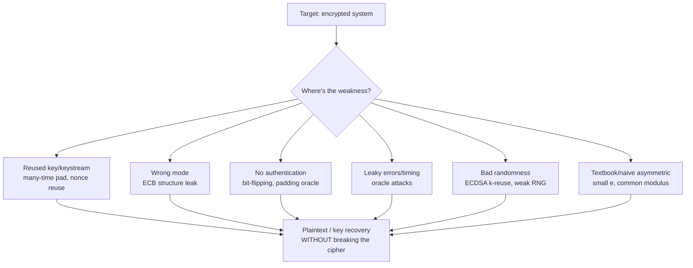
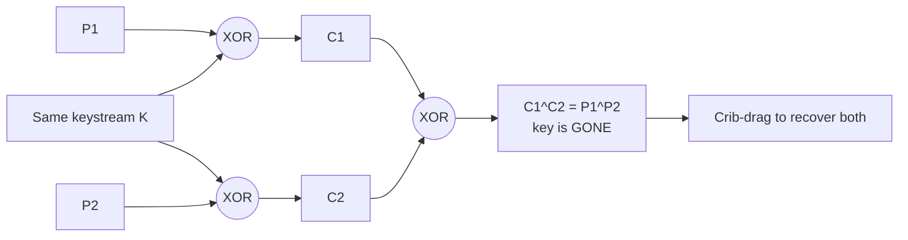
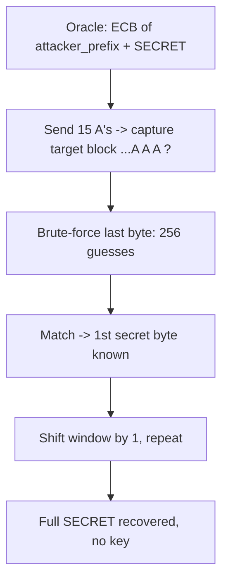
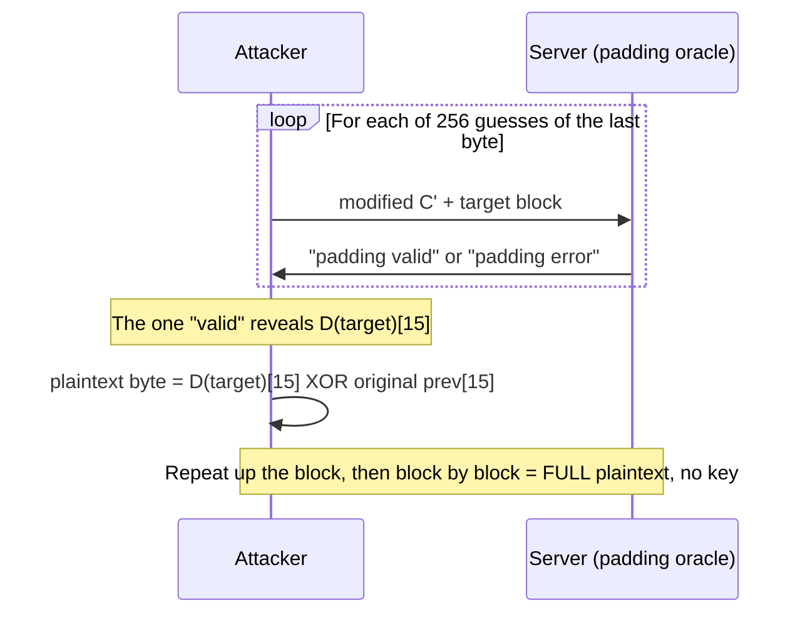
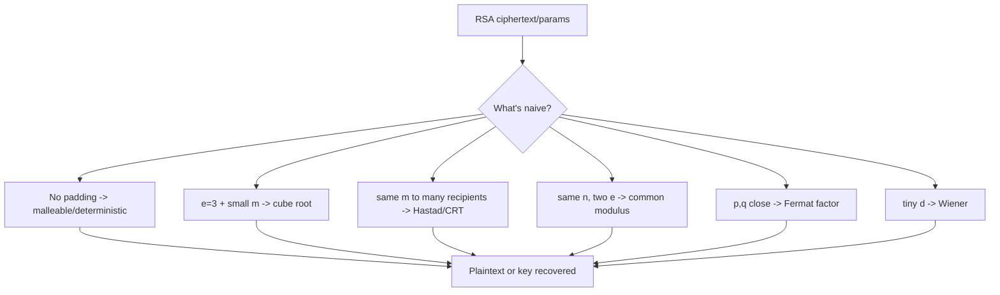
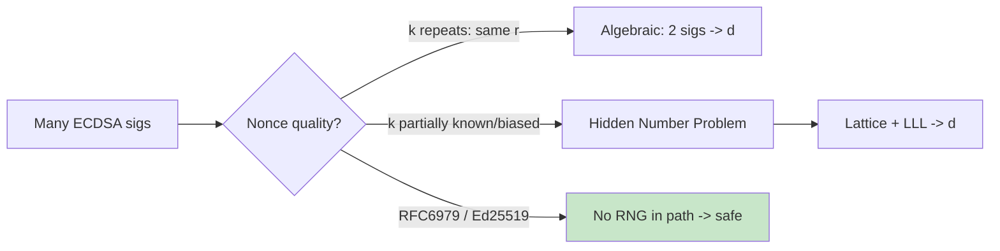
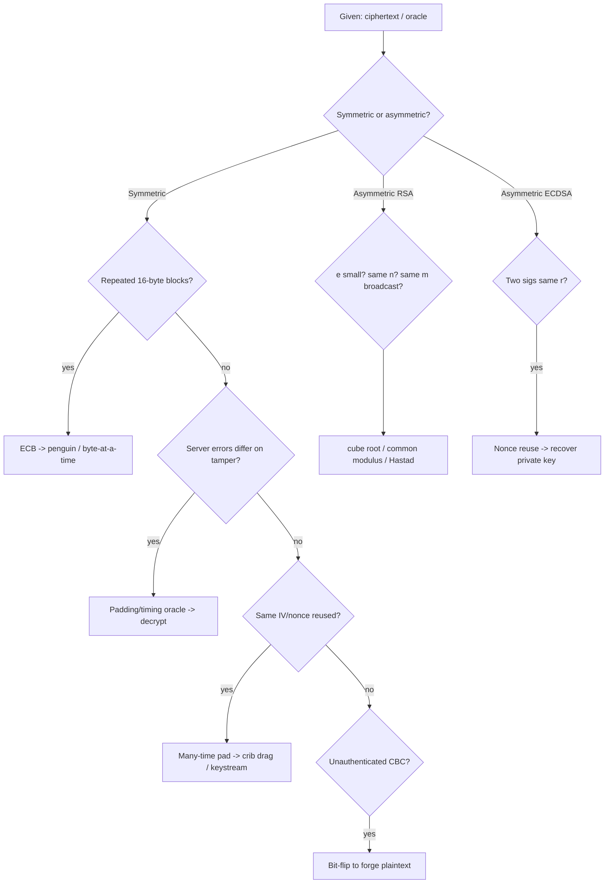

This is Chapter 7 of the Cryptography series — Notebook 7, and the offensive capstone. The previous six
chapters built cryptography up: encoding vs encryption vs hashing, symmetric and asymmetric ciphers,
hashing and MACs, password storage, and PKI. This chapter tears it back down — not by breaking AES or RSA
(nobody does that; the math is sound) but by exploiting the *seams*: reused keys, wrong modes, leaky error
messages, predictable randomness, missing authentication. **Real-world crypto is almost never broken at the
algorithm; it's broken at the usage.** A padding-oracle attack recovers your plaintext without ever
touching the key. ECB mode leaks the shape of your data. A reused nonce hands over the keystream. These are
the bugs that live in production and in every CTF crypto category, and learning to *attack* them is the
fastest way to understand — permanently — why the defensive rules from earlier chapters exist.

Everything here is hands-on and reproducible. Each attack comes with the vulnerable construction, the exact
oracle or observation that leaks, working Python you can run, and the one-line fix. Ethics first: run these
only against systems you own or are explicitly authorized to test (CTFs, your own lab, disclosed-scope
bounty targets). The techniques are dual-use; the intent here is to make you a better defender by making
you a competent attacker.

## Part 1: The Attacker's Mindset — Break the Usage, Not the Cipher

The single most important idea in this chapter: **you will almost never attack the primitive.** AES-256 and
RSA-2048 are, for practical purposes, unbreakable head-on. What breaks is everything *around* them:



The attacker's checklist when handed a ciphertext or a crypto endpoint:

1. **Is anything reused?** Same key for two messages (many-time pad), same IV/nonce (keystream reuse), same
   ECDSA nonce (key recovery). Reuse is the number-one crypto bug.
2. **What mode is it?** ECB leaks structure. Unauthenticated CBC/CTR is malleable (bit-flipping, padding
   oracle).
3. **Is it authenticated?** No MAC/AEAD tag means you can tamper. This is where padding oracles and
   bit-flipping live.
4. **Does it leak?** Different error messages, response times, or behaviors for "bad padding" vs "bad MAC"
   vs "wrong plaintext" turn the server into an **oracle** that answers yes/no questions about your guesses.
5. **Is the randomness real?** Predictable IVs, repeated nonces, low-entropy keys, reused ECDSA `k`.

Keep this list; every attack below is one of these five turned into a concrete exploit.

**The concept of an oracle** deserves its own emphasis because it powers so many of these attacks. An
*oracle* is any function the attacker can query that leaks a little information about a secret — even a
single bit like "is this padding valid?" or "did this take longer to respond?". Individually useless; in
aggregate devastating. The padding oracle (Part 5), timing oracles (Lucky13), and the RSA/​ECDSA leaks all
share this shape: **turn a tiny, repeatable yes/no leak into full plaintext or key recovery by asking the
right sequence of questions.** When you audit a crypto endpoint, your sharpest instinct should be "does
this thing answer differently — in content, status, or *time* — depending on my ciphertext?" If yes, you
likely have an oracle.

## Part 2: XOR — the Foundation of Both Crypto and Its Attacks

XOR (exclusive-or, the `^` operator) is the atom of symmetric crypto. Recall its algebra, because every
stream cipher and every keystream-reuse attack rides on it:

- `A ^ A = 0` (self-inverse)
- `A ^ 0 = A` (identity)
- `A ^ B ^ B = A` (XOR twice with the same value cancels — this *is* how stream ciphers decrypt)
- commutative and associative

**The one-time pad (OTP)** is provably unbreakable: `ciphertext = plaintext ^ key`, where the key is truly
random, as long as the message, and **used exactly once.** Because every plaintext maps to some key, the
ciphertext reveals nothing. The catch is in the three conditions — and the attacks come from violating the
"used exactly once" one.

### 2.1 Single-byte XOR (the CTF warm-up)

A message XOR'd against a single repeated byte (`key` is one byte, 0–255) is trivially broken by brute
force: try all 256 keys, and score each candidate plaintext by how English-like it looks (frequency
analysis — spaces and `etaoin` are common).

```python
import string
ct = bytes.fromhex("1b37373331363f78151b7f2b783431333d78397828372d363c78373e783a393b3736")
def score(bs):
    return sum(chr(b) in string.ascii_letters + " " for b in bs)
best = max(range(256), key=lambda k: score(bytes(b ^ k for b in ct)))
print(best, bytes(b ^ best for b in ct))
# 88 b"Cooking MC's like a pound of bacon"   <- key byte 0x58, recovered by frequency scoring
```

This is the classic "Cryptopals Set 1 Challenge 3." The whole technique: XOR is reversible, the keyspace is
tiny (256), so brute-force + a plaintext-plausibility score wins.

### 2.2 Repeating-key XOR (Vigenère on bytes)

A short key repeated across a long message (`key = "SECRET"`, cycled) is the classic "encryption" amateurs
roll themselves. Break it in two stages:

1. **Find the key length** using the **Hamming distance** (bit differences): the correct key length
   minimizes the normalized Hamming distance between adjacent key-length-sized blocks (because same-key-
   position bytes correlate).
2. **Solve each key-byte independently** as a single-byte XOR (Part 2.1): take every Nth byte (all
   encrypted under the same key byte) and frequency-attack it.

```python
def hamming(a, b):
    return sum(bin(x ^ y).count("1") for x, y in zip(a, b))

# 1. guess keysize by lowest normalized hamming distance across blocks
def keysize(ct, lo=2, hi=40):
    def norm(k):
        blocks = [ct[i*k:(i+1)*k] for i in range(4)]
        d = sum(hamming(blocks[i], blocks[j]) for i in range(4) for j in range(i+1,4))
        return d / k
    return min(range(lo, hi), key=norm)

# 2. transpose into columns, single-byte-XOR each column, reassemble key
```

This is Cryptopals Challenge 6 and the exact reasoning that breaks classical Vigenère. **The lesson:** a
repeating key is a repeating keystream, and repetition is the vulnerability — which leads directly to the
many-time pad.

**Why frequency scoring works — the intuition.** English text isn't random: the space character alone is
~18% of typical prose, and `e t a o i n s h r` dominate the letters. So when you XOR a ciphertext column
against the *correct* key byte, the result is real text and lands heavily on those characters; against a
*wrong* key byte, you get near-uniform garbage full of control characters and high bytes. A scoring
function that rewards spaces and common letters (and *penalizes* non-printable bytes) reliably separates
the one right key byte from the 255 wrong ones. This same "does it look like the expected plaintext
distribution" test is the engine behind single-byte XOR, repeating-key XOR, and many-time-pad recovery —
learn it once, reuse it everywhere.

```python
# A more robust scorer: reward English letter frequency, punish non-printables
FREQ = {' ':13,'e':12,'t':9,'a':8,'o':8,'i':7,'n':7,'s':6,'h':6,'r':6}
def score(bs):
    s = 0
    for b in bs:
        c = chr(b).lower()
        if b < 9 or (13 < b < 32) or b > 126:   # control / non-ascii => almost certainly wrong key
            s -= 5
        s += FREQ.get(c, 0)
    return s
```

## Part 3: The Many-Time Pad — Key/Keystream Reuse

Here is the single most important XOR attack, because it recurs everywhere from homemade "OTP" to nonce
reuse in AES-CTR/GCM (Part 6). If you use the same keystream for two messages:

```
C1 = P1 ^ K
C2 = P2 ^ K
C1 ^ C2 = P1 ^ P2      <- the key CANCELS OUT
```

The key vanishes, leaving the XOR of the two plaintexts. With enough messages sharing a keystream, you
recover them all via **crib dragging**: guess a common word (`" the "`) at each position, XOR it against
`C1 ^ C2`, and if the result is readable text, you've found a fragment of the other plaintext — then extend.

```python
# Given many ciphertexts all XOR'd with the SAME keystream, recover the key byte by byte
# assuming plaintext is mostly ASCII: at each position, the true keystream byte is the
# one that makes the MOST ciphertexts decrypt to a space/letter.
def recover_keystream(cts):
    ksize = min(len(c) for c in cts)
    key = bytearray(ksize)
    for i in range(ksize):
        best_k, best_score = 0, -1
        for k in range(256):
            score = sum(chr(c[i] ^ k) in " etaoinshrdluETAOIN" for c in cts)
            if score > best_score:
                best_k, best_score = k, score
        key[i] = best_k
    return bytes(key)
```



**Where this bites in the real world:** WEP Wi-Fi (IV reuse gave repeated keystreams — WEP fell to exactly
this), any AES-CTR or GCM implementation that repeats a nonce (Part 6), and every "we built our own OTP but
reuse the key" system. **Fix:** never reuse a keystream — one-time really means one time; use a fresh
random IV/nonce per message and never let it repeat.

**A note on RC4 — a stream cipher broken by its own biases.** RC4 was the dominant stream cipher for years
(WEP, early TLS, WPA-TKIP) and is now *banned* from TLS. Its downfall wasn't reuse but **statistical bias**:
the second output byte of RC4's keystream is biased toward zero, and many other positions have detectable
biases. Given enough ciphertexts of the *same* plaintext under different keys (e.g. a session cookie sent
in millions of TLS connections), these biases let an attacker recover the plaintext byte by byte — the
**RC4 NOMORE** attack. The lesson generalizes: a keystream must be *indistinguishable from random*; any
statistical structure is an attack surface. Prefer **ChaCha20** (a modern, bias-free stream cipher) or
AES-GCM. Never RC4.

## Part 4: ECB Mode — Structure Leakage and Byte-at-a-Time Decryption

**ECB (Electronic Codebook)** encrypts each 16-byte block independently: `identical plaintext block →
identical ciphertext block`. That determinism is fatal for two reasons.

### 4.1 The ECB Penguin — structure leaks

Encrypt a bitmap of the Linux penguin (Tux) in ECB and you can still *see the penguin* in the ciphertext,
because large areas of identical pixels produce identical ciphertext blocks. ECB hides values, not
**patterns**. Any structured data (a bitmap, a database with repeated fields, a cookie with repeated
substrings) leaks its shape.

**Detecting ECB** is easy: look for repeated 16-byte blocks in the ciphertext. If any two 16-byte blocks
are identical, it's almost certainly ECB (a good mode makes every block look random).

```python
def looks_like_ecb(ct, bs=16):
    blocks = [ct[i:i+bs] for i in range(0, len(ct), bs)]
    return len(blocks) != len(set(blocks))   # any duplicate block => ECB

# Cryptopals Challenge 8: find the ECB-encrypted line among many hex ciphertexts
def find_ecb_line(hex_lines):
    return max(hex_lines,
              key=lambda h: len(bytes.fromhex(h)) - len(set(
                  bytes.fromhex(h)[i:i+16] for i in range(0, len(bytes.fromhex(h)), 16))))
# The line with the most repeated 16-byte blocks is the ECB one.
```

You can *see* the effect yourself: encrypt a solid-color region and identical input blocks map to identical
output blocks, so structure survives:

```python
from Crypto.Cipher import AES
key = b"YELLOW SUBMARINE"
plaintext = b"AAAAAAAAAAAAAAAA" * 8          # 8 identical blocks (e.g. a flat image region)
ecb = AES.new(key, AES.MODE_ECB).encrypt(plaintext)
blocks = [ecb[i:i+16] for i in range(0, len(ecb), 16)]
print(len(blocks), len(set(blocks)))          # 8 1  -> all 8 ciphertext blocks IDENTICAL
# Do the same with MODE_CBC and you get 8 different blocks: structure gone.
```

That "8 blocks in, 1 unique block out" is the ECB penguin in miniature — the mode preserves the pattern of
your data even though it hides the values.

### 4.2 Byte-at-a-time ECB decryption (the beautiful one)

This is the attack that makes ECB genuinely dangerous, not just ugly. Suppose a server encrypts
`ECB(your_input ‖ SECRET)` and returns the ciphertext — a common shape (e.g. it appends a secret suffix to
attacker-controlled data). You can recover `SECRET` **one byte at a time, without the key**, purely by
controlling input length and comparing blocks:

1. Send 15 `A`s. The first block is `AAAAAAAAAAAAAAA?` where `?` is the *first unknown secret byte*. Record
   that ciphertext block.
2. Now brute-force: send `AAAAAAAAAAAAAAAX` for every possible `X` (256 tries) and find which produces the
   *same* ciphertext block. That `X` is the first secret byte.
3. Shift the window: send 14 `A`s so the block is `AAAAAAAAAAAAAA?₁?₂`, and you already know `?₁`, so
   brute-force `?₂`. Repeat.

```python
# Attacker controls the prefix; oracle returns ECB(prefix || SECRET). Recover SECRET.
def crack_ecb(oracle, bs=16):
    known = b""
    for _ in range(64):                      # up to 64 secret bytes
        pad = b"A" * (bs - 1 - (len(known) % bs))
        block_index = (len(pad) + len(known)) // bs
        target = oracle(pad)[block_index*bs:(block_index+1)*bs]
        for b in range(256):
            guess = pad + known + bytes([b])
            if oracle(guess)[block_index*bs:(block_index+1)*bs] == target:
                known += bytes([b]); break
        else:
            break                            # hit padding; done
    return known
```

You just decrypted a secret with **256 guesses per byte** and zero knowledge of the key. This is Cryptopals
Challenge 12, and it's a real pattern in systems that ECB-encrypt `user_data ‖ secret_flag`. **Fix:** never
use ECB. Use an authenticated mode (AES-GCM). If you see repeated blocks in any ciphertext, that's a
finding.



## Part 5: CBC — Bit-Flipping and the Padding Oracle

**CBC (Cipher Block Chaining)** XORs each plaintext block with the previous ciphertext block before
encrypting: `C_i = E(P_i ^ C_{i-1})`, with `C_0` being the IV. Decryption is `P_i = D(C_i) ^ C_{i-1}`. That
`^ C_{i-1}` is a gift to attackers when the ciphertext isn't authenticated.

### 5.1 CBC bit-flipping

Because `P_i = D(C_i) ^ C_{i-1}`, **flipping a bit in ciphertext block `C_{i-1}` flips the same bit in
decrypted plaintext block `P_i`** (while corrupting `P_{i-1}` into garbage). If the app doesn't authenticate
the ciphertext, you can surgically edit plaintext you can't even read. Classic exploit: a cookie
`admin=false` encrypted in CBC — flip the right bits in the previous block to turn it into `admin=true`,
sacrificing one earlier block you don't care about.

```python
# Turn ";admin=true;" into a token by XORing the delta into the previous ciphertext block.
# Suppose block N decrypts to "AAAAAAAAAAAAAAAA" and we want ";admin=true;AAAA".
target = b";admin=true;AAAA"
current = b"AAAAAAAAAAAAAAAA"
delta = bytes(t ^ c for t, c in zip(target, current))
# XOR delta into the PREVIOUS ciphertext block; block N-1 becomes garbage, block N flips to target
forged_prev = bytes(p ^ d for p, d in zip(ciphertext_block_prev, delta))
```

**Full worked bit-flip lab** — the classic "become admin" exploit (Cryptopals Challenge 16):

```python
from Crypto.Cipher import AES
from Crypto.Util.Padding import pad
import os
KEY, IV = os.urandom(16), os.urandom(16)

def make_token(user_data: bytes):
    # server wraps your input; quotes out ; and = so you can't inject directly
    data = b"comment1=cooking%20MCs;userdata=" + user_data.replace(b";", b"%3B").replace(b"=", b"%3D") \
           + b";comment2=%20like%20a%20pound%20of%20bacon"
    return AES.new(KEY, AES.MODE_CBC, IV).encrypt(pad(data, 16))

def is_admin(ct: bytes) -> bool:
    pt = AES.new(KEY, AES.MODE_CBC, IV).decrypt(ct)
    return b";admin=true;" in pt      # the check we want to satisfy

# We can't type ';admin=true;' (it's escaped). So we submit a block of A's, then
# bit-flip the PREVIOUS ciphertext block to transform a controlled block into our target.
prefix_blocks = 2                      # "comment1=cooking%20MCs;userdata=" = 32 bytes = 2 blocks
ct = bytearray(make_token(b"A"*16 + b"A"*16))
target = b";admin=true;AAAA"
have   = b"A"*16
# XOR the delta into the ciphertext block that precedes our target plaintext block
base = prefix_blocks*16                # start of the sacrificial block
for i in range(16):
    ct[base+i] ^= have[i] ^ target[i]  # flip bits: garbles block `base`, fixes block base+16
print(is_admin(bytes(ct)))             # True  -> privilege escalation with no key
```

The sacrificial block (`base`) decrypts to garbage, but nobody parses it; the *next* block now reads
`;admin=true;` and the check passes. **Fix:** authenticate. An AEAD mode (GCM) or encrypt-then-MAC makes
any tampering detected before decryption — the tag check fails and the ciphertext is rejected. Bit-flipping
only works on unauthenticated CBC.

### 5.2 The Padding Oracle attack — decrypt with no key

This is the crown jewel of practical crypto attacks and a rite of passage. CBC needs the plaintext to be a
multiple of the block size, so it's padded — usually **PKCS#7**, where the value of each pad byte equals the
number of pad bytes (`04 04 04 04` for 4 bytes of padding). On decryption, the receiver checks the padding
is valid. **If the server behaves differently when padding is valid vs invalid** — a different error
message, a different status code, or even just a different response time — it becomes a **padding oracle**:
a function that tells you, for any ciphertext, whether its decrypted padding is valid.

That single bit of information is enough to **decrypt the entire ciphertext, one byte at a time, without the
key.** Here's the mechanism for the last byte of a block:

- Recall `P_i = D(C_i) ^ C_{i-1}`. You control `C_{i-1}` (just send modified bytes).
- Take the target block `C_i` and a controlled preceding block `C'`. Vary the last byte of `C'` through all
  256 values. For exactly one value, the decrypted last byte of `P_i` becomes `0x01` — **valid padding** —
  and the oracle says "valid."
- Now you know `D(C_i)[15] ^ C'[15] = 0x01`, so `D(C_i)[15] = C'[15] ^ 0x01`. And the real plaintext byte
  is `P_i[15] = D(C_i)[15] ^ C_{i-1}[15]` (the *original* preceding block). You've recovered one plaintext
  byte.
- To get the next byte, set the last byte so the tail decrypts to `0x02`, brute-force the second-to-last to
  also make `0x02`, and so on up the block.

```python
def padding_oracle_block(oracle, prev, target, bs=16):
    """Recover one plaintext block using a valid/invalid-padding oracle."""
    dec = bytearray(bs)          # intermediate D(target)
    recovered = bytearray(bs)
    for pad in range(1, bs + 1):
        forged = bytearray(bs)
        for i in range(bs - pad + 1, bs):
            forged[i] = dec[i] ^ pad          # set already-known tail to current pad value
        for guess in range(256):
            forged[bs - pad] = guess
            if oracle(bytes(forged) + target):   # oracle: True if padding valid
                # confirm it's really pad (guard against 0x02 0x01 false positive) omitted for brevity
                dec[bs - pad] = guess ^ pad
                recovered[bs - pad] = dec[bs - pad] ^ prev[bs - pad]
                break
    return bytes(recovered)
```



**A concrete numeric walkthrough of the last byte.** Say the target block's intermediate decryption
`D(C_i)` ends in `...0x3C` and the real previous block ends in `...0x6A`, so the true plaintext byte is
`0x3C ^ 0x6A = 0x56 = 'V'`. The attacker doesn't know any of that yet. They send a forged previous block
and sweep its last byte `g` from `0x00` to `0xFF`. The oracle returns "valid" only when the decrypted last
byte equals `0x01`, i.e. when `0x3C ^ g = 0x01`, so `g = 0x3D`. The oracle fires at `g = 0x3D`; the attacker
computes `D(C_i)[15] = g ^ 0x01 = 0x3C`, then the real plaintext byte `= D(C_i)[15] ^ real_prev[15] =
0x3C ^ 0x6A = 0x56 = 'V'`. One byte, ~128 queries on average (256 worst case), zero key knowledge. Repeat
up the block forcing `0x02 0x02`, then `0x03 0x03 0x03`, and so on.

**Guarding against the false positive:** for the *last* byte there's a rare ambiguity — a "valid" hit might
be because the block decrypted to `...0x02 0x02` rather than `...0x01`. The standard fix is, after a hit,
to also perturb the *second-to-last* byte and confirm the oracle still says valid (which it will only if
the last byte is genuinely `0x01`). Production padding-oracle tools like **`padbuster`** handle this
automatically.

Real impact: this is **CVE-2010-3332 (ASP.NET "Padding Oracle")**, which let attackers decrypt view-state
and forge requests against millions of sites, and the same class as **POODLE** and **Lucky13** (a *timing*
padding oracle, where the leak is response time not an error message). **`padbuster`** (`sudo apt install
padbuster`) automates the whole attack against an HTTP endpoint: you give it the encrypted token, the URL,
and the block size, and it recovers plaintext (and can even *encrypt* chosen plaintext by running the oracle
in reverse). **Fixes:** (1) use **authenticated encryption (AES-GCM)** so the tag is checked first and a
tampered ciphertext never reaches the padding check; (2) if you must use CBC, **encrypt-then-MAC** and
verify the MAC in constant time before decrypting; (3) return an **identical error** for all failures and
make timing constant. The root cause is always **unauthenticated CBC plus a distinguishable failure**.

## Part 6: Stream Cipher & AEAD Nonce Reuse

Stream ciphers and counter modes (AES-CTR) produce a **keystream** from `(key, nonce)` and XOR it with
plaintext. This is just an OTP with a generated pad — so **everything from Part 3 applies**: if the nonce
(and key) repeats, the keystream repeats, and `C1 ^ C2 = P1 ^ P2`. Reused nonce = many-time pad = broken.

**AES-GCM makes nonce reuse catastrophic in a second way.** GCM is CTR mode plus a **Galois-field
authentication tag** (GHASH). If you reuse a `(key, nonce)` pair in GCM, you not only leak `P1 ^ P2` (like
any CTR reuse) but also leak enough to **recover GHASH's authentication key `H`**, which lets an attacker
**forge valid tags for arbitrary messages** — a total break of GCM's integrity, not just confidentiality.
This is why GCM nonces must *never* repeat under the same key.

| Mode | Nonce reuse impact |
|---|---|
| AES-CTR | keystream reuse → `P1^P2` leaked (confidentiality gone) |
| AES-GCM | above **plus** auth-key `H` recovery → **forgery** (integrity gone too) |
| ChaCha20-Poly1305 | same as GCM: reuse leaks plaintext XOR and enables forgery |

**Fixes:** use a random 96-bit nonce and track/never repeat it (a counter is fine if it truly never
resets); or use a **nonce-misuse-resistant** mode like **AES-GCM-SIV**, which degrades gracefully (a reused
nonce only reveals whether two plaintexts were equal, not the whole keystream). **CTF tell:** two GCM
ciphertexts with the same nonce field → go for keystream-reuse plaintext recovery and, if needed, forgery.

## Part 7: Hash Length Extension — Revisited as an Attack

Chapter 4 introduced length extension defensively; here's the offense. Merkle–Damgård hashes (MD5, SHA-1,
SHA-256) have a structural flaw: given `H(secret ‖ message)` and the *length* of `secret`, an attacker can
compute `H(secret ‖ message ‖ padding ‖ anything)` — a **valid hash for an extended message** — **without
knowing the secret.** This breaks naive `hash(secret ‖ data)` MACs.

The classic exploit: a URL signed as `token = SHA256(secret ‖ "user=guest")`. The attacker uses
`hashpumpy`/`hash_extender` to produce a valid token for `"user=guest" ‖ padding ‖ "&admin=true"` without
the secret:

```python
import hashpumpy
# known: original hash, known message, appended data, guessed secret length
new_hash, new_msg = hashpumpy.hashpump(
    "0e3f...original_hex", b"user=guest", b"&admin=true", 16)  # 16 = secret length guess
# new_hash is a VALID SHA256(secret || new_msg) — forged with no secret
```

You brute-force the secret *length* (try 8, 16, 24, 32…) since that's the only unknown. **Fix:** don't
build MACs by concatenation — use **HMAC** (its nested construction defeats length extension) or a
non-Merkle–Damgård hash (SHA-3/Keccak is a sponge and immune). This is a staple CTF challenge and a real
API-signing bug.

## Part 8: RSA Attacks — Breaking the Usage, Not the Factoring

You won't factor a 2048-bit modulus. But naive RSA usage falls constantly. The greatest hits:

- **Textbook (unpadded) RSA is deterministic and malleable.** `c = m^e mod n` with no padding leaks
  equality (same plaintext → same ciphertext, an ECB-like leak) and is homomorphic (`c1·c2 = (m1·m2)^e`),
  enabling blinding attacks. **Fix:** OAEP padding for encryption, PSS for signatures.
- **Small `e` (e.g. e=3) with small `m`:** if `m^3 < n`, then `c = m^3` with no modular wraparound, so
  `m = cube_root(c)` — just take the integer cube root, no factoring. Common when `e=3` encrypts a short
  message with no padding.

```python
from sympy import integer_nthroot
c = pow(m, 3)                       # m small, no padding, e=3, m^3 < n
recovered, exact = integer_nthroot(c, 3)
assert exact and recovered == m     # plaintext recovered by cube root alone
```

- **Håstad's broadcast attack:** the same message sent to `e` recipients with `e=3` and different moduli →
  CRT + cube root recovers `m`.
- **Common modulus attack:** the same `n` used with two coprime exponents `e1, e2` on the same message →
  Bézout coefficients recover `m` without factoring. Worked:

```python
from math import gcd
def common_modulus(c1, c2, e1, e2, n):
    # extended Euclid: find a,b with a*e1 + b*e2 = gcd(e1,e2) = 1
    def egcd(a, b):
        if b == 0: return (a, 1, 0)
        g, x, y = egcd(b, a % b); return (g, y, x - (a // b) * y)
    g, a, b = egcd(e1, e2)
    # handle negative exponents via modular inverse of the ciphertext
    if a < 0: c1 = pow(c1, -1, n); a = -a
    if b < 0: c2 = pow(c2, -1, n); b = -b
    return (pow(c1, a, n) * pow(c2, b, n)) % n     # == m, no factoring
```

The message is recovered purely from two ciphertexts and public exponents. This is why a modulus must never
be shared across users — a shockingly common key-management mistake.
- **Fermat factorization:** if `p` and `q` are too close together, `n` factors almost instantly (a real
  bug in badly-seeded key generators).
- **Wiener's attack:** a too-small private exponent `d` is recovered via continued fractions.



**Fermat factorization when primes are close** — a real generator bug:

```python
from sympy import isqrt
def fermat_factor(n):
    a = isqrt(n) + 1
    while True:
        b2 = a*a - n
        b = isqrt(b2)
        if b*b == b2:            # a^2 - n is a perfect square => n = (a-b)(a+b)
            return a - b, a + b  # the two primes
        a += 1
# If p and q were generated close together (bad RNG), this returns in microseconds
# even for a 2048-bit n — no exponential search needed.
```

**The through-line:** textbook RSA and bad parameters, not the factoring problem. Even *without* a math
bug, tools like **RsaCtfTool** (`python3 RsaCtfTool.py --publickey key.pem --uncipher c`) automatically try
the whole zoo — Fermat, Wiener, small-`e`, common-modulus, known-factor databases (factordb), Håstad — so
in a CTF you point it at the public key and it finds whichever weakness applies. **Fix:** use a vetted
library with **OAEP/PSS**, a standard exponent (65537), and properly random primes from a good CSPRNG —
never hand-roll RSA, never share a modulus, never use `e=3` without padding.

## Part 9: ECDSA/DSA Nonce Reuse — Private Key Recovery

Chapter 6 flagged this; here's the exploit. ECDSA signs with a per-signature nonce `k`. If `k` repeats
across two signatures `(r, s1)` and `(r, s2)` (note the **same `r`** — the giveaway that `k` was reused),
the private key falls out algebraically:

```
s1 = k⁻¹(z1 + r·d)      s2 = k⁻¹(z2 + r·d)
=> k = (z1 - z2) / (s1 - s2)         (recover the nonce)
=> d = (s1·k - z1) / r               (recover the PRIVATE KEY)
```

```python
def recover_ecdsa_key(r, s1, s2, z1, z2, n):
    # same r in both signatures signals reused k
    k = ((z1 - z2) * pow(s1 - s2, -1, n)) % n
    d = ((s1 * k - z1) * pow(r, -1, n)) % n
    return d                                   # the signer's private key
```

This recovered Sony's PS3 signing key and is one of the most common "crypto" CTF challenges. Spotting it is
trivial — **two signatures with identical `r`.** Even *biased* (not fully random) nonces are exploitable
via lattice attacks (e.g. Minerva, and the LadderLeak partial-nonce attacks). **Fix:** **RFC 6979
deterministic nonces**, or use **Ed25519**, which derives `k` deterministically from the message and key so
it can never repeat.

**Why partial leakage is enough (the scary part).** You don't even need `k` to fully repeat. If just a
*few bits* of each `k` are known or biased across many signatures — say the top byte is always zero because
of a bad modular reduction, or a side channel leaks the low bits — the private key can be recovered by
framing it as a **Hidden Number Problem** and solving a lattice with LLL. Real breaks: the **ROCA**
vulnerability (structured primes in Infineon chips), **Minerva** (timing leak of nonce bit-length in
smartcards/HSMs), and **TPM-Fail**. This is why "our RNG is *mostly* random" is not good enough for ECDSA,
and why deterministic (RFC 6979) or Ed25519 nonces — which remove the RNG from the signing path entirely —
are the robust answer. **CTF pattern:** a set of signatures where each `k` shares known high bits →
build the lattice, run LLL (SageMath), recover `d`.



## Part 10: Hands-On Lab — A Padding Oracle End to End

Let's make Part 5.2 concrete with a runnable lab you can build on your own machine.

**Tools from scratch:**

- **Python `pycryptodome`** (`pip install pycryptodome --break-system-packages`) — the practical crypto
  library for building the vulnerable server and the attack.
- **`hashpumpy`** (`pip install hashpumpy`) — length-extension.
- **`sympy`** — the number theory for RSA attacks.
- **`sagemath`** — heavy lifting for lattice/CRT attacks in harder CTFs.

**Step 1 — build the vulnerable oracle** (a server that decrypts and leaks padding validity):

```python
from Crypto.Cipher import AES
from Crypto.Util.Padding import pad, unpad
import os

KEY = os.urandom(16)                          # attacker never sees this

def encrypt(msg: bytes):
    iv = os.urandom(16)
    return iv + AES.new(KEY, AES.MODE_CBC, iv).encrypt(pad(msg, 16))

def padding_oracle(ct: bytes) -> bool:
    """The vulnerability: leaks whether padding is valid."""
    iv, body = ct[:16], ct[16:]
    try:
        unpad(AES.new(KEY, AES.MODE_CBC, iv).decrypt(body), 16)
        return True                            # valid padding
    except ValueError:
        return False                           # padding error  <- the leak
```

**Step 2 — attack it** (recover plaintext with only `padding_oracle`, never `KEY`):

```python
def attack(ct, bs=16):
    blocks = [ct[i:i+bs] for i in range(0, len(ct), bs)]
    plaintext = b""
    for n in range(1, len(blocks)):
        prev, target = blocks[n-1], blocks[n]
        inter = bytearray(bs)
        recovered = bytearray(bs)
        for pad_val in range(1, bs+1):
            forged = bytearray(os.urandom(bs))
            for i in range(bs-pad_val+1, bs):
                forged[i] = inter[i] ^ pad_val
            for g in range(256):
                forged[bs-pad_val] = g
                if padding_oracle(bytes(forged) + target):
                    inter[bs-pad_val] = g ^ pad_val
                    recovered[bs-pad_val] = inter[bs-pad_val] ^ prev[bs-pad_val]
                    break
        plaintext += bytes(recovered)
    return plaintext

secret = encrypt(b"admin=false;flag=CTF{padding_oracles_leak_everything}")
print(attack(secret))   # recovers the plaintext, byte by byte, with NO key
```

Run this and watch full plaintext appear from nothing but yes/no padding answers:

```text
$ python3 padding_oracle.py
b'admin=false;flag=CTF{padding_oracles_leak_everything}\x0b\x0b...'
# recovered ~200 bytes using only True/False padding responses, KEY never touched
```

That visceral result — *decryption without the key* — is the entire point of the chapter.

**Step 3 — the same oracle also ENCRYPTS.** A padding oracle isn't only a decryption tool; you can run it
backwards to forge a ciphertext that decrypts to *chosen* plaintext (because you can compute the required
previous block from the recovered intermediate `D(C_i)` values). This is how the ASP.NET attack forged
authenticated view-state — decrypt to learn the intermediate values, then encrypt your own `admin=true`.
`padbuster` does both with `-plaintext`.

**Step 4 — now fix it:** swap `MODE_CBC` + `unpad` for GCM with tag verification:

```python
from Crypto.Cipher import AES
def encrypt_gcm(msg):
    nonce = os.urandom(12)
    c = AES.new(KEY, AES.MODE_GCM, nonce=nonce)
    ct, tag = c.encrypt_and_digest(msg)
    return nonce + tag + ct
def decrypt_gcm(blob):
    nonce, tag, ct = blob[:12], blob[12:28], blob[28:]
    c = AES.new(KEY, AES.MODE_GCM, nonce=nonce)
    return c.decrypt_and_verify(ct, tag)   # raises on ANY tampering, before use
```

The attack dies because a tampered ciphertext fails `decrypt_and_verify`'s tag check *before* any padding
or plaintext logic runs — there's no padding step to leak, and every failure is the same uniform
authentication error. This is why "AEAD by default" (Part 12) eliminates the entire attack class in one
decision.

## Part 11: The CTF Crypto Playbook

Pulling the attacks into a decision procedure for when a challenge hands you ciphertext or a crypto
endpoint:



**Fast tells:**

- **Repeated ciphertext blocks** → ECB. Run the penguin/byte-at-a-time.
- **Two ciphertexts, same nonce/IV** → many-time pad / keystream reuse.
- **Server returns different errors or timings on modified ciphertext** → padding/timing oracle.
- **`token = md5/sha(secret ‖ data)` with attacker-appendable data** → length extension (hashpumpy).
- **Two ECDSA signatures sharing `r`** → nonce reuse, recover `d`.
- **RSA with `e=3`, tiny message, or shared modulus** → cube root / common-modulus / Håstad.
- **`admin=false` in unauthenticated CBC cookie** → bit-flipping.

**Where to grind these:** CryptoHack (the best structured crypto-attack trainer, mirrors this chapter
section for section), Cryptopals (Sets 1–4 are exactly XOR → ECB → CBC/padding-oracle → nonce reuse),
picoCTF Crypto, and pwn.college's crypto module.

## Part 12: Detection & Defense Angle

Every attack maps to a defensive control and a detectable signal — the consolidated blue-team view:

- **Kill the whole padding-oracle/bit-flipping class with AEAD.** Default to **AES-GCM** or
  **ChaCha20-Poly1305** everywhere; the authentication tag is checked before decryption, so tampered
  ciphertext never reaches padding or plaintext logic. If you must use CBC, **encrypt-then-MAC** with
  constant-time verification. This single choice eliminates Part 5 entirely.
- **Never reuse keystreams/nonces.** Enforce random or strictly-counting 96-bit nonces for GCM; alert in
  code review and with static analysis on any fixed IV/nonce. Consider **GCM-SIV** where nonce management
  is hard. Kills Parts 3 and 6.
- **Ban ECB.** Lint/scan for `MODE_ECB`, `AES/ECB`, and — at runtime — for **repeated 16-byte blocks in
  ciphertext**, which is a direct ECB fingerprint (a cheap detection you can run over stored blobs). Kills
  Part 4.
- **Uniform errors and constant time.** Return one generic error for *all* decryption/auth failures and
  make the failure path constant-time (defeats padding *and* timing oracles like Lucky13). Also defeats
  the username-enumeration cousin from Chapter 5.
- **Use HMAC, not `hash(secret‖data)`.** Kills length extension (Part 7). Prefer SHA-256+ and reject
  MD5/SHA-1 signatures.
- **Use vetted asymmetric libraries with OAEP/PSS, e=65537, RFC 6979 or Ed25519.** No textbook RSA, no
  hand-rolled DSA. Kills Parts 8 and 9. Scan for tiny `e`, static nonces, and self-implemented modular math.
- **Randomness hygiene.** CSPRNGs only (`os.urandom`, `secrets`, `/dev/urandom`); monitor for the Debian-
  style entropy disasters; enforce key/nonce uniqueness.
- **Detection signals for the SOC:** spikes of decryption/padding errors from one client (a padding-oracle
  attack is *loud* — thousands of malformed ciphertexts probing one endpoint), unusual signature volumes,
  and repeated-`r` ECDSA signatures in logs. Rate-limit and alert on high-volume malformed-crypto requests.

**IR use case:** if you see a flood of "decryption failed / bad padding" errors from a single source
against a CBC endpoint, treat it as an in-progress padding-oracle attack — the fix (migrate to AEAD) and the
containment (block the source, rotate keys/sessions the attacker may have decrypted) both follow directly
from understanding the attack.

## Part 13: Final Revision / Summary

- **You attack the usage, not the cipher.** AES/RSA hold; reuse, wrong mode, missing auth, leaky errors,
  and bad randomness are what break.
- **XOR algebra** underlies stream crypto and its attacks. Single-byte XOR (brute 256 + scoring),
  repeating-key XOR (Hamming keysize + per-column solve).
- **Many-time pad:** reuse a keystream and the key cancels — `C1^C2 = P1^P2` — recoverable by crib
  dragging. This is WEP, and it's nonce reuse in CTR/GCM.
- **ECB** leaks structure (the penguin) and enables **byte-at-a-time decryption** of `ECB(input ‖ secret)`
  with 256 guesses per byte and no key.
- **CBC** unauthenticated is malleable: **bit-flipping** edits plaintext via the previous block; the
  **padding oracle** decrypts the whole message from a valid/invalid-padding signal, one byte at a time,
  no key (ASP.NET CVE-2010-3332, POODLE, Lucky13).
- **Nonce reuse** in CTR leaks `P1^P2`; in **GCM it also leaks the auth key H → forgery.** Use unique
  nonces or GCM-SIV.
- **Length extension** forges `hash(secret‖data)` MACs without the secret (hashpumpy). Use **HMAC**.
- **RSA** falls to textbook/naive usage: small `e` + small `m` (cube root), common modulus, Håstad, Fermat,
  Wiener — not factoring. Use OAEP/PSS, e=65537, random primes.
- **ECDSA nonce reuse** (two sigs, same `r`) recovers the private key algebraically (PS3). Use RFC 6979 or
  Ed25519.
- **The fixes converge:** authenticated encryption (AEAD), never reuse keys/nonces, uniform constant-time
  errors, HMAC not concatenation, vetted asymmetric libs with proper padding and deterministic/​random
  nonces, and real CSPRNGs.
- **The oracle mindset:** any endpoint that responds differently — in content, status, or timing — to a
  modified ciphertext is an oracle, and a single leaked bit, asked enough times, becomes full recovery.

## Part 14: Cheat Sheet / Quick Reference

**Attack → tell → fix:**

| Attack | Tell | Fix |
|---|---|---|
| Single/repeating-key XOR | short/repeated key "encryption" | real cipher, random key |
| Many-time pad | same keystream/nonce reused | unique nonce per message |
| ECB structure leak | repeated 16-byte blocks | AES-GCM, never ECB |
| Byte-at-a-time ECB | `ECB(input‖secret)` oracle | AEAD, don't append secrets |
| CBC bit-flip | unauthenticated CBC cookie | encrypt-then-MAC / GCM |
| Padding oracle | different error/timing on tamper | AEAD, uniform constant-time errors |
| GCM nonce reuse | two cts, same nonce | unique nonce / GCM-SIV |
| Length extension | `hash(secret‖data)` MAC | HMAC / SHA-3 |
| RSA e=3 small m | `e=3`, no padding, short msg | OAEP, e=65537 |
| RSA common modulus | same `n`, two `e` | never share modulus |
| ECDSA nonce reuse | two sigs share `r` | RFC 6979 / Ed25519 |

**Detect ECB:** any duplicate 16-byte block. **Detect padding-oracle attack:** flood of bad-padding errors
from one client. **Detect nonce reuse:** repeated nonce field / repeated `r`.

**The five-question audit** (memorize — it triages any crypto target in seconds): (1) Is anything reused —
key, IV, nonce, ECDSA `k`? (2) What mode — is it ECB, or unauthenticated CBC/CTR? (3) Is it authenticated —
is there an AEAD tag or MAC checked *before* use? (4) Does it leak — different error/status/timing on
tampering? (5) Is the randomness real — CSPRNG, unique nonces, no biased `k`? A "bad" answer to any one of
these is usually a full break.

**Tooling:** `pycryptodome` (build/attack), `hashpumpy` (length ext), `sympy`/`sagemath` (RSA/lattice),
Cryptopals + CryptoHack (practice).

**Golden rules:** AEAD by default · unique nonces always · HMAC not `hash(a‖b)` · vetted libs only ·
OAEP/PSS + e=65537 · Ed25519 / RFC 6979 · CSPRNG only · one generic constant-time error.

## Part 15: Common Pitfalls (for defenders)

1. **Using CBC (or any unauthenticated mode) and trusting the ciphertext.** Malleable — bit-flip and
   padding oracle. Use AEAD.
2. **Distinct errors for "bad padding" vs "bad MAC" vs "bad data."** That distinction *is* the oracle.
   Return one generic error, constant-time.
3. **Reusing an IV/nonce** "because it's easier." Instant many-time pad; in GCM, forgery. Never.
4. **`token = sha256(secret + data)`.** Length-extension forgeable. HMAC.
5. **Rolling your own RSA** with `e=3` and no padding. Cube-rooted in one line. OAEP/PSS + library.
6. **Generating ECDSA nonces with a weak/reused RNG.** Two signatures leak the key. Deterministic nonces.
7. **Assuming "it's encrypted so it's safe."** ECB leaks structure; unauthenticated modes leak/forge.
   Encryption ≠ integrity.
8. **Ignoring a flood of decryption errors.** That's an active oracle attack, not noise.
9. **MD5/SHA-1 anywhere security-relevant.** Collisions + length extension. SHA-256+/HMAC/SHA-3.
10. **No key/nonce uniqueness enforcement in code review.** The reuse bugs are invisible until exploited.

## Part 16: Practice Labs & Resources

- **Cryptopals Crypto Challenges (Sets 1–4):** the definitive hands-on path — Set 1 (XOR, single/repeating
  key, ECB detect), Set 2 (byte-at-a-time ECB, CBC bit-flip, PKCS#7), Set 3 (**the CBC padding oracle**,
  CTR nonce reuse), Set 4 (length extension, more oracles). This chapter is essentially a guided tour of
  these; do them.
- **CryptoHack:** structured, gamified, covers every attack here (XOR, ECB, CBC, padding oracle, RSA
  small-e/common-modulus/Håstad, ECDSA nonce reuse, GCM nonce reuse) with a helpful community. Best
  single resource for this chapter's skills.
- **picoCTF — Crypto category:** beginner-friendly XOR, RSA, and mode-misuse challenges to build fluency.
- **pwn.college — Cryptography module:** rigorous, from primitives to oracle attacks, with autograded labs.
- **id0-rsa.pub / cryptohack RSA section:** focused RSA-attack drilling (Fermat, Wiener, common modulus,
  Håstad).
- **Build the Part 10 padding-oracle lab yourself**, then extend it: add a timing-only oracle (remove the
  error difference, leak via `time.sleep` on the failure path) and attack *that* — the Lucky13 lesson.

**Practice questions / mini-labs:**

1. You capture two CBC-mode messages that share the same IV, encrypted under the same key. Which attack
   applies, what exactly leaks, and how do you recover plaintext? Now the messages use AES-CTR with the
   same nonce instead — does your answer change, and what *additional* break appears if it's GCM?
2. A server returns HTTP 500 on invalid padding and HTTP 403 on a valid-padding-but-wrong-plaintext. Explain
   precisely why this is exploitable, sketch how you recover the last byte of a block, and give the two
   independent fixes.
3. Given `ECB(attacker_prefix ‖ SECRET)` as an oracle, write the algorithm to recover `SECRET` and state
   how many oracle queries it costs per byte and why block alignment matters.
4. You have two ECDSA signatures on different messages with the same `r`. Derive the equations to recover
   the private key `d`, and name the deterministic-nonce standard that prevents this.
5. An API signs requests with `token = SHA256(secret ‖ query)` and lets you append to `query`. Describe the
   length-extension forgery step by step, what you must brute-force, and the one-line fix.

If you can look at a ciphertext or crypto endpoint and immediately run the checklist — reuse? mode? auth?
leak? randomness? — turn each "yes" into the corresponding exploit (many-time pad, ECB byte-at-a-time,
padding oracle, bit-flip, nonce-reuse forgery, RSA cube-root, ECDSA key recovery, length extension), and
then state the AEAD/HMAC/vetted-library fix and its detection signal, you own this chapter — and you
understand, from the attacker's side, exactly why every defensive rule in this notebook exists.

This chapter closes Notebook 7. You've gone from encoding-vs-encryption through symmetric and asymmetric
ciphers, hashing and MACs, password storage, PKI and trust, and finally the offensive techniques that
exploit every misuse of the above. The next notebook shifts from the mathematics of secrets to the
discipline that organizes all of it into defense: **Security Foundations — the CIA triad, AAA, threats,
vulnerabilities, and risk.**
