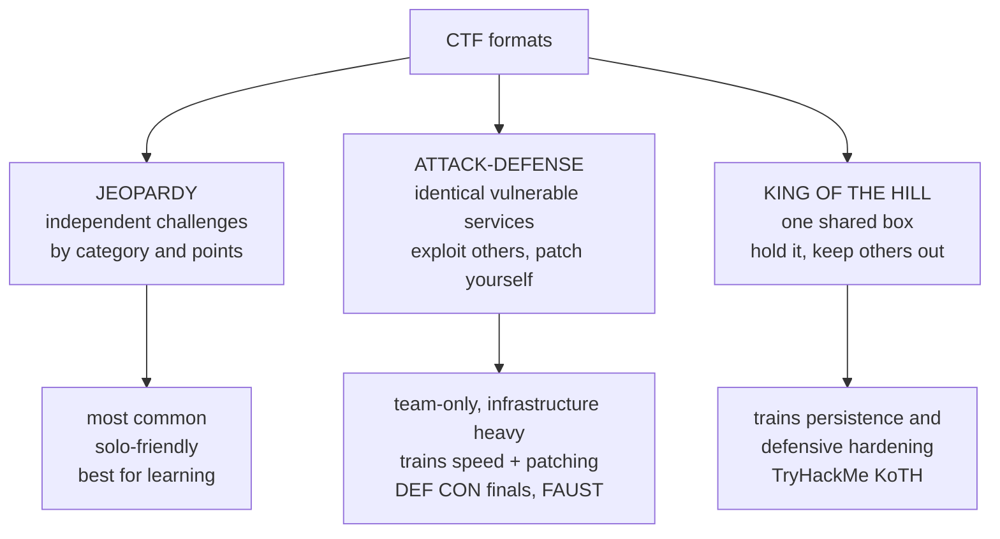
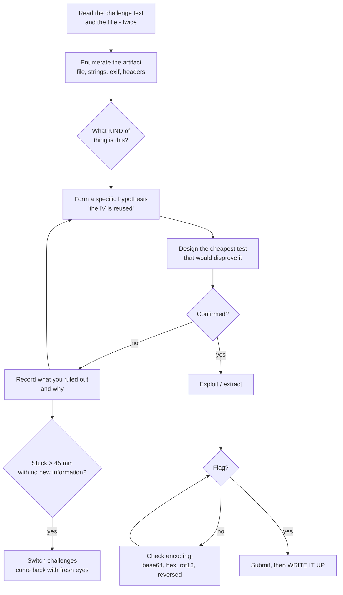
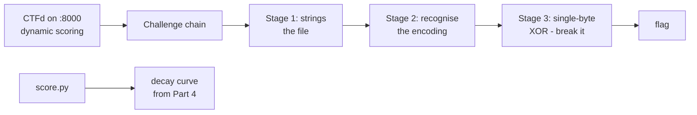

Everything in the previous forty-two notebooks has been organised the way knowledge is organised: by domain, in a sequence that builds. That is the right way to *learn* a subject and a poor way to *test* whether you can use it. Real security work does not announce which technique it needs. A target does not tell you it is vulnerable to SSTI; it gives you a text box and silence.

Capture the flag competitions close that gap. A CTF hands you an artifact — a web app, a binary, a packet capture, a stripped ELF, a suspicious image — and a single objective: find the flag. Nothing tells you the category, the technique, or whether the thing is even solvable in the direction you have chosen. That ambiguity is the entire pedagogical value. It forces the skill that no chapter can teach directly: **deciding what to try next when you do not know what is wrong.**

This chapter is the on-ramp. By the end you will know what the formats are and which one you are actually entering, how scoring works and what strategy each system rewards, which platform to start on given where you are today, a repeatable methodology for approaching a challenge you have no idea about, and — importantly — an honest account of where CTF skills diverge from professional skills, because that divergence catches people who assume a good CTF record translates directly into being good at the job.

The remaining seven chapters of this notebook go category by category — web, crypto, forensics, OSINT, reversing, pwn — and then assemble a workflow and a team strategy. This one makes sure you are pointed in the right direction before you spend six months running.

## Why This Matters

The case for CTFs is not that they are fun, though they are. It is that they are the closest thing security has to a **deliberate practice** loop, in the technical sense: a task at the edge of your ability, with immediate unambiguous feedback, repeated.

Consider how feedback works elsewhere. Read a chapter on SQL injection and you feel you understand it — a feeling that is almost entirely unreliable. Run a scanner against a deliberately vulnerable app and it tells you the answer before you have thought. Work a real engagement and the feedback loop is weeks long and confounded by scope, client politics, and whether the bug was there at all. In a CTF the loop is minutes to hours, the feedback is binary — the flag is right or it is not — and there is no partial credit for having understood the concept.

The professional consequences are concrete. Security hiring at a technical level frequently uses CTF-style assessment; a public CTFtime profile or a body of writeups is portfolio evidence that a certificate is not, because it demonstrates process rather than attendance. Every offensive discipline in this curriculum has a CTF category that trains its core motion — Notebook 36's binary exploitation is pwn, Notebook 35's malware analysis is reversing, Notebook 33's DFIR is forensics, Notebook 10's OSINT is an entire category. And the specific muscle CTFs build — sustained structured attack on an opaque artifact without giving up — is the one that separates people who find bugs from people who read about them.

The honest counterweight, developed properly in Part 12: CTFs optimise for *findable* bugs in *small* artifacts under *time pressure*, and real work is mostly none of those things. Knowing where the analogy breaks is part of using it well.

## Part 1: A Short History, and What a Flag Is

The format began at **DEF CON in 1996** as an attack-defense game: teams were given identical vulnerable servers, and scored by exploiting each other while patching themselves. DEF CON CTF remains the most prestigious event in the calendar, and qualifying for its finals is a genuine career marker.

The jeopardy format — independent challenges in categories, worth points — came later and now dominates by volume, because it scales to thousands of remote participants and needs no per-team infrastructure. **PlaidCTF, Google CTF, HITCON, PicoCTF** and hundreds of others run this way. The circuit is large enough that **CTFtime.org** exists purely to index events, rank teams, and archive writeups.

A **flag** is a string proving you solved the challenge. It is deliberately unguessable and follows a per-event format:

```
picoCTF{th1s_i5_th3_fl4g}
flag{c0rrect_h0rse_battery_staple}
CTF{s0me_r4nd0m_str1ng}
HTB{y0u_g0t_1t}
```

Three consequences of that format that matter operationally:

**The format is a search pattern.** Knowing the event uses `flag{...}` means `grep -r 'flag{' .` and `strings binary | grep flag{` are always worth thirty seconds. A surprising number of easy challenges fall to exactly this.

**Flags are often the *only* output.** There is no partial credit and no explanation. You either produce the string or you do not, which is unforgiving and is precisely what makes the feedback trustworthy.

**Flag format is a hint about encoding.** If you have recovered a blob that decodes to something starting `cGljb0NURns` you are looking at base64 of `picoCTF{`. Recognising the encoded prefix of your event's flag format on sight is a genuinely useful reflex — `flag{` in base64 begins `ZmxhZ3s`, and in hex it is `666c61677b`.

## Part 2: The Three Formats



**Jeopardy** is a board of challenges grouped by category, each worth points. Solve independently, in any order, and the highest score at the deadline wins. This is where you should start and where most of your practice will happen: challenges are self-contained, you can work alone, and there is no infrastructure to run.

**Attack-defense** gives every team an identical set of vulnerable services on their own host. You gain points by stealing flags from other teams' services and by keeping your own services *both* patched and *running* — the second half is the trap, because a service you break while patching stops scoring you availability points, and teams routinely lose more to their own patches than to opponents. Rounds ("ticks") run every few minutes, with flags rotated each tick. This format is enormously demanding: you need exploit development speed, patching discipline, traffic analysis to steal opponents' exploits off the wire, and automation to replay your exploits against every opponent every tick. It is a team sport and a poor place to begin.

**King of the Hill** puts everyone on one shared machine. Gain root, plant your flag file, then keep everyone else out while they try the same. It trains an unusual combination — fast exploitation followed by immediate hardening — and it is the only common format that makes you *defend* something you just broke into, which is a genuinely educational reversal.

A fourth, increasingly common shape is worth naming: the **hack-the-box style boot2root**, which is not timed against other players. You get a machine, you get user, you get root, you submit two hashes. HackTheBox, TryHackMe and Proving Grounds run this way, and it is much closer to a real penetration test than a jeopardy challenge is — which makes it the better preparation for OSCP-style exams (Notebook 44, Chapter 2).

## Part 3: The Categories, and What Each Actually Trains

| Category | You are given | Core skill | Notebook |
|---|---|---|---|
| **Web** | A URL | Finding logic and injection flaws in an opaque app | 13, 21–27 |
| **Crypto** | Ciphertext + often source | Recognising a broken construction, not breaking AES | 7 |
| **Forensics** | pcap, disk image, memory dump, file | Extracting signal from a large artifact | 33 |
| **Reversing (rev)** | A compiled binary | Reading machine behaviour without source | 35 |
| **Pwn / binexp** | A binary + a network port | Turning memory corruption into control flow | 36 |
| **OSINT** | A name, image, or handle | Pivoting across public sources | 10 |
| **Stego** | An image, audio, or video file | Finding data hidden in a container | 33 (ch 4 here) |
| **Misc** | Anything | Improvisation | — |
| **PPC / programming** | An algorithmic problem | Writing correct code under time pressure | 5 |
| **Hardware / RF** | Firmware, signal capture, JTAG | Embedded and radio analysis | 38 |
| **Cloud** | Cloud credentials or an account | Cloud-native privilege escalation | 37 |
| **Blockchain** | A smart contract | Contract logic flaws, reentrancy | — |

Two observations that shape how you should allocate time.

**Crypto challenges almost never involve breaking a primitive.** You will not break AES. You will find that AES was used in ECB mode, or that the IV was reused, or that the nonce is a counter starting at zero, or that RSA used e=3 with no padding, or that two moduli share a prime. Crypto CTF is **construction review**, and Chapter 3 of this notebook is organised around exactly that list of recognisable mistakes.

**Web challenges skew toward logic and chaining**, not toward the injection payload itself. A typical modern web challenge is: find an information disclosure, use it to reach an admin route, find a deserialisation sink, chain to RCE. The individual steps are ones you have already studied in Notebooks 21–27; the CTF skill is the *chaining* and the recognition.

If you are starting cold, the fastest categories to become useful in are **web** and **forensics**, because both reward broad tool familiarity and systematic enumeration more than deep specialist knowledge. **Pwn** and **rev** have the steepest curves and the highest ceilings.

## Part 4: Scoring Systems and the Strategy Each Rewards

Scoring is not an administrative detail; it should change what you do first.

**Static scoring.** A challenge is worth a fixed number of points forever. Simple, and it rewards raw volume — solve everything you can, order barely matters.

**Dynamic (decay) scoring.** The dominant modern system. A challenge starts at a maximum value and its value *decreases as more teams solve it*, down to a floor. Everyone who solved it — including earlier solvers — is repriced to the current value. A typical curve:

| Solves | Value |
|---|---|
| 1 | 500 |
| 5 | 470 |
| 20 | 320 |
| 50 | 180 |
| 200 | 100 (floor) |

The strategic consequences are significant and most beginners miss them:

- **The easy challenges everyone solves are nearly worthless.** A challenge with 400 solves is at the floor. Clearing the whole beginner tier feels productive and moves you very little.
- **Your score is determined by the hardest thing you solve**, not by how many things you solve. Two teams with the same solve count can be hundreds of points apart.
- **Your score drops while you sleep** as other teams solve your challenges. This is disorienting the first time you see it, and it is not a bug.
- Therefore: **once you have swept the trivial tier, go up in difficulty rather than sideways.** An unsolved 480-point challenge is worth more than five 100-point ones.

**First blood.** Many events award a bonus — extra points, or just a public announcement — to the first team to solve a challenge. Where the bonus is points, it rewards being fast at the *opening*, which is why strong teams triage the entire board in the first fifteen minutes rather than starting at challenge one.

**CTFtime rating.** Team points from an event are a function of your placement, the number of teams, and the event's **weight** (0 to 100, reflecting difficulty and reputation as judged by CTFtime). Winning a weight-25 beginner event is worth far less than placing tenth at a weight-90 event. Annual team rankings sum the best results across the year. For an individual, the useful takeaway is that **the events you play matter as much as how you place** — and that a personal CTFtime profile with a real history is a portfolio artifact.

## Part 5: The Platforms — Where to Actually Start

| Platform | Format | Level | Cost | Best for |
|---|---|---|---|---|
| **picoCTF** | Jeopardy, permanent | Beginner | Free | Your first hundred challenges — start here |
| **OverTheWire** | SSH wargames | Beginner→Adv | Free | Bandit for Linux fluency; Narnia/Behemoth for pwn |
| **TryHackMe** | Guided rooms + boxes | Beginner | Freemium | Structured learning paths, hand-holding |
| **HackTheBox** | Boot2root + challenges | Int→Adv | Freemium | Realistic machines; closest to OSCP |
| **CryptoHax / CryptoHack** | Crypto only | Beginner→Adv | Free | The best crypto training that exists |
| **pwn.college** | Pwn/rev curriculum | Beginner→Adv | Free | ASU's course, exceptional for binexp |
| **Root-Me** | Jeopardy, permanent | All | Freemium | Enormous breadth, many languages |
| **PortSwigger Web Security Academy** | Web labs | Beginner→Adv | Free | The definitive free web training |
| **Proving Grounds** | Boot2root | Int→Adv | Paid | OSCP-adjacent practice |
| **CTFtime events** | Live jeopardy | All | Free | The real thing, every weekend |

The honest recommendation for someone starting from this curriculum:

1. **OverTheWire Bandit** first, entirely, even if you know Linux. It is 34 levels of pure shell fluency and it removes the friction that otherwise dominates every other category.
2. **picoCTF** next — work the archive, not just the live event. It is designed by educators, the difficulty curve is gentle and honest, and there are public writeups for everything when you get stuck.
3. **PortSwigger Web Security Academy** in parallel for web, and **CryptoHack** in parallel for crypto. Both are structured curricula that happen to be free and are better than most paid material.
4. **Live CTFs on CTFtime** from week one, regardless of skill. Play the beginner-weighted events, expect to solve two challenges, and read the writeups for everything you did not solve. This is the highest-value activity on the list and beginners consistently postpone it.
5. **pwn.college** when you reach binary exploitation, alongside Notebook 36.

## Part 6: How to Actually Solve a Challenge

The single biggest difference between a beginner and an intermediate player is not knowledge; it is **having a procedure for being stuck**. Beginners try the thing they know, and when it fails, they try it again harder. Here is a procedure.



The parts that do the work:

**Read the title and the description twice.** CTF authors hide hints there constantly — a pun on an algorithm name, a version number, a literary reference that names the technique. "Nothing up my sleeve" is about constants. "Mixed signals" is probably about an IV or a nonce.

**Enumerate before theorising.** For any file: `file`, `strings`, `exiftool`, `binwalk`, `xxd | head`. For any URL: view source, check `robots.txt`, look at the response headers, look at what the JavaScript fetches. This takes two minutes and frequently ends the challenge.

**Form a falsifiable hypothesis and test it cheaply.** "It is vulnerable to SQLi" is not a hypothesis; "the `id` parameter is concatenated into a query, so `id=1'` will produce a different response than `id=1`" is. Design the test that would *disprove* it, because a test that can only confirm tells you nothing.

**Keep a ruled-out list.** Write down what you eliminated and why. Without it you will re-test the same idea three times at hour four, and — more importantly — the list is what you scan when you are stuck, and it is what your writeup is made of.

**Time-box.** Forty-five minutes with no new information means switch. This is not giving up; it is how you avoid sinking six hours into a challenge whose category you misidentified in minute two. Fresh eyes solve things that persistence does not, and in a team format the right move is to hand it to someone else.

**When you have "the answer" but no flag, suspect encoding.** Base64, hex, ROT13, reversed, XOR with a single byte, zlib. Check whether your output starts with a recognisable encoded prefix of the event's flag format.

## Part 7: Rules, Ethics, and How to Get Disqualified

Every event has rules. These are near-universal, and violating them gets teams banned from the circuit, not merely from one event.

**Do not attack the infrastructure.** The scoreboard, the challenge-hosting platform, and the organisers' servers are out of scope unless the event explicitly says otherwise. This is the most common serious violation and the fastest route to a permanent ban.

**Do not attack other players** (except in attack-defense, and only their designated services).

**Do not share flags.** This is the cardinal sin. It includes posting them in public Discords, and it includes "just confirming" a flag with a friend on another team. Many platforms watermark flags per team specifically to detect it.

**Do not brute-force unless invited.** Hammering a login or a flag submission endpoint degrades the event for everyone and is usually explicitly forbidden. If a challenge needs brute force, it will be scoped so that it is feasible.

**Do not publish writeups before the event ends.** Standard practice is to wait for the organisers' go-ahead; many events ask you to hold until scoring closes.

**Sandbox escape is out of scope.** If a challenge gives you code execution in a container, escaping that container to reach the host is attacking infrastructure, not solving the challenge — unless escaping *is* the challenge, which the description will say.

And the broader point, which connects to Notebook 8: **the CTF is a licensed environment, and that licence does not extend past its edges.** The techniques in this notebook are the same techniques that are felony computer misuse when applied to a system you have no authorisation for. The scope boundary is what makes the practice lawful, and treating the boundary as flexible in a CTF is exactly the habit that ends careers later. Read the rules page. Every event.

## Part 8: Where CTF Skills Diverge From Real Work

This section exists because the alternative — discovering it during your first engagement — is expensive.

| CTF | Real engagement |
|---|---|
| A flag exists. The challenge is solvable. | No guarantee anything is exploitable |
| Artifact is small and curated | Millions of lines, decades of accretion |
| Time pressure rewards speed over rigour | Coverage and evidence matter more than speed |
| Noise is free — hammer everything | Detection matters; noise ends engagements |
| No consequences for crashing a service | Crashing production is a serious incident |
| Solved = done | The finding is worthless without a report |
| Scope is one artifact | Scope is negotiated, legal, and constraining |
| Exotic vulnerabilities | Patch management, default credentials, phishing |
| Solo or small team, no stakeholders | Clients, timelines, retests, and politics |

Three specific bad habits CTFs actively teach:

**Assuming solvability.** The single most valuable real-world skill CTFs cannot train is deciding that something is *not* vulnerable and moving on. In a CTF, persistence is always eventually correct. On an engagement it is how you spend four days on a hardened service and miss the unauthenticated file upload on the other host.

**Ignoring noise.** CTF practice is thousands of requests per second with no consequence. Notebook 30's red-team operations assume the opposite, and the transition is genuinely hard for people who learned offence through CTFs.

**Skipping the writeup.** A finding that is not communicated did not happen. Real value is delivered in a report, with reproduction steps, business impact, and remediation advice — a skill CTFs never exercise and that Notebook 9 covers properly.

None of this means CTFs are not worth doing; the raw technical ceiling they build is real and hard to get elsewhere. It means **CTF is one input, not the whole preparation** — pair it with boot2root machines (closer to a pentest), a home lab (Notebook 44 Chapter 3), and actual writing.

## Part 9: Writeups — The Highest-Value Habit

Writing up your solves is the highest return-on-time activity in this entire chapter, for three reasons that compound.

**It converts a solve into knowledge.** Reconstructing the reasoning forces you to notice where you got lucky and where you actually understood something. The gap between "I solved it" and "I can explain why that worked" is where most of the learning lives, and you only find that gap by writing.

**It is your portfolio.** A body of writeups is direct evidence of process, communication, and persistence — three things a hiring manager cannot infer from a certificate. It is the single most effective technical portfolio artifact available to someone without professional experience, and Notebook 44 Chapter 3 builds on this directly.

**It builds the reporting muscle CTFs otherwise skip.** A writeup is a miniature pentest report: here is the target, here is what I observed, here is the reasoning, here is the exploit, here is the impact.

A structure that works:

```
1. Challenge:  name, category, points, event
2. Given:      exactly what you received (file hashes, URL, source)
3. Recon:      what you observed, with the commands that produced it
4. The insight: the specific realisation that cracked it
5. Exploit:    working code, complete enough to reproduce
6. Flag
7. What I learned / what I would do differently
8. Dead ends:  what you ruled out and why  <- most valuable section, most often omitted
```

Section 8 is the one that separates a useful writeup from a solution dump. Anyone can publish the working command. Publishing the four hypotheses you eliminated first is what actually teaches a reader — and it is what demonstrates that you have a method rather than a lucky guess.

**Write up the ones you did not solve, too.** After the event, read the official solution, understand it, and write your own account of where your reasoning diverged. That is where the largest single improvements come from, and almost nobody does it.

## Part 10: Building Your Environment

You need a Linux environment with the standard toolchain. A VM (Kali or a Debian/Ubuntu base with tools added) is the normal answer; a container works for most non-pwn categories; WSL2 is workable but occasionally awkward for anything involving raw sockets or ptrace.

The core set, by category:

```
general      : file, strings, xxd, binwalk, exiftool, foremost, python3, jq, curl
web          : Burp Suite Community, ffuf/gobuster, sqlmap, jwt_tool, browser devtools
crypto       : python3 + pycryptodome, sympy, gmpy2, sage (heavy but worth it),
               RsaCtfTool, CyberChef (local copy)
forensics    : Wireshark/tshark, Volatility 3, Autopsy, testdisk, steghide, zsteg,
               stegsolve, sonic-visualiser
rev          : Ghidra, IDA Free, radare2/rizin, gdb + pwndbg or GEF, ltrace/strace
pwn          : pwntools, gdb + pwndbg, ROPgadget, one_gadget, checksec, patchelf
misc         : CyberChef, dcode.fr, factordb, cyberchef recipes, quipqiup
```

Two pieces of advice that save real time. **Install pwntools and CyberChef on day one** even before you need them — they are the two tools that come up in every category, and CyberChef in particular solves the "what encoding is this" problem that eats an hour a week for beginners. And **keep a scratch directory per challenge** with the artifact, your notes, and your scripts; you will want to come back to it when you write it up, and reconstructing what you ran three days later from shell history is miserable.

## Part 11: A Realistic Twelve-Week Plan

Assume 8–10 hours a week. This plan is deliberately unbalanced toward fundamentals early, because the most common failure mode is scattering across categories and becoming useless in all of them.

| Weeks | Focus | Concrete target |
|---|---|---|
| 1–2 | Shell fluency | OverTheWire **Bandit**, all 34 levels. No skipping. |
| 3–4 | Broad exposure | picoCTF archive: solve every challenge under 150 points across all categories |
| 5–6 | Web depth | PortSwigger Academy: SQLi, XSS, auth, access control, SSRF modules |
| 7–8 | Crypto depth | CryptoHack: Introduction, General, Mathematics, RSA sections |
| 9–10 | Forensics + rev | picoCTF forensics/rev mid-tier; OverTheWire **Narnia** levels 0–5 |
| 11 | First live event | Pick a low-weight CTFtime event. Solve what you can. Read every writeup after. |
| 12 | Consolidate | Write up 5 solves and 2 unsolved-then-understood challenges. Publish them. |

Three rules for the whole twelve weeks:

**Play every live event you can, from week one.** You will solve almost nothing in week one and that is fine — the value is in seeing what real challenges look like and then reading the writeups.

**Read writeups for challenges you did not solve, every single time.** This is the highest-leverage habit in the plan and the one people skip because it feels like cheating. It is not cheating; it is how you learn what you did not know existed.

**Do not go deep on pwn before week nine.** Binary exploitation has the steepest curve of any category and it is the most common place beginners stall out permanently. Get comfortable being competent in three categories first.

## Part 12: Hands-On Lab — Run a CTF and Solve a Chain

### 12.1 What we are building

We stand up a real CTFd instance locally, load challenges with dynamic scoring, and then solve a multi-stage chain end to end — exercising the methodology from Part 6 and the encoding reflex from Part 1.



You need Docker and Python 3.

### 12.2 Stand up CTFd

```bash
mkdir -p ~/ctf-lab && cd ~/ctf-lab
docker run -d --name ctfd -p 8000:8000 ctfd/ctfd:3.7.0

# Wait for first boot (it initialises a SQLite DB on first run).
until curl -sf http://localhost:8000/setup > /dev/null; do sleep 3; done
echo "CTFd up at http://localhost:8000"

# Sample output:
# CTFd up at http://localhost:8000
```

Complete the setup wizard in a browser (event name, admin user). Then confirm the API answers:

```bash
curl -s http://localhost:8000/api/v1/challenges | head -c 120; echo

# Sample output:
# {"success":false,"data":{"message":"You must be logged in..."}}
```

That authentication requirement is itself worth noting: CTFd gates the challenge list, which is why scoreboard scraping during a live event is usually against the rules.

### 12.3 Build the challenge chain

```bash
mkdir -p ~/ctf-lab/chal && cd ~/ctf-lab/chal
python3 - <<'PY'
import base64

FLAG = "flag{x0r_1s_n0t_encrypt10n}"

# Stage 3: single-byte XOR - the classic "looks encrypted, is not" mistake.
KEY = 0x5A
xored = bytes(b ^ KEY for b in FLAG.encode())

# Stage 2: base64 the XOR output.
b64 = base64.b64encode(xored).decode()

# Stage 1: bury it in a binary-ish blob with decoy strings.
blob = (b"\x7fELF" + b"\x00" * 48
        + b"config_version=3.1\x00"
        + b"admin_password=hunter2\x00"                 # decoy
        + b"NOTE: payload is obfuscated, not encrypted\x00"   # the hint
        + b"payload=" + b64.encode() + b"\x00"
        + b"\x00" * 32)
open("artifact.bin", "wb").write(blob)
print(f"artifact.bin written ({len(blob)} bytes)")
PY

# Sample output:
# artifact.bin written (185 bytes)
```

### 12.4 Solve it with the Part 6 methodology

**Step 1 — enumerate before theorising.**

```bash
file artifact.bin

# Sample output:
# artifact.bin: ELF, unknown class 0
```

```bash
strings -n 8 artifact.bin

# Sample output:
# config_version=3.1
# admin_password=hunter2
# NOTE: payload is obfuscated, not encrypted
# payload=GjY2Nj04amsoNjt4NTV4Mzc9Nj15aTd4Mzo=
```

Two minutes of enumeration and the challenge is largely over. Note the decoy — `admin_password=hunter2` is bait, and the *note* is the actual hint, telling you the transform is reversible.

**Step 2 — recognise the encoding.** Trailing `=`, alphabet is `A–Za–z0–9+/`: base64.

```bash
echo 'GjY2Nj04amsoNjt4NTV4Mzc9Nj15aTd4Mzo=' | base64 -d | xxd | head -3

# Sample output:
# 00000000: 1a36 3636 3d38 6a6b 2836 3b78 3535 7833  .666=8jk(6;x55x3
# 00000010: 373d 363d 7969 3778 333a                 7=6=yi7x3:
```

Not printable text, so there is another layer. **Step 3 — form a hypothesis.** The note said "obfuscated, not encrypted," the output is the same length as the input, and byte-for-byte length preservation with no structure is the signature of XOR. The hypothesis: **single-byte XOR**.

**Design the cheapest test.** We know the plaintext starts with `flag{` (Part 1: the flag format is a crib). If it is single-byte XOR, then `first_ciphertext_byte ^ 'f'` gives the key, and that key must work for every subsequent byte.

```python
# solve.py -- known-plaintext recovery of a single-byte XOR key.
import base64

ct = base64.b64decode("GjY2Nj04amsoNjt4NTV4Mzc9Nj15aTd4Mzo=")

# The crib: we know the event's flag format.
key = ct[0] ^ ord('f')
print(f"[*] candidate key from crib: 0x{key:02x}")

pt = bytes(b ^ key for b in ct)
print(f"[*] plaintext: {pt.decode(errors='replace')}")

# Verify rather than assume -- the test that could disprove the hypothesis.
assert pt.startswith(b"flag{") and pt.endswith(b"}"), "hypothesis failed"
print("[+] structure confirmed: single-byte XOR")
```

```bash
python3 solve.py

# Sample output:
# [*] candidate key from crib: 0x5a
# [*] plaintext: flag{x0r_1s_n0t_encrypt10n}
# [+] structure confirmed: single-byte XOR
```

Had we not known the flag format, the same key falls out of brute force over all 256 possibilities, scored by printability — which is the general technique when no crib is available:

```python
# nocrib.py -- when you have no known plaintext, score all 256 keys.
import base64, string
ct = base64.b64decode("GjY2Nj04amsoNjt4NTV4Mzc9Nj15aTd4Mzo=")
printable = set(string.printable.encode())

scored = []
for k in range(256):
    pt = bytes(b ^ k for b in ct)
    score = sum(1 for b in pt if b in printable) / len(pt)
    scored.append((score, k, pt))

for score, k, pt in sorted(scored, reverse=True)[:3]:
    print(f"key=0x{k:02x} score={score:.2f} {pt[:40]!r}")
```

```bash
python3 nocrib.py

# Sample output:
# key=0x5a score=1.00 b'flag{x0r_1s_n0t_encrypt10n}'
# key=0x1a score=0.63 b'@vvv}xz+v{8uu8ww}v}98w8z'
# key=0x7a score=0.59 b' VVV]XZ\x0bV[\x18UU\x18WW]V]\x19\x18W\x18Z'
```

One key scores 1.00 and the rest are noise — a clean separation, and the reason frequency or printability scoring works so reliably on single-byte XOR.

### 12.5 Watch dynamic scoring behave

```python
# score.py -- the CTFd dynamic scoring curve from Part 4.
def value(initial, minimum, decay, solves):
    """CTFd's logarithmic-ish decay: value falls as solves rise, floored."""
    if solves <= 1:
        return initial
    v = ((minimum - initial) / (decay ** 2)) * ((solves - 1) ** 2) + initial
    return int(max(minimum, v))

INITIAL, MINIMUM, DECAY = 500, 100, 60
print(f"{'SOLVES':>7} {'VALUE':>7}   your standing if you solved it")
print("-" * 52)
for s in (1, 2, 5, 10, 20, 40, 60, 100, 200):
    v = value(INITIAL, MINIMUM, DECAY, s)
    bar = "#" * (v // 20)
    print(f"{s:>7} {v:>7}   {bar}")
```

```bash
python3 score.py

# Sample output:
#  SOLVES   VALUE   your standing if you solved it
# ----------------------------------------------------
#       1     500   #########################
#       2     499   ########################
#       5     495   ########################
#      10     477   #######################
#      20     459   ######################
#      40     327   ################
#      60     100   #####
#     100     100   #####
#     200     100   #####
```

This is Part 4's argument made concrete. A challenge with 60+ solves is at the floor and worth one fifth of a first blood. **Your score is set by the hardest thing you solve, not the number of things you solve** — and the curve is why.

### 12.6 Extending the lab

Load the artifact into CTFd as a dynamic-scoring challenge and confirm the value drops as you register additional test users and solve it; add a stage using a repeating-key XOR so the single-byte technique fails and you have to determine key length first (Chapter 3 covers this); replace base64 with base32 or a custom alphabet and watch how much harder recognition becomes; and write a proper writeup of this chain using the Part 9 structure, including the dead end of chasing `admin_password=hunter2`.

## Part 13: Common Pitfalls

**Grinding the beginner tier forever.** It feels productive, the challenges are at the score floor, and you stop improving. Once easy challenges are easy, go up.

**Skipping the writeup.** The solve is half the value. The reconstruction is the other half, and it is the half that becomes a portfolio.

**Not playing live events until you "feel ready."** You will never feel ready. Play in week one, solve two things, read the writeups. This is the fastest available learning loop and postponing it is the most common self-inflicted delay.

**Refusing to look at solutions.** Six hours stuck with no new information teaches you nothing. Read the writeup, understand it, then write your own account of where your reasoning diverged.

**Specialising too early.** Being useful in one category makes you a liability on a team and blind on a real target. Get to competent in three before going deep in one.

**Ignoring the challenge description.** Titles and flavour text carry hints constantly. Read them twice.

**Assuming crypto means breaking crypto.** It means finding the implementation mistake. Look for ECB, reused IVs, small e, shared factors, and nonce reuse before you look at anything else.

**Attacking the infrastructure.** The scoreboard is not a challenge. This is the fastest way to a circuit-wide ban.

**Sharing flags.** Cardinal sin, frequently watermarked, ends teams.

**Treating a CTF record as job-ready.** It is one input. Pair it with boot2root machines, a home lab, and written reports.

**No notes during the event.** You will not reconstruct your reasoning afterwards from shell history, and the writeup will suffer for it.

## Final Revision / Summary

- A **CTF** gives you an artifact and a flag to find, with no indication of technique. That ambiguity is the point: it trains **deciding what to try next when you do not know what is wrong** — the one skill a chapter cannot teach directly.
- CTFs are security's best available **deliberate practice** loop: edge-of-ability tasks, immediate binary feedback, repeated. Real work's feedback loop is weeks long and confounded.
- A **flag** is an unguessable string in a per-event format. The format is a grep pattern, a crib for known-plaintext attacks, and a hint about encoding — learn to recognise `flag{` in base64 (`ZmxhZ3s`) and hex (`666c61677b`).
- Three formats: **jeopardy** (independent challenges — start here), **attack-defense** (identical services, exploit others while patching yourself; availability points make self-inflicted outages the main risk), and **king of the hill** (hold one shared box). **Boot2root** machines are a fourth shape and are closest to a real pentest.
- Categories map onto this curriculum. **Crypto CTF is construction review, not primitive breaking** — ECB, reused IV, small e, shared factors, nonce reuse. **Web CTF is chaining**, not single payloads. Fastest categories to become useful in are **web and forensics**; steepest are **pwn and rev**.
- **Dynamic (decay) scoring** dominates: value falls as solves rise and everyone is repriced. Therefore your score is set by **the hardest thing you solve**, easy challenges are near-worthless, your score drops overnight, and after sweeping the trivial tier you go **up** rather than sideways. **First blood** rewards fast board triage.
- **CTFtime** weights events 0–100; where you play matters as much as how you place, and your profile is portfolio evidence.
- Start with **OverTheWire Bandit** (all 34), then the **picoCTF archive**, with **PortSwigger Academy** and **CryptoHack** in parallel, and **live events from week one**.
- The methodology for being stuck: read the title twice → enumerate before theorising (`file`, `strings`, `exiftool`, `binwalk`, `xxd`) → form a **falsifiable** hypothesis → design the cheapest **disproving** test → keep a ruled-out list → **time-box at 45 minutes** → when you have the answer but no flag, suspect encoding.
- **Rules**: never attack infrastructure, never share flags, no unsanctioned brute force, hold writeups until the event ends, sandbox escape is out of scope. The scope boundary is what makes the practice lawful.
- **CTF ≠ the job.** CTFs guarantee solvability, reward noise, ignore reporting, and feature exotic bugs; engagements offer none of that. The bad habits are **assuming solvability**, **ignoring detection**, and **skipping the report**.
- **Writeups are the highest-value habit**: they convert a solve into knowledge, form your portfolio, and build the reporting muscle. Include the **dead ends** — that section is what proves method over luck. Write up the ones you *failed*, too.
- Twelve-week plan: shell fluency → broad exposure → web depth → crypto depth → forensics/rev → first live event → publish writeups. Do not go deep on pwn before week nine.

## Cheat Sheet / Quick Reference

**Format picker**

| Format | Team needed? | Start here? |
|---|---|---|
| Jeopardy | No | **Yes** |
| Boot2root (HTB/THM) | No | Yes, for pentest realism |
| King of the Hill | No | Later |
| Attack-defense | Yes | Much later |

**Flag format recognition**

```
flag{...}  base64 prefix -> ZmxhZ3s      hex -> 666c61677b
picoCTF{   base64 prefix -> cGljb0NURns
always try: grep -r 'flag{' .   |   strings file | grep -i flag
```

**First five minutes on any file**

```bash
file X && strings -n 8 X | head -50 && exiftool X && binwalk X && xxd X | head
```

**First five minutes on any URL**

```
view-source | robots.txt | /.git/ | response headers | JS network calls
ffuf -w wordlist -u http://target/FUZZ
```

**Stuck procedure**

```
1. re-read title + description (hints live there)
2. what did I ASSUME that I never verified?
3. list what I ruled out, and why
4. 45 min with no new information -> switch challenges
5. have "the answer" but no flag? -> base64 / hex / rot13 / reversed / XOR
```

**Decay scoring strategy**

```
easy challenge, 200 solves  -> at the floor, near-worthless
your score = the HARDEST thing you solved
after sweeping the trivial tier -> go UP, not sideways
score drops overnight as others solve. this is normal.
```

**Writeup skeleton**

```
challenge | given | recon | THE INSIGHT | exploit | flag
what I learned | DEAD ENDS (the most valuable section)
```

**Rules that get you banned**

```
attacking scoreboard/infrastructure | sharing flags
unsanctioned brute force | publishing before the event ends
escaping the sandbox when escape is not the challenge
```

**Minimum toolkit**

```
pwntools | CyberChef (local) | Ghidra | gdb+pwndbg | Wireshark
Burp Community | ffuf | binwalk | exiftool | steghide | Volatility 3
```

## Practice Labs & Resources

**Start here, in this order**
- **OverTheWire Bandit** — all 34 levels, no skipping. Pure shell fluency.
- **picoCTF** — play the live event and work the permanent archive. Educator-designed, honest difficulty curve.
- **PortSwigger Web Security Academy** — free, structured, and better than most paid web training.
- **CryptoHack** — the best crypto practice available anywhere, free.
- **CTFtime.org** — event calendar, team rankings, and the writeup archive. Register a profile.

**Then**
- **pwn.college** — Arizona State's binary exploitation curriculum, exceptional and free.
- **HackTheBox** and **TryHackMe** — boot2root machines; closer to a real pentest than jeopardy.
- **Root-Me** — enormous breadth of permanent challenges.
- **Proving Grounds** — OSCP-adjacent practice machines.

**Hands-on**
- Extend the lab: add a repeating-key XOR stage, a custom base32 alphabet, and load everything into CTFd with dynamic scoring to watch the curve move.
- Register a CTFtime profile and play one low-weight event this month. Solve what you can; read every writeup afterwards.
- Solve five picoCTF challenges and write all five up using the Part 9 structure, dead ends included.
- Take one challenge you could **not** solve, read the official writeup, then write your own account of exactly where your reasoning diverged.

**Deliberate practice**
- Build the flag-format recognition reflex: encode your event's flag prefix in base64, base32, hex and ROT13, and memorise what each looks like.
- Time-box rigorously for one full event and note how many challenges you would have sunk hours into.
- Keep a running ruled-out list for a whole event and turn it into a single writeup at the end.

**Further reading**
- The CTF Field Guide (Trail of Bits) — dated in places, excellent on mindset.
- Published writeups from PlaidCTF, Google CTF and HITCON — read the top teams' accounts of challenges you attempted.
- LiveOverflow's video archive, particularly the binary exploitation series, for the reasoning-out-loud style this chapter's Part 6 is trying to instil.
