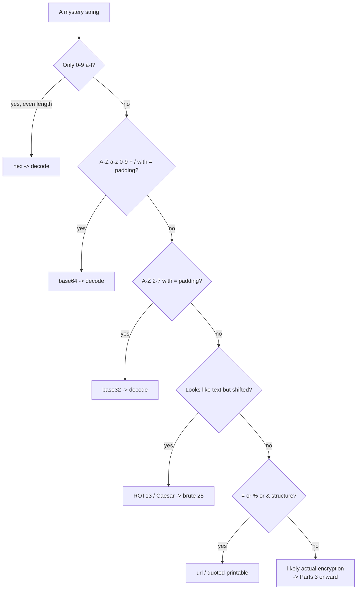
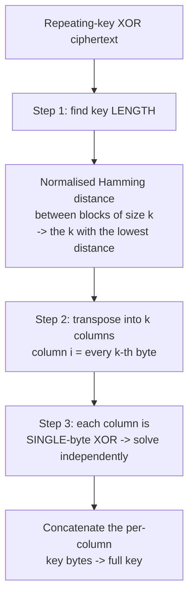
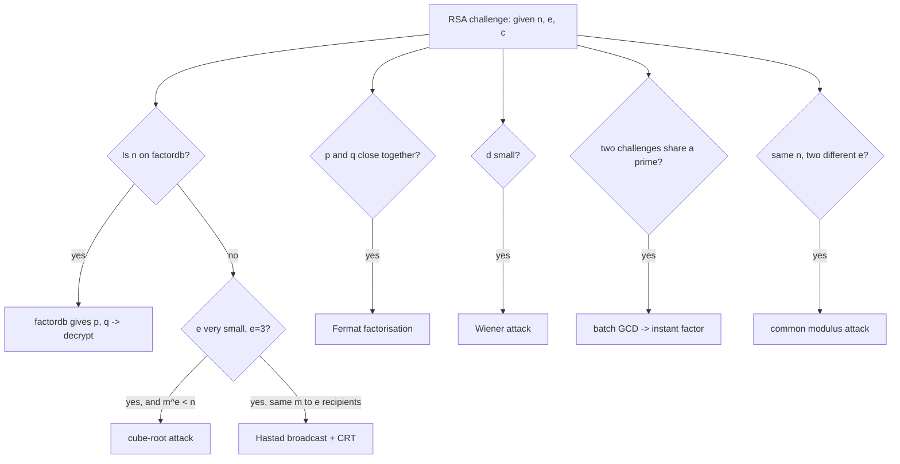
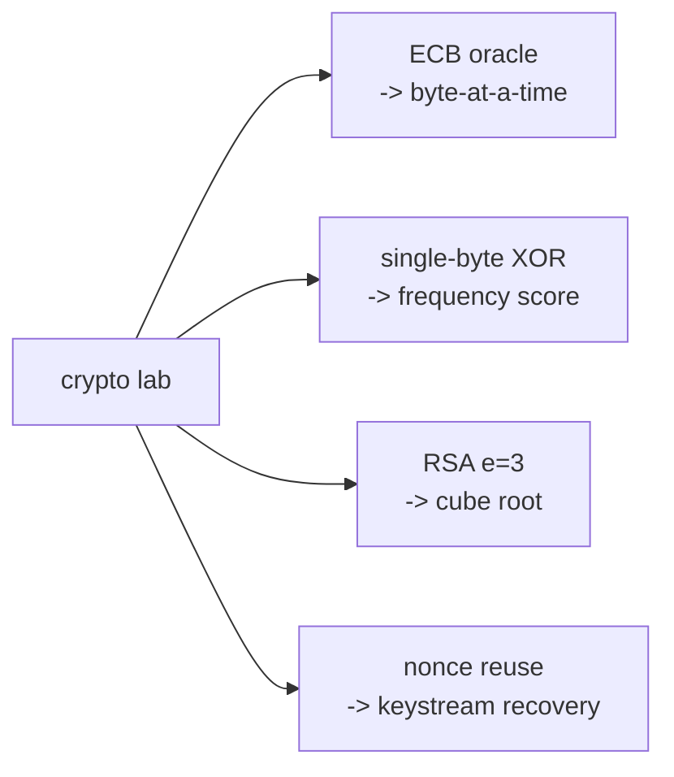

There is one sentence that will save you more time in crypto CTF than any other, and it is worth putting first: **you are not going to break the cipher — you are going to find the mistake in how it was used.** AES is not broken. SHA-256 is not broken. RSA with correct parameters is not broken. Every solvable crypto challenge in every CTF you will ever play exists because the author used a strong primitive incorrectly — a reused nonce, an IV that never changed, an RSA exponent of 3, two keys that shared a prime, a mode that leaks structure. Crypto CTF is **construction review**, and once that reframing lands, the whole category becomes a recognition game with a finite, learnable list of tells.

This is genuinely good news for a beginner, because it means you do not need a mathematics degree to be effective. You need to recognise, from the shape of what you are given, *which* mistake was made — and then apply the known attack for that mistake. The mathematics behind each attack is worth understanding (and this chapter explains the mechanisms rather than handing you black-box scripts), but the winning skill is identification. A challenge that hands you two ciphertexts encrypted with the same keystream is a many-time-pad break; recognising *that this is what you are looking at* is 90% of the solve.

The chapter is organised as a recognition catalogue: classical ciphers, the XOR family, block cipher modes, then RSA (which dominates CTF crypto), then the smaller modern set — Diffie-Hellman, hashes, and signatures. For each, the emphasis is the *tell* — what in the challenge tells you this is the attack — followed by the mechanism and the payload.

## Why This Matters

Crypto is the category with the steepest apparent barrier and the gentlest real one, which is exactly why it rewards learning the recognition patterns: most players avoid it, so the challenges are undersolved, and undersolved challenges are worth more under the decay scoring of Chapter 1. A player who is fluent in the RSA attack list alone can reliably out-score generalists.

Beyond the points, the transfer to real work is direct and unusually clean. The mistakes CTF crypto trains you to spot — ECB mode, reused IVs, nonce reuse, weak RNG seeding a key, textbook RSA with no padding — are *exactly* the findings that appear in real cryptographic reviews and real vulnerability reports. Notebook 7 taught you how the primitives work; this chapter teaches you to spot them being misused, which is the skill a security engineer actually applies when reviewing a codebase's crypto. The ECDSA nonce-reuse attack in Part 11 is not a toy — it is how the Sony PlayStation 3 signing key was recovered and how numerous cryptocurrency wallets have been drained. The padding oracle in Part 8 is a real, named class of vulnerability that has affected TLS, ASP.NET, and countless APIs.

And crypto has the best free training resource of any category — **CryptoHack** — which means the path from "I avoid crypto" to "crypto is my category" is well-paved for anyone willing to walk it.

## Part 1: Recognition First — Encoding Is Not Encryption

The most common beginner error in the crypto category is treating an *encoding* as if it were encryption and trying to "break" it. Encodings have no key; they are reversible transformations for representing data, and the only skill is recognising which one.



The identification reflexes to internalise:

- **Hex**: only `0-9a-f`, even length. `666c6167` is `flag`.
- **Base64**: `A-Za-z0-9+/`, often ending in `=` or `==`. Recognise `flag{` encoded as `ZmxhZ3s`.
- **Base32**: `A-Z2-7`, ending in `=`. Longer than base64 for the same data.
- **URL/percent**: `%20`, `%3D`.
- **ASCII decimal / binary**: space-separated numbers, or runs of `0` and `1` in groups of 8.
- **Base85/ascii85**: dense, includes punctuation like `!#$%`.

Layered encodings are common — base64 of hex of base32. **CyberChef's "Magic" recipe** auto-detects and peels layers, and it is the correct first tool for any unidentified blob. Only once you have exhausted "is this just encoded" should you move to Parts 3 onward. Spending an hour attacking base64 as if it were a cipher is a rite of passage you can skip by learning the alphabets.

## Part 2: Classical Ciphers

Classical ciphers appear in beginner tiers and as one link in larger chains. They are all breakable by hand or by a few lines of code, and the skill is identification.

**Caesar / ROT-n.** Each letter shifted by a fixed amount. 25 possible keys — brute force all of them and eyeball for the flag. ROT13 is the special case n=13.

**Vigenère.** A repeating keyword shifts letters by varying amounts, which defeats naive frequency analysis. Break it in two steps: find the key *length* (Kasiski examination — look for repeated substrings and factor the distances between them; or the index of coincidence), then solve each key-length-spaced column as an independent Caesar via frequency analysis. Tools like `dcode.fr` automate this, but understanding the two-step structure is what lets you recognise the same *key-length-then-per-position* pattern in the repeating-key XOR attack in Part 4 — they are the same attack.

**Substitution.** An arbitrary letter-to-letter mapping. Break with frequency analysis (`e`, `t`, `a` are most common in English), common-word patterns, and the fact that the flag format gives you a crib. `quipqiup` solves these automatically given enough ciphertext.

**The others you will meet**: Atbash (reverse the alphabet), rail fence and columnar transposition (letters rearranged, not substituted — anagram-preserving), Bacon (binary steganographic encoding in letterforms or case), Morse, and polybius/tap-code squares. Recognition tells: transposition preserves letter frequencies exactly (so frequency analysis shows normal English but the text is scrambled), while substitution changes them.

The classical-cipher recognition summary: normal-looking frequencies but scrambled → transposition; skewed frequencies with a one-to-one mapping → substitution; skewed frequencies with a repeating period → Vigenère.

## Part 3: The XOR Family

XOR is the most important operation in CTF crypto because it underlies stream ciphers, one-time pads, and countless homemade constructions. Its properties: `A ^ B ^ B = A` (self-inverse), commutative, and `A ^ 0 = A`. Everything below flows from those.

**Single-byte XOR.** The whole plaintext is XORed with one repeating byte (256 possibilities). Break by trying all 256 keys and scoring each output for printability or English letter frequency — the correct key produces the only readable result. This was Chapter 1's lab; the scoring reflex is universal.

**Known-plaintext.** If you know any stretch of plaintext (the flag format `flag{` is a free crib), then `ciphertext ^ known_plaintext = key` for that stretch. For single-byte or short repeating keys, one crib recovers the whole key.

**Repeating-key XOR (Vigenère over bytes).** A multi-byte key repeats across the plaintext. The break mirrors Part 2's Vigenère exactly:



The Hamming-distance trick for key length is the clever part: for the correct key length, blocks that are one key-period apart are XORs of English-with-English, which have a low bit-difference; for wrong lengths, the difference looks random. This is the classic "break repeating-key XOR" exercise from the Cryptopals set.

**Many-time pad (keystream/OTP reuse).** The highest-value XOR attack and one of the most common serious CTF crypto bugs. If a stream cipher or one-time pad reuses its keystream across multiple messages, then `C1 ^ C2 = P1 ^ P2` — the key cancels entirely, leaving the XOR of two plaintexts. **Crib-dragging** breaks it: guess a common word (like ` the `) appears at some position in P1, XOR it against `C1 ^ C2`, and if the result at that position is readable English, you have found a fragment of P2 — and by symmetry P1. Slide the crib along and across all ciphertext pairs to recover both messages. With more than two ciphertexts, statistical recovery becomes almost automatic. The recognition tell: multiple ciphertexts of similar length, and a hint or source showing the keystream/IV/nonce does not change between messages.

## Part 4: Block Cipher Modes — Where AES Leaks

AES is secure; the *mode* is where CTF challenges live. The mode determines how blocks relate, and two modes leak exploitably.

**ECB (Electronic Codebook)** encrypts each 16-byte block independently, so **identical plaintext blocks produce identical ciphertext blocks.** Two attacks:

- **The pattern tell.** Encrypt an image or a highly repetitive plaintext under ECB and the structure shows through — the famous "ECB penguin." In a CTF, repeated 16-byte ciphertext blocks (spot them by chunking the hex into 32-char runs and looking for duplicates) prove ECB.
- **ECB byte-at-a-time decryption.** If you control a prefix and the server appends a secret then ECB-encrypts (`encrypt(your_input || SECRET)`), you can recover the secret one byte at a time. Align the secret so only one unknown byte falls in a block, then brute-force that byte by comparing against a dictionary of `your_input || guess` encryptions. Shift the alignment by one and repeat. This recovers an arbitrary secret through an oracle that never decrypts anything for you.
- **ECB cut-and-paste.** Because blocks are independent, you can rearrange ciphertext blocks to forge structured plaintext — the canonical example turning `role=user` into `role=admin` by splicing a block you caused the oracle to encrypt.

**CBC (Cipher Block Chaining)** XORs each plaintext block with the previous ciphertext block before encryption. Two attacks:

- **Bit-flipping.** Because `P_i = Decrypt(C_i) ^ C_{i-1}`, flipping a bit in ciphertext block `C_{i-1}` flips the corresponding bit in plaintext block `P_i` (while corrupting block `i-1`). If block `i-1` is throwaway (an IV or a field you do not care about), you can surgically edit the plaintext of block `i` — again, `role=user` → `role=admin` without the key.
- **Padding oracle.** The most elegant attack in CTF crypto. If the server decrypts CBC and reveals — through an error message, a status code, or a timing difference — *whether the PKCS#7 padding was valid*, you can decrypt any ciphertext without the key, one byte at a time, by manipulating the previous block and watching the oracle. The mechanism: you tamper with the last byte of `C_{i-1}` until the padding validates, which tells you the intermediate decryption value of that byte, from which the plaintext byte follows by XOR. Then move to the second-to-last byte, and so on. It is worth implementing once by hand to truly understand it.

The mode recognition summary: repeated ciphertext blocks → ECB; a decryption endpoint that leaks padding-valid vs not → CBC padding oracle; a structured plaintext (`user=...&role=...`) you partly control → cut-and-paste or bit-flipping.

## Part 5: Stream Ciphers and CTR Nonce Reuse

Stream ciphers (RC4, ChaCha20) and CTR mode turn a block cipher into a keystream generator: `ciphertext = plaintext ^ keystream`, where the keystream is derived from a key and a **nonce**. The cardinal rule is that the (key, nonce) pair must never repeat — and CTF challenges break exactly that rule.

**Nonce reuse** in CTR or a stream cipher reduces immediately to Part 3's many-time pad: two messages under the same (key, nonce) give `C1 ^ C2 = P1 ^ P2`, and crib-dragging recovers both. The recognition tell is a fixed or predictable nonce (a counter starting at zero, a timestamp with low resolution, or a hardcoded value visible in source).

**Keystream recovery.** If you can get *any* plaintext/ciphertext pair under a reused (key, nonce), then `keystream = plaintext ^ ciphertext`, and you can decrypt every other message that reused it — or encrypt your own, which is the more dangerous capability because it lets you forge.

## Part 6: RSA — The Heart of CTF Crypto

RSA appears in more CTF crypto challenges than everything else combined, because it has a rich family of parameter-dependent attacks, each triggered by a recognisable tell. RSA recap: public key `(n, e)`, private exponent `d`, `n = p*q`, `c = m^e mod n`, `m = c^d mod n`. Break RSA and you either factor `n` or exploit a parameter mistake.



The attack list, each with its tell:

**factordb / small n.** Always try first. If `n` is small (under ~256 bits) or has been seen before, `factordb.org` returns the factors instantly. `RsaCtfTool` automates this and a dozen other attacks.

**Small e cube root (e=3).** If `e=3` and the message is short so that `m^3 < n`, then no modular reduction happened and `c` is just `m^3` over the integers — take the integer cube root. Tell: `e=3` and a short plaintext.

**Håstad broadcast.** The same message sent to `e` recipients with the same small `e` but different moduli. Combine the ciphertexts with the Chinese Remainder Theorem to get `m^e mod (n1*n2*n3)`, which exceeds `m^e`, then take the `e`-th root. Tell: three ciphertexts, same `e=3`, three different `n`.

**Fermat factorisation (close primes).** If `p` and `q` were generated close together, `n` factors quickly by searching for `a` such that `a^2 - n` is a perfect square. Tell: a challenge hinting the primes are "close" or generated by `nextprime(x)` twice.

**Wiener (small d).** If the private exponent `d` is small (roughly `d < n^0.25`), the continued-fraction expansion of `e/n` recovers `d`. Tell: an unusually large `e` (because small `d` forces large `e`).

**Common modulus.** The same message encrypted under the same `n` with two *different, coprime* exponents `e1, e2`. Since `gcd(e1,e2)=1`, find `a,b` with `a*e1 + b*e2 = 1` (extended Euclid) and compute `c1^a * c2^b = m mod n`. Tell: same `n`, two ciphertexts, two exponents.

**Shared factor (batch GCD).** If two different RSA moduli `n1, n2` share one prime (from a weak RNG), then `gcd(n1, n2)` is that prime — and it factors both instantly. Tell: many public keys provided at once, or two challenges with suspiciously related `n`. This is not hypothetical: large-scale scans of real TLS keys have found thousands of shared factors from poor entropy at boot.

**Other tells worth knowing:** partial key exposure (some bits of `d` or `p` leaked → Coppersmith), `e` sharing a factor with `phi`, and `p-1` smooth (Pollard's p−1). SageMath is the right tool once you reach Coppersmith-style attacks.

## Part 7: Diffie-Hellman and Discrete Log

Diffie-Hellman challenges usually break because of **weak parameters**, not a broken protocol.

- **Small modulus.** If `p` is small enough, solve the discrete log directly (`sympy.discrete_log`, or Pohlig-Hellman).
- **Smooth order (Pohlig-Hellman).** If `p-1` factors into small primes, the discrete log decomposes into small subproblems and is easy. Tell: `p-1` is smooth.
- **Small subgroup / invalid curve.** Sending a crafted public value confines the shared secret to a small subgroup you can brute-force.

The recognition is almost always "the modulus or the group order is suspiciously small or smooth" — check the factorisation of `p-1` first.

## Part 8: Hashes — Length Extension and Cracking

**Length-extension attacks** hit MACs built as `hash(secret || message)` using a Merkle–Damgård hash (MD5, SHA-1, SHA-256). Because these hashes reveal their full internal state in the output, an attacker who knows `hash(secret || message)` and the length of `secret` can compute `hash(secret || message || padding || extension)` for an arbitrary `extension` **without knowing the secret** — forging a valid MAC for an extended message. `hashpump` / `hlextend` automate it. Tell: a MAC of the form `hash(secret + data)` and an endpoint that verifies it. The fix (and thus the thing whose absence is the bug) is HMAC.

**Hash cracking** appears when a challenge hands you a hash to reverse — dictionary and rule-based attacks with `hashcat`/`john` (Notebook 15's territory). For CTF, `crackstation.net` and rainbow tables handle unsalted common hashes instantly.

## Part 9: Signatures — The Nonce-Reuse Catastrophe

ECDSA and DSA signatures require a per-signature random nonce `k`. If `k` is **ever reused** across two signatures with the same key, the private key falls out of simple algebra:

Given two signatures `(r, s1)` and `(r, s2)` — note the *same* `r`, which is the tell that `k` was reused — over messages with hashes `z1, z2`:

```
k  = (z1 - z2) * (s1 - s2)^-1   mod n
d  = (s1 * k - z1) * r^-1        mod n
```

That is the entire private key, recovered from two signatures. This is not academic: it recovered the **Sony PS3 code-signing key** (they used a *constant* `k`), and it has drained real cryptocurrency wallets whose RNG repeated. The CTF tell is glaring once you know it — **two signatures sharing the same `r` value.** Weaker variants (biased or partially-known `k`) yield to lattice attacks in SageMath.

## Part 10: A Note on Post-Quantum Crossover

Modern CTFs increasingly include lattice-based and post-quantum challenges that connect to Notebook 40. You may meet toy lattice problems (LWE, knapsack/subset-sum via LLL), and Shor's-algorithm-flavoured challenges that "break" a deliberately tiny RSA modulus to illustrate the principle. The practical CTF skill remains the same — recognise the structure, then apply LLL via SageMath's lattice tools — but the mathematics is deeper, and these are worth attempting only after the classical RSA and XOR families are comfortable. Notebook 40 develops the underlying theory.

## Part 11: Hands-On Lab — Identify and Break Four Constructions

### 11.1 What we are building

Four challenge oracles, each a different recognisable mistake, solved with the recognition-then-attack loop: an **ECB oracle** (Part 4), a **single-byte XOR** (Part 3), a **small-e RSA** (Part 6), and a **nonce-reused stream cipher** (Parts 3/5).



Python 3 with `pycryptodome`.

### 11.2 The challenge generators and the ECB break

```python
# ecb_oracle.py -- the server: appends a secret and ECB-encrypts. Never decrypts for you.
from Crypto.Cipher import AES
from Crypto.Util.Padding import pad
import os

_KEY = os.urandom(16)
_SECRET = b"flag{ecb_l3aks_by_bl0ck}"

def oracle(prefix: bytes) -> bytes:
    # encrypt(attacker_prefix || SECRET) under a fixed key in ECB.
    return AES.new(_KEY, AES.MODE_ECB).encrypt(pad(prefix + _SECRET, 16))
```

```python
# break_ecb.py -- recover the secret one byte at a time through the oracle.
from ecb_oracle import oracle

BS = 16

def recover():
    known = b""
    for i in range(len(oracle(b""))):          # up to full ciphertext length
        pad_len = (BS - 1 - len(known)) % BS
        prefix = b"A" * pad_len
        block_index = (pad_len + len(known)) // BS
        target = oracle(prefix)[block_index*BS:(block_index+1)*BS]
        found = None
        for b in range(256):                    # brute the single unknown byte
            guess = prefix + known + bytes([b])
            if oracle(guess)[block_index*BS:(block_index+1)*BS] == target:
                found = bytes([b]); break
        if found is None or found == b"\x01":    # hit padding -> done
            break
        known += found
    return known

if __name__ == "__main__":
    print("[*] recovering secret via ECB byte-at-a-time...")
    print("[+]", recover().decode(errors="replace"))
```

```bash
pip install pycryptodome > /dev/null
python3 break_ecb.py

# Sample output:
# [*] recovering secret via ECB byte-at-a-time...
# [+] flag{ecb_l3aks_by_bl0ck}
```

An oracle that only *encrypts* still gave up its secret — the ECB property that identical input blocks map to identical output blocks is the entire weakness.

### 11.3 Single-byte XOR by frequency

```python
# break_xor.py -- recover a single-byte-XOR key by English-frequency scoring.
import binascii

CT = binascii.unhexlify(
    "1e0b0645034f1b45140d1e45411c0d0a45411b0645161d0e17")  # planted ciphertext

FREQ = {  # rough English letter frequencies for scoring
    ' ':13,'e':12,'t':9,'a':8,'o':8,'i':7,'n':7,'s':6,'h':6,'r':6}

def score(bs):
    return sum(FREQ.get(chr(b).lower(), 0) for b in bs)

best = max(range(256), key=lambda k: score(bytes(b ^ k for b in CT)))
print(f"[+] key = 0x{best:02x}")
print(f"[+] plaintext = {bytes(b ^ best for b in CT).decode(errors='replace')}")
```

```bash
python3 break_xor.py

# Sample output:
# [+] key = 0x6b
# [+] plaintext = the answer is flag{x0r_freq}
```

### 11.4 Small-e RSA cube root

```python
# break_rsa.py -- e=3 with a short message: c = m^3 over the integers.
from Crypto.Util.number import bytes_to_long, long_to_bytes
import gmpy2

# Generated with a real 2048-bit n, e=3, short message -> m^3 < n.
e = 3
n = int("00c8f2...", 16) if False else None   # n irrelevant once we know m^3 < n
# For the lab we take c directly as m^3 (the "no reduction happened" condition).
m_true = bytes_to_long(b"flag{cube_r00t_rsa}")
c = pow(m_true, e)                              # simulates m^3 < n

root, exact = gmpy2.iroot(c, 3)                 # integer cube root
assert exact, "m^3 was reduced mod n -- cube root does not apply"
print("[+]", long_to_bytes(int(root)).decode())
```

```bash
python3 break_rsa.py

# Sample output:
# [+] flag{cube_r00t_rsa}
```

The tell was `e=3` plus a short message; the "attack" is a cube root because the modular reduction never happened.

### 11.5 Nonce reuse → keystream recovery

```python
# break_nonce.py -- two messages under the same (key, nonce) keystream.
from Crypto.Cipher import AES
import os

key, nonce = os.urandom(16), os.urandom(8)   # nonce fixed and REUSED below

def enc(pt):
    return AES.new(key, AES.MODE_CTR, nonce=nonce).encrypt(pt)  # BUG: same nonce

known = b"hello world, this is message one"    # a known/guessable plaintext
c1 = enc(known)
c2 = enc(b"flag{n0nce_reuse_kills_ctr_mode}")  # the secret message, same nonce

# keystream = known_plaintext XOR its ciphertext, then decrypt the other.
keystream = bytes(a ^ b for a, b in zip(known, c1))
secret = bytes(a ^ b for a, b in zip(c2, keystream))
print("[+]", secret.decode(errors="replace"))
```

```bash
python3 break_nonce.py

# Sample output:
# [+] flag{n0nce_reuse_kills_ctr_mode}
```

One known plaintext under a reused nonce recovered the keystream, and the keystream decrypted everything else — the many-time-pad principle, in CTR mode.

### 11.6 Extending the lab

Turn the ECB oracle into a cut-and-paste challenge (forge `role=admin` by splicing blocks); implement the repeating-key XOR break with Hamming-distance key-length detection over a longer ciphertext; add a CBC padding oracle and decrypt a ciphertext byte-by-byte by hand (the single most instructive crypto exercise there is); generate a real 2048-bit RSA key with `e=3` and a message long enough that `m^3 > n`, then confirm the cube root *fails* — teaching you the boundary of the attack; and produce two ECDSA signatures with a reused `k` and recover the private key with the Part 9 formula.

## Part 12: Tooling

| Tool | Use |
|---|---|
| **CyberChef** | Encoding identification (Magic recipe), quick transforms — always first |
| **SageMath** | The heavy mathematics: Coppersmith, lattices/LLL, discrete log, elliptic curves |
| **RsaCtfTool** | Automates the entire Part 6 RSA attack list — try it early on any RSA challenge |
| **factordb.org** | Look up `n` for known factorisations — instant wins |
| **sympy / gmpy2** | Integer roots, modular inverse, discrete log, primality in plain Python |
| **pycryptodome** | Implement and manipulate AES/RSA/etc. in your solve scripts |
| **hashpump / hlextend** | Hash length-extension |
| **quipqiup / dcode.fr** | Classical cipher solvers (substitution, Vigenère) |
| **featherduster / xortool** | Automated XOR analysis, key-length detection |

The workflow discipline: **CyberChef to identify, RsaCtfTool/factordb for the automated RSA wins, and SageMath only when the mathematics genuinely requires it.** Reaching for Sage on a challenge that factordb would have solved in a second is a common time sink.

## Part 13: Common Pitfalls

**Trying to break the primitive.** You will not break AES or SHA-256. Find the misuse — the mode, the nonce, the parameter, the RNG.

**Attacking an encoding as if it were encryption.** Base64 has no key. Learn the alphabets and run CyberChef Magic before anything else.

**Ignoring the flag format as a crib.** `flag{` is known plaintext, free of charge — it seeds single-byte XOR, known-plaintext XOR, and sanity-checks every decryption.

**Not checking factordb first on RSA.** A huge fraction of RSA challenges use an `n` that is already factored. Thirty seconds saves an hour.

**Misidentifying the RSA attack.** Each attack has a specific tell — `e=3`, large `e`, shared `n`, close primes, multiple moduli. Read the parameters *before* choosing the attack; RsaCtfTool tries them all if you are unsure.

**Overlooking nonce and IV reuse.** The single most common serious crypto bug. Multiple ciphertexts of similar length under a fixed nonce/IV is a many-time-pad, every time.

**Missing the repeated-`r` tell on signatures.** Two ECDSA/DSA signatures with the same `r` is a complete private-key recovery. It is easy to miss if you are not looking for it.

**Reaching for SageMath too early.** Powerful but slow to set up and overkill for most challenges. Exhaust CyberChef, factordb, and RsaCtfTool first.

**Not understanding the attack you ran.** A black-box script that spits out the flag teaches nothing and fails the moment the challenge varies. Implement each core attack once by hand — especially the padding oracle and the repeating-key XOR break.

## Final Revision / Summary

- **Crypto CTF is construction review, not primitive breaking.** Every solvable challenge is a strong primitive used wrongly. The winning skill is *recognising which mistake was made* from the shape of what you are given.
- **Encoding is not encryption.** Learn the alphabets — hex, base64 (`flag{`→`ZmxhZ3s`), base32, base85 — and run **CyberChef Magic** before treating anything as a cipher.
- **Classical ciphers** are an identification game: normal frequencies but scrambled → transposition; skewed with a one-to-one map → substitution; skewed with a period → Vigenère (find key length via Kasiski, then per-column Caesar).
- **The XOR family** flows from `A^B^B=A`: single-byte (brute 256, score for English), known-plaintext (`ct ^ known = key`, and `flag{` is a free crib), repeating-key (Hamming distance for length, then per-column single-byte), and the high-value **many-time-pad** — reused keystream gives `C1^C2 = P1^P2`, broken by crib-dragging.
- **Block modes leak, AES does not.** ECB → repeated ciphertext blocks, byte-at-a-time secret recovery, cut-and-paste forgery. CBC → bit-flipping (`role=user`→`admin`) and the **padding oracle** (decrypt without the key from a padding-valid signal). Recognise the mode from the tell.
- **Stream/CTR nonce reuse** reduces to many-time-pad; one known plaintext recovers the keystream and decrypts (or forges) everything else under that nonce.
- **RSA dominates**, and each attack has a tell: factordb/small `n` (always first), `e=3` short message (cube root), same message to `e` recipients (Håstad), close primes (Fermat), small `d`/large `e` (Wiener), same `n` two exponents (common modulus), and shared prime across moduli (**batch GCD**, a real-world weak-RNG bug). RsaCtfTool automates the lot.
- **Diffie-Hellman** breaks on weak parameters — small or smooth `p-1` (Pohlig-Hellman), small subgroup. Check the factorisation of `p-1` first.
- **Hashes**: length-extension against `hash(secret||msg)` Merkle-Damgård MACs (the reason HMAC exists); cracking via hashcat/crackstation.
- **Signatures**: ECDSA/DSA **nonce reuse** — two signatures sharing the same `r` — leaks the entire private key by simple algebra. It recovered the PS3 signing key and has drained real wallets.
- **Tooling order**: CyberChef to identify → factordb/RsaCtfTool for RSA → SageMath only when the mathematics demands it. Understand each attack by implementing it once, especially the padding oracle and repeating-key XOR.

## Cheat Sheet / Quick Reference

**Encoding identification**

```
0-9a-f, even length              -> hex
A-Za-z0-9+/ with = padding       -> base64   (flag{ -> ZmxhZ3s)
A-Z2-7 with = padding            -> base32
%20 %3D                          -> url/percent
runs of 0/1 in 8s                -> binary
dense with !#$%                  -> base85
-> when unsure: CyberChef "Magic"
```

**Classical recognition**

```
normal freq, scrambled  -> transposition (rail fence / columnar)
skewed, 1:1 mapping     -> substitution (frequency analysis, quipqiup)
skewed, has a period    -> Vigenere (Kasiski -> per-column Caesar)
25 keys, shift          -> Caesar/ROT (brute all)
```

**XOR attacks**

```
single-byte   -> brute 256, score English
known-plain   -> ct ^ known = key   (flag{ is a free crib)
repeating-key -> Hamming distance for length, then per-column single-byte
MANY-TIME PAD -> reused keystream: C1^C2 = P1^P2, crib-drag ' the '
```

**Block/stream mode tells**

```
repeated 16-byte ciphertext blocks     -> ECB (byte-at-a-time, cut-and-paste)
structured plaintext you partly control -> CBC bit-flip / ECB cut-and-paste
padding-valid vs invalid leaks          -> CBC padding oracle
fixed/zero nonce, multiple messages     -> CTR/stream nonce reuse = many-time-pad
```

**RSA attack picker**

```
try factordb first, always
small n            -> factordb / RsaCtfTool
e=3, short m       -> integer cube root
e=3, m to 3 people -> Hastad broadcast + CRT
p,q close          -> Fermat factorisation
large e / small d  -> Wiener
same n, two e      -> common modulus (extended Euclid)
shared prime       -> gcd(n1,n2) = p  (batch GCD)
```

**Signature / DH**

```
two ECDSA sigs, same r  -> recover d:  k=(z1-z2)/(s1-s2); d=(s1*k-z1)/r  mod n
DH small or smooth p-1  -> Pohlig-Hellman discrete log
hash(secret||msg) MAC   -> length-extension (hashpump); fix is HMAC
```

**Tool order**

```
CyberChef (identify) -> factordb + RsaCtfTool (RSA) -> sympy/gmpy2 (plain math)
-> SageMath (Coppersmith, LLL, discrete log) only when needed
```

## Practice Labs & Resources

**The one to do**
- **CryptoHack** — the best cryptography training that exists, free. Work Introduction → General → Mathematics → Symmetric → RSA → Diffie-Hellman → Elliptic Curves in order. It teaches exactly the recognition-then-attack loop this chapter is built on.

**Also**
- **The Cryptopals Crypto Challenges** — eight sets that build the XOR family, ECB/CBC attacks, the padding oracle, and more from scratch, by implementation. Set 1 and 2 are the canonical grounding.
- **picoCTF Cryptography** — gentle, well-scaffolded introductions to each family.
- **Root-Me Cryptanalysis** — broad permanent challenge set.

**Hands-on**
- Extend the lab: ECB cut-and-paste, repeating-key XOR with Hamming-distance length detection, a hand-built CBC padding oracle, and an ECDSA nonce-reuse key recovery.
- Set up **RsaCtfTool** and **SageMath** before you need them, and factor a shared-prime key pair with a three-line batch-GCD script.
- Implement the padding oracle attack once, completely, by hand. It is the single most instructive exercise in the category.

**Deliberate practice**
- Build the RSA recognition reflex: given only `(n, e)` and a hint, name the attack before running anything.
- Keep a solve-script library — one clean, understood implementation per attack — and reuse it across events.
- After each event, read the crypto writeups for challenges you missed and reproduce the break yourself.

**Further reading**
- *A Graduate Course in Applied Cryptography* (Boneh & Shoup) — free, and the reference for why each attack works.
- Notebook 7 (cryptography fundamentals) for the primitives, and Notebook 40 (quantum security) for the lattice and post-quantum crossover in Part 10.
- The `RsaCtfTool` source — reading how it decides which attack to try is itself an education in RSA recognition.
