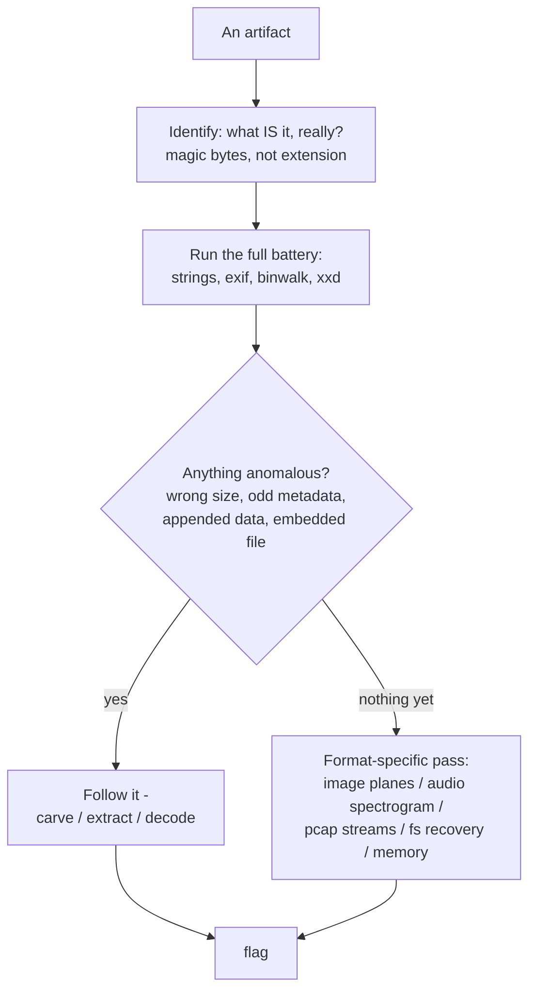
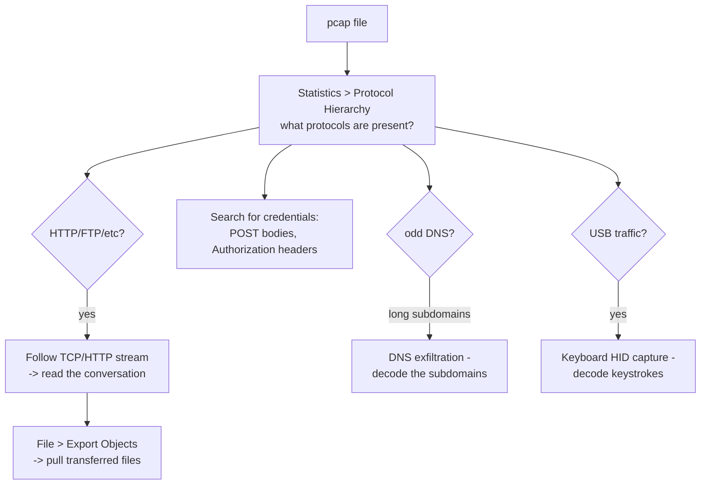
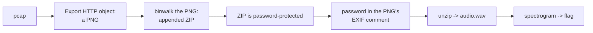
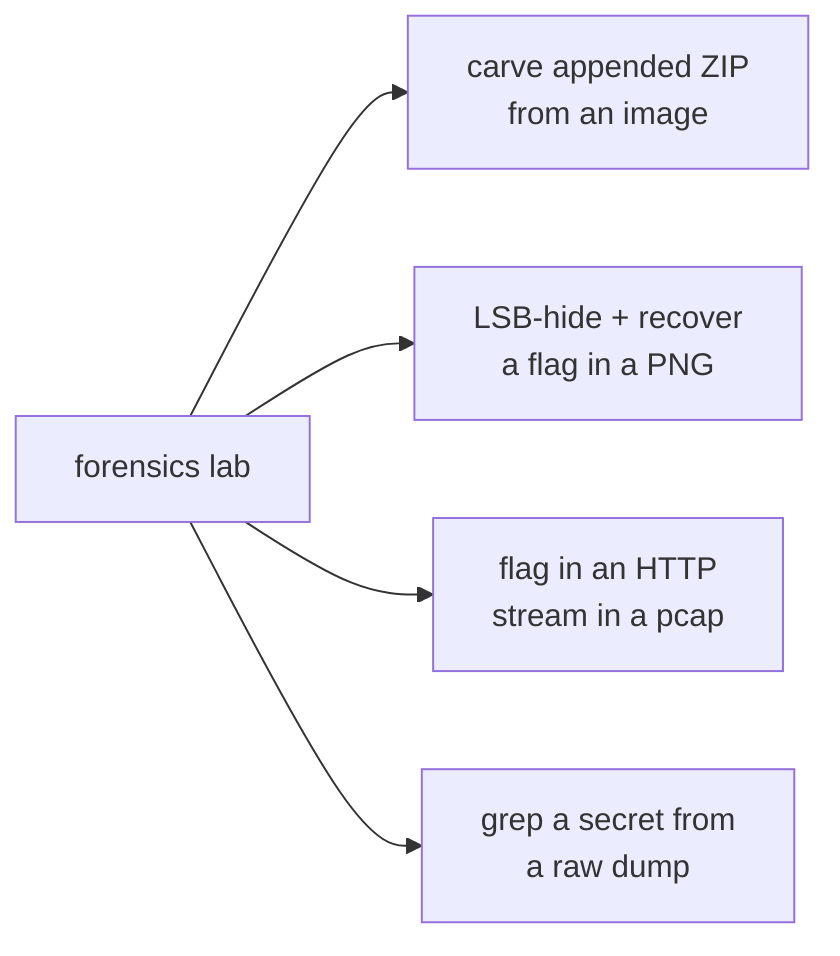

Forensics is the category that most rewards patience and most punishes guessing. You are handed a large artifact — a disk image, a packet capture, a memory dump, a photograph — and told that a flag is hidden inside it somewhere. There is no clever insight that cracks it in one move; there is a *routine*, applied methodically, that surfaces the signal. The players who are good at forensics are not the ones with the deepest knowledge of any single format. They are the ones who run the same enumeration every time, notice the one thing that is out of place, and follow it.

That is why this chapter is structured around *procedures* rather than tricks. The single most valuable thing in it is Part 2's first-five-minutes routine — `file`, `strings`, `exiftool`, `binwalk`, `xxd` — which you run on every artifact before forming any theory, and which ends a large fraction of forensics challenges on its own. Everything after that is what you do when the routine does not immediately win: the format-specific techniques for images, audio, network captures, disks, and memory.

Steganography is bundled with forensics because the skills overlap heavily and the tools are shared, but the two have a different flavour. Forensics is about recovering data that is *present but not obvious* — deleted, fragmented, buried in a structure. Steganography is about data that was *deliberately hidden* in a carrier — the low bits of an image, the spectrogram of an audio file, the whitespace of a text. Stego has a deserved reputation for being guessy, and Part 12 is honest about that; the antidote is, again, a systematic pass with the right tools rather than random inspiration.

## Why This Matters

Forensics is the CTF category with the most direct professional counterpart. The techniques here — carving files from raw data, reassembling TCP streams, recovering deleted files, extracting artifacts from a memory image — are the literal daily work of a DFIR analyst (Notebook 33) and a malware analyst (Notebook 35). A CTF memory-forensics challenge and a real incident triage differ mainly in scale and stakes, not in method: both start with Volatility, both hunt for the anomalous process, both dump and analyse. This is the category where "CTF skills" and "job skills" overlap most cleanly.

The network-forensics subcategory in particular trains a skill that pays off everywhere: reading a packet capture and reconstructing what happened. That is how you understand an exfiltration, verify a detection, and confirm an exploit worked — and Notebook 32's detection engineering assumes you can do it. The memory-forensics subcategory trains the incident-response reflex of "what was running, what did it touch, what secrets are in RAM."

Steganography's professional relevance is narrower but real: it is a genuine data-exfiltration and malware-C2 channel (Notebook 30 and 35 both touch it), and knowing how data hides in carriers is how a defender learns to spot it. And across the whole category, the meta-skill — methodical enumeration of a large artifact without giving up or guessing — is exactly the temperament that makes a good investigator.

## Part 1: The Forensics Mindset

Two rules define the category, and internalising them is worth more than any tool.

**Enumerate, do not guess.** The failure mode of forensics is staring at an image wondering "what could be hidden here" and trying random tools in hope. The winning mode is running a fixed battery of extraction tools, reading their output carefully, and following the one anomaly. The flag is rarely where inspiration would look; it is where the tools point.

**The artifact is bigger than it looks.** A "photo" is a container that can hold appended data, embedded files, metadata, hidden bit-planes, and a modified structure — all at once. A 2 MB JPEG that should be 200 KB is telling you something. Never treat the artifact as only the thing it appears to be.



## Part 2: File Identification and the First Five Minutes

**Never trust the extension.** The truth of a file is its **magic bytes** — the signature in its first few bytes.

```
PNG   89 50 4E 47 0D 0A 1A 0A     ("\x89PNG")
JPEG  FF D8 FF
GIF   47 49 46 38                 ("GIF8")
PDF   25 50 44 46                 ("%PDF")
ZIP   50 4B 03 04                 ("PK\x03\x04")   <- also docx, jar, apk, odt
ELF   7F 45 4C 46                 ("\x7fELF")
PCAP  D4 C3 B2 A1  or  0A 0D 0D 0A (pcapng)
RAR   52 61 72 21                 ("Rar!")
7z    37 7A BC AF 27 1C
```

A **corrupted or wrong magic** is itself a common challenge: a file that will not open because its header was zeroed or altered. Fix it by writing the correct signature back with a hex editor (`xxd`/`hexedit`), or — for images — by correcting the dimensions or CRC. Recognising "this PNG has a broken header" is half the solve.

The routine, run on **every** artifact before any theory:

```bash
F=artifact

file "$F"                     # what is it really? (reads magic bytes)
strings -n 8 "$F" | less      # readable text: flags, hints, embedded paths
strings -e l "$F"             # also try 16-bit little-endian strings (Unicode)
exiftool "$F"                 # metadata: GPS, comments, software, hidden fields
binwalk "$F"                  # embedded/appended files and their offsets
xxd "$F" | head -20           # eyeball the header
xxd "$F" | tail -20           # AND the footer -- appended data lives here
```

Two habits inside the routine. **Grep strings for the flag format immediately** — `strings "$F" | grep -i 'flag{'` wins an embarrassing number of challenges outright. And **always look at the tail**, not just the head: appended ZIPs, trailing base64, and "extra" data after a file's legitimate end are a staple, and they are invisible unless you look at the end of the file.

## Part 3: Carving — Files Inside Files

When `binwalk` reports embedded structures, extract them.

```bash
binwalk "$F"                  # list embedded files with offsets and types
binwalk -e "$F"               # auto-extract (dd's out the recognised files)
foremost -i "$F" -o out/      # signature-based carving, an alternative to binwalk -e
```

Two classic tricks the tools are built to defeat:

**Appended data.** A ZIP or a second image concatenated onto the end of a JPEG. The host file opens normally (viewers stop at the JPEG's end marker), and the appended payload is invisible until `binwalk` or a tail inspection finds it. Extract by carving at the reported offset, or just `unzip artifact.jpg` — because a ZIP's index is at its *end*, `unzip` finds an appended archive even inside an image.

**Polyglots.** A single file that is valid as two formats at once — a file that is simultaneously a valid PNG and a valid ZIP, or a PDF that is also a JavaScript. These exploit the fact that PNG/JPEG parsers read from the front while ZIP parsers read from the back, so both can coexist. Recognition: `file` says one thing, `binwalk` reveals another format inside, and the two overlap rather than simply concatenating.

If `binwalk` finds nothing but the size is wrong, carve manually: find the embedded file's magic offset with `xxd | grep`, then `dd if=artifact bs=1 skip=OFFSET of=carved` to extract from there.

## Part 4: Image Steganography

Images are the most common stego carrier. Work through the techniques in order of cost.

**Metadata and strings first** (Part 2 already covered this — the flag is in an EXIF comment more often than anywhere else).

**Appended data** (Part 3 — check the tail and try `unzip`/`binwalk`).

**LSB (Least Significant Bit) steganography.** Data is hidden in the lowest bit of each colour channel, invisible to the eye because changing the least significant bit of a pixel shifts its colour imperceptibly. Extract with `zsteg` (for PNG/BMP — it tries every plane and bit-order automatically) or a script:

```bash
zsteg -a artifact.png          # try ALL LSB configurations at once
zsteg artifact.png             # the common configurations
```

**Bit-plane analysis with stegsolve.** `stegsolve` (or `stegonline` in the browser) lets you view each of the 24 bit-planes separately. A message hidden in, say, the blue channel's least significant bit appears as clear text or a QR code when you isolate that plane and hide the others. Cycling through the planes by hand is a core stego move.

**PNG structure attacks.** PNG is a series of typed chunks (`IHDR` for dimensions, `IDAT` for pixel data, `IEND` for the end). Two challenge types:

- **Dimension crop.** The image's declared height in `IHDR` is smaller than the real image data, so a viewer hides the bottom rows where the flag is drawn. Fix the height bytes in `IHDR` (and its CRC) to reveal the hidden region. `pngcheck -v` shows the chunk structure and flags CRC mismatches.
- **Data after IEND.** Anything after the `IEND` chunk is not part of the image — appended payload, per Part 3.

**JPEG and steghide.** JPEG's lossy compression makes naive LSB unreliable, so JPEG stego usually uses `steghide`, which embeds passphrase-protected data:

```bash
steghide extract -sf artifact.jpg              # prompts for passphrase
steghide extract -sf artifact.jpg -p ""        # try empty passphrase first
stegseek artifact.jpg rockyou.txt              # crack the passphrase with a wordlist
```

`stegseek` is the fast way to brute-force a steghide passphrase against a wordlist, and an empty or trivially-guessable passphrase is common.

The image-stego order to internalise: **exiftool → strings → tail/binwalk → zsteg (PNG) or steghide/stegseek (JPEG) → stegsolve plane-by-plane → pngcheck for structure.** Run them in that order and resist jumping to exotic tools before the cheap ones are exhausted.

## Part 5: Audio Steganography

Audio carriers hide data in ways you often literally see or hear.

**Spectrogram.** The most common audio-stego trick draws text or an image into the *frequency domain*, invisible in the waveform but plain in a spectrogram. Open the file in **Audacity** (switch the track to Spectrogram view) or **Sonic Visualiser** and the flag is often written across the frequencies. Recognition: an audio file that sounds like noise, static, or an eerie tone.

**LSB in audio samples.** Like image LSB but in the audio sample values — extract with a script or a tool like `WavSteg`.

**DTMF tones.** The touch-tones of a telephone keypad encode digits; a challenge that sounds like phone dialling is DTMF, decodable by ear with a chart or automatically with `multimon-ng`.

**SSTV (Slow-Scan Television).** A warbling analog-sounding transmission encodes an *image* the way ham radio sends pictures; decode with `qsstv` or `sstv` tools. Recognition: a distinctive rhythmic warble.

**Morse code.** Beeps of two lengths — decode by ear or with a tool. Common as a layer inside another audio challenge.

The audio order: **listen to it first** (the trick is often audible), then **look at the spectrogram**, then try LSB, then consider DTMF/SSTV/Morse based on what it sounds like.

## Part 6: Network Forensics — pcap Analysis

A packet capture (`.pcap`/`.pcapng`) is a recording of network traffic, and network-forensics challenges ask you to reconstruct what happened. **Wireshark** (GUI) and **tshark** (CLI) are the tools.



The core moves:

**Protocol hierarchy first.** `Statistics → Protocol Hierarchy` (or `tshark -q -z io,phs`) tells you what is in the capture — HTTP, FTP, DNS, USB, TLS — which directs everything else.

**Follow streams.** Right-click a packet → `Follow → TCP Stream` reassembles a whole conversation into readable text. This is where you read the HTTP request that leaked the flag, the FTP session that transferred it, the IRC/telnet chat that contains it.

**Export objects.** `File → Export Objects → HTTP` pulls every file transferred over HTTP out of the capture — images, executables, documents. The flag is frequently *inside* an exported file (making this a network challenge that becomes a file-forensics challenge).

**Hunt for credentials.** Cleartext protocols (HTTP Basic, FTP, telnet, POP3) carry passwords in the clear. `tshark -Y 'http.authorization or ftp.request.command == "PASS"'` or a Wireshark filter surfaces them.

**DNS exfiltration.** Long, random-looking subdomains (`ZmxhZ3tk.tunnel.evil.com`) are data smuggled through DNS queries — collect the subdomains in order and decode them (often base32, DNS's friendly alphabet).

**USB HID captures.** A capture of USB traffic from a keyboard records every keystroke as HID scancodes. Extract the `usb.capdata` field with tshark and map the scancodes back to characters (there are well-known scripts for this) to recover what was typed — frequently the flag. Mouse-movement captures similarly can draw a picture.

```bash
# Extract USB keyboard HID data for scancode decoding.
tshark -r usb.pcap -Y 'usb.capdata' -T fields -e usb.capdata
# Export all HTTP objects to a folder.
tshark -r capture.pcap --export-objects http,out/
```

## Part 7: Disk and Filesystem Forensics

Disk-image challenges (`.dd`, `.img`, `.E01`) hand you a filesystem to investigate.

**Mount or browse.** Mount read-only (`mount -o ro,loop image.dd /mnt`) or open in **Autopsy**/**The Sleuth Kit** for a forensic browser that shows deleted files and metadata.

**Deleted-file recovery.** Deleting a file usually unlinks it without erasing the data, so the content survives in unallocated space until overwritten. `tsk_recover`, `photorec`, or `foremost` carve deleted files back out. The flag is very often in a "deleted" file.

**Slack space and unallocated space.** Data can hide in the gap between a file's real end and the end of its last cluster (slack space), or in never-allocated regions. Carving tools sweep these.

**Filesystem artifacts.** Browser history, `.bash_history`, registry hives (Windows images), log files, and recycle-bin contents are all fair game and all common flag locations. Autopsy surfaces them automatically.

The disk order: **Autopsy for a guided browse → tsk_recover/photorec for deleted files → strings/grep over the raw image as a catch-all.** A blunt `strings image.dd | grep flag{` is worth running early; it sometimes finds a flag sitting in unallocated space that the structured tools would take longer to reach.

## Part 8: Memory Forensics with Volatility

Memory-dump challenges (`.raw`, `.vmem`, `.dmp`) are the most job-relevant subcategory, and **Volatility 3** is the tool. A memory image captures everything that was in RAM: running processes, command history, network connections, open files, clipboard contents, and secrets that never touched disk.

```bash
# What processes were running? (start here, always)
vol -f mem.raw windows.pstree

# Command history -- frequently contains the flag or the path to it.
vol -f mem.raw windows.cmdline
vol -f mem.raw windows.consoles          # full console buffers

# Network connections at capture time.
vol -f mem.raw windows.netscan

# Dump a specific process's memory for further analysis.
vol -f mem.raw windows.memmap --pid 1234 --dump

# Files cached in memory -- list, then extract one.
vol -f mem.raw windows.filescan
vol -f mem.raw windows.dumpfiles --viraddr 0xADDR

# Registry, hashes, clipboard, environment.
vol -f mem.raw windows.registry.hivelist
vol -f mem.raw windows.hashdump          # SAM password hashes
```

The memory-forensics reasoning loop:

1. **`pstree`** — look for the process that does not belong (a `powershell.exe` spawned by `winword.exe`, a process with a misspelled name, a suspicious parent-child relationship). This is exactly the real IR reflex from Notebook 33.
2. **`cmdline` / `consoles`** — read what was typed; flags, downloaded URLs, and encoded payloads live here.
3. **Follow the anomaly** — dump the suspicious process, scan for its files, extract its network activity.

Identify the OS profile first (`vol -f mem.raw windows.info` or the Linux equivalent). Volatility 3 auto-detects far better than Volatility 2 did, but a Linux image needs the matching symbol table.

## Part 9: Documents, Archives, and Other Containers

**Office documents** (`.docx`, `.xlsx`, `.pptx`) are ZIP archives — `unzip` them and inspect the XML parts, embedded media, and (crucially) **macros**. `olevba` extracts and deobfuscates VBA macros; a malicious-macro challenge is really a reversing challenge in disguise (Notebook 35).

**PDFs** are structured objects that can contain JavaScript, embedded files, and hidden layers. `pdfid` and `pdf-parser` (Didier Stevens' tools), `peepdf`, or `mutool` extract streams and objects; `pdfdetach` pulls embedded attachments.

**Archives** (`.zip`, `.rar`, `.7z`) show up password-protected:

- **Password cracking**: `zip2john archive.zip > h && john h`, or `fcrackzip -D -u -p rockyou.txt archive.zip`.
- **Known-plaintext (bkcrack)**: legacy ZipCrypto is broken if you know *any* file's plaintext content (even one you can guess, like a standard file the archive contains). `bkcrack` recovers the keys and decrypts the rest without the password — a genuinely powerful and CTF-common attack.
- **Structure inspection**: `unzip -l` and `7z l` list contents and sometimes reveal filenames that are themselves hints.

## Part 10: Layering — How Real Challenges Are Built

Serious forensics challenges chain subcategories, and the flag is at the bottom of a stack of containers.



Each step is a technique from a previous part; the challenge is the *depth*. The way you survive a deep chain is the Chapter 1 discipline: run the full enumeration battery at **every** layer (do not assume the exported PNG is "just an image"), keep notes on what you found where, and follow each anomaly to the next container. The player who runs `exiftool` and `binwalk` on the file they just carved — rather than assuming it is the end — is the one who reaches the flag.

## Part 11: Hands-On Lab — Four Artifacts, Four Techniques

### 11.1 What we are building

Four self-contained artifacts, each a different subcategory, solved with the routines above: a **polyglot/appended ZIP** (Part 3), an **LSB PNG** (Part 4), a **pcap** with a flag in a stream (Part 6), and a **"memory-ish" dump** we search like Part 8.



Python 3 (with `Pillow` and `scapy`), plus `binwalk`, `zip`, and `tshark` if available.

### 11.2 Build and carve an appended-ZIP polyglot

```bash
mkdir -p ~/forensics-lab && cd ~/forensics-lab

# Make a tiny PNG and a secret ZIP, then concatenate (image + zip = polyglot).
python3 - <<'PY'
from PIL import Image
Image.new("RGB", (64, 64), (30, 90, 150)).save("cover.png")
print("cover.png written")
PY
echo "flag{c4rv3d_from_appended_zip}" > secret.txt
zip -q secret.zip secret.txt
cat cover.png secret.zip > polyglot.png     # append the zip after the PNG
echo "polyglot.png built"

# Sample output:
# cover.png written
# polyglot.png built
```

Solve it with the Part 3 routine:

```bash
file polyglot.png                            # says PNG -- looks innocent
binwalk polyglot.png                         # reveals the appended Zip archive

# Sample output (binwalk):
# DECIMAL   HEXADECIMAL   DESCRIPTION
# 0         0x0           PNG image, 64 x 64, 8-bit/color RGB
# 12345     0x3039        Zip archive data, ... name: secret.txt

# A ZIP's index is at the END, so unzip finds it INSIDE the image.
unzip -o polyglot.png && cat secret.txt

# Sample output:
# Archive:  polyglot.png
#  extracting: secret.txt
# flag{c4rv3d_from_appended_zip}
```

### 11.3 Hide and recover an LSB flag

```python
# lsb.py -- embed a flag in the least significant bits of a PNG, then recover it.
from PIL import Image

FLAG = "flag{lsb_1n_the_l0w_b1t}"

def embed(src, dst, msg):
    img = Image.open(src).convert("RGB")
    px = list(img.getdata())
    bits = "".join(f"{b:08b}" for b in msg.encode()) + "0"*16   # 16-bit terminator
    out = []
    for i, (r, g, b) in enumerate(px):
        if i < len(bits):
            r = (r & ~1) | int(bits[i])      # stash one message bit in red's LSB
        out.append((r, g, b))
    img.putdata(out); img.save(dst)

def recover(src):
    px = list(Image.open(src).convert("RGB").getdata())
    bits = "".join(str(r & 1) for r, g, b in px)
    out = bytearray()
    for i in range(0, len(bits) - 8, 8):
        byte = int(bits[i:i+8], 2)
        if byte == 0: break
        out.append(byte)
    return out.decode(errors="replace")

embed("cover.png", "stego.png", FLAG)
print("[*] embedded; recovering from the low bits...")
print("[+]", recover("stego.png"))
```

```bash
pip install Pillow > /dev/null
python3 lsb.py

# Sample output:
# [*] embedded; recovering from the low bits...
# [+] flag{lsb_1n_the_l0w_b1t}
```

In a real challenge you would reach for `zsteg -a stego.png`, which tries every plane and bit-order automatically — this script shows the mechanism `zsteg` is automating.

### 11.4 A flag in a pcap HTTP stream

```python
# make_pcap.py -- craft a pcap with a flag in an HTTP response body.
from scapy.all import Ether, IP, TCP, Raw, wrpcap

def pkt(sport, dport, seq, payload, flags="PA"):
    return (Ether()/IP(src="10.0.0.5", dst="10.0.0.9")/
            TCP(sport=sport, dport=dport, seq=seq, flags=flags)/Raw(load=payload))

req  = pkt(44321, 80, 1, b"GET /secret HTTP/1.1\r\nHost: lab\r\n\r\n")
resp = pkt(80, 44321, 1,
           b"HTTP/1.1 200 OK\r\nContent-Type: text/plain\r\n\r\n"
           b"flag{r34d_the_http_str3am}\n")
wrpcap("capture.pcap", [req, resp])
print("capture.pcap written")
```

```bash
pip install scapy > /dev/null
python3 make_pcap.py

# Sample output:
# capture.pcap written

# Solve: read the payloads. tshark reassembles; strings is the blunt fallback.
tshark -r capture.pcap -Y http -T fields -e data.text 2>/dev/null | xxd -r -p 2>/dev/null || \
  strings capture.pcap | grep -i 'flag{'

# Sample output:
# flag{r34d_the_http_str3am}
```

In Wireshark this is `Follow → HTTP Stream`; on the command line, `strings capture.pcap | grep flag{` is the thirty-second version that works because the body is cleartext.

### 11.5 Grep a secret from a raw dump

```bash
# Simulate a memory-ish dump: random bytes with a secret buried inside.
python3 - <<'PY'
import os
blob = os.urandom(4096) + b"\x00cmd.exe /c echo flag{f0und_in_memory_str1ngs}\x00" + os.urandom(4096)
open("mem.raw","wb").write(blob)
print("mem.raw written")
PY

# The blunt but effective first pass (mirrors Part 8's strings+grep habit).
strings mem.raw | grep -i 'flag{'

# Sample output:
# cmd.exe /c echo flag{f0und_in_memory_str1ngs}
```

A real image would be driven with `vol -f mem.raw windows.cmdline`, but the reflex is identical: the command line that ran is where the flag lives, and `strings | grep` finds it when the structured tool is not available.

### 11.6 Extending the lab

Chain the artifacts into one Part-10-style challenge (flag inside a ZIP inside a PNG referenced by a pcap); build a PNG with the `IHDR` height shrunk and fix it with `pngcheck` + a hex editor to reveal a cropped flag; hide text in an audio spectrogram with a tone generator and read it back in Audacity; steghide-embed a passphrase-protected flag in a JPEG and crack it with `stegseek`; and download a real Volatility sample image (the community "Malware Cookbook" and CTF archives host several) and work `pstree → cmdline → dumpfiles` end to end.

## Part 12: Common Pitfalls

**Guessing instead of enumerating.** The category's defining failure. Run the full battery — `file`, `strings`, `exiftool`, `binwalk`, `xxd` head *and tail* — before forming any theory.

**Only looking at the head of a file.** Appended ZIPs, trailing base64, and post-`IEND` data live at the *end*. Always inspect the tail.

**Trusting the extension.** The magic bytes are the truth. A `.png` that is really a ZIP, or a broken header masking a valid file, is a staple.

**Stopping at the first container.** In a layered challenge, the file you just carved needs the *same full enumeration*. The exported PNG is not "just an image."

**Reaching for exotic stego tools before the cheap ones.** `exiftool`, `strings`, and `binwalk` solve most stego. Run `zsteg -a` and `stegseek` before hand-crafting bit-plane scripts.

**Forgetting the flag-format grep.** `strings X | grep -i flag{` on every artifact and every carved file. It is free and it wins constantly.

**Ignoring the spectrogram on audio.** If it sounds like noise, look at it in Audacity before anything else.

**In pcaps, reading packets instead of streams.** Follow the TCP/HTTP stream and export objects — do not try to reassemble a file byte by byte from individual packets.

**Skipping deleted files on disk images.** The flag is very often in a deleted or unallocated-space file. Run `tsk_recover`/`photorec` and a raw `strings | grep`.

**Not identifying the memory image's OS first.** Volatility needs the right symbols; `windows.info` (or the Linux symbol table) comes before everything else.

## Final Revision / Summary

- Forensics rewards **methodical enumeration over guessing**, and the artifact is always **bigger than it looks** — a container that may hold appended data, embedded files, metadata, hidden bit-planes, and altered structure at once.
- **The first five minutes are fixed**: `file` (trust magic bytes, never the extension), `strings` (head *and* `grep flag{`), `exiftool`, `binwalk`, and `xxd` on both **head and tail**. This routine ends a large fraction of challenges on its own.
- **Carving**: `binwalk -e`/`foremost` extract embedded files; appended ZIPs open with `unzip` even inside an image (the index is at the end); polyglots are valid as two formats because front-reading and back-reading parsers coexist.
- **Image stego order**: exiftool → strings → tail/binwalk → `zsteg -a` (PNG LSB) or `steghide`/`stegseek` (JPEG) → **stegsolve** bit-planes → `pngcheck` for structure (dimension-crop and post-`IEND` data).
- **Audio stego**: listen first, then the **spectrogram** (Audacity/Sonic Visualiser), then LSB, then DTMF/SSTV/Morse by ear. The trick is usually audible or visible in the frequency domain.
- **Network forensics**: protocol hierarchy first → **follow the stream** → **export objects** (the flag is often inside a transferred file) → hunt cleartext credentials → decode DNS-exfil subdomains → decode **USB HID** keystroke captures.
- **Disk forensics**: Autopsy/TSK to browse, `tsk_recover`/`photorec` for **deleted files** (the common flag location), and a blunt `strings image | grep flag{` over unallocated space.
- **Memory forensics** (the most job-relevant): **Volatility 3** — identify the OS, `pstree` for the anomalous process, `cmdline`/`consoles` for what was typed, then dump and follow. Mirrors real IR triage exactly.
- **Documents and archives**: office files are ZIPs (inspect XML and `olevba` the macros), PDFs carry JS and attachments (`pdfid`/`pdf-parser`), and protected archives fall to `zip2john`/`fcrackzip`, or **bkcrack** for known-plaintext ZipCrypto.
- **Real challenges layer** subcategories — pcap → carved image → password-protected ZIP → audio → spectrogram. Survive by running the **full enumeration at every layer** and keeping notes.

## Cheat Sheet / Quick Reference

**First five minutes (every artifact, every layer)**

```bash
file X
strings -n 8 X | grep -iE 'flag{|password|http'
exiftool X
binwalk X          # then binwalk -e X
xxd X | head ; xxd X | tail      # HEAD AND TAIL
```

**Magic bytes**

```
89 50 4E 47 PNG   FF D8 FF JPEG   50 4B 03 04 ZIP/docx
25 50 44 46 PDF   7F 45 4C 46 ELF  D4 C3 B2 A1 pcap
```

**Carving**

```bash
binwalk -e X           foremost -i X -o out/
unzip X                # finds an appended zip inside any file
dd if=X bs=1 skip=OFF of=carved     # manual carve at an offset
```

**Image stego (in order)**

```bash
exiftool X ; strings X ; binwalk X          # cheap wins first
zsteg -a X.png                               # all LSB configs
steghide extract -sf X.jpg -p ''             # try empty pass
stegseek X.jpg rockyou.txt                   # crack steghide pass
pngcheck -v X.png                            # structure / CRC / crop
# then stegsolve: cycle the 24 bit-planes by hand
```

**Audio stego**

```
listen -> Audacity SPECTROGRAM view -> LSB (WavSteg)
warble = SSTV (qsstv) | touch-tones = DTMF (multimon-ng) | beeps = Morse
```

**pcap**

```
Statistics > Protocol Hierarchy
Follow > TCP/HTTP Stream
File > Export Objects > HTTP
tshark -r cap -Y 'usb.capdata' -T fields -e usb.capdata   # keyboard HID
strings cap | grep -i flag{                                # blunt fallback
```

**Memory (Volatility 3)**

```bash
vol -f mem.raw windows.info        # OS first
vol -f mem.raw windows.pstree      # the odd process
vol -f mem.raw windows.cmdline     # what was typed
vol -f mem.raw windows.filescan ; windows.dumpfiles
vol -f mem.raw windows.hashdump
```

**Archives**

```bash
zip2john a.zip > h && john h        fcrackzip -D -u -p rockyou.txt a.zip
bkcrack ...                         # known-plaintext ZipCrypto
olevba doc.docm                     # office macros
pdfid f.pdf ; pdf-parser f.pdf      # pdf objects/JS
```

## Practice Labs & Resources

**Start here**
- **picoCTF Forensics** — the best-scaffolded introduction; covers strings, metadata, carving, LSB, pcaps, and memory at a gentle curve.
- **HackTheBox forensics challenges** and **CyberDefenders** — CyberDefenders in particular runs realistic DFIR labs (pcaps, disk images, memory) that bridge directly to Notebook 33.

**Tool-specific practice**
- **Volatility** — download a CTF or Malware-Cookbook sample memory image and work a full `pstree → cmdline → dumpfiles` investigation.
- **Wireshark** — the sample-captures wiki has annotated pcaps; practise Follow Stream and Export Objects until they are reflex.
- **aperisolve.com** — runs the whole image-stego battery (exiftool, binwalk, zsteg, steghide) in one shot; use it to check your manual pass, not to replace it.

**Hands-on**
- Extend the lab: build a layered pcap→PNG→ZIP→audio chain, fix a cropped-PNG dimension attack, and crack a steghide JPEG with stegseek.
- Recover deleted files from a disk image with `photorec` and confirm with `strings | grep`.
- Decode a USB keyboard HID capture into typed text using a public scancode-mapping script.

**Deliberate practice**
- Make the first-five-minutes routine muscle memory: run all five commands on every artifact before thinking, for a whole event.
- Build a personal tool-order checklist per subcategory (image, audio, pcap, disk, memory) and follow it top-to-bottom rather than jumping around.
- After each event, reproduce every forensics solve you missed from the writeup, running the tools yourself.

**Further reading**
- Notebook 33 (DFIR) for the professional-grade versions of disk and memory forensics, and Notebook 35 (malware analysis) for the document-macro and reversing crossover.
- The SANS DFIR posters and cheat sheets — dense, authoritative references for Volatility, Wireshark, and file systems.
- Didier Stevens' PDF and Office tools documentation, for document forensics done properly.
