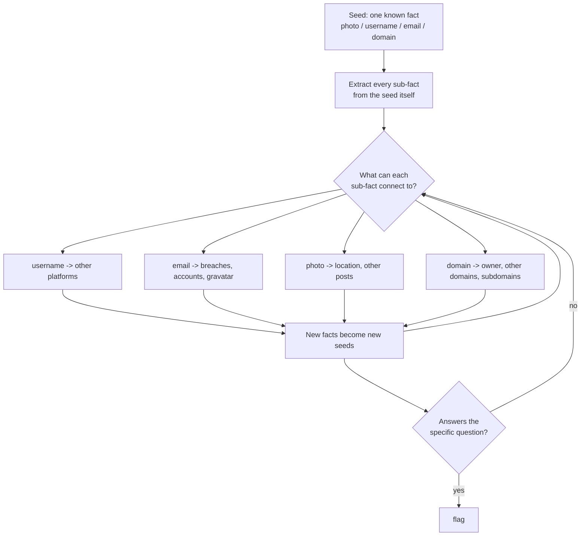
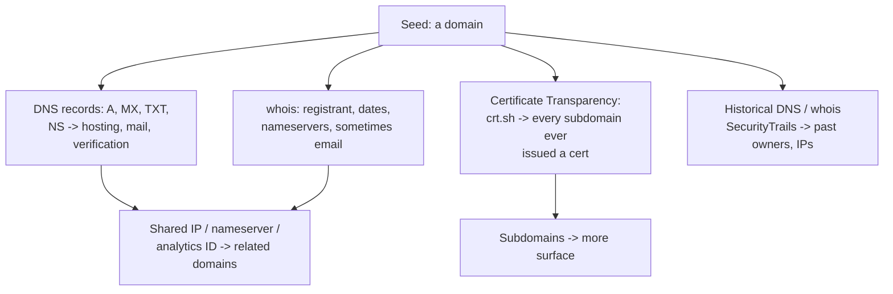
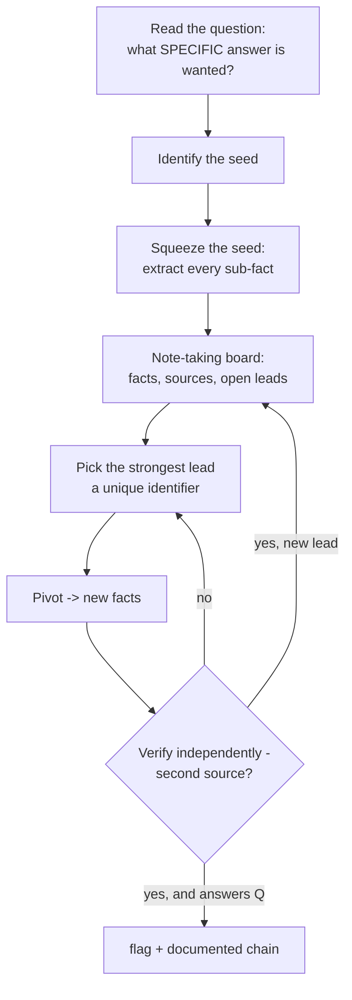
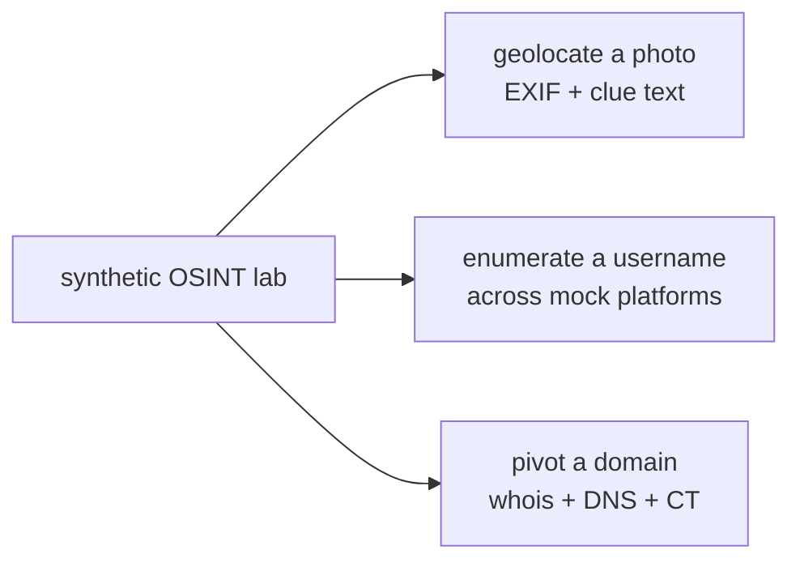

Every other category in this notebook gives you an artifact and asks you to break it. OSINT gives you a *seed* — a photograph, a username, an email address, a domain, a name — and asks a specific question: where was this taken, who owns this account, what is this person's employer, what was on this page before it was deleted. The flag is not hidden inside the thing you were given; it is out on the public internet, connected to your seed by a chain of pivots you have to build.

That makes OSINT the category that feels least like "hacking" and is, in some ways, the most broadly useful skill in the whole curriculum. It is what a penetration tester does in the reconnaissance phase (Notebook 10), what a threat intelligence analyst does tracking an actor (Notebook 34), what a social engineer does building a pretext (Notebook 28), and what an investigative journalist does verifying a story. The core motion — start from one known fact, find a second fact connected to it, use that to find a third — is identical across all of them.

This chapter teaches that motion as a discipline, not a bag of tricks. The tricks (reverse image search, EXIF extraction, username enumeration, certificate transparency) matter and are all here, but the thing that separates a good OSINT player from someone who owns a lot of tools is **methodology**: knowing what to pivot on, when a lead is exhausted, how to avoid confirmation bias, and — importantly — where the ethical and legal line sits, because OSINT is the one category whose techniques target *real people* and whose careless application does real harm.

## Why This Matters

The professional relevance of OSINT is unusually direct and unusually wide. In offensive security it *is* the reconnaissance phase: before a single packet is sent at a target, an attacker maps the organisation's people, infrastructure, technology, and exposure entirely from public sources — and the quality of that recon largely determines whether the engagement succeeds. Notebook 10 covers this as a pentest phase; this chapter trains the underlying pivoting skill on the compressed, verifiable puzzles that CTF OSINT provides.

Defensively, OSINT is how threat intelligence attributes activity, how brand-protection teams find phishing infrastructure, and how an organisation discovers what it is leaking before an attacker does (your own attack surface, per Notebook 34). It is how fraud investigators verify identities and how content moderators trace coordinated inauthentic behaviour.

But the deeper reason to take this category seriously is the one Part 2 develops: **OSINT is the category where the ethics are not optional garnish.** The other categories operate on deliberately vulnerable machines in a sandbox. OSINT operates on the real internet and real human beings. The same reverse-image-search and username-enumeration skills that solve a CTF challenge can be used to stalk, dox, and harass. Learning the techniques responsibly — with the passive-only discipline, the legal boundaries, and the refusal to target private individuals outside a licensed context — is inseparable from learning them at all. This chapter treats that as a first-class part of the skill, because in the professional world it is.

## Part 1: The OSINT Mindset — Seed and Pivot

OSINT is a graph traversal. You start at a node (the seed) and follow edges (connections between pieces of information) to reach the node that answers the question.



Three principles make the traversal efficient:

**Extract before you pivot.** The seed itself contains more than you first see. A single photograph carries EXIF (camera, time, sometimes GPS), visible content (signage, architecture, license plates, uniforms, reflections), and context (the account that posted it, the caption, the other photos in the set). Squeeze the seed dry before reaching outward.

**Pivot on identifiers, not descriptions.** "A tall building" is not a pivot; a *reused username* is. The strongest pivots are unique identifiers a person carries across services: the same handle on GitHub, Twitter, and Reddit; the same profile photo (which reverse-image-search links); the same email (which appears in breaches, Gravatar, and account-recovery hints); the same phone number.

**Read the question precisely.** OSINT challenges ask for a *specific* answer — the name of the café in the background, the person's employer, the flag left in a since-deleted tweet. Knowing exactly what you are looking for stops you from wandering. If the question is "what city," you are done at the city; do not spend an hour finding the street.

## Part 2: The Line — Ethics, Legality, and Passive-Only

This section comes second because it governs everything after it.

OSINT sits on a spectrum, and the CTF rule is to stay firmly on the passive end:

- **Passive OSINT** — collecting information that is *already public* without interacting with the target's systems: reading a public profile, viewing a cached page, searching public records, reverse-image-searching a photo. This is what CTF OSINT is, and it is lawful.
- **Active reconnaissance** — interacting with the target's infrastructure: port scanning, connecting to services, sending probes. This is *not* OSINT and is usually *out of scope and against the rules* in a CTF, because it crosses from observing public data into touching systems you have no authorisation for.

The bright lines to hold, in a CTF and in professional work alike:

**Do not access anything requiring authentication you do not legitimately have.** A public tweet is fair game; logging into someone's account with a guessed password is a computer-misuse crime, not OSINT. A CTF challenge will never require you to break into a real account.

**Do not social-engineer real, uninvolved people.** Calling a real company's help desk to extract information about a real employee for a CTF is unacceptable — it victimises someone who never consented to the game. CTF OSINT targets are constructed personas or the challenge author's own planted accounts.

**Do not target private individuals outside a licensed context.** The techniques in this chapter can dox and stalk. Applying them to a private person — an ex, a stranger, someone who annoyed you online — is harassment regardless of how "public" the data was. The professional discipline (Notebook 10, Notebook 34) is that OSINT is conducted against defined targets under authorisation, with a purpose, and with data handled responsibly.

**Respect the CTF's constructed nature.** OSINT challenges are built around author-created accounts, planted breadcrumbs, and fictional personas. If a challenge seems to be pointing you at a *real* private person's genuine private data, that is a signal you have gone off the intended path — stop and re-read the challenge. Good CTF authors sandbox their OSINT; when in doubt, ask the organisers.

The mindset to carry out of this section: **just because information is findable does not mean collecting, aggregating, or acting on it is acceptable.** The aggregation itself — assembling scattered public facts into a dossier on a person — is precisely what privacy law (Notebook 42, Chapter 6) and basic ethics push back on. Skill here comes with a duty to use it narrowly.

## Part 3: Image and Photo Geolocation

Geolocation — determining where a photo was taken — is the signature OSINT challenge type, and it is a layered process from cheapest to hardest.

**EXIF first.** The cheapest possible win: many photos embed GPS coordinates and a timestamp in EXIF metadata.

```bash
exiftool photo.jpg | grep -iE 'gps|date|make|model|software'
# GPS Latitude/Longitude -> paste straight into a map
```

Social platforms usually *strip* EXIF on upload, so a photo with intact GPS often came directly from a camera or a service that preserves it — and its presence is frequently the intended easy path. When it is stripped, you geolocate from the pixels.

**Reverse image search across multiple engines.** No single engine is best, so run the image through several — **Google Lens, Yandex (often the strongest for places and faces), Bing Visual Search, TinEye** (best for finding the *original* and tracking where an image spread). Yandex in particular frequently identifies landmarks and locations the others miss.

**Visual clue extraction.** When search fails, read the image like an investigator:

- **Signage and language** — shop names, street signs, advertisements. The *language and script* narrow the country immediately; a specific business name is often searchable to an exact address.
- **Architecture and infrastructure** — building styles, road markings, traffic-light designs, utility poles, bollards, and license-plate formats are all region-specific. (Communities like the GeoGuessr scene have catalogued these exhaustively.)
- **Vegetation, terrain, and climate** — narrows hemisphere and latitude.
- **The sun and shadows** — shadow direction gives you facing; shadow *length* combined with the date gives latitude (chronolocation, Part 9).
- **Reflections and background** — a landmark reflected in a window, a mountain profile on the horizon, a partially visible sign.

**Confirm with street-level imagery.** Once you have a candidate area, verify in **Google Street View**, Mapillary, or KakaoMap/Baidu (for Asia) by matching the exact building, sign, or intersection. Verification is what turns a guess into an answer — never submit a geolocation you have not matched to ground-level imagery.

## Part 4: Username and Account Enumeration

People reuse usernames, and that reuse is the strongest pivot in OSINT. A single handle often maps to accounts across dozens of platforms, each leaking a different fact.

```bash
# Sherlock / Maigret hunt a username across hundreds of sites.
sherlock targetusername
maigret targetusername        # more sites + report generation
```

The workflow:

1. **Enumerate the handle everywhere** — Sherlock/Maigret/WhatsMyName check hundreds of platforms and report hits. Each hit is a new page to read.
2. **Read every hit for new facts** — a GitHub profile leaks an email in commit metadata; a Reddit history reveals a city and a job; a gaming profile reveals a real name; an old forum post reveals an alternate handle.
3. **Pivot on the new facts** — the real name, the alternate handle, the email, the profile photo (reverse-image-searchable) each become new seeds.

**Email discovery and verification** is the parallel workflow. From a name and a company domain, generate candidate addresses (`first.last@`, `flast@`, `first@`) with a permutator, then verify which exist without sending mail — using breach-appearance data and verification services that check deliverability. **Hunter.io** finds and verifies corporate email patterns; **Gravatar** links an email hash to a profile photo and name.

The recognition here is that **an account is never just an account** — it is a bundle of a username, a profile photo, a bio, a post history, a follower graph, and often an email, each of which pivots somewhere else.

## Part 5: People, Social Media, and the Human Graph

**Public records and data brokers.** Names connect to public records — voter rolls, business registrations, property records, court filings — and to data-broker aggregators. In a CTF these are usually simulated or the challenge points at genuinely public registries; in professional work they are a real (and privacy-fraught) source. The ethical caution from Part 2 applies most sharply here.

**Social media analysis** is the richest human-OSINT surface:

- **Timeline archaeology.** A person's oldest posts, before they became privacy-conscious, leak the most — an early tweet with a school name, a first Instagram post geotagged at home, a "my new job!" announcement. Scroll to the *bottom*.
- **The follower/following graph.** Who someone follows and interacts with reveals family, employer, location, and interests. A pivot through the graph — "the account that always replies to them, geolocated to the same town" — often answers questions the target's own profile does not.
- **Cross-platform correlation.** The same person's LinkedIn (employer, role, timeline), Twitter (opinions, network), Instagram (location, lifestyle), and GitHub (technical work, email) together form a far more complete picture than any one — which is exactly why aggregation is the ethically weighty act.
- **Metadata in posts.** Reflections in photos, visible screens, background details, timestamps, and geotags. People reveal location constantly without meaning to.

**The Wayback Machine and deleted content.** Information that was public and then deleted is often still retrievable, and CTF challenges love this. The **Internet Archive's Wayback Machine** snapshots pages over time; a flag posted and then removed from a site persists in an old snapshot. Google's cache, archive.today, and `cachedview` are complementary. The reflex: **when a page or post seems to be missing the answer, look at what it used to say.**

```bash
# List Wayback snapshots of a URL, then fetch an old one.
curl -s "http://archive.org/wayback/available?url=example.com/page&timestamp=2019"
```

## Part 6: Domain and Infrastructure OSINT

When the seed is a domain, an email, or an organisation, you pivot through infrastructure — entirely passively.



The moves:

- **whois** gives the registrant (often privacy-protected now, but historical whois via SecurityTrails/DomainTools may show the pre-privacy owner), registration dates, and nameservers.
- **DNS records** — `A`/`AAAA` (hosting IP), `MX` (mail provider), `TXT` (SPF/DKIM and third-party verification tokens that reveal which services the org uses), `NS` (DNS provider).
- **Certificate Transparency** — every TLS certificate is logged publicly, so **crt.sh** hands you a list of subdomains an organisation has ever issued certificates for, including internal-sounding ones (`vpn.`, `dev.`, `admin.`) that were never meant to be found. This is one of the highest-value passive recon techniques in existence.
- **Pivoting to related infrastructure** — a shared IP, a shared nameserver, a reused Google Analytics or AdSense ID (findable via tools like SpyOnWeb/DNSlytics), or a reused favicon hash links seemingly separate domains to the same owner. This is how investigators cluster a threat actor's or a scammer's infrastructure (Notebook 34).
- **Shodan and Censys** index internet-facing services passively (they scan, you query their results — so querying them is passive from your side), revealing what an IP or organisation exposes without you touching the target.

## Part 7: Search Engine Dorking

Search operators turn a search engine into a precision instrument, and "Google dorking" is a core OSINT skill.

```
site:example.com                  # restrict to one site
site:example.com filetype:pdf     # only PDFs on that site
intitle:"index of"                # open directory listings
inurl:admin                       # URLs containing 'admin'
"exact phrase"                    # literal match
intext:"password"                 # term in body
-term                             # exclude
site:pastebin.com "example.com"   # leaks mentioning the org
cache:example.com                 # (historically) the cached copy
```

The high-value patterns:

- **`site:` + `filetype:`** finds documents an organisation published and forgot — PDFs, spreadsheets, and slide decks with metadata (author names, internal paths, software versions) that pivot further.
- **`intitle:"index of"`** finds misconfigured open directories.
- **`site:` on paste sites, code hosts, and forums** finds leaked credentials, config snippets, and mentions of the target.
- **The Google Hacking Database (GHDB)** on Exploit-DB catalogues thousands of dorks for exposed devices, files, and error messages.

Use multiple engines — Bing, DuckDuckGo, Yandex, and Mojeek index differently and surface different results, and Yandex again often shows things Google has delisted.

## Part 8: Breach Data and Credential OSINT — Within Limits

Breach data is a legitimate defensive and investigative source *within ethical limits*, and CTF challenges use it in a sandboxed way.

- **Have I Been Pwned (HIBP)** tells you *whether* an email appears in known breaches — a legitimate check that reveals which services an address was registered with (a pivot), without exposing passwords.
- **Breach-appearance as a pivot**, not as a way to obtain someone's credentials. Knowing an email was in a particular breach tells you the person had an account on that service, which is a fact you can use.

The hard ethical line, restating Part 2: using breached *passwords* to access accounts is a crime, not OSINT. In a CTF, breach-data challenges are constructed with fake data or point at the *existence* of a record rather than exploiting real credentials. Never use this chapter's techniques to log into anything.

## Part 9: Geospatial and Chronolocation

Two advanced verification techniques worth naming because they turn a plausible guess into a confirmed answer.

**Satellite and overhead verification.** Once you have a candidate location, overhead imagery (Google Earth, Sentinel Hub, Bing Maps aerial) confirms the layout — the shape of a parking lot, the arrangement of buildings, a distinctive roof. Google Earth's **historical imagery** slider lets you match the *state* of a place at a particular date, which matters when a challenge hinges on when a photo was taken.

**Chronolocation** determines *when* a photo was taken from the environment. The sun's position — shadow direction and length — combined with a known location gives the date and time; conversely, shadows plus a date give latitude. Tools like **SunCalc** compute the sun's position for any place and time, letting you verify or derive the timestamp. Seasonal cues (foliage, snow, sports schedules, visible event banners) and transient details (a construction crane that appears in dated satellite imagery, a shop that opened on a known date) further pin the time.

These techniques are where OSINT becomes rigorous verification rather than plausible guessing, and they are exactly the methods used in professional investigative work (Bellingcat's public methodology is the reference).

## Part 10: Methodology — From Seed to Answer

Pulling the parts together into a repeatable process:



The disciplines that make it work:

**Keep a board.** Every fact, where it came from, and every open lead. OSINT chains branch, and without notes you lose track of which leads you have exhausted and how you reached each fact — and the pivot chain *is* your writeup (Chapter 1, Part 9).

**Verify with a second source.** A single source can be wrong, stale, or a decoy. Confirm each pivotal fact independently before building on it — this is the direct antidote to confirmation bias (Part 12).

**Follow the strongest lead first.** Unique identifiers (a reused rare username, a specific email, a distinctive photo) beat generic descriptions. Spend effort where the pivot is precise.

**Stop at the answer.** Read the question, answer exactly it, and resist the pull to keep digging past what was asked — both for efficiency and because over-collection is the ethical failure mode.

## Part 11: Hands-On Lab — Geolocate, Enumerate, Pivot

Because live OSINT targets real people and real services, this lab is built entirely on **synthetic, self-contained data you generate** — a constructed photo with planted EXIF, a simulated cross-platform username presence, and a mock whois/DNS/CT dataset. This mirrors how ethical CTF OSINT is authored (Part 2) and lets you practise the *pivoting motion* without touching anyone real.

### 11.1 What we are building



Python 3 with `Pillow` and `piexif`.

### 11.2 Build and geolocate a photo

```bash
mkdir -p ~/osint-lab && cd ~/osint-lab
python3 - <<'PY'
from PIL import Image, ImageDraw
import piexif

# A constructed "photo" with a visible clue and planted GPS EXIF.
img = Image.new("RGB", (400, 200), (200, 210, 220))
d = ImageDraw.Draw(img)
d.text((20, 90), "CAFE  BOSPORUS  -  Kadikoy", fill=(20, 20, 20))  # visible clue

# Plant GPS: Kadikoy, Istanbul (41.0, 29.02) in EXIF, like an unstripped camera photo.
def deg(v):
    dd = int(v); mm = int((v-dd)*60); ss = int((((v-dd)*60)-mm)*60*100)
    return ((dd,1),(mm,1),(ss,100))
gps = {piexif.GPSIFD.GPSLatitudeRef:b'N', piexif.GPSIFD.GPSLatitude:deg(41.0),
       piexif.GPSIFD.GPSLongitudeRef:b'E', piexif.GPSIFD.GPSLongitude:deg(29.02)}
exif = piexif.dump({"GPS": gps, "0th": {piexif.ImageIFD.Make: b"Canon"}})
img.save("photo.jpg", exif=exif)
print("photo.jpg written")
PY

# Sample output:
# photo.jpg written
```

Solve it with the Part 3 ladder — EXIF first:

```bash
pip install Pillow piexif exifread > /dev/null
exiftool photo.jpg | grep -iE 'gps|make' 2>/dev/null || \
python3 - <<'PY'
import exifread
t = exifread.process_file(open("photo.jpg","rb"))
for k in t:
    if "GPS" in k: print(k, t[k])
PY

# Sample output:
# GPS GPSLatitudeRef N
# GPS GPSLatitude [41, 0, 0]
# GPS GPSLongitudeRef E
# GPS GPSLongitude [29, 1, 12]
```

`41.0 N, 29.02 E` drops straight onto a map at Kadıköy, Istanbul — and the visible signage (`Kadikoy`) independently confirms it, which is Part 10's "verify with a second source." Had EXIF been stripped, the sign text alone (`CAFE BOSPORUS Kadikoy`) is a searchable business name that resolves to the same place.

### 11.3 Enumerate a username across (mock) platforms

We simulate what Sherlock/Maigret do against real platforms, so the lab stays self-contained.

```python
# enum.py -- simulate cross-platform username enumeration and fact extraction.
# In a real event you would run: sherlock <user>  /  maigret <user>
MOCK = {
    "github.com/nightowl_42":  {"exists": True,  "leaks": "commit email: n.owl@example.dev"},
    "twitter.com/nightowl_42": {"exists": True,  "leaks": "bio mentions 'Istanbul'"},
    "reddit.com/u/nightowl_42":{"exists": True,  "leaks": "posts in r/Kadikoy"},
    "instagram.com/nightowl_42":{"exists": False, "leaks": None},
    "keybase.io/nightowl_42":  {"exists": True,  "leaks": "links to github + a domain: owlworks.dev"},
}

def enumerate_user(handle):
    print(f"[*] hunting '{handle}' across platforms\n")
    facts = []
    for site, r in MOCK.items():
        mark = "[+]" if r["exists"] else "[-]"
        print(f"  {mark} {site}")
        if r["exists"] and r["leaks"]:
            print(f"      -> pivot: {r['leaks']}")
            facts.append(r["leaks"])
    print(f"\n[*] {len(facts)} new pivots discovered:")
    for f in facts: print("   -", f)

enumerate_user("nightowl_42")
```

```bash
python3 enum.py

# Sample output:
# [*] hunting 'nightowl_42' across platforms
#
#   [+] github.com/nightowl_42
#       -> pivot: commit email: n.owl@example.dev
#   [+] twitter.com/nightowl_42
#       -> pivot: bio mentions 'Istanbul'
#   [+] reddit.com/u/nightowl_42
#       -> pivot: posts in r/Kadikoy
#   [-] instagram.com/nightowl_42
#   [+] keybase.io/nightowl_42
#       -> pivot: links to github + a domain: owlworks.dev
#
# [*] 3 new pivots discovered:
#    - commit email: n.owl@example.dev
#    - bio mentions 'Istanbul'
#    - posts in r/Kadikoy
#    - links to github + a domain: owlworks.dev
```

Five accounts, and each hit produced a new seed: an email, a city, a neighbourhood, and a domain. The city and neighbourhood independently corroborate the photo's location — cross-source confirmation again — and the domain becomes the next pivot.

### 11.4 Pivot the domain through infrastructure

```python
# domain.py -- simulate the passive infrastructure pivot of Part 6.
# Real tools: whois owlworks.dev ; dig owlworks.dev ANY ; curl crt.sh/?q=owlworks.dev
MOCK_WHOIS = {"registrant_email": "n.owl@example.dev", "created": "2021-03-04",
              "nameservers": ["ns1.sharedhost.example", "ns2.sharedhost.example"]}
MOCK_DNS = {"A": "203.0.113.44", "MX": "mail.protonmail.ch",
            "TXT": ["google-site-verification=abc", "v=spf1 include:_spf.protonmail.ch"]}
MOCK_CT = ["owlworks.dev", "www.owlworks.dev", "dev.owlworks.dev",
           "vpn.owlworks.dev", "staging.owlworks.dev"]     # crt.sh subdomains
MOCK_SHARED_IP = ["owlworks.dev", "owl-personal-blog.net"]  # same IP -> same owner

print("[whois] registrant:", MOCK_WHOIS["registrant_email"], "created", MOCK_WHOIS["created"])
print("[dns]   mail via   :", MOCK_DNS["MX"], "(ProtonMail -> privacy-conscious owner)")
print("[dns]   TXT reveals :", MOCK_DNS["TXT"][0])
print("[crt.sh] subdomains :")
for s in MOCK_CT: print("        -", s, "  <-- never linked publicly" if s.startswith(("vpn","staging","dev")) else "")
print("[pivot] shared IP   :", MOCK_SHARED_IP[1], "resolves to the same host -> likely same person")
print("\n[conclusion] domain -> registrant email (matches the GitHub commit email)")
print("             -> confirms 'nightowl_42' == owner of owlworks.dev")
```

```bash
python3 domain.py

# Sample output:
# [whois] registrant: n.owl@example.dev created 2021-03-04
# [dns]   mail via   : mail.protonmail.ch (ProtonMail -> privacy-conscious owner)
# [dns]   TXT reveals : google-site-verification=abc
# [crt.sh] subdomains :
#         - owlworks.dev
#         - www.owlworks.dev
#         - dev.owlworks.dev   <-- never linked publicly
#         - vpn.owlworks.dev   <-- never linked publicly
#         - staging.owlworks.dev   <-- never linked publicly
# [pivot] shared IP   : owl-personal-blog.net resolves to the same host -> likely same person
#
# [conclusion] domain -> registrant email (matches the GitHub commit email)
#              -> confirms 'nightowl_42' == owner of owlworks.dev
```

The chain closes: the domain's registrant email *matches* the email leaked from the GitHub commits, which ties the persona to the domain, and Certificate Transparency exposed `vpn.` and `staging.` subdomains that were never linked anywhere. Every step used only public data, and the pivot chain — photo → username → email/city → domain → confirmed owner — is the writeup.

### 11.5 Extending the lab

Run the *real* tools against **your own** accounts and a domain **you own** (this is the ethical way to practise): `sherlock <your_handle>`, `maigret <your_handle>`, `whois yourdomain.com`, `dig yourdomain.com ANY`, and `curl -s 'https://crt.sh/?q=yourdomain.com&output=json' | jq '.[].name_value' | sort -u`. Try a Wayback Machine lookup of an old version of a page you control. Then play the **TryHackMe OSINT rooms** and **Trace Labs** exercises, which are authored to be ethically sandboxed. Reverse-image-search a landmark photo *you* took across Google Lens, Yandex, and TinEye and compare which engine identifies it. And write up one full solve using the Part 10 board format, showing the pivot chain and the second source that confirmed each fact.

## Part 12: Common Pitfalls

**Ignoring the ethical line.** The category's defining risk. Passive-only, no authenticated access you do not have, no targeting real private people, no social-engineering uninvolved humans. Findable does not mean fair to collect.

**Confirmation bias.** Once you have a candidate answer, you notice evidence that confirms it and discount evidence that contradicts it — and OSINT is *full* of coincidental matches (common usernames, similar-looking places). The discipline is to actively seek disconfirming evidence and to verify every pivotal fact with a second, independent source.

**Not squeezing the seed.** Rushing outward before extracting everything the seed itself contains — the EXIF, the signage, the caption, the account context. The answer is often already in the thing you were given.

**Pivoting on descriptions, not identifiers.** "A person who likes hiking" is not a lead; a reused rare username is. Spend effort on unique identifiers.

**Using one reverse-image engine.** Google, Yandex, Bing, and TinEye return different results. Yandex especially finds places and faces the others miss. Run all of them.

**Forgetting deleted content still exists.** When a page is missing the answer, check the Wayback Machine, Google cache, and archive.today for what it used to say.

**Not keeping notes.** OSINT chains branch and you will lose track of exhausted leads and how you reached each fact. The board is both your working memory and your writeup.

**Over-collecting past the question.** Read what is actually asked and stop there — for efficiency and because aggregating more than you need is the ethical failure mode.

**Crossing from passive to active.** Port-scanning or logging into the target is not OSINT, is against CTF rules, and may be a crime. Stay on the observing-public-data side of the line.

**Mistaking a real person for a challenge.** If a challenge appears to point at a real private individual's genuine private data, you have likely left the intended path. Stop and re-read; good authors sandbox their OSINT.

## Final Revision / Summary

- OSINT is **seed-and-pivot**: start from one public fact, extract every sub-fact, pivot on **unique identifiers** (reused usernames, emails, profile photos), and traverse until you answer the **specific** question asked.
- **Ethics and legality are first-class, not optional.** CTF OSINT is **passive-only**: public data, no authenticated access you do not have, no targeting real private people, no social-engineering uninvolved humans. Aggregation itself is the ethically weighty act; findable does not mean fair to collect.
- **Geolocation** works cheapest-first: EXIF GPS → multi-engine reverse image search (Google Lens, **Yandex**, Bing, TinEye) → visual clues (signage/language, architecture, license plates, vegetation, sun/shadows) → **confirm in Street View**. Never submit a location you have not matched to ground imagery.
- **Username enumeration** (Sherlock/Maigret/WhatsMyName) is the strongest pivot because people reuse handles; every hit leaks a new fact (email in commits, city in a bio, real name in a gaming profile). Email discovery pairs a permutator with verification (Hunter.io, Gravatar).
- **Human OSINT**: timeline archaeology (scroll to the oldest posts), the follower/following graph, cross-platform correlation, and post metadata (reflections, geotags). The **Wayback Machine** recovers deleted content — when the answer is missing, look at what the page used to say.
- **Infrastructure OSINT** pivots a domain passively: whois (and historical whois), DNS records (MX/TXT reveal services used), **Certificate Transparency (crt.sh)** for every subdomain ever certified, and shared IP/nameserver/analytics-ID to cluster related domains. Shodan/Censys query pre-collected scan data.
- **Search dorking**: `site:`, `filetype:`, `intitle:"index of"`, `inurl:`, `intext:`, and paste/code-host searches; the GHDB catalogues thousands. Use multiple engines.
- **Breach data** (HIBP) is a pivot showing *which services* an email registered with — never a means to obtain or use credentials.
- **Chronolocation** (sun position via SunCalc, seasonal cues) and satellite/historical imagery turn a plausible guess into a verified answer — rigorous verification, not guessing.
- **Methodology**: read the question → identify and squeeze the seed → keep a **board** of facts/sources/leads → follow the strongest lead → **verify with a second source** (the antidote to confirmation bias) → stop at the answer. The pivot chain is your writeup.

## Cheat Sheet / Quick Reference

**The loop**

```
seed -> extract every sub-fact -> pivot on a UNIQUE IDENTIFIER
-> verify with a 2nd source -> new fact becomes new seed -> repeat
-> stop when the SPECIFIC question is answered
```

**Ethics (non-negotiable)**

```
passive only | no authenticated access you don't have
no real private-person targeting | no social-engineering the uninvolved
findable != fair to collect | stop if it points at a real private person
```

**Geolocation ladder**

```
1. exiftool photo.jpg | grep -i gps        # cheapest win
2. reverse image: Google Lens + YANDEX + Bing + TinEye
3. visual clues: signage/language, architecture, plates, sun+shadows
4. CONFIRM in Google Street View / Mapillary
```

**Username / email**

```
sherlock <user>   |   maigret <user>   |   whatsmyname
each hit -> read for a new fact (email, city, real name, alt handle)
email: permutator -> Hunter.io verify -> Gravatar (email hash -> photo)
```

**Domain / infra (passive)**

```
whois D            # registrant, dates, NS (+ historical whois)
dig D ANY          # A, MX (mail provider), TXT (services used), NS
crt.sh/?q=D        # EVERY subdomain ever certified  <- high value
shared IP / NS / analytics ID / favicon hash -> related domains
shodan / censys    # pre-collected scan data (passive to query)
```

**Search dorks**

```
site:  filetype:  intitle:"index of"  inurl:  intext:  "exact"  -exclude
site:pastebin.com "target"   # leaks     GHDB (exploit-db) for more
use multiple engines: Google, Bing, DuckDuckGo, Yandex
```

**Deleted / historical**

```
web.archive.org (Wayback)  |  archive.today  |  Google cache
Google Earth historical imagery + SunCalc (chronolocation)
```

## Practice Labs & Resources

**Ethically sandboxed practice (do these)**
- **TryHackMe OSINT rooms** (OhSINT, Sakura, Searchlight) — authored, self-contained, and safe to solve.
- **Trace Labs** — OSINT for good: crowdsourced searches for missing persons, run as ethical CTFs with a strict code of conduct. The best way to practise real people-OSINT responsibly.
- **GeoGuessr** — pure geolocation-clue training; builds the visual-clue library Part 3 relies on.
- **Sourcing Games / OSINT Curious challenges** — regular puzzles with published methodology.

**Hands-on (against yourself and things you own)**
- Run Sherlock/Maigret on your own handles; whois/dig/crt.sh on a domain you own; Wayback on a page you control. See what *you* leak.
- Reverse-image-search one landmark photo across all four engines and compare.
- Build the Part 11 lab further and write one solve up in the board format.

**Reference and methodology**
- **Bellingcat** — the gold standard for investigative OSINT methodology; their toolkits and case write-ups are how geolocation and chronolocation are done rigorously and ethically.
- **OSINT Framework** (osintframework.com) — a categorised map of sources and tools.
- **IntelTechniques** (Michael Bazzell) — comprehensive tooling and workflow reference.

**Deliberate practice**
- For each challenge, write the question in one sentence first, then only collect what answers it — practising the "stop at the answer" discipline.
- Force a second source for every pivotal fact; note where a first source would have misled you.
- Keep a running visual-clue notebook (plate formats, signage scripts, utility-pole styles by region) — the GeoGuessr community's shared knowledge, built by you.

**Further reading**
- Notebook 10 (reconnaissance & OSINT as a pentest phase), Notebook 34 (threat intel, infrastructure clustering, and attack-surface OSINT), and Notebook 28 (how OSINT feeds pretexting) — the professional contexts this category trains for.
- Notebook 42, Chapter 6 (privacy) — the other side of the coin: what OSINT collects is exactly what data-protection law governs.
