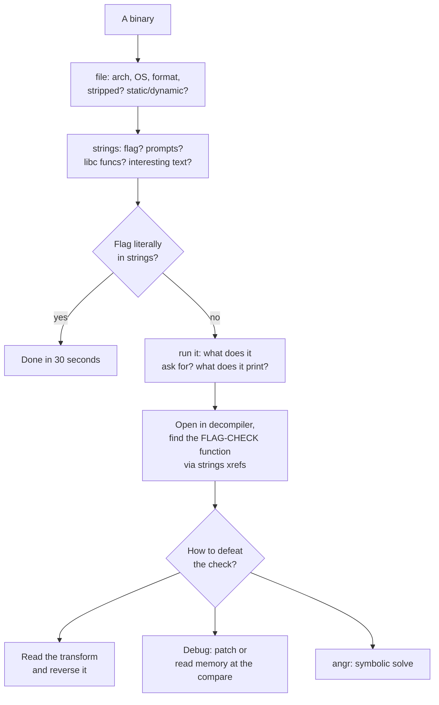
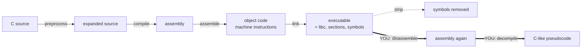
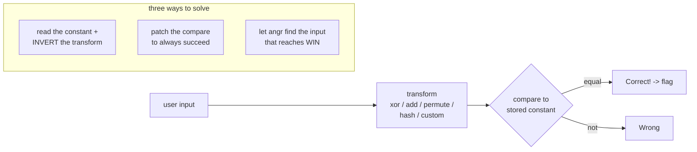
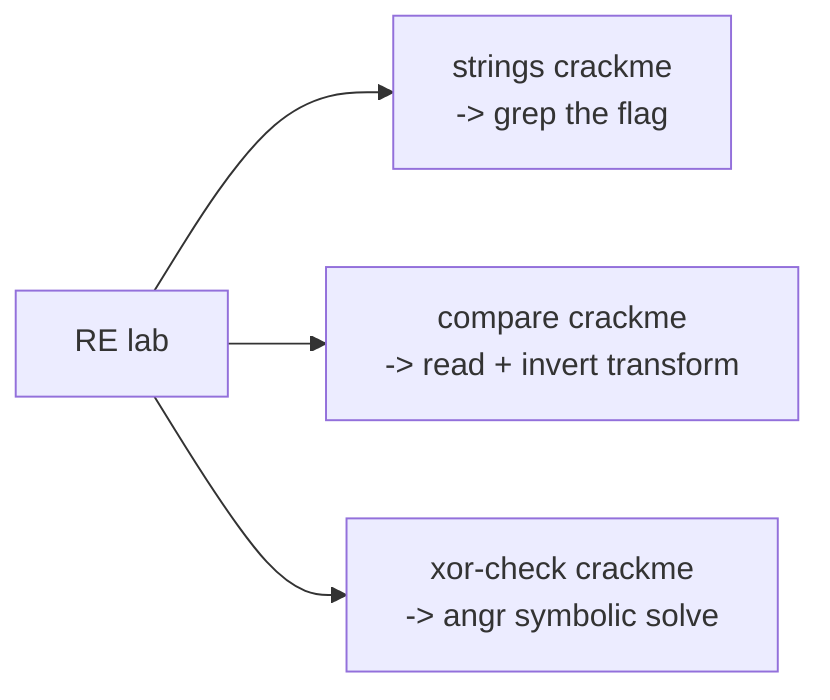

**Level:** Advanced · **Track:** Career · **Read time:** 260 min

Reverse engineering is the category where you are handed a compiled program and asked to understand what it does — well enough to find the flag it is hiding, or to satisfy a check it is guarding. There is no source code. There is a binary: a translated, optimised, symbol-stripped artifact that a compiler produced from source you will never see, and your job is to run the translation backwards in your head far enough to answer one question.

That sounds forbidding, and the steep learning curve is real — reversing and its sibling pwn (Chapter 7) are the two categories where beginners most often stall out. But the intimidation is mostly front-loaded. Once you accept two things, the category becomes tractable: first, that you almost never need to understand the *whole* program — only the part that checks the flag; and second, that modern decompilers turn most of the assembly back into readable C-like pseudocode, so you spend far more time *reading* than *decoding instructions by hand*. The skill is not memorising every x86 opcode. It is triage (finding the part that matters), reading (following the logic of the check), and choosing the right technique to defeat it (read it, reverse the transform, run it under a debugger, or let a symbolic-execution engine solve it for you).

This chapter builds that skill in the order you actually apply it: the mindset and the compilation pipeline (so decompiled output makes sense), static triage (the cheap wins), the assembly subset you genuinely need, decompilers, the canonical crackme patterns, dynamic analysis with a debugger, and finally symbolic execution — which feels like magic the first time it solves a challenge you could not read. Chapter 7 (pwn) builds directly on this; reversing teaches you to *understand* a binary, pwn teaches you to *exploit* one.

## Why This Matters

Reverse engineering is the deepest-transferring skill in the offensive curriculum. A malware analyst (Notebook 35) reverses samples to understand what they do; a vulnerability researcher (Notebook 36) reverses closed-source software to find bugs; an exploit developer reverses a patch to discover what it fixed (n-day development); a firmware and hardware hacker (Notebook 38) reverses embedded code; and a software-protection engineer reverses their own product the way an attacker would. In every one of these, the core motion is identical to CTF reversing: take an opaque binary and reconstruct enough of its behaviour to act on it.

The category also builds a mental model that pays off far beyond reversing itself — an accurate, ground-level understanding of how programs actually execute. Once you have watched a function set up its stack frame, pass arguments in registers, loop by comparing and jumping, and return a value in `rax`, abstractions like "the stack" and "a calling convention" stop being words and become things you have seen. That model is what makes Chapter 7's memory-corruption exploitation comprehensible, what makes Notebook 5's programming concepts concrete, and what lets you reason about performance, crashes, and undefined behaviour in any language that compiles down.

And unlike some categories, reversing has a low tooling barrier now: **Ghidra** is free, government-grade, and does most of the heavy lifting, which means the path from "assembly is terrifying" to "I can read a crackme" is shorter than it has ever been.

## Part 1: The RE Mindset — Triage Before Disassembly

The beginner's instinct is to open the binary in a disassembler and start reading from the entry point. This is almost always wrong, because a real program's `main` is buried under runtime initialisation, and 95% of the code is irrelevant to the flag. The correct instinct is **triage**: cheaply determine what kind of binary this is and where the interesting part lives *before* reading a single instruction.



The triage disciplines:

**Identify before you read.** `file` tells you the architecture (x86-64, ARM, MIPS), the OS/format (ELF, PE, Mach-O), whether it is stripped (symbols removed — harder), and whether it is statically or dynamically linked. Each answer changes your approach.

**Find the check, ignore the rest.** A crackme's flag logic is one function, usually reachable from the string it prints ("Correct!"/"Wrong!"/"Enter the password:"). Cross-reference that string in the decompiler to jump straight to the code that uses it. You do not need to understand `main`'s argument parsing or the printf internals; you need the comparison.

**Run it first (when safe).** In a CTF the binary is almost always safe to run in your VM. Running it tells you what input it wants and what it does with it — information that makes the static analysis far faster. (For *malware*, Notebook 35's isolation rules apply; CTF crackmes are not malware.)

## Part 2: The Compilation Pipeline — Why It Matters

Understanding how source becomes a binary is what makes decompiled output readable, because you are recognising the *shapes* the compiler produces.



The consequences a reverser exploits:

- **The compiler is deterministic and idiomatic.** A `for` loop, a `switch`, a string comparison, a stack buffer — each compiles to a recognisable pattern. Learning those patterns is most of the skill; you are pattern-matching assembly back to source constructs.
- **Optimisation transforms the code.** `-O2` inlines functions, unrolls loops, and reorders instructions, so the assembly may not map cleanly to the source structure. Recognising optimised idioms (a multiply replaced by shifts, a loop replaced by a vectorised block) comes with practice.
- **Stripping removes names, not logic.** A stripped binary has no function or variable names, so you see `FUN_00401234` instead of `check_password`. The logic is intact; you rename as you understand, which is the core of the reversing workflow.
- **Symbols and debug info are gifts.** An unstripped binary, or one with DWARF debug info, hands you function and variable names — always check, because it turns hours into minutes.

## Part 3: Static Triage — The Cheap Wins

Before any disassembly, run the cheap tools. They solve a surprising fraction of beginner challenges outright.

```bash
file chal                      # arch, format, stripped?, static/dynamic
strings -n 6 chal              # readable text
strings chal | grep -i 'flag{' # the 30-second win
rabin2 -zzq chal               # radare2's stronger string extraction
nm chal 2>/dev/null            # symbols, if not stripped
checksec --file=chal           # protections (matters more for pwn)
rabin2 -i chal                 # imported functions -> what libc calls it makes
```

What the output tells you:

- **A flag directly in `strings`** — the easiest possible RE challenge. Always check first.
- **Interesting function imports** — `strcmp`/`memcmp` suggests a direct comparison; `ptrace` suggests anti-debugging (Part 8); crypto function names suggest an encoded flag.
- **Format/version strings** — reveal the language and compiler (a Go binary, a Rust binary, a Nim binary each look very different and need different approaches).
- **Prompts and messages** — "Enter password", "Correct", "Wrong" are the xref anchors for finding the check function.

## Part 4: The Assembly You Actually Need (x86-64)

You do not need to master x86-64. You need a working reading knowledge of a small subset, because the decompiler handles the rest and you drop to assembly only when the decompilation is unclear.

**Registers** (64-bit, with 32-bit `e__` and smaller sub-registers):

```
rax  return value, accumulator          rdi  1st argument
rbx  callee-saved general               rsi  2nd argument
rcx  counter / 4th argument             rdx  3rd argument / return-high
rsp  stack pointer (top of stack)       r8   5th argument
rbp  base/frame pointer                 r9   6th argument
rip  instruction pointer                r10-r15 general
```

**The System V calling convention (Linux)**: integer/pointer arguments go in `rdi, rsi, rdx, rcx, r8, r9` in that order, further ones on the stack; the return value comes back in `rax`. (Windows x64 uses `rcx, rdx, r8, r9` — worth knowing for PE challenges.) Recognising this lets you read a function call's arguments directly.

**The stack** grows *downward* (toward lower addresses). `push` decrements `rsp` and stores; `pop` loads and increments. Local variables live in the current frame, addressed relative to `rbp` or `rsp`. This is the foundation Chapter 7 builds its exploits on.

**The instruction idioms you will see constantly**:

```asm
mov  rax, rbx        ; rax = rbx  (copy)
lea  rax, [rbx+8]    ; rax = rbx+8 (address arithmetic, NOT a load)
add/sub/xor/and/or   ; arithmetic and bitwise
cmp  rax, rbx        ; compute rax-rbx, set flags (does not store)
test rax, rax        ; rax AND rax -> the idiom for "is rax zero/null?"
jmp / je / jne / jg / jl / jle / jge  ; (conditional) jumps on the flags
call func / ret      ; call pushes return address; ret pops it
push / pop           ; stack manipulation
```

Two idioms worth memorising because they appear everywhere: **`test rax, rax` followed by `je`** is "if (x == 0)" — the null/zero check — and **`xor rax, rax`** is the idiomatic "set rax to 0". Recognising these two on sight speeds up reading enormously.

The reading strategy: **read the decompiler's C, drop to assembly only for the lines you do not trust.** You do not translate assembly to C by hand for a whole function — the decompiler already did that. You use assembly to resolve ambiguity when the pseudocode looks wrong (often around optimised arithmetic or type confusion).

## Part 5: Reading Disassembly and Recognising Structure

The compiler turns high-level structures into recognisable control-flow patterns. Learn to see the source through the assembly.

- **`if/else`** — a `cmp`/`test` then a conditional jump around a block.
- **Loops** — a backward jump to an earlier label, with a `cmp` on a counter deciding whether to continue. A loop iterating over a buffer and doing arithmetic on each byte is the single most common crackme shape (Part 6).
- **`switch`** — often a **jump table**: the value indexes into an array of addresses that the code jumps through. The decompiler usually reconstructs this as a `switch`, but recognising a jump table in assembly is useful when it does not.
- **Function calls** — arguments loaded into `rdi`, `rsi`, ... before a `call`, return value used from `rax` after.
- **String/array access** — a base pointer plus a scaled index (`[rbx + rax*4]`) is array indexing; `[rbp - 0x20]` is a local variable.

The decompiler's **cross-reference (xref)** feature is your navigation tool: to find the flag check, find the "Correct!" string and see what references it; to understand a function, see who calls it and with what. Reversing is navigation as much as reading, and following xrefs from an anchor string is the fastest route to the code that matters.

## Part 6: The Canonical Crackme Pattern

An enormous fraction of RE challenges are variations on one pattern: **take the user's input, transform it somehow, and compare the result to a stored constant.** If they match, print "Correct" and the flag; if not, "Wrong."



Three ways to defeat it, in order of elegance:

**Reverse the transform.** If the check is `for each byte: input[i] ^ 0x42 == constant[i]`, then the correct input is `constant[i] ^ 0x42` — read the constant out of the binary and invert the operation. This is the "proper" solve and it teaches the most. Transforms are usually invertible (XOR, add/subtract, byte permutations, simple substitutions) precisely because the author needed a unique valid input.

**Patch the comparison.** If you only need the binary to *say* "Correct" (some challenges print the flag on success), patch the conditional jump — change `jne` (jump if not equal) to `je` or `jmp`, or NOP it out — so the check always passes. This works when the flag is printed *based on* the check rather than *derived from* the input. It does **not** work when the flag is computed *from* your input (then you need the real input).

**Let a solver find the input.** When the transform is complex but the comparison is a clean "input reaches this address = success," symbolic execution (`angr`, Part 9) finds the satisfying input automatically. This is the pragmatic choice for gnarly transforms.

The recognition and decision: read the check first. If the flag is *stored* and gated by a comparison, patching or reading the constant works. If the flag is *derived* from your input, you must recover the real input by reversing the transform or with angr.

## Part 7: Dynamic Analysis — GDB, ltrace, strace

Static reading tells you what the code *should* do; running it under instrumentation tells you what it *actually* does, which is faster when the transform is fiddly.

**GDB with pwndbg or GEF.** The debugger lets you pause execution, inspect registers and memory, and watch the program compute. The killer move for crackmes: **set a breakpoint at the comparison and read the expected value out of memory.** If the code does `memcmp(transformed_input, secret, len)`, break on the `memcmp`, and the `secret` is sitting in a register/memory — you have the answer without reversing the transform at all.

```bash
gdb ./chal
pwndbg> break *0x401234     # the comparison / memcmp call
pwndbg> run
pwndbg> x/20xb $rsi         # dump the 'expected' argument (2nd arg = rsi)
pwndbg> x/s $rdi            # or view it as a string
```

**ltrace** traces **library calls** — you *see* `strcmp("your_input", "the_secret")` with both arguments printed, which for a challenge using a library comparison hands you the secret directly.

**strace** traces **system calls** — useful for understanding I/O, file access, and anti-analysis behaviour (a `ptrace` syscall reveals anti-debugging).

```bash
ltrace ./chal              # library calls with arguments -> strcmp reveals the secret
strace ./chal              # syscalls -> file/network/ptrace behaviour
```

The dynamic-analysis reflex: **before deeply reversing a transform, run it under `ltrace` and set a GDB breakpoint at the compare.** Half the time the secret is revealed as a library-call argument or sits in a register at the comparison, and you never needed to understand the transform at all.

## Part 8: Anti-Debugging and Anti-Analysis

Harder challenges resist your tools, and recognising the tricks is part of the game.

- **`ptrace(PTRACE_TRACEME)`** — a process can only be traced once, so the program traces *itself* to prevent a debugger attaching. Defeat it by patching out the `ptrace` call (NOP it) or making it return success under the debugger.
- **Timing checks** — the program measures how long a section takes; a debugger's single-stepping is slow, so a large elapsed time reveals analysis. Defeat by patching the check or not single-stepping through it.
- **Debugger/environment detection** — checking for `/proc/self/status` `TracerPid`, breakpoint bytes (`0xCC`), or known debugger artifacts. Patch the check.
- **Obfuscation** — control-flow flattening, opaque predicates, junk instructions, and self-modifying code make the disassembly hard to read. Dynamic analysis (watching what actually executes) often cuts through obfuscation that defeats static reading.
- **Packing** — the real code is compressed/encrypted and unpacked at runtime (Part 11).

The general principle: **anti-debugging protects against *static* or *naive dynamic* analysis, but the code still has to execute correctly eventually.** Let it run (patched past the checks) and observe the real behaviour, or dump the unpacked/deobfuscated code from memory once it has revealed itself.

## Part 9: Symbolic Execution with angr

Symbolic execution is the technique that makes reversing feel like cheating, and it is the pragmatic answer to "the transform is too complex to reverse by hand." **angr** (a Python framework) executes the binary with *symbolic* inputs — variables rather than concrete bytes — and tracks the constraints each branch imposes. To solve "what input makes the program print the flag," you tell angr the address of the success path and the address(es) to avoid, and it uses a constraint solver (Z3) to compute an input that reaches success.

```python
# solve.py -- angr finds the input that reaches the "Correct!" path.
import angr, claripy

proj = angr.Project("./chal", auto_load_libs=False)

# Symbolic input of known length.
flag_len = 20
flag = claripy.BVS("flag", flag_len * 8)

state = proj.factory.full_init_state(stdin=flag)
# Constrain to printable bytes -- huge speedup, avoids nonsense solutions.
for byte in flag.chop(8):
    state.solver.add(byte >= 0x20, byte <= 0x7e)

simgr = proj.factory.simulation_manager(state)
# find = address (or output text) of the success path; avoid = failure path.
simgr.explore(find=lambda s: b"Correct" in s.posix.dumps(1),
              avoid=lambda s: b"Wrong"  in s.posix.dumps(1))

if simgr.found:
    print("[+] input:", simgr.found[0].solver.eval(flag, cast_to=bytes))
else:
    print("[-] no solution found")
```

When angr shines and when it does not:

- **Shines**: input-matching crackmes with a clean success/failure branch and a bounded input — exactly the Part 6 pattern with an ugly transform. Constrain the input (length, printable) to keep the state space small.
- **Struggles**: heavy loops over large inputs (state explosion), complex library calls, hashing (a good hash has no exploitable structure for the solver), and anything requiring the solver to invert real cryptography. When angr hangs, it is usually state explosion — narrow the constraints, or hook/skip the expensive functions.

angr is not a substitute for understanding — it is a power tool for the cases where manual reversing is disproportionately slow. Learn to reverse a transform by hand first (so you understand what angr is doing), then reach for angr when the transform does not merit the manual effort.

## Part 10: Other Architectures, Languages, and Formats

Not every RE challenge is a stripped C ELF on x86-64.

- **Windows PE / .NET.** Native PE reverses like ELF (different calling convention, `x64dbg` as the go-to debugger). **.NET** (C#) compiles to CIL bytecode that decompiles almost perfectly back to C# with **dnSpy** or **ILSpy** — a .NET challenge is often trivial to read.
- **Java** — bytecode decompiles cleanly with `jd-gui`/`procyon`/CFR; usually very readable.
- **Android** — APKs are ZIP archives; `jadx` decompiles the Dalvik bytecode to readable Java, and the flag is often in the decompiled logic or the resources.
- **Python** — a compiled `.pyc` decompiles with `decompyle3`/`uncompyle6`; a PyInstaller executable unpacks with `pyinstxtractor` back to `.pyc`, then decompile. Python challenges are usually easy once unpacked.
- **Go / Rust / Nim** — statically linked, large, and awkward: symbols may be mangled, the runtime is huge, and standard signatures help less. Go binaries have recoverable function names in a symbol table; tools like `redress`/`GoReSym` help. These are genuinely harder and worth recognising early (the `file` output and the giant `strings` list are the tell).

The recognition step matters: **identify the language/format first** (`file`, `strings`, the section names), because a .NET or Python or Java challenge that would take hours to reverse as if it were C decompiles almost perfectly with the right tool in minutes.

## Part 11: Packing and Unpacking

A **packed** binary has its real code compressed or encrypted, with a small *stub* that unpacks it into memory at runtime and then jumps to it. The tell: a tiny `strings` output (the real strings are hidden until unpacked), high entropy, few imports, and section names like `UPX0`.

- **UPX** — the common CTF packer, and it unpacks with `upx -d`.
- **Custom/manual packers** — the general technique is **dump from memory**: run the binary under a debugger, let the stub unpack the real code, break at the "jump to unpacked code" moment (the original entry point), and dump the now-decrypted code from memory for static analysis. This "unpack by letting it unpack itself, then snapshot" approach works against packers with no automated unpacker.

Recognising packing early saves you from trying to statically reverse a stub that contains no useful logic. If `strings` is nearly empty and entropy is high, suspect packing before you suspect a hard challenge.

## Part 12: Hands-On Lab — Triage and Solve Three Crackmes

### 12.1 What we are building

Three crackmes we compile ourselves, each solved a different way: a **strings win** (Part 3), a **comparison crackme** solved by reading the transform (Part 6), and an **XOR-check crackme** solved with **angr** (Part 9).



You need `gcc`, `strings`, `gdb` (with pwndbg ideally), and `angr` (`pip install angr`).

### 12.2 Crackme 1 — the flag is in the strings

```bash
mkdir -p ~/re-lab && cd ~/re-lab
cat > c1.c <<'EOF'
#include <stdio.h>
#include <string.h>
int main() {
    char *secret = "flag{str1ngs_g1ve_1t_away}";   // compiled straight into .rodata
    char buf[64];
    printf("Password: ");
    if (!fgets(buf, sizeof buf, stdin)) return 1;
    buf[strcspn(buf, "\n")] = 0;
    if (strcmp(buf, secret) == 0) puts("Correct!");
    else puts("Wrong.");
    return 0;
}
EOF
gcc -o c1 c1.c
echo "built c1"

# Solve: the string literal survives compilation into the binary.
strings c1 | grep -i 'flag{'

# Sample output:
# built c1
# flag{str1ngs_g1ve_1t_away}
```

Thirty seconds, no disassembly. The first thing you run on every RE challenge, and it wins outright more often than beginners expect.

### 12.3 Crackme 2 — read and invert the transform

```bash
cat > c2.c <<'EOF'
#include <stdio.h>
#include <string.h>
int main() {
    // The stored constant is the flag XORed byte-by-byte with 0x2a.
    unsigned char enc[] = {0x4c,0x42,0x4b,0x4d,0x51,0x1b,0x58,0x4a,0x5b,
                           0x18,0x59,0x44,0x18,0x5e,0x42,0x5f,0x57,0x57};
    char buf[64];
    printf("Key: ");
    if (!fgets(buf, sizeof buf, stdin)) return 1;
    buf[strcspn(buf, "\n")] = 0;
    if (strlen(buf) != sizeof enc) { puts("Wrong."); return 0; }
    for (size_t i = 0; i < sizeof enc; i++)
        if ((unsigned char)(buf[i] ^ 0x2a) != enc[i]) { puts("Wrong."); return 0; }
    puts("Correct!");
    return 0;
}
EOF
gcc -o c2 c2.c
echo "built c2"

# Sample output:
# built c2
```

Open `c2` in Ghidra: the decompiler shows a loop XORing each input byte with `0x2a` and comparing to an array. That is the Part 6 pattern — **invert it**: the correct input is `enc[i] ^ 0x2a`.

```python
# solve_c2.py -- invert the XOR transform read out of the decompiler.
enc = [0x4c,0x42,0x4b,0x4d,0x51,0x1b,0x58,0x4a,0x5b,
       0x18,0x59,0x44,0x18,0x5e,0x42,0x5f,0x57,0x57]
print("".join(chr(b ^ 0x2a) for b in enc))
```

```bash
python3 solve_c2.py

# Sample output:
# flag{x0r_1s_weak}

# Verify against the real binary.
echo 'flag{x0r_1s_weak}' | ./c2

# Sample output:
# Key: Correct!
```

Reading the constant out of the binary and inverting the transform is the proper solve — and note the alternative: a GDB breakpoint at the comparison loop would let you read `enc` straight from memory without reversing anything (Part 7).

### 12.4 Crackme 3 — let angr solve it

```bash
cat > c3.c <<'EOF'
#include <stdio.h>
#include <string.h>
int main() {
    // A messier per-byte transform: (b + i) ^ (i*7 & 0xff), compared to target.
    unsigned char target[] = {0x66,0x6d,0x62,0x71,0x81,0x38,0x77,0x83,0x6d,0x4c};
    char buf[32];
    if (!fgets(buf, sizeof buf, stdin)) return 1;
    buf[strcspn(buf, "\n")] = 0;
    if (strlen(buf) != 10) { puts("Wrong"); return 0; }
    for (int i = 0; i < 10; i++) {
        unsigned char t = ((unsigned char)buf[i] + i) ^ ((i * 7) & 0xff);
        if (t != target[i]) { puts("Wrong"); return 0; }
    }
    puts("Correct");
    return 0;
}
EOF
gcc -o c3 c3.c
echo "built c3"

# Sample output:
# built c3
```

You *could* reverse this by hand (it is invertible), but it is exactly the case where angr is faster than working out the algebra:

```python
# solve_c3.py -- angr finds the 10-byte input reaching "Correct".
import angr, claripy

proj = angr.Project("./c3", auto_load_libs=False)
inp = claripy.BVS("inp", 10 * 8)
state = proj.factory.full_init_state(stdin=inp)
for b in inp.chop(8):
    state.solver.add(b >= 0x20, b <= 0x7e)   # printable -> tame the search

simgr = proj.factory.simulation_manager(state)
simgr.explore(find=lambda s: b"Correct" in s.posix.dumps(1),
              avoid=lambda s: b"Wrong"  in s.posix.dumps(1))

if simgr.found:
    print("[+] input:", simgr.found[0].solver.eval(inp, cast_to=bytes).decode())
else:
    print("[-] no solution")
```

```bash
pip install angr > /dev/null 2>&1
python3 solve_c3.py

# Sample output:
# [+] input: r3v_m4st3r

# Confirm against the binary.
echo 'r3v_m4st3r' | ./c3

# Sample output:
# Correct
```

angr recovered the exact 10-byte input from nothing but the binary and the knowledge that "Correct" is the goal — no hand-algebra required. That is the tool's sweet spot: an input-matching check with a bounded, constrained input.

### 12.5 Extending the lab

Strip `c2` (`strip c2`) and re-solve it in Ghidra with no symbols, renaming functions as you understand them; set a GDB breakpoint at `c2`'s comparison and read the target array straight from memory (Part 7), confirming it matches what you inverted; add a `ptrace(PTRACE_TRACEME)` anti-debug call to `c3` and patch it out; compile `c3` with `-O2` and observe how the optimiser reshapes the loop; pack `c1` with `upx` and recover it with `upx -d`; and write a full triage-to-solution writeup for each in the Chapter 1 Part 9 format, including which technique you chose and why.

## Part 13: Tooling

| Tool | Role |
|---|---|
| **file / strings / rabin2** | Triage — always first |
| **Ghidra** | The free decompiler workhorse — most challenges start and end here |
| **IDA Free / Pro** | Industry standard decompiler; Pro's Hex-Rays is excellent, Free is capable |
| **Binary Ninja** | Modern, scriptable, strong intermediate languages |
| **gdb + pwndbg / GEF** | Dynamic analysis, breakpoints, memory inspection, patching |
| **ltrace / strace** | Library and syscall tracing — reveals `strcmp` arguments |
| **angr** | Symbolic execution — auto-solves input-matching crackmes |
| **x64dbg** | The Windows dynamic-analysis standard |
| **dnSpy / ILSpy** | .NET decompilation (near-perfect) |
| **jadx** | Android APK decompilation |
| **uncompyle6 / pyinstxtractor** | Python bytecode and PyInstaller unpacking |
| **upx** | Unpack UPX-packed binaries |

The workflow spine: **triage (`file`/`strings`) → decompile (Ghidra) → read the check → decide (invert / debug / angr).** Ghidra plus gdb+pwndbg plus angr covers the overwhelming majority of CTF reversing, and all three are free.

## Part 14: Common Pitfalls

**Reading from the entry point instead of triaging.** Find the check function via the anchor string's xrefs; ignore the runtime init and 95% of the code that does not matter.

**Not running `strings` first.** The flag is in the strings more often than pride wants to admit. Thirty seconds, every time.

**Trying to translate assembly to C by hand.** The decompiler already did it. Read the pseudocode; drop to assembly only for lines you distrust.

**Ignoring the language/format.** A .NET, Java, Python, or Android challenge decompiles almost perfectly with the right tool. Identify the format before reversing it as if it were C.

**Reversing a transform you could have read from memory.** A GDB breakpoint at the comparison, or `ltrace`, often hands you the secret directly. Try dynamic analysis before grinding through static algebra.

**Patching the compare when the flag is derived from input.** Patching works only when the flag is *stored* and *gated* by the check. If the flag is *computed from* your input, you must recover the real input.

**Fighting anti-debugging statically.** Recognise it, patch it out (or run past it), then observe real behaviour. Dynamic analysis cuts through obfuscation that defeats static reading.

**Missing packing.** Near-empty `strings` and high entropy mean packed. Unpack (`upx -d` or dump-from-memory) before trying to read the stub.

**Reaching for angr on everything.** angr is a power tool for ugly input-matching transforms, not a substitute for understanding. It struggles with heavy loops, hashing, and crypto, and it teaches you nothing if you never learn to reverse by hand.

**Not renaming as you go.** In a stripped binary, rename functions and variables in the decompiler as you understand them. A `FUN_00401234` you have renamed to `check_flag` is the difference between comprehensible and hopeless.

## Final Revision / Summary

- Reversing is reading a compiled program's behaviour without source. The intimidation is front-loaded: you rarely need the whole program (only the **flag-check**), and modern **decompilers** turn most assembly back into readable pseudocode, so you spend more time reading than decoding instructions.
- **Triage before disassembly**: `file` (arch/format/stripped/linkage) → `strings` (flag? prompts? imports?) → run it → open the decompiler and jump to the check via the anchor string's **xrefs**. Ignore the 95% of code that does not matter.
- Understanding the **compilation pipeline** makes decompiled output readable — you pattern-match assembly idioms back to source constructs. Stripping removes names not logic; **rename as you understand**. Symbols/debug info are gifts — always check.
- **Static triage cheap wins**: flag in `strings`, revealing imports (`strcmp`/`memcmp`/`ptrace`/crypto), and prompts that anchor the xref search.
- You need a **small x86-64 subset**: the argument registers (`rdi, rsi, rdx, rcx, r8, r9`), `rax` for return, the downward-growing stack, and the idioms (`test rax,rax; je` = null check, `xor rax,rax` = zero). Read the decompiler's C; drop to assembly only when it looks wrong.
- Recognise **control-flow structure**: conditional jumps (if), backward jumps (loops), jump tables (switch), argument-loading before `call`. Navigate by **xrefs** from anchor strings.
- **The canonical crackme**: transform input, compare to a constant. Defeat it three ways — **invert the transform** (proper, teaches most), **patch the compare** (only when the flag is *stored* and gated, not derived), or **angr** (ugly transforms). Read the check first to decide which applies.
- **Dynamic analysis** is often faster than static reversing: a **GDB breakpoint at the compare** reveals the expected value in memory; **`ltrace`** prints `strcmp` arguments (the secret) directly; **`strace`** shows syscalls and anti-analysis.
- **Anti-debugging** (`ptrace` self-trace, timing, debugger detection, obfuscation, packing) protects against static/naive analysis — recognise it, patch past it, and observe real behaviour.
- **angr** symbolically executes to find the input reaching success; constrain input (length, printable) to tame state explosion. It shines on bounded input-matching checks and struggles with heavy loops, hashing, and crypto.
- **Identify the language/format first**: .NET (dnSpy), Java (jd-gui/jadx), Android (jadx), Python (uncompyle6/pyinstxtractor) all decompile near-perfectly; Go/Rust/Nim are genuinely harder. **Packing** (tiny `strings`, high entropy) unpacks with `upx -d` or dump-from-memory.
- The free spine — **Ghidra + gdb/pwndbg + angr** — covers almost all CTF reversing.

## Cheat Sheet / Quick Reference

**Triage (always, in order)**

```bash
file chal                         # arch, format, stripped?, static/dynamic
strings chal | grep -i 'flag{'    # the 30-second win
rabin2 -zzq chal ; rabin2 -i chal # strings + imports
checksec --file=chal              # protections
# then: Ghidra -> find "Correct"/"Wrong" string -> xref -> the check
```

**x86-64 essentials**

```
args: rdi rsi rdx rcx r8 r9      return: rax      stack grows DOWN
test rax,rax + je   == if(x==0)   xor rax,rax == x=0
lea = address arithmetic (not a load)   cmp/test set flags, don't store
```

**Crackme decision**

```
flag STORED, gated by a compare  -> patch jne->je, OR read constant from mem
flag DERIVED from input          -> invert the transform, OR use angr
transform ugly but bounded input -> angr
```

**Dynamic analysis first-moves**

```bash
ltrace ./chal                     # prints strcmp("input","SECRET")
gdb ./chal
  break *0xADDR    run            # at the comparison
  x/20xb $rsi   x/s $rdi          # read the 'expected' argument
strace ./chal                     # syscalls, ptrace anti-debug
```

**angr skeleton**

```python
proj=angr.Project("./c",auto_load_libs=False)
f=claripy.BVS("f",N*8); st=proj.factory.full_init_state(stdin=f)
for b in f.chop(8): st.solver.add(b>=0x20,b<=0x7e)
sm=proj.factory.simulation_manager(st)
sm.explore(find=lambda s:b"Correct" in s.posix.dumps(1),
           avoid=lambda s:b"Wrong" in s.posix.dumps(1))
print(sm.found[0].solver.eval(f,cast_to=bytes))
```

**Format -> tool**

```
ELF/PE native -> Ghidra/IDA + gdb/x64dbg
.NET          -> dnSpy / ILSpy        Java -> jd-gui / jadx
Android APK   -> jadx                 Python -> uncompyle6 / pyinstxtractor
packed (UPX)  -> upx -d ; custom -> dump from memory at OEP
```

## Practice Labs & Resources

**Start here**
- **crackmes.one** — a graded archive of crackmes at every difficulty; the single best place to build the core skill.
- **picoCTF Reverse Engineering** — gentle, well-scaffolded introductions to strings, decompilation, and the crackme pattern.
- **pwn.college (Reverse Engineering module)** — Arizona State's structured curriculum; exceptional and free.

**Tool fluency**
- Work through a **Ghidra** tutorial end to end (the official course materials are free), and learn its rename/xref/decompile workflow until it is reflex.
- Set up **gdb + pwndbg** and practise breaking at comparisons to read secrets from memory.
- Install **angr** and solve five input-matching crackmes with it, then re-solve two of them *by hand* to understand what angr did.

**Hands-on**
- Extend the lab: strip and re-solve, add and defeat anti-debugging, compile with `-O2` and read the optimised output, pack and unpack.
- Reverse a small **.NET** and a small **Android** challenge to feel how much easier the right decompiler makes them.
- Take one CTF reversing challenge you could not solve, read the writeup, and reproduce the solve yourself in your own tools.

**Deliberate practice**
- Build the idiom-recognition library: for ten crackmes, name the source construct (loop/switch/if) behind each assembly pattern before the decompiler tells you.
- Force yourself to reverse transforms *by hand* before using angr, so you understand the mechanism the tool automates.
- Keep a triage checklist and run it top-to-bottom on every binary rather than diving into the disassembly.

**Further reading**
- *Practical Reverse Engineering* (Dang, Gazet, Bachaalany) and *Practical Malware Analysis* (Sikorski & Honig) — the reference texts; the latter bridges directly to Notebook 35.
- Notebook 36 (vulnerability research & binary exploitation) and Chapter 7 of this notebook (pwn) — where reversing becomes exploitation.
- The angr documentation and example repository — reading how others script angr is the fastest way to learn its edges.

---

*Also on [Praneeth's portfolio](https://ping-praneeth.vercel.app/notebook/ctf-wargames/06-reverse-engineering-ctf-challenges), with comments and the latest edits.*
