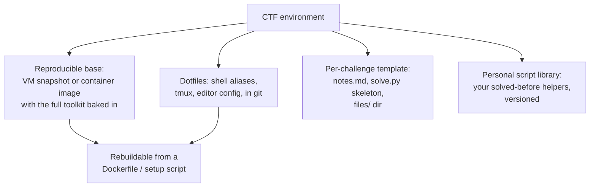
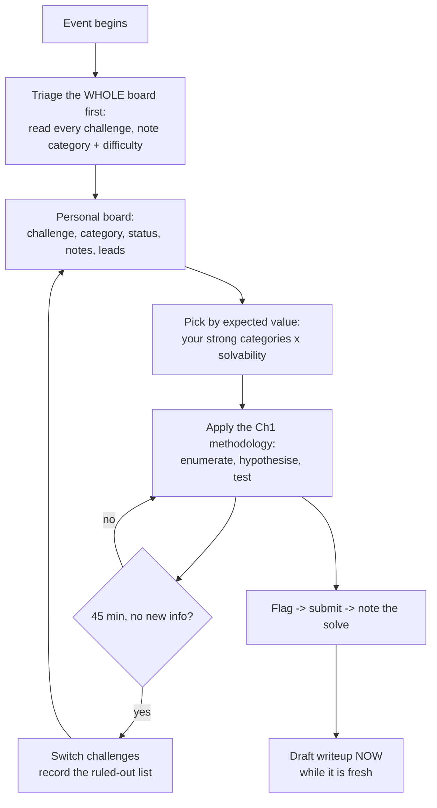
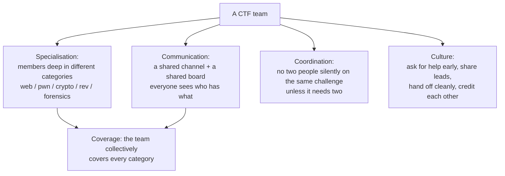
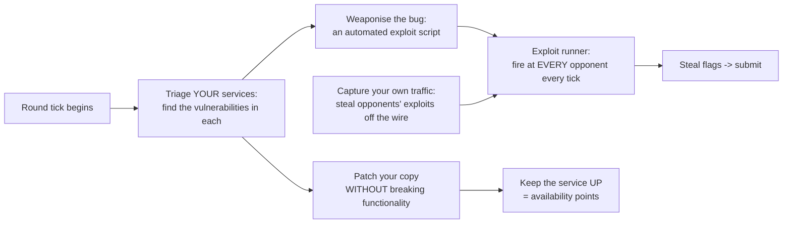
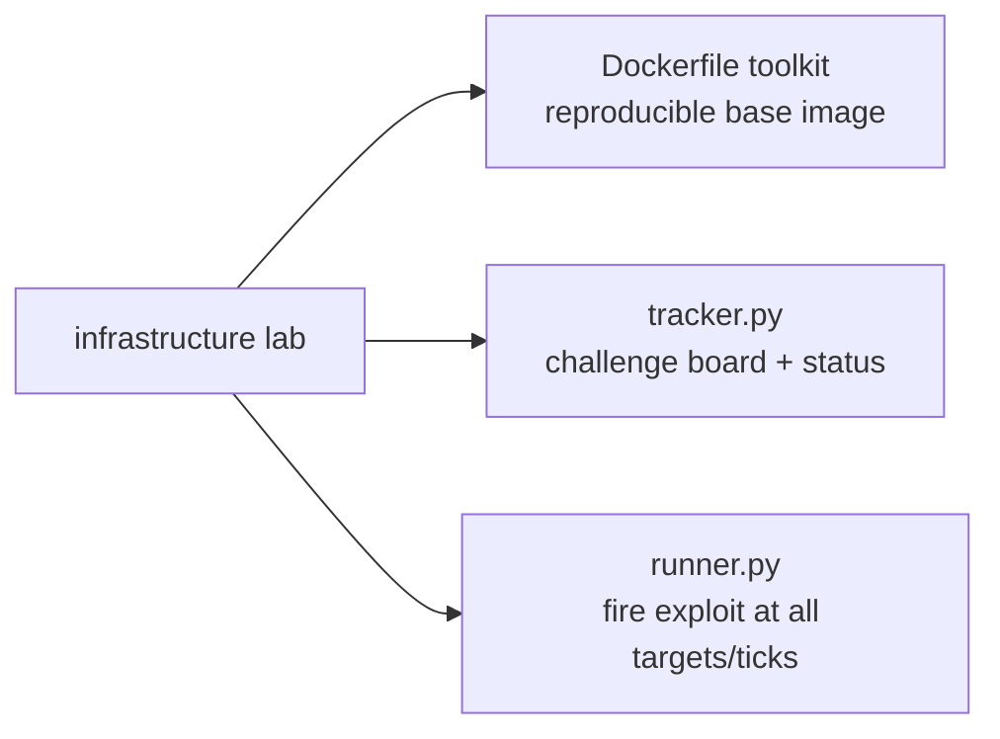

**Level:** Advanced · **Track:** Career · **Read time:** 260 min

The previous seven chapters taught you how to solve challenges. This one is about everything *around* solving — the infrastructure, habits, and team dynamics that turn a person who can solve challenges into someone who reliably places well and keeps improving. The gap between those two is larger than beginners expect. A player with strong technical skills but no workflow loses hours to environment friction, forgets what they already ruled out, works the wrong challenges under decay scoring, and burns out. A player with slightly weaker skills but a sharp workflow — a ready toolkit, a triage routine, disciplined notes, and a team that communicates — consistently out-performs them.

So this is the systems chapter. It treats your CTF practice the way an engineer treats a production system: your environment is *infrastructure* that should be reproducible, your solving process is a *workflow* that should be repeatable, your notes are a *pipeline* that feeds your portfolio, and your team is an *organisation* with roles and communication. The specific tricks matter less here than the meta-skill: building a personal system that compounds, so that each event makes you measurably better at the next one rather than being a fresh scramble every time.

It also covers the two things the earlier chapters could not: **team play**, which is how serious CTF is actually done and a completely different skill from solo solving, and the **career translation** — how a body of CTF work becomes the portfolio, the interview material, and the demonstrated competence that opens the professional doors Notebook 44 is about. This is the chapter that connects the whole notebook to the rest of your career.

## Why This Matters

Everything in the first seven chapters is a technical skill; this chapter is about *leverage* on those skills. The same knowledge produces wildly different results depending on the system around it, and the difference is entirely learnable — it is process, not talent.

The professional transfer here is arguably stronger than the technical categories, because the skills are the ones that separate a good individual contributor from someone who ships: reproducible environments (the infrastructure-as-code discipline of Notebook 37 and modern DevOps), disciplined note-taking and documentation (the reporting muscle every security role needs, Notebook 9), working effectively on a team under time pressure with clear communication (the single most cited soft skill in security hiring), and sustainable pace over a long career (the thing that prevents the burnout that ends so many promising ones). A hiring manager who sees a candidate with a maintained CTFtime profile, a body of clear writeups, and a track record of team play is seeing exactly the traits they cannot teach on the job.

And there is a compounding argument. A CTF player without a system starts near-zero every event; a player with a system carries forward a toolkit, a script library, a notes archive, and a set of learned patterns, so their effective skill *accumulates*. Over a year, the systematic player pulls decisively ahead not because they learned faster in any single event, but because nothing leaked away between events. This chapter is about building that non-leaking system.

## Part 1: The Environment as Infrastructure

Your environment is the substrate everything runs on, and environment friction is the single largest hidden time sink in CTF. The goal is a setup you can **reproduce in minutes**, that is **the same every time**, and that you **never fight during an event**.



The components:

**A reproducible toolkit.** Bake the tools from every previous chapter into a **container image or a VM snapshot** built from a script — not a machine you hand-installed once and pray never breaks. When it breaks (and it will, mid-event, at the worst time), you rebuild from the Dockerfile in two minutes instead of losing the night. This is infrastructure-as-code applied to your own workstation, and it is the same discipline Notebook 37 teaches for cloud.

**Dotfiles in git.** Your shell aliases, tmux config, editor setup, and gdb/pwndbg config live in a versioned dotfiles repo, so a fresh machine becomes *your* machine with one clone. The muscle memory you build (aliases, keybindings) then works everywhere.

**A per-challenge directory template.** Every challenge gets the same structure: a `notes.md` from a template, a `solve.py` skeleton with pwntools/requests boilerplate, and a `files/` directory for the artifact. Scripting this (`newchal <name>`) removes the friction of starting, which is when procrastination and disorganisation creep in.

**A personal script library.** The helpers you have written before — a base64-layer peeler, a single-byte XOR breaker, a pwntools leak template, a flag-format grep — versioned and reused. This is the accumulation that makes the systematic player pull ahead: you solve the *class* of problem once and carry the solution forward.

The test of a good environment: you can sit at a fresh machine and be fully operational — every tool, every alias, every template — within the time it takes to clone two repos and build one image.

## Part 2: The Personal Solving Workflow

Chapter 1 gave the per-challenge methodology; this is the *meta*-workflow across a whole event — how you decide what to work on and how you move through the board.



The disciplines that matter across an event:

**Triage the whole board before solving anything.** Read every challenge first. You cannot allocate your time well without knowing what is on offer, and the challenges you are best suited for are not always the ones at the top. This is the "first fifteen minutes" habit (Part 5) applied solo.

**Work by expected value, not by position.** Under decay scoring (Chapter 1), your score is set by the hardest thing you solve. Pick challenges at the intersection of *your strong categories* and *solvable-for-you difficulty*, not just whatever is listed first or worth the most nominal points.

**Keep a personal board.** Every challenge, its category, your status (untouched/in-progress/stuck/solved), your notes, and open leads. This is your working memory across a multi-hour event where you will context-switch constantly.

**Time-box ruthlessly and record what you ruled out.** The 45-minute rule from Chapter 1, plus: when you switch away from a challenge, write down what you eliminated and why, so returning later (or handing off to a teammate) is not starting over.

**Draft the writeup while it is fresh.** The moment you solve, jot the key insight and the working payload. Reconstructing it days later is far harder and lower-fidelity, and the writeup is your portfolio (Part 4).

## Part 3: The Script Library and the Ethics of Automation

Reusable automation is where a workflow compounds, and it comes with a responsibility.

**Build a personal library of understood helpers.** Not black boxes copied from the internet, but tools you wrote and understand: the recurring transforms (encoding peelers, XOR breakers), the boilerplate (a pwntools skeleton, a `requests` session with your usual headers), and the utilities (a flag-grep across a directory tree, a cyclic-offset helper). Versioned, documented, and reused each event. The value is not just speed — it is that you never re-derive a solved problem, so your effective capability accumulates.

**Automate the repetitive, understand the fundamental.** Automate the mechanical (peeling ten encoding layers, brute-forcing 256 XOR keys, spraying a payload across gadget offsets). Do *not* automate away the understanding — a solver you cannot explain teaches you nothing and fails the moment the challenge varies (the Chapter 6 warning about angr, generalised). The rule: automate what you already understand; understand what you are about to automate.

**The ethics of automation, restated.** Two lines from earlier chapters apply with force to scripted tooling:

- **Respect the CTF's rules on brute force and rate.** Automated tools make it trivial to hammer a service, and hammering is usually forbidden and always antisocial — it degrades the event for everyone and can crash the organisers' infrastructure. Rate-limit your own scripts; a scan that a challenge did not ask for is noise at best and a rule violation at worst.
- **Never point your automation outside the scope.** The scanner, the fuzzer, the credential-sprayer you built for a challenge target *the challenge*, and nothing else. The scope boundary (Chapter 1, Notebook 8) is what makes the tooling lawful; automation makes it easy to cross that line without noticing, so the discipline has to be deliberate.

The general principle: a script library is a force multiplier, and a force multiplier applied outside its authorised scope multiplies harm. Build the library, and keep it pointed where it belongs.

## Part 4: Notes and the Writeup Pipeline

Chapter 1 argued writeups are the highest-value habit; this is the *pipeline* that makes them happen without friction.

**Notes during the event feed the writeup after it.** If your per-challenge `notes.md` records what you tried, what you observed, the key insight, and the working payload *as you go*, the writeup is mostly assembled by the time you finish. The failure mode is solving in a flurry, submitting, and moving on — then facing a blank page days later with only shell history to reconstruct from.

**A consistent writeup structure** (from Chapter 1, Part 9): challenge → given → recon → the insight → exploit → flag → what I learned → **dead ends**. The dead-ends section is what makes a writeup teach rather than just document, and it is written directly from your ruled-out list.

**Publish on a schedule and build the archive.** After each event (once the organisers permit — Chapter 1's rules), clean up the drafts and publish. Over time this archive *is* your portfolio: a public, dated, searchable body of work demonstrating exactly the process and communication skills employers cannot infer from a certificate (Part 12).

**Write up failures too.** The single highest-improvement habit: for challenges you did *not* solve, read the official writeup, understand it, and write your own account of where your reasoning diverged. This is where the biggest single skill jumps come from, and almost nobody does it — which is precisely why doing it is such an edge.

## Part 5: Team Formation and How a CTF Team Works

Serious CTF is a team sport, and team play is a genuinely different skill from solo solving — one closer to how professional security work actually happens.



How an effective team works:

**Specialise, but overlap.** A strong team has members who go *deep* in different categories, so the team collectively covers web, pwn, crypto, rev, forensics, and OSINT — no single person can be excellent at all of them (Chapter 1's warning against specialising *too early* applies to individuals building foundations, not to a team dividing labour). But overlap matters: at least two people comfortable in each area, so no category is blocked when one person is stuck or offline.

**Communicate constantly and visibly.** The team's shared channel and shared board mean everyone can see, at a glance, which challenges are claimed, in progress, stuck, or solved. The single biggest team inefficiency is two people silently grinding the same challenge while another goes untouched.

**Coordinate claims.** A player claims a challenge on the board before diving in; a challenge that needs two people (a hard chain, a pwn that needs a second pair of eyes) is explicitly paired. This prevents both duplication and neglect.

**Build a culture of early help and clean handoffs.** The teams that win ask for help *early* rather than grinding alone for six hours, share partial leads (a leaked address, a half-decoded blob) freely, and hand off a stuck challenge with a complete ruled-out list so the next person does not start over. Ego — refusing to hand off, hoarding a solve — is the most expensive thing on a team.

## Part 6: Live-Event Operations

The mechanics of running an event well, as an individual and a team.

**The first fifteen minutes are triage, not solving.** Read the *entire* board, classify every challenge by category and rough difficulty, and — as a team — distribute challenges to the right people. Strong teams treat the opening as reconnaissance; weak teams start at challenge one and never see the board. First-blood bonuses (Chapter 1) reward this triage directly.

**Assign by strength, then by coverage.** Route each challenge to the person best suited, but ensure every category has someone on it. A challenge nobody claims is a challenge nobody solves.

**Maintain a shared knowledge board.** A running document of what has been discovered — the libc version in use, the flag format quirks, a recon result that applies to multiple challenges, a decoding that unlocked a chain. Discoveries in one challenge frequently apply to others, and a shared board is how that knowledge propagates instead of being re-derived.

**Hand off cleanly.** When passing a challenge (stuck, or going offline), hand over the artifact, the notes, the ruled-out list, and the current hypothesis. A good handoff loses almost no progress; a bad one restarts the challenge.

**Play the end-game deliberately.** In the closing hours under decay scoring: focus on the challenges that will move the score most (the hardest solvable ones, not another floor-value easy), avoid starting something you cannot finish in time, and make sure every *solved* flag is actually submitted. A common, painful loss is a solved challenge whose flag was never entered because of a coordination gap.

## Part 7: Collaboration Infrastructure

The tooling that makes team play work.

**A shared challenge tracker.** Whether a purpose-built tool (CTFNote, the community's standard), a shared spreadsheet, or a bot in your chat, the team needs one authoritative view of every challenge: name, category, points, assignee, status, and a link to notes. This is the single most important piece of team infrastructure, and its absence is why unstructured teams underperform their raw skill.

**Chat conventions.** A channel per category (or per challenge for the big ones), a clear convention for claiming and releasing challenges, and a norm of posting leads and partial results as you find them. The convention matters more than the platform.

**Flag submission discipline.** Decide *who* submits and *how* — a common approach is a bot or a single coordinator, so that a solved flag is never lost and never double-submitted, and so first-blood timing is not fumbled. Every solved challenge should have an unambiguous path from "I have the flag" to "it is on the scoreboard."

**A shared, ephemeral compute box** (Part 9) for challenges that need more than a laptop, with a norm for how it is shared so people are not clobbering each other's processes.

## Part 8: Attack-Defense — A Different Discipline

Attack-defense (Chapter 1) is a distinct competitive discipline with its own operational demands, and it is where team infrastructure matters most.



The distinct skills:

**Service triage under time pressure.** You are handed several vulnerable services and must find their bugs *fast*, because every tick you are unpatched is flags lost to opponents. This is speed reversing and speed web/pwn (all the earlier chapters), compressed.

**Patch without breaking.** The hardest discipline: fix the vulnerability while keeping the service *functional*, because a broken service loses **availability points** — and Chapter 1's warning stands, teams routinely lose more to their own over-aggressive patches than to opponents. Test every patch against the service's checker before deploying it.

**Automate the exploit across all opponents, every tick.** A working exploit is worthless if fired once by hand. Wrap it in a runner that hits *every* opponent's copy of the service *every* tick, submitting the stolen flags automatically. The exploit-runner (Part 11's lab) is the core piece of attack-defense infrastructure.

**Steal exploits off the wire.** Capture the traffic hitting your own services — opponents are exploiting you, and their exploits are visible in that traffic. Replaying a captured exploit against everyone else is one of the highest-value moves in attack-defense, turning an attack on you into points for you.

**The tick loop.** Everything runs on the round timer: patch what is unpatched, run exploits against everyone, check what is being used against you, keep services up. It is an operations discipline as much as a hacking one — the team that automates the loop beats the team with better individual exploits fired by hand.

## Part 9: Remote, Infrastructure, and Shared Compute

Some challenges and formats need more than a laptop.

**Cloud and infrastructure challenges** (Notebook 37) hand you cloud credentials or a target environment and ask for cloud-native escalation. These need the cloud tooling and often a place to run it from; a disposable cloud VM you can spin up and tear down is the right substrate, and the infrastructure-as-code discipline from Part 1 applies.

**A shared team compute box** handles challenges that need real resources — a long hash crack, an angr solve that eats RAM, a distributed brute force within the rules. Provision it ahead of the event, agree on how it is shared, and treat it as ephemeral (built from a script, destroyed after).

**Keep remote resources ephemeral and scoped.** Anything you spin up in the cloud for a CTF is built from a script, used for the event, and destroyed — both for cost and because a forgotten, exposed CTF box is its own security problem. And, restating the scope discipline: cloud tooling pointed at a CTF target stays pointed there; the same credentials and scanners are computer-misuse crimes anywhere else.

## Part 10: Sustainability and the Long Game

CTF burns people out, and the players who have long, productive relationships with the game are the ones who manage pace deliberately.

**CTF is a marathon of sprints.** A 48-hour event is genuinely intense, and doing them back-to-back-to-back without recovery leads to the classic pattern: a burst of enthusiasm, rapid improvement, and then a hard stop where the person walks away entirely. Sustainable players pick their events, rest between them, and treat the game as a years-long practice rather than a thing to max out this month.

**Protect the fundamentals.** Sleep, food, and breaks during long events are not optional indulgences — a rested player at hour 30 out-performs an exhausted one at hour 20. On a team, this means rotating who is "on," so nobody grinds the entire 48 hours.

**Match intensity to your life.** CTF should add to your life, not consume it. The healthiest relationship is one where the game is a source of learning and enjoyment you can sustain alongside work, study, and everything else — not a compulsion that costs you those things. A player who does one event a month for five years learns vastly more than one who does ten events in two months and quits.

**Guard against the comparison trap.** There will always be players and teams far ahead of you, and the scoreboard makes the gap visible in real time. Measuring yourself against the top teams is a reliable route to discouragement; measuring yourself against *your own* past performance (Part 11) is where motivation actually comes from.

## Part 11: Measuring Improvement

What gets measured improves, and a light-touch personal metrics habit turns scattered practice into visible progress.

**Track your own trajectory, not the leaderboard.** Useful personal metrics: challenges solved per event, categories you solved in (breadth), the hardest challenge you cracked (depth, which matters most under decay scoring), and — the highest-signal one — the number of previously-failed challenge *types* you can now solve. Your CTFtime profile provides some of this automatically; a personal log fills the rest.

**Run a retrospective after each event.** A short, honest review: what went well, what you got stuck on and why, which tool or technique you wished you had ready, and one concrete thing to prepare before next time. This is the same retro discipline that improves engineering teams, applied to your own practice, and it is what converts experience into improvement rather than mere accumulation.

**Feed the retro back into the system.** The output of a retro is action: a script to add to your library, a tool to install in your base image, a technique to drill, a category to shore up. This closes the loop — each event improves the system that runs the next event, which is the compounding advantage this whole chapter is built around.

## Part 12: From CTF to Career

This is where the notebook connects to the next one. CTF experience, properly captured, is career capital.

**The CTFtime profile is portfolio evidence.** A real history — events played, placements, a team affiliation — is concrete proof of engagement and skill that a certificate cannot provide. It shows sustained practice against genuine problems.

**Writeups are the deepest signal.** A body of clear, well-structured writeups (Part 4) demonstrates exactly what employers most want and can least assess from a resume: technical depth, a real methodology, communication, and persistence. For someone without professional experience, a writeup archive is the single most effective technical portfolio there is (Notebook 44, Chapter 3 builds directly on this).

**CTF experience is interview material.** "Walk me through a hard problem you solved" is a standard interview question, and a well-remembered CTF chain — the reasoning, the dead ends, the insight — is an excellent answer. The habit of writing up your solves means you *have* these stories ready, in detail, rather than half-remembered.

**But translate honestly.** Restating Chapter 1's caveat one last time: CTF trains recognition, chaining, and technical depth, but it does not train the parts of real work that involve ruling things out, operating without noise, and delivering findings in a report to a stakeholder. Present CTF as what it is — evidence of strong technical fundamentals and a demonstrated ability to learn hard things — and pair it with the boot2root machines, home lab, and real reports (Notebook 44) that cover what CTF does not. The candidate who says "CTF taught me to break things fast; here is how I learned to do it carefully and communicate it" is far more compelling than one who presents a CTF record as proof of job-readiness.

## Part 13: Hands-On Lab — Toolkit, Tracker, and an Exploit Runner

### 13.1 What we are building

Three pieces of personal/team infrastructure: a **containerised toolkit** (Part 1), a **challenge tracker** (Parts 2, 7), and an **attack-defense exploit runner** (Part 8).



You need Docker and Python 3.

### 13.2 A reproducible toolkit image

```bash
mkdir -p ~/ctf-infra && cd ~/ctf-infra
cat > Dockerfile <<'EOF'
FROM debian:stable-slim
# Bake the cross-category toolkit into a rebuildable image (Part 1).
RUN apt-get update && apt-get install -y --no-install-recommends \
      python3 python3-pip git curl file binutils xxd binwalk \
      exiftool steghide netcat-openbsd nmap gdb \
    && rm -rf /var/lib/apt/lists/*
RUN pip3 install --break-system-packages --no-cache-dir \
      pwntools requests pycryptodome
# Per-challenge template baked in, so `newchal` is instant.
RUN printf '#!/bin/sh\nmkdir -p "$1/files"\n\
printf "# %s\\n\\n## given\\n## recon\\n## insight\\n## exploit\\n## flag\\n## dead ends\\n" "$1" > "$1/notes.md"\n\
printf "from pwn import *\\n# p = process(\\"./chal\\")\\n" > "$1/solve.py"\n\
echo "created $1"\n' "$1" > /usr/local/bin/newchal && chmod +x /usr/local/bin/newchal
WORKDIR /ctf
EOF

docker build -t ctf-toolkit . 2>&1 | tail -2

# Sample output:
# Successfully tagged ctf-toolkit:latest
```

```bash
# Operational in one command, identical every time.
docker run --rm -it -v "$PWD/work:/ctf" ctf-toolkit newchal web-login

# Sample output:
# created web-login
```

The whole toolkit now rebuilds from this file in minutes — when it breaks mid-event, you are not reinstalling by hand.

### 13.3 A challenge tracker

```python
# tracker.py -- the team's authoritative challenge board (Parts 2, 7).
import json, sys, os
from datetime import datetime

DB = "board.json"
STATUSES = ["todo", "wip", "stuck", "solved"]

def load(): return json.load(open(DB)) if os.path.exists(DB) else []
def save(b): json.dump(b, open(DB, "w"), indent=1)

def add(name, category, points):
    b = load()
    b.append({"name": name, "category": category, "points": int(points),
              "status": "todo", "who": "", "note": "",
              "updated": datetime.now().strftime("%H:%M")})
    save(b); print(f"+ {name} ({category}, {points})")

def claim(name, who):
    b = load()
    for c in b:
        if c["name"] == name:
            c["status"], c["who"] = "wip", who
            c["updated"] = datetime.now().strftime("%H:%M")
    save(b); print(f"{who} -> {name}")

def status(name, st, note=""):
    b = load()
    for c in b:
        if c["name"] == name:
            c["status"] = st
            if note: c["note"] = note
            c["updated"] = datetime.now().strftime("%H:%M")
    save(b); print(f"{name}: {st}")

def board():
    b = sorted(load(), key=lambda c: (STATUSES.index(c["status"]), -c["points"]))
    print(f"\n{'STATUS':<7} {'CHALLENGE':<16} {'CAT':<10} {'PTS':>4} {'WHO':<8} NOTE")
    print("-" * 72)
    for c in b:
        print(f"{c['status']:<7} {c['name']:<16} {c['category']:<10} "
              f"{c['points']:>4} {c['who']:<8} {c['note'][:24]}")
    solved = sum(c["points"] for c in b if c["status"] == "solved")
    print("-" * 72)
    print(f"{len(b)} challenges | {solved} points banked | "
          f"{sum(1 for c in b if c['status']=='stuck')} stuck (need help)")

if __name__ == "__main__":
    cmd, *args = sys.argv[1:] or ["board"]
    {"add": add, "claim": claim, "status": status, "board": board}[cmd](*args)
```

```bash
python3 tracker.py add sqli-login web 300
python3 tracker.py add rsa-baby crypto 200
python3 tracker.py add pwn-ret2win pwn 250
python3 tracker.py claim sqli-login asha
python3 tracker.py status sqli-login solved "admin\'-- bypass then UNION"
python3 tracker.py claim pwn-ret2win ravi
python3 tracker.py status pwn-ret2win stuck "offset off by 8?"
python3 tracker.py board

# Sample output:
# ...
# STATUS  CHALLENGE        CAT        PTS  WHO      NOTE
# ------------------------------------------------------------------------
# stuck   pwn-ret2win      pwn        250  ravi     offset off by 8?
# todo    rsa-baby         crypto     200           
# solved  sqli-login       web        300  asha     admin'-- bypass then UNION
# ------------------------------------------------------------------------
# 3 challenges | 300 points banked | 1 stuck (need help)
```

The board shows, at a glance, what is banked, what is unclaimed, and — crucially — what is **stuck and needs a second person** (Part 5's early-help culture, made visible).

### 13.4 An attack-defense exploit runner

```python
# runner.py -- fire one exploit at EVERY opponent, EVERY tick (Part 8).
import socket, time, re, sys

# In a real game these come from the game server's team list + flag regex.
TARGETS = ["10.0.1.2", "10.0.1.3", "10.0.1.4"]   # opponents' service hosts
PORT, TICK, FLAG_RE = 9999, 15, re.compile(rb"flag\{[^}]+\}")

def exploit(host):
    """The weaponised bug: send the payload, scrape any flag from the reply.
       (Here: a stand-in that reads whatever the service returns.)"""
    try:
        s = socket.create_connection((host, PORT), timeout=3)
        s.sendall(b"GET_SECRET\n")                # <- your real exploit payload
        data = s.recv(4096); s.close()
        m = FLAG_RE.search(data)
        return m.group().decode() if m else None
    except OSError:
        return None

def submit(flag):
    """Real games POST to a submission endpoint; here we just log it."""
    print(f"    [submit] {flag}")

def tick_round(n):
    got = 0
    print(f"[tick {n}] firing at {len(TARGETS)} targets")
    for host in TARGETS:
        flag = exploit(host)
        if flag:
            got += 1; print(f"  [+] {host} -> {flag}"); submit(flag)
        else:
            print(f"  [-] {host} (patched or down)")
    print(f"[tick {n}] {got}/{len(TARGETS)} flags this round")

if __name__ == "__main__":
    ticks = int(sys.argv[1]) if len(sys.argv) > 1 else 2
    for n in range(1, ticks + 1):
        tick_round(n)
        if n < ticks: time.sleep(min(TICK, 1))   # shortened for the demo
```

```bash
# With no live services, every target is "down" -- but the LOOP is the point.
python3 runner.py 2

# Sample output:
# [tick 1] firing at 3 targets
#   [-] 10.0.1.2 (patched or down)
#   [-] 10.0.1.3 (patched or down)
#   [-] 10.0.1.4 (patched or down)
# [tick 1] 0/3 flags this round
# [tick 2] firing at 3 targets
#   [-] 10.0.1.2 (patched or down)
#   [-] 10.0.1.3 (patched or down)
#   [-] 10.0.1.4 (patched or down)
# [tick 2] 0/3 flags this round
```

The exploit itself is a stand-in, but the **structure is the lesson**: one bug, wrapped in a loop that hits every opponent every tick and auto-submits. In a real game you swap `exploit()` for your weaponised payload and `submit()` for the game's endpoint — the runner is the infrastructure that turns a working exploit into sustained points.

### 13.5 Extending the lab

Add a `patch-check.sh` that runs the service's functionality checker before and after a patch so you never deploy a fix that breaks availability (Part 8); extend `runner.py` to *also* sniff your own inbound traffic and replay captured opponent exploits (the highest-value attack-defense move); wire `tracker.py` into a chat webhook so status changes post to the team channel automatically (Part 7); turn the Dockerfile into a `docker-compose` that also brings up a shared CTFd for practice; and write a personal-metrics logger that appends per-event solve counts and your hardest solve, then charts your trajectory (Part 11).

## Part 14: Common Pitfalls

**No reproducible environment.** Hand-installed tooling that breaks mid-event and costs you the night. Bake it into an image built from a script.

**Starting challenges without triaging the board.** You cannot allocate time well without seeing what is on offer. Read everything first.

**Working by nominal points instead of expected value.** Under decay scoring, your score is the hardest thing you solve. Pick at the intersection of your strengths and solvability.

**Solving without notes, writing up later from memory.** The writeup is half the value and it evaporates fast. Capture the insight and payload as you solve.

**Never writing up failures.** The biggest single improvement habit, and the most neglected. Read the writeup for what you missed and reconstruct it yourself.

**Ego on a team.** Refusing to hand off, hoarding a solve, grinding alone for six hours instead of asking for help early. The most expensive thing on a team.

**No shared tracker.** Two people silently on the same challenge while others go untouched. The single biggest team inefficiency, entirely fixable with a board.

**Fumbling flag submission.** A solved challenge whose flag never reached the scoreboard because nobody owned submission. Decide who submits, up front.

**Over-patching in attack-defense.** Breaking your own service's functionality and losing availability points. Test every patch against the checker first.

**Automation pointed outside scope.** A force multiplier applied where it is not authorised multiplies harm. Rate-limit your scripts and keep them on the target the challenge gave you.

**Burning out.** Back-to-back 48-hour events with no recovery. Pace for years, not for this month. Sleep during long events; rotate who is on.

**Comparing yourself to the top teams.** A reliable route to discouragement. Measure against your own past performance instead.

## Final Revision / Summary

- This is the **systems** chapter: your environment is *infrastructure*, your solving process a *workflow*, your notes a *pipeline*, your team an *organisation*. The meta-skill is building a personal system that **compounds**, so each event makes you better at the next rather than starting fresh.
- **Environment as infrastructure**: a reproducible toolkit (container/VM built from a script — rebuildable in minutes when it breaks), dotfiles in git, a per-challenge directory template, and a personal script library. The accumulation is the systematic player's decisive edge.
- **Personal workflow across an event**: triage the *whole board* first, work by **expected value** (your strengths × solvability, not nominal points) under decay scoring, keep a personal board, time-box at 45 minutes recording the ruled-out list, and draft the writeup while it is fresh.
- **Script library**: build *understood* helpers you reuse, automate the mechanical, understand the fundamental. **Ethics**: respect brute-force/rate rules and never point automation outside the challenge's scope — a force multiplier off-scope multiplies harm.
- **Notes → writeup pipeline**: notes during feed the writeup after; use the consistent structure (given → recon → insight → exploit → flag → **dead ends**); publish on a schedule to build the portfolio; and **write up failures** — the highest-improvement, most-neglected habit.
- **Teams** are a different skill: **specialise but overlap** (cover every category, two-deep), communicate constantly and visibly, coordinate claims (no silent duplication), and build a culture of **early help and clean handoffs**. Ego is the most expensive thing on a team.
- **Live-event ops**: the first fifteen minutes are triage not solving; assign by strength then coverage; maintain a **shared knowledge board** (discoveries propagate); hand off cleanly (artifact + notes + ruled-out + hypothesis); and play the end-game for score-moving solves while ensuring every flag is actually submitted.
- **Collaboration infrastructure**: a **shared tracker** (the most important team tool — its absence is why unstructured teams underperform their skill), chat conventions, and **flag-submission discipline** (one owner, never lost or double-submitted).
- **Attack-defense** is a distinct operations discipline: fast service triage, **patch without breaking** (over-patching loses availability points), **automate the exploit across every opponent every tick**, and **steal exploits off your own traffic**. The team that automates the tick loop beats the one with better hand-fired exploits.
- **Sustainability**: CTF is a marathon of sprints — pick events, rest between them, protect sleep/food/breaks, rotate who is on, and measure against **your own past**, not the top teams, to avoid burnout and the comparison trap.
- **Measure improvement**: track your trajectory (solves, breadth, hardest solve, newly-solvable types), run a **retrospective** after each event, and feed its output back into the system (a script, a tool, a drill) — closing the compounding loop.
- **CTF → career**: the CTFtime profile is portfolio evidence, writeups are the deepest signal, and remembered chains are interview material — but **translate honestly**: CTF proves strong fundamentals and an ability to learn hard things, paired with boot2root, a home lab, and real reports (Notebook 44) for what CTF does not train.

## Cheat Sheet / Quick Reference

**Environment (build once, reuse forever)**

```
reproducible toolkit image (Dockerfile)   dotfiles in git
newchal <name> -> notes.md + solve.py + files/
personal script library, versioned + understood
test: operational at a fresh machine in ~2 clones + 1 build
```

**Event workflow**

```
1. triage the WHOLE board (first 15 min, don't solve yet)
2. work by EXPECTED VALUE = your strengths x solvability
3. keep a personal board (status + notes + leads)
4. 45-min time-box; record what you ruled out
5. draft the writeup the moment you solve
```

**Team roles + comms**

```
specialise but overlap (every category two-deep)
shared TRACKER = the #1 team tool  (name/cat/pts/who/status)
claim before diving; post leads as you find them
ask for help EARLY; hand off with artifact+notes+ruled-out+hypothesis
one owner for flag submission
```

**Live-event ops**

```
first 15 min = triage + assign
shared knowledge board (libc version, flag quirks, shared recon)
end-game: score-moving solves only; submit EVERY solved flag
```

**Attack-defense tick loop**

```
triage services -> patch WITHOUT breaking (test vs checker)
-> weaponise -> runner fires at ALL opponents EVERY tick -> auto-submit
-> sniff your own traffic -> replay opponents' exploits
availability points: a broken patch costs more than an opponent
```

**Automation ethics**

```
automate the mechanical, understand the fundamental
rate-limit your scripts (brute force is usually forbidden)
NEVER point tooling outside the challenge's scope
```

**Sustainability + growth**

```
marathon of sprints: pick events, rest, protect sleep, rotate who's on
measure vs YOUR past, not the top teams
retro after each event -> feed one improvement back into the system
```

**Career translation**

```
CTFtime profile = portfolio evidence
writeups = deepest signal (depth + method + communication)
remembered chains = interview answers
translate HONESTLY: fundamentals + ability to learn, paired with
  boot2root + home lab + real reports (Notebook 44)
```

## Practice Labs & Resources

**Build your system**
- Set up a **reproducible toolkit** (Dockerfile or a provisioning script for a VM) with every tool from Chapters 1–7 baked in, plus a `newchal` template and a dotfiles repo. Rebuild it from scratch once to prove it works.
- Start a **personal script library** repo and add one understood helper after every event.
- Adopt a **writeup pipeline**: a notes template used during events, and a publishing habit (a static site or a GitHub repo) after them.

**Team practice**
- Join or form a team on **CTFtime** and play recurring events together with a shared **tracker** (try **CTFNote**, the community standard) and agreed chat conventions.
- Run one event with explicit roles and a shared knowledge board; retro afterward on where coordination helped or hurt.
- Practise **attack-defense** on a platform that runs it (FAUST CTF, ENOWARS, or a local iCTF-style setup) to feel how different the discipline is.

**Hands-on**
- Extend the lab: a patch-checker, a traffic-replay exploit runner, a chat-webhook tracker, and a personal-metrics logger with a trajectory chart.
- Automate your own repetitive moves (encoding peeler, XOR breaker, pwntools leak skeleton) into the library and reuse them next event.

**Deliberate practice**
- Run a real **retrospective** after your next three events and turn each into one concrete system improvement.
- Track your personal metrics (solves, breadth, hardest solve) across a season and look at the trajectory rather than any single placement.
- Write up **two failed** challenges per event, reconstructing the intended solve from the official writeup.

**Further reading**
- Notebook 44 (career mastery) — the direct continuation: turning this notebook's writeups, CTFtime profile, and demonstrated skills into a portfolio, a resume, and interview performance.
- Notebook 9 (reporting) — the professional version of the writeup discipline, and the skill CTF does not otherwise train.
- Notebook 37 (cloud) for the cloud-challenge and ephemeral-compute tooling, and Chapter 1 of this notebook for the methodology this workflow scales up.
- Top teams' published writeup repositories (PPP, Dragon Sector, and others on CTFtime) — read not just for the solutions but for how organised, well-communicated work looks.

---

*Also on [Praneeth's portfolio](https://ping-praneeth.vercel.app/notebook/ctf-wargames/08-building-a-ctf-workflow-toolkit-and-team-strategy), with comments and the latest edits.*
