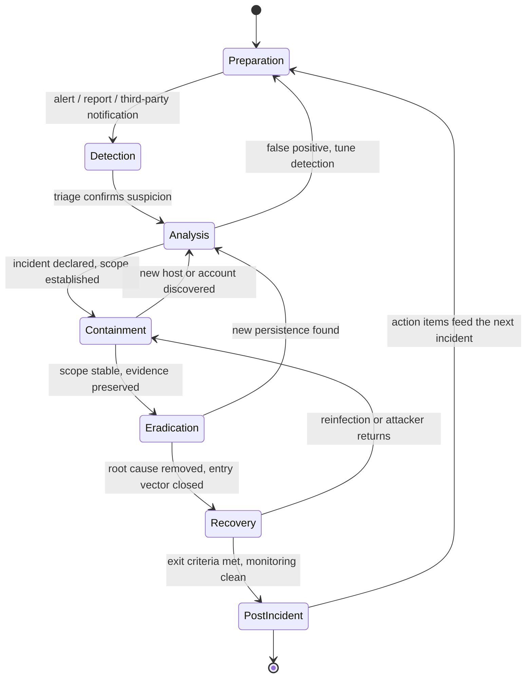
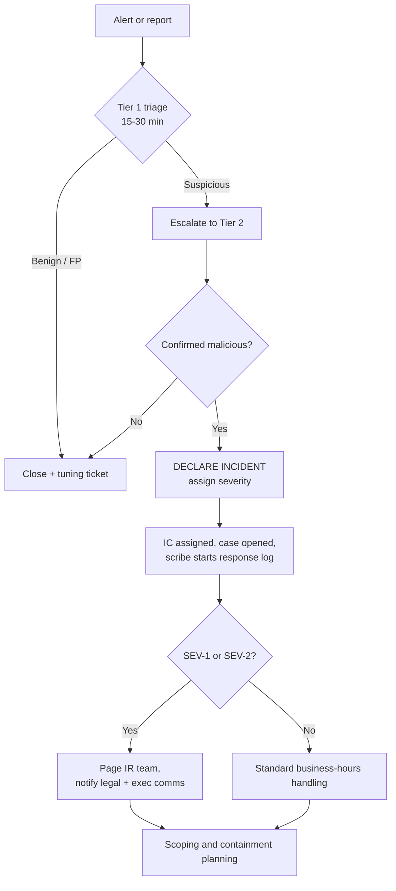
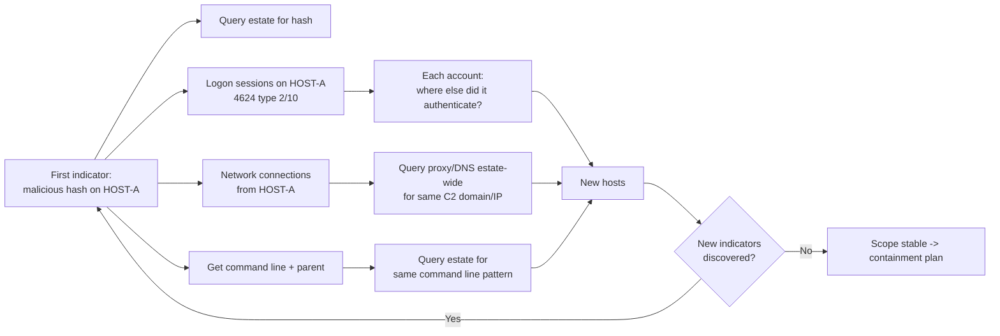
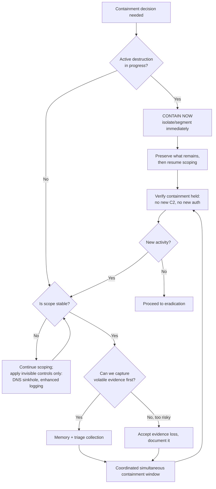
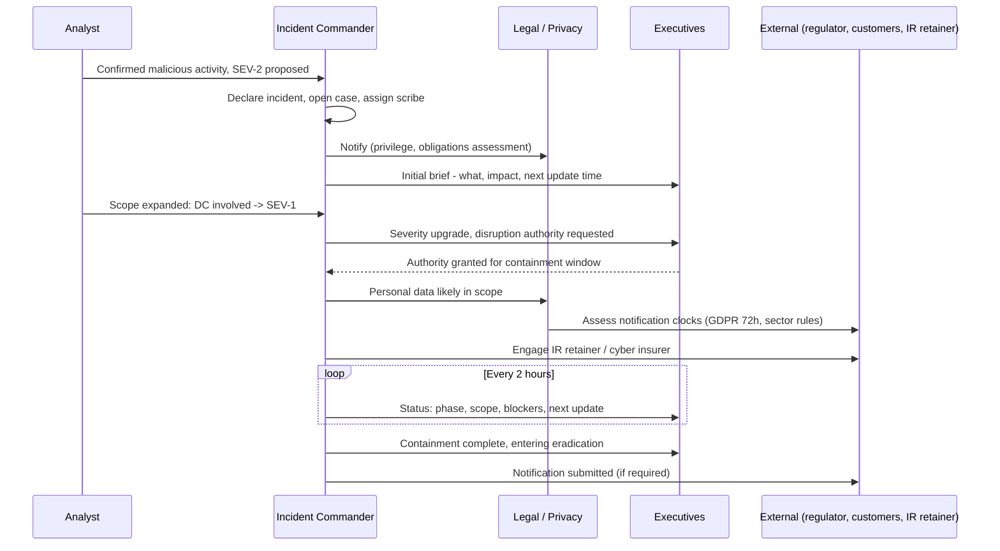

**Level:** Intermediate · **Track:** DFIR & Incident Response · **Read time:** 210 min

This is Chapter 1 of the DFIR notebook. The Detection Engineering notebook ended with you building a lab and proving what your detections actually catch; this notebook starts one second after a detection fires for real and asks the only question that matters at that moment — *what do we do now, in what order, and who decides?*

Incident response is the discipline that turns an alert into a resolved, documented, understood event. It is the least glamorous and most consequential skill in defensive security, because every other control you have ever built exists to feed it. This chapter teaches the lifecycle end to end: the vocabulary and severity model, the two frameworks everyone quotes (and the third nobody reads), the preparation that silently determines your outcome months before the incident, and then each phase — detection and analysis, containment, eradication, recovery, and post-incident activity — with the decisions, commands, and tradeoffs that live inside them.

Everything offensive in this chapter is described so you can respond to it. The lab is built from log data and a lab domain you own. Never run containment or eradication actions against systems you are not authorised to administer — in IR, an unauthorised "helpful" action is itself an incident.

---

## Why This Phase Model Exists At All

Ask ten people who have run a real incident what went wrong and you will get roughly the same list, none of which is technical:

- Nobody knew who was allowed to pull a production server off the network.
- The logs that would have answered the scoping question had a 7-day retention and the intrusion was 40 days old.
- Three people independently ran `net user /domain` against the compromised DC and one of them logged in with a Domain Admin account, handing the attacker a fresh credential.
- The CEO learned about the breach from a journalist.
- Everything was contained beautifully and then the same phishing kit landed again eleven days later because nobody removed the mail rule.

The lifecycle model exists to make each of those a *step someone owns* rather than a thing you hope somebody remembers at 2 a.m. It is not a bureaucratic overhead — it is the compressed experience of thousands of incidents where skipping a step cost money. The phases are also deliberately *ordered*, and the ordering encodes a hard-won lesson: **you cannot eradicate what you have not scoped, and you cannot scope what you have not preserved.** Almost every catastrophic response failure is a phase executed out of order — usually eradication (reimaging, resetting, blocking) performed before analysis, destroying the evidence needed to find the other nine boxes.

A second reason to internalise the model: **it is the shared language between technical responders and everyone else.** When you tell an executive "we are in containment, moving to eradication tonight, recovery starts when the exit criteria in the plan are met", you have communicated status, next action, and a decision gate in one sentence. That is worth more in a crisis than any tool.

**Red team relevance:** the same lifecycle is what a red team is trying to survive. An operator who understands that containment is gated on scoping knows that the way to survive containment is to be *out of scope* — separate infrastructure, separate credentials, separate persistence on a host the responders have no reason to look at. Purple-team exercises that only test detection and never test the *response* miss this entirely.

---

## Part 1: Vocabulary — Event, Alert, Incident, Breach

Precision here is not pedantry. Regulatory clocks, escalation paths, and legal privilege all attach to specific words, and using the wrong one in writing during an incident has consequences.

| Term | Definition | Volume (typical mid-size org/day) | Who touches it |
|---|---|---|---|
| **Event** | Any observable occurrence in a system or network. A login, a process start, a DNS query. Neutral — most events are benign. | 10^7 – 10^9 | Nobody directly; ingested by SIEM |
| **Alert** | An event or correlation of events that matched a detection rule and was surfaced for human attention. | 10^2 – 10^3 | Tier 1 analyst (triage) |
| **Incident** | A confirmed or strongly suspected violation, or imminent threat of violation, of security policy, acceptable use, or standard security practices. | 10^0 – 10^1 | IR team, formally declared |
| **Breach** | An incident with **confirmed** unauthorised acquisition, access, use, or disclosure of protected data. A legal term, not a technical one. | rare | Legal, privacy, executive |
| **Crisis** | An incident whose business impact exceeds the IR team's authority to manage alone (material outage, extortion, regulator/press involvement). | rarer | Crisis management team |

Three rules that follow from this table:

1. **Only a designated role declares an incident.** Usually the on-call Incident Commander or the SOC shift lead. Declaration is the event that starts the clock, opens the case, and authorises spend and disruption.
2. **Never write "breach" in a chat message or ticket unless legal has confirmed it.** Write "suspected unauthorised access to X, under investigation". The word "breach" in an internal Slack message has been quoted in litigation and in regulatory findings more than once. This is not about hiding anything; it is about not asserting a legal conclusion you are not qualified or positioned to make.
3. **An incident does not require a successful attack.** A blocked, contained attempt against a critical asset can still be declared an incident because it warrants investigation and formal record-keeping.

### The severity matrix

Severity drives everything downstream: who gets paged, what SLAs apply, whether you are allowed to disrupt production. Define it *before* you need it, on two axes — impact and urgency/scope.

| Severity | Definition | Examples | Response |
|---|---|---|---|
| **SEV-1 / Critical** | Confirmed compromise of crown-jewel systems or data; active, spreading attack; material business outage | Domain controller compromise, ransomware encryption in progress, confirmed exfiltration of regulated data, prod-wide outage from attack | Immediate page, IC assigned, exec bridge opened, 24/7 until contained |
| **SEV-2 / High** | Confirmed compromise of a non-critical system, or credible threat to a critical one | Single workstation with hands-on-keyboard activity, valid admin credential in a public paste, successful phish with token theft | Page during business hours + on-call after; IC assigned |
| **SEV-3 / Medium** | Contained or limited-impact confirmed activity | Commodity malware auto-quarantined by EDR, single user phished with no successful auth, policy violation | Ticket, next business day, standard analyst |
| **SEV-4 / Low** | Suspicious but unconfirmed, or purely informational | Blocked scan from the internet, spam campaign, false positive tuning candidate | Ticket, best effort |

**Practical note:** severity is *revisable*, and both directions are normal. A large fraction of SEV-1s start as a SEV-3 workstation alert that turned out to have a service account logon underneath it. Build the re-severity step explicitly into your triage flow so people are not embarrassed to escalate — the failure mode you must design against is an analyst who sits on something for three hours because raising it "felt dramatic".

---

## Part 2: The Frameworks — NIST SP 800-61, SANS PICERL, and ISO/IEC 27035

You will be asked about these in interviews and audits. There are two you must know cold and one you should recognise.

**NIST SP 800-61 Rev. 2** ("Computer Security Incident Handling Guide") uses **four** phases, deliberately drawn as a cycle with a feedback loop:

1. Preparation
2. Detection & Analysis
3. Containment, Eradication & Recovery
4. Post-Incident Activity

**SANS** uses **six** phases, the famous **PICERL** mnemonic: **P**reparation, **I**dentification, **C**ontainment, **E**radication, **R**ecovery, **L**essons Learned.

They are the same model. SANS splits NIST's phase 3 into its three constituent activities and renames "Detection & Analysis" to "Identification". The reason NIST fuses containment/eradication/recovery into one phase is subtle and worth understanding: in a real incident these three *interleave*. You contain host A, eradicate on host A, and while recovering host A you discover host B and are back in containment. Treating them as a strict sequence is the single most common misreading of PICERL.

| NIST SP 800-61r2 | SANS PICERL | Core question answered | Primary output |
|---|---|---|---|
| Preparation | Preparation | Are we able to respond at all? | IR plan, playbooks, tooling, telemetry, trained people |
| Detection & Analysis | Identification | What happened, how far does it go, how bad is it? | Scope, timeline, severity, declared incident |
| Containment, Eradication & Recovery | Containment | How do we stop it spreading *right now*? | Isolated/blocked assets, preserved evidence |
| ″ | Eradication | How do we remove the adversary and the way in? | Removed persistence, rotated credentials, patched entry vector |
| ″ | Recovery | How do we return to normal safely and prove it stuck? | Restored service, heightened monitoring, exit criteria met |
| Post-Incident Activity | Lessons Learned | What do we change so this is cheaper next time? | Report, action items with owners, new detections |

**ISO/IEC 27035** (parts 1–3) is the international standard equivalent, structured as Plan & Prepare → Detection & Reporting → Assessment & Decision → Responses → Lessons Learnt. You will meet it in ISO 27001-certified environments where the auditor wants the IR plan mapped to 27035 clauses. Its practical contribution over NIST is the explicit **"Assessment & Decision"** step — a named gate where someone decides *this is an incident and here is its category*, which the other models bury inside analysis.

Two other models you should be able to place, because IR consumes them rather than competes with them:

- **The Cyber Kill Chain** (Lockheed Martin) and **MITRE ATT&CK** describe the *adversary's* process. IR frameworks describe *yours*. During analysis you map observed activity onto ATT&CK techniques; that mapping is what makes your scoping systematic (see Chapter 3 of the SOC notebook and Chapter 5 of the Detection Engineering notebook).
- **The Diamond Model** (adversary, capability, infrastructure, victim) is a pivoting aid: every fact you learn about one vertex suggests a query against another. It is the intellectual engine of scoping.



Note every backward edge in that diagram. Those loops are the real shape of an incident, and a plan that does not anticipate them will be abandoned in hour two.

---

## Part 3: Preparation — The Phase That Decides the Outcome

Preparation is unglamorous, happens on calm days, and accounts for most of the variance in incident outcomes. Two organisations hit by the same intrusion set diverge almost entirely on what they did before the intrusion. Preparation has five workstreams.

### 3.1 The IR plan (short) and the playbooks (specific)

An **IR plan** is a governance document — 10 to 20 pages, approved by leadership, reviewed annually. It answers: what counts as an incident, who declares one, who has authority to disrupt production, how we communicate, when we notify legal/regulators/customers, and how we engage external help. It should be short enough that people actually read it and stable enough that it does not need editing during a crisis.

A **playbook** is an operational document for one incident type — 2 to 6 pages, owned by the SOC, revised constantly. Playbooks you want before you need them:

| Playbook | Trigger | Distinctive first moves |
|---|---|---|
| Phishing / credential harvesting | User report, mail gateway alert | Preserve the message with full headers, hunt for other recipients, check for successful auth + MFA registration + mail rules |
| Business email compromise | Finance query, anomalous mailbox rule | Freeze payment, pull unified audit log, check OAuth app consents, do **not** just reset the password and move on |
| Endpoint malware / commodity | EDR detection | Determine auto-quarantine vs execution, collect triage package, check for lateral movement from that host |
| Ransomware | Encryption events, ransom note, mass file rename | Contain before analysis (rare exception), protect backups first, engage legal/exec immediately |
| Web application compromise | WAF, file integrity, anomalous outbound | Preserve webserver logs before rotation, look for webshells, check the deploy pipeline |
| Insider / data theft | DLP, HR referral | Legal and HR *before* technical action; preserve quietly, do not tip off |
| Cloud identity compromise | Impossible travel, new access key | Revoke sessions/tokens not just password, review IAM changes, check for persistence via roles |
| Domain-level compromise | DC event anomalies, golden ticket indicators | Assume full AD compromise; plan a rebuild path, krbtgt double reset |

Each playbook should contain: entry criteria, the exact queries to run (copy-pasteable, for your SIEM), the evidence to collect, the containment options and who authorises each, the eradication checklist, and exit criteria. Playbooks that say "investigate the alert" are decoration.

### 3.2 Roles — the part people skip

Even a five-person team needs role separation during an incident, because the failure mode is one brilliant engineer holding everything in their head while three executives interrupt them.

| Role | Owns | Explicitly does NOT do |
|---|---|---|
| **Incident Commander (IC)** | Decisions, prioritisation, phase transitions, who does what next | Hands-on-keyboard investigation |
| **Lead Investigator / Forensics** | Technical scoping, timeline, evidence | Talking to executives |
| **Scribe** | The running timeline of *actions taken* and decisions made, with UTC timestamps | Anything else — this is a full-time job |
| **Communications lead** | Internal updates on a schedule, exec briefings, drafting customer/regulator language with legal | Technical calls |
| **Liaison** | External parties: IR retainer firm, law enforcement, cyber insurer, cloud provider | — |

The IC role is the one to get right. The IC is **not** the most technical person — it is the person best at running a decision process under pressure, and they should be free of keyboard duties. A rotating IC roster with a written handover template is how 24-hour incidents stay coherent.

**Two logs, not one.** The *investigation timeline* records what the attacker did. The *response log* records what **you** did, when, and who authorised it. Responders constantly conflate these, and then in analysis someone spends an hour investigating a suspicious `psexec` execution that was, in fact, another responder. Every containment action goes in the response log with a UTC timestamp and an initial.



### 3.3 Telemetry and retention — preparation as an engineering problem

You cannot investigate what you did not log, and you cannot investigate a 90-day-old intrusion with 14 days of logs. This is the single most common preparation failure, and it is a budget decision, not a technical one. A minimum viable evidence baseline:

| Source | Must-have events | Minimum retention | Why IR needs it |
|---|---|---|---|
| Windows Security | 4624/4625 (logon), 4648 (explicit creds), 4672 (special privileges), 4688 **with command line**, 4720/4728/4732 (account and group changes), 4769/4768 (Kerberos) | 180–365 days | Lateral movement reconstruction, account scoping |
| Sysmon | 1 (process), 3 (network), 7 (image load), 8 (remote thread), 11 (file create), 12–14 (registry), 22 (DNS), 23/26 (file delete) | 90–180 days | The single highest-value endpoint source |
| EDR telemetry | Full process tree, network, file, module | 30–90 days hot, longer cold | Retroactive IOC sweeps |
| Authentication (IdP/AAD/Okta) | Sign-ins incl. failures, MFA method changes, consent grants, token issuance | 365 days | Cloud identity incidents dominate modern IR |
| Proxy / DNS / firewall | Full request logs with user attribution | 90–180 days | C2 and exfil identification |
| Email gateway | Message trace, attachment/URL verdicts, delivered-then-detonated | 180 days | Phishing scoping — "who else got it?" |
| Cloud control plane (CloudTrail/Activity Log) | All management events, all regions | 365 days+ | IAM persistence is invisible without it |
| VPN / remote access | Session start/stop with source IP and user | 365 days | Initial access attribution |

Two specific configurations worth doing today because they are free and transform investigations: enable **command-line auditing** for 4688 (`Administrative Templates → System → Audit Process Creation → Include command line`) and deploy **Sysmon** with a maintained configuration. Also verify that log *timestamps are in UTC and clocks are synchronised* — timeline work across sources with drifting clocks is misery.

**Blue team usage:** run a quarterly "evidence drill" — pick a random host and a random date 60 days ago and try to answer: which processes ran, who logged on, what did it resolve in DNS, what did it connect to. Whatever you cannot answer is a gap you found on a calm day instead of during a SEV-1.

### 3.4 The jump kit

A prepared, tested set of tools and media that does not depend on the compromised environment. Physical or virtual, but *ready*:

- A clean analysis laptop, fully patched, not domain-joined, with its own out-of-band internet (a dedicated LTE hotspot).
- Write blockers and sanitised external drives (with hashes of the blank-media state).
- Triage collectors on read-only media: Velociraptor offline collector, KAPE with target/module configs, `winpmem`/`avml` for memory, `FTK Imager Lite`.
- Live-response scripts, signed and pre-approved for use in production.
- Offline copies of the IR plan, playbooks, contact tree, and network diagrams. **Printed.** If the intrusion took out your identity provider or your wiki, the plan stored in that wiki does not exist.
- Out-of-band communications: a pre-provisioned Signal group or a separate tenant chat, with the roster already in it. Assume the attacker reads your email and your Slack — this has repeatedly been the case in real intrusions, and it is why "out-of-band comms" is a step in the plan, not paranoia.

### 3.5 Exercising — tabletop, functional, full simulation

A plan that has never been exercised is a hypothesis. Three tiers:

1. **Tabletop (2–3 hours, quarterly):** discussion-based, no systems touched. A facilitator injects a scenario in stages ("EDR alerts on `rundll32` spawning from Outlook on the CFO's laptop"; twenty minutes later, "the CFO's account just authenticated to the finance file share from a host in another country"). The output is a list of decisions nobody could make and information nobody could get.
2. **Functional / purple team (1 day):** real telemetry, real tools, simulated adversary actions using Atomic Red Team or CALDERA in the detection lab from the previous notebook. Tests whether the queries in your playbooks actually return the right rows.
3. **Full simulation / red team with response (multi-week):** a red team operates, the blue team responds for real, and the exercise measures MTTD and MTTR end to end. This is the only exercise that tests your *decision-making under uncertainty*, and it is where you learn that your containment authority matrix does not survive contact with a live production dependency.

---

## Part 4: Detection & Analysis — Triage, Scoping, and Declaring

The incident begins when someone notices. Sources, roughly in order of how much you will wish it had been the first one:

1. Your own detection (SIEM/EDR alert) — best case, shortest dwell time.
2. A user report ("this email looks odd", "my machine is slow", "I got an MFA prompt I didn't ask for"). Never underprioritise these; user reports catch what detections miss, especially phishing and BEC.
3. An internal non-security team (a sysadmin noticing an unfamiliar scheduled task, a developer seeing a strange commit).
4. A third party: a partner, a researcher, an ISP, or law enforcement. Historically a large fraction of intrusions are discovered this way, and it means dwell time was long.
5. The adversary: a ransom note, an extortion email, or your data on a leak site. Worst case.

### 4.1 Triage — the first thirty minutes

Triage answers one question: **is this worth waking someone up for?** Structure it, because unstructured triage is where analysts fall into a rabbit hole on one artifact for two hours.

The standard triage set for an endpoint alert:

1. **What fired, exactly?** Read the rule logic, not just the title. Which field matched? A rule titled "Suspicious PowerShell" that matched on `-enc` is a different investigation from one that matched on a parent process.
2. **What is the asset?** Criticality, owner, business function, who is logged on, is it a server or a laptop, is it internet-facing. Asset context changes severity more than any technical detail.
3. **What is the process ancestry?** Walk the tree upward to a plausible root. `winword.exe → cmd.exe → powershell.exe` is a different world from `svchost.exe → powershell.exe` under SYSTEM at 03:00.
4. **What did it touch?** Network connections (with resolution and reputation), files written, registry keys modified, child processes.
5. **Is it unique?** Query the whole estate for the same binary hash, the same command line, the same destination. **One host is an incident; twenty hosts is a different incident.** Do this early — it is the fastest severity signal you have.
6. **Is there a benign explanation?** Check the change calendar, the software deployment tool, the vulnerability scanner's source IP, the pentest schedule. A surprising fraction of "attacks" are your own vulnerability scanner or a new RMM rollout.

If the answer after this is "confirmed malicious" or "cannot rule out malicious on a critical asset", declare.

### 4.2 Scoping — the most under-taught skill in IR

Scoping is answering *how far does this go?* and it is where incidents are won or lost. The failure mode is well documented: responders find three compromised hosts, remediate three hosts, declare victory, and the adversary — who was on eleven — returns in a fortnight, angrier and quieter.

Scope along four axes, and keep expanding until each axis returns nothing new:

- **Hosts:** which endpoints show the IOCs or the behaviour?
- **Accounts:** which identities were used, created, elevated, or had credentials exposed on a compromised host? Any account that logged on *interactively* to a compromised host must be treated as compromised — its credentials were in LSASS.
- **Data:** what was accessible from those hosts and accounts, and what was actually accessed or moved?
- **Time:** how far back does this go? Always push the start of the window earlier than your first indicator. Your first indicator is where detection succeeded, not where the intrusion began.

The mechanism of scoping is **pivoting**: each fact becomes a query for the next fact.



Practical scoping queries (Splunk SPL and KQL forms — adapt field names to your schema):

```spl
index=sysmon EventCode=1 (Hashes="*SHA256=8F3A...C21D*" OR CommandLine="*-enc JABzAD0A*")
| stats min(_time) as first_seen max(_time) as last_seen values(User) as users
        values(ParentImage) as parents count by ComputerName
| sort first_seen
```

```kusto
// Same idea in KQL over Defender / Sentinel data
DeviceProcessEvents
| where SHA256 == "8f3a...c21d" or ProcessCommandLine has "-enc JABzAD0A"
| summarize FirstSeen=min(Timestamp), LastSeen=max(Timestamp),
            Users=make_set(AccountName), Parents=make_set(InitiatingProcessFileName),
            Count=count() by DeviceName
| order by FirstSeen asc
```

```kusto
// Account-centric pivot: where else did a suspect account authenticate?
SigninLogs
| where UserPrincipalName == "j.harper@contoso.com"
| where TimeGenerated between (datetime(2027-02-20) .. datetime(2027-03-05))
| project TimeGenerated, IPAddress, AppDisplayName, ResultType,
          AuthenticationRequirement, DeviceDetail.deviceId, Location
| order by TimeGenerated asc
```

**Indicators vs behaviours.** Hash- and IP-based scoping is fast but brittle: a competent adversary recompiles and rotates. Behavioural scoping — the command-line *pattern*, the parent/child relationship, the service name convention, the scheduled-task naming — survives rotation and is what finds the hosts the IOC sweep missed. Use both, and always ask "what would this look like if they changed the binary?"

### 4.3 Building the timeline

The timeline is the deliverable of analysis. Everything else — the report, the containment plan, the notification decision — derives from it. Build it as a flat, sortable table in **UTC**, one row per fact, with a source reference for every row so it can be defended later.

| Time (UTC) | Host | Account | Event | Source | Confidence |
|---|---|---|---|---|---|
| 2027-02-24 09:14:07 | MAIL | j.harper | Inbound mail "Invoice_Q1_final.htm" delivered from `billing@contoso-invoices[.]net` | Message trace ID `a91f...` | High |
| 2027-02-24 09:31:52 | WKS-0142 | j.harper | `chrome.exe` writes `C:\Users\j.harper\Downloads\Invoice_Q1_final.htm` | Sysmon EID 11 | High |
| 2027-02-24 09:32:40 | WKS-0142 | j.harper | Credential-harvest page submitted; AAD sign-in success from 45.83.x.x | SigninLogs | High |
| 2027-02-24 09:33:10 | AAD | j.harper | New MFA method registered (phone, +7...) | AuditLogs | High |
| 2027-02-24 10:02:31 | AAD | j.harper | Inbox rule "…" created moving mail to RSS Feeds | UAL `New-InboxRule` | High |
| 2027-02-26 22:41:19 | WKS-0142 | j.harper | `winword.exe` → `powershell.exe -enc …` | Sysmon EID 1 | High |
| 2027-02-26 22:41:26 | WKS-0142 | j.harper | TCP 443 to `cdn-telemetry[.]cloud` (185.x.x.x) | Sysmon EID 3 | High |
| 2027-02-27 01:08:44 | SRV-FILE01 | svc_backup | Type 3 logon from WKS-0142 | Security 4624 | High |
| 2027-02-27 01:22:03 | SRV-FILE01 | svc_backup | Service `WinDefendUpd` created, binary in `C:\ProgramData\` | Security 7045 / Sysmon 13 | High |
| 2027-02-28 03:55:10 | SRV-FILE01 | svc_backup | 4.2 GB written to archive, outbound to `mega[.]nz` | Proxy logs | Medium |

Discipline points:

- **UTC everywhere**, with the local-time offset noted once at the top. Mixed timezones have caused responders to conclude that a file was created before the process that created it.
- **Separate fact from inference.** "4.2 GB uploaded" is a fact; "data was exfiltrated" is an inference. Keep an "assessment" column or section, and mark confidence (High/Medium/Low) explicitly. Reports that blur this get demolished in review.
- **Every row cites its source** — event ID, log source, and enough of an identifier to re-derive it.
- Timeline gaps are findings. A three-day silence in the middle of an intrusion usually means missing telemetry, not an idle adversary.

---

## Part 5: Containment — Stopping the Bleeding Without Destroying the Evidence

Containment limits damage while you still do not know everything. It is the phase with the most *decisions* and therefore the phase most in need of a pre-agreed authority matrix.

### 5.1 The central tradeoff

Every containment action trades three things against each other:

- **Speed of damage limitation** — the faster you cut, the less the adversary takes.
- **Evidence preservation** — powering off destroys memory; reimaging destroys everything; even isolating can trigger attacker cleanup.
- **Business disruption** — the file server you isolate is the file server two hundred people are using.

There is a fourth, subtler cost: **tipping off the adversary**. A sophisticated intruder who sees one host isolated will accelerate — deploy ransomware early, burn persistence, or dig in on infrastructure you have not found. This is why mature responses do **simultaneous containment**: hold the individual actions until scope is stable, then execute everything at once in a coordinated window.

The exception that overrides all of this: **active destruction**. If ransomware is encrypting or an adversary is actively deleting, contain immediately and worry about elegance later.

| Option | Speed | Evidence impact | Disruption | Tips off adversary | Use when |
|---|---|---|---|---|---|
| EDR network isolation (host stays running, EDR channel open) | Seconds | Minimal — memory intact, telemetry continues | High for that host's user | Yes, visibly | Default for endpoints |
| Block C2 at firewall/proxy/DNS sinkhole | Seconds | None | None | Yes, but ambiguous (looks like an outage) | Broad, low-risk first move |
| Disable account / revoke sessions and refresh tokens | Seconds | None | Depends on account | Yes | Identity compromise; **must** include token revocation |
| Network segmentation / VLAN ACL | Minutes | None | Medium | Partially | Contain a segment while scoping |
| Suspend VM / snapshot | Seconds | **Excellent** — memory captured in snapshot | High | Yes | Virtualised servers; best evidence outcome |
| Power off (hard) | Seconds | **Destroys memory**; risks disk state | High | Yes | Only for active destruction with no alternative |
| Pull network cable | Seconds | Memory intact but you lose remote telemetry | High | Yes | No EDR available |
| Reimage | — | **Destroys everything** | High | Yes | This is eradication, **not** containment. Never before analysis |

**Golden rule: capture memory before you contain, if you can afford the minutes.** Volatile evidence — injected code, decrypted configuration, network connections, credentials in LSASS, running processes without a file on disk — exists nowhere else. On a virtual machine, a suspend-and-snapshot gets you memory and disk in one action with no agent required, which is why virtualised environments are a gift to responders. Memory forensics gets a full chapter later in this notebook; here, just know that the collection must happen *before* the containment action that kills it.



### 5.2 Containment actions with real commands

**Isolate an endpoint (Microsoft Defender for Endpoint, via API):**

```bash
# Isolate. "Selective" keeps Outlook/Teams/Skype working; "Full" cuts everything except the EDR channel.
curl -s -X POST \
  "https://api.securitycenter.microsoft.com/api/machines/${MACHINE_ID}/isolate" \
  -H "Authorization: Bearer ${MDE_TOKEN}" \
  -H "Content-Type: application/json" \
  -d '{"Comment":"IR-2027-0031 containment, approved by IC","IsolationType":"Full"}'
```

```json
{
  "id": "b2c4...9f",
  "type": "Isolate",
  "requestor": "svc_ir@contoso.com",
  "requestorComment": "IR-2027-0031 containment, approved by IC",
  "status": "Pending",
  "machineId": "a7f1...",
  "creationDateTimeUtc": "2027-03-01T14:22:07.4Z"
}
```

Flags that matter: `IsolationType: Full` blocks all network except the EDR management channel; `Selective` permits a small allowlist of collaboration apps so the user can still be reached — useful when the user is your primary source of context. Always put the case ID and the authorising role in the comment; the EDR action log becomes part of your response log.

**Disable an AD account and, crucially, invalidate existing tickets:**

```powershell
# Disable the account
Disable-ADAccount -Identity svc_backup

# Reset the password to a random value (invalidates future auth; does NOT kill existing Kerberos TGTs)
$pw = -join ((33..126) | Get-Random -Count 32 | ForEach-Object {[char]$_})
Set-ADAccountPassword -Identity svc_backup -Reset `
  -NewPassword (ConvertTo-SecureString $pw -AsPlainText -Force)

# Find where this account is still logged on, so you know what breaks and what to clean
Get-ADComputer -Filter * -Properties Name |
  ForEach-Object {
    Get-WmiObject Win32_LoggedOnUser -ComputerName $_.Name -ErrorAction SilentlyContinue |
      Where-Object { $_.Antecedent -match 'svc_backup' } |
      Select-Object @{n='Host';e={$_.__SERVER}}, Antecedent
  }
```

Understand what each does. `Disable-ADAccount` stops *new* authentication. It does **not** invalidate an already-issued Kerberos TGT, which remains valid for its lifetime (default 10 hours, renewable 7 days). An attacker holding a TGT keeps working after you disable the account — a genuinely common surprise. Existing sessions must be killed at the host level, and for high-value cases you may need the krbtgt reset in eradication.

**Cloud identity: revoking sessions is the action, not resetting the password.**

```powershell
# Entra ID / Azure AD: revoke all refresh tokens for the user
Revoke-MgUserSignInSession -UserId "j.harper@contoso.com"
```

```bash
# AWS: an attacker with an access key is not stopped by a console password reset
aws iam update-access-key --user-name j.harper --access-key-id AKIA... --status Inactive
aws iam list-access-keys --user-name j.harper            # find the ones you did not know about
aws iam delete-login-profile --user-name j.harper        # console access
# And attach a deny-all policy to kill in-flight STS sessions issued before now:
aws iam put-user-policy --user-name j.harper --policy-name IR-Quarantine \
  --policy-document '{"Version":"2012-10-17","Statement":[{"Effect":"Deny","Action":"*","Resource":"*","Condition":{"DateLessThan":{"aws:TokenIssueTime":"2027-03-01T14:00:00Z"}}}]}'
```

That last policy is the AWS idiom worth memorising: a deny conditioned on `aws:TokenIssueTime` earlier than *now* invalidates every previously issued temporary credential for that principal without breaking new, legitimate sessions.

**Sinkhole a C2 domain (BIND RPZ):**

```bind
; /etc/bind/db.rpz  — response policy zone
$TTL 60
@   IN  SOA localhost. root.localhost. ( 2027030101 3600 900 604800 60 )
    IN  NS  localhost.
cdn-telemetry.cloud       CNAME   sinkhole.contoso.internal.
*.cdn-telemetry.cloud     CNAME   sinkhole.contoso.internal.
```

Sinkholing beats a firewall block for IR because the resolver logs every host that *tried* to resolve the domain — turning a containment control into a scoping sensor. Point the sinkhole at a listener that logs source IPs and you have an authoritative list of infected hosts, including the ones your EDR does not cover.

**Blue team usage:** pre-build and test these actions before the incident. The middle of a SEV-1 is not when you want to discover that your EDR API token expired, that nobody knows the firewall change-approval path, or that `Revoke-MgUserSignInSession` needs a Graph scope your service principal lacks.

---

## Part 6: Eradication — Removing the Adversary and the Way In

Eradication removes attacker artifacts *and* closes the entry vector. Doing only the first guarantees a repeat.

### 6.1 Root cause first

You cannot eradicate without a root cause, and "the user clicked a link" is not a root cause. Push at least three levels:

- The user clicked a link → **why did the link reach them?** (gateway policy gap, allowlisted sender, no URL detonation)
- → **why did clicking it work?** (macro execution allowed, no MFA, MFA without phishing resistance, legacy auth enabled)
- → **why did that turn into a domain foothold?** (local admin rights, unconstrained delegation, a service account with excessive rights and a 2019 password, no LAPS, no tiering)

Each level yields a different remediation with a different owner, and only the deepest ones prevent recurrence.

### 6.2 The persistence sweep

Assume persistence exists in more than one place; competent adversaries plant redundant mechanisms specifically to survive partial eradication. A systematic sweep on Windows:

| Mechanism | Where to look | Command / artifact |
|---|---|---|
| Run keys | `HKLM` and `HKCU` `...\CurrentVersion\Run`, `RunOnce` | `reg query HKLM\Software\Microsoft\Windows\CurrentVersion\Run /s` |
| Services | Service creation, unusual binary paths | Security 7045, `Get-CimInstance Win32_Service` filtered on non-system32 `PathName` |
| Scheduled tasks | Task creation, odd authors | `schtasks /query /fo LIST /v`, Security 4698 |
| WMI event subscription | `__EventFilter`, `__EventConsumer`, `__FilterToConsumerBinding` | `Get-CimInstance -Namespace root\subscription -ClassName __FilterToConsumerBinding` |
| Startup folders | Per-user and all-users | `dir "%ProgramData%\Microsoft\Windows\Start Menu\Programs\StartUp"` |
| DLL hijacking / side-loading | Unsigned DLL next to a signed EXE | Sysmon EID 7 image loads, unsigned in user-writable paths |
| COM hijacking | `HKCU\Software\Classes\CLSID\...\InprocServer32` | Registry diff against a known-good baseline |
| Accounts and groups | New local admins, new domain accounts, group changes | 4720, 4728, 4732, 4756 |
| AD-specific | AdminSDHolder, ACL backdoors, delegation changes, DCShadow | BloodHound diff, `Get-ADObject` ACL review |
| Cloud | New app registrations, consented OAuth apps, added credentials on a service principal, federation trust changes | Entra audit logs, `Get-MgApplication`, CloudTrail `CreateAccessKey` / `UpdateAssumeRolePolicy` |
| Mail | Forwarding rules, delegate permissions, transport rules | `Get-InboxRule`, `Get-MailboxPermission`, `Get-TransportRule` |
| Linux | cron/at, systemd units and timers, `~/.ssh/authorized_keys`, LD_PRELOAD, `.bashrc`, kernel modules | `systemctl list-timers`, `crontab -l -u USER`, `lsmod`, `cat /etc/ld.so.preload` |

**IR use case:** the OAuth application consent is the one most teams miss in cloud incidents. An attacker who has phished a token and consented a malicious app to `Mail.Read` retains mailbox access after every password reset, MFA re-registration, and session revocation you perform — because the app has its own credential. Enumerate and remove consented apps as a standard eradication step.

### 6.3 Credential reset — scope it correctly

Any credential that existed on a compromised host is compromised. The reset list:

1. All accounts that logged on interactively (types 2, 10, 11) or ran services on a compromised host.
2. Local administrator passwords across the affected scope (if you do not have LAPS, this is the incident that will make you deploy it).
3. Service accounts and their SPNs.
4. API keys, tokens, and secrets stored on the host or in the user's browser/password manager profile.
5. **`krbtgt`, twice**, if there is any evidence of DC compromise or DCSync.

The krbtgt double reset is the one that requires explanation. AD keeps the current and previous krbtgt password, so a single reset leaves a golden ticket forged with the previous key still valid. Two resets invalidate everything — but they must be separated by more than one full replication cycle (best practice: at least 10 hours, and confirm replication succeeded), or you break authentication domain-wide.

```powershell
# Verify replication is healthy BEFORE and BETWEEN resets
repadmin /replsummary
repadmin /showrepl

# Microsoft publishes a supported reset script; the manual equivalent per reset:
# (Do NOT run twice in quick succession.)
$krbtgt = Get-ADUser krbtgt -Properties PasswordLastSet
$krbtgt.PasswordLastSet   # confirm the first reset landed before doing the second
```

Expect a real operational consequence: after a krbtgt reset, all existing TGTs are invalid and users must re-authenticate. Plan it with the identity team, in a window, with the service desk warned.

### 6.4 Closing the entry vector

Patch the vulnerability, remove the exposed service, disable the legacy auth protocol, fix the misconfiguration, block the sender infrastructure, revoke the leaked key. Then **verify by re-testing**: rescan the host, attempt the authentication path that worked, confirm the mail rule cannot be recreated by a non-admin. Eradication without verification is a belief, not a control.

---

## Part 7: Recovery — Returning to Service and Proving It Held

Recovery restores business operations and confirms the adversary is gone. It is a *staged* process with explicit gates, not a single "we're back" announcement.

### 7.1 Rebuild versus clean

The default for any host with confirmed hands-on-keyboard access or kernel-level malware is **rebuild from known-good media**, not "clean". You cannot prove absence of persistence on a system an interactive adversary controlled; the sweep in Part 6 finds what you thought to look for. Cleaning is defensible for well-understood commodity malware auto-quarantined at execution, on a host with no lateral movement evidence.

Restoring from backup carries its own trap: **restore to a point before initial compromise, not before detection.** Your timeline's earliest confirmed activity defines that point, and this is precisely why pushing the timeline backwards in analysis matters. Restoring to a backup taken during the dwell period restores the backdoor along with the data. Before restoring, verify backup integrity and scan the restore point.

### 7.2 Staged return with monitoring

| Stage | Action | Gate to proceed |
|---|---|---|
| 1. Rebuild | Reimage from known-good, patch fully, re-enrol in EDR **before** joining the network | Host passes vulnerability scan and EDR is reporting |
| 2. Isolated validation | Bring up in a segmented VLAN with full logging; run the application | No unexpected outbound, no unknown persistence |
| 3. Limited production | Return to service with heightened monitoring and tightened controls (blocked C2, restricted egress, MFA enforced) | 24–72 h clean |
| 4. Full production | Normal operations, monitoring still elevated | Exit criteria met |
| 5. Monitoring wind-down | Return to baseline alerting; convert temporary detections to permanent ones worth keeping | 14–30 days clean, agreed with IC |

### 7.3 Exit criteria — write them down before you need them

The most useful sentence in an IR plan is a definition of "done". A workable set:

- Root cause identified and remediated, with verification evidence.
- All identified persistence removed and the sweep re-run clean across the full scope.
- All compromised credentials rotated (including krbtgt ×2 where applicable) and confirmed.
- No adversary-attributable activity for an agreed period (typically 14–30 days) with heightened monitoring active.
- Detections written for the observed TTPs, deployed, and tested against the actual artifacts.
- All affected systems restored and business-validated by their owners.
- Notification obligations discharged and documented.
- Report drafted and the lessons-learned session scheduled.

**Heightened monitoring is not optional.** A meaningful proportion of adversaries attempt to return, often through a vector you did not remediate — a second VPN account, an unmanaged host, a supplier connection. During recovery, hunt specifically for *the same actor's known TTPs*, not just for generic badness.

---

## Part 8: Post-Incident Activity — Where the Value Is Realised

The response ended; the return on it has not been collected yet.

### 8.1 The blameless review

Run it within two weeks, while memory is fresh, with everyone who participated, facilitated by someone who was not the IC. The agenda: walk the timeline, then ask what worked, what did not, and what surprised us.

Blameless means the analysis targets **systems and conditions, not individuals**. "The analyst missed the alert" is a dead end. "The alert was one of 340 that shift, ranked identically to 200 known-benign ones, with no asset criticality shown" is an actionable finding with three owners. The moment a review produces blame, your next incident gets reported later — and reporting latency is the most expensive variable in IR.

Structure the output as findings with owners and dates:

| Finding | Category | Action | Owner | Due |
|---|---|---|---|---|
| Command-line auditing disabled on 40% of servers, so process ancestry was unavailable | Telemetry | Deploy GPO estate-wide; add coverage check to monthly report | Platform | +30 d |
| No one knew who could authorise isolating a production DB host; 90 min lost | Process | Add containment authority matrix to IR plan; brief on-call | IR lead | +14 d |
| Attacker's OAuth app persisted after password reset | Detection & process | New detection for consent grants to non-gallery apps; add to eradication checklist | Detection eng | +21 d |
| Mail gateway allowlisted the sender domain from a 2024 exception | Prevention | Review all allowlist entries, add expiry | Mail team | +45 d |
| Out-of-band comms took 3 h to stand up | Preparation | Pre-provision Signal group with roster; test quarterly | IR lead | +14 d |

Findings without an owner and a date are wishes. Track them in the same system you track everything else, and review them at the *next* incident's kickoff.

### 8.2 Metrics that mean something

| Metric | Definition | Why it matters | Watch out for |
|---|---|---|---|
| **Dwell time** | First adversary activity → detection | The headline measure of defensive maturity | Only knowable if your timeline reached the true start |
| **MTTD** | Adversary action → alert raised | Detection engineering effectiveness | Improves artificially if you only count what you detect |
| **MTTA** | Alert → analyst acknowledgement | Staffing and alert-volume health | Gameable by acknowledging without working |
| **MTTC** | Detection → containment | Response machinery effectiveness | The number executives care about most |
| **MTTR** | Detection → full recovery | End-to-end cost | Dominated by rebuild logistics, not skill |
| **Escalation accuracy** | % of Tier 1 escalations that were real | Triage quality; too high means under-escalation | Chasing 100% causes missed incidents |
| **Detection coverage delta** | New detections created per incident | Whether you learn | Quality over count |
| **Repeat rate** | Incidents recurring via the same root cause | Whether eradication works | The most honest metric on this list |

Report dwell time and repeat rate to leadership. They are the two that cannot be gamed by working harder on the wrong thing.

### 8.3 Feeding the loop

Every incident should produce, at minimum: one new or improved detection (written and *tested* against the actual artifacts, per the detection-as-code workflow from the previous notebook), one playbook update, one preventive control change, and a set of IOCs and TTPs recorded in your threat-intel platform so the next analyst recognises the actor immediately. This is the arrow from "Post-Incident" back to "Preparation" in the state diagram, and it is the only reason the model is a cycle.

---

## Part 9: Communications, Legal, and Regulatory Obligations

Technical responders who ignore this part get blindsided by it. You do not need to be a lawyer; you need to know which clocks exist and who starts them.

### 9.1 Internal communications

- **Cadence over content.** A predictable update every 2 hours during a SEV-1 ("here is what we know, what we are doing, what we need") stops the constant interruptions that destroy investigative focus. No news is still an update.
- **One channel per audience.** A technical channel for responders, a management channel for status, an executive briefing on a schedule. Cross-posting technical speculation into an exec channel creates panic and, later, discoverable documents containing wrong guesses.
- **Out-of-band when identity or email may be compromised.** If the adversary is in your mail or your chat, they are reading your response plan and adapting. Move to the pre-provisioned out-of-band channel early — it costs little if you are wrong.
- **Write in facts and confidence levels.** "We have confirmed X (high confidence). We assess Y is likely (medium). We have no evidence of Z, which is not the same as evidence of absence."



### 9.2 The clocks

Deadlines vary by jurisdiction and sector and they change; always confirm current requirements with counsel rather than relying on a memorised table. The ones that most commonly apply:

| Regime | Trigger | Clock (as commonly stated) | Notes |
|---|---|---|---|
| **GDPR Art. 33** | Personal-data breach, risk to individuals | Notify supervisory authority within **72 hours** of becoming *aware* | Art. 34 adds notification to individuals where high risk; phased notification permitted |
| **US SEC (public companies)** | Cybersecurity incident determined **material** | Form 8-K Item 1.05 within **4 business days** of the materiality determination | The clock starts at determination, and determinations must be made "without unreasonable delay" |
| **HIPAA Breach Notification Rule** | Unsecured PHI breach | Individuals within **60 days**; HHS within 60 days (500+ affected) or annually (fewer) | US healthcare |
| **PCI DSS** | Cardholder data compromise | Immediately notify acquirer/brands; forensic investigator engagement per brand rules | Contractual, not statutory |
| **NIS2 (EU)** | Significant incident, essential/important entities | Early warning **24 h**, incident notification **72 h**, final report **1 month** | Sector-dependent scope |
| **Cyber insurance** | Any claimable incident | Often "prompt"/immediate notice | Using a non-panel IR firm before notifying can void cover — check first |
| **Contractual** | Customer/partner agreements | Frequently 24–72 h | The most commonly missed obligation; check contracts *before* an incident |

Two practical consequences for technical responders:

1. **Your timeline determines the clock.** "Awareness" and "materiality determination" are anchored to facts you produce. Timestamped, defensible analysis is a legal artifact.
2. **Preserve evidence in a defensible way from the start**, because you may not know for weeks whether this becomes litigation or a regulator's file. Chain of custody, hashing, and write-blocking are covered properly in Chapter 2 of this notebook; the rule to carry into every incident is: **hash on acquisition, record who had custody, never work on the original.**

### 9.3 Legal privilege and external help

In many jurisdictions organisations run significant incidents under **legal privilege**, with the IR firm engaged by outside counsel, so that investigative work product is protected. What this means for you in practice: mark documents as instructed, route findings through the defined channel, and do not create parallel commentary in unmanaged places. Speculation written casually in a ticket ("this is definitely our fault, we ignored that patch") is exactly the artifact that surfaces later.

On **ransomware payment**, technical responders should know the shape of the decision without owning it: it is an executive and legal decision, sanctions screening is mandatory in many jurisdictions (paying a sanctioned entity is itself illegal), a decryptor may not work or may be slow, and payment does not remove the adversary's access or prevent leak-site publication. Your job is to supply facts: what is encrypted, what is recoverable from backup, how long a rebuild takes, and what evidence exists of exfiltration.

**Law enforcement** engagement is worth pre-planning (know your national CERT and the relevant agency contact). They can provide context on the actor and, occasionally, decryption keys or seized infrastructure data. They will not restore your systems.

---

## Part 10: Tooling From Scratch — Case Management with IRIS, and Triage with Velociraptor

Two tools you will use in the lab, taught from zero.

### 10.1 DFIR-IRIS — collaborative case management

**What it is.** IRIS is an open-source incident-response case-management platform: cases, tasks, evidence, IOCs, assets, and a shared timeline, with an API. **Why it exists:** during an incident, a shared, structured record beats a spreadsheet and a chat channel. The three things it fixes are (a) two responders duplicating work, (b) findings lost in chat scrollback, and (c) reconstructing what happened for the report three weeks later. Alternatives with the same role: TheHive (widely deployed, pairs with Cortex analysers and MISP), Catalyst, and — for large enterprises — the case features inside the SIEM.

**Install (lab, Docker):**

```bash
git clone https://github.com/dfir-iris/iris-web.git
cd iris-web
git checkout v2.4.7                       # pin a release; never run master in an IR tool
cp .env.model .env
# Set at minimum: POSTGRES_PASSWORD, IRIS_SECRET_KEY, IRIS_SECURITY_PASSWORD_SALT
docker compose pull
docker compose up -d
docker compose logs -f app | grep -i "administrator"
```

```
app_1  | 2027-03-01 09:12:44 :: INFO :: Administrator password: 8FqL#2vTz!kR9wPe
app_1  | 2027-03-01 09:12:44 :: INFO :: >>> Application started on https://0.0.0.0:443
```

Log in at `https://localhost` as `administrator` with that generated password, change it, then create an API key under *My Settings → API key*.

**Core workflow.** Case → assets → IOCs → timeline events → tasks → notes → report. The timeline is the piece that matters: every responder adds events with UTC timestamps and sources, and the case timeline becomes the report's backbone rather than something you reconstruct afterwards.

**Driving it from the API** (this is how you connect detection to case management — your SOAR creates the case automatically):

```bash
export IRIS=https://localhost
export KEY="8fJ2...api-key..."

# Create a case
curl -sk -X POST "$IRIS/manage/cases/add" \
  -H "Authorization: Bearer $KEY" -H "Content-Type: application/json" \
  -d '{
        "case_name": "Phishing to domain foothold - WKS-0142",
        "case_description": "Credential phish 2027-02-24, hands-on-keyboard from 2027-02-26",
        "case_customer": 1,
        "case_soc_id": "IR-2027-0031",
        "classification_id": 3
      }'
```

```json
{"status":"success","message":"Case created","data":{"case_id":42,"case_name":"#42 - Phishing to domain foothold - WKS-0142"}}
```

```bash
# Add a timeline event to case 42
curl -sk -X POST "$IRIS/case/timeline/events/add?cid=42" \
  -H "Authorization: Bearer $KEY" -H "Content-Type: application/json" \
  -d '{
        "event_title": "winword.exe spawns encoded PowerShell",
        "event_date": "2027-02-26T22:41:19.000",
        "event_tz": "+00:00",
        "event_content": "Sysmon EID 1 on WKS-0142; parent winword.exe; -enc JABzAD0A...",
        "event_source": "Sysmon",
        "event_assets": [7],
        "event_iocs": [11],
        "event_in_summary": true,
        "event_color": "#ff0000"
      }'
```

Flags worth understanding: `cid` is the case ID and is required on every case-scoped call; `event_in_summary` promotes the event to the executive summary timeline (use it sparingly, for the 10–15 events that tell the story); `event_tz` keeps you honest about UTC; `event_assets`/`event_iocs` link the event to the case's asset and IOC registries so the graph view is meaningful.

### 10.2 Velociraptor — remote triage collection

**What it is.** An open-source endpoint visibility and DFIR collection tool. It runs a server and lightweight clients, and queries endpoints using **VQL** (Velociraptor Query Language) via reusable "artifacts". **Why it exists:** during an incident you need to ask a question of 5,000 endpoints at once ("who has this scheduled task?") and to collect a standard triage package from a suspect host without physically touching it. It is the tool that makes estate-wide scoping practical without a commercial EDR.

**Install (single-binary, lab):**

```bash
curl -sLO https://github.com/Velocidex/velociraptor/releases/download/v0.72.4/velociraptor-v0.72.4-linux-amd64
chmod +x velociraptor-v0.72.4-linux-amd64
sudo mv velociraptor-v0.72.4-linux-amd64 /usr/local/bin/velociraptor

# Generate a server config interactively (choose self-signed SSL for a lab)
velociraptor config generate -i          # writes server.config.yaml and client.config.yaml
velociraptor --config server.config.yaml frontend -v
velociraptor --config server.config.yaml user add analyst --role administrator
```

The GUI is then on `https://localhost:8889`. Clients are deployed with `client.config.yaml` (an MSI can be built with `velociraptor config repack`).

**The offline collector** — the jump-kit staple. It builds a standalone executable that collects a triage package on a host with no server connectivity and writes an encrypted zip:

```bash
velociraptor --config server.config.yaml collector \
  --artifacts "Windows.KapeFiles.Targets" \
  --args "_SANS_Triage=Y" \
  --output triage_collector.exe \
  --encryption_scheme x509 \
  --encryption_args public_key=@ir_public.pem
```

`Windows.KapeFiles.Targets` with `_SANS_Triage=Y` collects the standard triage set — MFT, `$LogFile`, `$UsnJrnl`, registry hives, event logs, prefetch, SRUM, browser history, scheduled tasks, LNK and jump lists. Encryption means the collected evidence is protected in transit on a USB stick and only your private key opens it.

**Hunting across the estate** (the scoping engine):

```sql
-- VQL: find scheduled tasks whose command line references ProgramData
SELECT Fqdn, Name, Command, Arguments, Timestamp
FROM Artifact.Windows.System.TaskScheduler()
WHERE Command =~ "(?i)programdata" OR Arguments =~ "(?i)programdata"
```

```
Fqdn            Name              Command                                    Arguments
WKS-0142        WinDefendUpd      C:\ProgramData\wdupd.exe                   -q
SRV-FILE01      WinDefendUpd      C:\ProgramData\wdupd.exe                   -q
SRV-APP03       WinDefendUpd      C:\ProgramData\wdupd.exe                   -q
```

Three hosts from one query — that is scoping working. Note the operator `=~` is a regex match in VQL, and `(?i)` makes it case-insensitive; VQL is deliberately SQL-shaped so that a responder who knows SQL can be productive in an hour.

---

## Part 11: Hands-On Lab — A Full Incident, End to End

**Scenario.** Your SIEM raises an alert: `winword.exe` spawned encoded PowerShell on `WKS-0142`, user `j.harper`. You will run the complete lifecycle: triage, scope, build a timeline, contain, eradicate, recover, and close.

**Lab prerequisites.** A lab Windows domain (the detection lab from the previous notebook, GOAD, or DetectionLab), Sysmon deployed with a good config, Windows event forwarding or a SIEM, and Velociraptor with clients enrolled. Everything below runs against systems you own.

### Step 1 — Triage: read the alert properly

```powershell
# On the SIEM, or locally for the lab, pull the process-creation event and its ancestry
Get-WinEvent -FilterHashtable @{
    LogName='Microsoft-Windows-Sysmon/Operational'; Id=1
    StartTime=(Get-Date).AddHours(-12)
} | Where-Object { $_.Message -match 'powershell' } |
  ForEach-Object {
    $x = [xml]$_.ToXml()
    [pscustomobject]@{
      Time    = $_.TimeCreated.ToUniversalTime()
      User    = ($x.Event.EventData.Data | ? Name -eq 'User').'#text'
      Parent  = ($x.Event.EventData.Data | ? Name -eq 'ParentImage').'#text'
      Image   = ($x.Event.EventData.Data | ? Name -eq 'Image').'#text'
      Cmd     = ($x.Event.EventData.Data | ? Name -eq 'CommandLine').'#text'
      Hash    = ($x.Event.EventData.Data | ? Name -eq 'Hashes').'#text'
      GUID    = ($x.Event.EventData.Data | ? Name -eq 'ProcessGuid').'#text'
    }
  } | Format-List
```

```
Time   : 2027-02-26 22:41:19Z
User   : CONTOSO\j.harper
Parent : C:\Program Files\Microsoft Office\root\Office16\WINWORD.EXE
Image  : C:\Windows\System32\WindowsPowerShell\v1.0\powershell.exe
Cmd    : powershell.exe -nop -w hidden -enc JABzAD0AJwBoAHQAdABwAHMAOgAvAC8AYwBkAG4ALQB0AGUAbABlAG0AZQB0AHIAeQAuAGMAbABvAHUAZAAvAGEALgBwAHMAMQAnADsA...
Hash   : SHA256=908B64B1971A979C7E3E8CE4621945CBA84854CB98D76367B791A6E22B5F6D53
GUID   : {a1b2c3d4-1f2e-63bc-1a00-000000000900}
```

Decode the payload — never execute it:

```bash
echo 'JABzAD0AJwBoAHQAdABwAHMAOgAvAC8AYwBkAG4ALQB0AGUAbABlAG0AZQB0AHIAeQAuAGMAbABvAHUAZAAvAGEALgBwAHMAMQAnADsA' \
  | base64 -d | iconv -f UTF-16LE -t UTF-8
```

```
$s='https://cdn-telemetry.cloud/a.ps1';
```

`-enc` takes UTF-16LE base64, which is why `iconv` is needed — a detail that trips people up the first time. Flags in the command line: `-nop` (no profile, avoids profile-based logging and slowdowns), `-w hidden` (hidden window). Together with an Office parent, this is a high-confidence malicious pattern.

Triage verdict: **confirmed malicious**, initial severity **SEV-2**, declare the incident, open case IR-2027-0031, assign IC and scribe.

### Step 2 — Preserve volatile evidence before touching anything

```bash
# Collect memory and a triage package via Velociraptor before containment
velociraptor --config api.config.yaml query "
  SELECT collect_client(
    client_id='C.a1b2c3d4e5f60001',
    artifacts=['Windows.Memory.Acquisition','Windows.KapeFiles.Targets'],
    spec=dict(\`Windows.KapeFiles.Targets\`=dict(_SANS_Triage='Y'))
  ) FROM scope()"
```

```
[{"collect_client(client_id=C.a1b2c3d4e5f60001, ...)":{"flow_id":"F.CQ8K2M1N4P","request":{...}}}]
```

Record the flow ID in the response log; the collected files are hashed by Velociraptor on upload, which gives you an integrity baseline for free.

### Step 3 — Scope before you contain

```spl
index=sysmon EventCode=1 CommandLine="*-enc*" earliest=-30d
| eval decoded=... 
| search CommandLine="*JABzAD0A*" OR Hashes="*908B64B1971A979C7E3E8CE4621945CBA84854CB98D76367B791A6E22B5F6D53*"
| stats min(_time) as first, max(_time) as last, values(User) as users by ComputerName
| convert ctime(first) ctime(last)
```

```
ComputerName   first                  last                   users
WKS-0142       2027-02-26 22:41:19    2027-02-26 22:41:19    CONTOSO\j.harper
SRV-FILE01     2027-02-27 01:22:44    2027-02-28 03:41:02    CONTOSO\svc_backup
SRV-APP03      2027-02-28 19:07:55    2027-02-28 19:08:01    CONTOSO\svc_backup
```

Three hosts, two accounts. Now pivot on the network indicator:

```sql
-- Velociraptor hunt: who else resolved or connected to the C2?
SELECT Fqdn, EventTime, QueryName, QueryResults
FROM Artifact.Windows.Sysmon.DNSQuery()
WHERE QueryName =~ "(?i)cdn-telemetry\\.cloud"
```

And on the account:

```powershell
# Every logon by svc_backup in the window, across forwarded logs
Get-WinEvent -FilterHashtable @{LogName='ForwardedEvents'; Id=4624;
    StartTime=[datetime]'2027-02-26T00:00:00Z'} |
  ForEach-Object { $x=[xml]$_.ToXml()
    [pscustomobject]@{
      Time=$_.TimeCreated.ToUniversalTime()
      Target=($x.Event.EventData.Data|? Name -eq 'TargetUserName').'#text'
      Type=($x.Event.EventData.Data|? Name -eq 'LogonType').'#text'
      Src=($x.Event.EventData.Data|? Name -eq 'IpAddress').'#text'
      Host=$x.Event.System.Computer } } |
  Where-Object Target -eq 'svc_backup' | Sort-Object Time | Format-Table -Auto
```

```
Time                Target      Type Src            Host
2027-02-27 01:08:44 svc_backup  3    10.10.20.142   SRV-FILE01.contoso.local
2027-02-27 01:22:03 svc_backup  3    10.10.20.142   SRV-FILE01.contoso.local
2027-02-28 19:07:41 svc_backup  3    10.10.20.51    SRV-APP03.contoso.local
2027-02-28 19:44:12 svc_backup  10   10.10.20.51    SRV-APP03.contoso.local
```

Logon type 3 is network (SMB/WMI); type 10 is RemoteInteractive (RDP) — and a type 10 logon means the account's credentials are now in memory on `SRV-APP03` as well, expanding the credential-reset scope. This is exactly the reasoning that separates adequate from good scoping.

Because a service account with rights across servers is involved, **upgrade to SEV-1** and check for DC-level activity (4662 with DS-Replication-Get-Changes GUIDs, anomalous 4769 patterns). Assume nothing; verify.

### Step 4 — Containment (coordinated window)

Response-log entries, all executed within a ten-minute window after IC approval:

```bash
# 1. Sinkhole the C2 (also a sensor for hosts we missed)
sudo rndc reload rpz

# 2. Isolate the three hosts
for M in $MID_WKS0142 $MID_FILE01 $MID_APP03; do
  curl -s -X POST "https://api.securitycenter.microsoft.com/api/machines/$M/isolate" \
    -H "Authorization: Bearer $MDE_TOKEN" -H "Content-Type: application/json" \
    -d '{"Comment":"IR-2027-0031 coordinated containment","IsolationType":"Full"}'
done
```

```powershell
# 3. Disable and rotate the abused accounts; kill live sessions
Disable-ADAccount -Identity svc_backup
Set-ADAccountPassword -Identity j.harper -Reset -NewPassword $newPw
Revoke-MgUserSignInSession -UserId "j.harper@contoso.com"

# 4. Verify containment held: any new auth or C2 after the window?
Get-WinEvent -FilterHashtable @{LogName='ForwardedEvents'; Id=4624;
    StartTime=(Get-Date).AddMinutes(-15)} |
  Where-Object { $_.Message -match 'svc_backup' } | Measure-Object | Select Count
```

```
Count
-----
    0
```

### Step 5 — Eradication

```powershell
# Persistence sweep across the three hosts (run via EDR live response or Velociraptor)
Get-CimInstance Win32_Service |
  Where-Object { $_.PathName -notmatch 'C:\\Windows\\System32' -and $_.PathName -match 'ProgramData|AppData|Temp' } |
  Select-Object Name, DisplayName, PathName, StartMode, State
```

```
Name         DisplayName            PathName                       StartMode State
WinDefendUpd Windows Defender Upd   C:\ProgramData\wdupd.exe -q    Auto      Running
```

```powershell
# WMI subscriptions - the mechanism most sweeps forget
Get-CimInstance -Namespace root\subscription -ClassName __FilterToConsumerBinding |
  Select-Object Filter, Consumer
```

```
Filter                                          Consumer
__EventFilter.Name="SCM Event Log Filter"       CommandLineEventConsumer.Name="SCM Event Log Consumer"
```

That pair looks like a legitimate Windows name but the consumer's `CommandLineTemplate` should be inspected — attackers deliberately mimic built-in names. Remove confirmed malicious persistence, then close the entry vector: block the sender infrastructure, remove the mail rule, enforce phishing-resistant MFA for the affected group, remove `svc_backup`'s excessive rights, and rotate all credentials exposed on the three hosts (plus krbtgt ×2 if DC compromise is established).

```powershell
Get-InboxRule -Mailbox j.harper@contoso.com | Select Name, MoveToFolder, ForwardTo, DeleteMessage
Remove-InboxRule -Mailbox j.harper@contoso.com -Identity "..." -Confirm:$false
```

### Step 6 — Recovery and closure

Rebuild `WKS-0142` and `SRV-APP03` from known-good images; `SRV-FILE01` restores from the 2027-02-25 backup (before the first confirmed activity on 2027-02-26, not before detection on 2027-03-01). Return through the staged gates in Part 7, with heightened monitoring: a temporary detection for the C2 pattern, an alert on any `svc_backup` authentication, and a daily hunt for the persistence artifacts.

Close the case only when the exit criteria are met, then run the review. **Lab deliverables:** the timeline table, the response log, the scoping queries with their results, and a one-page executive summary written in facts and confidence levels.

---

## Part 12: Common Pitfalls

Ordered roughly by how often they cost real money.

1. **Remediating before scoping.** Reimaging the first host you find tells the adversary you are aware, destroys evidence, and leaves the rest of the intrusion in place. Scope first; contain in a coordinated window.
2. **Under-scoping accounts.** Focusing on hosts and forgetting that every account that touched them is compromised. This is how intrusions come back through a service account nobody reset.
3. **Password reset without session/token revocation.** In cloud and Kerberos environments the existing token or ticket outlives the reset. Revoke sessions, refresh tokens, and consider krbtgt.
4. **Losing volatile evidence.** Powering off, or letting an EDR auto-remediate, before memory capture. Configure your EDR's automatic actions with IR in mind.
5. **Using compromised infrastructure to coordinate.** Discussing the response in the email or chat the adversary is reading.
6. **Authenticating to compromised hosts with privileged accounts.** Investigating a compromised server with Domain Admin puts fresh DA credentials in memory on a machine the adversary controls. Use dedicated, scoped IR accounts and admin tiering.
7. **No response log.** Six hours later nobody can say whether that `net use` was the attacker or a responder, and the report cannot be written.
8. **Mixed or local timezones.** Timelines that appear to violate causality.
9. **Declaring victory at "no more alerts."** Absence of alerts from detections that already failed to catch the intrusion is weak evidence. Hunt for the actor's TTPs, not just for your own alerts.
10. **Skipping the root-cause depth.** Fixing "the user clicked" instead of the conditions that made the click fatal.
11. **Blameful reviews.** They convert your best early-warning system — people reporting things — into silence.
12. **Action items with no owner or date.** The finding list from the last review is, statistically, the root cause of the next incident.
13. **Never testing the plan.** An unexercised plan fails on the first decision it was written to make easy.

---

## Part 13: Detection & Defence Angle

This whole chapter is defensive, but there are specific detections and controls that make the *lifecycle itself* work better. Build these deliberately.

**Detect the things that make response hard.**

- **Log tampering and anti-forensics:** Security 1102 (audit log cleared), Sysmon EID 23/26 (file delete, including of the very artifacts you need), `vssadmin delete shadows`, `wevtutil cl`, `fsutil usn deletejournal`. These should be high-severity, low-volume alerts — an adversary clearing logs is telling you exactly where they are.
- **EDR/agent tampering:** service stop or driver unload for your EDR, Sysmon service stop, uninstall attempts. If your visibility dies on a host, that is an alert, not a coverage gap to be noticed at month-end.
- **Persistence creation:** service creation (7045), scheduled task creation (4698), WMI subscription creation (Sysmon 19/20/21), Run-key writes (Sysmon 13). These pay for themselves in eradication as much as in detection.
- **Identity events that invalidate your containment:** MFA method registration, new OAuth consent grants, new app credentials on a service principal, federation trust changes, new AWS access keys. Each is a way for an adversary to survive the reset you are about to perform.
- **Credential-theft precursors:** LSASS handle access (Sysmon 10 with target `lsass.exe`), DCSync (4662 with the replication GUIDs), shadow-copy creation on a DC.

**Make the environment respondable.**

| Control | Effect on IR | Concrete step |
|---|---|---|
| Command-line and script-block logging | Turns "a PowerShell ran" into "here is exactly what it did" | GPO: process creation with command line, PowerShell 4104 |
| LAPS / unique local admin passwords | Kills the single most common lateral-movement path and shrinks the reset list | Deploy Windows LAPS |
| Admin tiering + PAWs | Stops the response itself from creating new compromise | Tier 0/1/2 model, no DA logon to workstations |
| EDR with isolate + live response | Containment in seconds instead of a site visit | Test the isolate action quarterly |
| Immutable / offline backups | Makes recovery a decision instead of a negotiation | Tested restores, air-gapped or object-locked copies |
| Network segmentation | Bounds blast radius and gives you a containment unit larger than one host | Segment by function; pre-write the ACLs |
| Asset inventory with owners | Removes the "whose server is this and who can I call?" hour | CMDB with a named owner per asset |
| Centralised, time-synced, retained logs | The difference between a timeline and a guess | NTP everywhere, UTC, retention per Part 3.3 |

**Purple-team the response, not just the detections.** Most purple-team exercises stop when the alert fires. Extend the exercise: measure how long until an analyst acknowledges it, how long until the host is isolated, whether the scoping queries in the playbook return the right hosts, and whether the responders find *all* the persistence the red team planted. Those four numbers describe your real security posture better than any coverage heatmap.

---

## Part 14: Final Revision / Summary

- An **event** is anything observable; an **alert** is an event surfaced for attention; an **incident** is a confirmed or strongly suspected policy violation, formally declared by a designated role; a **breach** is a legal conclusion about confirmed data compromise. Use the words precisely, especially in writing.
- **NIST SP 800-61r2** has four phases; **SANS PICERL** has six. They are the same model — SANS splits NIST's third phase. NIST's fusion is the more honest depiction, because containment, eradication, and recovery interleave and loop.
- **Preparation determines the outcome.** Plan, playbooks, roles (IC, lead investigator, scribe, comms, liaison), jump kit, out-of-band comms, telemetry with adequate retention, and regular exercises. Most incident failures trace to a preparation gap, not a technical one.
- **Detection & analysis** is triage → scope → timeline. Scope across hosts, accounts, data, and time, pivoting until nothing new returns, using behaviours as well as indicators. The timeline is in UTC, cites sources, and separates fact from assessment.
- **Containment** trades speed against evidence, disruption, and tipping off the adversary. Capture volatile evidence first when you can, use invisible controls while scoping, then contain everything simultaneously. Isolation beats power-off; reimaging is not containment.
- **Eradication** removes persistence *and* closes the entry vector, driven by a root cause pushed several levels deep. Reset every credential exposed on a compromised host; krbtgt twice, separated by a replication cycle, when the DC is implicated.
- **Recovery** is staged with explicit gates and written exit criteria, restoring to a point before *initial compromise*, with heightened monitoring for the actor's specific TTPs.
- **Post-incident activity** is where the value is collected: a blameless review producing owned, dated actions; metrics led by dwell time and repeat rate; and at least one new tested detection per incident.
- **Communications and legal clocks** are part of the response, not an afterthought. Your timeline anchors "awareness" and materiality; preserve evidence defensibly from the first hour.
- Two logs, always: what the **attacker** did, and what **you** did.

---

## Part 15: Cheat Sheet / Quick Reference

**Phase mapping**

| NIST (4) | SANS (6) | One-line goal |
|---|---|---|
| Preparation | Preparation | Be able to respond |
| Detection & Analysis | Identification | Know what and how far |
| Containment, Eradication & Recovery | Containment | Stop the spread |
| ″ | Eradication | Remove them and the way in |
| ″ | Recovery | Return safely, prove it held |
| Post-Incident Activity | Lessons Learned | Make the next one cheaper |

**First 60 minutes**

```
00-05  Confirm the alert is real. Read the rule logic, not the title.
05-10  Asset + user context. Criticality decides severity.
10-20  Process ancestry, network, files, registry. Decode, never execute.
20-25  Estate-wide uniqueness check (hash, command-line pattern, C2).
25-30  Declare or close. If declaring: severity, IC, scribe, case ID.
30-40  Open out-of-band channel if identity/mail may be compromised. Notify legal.
40-50  Volatile evidence collection on known-affected hosts.
50-60  Scoping queries running; containment options drafted with authority owner.
```

**Key Windows event IDs for IR**

| ID | Log | Meaning |
|---|---|---|
| 4624 / 4625 | Security | Logon success / failure (check Logon Type: 2 interactive, 3 network, 10 RDP) |
| 4648 | Security | Logon with explicit credentials — runas, lateral movement |
| 4672 | Security | Special privileges assigned — admin-equivalent logon |
| 4688 | Security | Process creation (enable command line!) |
| 4698 / 4702 | Security | Scheduled task created / updated |
| 4720 / 4726 | Security | Account created / deleted |
| 4728 / 4732 / 4756 | Security | Added to global / local / universal group |
| 4768 / 4769 / 4771 | Security | Kerberos TGT / service ticket / pre-auth failure |
| 4662 | Security | Object operation — DCSync detection via replication GUIDs |
| 7045 | System | Service installed |
| 1102 | Security | Audit log cleared |
| 4104 | PowerShell/Operational | Script block logging — the deobfuscated script |
| Sysmon 1/3/7/8/10/11/12-14/19-21/22 | Sysmon | Process / network / image load / remote thread / process access / file create / registry / WMI / DNS |

**Containment quick reference**

```
Endpoint, EDR present ......... isolate (Full), memory first if time allows
Endpoint, no EDR .............. pull cable, then triage collector from USB
Virtual server ................ suspend + snapshot (captures memory) 
Identity compromise ........... disable + reset + revoke sessions/tokens + check MFA/OAuth/keys
Account with live TGT ......... disable is not enough; kill sessions, consider krbtgt x2
C2 known ...................... DNS RPZ sinkhole (also a sensor) + egress block
Ransomware encrypting ......... immediate isolation/segmentation, protect backups first
Never .......................... reimage before analysis; that is eradication
```

**Response log line format**

```
2027-03-01T14:22:07Z | AB | CONTAIN | WKS-0142 | MDE Full isolation | approved: IC (K.R.) | flow/action id b2c4...9f
```

**Metrics to report**

```
Dwell time (first activity -> detection)      <- the headline
MTTD / MTTA / MTTC / MTTR
Escalation accuracy (Tier 1 -> real incident)
New tested detections per incident
Repeat-by-same-root-cause rate                <- the honest one
```

---

## Part 16: Practice Labs & Resources

**Hands-on, closest to this chapter's skill**

- **TryHackMe — "Incident Response Process"**, **"Preparation"**, **"Identification & Scoping"**, **"Threat Intel & Containment"**, **"Eradication & Remediation"**, and **"Lessons Learned"** (SOC Level 2 path). This series maps almost one-to-one onto the phases here; do them in order and write a real timeline for each.
- **TryHackMe — "Tempest"** and **"Boogeyman 1/2/3"**: full intrusion datasets where you reconstruct the chain from Sysmon, PCAP, and memory. Ideal for practising the timeline discipline from Part 4.3.
- **CyberDefenders — "WebStrike", "Insider", "GrabThePhisher", "Ramnit"**: blue-team challenges with real artifacts; force yourself to produce an executive summary and a timeline for each, not just the flag answers.
- **Blue Team Labs Online — Incident Response category**: several investigations are explicitly scoped as "what would you contain and why", which is rare and valuable practice.
- **DFIR-IRIS / TheHive**: stand one up locally and run one of the above investigations entirely inside it — cases, IOCs, timeline, tasks. Managing a case in a case tool is a separate skill from analysis, and it is the one most people never rehearse.
- **Velociraptor**: deploy the server and two clients in your lab, then answer three questions estate-wide (who has this scheduled task, who resolved this domain, who has this file hash) and build an offline collector for your jump kit.
- **Splunk Boss of the SOC (BOTS) v1–v3** datasets: excellent for practising the scoping pivots in Part 4.2 at realistic data volume.

**Run a tabletop.** The highest-value exercise you can do this week costs nothing: take the phishing-to-domain-foothold scenario from Part 11, gather three colleagues, and work the decisions — who declares, who authorises isolating the file server, who calls legal, what you tell users. Write down every question you could not answer. That list is your preparation backlog.

**Reference reading**

- NIST SP 800-61 Rev. 2, *Computer Security Incident Handling Guide* — read Sections 3 and 4 in full; it is short and it is the source most plans are built from.
- NIST SP 800-86, *Guide to Integrating Forensic Techniques into Incident Response* — the bridge into Chapter 2 of this notebook.
- ENISA and national CERT incident taxonomies, for classification schemes you can adopt rather than invent.
- The SANS Incident Handler's Handbook, for the PICERL framing in its original form.
- Published incident reports and post-mortems from vendors and affected organisations — read them specifically for *what the responders could not do and why*, which is where the preparation lessons live.

**Where this goes next.** Chapter 2 takes the evidence-handling rules that this chapter used informally — hash on acquisition, never work on the original, record custody — and makes them rigorous: evidence types and volatility order, chain of custody, forensic imaging with write blockers, and verification. Everything in the containment and analysis phases depends on getting that right.

---

*Also on [Praneeth's portfolio](https://ping-praneeth.vercel.app/notebook/dfir/01-incident-response-lifecycle-prepare-detect-contain-eradicate-recover), with comments and the latest edits.*
