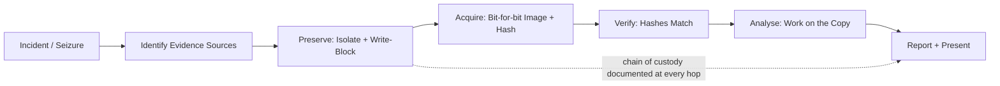
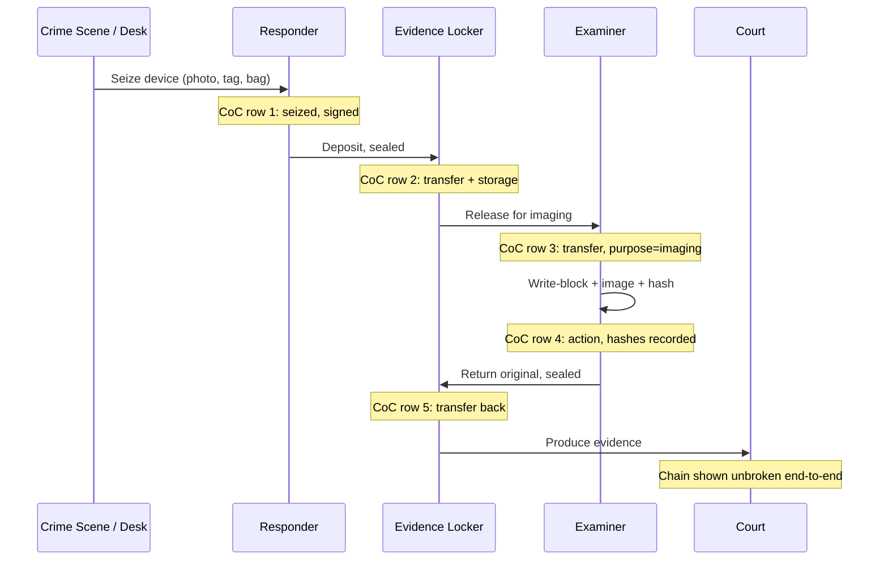
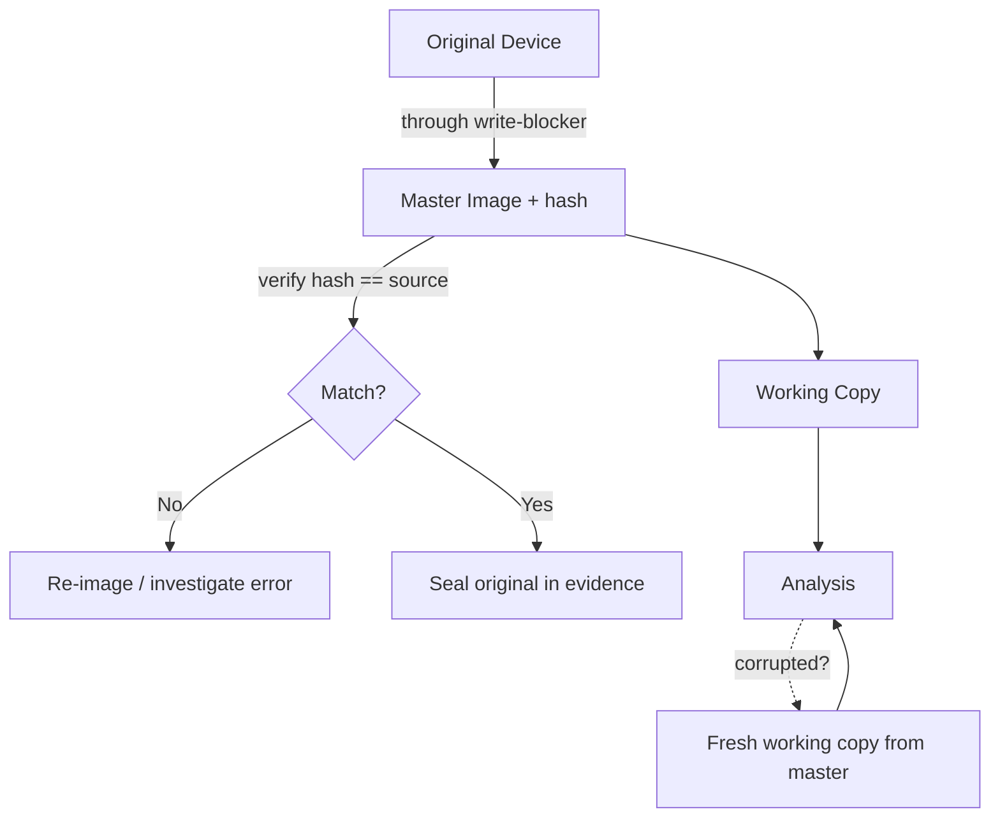
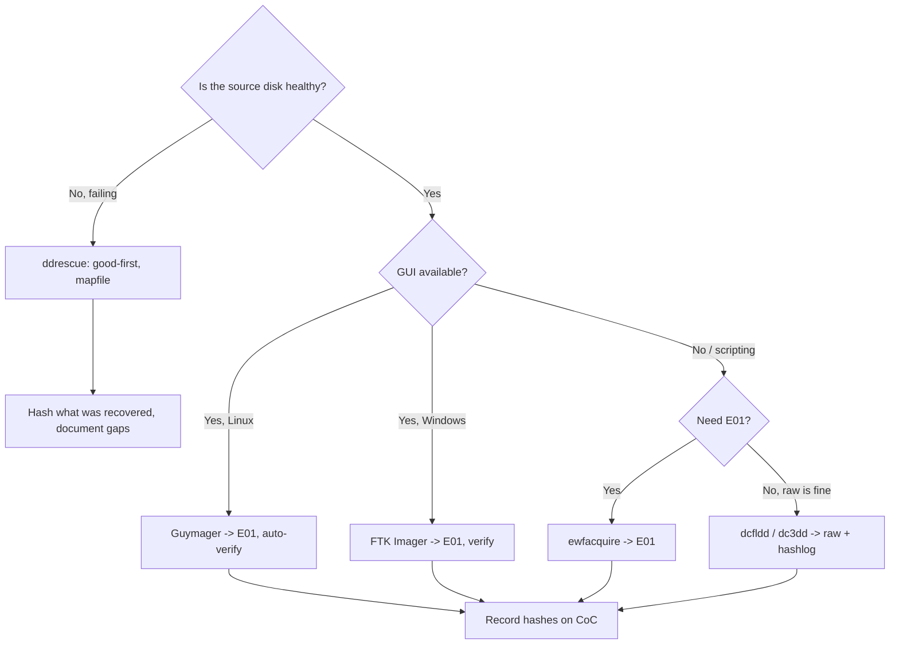
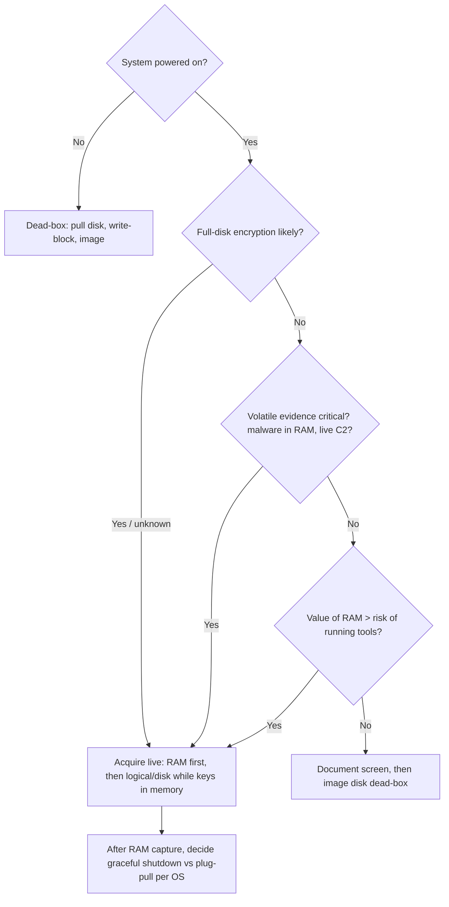

This is Chapter 2 of the DFIR notebook. Chapter 1 walked the incident response lifecycle end to end and stopped, repeatedly, at the same fork: *do we contain now and lose evidence, or preserve first and risk the attacker moving?* This chapter is about the second half of that fork. It teaches you how to preserve, acquire, and prove the integrity of digital evidence so that whatever you find later — a deleted file, a browser history entry, a malware sample, a login timestamp — holds up when someone hostile asks "how do you know you didn't change it?"

Digital forensics is the science of recovering and interpreting data from digital devices in a way that is **repeatable, defensible, and complete**. The word that matters most there is *defensible*. Anyone can plug a disk in and copy files. A forensic examiner copies the disk in a way that a second examiner, months later, working from your notes, gets a byte-identical result — and can prove neither of you altered anything. That property is what separates forensics from ordinary data recovery, and it is the entire subject of this chapter.

Everything here is written for lawful work: incident response on systems your organisation owns, authorised investigations, CTF forensics challenges, and building the muscle memory you need before you ever touch real evidence. Never image, mount, or analyse a device you are not authorised to examine — in a real investigation, an unauthorised acquisition can destroy the case and expose you personally.

---

## Why Forensics Is Its Own Discipline

In Chapter 1 you contained an incident. You pulled a host, you reset `krbtgt`, you rebuilt from known-good. That is *response* — stopping the bleeding. Forensics is the parallel track that answers the questions response cannot: **What exactly happened? When? For how long? What did they take? Can we prove it?**

Consider a concrete case. A finance workstation is flagged by EDR for a suspicious PowerShell child process. The response team isolates it. Now the questions start, and every one of them is a forensics question:

- Was this the initial foothold, or did the attacker pivot here from somewhere else?
- The EDR alert fired at 14:12. When did the malware actually land — minutes before, or three weeks earlier?
- There is a `passwords.xlsx` in the user's Recent folder. Was it opened by the attacker or is it the user's normal file?
- Legal is asking whether personal data was exfiltrated, because that decision starts a 72-hour regulatory notification clock. Being wrong is expensive.
- HR suspects the *user* was complicit. If this ends in a dismissal or a prosecution, every artifact you touch may be examined by an opposing expert.

You cannot answer any of that by "looking around" on the live machine. The moment you open that spreadsheet to check it, you change its last-accessed timestamp — and you have just destroyed one of the facts you were trying to establish. Forensics exists because **observation changes the system**, and the discipline is a set of techniques for observing without changing, or where change is unavoidable, recording exactly what you changed and why.

There are broadly two contexts you will work in, and they have different rules:

- **Incident response forensics (DFIR):** speed matters, the goal is scoping and remediation, and the "court" is usually an internal review or a regulator. You still preserve rigorously, because IR cases become legal cases more often than anyone expects.
- **Legal / law-enforcement forensics:** the output is evidence for a court or tribunal. The standards for admissibility, documentation, and chain of custody are absolute, and a single unexplained gap can get everything you found thrown out.

This chapter teaches to the stricter of the two, because it is far easier to relax a rigorous process than to retrofit rigour onto a sloppy one.



That diagram is the whole discipline in one line: **identify, preserve, acquire, verify, analyse, report** — with an unbroken chain of custody threaded through all of it. Miss any step and the ones after it are compromised. This chapter covers identify through verify in depth (the acquisition half); the analysis half — file systems, artifacts, timelines, memory analysis — is the subject of the chapters that follow in this notebook.

---

## Part 1: What "Evidence" Actually Means

Before you touch a single tool, you need a precise mental model of what you are collecting. "Evidence" is not just "files." In forensics it has structure, a hierarchy of fragility, and a set of legal properties.

### 1.1 Locard's Exchange Principle

Everything in forensics rests on a hundred-year-old idea from physical crime scenes, formulated by Edmond Locard: **every contact leaves a trace**. When two objects interact, each carries away something of the other and leaves something of itself behind. In the physical world that is fibres, fingerprints, soil. In the digital world it is log entries, timestamps, cached files, memory artifacts, registry keys, and network flows.

The practical consequence: an attacker cannot interact with a system without leaving *some* residue, and a forensic examiner cannot interact with evidence without leaving residue *of their own*. The entire craft is (a) finding the attacker's traces and (b) minimising and documenting your own. When you mount a disk read-write "just to look," you have become Locard's second object — you left a trace, and now you must account for it.

### 1.2 The Order of Volatility

Digital evidence has a lifespan. Some of it vanishes in microseconds; some survives for years on a powered-off disk. The **order of volatility** ranks evidence sources from most to least fragile, and it dictates collection order: you collect the most volatile thing *first*, because every second you spend on durable evidence is a second the volatile evidence is decaying or being overwritten.

The canonical ordering, from RFC 3227 (*Guidelines for Evidence Collection and Archiving* — a foundational document worth reading in full):

| Rank | Evidence source | Typical lifespan | Lost when… |
|------|-----------------|------------------|------------|
| 1 (most volatile) | CPU registers, cache | Nanoseconds | Next instruction executes |
| 2 | RAM: running processes, network connections, open handles, decryption keys | Until power off | Power off, or memory reused |
| 3 | Network state: ARP cache, routing tables, live connections, socket state | Seconds–minutes | Timeout, reboot |
| 4 | Running system state: kernel modules, mounted filesystems, clock skew | Until shutdown | Shutdown |
| 5 | Temporary filesystem data: `/tmp`, swap, pagefile, browser cache | Minutes–hours | Cleanup, reboot, overwrite |
| 6 | Disk: files, slack space, unallocated space, deleted-but-not-overwritten data | Days–years | Overwrite, wipe, physical destruction |
| 7 | Remote logging / monitoring data | Retention-dependent | Log rotation, retention policy |
| 8 (least volatile) | Physical config, archival backups, printouts | Years | Physical loss |

**Why this matters in practice:** the single most common irreversible mistake in incident response is pulling the power on a live machine to "preserve" it. That instantly destroys ranks 1–5 — including RAM, which on a modern intrusion is where the malware actually lives (fileless payloads, injected code, in-memory C2 config) and where disk-encryption keys sit unencrypted. If a laptop is running with BitLocker enabled and you yank the power, you may have just locked yourself out of the disk forever. Volatile-first collection is not academic; it is the difference between having the evidence and not.

The counter-pressure is that touching a live system changes it (Locard again). So the order of volatility is always a negotiated tradeoff: capture RAM and volatile state with the smallest, best-documented footprint you can, *then* move to disk. We cover this collision — live vs dead acquisition — in Part 8.

### 1.3 Types of digital evidence

Evidence is also categorised by how it relates to the facts, and the categories affect how much weight it carries:

- **Real / physical evidence** — the device itself: the seized laptop, the USB stick, the phone.
- **Best evidence** — the original, or a forensically sound duplicate treated as equivalent to the original. Courts historically demanded the "best" (original) evidence; for digital data, a verified bit-for-bit image is legally accepted as equivalent because it is provably identical.
- **Direct evidence** — establishes a fact on its own (a CCTV clip of someone typing).
- **Circumstantial evidence** — supports an inference (a login timestamp that matches when the file was created). Most digital evidence is circumstantial, and forensic strength comes from *correlating many circumstantial artifacts* into a coherent, hard-to-explain-away timeline.
- **Hearsay** — statements made outside the proceeding, generally inadmissible; digital records can be admissible under business-records exceptions if you can show they were generated automatically and reliably.
- **Exculpatory vs inculpatory** — evidence that clears vs implicates. You have an ethical and legal obligation to preserve and report *both*. Cherry-picking inculpatory artifacts and burying exculpatory ones is misconduct and, in a real case, discoverable.

### 1.4 The five properties of good evidence

For evidence to be useful in any serious proceeding, it must be:

1. **Admissible** — legally allowed to be considered. Obtained lawfully, within scope of authorisation/warrant, and handled per procedure.
2. **Authentic** — provably connected to the incident and provably unaltered. This is what hashing and chain of custody deliver.
3. **Complete** — the whole picture, including exculpatory material, not a convenient slice.
4. **Reliable** — collected and processed with sound, repeatable methods and validated tools, so a second examiner reaches the same result.
5. **Believable** — understandable and credible to a non-technical judge or jury. A perfect artifact you cannot explain is worthless in court.

Memorise these as **A-A-C-R-B**. Every technique in the rest of this chapter exists to satisfy one or more of them: write-blocking and imaging deliver *authentic* and *reliable*; hashing delivers *authentic*; chain of custody delivers *admissible* and *authentic*; your notes and reporting deliver *complete* and *believable*.

---

## Part 2: Admissibility and the Legal Frame

You do not need a law degree, but you must understand the frame your evidence lands in, because it dictates procedure. Different jurisdictions phrase it differently; the underlying requirements converge.

### 2.1 The standards you will hear cited

- **Daubert standard (US federal, and many states):** governs expert/scientific evidence. A judge assesses whether a technique is (1) testable and tested, (2) peer-reviewed, (3) has a known error rate, (4) has standards controlling its operation, and (5) is generally accepted in the field. For forensics this is why we use *validated* tools with published behaviour (dd, The Sleuth Kit, EnCase, FTK) rather than a script you wrote last night — the method must be defensible as reliable.
- **Frye standard (older, some US states):** the narrower "general acceptance in the relevant scientific community" test. Daubert largely superseded it federally.
- **Federal Rules of Evidence (US):** Rule 901 (authentication — you must show the evidence is what you claim), Rule 902(14) (self-authentication of electronic data verified by hash — a huge practical shortcut: a matching hash from a qualified person authenticates a copy without live testimony), Rule 1002/1003 (best-evidence rule and when duplicates are acceptable — they are, if authentic).
- **ACPO Principles (UK, widely referenced globally):** the four Association of Chief Police Officers principles for digital evidence, the cleanest short statement of the whole ethic:
  1. No action taken should change data held on a device that may be relied upon in court.
  2. If a person must access original data, they must be competent to do so and able to explain the relevance and implications of their actions.
  3. An audit trail of all processes applied should be created and preserved; an independent third party should be able to repeat those processes and reach the same result.
  4. The person in charge of the investigation is responsible for ensuring the law and these principles are followed.

If you internalise only one framework, internalise ACPO — those four sentences are the entire discipline distilled. Principle 3 in particular ("an independent third party… reach the same result") *is* the reason for bit-for-bit imaging, hashing, and note-taking.

### 2.2 Authorisation and scope

Before acquisition, you must have authority to acquire, and you must stay inside its scope:

- **Warrant** (law enforcement) — defines exactly what may be searched and seized. Exceed it and evidence is suppressed.
- **Consent / employment agreement** (corporate) — your right to examine company-owned devices usually flows from policy the employee acknowledged. BYOD and personal devices are a minefield; get legal sign-off.
- **Engagement letter / IR retainer** (consulting) — defines which systems you may touch. Treat it like rules of engagement in a pentest.

Scope is not a formality. Imaging a personal phone that happened to be on the desk, when your authorisation covered the workstation, can taint the entire investigation. When in doubt, stop and get written authorisation extended — the same discipline you learned for pentest scoping in the methodology track applies verbatim here.

### 2.3 Regulatory clocks

Forensics often runs against a legal deadline. Under the EU GDPR, a notifiable personal-data breach must be reported to the supervisory authority **within 72 hours** of becoming aware of it. US state laws, HIPAA, PCI-DSS, and sector regulators impose their own timelines. This is why the *scoping* question ("what data was affected?") is so forensically urgent: the answer starts or stops a legal clock, and forensics is what produces a defensible answer instead of a guess.

---

## Part 3: Chain of Custody — The Document That Makes Evidence Real

Chain of custody (CoC) is the chronological, documented history of a piece of evidence: **who had it, when, where, why, and what they did to it**, from the moment of seizure to its presentation and eventual disposal. It is the single most important non-technical artifact in forensics, because it is the answer to the question every opposing counsel asks: *"How do we know this is the same disk you seized, and that nobody tampered with it in between?"*

If the chain has a gap — an unaccounted-for hour, an unsigned handoff, a period when the evidence sat on an unlocked desk — the authenticity of everything derived from it is in doubt, and a competent opponent will use that gap to get it excluded. A technically flawless image with a broken chain of custody can be worth nothing.

### 3.1 What a chain-of-custody record contains

For every item of evidence you maintain a record capturing at minimum:

| Field | Example | Why it matters |
|-------|---------|----------------|
| Unique evidence ID | `IR-2027-0142-HD01` | Unambiguous reference across all documents |
| Description | `Seagate 500GB 2.5" SATA HDD, S/N 5VG…` | Ties the record to the physical object |
| Make / model / serial | recorded verbatim | Distinguishes it from identical-looking devices |
| Date/time of seizure | `2027-03-09 14:22 UTC` | Establishes when it entered custody |
| Seized by | name, role, signature | The first link in the chain |
| Location seized | `Desk 4B, Finance, HQ` | Context and scene documentation |
| Reason / authority | `IR retainer §3, ticket INC-8841` | Establishes lawful basis |
| Every transfer | from → to, date/time, purpose, both signatures | Each handoff is a link; unsigned = broken |
| Storage location | `Evidence safe 2, shelf C` | Accounts for the item between actions |
| Hash values | `MD5:…  SHA-256:…` | Ties the physical item to a verifiable digital fingerprint |
| Notes | "imaged with Tableau T356789 write-blocker" | Records what was done and with what |

Every time the item changes hands or is acted upon, a new row is added and signed by both the releaser and the receiver. There are no gaps. If it went into an evidence safe, that is a row. If it came out to be imaged, that is a row. If it went back, that is a row.



### 3.2 Evidence bags, tamper-evident seals, and labelling

Physical control backs the paper trail. Evidence goes into a **tamper-evident bag** — a sealed anti-static bag with a unique serial and a signature strip across the seal, such that opening it visibly destroys the seal. The bag serial is recorded on the CoC. Anti-static matters for electronics: an ordinary plastic bag can build a static charge that damages drive electronics. If the bag must be opened (e.g., to image), that is a documented event, and the item is resealed in a new bag with its serial recorded.

Best practice at the scene, in order:

1. **Photograph before touching** — the device in situ, cable connections, screen contents if powered, serial-number plate. Photos are evidence too and establish the original state.
2. **Label** with the evidence ID.
3. **Bag and seal**, recording the bag serial.
4. **Complete the CoC** first row on the spot, signed.
5. For a **powered-on** device, decide live-acquisition *before* moving it (Part 8) — do not just unplug.

### 3.3 A usable chain-of-custody template

Keep a printed pad of these in the jump kit (Chapter 1's jump kit) and a digital equivalent. A minimal but court-usable form:

```
=================== CHAIN OF CUSTODY FORM ===================
Case / Incident #: ____________   Evidence ID: ____________
Description: _______________________________________________
Make/Model: _______________  Serial #: ____________________
Capacity: __________  Condition on receipt: _______________

Seized by: __________________  Role: ______________________
Date/Time (UTC): ____________  Location: ___________________
Authority (warrant/ticket/retainer §): ____________________
Evidence bag serial: ________  Photos taken: Y / N

Acquisition:
  Imaged by: ______________  Date/Time (UTC): ______________
  Write-blocker (make/model/SN): ___________________________
  Tool + version: _________________________________________
  Image format: ____  Segment size: ____  Sectors: _________
  MD5 (source):  ___________________________________________
  SHA-256 (source): ________________________________________
  MD5 (image):   ___________________________________________
  SHA-256 (image): _________________  Verified match: Y / N

------------------ TRANSFER LOG (no gaps) ------------------
| # | Released by (sign) | Received by (sign) | Date/Time UTC | Purpose | Storage |
|---|--------------------|--------------------| --------------|---------|---------|
| 1 |                    |                    |               |         |         |
| 2 |                    |                    |               |         |         |
============================================================
```

Two rules make CoC bulletproof: **never leave a row blank or a handoff unsigned**, and **contemporaneous notes** — write it down *as it happens*, not from memory afterward. A note written three days later, however honest, is weaker evidence than one written at 14:22 on the spot, and an opponent will hammer the difference.

---

## Part 4: The Golden Rule — Never Work on the Original

Everything above converges on one operational rule that you will hear forensic examiners repeat like a mantra:

> **You never analyse the original. You image the original, verify the image, seal the original away, and do all of your work on a copy of the copy.**

Why "copy of the copy"? Because even the analysis image should be treated as a master. Standard practice:

1. Acquire a **master image** from the original device (through a write-blocker).
2. Verify the master image hash equals the source hash.
3. Seal the original back into evidence and lock it away.
4. Make a **working copy** of the master image.
5. Analyse the *working copy*. If you corrupt it, you make a fresh working copy from the untouched master; the original never comes back out.

This gives you two independent fallbacks and means the physical original is handled exactly twice — once to image, once to seal — minimising the traces you leave on it.

**Why not just copy the files?** Because file-level copying (`cp`, drag-and-drop, robocopy) captures only *allocated, visible* files. It misses everything that makes forensics powerful:

- **Deleted files** whose directory entry is gone but whose data blocks are still on disk (unallocated space).
- **File slack** — the gap between the end of a file's real data and the end of the last cluster it occupies, which can contain fragments of previously deleted files.
- **Unallocated space** — the majority of a "empty" disk, full of recoverable prior data.
- **Alternate data streams** (NTFS), **extended attributes**, **the $MFT**, journal files, hibernation files, and pagefile.
- **Partition tables, boot sectors, and the gaps between partitions** where data can be hidden.
- **Host Protected Areas (HPA)** and **Device Configuration Overlays (DCO)** — sectors the BIOS hides from the OS, which a forensic imager can be told to include.

A **bit-for-bit (bitstream) image** captures *every sector* of the device — allocated, unallocated, slack, hidden — as an exact replica. That is the only acquisition worth calling forensic. The next parts build up to producing one.



---

## Part 5: Write-Blocking — Enforcing Read-Only at the Hardware Level

The golden rule says "don't change the original." Operating systems make that hard. The instant you connect a disk to a running Windows or Linux machine, the OS may **mount it, update last-mount timestamps, replay a filesystem journal, write recovery data, index it, or drop a hidden `.Trash`/`System Volume Information` folder onto it** — all writes, all violations of ACPO Principle 1, all before you have typed a single command. This is not hypothetical; Windows will happily write to a disk just by having Explorer glance at it.

A **write-blocker** sits between the evidence drive and your workstation and physically prevents any write command from reaching the drive, while allowing reads through. It is the hardware embodiment of the golden rule.

### 5.1 Hardware write-blockers

A hardware write-blocker is a dedicated device (Tableau/OpenText, WiebeTech/CRU Forensic UltraDock, etc.) with a port for the evidence drive on one side and a host connection (USB/Thunderbolt) on the other. Internally it filters the storage command set: read, identify, and inquiry commands pass; write, format, and erase commands are blocked or return a benign "success" without touching the medium. Good units have an LED that shows write attempts were blocked, and their behaviour has been tested and documented (NIST's Computer Forensics Tool Testing program publishes write-blocker test reports — part of the Daubert "known error rate/validation" story).

Hardware blockers are the gold standard because they are independent of your OS: no driver, registry, or udev rule can override a physical block. In a legal case you want to testify "the drive was connected through a tested Tableau T356789 hardware write-blocker, serial …" — recorded on the CoC.

### 5.2 Software write-blocking (when hardware isn't available)

You can also block writes in software, which is common in a pinch, in labs, and in CTFs. It is *less* defensible than hardware but perfectly valid if done and documented correctly. On Linux you have several layers:

**a) Mount read-only (necessary but NOT sufficient on its own).** Mounting `-o ro` still lets a journaled filesystem attempt recovery writes at mount time. For forensic filesystems always add `noload` (ext) or `norecovery` and prefer to not mount the raw device at all — mount the *image*, not the evidence.

**b) Block-device read-only flag** via `blockdev`:

```bash
# Force the kernel to treat the whole device as read-only BEFORE anything mounts it
sudo blockdev --setro /dev/sdb        # set read-only
sudo blockdev --getro /dev/sdb        # verify: prints 1 if read-only
```

`--setro` sets the device's read-only flag at the block layer; `--getro` reads it back (`1` = read-only, `0` = writable). Do this *immediately* after plugging in and *before* any mount. Downside: a determined process or a remount can flip it, and there is a race between plug-in and command — which is exactly why hardware blockers win.

**c) udev rule to auto-block removable media** — set removable devices read-only on attach so there is no race:

```bash
# /etc/udev/rules.d/99-forensic-readonly.rules
SUBSYSTEM=="block", KERNEL=="sd[a-z]", ATTR{removable}=="1", RUN+="/sbin/blockdev --setro /dev/%k"
```

This tells udev: for any removable `sdX` block device, run `blockdev --setro` on attach. Reload with `sudo udevadm control --reload`. Purpose-built forensic distros ship this behaviour by default.

**d) Disable automount** in your desktop environment so GNOME/KDE doesn't helpfully mount and index the evidence:

```bash
gsettings set org.gnome.desktop.media-handling automount false
gsettings set org.gnome.desktop.media-handling automount-open false
```

### 5.3 Forensic Linux distributions do this for you

Distros built for acquisition — **CAINE**, **Paladin**, **Tsurugi**, **SIFT Workstation** (as a toolset) — boot with **all block devices forced read-only** and automount disabled, precisely so you can plug an evidence drive into a live-USB'd examiner machine without a hardware blocker and still not touch it. CAINE's "mounter" applet flips devices between read-only and read-write with an explicit, logged action so you can never do it by accident. For lab and CTF work, booting CAINE and imaging from there is a clean, defensible, zero-cost setup.

**Verify, don't trust.** Whatever method you use, prove it worked. Before imaging, record `blockdev --getro`. After imaging, the source hash you compute will be your ultimate proof that nothing changed (a write would change the hash). A good examiner never says "I set it read-only"; they say "I set it read-only, verified the flag, and the pre- and post-acquisition hashes matched."

---

## Part 6: Hashing — The Mathematics of "I Didn't Change It"

Hashing is the mathematical engine of forensic integrity. A cryptographic hash function takes input of any size and produces a fixed-length "fingerprint" (digest) with two properties that matter here:

- **Deterministic:** the same input always yields the same digest.
- **Avalanche / collision-resistant:** change a single bit of input and the digest changes completely and unpredictably; it is computationally infeasible to find two different inputs with the same digest.

Together these give you the forensic superpower: compute the hash of a disk (or file) at acquisition; compute it again later; if the digests match, the data is *provably* unchanged, bit for bit. If a single bit had flipped — through tampering, a failing sector, or a mistake — the hashes would diverge and you would know.

You met hashing in the cryptography notebook (Chapter 4 there covers hashing, salting, HMAC, integrity in depth). Here we care only about the integrity-verification use, and about a wrinkle that surprises newcomers.

### 6.1 The algorithms and why forensics still uses MD5

| Algorithm | Digest size | Cryptographically broken? | Forensic use |
|-----------|-------------|---------------------------|--------------|
| MD5 | 128-bit | Yes — practical collisions since 2004 | Still ubiquitous for *integrity/dedup*; fine for verifying a copy wasn't accidentally corrupted |
| SHA-1 | 160-bit | Yes — SHAttered collision (2017) | Legacy; being phased out |
| SHA-256 | 256-bit | No known practical collision | Preferred modern standard for evidence |
| SHA-512 | 512-bit | No known practical collision | Used where extra margin wanted |

Newcomers ask: *if MD5 is "broken," why do forensic tools still print MD5 by default?* Because "broken" here means **collision resistance** is broken — an attacker can *craft two different files* with the same MD5. It does **not** mean an attacker can take your specific evidence image and produce a *different* image with the *same* MD5 (that would be a *second-preimage* attack, which remains infeasible even for MD5). For the forensic question — "is this copy identical to what I acquired?" — MD5 is still a perfectly good tamper/corruption detector.

That said, the defensible modern practice is to compute **both**: MD5 (for compatibility with legacy case data and tooling) **and** SHA-256 (which closes even the theoretical collision argument an opposing expert might raise). Forensic imagers do this in one pass. When someone challenges MD5, you point at the matching SHA-256 and the argument is over.

### 6.2 Hashing in practice

Compute a hash of a device or file:

```bash
# Hash a whole block device (read-only through your write-block)
sudo md5sum /dev/sdb
sudo sha256sum /dev/sdb

# Hash a file (e.g., a raw image)
sha256sum evidence.dd

# Compute several at once, efficiently, reading the device only once:
sudo sha256sum /dev/sdb & sudo md5sum /dev/sdb & wait
```

Verify a copy against a saved digest:

```bash
# Save the acquisition hash
sha256sum evidence.dd > evidence.dd.sha256
# Later, verify integrity — prints "OK" or "FAILED"
sha256sum -c evidence.dd.sha256
```

`-c` (check) reads the digest file, recomputes the hash of each listed file, and reports `OK` or `FAILED`. This is exactly how you prove, months later, that your working image still matches acquisition.

**Piecewise / block hashing.** For large drives, examiners also compute **piecewise hashes** — a hash of every N-megabyte chunk — so that if a copy fails verification you can localise *which* block differs (e.g., a single bad sector) instead of only knowing "something changed." The tool `dcfldd` and the E01 format do this natively (Part 7). A specialised tool, `ssdeep`, computes **fuzzy hashes** (context-triggered piecewise hashing) that measure *similarity* rather than identity — useful for matching near-duplicate malware samples or documents, not for integrity.

### 6.3 Hashing pitfalls that trip people up

- **Hashing a mounted, changing filesystem gives a moving target.** Hash the *block device* or the *image file*, not a live mount whose timestamps update as you read.
- **A single unreadable sector** (failing disk) will make source and image hashes differ. That is why forensic imagers can zero-fill bad sectors *and log exactly which ones*, so the image is reproducible and the discrepancy is documented rather than mysterious (Part 7.4).
- **Hash the whole device, not just a partition,** when your evidence is the disk — otherwise you miss the partition table and inter-partition space.

---

## Part 7: Forensic Imaging — Tools, Formats, and Real Commands

Now we produce the image. "Imaging" means creating a bitstream copy of the source. We cover the formats, then teach each imaging tool from scratch, then do a full lab in Part 9.

### 7.1 Image formats compared

| Format | Extension | Compression | Metadata/hashes embedded | Splitting | Notes |
|--------|-----------|-------------|--------------------------|-----------|-------|
| **Raw / dd** | `.dd`, `.img`, `.raw`, `.001` | No | No (external hash files) | Yes (`.001`, `.002`…) | Universal, simplest, every tool reads it; 1 TB disk = 1 TB image |
| **EnCase Expert Witness (E01)** | `.E01`, `.Ex01` | Yes (zlib/LZ) | Yes — case metadata, notes, per-block CRC, image hash | Yes (segments) | De-facto legal standard; self-verifying; readable by nearly all tools |
| **AFF / AFF4** | `.aff`, `.af4` | Yes | Yes — rich metadata, storage of multiple objects | Yes | Open format; AFF4 handles very large and sparse images efficiently |
| **SMART / s01** | `.s01` | Yes | Yes | Yes | Older ASR Data format; largely superseded |

Practical guidance:

- **Use E01 for real casework.** It compresses (a mostly-empty 1 TB drive might image to a few tens of GB), embeds the acquisition hash and case metadata *inside the file*, and stores per-block CRCs so corruption is detected on read. It is what EnCase, FTK, X-Ways, Autopsy, and The Sleuth Kit all expect. Self-verification is a courtroom gift.
- **Use raw/dd for CTFs, quick jobs, and maximum compatibility,** or when you need to `mount`/loop the image directly with standard Linux tools without conversion. No compression means you need as much destination space as the source is large.
- **AFF4** shines for enormous or sparse images and cloud/logical acquisitions.

You can always convert between them (`ewfacquire`, `xmount`, `affconvert`), so the choice is not permanent — but choose deliberately and record it on the CoC.

### 7.2 `dd` — the original, and understanding it from zero

`dd` ("data duplicator") is a standard Unix tool that copies data block by block from an input to an output, treating everything as a raw byte stream. It predates forensics but *is* the conceptual heart of imaging: read every block of the source, write every block to the destination, unchanged. Because it operates on the raw device (not the filesystem), it copies allocated data, unallocated space, slack — everything. That is exactly what a forensic image needs.

**Anatomy of a `dd` imaging command:**

```bash
sudo dd if=/dev/sdb of=/mnt/evidence/case0142.dd bs=4M conv=noerror,sync status=progress
```

Every operand explained:

- `if=/dev/sdb` — **i**nput **f**ile: the *source*, here the whole evidence block device (not a partition like `/dev/sdb1`). Whole device = you get the partition table and all partitions.
- `of=/mnt/evidence/case0142.dd` — **o**utput **f**ile: the destination image. This lives on your (large, verified-clean) evidence-storage drive, *never* on the source.
- `bs=4M` — **b**lock **s**ize: read/write 4 MiB at a time. Bigger blocks = fewer syscalls = faster, up to a point. 1–8M is a sane range for disks.
- `conv=noerror,sync` — conversion flags, **critical for forensics on flaky media**:
  - `noerror` — do *not* abort on a read error (a bad sector); keep going. Without this, one bad sector ends your acquisition of a dying disk.
  - `sync` — pad every block that had an error with zeros to keep the output **the same size and correct alignment** as the source. Without `sync`, a short read would shift every subsequent byte, corrupting the image and its offsets. `noerror` and `sync` are always used *together*.
- `status=progress` — print throughput and bytes copied while it runs (older `dd` was silent, which terrified everyone).

**Why plain `dd` is not the *forensic* first choice:** it does not hash while it images, does not log which sectors errored, and a single typo (`if`/`of` swapped) writes to the wrong device. The forensic forks below fix these.

> **Deadly-mistake warning:** `dd` will obliterate whatever `of=` points at, instantly and silently. Swapping `if=` and `of=` writes zeros/garbage over your *evidence*. Triple-check device names with `lsblk` *by size and serial* before pressing Enter. Professionals read the command aloud and have a second person confirm on real cases.

### 7.3 `dcfldd` and `dc3dd` — dd built for forensics

Two forensic forks of `dd` add exactly what forensics needs:

- **`dcfldd`** (DoD Computer Forensics Lab dd) — adds **on-the-fly hashing**, **progress**, **piecewise/block hashing**, **simultaneous multiple outputs**, and **verification**.
- **`dc3dd`** (DoD Cyber Crime Center dd) — a patch of GNU dd (rather than a rewrite), also adds hashing, logging, progress, and pattern wiping; tracks GNU dd closely.

`dcfldd` example, imaging while hashing and logging:

```bash
sudo dcfldd if=/dev/sdb \
    of=/mnt/evidence/case0142.dd \
    hash=sha256,md5 \
    hashwindow=1G \
    hashlog=/mnt/evidence/case0142.hashlog \
    bs=4M \
    conv=noerror,sync \
    statusinterval=64
```

New operands:

- `hash=sha256,md5` — compute both digests *as it images*, in one read of the source. One pass, two hashes, no second read.
- `hashwindow=1G` — also compute a hash of every 1 GB chunk (piecewise), so a later mismatch can be localised to a 1 GB window.
- `hashlog=…` — write all hashes (total + per-window) to a log file — your acquisition record, attach it to the CoC.
- `statusinterval=64` — print progress every 64 blocks.

`dc3dd` equivalent:

```bash
sudo dc3dd if=/dev/sdb of=/mnt/evidence/case0142.dd \
    hash=sha256 log=/mnt/evidence/case0142.log \
    hlog=/mnt/evidence/case0142.hashlog verb=on
```

Either of these is a defensible command-line forensic image. Prefer them over plain `dd` whenever available.

### 7.4 Handling bad sectors and dying disks

On failing media, throughput and error handling matter more than features. `conv=noerror,sync` keeps `dd`-family tools going and zero-fills unreadable sectors (documented in the hashlog). For truly dying disks, `ddrescue` (GNU `ddrescue`, package `gddrescue`) is superior: it copies the *good* areas first and *retries* bad areas last, keeping a **mapfile** so an interrupted rescue resumes exactly where it stopped.

```bash
sudo ddrescue -n /dev/sdb /mnt/evidence/case0142.dd /mnt/evidence/case0142.map   # fast first pass, skip bad
sudo ddrescue -d -r3 /dev/sdb /mnt/evidence/case0142.dd /mnt/evidence/case0142.map # retry bad areas 3x, direct I/O
```

- `-n` — no-scrape first pass: grab everything easily readable fast, before the drive degrades further.
- `-d` — direct disc access (bypass the OS cache) for accuracy.
- `-r3` — retry bad sectors up to 3 times.
- The **mapfile** records exactly which sectors were recovered vs bad — a documented, resumable, defensible record of a partial acquisition. On a dying evidence drive, `ddrescue` first, then hash what you recovered, then document the gaps.

### 7.5 `ewfacquire` / `libewf` — making E01 images on the command line

`ewfacquire` (from `libewf`, the open-source EnCase format library) creates **E01** images with embedded metadata and hashing. It is interactive by default, prompting for case info that gets baked into the image:

```bash
sudo ewfacquire /dev/sdb
```

It will prompt for: image path, case number, description, examiner name, evidence number, notes, media type, compression (`fast`/`best`/`none`), format (`encase6`/`encase7`/`ftk`…), segment file size (for splitting), and which hashes to compute (SHA-256 recommended). It images, compresses, hashes, and **verifies** in one workflow, writing `case0142.E01`, `.E02`, … segments plus the metadata. Non-interactively you can script every prompt:

```bash
sudo ewfacquire -t /mnt/evidence/case0142 -f encase6 -c best \
  -C 0142 -D "Finance WS HDD" -e "J. Examiner" -E "HD01" \
  -m fixed -M logical -S 2GiB -d sha256 /dev/sdb
```

- `-t` target path (no extension; it adds `.E01`), `-f` format, `-c` compression, `-C/-D/-e/-E` case/description/examiner/evidence-number metadata, `-m` media type, `-M` media flags, `-S` segment size (split at 2 GiB), `-d sha256` digest. Everything you'd type interactively, as flags.

To read/verify E01 later: `ewfverify case0142.E01` recomputes and checks the stored hashes; `ewfinfo case0142.E01` dumps the embedded metadata; `ewfmount case0142.E01 /mnt/ewf` exposes the E01 as a raw device you can then loop-mount read-only.

### 7.6 `Guymager` — the GUI acquisition tool

**Guymager** is a fast, free GUI imager (default on CAINE/Paladin) that most examiners reach for when a screen is available. It lists all attached devices with model/serial/size, you right-click the evidence device → *Acquire image*, fill a form (case number, examiner, evidence number, description), choose format (**Linux dd / raw**, **EWF/E01**, or **AFF**), choose hash algorithms (tick MD5 **and** SHA-256), and it images with a live progress bar and multi-threaded compression, then **automatically re-reads the image and verifies the hash**. It writes an `.info` file capturing every parameter — a ready-made acquisition record. Guymager is the sweet spot for most jobs: hardware-blocker in front, Guymager driving, E01 out, auto-verified.

### 7.7 `FTK Imager` — the Windows standard

**FTK Imager** (free, from Exterro/AccessData) is the ubiquitous Windows acquisition and preview tool. It can:

- Create images (E01, raw, AFF, SMART) from physical drives, logical volumes, or folders, with MD5+SHA-1 verification.
- **Preview** a drive's file system read-only *before* imaging (to confirm you have the right device / relevant data).
- **Capture memory** (`Capture Memory…` writes a raw RAM dump + optional pagefile) — handy on a live Windows box.
- **Mount** images read-only as a Windows volume for triage.
- Export files, the registry, and protected files (SAM, SYSTEM) from a live system.

Workflow: *File → Create Disk Image → Physical Drive → select → add E01 destination + case metadata → tick "Verify images after they are created" → Start.* FTK Imager verifies and writes a `.txt` acquisition log with both hashes and the drive geometry. When you must acquire on Windows without a Linux examiner box, this is the tool — and it runs from a USB stick, so it doesn't need installation on the evidence machine.

### 7.8 A tool-selection decision guide



---

## Part 8: Live vs Dead Acquisition — the Order-of-Volatility Collision

Part 1 said "collect volatile first"; Part 4 said "never touch the original." On a **powered-off** machine those never conflict: you remove the disk, write-block it, image it (dead-box acquisition). On a **powered-on** machine they collide head-on — the most valuable evidence (RAM, live connections, decryption keys) exists *only while it's running*, and capturing it *requires* running code on the live system, which changes it. This is the hardest judgement call in acquisition.

### 8.1 The decision: pull the plug, shut down, or acquire live?



Guiding rules distilled from practice:

- **Never just yank power on an encrypted machine.** If BitLocker/FileVault/LUKS is on and you pull the plug before capturing RAM (which holds the key) or the recovery key, the disk image you take later may be an unbreakable brick. Capture RAM *first*.
- **RAM is captured first, always, when acquiring live** — it is rank 2 in the order of volatility and it is where modern malware lives.
- **"Pull the plug" (hard power-off) vs graceful shutdown** is itself a tradeoff. A hard pull avoids anti-forensic shutdown scripts and freezes the disk state, but corrupts open files and loses everything in RAM. A graceful shutdown flushes files but runs shutdown scripts an attacker may have booby-trapped and updates timestamps. On Windows, a common forensic choice for a dead-box follow-up is to pull the plug *after* RAM capture (avoids journal replay and shutdown scripts). On a server you cannot afford to corrupt, graceful may win. Document your reasoning either way — an examiner is judged on *defensible decisions*, not on always picking the same one.

### 8.2 Capturing memory (RAM)

Memory capture writes the contents of physical RAM to a file for later analysis (the memory-analysis chapter covers *analysing* it with Volatility; here we only *acquire* it). Because you must run a tool on the live box, you (a) run it from your *own* trusted, read-only media (USB), (b) write the output to *your* external media, never the evidence disk, and (c) record the exact tool, version, and hash.

**Windows:**

```
# WinPmem (open-source, single portable EXE) — dump physical memory to E01
winpmem_mini_x64.exe -o E:\case0142\memory.raw

# Magnet RAM Capture / Belkasoft RAM Capturer / FTK Imager "Capture Memory" — GUI equivalents
# FTK Imager: File -> Capture Memory -> Destination E:\case0142 -> tick "Include pagefile" -> Capture
```

- WinPmem loads a signed driver to read `\\.\PhysicalMemory`, streams RAM to the output on your USB (`E:`), and can also grab the pagefile. Output format can be raw or AFF4. Hash the output immediately after.

**Linux:**

```bash
# LiME (Linux Memory Extractor) — build/insert kernel module, dump to your mounted USB
sudo insmod ./lime.ko "path=/mnt/usb/case0142/memory.lime format=lime"

# AVML (Microsoft's portable acquisition tool, no kernel module needed for many kernels)
sudo ./avml /mnt/usb/case0142/memory.lime
```

- LiME is a loadable kernel module that copies physical memory to a file (`format=lime` preserves the memory-range metadata Volatility wants). AVML is a self-contained binary that acquires memory across many kernel versions without compiling a module — convenient when you can't build LiME against the target's exact kernel.

**macOS:** memory acquisition is harder due to SIP and driver signing; tooling is limited and version-sensitive — plan and test in advance.

**Order on a live box (minimal-footprint volatile collection), before RAM if time-boxed, or alongside:** capture the fast-decaying process/network state with single, documented commands, writing output to your USB:

```bash
# Linux live triage (each redirected to your external media)
date -u; uptime                      # clock skew + uptime
ps auxww                             # full process list with args
ss -tunap                            # sockets: TCP/UDP, listening + established, with PIDs
lsof -n -P                           # open files/handles (no name/port resolution = faster, no DNS)
ip a; ip route; ip neigh             # interfaces, routes, ARP/neighbour cache
w; last -Faiwx                       # logged-in users + login history
cat /proc/mounts; lsmod              # mounts + loaded kernel modules
```

```cmd
:: Windows live triage
systeminfo & net accounts & date /t & time /t
tasklist /v & wmic process get ProcessId,ParentProcessId,CommandLine
netstat -anob                        :: connections + owning process + executable
arp -a & route print & ipconfig /all
net session & net use & query user   :: sessions, mapped drives, logged-on users
```

Each command's output goes to a timestamped file on your evidence media, and you log the command you ran. The point is a *documented, minimal* footprint: a handful of read-only queries, not an interactive dig-around.

### 8.3 The dead-box path (the common case)

For a powered-off desktop/laptop, or after you've captured volatile data:

1. Photograph, tag, bag (Part 3).
2. Remove the storage device (or use the machine's disk directly if you cannot remove it, booting a forensic distro that mounts nothing).
3. Connect through a **hardware write-blocker**.
4. Confirm read-only (`blockdev --getro` / blocker LED).
5. Image with Guymager/ewfacquire/dcfldd (Part 7).
6. Verify hashes match.
7. Seal original, store, update CoC.

This is the workflow the Part 9 lab walks end to end.

---

## Part 9: Hands-On Lab — Imaging a USB Device End to End

This lab produces a verified forensic image of a small USB thumb drive on a Linux examiner box, exactly as you would for a real (larger) evidence disk. A USB stick stands in for the evidence drive so you can reproduce every step safely on your own hardware. **Only image media you own.** Everything here also works verbatim inside a CAINE/SIFT VM.

### 9.0 Lab setup

You need: a Linux box (Kali/CAINE/Ubuntu), a throwaway USB stick as "evidence," and a second location with free space as your "evidence store" (another drive or a directory with room). Install the tools:

```bash
sudo apt update
sudo apt install -y sleuthkit ewf-tools dcfldd gddrescue guymager libewf-dev
# sleuthkit = mmls/fls/etc; ewf-tools = ewfacquire/ewfverify/ewfmount; dcfldd; gddrescue = ddrescue; guymager GUI
```

### 9.1 Identify the device — get this right or you image the wrong disk

Plug in the evidence USB, then list block devices *by size and serial* so you cannot confuse it with your system disk:

```bash
lsblk -o NAME,SIZE,TYPE,MOUNTPOINT,MODEL,SERIAL
```

Sample output:

```
NAME   SIZE TYPE MOUNTPOINT MODEL            SERIAL
sda    238G disk            Samsung SSD 860  S3Z1NB0K
├─sda1 237G part /
└─sda2   1G part /boot
sdb   14.9G disk            SanDisk Ultra    4C530001250412114132
└─sdb1 14.9G part /media/…
```

Here the evidence is **`/dev/sdb`** (14.9 GB SanDisk, serial 4C53…). Your system disk is `sda` (238 GB). Record the model and serial on the CoC *now*. Get `mmls` to confirm the partition layout of the source (read-only):

```bash
sudo mmls /dev/sdb
```

```
DOS Partition Table
Offset Sector: 0
Units are in 512-byte sectors

      Slot      Start        End          Length       Description
000:  Meta      0000000000   0000000000   0000000001   Primary Table (#0)
001:  -------   0000000000   0000002047   0000002048   Unallocated
002:  000:000   0000002048   0031260671   0031258624   Win95 FAT32 (0x0b)
```

`mmls` (Sleuth Kit) reads the partition table only — it does not mount anything. It confirms one FAT32 partition and, importantly, shows **2048 sectors of unallocated space before the partition** — space a file-copy would miss but a bitstream image captures.

### 9.2 Engage the write-block and prove it

If you have a hardware blocker, connect through it and confirm its LED. Software route:

```bash
# Make sure nothing auto-mounted it; if it did, unmount (do NOT reformat!)
sudo umount /dev/sdb1 2>/dev/null

# Set the whole device read-only and verify
sudo blockdev --setro /dev/sdb
sudo blockdev --getro /dev/sdb
```

```
1
```

`1` confirms read-only. Record "software write-block via blockdev --setro, verified getro=1" on the CoC. (On CAINE, the device is already read-only at boot.)

### 9.3 Pre-acquisition hash of the source

Hash the *source device* before imaging so you have an independent baseline to compare the image against:

```bash
sudo sha256sum /dev/sdb | tee /mnt/store/case0142/source.sha256
```

```
9f2c... (64 hex chars) ...a7e1  /dev/sdb
```

Time this on a large disk and you'll understand why imagers hash *during* acquisition — reading a 4 TB disk twice (once to hash, once to image) doubles the wall-clock. For a 15 GB stick it's seconds. Save this digest; it is your ground truth.

### 9.4 Acquire the image (raw, with dcfldd)

Create the case directory on your **evidence store** (not on `/dev/sdb`), then image:

```bash
mkdir -p /mnt/store/case0142
sudo dcfldd if=/dev/sdb \
  of=/mnt/store/case0142/case0142.dd \
  hash=sha256,md5 \
  hashwindow=512M \
  hashlog=/mnt/store/case0142/case0142.hashlog \
  bs=4M conv=noerror,sync statusinterval=32
```

Sample live output and completion:

```
7680 blocks (30720Mb) written.
31258624+0 records in
31258624+0 records out

Total (sha256): 9f2c...a7e1
Total (md5):    3b5d...c04f
```

The `Total (sha256)` printed by dcfldd **matches** the `source.sha256` you computed in 9.3 — first proof the image is faithful. The `.hashlog` also contains per-512MB window hashes.

### 9.5 Alternative: acquire as E01 (recommended for real cases)

```bash
sudo ewfacquire -t /mnt/store/case0142/case0142 -f encase6 -c best \
  -C 0142 -D "Lab USB SanDisk Ultra 15GB" -e "Examiner Name" -E "USB01" \
  -m removable -M logical -S 1536MiB -d sha256 /dev/sdb
```

Tail of the interactive summary ewfacquire prints on completion:

```
Acquiry completed at: Mar 09, 2027 14:41:07
Written: 14 GiB (16008609792 bytes) in 3 minute(s) and 12 second(s)
MD5 hash calculated over data:      3b5d...c04f
SHA256 hash calculated over data:   9f2c...a7e1
ewfacquire: SUCCESS
```

Same SHA-256 as the raw acquisition and the source — the format changed, the data did not. E01 also embedded the case metadata and hash *inside* `case0142.E01`.

### 9.6 Verify the image independently

Do not trust the imager's own report alone — verify with a *separate* tool, the way an opposing expert would:

```bash
# Verify the E01's embedded hash
ewfverify /mnt/store/case0142/case0142.E01
```

```
Digest hash calculated over data:
    SHA256: 9f2c...a7e1
Stored hash:
    SHA256: 9f2c...a7e1
ewfverify: SUCCESS
```

```bash
# Verify the raw image against the source baseline
sha256sum /mnt/store/case0142/case0142.dd
cat /mnt/store/case0142/source.sha256
```

Both print `9f2c...a7e1`. **Source hash == raw image hash == E01 stored hash.** Record all of this on the CoC. This three-way match is the sentence you want to be able to say under oath: *"The image is a verified, bit-for-bit copy of the original; the SHA-256 of the source, the raw image, and the E01 all match."*

### 9.7 Make a working copy and mount it READ-ONLY for analysis

Never analyse the master. Copy it, then mount the *copy* read-only via a loop device:

```bash
cp /mnt/store/case0142/case0142.dd /mnt/store/case0142/working.dd

# Find the partition offset in bytes: start sector (2048) * sector size (512) = 1048576
sudo mmls /mnt/store/case0142/working.dd     # confirm start sector = 2048
mkdir -p /mnt/analysis
sudo mount -o ro,loop,offset=$((2048*512)),noexec,nodev,noatime \
  /mnt/store/case0142/working.dd /mnt/analysis
ls -la /mnt/analysis
```

Mount options explained (all belt-and-braces to avoid touching data):

- `ro` — read-only.
- `loop` — treat the image file as a block device.
- `offset=1048576` — skip to the partition start (bytes) since we imaged the whole disk, not just the partition.
- `noexec,nodev` — don't execute binaries or honour device nodes from the evidence (safety).
- `noatime` — don't update access times (defence in depth; `ro` already prevents writes).

For E01, expose it as raw first, then loop-mount:

```bash
mkdir -p /mnt/ewf
ewfmount /mnt/store/case0142/case0142.E01 /mnt/ewf     # creates /mnt/ewf/ewf1 (raw view)
sudo mount -o ro,loop,offset=$((2048*512)),noexec,nodev,noatime /mnt/ewf/ewf1 /mnt/analysis
```

You can now browse `/mnt/analysis` read-only. To pull deleted files and unallocated space you'd move to Sleuth Kit (`fls`, `icat`) and `photorec`/`foremost` — that carving and file-system analysis is the next chapter's subject. Clean up:

```bash
sudo umount /mnt/analysis
sudo umount /mnt/ewf          # if E01
```

### 9.8 Fill in the acquisition record

At this point every field of the CoC's Acquisition block is filled: tool + version (`dcfldd` / `ewfacquire`), write-blocker method, format, segment size, sector count (`31258624`), and the matching MD5 + SHA-256 for source and image, "Verified match: Y." That completed form, plus the `.hashlog`/`.info` files, is your defensible acquisition package.

---

## Part 10: Imaging Gotchas the Real World Throws at You

The clean lab hides complications that real evidence presents. Know them before they surprise you.

### 10.1 HPA and DCO — hidden sectors

Disks can hide sectors from the OS via a **Host Protected Area** (HPA) or **Device Configuration Overlay** (DCO), originally for recovery partitions and size-clamping — and abused to hide data. A naive image that trusts the OS-reported size misses them. Detect and, if authorised, temporarily remove them so the imager sees the full disk:

```bash
sudo hdparm -N /dev/sdb        # show HPA: native vs accessible max sectors
sudo hdparm --dco-identify /dev/sdb   # show DCO-reported real capacity
```

If `hdparm -N` shows the accessible max is *less* than the native max, an HPA is hiding sectors. Professional hardware imagers (Tableau, Falcon) detect and image HPA/DCO areas automatically and note them — another reason dedicated hardware is worth it. Always record the disk's advertised capacity (from the label) and compare to what you imaged; a mismatch is a red flag to chase, not ignore.

### 10.2 SSDs, TRIM, and wear levelling — why they resist forensics

Spinning disks are forensically friendly: a deleted file's blocks sit untouched until overwritten. **SSDs are hostile.** Three mechanisms fight you:

- **TRIM:** when a file is deleted, the OS tells the SSD which blocks are now free; the SSD's garbage collector may **zero them out within seconds**, autonomously, even through a write-blocker (the erase happens *inside* the drive's controller). Deleted data on a TRIM-enabled SSD is often *gone* by the time you image — recovery of deleted files is far less reliable than on HDDs.
- **Wear levelling:** the controller remaps logical blocks to different physical cells to spread wear, so "unallocated space" you image is not a stable map of physical reality.
- **Over-provisioning:** hidden spare cells you cannot address at all.

Forensic consequence: **for an SSD, RAM and live acquisition matter even more, and speed matters** — you want the image before the garbage collector runs. Write-blocking still prevents *host* writes but cannot stop the drive's *internal* controller from erasing TRIMmed blocks. Document that the medium was an SSD; it explains why deleted-data recovery was limited and pre-empts a "you must have missed it" challenge.

### 10.3 Full-disk encryption

If BitLocker/FileVault/LUKS/VeraCrypt is enabled, a dead-box image is encrypted ciphertext — useless without the key. Options, in order of preference: capture RAM *while running* (the key is in memory; memory-analysis tooling can extract it), obtain the recovery key (BitLocker keys may be escrowed in AD/Azure AD; ask), or acquire *logically* while the volume is mounted and unlocked (you get plaintext files but a less complete image). This is the single biggest reason the live-vs-dead decision (Part 8) is not optional.

### 10.4 RAID, LVM, and virtual disks

Evidence is not always one disk. A **RAID** array's data is striped across members — imaging one member gives you fragments; you must image all members and reconstruct, or image the assembled logical volume from a running (read-only) controller. **LVM** logical volumes span physical volumes similarly. **Virtual machines** store disks as `.vmdk`/`.vhdx`/`.qcow2` files — often you image the *host*, then treat the VM disk files as evidence containers (they mount with `qemu-nbd`/`libvmdk`). Cloud instances need snapshot-based acquisition through the provider API. Recognise the topology *before* you image so you capture the whole picture.

### 10.5 Very large disks and time

A 20 TB disk at ~200 MB/s takes ~28 hours just to read once. Plan for it: image to fast destination storage, use E01 compression (empty space compresses to nearly nothing), hash *during* acquisition (never a second read), and consider **targeted/logical acquisition** of just the relevant volumes when a full physical image is impractical and authorisation permits — documenting exactly what you did and did not capture.

---

## Part 11: The Forensic Workstation and Toolkit

You cannot do defensible work on a random laptop with whatever tools were handy. A forensic workstation is deliberately configured.

### 11.1 Hardware and OS baseline

- **Plenty of fast storage** — you need room for the source image, a working copy, and carved output (rule of thumb: 3× the largest disk you'll examine).
- **A hardware write-blocker** (and adapters: SATA, NVMe, USB, IDE for old evidence).
- **Lots of RAM** — memory analysis and carving are RAM-hungry.
- **An examiner OS that does not auto-mount:** a purpose-built distro or a hardened Linux with automount disabled.

Key distributions/toolkits, taught as "what they are":

- **SIFT Workstation** (SANS) — a free Ubuntu-based DFIR toolkit (Sleuth Kit, Volatility, Plaso/log2timeline, bulk_extractor, etc.), installable on top of Ubuntu.
- **CAINE / Paladin / Tsurugi** — bootable forensic distros that force read-only block devices and ship Guymager, Autopsy, and analysis tools ready to go.
- **Kali** — offensive-focused but includes many of the same tools; fine for CTFs, less ideal as a pristine examiner environment (it auto-mounts by default).

### 11.2 The core open-source acquisition/analysis stack

| Tool | Category | What it does |
|------|----------|--------------|
| `dd` / `dcfldd` / `dc3dd` | Imaging | Bitstream copy (+ hashing in the forks) |
| `ddrescue` | Imaging | Recover failing media, mapfile, resumable |
| `ewfacquire` / `libewf` | Imaging | Create/read/verify E01 |
| Guymager | Imaging (GUI) | Fast multi-threaded imaging + auto-verify |
| FTK Imager | Imaging (Win) | Image, preview, capture memory, mount |
| `mmls` / `fsstat` (Sleuth Kit) | Partition/FS | Partition table + filesystem metadata |
| `fls` / `icat` / `istat` (Sleuth Kit) | Analysis | List (incl. deleted) files, extract by inode |
| Autopsy | Analysis (GUI) | Front-end to Sleuth Kit; timelines, keyword search |
| `foremost` / `photorec` / `scalpel` | Carving | Recover files from unallocated space by signature |
| `bulk_extractor` | Triage | Pull emails, cards, URLs from an image fast |
| WinPmem / LiME / AVML | Memory | Acquire RAM (Windows/Linux) |
| Volatility 3 | Memory | Analyse RAM dumps |
| Plaso / `log2timeline` | Timelines | Build a super-timeline across artifacts |

You will meet the analysis half (Sleuth Kit, Autopsy, carving, Volatility, Plaso) in depth in the following chapters. This chapter's job was to get you a *verified image* those tools can safely consume.

### 11.3 Tool validation and the "why not just trust it" question

Under Daubert, your tools must be *reliable*. In practice: use tools with a track record and published behaviour, keep a note of exact versions, and periodically validate your imager against **NIST's Computer Forensics Reference Data Sets (CFReDS)** and the **CFTT** tool-test reports — known images with known contents where you confirm your process reproduces the expected hash. Being able to say "my imaging process is validated against NIST reference data" pre-empts a whole line of cross-examination.

---

## Part 12: Anti-Forensics — What Adversaries Do to Your Evidence

Forensics is adversarial. Skilled attackers actively try to deny, degrade, or mislead your analysis. Knowing the techniques makes you a better examiner because you know what absence-of-evidence *means*.

- **Secure deletion / wiping** (`shred`, `sdelete`, `BleachBit`) — overwrites data so carving finds nothing. On HDDs a single overwrite is effectively unrecoverable; the myth of "35-pass Gutmann is needed" is obsolete for modern drives. **Detection:** wiped free space full of a repeating pattern or pure randomness where you'd expect residue; a `shred` binary in bash history; timestamps showing mass deletion.
- **Timestomping** — altering MACB timestamps (Modified, Accessed, Changed/Created, Birth) to hide when files were created or run (`touch -d`, Metasploit's `timestomp`, PowerShell `.LastWriteTime =`). **Detection:** the NTFS `$MFT` stores two timestamp sets (`$STANDARD_INFORMATION` vs `$FILE_NAME`); timestomping tools often update only one, so a mismatch between them is a classic tell. Sub-second precision anomalies (all zeros) are another.
- **Log tampering / clearing** — wiping `Security.evtx`, `/var/log/*`, shell histories. **Detection:** Event ID 1102 (Windows "audit log cleared"), gaps in sequence numbers, missing rotated logs, `HISTFILE` unset. Absence itself is evidence.
- **Encryption / steganography** — hiding data inside other files or behind crypto. **Detection:** high-entropy blobs, known stego-tool artifacts, carrier files with anomalous size.
- **Living-off-the-land / fileless** — running from memory to leave nothing on disk. **Detection:** this is *why* RAM capture is non-negotiable; the evidence is only in memory.
- **VM/anti-analysis and time bombs** — malware that self-destructs on shutdown or detects analysis. **Detection:** part of why hard-power-off after RAM capture is sometimes chosen.

**Red-team relevance:** on an engagement, these are the OPSEC techniques that determine whether the blue team can reconstruct your actions afterwards — but note that in a *sanctioned* red-team the goal is to test detection, and destroying logs on a client system is usually out of scope and unethical unless explicitly authorised. **Blue-team relevance:** every anti-forensic technique has a detection signature; your job is to make wiping, timestomping, and log-clearing *noisy* (immutable/off-host logging, file-integrity monitoring, `$MFT` timeline analysis) so the attacker's cleanup is itself an alert.

---

## Part 13: Detection & Defence Angle

Consolidating the defensive thread that has run through the chapter. Forensic *readiness* — the controls that make a future acquisition and investigation possible and fast — is a defensive discipline in its own right.

- **Log to somewhere the attacker can't reach.** The most valuable forensic evidence is often *off* the compromised host: a SIEM, a syslog server, cloud audit logs, EDR telemetry. If your only copy of the truth is on the box the attacker owns, expect it to be gone. Ship logs off-host in real time and make them immutable/WORM where you can.
- **Retention long enough to matter.** Chapter 1's dwell-time reality (attackers sit for weeks) means 7-day log retention answers no scoping question. Match retention to realistic dwell time (90+ days for security logs; longer for regulated data).
- **Enable the telemetry forensics needs, in advance.** Sysmon (process creation with command line and hashes, network connections, image loads), PowerShell script-block logging, command-line auditing, file-integrity monitoring on sensitive paths, and `$MFT`/USN-journal preservation. You cannot retro-actively collect a log that was never enabled.
- **Forensic readiness plan.** Know *before* an incident: where evidence lives, who is authorised to acquire, where the write-blockers and evidence storage are, and what your CoC process is. The jump kit from Chapter 1 is part of this.
- **File-integrity monitoring and immutable timestamps** raise the cost of timestomping and tampering and give you tamper-evidence.
- **Backups are evidence too.** A known-good backup from before the intrusion is a forensic goldmine for diffing what changed — preserve, don't overwrite, backups during an incident.
- **Detect the acquisition tools of an attacker.** Mass file deletion, `shred`/`sdelete` execution, `wevtutil cl` / Event ID 1102, `vssadmin delete shadows` (ransomware precursor), and cleared histories should all generate alerts. The techniques in Part 12 are your detection use-cases.

**Bug-bounty note:** classic forensics has limited direct bounty overlap, but the *artifacts* it studies are exactly what you exploit or protect elsewhere — e.g., understanding that deleted-but-not-overwritten data persists is why exposed `.git` directories, backup files (`.bak`, `~`), and swap files leak secrets; and understanding metadata is why EXIF/`exiftool` on uploaded images (covered in the recon/OSINT track) leaks GPS and usernames. The forensic mindset — "what residue did this action leave?" — is directly transferable to finding information disclosure.

**CTF note:** forensics is a staple category on picoCTF, HTB, and CyberDefenders. The exact skills here — mounting a provided `.dd`/`.E01` read-only, verifying a hash, carving deleted files with `foremost`/`binwalk`, reading the `$MFT`, and pulling artifacts from a memory dump — are the bread and butter of those challenges. Practice list in Part 15.

---

## Part 14: Final Revision / Summary

The through-line of this chapter: **forensics is the discipline of observing digital evidence without changing it, and being able to prove you didn't.**

- **Evidence** is more than files. Locard's principle guarantees traces exist; the **order of volatility** (RFC 3227) dictates you collect the most fragile first — RAM before disk. Good evidence is **A-A-C-R-B**: Admissible, Authentic, Complete, Reliable, Believable.
- **The legal frame** (Daubert, FRE 901/902(14), ACPO's four principles) demands validated tools and a process a third party can reproduce. ACPO Principle 3 *is* why we image, hash, and take notes.
- **Chain of custody** is the unbroken, signed, gap-free record of who had the evidence and what they did to it. A broken chain can void perfect technical work. Tamper-evident bags, photos-before-touching, and contemporaneous notes back it up.
- **The golden rule:** never analyse the original. Image it, verify it, seal it, work on a copy of the copy.
- **Write-blocking** enforces read-only in hardware (gold standard) or software (`blockdev --setro`, forensic distros) — because an OS writes to a disk just by looking at it.
- **Hashing** (MD5 *and* SHA-256) is the proof of integrity. MD5 is fine for *integrity* despite broken collision resistance; pairing it with SHA-256 ends the argument.
- **Imaging** means a **bit-for-bit** copy (allocated + unallocated + slack + hidden), not a file copy. Tools: `dd` (understand it), `dcfldd`/`dc3dd` (forensic, hashing), `ewfacquire` (E01), Guymager (GUI), FTK Imager (Windows), `ddrescue` (dying disks). Formats: raw (universal) vs E01 (compressed, self-verifying, courtroom standard) vs AFF4.
- **Live vs dead:** powered-on systems force the volatility-vs-integrity tradeoff. Capture RAM first (WinPmem/LiME/AVML), never yank power on an encrypted box, and *document your decision*.
- **Real-world gotchas:** HPA/DCO hidden sectors, SSD TRIM destroying deleted data, full-disk encryption, RAID/LVM/VM/cloud topologies, and sheer disk size.
- **Anti-forensics** (wiping, timestomping, log clearing, fileless) is adversarial reality — every technique has a detection signature, which is the defensive flip side.

Memory hook for the whole workflow — **"I-PAVA-R" with a chain running through it:** Identify → Preserve (write-block) → Acquire (image) → Verify (hash) → Analyse (on a copy) → Report, with **Chain of custody** documented at every hop.

---

## Part 15: Cheat Sheet / Quick Reference

**Order of volatility (collect top-down):** registers/cache → RAM → network state → running system state → temp/swap → disk → remote logs → archival.

**Identify the device (get it right):**
```bash
lsblk -o NAME,SIZE,TYPE,MOUNTPOINT,MODEL,SERIAL
sudo mmls /dev/sdX          # partition table, read-only
```

**Write-block (software):**
```bash
sudo umount /dev/sdX*       # ensure not mounted
sudo blockdev --setro /dev/sdX
sudo blockdev --getro /dev/sdX     # must print 1
```

**Hash:**
```bash
sudo sha256sum /dev/sdX                       # baseline before imaging
sha256sum image.dd > image.dd.sha256          # save
sha256sum -c image.dd.sha256                  # verify -> OK/FAILED
```

**Image — raw with hashing (dcfldd):**
```bash
sudo dcfldd if=/dev/sdX of=case.dd hash=sha256,md5 \
  hashwindow=1G hashlog=case.hashlog bs=4M conv=noerror,sync statusinterval=32
```

**Image — plain dd (understand the flags):**
```bash
sudo dd if=/dev/sdX of=case.dd bs=4M conv=noerror,sync status=progress
```

**Image — E01 (recommended):**
```bash
sudo ewfacquire -t case -f encase6 -c best -C 0142 -D "desc" \
  -e "examiner" -E "HD01" -m fixed -M logical -S 2GiB -d sha256 /dev/sdX
ewfverify case.E01          # verify embedded hash
ewfinfo   case.E01          # dump metadata
```

**Dying disk:**
```bash
sudo ddrescue -n /dev/sdX case.dd case.map    # fast pass
sudo ddrescue -d -r3 /dev/sdX case.dd case.map # retry bad
```

**Hidden sectors:**
```bash
sudo hdparm -N /dev/sdX             # HPA
sudo hdparm --dco-identify /dev/sdX # DCO
```

**Memory capture:**
```bash
winpmem_mini_x64.exe -o E:\mem.raw            # Windows
sudo ./avml /mnt/usb/mem.lime                 # Linux (AVML)
sudo insmod ./lime.ko "path=/mnt/usb/mem.lime format=lime"   # Linux (LiME)
```

**Mount an image READ-ONLY for analysis:**
```bash
sudo mount -o ro,loop,offset=$((START_SECTOR*512)),noexec,nodev,noatime image.dd /mnt/analysis
# E01: ewfmount case.E01 /mnt/ewf   then mount /mnt/ewf/ewf1 with the same options
```

**The rules, one line each:** Never touch the original • Write-block before you connect • Volatile first • Hash before and after • Work on a copy of the copy • Document contemporaneously • No gaps in the chain.

---

## Part 16: Common Pitfalls

- **Pulling the plug on a live, possibly-encrypted machine** — destroys RAM and may brick the disk. Capture RAM first; decide power-off method deliberately.
- **Booting the evidence machine "just to check"** — boots the suspect OS, mounts and writes to the evidence disk, updates hundreds of timestamps. Never boot evidence; boot *your* forensic media or pull the disk.
- **Letting the OS auto-mount the evidence** — GNOME/Windows will mount and write. Disable automount or use a forensic distro/write-blocker.
- **`cp`-ing files instead of imaging** — misses deleted files, slack, unallocated, hidden areas. Always bitstream-image.
- **Swapping `if=`/`of=` in dd** — overwrites your evidence. Verify device names by size and serial; consider dcfldd/Guymager which are harder to misfire.
- **Not hashing before imaging** — you can't prove the image matches the source without a source baseline (or an imager that hashes during acquisition).
- **Hashing a live, changing mount** — moving target. Hash the block device or image file.
- **Trusting `-o ro` alone on a journaled FS** — mount-time journal replay can write. Use `blockdev --setro` / hardware blocker; mount the *image*, not the evidence.
- **Ignoring SSD/TRIM reality** — expecting HDD-style deleted-file recovery from an SSD and concluding "they deleted nothing." Document the medium.
- **Gaps or unsigned handoffs in the chain of custody** — the single most common reason good evidence gets excluded.
- **Notes written after the fact** — contemporaneous or it's weak. Timestamp everything as you do it.
- **Working on the master image** — corrupt it and you may have to re-handle the original. Always analyse a working copy.

---

## Part 17: Practice Labs & Resources

Train these exact skills — imaging, verification, mounting, carving, and volatile capture — on safe, provided evidence:

- **TryHackMe — "Digital Forensics Fundamentals," "Intro to Digital Forensics," "Forensic Imaging," and "Volatility"** rooms: chain-of-custody theory plus hands-on imaging and memory analysis.
- **CyberDefenders (cyberdefenders.org)** — free, high-quality DFIR challenges built on real `.E01`/`.dd`/memory images (e.g., "Hawk-Eye," "DumpMe," "Obfuscated"): you mount, verify, carve, and timeline exactly as taught here.
- **HackTheBox — Sherlocks** (defensive/DFIR scenarios) and forensics challenges: acquisition and artifact analysis on provided evidence.
- **NIST CFReDS (cfreds.nist.gov)** — reference disk and memory images with *known* contents and hashes: image them, verify your process reproduces the expected hash, and validate your tools (Daubert-style). The "Data Leakage Case" and "Hacking Case" are excellent end-to-end.
- **Digital Corpora (digitalcorpora.org)** — freely licensed disk images, memory dumps, and scenarios (the "M57-Patents" and "Lone Wolf" scenarios) used in university forensics courses.
- **picoCTF — Forensics category** — beginner-friendly carving, metadata, and steganography challenges (`binwalk`, `exiftool`, `strings`, `foremost`).
- **DFIR practice with your own USB stick** — repeat Part 9 end to end: write a few files, delete some, `blockdev --setro`, image with `dcfldd` and `ewfacquire`, verify the three-way hash match, mount read-only, then carve the deleted files with `foremost` (preview of the next chapter).
- **Read in full:** RFC 3227 (evidence collection), the ACPO Good Practice Guide for Digital Evidence, and NIST SP 800-86 (*Guide to Integrating Forensic Techniques into Incident Response*) — short, foundational, frequently cited.

The next chapter moves from *acquiring* the image to *analysing* it: file systems, the NTFS `$MFT`, timestamps, and recovering deleted data from the very unallocated space this chapter taught you to capture.
