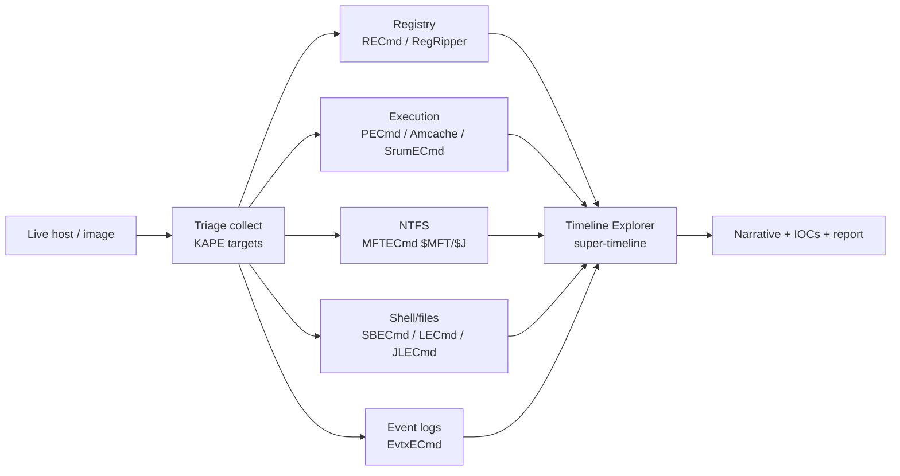
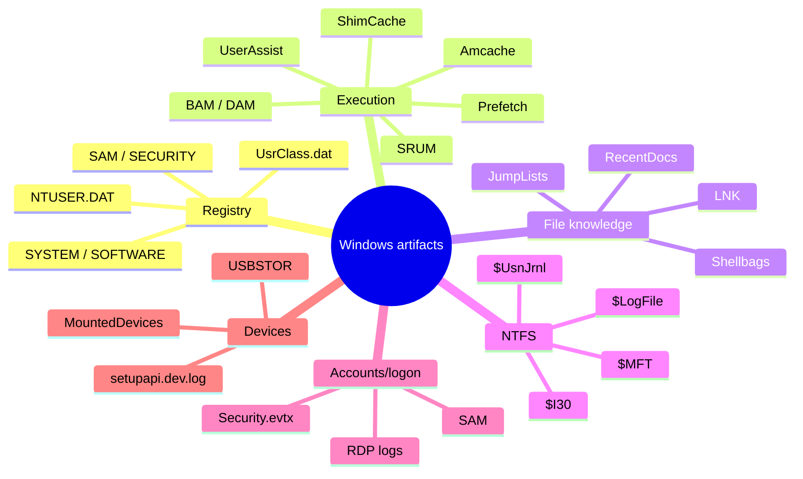
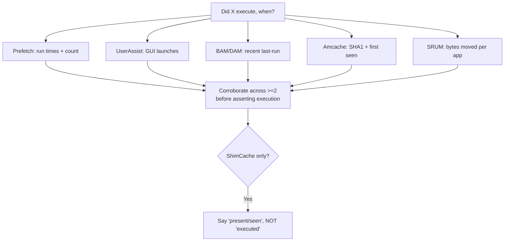
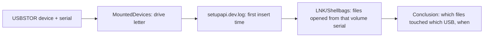
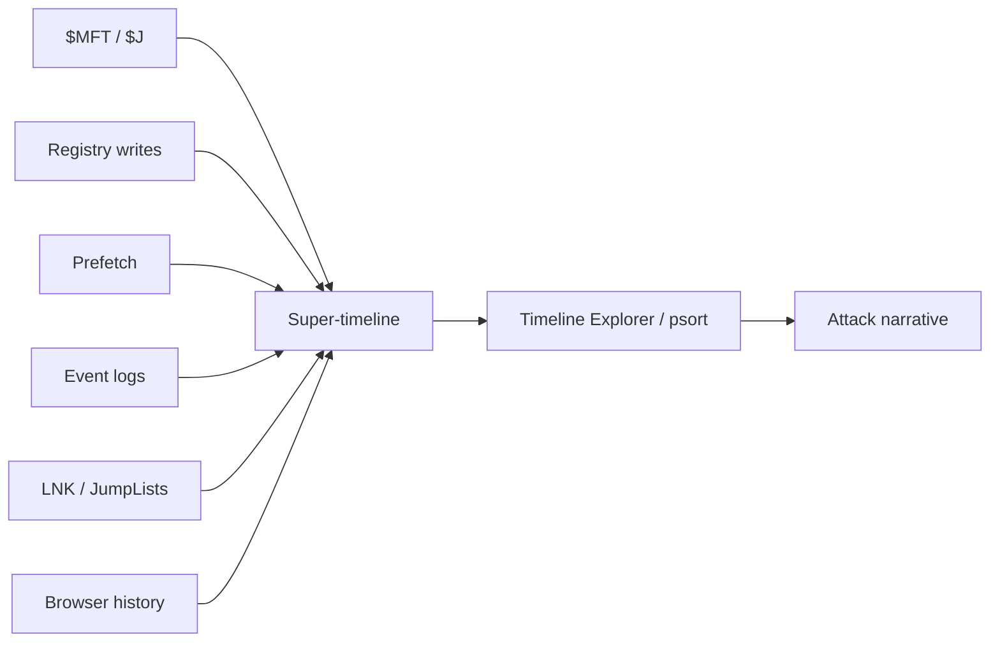
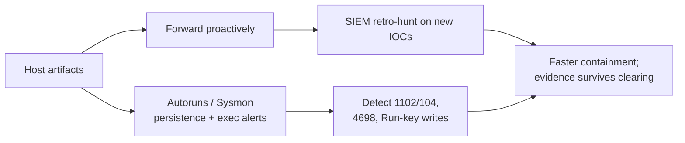

**Level:** Advanced · **Track:** DFIR & Incident Response · **Read time:** 260 min

This is Chapter 5 of the DFIR notebook. Chapter 4 froze a single instant of a running machine and reconstructed it from RAM. This chapter is the other half of that pair: the persistent record Windows leaves on disk of *everything that has happened* — every program run, every USB inserted, every folder opened, every file deleted — long after the process exited and the memory was reclaimed.

Windows is, from a forensic standpoint, a compulsive note-taker. To make the desktop feel fast and personal it caches, indexes, and logs your behaviour in dozens of places most users never see: the registry, Prefetch files, a half-dozen execution caches, the NTFS metadata journals, shell history, and the event logs. An attacker who deletes their tools and clears the obvious logs almost never cleans all of it, because most of these artifacts are undocumented side effects of features, not "logs" anyone thinks to wipe. Knowing where they are, what each one proves, and how to parse them at speed is the core skill of host forensics.

Everything here is for lawful work: incident response on systems you are authorised to examine, forensic labs, and DFIR/CTF images. Work on a copy of a copy, hash before and after, and never run collection tooling against evidence you don't have authority to touch.

---

## How Deep This Chapter Goes

By the end you should be able to take a live Windows host or a mounted disk image and:

- Name, locate, and interpret the two dozen artifacts that answer "what ran, when, by whom, from where".
- Explain exactly which artifact proves *execution* versus *presence* versus *knowledge of a file* — and why confusing them is a reporting error.
- Collect a forensically sound triage package from a live system with KAPE without contaminating the evidence.
- Parse every major artifact with the correct Eric Zimmerman tool and read its output.
- Build a single artifact super-timeline and pivot through it in Timeline Explorer.
- Detect timestomping, log clearing, and other anti-forensic tampering.
- Correlate all of this with the memory findings from Chapter 4 and the file-system findings from Chapter 3.



---

## Part 1: The Windows Artifact Mindset

Disk forensics (Chapter 3) taught you the file system underneath everything. This chapter sits one layer up: the operating system's own bookkeeping. The mental shift is from "what bytes are on the disk" to "what did Windows record about human and program behaviour".

Every artifact answers a specific question, and a good analyst keeps the questions straight:

| Question | Best artifacts |
| --- | --- |
| What programs **executed**? | Prefetch, Amcache, UserAssist, BAM/DAM, SRUM, `Security.evtx` 4688 |
| What programs were merely **present** (installed/copied)? | Amcache, ShimCache (AppCompatCache), `$MFT` |
| What files/folders did the user **know about / open**? | Shellbags, LNK, JumpLists, RecentDocs, MRU keys |
| What was **deleted**? | `$MFT` (unallocated entries), `$I` files in `$Recycle.Bin`, `$UsnJrnl` |
| Who **logged on**, when, from where? | `Security.evtx` (4624/4625/4634/4672), `SAM`, RDP logs |
| What **USB/removable** devices were attached? | `SYSTEM`/`SOFTWARE` USBSTOR & MountedDevices, `setupapi.dev.log` |
| What **network/data usage** happened per app? | SRUM (`SRUDB.dat`) |
| What **persistence** was installed? | Run keys, Services, Scheduled Tasks, WMI, Amcache |

**The single most important distinction:** *execution* evidence (it ran) is not the same as *presence* evidence (it existed) is not the same as *file-knowledge* evidence (someone browsed to it). ShimCache, notoriously, records that a file **existed and was seen by the application-compatibility engine** — it is *not* proof of execution, though it's often misreported as such. Getting this right is the difference between a defensible finding and a claim that collapses under cross-examination.



---

## Part 2: The Registry as a Forensic Database

The Windows **registry** is a hierarchical database the OS and applications use for configuration — but for a forensic analyst it is a treasure map of user and system behaviour. It's not one file; it's several **hive files** on disk, loaded and presented as a unified tree at runtime.

### Where the hives live

| Live path | Loaded as | Contains |
| --- | --- | --- |
| `C:\Windows\System32\config\SYSTEM` | `HKLM\SYSTEM` | Services, USBSTOR, ShimCache, network config, `CurrentControlSet` |
| `C:\Windows\System32\config\SOFTWARE` | `HKLM\SOFTWARE` | Installed software, Run keys, OS build, network profiles |
| `C:\Windows\System32\config\SAM` | `HKLM\SAM` | Local accounts, RIDs, password hash metadata |
| `C:\Windows\System32\config\SECURITY` | `HKLM\SECURITY` | LSA secrets, cached domain creds, audit policy |
| `C:\Users\<u>\NTUSER.DAT` | `HKCU` (per user) | UserAssist, RecentDocs, Run keys, typed paths, MRUs |
| `C:\Users\<u>\AppData\Local\Microsoft\Windows\UsrClass.dat` | `HKCU\...\Classes` | **Shellbags** (folder browsing) |

Two things beginners miss:

1. **The live registry ≠ the hive files.** On a running system the hives are locked; you can't just copy them. KAPE (Part 8) uses raw file-system access or the Volume Shadow Copy to grab a consistent copy. On a dead image, you copy the hive files straight out.
2. **Transaction logs matter.** Each hive has `.LOG1`/`.LOG2` files holding not-yet-committed changes. Registry Explorer can replay these "dirty" hives so you see the true latest state — and sometimes recover values that were mid-write.

### Deleted keys and slack

Registry hives, like file systems, don't zero deleted data immediately. **Registry Explorer** and **RegRipper** can recover **deleted keys/values** from hive slack — an attacker who deleted a `Run` persistence entry may leave it recoverable.

### RegRipper — teach-from-scratch

**RegRipper** (`rip.pl` / `rr.exe`) is an open-source registry-parsing tool driven by **plugins**, each of which knows how to extract and format one artifact (USB history, Run keys, UserAssist, etc.) from a given hive. It turns a raw hive into human-readable reports.

```bash
# Against a collected SYSTEM hive, run a single plugin or a full profile:
rip.exe -r SYSTEM -p compname            # computer name
rip.exe -r SYSTEM -p usbstor             # USB device history
rip.exe -r NTUSER.DAT -p userassist      # GUI program execution for that user
rip.exe -r SOFTWARE -f software > software_report.txt   # -f = run the 'software' profile (many plugins)
```

Sample `usbstor` output:

```
USBStor
Disk&Ven_SanDisk&Prod_Ultra&Rev_1.00
  S/N: 4C530001120523119012  [2027-03-10 22:14:07]
  FriendlyName : SanDisk Ultra USB Device
  First InsertDate : 2027-03-10 22:14:07 UTC
```

### Registry Explorer / RECmd (Eric Zimmerman)

**Registry Explorer** is the GUI; **RECmd** is its scriptable CLI. Both handle dirty-hive replay and deleted-key recovery, and RECmd ships **batch files** (YAML) that extract dozens of high-value keys at once.

```powershell
# Run a curated batch of forensic keys across a hive collection, output CSV:
RECmd.exe --bn BatchExamples\DFIRBatch.reb -d "C:\triage\C\Windows\System32\config" --csv "C:\out"
# --bn = batch file, -d = directory of hives, output one CSV per artifact
```

**IR use case:** the `Run`/`RunOnce` keys, `Services`, and `Image File Execution Options` (a debugger-hijack persistence) are the first registry stops in any intrusion. **Red-team relevance:** those are exactly the keys an operator writes for persistence — the artifact you parse is the artifact they created.

---

## Part 3: Execution Evidence — What Actually Ran

This is the most-asked question in an intrusion — "did this malware execute, and when?" — and Windows answers it in several overlapping places, each with different fidelity. You corroborate across them.

### Prefetch

**Prefetch** (`C:\Windows\Prefetch\*.pf`) is a performance feature: the first time a program runs, Windows records which files/DLLs it loaded so it can pre-load them next time. Forensically, each `.pf` proves a program executed and records **the last 8 run times** (Win8+), a run count, and the volume/files it touched.

```powershell
# Parse the whole Prefetch folder with PECmd:
PECmd.exe -d "C:\triage\C\Windows\Prefetch" --csv "C:\out" --csvf prefetch.csv
```

Annotated fields:

```
Executable       : EVIL.EXE
Hash             : A1B2C3D4          (from the path it ran from)
RunCount         : 3
LastRun          : 2027-03-11 04:10:33
PreviousRun0..6  : (up to 7 more timestamps)
FilesLoaded      : \VOLUME{...}\USERS\PUBLIC\EVIL.EXE, ...ntdll.dll ...
```

Two gotchas: Prefetch is **disabled on many servers** and on SSDs sometimes tuned down; and the filename hash encodes the **path**, so the same binary run from two locations makes two `.pf` files (useful for spotting relocation).

### Amcache

**Amcache.hve** (`C:\Windows\AppCompat\Programs\Amcache.hve`) is a registry hive recording executables that ran or were present, with **SHA-1 hashes**, full paths, compile times, and first-seen timestamps — extremely high value because the hash lets you pivot to threat intel.

```powershell
AmcacheParser.exe -f "C:\triage\C\Windows\AppCompat\Programs\Amcache.hve" --csv "C:\out"
# Produces *_UnassociatedFileEntries.csv with SHA1 + path + timestamps
```

### ShimCache (AppCompatCache)

**ShimCache** lives in the `SYSTEM` hive (`ControlSet\Control\Session Manager\AppCompatCache`). It records files the Application Compatibility engine evaluated — path, last-modified time of the file, and (on older OSes) an execution flag. **Critical caveat:** on modern Windows it proves the file **existed/was seen**, *not* that it executed, and its entries are only flushed to disk **at shutdown**. Misreading ShimCache as execution proof is the classic rookie error.

```powershell
AppCompatCacheParser.exe -f "C:\triage\C\Windows\System32\config\SYSTEM" --csv "C:\out"
```

### UserAssist, BAM/DAM, SRUM

- **UserAssist** (`NTUSER.DAT`): GUI programs the user launched via Explorer, ROT13-encoded, with **run counts and last-run times** — strong per-user execution evidence.
- **BAM/DAM** (Background/Desktop Activity Moderator, `SYSTEM` hive): last execution time per program per user SID — added in Win10, excellent recent-execution source.
- **SRUM** (System Resource Usage Monitor, `C:\Windows\System32\sru\SRUDB.dat`): per-application network bytes sent/received, energy, and execution over ~30–60 days — invaluable for proving data exfiltration volume by process.

```powershell
SrumECmd.exe -f "C:\triage\C\Windows\System32\sru\SRUDB.dat" -r "C:\triage\C\Windows\System32\config\SOFTWARE" --csv "C:\out"
# Network Usage CSV shows bytes per app -> spot the exfil process
```

| Artifact | Proves | Timestamps | Lives in |
| --- | --- | --- | --- |
| Prefetch | Execution | Up to 8 run times + count | `\Windows\Prefetch` |
| Amcache | Presence/execution + **SHA1** | First-seen, compile | `Amcache.hve` |
| ShimCache | **Presence** (seen), *not* execution | File last-modified | `SYSTEM` hive |
| UserAssist | Execution (GUI, per user) | Last run + count | `NTUSER.DAT` |
| BAM/DAM | Execution (recent) | Last run per SID | `SYSTEM` hive |
| SRUM | Execution + **bytes/network** per app | ~30–60 day rollup | `SRUDB.dat` |



---

## Part 4: The $MFT and NTFS Journals — MFTECmd

Chapter 3 introduced NTFS internals at the file-system layer. Here you operate them as a *triage* artifact using **MFTECmd**, Eric Zimmerman's parser for `$MFT`, `$Boot`, `$J` (`$UsnJrnl`), `$LogFile`, and `$SDS`.

### $MFT

The **Master File Table** has one record per file/folder, holding both `$STANDARD_INFORMATION` (SI) and `$FILE_NAME` (FN) timestamp sets. Parsing it gives you a complete file listing including **deleted** (unallocated) entries.

```powershell
MFTECmd.exe -f "C:\triage\C\$MFT" --csv "C:\out" --csvf mft.csv
# Columns: FullPath, IsDirectory, InUse(false = deleted), SI/FN Created/Modified/Accessed/Changed
```

**Timestomping detection:** compare SI vs FN. Attackers use tools that rewrite the easily-forged `$STANDARD_INFORMATION` timestamps but not `$FILE_NAME`; MFTECmd surfaces both, and a file whose SI is years older than its FN (or with sub-second zeros where FN has precision) is a timestomp flag.

### $UsnJrnl ($J) — the change journal

The **USN Journal** logs every change to every file (create, delete, rename, data-overwrite) with a reason code and timestamp — even for files long gone. It's one of the best "what did they touch and delete" sources.

```powershell
MFTECmd.exe -f "C:\triage\C\$Extend\$J" --csv "C:\out" --csvf usnjrnl.csv
# Reasons: FileCreate, FileDelete, DataOverwrite, RenameNewName ... with timestamps
```

### $LogFile and $I30

- **`$LogFile`** — the NTFS transaction log; lower-level than `$J`, can reconstruct operations and recover recently overwritten metadata.
- **`$I30`** — directory index slack; can reveal filenames that were in a folder and later deleted.

| Journal | Granularity | Best for |
| --- | --- | --- |
| `$MFT` | Per-file record | Full listing, deleted files, timestomp detection |
| `$UsnJrnl ($J)` | Per-change event | Create/delete/rename history, exfil staging |
| `$LogFile` | Per-transaction | Recovering recent metadata, ordering ops |
| `$I30` | Directory index | Deleted filenames still indexed in a folder |

---

## Part 5: File-Knowledge & Browsing Artifacts

These prove a *human* interacted with files/folders — priceless for insider cases and for showing an attacker browsed a share.

### Shellbags — SBECmd

**Shellbags** (in `UsrClass.dat` and `NTUSER.DAT`) record the view settings of every folder a user has ever opened in Explorer — including **network shares, removable drives, and folders since deleted**. Proof a user *navigated* somewhere even if nothing was copied.

```powershell
SBECmd.exe -d "C:\triage\C\Users\jdoe\AppData\Local\Microsoft\Windows" --csv "C:\out"
# Rows: BagPath, AbsolutePath (e.g. \\FILESERVER\HR\Salaries), FirstInteracted, LastInteracted
```

### LNK files — LECmd

Windows auto-creates **shortcut (.lnk)** files in `Recent` when a user opens a document. Each `.lnk` embeds the target's **full path, size, timestamps, volume serial, and even the source machine** — so a `.lnk` on the victim can reveal a file that lived on the attacker's USB or a remote share.

```powershell
LECmd.exe -d "C:\triage\C\Users\jdoe\AppData\Roaming\Microsoft\Windows\Recent" --csv "C:\out"
```

### JumpLists — JLECmd

**JumpLists** (`AutomaticDestinations`/`CustomDestinations`) store per-application recent-file history (the list you see right-clicking a taskbar icon). They persist even after `Recent` is cleared and tie files to the specific app that opened them.

```powershell
JLECmd.exe -d "C:\triage\C\Users\jdoe\AppData\Roaming\Microsoft\Windows\Recent\AutomaticDestinations" --csv "C:\out"
```

### Recycle Bin

`$Recycle.Bin\<SID>\` holds `$I` (metadata: original path, deletion time, size) and `$R` (the actual deleted content) file pairs — recover what a user deleted and when.

---

## Part 6: Accounts, Logons, and Removable Devices

- **Logon evidence** comes from `Security.evtx`: **4624** (successful logon, with Logon Type — 2 interactive, 3 network, 10 RDP), **4625** (failed), **4634/4647** (logoff), **4672** (admin logon), **4720** (account created), **4728/4732** (added to privileged group). Covered in depth in Chapter 7.
- **Local accounts** and RID/hint metadata come from the `SAM` hive.
- **USB/removable history** comes from `SYSTEM\...\USBSTOR` and `MountedDevices`, cross-referenced with `setupapi.dev.log` for first-insert times and the mapped drive letter — the standard "was data exfiltrated to a thumb drive" workflow, corroborated with LNK/Shellbags volume serials.



---

## Part 7: KAPE — Kroll Artifact Parser and Extractor, From Zero

**KAPE** is a free triage tool that does two jobs: **collect** artifacts fast from a live or mounted system (**Targets**), and **process** them with parsers (**Modules**). Its genius is speed and small footprint — it grabs the few hundred MB of artifacts that matter instead of a multi-terabyte disk image, in minutes, using raw file-system reads so it can copy locked files like `$MFT` and loaded hives.

### Targets vs Modules

- **Targets** = *what to collect* (definitions listing file paths/globs). Examples: `!SANS_Triage`, `RegistryHives`, `EventLogs`, `FileSystem`, `WebBrowsers`.
- **Modules** = *what to run on collected data* (they shell out to tools like the EZ suite, RegRipper, etc.).

### CLI and GUI

```powershell
# Collect the SANS triage target set from live C: to an output folder (raw reads bypass locks):
kape.exe --tsource C: --target !SANS_Triage --tdest E:\triage\%m --vhdx case42
#   --tsource : source volume
#   --target  : target definition (compound target here)
#   --tdest   : destination (%m = machine name)
#   --vhdx    : wrap output in a VHDX container (keeps it tidy + mountable)

# Collect AND process in one pass (module stage runs EZ parsers -> CSV):
kape.exe --tsource C: --target !SANS_Triage --tdest E:\triage --module !EZParser --mdest E:\out --mflush
```

**gkape.exe** is the GUI equivalent — tick targets/modules, it builds the command line for you.

### Minimising footprint on a live host

Order-of-volatility discipline (Chapter 4) still applies: capture **RAM first**, *then* run KAPE. KAPE writes to **removable/remote media**, never the evidence disk, and its raw-read collection avoids changing access times on the source. Record the exact command and KAPE's own log (`!kape.log`) in your notes — reproducibility is part of the evidence.


---

## Part 8: The Eric Zimmerman Toolset — One Tool per Artifact

The **EZ Tools** are the de-facto standard open-source Windows-artifact parsers. Each is a focused CLI that emits clean CSV (ready for **Timeline Explorer**). Learn them as a set — one per artifact from the parts above.

| Tool | Parses | Key output |
| --- | --- | --- |
| **MFTECmd** | `$MFT`, `$J`, `$LogFile`, `$Boot`, `$SDS` | File listing, change journal, timestomp SI/FN |
| **Registry Explorer / RECmd** | Any hive (dirty-replay, deleted keys) | GUI browse / batch CSV |
| **PECmd** | Prefetch `.pf` | Run times, count, files loaded |
| **AmcacheParser** | `Amcache.hve` | SHA1 + path + first-seen |
| **AppCompatCacheParser** | ShimCache (`SYSTEM`) | Seen files + last-modified |
| **SBECmd** | Shellbags (`UsrClass.dat`) | Folders browsed + times |
| **LECmd** | `.lnk` files | Target path, volume serial, source host |
| **JLECmd** | JumpLists | Per-app recent files |
| **SrumECmd** | `SRUDB.dat` | Per-app network bytes |
| **RBCmd** | `$Recycle.Bin` `$I` files | Deleted file metadata |
| **WxTCmd** | Windows 10 Timeline (`ActivitiesCache.db`) | App/file activity |
| **EvtxECmd** | `.evtx` event logs | Normalised events + maps (Chapter 7) |
| **Timeline Explorer** | Any EZ CSV | Sort/filter/tag/super-timeline |
| **EZViewer** | Generic file viewer | Quick preview |

**Install:** `Get-ZimmermanTools.ps1` downloads/updates the whole suite. All are .NET; run on Windows (or Linux/macOS via the .NET runtime for the cross-platform builds).

```powershell
# One-shot: update every EZ tool into .\ZTools
.\Get-ZimmermanTools.ps1 -Dest C:\ZTools
```

### Timeline Explorer

**Timeline Explorer (TLE)** is a spreadsheet-on-steroids for EZ CSVs: load one or many, sort/filter by column, colour-tag rows, and pivot. The workflow is to generate a **super-timeline** (Part 9) and hunt in TLE rather than reading raw CSVs.

---

## Part 9: Building the Artifact Super-Timeline

A **super-timeline** fuses timestamps from every artifact — `$MFT`, registry last-writes, Prefetch runs, event logs, browser history, LNK — into one chronological table so you can read an intrusion minute by minute. The canonical tool is **log2timeline/plaso** (`log2timeline.py` → `psort.py`), which you met briefly in Chapter 3; here it's the capstone of artifact analysis.

```bash
# 1) Ingest a mounted image or triage folder into a plaso storage file:
log2timeline.py --storage-file case42.plaso E:\triage\case42\

# 2) Filter to a window and export CSV (or l2tcsv) for review:
psort.py -o l2tcsv -w case42_timeline.csv case42.plaso \
   "date > '2027-03-11 00:00:00' AND date < '2027-03-11 06:00:00'"
```

Alternatively, keep everything in the EZ ecosystem: run KAPE's `!EZParser` module, then load all resulting CSVs into Timeline Explorer and sort by timestamp — lighter-weight and often faster for targeted intrusions.



---

## Part 10: Hands-On Lab — Triage to Timeline on a Compromised Host

A complete, reproducible workflow. Scenario continues from Chapter 4: the memory image already told you `evil.exe` (Meterpreter) and a `rundll32` reflective DLL beaconed to `185.234.72.19`, with `Run`-key persistence via `C:\Users\Public\update.dll`. Now you confirm and *timeline* it from disk artifacts.

### Step 0 — collect with KAPE (after RAM capture)

```powershell
kape.exe --tsource C: --target !SANS_Triage --tdest E:\triage --vhdx case42 ^
         --module !EZParser --mdest E:\out --mflush
# ~3-5 minutes; E:\out now holds CSVs for every artifact below.
```

### Step 1 — confirm execution of the payloads

```powershell
PECmd.exe -d E:\triage\case42\C\Windows\Prefetch --csv E:\out --csvf pf.csv
```

```
Executable  RunCount  LastRun               SourceCreated
EVIL.EXE    2         2027-03-11 04:10:35   2027-03-11 04:10:30   <-- executed twice
RUNDLL32.EXE 41       2027-03-11 04:10:31   ...                   <-- ran, check FilesLoaded
```

`EVIL.EXE`'s Prefetch `FilesLoaded` list references `\USERS\PUBLIC\UPDATE.DLL` — ties the two together on disk.

### Step 2 — hash pivot via Amcache

```powershell
AmcacheParser.exe -f E:\triage\case42\C\Windows\AppCompat\Programs\Amcache.hve --csv E:\out
# UPDATE.DLL  SHA1: 3f2a...9c  Path: C:\Users\Public\update.dll  FirstRun: 2027-03-11 04:10:30
# -> submit SHA1 to threat intel; it matches a known loader family
```

### Step 3 — persistence in the registry

```powershell
RECmd.exe --bn BatchExamples\DFIRBatch.reb -d E:\triage\case42\C\Windows\System32\config --csv E:\out
# Run key: "Updater" = rundll32 C:\Users\Public\update.dll,DllRegisterServer  (LastWrite 04:10:32)
```

Cross-check the recovered **deleted** keys — if the attacker deleted the Run entry before capture, RECmd/RegRipper may still surface it from hive slack.

### Step 4 — file activity from $MFT and $J

```powershell
MFTECmd.exe -f "E:\triage\case42\C\$MFT" --csv E:\out --csvf mft.csv
MFTECmd.exe -f "E:\triage\case42\C\$Extend\$J" --csv E:\out --csvf usn.csv
# $J shows: FileCreate update.dll 04:10:29; FileCreate evil.exe 04:10:29;
#           DataOverwrite on 200+ user docs 04:12:00-04:13:40  <-- ransomware encryption pass
# $MFT: SI created 2019 but FN created 2027-03-11 on update.dll -> TIMESTOMP
```

### Step 5 — user knowledge & staging

```powershell
SBECmd.exe -d E:\triage\case42\C\Users\jdoe\AppData\Local\Microsoft\Windows --csv E:\out
LECmd.exe  -d E:\triage\case42\C\Users\jdoe\AppData\Roaming\Microsoft\Windows\Recent --csv E:\out
# Shellbags: \\FILESERVER\Finance browsed 04:11:10  -> lateral interest
# LNK: C:\Users\jdoe\Desktop\passwords.xlsx opened 04:11:40
```

### Step 6 — exfil volume from SRUM

```powershell
SrumECmd.exe -f E:\triage\case42\C\Windows\System32\sru\SRUDB.dat -r E:\triage\case42\C\Windows\System32\config\SOFTWARE --csv E:\out
# NetworkUsage: rundll32.exe  BytesSent 1.7 GB  to external  04:11-04:12  <-- exfiltration before encryption
```

### Step 7 — logons

```powershell
EvtxECmd.exe -d E:\triage\case42\C\Windows\System32\winevt\Logs --csv E:\out
# 4624 Type 3 from 10.10.14.7 with svc_backup  04:09:40 -> lateral movement using stolen creds (Chapter 4)
```

### Step 8 — assemble the super-timeline

Load `pf.csv`, `mft.csv`, `usn.csv`, registry CSVs, `srum` and `evtx` CSVs into **Timeline Explorer**, sort by timestamp, colour-tag the malicious rows:

```
04:09:40  4624 Type3 svc_backup from 10.10.14.7        (initial lateral logon)
04:10:29  $J FileCreate update.dll, evil.exe           (payload dropped)
04:10:30  Amcache/Prefetch first run evil.exe          (execution)
04:10:32  Run-key "Updater" written                    (persistence)
04:11:10  Shellbag \\FILESERVER\Finance                (recon/staging)
04:11-12  SRUM rundll32 1.7 GB sent                     (EXFIL)
04:12-13  $J DataOverwrite 200+ docs                    (ENCRYPTION)
```

That single ordered view — impossible from any one artifact — is the deliverable. It shows the full kill chain: stolen-cred logon → drop → execute → persist → recon → exfiltrate → encrypt.

---

## Part 11: Anti-Forensics and Tamper Detection

Attackers try to break this artifact trail. Know the tampering and how each is caught:

- **Timestomping** → caught by `$MFT` SI-vs-FN comparison (MFTECmd) and by `$UsnJrnl`/`$LogFile`, which record the *real* change time regardless of forged SI.
- **Event-log clearing** → Windows logs its own clearing: **1102** (Security log cleared) and **104** (System log cleared) — the very act leaves an event. Gaps in sequential Record IDs also betray deletion.
- **Prefetch/USN disabling or deletion** → absence is itself suspicious on a workstation; corroborate execution from Amcache/UserAssist/SRUM instead.
- **Registry key deletion** → recoverable from hive slack (RECmd/RegRipper deleted-key recovery) and transaction logs.
- **Anti-forensic tools (BleachBit, sdelete, cipher /w, wevtutil cl)** → their own execution shows up in Prefetch/Amcache/UserAssist — the cleanup tool incriminates itself.
- **Living-off-the-land** → legitimate binaries (`rundll32`, `regsvr32`, `mshta`) leave normal artifacts; the anomaly is *what* they loaded and *when*, visible in Prefetch `FilesLoaded` and Amcache paths.

**Never trust a single timestamp.** Corroborate across artifacts and across the SI/FN/journal sources; a defensible timeline rests on agreement between independent artifacts, exactly the cross-view discipline from Chapter 4.

---

## Part 12: Detection & Defense Angle

The consolidated blue-team payoff. Everything above is post-mortem; the same data, collected proactively, becomes detection.

**Turn artifacts into telemetry and hunts:**

- **Execution artifacts → EDR/Sysmon.** Prefetch/Amcache after the fact map to **Sysmon Event ID 1 (Process Create)** live, with hashes and command lines. Ship Amcache/AppCompat and Prefetch to your SIEM for retro-hunting when a new IOC drops.
- **Persistence keys → autoruns monitoring.** Alert on writes to `Run`/`RunOnce`, `Services`, `IFEO Debugger`, and new Scheduled Tasks (**4698**) — the keys you parse are the keys to watch. Sysinternals **Autoruns** enumerates them all live.
- **USB/exfil → device control + SRUM/DLP.** SRUM's per-app byte counts are a forensic mirror of what DLP and proxy logs should catch live; enforce removable-media policy and egress monitoring.
- **Log clearing → high-severity alert.** **1102/104** should page someone immediately; forward logs off-host (WEF/SIEM) so clearing the local copy doesn't destroy evidence.
- **Timeline coverage → enable the sources.** Ensure Prefetch is on where feasible, **Process Command-Line auditing (4688)**, PowerShell Script Block Logging, and adequate `Security.evtx` size/retention so the artifacts you'll need actually exist.

**Hardening that preserves and enriches evidence:** central log forwarding (attacker can't clear what already left the box), Sysmon with a good config, LAPS + tiered admin (limits the credential theft that started the lab), and application allow-listing (stops the LOLBin/download-cradle stage).



---

## Part 13: Final Revision / Summary

- Windows records behaviour in dozens of undocumented places; an attacker rarely wipes them all. Your job is to know each artifact and **what it actually proves**.
- Keep the categories straight: **execution** (Prefetch, UserAssist, BAM, SRUM, Amcache) vs **presence** (ShimCache, Amcache, `$MFT`) vs **file-knowledge** (Shellbags, LNK, JumpLists). ShimCache ≠ execution.
- The **registry is a forensic database** in six hive files; parse it with Registry Explorer/RECmd or RegRipper, replay dirty hives, and recover deleted keys.
- The **`$MFT` and NTFS journals** (`$J`, `$LogFile`, `$I30`) give a full file history and catch timestomping via SI-vs-FN — parse with MFTECmd.
- **KAPE** collects the right few hundred MB fast (Targets) and parses it (Modules); capture RAM first, write to external media, log the command.
- The **EZ Tools** are one parser per artifact, all feeding **Timeline Explorer**; the deliverable is a fused **super-timeline** (EZ CSVs or plaso).
- **Anti-forensics leaves its own artifacts**: log clearing (1102/104), cleanup tools in Prefetch, forged SI vs honest FN/journals. Corroborate across independent sources.
- Proactively forwarded, these same artifacts become detections and retro-hunt fuel.

The next chapter moves off Windows to **Linux & Cloud Forensics** — the artifact map, log sources, and acquisition realities of Linux hosts, containers, and cloud instances, where the "everything is a file" model and provider APIs change the whole method.

---

## Part 14: Cheat Sheet / Quick Reference

**Collection (KAPE):**

```powershell
kape.exe --tsource C: --target !SANS_Triage --tdest E:\tri --vhdx %m --module !EZParser --mdest E:\out --mflush
gkape.exe            # GUI
```

**Per-artifact parser (EZ Tools):**

```powershell
MFTECmd.exe -f "X:\$MFT" --csv out; MFTECmd.exe -f "X:\$Extend\$J" --csv out
PECmd.exe -d X:\Windows\Prefetch --csv out
AmcacheParser.exe -f X:\Windows\AppCompat\Programs\Amcache.hve --csv out
AppCompatCacheParser.exe -f X:\Windows\System32\config\SYSTEM --csv out
RECmd.exe --bn BatchExamples\DFIRBatch.reb -d X:\Windows\System32\config --csv out
SBECmd.exe -d X:\Users\<u>\AppData\Local\Microsoft\Windows --csv out
LECmd.exe -d X:\Users\<u>\...\Recent --csv out
JLECmd.exe -d X:\Users\<u>\...\Recent\AutomaticDestinations --csv out
SrumECmd.exe -f X:\Windows\System32\sru\SRUDB.dat -r ...\SOFTWARE --csv out
RBCmd.exe -d X:\$Recycle.Bin --csv out
EvtxECmd.exe -d X:\Windows\System32\winevt\Logs --csv out
```

**RegRipper:**

```bash
rip.exe -r SYSTEM -p usbstor ; rip.exe -r NTUSER.DAT -p userassist ; rip.exe -r SOFTWARE -f software
```

**Artifact → question map:**

```
Executed?      Prefetch, UserAssist, BAM/DAM, SRUM, Amcache (SHA1)
Present/seen?  ShimCache (NOT execution), Amcache, $MFT
Opened/knew?   Shellbags, LNK, JumpLists, RecentDocs
Deleted?       $MFT unalloc, $Recycle.Bin $I, $UsnJrnl
Logon?         Security.evtx 4624/4625/4634/4672
USB?           USBSTOR + MountedDevices + setupapi.dev.log
Exfil volume?  SRUM NetworkUsage
Tamper?        1102/104, SI-vs-FN, cleanup tool in Prefetch
```

**Super-timeline:**

```bash
log2timeline.py --storage-file c.plaso E:\triage\  ; psort.py -o l2tcsv -w tl.csv c.plaso "date > '...'"
# or: KAPE !EZParser -> load all CSVs into Timeline Explorer, sort by time
```

---

## Part 15: Common Pitfalls

- **Calling ShimCache "execution".** It proves the file was *seen*; flushed at shutdown. Use Prefetch/Amcache/UserAssist for execution.
- **Copying live hives naively.** They're locked; use KAPE raw-read or VSS, or you get a corrupt/partial hive.
- **Ignoring transaction logs.** Not replaying `.LOG1/.LOG2` (dirty hive) gives you stale registry state — Registry Explorer replays automatically; RegRipper may not.
- **Trusting SI timestamps.** Easily timestomped; corroborate with FN and `$UsnJrnl`/`$LogFile`.
- **Running KAPE before RAM capture.** Volatile evidence dies first — memory then disk triage.
- **Writing output to the evidence disk.** Always `--tdest` to removable/remote media; note the command in your log.
- **Prefetch absent = "nothing ran".** It's off on many servers; pivot to other execution artifacts.
- **Single-artifact conclusions.** Every asserted fact should rest on ≥2 independent artifacts.
- **Time zone confusion.** EZ tools output UTC by default; keep everything UTC until the final report, then convert once.
- **Forgetting per-user hives.** `NTUSER.DAT`/`UsrClass.dat` are per user — parse each relevant user's, not just the machine hives.

---

## Part 16: Practice Labs & Resources

- **SANS DFIR "SANS Triage" & Windows Forensics (FOR500) sample images** — the canonical practice set; reproduce Parts 3–10.
- **AboutDFIR / DFIR Madness** — free full-disk images with worked walkthroughs covering registry, Prefetch, USN, and timelines.
- **CyberDefenders** — Windows-artifact challenges (e.g. *"Insider"*, *"GrabThePhisher"*, *"NerisBot"*, USB-exfil labs) that grade you on parsing exactly these artifacts.
- **TryHackMe** — *Windows Forensics 1 & 2*, *KAPE*, *Registry Forensics*, and *Investigating Windows* rooms.
- **HackTheBox Sherlocks** — DFIR scenarios requiring MFT/registry/event-log correlation.
- **Eric Zimmerman's training data** — the free sample images bundled with his SANS classes; run every EZ tool against them.
- **Build your own** — on a disposable VM: insert a USB, open some docs, install a benign "persistence" Run key, then triage with KAPE and reconstruct your own actions in Timeline Explorer.

Practice questions to test yourself on any image:

1. Prove a specific executable ran and give its run count and last-run time, citing which two execution artifacts you used and why ShimCache alone would be insufficient.
2. Determine which USB device was attached, when it was first inserted, its drive letter, and at least one file opened from it.
3. Detect a timestomped file and state exactly which timestamp fields established the forgery.
4. Show that the Security event log was cleared, and give the event ID and time that proves it.
5. Reconstruct, from disk artifacts alone, the order of drop → execute → persist → exfiltrate → encrypt for the lab host, citing the artifact behind each step.

---

*Also on [Praneeth's portfolio](https://ping-praneeth.vercel.app/notebook/dfir/05-windows-artifacts-and-triage-registry-mft-kape-and-eric-zimmerman-tools), with comments and the latest edits.*
