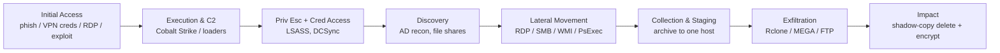
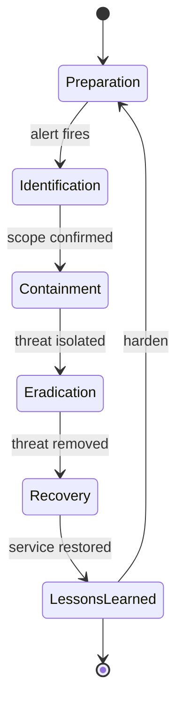
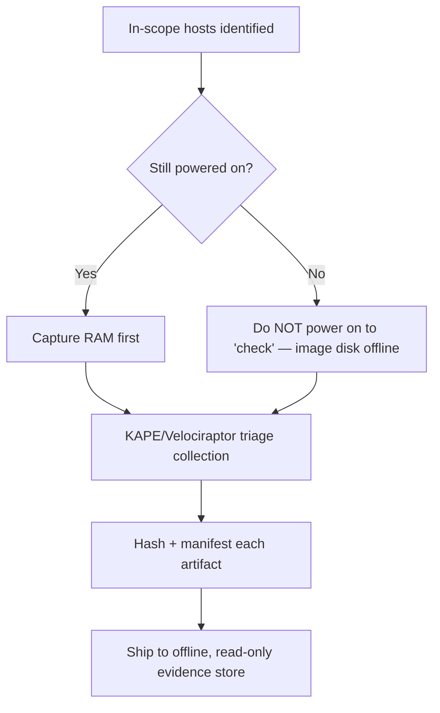
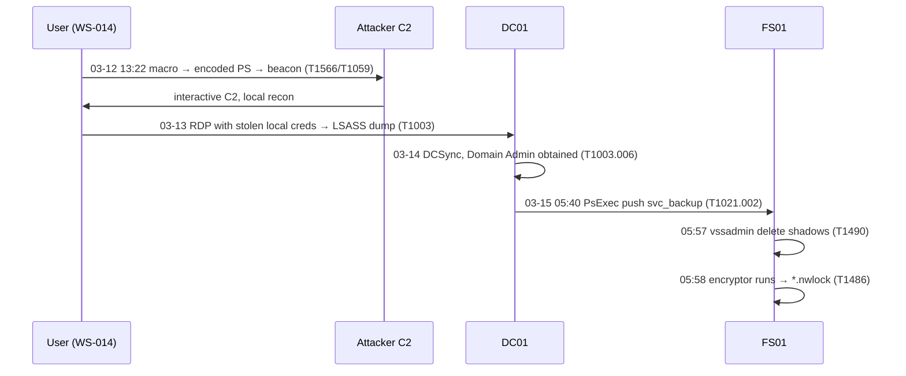
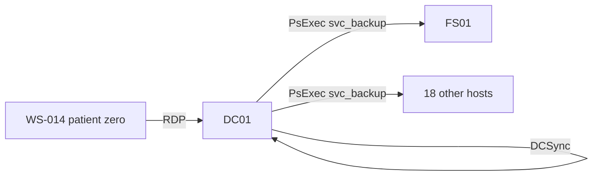
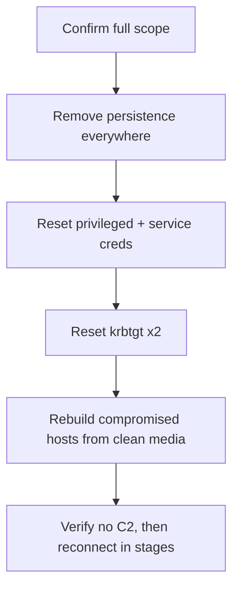
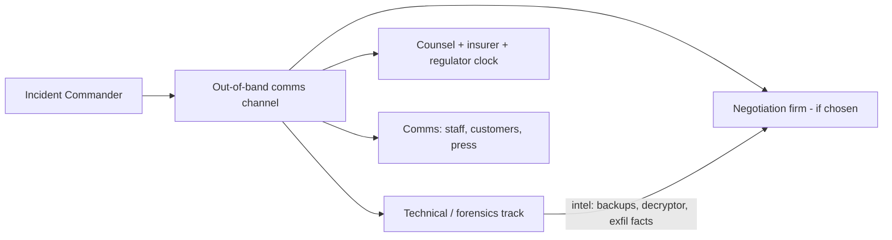
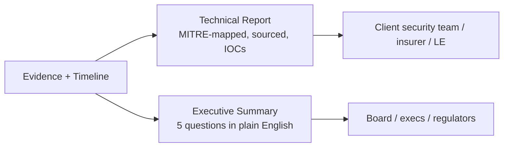

**Level:** Expert · **Track:** DFIR & Incident Response · **Read time:** 275 min

This is Chapter 8, the final chapter of the DFIR notebook, and it is
deliberately different from the others. The previous chapters each
taught one skill — memory forensics, disk artifacts, log timelines. This
chapter puts all of them together the way a real engagement does: as a
single, messy, time-pressured investigation where you must decide *what
to look at next* while an executive asks *when will we be back online*
and a lawyer asks *was personal data taken*.

The vehicle is a full worked case study — a fictional but technically
faithful ransomware-plus-data-breach intrusion at a company called
**Northwind Logistics**. Every tool, command, artifact, and decision in
it is real; only the victim is invented. By the end you will have walked
the complete arc: alert, scope, acquire, timeline, attribute the entry,
prove the theft, contain, eradicate, recover, and report.

Everything here is for lawful defensive work: incident response on
systems you are authorised to examine, tabletop exercises, and DFIR
labs. Ransomware and its tooling are discussed at the level a responder
needs to investigate and defend — not to build or operate. Never run
recovered malware outside an isolated, authorised lab, and never point
offensive tooling at infrastructure you don't own.

---

## Part 1: How Modern Ransomware Actually Works

You cannot investigate what you don't understand. The mental model most
people carry — "a virus encrypted the files" — is a decade out of date
and will cause you to look in the wrong places. Modern ransomware is a
**human-operated, multi-stage intrusion** run as a business, and the
encryption is the *last* thing that happens, often weeks after the first
foothold.

**The Ransomware-as-a-Service (RaaS) economy.** The crew that encrypts
you rarely wrote the malware. The ecosystem is specialised:

| Role | What they do |
|------|--------------|
| **Malware developers** | Build and maintain the encryptor, the leak site, the affiliate panel — the "RaaS operator" |
| **Affiliates** | Rent the encryptor, do the actual break-in, split the ransom (often 70–90% to the affiliate) |
| **Initial Access Brokers (IABs)** | Sell ready-made footholds (valid VPN creds, RDP, web shells) on forums so affiliates skip the break-in |
| **Negotiators / money launderers** | Handle victim chat and cash-out via mixers and exchanges |

This division of labour matters to your investigation: the tradecraft
you see in the initial access may belong to a *different* actor than the
tradecraft in the encryption, because they are different people.
Attribution (next notebook) has to account for that.

**Double and triple extortion.** Encryption alone stopped being enough
once victims started restoring from backups. So crews added leverage:

- **Single extortion:** encrypt files, sell the decryption key.
- **Double extortion:** *steal* the data first, then encrypt — "pay or we
  publish." This is why a ransomware case is *always* also a data-breach
  case until proven otherwise. **Proving or disproving exfiltration is now
  the single most important investigative question**, because it drives
  legal breach-notification obligations.
- **Triple extortion:** add DDoS, or directly harass the victim's
  customers/employees, to increase pressure.

**The human-operated kill chain.** A typical intrusion, mapped to MITRE
ATT&CK tactics, unfolds over days to weeks:



Notice where impact sits: **dead last.** By the time the encryptor runs
and everyone panics, the attacker has usually been inside for days, has
stolen the data, and has deleted the backups. Your investigation runs
this chain in reverse — from the loud, obvious encryption backwards to
the quiet initial access — which is exactly what makes timeline analysis
(previous chapter) the core skill.

**Dwell time and the "time-to-ransom" trend.** Historically attackers
dwelled for weeks. The trend is toward *faster* operations — some crews
go from initial access to encryption in under 24 hours — which
compresses your detection window and makes pre-existing logging
(retention!) decisive.

---

## Part 2: The Investigation Framework — What "Doing IR" Actually Means

Before the case, fix the framework in your head. The industry standard
lifecycle (NIST SP 800-61 / SANS PICERL) has six phases, and a
ransomware case exercises all of them under pressure:



Two things about this diagram matter for ransomware specifically. First,
**containment and investigation run in parallel, not in sequence.** You
do not get to finish the forensics before deciding whether to isolate
hosts — the business is bleeding. You containment-triage on partial
information and keep investigating. Second, **the goal of the
investigation is answers to business questions, not a pile of
artifacts.** Every finding must serve one of these questions:

1. **How did they get in?** (so you can close the door)
2. **What did they touch, and are they still here?** (scope + eradication)
3. **Was data stolen, and whose?** (legal/regulatory breach obligations)
4. **Can we recover without paying?** (backups, decryptor availability)
5. **How do we stop it happening again?** (lessons learned)

Keep those five questions taped to your monitor for the rest of this
chapter. Everything we do in the Northwind case exists to answer one of
them.

---

## Part 3: The Case — Northwind Logistics, T+0

**The alert.** At 07:14 local time, Northwind Logistics' IT manager
calls the IR retainer line: employees arriving for the morning shift
find workstations displaying a full-screen ransom note, files renamed
with a `.nwlock` extension, and the shared drives inaccessible. The
warehouse management system is down. This is a live, business-halting
ransomware event.

**The first 60 minutes — scoping, not solving.** Resist the urge to dive
into a single machine. The first hour is about *scope and
stabilisation*. Your intake questions, asked of the client on the bridge
call:

| Question | Why it matters |
|----------|----------------|
| How many hosts show the ransom note? | Blast radius; is it one segment or the whole estate? |
| Are backups online and reachable — or also encrypted? | Determines whether paying is even on the table |
| Is the encryptor still running / spreading right now? | Drives immediate containment urgency |
| What's the ransom note say — group name, contact, extension? | First attribution lead + leak-site check |
| Do you have EDR? A SIEM? How long is log retention? | Determines what evidence still exists |
| Any recent alerts you dismissed? Odd logins? New VPN users? | Points at the initial-access date |
| Is there a cyber-insurance policy / breach counsel? | They must be engaged *now* — legal privilege, notification clocks |

**Immediate containment decisions (made on partial info).** With
ransomware still potentially spreading, you make fast,
reversible-where-possible calls:

- **Isolate, don't power off.** Pulling the network cable (or EDR
  network-isolation) stops spread and preserves RAM and disk. **Powering
  off destroys memory evidence** — the encryptor's keys, injected C2, and
  process state may live only in RAM. Only power off if isolation is
  impossible and active encryption must be stopped.
- **Preserve, don't wipe.** Tell the client *not* to re-image machines yet
  — each is evidence. The pressure to "just rebuild and move on" is
  intense and is the enemy of both investigation and the breach
  determination.
- **Protect the backups.** If backups are still intact, get them *offline
  and read-only immediately* — crews specifically hunt and destroy
  backups, and a "safe" backup can be encrypted an hour into your
  response.
- **Rotate the crown jewels.** Assume domain-wide credential compromise;
  plan a staged reset of privileged and `krbtgt` accounts (twice) as part
  of eradication — but sequence it so you don't tip off an attacker still
  watching.

**IR use case — the parallel tracks.** From minute one you run three
tracks at once: **containment** (stop the bleeding), **investigation**
(answer the five questions), and **communication** (client execs,
legal/insurance, and — if regulated data is involved — a running clock
on notification deadlines). One person cannot do all three; this is why
IR is a team sport with an incident commander coordinating.

**The IR jump-bag.** Effective response depends on having tooling ready
*before* the call, because you cannot download a forensics toolkit onto
a network you've just told the client to isolate. A responder's jump-bag
(a hardened laptop plus a curated USB) contains:

| Category | Tools |
|----------|-------|
| Memory acquisition | WinPMEM, DumpIt, AVML (Linux), LiME |
| Triage collection | KAPE, Velociraptor, UAC (Linux triage) |
| Timeline | Plaso, Timesketch, the SANS SIFT VM |
| Log/EVTX analysis | Chainsaw, Hayabusa, EvtxECmd, jq, Zeek |
| Malware triage | FLARE-VM (isolated), PE tools, YARA, CyberChef |
| Live response | Sysinternals suite, EDR console access |
| Evidence handling | Write blockers, sha256 manifest scripts, encrypted evidence drives |

Everything is version-pinned and tested, and evidence storage is
encrypted and offline. **The single most common way a real engagement
stalls in hour one is a responder improvising tooling under pressure** —
the jump-bag is preparation-phase work that pays off precisely when
there's no time.

**Legal privilege and the notification clock.** The moment regulated
data *might* be involved, breach counsel should engage — often the
engagement runs *under legal privilege* so the investigation's working
notes are protected. Regulatory clocks can be short (GDPR's 72-hour
notification of a personal-data breach to the supervisory authority is
the canonical example), and they typically start when the organisation
becomes *aware* of the breach — i.e. now. This is why "engage counsel
and insurer" is a first-hour action, not a paperwork afterthought.

---

## Part 4: Evidence Acquisition Under Pressure

You have decided which hosts matter. Now acquire evidence in volatility
order (RFC 3227, from the previous chapter): volatile memory and live
state first, then disk, then centralised logs.

**Live triage collection.** On each in-scope Windows host that is still
powered on, capture volatile state before anything else. For a fleet, a
triage tool like **KAPE** or **Velociraptor** collects the high-value
artifacts fast; for a single deep-dive host, capture full memory too.

```powershell
# Memory image first (keys and injected C2 may live only here)
winpmem_mini.exe -o \\collection-share\NW-WS-014\mem.raw

# Then a targeted triage collection of disk artifacts with KAPE
kape.exe --tsource C: --target !SANS_Triage ^
         --tdest \\collection-share\NW-WS-014\triage --gui
```

`winpmem` acquires physical RAM to a raw image; KAPE's `!SANS_Triage`
target grabs event logs, `$MFT`, registry hives, prefetch, browser
history, and more — the exact artifacts you learned to read in earlier
chapters — without imaging the whole 500 GB disk, which you rarely have
time for. **Velociraptor** does the same across the whole fleet at once
via its hunt capability, which is why it has become the de facto
ransomware-IR collection tool:

```
# Velociraptor: hunt the entire estate for the triage artifact set
velociraptor --config server.yaml hunts create \
  --artifact Windows.KapeFiles.Targets \
  --parameter _SANS_Triage=Y
```

**Hash and manifest everything** at collection time (chain of custody,
previous chapter). **Acquire the encryptor and ransom note as evidence
too** — copy the malicious binary and the note into a hashed evidence
store; you will analyse them in Part 9, but never detonate them outside
a sandboxed lab.

**Order of hosts.** You cannot image everything, so prioritise:

1. The **domain controller(s)** — where credential theft and domain-wide
   push happen; the richest evidence of the whole operation.
2. **Patient-zero candidates** — anything the client flagged (odd logins,
   the first machine to alert).
3. **Servers holding sensitive data** — for the exfiltration determination.
4. A **representative sample** of encrypted workstations.



---

## Part 4b: Memory Forensics on the Beacon Host

Because you captured RAM from WS-014 and DC01 before isolating them, you
can recover the C2 implant even though it never touched disk in a
recognisable form (fileless). Use **Volatility 3** (taught in the memory
chapter) to pull the beacon and its configuration — a huge accelerator
for the timeline and the IOC list.

```bash
# What processes existed, and their parents — spot the injected/hollowed one
vol -f WS-014.mem.raw windows.pstree
#  ... 4188  powershell.exe  parent 3120 cmd.exe  parent 2904 WINWORD.EXE
#  ... 6620  rundll32.exe    parent 4188 powershell.exe   <-- no cmdline, suspicious

# Network connections held in memory at capture time
vol -f WS-014.mem.raw windows.netscan | grep ESTABLISHED
#  6620  rundll32.exe  10.0.5.114:52210 -> 45.83.x.x:443  ESTABLISHED

# Injected code / unbacked executable memory (classic Cobalt Strike)
vol -f WS-014.mem.raw windows.malfind --pid 6620 > malfind.txt
#  RWX private region in rundll32.exe, MZ header, shellcode stub
```

`windows.pstree` reconstructs parent-child lineage from the memory image
— confirming the `WINWORD → cmd → powershell → rundll32` chain even
after the processes died on disk. `windows.netscan` recovers socket
objects still in the pool, giving you the exact C2 tuple.
`windows.malfind` finds executable, private, unbacked memory regions —
the signature of injected shellcode. **IR use case:** carving the beacon
config out of that RWX region (with a Cobalt Strike config parser)
yields the C2 profile, sleep time, and watermark — high-value IOCs and
an attribution lead for the next notebook. This is precisely why you
capture RAM *before* powering off: none of this survives a shutdown.

---

## Part 5: Building the Master Timeline

With triage collections in hand, you build the intrusion timeline
exactly as taught in the previous chapter — one merged, UTC-normalised
super timeline across the DC, patient-zero candidates, the file server,
and the firewall/VPN logs. This is the spine of the entire case.

```bash
# One Plaso storage file per critical host, then merge in Timesketch
log2timeline.py --storage-file dc01.plaso  -z UTC ./NW-DC01_triage/
log2timeline.py --storage-file fs01.plaso  -z UTC ./NW-FS01_triage/
log2timeline.py --storage-file ws014.plaso -z UTC ./NW-WS-014_triage/

# Import all three into one Timesketch sketch so the whole team works one axis
timesketch_importer --sketch_id 77 --timeline_name DC01  dc01.plaso
timesketch_importer --sketch_id 77 --timeline_name FS01  fs01.plaso
timesketch_importer --sketch_id 77 --timeline_name WS014 ws014.plaso
```

**Anchor on the loud event and work backwards.** The one timestamp you
know for certain is when the encryptor ran — the mass file-modification
event and the ransom-note creation. In the Timesketch histogram it
appears as a violent spike of `$MFT` modifications:

```
2027-03-15 05:58:11Z  FILE  mass rename → *.nwlock begins on FS01 (thousands of files)
2027-03-15 05:58:09Z  EVT   7045 service "SystemRecovery" installed on FS01
2027-03-15 05:57:40Z  EVT   Volume Shadow Copies deleted (vssadmin) on FS01
```

That `vssadmin delete shadows` immediately before encryption is a
ransomware signature — killing recovery points is step one of impact.
Now pivot backwards (four corners) from FS01 and the accounts involved,
expanding the window earlier and earlier until you find the quiet
foothold. The next parts follow that trail.

**The completed master timeline.** After all the pivoting in Parts 6–9,
the merged, UTC-normalised, source-cited timeline for the whole
engagement looks like this — the single most important artifact in the
report:

| Time (UTC) | Host | Event | Source | ATT&CK |
|-----------|------|-------|--------|--------|
| 03-12 13:22:04 | WS-014 | OUTLOOK → WINWORD → cmd → `powershell -enc` | Sysmon 1 | T1566.001 / T1059.001 |
| 03-12 13:22:31 | WS-014 | Beacon → 45.83.x.x:443 | Sysmon 3 / proxy | T1071.001 |
| 03-12 14:05 | WS-014 | Local recon (`whoami /all`, `net view`) | Sysmon 1 | T1087 / T1018 |
| 03-13 09:11 | WS-014→DC01 | RDP logon with stolen local-admin creds | 4624 Type 10 | T1021.001 |
| 03-13 09:40 | DC01 | LSASS access (comsvcs MiniDump) | Sysmon 10 | T1003.001 |
| 03-14 22:04 | DC01 | Directory replication (DCSync) | 4662 | T1003.006 |
| 03-14 22:30 | DC01 | AnyDesk installed (backup access) | 7045 / registry | T1219 |
| 03-14 23:05 | FS01 | `7z a data.7z \\FS01\Finance \\FS01\HR` | Sysmon 1 / `$MFT` | T1560.001 |
| 03-14 23:40–01:15 | FS01 | `rclone copy` 14.1 GB → MEGA remote | Sysmon 1/3 / NetFlow | T1567.002 |
| 03-15 05:40 | DC01→FS01+18 | PsExec service push (`svc_backup`) | 4624 Type 3 / 7045 | T1021.002 |
| 03-15 05:57:40 | FS01 | `vssadmin delete shadows /all /quiet` | Sysmon 1 | T1490 |
| 03-15 05:58:09 | FS01 | Service "SystemRecovery" (encryptor) installed | 7045 | T1543.003 |
| 03-15 05:58:11 | FS01 | Mass rename → `*.nwlock`, ransom note dropped | `$MFT` / FILE | T1486 |

Read top to bottom, that table *is* the incident: a three-day,
human-operated campaign from one phished user to domain-wide encryption,
with the data theft (the rows on 03-14 23:xx) sitting squarely in the
middle. Everything else in the report exists to justify and expand these
thirteen rows.

---

## Part 6: Finding Patient Zero and the Initial-Access Vector

Working backwards from the encryption on FS01, you pivot on *which
account* pushed the encryptor and *where it came from*. The Windows logs
(previous chapter's Event IDs) tell the story.

**Trace the encryptor's origin.** On FS01, the service that ran the
encryptor (`7045` "SystemRecovery") was created by a `4624` Type-3
(network) logon from host **NW-DC01** using the account
`NORTHWIND\svc_backup`. So the DC pushed it. Pivot to DC01.

**On the DC**, `svc_backup` shows a `4672` (admin logon) and, crucially,
a chain of `4688` process events: `net group "Domain Admins"`, `nltest
/dclist`, and a run of `PsExec`-style service creations targeting many
hosts at 05:40 — the domain-wide push. But `svc_backup` is a service
account that should never interactively log on or enumerate the domain.
Where did the attacker *get* it? Pivot on when `svc_backup` first
behaved abnormally.

**The credential-theft moment.** Earlier on DC01, a Sysmon `10`
(ProcessAccess to LSASS) from a suspicious `rundll32.exe`, and
`4662`/DCSync-style directory-replication access, show credential
dumping. But that DC access came *from* another host — NW-WS-014, over
RDP. Pivot to WS-014.

**Patient zero.** On WS-014, the timeline's earliest anomaly is three
days before the encryption:

```
2027-03-12 13:22:04Z  EVT  Sysmon 1  OUTLOOK.EXE → WINWORD.EXE → cmd.exe → powershell -enc …
2027-03-12 13:22:31Z  EVT  Sysmon 3  powershell.exe → 45.83.x.x:443  (C2 beacon)
2027-03-12 13:24:10Z  WEB  proxy    GET hxxps://45.83.x.x/panel  (Cobalt Strike style)
```

The parent chain `OUTLOOK → WINWORD → cmd → powershell -enc` is the
fingerprint of a **malicious email attachment**: the user opened a
phishing email, enabled macros in the Word document, and the macro
launched an encoded PowerShell loader that established C2. That is
**patient zero and the initial-access vector: phishing with a
macro-enabled document (MITRE T1566.001 → T1059.001).** Decoding the
`-enc` blob (previous chapter's technique) confirms a download cradle
pulling a Cobalt Strike beacon.

**The full reverse-engineered chain**, now assembled forward:



Question 1 (how did they get in) is answered: **a phishing email to one
user, three days before impact.** Question 2 (what they touched, still
here?) is scoped: WS-014 → DC01 → FS01 and the hosts hit by the 05:40
push, with C2 to `45.83.x.x`.

---

## Part 7: Tracing Credential Theft and Lateral Movement

The single most important pivot in any ransomware case is
**credentials**, because domain-wide impact requires domain-wide
privilege. Reconstruct exactly which credentials were stolen and how
they were reused — this determines the scope of your password reset and
whether the attacker can walk back in tomorrow.

**Credential access.** The Sysmon `10` LSASS-access events and the
loaded `rundll32.exe`/`comsvcs.dll` MiniDump pattern point to **LSASS
memory dumping** (T1003.001) on WS-014 and DC01. The `4662` events with
the replication GUID on DC01 are the tell-tale of **DCSync** (T1003.006)
— the attacker asked the DC to replicate password hashes, effectively
dumping the entire domain's credentials including `krbtgt`. **That last
fact is decisive: once `krbtgt` is compromised, the attacker can forge
Golden Tickets and must be assumed to have persistent domain access
until `krbtgt` is reset twice.**

**Lateral movement mapping.** Correlate `4624` logons across all hosts
by the compromised accounts to draw the movement graph:

| Time (UTC) | Source | Dest | Account | Technique |
|-----------|--------|------|---------|-----------|
| 03-13 09:11 | WS-014 | DC01 | local admin | RDP (T1021.001) |
| 03-14 22:04 | DC01 | DC01 | Administrator | DCSync (T1003.006) |
| 03-15 05:40 | DC01 | FS01, +18 hosts | svc_backup | SMB/PsExec service push (T1021.002) |



**Persistence check (are they still here?).** Beyond `krbtgt`, hunt
every persistence surface (from earlier chapters): new/enabled accounts
(`4720`/`4722`), new services (`7045`), scheduled tasks, Run keys, and —
critically — any **remote-access tooling** the crew dropped as a backup
way in (AnyDesk, TeamViewer, a second C2). On DC01 you find an `AnyDesk`
install at 03-14 and a scheduled task re-launching the beacon. **These
must all be in the eradication plan or the attacker returns.**

---

## Part 8: Proving Data Exfiltration — the Breach Question

This is the legally decisive part. **Was data stolen, and whose?**
Regulators (GDPR, HIPAA, US state laws, etc.) impose notification duties
*only if personal/regulated data was actually exfiltrated or accessed* —
so your evidence here directly drives breach-notification obligations
and cost. You must answer it with evidence, not assumption, in both
directions: proving exfiltration *and* being honest when you can only
prove access.

**Look for staging first.** Before exfiltration, crews collect files
into one archive on one host (T1560). On FS01 you find, via `$MFT` and
Sysmon `11` file-creates:

```
2027-03-14 23:10Z  FILE  C:\Windows\Temp\data.7z created (14.2 GB)
2027-03-14 23:05Z  EVT   Sysmon 1  7z.exe a -mx1 data.7z \\FS01\Finance \\FS01\HR
```

A 14 GB 7-Zip archive of the Finance and HR shares is a textbook staging
artifact. Now prove it *left*.

**Prove the transfer.** The gold standard is network evidence, because
it's outside attacker control. Three witnesses corroborate:

- **Firewall/NetFlow:** a 14.1 GB outbound flow from FS01 to `45.83.y.y`
  at 23:40–01:15 — matching the archive size. Volume + destination +
  timing align.
- **Sysmon 1 + 3 on FS01:** `rclone.exe copy data.7z remote:northwind`
  making the connection. **Rclone** is the most common ransomware exfil
  tool; its presence plus a config pointing at a cloud/MEGA remote is
  strong evidence.
- **DNS logs:** resolution of the mega.nz / attacker domain immediately
  before the flow.

```bash
# Firewall/Zeek conn.log: the exfil flow, sized to match the archive
cat conn.log | zeek-cut ts id.orig_h id.resp_h orig_bytes duration \
  | awk '$4 > 10000000000'      # >10 GB outbound
# 1710459600  10.0.5.11(FS01)  45.83.y.y  14103992213  5400.2
```

**What the evidence lets you say.** You can now state, with
corroboration: an attacker archived the Finance and HR shares and
transferred ~14 GB off-network to attacker infrastructure on 03-14.
Combined with knowledge of what those shares contain (employee PII,
customer records), this is a **reportable data breach**, and the
extortion crew's "we have your data" claim is *substantiated* — which
also informs the ransom decision. **Be equally rigorous about the
boundary:** for shares you can prove were *accessed* but not
archived/exfiltrated, say exactly that — over-claiming or under-claiming
both have legal consequences, and the report must distinguish
"exfiltrated" from "accessed" from "no evidence either way."

---

## Part 9: Ransom-Note and Encryptor Analysis

The malware itself is evidence and an intelligence source — handled
safely, never detonated outside an isolated lab.

**The ransom note.** Copy the note (`README_NWLOCK.txt` on every
encrypted host) into evidence and read it for intel, not instructions:

```
!!! YOUR NETWORK HAS BEEN ENCRYPTED !!!
All your files are encrypted with .nwlock
We have downloaded 14 GB of your Finance and HR data.
Contact us within 72h: hxxp://<onion>.onion  |  ID: NW-4471-XX
```

The note yields: the **group/brand name** (check it against known-group
trackers and the crew's leak site — next notebook covers this), the
**contact channel** (Tor site + victim ID), an explicit **exfiltration
claim** (corroborates Part 8), and a **deadline** (the negotiation
clock). The victim ID lets counsel or a negotiation firm engage on the
crew's portal.

**Encryptor triage (static, in the lab).** In an isolated analysis VM
with no network, gather non-detonating indicators:

```bash
# Hash for intel matching (VirusTotal, group trackers) — never upload client data,
# but a hash lookup is usually acceptable per your engagement rules
sha256sum nwlock_encryptor.exe
# Strings and PE metadata for capabilities and mutex/extension IOCs
strings -n 8 nwlock_encryptor.exe | grep -iE 'vssadmin|bcdedit|\.nwlock|mutex|README'
# Compile timestamp, imports, sections
pefile nwlock_encryptor.exe | grep -iE 'TimeDateStamp|CreateMutex|CryptEncrypt'
```

You extract IOCs — file extension, mutex name, the `vssadmin`/`bcdedit`
recovery-destruction commands, the ransom-note filename — that you then
sweep across the estate to find every affected host. **Dynamic
detonation** (running it in a sandbox to watch behaviour) is reserved
for a fully isolated, snapshot-reverted lab; for a live IR you usually
get everything you need from static analysis plus the timeline. Deeper
malware reverse-engineering is its own discipline (a later notebook).

**Decryptor availability.** Before anyone discusses paying, check
whether a *free* decryptor exists — some ransomware families have flawed
crypto or seized keys, and projects like **No More Ransom** publish free
decryptors. Identify the family precisely (extension + note + encryptor
hash) and check. If a free decryptor exists, the entire ransom question
evaporates.

---

## Part 10: Containment, Eradication and the Pay/No-Pay Decision

**Containment (already begun, now completed).** With the scope proven,
finalise isolation: every host on the WS-014 → DC01 → FS01 → 18-host
push path, plus anything beaconing to `45.83.x.x`, is network-isolated.
Block the C2 IPs/domains at the perimeter. Disable the compromised
accounts (`svc_backup`, the abused local admin) *in a coordinated way*
so you don't tip off an attacker who might still be watching before
you're ready to fully evict.

**Eradication — the sequence matters.** Because `krbtgt` was compromised
via DCSync, a normal password reset is insufficient. The eradication
plan:

1. Remove all attacker persistence found in Part 7 (AnyDesk, scheduled
   tasks, services, Run keys, web shells) — you cannot reset credentials
   into a network the attacker still controls.
2. Reset **all** privileged and service-account passwords, and force
   domain-wide user resets.
3. Reset the **`krbtgt` account twice** (with the required replication
   interval between resets) to invalidate any forged Golden Tickets — a
   single reset leaves the previous key valid.
4. Rebuild, don't clean, the encryptor-hit and C2-hosting machines from
   known-good media.
5. Re-verify no beaconing before reconnecting anything.



**The pay-or-don't-pay analysis.** This is a business and legal
decision, not a technical one — your job is to give decision-makers
accurate facts, not a recommendation. Lay out the considerations
even-handedly, because reasonable parties weigh them differently:

*Reasons organisations decide to pay:* backups are also encrypted or
non-existent and downtime is existential; the free-decryptor check
failed; the stolen data is so sensitive that suppressing publication has
value; the negotiated figure is far below the cost of prolonged outage.

*Reasons organisations decide not to pay:* there is **no guarantee** the
decryptor works or that stolen data is actually deleted (crews
frequently re-extort or leak anyway); paying **funds and incentivises**
further crime; paying may be **legally prohibited** if the group is
under sanctions (paying a sanctioned entity can itself be an offence,
regardless of the ransom); viable backups make recovery cheaper than the
ransom.

**The responder's role** is to make sure the decision is *informed*: is
a free decryptor available (Part 9)? Are backups viable and clean? Is
the group sanctioned? Was data really taken (Part 8)? What's the
realistic recovery time either way? Present those facts to executives,
counsel, and insurers, and let them decide. Never advise a client to pay
or not pay as a personal opinion — it carries legal and ethical weight
beyond the technical.

---

## Part 10b: Communications and Negotiation Management

Alongside the technical response runs a communications track that can
make or break the outcome, and the responder needs to understand it even
if a dedicated firm handles it.

**Internal and external communications.** Assume the attacker may be
reading internal email (they had domain admin), so incident coordination
moves to an **out-of-band channel** (a separate messaging app, phone
bridge, or clean accounts) — never the compromised email/Teams.
Communications discipline covers: staff (what to tell employees without
causing panic or leaks), customers/partners (holding statements prepared
with counsel/PR), regulators (per the notification clock), and, if data
was stolen, affected individuals. **A leaked "we've been ransomwared"
internal email reaching press before the org is ready is a
self-inflicted second incident.**

**If negotiation is chosen**, it is almost always run by a specialist
firm, not the victim or the responder directly, for three reasons: they
know the specific crew's behaviour and typical discounts, they keep the
emotional victim out of the chat, and they handle the sanctions/OFAC
compliance and cryptocurrency logistics. The responder's contribution is
*intelligence for the negotiator*: what was actually encrypted, whether
backups make recovery viable (leverage), whether a free decryptor
exists, and exactly what data was proven stolen (so the crew can't bluff
about holding more than they took).



**Proof-of-life and test decryption.** If payment is genuinely on the
table, negotiators typically demand the crew decrypt a few sample files
for free to prove the decryptor works before any money moves — and even
then, decryptors are often slow, buggy, or incomplete, which is a
further argument for backup-based recovery whenever viable. None of this
is the responder's decision to make; the responder's duty is to ensure
it is made with accurate technical facts and full awareness of the legal
exposure.

---

## Part 11: Recovery and Lessons Learned

**Recovery** is bringing the business back safely, in priority order,
without reinfection:

- **Restore from clean backups** onto rebuilt, patched hosts — after
  confirming the backups predate the initial access (03-12) and are
  themselves free of the persistence you catalogued. Restoring a backup
  from 03-14 would restore the attacker's foothold.
- **Prioritise by business function**, not by ease — the warehouse system
  that halts operations comes back before the marketing file share.
- **Reconnect in monitored stages**, watching for any renewed C2 with the
  IOCs you extracted. Reinfection during recovery is common when
  eradication was incomplete.
- **Validate integrity** of restored data and systems before declaring
  service restored.

**Lessons learned** turns the incident into hardening (answering
question 5). The Northwind root causes and their fixes:

| Root cause observed | Remediation |
|---------------------|-------------|
| Macro-enabled phishing succeeded | Block macros from the internet by policy; user training; better email filtering |
| One user's local admin enabled RDP pivot | Remove local admin; LAPS; restrict/monitor RDP |
| LSASS dumping unhindered | Credential Guard, LSASS protection, EDR ASR rules |
| DCSync unnoticed | Tier-0 isolation, monitor `4662` replication, privileged access workstations |
| Backups reachable and deletable | Immutable/offline backups, tested restores, backup-network segmentation |
| Short log retention nearly lost the entry point | Extend retention to > dwell time; centralise logs off-host |

The single highest-leverage lesson from nearly every ransomware case is
the same: **the intrusion was a weeks-long, noisy, human-operated
campaign that pre-existing detection and immutable backups would have
caught or neutralised long before the encryptor ran.** The encryption is
the failure becoming visible, not the failure itself.

---

## Part 12: Writing the Report — Executive and Technical

An investigation that isn't communicated clearly failed, regardless of
how good the forensics were. A ransomware report has two audiences and
therefore two registers.

**The executive summary (1–2 pages, no jargon).** Answers the five
questions in plain business language: what happened, how they got in,
whether data was stolen (and whose — the part the board and regulators
care about most), whether you've evicted the attacker, current recovery
status, and the top remediation priorities. An executive should be able
to read only this and make decisions.

**The technical report (the detail).** For the client's security team,
insurers, and potentially law enforcement:

- **Timeline** — the master UTC timeline from Part 5, every entry sourced,
  mapped to MITRE ATT&CK technique IDs.
- **Initial access and root cause** — patient zero, the phishing vector,
  with evidence.
- **Scope** — every affected host and account, the lateral-movement graph.
- **Data-breach determination** — the exfiltration evidence (Part 8),
  clearly separating "proven exfiltrated," "accessed," and "no evidence,"
  because legal obligations hinge on the distinction.
- **IOCs** — a clean, machine-ingestible list (hashes, IPs, domains,
  filenames, mutexes) so the client and the wider community can hunt and
  block. This is where your findings become defensive value beyond this
  one victim.
- **Eradication and recovery actions** taken and recommended.
- **Appendices** — the evidence manifest with hashes (chain of custody),
  tool versions, and analyst notes.

**Discipline in the writing:** distinguish **observed** facts from
**inferred** conclusions; state confidence levels; avoid attribution
claims you can't support (naming a specific group is intelligence,
covered in the next notebook, and must be caveated). A report that
overstates certainty is worse than one that honestly flags the gaps —
because decisions, lawsuits, and insurance claims will be built on it.



---

## Part 12b: The Complete ATT&CK Mapping and IOC Package

A finished report converts the whole investigation into two
machine-usable artifacts: a MITRE ATT&CK mapping (so defenders can
reason about coverage) and an IOC list (so they can hunt and block).
Here is the Northwind case rendered as both.

**Full ATT&CK mapping of the intrusion:**

| Tactic | Technique | ID | Evidence in this case |
|--------|-----------|----|-----------------------|
| Initial Access | Spearphishing Attachment | T1566.001 | Macro-enabled Word doc via Outlook, WS-014, 03-12 |
| Execution | PowerShell | T1059.001 | Encoded PS loader, event 4104 / Sysmon 1 |
| Execution | User Execution: Malicious File | T1204.002 | User enabled macros |
| Defense Evasion | Process Injection | T1055 | `malfind` RWX region in rundll32 (beacon) |
| Command & Control | Application Layer Protocol: HTTPS | T1071.001 | Beacon to 45.83.x.x:443 |
| Credential Access | LSASS Memory | T1003.001 | Sysmon 10 LSASS access, WS-014 + DC01 |
| Credential Access | DCSync | T1003.006 | 4662 replication access on DC01 |
| Discovery | Domain Account/Group Discovery | T1087.002 | `net group "Domain Admins"`, `nltest` |
| Discovery | Remote System Discovery | T1018 | `nltest /dclist` |
| Lateral Movement | Remote Desktop Protocol | T1021.001 | WS-014 → DC01 RDP, 03-13 |
| Lateral Movement | SMB/Windows Admin Shares (PsExec) | T1021.002 | DC01 → FS01 + 18 hosts, svc_backup, 05:40 |
| Persistence | Remote Access Software | T1219 | AnyDesk installed on DC01, 03-14 |
| Persistence | Scheduled Task | T1053.005 | Beacon-relaunch task on DC01 |
| Collection | Archive Collected Data | T1560.001 | `7z a data.7z \\FS01\Finance \\FS01\HR` |
| Exfiltration | Exfil to Cloud Storage | T1567.002 | `rclone copy` to MEGA remote, 14 GB |
| Impact | Inhibit System Recovery | T1490 | `vssadmin delete shadows /all /quiet` |
| Impact | Data Encrypted for Impact | T1486 | `.nwlock` mass encryption, 05:58 |

**Indicator of Compromise (IOC) package** — the deliverable defenders
ingest into their SIEM/EDR block-lists:

| Type | Indicator | Context |
|------|-----------|---------|
| IPv4 | 45.83.x.x | Cobalt Strike C2 (beacon + exfil) |
| Domain | (attacker onion + MEGA remote) | C2 / exfil destination |
| SHA-256 | `<encryptor hash>` | `.nwlock` encryptor |
| SHA-256 | `<loader hash>` | PowerShell-dropped loader DLL |
| Filename | `README_NWLOCK.txt` | Ransom note |
| Extension | `.nwlock` | Encrypted file marker |
| Mutex | `Global\NW-<id>` | Encryptor single-instance mutex |
| Path | `C:\Windows\Temp\data.7z` | Staging archive |
| Account | `svc_backup` (abused) | Service account used for push |
| Cmdline | `vssadmin delete shadows /all /quiet` | Recovery inhibition |

**Sample executive-summary paragraph** (the register the board reads):

> Between 12 and 15 March, an attacker gained access to Northwind's network through a phishing email opened by one employee, escalated to full administrative control of the Windows domain, stole approximately 14 GB of Finance and HR data, and then encrypted file servers and workstations, halting operations. We have confirmed the data theft and identified the entry point; the attacker's access has been removed and privileged credentials reset. Because the stolen data includes employee personal information, this qualifies as a reportable data breach, and counsel has been engaged on notification obligations. Recovery from clean backups is underway. The intrusion succeeded because macro-enabled attachments were permitted, administrative credentials were over-exposed, and backups were reachable from the production network — all of which are addressed in the remediation plan.

That paragraph answers all five business questions in language an
executive can act on, with the technical detail relegated to the body.

---

## Part 13: Detection & Defense Angle

The whole case is a catalogue of missed detection opportunities. Each
stage of a human-operated ransomware intrusion is *loud* to the right
sensor — which is why ransomware is, at heart, a detection-and-response
problem, not an encryption problem.

**Detect the chain, not the encryptor.** By the time the encryptor runs
it's too late; detection must fire earlier, and every stage has a
high-signal tell:

| Stage | High-signal detection |
|-------|----------------------|
| Initial access (macro) | Office app spawning `cmd`/`powershell` (Sysmon 1 parent-child); encoded PowerShell (4104) |
| C2 | Beaconing to new external IP (Sysmon 3 + NetFlow); JA3/TLS anomalies |
| Credential access | LSASS access (Sysmon 10); `4662` replication (DCSync) from a non-DC |
| Lateral movement | Type-3/Type-10 logons from unusual sources; `7045` service creates (PsExec) |
| Staging/exfil | Large archive creation; `rclone`/`7z` on servers; big outbound flows |
| Impact prep | `vssadmin delete shadows`, `bcdedit` recovery edits, `wbadmin delete` |

**The shadow-copy-deletion detection is nearly perfect** — legitimate
software almost never runs `vssadmin delete shadows /all /quiet`, so
alerting on it catches ransomware at the last possible moment before
encryption, sometimes in time to isolate.

**Architect for survivability, not just detection.**

- **Immutable, offline, tested backups** are the single control that most
  reliably defeats ransomware's leverage — encryption becomes an
  inconvenience, not a catastrophe. But note double extortion means
  backups alone don't solve the data-theft problem.
- **Tier-0 isolation and privileged-access workstations** stop the
  DC-and-`krbtgt` compromise that turns a single-host infection into a
  domain-wide event.
- **Network segmentation** blunts lateral movement and the domain-wide
  push.
- **Credential-theft mitigations** — Credential Guard, LAPS, disabling
  unused RDP, phishing-resistant MFA — break the middle of the kill chain.
- **Log retention past realistic dwell time** and off-host centralisation
  ensure the entry point is still discoverable weeks later.
- **A tested IR plan and retainer** — knowing who to call, having counsel
  and insurer pre-engaged, and having run the tabletop — turns the chaotic
  first hour of Part 3 into a rehearsed procedure.

**Blue team usage:** run the MITRE ATT&CK techniques from this case
(T1566, T1059.001, T1003.001/.006, T1021.001/.002, T1490, T1560, T1486)
as a purple-team exercise, confirming a detection fires at each stage.
Every stage you can catch before Impact is an entire ransomware event
prevented.

---

## Part 13b: Preparation — Winning Before the Call

The Preparation phase of the lifecycle is where ransomware outcomes are
actually decided; the response merely reveals how well preparation was
done. Concretely, a prepared organisation has:

- **A tested incident-response plan** naming the incident commander, the
  escalation path, the out-of-band comms channel, and the decision-makers
  for isolation and payment — written down and rehearsed, not improvised
  at 07:14.
- **Pre-engaged retainers**: an IR firm on standby (so the jump-bag
  responders arrive in hours, not days), breach counsel, and a
  cyber-insurance policy whose terms are understood *before* a claim.
- **Immutable, offline, regularly tested backups** — and, crucially,
  backups that have actually been *restored* in a drill, because untested
  backups fail exactly when needed.
- **Logging that outlasts dwell time**, centralised off-host, so the entry
  point is still discoverable weeks later.
- **Tabletop exercises** that walk the team through a scenario just like
  Northwind, surfacing the gaps (nobody knows who authorises isolation;
  the backup admin is on holiday; the comms plan assumes email that's now
  down) while they're cheap to fix.

**A tabletop is the single highest-ROI preparation activity.** Running
the Northwind scenario as a discussion exercise — "the note is on every
screen, backups status unknown, what do we do in the first hour?" —
routinely exposes that the plan exists only in one person's head, that
no out-of-band channel is agreed, or that the payment decision has no
owner. Fixing those in a conference room costs nothing; discovering them
live costs days of downtime.

**The strategic point:** every hardening item in Part 11's
lessons-learned table is something a prepared organisation does *before*
an incident. The best ransomware investigation is the one that ends at
Part 6 — patient zero detected and isolated on day one — because
detection and preparation caught the campaign while it was still quiet.

---

## Part 14: Common Pitfalls

- **Powering off to "stop the encryption."** Destroys memory evidence —
  the C2 and sometimes the keys. Network-isolate instead; only power off
  as a last resort.
- **Re-imaging before investigating.** The client's instinct is to rebuild
  and move on; every wiped host is destroyed evidence and can hide whether
  data was stolen (a legal problem, not just a technical one).
- **Treating it as "just" ransomware.** Assuming no data theft skips the
  breach determination and its notification duties. Every ransomware case
  is a data-breach case until Part 8 proves otherwise.
- **Restoring from a too-recent backup.** Restoring a backup taken after
  the initial-access date restores the attacker's foothold and causes
  reinfection.
- **Single `krbtgt` reset.** One reset leaves the prior key valid; forged
  Golden Tickets survive. Reset twice, with the replication interval
  between.
- **Skipping persistence hunting.** Resetting passwords while
  AnyDesk/second-C2/scheduled tasks remain lets the attacker walk right
  back in and re-encrypt.
- **Over-attributing.** Naming a specific named group in the report from
  the ransom-note brand alone; brands are rented by many affiliates.
  Caveat attribution heavily (next notebook).
- **Advising on payment as personal opinion.** The pay/no-pay call is
  legal and business, with sanctions exposure; the responder supplies
  facts, not a verdict.
- **Under- or over-claiming exfiltration.** Both mis-serve the legal
  determination; separate "proven exfiltrated," "accessed," and "no
  evidence."

---

## Part 15: Final Revision / Summary

- **Modern ransomware is a human-operated, multi-stage intrusion run as a
  business** (RaaS + IABs); encryption is the *last* step after days/weeks
  inside. Investigate the loud encryption backwards to the quiet foothold.
- **Double extortion makes every ransomware case a data-breach case.**
  Proving or disproving exfiltration is the single most consequential
  investigative question because it drives legal notification duties.
- **The first 60 minutes are scope and stabilisation, not deep
  forensics.** Isolate (don't power off), preserve (don't wipe), protect
  backups, engage counsel/insurer. Investigation, containment, and
  communication run in parallel.
- **Acquire in volatility order** — RAM first (keys/C2 may live only
  there), then triage disk artifacts (KAPE/Velociraptor), then centralised
  logs — hashing and manifesting everything.
- **The master timeline is the spine.** Anchor on the encryption event
  (and the `vssadmin delete shadows` right before it) and pivot backwards
  through service creates, logons, credential dumps, and C2 to patient
  zero.
- **Credentials are the key pivot.** DCSync/`krbtgt` compromise means
  domain-wide, persistent access — eradication requires double `krbtgt`
  reset and full persistence removal, not just password changes.
- **Prove exfiltration with corroborating witnesses** — staging archive +
  NetFlow volume + `rclone`/cloud DNS — and distinguish "exfiltrated" from
  "accessed" from "unknown" precisely.
- **The malware is evidence and intel** — read the note for
  group/ID/deadline, extract IOCs statically, check for a free decryptor
  before anyone discusses paying.
- **Pay/no-pay is a legal/business decision;** the responder supplies
  facts (decryptor availability, backup viability, sanctions status, exfil
  reality), never a personal verdict.
- **Report to two audiences** — an executive summary answering the five
  questions in plain English, and a MITRE-mapped, sourced technical report
  — separating observed from inferred and heavily caveating attribution.
- **The durable lesson:** immutable backups + tier-0 isolation + detection
  along the whole kill chain + adequate log retention would have caught or
  neutralised the intrusion long before the encryptor ran.

---

## Part 16: Cheat Sheet / Quick Reference

**First 60 minutes**

```
Isolate (don't power off) · Preserve (don't wipe) · Protect backups (offline+RO)
· Engage counsel + insurer · Scope: how many hosts, backups intact?, note contents?
```

**Acquire (volatility order)**

```powershell
winpmem_mini.exe -o \\share\host\mem.raw        # RAM first
kape.exe --tsource C: --target !SANS_Triage --tdest \\share\host\triage
# fleet-wide: Velociraptor hunt Windows.KapeFiles.Targets
sha256sum * >> manifest.txt                      # chain of custody
```

**Timeline**

```bash
log2timeline.py --storage-file host.plaso -z UTC ./host_triage/
timesketch_importer --sketch_id N --timeline_name HOST host.plaso
# Anchor: mass *.nwlock rename + 'vssadmin delete shadows' → pivot backwards
```

**Ransomware kill-chain ATT&CK:** T1566.001 phish · T1059.001 PowerShell
· T1003.001 LSASS · T1003.006 DCSync · T1021.001/.002 RDP/SMB · T1490
inhibit recovery · T1560 archive · T1486 encrypt.

**Exfil proof:** staging archive (7z/rar) + NetFlow volume match +
`rclone`/MEGA DNS.

**Eradication:** remove persistence → reset privileged+service creds →
**krbtgt x2** → rebuild from clean media → verify no C2 → staged
reconnect.

**Impact detections (highest value):** `vssadmin delete shadows /all
/quiet` · `bcdedit /set recoveryenabled no` · `wbadmin delete catalog`.

**Before discussing payment:** check No More Ransom for a free
decryptor; confirm backup viability; check sanctions status of the
group.

---

## Part 17: Practice Labs & Resources

- **CyberDefenders:** ransomware and breach-investigation blue-team labs
  (e.g. the "Ransomware" and endpoint DFIR challenges) give you real
  triage images with a scored answer key — the closest thing to this case
  study.
- **HackTheBox Sherlocks:** the DFIR "Sherlock" ransomware and intrusion
  challenges walk full timeline-to-report investigations.
- **The DFIR Report** (thedfirreport.com): free, deeply detailed
  real-intrusion write-ups (with logs, IOCs, and ATT&CK mappings) — read
  several to internalise how real human-operated ransomware chains look
  end to end.
- **TryHackMe:** "Ransomware," "Unattended," "Boogeyman"
  (phishing-to-compromise) and the DFIR/SOC paths drill individual stages
  of this chain.
- **AttackIQ / Atomic Red Team:** safely emulate the ATT&CK techniques
  above in a lab to validate that a detection fires at each kill-chain
  stage (purple-team practice).
- **No More Ransom** (nomoreransom.org): learn to identify families and
  find free decryptors — the first stop before any payment discussion.
- **MITRE ATT&CK Navigator:** build a layer for a ransomware crew and use
  it to plan detection coverage.
- **CISA #StopRansomware guides and joint advisories:** authoritative,
  current TTP breakdowns of active crews to calibrate what you'll actually
  see.

This completes the DFIR notebook. The next notebook shifts from
*investigating* an intrusion to *anticipating* it: Cyber Threat
Intelligence and Threat Hunting — turning the IOCs, TTPs, and attacker
behaviours you extracted here into proactive defence.

---

*Also on [Praneeth's portfolio](https://ping-praneeth.vercel.app/notebook/dfir/08-ransomware-and-breach-investigation-case-study), with comments and the latest edits.*
