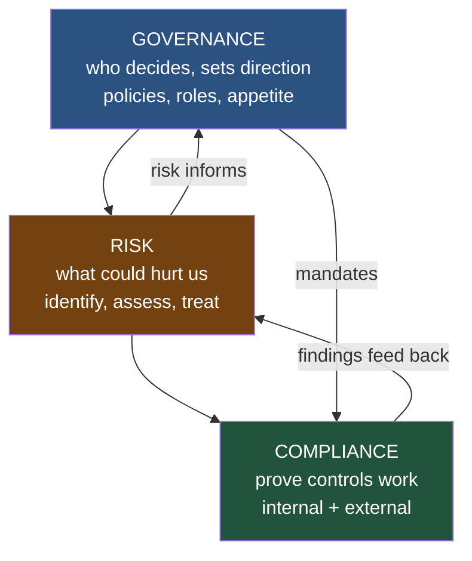
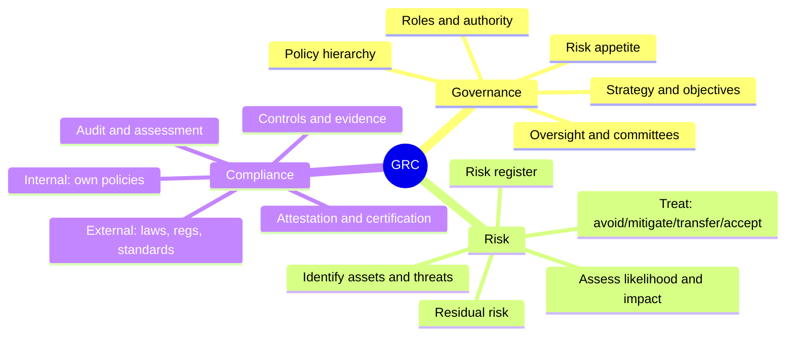
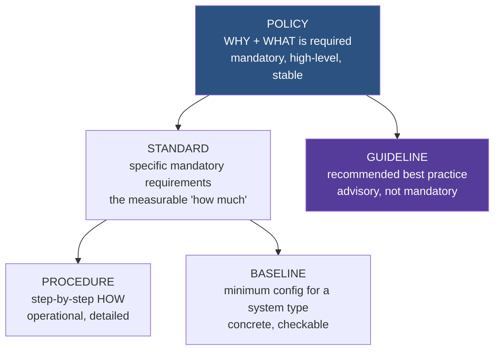
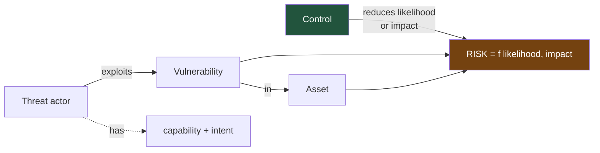
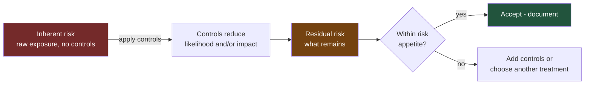
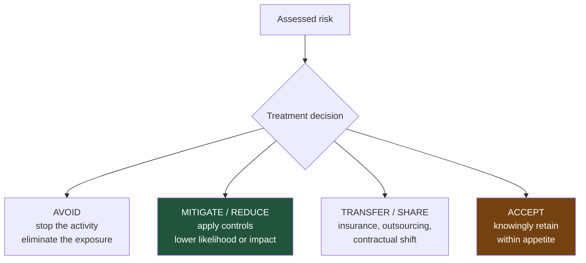
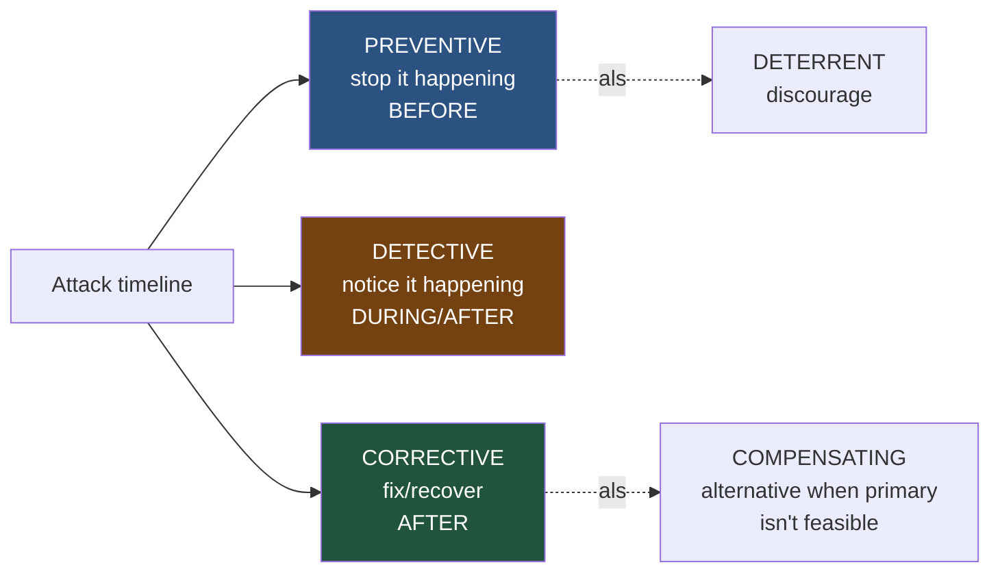
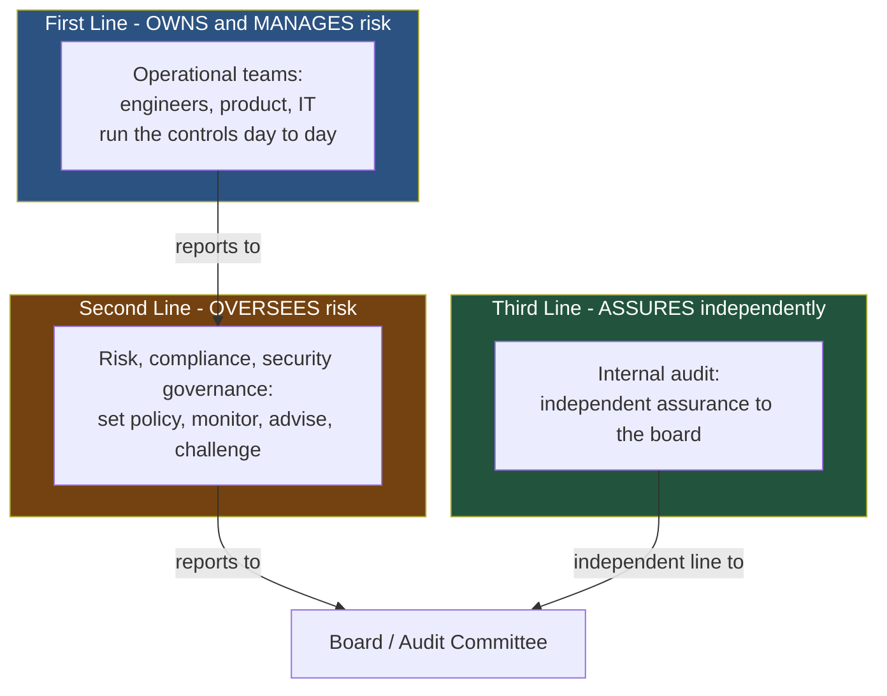
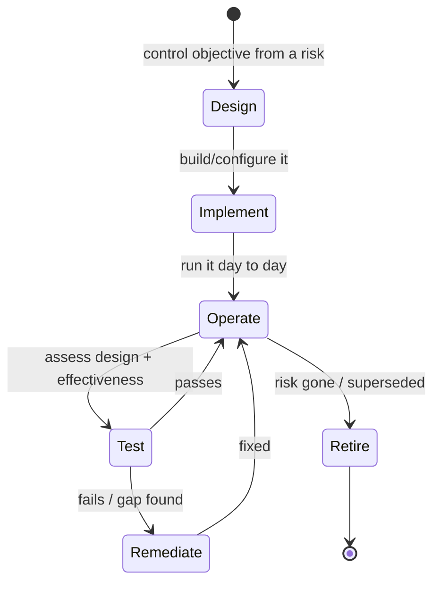
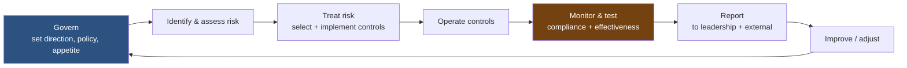

This is Chapter 1 of the GRC & Architecture notebook. Every notebook so far in this series has been hands-on: break something, detect something, defend something, migrate something. This one starts a different kind of work — the discipline that decides *what a security program is trying to achieve in the first place*, who is accountable when it fails, and how an organisation proves to itself and to outsiders that its controls actually exist and actually work. That discipline is **governance, risk, and compliance**, universally shortened to **GRC**.

If you have come from the technical chapters, GRC can feel like the part that grown-ups in suits do to slow engineers down. This chapter argues the opposite: GRC is the load-bearing structure that turns a pile of individual controls into a *program* — one that can be reasoned about, resourced, prioritised by risk, and defended in front of a regulator or a board. By the end you will be able to write a real policy set, build a risk register that scores and ranks risks, explain the difference between compliance and security to someone who conflates them, and place any control you have ever configured into a taxonomy that tells you what it is *for*.

## Why This Matters

Consider a company with excellent engineers. Their firewalls are tuned, their detections are validated (they even run purple exercises), their patching is fast. They get breached anyway — because nobody owned the decision about which data mattered most, a third-party vendor with access to that data had none of the same rigour, a policy exception granted "temporarily" two years ago was never revisited, and when the incident hit, no one had the authority to make the call to disconnect a revenue-generating system. None of those failures is technical. All of them are GRC failures.

GRC is the answer to a set of questions that technical skill alone cannot answer:

- **Who decides** what we protect, how much we spend, and what risk we accept? (Governance)
- **How do we know** what could hurt us, how badly, and what to do about it — in a way we can rank and resource? (Risk)
- **How do we prove** — to ourselves, customers, regulators, insurers — that our controls exist and work? (Compliance)

The reason this matters even to a purely technical practitioner is that **GRC is where security decisions get their authority and their budget.** A detection you cannot tie to a risk is hard to fund. A control with no owner rots. A finding with no policy behind it is a suggestion, not a requirement. Understanding GRC is what lets a technical person turn "we should really fix this" into "this is a rated risk that violates policy X and control objective Y, owned by team Z, and here is the treatment plan." That sentence gets things done; "we should really fix this" does not.



## Part 1: What GRC Actually Is

**Governance, risk, and compliance** is the integrated set of practices an organisation uses to direct its activities, manage uncertainty, and satisfy obligations. In a security context it is how an organisation decides what to protect, understands the threats to it, and demonstrates that its protections meet its own requirements and those imposed on it from outside.

The word doing the heavy lifting is **integrated**. Governance, risk, and compliance existed as separate activities long before the acronym; GRC as a discipline is the recognition that treating them separately produces gaps and duplication. Governance without risk produces policies disconnected from actual threats. Risk without governance produces analyses nobody acts on because no one has authority. Compliance without either produces box-ticking that satisfies an auditor and stops no attacker. The three only work as a loop.

### 1.1 A quick anti-example: security without GRC

To see what GRC prevents, look at a common failure pattern in a technically strong but ungoverned organisation:

| Symptom | Underlying GRC gap |
|---|---|
| "We have great tools but keep failing audits" | No mapping from controls to requirements; compliance not integrated |
| "Everyone assumed someone else owned that system" | No ownership model; governance gap |
| "We spent the budget on the wrong things" | No risk-based prioritisation |
| "The exception was supposed to be temporary" | No exception lifecycle; governance gap |
| "Nobody could authorise shutting it down during the incident" | No decision authority defined; governance gap |
| "Our vendor got breached and so did we" | Third-party risk not in scope; risk gap |

Every one of these is fixable, and none is fixed by a better firewall. They are fixed by structure — which is what GRC provides.

### 1.2 GRC is not bureaucracy for its own sake

The legitimate criticism of GRC is that it can decay into paperwork that exists to satisfy paperwork. That decay is real and worth naming, but it is a failure *mode*, not the purpose. Good GRC is lean: the minimum structure needed to make risk-based decisions, assign accountability, and produce evidence. Throughout this notebook the test for any GRC artifact is the same — **does this change a decision or produce evidence that someone actually uses?** If a policy, a risk entry, or a control has no consumer, it is bureaucracy; if it does, it is governance.

## Part 2: The Three Pillars, Defined Precisely

### 2.1 Governance

**Governance** is the system of direction and accountability: it establishes objectives, assigns authority and responsibility, sets the rules (policies), and provides oversight. In security, governance answers *who is in charge of what, what we require of ourselves, and how much risk we are willing to accept.*

Governance produces:

- **Direction** — a security strategy and objectives aligned to what the business is trying to do.
- **Structure** — defined roles, responsibilities, and decision rights (Part 8).
- **Rules** — the policy hierarchy (Part 3).
- **Oversight** — the mechanisms (committees, reporting, metrics) that check the rules are followed and the objectives met.
- **Risk appetite** — the explicit statement of how much and what kinds of risk the organisation will accept (Part 5.4).

The single most important governance concept for a technical person to internalise is **accountability versus responsibility**. The engineer who operates a control is *responsible* for it; the manager or executive who answers for the outcome is *accountable* for it. Governance exists to make sure the accountable person is named, has the authority to act, and cannot quietly delegate the accountability away with the task. Part 8's RACI model makes this concrete.

### 2.2 Risk

**Risk** is the effect of uncertainty on objectives — in security terms, the potential for a threat to exploit a vulnerability and cause harm to something you value. Risk management is the disciplined process of identifying, analysing, evaluating, and treating those potentials so that limited resources go to the things that matter most.

Risk is the pillar that makes security *rational*. Without it, security is a wish-list where every control competes on volume and the loudest voice wins. With it, every control traces to a rated risk, and "why are we doing this?" always has an answer. Part 4 and Part 5 build the full risk vocabulary and process; the whole of Chapter 3 is devoted to doing it rigorously.

### 2.3 Compliance

**Compliance** is conformance to a set of requirements — whether imposed externally (laws, regulations, contractual obligations, standards you have chosen to certify against) or internally (your own policies). Compliance is *demonstrable*: its defining feature is evidence. A control that works but cannot be shown to work does not, for compliance purposes, count.

Compliance has two directions people constantly confuse:

- **External compliance** — meeting obligations from outside: GDPR, HIPAA, PCI-DSS, SOC 2, ISO 27001 certification, contractual security clauses. Failure here brings fines, lost deals, and legal liability.
- **Internal compliance** — conforming to your own governance. Failure here means your policies are fiction, which undermines everything above them.

The critical, endlessly-repeated truth about compliance is in Part 6: **compliance is not security.** They overlap, they reinforce each other, and they are not the same thing.



## Part 3: The Language of Governance — Policies, Standards, Procedures

Governance speaks through a hierarchy of documents, and using the terms precisely is the first mark of someone who understands GRC. They are not synonyms; each sits at a different level of abstraction and carries different force.



| Document | Answers | Force | Changes | Example |
|---|---|---|---|---|
| **Policy** | Why + what is required | Mandatory | Rarely (stable) | "All access to company systems must be authenticated and authorised." |
| **Standard** | How much / which | Mandatory | Occasionally | "Authentication to internet-facing systems must use MFA with a phishing-resistant factor." |
| **Procedure** | Step by step how | Mandatory | Often | "To enrol a FIDO2 key: 1. Navigate to... 2. Click... 3. ..." |
| **Baseline** | Minimum config for a system type | Mandatory | Per platform | "Linux server baseline: SSH password auth disabled, auditd enabled, ..." |
| **Guideline** | Recommended practice | Advisory | As needed | "Consider rotating access reviews quarterly for high-privilege roles." |

The distinctions that matter in practice:

- **Policy is stable and short.** A good policy fits on a page, states principles, and does not name specific technologies — because technologies change and you do not want to rewrite policy every time. "Data must be encrypted in transit" is policy; "TLS 1.3 with X25519MLKEM768" is a standard, because it will change.
- **Standards are where "mandatory" gets measurable.** A policy says "strong authentication"; a standard says exactly what strong means, so that compliance can be *checked*. If you cannot audit against a document, it is probably a policy that needs a standard beneath it.
- **Procedures are how the work actually gets done**, and they change most often because tools and interfaces change.
- **Guidelines are advisory.** The word "should" (recommended) versus "must/shall" (required) is a genuine legal and audit distinction — mixing them up in a policy is a common and consequential drafting error.

### 3.1 A worked policy hierarchy

Here is one requirement expressed at each level, so the difference is unmistakable:

```
POLICY (Access Control Policy):
  "Access to organisational information systems and data must be granted
   on the principle of least privilege and only to authenticated,
   authorised individuals with a legitimate business need."

STANDARD (Authentication Standard):
  "- All users must authenticate with a unique individual account.
   - Internet-facing systems must require multi-factor authentication
     using a phishing-resistant factor (FIDO2/WebAuthn or PIV).
   - Shared/generic accounts are prohibited except where documented and
     approved by the CISO with compensating controls."

PROCEDURE (FIDO2 Enrolment Procedure):
  "1. Log in to the identity portal at https://id.example.com
   2. Navigate to Security > Security Keys > Add
   3. Insert the FIDO2 key and touch the sensor when prompted
   4. Label the key and confirm; verify it appears in the enrolled list
   5. Register a backup key before removing any legacy factor"

GUIDELINE (Authentication Guidance):
  "Where FIDO2 keys are impractical, an authenticator app with number
   matching is preferable to SMS. Consider issuing two keys per user to
   avoid lockout."
```

Notice how the policy would survive a decade unchanged, the standard would change when phishing-resistant requirements tighten, and the procedure would change the next time the portal is redesigned. **Getting the level right is what keeps the document set maintainable** — put technology names in policy and you will be rewriting your foundational documents constantly.

## Part 4: The Language of Risk

Risk has its own precise vocabulary, and imprecision here produces analyses that cannot be compared or trusted. These terms recur throughout the notebook.

### 4.1 The core terms

| Term | Definition | Example |
|---|---|---|
| **Asset** | Something of value worth protecting | Customer database, a signing key, brand reputation |
| **Threat** | A potential cause of harm; a "who/what" that could hurt an asset | A ransomware crew, a malicious insider, a flood |
| **Threat actor** | The specific entity behind a threat | An organised-crime group, a nation-state, a careless employee |
| **Vulnerability** | A weakness that a threat can exploit | Unpatched software, a weak process, an untrained user |
| **Likelihood** | How probable it is that the threat exploits the vulnerability | "Likely within a year" / a probability |
| **Impact** | The magnitude of harm if it happens | Financial loss, downtime, regulatory fine, reputational damage |
| **Risk** | The combination of likelihood and impact for a given threat/vuln pair | "High likelihood × severe impact = critical risk" |
| **Control** | A safeguard that reduces likelihood or impact | MFA, backups, a segmentation firewall |

The relationship among these is the foundation of all risk work:

> **Risk exists when a threat can exploit a vulnerability to harm an asset. Reduce the threat's access, close the vulnerability, or limit the impact, and you reduce the risk. A control is anything that does one of those.**



### 4.2 Inherent vs residual risk

Two of the most important and most confused terms:

- **Inherent risk** — the risk *before* any controls are applied. The raw exposure. "If we did nothing, how bad is this?"
- **Residual risk** — the risk *remaining after* controls are applied. "Given what we've done, how bad is it still?"

The difference between them is the *value your controls provide*. And the crucial point: **residual risk is never zero.** No set of controls eliminates risk entirely; there is always something left, and the organisation must decide — via risk appetite (4.4) — whether that remainder is acceptable. A risk register (Part 11) that shows only one number is hiding this; a good one shows inherent risk, the controls, and the residual.



### 4.3 Qualitative vs quantitative risk

Risk can be expressed two ways, and both have a place (Chapter 3 goes deep on this):

- **Qualitative** — descriptive scales (Low/Medium/High/Critical), usually via a likelihood × impact matrix. Fast, intuitive, good for prioritisation, but subjective and hard to add up.
- **Quantitative** — actual numbers, typically monetary. The classic model uses **SLE** (Single Loss Expectancy = asset value × exposure factor), **ARO** (Annualised Rate of Occurrence = how many times per year), and **ALE** (Annualised Loss Expectancy = SLE × ARO). Rigorous and comparable across risks, but requires data you often do not have.

Most organisations start qualitative and add quantitative rigour for their biggest risks. The lab in Part 12 builds a qualitative register; Chapter 3 adds the quantitative machinery.

### 4.4 Risk appetite and risk tolerance

- **Risk appetite** — the broad, strategic statement of how much and what kinds of risk the organisation is willing to pursue in the name of its objectives. Set by leadership; a governance artifact. "We will not accept any risk that could cause a reportable breach of customer data; we will accept moderate availability risk in non-production systems to move faster."
- **Risk tolerance** — the acceptable *variation* around that appetite for a specific risk or category; more granular and operational. "We tolerate up to 4 hours of downtime per quarter for the internal wiki, zero unplanned downtime for payments."

The relationship: appetite is the strategy, tolerance is the operational limit that implements it. Both must be *explicit* — an unstated risk appetite means every risk decision is re-litigated from scratch, and the person who accepts a risk has no benchmark for whether they should have. **A written risk appetite is one of the highest-leverage governance artifacts an organisation can produce**, because it turns thousands of individual accept/mitigate decisions into applications of a single agreed standard.

## Part 5: Risk Treatment — The Four Options

Once a risk is identified and assessed, the organisation must *decide what to do about it*. There are exactly four options, and every risk decision is one of them. Knowing the four by name is essential vocabulary.



| Option | What it means | When to use | Example | Caution |
|---|---|---|---|---|
| **Avoid** | Eliminate the risk by not doing the risky thing | Risk exceeds appetite and the activity is not essential | Decide not to store credit-card numbers at all | Can forgo real business value; not always possible |
| **Mitigate (Reduce)** | Apply controls to lower likelihood and/or impact | The most common choice; activity is worthwhile but exposure is too high | Add MFA, encrypt data, segment the network | Never reaches zero (residual risk remains) |
| **Transfer (Share)** | Shift some of the financial consequence to a third party | Impact is affordable to insure/outsource but not to bear alone | Cyber-insurance; outsourcing card processing to a PCI-compliant provider | **You cannot transfer accountability, only cost** |
| **Accept** | Knowingly retain the risk without further action | Residual risk is within appetite; cost of treatment exceeds benefit | Accept the small risk of a low-value internal tool being briefly unavailable | Must be a *documented, authorised* decision, not neglect |

Three points that trip people up:

- **Transfer does not remove the risk.** Cyber-insurance pays out after a breach; it does not stop the breach, restore customer trust, or discharge your legal accountability for the data. Outsourcing card processing shifts PCI scope but you are still accountable to your customers. **You can transfer cost; you cannot transfer accountability.** This is one of the most misunderstood ideas in GRC.
- **Accept is a decision, not a default.** "We didn't get around to it" is not risk acceptance — it is unmanaged risk. Real acceptance is explicit: a named, authorised person, at the right level for the size of the risk, records that the residual risk is understood and accepted, ideally with a review date. The difference between "accepted risk" and "ignored risk" is a signature and a date.
- **Most risks get mitigated, but the goal is not to mitigate everything.** Over-mitigating low risks wastes resources that a risk-based program should spend on high ones. The point of assessment is to *match treatment to rated risk*, which sometimes means accepting a small risk deliberately so you can afford to mitigate a large one.

## Part 6: Compliance Is Not Security

This is the single most important idea in the chapter, and it is worth stating starkly:

> **Compliance is a snapshot that you meet a set of requirements. Security is an ongoing property of being hard to compromise. They overlap, but neither implies the other.**

You can be:

| | Secure | Not secure |
|---|---|---|
| **Compliant** | The goal: requirements met *and* genuinely hard to attack | The trap: passed the audit, still breachable — "compliance theatre" |
| **Non-compliant** | Hard to attack but failing a requirement (e.g. strong controls, missing documentation) | The worst case: exposed *and* liable |

The famous failures live in the top-right cell: organisations that passed their PCI or SOC 2 assessment and were breached weeks later. How does that happen?

- **Compliance is point-in-time; attackers are continuous.** An audit checks the state on the assessment date. The environment changes daily; the control that was in place in March is misconfigured by June.
- **Standards are a floor, not a ceiling.** A requirement says "encrypt cardholder data." It does not say your key management is good, your segmentation is real, or your detections work. Meeting the letter of a control is not the same as achieving its intent.
- **Scope games.** Compliance applies to a defined scope. Organisations narrow scope to make certification easier, leaving everything outside it — which attackers happily target.
- **Documentation over reality.** Compliance rewards evidence. It is possible to produce excellent evidence for a control that is technically present but operationally useless.

None of this means compliance is worthless — far from it. **Compliance is a powerful forcing function:** it makes organisations do baseline things they would otherwise defer, gives security teams leverage to get budget, and provides a common language with customers and regulators. The correct stance is: *treat compliance as a floor to clear efficiently, and treat security as the actual objective.* An organisation that chases only compliance will be breached; one that ignores compliance will lose deals and face fines. You need both, in the right relationship — compliance in service of security, not instead of it.

**Offensive relevance:** attackers and auditors probe the *same* gaps from opposite directions. An auditor asks "show me evidence this control operates"; a penetration tester asks "show me where this control doesn't operate." Both find the exception granted two years ago, the system left out of scope, the process that exists on paper but not in practice. A technical practitioner who understands GRC can read a compliance scope document the way an attacker reads a network diagram — as a map of where the defences are assumed to be, and therefore where the gaps between assumption and reality are most likely to sit.

## Part 7: The Control Taxonomy

A **control** is any safeguard or countermeasure that reduces risk. Controls are the atoms of a security program, and there are two independent ways to classify them. Knowing both lets you describe any control precisely and — more importantly — spot where your control coverage is thin.

### 7.1 By function: what the control does in time



| Function | Purpose | Timing | Security examples |
|---|---|---|---|
| **Preventive** | Stop an incident before it happens | Before | MFA, firewall rules, encryption, least privilege, input validation |
| **Detective** | Identify that an incident is happening or has happened | During/after | IDS/EDR, SIEM alerts, log review, the detections from the Purple Team notebook |
| **Corrective** | Restore normal operation after an incident | After | Backups/restore, patching, incident response, failover |
| **Deterrent** | Discourage an attacker from trying | Before | Warning banners, visible monitoring, prosecution policy |
| **Compensating** | An alternative control when the primary is impractical | Varies | Extra monitoring around a legacy system that can't be patched |
| **Directive** | Mandate behaviour | Before | Policies, standards, training, signage |

The taxonomy is a coverage tool. **A program heavy on preventive controls but thin on detective ones will not know when prevention fails** — and prevention always eventually fails. This is exactly the lesson of the Purple Team notebook expressed in GRC vocabulary: you need detective controls (validated detections) behind your preventive ones, and corrective controls (IR, backups) behind those. Map your controls to this table and the empty columns are your gaps.

### 7.2 By nature: what kind of thing the control is

| Nature | What it is | Examples |
|---|---|---|
| **Administrative (managerial)** | Policies, processes, people | Policies, training, background checks, access reviews, separation of duties |
| **Technical (logical)** | Technology enforcing the control | MFA, encryption, firewalls, EDR, IAM systems |
| **Physical** | Real-world barriers | Locks, badges, cameras, guards, data-centre access controls |

The two classifications are independent, so any control has both a function and a nature. MFA is *preventive* + *technical*. A security-awareness training program is *directive/preventive* + *administrative*. A CCTV camera is *detective* (and *deterrent*) + *physical*. Backups are *corrective* + *technical*. Being able to place a control in this 2-D space is a basic GRC fluency check, and it is genuinely useful: it tells you, for any given risk, whether you are relying entirely on one type of control (fragile) or have depth across functions and natures (defence in depth).

### 7.3 Defence in depth, in control terms

**Defence in depth** — layering controls so that the failure of any one does not cause total compromise — is just this taxonomy applied deliberately. For a single asset you want:

- Multiple *preventive* layers (so one bypass is not enough),
- Backed by *detective* controls (so you learn when prevention is bypassed),
- Backed by *corrective* controls (so you can recover),
- Across *administrative*, *technical*, and *physical* natures (so a gap in one nature is covered by another).

A credential-theft example: least privilege + MFA + RunAsPPL (preventive/technical), a policy prohibiting shared accounts and mandatory training (preventive/administrative), LSASS-access detection (detective/technical, from the Purple Team notebook), credential rotation and IR runbook (corrective), and physical access control on the servers (physical). No single failure hands over the domain. That is defence in depth stated as a control portfolio.

## Part 8: Roles, Accountability, and the Three Lines

Governance only works if someone is actually accountable. This part names the roles and the model that keeps accountability from evaporating.

### 8.1 Key roles

| Role | Accountable / responsible for | Note |
|---|---|---|
| **Board / senior leadership** | Ultimate accountability for risk; sets appetite; provides resources | Cannot delegate accountability away, even when work is delegated |
| **CISO / security leader** | The security program; translates risk to leadership; owns policy | The bridge between technical reality and business decision |
| **Risk owner** | A specific risk: its assessment, treatment, and residual acceptance | Usually a business leader, not the security team |
| **Control owner** | A specific control operates effectively | Often technical; distinct from the risk owner |
| **Data owner** | Classification and protection decisions for a data set | A business role — they know the data's value |
| **Data custodian** | Day-to-day technical protection of the data | The engineers/admins who implement the owner's decisions |
| **Asset owner** | Accountability for a specific system/asset | The "someone assumed someone else owned it" fix |
| **Auditor (internal/external)** | Independently assesses whether controls work | Must be independent of what they assess |

The distinction the whole model rests on: **the risk owner is usually the business, not security.** Security *advises* on risk and *operates* many controls, but the person who accepts a residual risk should be the one who owns the business outcome that the risk threatens. When security "owns" all the risk, the business has no skin in the game and security becomes the department of "no." Correct governance pushes risk ownership to where the value — and therefore the accountability — actually lives.

### 8.2 The three lines of defence

A widely used model for organising who does what in risk management:



| Line | Who | Role | Independence |
|---|---|---|---|
| **First** | Operational management (engineering, IT, product) | Owns and manages risk directly; runs the controls | None — they do the work |
| **Second** | Risk, compliance, security governance functions | Sets policy, monitors, advises, challenges the first line | Partial — separate from operations |
| **Third** | Internal audit | Independent assurance that lines one and two work | Full — reports to the board |

The reason for three lines is **independence increases with each line.** The first line has expertise but a conflict of interest (they are graded on the thing they assess). The third line has no operational stake, so its assurance is credible to the board. A common security-team confusion is thinking security is "the risk function" — in this model, security governance is *second line* (it sets policy and monitors), while the engineers operating security tools are *first line*, and audit is separate. Mixing them up muddies accountability.

### 8.3 RACI — making accountability concrete

For any given control, process, or decision, a **RACI** matrix names who is:

- **Responsible** — does the work.
- **Accountable** — answers for the outcome; exactly one person (the rule that makes RACI work).
- **Consulted** — provides input before.
- **Informed** — told after.

| Activity | Engineer | Team lead | CISO | Data owner |
|---|---|---|---|---|
| Configure MFA on the app | **R** | A | C | I |
| Approve the authentication standard | C | R | **A** | C |
| Accept residual risk of a legacy exception | I | C | C | **A** |
| Operate the LSASS detection | **R** | A | I | I |

The discipline of "exactly one **A** per row" is what forces the organisation to decide, in advance, who answers when something goes wrong. The failure mode from Part 1.1 — "everyone assumed someone else owned it" — is precisely a row with no **A**, and RACI's whole purpose is to make that impossible.

## Part 9: The Life of a Control — Design, Implement, Operate, Test

A control is not a one-time installation; like a detection (Purple Team Chapter 3), it has a lifecycle, and compliance cares about every stage of it.



### 9.1 The stages and their evidence

| Stage | Question | Evidence produced |
|---|---|---|
| **Design** | Would this control, if it worked, address the risk? | A control objective traced to a risk; design documentation |
| **Implement** | Is it actually built and configured? | Configuration, tickets, screenshots, deployment records |
| **Operate** | Is it running consistently over time? | Logs, run records, the fact it fired/blocked over the period |
| **Test** | Does it work — by design and in operation? | Test results, audit evidence, sample reviews |
| **Remediate** | If it failed, is the gap closed? | Remediation records, retest confirmation |

The distinction auditors care about most is **design effectiveness vs operating effectiveness**:

- **Design effectiveness** — *if* the control operated as designed, would it address the risk? A test of the concept. (MFA, if enforced, would stop password-only attacks — good design.)
- **Operating effectiveness** — did the control actually operate, consistently, over the whole period? A test of reality. (Was MFA *actually enforced on every account, every day*, or were there exceptions and gaps?)

A control can have excellent design and terrible operation — MFA that is well-designed but not enforced on 30% of accounts fails operating effectiveness. This is the single most common way real controls fail an audit, and it maps exactly onto the Purple Team lesson: a control that exists on paper but does not operate in practice is a hypothesis, not a control. **Evidence of operation over time is the currency of compliance**, which is why logging, ticketing, and records matter as much as the control itself.

### 9.2 Control objectives vs controls

A subtle but important distinction: a **control objective** is *what you are trying to achieve*; a **control** is *how you achieve it*. "Only authorised individuals can access cardholder data" is an objective; MFA, least privilege, and access reviews are the controls that meet it. Frameworks (Chapter 2) are largely organised as control objectives, and multiple controls can satisfy one objective — which is what makes compensating controls (Part 7.1) possible: if you cannot use the standard control, any control that meets the *objective* can substitute.

## Part 10: The GRC Operating Cycle and Where Platforms Fit

GRC is not a project; it is a continuous cycle, and it mirrors the plan-do-check-act rhythm you have seen throughout this series.



Each turn of the cycle: governance sets direction and appetite, risk assessment finds and rates exposures, treatment selects controls, controls operate, monitoring and testing confirm they work (and feed findings back as new risks), and reporting closes the loop to leadership and outsiders — who adjust direction, starting the next turn.

### 10.1 Where GRC platforms fit

At small scale this cycle runs on spreadsheets and documents (Part 12). As an organisation grows, dedicated **GRC platforms** (tools such as those in the ServiceNow, Archer, Vanta, Drata, OneTrust families) centralise it: a single system holds the policy library, the risk register, the control catalogue mapped to multiple frameworks, evidence collection (often automated), and reporting dashboards. The value is not magic — it is **integration and evidence automation**: one control can be mapped once and satisfy requirements across ISO 27001, SOC 2, and PCI simultaneously, and evidence can be collected continuously rather than scrambled for before an audit.

The caution: **a GRC platform is a tool, not a program.** It makes a well-run program more efficient; it does not create governance where there is none. An organisation that buys a platform to *avoid* thinking about risk ownership and appetite ends up with a very expensive, well-organised record of its own confusion. Do the thinking first; the platform holds the result.

## Part 11: The Risk Register

The **risk register** is the central operational artifact of risk management — the living list of the organisation's risks, their assessment, their treatment, and their owners. If a program has one document, it is this.

A workable register has, per risk, at least these fields:

| Field | Purpose |
|---|---|
| **ID** | Stable identifier for tracking |
| **Risk description** | Threat + vulnerability + asset + consequence, in one sentence |
| **Category** | Grouping (e.g. access, data, third-party, availability) |
| **Inherent likelihood / impact** | The raw rating before controls |
| **Existing controls** | What is already reducing this risk |
| **Residual likelihood / impact** | The rating after controls |
| **Risk score** | Likelihood × impact, for ranking |
| **Treatment** | Avoid / mitigate / transfer / accept |
| **Risk owner** | The accountable business person |
| **Target date / review date** | When treatment completes / when to reassess |
| **Status** | Open / treated / accepted / closed |

The register is where all of this chapter's vocabulary becomes one tool: assets, threats, vulnerabilities, inherent and residual risk, treatment, and ownership all live in a row. A good register is **ranked by residual score** so attention goes to the biggest remaining exposures, and **reviewed on a cadence** so it does not go stale — an unreviewed risk register decays into fiction exactly like an unreviewed policy. The lab builds one.

## Part 12: Hands-On Lab — Write a Policy Set and Build a Risk Register

This lab produces two real GRC artifacts you could adapt for an actual small organisation: a linked policy/standard/procedure set, and a scored risk register. No special tools — a text editor and a spreadsheet (or the Python below).

**Scope note:** GRC artifacts describe a real or hypothetical organisation you are authorised to document. Nothing here touches a live system; the "lab" is the documents themselves, which is exactly the point — governance is made of documents that drive decisions.

### 12.1 Write a linked policy set

Create three linked documents for one requirement — access control — at the correct three levels (Part 3).

```markdown
# Access Control Policy  (POLICY - the WHY/WHAT, stable, mandatory)

Purpose: Ensure information systems and data are accessible only to
authorised individuals with a legitimate business need.

Scope: All employees, contractors, systems, and data.

Policy statements:
1. Access is granted on the principle of LEAST PRIVILEGE.
2. All access requires a UNIQUE, AUTHENTICATED individual identity.
3. Access rights are REVIEWED periodically and REVOKED promptly on role
   change or departure.
4. Privileged access is subject to additional controls.

Enforcement: Violations may result in disciplinary action.
Owner: CISO.  Review: annually.
```

```markdown
# Authentication Standard  (STANDARD - the measurable HOW-MUCH, mandatory)

Derived from: Access Control Policy, statement 2.

Requirements:
- MFA required for all remote and internet-facing access.
- Internet-facing systems must use a phishing-resistant factor
  (FIDO2/WebAuthn or PIV).
- Minimum password length 14 chars where passwords are used; screen
  against known-breached password lists.
- Shared/service accounts prohibited except where documented and
  approved by the CISO with compensating controls and no interactive login.
- Sessions time out after 15 minutes of inactivity for privileged access.

Owner: Head of Security Engineering.  Review: annually or on threat change.
```

```markdown
# Access Review Procedure  (PROCEDURE - the step-by-step HOW, operational)

Derived from: Access Control Policy, statement 3.

Quarterly, for each system in scope:
1. Export the current access list from the IAM system.
2. Send each manager the list of their reports' access for review.
3. Manager confirms KEEP or REVOKE for each entry within 5 business days.
4. Security Engineering actions all REVOKE decisions within 2 business days.
5. Record completion and exceptions in the access-review log.
6. Escalate non-responding managers to the CISO after 10 business days.

Owner: IAM team.  Frequency: quarterly.
```

Notice the traceability: every lower document cites the policy statement it implements. That chain is what an auditor follows and what makes the set maintainable — change the standard and the policy above it is untouched.

### 12.2 Build a scored risk register

Now build the register. This script constructs a small register, scores each risk, and ranks by residual score — the qualitative model from Part 4.3.

```python
#!/usr/bin/env python3
"""risk_register.py - build and score a small qualitative risk register.
Likelihood and impact on a 1-5 scale; score = likelihood x impact (1-25).
Bands: 1-4 Low, 5-9 Medium, 10-15 High, 16-25 Critical."""
import csv

SCALE = {1: "Very Low", 2: "Low", 3: "Medium", 4: "High", 5: "Very High"}

def band(score):
    if score >= 16: return "CRITICAL"
    if score >= 10: return "HIGH"
    if score >= 5:  return "MEDIUM"
    return "LOW"

# (id, description, category, inh_L, inh_I, controls, res_L, res_I, treatment, owner)
REGISTER = [
    ("R-01", "Ransomware encrypts primary file servers; no tested restore",
     "Availability", 4, 5, "EDR + daily backups (untested restore)", 3, 4,
     "Mitigate", "Head of IT"),
    ("R-02", "Attacker dumps LSASS -> domain-wide credential theft",
     "Access", 4, 5, "MFA, EDR; no RunAsPPL, LSASS detection unvalidated", 3, 5,
     "Mitigate", "Head of Security Eng"),
    ("R-03", "Third-party SaaS vendor breach exposes customer data",
     "Third-party", 3, 5, "Vendor security questionnaire only", 3, 4,
     "Mitigate", "Head of Product"),
    ("R-04", "Departing employee retains access after leaving",
     "Access", 4, 3, "Manual offboarding checklist", 2, 3,
     "Mitigate", "Head of IT"),
    ("R-05", "Internal wiki briefly unavailable during maintenance",
     "Availability", 3, 1, "Scheduled windows, comms", 2, 1,
     "Accept", "Head of IT"),
    ("R-06", "Cardholder data stored in scope -> PCI exposure",
     "Compliance", 3, 5, "None; considering not storing at all", 1, 5,
     "Avoid", "CFO"),
]

rows = []
for (rid, desc, cat, il, ii, ctrl, rl, ri, treat, owner) in REGISTER:
    inh, res = il * ii, rl * ri
    rows.append(dict(id=rid, desc=desc, cat=cat, inherent=inh,
                     residual=res, band=band(res), reduced=inh - res,
                     treatment=treat, owner=owner))

rows.sort(key=lambda r: r["residual"], reverse=True)

print(f"{'ID':5} {'RESID':>5} {'BAND':9} {'INH':>3} {'REDUCED':>7} "
      f"{'TREAT':9} {'OWNER':22} RISK")
print("-" * 108)
for r in rows:
    print(f"{r['id']:5} {r['residual']:>5} {r['band']:9} {r['inherent']:>3} "
          f"{r['reduced']:>7} {r['treatment']:9} {r['owner']:22} {r['desc'][:44]}")

crit = [r for r in rows if r['band'] in ('CRITICAL', 'HIGH')]
print("-" * 108)
print(f"{len(rows)} risks | {len(crit)} High/Critical residual | "
      f"top risk: {rows[0]['id']} ({rows[0]['residual']})")

with open("risk_register.csv", "w", newline="") as f:
    w = csv.DictWriter(f, fieldnames=rows[0].keys())
    w.writeheader(); w.writerows(rows)
print("wrote risk_register.csv")
```

```bash
python3 risk_register.py
```

```
ID    RESID BAND      INH REDUCED TREAT     OWNER                  RISK
------------------------------------------------------------------------------------------------------------
R-02     15 HIGH       20       5 Mitigate  Head of Security Eng   Attacker dumps LSASS -> domain-wide crede
R-03     12 HIGH       15       3 Mitigate  Head of Product        Third-party SaaS vendor breach exposes cu
R-01     12 HIGH       20       8 Mitigate  Head of IT             Ransomware encrypts primary file servers;
R-06      5 MEDIUM     15      10 Avoid      CFO                    Cardholder data stored in scope -> PCI ex
R-04      6 MEDIUM     12       6 Mitigate  Head of IT             Departing employee retains access after l
R-05      2 LOW         6       4 Accept     Head of IT             Internal wiki briefly unavailable during
------------------------------------------------------------------------------------------------------------
6 risks | 3 High/Critical residual | top risk: R-02 (15)
```

Read what the register tells you, because this is the entire point of the exercise:

- **R-02 (LSASS credential theft) is the top residual risk** — inherent 20, but controls only reduce it to 15 because RunAsPPL is not deployed and the detection is unvalidated. That is a direct, quantified callback to the Purple Team notebook: the register turns "we should validate that detection" into "this is the organisation's #1 residual risk, owned by the Head of Security Engineering." **That sentence gets funded.**
- **R-01 (ransomware) has the largest *reduction* (8) but still lands High**, because the backups are untested — design without operating effectiveness (Part 9.1). The register makes the "untested restore" gap visible as residual risk rather than false comfort.
- **R-06 (cardholder data) is treated by Avoid**, dropping residual likelihood to 1 by simply not storing the data — the cheapest possible treatment, and one a register makes easy to see.
- **R-05 is explicitly Accepted, by a named owner** — a documented decision, not neglect (Part 5).

That one small table exercises nearly every concept in the chapter: assets, threats, vulnerabilities, inherent vs residual risk, all four treatments, named owners, and risk-based ranking. **This is what GRC produces — not paperwork, but a ranked, owned, defensible list of what to fix first and why.**

### 12.3 Extend the lab

- Add an `inherent` vs `residual` heat-map by counting risks in each likelihood×impact cell (this is the risk matrix Chapter 3 formalises).
- Add a `review_date` column and write a check that flags any risk not reviewed in 90 days — the staleness control from Part 11.
- Map each risk to the control(s) that treat it and to a policy statement, producing the traceability an auditor expects.

## Part 13: GRC for the Technical Practitioner — Offensive and Defensive Angles

GRC can look like it belongs to a different profession from the hands-on chapters. It does not. The same gaps that a GRC program manages are the gaps that attackers exploit and defenders close.

**How an attacker reads GRC.** A penetration tester or red teamer who understands governance treats compliance artifacts as reconnaissance. A compliance *scope* document is a map of where controls are assumed to be — and therefore where the out-of-scope systems, the granted exceptions, and the "compensating controls" (which are compensating precisely because the real control is missing) are most likely to yield. The exception register is a list of deliberately weakened spots. The third-party inventory is a list of softer targets with legitimate access. None of this requires a single packet; it is available to anyone who reads the organisation's own governance the way an attacker reads a network diagram. **The governance gaps and the attack surface are frequently the same thing viewed from opposite sides.**

**How a defender uses GRC.** For the defensive practitioner, GRC is what turns individual technical wins into a funded, prioritised program. A validated detection (Purple Team Chapter 3) is worth more when it is tied to a rated risk in the register and a control objective in a framework — because then it has an owner, a budget line, and a review cadence, instead of being one engineer's side project that rots when they leave. GRC is also how a defender argues for resources: "our #1 residual risk is credential theft, currently rated High because RunAsPPL isn't deployed" is a sentence that moves budget, and it is a GRC sentence built from technical facts.

**Where the two notebooks meet.** The Purple Team notebook measured, in evidence, which adversary behaviours an organisation can see and stop. GRC is where that evidence becomes governance: the gaps become risks in the register, the risks get owners and treatments, the treatments become controls with objectives, and the controls get tested for design and operating effectiveness. Technical assurance feeds governance; governance directs and funds technical assurance. Neither is complete alone — which is the whole reason this notebook follows the offensive and defensive ones rather than replacing them.

## Part 14: Common Pitfalls and Myths

### 14.1 Pitfalls

| # | Pitfall | Consequence | Fix |
|---|---|---|---|
| 1 | Treating GRC as paperwork with no consumer | Bureaucracy that everyone ignores | Every artifact must change a decision or be evidence someone uses (Part 1.2) |
| 2 | Putting technology names in policy | Constant rewrites; brittle | Principles in policy, specifics in standards (Part 3) |
| 3 | Confusing "should" and "must" | Unenforceable or over-rigid rules | Precise language: must/shall = mandatory, should = advisory |
| 4 | Security team owning all risk | Business has no skin in the game | Push risk ownership to the business (Part 8.1) |
| 5 | "Accepting" risk by not acting | Unmanaged risk masquerading as a decision | Acceptance = named owner + documented + dated (Part 5) |
| 6 | Believing transfer removes risk | Still accountable after the insurer pays | Transfer cost, never accountability (Part 5) |
| 7 | Treating compliance as security | Passed the audit, still breached | Compliance is a floor; security is the goal (Part 6) |
| 8 | Design effectiveness mistaken for operating | Control looks good, doesn't actually run | Evidence of operation over time (Part 9.1) |
| 9 | A row in RACI with no single Accountable | "Everyone assumed someone else owned it" | Exactly one A per row (Part 8.3) |
| 10 | Risk register written once, never reviewed | Decays into fiction | Review cadence; staleness checks (Part 11) |
| 11 | Buying a GRC platform to avoid the thinking | Expensive record of confusion | Do the governance first; platform holds it (Part 10.1) |
| 12 | Over-mitigating low risks | Resources diverted from high ones | Match treatment to rated risk (Part 5) |
| 13 | Scope games to pass an audit | Everything out of scope is exposed | Scope for security, not just for the certificate (Part 6) |
| 14 | No exception lifecycle | "Temporary" exceptions become permanent | Exceptions get expiry dates and reviews (Part 1.1) |

### 14.2 Myths

**"GRC is just paperwork."** GRC is decision infrastructure. Its artifacts — appetite, register, RACI, control catalogue — exist to make risk-based decisions and produce evidence. Paperwork with no consumer is a *failure mode* of GRC, not its nature (Part 1.2).

**"If we're compliant, we're secure."** The most dangerous myth in the field. Compliance is a point-in-time snapshot against a floor; security is a continuous property. Breached-but-compliant is a well-populated category (Part 6).

**"Risk can be eliminated."** Residual risk is never zero. The goal is to reduce risk to within appetite and knowingly accept the remainder, not to reach zero (Part 4.2).

**"We transferred that risk with insurance."** You transferred the *cost*. The breach still happens, the trust is still lost, and you are still accountable to your customers and regulators (Part 5).

**"Security owns the company's risk."** Security advises on and operates controls; the business owns the risk, because the business owns the value at stake and the decision to accept residual exposure (Part 8.1).

**"GRC is for suits, not engineers."** The gaps GRC manages are the gaps attackers exploit and defenders close. A technical practitioner fluent in GRC turns "we should fix this" into a funded, owned program of work (Part 13).

## Final Revision / Summary

**What GRC is.** The *integrated* discipline of directing an organisation (governance), managing uncertainty (risk), and satisfying obligations (compliance). Integration is the point — the three only work as a loop; separately they produce policies disconnected from threats, analyses nobody acts on, and box-ticking that stops no attacker.

**The three pillars.** *Governance* sets direction, roles, rules (the policy hierarchy), oversight, and risk appetite. *Risk* identifies, assesses, and treats potential harms so resources go to what matters. *Compliance* proves — with evidence — that controls meet internal and external requirements.

**The document hierarchy.** Policy (why/what, stable, mandatory) → Standard (measurable how-much, mandatory) → Procedure (step-by-step how, operational) → Baseline (minimum config); Guidelines are advisory. Keep technology out of policy so it survives; put the specifics in standards so they can be audited.

**Risk vocabulary.** A *threat* exploits a *vulnerability* to harm an *asset*; *risk* combines *likelihood* and *impact*; a *control* reduces one of them. *Inherent* risk is before controls, *residual* is after — and residual is never zero. *Appetite* is the strategic willingness to take risk; *tolerance* is the operational limit. Qualitative (L/M/H) for speed, quantitative (SLE × ARO = ALE) for rigour.

**The four treatments.** Avoid (stop the activity), Mitigate (apply controls — the common case), Transfer (shift *cost*, never accountability), Accept (a documented, authorised decision). Match treatment to rated risk; do not over-mitigate the small to starve the large.

**Compliance is not security.** Compliance is a point-in-time snapshot against a floor; security is a continuous property. You can be compliant-and-breached or secure-but-non-compliant. Treat compliance as a floor to clear efficiently and security as the actual objective.

**The control taxonomy.** By function: preventive / detective / corrective (plus deterrent, compensating, directive). By nature: administrative / technical / physical. Every control has both; empty cells in the 2-D map are your gaps, and defence in depth is this taxonomy applied deliberately.

**Accountability.** Responsible does the work; Accountable answers for it (exactly one per outcome). The risk owner is usually the *business*, not security. Three lines of defence: first (operations, owns risk), second (risk/compliance/security governance, oversees), third (internal audit, independent assurance). RACI makes the "no one owned it" failure impossible.

**Controls have a lifecycle.** Design → implement → operate → test → remediate. Design effectiveness (would it work?) vs operating effectiveness (did it actually run, consistently, over time?) — the latter is where real controls most often fail, and evidence of operation is the currency of compliance.

**The operating cycle and the register.** Govern → assess → treat → operate → monitor/test → report → improve, continuously. The risk register is the central artifact: every risk with its inherent and residual rating, controls, treatment, and named owner, ranked by residual score and reviewed on a cadence.

**For the technical practitioner.** The governance gaps and the attack surface are often the same thing from opposite sides. GRC is how a defender turns a technical win into a funded, owned, prioritised program — and how "we should fix this" becomes a rated risk with an owner and a date.

## Cheat Sheet / Quick Reference

### The three pillars

```
GOVERNANCE  who decides, direction, policy, roles, appetite, oversight
RISK        what could hurt us: identify -> assess -> treat -> residual
COMPLIANCE  prove controls work: internal (own policy) + external (law/std)
Integrated loop: risk informs governance -> governance mandates compliance
            -> compliance findings feed risk.
```

### Document hierarchy

```
POLICY     why/what, stable, mandatory, no tech names
STANDARD   measurable how-much, mandatory, auditable
PROCEDURE  step-by-step how, operational, changes often
BASELINE   minimum config per system type
GUIDELINE  advisory (should, not must)
```

### Risk terms

```
threat exploits vulnerability to harm asset
risk = f(likelihood, impact)
inherent (before controls)  ->  residual (after controls)  [never zero]
appetite (strategic willingness)  |  tolerance (operational limit)
qualitative L/M/H  |  quantitative SLE x ARO = ALE
```

### Four treatments

```
AVOID     stop the risky activity
MITIGATE  apply controls (the common case)   <- reduces, never to zero
TRANSFER  shift COST (insurance/outsource)   <- NOT accountability
ACCEPT    documented, authorised, dated decision  <- not "didn't get to it"
```

### Compliance vs security

```
compliant + secure     = the goal
compliant + not secure  = compliance theatre (breached-but-certified)
not compliant + secure  = strong controls, missing evidence/paperwork
not compliant + insecure= worst case
Compliance is a FLOOR and point-in-time; security is CONTINUOUS.
```

### Control taxonomy

```
By function: PREVENTIVE (before) | DETECTIVE (during/after) | CORRECTIVE (after)
             + deterrent, compensating, directive
By nature:   ADMINISTRATIVE (policy/people) | TECHNICAL (tech) | PHYSICAL (barriers)
Every control = one function + one nature.  Empty cells = gaps.
MFA = preventive + technical.  Backup = corrective + technical.  CCTV = detective + physical.
```

### Accountability

```
Responsible = does it   Accountable = answers for it (exactly ONE)
Risk owner = usually the BUSINESS, not security
3 lines: 1st operations (owns) | 2nd risk/compliance/sec-gov (oversees) | 3rd audit (assures)
RACI: one A per row -> kills "everyone thought someone else owned it"
```

### Control lifecycle

```
design -> implement -> operate -> test -> remediate
design effectiveness  = would it work if it ran?
operating effectiveness = did it actually run, consistently, over time?  <- fails most often
Evidence of operation over time = the currency of compliance.
```

### Risk register fields

```
id | description(threat+vuln+asset+consequence) | category
inherent L/I | controls | residual L/I | score | treatment | OWNER | review_date | status
Rank by RESIDUAL score. Review on a cadence or it becomes fiction.
```

### Glossary

| Term | Meaning |
|---|---|
| **Governance** | System of direction, authority, rules, and oversight |
| **Risk** | Effect of uncertainty on objectives; likelihood × impact |
| **Compliance** | Demonstrable conformance to requirements (evidence-based) |
| **Policy / Standard / Procedure** | Why-what / how-much / step-by-step (all mandatory) |
| **Guideline** | Advisory recommendation (not mandatory) |
| **Asset / Threat / Vulnerability** | Value protected / cause of harm / exploitable weakness |
| **Inherent / Residual risk** | Before / after controls; residual never zero |
| **Risk appetite / tolerance** | Strategic willingness / operational limit |
| **SLE / ARO / ALE** | Single-loss / annual rate / annualised loss expectancy |
| **Avoid/Mitigate/Transfer/Accept** | The four risk treatments |
| **Control** | Safeguard reducing likelihood or impact |
| **Control objective** | What you're trying to achieve (vs the control = how) |
| **Preventive/Detective/Corrective** | Control functions by timing |
| **Administrative/Technical/Physical** | Control natures |
| **Compensating control** | Alternative control meeting the same objective |
| **Risk owner / Control owner** | Accountable for a risk / that a control works |
| **Three lines of defence** | Operations / oversight / independent audit |
| **RACI** | Responsible, Accountable, Consulted, Informed |
| **Design vs operating effectiveness** | Would it work / did it actually run over time |
| **Risk register** | Living, ranked, owned list of the organisation's risks |
| **Risk appetite statement** | Written declaration of acceptable risk-taking |

## Practice Labs & Resources

- **Write your own linked policy set (Part 12.1).** Pick a different domain — data classification, acceptable use, or incident response — and draft a real policy, a standard beneath it, and a procedure beneath that, with explicit traceability. The discipline of keeping technology out of the policy and putting it in the standard is the skill that transfers directly to a real job.
- **Build and score a risk register (Part 12.2).** Extend the script with a review-date staleness check and an inherent-vs-residual heat-map. Then hand it to someone else and see whether they can tell, from the register alone, what the organisation should fix first — that legibility is the test of a good register.
- **Map controls to a framework.** Take five controls you have configured in the technical notebooks (MFA, EDR, backups, segmentation, logging) and place each in the 2-D taxonomy (function × nature), then trace each to a risk in your register. This is the muscle Chapter 2 builds on when it introduces NIST CSF, ISO 27001, and SOC 2.
- **Draft a one-paragraph risk appetite statement** for a hypothetical company, then use it to make three accept/mitigate decisions from your register and check that the decisions are consistent with the statement. Inconsistency means the statement is too vague — tighten it.
- **Run a mini three-lines exercise.** For one control, name who is first line (operates it), second line (sets the policy and monitors), and third line (would audit it). If any line is missing or the same person is in two, you have found a governance gap.
- **Read a real framework and a real breach report side by side.** Pick a published post-incident report and map each root cause to a control objective it violated. This makes the "compliance is not security" lesson concrete: you will find controls that were nominally present and operationally absent.
- **NIST and ISO primary sources.** Skim NIST SP 800-30 (risk assessment), NIST SP 800-37 (risk management framework), and the ISO 31000 risk-management vocabulary. You do not need to memorise them; you need to recognise that the vocabulary in this chapter is their vocabulary, which Chapter 2 formalises.
- **TryHackMe / free GRC courses.** Introductory GRC, security-management, and ISO 27001 foundation materials reinforce the roles, documents, and cycle from this chapter; pair them with the hands-on register you built rather than treating them as pure reading.

The next chapter takes the control objectives introduced here and grounds them in the actual frameworks the industry runs on — NIST CSF, ISO 27001, CIS Controls, and SOC 2 — showing how each is structured, when to use which, and how one well-designed control can satisfy several at once.
