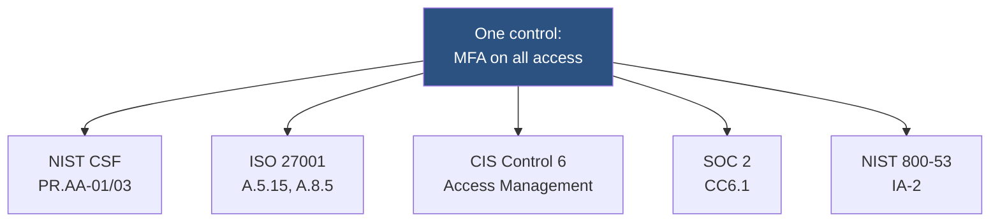
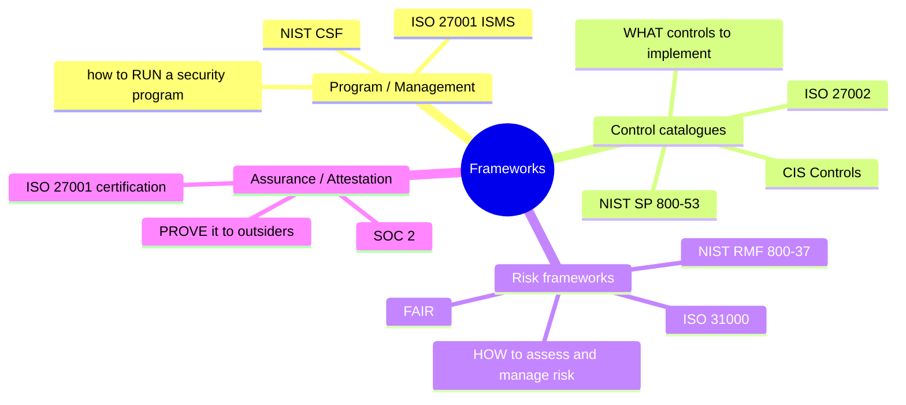
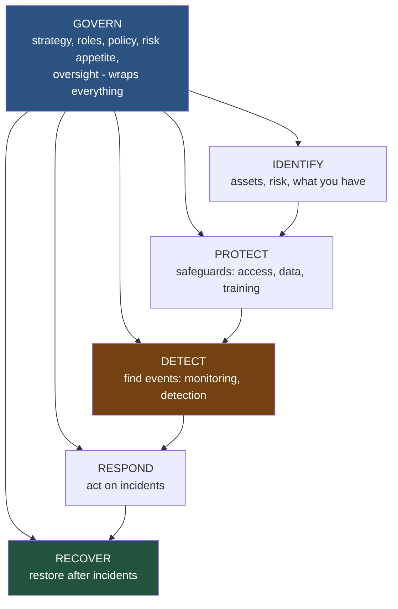
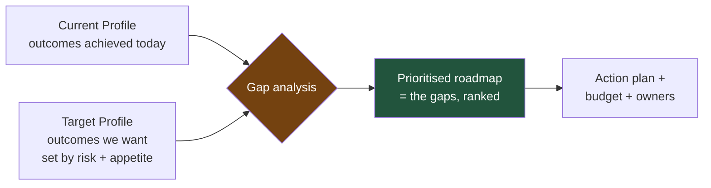
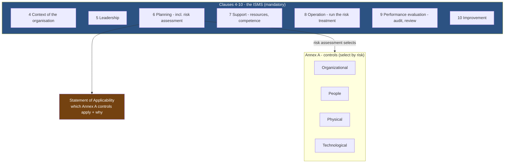
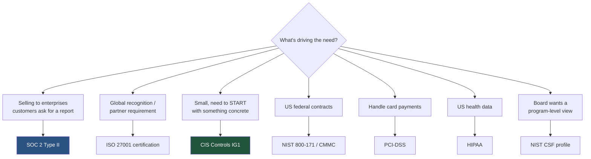
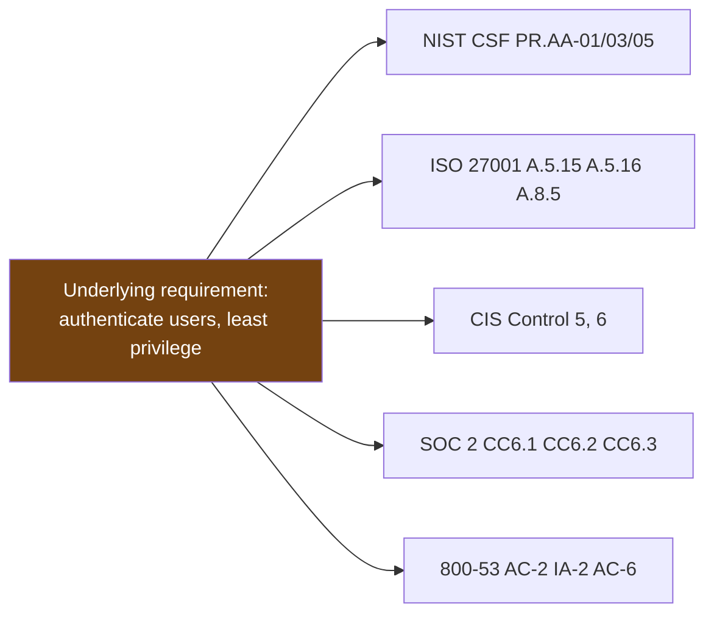

This is Chapter 2 of the GRC & Architecture notebook. Chapter 1 built the vocabulary — governance, risk, compliance, controls, control objectives, the policy hierarchy. It repeatedly gestured at "frameworks" as the place where control objectives are organised, without opening any of them. This chapter opens the four that the security industry actually runs on: **NIST Cybersecurity Framework, ISO/IEC 27001, the CIS Critical Security Controls, and SOC 2.**

The goal is not to memorise control catalogues — nobody memorises Annex A, and you should not try. The goal is to understand what each framework *is for*, how it is structured, when you would choose it, and how the same control you configured in the technical notebooks can be mapped once and satisfy several frameworks at once. By the end you will be able to read a "we need to be SOC 2 compliant" request and know exactly what that means, what it does not mean, and how it relates to the ISO 27001 certification the company is also chasing and the NIST CSF the board keeps mentioning.

## Why This Matters

"We need to be compliant" is one of the vaguest sentences in security, because *compliant with what* changes everything. A startup selling to enterprises is told it needs SOC 2. A multinational wants ISO 27001 certification. A US federal contractor is bound to NIST SP 800-171. A company taking card payments must satisfy PCI-DSS. A hospital is under HIPAA. Each of these is a different kind of thing — an attestation, a certification, a mandatory contractual baseline, a regulation — and treating them as interchangeable produces expensive mistakes: building the wrong evidence, certifying the wrong scope, or assuming one buys you another.

The deeper reason this matters is efficiency. Organisations rarely face just one framework; a mature company might hold ISO 27001, complete a SOC 2 Type II, and map to NIST CSF for the board, all at once. Doing that as three separate projects triples the cost. Doing it well means recognising that **the frameworks overlap enormously — the same MFA deployment, the same access-review procedure, the same encryption standard satisfies a control in every one of them.** The skill this chapter builds is seeing that overlap and exploiting it: map a control once, satisfy many requirements. That skill is worth more than any individual framework's contents.



## Part 1: Framework, Standard, Regulation — Not the Same Thing

Chapter 1 distinguished policies from standards inside an organisation. At the industry level there is a parallel distinction that people conflate constantly, and getting it right is the first mark of framework literacy.

| Type | What it is | Force | Example | You "become"... |
|---|---|---|---|---|
| **Framework** | A structured, voluntary set of outcomes or controls to organise a program | Adopt by choice | NIST CSF, CIS Controls | aligned to it |
| **Standard** | A formal, often certifiable specification with defined requirements | Voluntary, but certifiable | ISO/IEC 27001 | certified against it |
| **Attestation** | An independent auditor's report on your controls against criteria | Requested by customers | SOC 2 | attested (report issued) |
| **Regulation / law** | A legal requirement imposed by a government | Mandatory (in scope) | GDPR, HIPAA | compliant (or liable) |
| **Contractual standard** | A baseline required by a contract or industry body | Mandatory (by contract) | PCI-DSS | compliant (or lose the contract) |

The distinctions with real consequences:

- **A framework you *align* to; a standard you get *certified* against; a regulation you *must* comply with or face legal penalty.** These are different relationships with different proof. Aligning to NIST CSF is a self-assessment; ISO 27001 certification requires an accredited external auditor; HIPAA compliance can be enforced by a regulator with fines.
- **SOC 2 is an *attestation*, not a certification.** You do not "pass" or "get certified" in SOC 2 — an independent CPA firm examines your controls and issues a *report* (an opinion) that you share with customers. The distinction matters legally and in how you talk about it: "we have a SOC 2 report" is correct; "we are SOC 2 certified" is technically wrong, however common.
- **PCI-DSS feels like a regulation but is a *contractual* standard** imposed by the payment card brands. The enforcement mechanism is your merchant agreement, not a law — but losing the ability to process cards is as consequential as any fine.

Keeping these straight is what lets you answer "what does 'we need to be compliant' mean here?" precisely instead of building the wrong thing.

## Part 2: A Taxonomy of Frameworks

There are dozens of frameworks; they sort into four functional types, and knowing the type tells you what a framework is *good for* before you read a line of it.



| Type | Answers | Examples | Nature |
|---|---|---|---|
| **Program / management** | How do we *run* a security program? | ISO 27001 (ISMS), NIST CSF | Outcome- and process-oriented |
| **Control catalogue** | *Which* controls do we implement? | NIST SP 800-53, CIS Controls, ISO 27002 | Prescriptive lists of controls |
| **Risk framework** | How do we *assess and manage* risk? | NIST RMF (800-37), ISO 31000, FAIR | Process for the risk pillar |
| **Assurance / attestation** | How do we *prove* it to outsiders? | SOC 2, ISO 27001 certification | Independent verification |

The most useful insight from this taxonomy: **the four frameworks in this chapter's title are of different types, which is exactly why organisations use several together.** NIST CSF is a program framework (organise the whole program by outcomes). ISO 27001 is both a program framework *and* a certifiable standard (run an ISMS *and* prove it). CIS Controls is a prescriptive control catalogue (the technical checklist). SOC 2 is an attestation (prove specific controls to customers). They are not competitors; they occupy different slots and complement each other. That is the mental model to carry through the rest of the chapter.

## Part 3: NIST Cybersecurity Framework 2.0

The **NIST Cybersecurity Framework** is a voluntary, outcome-based framework for managing cybersecurity risk. It is the most widely used *program* framework, especially in the US, precisely because it is not prescriptive — it describes *what outcomes* to achieve, not *how*, which makes it applicable to any organisation of any size and mappable to every other framework.

Its defining feature is that it is organised around **functions and outcomes**, not controls. You do not "implement CSF"; you use it to organise, assess, and communicate your program.

### 3.1 The six functions (CSF 2.0)

Version 2.0 (released 2024) is built on **six functions** — the top level of the hierarchy and the part everyone should know cold. The headline change from 1.1 was the addition of **Govern** as a sixth function wrapping the other five, formally recognising the governance pillar from Chapter 1.



| Function | Outcome | Maps to (earlier notebooks) |
|---|---|---|
| **Govern (GV)** | Establish and monitor the cybersecurity risk-management strategy, expectations, and policy | All of GRC Chapter 1 |
| **Identify (ID)** | Understand assets, suppliers, and risks | The CBOM/inventory work; asset management |
| **Protect (PR)** | Safeguards to prevent or limit impact | Preventive controls: access, encryption, training |
| **Detect (DE)** | Find and analyse cybersecurity events | The entire Purple Team detection-validation chapter |
| **Respond (RS)** | Take action on a detected incident | Incident response |
| **Recover (RC)** | Restore capabilities after an incident | Backups, DR, resilience |

The functions map cleanly onto the control taxonomy from Chapter 1: Protect is preventive, Detect is detective, Respond and Recover are corrective, and Govern and Identify are the managerial layer that directs them. **If you learn one thing about CSF, learn the six functions in order** — Govern, Identify, Protect, Detect, Respond, Recover — because they are the vocabulary every US-influenced security conversation uses, and they are a complete, memorable model of what a program does.

### 3.2 The hierarchy: functions → categories → subcategories

CSF nests three levels deep:

- **Functions** (6) — the highest level (above).
- **Categories** (~22) — groups of outcomes within a function. E.g. under Protect: *Identity Management, Authentication and Access Control (PR.AA)*, *Data Security (PR.DS)*, *Platform Security (PR.PS)*.
- **Subcategories** (~100+) — specific outcome statements. E.g. *PR.AA-01: Identities and credentials are managed*; *PR.AA-03: Users, services, and hardware are authenticated*.

Subcategories are written as *outcomes*, not instructions: "users are authenticated" — not "deploy MFA." That is deliberate and is CSF's superpower. Because the subcategory states an outcome, it maps to *any* control that achieves it, in any other framework — which is why CSF is the natural spine for a crosswalk (Part 9). Each subcategory in the official document ships with **Informative References** pointing at the specific ISO 27001, SP 800-53, and CIS controls that satisfy it, so NIST does much of the crosswalk work for you.

### 3.3 Tiers and Profiles — the two tools you actually use

CSF gives you two instruments for applying the hierarchy:

**Implementation Tiers (1-4)** describe how *rigorous and integrated* your risk-management practices are — not a maturity score, but a characterisation:

| Tier | Name | Characterisation |
|---|---|---|
| 1 | Partial | Ad hoc, reactive, risk managed inconsistently |
| 2 | Risk Informed | Risk practices approved but not organisation-wide |
| 3 | Repeatable | Formal, consistent, organisation-wide policies |
| 4 | Adaptive | Continuously improving, adapting to change |

**Profiles** are the workhorse. A **Profile** is a selection of subcategories that represents either your **Current** state (what you do today) or your **Target** state (what you want). The gap between a Current Profile and a Target Profile *is your roadmap* — the prioritised list of outcomes you do not yet achieve. This is the single most practical thing CSF produces, and the lab in Part 10 builds one.



## Part 4: ISO/IEC 27001 — The Certifiable ISMS

**ISO/IEC 27001** is the international standard for an **Information Security Management System (ISMS)** — and, unlike CSF, it is *certifiable*: an accredited external body audits you and issues a certificate that customers and partners around the world recognise. Where CSF describes outcomes, ISO 27001 specifies the *management system* that produces and sustains those outcomes.

The crucial concept is **ISMS**: not a product, but a *system of management* — the policies, processes, roles, risk assessments, and continual-improvement machinery that together run security as an ongoing, governed activity. ISO 27001 certifies that this system exists and works, which is a stronger claim than "we have these controls." It says "we have a functioning system that keeps producing the right controls."

### 4.1 The structure: mandatory clauses + Annex A

ISO 27001 has two parts, and the division matters:

- **Clauses 4-10 (mandatory).** These define the ISMS itself and are *non-negotiable* for certification. They are the management-system requirements.
- **Annex A (the control set).** A catalogue of controls (detailed in the companion standard ISO 27002) from which you select what is applicable to your risks.



The mandatory clauses follow the **Plan-Do-Check-Act (PDCA)** cycle — the same continuous-improvement loop as the GRC operating cycle from Chapter 1:

| Clause | Name | PDCA | What it requires |
|---|---|---|---|
| 4 | Context | Plan | Understand the organisation, interested parties, and ISMS scope |
| 5 | Leadership | Plan | Top-management commitment, an information security policy, roles |
| 6 | Planning | Plan | **Risk assessment and treatment**; security objectives |
| 7 | Support | Do | Resources, competence, awareness, documented information |
| 8 | Operation | Do | Execute the risk treatment plan |
| 9 | Performance evaluation | Check | Monitoring, internal audit, management review |
| 10 | Improvement | Act | Nonconformities, corrective action, continual improvement |

Clause 6 is the heart, because it makes ISO 27001 **risk-driven**: you do not implement all of Annex A: you *assess your risks* and select the controls that treat them. That connects directly to GRC Chapter 1 — the risk register and treatment decisions feed straight into the ISMS.

### 4.2 The Statement of Applicability

The **Statement of Applicability (SoA)** is ISO 27001's signature artifact and the document an auditor reaches for first. It lists every Annex A control and, for each, states: is it applicable? If yes, how is it implemented? If no, why is it excluded? The SoA is the bridge from your risk assessment to your controls — it is *the evidence that your control selection is risk-driven rather than arbitrary*. A control excluded with a documented, risk-based justification is fine; a control excluded because you forgot is a finding.

### 4.3 Annex A control themes

The 2022 revision reorganised Annex A into **four themes** (down from fourteen domains), which is the structure to know:

| Theme | Rough content | Count (approx.) |
|---|---|---|
| **Organizational** | Policies, roles, supplier relationships, threat intel, cloud | ~37 |
| **People** | Screening, awareness, disciplinary process, remote working | ~8 |
| **Physical** | Secure areas, equipment, clear desk, disposal | ~14 |
| **Technological** | Access control, crypto, logging, malware, secure development | ~34 |

You do not memorise these. You recognise the shape: ISO covers far more than technology — a full third of the controls are organisational and people controls — which reflects its ISMS philosophy that security is a *management* problem, not a tooling problem. That breadth is exactly why ISO 27001 certification is a meaningful signal and why it takes real organisational effort, not just an engineering sprint, to achieve.

## Part 5: CIS Critical Security Controls — The Prescriptive Checklist

Where NIST CSF and ISO 27001 describe *what outcomes* and *what system*, the **CIS Critical Security Controls** (v8.1) tell you *exactly what to do*, in priority order. They are the most prescriptive, technical, and immediately actionable of the four — a checklist an engineer can start executing on Monday.

The CIS Controls are **18 controls**, each broken into concrete **safeguards** (there are 153 in total). They are ordered by impact: the earlier controls block the most attacks per unit of effort, so a small organisation that does nothing else should do Controls 1-6 first.

### 5.1 The 18 controls

| # | Control | Essence |
|---|---|---|
| 1 | Inventory of Enterprise Assets | Know every device |
| 2 | Inventory of Software Assets | Know every application |
| 3 | Data Protection | Classify and protect data |
| 4 | Secure Configuration | Harden systems and software |
| 5 | Account Management | Manage the lifecycle of accounts |
| 6 | Access Control Management | Least privilege, MFA |
| 7 | Continuous Vulnerability Management | Find and fix vulns continuously |
| 8 | Audit Log Management | Collect and retain logs |
| 9 | Email and Web Browser Protections | Reduce the most common entry vectors |
| 10 | Malware Defenses | Anti-malware, EDR |
| 11 | Data Recovery | Backups you can restore |
| 12 | Network Infrastructure Management | Secure network devices |
| 13 | Network Monitoring and Defense | Detect and respond on the network |
| 14 | Security Awareness and Skills Training | The human layer |
| 15 | Service Provider Management | Third-party risk |
| 16 | Application Software Security | Secure the software you build |
| 17 | Incident Response Management | Be ready to respond |
| 18 | Penetration Testing | Test your defences |

The ordering is the lesson. Controls 1-2 (asset and software inventory) come first because **you cannot protect what you do not know you have** — the exact point made in the post-quantum migration chapter about discovery, and in the risk register about assets. Access control (5-6) precedes vulnerability management (7) precedes logging (8). This is a defensible priority order built from real attack data, and it is why a resource-constrained team should work the CIS Controls top-down rather than cherry-picking.

### 5.2 Implementation Groups

CIS's second smart idea is **Implementation Groups (IGs)** — a way to scale the same controls to organisations of different size and risk:

| IG | For | Safeguards | Profile |
|---|---|---|---|
| **IG1** | Small orgs, limited resources ("basic cyber hygiene") | ~56 | The essential minimum every organisation should do |
| **IG2** | Mid-size, some dedicated security staff | ~130 (cumulative) | IG1 + more, for organisations managing more sensitive data |
| **IG3** | Large, mature, high-risk | 153 (all) | IG2 + the rest, for organisations facing sophisticated threats |

The groups are cumulative — IG2 includes all of IG1. **IG1 is a genuinely important concept**: NIST and CIS jointly define it as "essential cyber hygiene," the floor below which no organisation should sit. For a small company asking "where do we even start," the answer is precise and free: implement CIS IG1. That is one of the most useful concrete recommendations in all of GRC.

## Part 6: SOC 2 — The Attestation Customers Ask For

**SOC 2** (System and Organization Controls 2) is not a certification and not a control framework — it is an **attestation report** produced by an independent CPA firm, examining a service organisation's controls against the **Trust Services Criteria**. It exists to answer one question a customer has about a vendor: *"can I trust you with my data?"* — with an independent auditor's opinion rather than the vendor's own say-so.

SOC 2 dominates the B2B SaaS world. If you sell software to enterprises, they will ask for your SOC 2 report before signing, which is why "we need SOC 2" is often the first compliance sentence a startup hears.

### 6.1 The five Trust Services Criteria

SOC 2 is built on five **Trust Services Criteria (TSC)**. Only the first is mandatory; you choose the others based on what you promise customers.

| Criterion | Covers | Mandatory? |
|---|---|---|
| **Security** (Common Criteria) | Protection against unauthorised access — the baseline | **Yes, always** |
| **Availability** | System is available for operation as committed | Optional |
| **Processing Integrity** | Processing is complete, valid, accurate, timely | Optional |
| **Confidentiality** | Confidential information is protected | Optional |
| **Privacy** | Personal information is handled per commitments | Optional |

The **Security** criterion (also called the Common Criteria, CC-series) is the foundation and is required in every SOC 2. The others are added based on your product's promises: a database service adds Availability; a payments processor adds Processing Integrity; a service handling personal data adds Privacy. **Scoping the criteria correctly is the first SOC 2 decision** — adding all five when your product only warrants two is expensive; omitting one a customer expects loses the deal.

### 6.2 Type I vs Type II — the distinction that matters most

This is the single most important SOC 2 concept and the one most often gotten wrong:

| | Type I | Type II |
|---|---|---|
| **What it examines** | Whether controls are *suitably designed* at a *point in time* | Whether controls *operated effectively* over a *period* (usually 3-12 months) |
| **The question** | "Are the right controls in place today?" | "Did the controls actually work, consistently, over time?" |
| **Rigour** | Lower | Higher — the one customers actually want |
| **Chapter 1 mapping** | Design effectiveness | **Operating** effectiveness |

Type II is the real prize, and its difference from Type I is *exactly* the design-vs-operating-effectiveness distinction from GRC Chapter 1 (Part 9.1). Type I says the controls are well-designed on the audit date; Type II says they *actually operated* across a whole observation window — which is what a customer cares about, because a control that exists but does not run is worthless. Most enterprise customers ask specifically for **SOC 2 Type II**, and a startup's compliance journey is usually "Type I first to prove design, then Type II after enough operating history accrues."

### 6.3 SOC 1, SOC 2, SOC 3 — and the auditor relationship

Quickly disambiguating the SOC family, because the numbers confuse everyone:

- **SOC 1** — controls relevant to *financial reporting* (for your customers' auditors). Not security-focused.
- **SOC 2** — controls relevant to security/availability/etc. (the Trust Services Criteria). Restricted-distribution report.
- **SOC 3** — a *public* summary version of SOC 2, shareable on a website without an NDA.

SOC 2 also introduces the **auditor relationship** that is new relative to the other three frameworks: an independent CPA firm performs the examination and issues the opinion. You do not self-attest. The auditor's independence is what gives the report value to your customers — the same logic as the third line of defence from Chapter 1. Practically, this means SOC 2 involves an external party on a recurring basis (Type II is typically annual), and much of the work is producing the *evidence* the auditor samples — logs, tickets, access reviews, change records — which is why evidence automation (the GRC-platform value from Chapter 1) matters so much for SOC 2 specifically.

## Part 7: The Regulation-Adjacent Set — 800-53, 800-171, PCI-DSS, HIPAA

Beyond the four headline frameworks, four more come up constantly and belong in your vocabulary even at a beginner level.

| Framework | Type | Applies to | Essence |
|---|---|---|---|
| **NIST SP 800-53** | Control catalogue | US federal systems (and widely borrowed) | The exhaustive control catalogue (~1000+ controls in 20 families) behind FISMA/FedRAMP |
| **NIST SP 800-171** | Control subset | Contractors handling federal CUI | A focused subset of 800-53 for protecting Controlled Unclassified Information; flows down via contract (DFARS/CMMC) |
| **PCI-DSS** | Contractual standard | Anyone storing/processing/transmitting card data | 12 prescriptive requirements enforced by the card brands; scope-reduction is the whole game |
| **HIPAA** | Regulation (law) | US healthcare and their business associates | Security and Privacy Rules for protected health information; enforced by a regulator with fines |

Three orientation points:

- **800-53 is the "big catalogue."** When another framework needs a specific control to cite, it often points at an 800-53 control (like `IA-2` for authentication). It is not something a small company adopts wholesale; it is the reference library the US government and FedRAMP run on.
- **800-171 and CMMC matter if you touch US federal contracts.** CUI protection flows down the supply chain contractually, so even a small subcontractor can be bound to 800-171 by a prime contractor's requirement.
- **PCI-DSS rewards scope reduction.** Because the requirements apply to the *cardholder data environment*, the cheapest path to PCI compliance is usually to *store less card data* (or none — outsource to a compliant processor), shrinking the environment in scope. This is the "Avoid" treatment from Chapter 1 applied to compliance, and it is why the risk-register example there treated cardholder data with Avoid.

These are covered in depth where they belong — PCI-DSS and HIPAA get a full treatment in Chapter 6 (Privacy, Data Protection & Regulations). Here they round out the map.

## Part 8: Choosing a Framework

Organisations do not choose frameworks in the abstract; they are driven to specific ones by specific pressures. The decision is almost always determined by the *driver*, not by which framework is "best."



| Driver | Reach for | Why |
|---|---|---|
| Enterprise customers demand proof | **SOC 2 Type II** | It is the report B2B buyers ask for |
| International recognition / large partners | **ISO 27001** | Globally recognised certification |
| "We're small, where do we start?" | **CIS Controls IG1** | Concrete, prioritised, free, essential hygiene |
| Board / executive communication | **NIST CSF** | Outcome-based, maps to everything, non-technical-friendly |
| US federal contracts / CUI | **NIST 800-171 / CMMC** | Contractually mandated |
| Card payments | **PCI-DSS** | Contractually mandated by card brands |
| US health data | **HIPAA** | Legally mandated |

The nuance that separates a beginner from someone useful: **these are not mutually exclusive, and mature organisations run several at once.** A common combination for a growing SaaS company: use **NIST CSF** to structure and communicate the whole program, implement **CIS Controls** as the concrete technical checklist, get **ISO 27001** certified for international credibility, and produce a **SOC 2 Type II** for enterprise customers. Done naively that is four projects; done well it is one control set mapped four ways — which is exactly what Part 9 and the lab are about.

## Part 9: Crosswalks — Map Once, Satisfy Many

The reason running multiple frameworks is affordable is that they overlap enormously. A **crosswalk** (or mapping) is a table that shows which controls in different frameworks satisfy the same underlying requirement. Build it once and a single control implementation produces evidence for every framework it maps to.

### 9.1 Why the overlap exists

All these frameworks are trying to prevent the same attacks, so they converge on the same controls — access control, encryption, logging, patching, backups, awareness. They differ in *organisation and emphasis*, not fundamentally in *content*. NIST CSF states MFA as an outcome (PR.AA-03); ISO 27001 as Annex A controls (A.5.15, A.8.5); CIS as a safeguard under Control 6; SOC 2 as a Common Criteria point (CC6.1); 800-53 as control IA-2. **Same control, five labels.**



### 9.2 A worked crosswalk fragment

| Requirement | NIST CSF 2.0 | ISO 27001:2022 | CIS v8.1 | SOC 2 | 800-53 |
|---|---|---|---|---|---|
| Multi-factor authentication | PR.AA-03 | A.8.5 | 6.3, 6.4, 6.5 | CC6.1 | IA-2 |
| Least-privilege access | PR.AA-05 | A.8.2, A.8.3 | 6.8 | CC6.3 | AC-6 |
| Account lifecycle mgmt | PR.AA-01 | A.5.16, A.5.18 | 5.1-5.6 | CC6.2, CC6.3 | AC-2 |
| Audit logging | DE.AE, PR.PS-04 | A.8.15 | 8.2-8.5 | CC7.2 | AU-2, AU-6 |
| Vulnerability management | ID.RA-01 | A.8.8 | 7.1-7.7 | CC7.1 | RA-5 |
| Encryption of data | PR.DS-01/02 | A.8.24 | 3.10, 3.11 | CC6.7 | SC-13, SC-28 |
| Backup / recovery | RC.RP | A.8.13 | 11.1-11.5 | A1.2 | CP-9, CP-10 |
| Security awareness training | PR.AT | A.6.3 | 14.1-14.9 | CC1.4 | AT-2 |
| Incident response | RS, RC | A.5.24-A.5.28 | 17.1-17.9 | CC7.3, CC7.4 | IR-4 |

Read across any row: **one thing you implement once, appearing in five frameworks.** Deploy MFA well, gather the evidence once, and you have satisfied PR.AA-03, A.8.5, CIS 6.3-6.5, CC6.1, and IA-2 simultaneously. This is the entire economic argument for a mapped, framework-agnostic control program, and it is why NIST publishes Informative References and why GRC platforms (Chapter 1) sell "map once, comply many" as their headline feature.

### 9.3 Where the overlap breaks down

Crosswalks are powerful but not perfect, and pretending they are is a real pitfall:

- **Mappings are approximate.** "PR.AA-03 ≈ A.8.5" means they cover *related* ground, not that satisfying one automatically satisfies the other. The evidence an ISO auditor wants may differ from what a SOC 2 auditor samples for the "same" control.
- **Some requirements are framework-specific.** ISO 27001's mandatory ISMS clauses (4-10) have no CIS equivalent, because CIS is a control catalogue, not a management system. SOC 2's auditor-opinion structure has no ISO analogue.
- **Scope and evidence differ even where controls match.** The control might be identical; the *proof* each framework demands is not.

So the correct model is: **crosswalks let you reuse control *implementations* and much of the *evidence*, but each framework still has framework-specific requirements and its own assurance process.** Map aggressively to save effort; do not assume one certification hands you another.

## Part 10: Hands-On Lab — Build a Crosswalk and a CSF Profile

This lab produces two artifacts a real GRC function uses: a control-mapping crosswalk, and a NIST CSF current-vs-target profile with gap scoring. A spreadsheet or the Python below is all you need.

**Scope note:** as in Chapter 1, the lab is the documents themselves — the deliverables of a governance function — describing an organisation you are authorised to document.

### 10.1 Build the crosswalk programmatically

```python
#!/usr/bin/env python3
"""crosswalk.py - a control crosswalk keyed on the underlying requirement.
Given the controls YOU have implemented (by internal control ID), show which
framework requirements each one satisfies. Map once, report many."""
import csv

# The master crosswalk: requirement -> framework references
CROSSWALK = {
    "MFA":            {"CSF":"PR.AA-03","ISO":"A.8.5","CIS":"6.3-6.5","SOC2":"CC6.1","800-53":"IA-2"},
    "LeastPriv":      {"CSF":"PR.AA-05","ISO":"A.8.2","CIS":"6.8","SOC2":"CC6.3","800-53":"AC-6"},
    "AccountMgmt":    {"CSF":"PR.AA-01","ISO":"A.5.16","CIS":"5.1-5.6","SOC2":"CC6.2","800-53":"AC-2"},
    "Logging":        {"CSF":"DE.AE","ISO":"A.8.15","CIS":"8.2-8.5","SOC2":"CC7.2","800-53":"AU-2"},
    "VulnMgmt":       {"CSF":"ID.RA-01","ISO":"A.8.8","CIS":"7.1-7.7","SOC2":"CC7.1","800-53":"RA-5"},
    "Encryption":     {"CSF":"PR.DS-01","ISO":"A.8.24","CIS":"3.10-3.11","SOC2":"CC6.7","800-53":"SC-28"},
    "Backup":         {"CSF":"RC.RP","ISO":"A.8.13","CIS":"11.1-11.5","SOC2":"A1.2","800-53":"CP-9"},
    "Training":       {"CSF":"PR.AT","ISO":"A.6.3","CIS":"14.1-14.9","SOC2":"CC1.4","800-53":"AT-2"},
    "IncidentResp":   {"CSF":"RS/RC","ISO":"A.5.24","CIS":"17.1-17.9","SOC2":"CC7.3","800-53":"IR-4"},
}

# Controls this org has actually implemented, with an internal ID + status
IMPLEMENTED = [
    ("CTL-001","MFA",         "implemented"),
    ("CTL-002","LeastPriv",   "implemented"),
    ("CTL-003","AccountMgmt", "implemented"),
    ("CTL-004","Logging",     "partial"),
    ("CTL-005","VulnMgmt",    "implemented"),
    ("CTL-006","Encryption",  "implemented"),
    ("CTL-007","Backup",      "partial"),        # untested restore (Ch.1 R-01)
    ("CTL-008","Training",    "planned"),
    ("CTL-009","IncidentResp","implemented"),
]

frameworks = ["CSF","ISO","CIS","SOC2","800-53"]
print(f"{'CTL':8} {'REQUIREMENT':13} {'STATUS':12} " + " ".join(f"{f:10}" for f in frameworks))
print("-"*95)
cov = {f: 0 for f in frameworks}
for cid, req, status in IMPLEMENTED:
    refs = CROSSWALK[req]
    print(f"{cid:8} {req:13} {status:12} " + " ".join(f"{refs[f]:10}" for f in frameworks))
    if status == "implemented":
        for f in frameworks: cov[f] += 1

print("-"*95)
total = len(IMPLEMENTED)
print("Framework coverage from these controls (fully-implemented only):")
for f in frameworks:
    print(f"  {f:8} {cov[f]}/{total} requirements satisfied")

with open("crosswalk.csv","w",newline="") as fh:
    w = csv.writer(fh); w.writerow(["control_id","requirement","status",*frameworks])
    for cid,req,status in IMPLEMENTED:
        w.writerow([cid,req,status,*[CROSSWALK[req][f] for f in frameworks]])
print("wrote crosswalk.csv")
```

```bash
python3 crosswalk.py
```

```
CTL      REQUIREMENT   STATUS       CSF        ISO        CIS        SOC2       800-53
-----------------------------------------------------------------------------------------------
CTL-001  MFA           implemented  PR.AA-03   A.8.5      6.3-6.5    CC6.1      IA-2
CTL-002  LeastPriv     implemented  PR.AA-05   A.8.2      6.8        CC6.3      AC-6
CTL-003  AccountMgmt   implemented  PR.AA-01   A.5.16     5.1-5.6    CC6.2      AC-2
CTL-004  Logging       partial      DE.AE      A.8.15     8.2-8.5    CC7.2      AU-2
CTL-005  VulnMgmt      implemented  ID.RA-01   A.8.8      7.1-7.7    CC7.1      RA-5
CTL-006  Encryption    implemented  PR.DS-01   A.8.24     3.10-3.11  CC6.7      SC-28
CTL-007  Backup        partial      RC.RP      A.8.13     11.1-11.5  A1.2       CP-9
CTL-008  Training      planned      PR.AT      A.6.3      14.1-14.9  CC1.4      AT-2
CTL-009  IncidentResp  implemented  RS/RC      A.5.24     17.1-17.9  CC7.3      IR-4
-----------------------------------------------------------------------------------------------
Framework coverage from these controls (fully-implemented only):
  CSF      6/9 requirements satisfied
  ISO      6/9 requirements satisfied
  CIS      6/9 requirements satisfied
  SOC2     6/9 requirements satisfied
  800-53   6/9 requirements satisfied
```

The output makes the central lesson unmissable: **nine control implementations produce coverage across five frameworks simultaneously**, and the three not-yet-done controls (partial logging, untested backup, planned training) are gaps in *all five* at once — so fixing one control improves five compliance postures. That is the map-once-satisfy-many economics made concrete, and it is exactly why you build a framework-agnostic control set rather than five parallel projects.

### 10.2 Build a NIST CSF current/target profile

Now the CSF gap analysis from Part 3.3 — the roadmap generator.

```python
#!/usr/bin/env python3
"""csf_profile.py - NIST CSF 2.0 current-vs-target profile with gap scoring.
Maturity per subcategory on 0-4 (Tiers). Gap = target - current, weighted by
priority. The ranked gaps ARE the roadmap."""
# (function, subcategory, description, current, target, priority 1-3)
PROFILE = [
    ("GV","GV.RR-02","Roles/responsibilities established", 2, 3, 2),
    ("GV","GV.PO-01","Security policy established",          3, 3, 2),
    ("ID","ID.AM-01","Asset inventory maintained",          2, 4, 3),
    ("ID","ID.RA-01","Vulnerabilities identified",          3, 4, 3),
    ("PR","PR.AA-03","Users authenticated (MFA)",           3, 4, 3),
    ("PR","PR.DS-01","Data-at-rest protected",              3, 4, 2),
    ("PR","PR.AT-01","Users trained",                       1, 3, 2),
    ("DE","DE.CM-01","Networks/systems monitored",          2, 4, 3),
    ("DE","DE.AE-02","Detections validated/analysed",       1, 4, 3),  # Purple Team!
    ("RS","RS.MA-01","Incident response executed",          2, 3, 2),
    ("RC","RC.RP-01","Recovery plan executed (tested)",     1, 4, 3),  # untested backups
]

rows = []
for fn, sub, desc, cur, tgt, pri in PROFILE:
    gap = tgt - cur
    weighted = gap * pri
    rows.append((weighted, gap, fn, sub, desc, cur, tgt, pri))
rows.sort(reverse=True)

print(f"{'WGT':>3} {'GAP':>3} {'FUNC':4} {'SUBCAT':10} {'CUR':>3} {'TGT':>3} {'PRI':>3} OUTCOME")
print("-"*88)
for wgt, gap, fn, sub, desc, cur, tgt, pri in rows:
    flag = "  <== roadmap top" if wgt >= 6 else ""
    print(f"{wgt:>3} {gap:>3} {fn:4} {sub:10} {cur:>3} {tgt:>3} {pri:>3} {desc}{flag}")

open_gaps = [r for r in rows if r[1] > 0]
print("-"*88)
print(f"{len(open_gaps)} subcategories below target | "
      f"avg current maturity {sum(r[5] for r in rows)/len(rows):.1f} / 4")
```

```bash
python3 csf_profile.py
```

```
WGT GAP FUNC SUBCAT     CUR TGT PRI OUTCOME
----------------------------------------------------------------------------------------
  9   3 RC   RC.RP-01     1   4   3 Recovery plan executed (tested)  <== roadmap top
  9   3 DE   DE.AE-02     1   4   3 Detections validated/analysed  <== roadmap top
  6   2 ID   ID.AM-01     2   4   3 Asset inventory maintained  <== roadmap top
  6   2 DE   DE.CM-01     2   4   3 Networks/systems monitored  <== roadmap top
  4   2 PR   PR.AT-01     1   3   2 Users trained
  3   1 ID   ID.RA-01     3   4   3 Vulnerabilities identified
  3   1 PR   PR.AA-03     3   4   3 Users authenticated (MFA)
  2   1 PR   PR.DS-01     3   4   2 Data-at-rest protected
  2   1 RS   RS.MA-01     2   3   2 Incident response executed
  2   1 GV   GV.RR-02     2   3   2 Roles/responsibilities established
  0   0 GV   GV.PO-01     3   3   2 Security policy established
----------------------------------------------------------------------------------------
10 subcategories below target | avg current maturity 2.0 / 4
```

The ranked output *is the roadmap*. The two highest-priority gaps — tested recovery (RC.RP-01) and validated detections (DE.AE-02) — are precisely the weaknesses the Chapter 1 risk register surfaced (untested backups, unvalidated LSASS detection) and the exact subjects of the Purple Team notebook, now expressed as CSF outcomes with a priority-weighted gap score. **This closes the loop across three notebooks:** a technical gap (unvalidated detection) becomes a rated risk (register), becomes a control objective below target (CSF profile), becomes a prioritised, owned roadmap item. That traceability — from a `procdump` against lsass all the way to a board-level CSF profile — is what a security *program* looks like.

### 10.3 Extend the lab

- Add the crosswalk references to the CSF profile so each gap shows which ISO/CIS/SOC 2 requirements it also blocks — a gap in DE.AE-02 is also a gap in ISO A.8.15, CIS 8/13, and SOC 2 CC7.2.
- Produce a per-function average maturity and render it as a radar/spider chart (six spokes, one per CSF function) — the standard executive visualisation.
- Add an "evidence" column mapping each implemented control to the artifact that proves it operates (a log query, a ticket, an access-review record) — the bridge from this chapter to a real audit.

## Part 11: Frameworks for the Technical Practitioner — Offensive and Defensive Angles

Frameworks look like the most abstract topic in the notebook, and yet they connect directly to hands-on offence and defence.

**How an attacker uses framework knowledge.** A framework tells an attacker where an organisation *believes* its defences are — and, by omission, where they are not. A company that proudly holds SOC 2 with only the Security criterion has made no *availability* commitments, which hints at where resilience is thin. A PCI scope diagram is a map of exactly which segment holds card data and which controls are assumed around it — and therefore where an out-of-scope pivot leads. The gap between "IG1 implemented" and "IG2/IG3 not yet" tells a red teamer which safeguards a small organisation has probably skipped (network monitoring, penetration testing, application security). Reading a target's compliance posture is reconnaissance: it narrows the search space to the controls the framework does *not* mandate at their level.

**How a defender uses framework knowledge.** For the defender, frameworks are the tool that turns technical work into a fundable program and a communicable story. The CSF profile from the lab is a language the board understands; the crosswalk is what stops the security team from doing five compliance projects when one control set will do. And frameworks provide *completeness* — the thing an individual engineer's intuition misses. Working the CIS Controls top-down catches the unglamorous basics (asset inventory, account lifecycle) that attackers actually exploit and that a tools-focused team routinely under-invests in. The framework is a checklist against your own blind spots.

**Where this meets the earlier notebooks.** Every technical control from the offensive and defensive notebooks lands somewhere in these frameworks: the Purple Team detections are CSF Detect and CIS Control 13; RunAsPPL and MFA are Protect and CIS Control 6; the post-quantum migration is ID.RA (risk identification) and PR.DS (data protection). Frameworks are the filing system that makes the whole of the technical work legible as *coverage* — and the crosswalk is what lets one implementation count everywhere it should.

## Part 12: Common Pitfalls and Myths

### 12.1 Pitfalls

| # | Pitfall | Consequence | Fix |
|---|---|---|---|
| 1 | Confusing framework / standard / regulation | Build the wrong proof; wrong expectations | Learn the five types (Part 1) |
| 2 | Saying "SOC 2 certified" | Technically wrong; signals unfamiliarity | It's an attestation/report, not a certification (Part 1) |
| 3 | Implementing all of Annex A / 800-53 | Wasted effort on irrelevant controls | Select by risk; the SoA is risk-driven (Part 4) |
| 4 | Treating frameworks as competitors | Duplicated projects, tripled cost | Different types; run several via crosswalk (Parts 2, 9) |
| 5 | Assuming one certification grants another | Failed audit; wrong evidence | Crosswalks reuse implementation, not assurance (Part 9.3) |
| 6 | Picking a framework before knowing the driver | The wrong framework | Choose by driver (Part 8) |
| 7 | SOC 2 Type I when the customer wanted Type II | Doesn't close the deal | Type II proves operating effectiveness (Part 6.2) |
| 8 | Scoping SOC 2 criteria wrong | Too expensive, or missing what customers expect | Security is mandatory; add others by product promise (Part 6.1) |
| 9 | Ignoring CIS ordering, cherry-picking | Skip high-impact basics | Work top-down; IG1 first (Part 5) |
| 10 | PCI without scope reduction | Huge, expensive environment in scope | Store less card data; outsource (Part 7) |
| 11 | Compliance date treated as "done" | Point-in-time snapshot, drifts | Continuous evidence; Type II is a period (Ch.1 Part 6) |
| 12 | No crosswalk; per-framework silos | Same control evidenced five times | Map once, satisfy many (Part 9) |

### 12.2 Myths

**"You have to pick one framework."** You pick the ones your drivers demand — often several — and run them off one mapped control set. They are different *types* (program, catalogue, risk, attestation) that complement rather than compete (Parts 2, 8).

**"SOC 2 is a certification you pass."** SOC 2 is an independent auditor's *attestation report*, an opinion on your controls. There is no pass/fail certificate; there is a report you share with customers (Parts 1, 6).

**"ISO 27001 is a list of controls."** ISO 27001 is a *management system* (clauses 4-10); Annex A is the control list, and you select from it by risk. The certifiable part is the ISMS, not the controls (Part 4).

**"NIST CSF tells us what to configure."** CSF states *outcomes*, not configurations. It is deliberately non-prescriptive so it maps to everything; the CIS Controls are where you get the concrete "do this" instructions (Parts 3, 5).

**"If we map to a framework, we're compliant with all of them."** Crosswalks let you reuse control implementations and much evidence, but each framework keeps framework-specific requirements and its own assurance process (Part 9.3).

**"Frameworks are just for auditors."** They are the defender's completeness checklist and funding language, and the attacker's map of assumed defences. Framework literacy is directly operational (Part 11).

## Final Revision / Summary

**Five types, not one thing.** A *framework* you align to by choice (NIST CSF, CIS); a *standard* you get certified against (ISO 27001); an *attestation* an auditor issues (SOC 2); a *regulation* you must obey (HIPAA, GDPR); a *contractual standard* a contract imposes (PCI-DSS). Different relationships, different proof.

**Four functional types.** *Program/management* frameworks (how to run a program: ISO 27001, NIST CSF), *control catalogues* (what controls: 800-53, CIS, ISO 27002), *risk frameworks* (how to assess risk: RMF, ISO 31000, FAIR), and *assurance/attestation* (prove it: SOC 2, ISO certification). The chapter's four are deliberately different types, which is why they combine.

**NIST CSF 2.0.** Outcome-based, non-prescriptive, six functions — **Govern, Identify, Protect, Detect, Respond, Recover** (Govern added in 2.0, wrapping the rest). Functions → categories → subcategories (outcomes, not instructions). Tiers characterise rigour (1-4); Profiles (Current vs Target) generate the roadmap from the gap. The natural spine for a crosswalk.

**ISO 27001.** A certifiable *ISMS* — a management system, not a product. Mandatory clauses 4-10 (PDCA: context, leadership, planning/risk, support, operation, evaluation, improvement) plus Annex A controls selected *by risk* and recorded in the Statement of Applicability. Four Annex A themes: organizational, people, physical, technological — a third of it is non-technical, reflecting the management-system philosophy.

**CIS Controls v8.1.** The prescriptive checklist: 18 controls, 153 safeguards, ordered by impact (inventory first — you can't protect what you don't know you have). Implementation Groups IG1/IG2/IG3 scale to size; **IG1 is "essential cyber hygiene," the floor and the answer to "where do we start."**

**SOC 2.** An independent CPA *attestation* against the five Trust Services Criteria (Security mandatory; Availability, Processing Integrity, Confidentiality, Privacy optional by product promise). **Type I = design at a point in time; Type II = operating effectiveness over a period** — the design-vs-operating distinction from Chapter 1, and the one customers actually want. SOC 1/2/3 differ by audience; SOC 3 is the public version.

**The regulation-adjacent set.** 800-53 (the big federal catalogue others cite), 800-171/CMMC (CUI for federal contractors, flows down by contract), PCI-DSS (card brands; scope reduction is the game), HIPAA (US health law with a regulator). Covered fully in Chapter 6.

**Choose by driver, run several.** Enterprise sales → SOC 2; global recognition → ISO 27001; starting out → CIS IG1; board view → NIST CSF; federal → 800-171; cards → PCI; health → HIPAA. Not mutually exclusive — mature orgs run several off one mapped control set.

**Crosswalks are the economics.** The frameworks overlap because they prevent the same attacks. One control (MFA) satisfies PR.AA-03, A.8.5, CIS 6.3-6.5, CC6.1, and IA-2 at once. Map once, satisfy many — but mappings are approximate, some requirements are framework-specific (ISO's ISMS clauses, SOC 2's auditor opinion), and each framework keeps its own evidence and assurance process.

## Cheat Sheet / Quick Reference

### The five types

```
FRAMEWORK   align by choice        NIST CSF, CIS
STANDARD    certified against      ISO 27001
ATTESTATION auditor's report       SOC 2  (NOT a certification)
REGULATION  must obey (law)        HIPAA, GDPR
CONTRACTUAL must obey (contract)   PCI-DSS
```

### NIST CSF 2.0

```
6 functions: GOVERN | IDENTIFY | PROTECT | DETECT | RESPOND | RECOVER
             (Govern added in 2.0, wraps the other five)
Hierarchy:   functions -> categories (~22) -> subcategories (~100+, OUTCOMES)
Tiers 1-4:   Partial / Risk-Informed / Repeatable / Adaptive (rigour, not maturity)
Profiles:    Current vs Target  ->  the GAP is your roadmap
```

### ISO 27001

```
An ISMS (management system), CERTIFIABLE by an external auditor
Mandatory clauses 4-10 (PDCA): context|leadership|planning(RISK)|support|
                                operation|evaluation|improvement
Annex A controls: selected BY RISK, recorded in the Statement of Applicability
4 themes: Organizational | People | Physical | Technological (1/3 non-technical)
```

### CIS Controls v8.1

```
18 controls, 153 safeguards, ORDERED BY IMPACT (inventory 1-2 first)
IG1 = essential cyber hygiene (the floor, ~56 safeguards) <- start here
IG2 = + mid-size (~130)      IG3 = + high-risk (all 153)   [cumulative]
```

### SOC 2

```
Independent CPA ATTESTATION (a report, not a certificate)
5 Trust Services Criteria: SECURITY(mandatory) + Availability, Processing
                           Integrity, Confidentiality, Privacy (optional)
Type I  = design at a point in time
Type II = operating effectiveness over a PERIOD  <- what customers want
SOC 1 financial | SOC 2 security | SOC 3 public summary
```

### Choose by driver

```
enterprise sales -> SOC 2 Type II      board view    -> NIST CSF
global/partners  -> ISO 27001          federal/CUI   -> 800-171 / CMMC
just starting    -> CIS IG1            card payments -> PCI-DSS
                                       health data   -> HIPAA
Not exclusive: run several off ONE mapped control set.
```

### Crosswalk (one control, five labels)

```
MFA:          CSF PR.AA-03 | ISO A.8.5  | CIS 6.3-6.5 | SOC2 CC6.1 | 800-53 IA-2
Logging:      CSF DE.AE    | ISO A.8.15 | CIS 8       | SOC2 CC7.2 | 800-53 AU-2
Backup:       CSF RC.RP    | ISO A.8.13 | CIS 11      | SOC2 A1.2  | 800-53 CP-9
Map once, satisfy many. But: mappings approximate; each keeps its own evidence.
```

### Glossary

| Term | Meaning |
|---|---|
| **Framework** | Voluntary structured set of outcomes/controls (align to) |
| **Standard** | Certifiable specification (ISO 27001) |
| **Attestation** | Independent auditor's report/opinion (SOC 2) |
| **NIST CSF** | Outcome-based program framework; 6 functions |
| **Function / Category / Subcategory** | CSF's three levels (subcategory = outcome) |
| **Tier / Profile** | CSF rigour level (1-4) / current-vs-target selection |
| **ISMS** | Information Security Management System (ISO 27001) |
| **Statement of Applicability** | ISO doc: which Annex A controls apply and why |
| **Annex A** | ISO 27001's control catalogue (detailed in ISO 27002) |
| **CIS Controls** | 18 prescriptive controls, 153 safeguards, impact-ordered |
| **Implementation Group (IG)** | CIS scaling: IG1 hygiene / IG2 / IG3 (cumulative) |
| **Trust Services Criteria** | SOC 2's five criteria (Security mandatory) |
| **Type I / Type II** | SOC 2: design point-in-time / operating over a period |
| **Common Criteria (CC)** | SOC 2's Security-criterion control series |
| **NIST 800-53 / 800-171** | Federal control catalogue / CUI subset |
| **PCI-DSS** | Card-brand contractual standard; scope-reduction driven |
| **Crosswalk** | Mapping showing one control satisfying many frameworks |
| **Informative References** | NIST's built-in crosswalk in CSF subcategories |

## Practice Labs & Resources

- **Build the crosswalk and CSF profile (Part 10) for a real or hypothetical org.** Then extend the CSF profile to show, for each gap, which ISO/CIS/SOC 2 requirements it also blocks — this is the artifact that proves the "map once, satisfy many" economics to a skeptical budget-holder.
- **Read the actual NIST CSF 2.0 Core.** It is freely available and browsable; pick one function (say Detect) and read its categories and subcategories, then map three detections from the Purple Team notebook to specific subcategories. Seeing your own technical work land in the framework is the moment CSF stops being abstract.
- **Download the CIS Controls v8.1 and self-assess against IG1.** The CIS self-assessment tool (CSAT) or the free spreadsheet lets you score your (or a lab org's) posture against the 56 IG1 safeguards. The gaps are a concrete, prioritised starting backlog — the most actionable output in this chapter.
- **Read a real SOC 2 report** (many vendors publish SOC 3 public summaries; some share SOC 2 under NDA). Identify which Trust Services Criteria are in scope, whether it is Type I or Type II, and what the auditor's opinion says. Reading one report teaches the format faster than any description.
- **Map ISO 27001 Annex A to your control set.** Take the nine controls from the Chapter 1/2 labs and place each into an Annex A theme and control, then draft a two-line Statement of Applicability entry for each. This is exactly the artifact an ISO auditor examines first.
- **Framework selection exercise.** Write the one-paragraph compliance driver for three hypothetical companies (a SaaS startup, a hospital, a federal subcontractor) and choose the right framework set for each with justification. This is the judgment a security leader is paid for.
- **NIST OLIR / crosswalk resources.** Explore NIST's Online Informative References and published crosswalks (CSF↔800-53, CSF↔ISO) to see professionally-maintained mappings, and compare them to the hand-built crosswalk from the lab.
- **TryHackMe / free foundation courses** on ISO 27001, SOC 2, and security frameworks reinforce the structures here; pair them with the crosswalk and profile you built rather than treating them as standalone reading.

The next chapter goes deep on the risk pillar itself — risk assessment, management, and quantification — turning the qualitative register from Chapter 1 into rigorous, comparable, sometimes-monetary analysis using the vocabulary and frameworks this chapter and the last have established.
